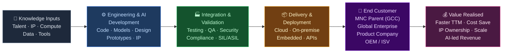

# AI, GCCs & Engineering R&D — Value Chain Analysis

*Prepared: June 2026 | Framework: Porter Value Chain + Five Forces + Gereffi GVC + Blue Ocean*

---

## 0. Segment Definition

### Precise Boundary

This analysis covers three tightly interlocked sub-segments that together constitute India's most strategically important knowledge-services cluster:

1. **AI Platforms, Tools & Services**: Development and deployment of machine-learning models, large language models (LLMs), generative AI applications, AI infrastructure (compute, MLOps, vector databases), and AI-native SaaS delivered to enterprise clients globally. Includes Indian IT majors' AI practices, pure-play AI startups (Sarvam AI, Krutrim, Niramai), and hyperscaler AI services operated from India.

2. **Global Capability Centres (GCCs)**: Captive offshore units established by multinational corporations in India to deliver technology, analytics, finance, legal, and increasingly R&D work for the parent. As of 2025, India hosts **2,100+ GCCs** employing ~2.36 million professionals generating **$64.6 billion** in annual revenue (NASSCOM). Distinct from outsourcing: the work is owned and directed by the MNC parent.

3. **Engineering R&D (ER&D) / Engineering Services**: Outsourced and captive product engineering — embedded software, hardware design, VLSI/chip design, mechanical CAD/CAE, automotive software (ADAS, EV powertrain), aerospace & defence systems, industrial IoT, and semiconductor IP. India's headquartered ER&D service provider market was ~$19–20 billion in FY2025, growing 15–17% CAGR.

**Combined market**: GCC revenue + ER&D outsourcing ≈ **$80–85 billion** as of 2025, on track for $110 billion+ by 2030.

**Out of scope**: Pure IT infrastructure management (data centre ops), BPO/transactional processes, domestic-facing IT services.

---

### Core Product/Service Flow



---

### End Customers and What They Value Most

| Customer Type | What They Value |
|---|---|
| MNC setting up GCC | Cost arbitrage (50–65% vs. Western Europe), STEM talent depth, English proficiency, time-zone overlap with Asia-Pacific |
| Global OEM / Automotive (BMW, Stellantis, GM) | Domain-specialised engineers for SDV, ADAS, EV powertrain; ISO 26262 / ASPICE certification |
| Global ISV / Product company (SAP, Salesforce) | IP co-development, faster product iteration, AI feature infusion |
| Financial services firm | Regulatory-compliant engineering, quant/data science depth, cyber-security posture |
| Semiconductor company (Qualcomm, TI, Intel) | VLSI / chip design, verification, DFT, low-cost silicon validation |

---

### India's Global Position

**India is the undisputed global leader** in GCC hosting and a top-3 destination for ER&D outsourcing.

- **GCCs**: India has ~55% global share of all captive centres; no other single country comes close. China is a distant second (~15%).
- **ER&D outsourcing**: India commands ~25% of the global ER&D outsourcing market; Eastern Europe (Poland, Romania) is competitive in niche verticals but lacks scale.
- **AI**: India is a challenger — strong in AI services and model fine-tuning; nascent in frontier model development. Sarvam AI (India's sovereign LLM) represents an upgrade push.
- **Overall status**: **Leader** in GCC and ER&D services; **Challenger** in AI platforms.

---

## 1. Value Chain Map — Primary Activities

### 1.1 Inbound Logistics

**What it involves**: Acquisition and preparation of the inputs that power engineering and AI delivery — primarily talent, compute infrastructure, IP/tools, and data.

- **Talent pipeline**: Engineering graduates from IITs, NITs, IIITs, and ~6,000 technical colleges produce ~1.5 million engineering graduates annually. GCCs and ER&D firms compete intensely for the top 10–15% who are job-ready.
- **Compute / GPU infrastructure**: Cloud compute from AWS, Azure, GCP; NVIDIA GPUs for AI training. India lacks domestic AI compute at scale, though the IndiaAI Mission has deployed 45,000+ GPUs in a shared public facility. Private players (Yotta Infrastructure, CtrlS) operate GPU clouds.
- **IP and tools**: EDA tools (Synopsys, Cadence, Mentor), CAD/CAE tools (ANSYS, Siemens NX, Dassault CATIA), and AI frameworks (PyTorch, TensorFlow, Hugging Face) are procured from global vendors.
- **Data**: GCCs benefit from parent-company proprietary data; outsourced ER&D firms must rely on synthetic data or client-shared datasets, which is a key constraint for AI model development.

**Key cost drivers**: Talent salaries (50–70% of operating costs), campus recruiting costs, GPU/cloud spend.

**Key differentiation drivers**: Quality of talent (IIT/NIT brand), early campus tie-ups, proprietary learning platforms, speed of onboarding.

**Indian companies active here**:
- TCS (NSE: TCS) — TCS iON for campus hiring; 600,000+ employee pool
- Infosys (NSE: INFY) — Springboard reskilling platform (13M+ learners); Infosys BPM for GCC advisory
- HCL Tech (NSE: HCLTECH) — HCL TechBee for early talent pipeline
- Wipro (NSE: WIPRO) — Topcoder platform for tech talent sourcing
- TeamLease Digital, Xpheno — specialist tech staffing for GCC talent acquisition
- Yotta Infrastructure, CtrlS Datacenters — GPU-enabled cloud for AI workloads (unlisted)

---

### 1.2 Operations

**What it involves**: This is the core value-creation stage — the actual engineering, AI development, and R&D work. It encompasses:

- **Software-Defined Engineering**: Writing firmware, embedded OS, AUTOSAR stacks, middleware for vehicles (KPIT, Tata Elxsi), industrial equipment (Cyient), and aerospace systems (LTTS, Cyient).
- **AI/ML model development**: Training, fine-tuning, and deploying models for enterprise clients. Indian IT majors (TCS, Infosys, Wipro, HCL) have each launched AI platforms — TCS Ignio, Infosys Topaz, Wipro Enterprise AI, HCL AI Force.
- **GCC operations**: The MNC-captive GCCs (Goldman Sachs Bengaluru, JPMorgan India, Microsoft IDC, Google India R&D, Amazon dev centres) perform core product engineering, quant research, cloud infrastructure, and business analytics for their global parents.
- **Chip/VLSI design**: Qualcomm India, Texas Instruments India, Intel India Design Centre perform chip architecture, RTL design, DFT, verification. Pure-play IP firms like Verisilicon India, eInfochips (Arrow subsidiary) serve fabless chip companies.
- **Aerospace & Industrial ER&D**: LTTS (L&T Technology Services) leads in plant engineering and industrial IoT; Cyient serves aerospace (Boeing, Rolls-Royce supply chain) and rail; Tata Elxsi leads in media/broadcast embedded design.

**Key cost drivers**: Engineer cost (significantly below Western levels — senior software architect in India costs $30–50K vs. $120–180K in the US); tool licensing; infrastructure.

**Key differentiation drivers**: Domain depth (automotive ASPICE, aerospace DO-178C certification), AI-augmented productivity, proprietary accelerators, cross-domain expertise (e.g., KPIT's automotive middleware stack), speed of delivery.

**Indian companies active here**:
- **TCS** (NSE: TCS) — AI Cloud, TCS Ignio, GenAI CoE; GCC setup and run services
- **Infosys** (NSE: INFY) — Infosys Topaz AI platform; AI-first GCC model
- **HCL Tech** (NSE: HCLTECH) — HCL AI Force; Engineering R&D division (~35% of revenue)
- **Wipro** (NSE: WIPRO) — Wipro Enterprise AI, Lab45 innovation centre
- **Tech Mahindra** (NSE: TECHM) — Project Indus LLM; AI and automation services
- **L&T Technology Services / LTTS** (NSE: LTTS) — Pure-play ER&D; mobility, industrial, sustainability
- **Tata Elxsi** (NSE: TATAELXSI) — Embedded design, SDV, broadcast & media engineering
- **KPIT Technologies** (NSE: KPITTECH) — Automotive software-defined vehicles; ADAS, EV powertrain
- **Cyient** (NSE: CYIENT) — Aerospace, rail, utilities ER&D
- **Sasken Technologies** (NSE: SASKEN) — Semiconductor, telecom, connected mobility embedded software
- **Persistent Systems** (NSE: PERSISTENT) — AI-led digital engineering; BFSI and healthcare ISV work
- **Qualcomm India** (unlisted) — Chip design; 5G modem, Wi-Fi SoC, AI processor design
- **Texas Instruments India** (unlisted) — Analogue and embedded processor design
- **Microsoft IDC, Hyderabad** (unlisted) — Azure infrastructure, Teams, Office product engineering
- **Google India R&D** (unlisted) — Search, Maps, Android, Cloud AI research
- **Goldman Sachs Bengaluru** (unlisted) — Quant engineering, risk systems, trading platforms
- **JPMorgan India** (unlisted) — Tech, data science, trading technology

---

### 1.3 Outbound Logistics

**What it involves**: In a knowledge-services industry, "outbound logistics" is the delivery of intellectual output to the buyer. This is predominantly digital:

- **Code repositories and CI/CD pipelines**: GitHub Enterprise, GitLab, Azure DevOps — output is merged to the global codebase owned by the MNC parent.
- **API delivery**: AI models deployed as APIs or microservices consumed by the client's product stack.
- **Documentation, certification packages, and test reports**: Critical in ER&D — DO-178C certification artefacts for aerospace, ISO 26262 safety case for automotive, IEC 62443 for industrial systems.
- **IP transfer mechanisms**: In captive GCCs, IP automatically resides with the parent (hierarchy governance). In outsourced ER&D, IP ownership is negotiated — Indian firms retain some background IP; foreground IP often assigned to client.
- **Offshore Delivery Centres (ODCs)**: Physical secure facilities (TCS, Infosys, HCL) running as dedicated client environments with air-gapped networks for sensitive projects (defence, financial systems).

**Key cost drivers**: Network bandwidth and security costs; data residency / sovereignty compliance costs.

**Key differentiation drivers**: Security posture (ISO 27001, SOC2, CMMC for defence); IP protection track record; speed of integration into client's global DevOps flow.

**Indian companies active here**:
- All T1 IT majors (TCS, Infosys, Wipro, HCL, Tech Mahindra) operate structured ODCs with client-specific delivery protocols.
- LTTS, Tata Elxsi — maintain certification expertise as part of delivery (ASPICE, DO-178C).
- STL (Sterlite Technologies), BSNL (for network infrastructure enabling connectivity) — indirectly support delivery.

---

### 1.4 Marketing & Sales

**What it involves**: Winning and expanding client relationships is distinct in AI/GCC/ER&D from typical product industries.

- **Relationship-led enterprise sales**: Long sales cycles (6–18 months for large GCC setups); hunting for new logos vs. mining existing accounts. TCS derives >95% revenue from existing clients.
- **GCC advisory and "Build-Operate-Transfer" (BOT)**: Indian IT firms (Infosys BPM, Wipro, Mphasis) and pure-play GCC enablers (ANSR, Vati Consulting) pitch the GCC setup journey to MNC CXOs.
- **Analyst influence**: Everest Group, ISG, Gartner rankings carry enormous weight. TCS, Infosys and HCL consistently rank in Leaders quadrant; being in the top tier justifies premium pricing.
- **Innovation showcases**: Labs, accelerators, POC-led selling — Infosys Living Labs, TCS Innovation Centres (12 globally), Wipro Lab45.
- **AI-specific GTM**: New dynamic — Indian IT majors competing on AI productivity tools and GenAI implementation speed. Infosys Topaz, TCS AI Cloud, and HCL AI Force are differentiated marketing constructs.
- **NASSCOM as a platform**: NASSCOM events, GCC Summit, and industry reports serve as lead-generation and credibility-building forums for the entire industry.

**Key cost drivers**: Sales force costs (globally-distributed account managers), travel/entertainment, analyst relations, innovation centre maintenance.

**Key differentiation drivers**: Brand rank in analyst reports; AI platform differentiation; Net Promoter Score / client satisfaction; ability to demonstrate measurable ROI from previous engagements.

**Indian companies active here**:
- **TCS** — "Business 4.0" and "AI.Cloud" frameworks; 14 global innovation hubs
- **Infosys** — "Cobalt" (cloud), "Topaz" (AI); dedicated GCC practice
- **HCL Tech** — "HCL AI Force" brand; strong in European manufacturing ER&D
- **Wipro** — "FullStride Cloud"; Lab45 for innovation-led selling
- **ANSR** (unlisted) — Pure-play GCC advisory and enablement platform; has set up 100+ GCCs
- **Zinnov** (unlisted) — GCC and ER&D consulting/advisory; publishes influential market reports
- **Mphasis** (NSE: MPHASIS) — Hyper-personalisation AI for BFSI clients; deep HP Inc. legacy

---

### 1.5 Service (Post-Delivery Support)

**What it involves**: Ongoing support, evolution, and optimisation of what has been built — this is where Indian IT firms earn annuity revenue.

- **Application Managed Services (AMS)**: Running and maintaining software systems built for clients; TCS, Infosys, Wipro generate 30–40% of revenue from AMS.
- **AI model monitoring and retraining**: Production AI systems require drift monitoring, bias auditing, and periodic retraining — an emerging high-margin service.
- **GCC optimisation**: Once a GCC is set up, advisory firms help the centre mature — moving from cost centre to value centre, taking on higher-complexity work, establishing innovation charters.
- **Embedded software maintenance**: KPIT, Tata Elxsi, and LTTS maintain long-term relationships with OEMs for software updates, safety patches, and regulatory compliance (OTA updates for EVs).
- **Cybersecurity services**: Increasingly bundled into ER&D engagements; HCL Tech's Cybersecurity division, Wipro CyberDefense, and LTTS' cybersecurity practice all provide product security services.

**Key cost drivers**: Support engineer costs; tool licensing for monitoring; SLA management overhead.

**Key differentiation drivers**: Speed of incident resolution; proactive AI-driven anomaly detection; depth of embedded knowledge about client systems; certification currency.

**Indian companies active here**:
- TCS (NSE: TCS), Infosys (NSE: INFY), Wipro (NSE: WIPRO), HCL Tech (NSE: HCLTECH) — AMS and AI operations
- KPIT (NSE: KPITTECH), Tata Elxsi (NSE: TATAELXSI) — Automotive software lifecycle management
- Cyient (NSE: CYIENT) — Aerospace software maintenance (Boeing, Airbus supply chain)
- Coforge (NSE: COFORGE) — BFSI platform managed services with AI layer
- Zensar Technologies (NSE: ZENSARTECH) — Application services for mid-market enterprises

---

## 2. Value Chain Map — Support Activities

### 2.1 Firm Infrastructure

**Role**: Governance, financial management, regulatory compliance, and physical infrastructure.

- **Regulatory environment**: India's IT/ITeS sector operates under STPI (Software Technology Parks of India) export-oriented unit scheme, SEZ Act, and DPIIT startup recognition. MeitY governs digital India policy. NASSCOM is the de facto industry association for self-regulation and advocacy.
- **IndiaAI Mission**: Approved with ₹10,372 crore outlay; provides shared GPU compute, funds sovereign LLM development, and supports AI research. Key institution alongside MeitY.
- **Physical infrastructure**: Grade-A tech parks concentrated in Bengaluru (487 GCCs), Hyderabad (273), Delhi NCR (272), Pune, Mumbai, Chennai. GCCs absorbed 29.2 million sq ft of office space in 2024 (+29% YoY).
- **Financial governance**: Listed IT firms face SEBI governance standards; GCC captives follow their parent's global standards (SOX for US-listed MNCs, GDPR for EU parents).
- **PLI for semiconductors**: ₹1.64 lakh crore approved for 12 semiconductor projects; Tata Electronics-PSMC fab in Dholera and Micron ATMP in Sanand directly support the ER&D ecosystem.

**Where Indian firms are strong**: Regulatory compliance expertise; real-estate and facilities management at scale; finance/legal infrastructure for SEZ/STPI operations.

**Where Indian firms are weak**: Sovereign AI compute infrastructure (historically dependent on hyperscalers); domestic EDA tools; domestic GPU manufacturing.

**Key institutions**: NASSCOM, MeitY, STPI, DPIIT, IndiaAI Mission, IESA (India Electronics & Semiconductor Association).

---

### 2.2 Human Resource Management

**Role**: The single most critical support activity in this industry. Talent is the product.

- **Volume**: India produces ~1.5 million engineering graduates annually; estimated 5–7 million software engineers in active employment. STEM quality concentrated in ~200 tier-1 colleges (IITs, NITs, IIITs, BITS Pilani, VIT, Manipal).
- **Specialised talent gap**: India has ~2,500 AI PhDs and deep ML researchers — far below China (~50,000 AI researchers) or the US. This limits frontier model development.
- **Reskilling at scale**: TCS Ignite, Infosys Springboard (13M+ learners globally), Wipro SEED, HCL TechBee — large-scale internal reskilling programmes converting general engineers into AI/cloud-specialised roles.
- **GCC talent competition**: The 2,100+ GCCs compete aggressively for the same talent pool as Indian IT firms; salary inflation in Bengaluru and Hyderabad has been 12–18% CAGR in tech roles. GCCs typically pay 20–30% premium over Indian IT salaries.
- **Attrition challenge**: IT sector attrition peaked at 23–28% during 2021–22; normalised to 12–15% by 2025. ER&D specialists command premium loyalty through project depth.
- **Government support**: IIT expansion (23 new IITs since 2008); ATAL innovation mission; National Education Policy 2020 emphasis on coding; IndiaAI Mission supporting 500 PhD fellows, 5,000 postgraduates, and 8,000 undergraduates in AI.

**Where Indian firms are strong**: Volume of mid-level talent; English proficiency; cost arbitrage; rapid reskilling culture.

**Where Indian firms are weak**: Deep AI research scientists; chip architects; systems programmers for safety-critical domains.

**Key institutions**: IITs, NITs, IIITs, BITS Pilani, NIT Trichy, IISc Bengaluru, IIT Bombay, IIT Delhi (top feeders to GCCs and ER&D firms).

---

### 2.3 Technology Development

**Role**: The R&D and innovation capability that distinguishes leaders from commodity players.

- **AI platform development**: Each T1 IT firm has built a proprietary AI platform — TCS Ignio (cognitive automation), Infosys Topaz (generative AI suite), HCL AI Force, Wipro Enterprise AI (Lab45). These are marketed as accelerators but also serve as capability demonstrations.
- **Patents and IP**: India's IT sector remains IP-light compared to product companies. However, ER&D firms like KPIT, Tata Elxsi, and LTTS are building automotive software IP (middleware stacks, AUTOSAR implementations). LTTS crossed 1,000 patents in FY2025.
- **Sovereign AI**: Sarvam AI selected by the Indian government under IndiaAI Mission to build India's first sovereign LLM. Krutrim (Ola) launched India's first indigenous AI model in 2024, achieved unicorn status.
- **Academic partnerships**: Microsoft Research India (Bengaluru), Google Research India, IBM Research India contribute significant AI research — but primarily benefit parent MNCs, not Indian firms.
- **Open-source contribution**: Infosys, Wipro, TCS contribute to open-source AI/cloud projects but do not set the direction of foundational research.

**Where Indian firms are strong**: AI application development and fine-tuning; domain-specific model training; integration engineering; rapid deployment.

**Where Indian firms are weak**: Foundational model development; GPU architecture; EDA tool innovation; semiconductor process technology.

**Key institutions**: IISc Bengaluru (AI research), IIT Madras (Robert Bosch Centre for AI), IIT Bombay, NASSCOM CoE for AI, C-DAC (PSU for supercomputing and chip design).

---

### 2.4 Procurement

**Role**: Sourcing the tools, cloud services, hardware, and third-party IP that underpin delivery.

- **Cloud hyperscalers**: All large GCCs and IT firms have strategic partnerships with AWS (Amazon Web Services), Microsoft Azure, and Google Cloud. These are both infrastructure providers and strategic partners — TCS is AWS Premier Partner, Infosys is Microsoft Global Partner, HCL has a deep Azure alliance.
- **NVIDIA dependency**: AI training and inference depends heavily on NVIDIA GPUs (H100, A100, H200). India currently cannot manufacture GPUs; NVIDIA's pricing power is significant. The IndiaAI Mission's 45,000-GPU compute facility partially mitigates this for startups.
- **EDA tools duopoly**: Synopsys and Cadence control EDA (Electronic Design Automation) tools used by all semiconductor design centres in India (Qualcomm India, TI India, Sasken, Tata Elxsi). Switching costs are extremely high.
- **Software licensing**: SAP, Oracle, Salesforce, ServiceNow — GCCs managing enterprise platforms procure on behalf of global parent; negotiation leverage lies with the parent MNC.
- **Vendor ecosystem**: Indian IT firms subcontract specialised work to boutique firms and niche domain specialists.

**Where Indian firms are strong**: Volume negotiation leverage with hyperscalers (TCS, Infosys volumes are massive); domestic IT hardware assembly (HPE India, Dell India assembly); low-cost data labelling supply chain.

**Where Indian firms are weak**: No domestic alternative to NVIDIA GPUs; no domestic EDA tools; semiconductor wafer fabrication absent until Tata-PSMC and Micron fabs come online (2026–27).

**Key institutions**: Software Technology Parks of India (STPI) — import duty exemptions on hardware for EOUs; IESA for semiconductor supply chain advocacy.

---

## 3. Five Forces Analysis

### 3.1 Supplier Power — **Medium-High**

The supplier landscape in AI/GCC/ER&D is bifurcated. For talent — the primary input — supplier power is medium: India produces 1.5 million engineering graduates annually, providing structural abundance. However, for AI-specialised talent (LLM researchers, chip architects, autonomous systems engineers), the pool is severely limited, and competition from 2,100+ GCCs, global tech firms, and Indian IT majors creates a genuine wage spiral in niche roles. The second supplier category is technology inputs — here, power is high. NVIDIA controls GPU compute, Synopsys and Cadence control EDA, and the three hyperscalers (AWS, Azure, GCP) are the critical compute and AI-services stack. Indian firms have no domestic alternatives and face significant switching costs. A third-party cloud cost shock or NVIDIA allocation restriction directly impairs delivery capability. The IndiaAI Mission's shared GPU facility partially offsets this for startups, and India's PLI semiconductor scheme (₹1.64 lakh crore approved for 12 projects) is a long-term hedge, but the structural dependency will persist through 2030.

### 3.2 Buyer Power — **Medium-High**

Buyers — primarily MNCs establishing GCCs or outsourcing ER&D — are sophisticated, large-scale, and increasingly educated about the India delivery model. The top 20 GCC parent companies (Apple, Google, Amazon, Goldman Sachs, JPMorgan, Bosch, etc.) individually employ more people in India than most Indian IT firms' entire client-facing teams, giving them enormous leverage in real-estate negotiations, talent poaching, and vendor selection. In outsourced ER&D, global SIs (Accenture, Capgemini, Bosch Engineering) compete on identical services, keeping pricing competitive. However, buyer switching costs are moderately high once a centre is established — accumulated domain knowledge, compliance certifications (ISO 26262, DO-178C), and embedded toolchains make switching painful. The trend toward "AI-first GCCs" and MNCs insisting on AI capabilities from their Indian service providers increases Indian firms' leverage slightly as differentiation on AI delivery becomes a selection criterion.

### 3.3 Threat of New Entrants — **Medium**

The segment presents moderate barriers. Entry into AI services is relatively low-cost — a 50-person AI boutique can compete for mid-market GCC AI projects. Several AI-native startups (Fractal Analytics, Mu Sigma, Tiger Analytics) built significant businesses in analytics. GCC advisory firms like ANSR, Vati Consulting, and GCC Connect have disrupted the traditional Big-4 led GCC setup market with faster, leaner BOT models. For core ER&D delivery requiring ASPICE, DO-178C, or ISO 26262 certification, the barriers are significantly higher — certification takes 3–5 years to build, and client trust in safety-critical domains takes longer. Eastern European boutique ER&D firms (EPAM, Luxoft before its acquisition, SoftServe) represent capable new entrants but are constrained by talent scale vs. India. Capital requirements for large-scale GCC delivery (real estate, infrastructure, security clearances) favour incumbents. Overall, entry into commodity services is easy; entry into high-value certified ER&D and at-scale GCC services is hard.

### 3.4 Threat of Substitutes — **Medium**

The most credible substitutes are alternative talent geographies. Eastern Europe (Poland, Romania, Czech Republic) is a preferred ER&D destination for EU companies due to cultural proximity and EU regulatory alignment — Volvo, BMW, and Continental have significant engineering centres there. Mexico and Colombia are emerging as nearshore options for North American clients wanting time-zone alignment. Southeast Asia (Vietnam, Philippines) competes for lower-complexity IT work. However, none of these geographies can replicate India's combination of scale (2.36 million GCC professionals), English proficiency, STEM depth, cost (30–50% below Eastern Europe for equivalent roles), and time-zone coverage. Automation and AI itself is a structural substitute threat — as AI tools (GitHub Copilot, AI agents) increase developer productivity, fewer engineers are needed for equivalent output. This is the most disruptive substitution risk and Indian IT firms are actively racing to demonstrate that AI augments rather than eliminates Indian delivery teams.

### 3.5 Rivalry Intensity — **High**

Rivalry in AI/GCC/ER&D is intense across all tiers. At the T1 IT level (TCS, Infosys, Wipro, HCL, Tech Mahindra), competition is fierce for large GCC transformation contracts, with differentiation increasingly built on AI platform capabilities and pricing discipline. At the pure-play ER&D level, LTTS, Tata Elxsi, KPIT, Cyient, and Sasken compete directly in overlapping verticals (automotive, aerospace, industrial), with the automotive deceleration in FY2025–26 (EV slowdown among OEMs) intensifying margin pressure. In AI services, hundreds of boutique firms compete, including the Big-4 consulting arms (Accenture Song, Capgemini AI), global SIs, and Indian midcap IT firms. GCC advisory is a growing battlefield with Zinnov, ANSR, EY, Deloitte, and dozens of specialists. Margin pressure is structural — clients routinely run multi-vendor RFPs and use benchmarking reports (Everest, ISG) to drive down rates.

### Five Forces Summary Table

| Force | Rating | Key Driver |
|---|---|---|
| Supplier power (talent + tech) | Medium-High | NVIDIA GPU monopoly; niche talent scarcity; EDA duopoly |
| Buyer power (MNCs, OEMs) | Medium-High | Sophisticated, multi-vendor sourcing; switching costs moderate |
| Threat of new entrants | Medium | Low barrier for AI boutiques; high barrier for certified ER&D |
| Threat of substitutes | Medium | Eastern Europe, SE Asia, AI automation — each limited in scope |
| Rivalry intensity | High | 2,100+ GCCs + T1 IT majors + ER&D pure-plays + global SIs |
| **Overall attractiveness** | **Medium-High** | Scale moat and talent depth outweigh rivalry and supplier concentration |

**Overall Verdict: Medium-High attractiveness.** India's structural advantages — unmatched STEM scale, cost competitiveness, English proficiency, and 30-year accumulated delivery credibility — create a durable pull for global capital. However, margin expansion is constrained by rivalry intensity, AI productivity substitution risk, and dependence on NVIDIA/hyperscaler supply chains. The highest returns will accrue to firms that move up the value ladder toward IP ownership, not commodity delivery.

---

## 4. GVC Governance & India's Position

### Lead Firms

**Global lead firms** setting standards and controlling market access:
- **Accenture** (NYSE: ACN) and **Capgemini** (CAP: Paris) — the dominant global SIs that orchestrate large transformation programmes and subcontract to Indian firms or set up captive GCCs on behalf of clients.
- **Hyperscalers** — AWS, Microsoft Azure, Google Cloud — as platform providers, they govern the AI and cloud infrastructure layer globally and determine which tools and services are "standard."
- **NVIDIA** — as the GPU monopolist, sets the pace and cost structure of AI compute globally.
- **MNC GCC parents** — Apple, Google, Goldman Sachs, JPMorgan, Bosch, Samsung, Qualcomm — these parent firms govern their captive GCCs directly (hierarchy governance).

**Indian lead firms** (within the chain):
- **TCS** ($30.2B revenue, FY2025) — India's largest IT firm; sets delivery standards, commands premium brand, leads GCC advisory through its "Pace Port" innovation network.
- **Infosys** ($19.3B revenue, FY2025) — strongest brand in AI and cloud transformation; its Topaz platform and GCC advisory practice influence industry pricing norms.
- **HCL Tech** ($13.8B revenue, FY2025) — dominant in product engineering (HCL Engineering) and IP partnerships (holds IP revenue-sharing deals with IBM, others).

---

### Governance Type

**Two governance modes operate simultaneously in this segment:**

1. **Captive GCCs → Hierarchy governance**: The parent MNC (Google, Goldman Sachs, Microsoft) fully owns and directs the Indian centre. All IP, decisions, and standards flow from the parent. Indian professionals deliver under parent governance. Value capture is entirely at the parent level.

2. **Outsourced ER&D / IT services → Relational governance**: Long-term, trust-based contracts between Indian IT/ER&D firms and global clients. Standards are co-determined; Indian firms accumulate domain knowledge that creates genuine switching costs and some bargaining power. Value capture is split — but Indian service providers typically earn 12–20% EBITDA margins vs. 25–35% margins at the global lead firm/end product level.

---

### Value Capture Map

```
Global Value Chain — Who Captures Margin?

Stage                          Typical EBITDA Margin    Where captured
──────────────────────────────────────────────────────────────────────
Foundational AI/GPU tech       60–80%                   USA (NVIDIA, OpenAI, Microsoft)
Cloud platforms (IaaS/PaaS)    35–45%                   USA (AWS, Azure, GCP)
IP-owning product companies    25–40%                   USA/Europe (SAP, Salesforce, OEMs)
GCC captive operations         Parent earns full return  USA/Europe (parent treasury)
Indian T1 IT majors            18–24%                   India (TCS, Infosys, HCL)
Pure-play ER&D (KPIT, LTTS)    18–22%                   India
Specialist/niche ER&D          12–18%                   India
Commodity IT staffing          8–12%                    India
```

**Insight**: India captures 18–24% operating margins on services, while the global end-market product companies capture 25–40%+. The gap represents India's upgrade imperative: from delivery to IP co-creation to product ownership.

---

### India's Upgrade Trajectory

India is actively moving — though unevenly — up Gereffi's four upgrading pathways:

| Upgrade Type | Status | Evidence |
|---|---|---|
| **Process upgrading** | Complete | CMM Level 5, ISO certifications, Agile/DevOps at scale — India is benchmark |
| **Product upgrading** | Underway | ER&D firms building automotive middleware IP (KPIT AUTOSAR stack), broadcast SDKs (Tata Elxsi), analytics platforms (Persistent, Fractal) |
| **Functional upgrading** | Early stage | A few GCCs taking on "innovation charters" — Google India R&D (Search AI), Goldman Sachs Bengaluru (quant models), Microsoft IDC (VS Code, Teams features) |
| **Chain upgrading** | Nascent | Sarvam AI (sovereign LLM), Krutrim (India's first AI unicorn) are early chain-upgrading plays; most Indian firms remain service providers, not chain governors |

---

## 5. Key Linkages & Leverage Points

### Critical Linkages

**Linkage 1: Talent pipeline ↔ Delivery quality ↔ Client price premium**
The causal chain is direct: the quality of STEM talent that Indian institutions produce determines whether Indian firms can move into higher-complexity, higher-margin work. When IIT/NIT graduates flow into ER&D vs. ITES, differentiation follows. Weakness: India's top engineering talent increasingly emigrates to the US (H-1B visa holders) or joins hyperscaler GCCs, draining the independent Indian IT firm talent pool.

**Linkage 2: AI tooling adoption ↔ Delivery productivity ↔ Competitive pricing**
Indian IT firms that aggressively deploy AI coding assistants (GitHub Copilot, Amazon CodeWhisperer, internally built tools) achieve 20–35% productivity gains in code generation and testing. This allows them to offer competitive pricing while maintaining or improving margins — or to absorb the AI substitution threat by repurposing engineers to higher-value roles. TCS, Infosys, and Wipro have each publicly committed to reskilling hundreds of thousands of engineers for AI-augmented delivery.

**Linkage 3: GCC maturity ↔ IP co-creation ↔ Indian firm upgrade**
As GCCs mature from cost centres (Year 0–3) to innovation hubs (Year 5–10), they begin generating IP in India. This IP resides with the MNC parent but trained engineers leave and seed the Indian startup/ER&D ecosystem (the "GCC alumni effect"). Microsoft IDC alumni founded multiple AI startups; Google India R&D alumni feed the deep-tech venture ecosystem. This is India's most under-appreciated upgrade mechanism.

**Linkage 4: Government policy ↔ AI compute access ↔ Sovereign capability**
The IndiaAI Mission's 45,000 GPU facility and Sarvam AI's selection as sovereign LLM builder links government policy to AI capability building. Without domestic compute, Indian AI startups are dependent on hyperscaler pricing — which creates margin compression and strategic vulnerability. The PLI for semiconductors (Tata-PSMC, Micron) creates a 5–7 year pathway to partial domestic compute supply.

**Linkage 5: Client concentration ↔ GCC → BOT model → Indian firm revenue**
As more MNCs set up captive GCCs via Build-Operate-Transfer (BOT) through firms like ANSR, EY, and Wipro, the initial revenue stream for Indian IT firms from GCC setup projects grows. However, once BOT transitions to fully captive (Transfer phase), those revenues leave Indian IT firms. This creates a structural tension: Indian IT firms that help clients set up GCCs risk cannibalising their own outsourcing revenue. Managing this transition from outsourcing partner to GCC ecosystem player is the defining strategic challenge for T2 and T3 Indian IT firms.

---

### Single Highest-Leverage Intervention

**Build domain-certified AI platforms with embedded IP.**

The highest leverage point is the intersection of AI productivity tooling and domain IP: Indian ER&D firms that build proprietary, certified AI-assisted engineering tools (e.g., an AI tool that generates AUTOSAR-compliant automotive code with embedded ISO 26262 validation, or a DO-178C-certified avionics code generation assistant) would simultaneously: (a) increase delivery productivity by 30–50%, (b) create switching costs through embedded IP, (c) shift margin capture upstream toward the product layer, and (d) build defensible moats that geography-based competitors cannot easily replicate. KPIT's automotive middleware stack is the closest current example; it needs to be extended with generative AI as the generation layer.

---

## 6. Indian Company Landscape

### Table A — Listed Companies (NSE/BSE)

| Value Chain Stage | Company Name | Listed? | Exchange & Ticker | Business Description | Approx. Revenue / Market Cap | Position in Chain |
|---|---|---|---|---|---|---|
| Operations (AI + GCC services) | Tata Consultancy Services | Yes | NSE: TCS | India's largest IT firm; AI, cloud, GCC advisory and run services across all verticals | Rev: $30.2B (FY25); Mkt cap: ~₹8,90,000 Cr | Leader |
| Operations (AI + GCC services) | Infosys Ltd | Yes | NSE: INFY | Global IT and consulting; AI-first GCC model, Topaz AI platform, cloud transformation | Rev: $19.3B (FY25); Mkt cap: ~₹6,00,000 Cr | Leader |
| Operations (AI + GCC services) | HCL Technologies | Yes | NSE: HCLTECH | Engineering R&D division + AI Force platform; strong in product engineering and IP partnerships | Rev: $13.8B (FY25); Mkt cap: ~₹4,50,000 Cr | Leader |
| Operations (AI + GCC services) | Wipro Ltd | Yes | NSE: WIPRO | Enterprise AI (Lab45), cloud services, GCC advisory; Wipro Enterprise AI stack | Rev: $10.5B (FY25); Mkt cap: ~₹2,70,000 Cr | Challenger |
| Operations (AI + GCC services) | Tech Mahindra | Yes | NSE: TECHM | Project Indus LLM; AI and network services; telecom and manufacturing ER&D | Rev: $6.3B (FY25); Mkt cap: ~₹1,30,000 Cr | Challenger |
| Operations (ER&D — pure play) | L&T Technology Services (LTTS) | Yes | NSE: LTTS | Pure-play ER&D; mobility, industrial, sustainability engineering; 1,000+ patents | Rev: ~$1.3B (FY25); Mkt cap: ~₹40,000 Cr | Leader |
| Operations (ER&D — automotive/media) | Tata Elxsi | Yes | NSE: TATAELXSI | Embedded design for SDV, broadcast, healthcare; Autonomai ADAS platform | Rev: ~₹3,757 Cr (FY26); Mkt cap: ~₹25,000 Cr | Leader |
| Operations (ER&D — automotive software) | KPIT Technologies | Yes | NSE: KPITTECH | Pure-play automotive SDV ER&D; ADAS, EV powertrain middleware; ASPICE Level 3 | Rev: ~₹6,016 Cr (FY25); Mkt cap: ~₹20,358 Cr | Leader |
| Operations (ER&D — aerospace/utilities) | Cyient Ltd | Yes | NSE: CYIENT | Aerospace, rail, utilities ER&D; geospatial services; DLM manufacturing | Rev: ~₹7,000 Cr (FY25 est.); Mkt cap: ~₹15,000 Cr | Leader |
| Operations (ER&D — semiconductor/telecom) | Sasken Technologies | Yes | NSE: SASKEN | Embedded software for semiconductor, telecom, connected mobility; Sasken 5.0 strategy | Rev: ~₹3,340 Mn Q4 FY26 (quarterly); Mkt cap: ~₹3,500 Cr | Niche |
| Operations (AI-led digital engineering) | Persistent Systems | Yes | NSE: PERSISTENT | AI-led digital engineering for BFSI, healthcare, ISV; targeting $2B revenue by FY27 | Mkt cap: ~₹90,000 Cr (Dec 2025); Leader |
| Operations (BFSI + AI) | Coforge Ltd | Yes | NSE: COFORGE | BFSI platform services with AI layer; strong in insurance and travel tech | Mkt cap: ~₹66,000 Cr | Challenger |
| Operations (BFSI + AI) | Mphasis Ltd | Yes | NSE: MPHASIS | Hyper-personalised AI for BFSI; deep HP Inc. legacy; cloud-native services | Mkt cap: ~₹43,000 Cr | Challenger |
| Operations (mid-market IT + AI) | Birlasoft Ltd | Yes | NSE: BSOFT | SAP, Oracle, cloud ERP services for mid-market manufacturing clients | Mkt cap: ~₹8,400 Cr | Niche |
| Service (managed services) | Zensar Technologies | Yes | NSE: ZENSARTECH | Application management and digital transformation for mid-market; RPG Group subsidiary | Rev: ~₹5,000 Cr (est.); Mkt cap: ~₹10,000 Cr | Niche |

---

### Table B — Unlisted / Private Companies (GCCs and Enablers)

| Value Chain Stage | Company Name | Listed? | Parent / Ownership | Business Description | Scale (Employees / Revenue est.) | Position in Chain |
|---|---|---|---|---|---|---|
| Operations (BFSI GCC) | Goldman Sachs India (Bengaluru + Hyderabad) | No | Goldman Sachs Group (NYSE: GS) | Quant research, trading technology, risk systems, data engineering for global Goldman Sachs | ~9,000–10,000 employees; one of GS's largest global offices | Leader (captive) |
| Operations (BFSI GCC) | JPMorgan India (Mumbai + Bengaluru + Hyderabad) | No | JPMorgan Chase (NYSE: JPM) | Technology, data science, trading systems, AI/ML for global JPMC; India is largest GCC by headcount | ~60,000 employees; JPMC's largest non-US location | Leader (captive) |
| Operations (Cloud/AI GCC) | Microsoft India Development Centre | No | Microsoft Corp (NASDAQ: MSFT) | Azure cloud, VS Code, Teams, Office 365 product engineering and AI research | ~20,000+ employees; Hyderabad + Bengaluru + Noida | Leader (captive) |
| Operations (AI/Search GCC) | Google India R&D | No | Alphabet Inc (NASDAQ: GOOGL) | Search, Maps, Android, Cloud AI, Bard/Gemini engineering; one of largest Google R&D hubs outside US | ~10,000+ employees; Hyderabad + Bengaluru | Leader (captive) |
| Operations (E-commerce/Cloud GCC) | Amazon India Development Centres | No | Amazon.com (NASDAQ: AMZN) | AWS engineering, Alexa, Kindle, supply chain tech, e-commerce platform development | ~60,000+ employees; Hyderabad + Chennai + Bengaluru | Leader (captive) |
| Operations (Retail Tech GCC) | Walmart Global Tech India | No | Walmart Inc (NYSE: WMT) | E-commerce platform, supply chain AI, data analytics for global Walmart; second India GCC launched 2025 | ~15,000+ employees; Bengaluru + Chennai | Leader (captive) |
| Operations (Semiconductor GCC) | Qualcomm India | No | Qualcomm Inc (NASDAQ: QCOM) | 5G modem SoC design, Wi-Fi chip design, AI processor architecture; one of Qualcomm's largest R&D hubs | ~5,000+ chip engineers; Hyderabad + Bengaluru | Leader (captive) |
| Operations (Semiconductor GCC) | Texas Instruments India | No | Texas Instruments (NASDAQ: TXN) | Analogue IC design, embedded processor (Sitara, C28x) design; Bengaluru centre is TI's 2nd largest globally | ~4,000+ engineers; Bengaluru | Leader (captive) |
| Operations (Aerospace/Industrial GCC) | Honeywell Technology Solutions India | No | Honeywell International (NASDAQ: HON) | Software and engineering for aerospace avionics, industrial automation, cybersecurity | ~19,000+ employees; Bengaluru + Hyderabad | Leader (captive) |
| Marketing & Sales (GCC advisory) | ANSR Source | No | Private (PE-backed) | Pure-play GCC setup, advisory, and BOT services; has established 100+ GCCs in India | Not publicly disclosed | Leader (niche) |
| Marketing & Sales (GCC/ER&D advisory) | Zinnov | No | Private | Strategy consulting and research for GCCs and ER&D; publishes authoritative market reports | Not publicly disclosed | Leader (niche) |
| Operations (AI — sovereign LLM) | Sarvam AI | No | Private (VC-backed; Series B at $1.5B valuation) | India's sovereign LLM developer; selected by IndiaAI Mission; Indic language models | Valuation: $1.5B (unicorn as of 2025) | Emerging |
| Operations (AI — indigenous model) | Krutrim (Ola AI) | No | Ola / Bhavish Aggarwal | India's first AI unicorn; indigenous LLM, AI chips (Krutrim-1 chip announced) | Valuation: $1B+ (unicorn Jan 2024) | Emerging |
| Inbound (GPU cloud infra) | Yotta Infrastructure | No | Hiranandani Group | GPU-enabled data centres and AI cloud for enterprise and GCC clients | Not publicly disclosed; 2 campuses in Mumbai and Noida | Emerging |

---

### Notable Companies — Deeper Notes

**KPIT Technologies (NSE: KPITTECH)**
- Stage in chain: Operations — pure-play automotive ER&D
- What makes them interesting: KPIT is India's most focused bet on the Software-Defined Vehicle megatrend. Unlike diversified ER&D firms, 100% of KPIT's revenue comes from automotive clients (Toyota, Volkswagen, GM, Stellantis). Their AUTOSAR-based middleware stack is embedded in production EVs and ADAS systems globally, creating deep switching costs. They have ASPICE Level 3 certification — one of only a handful of Indian firms with this credential. The automotive software market is structurally growing (from ~$50B global in 2024 to $100B+ by 2030) as software content per vehicle rises from $500 to $5,000+.
- Key financials: Revenue ~₹6,016 Cr (FY25); EBITDA margin ~21%; Market cap ~₹20,358 Cr (June 2026)
- Watch factor: Auto OEM R&D budget cuts in FY2025–26 (EV investment moderation) are a near-term headwind; recovery tied to OEM capex cycle resumption.

**Tata Elxsi (NSE: TATAELXSI)**
- Stage in chain: Operations — design-led ER&D and embedded software
- What makes them interesting: Tata Elxsi is India's premium design and engineering brand, operating at the intersection of aesthetic design, embedded software, and AI. Their "Autonomai" ADAS platform and SDV architecture practice are marquee offerings. Unlike most ER&D firms that compete on cost, Tata Elxsi competes on design quality and IP depth — serving premium OEMs (BMW, Jaguar Land Rover) and broadcast equipment makers (Warner Bros. Discovery, Sky) that value innovation over pure cost savings. Their EBITDA margins (~30%+) are among the highest in Indian IT.
- Key financials: Revenue ~₹3,757 Cr (FY26 annual); Mkt cap ~₹25,095 Cr (down 36% in 1 year due to client concentration risk)
- Watch factor: High client concentration (top 5 clients = 50%+ revenue); JLR/automotive recovery is the key re-rating trigger.

**Infosys (NSE: INFY)**
- Stage in chain: Operations + Marketing & Sales — GCC advisory and AI-first transformation
- What makes them interesting: Infosys is the most strategically sophisticated of the T1 Indian IT firms in the AI/GCC space. Their "AI-first GCC model" — where Infosys positions itself not just as a GCC setup consultant but as the AI platform and managed services layer for the GCC — is a bid to capture annuity revenue from MNC captives rather than lose them to full captivity. Infosys BPM was recognised as a Leader in ISG's GCC Services 2025 report. Infosys Topaz (generative AI suite) and Springboard reskilling platform (13M+ learners) are genuine differentiators. Revenue guidance of 4.5–5% growth in FY25 reflects macro headwinds but the AI funnel is building.
- Key financials: Revenue $19.3B (FY25); Operating margin 20.8% (Q1 FY26); Mkt cap ~₹6,00,000 Cr
- Watch factor: Large deal wins in AI transformation — the pipeline of $2B+ AI mega-deals being run by Infosys is the leading indicator of sustained growth.

**L&T Technology Services / LTTS (NSE: LTTS)**
- Stage in chain: Operations — pure-play ER&D across mobility, industrial, sustainability
- What makes them interesting: LTTS is a rare Indian ER&D firm with genuine multi-vertical diversification — automotive, aerospace, industrial, medical devices, and sustainability (clean energy, smart cities). Their L&T parentage gives them access to large industrial projects (L&T's core EPC clients), which is unusual for an ER&D firm. LTTS crossed 1,000 patents in FY25 — a signal of genuine IP accumulation. Their "LTTS 3.0" strategy targets $1.5B revenue by FY27 through large deal focus and AI-embedded engineering.
- Key financials: Revenue ~$1.29B TTM (Sept 2025); Q4 FY25 grew 12.4% QoQ; Mkt cap ~₹40,000 Cr
- Watch factor: Large deal conversion (>$50M TCV) in AI-embedded sustainability engineering is the growth catalyst.

**Sarvam AI (Private; Unicorn)**
- Stage in chain: Technology development — sovereign AI, Indic LLM
- What makes them interesting: Sarvam AI is India's highest-stakes bet on the sovereign AI value chain. Selected by the IndiaAI Mission to build India's first homegrown LLM, Sarvam has raised $234M at a $1.5B valuation. Their focus on Indic languages (22 scheduled languages of India) addresses a genuine market gap — India's 900M non-English-first internet users. If successful, Sarvam creates India's first AI platform business (rather than services business) — a fundamental shift in value capture from delivery to IP.
- Key financials: Valuation $1.5B (Series B, 2025); revenue not disclosed (pre-revenue/early revenue stage)
- Watch factor: Transition from model capability demonstration to paying enterprise revenue; competition from Meta's multilingual Llama and Google's Gemini Indic fine-tunes.

**JPMorgan India (GCC)**
- Stage in chain: Operations — BFSI GCC, quant engineering, AI/ML
- What makes them interesting: JPMorgan's India operation (~60,000 employees) is now JPMorgan Chase's single largest non-US location, handling everything from trading systems and quant models to regulatory technology and consumer banking AI. India is no longer an outsourcing partner for JPMorgan — it is a core delivery node in the global operating model. The India GCC generates what is effectively a 60–65% cost saving vs. equivalent US headcount, saving JPMorgan billions annually. JPMorgan India engineers co-own significant trading and risk IP. This is the model all global financial firms are racing to replicate.
- Scale: ~60,000 employees; Mumbai + Bengaluru + Hyderabad + Kolkata + Chennai
- Watch factor: AI agents being deployed in quant and legal functions — the India headcount trajectory into 2027 is a bellwether for white-collar AI displacement.

---

## 7. Strategic Insight

### Non-Obvious Insight from the Chain Analysis

**The GCC model is India's Trojan horse for functional upgrade — but Indian IT firms are on the outside of the gates.**

The most counter-intuitive finding from this value chain is that the GCC boom — typically celebrated as India's success story — is simultaneously the biggest structural threat to independent Indian IT services firms. Each GCC set up by a Goldman Sachs, JPMorgan, or Microsoft pulls work that would previously have been outsourced to TCS or Infosys into a captive model. The $64.6 billion GCC revenue base is almost entirely captured by the MNC parent's global P&L, not by Indian firms. Indian IT majors are relegated to advisory and enablement roles — with ANSR, EY India, and Capgemini's Indian arms winning BOT contracts that ultimately transfer the revenue-generating centre back to the client.

The implication is that India's GDP contribution from the GCC sector is real (2.36 million jobs, real-estate absorption, tax revenue), but the economic rent accrues predominantly to US and European shareholders. Indian IT firms must move from being GCC enablers to building their own SaaS and AI platform businesses that sell into GCC operating models — becoming the tool provider (NVIDIA-equivalent) rather than the service provider (contract manufacturer-equivalent).

---

### Blue Ocean Opportunity — Four Actions Framework

**Opportunity: "Certified AI Engineering Platform" — a domain-AI platform for safety-critical product development**

| Action | Application |
|---|---|
| **Eliminate** | Eliminate the human-intensive manual certification document generation (DO-178C, ISO 26262, IEC 62443) that currently requires hundreds of engineer-hours per product release |
| **Reduce** | Reduce the number of engineers needed for regression testing and validation cycles by 60–70% through AI-driven test generation and automated safety case construction |
| **Raise** | Raise the bar on IP ownership — instead of delivering billable hours, build a SaaS platform that engineering teams pay a subscription to use; shift from time-and-materials billing to outcome-based pricing |
| **Create** | Create an entirely new market segment: "AI-certified engineering" — where the AI platform itself carries pre-approved compliance credentials (avionics, automotive, industrial) and can generate certification artefacts that regulators accept, collapsing time-to-certification from 3 years to 6 months |

**Who could execute this**: KPIT (automotive focus), Tata Elxsi (broadcast/medical), LTTS (industrial/aerospace), or a well-funded AI startup with domain expertise. The platform must be built on top of a fine-tuned LLM trained on safety-critical code patterns, relevant standards (MIL-STD, DO-178C, ISO 26262 corpora), and historical certification artefacts.

---

### Top 3 Priorities for an Indian Firm Building Durable Advantage

**Priority 1: Own Domain IP, Not Just Delivery Capacity**
The margin gap between Indian service delivery (18–22% EBITDA) and global product companies (30–40%) can only be closed by owning IP. This means transitioning from "we build what you specify" to "we co-own what we build." KPIT's automotive middleware approach is the model. The firm must invest 8–12% of revenue in IP development, accept short-term margin dilution, and secure background IP retention clauses in contracts.

**Priority 2: Build an AI Productivity Flywheel — and Market It**
Every 10% improvement in AI-augmented delivery productivity either: (a) expands margin (if pricing holds), or (b) improves win rates (if pricing is passed through). Indian firms that are 20–30% more productive than Eastern European competitors due to AI tooling lock in the cost-arbitrage advantage for another decade. TCS, Infosys, and Wipro are all racing here — but mid-size ER&D firms (KPIT, Tata Elxsi, Persistent) have an opportunity to be more agile in AI tool adoption, as they are not burdened by the legacy workforce management challenges of 100,000+ employee firms.

**Priority 3: Invest in Certification and Regulatory Moats**
ISO 26262 ASPICE Level 3, DO-178C DAL-A, IEC 62443, FDA 21 CFR Part 11 — these certifications take 3–5 years to build and create genuine barriers to entry in safety-critical ER&D. Indian firms that hold multiple certifications across multiple verticals (automotive + aerospace + medical) can charge 30–50% price premiums over non-certified competitors and are nearly impossible to displace for in-production programmes. LTTS, Tata Elxsi, KPIT, and Cyient have built this moat in their primary verticals; the strategic priority is to cross-certify into adjacent verticals.

---

## 8. Value Chain Diagram (Mermaid)

```mermaid
flowchart LR
    subgraph SUPPORT["⚙️ Support Activities"]
        direction TB
        FI["🏛️ Firm Infrastructure\nNASSCOM · MeitY · STPI\nIndiaAI Mission · DPIIT\nSEZ · PLI Semiconductor"]
        HR["👥 HR Management\nIITs · NITs · IIITs · IISc\nTCS Ignite · Infosys Springboard\nGCC Talent War · 2.36M professionals"]
        TD["🔬 Technology Development\nTCS Ignio · Infosys Topaz\nHCL AI Force · KPIT AUTOSAR IP\nSarvam AI LLM · Krutrim\nLTTS 1000+ Patents"]
        PR["📦 Procurement\nNVIDIA GPUs · AWS/Azure/GCP\nSynopsys · Cadence EDA\nMicrosoft · SAP · ServiceNow"]
    end

    subgraph PRIMARY["🔄 Primary Activities"]
        direction LR
        IL["📥 Inbound Logistics\n---\nTalent: TCS · Infosys · HCL\nCompute: Yotta · CtrlS\nIP/Tools: via global vendors\nData: client-shared / synthetic"]
        OP["⚙️ Operations\n---\nT1 IT: TCS · INFY · HCLT · WIPRO\nER&D: LTTS · TATAELXSI\nKPITTECH · CYIENT · SASKEN\nGCC Captives: MSFT · GOOGL\nJPM · GS · AMZN · WMT · QCOM\nAI Startups: Sarvam · Krutrim"]
        OL["📤 Outbound Logistics\n---\nCode/API delivery: all majors\nCertification artefacts:\nLTTS · TATAELXSI · CYIENT\nODCs: TCS · INFY · WIPRO\nIP transfer: GCC → parent"]
        MS["📣 Marketing & Sales\n---\nGCC advisory: INFY BPM · EY\nANSR · Zinnov · Capgemini\nAnalyst ranking: Everest/ISG\nInnovation labs: TCS Pace Port\nInfosys Living Labs · Wipro Lab45"]
        SV["🔧 Service\n---\nAMS: TCS · INFY · WIPRO · HCLT\nAuto SW lifecycle: KPIT · TATAELXSI\nAerospace maint: CYIENT\nBFSI managed: COFORGE · MPHASIS\nAI model ops: PERSISTENT"]
    end

    IL --> OP --> OL --> MS --> SV

    SUPPORT -.-> IL
    SUPPORT -.-> OP
    SUPPORT -.-> OL
    SUPPORT -.-> MS
    SUPPORT -.-> SV

    subgraph MARGIN["💰 Value Capture (EBITDA margin range)"]
        direction TB
        M1["🔴 Foundational AI/GPU: 60–80%\n(NVIDIA · OpenAI — USA)"]
        M2["🟠 Cloud Platforms: 35–45%\n(AWS · Azure · GCP — USA)"]
        M3["🟡 IP-owning Product Co: 25–40%\n(SAP · Salesforce · OEMs — USA/EU)"]
        M4["🟢 Indian T1 IT + Pure-play ER&D: 18–24%\n(TCS · INFY · KPIT · LTTS — India)"]
        M5["🔵 Commodity IT/Staffing: 8–12%\n(lower-tier vendors — India)"]
    end

    style IL fill:#1e3a5f,stroke:#3b82f6,color:#bfdbfe
    style OP fill:#14532d,stroke:#22c55e,color:#bbf7d0
    style OL fill:#713f12,stroke:#f59e0b,color:#fef3c7
    style MS fill:#831843,stroke:#ec4899,color:#fce7f3
    style SV fill:#3b0764,stroke:#a855f7,color:#e9d5ff
    style SUPPORT fill:#0f172a,stroke:#475569,color:#cbd5e1
    style PRIMARY fill:#0f172a,stroke:#475569,color:#cbd5e1
    style FI fill:#1e293b,stroke:#64748b,color:#e2e8f0
    style HR fill:#1e293b,stroke:#64748b,color:#e2e8f0
    style TD fill:#1e293b,stroke:#64748b,color:#e2e8f0
    style PR fill:#1e293b,stroke:#64748b,color:#e2e8f0
    style MARGIN fill:#0f172a,stroke:#475569,color:#cbd5e1
    style M1 fill:#7f1d1d,stroke:#ef4444,color:#fecaca
    style M2 fill:#78350f,stroke:#f97316,color:#fed7aa
    style M3 fill:#713f12,stroke:#eab308,color:#fef9c3
    style M4 fill:#14532d,stroke:#22c55e,color:#bbf7d0
    style M5 fill:#1e3a5f,stroke:#60a5fa,color:#bfdbfe
```



---

## Sources & Data References

- NASSCOM GCC Annual Report 2024; NASSCOM GCC Quarterly Landscape Report 2025
- Zinnov-NASSCOM Mid-Market GCC Report 2025
- Mordor Intelligence: India ER&D Services Market Report 2031
- IMARC Group: India AI Market Report 2034
- Grand View Research: India Generative AI Market 2024–2030
- IndiaAI.gov.in: IDC India AI Market Report; IndiaAI Mission press releases
- MeitY 2024 Review (MediaNama, January 2025)
- LTTS Q4FY25 Press Release (ltts.com); LTTS revenue per stockanalysis.com
- KPIT Technologies Annual Report FY25; KPIT Investor Relations (kpit.com)
- Tata Elxsi financials per Screener.in
- Persistent Systems: stockanalysis.com market cap data
- Coforge, Mphasis market cap per stockanalysis.com
- Birlasoft market cap per stockanalysis.com
- TCS/Infosys/HCL/Wipro/TechM FY25 revenue per ICRA IT Sector Report December 2024 + company filings
- Sarvam AI unicorn announcement (newskart.com, 2025)
- Krutrim unicorn announcement (January 2024)
- EY/KPMG/Accenture GCC advisory rankings per ISG Provider Lens GCC Services 2025
- PIB India: Semiconductor PLI approvals; IndiaAI Mission GPU facility details
- Ceipal: GCC Statistics Deep Dive 2025
- GCC Journal: Complete list of GCCs in India 2026

*Analysis prepared: June 2026. All financial figures are estimates based on publicly available data; market caps as of June 2026.*
