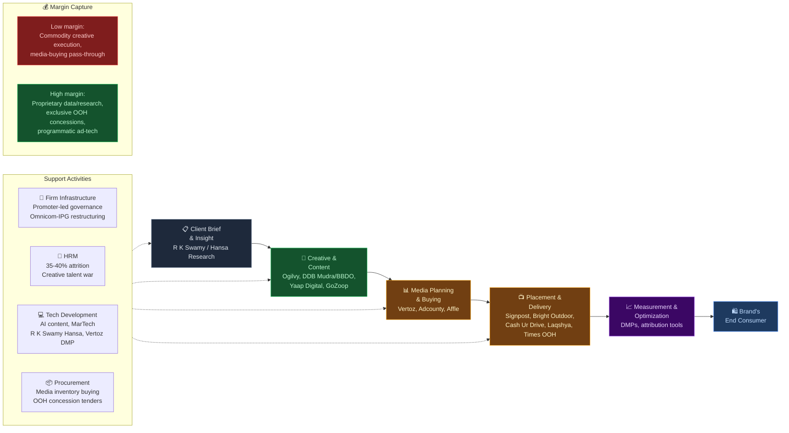

# Advertising & Media Agencies — India Value Chain Analysis

---

## 0. Segment definition

**Boundary**: This analysis covers firms that plan, create, buy, place, and measure advertising and marketing communications on behalf of brands/advertisers — full-service and digital creative agencies, media planning & buying houses, market research firms serving advertisers, out-of-home (OOH) and digital-out-of-home (DOOH) operators, PR/experiential/event agencies, and ad-tech/programmatic platforms that serve agencies and advertisers directly. It **excludes** the underlying media owners themselves (TV broadcasters, print publishers, Google/Meta, cinema chains) — those sit in a separate "media & entertainment content" chain — except where an OOH company is simultaneously the agency *and* the owner-operator of physical inventory, which is the dominant model in Indian OOH.

**Core flow**:

**End customer**: The advertiser/brand (FMCG, e-commerce, auto, BFSI, consumer durables, etc.). What they value most: reach and measurable ROI, creative differentiation, speed to market, and increasingly, first-party data/attribution given rising privacy regulation.

**India's global position**: **Follower/challenger** in creative excellence (large domestic market, historically network-agency-led, but not a global creative-export hub); **nascent-to-moderate** in ad-tech/programmatic infrastructure, where Google and Meta hold a 64% duopoly share of India's digital ad revenue and Indian ad-tech players (Vertoz, Adcounty, Affle) largely compete downstream or export their platforms internationally rather than displacing the duopoly. The chain is overwhelmingly **domestic-facing** — India serves its own ~₹1.64 lakh crore ad market rather than exporting agency services globally, the reverse of India's position in IT services or pharma.

---

## 0.5 Quick Scan — Investable Listed Companies

| Company | Ticker | Cap Bucket | Chain Stage | One-Line Investment Thesis | Coverage |
|---|---|---|---|---|---|
| Signpost India Ltd | NSE/BSE: SIGNPOST | Small (~₹1,670 Cr) | OOH/DOOH | Largest listed DOOH consolidator; reverse-merger listing route means it's mispriced as a legacy shell, not as a concession-moat growth story | Under-researched |
| Bright Outdoor Media Ltd | BSE SME → migrating to Mainboard (2026) | Small (~₹831 Cr) | OOH/DOOH | 45-year Mumbai OOH incumbent about to get institutional-eligible liquidity via mainboard migration | Under-researched |
| R K Swamy Ltd | NSE/BSE: RKSWAMY | Micro/Small border (~₹500-530 Cr) | Full-service IMC + Market Research | Only listed integrated Indian agency group with a proprietary research arm (Hansa); FY25 margin collapse may be bottoming out (Q4FY26 recovery) | Under-researched |
| Cash Ur Drive Marketing Ltd | NSE SME: CUDML | Micro (~₹327 Cr) | OOH/Transit (vehicle branding) | Capital-light transit-OOH niche compounding PAT >90% YoY with zero analyst coverage | Undiscovered |
| Yaap Digital Ltd | NSE SME: YAAP | Micro (~₹356 Cr) | Digital/AI content agency | Rare listed "AI-first" agency positioning ahead of the in-housing/AI-substitution risk hitting peers | Undiscovered |
| Vertoz Ltd | NSE/BSE: VERTOZ | Micro (~₹330 Cr) | Ad-tech/Programmatic | ~90% revenue international — effectively a global adtech micro-cap mispriced as an "India ad agency" | Under-researched |
| Adcounty Media India Ltd | BSE SME: 544435 | Micro (SME) | Ad-tech/Programmatic | Global-footprint programmatic platform (India/UAE/SEA/LatAm/Europe) growing PAT fast off a small base | Undiscovered |
| Affle (India) Ltd | NSE/BSE: AFFLE | Large (approx — verify current cap) | Mobile ad-tech | Largest, most liquid listed proxy for India-origin ad-tech; useful benchmark, not the under-researched idea | Well-covered |
| Value 360 Communications Ltd | NSE SME (2026 IPO) | Micro (SME) | PR + digital/influencer | PR-origin integrated comms group with an influencer platform (ClanConnect) — a genuinely new listed sub-category | Undiscovered |
| Pramara Promotions Ltd | NSE/BSE: PRAMARA | Micro (~₹192 Cr) | Promotional marketing (adjacent) | Loyalty/merchandise-led marketing services, adjacent to core agency chain | Undiscovered |
| Simca Advertising Ltd | Ticker unconfirmed | Micro (~₹214 Cr) | Full-service ad agency | Small listed traditional agency; thin public information | Undiscovered |
| Chatterbox Technologies Ltd | NSE/BSE: 544546 | Micro (~₹82 Cr) | Digital/tech-marketing | Small tech-enabled marketing services firm | Undiscovered |
| Crayons Advertising Ltd | BSE: 543941 (ticker unconfirmed) | Micro (~₹70 Cr) | Full-service ad agency | Micro-cap traditional agency | Undiscovered |
| Graphisads Ltd | Ticker unconfirmed | Micro (~₹53 Cr) | Outdoor/signage | Small signage/OOH-adjacent player | Undiscovered |
| Laqshya Media Ltd | Filed for NSE Emerge IPO (₹58.04 Cr, pending) | Not yet listed | OOH/DOOH | Major private OOH player (Sri Lanka/UAE presence) about to become a direct listed Signpost/Bright Outdoor comp | Pending listing |

**Cap-bucket read**: The most under-researched opportunity right now sits in the **Small-to-Micro OOH/DOOH bucket** (Signpost, Bright Outdoor, Cash Ur Drive) — these are capital-intensive, concession-protected businesses trading with effectively zero formal analyst coverage despite genuine structural moats (exclusive government/PPP contracts) that a boutique digital agency can never replicate. The **Micro ad-tech bucket** (Vertoz, Adcounty) is a close second — both look like "small Indian agencies" on a screener but are largely global-revenue businesses mispriced on a domestic-agency multiple.

---

## 1. Value chain map — primary activities

### Inbound logistics
Client briefs, brand guidelines, consumer/market research data, and media-inventory rate cards (from TV networks, Google/Meta, OOH site owners) flow in. **Cost/differentiation driver**: proprietary consumer data and audience analytics beat generic secondary research; scale unlocks better media-inventory rates. **Companies**: R K Swamy (via Hansa Research and Hansa Customer Equity subsidiaries), Value 360 Communications (Irida Interactive — influencer/audience data), Vertoz and Adcounty (data management platforms feeding programmatic buys).

### Operations
Creative concepting, content production (video/photo/AI-generated), campaign development, and — distinctively in Indian OOH — physical network build and maintenance (hoardings, digital LED screens, vehicle branding installation). **Cost/differentiation driver**: creative talent quality vs. process efficiency for agencies; capex efficiency per site and asset-utilisation rates for OOH. Generative AI is actively compressing this activity's cost base (client examples: Mondelez's 500,000+ AI-generated Cadbury Silk videos, Godrej Consumer's Lightbox/MASH tools) — a direct threat to labour-heavy agency operations. **Companies**: Yaap Digital (AI-first "Design-Discovery-Distribution" model, acquiring GoZoop Online for scale), Ogilvy India/DDB Mudra (now folding into TBWA\Lintas)/BBDO Group (unlisted network creative), Signpost India/Bright Outdoor Media/Cash Ur Drive Marketing (physical OOH asset operations).

### Outbound logistics
Media buying and placement across channels — programmatic ad exchanges (Vertoz's SSP/DSP, Adcounty's platform), direct OOH site delivery, and traditional TV/print booking. **Cost/differentiation driver**: exclusivity of inventory (airport/metro concessions held by Times OOH, Laqshya Media, Signpost's Bagdogra Airport rights to 2029) and programmatic yield-optimisation technology. Negotiating leverage is structurally weak against the Google/Meta duopoly (64% of India's digital ad revenue), compressing margins for pure digital media-buying arms.

### Marketing & sales
The agencies' own client acquisition — now largely **consultant-run pitch processes** taking 8-12 weeks (up from 6-8), with procurement teams treating agency services as commoditised and pitch fees frequently waived even when nominally charged. **Differentiation**: brand reputation/creative awards, long incumbency relationships (e.g., Lowe Lintas' 30-year Tanishq relationship), and — in OOH specifically — government/airport-authority relationships that determine who wins concession tenders.

### Service
Post-campaign reporting, optimisation, and retainer renewal; for OOH operators, site-uptime guarantees to both advertisers and the concession-granting authority (airport operators, metro corporations, municipal bodies). Concession **non-renewal risk** sits here — a single lost tender (e.g., an airport or metro contract) can materially swing an OOH operator's revenue.

**Conglomerate check**: The one major conglomerate-scale presence in this chain is the **Times Group (Bennett Coleman & Co.)**, which privately owns Times OOH — India's largest airport/metro OOH operator — giving it exclusivity over premium transit inventory (e.g., Mumbai Metro Line 3, Chennai airport). No direct evidence was found of Reliance, Tata, Aditya Birla, Adani, or Zee operating a listed advertising-agency business (Adani appears only as a *client* of Yaap Digital, not an operator; Zee is a broadcaster, not an agency). Because Times OOH is private, the listed OOH names (Signpost, Bright Outdoor, Cash Ur Drive) are effectively the **only public-market access point** to India's concession-based OOH economics.

---

## 2. Value chain map — support activities

### Firm infrastructure
Listed agencies carry heavy promoter concentration — R K Swamy's promoters hold ~69.6%; Signpost India's promoters (Dipankar Chatterjee, Shripad Ashtekar) held 74.25% as of March 2025, declining to 60.38% by March 2026. Globally, the 2025 Omnicom–IPG merger (~$13 billion) triggered a major India-level restructuring: legacy IPG brands DDB, MullenLowe and FCB are being retired, Lintas relaunched as **TBWA\Lintas**, and Ulka/Mudra folded into a newly formed **BBDO Group** — reported to have caused real leadership friction and client-facing uncertainty.

### HRM
The single biggest support-activity weakness in this chain: **35-40% annual attrition** among creative/media talent, with entry-level salaries (₹10-12 lakh) roughly half of what B-school graduates now expect from "new-age" employers. Boutique/digital and ad-tech players (Yaap, Vertoz) run leaner, more tech-enabled teams; OOH operators (Signpost, Cash Ur Drive) rely more on sales and city-network operations staff, partially insulating them from the creative-talent crisis.

### Technology development
The most active differentiation battleground today. AI content generation (client-side: Mondelez, Godrej, HUL's "Sangam" platform cutting media-planning cycles from 25 to 5 days), programmatic ad-tech (Vertoz, Adcounty, Affle), MarTech/data analytics (R K Swamy's Hansa Customer Equity), and AI-driven DOOH targeting (Signpost) are all actively re-rating (or threatening) different players in the chain.

### Procurement
Media-inventory buying (rate negotiation with TV networks, Google/Meta, OOH landlords/government authorities) and OOH capex procurement (LED screens, hoarding structures, vehicle-branding materials). **Concession tenders are the single biggest procurement lever in OOH** — winning or losing an airport/metro tender changes an operator's revenue base overnight, more than any input-cost negotiation.

---

## 3. Five Forces + Capital Cycle analysis

### Part A — Five Forces

**Supplier power (High)**: Bifurcated across three inputs. Creative/media talent is scarce and increasingly expensive to retain (35-40% attrition). Digital media inventory is controlled by a Google/Meta duopoly holding 64% of India's digital ad revenue, leaving agencies as price-taking intermediaries. OOH site access is gated by government/PPP concession authorities (airport operators, metro corporations, municipalities) who set tender terms and revenue-share splits.

**Buyer power (High)**: Large FMCG, e-commerce and BFSI advertisers now run consultant-led, procurement-driven pitch processes (8-12 weeks), treat agency services as a commoditised input, and increasingly retain the option to in-house at will — 66% of major MNC brands already run an in-house agency, with 21% more considering one.

**Threat of new entrants (Medium, bifurcated)**: Very low capex for boutique/digital/performance-marketing agencies (a laptop and a portfolio) keeps that end of the market highly contestable. Very high barriers in OOH/DOOH, where winning a long-tenure exclusive government concession (airport, metro) requires large upfront capex, balance-sheet strength, and institutional relationships that new entrants cannot easily replicate.

**Threat of substitutes (High)**: The single biggest structural threat to the traditional full-service agency model — in-house client agencies (66% adoption among major MNCs), generative-AI content production (proven at scale by Mondelez, Godrej, HUL), and marketing-automation/MarTech SaaS tools are all directly substituting for agency scope of work.

**Rivalry (High)**: Consolidating at the top — the Omnicom–IPG merger is collapsing global network brands within India (DDB/MullenLowe/FCB retiring, Ulka/Mudra folding into BBDO Group, Lintas becoming TBWA\Lintas) — while remaining intensely fragmented and price-competitive at the boutique/digital end, which is seeing a wave of new SME listings.

| Force | Intensity | Key Driver |
|---|---|---|
| Supplier power | High | Google/Meta 64% digital-ad duopoly; 35-40% talent attrition; OOH concession-granting authorities |
| Buyer power | High | Consultant-run commoditised pitches; 66% MNC in-housing adoption; fee compression |
| Threat of new entrants | Medium (bifurcated) | Low capex for digital/boutique agencies; high capex + concession barriers for OOH |
| Threat of substitutes | High | In-housing, generative AI content, MarTech/SaaS automation |
| Rivalry | High | Omnicom-IPG global consolidation at the top; fragmented, price-competitive boutique/digital tail |

**Overall structural attractiveness: Low-to-Medium** — most forces are structurally unfavourable for the generalist full-service/creative agency model; the picture is meaningfully more favourable within OOH/DOOH, where exclusive concessions create genuine entry barriers the rest of the chain lacks.

### Part B — Capital cycle verdict

The chain is **bifurcated across two simultaneous capital-cycle phases**. Traditional/creative full-service agency capital is in an **outflow/consolidation phase** — global holding-company brand retirements (Omnicom-IPG), R K Swamy's FY25 margin collapse, in-housing eating into agency scope, and no major new traditional-agency IPO pipeline. OOH/DOOH and digital-performance/ad-tech niches are simultaneously in an **early inflow phase** — Signpost (2024), Bright Outdoor Media (2023), Cash Ur Drive (2025), Yaap Digital (2026), Value 360 Communications (2026) and Adcounty Media (recent) have all listed or capitalised recently, Laqshya Media has filed to list, and DOOH capex is accelerating industry-wide.

**Capital cycle phase: Bifurcated — Outflow (traditional/creative agencies) / Early Inflow (OOH-DOOH and ad-tech)** — the OOH/DOOH inflow looks early rather than late (few listed players, concessions still being won and re-won, DOOH share of OOH spend still only ~12% today vs. a projected 44.1% by 2029), which is the more attractive entry window of the two.

### Part C — Investor implication

The most structurally attractive stage right now is **OOH/DOOH physical-concession operation** (Signpost India, Bright Outdoor Media, Cash Ur Drive Marketing) — protected by exclusive, long-tenure government/PPP contracts, riding a secular digital-screen conversion tailwind (DOOH rising from 28.8% to a projected 44.1% share of OOH spend by 2029), and structurally less exposed to the in-housing/AI-substitution risk hammering creative agencies. The stage to avoid or treat with caution is **generalist full-service creative/media agencies without a proprietary data or technology moat** — these are most exposed simultaneously to in-housing, generative-AI substitution, and buyer-side fee compression. The single biggest risk that could invalidate the OOH thesis is **concession concentration risk**: losing one large exclusive contract (an airport or metro tender) to a competitor can swing an operator's revenue materially given how few, large contracts most OOH operators depend on.

---

## 4. Competitive Intensity & Consolidation
*(GVC governance skipped — this chain is overwhelmingly domestic-facing; the one partial exception, Vertoz's ~90% international revenue, is noted but does not make the overall chain export-oriented.)*

**Top players by sub-segment**:
- **Traditional/full-service**: WPP (via Ogilvy, Lowe Lintas), the newly combined Omnicom-IPG entity (TBWA\Lintas, BBDO Group, McCann), and Publicis Groupe together likely account for a majority of large-account creative/media billings — but every one of these India arms is **privately held**, with hundreds of small independent and boutique agencies operating beneath them. The industry is concentrated at the top and fragmented below it.
- **OOH**: Times OOH, JCDecaux India and Laqshya Media jointly control roughly 22% of premium transit/airport inventory — moderately concentrated for the best sites, but a long tail of regional hoarding operators exists at the street level.
- **Ad-tech/digital**: Google and Meta hold 64% of digital ad revenue (as inventory owners, not agencies); the agency/ad-tech layer beneath them (Vertoz, Adcounty, Affle, and dozens of unlisted performance-marketing shops) is fragmented.

**Fragmenting or consolidating**: Both, simultaneously — a **barbell structure**. Consolidating at the top (Omnicom-IPG global merger, large advertisers centralising spend with fewer partners) while fragmenting at the boutique-digital bottom (a wave of new digital/performance agency SME listings). This barbell is itself a key structural feature of the chain (see §7).

**Structural consolidation driver**: Scale economics in media buying (negotiating leverage against the Google/Meta duopoly), regulatory/concession barriers in OOH, and rising capital requirements for AI/MarTech tooling that boutique shops cannot fund — pushing consolidation at the capital-intensive/technology-intensive ends, while low capex keeps the creative/digital-performance middle fragmented.

**Likely survivors in 5 years**: In OOH, concession-holders with government/airport relationships and balance-sheet strength to fund DOOH conversion (Signpost, and eventually Laqshya once listed; Times OOH if it ever lists). In agencies, either the largest combined global networks serving marquee accounts (BBDO Group, TBWA\Lintas, Ogilvy, McCann) or specialised boutique/vertical shops with a genuine proprietary data or AI moat (R K Swamy if its MarTech/research arm keeps growing its revenue share; Yaap Digital if its AI-content model proves durable). Generalist mid-size agencies without a data, technology, or concession moat are the most exposed to being squeezed out of the middle.

---

## 5. Key linkages & leverage points

1. **Media-inventory access ↔ Client retention**: Exclusive OOH concessions or programmatic-platform partnerships directly drive client stickiness — losing a concession or ad-exchange relationship cascades into client churn.
2. **Talent/creative quality ↔ Pitch win-rate**: In a consultant-run, commoditised pitch process, creative differentiation is one of the few remaining levers to win business at non-commodity fees — yet 35-40% talent attrition is actively eroding exactly this lever.
3. **Data/analytics capability ↔ Fee defensibility**: Agencies with proprietary consumer data (R K Swamy's Hansa Research/Customer Equity) or ad-tech/DMP capability (Vertoz, Adcounty) can justify premium fees versus commodity execution shops — a linkage between the "insight" activity and the "sales" activity that most generalist agencies lack.
4. **AI content production ↔ Cost structure**: AI-driven content production is compressing the cost of the "operations" activity industry-wide; agencies that build AI into their *own* production stack (as Yaap is attempting) capture the resulting savings, while those that let clients build it in-house simply lose that scope of work.
5. **Concession renewal timing ↔ Capex cycle**: OOH operators' DOOH conversion capex must be timed against concession renewal dates — heavy reinvestment shortly before a concession expires destroys value if the tender is subsequently lost.

**Highest-leverage intervention**: *Building proprietary data/AI capability into the agency's own service stack — rather than ceding it to client in-house teams or third-party SaaS — is the single highest-leverage move in this chain.* It simultaneously defends against in-housing substitution, justifies premium fees, and restores the insight-to-execution linkage that commoditised pitch processes are otherwise dismantling.

---

## 5.5 Upcoming catalysts & key triggers

| Catalyst / Trigger | Timeline | Companies Likely to Benefit |
|---|---|---|
| DPDP Act consent-manager framework goes live; full compliance deadline | Nov 2026 – May 2027 | Ad-tech/programmatic platforms with compliant DMP tooling ready early (Vertoz, Adcounty); risk to non-compliant smaller players |
| Laqshya Media's NSE Emerge IPO (₹58.04 Cr, filed) | FY26/27 (pending) | Adds a direct listed OOH comparable for Signpost & Bright Outdoor; validates the OOH re-rating thesis |
| Bright Outdoor Media's migration from BSE SME to Mainboard (board-approved) | 2026 | Bright Outdoor Media — re-rating on higher liquidity and institutional eligibility |
| DOOH share of OOH ad spend rising from ~28.8% (2024) toward a projected 44.1% (2029) | Through 2029 | Signpost India, Bright Outdoor Media (LED conversion), Cash Ur Drive Marketing (digital vehicle screens) |
| GroupM/Dentsu "This Year Next Year" 2026 ad-spend forecast release | Q1 2026 (typically Jan-Feb) | Sets sector-wide sentiment and consensus growth estimates; watch the digital vs. OOH vs. TV mix shift |
| OOH concession tender cycles (e.g., Signpost's Bagdogra Airport rights run to 2029; new metro-line commissioning in Tier-2 cities) | 2026–2029 | Signpost India, Laqshya Media (Noida Airport), Times OOH (Mumbai Metro Line 3) |
| Omnicom–IPG India integration completing (BBDO Group, TBWA\Lintas restructuring settling down) | 2026 | Indirect — affects unlisted network agencies; signals account-churn opportunity for independents and listed niche players |
| Yaap Digital's GoZoop Online acquisition completing and integrating | FY26 | Yaap Digital scale-up; a test case for the SME-listed agency roll-up strategy |

---

## 6. Indian company landscape

### Listed companies

| Stage | Company | Ticker | Cap Bucket | Revenue / Mkt Cap | PLI? | Coverage | Chain Position |
|---|---|---|---|---|---|---|---|
| OOH/DOOH | Signpost India Ltd | NSE/BSE: SIGNPOST | Small | Mkt cap ~₹1,670 Cr; FY25 rev ₹453 Cr, EBITDA ₹94.1 Cr (21%), PAT ₹34 Cr | No | Under-researched | Leader |
| OOH/DOOH | Bright Outdoor Media Ltd | BSE SME → migrating to Mainboard (2026) | Small | Mkt cap ~₹831 Cr; FY26 rev ₹155 Cr, PAT ₹24 Cr | No | Under-researched | Challenger |
| OOH/Transit (vehicle branding) | Cash Ur Drive Marketing Ltd | NSE SME: CUDML | Micro (SME, listed Aug 2025) | Mkt cap ~₹327 Cr; FY25 rev ₹139.32 Cr (+45%), PAT ₹17.68 Cr (+92%); FY26 rev ₹186.7 Cr, PAT ₹29.4 Cr | No | Undiscovered | Niche |
| Full-service IMC + Market Research | R K Swamy Ltd | NSE/BSE: RKSWAMY | Micro/Small border | Mkt cap ~₹500-530 Cr; FY25 rev ₹294 Cr (-11.2%), EBITDA margin 10.2%, PAT ₹18-19 Cr; Q4FY26 rev +19.65%, PAT +29.28% | No | Under-researched | Leader (legacy) |
| Digital/AI content agency | Yaap Digital Ltd | NSE SME: YAAP (listed Mar 2026) | Micro (SME) | Mkt cap ~₹356 Cr; rev FY23 ₹77.54 Cr → FY24 ₹112.54 Cr → FY25 ₹152.5 Cr | No | Undiscovered | Emerging |
| Ad-tech/Programmatic | Vertoz Ltd | NSE/BSE: VERTOZ | Micro | Mkt cap ~₹330 Cr; rev ₹292 Cr (~90% international) | No | Under-researched | Niche |
| Ad-tech/Programmatic | Adcounty Media India Ltd | BSE SME: 544435 | Micro (SME) | Mkt cap unconfirmed; FY26 rev ₹86 Cr, PAT ₹20.25 Cr | No | Undiscovered | Emerging |
| Mobile ad-tech | Affle (India) Ltd | NSE/BSE: AFFLE | Large (approx — verify) | Mkt cap unconfirmed exact figure — large-cap range | No | Well-covered | Leader |
| PR + digital/influencer | Value 360 Communications Ltd | NSE SME (listed 2026) | Micro (SME) | Rev ~₹55 Cr, PAT ₹7.6 Cr | No | Undiscovered | Niche |
| Promotional marketing (adjacent) | Pramara Promotions Ltd | NSE/BSE: PRAMARA | Micro | Mkt cap ~₹192 Cr | No | Undiscovered | Niche |
| Full-service ad agency | Simca Advertising Ltd | Ticker unconfirmed | Micro | Mkt cap ~₹214 Cr | No | Undiscovered | Niche |
| Digital/tech-marketing | Chatterbox Technologies Ltd | NSE/BSE: 544546 | Micro | Mkt cap ~₹82 Cr; rev ₹84 Cr | No | Undiscovered | Niche |
| Full-service ad agency | Crayons Advertising Ltd | BSE: 543941 (ticker unconfirmed) | Micro | Mkt cap ~₹70 Cr | No | Undiscovered | Niche |
| Outdoor/signage | Graphisads Ltd | Ticker unconfirmed | Micro | Mkt cap ~₹53 Cr | No | Undiscovered | Niche |
| Full-service ad agency | Veritaas Advertising Ltd | Ticker unconfirmed | Micro | Mkt cap ~₹10 Cr | No | Undiscovered | Niche |
| Media/research services | Cyber Media Research Ltd | Ticker unconfirmed | Micro | Mkt cap ~₹21 Cr | No | Undiscovered | Niche |
| Digital/marketing (SME) | Innokaiz India Ltd | Ticker unconfirmed | Micro (SME) | Not publicly confirmed | No | Undiscovered | Niche |
| Regional OOH/media (business nature unconfirmed) | Sungold Media, Esha Media, Vision Cinemas, Gradiente Info, Toss The Coin, Sharpline Broadcast, Thinkink Pictures | Tickers unconfirmed | Micro | Not independently verified | No | Undiscovered | Unconfirmed |

### Unlisted / private companies

| Stage | Company | Type | Business Description | Scale | Notes |
|---|---|---|---|---|---|
| OOH/Transit | Times OOH (Times Innovative Media, Bennett Coleman & Co.) | Private (Times Group) | Leading airport/metro/street-furniture OOH operator | Large, not disclosed | Holds Mumbai Metro Line 3 exclusive rights (27 stations), Chennai airport concession |
| OOH/Transit | Laqshya Media Ltd | Private, IPO filed (NSE Emerge) | Full-service OOH — transit, digital, street furniture; Sri Lanka/UAE presence | FY25 rev ₹133 Cr | ₹58.04 Cr issue size filed; holds Noida International Airport ad rights |
| OOH | JCDecaux India | MNC subsidiary | India arm of the global OOH major | Not disclosed | Part of JCDecaux SA (France) |
| Full-service ad agency | Rediffusion | Private (Mogae Media-owned) | India's largest independent full-service agency | Not disclosed | Acquired by Mogae Media in 2021 (reported $10-13.5M valuation) |
| Full-service ad agency (global networks) | Ogilvy India; Lowe Lintas/TBWA\Lintas; DDB Mudra/BBDO Group; FCB Ulka; Leo Burnett/Orchard; McCann Worldgroup India; Dentsu India/Webchutney; Havas India | MNC subsidiary/JV | Global holding-company India arms, mid-restructuring | Not disclosed | Omnicom-IPG merger (2025) retiring/merging DDB, MullenLowe, FCB brands; Ulka/Mudra folded into new BBDO Group; Lintas relaunched as TBWA\Lintas |
| Market research | Kantar IMRB | MNC subsidiary (WPP) | Market research | Not disclosed | Globally WPP-owned, unlisted in India |
| Event/experiential | Wizcraft, Percept | Private | Leading event-management/experiential agencies | Not disclosed | No known IPO plans |
| Digital agency (M&A target) | GoZoop Online Pvt Ltd | Private, being acquired | Digital agency | Not disclosed | Acquisition target of Yaap Digital (~₹34 Cr consideration) |

**Completeness self-check**: Screener.in sector page reviewed (23 companies); IPO sweep run for 2022-2026; SME exchange explicitly searched (multiple SME-listed names found: Yaap, CUDML, Adcounty, Bright Outdoor pre-migration, Value 360); each sub-segment searched independently; adjacent-industry (ad-tech/mobile) checked via Affle; each stage has ≥2 listed names; tickers marked "unconfirmed" where not verifiable rather than fabricated; conglomerate presence checked (Times Group is the sole conglomerate-scale player, and it is private).

---

## Notable companies — deeper notes

**Signpost India Ltd (SIGNPOST)**
- **Stage in chain:** OOH/DOOH
- **Cap bucket:** Small — Mkt cap ~₹1,670 Cr
- **Analyst coverage:** Under-researched
- **What makes them interesting:** Largest listed pure-play DOOH/OOH operator, with exclusive, long-tenure concessions (airport, metro, transit) across 25+ cities and ~29,000 panels; listed via reverse merger into Pressman Advertising (Feb 2024) rather than a traditional IPO — likely why it remains under-followed despite being the largest listed name in the space.
- **Key financials:** FY25 revenue ₹453 Cr (+17% YoY), EBITDA ₹94.1 Cr (21% margin), PAT ₹34 Cr (down YoY on higher depreciation/finance costs); FY26 revenue reported at ₹576 Cr (unconfirmed, single source).
- **PLI beneficiary:** No
- **Watch factor:** Renewal of the Bagdogra Airport exclusive rights (running to 2029) and pace of DOOH screen conversion across the panel network.
- **Investment angle:** The market likely still prices this as the legacy "Pressman Advertising" shell it technically absorbed, not as India's largest listed DOOH consolidation play riding the OOH→DOOH mix shift (28.8%→44.1% of OOH spend by 2029). The FY25 PAT decline (driven by capex-related depreciation/finance costs) masks underlying EBITDA growth — a read-through an earnings-only screener would miss entirely.

**R K Swamy Ltd (RKSWAMY)**
- **Stage in chain:** Full-service IMC / Market Research
- **Cap bucket:** Micro/Small border — Mkt cap ~₹500-530 Cr
- **Analyst coverage:** Under-researched (no confirmed formal sell-side initiation found)
- **What makes them interesting:** The first and only integrated Indian marketing group (creative + MarTech + market research via Hansa Research/Hansa Customer Equity) to IPO on the mainboard (March 2024). FY25 was rough (margin nearly halved), but Q4FY26 showed a sharp recovery, suggesting the client-side pressure may be bottoming.
- **Key financials:** FY25 revenue ₹294 Cr (-11.2%), EBITDA margin 10.2% (down from 21.5%), PAT ₹18-19 Cr (-53.8%); Q4FY26 revenue ₹104.23 Cr (+19.65% YoY), PAT ₹15.94 Cr (+29.28% YoY).
- **PLI beneficiary:** No
- **Watch factor:** Whether Hansa Research/MarTech's share of total revenue keeps rising — that segment is structurally more defensible against in-housing than pure creative/media-buying execution.
- **Investment angle:** The FY25 margin collapse reads like the in-housing/AI-substitution risk flagged in §3 playing out in real numbers — but the stock is a rare, direct, listed proxy for proprietary Indian consumer-research data (Hansa) that in-housing and generic AI tools cannot easily replicate. If the Q4FY26 recovery holds, a name with essentially zero analyst coverage may be slow to re-rate.

**Cash Ur Drive Marketing Ltd (CUDML)**
- **Stage in chain:** OOH/Transit (vehicle branding)
- **Cap bucket:** Micro (SME) — Mkt cap ~₹327 Cr
- **Analyst coverage:** Undiscovered
- **What makes them interesting:** A capital-light, high-growth niche within OOH — branding cabs/autos rather than owning static infrastructure — with both revenue and PAT compounding fast off a low base; the IPO's 82x subscription signals retail/HNI recognition well ahead of any institutional coverage.
- **Key financials:** FY25 revenue ₹139.32 Cr (+45%), PAT ₹17.68 Cr (+92%); FY26 revenue ₹186.7 Cr (+33.98%), PAT ₹29.4 Cr.
- **PLI beneficiary:** No
- **Watch factor:** Geographic expansion beyond its current base (Chandigarh, Lucknow, Mumbai, Noida) and whether digital vehicle screens (mobile DOOH) become a meaningful revenue line.
- **Investment angle:** As a zero-coverage SME micro-cap, the market is almost certainly pricing this on trailing multiples alone; the compounding PAT growth in a genuinely differentiated, low-capex OOH niche (versus the high-capex static/airport model) has no published research behind it yet.

**Yaap Digital Ltd (YAAP)**
- **Stage in chain:** Digital/AI content marketing agency
- **Cap bucket:** Micro (SME) — Mkt cap ~₹356 Cr
- **Analyst coverage:** Undiscovered
- **What makes them interesting:** One of the few Indian agencies explicitly positioned around AI-driven content production (its "3D — Design, Discovery, Distribution" model) at exactly the moment AI-driven in-house content is the biggest structural threat to traditional agencies elsewhere in this chain; used IPO proceeds to acquire GoZoop Online for scale.
- **Key financials:** Revenue FY23 ₹77.54 Cr → FY24 ₹112.54 Cr → FY25 ₹152.5 Cr; EBITDA/PAT margins not independently confirmed.
- **PLI beneficiary:** No
- **Watch factor:** Weak listing debut (-12.41% from issue price) — watch whether GoZoop integration restores confidence and whether disclosed margins support the AI-content thesis.
- **Investment angle:** The weak SME debut may reflect general market skepticism toward agency-model IPOs given the in-housing/AI-substitution narrative — but if Yaap can prove its AI-content model genuinely protects margins (rather than just marketing itself as "AI-first"), it is one of the only listed vehicles for the "agencies that get ahead of AI disruption, rather than get disrupted by it" thesis. Unconfirmed margins remain the key information gap.

**Vertoz Ltd (VERTOZ)**
- **Stage in chain:** Ad-tech/Programmatic
- **Cap bucket:** Micro — Mkt cap ~₹330 Cr
- **Analyst coverage:** Under-researched
- **What makes them interesting:** A MadTech/CloudTech programmatic platform (SSP/DSP/ad exchange/DMP) generating roughly 90% of revenue internationally — effectively an India-listed, India-cost-base export play on the global ad-tech stack, insulated from India-specific agency pitch and in-housing pressure.
- **Key financials:** Revenue ₹292 Cr; mkt cap ~₹324-339 Cr.
- **PLI beneficiary:** No
- **Watch factor:** Impact of India's DPDP Act consent-manager rollout (live Nov 2026) on programmatic data flows — even with mostly international revenue, global privacy-regime alignment is a read-through risk and potential product opportunity.
- **Investment angle:** Because ~90% of revenue is international, Vertoz is likely mispriced by investors screening for "India ad agency" exposure — it trades closer to a global ad-tech micro-cap at an India-listed discount, and DPDP-driven compliance tooling could become a new revenue line rather than just a compliance cost.

---

## 7. Strategic insight & investment angles

### Part A — Non-obvious strategic insight

This chain is bifurcating into a **barbell** — capital, IPOs, and structural moats are concentrating at the physical/contractual OOH-concession end (Signpost, Bright Outdoor Media, Cash Ur Drive) and at the tech/data-differentiated end (Vertoz, Adcounty, R K Swamy's Hansa arm), while the traditional generalist "creative agency" middle — the part of the industry most visible in trade press (award shows, holding-company mergers) — is structurally the most exposed to disruption (in-housing, generative AI, fee compression) and yet still dominates industry mindshare. An investor following advertising trade media would systematically over-weight the *least* investable part of the chain (unlisted global-network creative shops undergoing the Omnicom-IPG shakeup) and under-weight the two genuinely investable ends, because the companies actually making headlines are almost entirely private in India, while the listed, investable names rarely appear in trade press at all.

### Part B — Blue Ocean opportunity

**Company attempting this:** Signpost India (and, to a lesser degree, Cash Ur Drive Marketing).
**Value curve reconstruction:** *Eliminate* the industry's historical dependence on one-off static hoarding rental (low data, no attribution); *Reduce* reliance on manual site-survey/negotiation-heavy leasing; *Raise* digital-screen density, real-time occupancy/footfall data, and programmatic-style bookability of OOH inventory; *Create* a genuinely new category — AI-driven, attribution-capable "digital-first OOH" that behaves like a programmatic channel rather than a static print medium.
**Specific non-customer targeted:** Performance-marketing-first e-commerce/D2C advertisers who have historically ignored OOH entirely because it lacked measurability. Signpost's stated ambition to capture 35%+ of OOH spend across 50+ cities via AI-driven DOOH is explicitly aimed at pulling these digital-only budgets into physical media.
**Probability of success:** Moderate-to-good. Signpost already has the largest listed concession footprint and public-market capital access to fund the screen-conversion capex, but success depends on genuinely closing the attribution/measurement gap (not merely adding screens) and on retaining its most valuable exclusive concessions.
**Investment implication:** Already partially visible in the FY25 numbers — EBITDA growth of 21% margin on +17% revenue despite a PAT dip from capex-driven depreciation. A market reading only headline PAT may be under-pricing the DOOH-conversion optionality.

### Part C — Top 3 priorities for a listed Indian firm seeking durable advantage

1. **Build or acquire proprietary data/analytics capability** (consumer research, attribution, DMP) rather than compete on commodity creative or media execution — the single highest-leverage linkage identified in §5.
2. **For OOH players**, sequence DOOH-conversion capex ahead of concession renewal dates, and diversify concession geography/authority relationships so no single non-renewal event (losing one airport tender) can swing group revenue materially.
3. **For agencies**, integrate AI content tooling into the agency's own delivery stack now (as Yaap Digital is attempting) rather than cede that ground to client in-house teams — the agencies most likely to survive are those that turn AI into a fee-justifying capability rather than a client-side cost-cutting tool that shrinks agency scope of work.

### Part D — Investment angle summary

- **Signpost India**: Market is pricing a reverse-merger "shell" rather than India's largest listed DOOH consolidator; FY25 PAT dip from capex depreciation masks EBITDA strength and DOOH-conversion optionality.
- **R K Swamy**: FY25 margin collapse looks like the in-housing/AI thesis playing out in real numbers, but the stock is a rare listed proxy for proprietary Indian consumer-research data (Hansa) — Q4FY26's recovery may not yet be reflected given near-zero coverage.
- **Cash Ur Drive Marketing**: A zero-coverage, capital-light OOH niche compounding PAT >90% YoY, priced purely on trailing multiples in the absence of any published research.
- **Yaap Digital**: Weak SME debut may reflect broad market skepticism toward agency IPOs, obscuring one of the only listed vehicles for an "AI-native agency" thesis if margin data (once disclosed) supports it.
- **Vertoz**: ~90% international revenue makes this a mispriced global ad-tech micro-cap trading at an India-agency discount, with DPDP compliance tooling a potential new revenue line rather than a cost.

---

## 8. Value chain diagram (Mermaid)

---

## Sources

Company-level: [signpostindia.com](https://signpostindia.com/), [ValuePickr forum on Signpost India](https://forum.valuepickr.com/t/signpost-india-limited-independent-advertising-agencies-a-quietly-expanding-sector-on-the-bourses/142064), [Screener.in — SIGNPOST](https://www.screener.in/company/SIGNPOST/), [Storyboard18 — Signpost FY25 results](https://www.storyboard18.com/advertising/signpost-fy25-revenue-rises-17-to-%E2%82%B9453-crore-dooh-transit-expansion-drive-growth-despite-profit-dip-80547.htm), [mediabrief — Signpost FY26](https://mediabrief.com/signpost-india-reports-%E2%82%B9576-cr-in-revenue-for-fy2025-26/), [indiainfoline — Signpost promoters](https://www.indiainfoline.com/news/leaders-speak/shripad-ashtekar-founder-managing-director-signpost-india-ltd), [Chittorgarh — R K Swamy IPO](https://www.chittorgarh.com/ipo/r-k-swamy-ipo/1620/), [afaqs! — R K Swamy IPO](https://www.afaqs.com/news/advertising/rk-swamy-initial-public-offering-2024), [Screener.in — RKSWAMY](https://www.screener.in/company/RKSWAMY/consolidated/), [hdfcsky — R K Swamy PBT](https://hdfcsky.com/news/r-k-swamy-profit-before-tax-falls-by-53-8-percent), [marketsmojo — R K Swamy Q4FY26](https://www.marketsmojo.com/news/result-analysis/r-k-swamy-q4-fy26-strong-quarter-masks-persistent-structural-challenges-4001573), [Storyboard18 — Yaap Digital IPO](https://www.storyboard18.com/brand-marketing/yaap-digital-files-rs-80-11-crore-sme-ipo-issue-opens-feb-25-lists-mar-5-90184.htm), [Exchange4media — Yaap Digital](https://www.exchange4media.com/industry-briefing-news/inside-atul-hegdes-playbook-for-yaaps-growth-in-a-changing-media-market-147742.html), [samco — Yaap Digital listing](https://www.samco.in/knowledge-center/articles/yaap-digital-ipo-listing-shares-debut-at-127-on-nse-sme-12-4-below-issue-price/), [hdfcsky — Cash Ur Drive debut](https://hdfcsky.com/news/cash-ur-drive-marketing-makes-stellar-market-debut-at-rs-155-gains), [Business Standard — Cash Ur Drive IPO](https://www.business-standard.com/markets/capital-market-news/nse-sme-cash-ur-drive-marketing-takes-the-fast-lane-on-debut-125080700310_1.html), [Univest — Cash Ur Drive listing](https://univest.in/blogs/cash-ur-drive-marketing-ipo-listing), [Screener.in Advertising & Media Agencies sector](https://www.screener.in/market/IN02/IN0204/IN020401/IN020401001/), [Tracxn — Laqshya Media](https://tracxn.com/d/companies/laqshyamedia/), [Screener.in — Bright Outdoor Media](https://www.screener.in/company/543831/), [multibagg.ai — Bright Outdoor mainboard migration](https://www.multibagg.ai/market-pulse/articles/bright-outdoor-mainboard-migration-nse-cmqbqczv801ris60j8u4cnu1p), [Chittorgarh — Bright Outdoor IPO](https://www.chittorgarh.com/ipo/bright-outdoor-media-ipo/1394/), [Screener.in — VERTOZ](https://www.screener.in/company/VERTOZ/consolidated/), [Storyboard18 — Adcounty Media listing](https://www.storyboard18.com/advertising/adcounty-media-lists-at-53-premium-debuts-at-rs-130-on-bse-sme-72966.htm), [Free Press Journal — Value 360 Communications IPO](https://www.freepressjournal.in/business/value-360-communications-gets-nses-in-principle-approval-for-sme-ipo-on-emerge-platform), [Business Standard — Pramara Promotions](https://www.business-standard.com/markets/pramara-promotions-ltd-share-price-79229.html), [Crunchbase — Rediffusion](https://www.crunchbase.com/organization/rediffusion-c028), [ZoomInfo — Bennett Coleman/Times OOH](https://www.zoominfo.com/c/bennett-coleman--co-the-times-of-india/1321264586).

Industry structure: [Storyboard18 — Ulka/Mudra into BBDO](https://www.storyboard18.com/agency-news/exclusive-ulka-mudra-find-new-home-in-bbdo-after-omnicom-ipg-merger-shake-up-85462.htm), [Storyboard18 — Omnicom-IPG merger local impact](https://www.storyboard18.com/agency-news/global-merger-local-turmoil-omnicom-ipg-merger-triggers-leadership-unease-88625.htm), [BestMediaInfo — Ulka/Mudra/BBDO](https://bestmediainfo.com/mediainfo/advertising/ulka-and-mudra-move-under-bbdo-after-omnicomipg-merger-rejig-10890877), [Exchange4media — GroupM TYNY 2025](https://www.exchange4media.com/advertising-news/indian-advertising-to-grow-7-in-2025-to-reach-rs-164137-cr-groupm-tyny-report-140792.html), [Business Standard — GroupM report](https://www.business-standard.com/industry/news/ad-revenue-growth-to-see-7-jump-to-rs-1-64-137-cr-in-2025-groupm-report-125021101467_1.html), [Storyboard18 — Google/Meta 64% digital share](https://www.storyboard18.com/advertising/google-meta-claim-64-of-india-digital-ads-as-e-commerce-surges-93065.htm), [Exchange4media — retail media](https://www.exchange4media.com/digital-news/rs-14652-cr-ad-rev-amazonflipkart-cement-retail-media-as-indias-fastest-growing-sector-147614.html), [BestMediaInfo — Amazon/Flipkart digital adex share](https://bestmediainfo.com/mediainfo/mediainfo-digital/amazon-and-flipkart-bite-15-share-of-indias-digital-adex-in-fy2025-10475193), [Storyboard18 — 2025 year in review](https://www.storyboard18.com/amp/advertising/indian-advertising-in-2025-a-year-of-mergers-mandates-and-reset-86525.htm), [FE International — agency M&A](https://www.feinternational.com/blog/agency-marketing-ma-consolidation-ai-exit-opportunities), [Marketing Tech News — AI moving production in-house](https://www.marketingtechnews.net/news/ai-is-moving-more-ad-production-in-house/), [Exchange4media — 2025 FMCG marketing reset](https://www.exchange4media.com/marketing-news/inside-2025s-marketing-reset-what-indias-top-fmcg-players-learned-150267.html), [Social Samosa — 2026 advertising outlook](https://www.socialsamosa.com/experts-speak/indian-advertising-creativity-ai-data-mergers-10966207), [Mordor Intelligence — India OOH/DOOH market](https://www.mordorintelligence.com/industry-reports/india-ooh-and-dooh-market), [Media4Growth/EY — OOH to ₹7,900 Cr by 2027](https://www.media4growth.com/ooh-industry/industry-news/ooh-segment-to-reach-inr-7900-crore-by-2027-says-ey-report-75822), [AgencyReporter — DPDP Act and advertising](https://www.agencyreporter.com/the-dpdp-act-and-indian-advertising-the-reckoning-has-arrived/), [India Briefing — DPDP Rules 2025](https://www.india-briefing.com/news/dpdp-rules-2025-india-data-protection-law-compliance-40769.html/), [Naik Naik — ASCI/DPDP white paper](https://naiknaik.com/2025/02/09/crumbs-of-compliance-ascis-new-white-paper/), [Storyboard18 — pitch-room dynamics](https://www.storyboard18.com/advertising/inside-the-pitch-room-how-consultants-are-reshaping-indias-advertising-pitch-process-86498.htm), [Storyboard18 — client negotiations/probation pitches](https://www.storyboard18.com/how-it-works/from-partners-to-90-day-probation-are-indias-ad-agencies-losing-ground-in-client-negotiations-71320.htm).

**Note on data confidence**: Yaap Digital's PAT/EBITDA margins, its exact current market cap, Signpost's FY26 ₹576 Cr revenue figure, and several small-cap tickers (Simca Advertising, Graphisads, Innokaiz, Esha Media, Sungold Media, Gradiente Info, Vision Cinemas, Toss The Coin, Sharpline Broadcast, Thinkink Pictures) carry unconfirmed or inconsistent figures across sources — recommend verifying directly via NSE/BSE filings or a Screener.in login before acting on these specific data points. No formal sell-side analyst coverage was confirmed for any of the four focus companies (Signpost, R K Swamy, Yaap Digital, Cash Ur Drive).

---

## Cross-Chain References

No overlapping companies were found with any previously saved value chain analysis in `C:\Users\anubh\Documents\Anubhav\Value chain analysis\Value_chain\` (Aerospace & Defense, Agro Chemicals, Aromatics Chemicals, Coal Gasification, Data Center & AI GCCs, Electrification, EMS, Industrial Chemicals, Logistics, Nuclear Power, Pharma, Pre-Engineered Buildings, Railway, Rare Earth, Recycling, Renewable Energy, Shipbuilding, Telecom 5G, Textile & Apparel, Water Infrastructure). This is the first Advertising & Media Agencies value chain analysis in this collection, and none of the standing cross-chain conglomerates (Reliance, Tata, Adani, Birla, Mahindra, Bajaj, JSW) have a confirmed listed presence in this chain — the sole conglomerate-scale player identified, Times Group (Bennett Coleman & Co., via Times OOH), remains unlisted.
