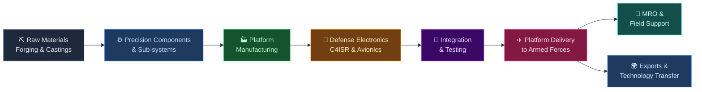

# India Value Chain Analysis: Aerospace and Defense Technology

*Analysis date: July 2026 | Analyst: Claude Code (India Value Chain Skill)*

---

## 0. Segment Definition

**Precise boundary:** This analysis covers the end-to-end value chain for **aerospace and defense technology in India** — from raw material and precision forging through components, sub-systems, platform manufacturing (aircraft, missiles, ships, ground vehicles, drones/UAVs), defense electronics and C4ISR systems, integration and testing, through to MRO (maintenance, repair, overhaul), exports, and technology transfer. It includes both the defense (military) and civil aerospace segments where they share supply chains, and the emerging space/NewSpace sub-segment where it intersects with defense (dual-use satellites, surveillance payloads, launch vehicles). It excludes pure-play commercial aviation services (airport operations, airline operations) and civilian satellite communication services.

**Core product/service flow:**

**End customer and what they value most:**
- **Indian Armed Forces** (Army, Navy, Air Force, Coast Guard): platform reliability, life-cycle support, indigenisation compliance under DAP 2026, price competitiveness vs imports.
- **Ministry of Defence / DPSUs**: indigenous content (IC) percentage (raised to 60% under DAP 2026), technology transfer, IP ownership ("Owned by India" shift).
- **Export customers** (Southeast Asia, Middle East, Africa, Global South): affordability vs Western systems, proven combat performance, reliable supply chain, offsets.
- **Space/dual-use customers** (ISRO, NSIL, DoS, private space): launch reliability, satellite precision, cost per kg to orbit.

**India's global position: Follower → Challenger (accelerating rapidly).**
India was the world's largest defense importer for over a decade. The table is turning: defense production reached ₹1.54 lakh crore in FY25, defense exports hit ₹38,424 crore in FY26 (+62.66% YoY), and the capital expenditure budget for FY27 is ₹2.19 lakh crore — with 75% ring-fenced for domestic procurement. DAP 2026's shift from "Made in India" to "Owned by India" signals a maturation from licensed production to indigenous IP. India is transitioning from a follower to a genuine challenger in the Global South defense export market.

---

## 0.5 Quick Scan — Investable Listed Companies

| Company | Ticker | Cap Bucket | Chain Stage | One-Line Investment Thesis | Coverage |
|---|---|---|---|---|---|
| Bharat Electronics Ltd | NSE: BEL | Large | Defense Electronics / C4ISR | ₹74,000 Cr order book (3x FY25 rev); QRSAM + EW orders not yet fully in estimates; DAP 2026 IC rules guarantee captive flow | Well-covered |
| Hindustan Aeronautics Ltd | NSE: HAL | Large | Platform Manufacturing (Aircraft) | ₹2.3 lakh Cr backlog + ₹4 lakh Cr pipeline; Tejas MK2, AMCA, Rafale fuselage set for a decade of delivery revenue; LEAP engine parts new margin stream | Well-covered |
| Solar Industries India Ltd | NSE: SOLARINDS | Large | Munitions / Warheads | India's most profitable defense supplier; ₹50,000 Cr export target by 2030 in ammunition/missiles; Economic Explosives moat funds defense scaling | Well-covered |
| Bharat Dynamics Ltd | NSE: BDL | Large | Missiles & Guided Weapons | Order book 8x FY25 revenue; ₹20,000 Cr additional orders expected FY27; anti-drone missile systems new product line | Moderate |
| Mazagon Dock Shipbuilders | NSE: MAZDOCK | Large | Naval Shipbuilding | P75I submarine program (₹60,000+ Cr) is decade-long revenue anchor; export order pipeline growing; near-zero competition for submarine work | Well-covered |
| Bharat Forge Ltd | NSE: BHARATFORG | Large | Artillery / Precision Forging | 155mm artillery (ATAGS, Dhanush), defense composites; dual-use civil/defense forging creates counter-cyclical buffer | Well-covered |
| Apollo Micro Systems | NSE: APOLLOMICRO | Small | Defense Electronics & EW | FY26 revenue ₹904 Cr (+61% YoY); order book scaling; EW and guided weapon sub-systems structurally underpriced given growth rate | Under-researched |
| Data Patterns India | NSE: DATAPATTNS | Small | Avionics / Defense Electronics | Tejas avionics and radar sub-system supplier; DAP 2026 IC mandate creates captive demand; pipeline ₹2,000–3,000 Cr not in estimates | Under-researched |
| Paras Defence & Space | NSE: PARAS | Small | Optics / Space Electronics | FY26 revenue ₹477 Cr (+31%); order book ₹986 Cr; space optics for ISRO satellites uniquely positioned; optronic systems for Rafale offset | Under-researched |
| MTAR Technologies | NSE: MTAR | Small | Precision Components (Propulsion) | Kaveri engine, ISRO cryogenic components, nuclear components; LEAP engine parts via HAL-Safran is a new structural revenue stream | Under-researched |
| Zen Technologies | NSE: ZENTEC | Small | Simulation / Anti-Drone | India's anti-drone crisis (2025 Pakistan conflict) has structurally elevated demand; ₹10 Bn export pipeline by FY28 | Under-researched |
| Astra Microwave Products | NSE: ASTRAMICRO | Small | Radar & EW Sub-systems | 2026 mandate to indigenise radar sub-systems for all indigenous aircraft = captive multi-year order flow; under-modelled by analysts | Under-researched |
| IdeaForge Technology | NSE: IDEAFORGE | Small | Drones / UAVs | Q4FY26 revenue ₹141 Cr (+605% YoY); PAT turned positive; $2 Bn military drone order being placed domestically; ideaForge is a natural winner | Under-researched |
| Cochin Shipyard | NSE: COCHINSHIP | Mid | Naval Shipbuilding | IAC-2 aircraft carrier program + indigenous destroyer pipeline; Tier-2 beneficiary of naval capex wave after Mazagon Dock | Moderate |
| BEML Ltd | NSE: BEML | Mid | Ground Vehicles / Metro Rail | Military trucks, tanks (Arjun MBT sub-systems), metro rail; defense indigenisation converts BEML from rail-dependent to dual-revenue | Moderate |

**Under-researched opportunity:** The **Small-cap defense electronics and precision sub-systems** bucket (Apollo Micro, Data Patterns, Astra Microwave, Paras Defence, MTAR Technologies, Zen Technologies) is where analyst coverage is 1–3 per stock, yet these companies are the direct beneficiaries of the IC mandate escalation under DAP 2026 (from 50% to 60%). Every rupee of HAL, BDL, or BEL revenue increasingly flows through these small-cap sub-system suppliers. The market is pricing the large-cap PSUs at 40–60x P/E while the small-cap sub-system layer trades at 25–40x with faster growth rates and higher structural visibility.

---

## 1. Value Chain Map — Primary Activities

### Activity 1: Inbound Logistics — Raw Materials, Forgings, and Strategic Materials

**What it involves:**
This stage covers procurement of aerospace-grade raw materials: titanium alloys, high-strength steel (maraging, stainless), aluminium alloys (7000/2000 series), nickel superalloys (for turbine blades), carbon fiber composites (for airframe structures), and specialty chemicals for propellants and explosives. Strategic materials — RDX, HMX (for warheads), ammonium perchlorate (for solid rocket propellants), and rare earth elements (for guidance systems) — create critical import dependencies. Forgings and precision castings for engine components, landing gear, and structural frames require ultra-high-precision manufacturing that is distinct from commercial forging.

HAL signed an MoU with Mishra Dhatu Nigam Limited (MIDHANI) in FY26 to establish a Strategic Metal Bank for critical raw materials — a direct response to supply chain vulnerabilities exposed during COVID and in the context of geopolitical competition for rare earth access.

**Key cost and differentiation drivers:**
- **DRDO's 509 import-prohibited items list** (Positive Indigenisation Lists I, II, III, IV) creates protected domestic demand for critical materials and components manufactured in India.
- **Aerospace-grade forging precision** — tolerances of ±0.05 mm for turbine discs — requires dedicated investment in multi-axis CNC forging presses; Bharat Forge is India's only private-sector player with this capability at scale.
- **Composites manufacturing**: Carbon fiber prepregs still largely imported (Toray, Hexcel); domestic production is nascent. ADA (Aeronautical Development Agency) and HAL are developing composites for Tejas Mk2 airframe.
- **Rare earth dependency**: India imports ~90% of rare earth needs from China; critical for precision guidance, night-vision optics, and radar absorbing materials. DRDO's rare earth program is at early stage.

**Indian companies active here:**
- **Bharat Forge Ltd** (NSE: BHARATFORG): Aerospace and defense forgings for HAL, BDL, and DRDO; also 155mm artillery systems (ATAGS, Dhanush)
- **Mishra Dhatu Nigam Ltd / MIDHANI** (NSE: MIDHANI): Specialty alloys (maraging steel, titanium) for defense and space; HAL Strategic Metal Bank MoU
- **Jindal Stainless** (NSE: JSL): Stainless steel grades for defense structures
- **SAIL** (NSE: SAIL): Armor-grade steel for tanks, armored vehicles
- **Solar Industries India** (NSE: SOLARINDS): Explosives, propellants, warhead fill; India's dominant manufacturer of military-grade energetics

---

### Activity 2: Operations (I) — Precision Components and Sub-systems Manufacturing

**What it involves:**
The most technically intensive stage: manufacturing of precision-machined components (turbine blades, compressor discs, combustion chambers, actuators, hydraulic systems), electronics sub-systems (radar signal processors, EW jamming modules, fuze assemblies, power conditioning units), optics and optronic systems (seeker heads for missiles, airborne EO/IR systems, periscopes), and guidance, navigation and control (GNC) sub-systems. These components require AS9100 aerospace quality certifications and ITAR/ML-controlled manufacturing environments.

**Key cost and differentiation drivers:**
- **AS9100 certification** is a mandatory entry ticket for supplying to HAL, BEL, BDL, or export customers; only a limited number of Indian private-sector firms hold this certification.
- **DRDO-to-industry technology transfer**: DRDO's lab-to-production transfer programs are the primary source of IP for private-sector defense manufacturers. The quality and speed of this transfer is the single biggest determinant of how quickly private sector can scale. iDEX has supplemented this with 430 startup contracts.
- **Dual-use manufacturing**: Companies like MTAR Technologies (precision components for Kaveri engine, ISRO cryogenic engines, and nuclear reactors) capture defense/space/nuclear revenue from a single precision machining capability base — structurally higher utilisation and revenue visibility than single-domain peers.
- **Optics indigenisation**: India imports >80% of military optics (night vision, thermal imagers, laser rangefinders) currently. Paras Defence is the primary Indian counterpart to Elbit Systems (Israel) and Safran Optronics (France) in indigenising this sub-chain.

**Indian companies active here:**
- **MTAR Technologies** (NSE: MTAR): Cryogenic rocket engine components (ISRO), Kaveri engine parts, nuclear reactor components, fuel cell assemblies; HAL-Safran LEAP engine rotating parts (June 2025 agreement) is a structural new revenue stream
- **Data Patterns (India)** (NSE: DATAPATTNS): Avionics (Tejas fire-control computer, radar processors), defense communication sub-systems; DRDO's preferred electronics sub-system partner
- **Astra Microwave Products** (NSE: ASTRAMICRO): Microwave and RF sub-systems for radar and EW; 2026 mandate to indigenise radar sub-systems for all indigenous aircraft creates captive multi-year order flow
- **Apollo Micro Systems** (NSE: APOLLOMICRO): Defense electronics (missile guidance sub-systems, EW, avionics); FY26 revenue ₹904 Cr (+61% YoY); order book growing sharply
- **Paras Defence and Space Technologies** (NSE: PARAS): Defense optics (EO/IR systems, beam directors), space optics (ISRO satellite camera lenses), drone payloads; FY26 revenue ₹477 Cr (+31%); order book ₹986 Cr
- **Walchandnagar Industries** (NSE: WI): Propulsion components, gear boxes for aerospace/defense; Brahmos sub-components; historically under-invested but benefiting from munitions production ramp
- **DCX Systems** (NSE: DCXINDIA): Electronics manufacturing services (EMS) for defense avionics and cable harnesses; recently listed; niche but growing

---

### Activity 3: Operations (II) — Platform Manufacturing

**What it involves:**
Final assembly and integration of complete defense platforms: combat aircraft (Tejas LCA, Tejas Mk1A, Tejas Mk2, HTT-40 trainer, AMCA — 5th gen stealth fighter), helicopters (ALH Dhruv, LCH Prachand, LUH, IMRH/NMRH), missiles and guided weapons (Akash SAM, Astra BVR, Brahmos supersonic cruise missile, Helina ATGM, Nag ATGM, Pralay ballistic missile), naval vessels (submarines, destroyers, frigates, corvettes), armoured vehicles (Arjun MBT, Kestrel IFV, FICV), and drones/UAVs (TAPAS-BH, Archer-NG, tactical drones, loitering munitions).

**Key cost and differentiation drivers:**
- **HAL Tejas production ramp**: HAL operationalised a 3rd Tejas production line in FY26; IAF order for 83 Tejas Mk1A (₹46,898 Cr, 2021) + 97 Tejas Mk2 (potential) is the anchor program for the next 15 years.
- **C295 FAL Vadodara** (Tata Advanced Systems + Airbus): India's first private-sector fighter-class aircraft Final Assembly Line; first C295 "Made in India" to roll out September 2026 — a landmark for private aerospace manufacturing.
- **Rafale fuselage manufacturing** (Tata Advanced Systems + Dassault): 4 production transfer agreements signed June 2025; TASL's Hyderabad facility will manufacture Rafale fuselages — India's deepest integration into a frontline Western fighter program.
- **Brahmos production ramp** (Tata Advanced Systems, BrahMos Aerospace): TASL facility designed for 80–100 BrahMos missile units/year from 2026; export orders from the Philippines and Vietnam accelerating production.
- **$2 Bn military drone order**: Government placing India's largest-ever UAV procurement with domestic manufacturers (Adani Defence, TASL, L&T, ideaForge, Asteria Aerospace) — catalytic for private-sector drone manufacturing scale-up.
- **AMCA Program** (5th gen stealth fighter): 7 firms bidding (HAL, L&T, Adani Defence, TASL, Kalyani Strategic Systems + 2 others); MoD expected to select strategic partner in FY27; a ₹1–2 lakh Cr program over 20 years.

**Indian companies active here:**
- **Hindustan Aeronautics Ltd** (NSE: HAL): India's sole aircraft OEM; Tejas Mk1A/Mk2, helicopters (ALH, LCH, LUH), IMRH; order backlog ₹2.3 lakh Cr; pipeline ₹4 lakh Cr; LEAP engine parts manufacturing (Safran JV); SSLV (space launch vehicle from ISRO tech transfer)
- **Bharat Dynamics Ltd** (NSE: BDL): Akash SAM, Astra BVR missile, Helina ATGM; order book 8x FY25 revenue; ₹20,000 Cr additional orders in FY27 pipeline; anti-drone missile systems emerging
- **Solar Industries India** (NSE: SOLARINDS): Military explosives, fuzes, propellant grains, warhead assemblies; largest listed defense manufacturer by EBITDA margin; missile propulsion sub-systems emerging
- **Mazagon Dock Shipbuilders** (NSE: MAZDOCK): Submarines (Scorpene P75, P75I — 6 advanced submarines, ₹60,000+ Cr), destroyers, frigates; sole Indian submarine builder
- **Cochin Shipyard** (NSE: COCHINSHIP): INS Vikrant aircraft carrier (delivered 2022); IAC-2 program in early planning; indigenous destroyers
- **GRSE (Garden Reach Shipbuilders & Engineers)** (NSE: GRSE): Frigates, corvettes, patrol vessels; significant export pipeline
- **BEML Ltd** (NSE: BEML): Military transport trucks, Arjun MBT sub-systems; metro rail dual-use manufacturing base
- **IdeaForge Technology** (NSE: IDEAFORGE): India's largest listed UAV manufacturer; defense surveillance drones, tactical UAVs; Q4FY26 revenue ₹141 Cr (+605%); PAT turned positive; US law enforcement export contract
- **Tata Advanced Systems Ltd** (TASL, unlisted, Tata Group): C295 FAL Vadodara (first rollout Sep 2026), Rafale fuselage, AH-64 Apache fuselage (300 units delivered), Brahmos missile bodies, TSAT-1A satellite
- **Adani Defence & Aerospace** (unlisted, Adani Group): UAVs, munitions, electronics manufacturing; AMCA bidder; growing industrial footprint
- **L&T Defence** (unlisted, subsidiary of NSE: LT): Missile systems (L&T MBDA JV for MRSAM), artillery, armoured vehicles, naval systems; AMCA bidder
- **Kalyani Strategic Systems** (unlisted, Bharat Forge subsidiary): Artillery (ATAGS), armoured vehicles; AMCA bidder; listed parent NSE: BHARATFORG

---

### Activity 4: Defense Electronics and C4ISR

**What it involves:**
Command, Control, Communications, Computers, Intelligence, Surveillance and Reconnaissance (C4ISR) systems, electronic warfare (EW), radars (air search, fire control, ground penetrating, airborne), communication systems (Software Defined Radio, SATCOM, tactical communication networks), avionics, electronic support measures (ESM), signal intelligence (SIGINT), and cybersecurity for defense networks. This is the fastest-growing and highest-margin sub-segment of India's defense industry — software-intensive, dual-use, and directly aligned with India's AI-era warfare modernization.

**Key cost and differentiation drivers:**
- **BEL's structural dominance**: BEL supplies radars, EW systems, avionics, C4ISR, and communication systems to all three services. FY26 revenue ~₹26,750 Cr; order book ₹74,000 Cr (3x revenue). The QRSAM (Quick Reaction Surface-to-Air Missile) radar and terminal launch system contract (estimated ₹30,000–32,000 Cr) is BEL's largest single program.
- **DAP 2026 IC mandate**: 60% indigenous content required in defense electronics — directly expands the addressable market for all listed Indian defense electronics companies.
- **AI and electronic warfare**: Modern EW and SIGINT systems require real-time signal processing, AI-driven threat classification, and cyber-hardened architectures. BEL, Data Patterns, and Astra Microwave are building these capabilities. iDEX has funded 50+ AI/EW startups.
- **DRDO budget ₹26,816 Cr**: 100 priority projects; defines which systems private sector will be asked to manufacture next.

**Indian companies active here:**
- **Bharat Electronics Ltd** (NSE: BEL): Radars (Central Acquisition Radar, Weapon Locating Radar), EW (Samyukta EW system), avionics, communication systems, C4ISR networks; FY26 revenue ₹26,750 Cr; order book ₹74,000 Cr
- **Data Patterns India** (NSE: DATAPATTNS): Fire-control computers, radar processors, avionics for Tejas; DRDO-preferred electronics partner; order book 1.8x FY25 revenue; pipeline ₹2,000–3,000 Cr
- **Astra Microwave Products** (NSE: ASTRAMICRO): Microwave/RF sub-systems for radar (LRDE, BEL programs) and EW; 2026 indigenisation mandate = structural order flow
- **Apollo Micro Systems** (NSE: APOLLOMICRO): Guided weapon electronics, EW jamming modules, fuze electronics; FY26 revenue ₹904 Cr (+61%)
- **Zen Technologies** (NSE: ZENTEC): Simulation and training systems, counter-UAV (anti-drone) systems; ₹10 Bn export pipeline by FY28; India-Pakistan 2025 conflict elevated anti-drone demand structurally
- **Alpha Design Technologies** (NSE: ALPHADC): Defense electronics integration, SATCOM terminals; niche player serving ISRO and defense communication programs
- **Bharat Dynamics Ltd** (NSE: BDL): Seeker heads, guidance electronics for missiles; semi-active and IR seeker technology for Akash/Astra/Helina programs

---

### Activity 5: Integration, Testing, and Certification

**What it involves:**
System integration of platform + electronics + weapon systems into a combat-ready entity; ground testing (structural, environmental, EMI/EMC, ballistic); flight testing (at ASTE — Aircraft and Systems Testing Establishment, Bengaluru; IAF Test Flying Academy); naval basin testing (NSTL Visakhapatnam); certification (CEMILAC for airworthiness, NABL for test labs); and validation for operational deployment. This stage is almost entirely government-controlled — test ranges, airspace, and certification authority reside with DRDO, CEMILAC, and the Armed Forces. This creates a structural bottleneck: HAL's Tejas Mk1A delivery schedule has been repeatedly delayed by CEMILAC certification timelines.

**Key bottleneck:** India has only two major flight test centres (ASTE Bengaluru, NTPC Nasik) — insufficient for the planned ramp of Tejas Mk2, LCA Navy, AMCA, and export programs simultaneously. The government's plan to establish 3 more test ranges (including a 4th at Pokhran) is critical but delayed.

**Indian companies active here:**
- **HAL** (NSE: HAL): Operates its own test facilities at Nasik (MiG overhaul), Bangalore (fixed wing), Lucknow (accessories)
- **DRDO/CEMILAC/ASTE**: Government certification and test authority; not investable separately
- **National Test House / STQC**: Government testing and quality assurance for electronics
- **Bharat Forge / Kalyani Strategic Systems**: Artillery ballistic testing at own ranges (Pune)
- **ideaForge Technology** (NSE: IDEAFORGE): Maintains in-house drone testing and certification capability — a competitive moat for faster MoD qualification vs. startup competitors

---

### Activity 6: Outbound Logistics — Platform Delivery, MRO, and Field Support

**What it involves:**
Delivery of platforms to the Armed Forces under phased delivery contracts (HAL Tejas deliveries on a 4-6 aircraft/month ramp target); establishing forward logistics bases; supply of spares and ammunition; and increasingly, performance-based logistics (PBL) contracts where the OEM guarantees platform availability at a contracted rate rather than selling parts. MRO (Maintenance, Repair, Overhaul) is the highest-margin recurring revenue stream in aerospace — HAL earns ₹3,000–4,000 Cr/year from legacy MiG-21, MiG-29, Jaguar, and Mirage 2000 MRO contracts. As the fleet shifts to indigenous Tejas, this recurring MRO revenue transfers from Russian/Western OEMs to HAL.

**Key cost and differentiation drivers:**
- **PBL contracts**: IAF's shift from spares-based to PBL (guaranteeing X% availability) structurally locks in OEM margin for 5–10 years; BEL, HAL, and Bharat Dynamics are all moving to PBL.
- **Ammunition supply security**: India's ammunition consumption (demonstrated during the 2025 Pakistan conflict) revealed that India's ammunition reserves were critically shallow at under 10 days of intensive operations. This has driven emergency contracts worth ₹15,000+ Cr with Solar Industries, Munitions India Ltd, and private ammunition manufacturers.
- **Drone MRO**: Emerging sub-segment; as the military drone fleet scales to thousands of units, MRO for UAVs (battery replacement, sensor calibration, airframe repair) will become a significant recurring revenue stream.

**Indian companies active here:**
- **HAL** (NSE: HAL): Primary MRO provider for all Indian-made aircraft; ₹3,000–4,000 Cr/year from legacy fleet; growing as Tejas fleet expands
- **BEML** (NSE: BEML): Ground vehicle MRO, T-72/T-90 tank sub-system overhaul
- **Sika Interplant Systems** (BSE: SIKAINTER, SME): MRO distribution, defence components supply integration; listed on BSE; niche
- **Bharat Dynamics** (NSE: BDL): Missile overhaul and refurbishment programs
- **BEL** (NSE: BEL): Electronics overhaul, radar upgrade programs (Mid-Life Upgrade of legacy radar systems)

---

### Activity 7: Marketing & Sales — Exports and Technology Transfer

**What it involves:**
India's defense export machine has been transformed in 5 years: from ₹686 Cr (FY14) to ₹38,424 Cr (FY26, +62.66% YoY). The government target is ₹50,000 Cr/year by 2030. Key export products: BrahMos supersonic cruise missile (Philippines, Vietnam; inquiries from Middle East, Southeast Asia), Akash SAM system (Philippines, Egypt), Tejas LCA (Malaysia, Egypt, Argentina, Indonesia shortlist), Pinaka MLRS (Armenia, France), small arms (AK-203 via Indo-Russian JV Kalashnikov India), ammunition (Solar Industries), military helicopters (HAL Advanced Light Helicopter), drones (ideaForge surveillance drones — US law enforcement; Zen Technologies anti-drone systems). DAP 2026 explicitly mandates that "exportability" be a consideration in platform design — embedding an export orientation into the procurement process for the first time.

**Key cost and differentiation drivers:**
- **BrahMos Export**: The most transformative Indian defense export — a supersonic cruise missile at ~USD 3 Mn per unit, with a USD 375 Mn Philippines contract already executed; Vietnam and Middle East in pipeline. BrahMos is co-produced by BAPL (BrahMos Aerospace Private Ltd — DRDO + Russia's NPO Mashinostroyenia JV) and assembled by TASL.
- **Tejas Export Program**: Malaysia's MRCA contest (18 Tejas vs Saab Gripen E) is India's first fighter jet export bid; a win would be transformational.
- **Offset policy leverage**: India's offset clause (30% of contract value must be invested in India's defense industry) has historically brought technology and production knowhow into India; DAP 2026 strengthens offset execution requirements.
- **G2G defense deals**: India's "Defense Diplomacy" — government-to-government deals (like Brahmos with Philippines) bypass commercial tendering, giving Indian platforms a geopolitical access advantage.

**Indian companies active here:**
- **HAL** (NSE: HAL): Tejas LCA export (Malaysia contest), ALH helicopter exports, Dornier-228 civil/military aircraft exports
- **BDL** (NSE: BDL): Akash SAM export (Philippines, Egypt); Konkurs anti-tank missiles
- **Solar Industries** (NSE: SOLARINDS): Ammunition exports; explosives exports to 50+ countries
- **GRSE** (NSE: GRSE): Naval vessel exports (patrol boats to Mauritius, Seychelles, Vietnam)
- **ideaForge** (NSE: IDEAFORGE): Surveillance drone exports to US law enforcement; Southeast Asian military UAV RFPs
- **Zen Technologies** (NSE: ZENTEC): Anti-drone systems export pipeline — ₹10 Bn by FY28; post-2025 conflict demand surge from Middle East and Southeast Asian militaries
- **Bharat Forge / Kalyani Strategic Systems**: 155mm artillery (ATAGS) export inquiries from Southeast Asia, Eastern Europe

---

## 2. Value Chain Map — Support Activities

### Support 1: Firm Infrastructure

**Role:** Defense manufacturing requires industrial licenses (under the Arms Act and DPIIT), Foreign Investment Promotion Board approvals (FDI in defense up to 74% under automatic route, 100% via government route), and adherence to DRDO IP sharing agreements. Export requires NOC from MoD and End-User Certificates (EUCs). Finance: defense contracts are typically milestone-based advance payments (10–15% upfront, balance on delivery) — providing better working capital visibility than commercial B2B but requiring strong execution to avoid penalty clauses.

**Budget 2026 policy tailwinds:** ₹7.85 lakh crore total defense budget; ₹2.19 lakh crore capital expenditure (21.8% increase); 75% reserved for domestic procurement. Defence Acquisition Procedure (DAP) 2026: IC raised to 60%; "Owned by India" shift means IP must vest with Indian entity, not just manufacturing in India. Seven defense manufacturing clusters announced (Bengaluru for aerospace + electronics; UP Defence Corridor; Tamil Nadu; Ordnance Factory clusters) with single-window clearances and plug-and-play infrastructure.

**Notable institutions:** DRDO (₹26,816 Cr R&D budget, 509 import-prohibited items); iDEX (430 startup contracts, ₹2,400 Cr procurement cleared); DPIIT (industrial license authority); DSIR (for defense R&D expenditure weighted deduction); Defence Finance Division (DAC — Defence Acquisition Council).

---

### Support 2: Human Resource Management

**Role:** Aerospace and defense manufacturing requires the rarest combination of engineering skills in India: precision machinists (±0.01 mm tolerance work), aerospace engineers (structures, propulsion, avionics), DRDO scientists, test pilots, and security-cleared software engineers (for EW, guidance, SATCOM systems). Security clearances add a 6–18 month delay to new hires for sensitive programs.

**Where Indian firms are strong or weak:** Strong in software (avionics software, simulation, EW signal processing) — India's IT talent pool is deployable here. Weak in precision manufacturing operators, materials scientists (superalloys, composites), and propulsion engineers. HAL and BEL run in-house engineering colleges and apprenticeship programs. The UP Defence Corridor and Bengaluru Aerospace Cluster are building dedicated skill centres with ITI/polytechnic pipelines.

**Notable:** IIT Bombay, IISc Bengaluru (aerospace research); DIAT Pune (Defence Institute of Advanced Technology — India's dedicated defense engineering university); GTRE (Gas Turbine Research Establishment) as the national propulsion talent hub; iDEX ecosystem creating a new generation of defense startup talent.

---

### Support 3: Technology Development

**Role:** DRDO is the primary R&D engine with a ₹26,816 Cr (USD 3.13 Bn) budget. Key labs: ADA (Aeronautical Development Agency) — Tejas, Tejas Mk2, AMCA; GTRE (Gas Turbine Research Establishment) — Kaveri engine; DRDO LRDE — radar; DRDL (Defence Research and Development Laboratory) — missiles (Agni, Brahmos, Akash, Nag); CABS (Centre for Airborne Systems) — airborne radars, EW. Private sector R&D is still nascent but growing: Data Patterns, Astra Microwave, and Apollo Micro Systems have internal product R&D; iDEX startups are the innovation frontier.

**Where Indian firms are strong or weak:** Strong in electronic systems, software, and simulation. Critically weak in: (a) turbofan/turboprop engine technology (Kaveri engine failed to meet IAF thrust requirements for Tejas; HAL-Safran LEAP parts manufacturing is contracted work, not IP); (b) advanced composites (still heavily imported); (c) advanced radar (AESA radar for Tejas still partially dependent on Israeli/French tech); (d) strategic materials (rare earth for guidance systems, special alloys for superalloys). The HAL-Safran LEAP parts agreement (June 2025) is a process upgrade — HAL manufactures rotating parts but does not own the engine IP.

---

### Support 4: Procurement

**Role:** Procurement covers import of components and systems still on the restricted (permitted) import list, co-production materials (titanium from Russia, which is now complicated by sanctions-related payment issues), and increasingly, domestic procurement under the Positive Indigenisation Lists. Ammunition procurement was revealed as critically under-stocked post the 2025 conflict; emergency procurement of ₹15,000+ Cr is reshaping Solar Industries', Munitions India's, and OFB successors' order flows.

**Where Indian firms are strong or weak:** The shift from import-dependent procurement to domestic is the central structural story of this chain. PLI for defense manufacturing (approved, ₹1,000 Cr over 5 years) incentivises private-sector procurement substitution. Import of AESA radars (Elta, Thales), turbofan engines (GE F404/F414, CFM LEAP), and advanced composites remain key gaps that domestic procurement cannot yet fill.

**Notable domestic suppliers:** MIDHANI (NSE: MIDHANI) — specialty alloys; Bharat Forge (NSE: BHARATFORG) — forgings and castings; Solar Industries (NSE: SOLARINDS) — energetics (propellants, warheads); BEL (NSE: BEL) — electronics for internal procurement across defense programs.

---

## 3. Five Forces + Capital Cycle Analysis

### Part A — Five Forces

**Supplier Power — MEDIUM-LOW (for government programs); HIGH (for foreign technology)**
For domestic sub-systems (BEL, HAL, Data Patterns), supplier power is moderated by MoD's ability to multi-source or substitute under the Positive Indigenisation Lists. But for foreign technology inputs — NVIDIA-class GPU-equivalent military chips, AESA radar transmit/receive modules (still partially imported), GE F414 engine for Tejas Mk2 — supplier power is HIGH. India's move away from Russian supply chains (post-Ukraine conflict) has increased dependence on Western suppliers (Safran, GE, Elbit, Thales, Rafael) who have their own political and strategic considerations.

**Buyer Power — HIGH (government monopsony)**
The Indian government (MoD + armed forces) is the primary buyer — a near-monopsonist for domestic defense production. DAP 2026's LTIPP (Long-Term Integrated Perspective Plan) and phased procurement contracts reduce buyer bargaining leverage on delivery timelines, but MoD retains significant power over pricing. Offset clauses, IP ownership requirements, and export approval authority give MoD additional levers. Buyer power is HIGH domestically but structurally benign for listed companies since the government is also an enabler (through IC mandates, PLI, iDEX) not purely a price-squeezer.

**Threat of New Entrants — LOW-MEDIUM**
Defense manufacturing has exceptionally high entry barriers: industrial licenses, security clearances, 3–7 year DRDO technology transfer timelines, AS9100 certification, and the customer relationship moat with MoD are near-impossible to replicate quickly. New entrants are primarily:
- **Conglomerates** (Adani, Reliance, JSW) entering through acquisition or greenfield investment in less complex sub-segments (drones, ammunition, structures); well-capitalised but lack technology depth
- **iDEX startups** (100s funded, ~43 cleared for procurement) entering niche technology niches (AI-based targeting, quantum communication, counter-drone AI) — disruptive to specific sub-segments but not platform-level incumbents

**Threat of Substitutes — LOW**
For military applications there is no substitute for capability — an army cannot substitute a fighter jet with a civilian aircraft. The real threat is import substitution: if MoD resumes large-scale platform imports (F-35, more Rafales, more submarines from France), it reduces demand for domestic alternatives. The DAP 2026 "75% domestic capital procurement" mandate structurally suppresses this substitution threat. Counter-threat: if domestic platforms (Tejas Mk2, AMCA) face cost overruns or delivery delays, MoD historically resumes imports — HAL's credibility on delivery timelines is thus existential.

**Rivalry Intensity — LOW-MEDIUM (PSU vs private) → HIGH (private sector competition intensifying)**
Historically, rivalry was low — PSUs (HAL, BEL, BDL, MDL) held entrenched positions and private sector was locked out. This is changing: Tata Advanced Systems, Adani Defence, L&T, Kalyani Strategic Systems, Mahindra Aerospace are all competing for the same platform programs (C295 offset, AMCA, Tejas Mk2 sub-systems). In the drone segment, competition is acute (ideaForge, Adani Surveillance, Alpha Design Technologies, Asteria Aerospace all bidding for the $2 Bn UAV order). In defense electronics, the sub-500 Cr revenue companies (Data Patterns, Astra Microwave, Apollo Micro, Paras Defence) all compete for overlapping DRDO program sub-system contracts. Rivalry is MEDIUM overall — concentrated sub-segments are HIGH.

### Part B — Capital Cycle Verdict

India's aerospace and defense chain is entering a **structural capital inflow phase** unlike anything seen before — the ₹2.19 lakh crore capital expenditure budget (FY27), the ₹4 lakh crore HAL pipeline, the P75I submarine program, the AMCA program, and the $2 Bn drone order represent a decade-long demand pipeline with near-zero import substitution risk (given DAP 2026's 75% domestic mandate). However, this is **not a cyclical capital inflow** of the kind that creates oversupply — it is **policy-driven, government-guaranteed demand** that cannot be redirected. The capital cycle risk here is not oversupply but **execution risk**: delays in HAL Tejas deliveries, CEMILAC certification bottlenecks, and HAL production ramp constraints are the only credible ways in which this capital cycle turns adverse for investors.

### Part C — Investor Implication

The Five Forces picture (LOW substitute threat, LOW-MEDIUM entry threat, HIGH government buyer power moderated by DAP 2026 mandates, MEDIUM-LOW supplier power domestically) combined with a policy-driven capital inflow cycle makes this one of the most structurally attractive sectors in India for a 5–10 year investment horizon. The caveat is that execution — HAL delivery timelines, CEMILAC certification throughput, DRDO technology transfer speed — not market dynamics, is the main risk variable. The most attractive position is the **sub-system and defense electronics layer**: these companies (Apollo Micro, Data Patterns, Astra Microwave, Paras Defence, MTAR Technologies) benefit from every platform program regardless of which OEM wins, grow with the IC mandate escalation, and are structurally under-covered by the analyst community relative to the large-cap PSU layer.

**Summary Table:**

| Force | Intensity | Key Driver |
|---|---|---|
| Supplier power | Medium-Low (domestic) / High (foreign tech) | NVIDIA-grade military chips, AESA radar TRM, turbofan engines still import-dependent |
| Buyer power | High | Government monopsony; moderated by DAP 2026 domestic mandates |
| Threat of new entrants | Low-Medium | Industrial license, security clearance, and technology barriers; conglomerate entries manageable |
| Threat of substitutes | Low | DAP 2026 75% domestic procurement mandate suppresses import substitution |
| Rivalry intensity | Medium (PSU-private); High (drone, electronics sub-segments) | Private sector entry intensifying; drone market acutely competitive |

**Overall structural attractiveness: HIGH** — policy-guaranteed demand, long-duration order books, and escalating IC mandates create a multi-decade compounding tailwind.
**Capital cycle phase: Inflow (policy-driven, not cyclical)** — ₹2.19 lakh Cr FY27 capex budget; 75% domestic mandate; zero substitution risk.
**Investor stance: Accumulate broadly; overweight sub-system + defense electronics layer** — best risk-reward at sub-500 Cr to ₹10,000 Cr market cap range where coverage is thin but order book growth is fastest.

---

## 4. GVC Governance and India's Position

### Lead Firms

**Global lead firms:** Lockheed Martin (F-35, C-130), Boeing (AH-64, P-8), Dassault Aviation (Rafale, C295 partnership), Airbus Defence (C295 FAL Vadodara), Safran (aircraft engines — LEAP, CFM56), Leonardo (helicopters — AW101, AW139), GE Aerospace (F404/F414 engines for Tejas), Rafael (Spice, Derby, Python — Israeli missile systems), Elbit Systems (EW, optics, avionics for India programs). MBDA (missiles — ASRAAM, Meteor, SCALP — through L&T MBDA JV).

**Indian lead firms (established):** HAL (fixed-wing aircraft, helicopters), BEL (defense electronics), BDL (missiles), MDL (submarines), Solar Industries (munitions). **Indian lead firms (emerging private sector):** Tata Advanced Systems (C295, Rafale fuselage, Brahmos), L&T Defence (missiles, systems integration), Adani Defence & Aerospace (UAVs, munitions, AMCA bidder).

### Governance Type: Captive → Relational (Transitioning)

India's defense value chain historically operated under **Captive governance** — Indian companies (primarily PSUs) manufactured under licensed production agreements with Western/Russian OEMs who retained all IP, design authority, and export control. Technology transfer was limited to manufacturing procedures, not design capability. This is transitioning:
- **HAL-Safran LEAP agreement**: India manufactures rotating parts for a cutting-edge civil turbofan — process upgrade but not yet product or functional upgrade (no IP ownership).
- **Tejas/AMCA programs**: ADA-designed platforms represent genuine **product upgrading** — India owns the IP, designs the aircraft, and defines the operational requirements. This is India's most significant chain position upgrade.
- **C295 FAL**: Airbus transfers manufacturing processes but retains aircraft IP — still captive, but India's first Final Assembly Line for an internationally-certified turboprop transport marks infrastructure upgrade.
- **DAP 2026 "Owned by India"**: The policy shift mandating IP ownership in Indian entities represents a deliberate attempt to break out of captive governance permanently.

### Value Capture Map

| Stage | Primary Value Capturer | Geography |
|---|---|---|
| Raw materials / specialty alloys | MIDHANI, Bharat Forge (partial); imports (titanium Russia/USA) | India (partial); imports for specialty alloys |
| Precision components | Indian sub-system companies (MTAR, Data Patterns, Astra Microwave) | India — growing share |
| Platform manufacturing | HAL, BDL, MDL (PSUs); TASL, L&T (private) | India — but engine/avionics value partly imported |
| Defense electronics | BEL dominates; private sector growing | India — high indigenous content |
| Integration and testing | HAL, DRDO, CEMILAC | India — government-controlled |
| IP / design authority | DRDO / ADA for indigenous; Western OEMs for licensed | Split: India for Tejas/AMCA; foreign for Rafale/C295 |
| Export revenue | HAL, BDL, Solar Industries, ideaForge (growing rapidly) | India — USD 4.4 Bn exports FY26 |
| MRO / PBL (recurring high margin) | HAL, BEL, BDL | India — long-duration, high-margin stream |

### India's Upgrade Trajectory

1. **Process upgrading (now):** Manufacturing licensed platforms (C295, Rafale fuselage, AH-64 Apache); assembling imported sub-systems into complete platforms.
2. **Product upgrading (underway):** Tejas Mk1A/Mk2 (indigenous design), ALH Dhruv/LCH Prachand (indigenous helicopters), Akash/Astra/Brahmos (indigenous/co-developed missiles), ATAGS artillery (Bharat Forge design). India now owns the IP on a meaningful number of platforms.
3. **Functional upgrading (2026–2030):** AMCA (5th gen stealth fighter) — India would own complete platform IP including radar, engine (post-Kaveri Mk2), and avionics if executed without foreign licensed systems. BrahMos export to 10+ countries would make India a functional defense export power.
4. **Chain upgrading (2030+):** If India achieves: (a) domestic AESA radar production at scale (BEL LRDE program), (b) Kaveri Mk2 engine for AMCA, (c) domestic composites at aerospace grade — India would capture full value from platform IP to delivery, positioning it alongside France and Israel as a self-sufficient and export-capable defense aerospace nation.

---

## 5. Key Linkages and Leverage Points

### Linkage 1: HAL Production Ramp ↔ Sub-system Supplier Order Flow ↔ IC Mandate

HAL's Tejas Mk1A delivery schedule directly drives orders for every sub-system supplier in the chain: Data Patterns (avionics), Astra Microwave (radar sub-systems), Apollo Micro Systems (guidance electronics), MTAR Technologies (engine components for the GE F404), BEL (EW, radios, avionics integration). Every 6-month delay in HAL's Tejas delivery schedule cascades to delayed order placements for 50+ Indian sub-system suppliers. Conversely, HAL's 3rd production line (commissioned FY26) accelerates this flow. The linkage is direct, proportional, and measurable through sub-system companies' order book disclosures.

### Linkage 2: Defense Exports ↔ Ammunition Scale ↔ Solar Industries' Margin Expansion

India's defense export ambition (₹50,000 Cr by 2030) is dominated by munitions and weapons systems — Brahmos, Akash, Pinaka, ammunition. Solar Industries is the primary private-sector beneficiary: its military explosives, propellants, and fuze assemblies feed every major Indian munitions program. Higher export volumes create production scale that drives down per-unit cost, expanding Solar's EBITDA margin and making Indian munitions more competitive globally — a virtuous cycle. The 2025 conflict-driven ammunition stockpile emergency has accelerated this cycle by 2–3 years.

### Linkage 3: iDEX Startup Ecosystem ↔ DRDO Technology Gap-Filling ↔ Private Sector Emergence

iDEX's 430 startup contracts (₹2,400 Cr procurement cleared) are creating a pipeline of technologies that DRDO is too slow or too large to develop: AI-based targeting algorithms, quantum-secured communication, counter-drone AI, additive manufacturing for aerospace components. These startups, when scaled, will feed into the sub-system supply chain of BEL, HAL, and BDL — eventually becoming listed companies (several iDEX winners are on the IPO pipeline). The iDEX-to-production pipeline is India's answer to the DARPA-to-commercial model and is the most powerful innovation linkage in the chain.

### Linkage 4: Drone Demand ↔ Anti-Drone Demand ↔ Zen Technologies' Structural Moat

The $2 Bn military drone order creates the demand for counter-drone systems by adversaries — directly expanding the anti-drone market that Zen Technologies (NSE: ZENTEC) dominates. Every drone proliferating to any military creates a corresponding anti-drone requirement. The 2025 India-Pakistan conflict, in which drone warfare played a significant role, has structurally elevated anti-drone procurement priority across India and across every South Asian and Middle Eastern military that observed the conflict. Zen Technologies' export pipeline of ₹10 Bn by FY28 is a direct consequence of this linkage.

### Linkage 5: C295 FAL + Rafale Fuselage ↔ India's Civil Aerospace Entry

Tata Advanced Systems' C295 FAL (Vadodara) and Rafale fuselage manufacturing capability are simultaneously building the industrial base for India's entry into civil aerospace MRO and manufacturing — a USD 35+ Bn global market. Once TASL demonstrates quality and delivery on military aircraft, it becomes a credible supplier to Airbus and Boeing's commercial aircraft supply chains. Mahindra Aerostructures' 2024 Airbus civil aircraft component contract is the leading indicator: defense manufacturing capability is being leveraged into civil aerospace — a functional chain upgrade already in progress.

### Single Highest-Leverage Intervention

**Kaveri engine program completion + AESA radar indigenisation.** These two technology gaps are the reason India cannot fully escape captive governance in its highest-priority platform programs. Without a domestic turbofan engine, Tejas Mk2 and AMCA will depend on GE F414 (US ITAR-controlled), giving the US government a veto over India's fighter jet exports. Without domestic AESA radar, every indigenous fighter will carry foreign radar IP that limits export destinations. GTRE's Kaveri Mk2 (with Safran collaboration) and BEL-LRDE's AESA radar are the two programmes where concentrated government R&D investment would yield the highest-leverage chain position improvement — enabling complete indigenous platform IP and unrestricted export capability.

---

## 5.5 Upcoming Catalysts and Key Triggers

| Catalyst / Trigger | Timeline | Companies Likely to Benefit |
|---|---|---|
| First "Made in India" C295 rollout from Vadodara FAL | September 2026 | TASL (parent Tata Group), HAL (MRO), BEL (avionics), MTAR (components) |
| $2 Bn military drone order placement (domestic manufacturers) | H2 FY27 (Oct 2026–Mar 2027) | IdeaForge (IDEAFORGE), Adani Defence (unlisted), TASL (unlisted), Zen Technologies (ZENTEC) |
| AMCA strategic partner selection announcement | FY27 (likely Q2–Q3) | HAL (AMCA prime candidate), Bharat Forge (BHARATFORG), L&T (LT), Adani Defence — whoever wins; sub-system suppliers universal beneficiaries |
| QRSAM order for BEL (₹30,000–32,000 Cr) finalisation | FY27 | BEL (direct winner), Data Patterns (DATAPATTNS), Astra Microwave (ASTRAMICRO), Apollo Micro (APOLLOMICRO) |
| BDL ₹20,000 Cr additional order pipeline (FY27) | FY27 | BDL (direct), MTAR Technologies (MTAR), Bharat Forge (missile forging sub-systems) |
| P75I submarine program: strategic partner nomination (₹60,000+ Cr) | FY27–FY28 | Mazagon Dock (MAZDOCK), L&T (Marine, strategic partner candidate), BEL (submarine electronics), MTAR (precision naval components) |
| Tejas MK2 first flight + subsequent IAF order LOI (97 aircraft) | FY27 (flight) / FY28 (LOI) | HAL (prime), BEL, Data Patterns, Astra Microwave, Apollo Micro, MTAR (all sub-system suppliers) |
| Defence exports crossing ₹50,000 Cr milestone (government target FY30) | FY28–FY30 | Solar Industries (SOLARINDS), BDL, HAL, Zen Technologies (ZENTEC), GRSE |

---

## 6. Indian Company Landscape

### Listed Companies

| Stage | Company | Ticker | Cap Bucket | Revenue / Mkt Cap | PLI? | Coverage | Chain Position |
|---|---|---|---|---|---|---|---|
| Defense Electronics / C4ISR | Bharat Electronics Ltd | NSE: BEL | Large | FY26 rev ~₹26,750 Cr; order book ₹74,000 Cr; Mkt cap ~₹2,20,000 Cr | No | Well-covered | Leader |
| Aircraft / Platform Manufacturing | Hindustan Aeronautics Ltd | NSE: HAL | Large | FY25 rev ~₹30,000 Cr; backlog ₹2.3 lakh Cr; Mkt cap ~₹2,50,000 Cr | No | Well-covered | Leader |
| Munitions / Warheads | Solar Industries India Ltd | NSE: SOLARINDS | Large | FY25 rev ~₹8,500 Cr; defense ~40% mix; Mkt cap ~₹1,20,000 Cr | No | Well-covered | Leader |
| Missiles / Guided Weapons | Bharat Dynamics Ltd | NSE: BDL | Large | FY25 rev ~₹2,600 Cr; order book 8x; Mkt cap ~₹50,000 Cr | No | Moderate | Leader |
| Naval Shipbuilding (Submarines) | Mazagon Dock Shipbuilders | NSE: MAZDOCK | Large | FY25 rev ~₹9,800 Cr; order book ~₹40,000 Cr; Mkt cap ~₹80,000 Cr | No | Well-covered | Leader (submarines) |
| Precision Forging / Artillery | Bharat Forge Ltd | NSE: BHARATFORG | Large | FY25 rev ~₹16,000 Cr; defense ~20% mix; Mkt cap ~₹50,000 Cr | No | Well-covered | Leader (forging) |
| Naval Shipbuilding (Carriers, Vessels) | Cochin Shipyard Ltd | NSE: COCHINSHIP | Mid | FY25 rev ~₹4,700 Cr; Mkt cap ~₹22,000 Cr | No | Moderate | Challenger |
| Naval Shipbuilding (Frigates) | GRSE Ltd | NSE: GRSE | Mid | FY25 rev ~₹3,800 Cr; Mkt cap ~₹17,000 Cr | No | Moderate | Challenger |
| Ground Vehicles / Rail | BEML Ltd | NSE: BEML | Mid | FY25 rev ~₹4,200 Cr; Mkt cap ~₹14,000 Cr | No | Moderate | Niche |
| Specialty Alloys | Mishra Dhatu Nigam (MIDHANI) | NSE: MIDHANI | Small | FY25 rev ~₹1,400 Cr; Mkt cap ~₹5,000 Cr | No | Under-researched | Leader (specialty alloys) |
| Defense Electronics (EW, guided) | Apollo Micro Systems Ltd | NSE: APOLLOMICRO | Small | FY26 rev ₹904 Cr (+61%); Mkt cap ~₹5,000 Cr | No | Under-researched | Challenger |
| Avionics / Radar Electronics | Data Patterns (India) Ltd | NSE: DATAPATTNS | Small | FY25 rev ~₹430 Cr; pipeline ₹2,000–3,000 Cr; Mkt cap ~₹6,000 Cr | No | Under-researched | Niche |
| Optics / Space Electronics | Paras Defence & Space Tech | NSE: PARAS | Small | FY26 rev ₹477 Cr (+31%); order book ₹986 Cr; Mkt cap ~₹4,000 Cr | No | Under-researched | Niche |
| Precision Components (Propulsion) | MTAR Technologies Ltd | NSE: MTAR | Small | FY25 rev ~₹700 Cr; Mkt cap ~₹4,500 Cr | No | Under-researched | Niche |
| Simulation / Anti-Drone | Zen Technologies Ltd | NSE: ZENTEC | Small | FY25 rev ~₹350 Cr; export pipeline ₹10 Bn by FY28; Mkt cap ~₹4,000 Cr | No | Under-researched | Leader (simulation) |
| Radar / EW Sub-systems | Astra Microwave Products Ltd | NSE: ASTRAMICRO | Small | FY25 rev ~₹650 Cr; Mkt cap ~₹3,500 Cr | No | Under-researched | Niche |
| Drones / UAVs | IdeaForge Technology Ltd | NSE: IDEAFORGE | Small | Q4FY26 rev ₹141 Cr (+605%); PAT positive; Mkt cap ~₹3,500 Cr | No | Under-researched | Leader (UAV) |
| Defense EMS / Avionics Harness | DCX Systems Ltd | NSE: DCXINDIA | Small — Recently listed (FY23) | FY25 rev ~₹900 Cr; Mkt cap ~₹3,000 Cr | No | Under-researched | Niche |
| Defense Electronics (SATCOM) | Alpha Design Technologies | NSE: ALPHADC | Small | FY25 rev ~₹600 Cr; Mkt cap ~₹2,500 Cr | No | Under-researched | Niche |
| Propulsion Components / Artillery | Walchandnagar Industries | NSE: WI | Small | FY25 rev ~₹500 Cr; Mkt cap ~₹2,000 Cr | No | Under-researched | Niche |
| Defense MRO Distribution | Sika Interplant Systems | BSE SME: SIKAINTER | Micro (SME) | Rev not publicly disclosed; Mkt cap ~₹500 Cr | No | Undiscovered | Niche |

---

### Unlisted / Private Companies

| Stage | Company | Type | Business Description | Scale | Notes |
|---|---|---|---|---|---|
| Aircraft / Aerostructures / Missiles | Tata Advanced Systems Ltd (TASL) | Private (Tata Group) | C295 FAL Vadodara (1st rollout Sep 2026), Rafale fuselage (4 PTA with Dassault), AH-64 Apache (300 units), Brahmos (80–100 units/year), TSAT-1A | Rev not disclosed; India's largest private defense manufacturer | Listed parent: NSE: TCS (Tata Sons); defense IPO not planned |
| Missiles / Systems Integration | L&T Defence / L&T MBDA JV | Unlisted (subsidiary of NSE: LT) | MRSAM missile launcher, artillery, armoured vehicle, submarine systems; AMCA bidder | Part of L&T's Defense & Smart Technologies segment; ~₹5,000 Cr revenue (est.) | Parent NSE: LT is the listed proxy |
| UAVs / Munitions / Electronics | Adani Defence & Aerospace | Unlisted (Adani Group) | UAVs, small arms ammunition, defense electronics; AMCA bidder; UP Defence Corridor plant | Not disclosed | Parent NSE: ADANIENT |
| Aerostructures / Helicopters | Mahindra Aerospace / Mahindra Aerostructures | Unlisted (Mahindra Group) | Airbus civil aircraft components (multi-year 2024), AH-64 Apache fuselage assembly, H125 helicopter main fuselage; Rafale bidder | Not disclosed | Parent NSE: M&M |
| Private Space / Launch | Skyroot Aerospace | PE-backed startup | India's first private orbital rocket (Vikram series); Infinity Campus Hyderabad (1 rocket/month capacity, inaugurated Nov 2025) | Not disclosed; USD 100 M+ raised | Pre-IPO; major investors include Singapore's GIC, Chinaccelerator |
| Private Space / Launch | AgniKul Cosmos | PE-backed startup | World's first 3D-printed semi-cryogenic engine (Agnibaan SOrTeD, May 2024); semi-orbital launch vehicle | Not disclosed | IIT Madras incubated; pre-IPO |
| Missiles (Brahmos) | BrahMos Aerospace Pvt Ltd | Govt JV (DRDO + Russia NPO Mashinostroyenia) | BrahMos supersonic cruise missile production; export to Philippines (USD 375 Mn), Vietnam, Middle East pipeline | ~₹3,000 Cr revenue (est.); 80–100 units/year target 2026 | Government JV; not directly listed; TASL is the primary private manufacturing partner |
| Artillery / Armored Vehicles | Kalyani Strategic Systems | Unlisted (Bharat Forge subsidiary) | ATAGS 155mm howitzer, armored platforms, artillery shells; AMCA bidder | ~₹1,500 Cr (est.) | Parent NSE: BHARATFORG is listed proxy |

---

### Notable Companies — Deeper Notes

**Bharat Electronics Ltd (NSE: BEL)**
- **Stage:** Defense Electronics / C4ISR
- **Cap bucket:** Large — Mkt cap ~₹2,20,000 Cr
- **Analyst coverage:** Well-covered
- **What makes them interesting:** BEL is the compounding machine of India's defense electronics modernisation. With an order book of ₹74,000 Cr (April 2026) — nearly 3x FY25 revenue — and a pipeline including QRSAM radar + terminal launch system (₹30,000–32,000 Cr estimated), the next 5–7 years of revenue are essentially locked in. BEL's competitive moat is a combination of DRDO technology access, security-cleared workforce, and decades of MoD relationship that cannot be replicated by private sector in less than 10 years.
- **Key financials:** FY26 revenue ~₹26,750 Cr; EBITDA margin ~24–26%; PAT ~₹3,500–4,000 Cr (est.); order book ₹74,000 Cr.
- **PLI:** No
- **Watch factor:** QRSAM order finalisation timeline; whether BEL can grow sub-system vendor ecosystem to sustain IC % as output scales; private sector competition in EW segment (Data Patterns, Apollo Micro).
- **Investment angle:** At 40–50x P/E, BEL is not cheap on trailing earnings. But consensus is undermodelling the operating leverage embedded in the ₹74,000 Cr order book — as fixed costs are absorbed over the next 2–3 years, EBITDA margins could expand from ~25% to 30%+, driving PAT growth of 20–25% CAGR through FY28. The market is pricing BEL as a steady-state government contractor; the reality is an 8-year order book inflection with AI-driven EW systems emerging as a new high-margin product line.

**Apollo Micro Systems (NSE: APOLLOMICRO)**
- **Stage:** Defense Electronics — EW, guided weapon sub-systems
- **Cap bucket:** Small — Mkt cap ~₹5,000 Cr
- **Analyst coverage:** Under-researched
- **What makes them interesting:** Apollo Micro is the clearest small-cap evidence that the IC mandate is working. FY26 revenue surged 61% YoY to ₹904 Cr, Q4FY26 +81% YoY — almost entirely from defense order execution (guided weapon electronics, EW sub-systems, fuze assemblies). Apollo supplies into BEL, BDL, HAL, and DRDO programs; as IC thresholds rise to 60%, the sub-system order flow necessarily accelerates for every program that Apollo participates in.
- **Key financials:** FY26 revenue ₹904 Cr; PAT ~₹80–100 Cr (est.); EBITDA margin ~13–16%; Mkt cap ~₹5,000 Cr.
- **PLI:** No (Applied status — verification required)
- **Watch factor:** Order book visibility (company discloses limited forward guidance); whether HAL Tejas Mk1A delivery acceleration translates to avionics sub-system orders; margin stability as revenue scales.
- **Investment angle:** At ~5x FY26 revenue and ~55x FY26 earnings, Apollo looks expensive on a snapshot basis. But with revenue growing at 50–60% and the defense order pipeline ($QRSAM, Tejas Mk2, AMCA sub-system R&D contracts) suggesting 3–5 years of visibility, the PEG ratio is below 1x. This is the archetypal "expensive on backwards, cheap on forwards" defense small-cap trade — similar to how Data Patterns looked in 2021 before its re-rating.

**IdeaForge Technology (NSE: IDEAFORGE)**
- **Stage:** Drones / UAVs
- **Cap bucket:** Small — Mkt cap ~₹3,500 Cr
- **Analyst coverage:** Under-researched
- **What makes them interesting:** IdeaForge is India's largest and most mature listed drone manufacturer. The Q4FY26 revenue explosion (+605% YoY to ₹141 Cr) and PAT turning positive (₹60 Cr from -₹26 Cr) signals the business has crossed the profitability threshold precisely as the $2 Bn military drone order is being placed. IdeaForge supplies surveillance drones to the Indian Army and won a US law enforcement export contract — the first Indian drone company to export to the US market. The post-2025 conflict defence budget prioritisation of UAVs creates a sustained 5–7 year procurement wave that ideaForge is structurally positioned to capture.
- **Key financials:** Q4FY26 revenue ₹141 Cr (+605%); PAT ₹60 Cr; annualised run-rate ~₹400–600 Cr; Mkt cap ~₹3,500 Cr.
- **PLI:** No
- **Watch factor:** Competition from Adani Defence and TASL for the $2 Bn military UAV order (they have balance sheet and political access advantages); whether ideaForge can maintain technology leadership vs new entrants; export order pipeline execution.
- **Investment angle:** Market is still pricing ideaForge on historical loss-making trajectory. The PAT inflection in Q4FY26 and the structural demand acceleration from the military drone order have not been re-rated into the stock. A conservative ₹500 Cr FY27 revenue at 15% EBITDA margin implies ₹75 Cr EBITDA — at 30x EV/EBITDA (inline with global UAV peers), implies ₹2,250 Cr EBITDA value alone vs. ₹3,500 Cr current market cap. The export optionality (US law enforcement, Southeast Asian militaries) is unpriced.

**Zen Technologies (NSE: ZENTEC)**
- **Stage:** Simulation systems / Anti-drone systems
- **Cap bucket:** Small — Mkt cap ~₹4,000 Cr
- **Analyst coverage:** Under-researched
- **What makes them interesting:** Zen is the only listed Indian company focused on both military simulation (training systems for Army, Air Force, Navy) and counter-UAV (anti-drone) systems. The 2025 conflict elevated anti-drone procurement from a "nice to have" to an "operational imperative" for India and every military that observed the conflict. Zen's C-UAS (Counter Unmanned Aerial Systems) product range — gun-kill, RF jamming, laser kill — is the domestic alternative to Israeli Rafael and Israeli Elbit systems that India currently imports. ₹10 Bn export pipeline by FY28 is the market catalyst the stock needs.
- **Key financials:** FY25 revenue ~₹350 Cr; Mkt cap ~₹4,000 Cr; PAT positive; export contracts ramping.
- **PLI:** No
- **Watch factor:** Anti-drone export order wins from Middle East / Southeast Asian militaries (post-2025 conflict demand); domestic MoD C-UAS contract (₹3,000–5,000 Cr est. pipeline).
- **Investment angle:** Market prices Zen as a mid-single-digit revenue company. The structural elevation in anti-drone demand after 2025 has changed the demand trajectory — from ₹350 Cr FY25 to potentially ₹1,500–2,000 Cr by FY28 if export orders materialise. At ₹4,000 Cr market cap, the stock is pricing ~2x forward revenue — below defence sector peers at 3–5x. The export pipeline realisation is the catalyst; management credibility on delivery is the key risk to monitor.

**MTAR Technologies (NSE: MTAR)**
- **Stage:** Precision components — propulsion, space, nuclear
- **Cap bucket:** Small — Mkt cap ~₹4,500 Cr
- **Analyst coverage:** Under-researched
- **What makes them interesting:** MTAR is India's most technically differentiated small-cap defense manufacturer. It makes cryogenic rocket engine components for ISRO (CE20, Vikas engines), Kaveri jet engine rotating parts for GTRE/HAL, nuclear reactor components for DAE, and fuel cell assemblies for DRDO. The June 2025 HAL-Safran LEAP engine agreement (HAL manufactures rotating parts for SAE's LEAP-1B turbofan used on Boeing 737 MAX and Airbus A320neo) is a structural game-changer for MTAR: it directly sources MTAR's precision machining capability into one of the world's highest-volume commercial aircraft programs — de-risking MTAR's revenue from being 100% India-government-dependent.
- **Key financials:** FY25 revenue ~₹700 Cr; PAT ~₹80 Cr; EBITDA margin ~20–22%; Mkt cap ~₹4,500 Cr.
- **PLI:** No
- **Watch factor:** HAL-Safran LEAP production ramp timeline (HAL needs to certify MTAR's parts under FAA/EASA aerospace standards — 18–24 month process); Kaveri engine program timeline (frequently delayed).
- **Investment angle:** MTAR is being priced as a small government-dependent defense sub-contractor at 6x FY25 revenue. The LEAP engine parts contract (if fully ramped) could add ₹200–400 Cr in annual revenue at potentially higher margins than defense contracts (GE/Safran pay aerospace commercial pricing, not cost-plus government pricing). The combination of ISRO launch vehicle ramp (Gaganyaan, commercial SSLV launches), HAL Tejas Mk2 production, and LEAP parts manufacturing creates a 3-pillar revenue base that the current valuation does not price.

---

## 7. Strategic Insight and Investment Angles

### Part A — Non-Obvious Strategic Insight

The consensus view of India's defense industry is that HAL and BEL are the dominant investable entities, with private sector companies serving as sub-contractors without strategic independence. The non-obvious finding from this value chain analysis is the opposite: **the private sector sub-system layer (Apollo Micro, Data Patterns, Astra Microwave, Paras Defence, MTAR, Zen Technologies) is where the value-creation acceleration is highest, where coverage is thinnest, and where the IC mandate creates guaranteed demand growth independent of which platform wins which tender.**

Here is the structural argument: every rupee of IC mandate increase — from 50% to 60% (DAP 2026), likely to 70%+ in DAP 2028 — flows through the sub-system suppliers, not the platform OEM (HAL or BEL). HAL is the assembly house; it sources avionics from Data Patterns, radar sub-systems from Astra Microwave, guidance electronics from Apollo Micro, precision components from MTAR, and optics from Paras Defence. HAL's revenue growth is bounded by its production line capacity and CEMILAC certification throughput. The sub-system suppliers' revenue growth is bounded only by IC percentage — and that is going up, not down. The large-cap PSUs get 90% of analyst attention and trade at 40–60x P/E; the small-cap sub-system layer gets 5% of analyst attention and trades at 20–40x P/E with faster growth. The mispricing is structural, not tactical.

### Part B — Blue Ocean Opportunity

**Four Actions Framework — for a private-sector Indian defense company seeking structural advantage:**

| Action | What to do |
|---|---|
| **Eliminate** | Eliminate dependence on DRDO technology transfer as the only source of product IP. Invest in own R&D (DSIR-recognised facility gets 150% tax deduction on defense R&D expenditure); build indigenous IP that can be licensed globally — the Israel Weapons Industries model, not the Ordnance Factory Board model. |
| **Reduce** | Reduce the 36–60 month DRDO-to-production cycle by co-developing with iDEX startups (with faster iteration cycles) rather than waiting for DRDO lab transfer. Apollo Micro's joint development model with DRDO labs (not pure license) is the template. |
| **Raise** | Raise the export ambition — rather than treating exports as secondary, design every product for exportability from Day 1 (as DAP 2026 now mandates). Zen Technologies' export-first approach (building products for Middle East anti-drone requirements, not just Indian Army requirements) is the right model. |
| **Create** | Create an **Indian Defense Technology Platform** — a shared testing, simulation, and hardware-in-the-loop (HIL) integration facility open to sub-system suppliers, startups, and DRDO for accelerated weapons system integration. Currently, integration testing is HAL/BEL's proprietary bottleneck. An independent integration lab would compress time-to-production for every company in the sub-system layer simultaneously. |

**Company attempting this:** **Zen Technologies** is closest to the Blue Ocean model — it exports-first, invests in own R&D (simulation, anti-drone), and does not depend on a single government OEM relationship. Probability of success: **Moderate-High** for Zen, given that the 2025 conflict has externally validated its product thesis. The constraint is balance-sheet scale to fund the export marketing and regional certification (CE marking for European military customers, US DoD equivalent for US sales) required to convert pipeline to orders.

### Part C — Top 3 Priorities for a Listed Indian Defense Firm Seeking Durable Advantage

1. **Earn CEMILAC + AS9100 + export certifications before the program awards arrive.** Certification timelines (18–36 months) are the gating constraint, not order flow. Companies that certify their manufacturing processes for CEMILAC airworthiness, AS9100:Rev D aerospace quality, and — for export — US ITAR/EAR compliance or EU ML-category export control approval, will capture orders that competitors certify too late for. Data Patterns' early AS9100 certification was the moat that secured Tejas avionics contracts.

2. **Invest in DSIR-recognised R&D to own IP, not just manufacture.** DAP 2026's "Owned by India" shift means that companies with their own IP (licensed to government at lower royalty than imported IP) get structural pricing advantage over pure contract manufacturers. MTAR's investment in precision machining R&D (new CNC capabilities, in-house metallurgical testing) and Paras Defence's optics R&D lab are the models — IP ownership converts a sub-contractor into a product company.

3. **Build a co-development relationship with iDEX startups as a consolidation strategy.** The 430+ iDEX-funded startups are too small to scale independently but too innovative to ignore. Large listed defense firms (BEL, Bharat Forge, Apollo Micro) that acquire or partner with the most promising iDEX winners — particularly in AI-enabled targeting, quantum communication, and additive manufacturing — will leapfrog DRDO's technology transfer timelines and position themselves as the innovation engine of India's defense ecosystem.

### Part D — Investment Angle Summary

See Notable Companies section (§6) for individual investment angles on BEL, Apollo Micro, IdeaForge, Zen Technologies, and MTAR Technologies. The unifying thesis: **India's defense sector is in a once-in-a-generation structural transition from import-dependency to indigenisation, and the sub-system/defense-electronics layer of the value chain captures the highest-conviction, least-covered upside in this transition.** The large-cap PSUs (HAL, BEL, Mazagon Dock) are the ballast; the small-cap sub-system companies are the alpha.

---

## 8. Value Chain Diagram

```mermaid
flowchart LR
    subgraph SUPPORT["⚙️ Support Activities"]
        direction TB
        FI["🏛️ Firm Infrastructure\n• DAP 2026 (75% domestic capex)\n• iDEX (430 startup contracts)\n• 7 Defence Mfg Clusters\n• IC mandate 60% (DAP 2026)"]
        HR["👥 HR Management\n• IISc / IIT Bombay / DIAT\n• GTRE propulsion engineers\n• Security-cleared workforce\n• iDEX startup talent pipeline"]
        TD["🔬 Technology Dev\n• DRDO (₹26,816 Cr budget)\n• ADA / GTRE / LRDE / DRDL\n• HAL-Safran LEAP parts (MTAR)\n• CEMILAC certification authority"]
        PR["📦 Procurement\n• MIDHANI (NSE: MIDHANI)\n• Bharat Forge (BHARATFORG)\n• Solar Industries (SOLARINDS)\n• Import substitution (509 items)"]
    end

    subgraph PRIMARY["🔄 Primary Activities"]
        direction LR
        IL["📥 Inbound Logistics\n---\n• MIDHANI (MIDHANI)\n• Bharat Forge (BHARATFORG)\n• SAIL (SAIL) armour steel\n• Solar Industries (SOLARINDS)"]
        OP1["⚙️ Precision Components\n---\n• MTAR Technologies (MTAR)\n• Data Patterns (DATAPATTNS)\n• Astra Microwave (ASTRAMICRO)\n• Apollo Micro (APOLLOMICRO)\n• Paras Defence (PARAS)"]
        OP2["🏭 Platform Manufacturing\n---\n• HAL (HAL) — aircraft\n• BDL (BDL) — missiles\n• Mazagon Dock (MAZDOCK)\n• ideaForge (IDEAFORGE) — UAV\n• TASL (unlisted) — C295/Rafale"]
        DE["📡 Defense Electronics\n---\n• BEL (BEL) — C4ISR/EW\n• Data Patterns (DATAPATTNS)\n• Zen Technologies (ZENTEC)\n• DCX Systems (DCXINDIA)\n• Alpha Design (ALPHADC)"]
        IT["🔬 Integration & Testing\n---\n• HAL (ASTE, Nasik)\n• DRDO / CEMILAC\n• Bharat Forge (Kalyani)\n• ideaForge (drone testing)"]
        SV["🔧 MRO & Field Support\n---\n• HAL (MTAR components)\n• BEL (radar upgrades)\n• BEML (BEML) — vehicles\n• Sika Interplant (BSE SME)"]
        EX["🌍 Exports\n---\n• HAL (Tejas, ALH)\n• Solar Industries (SOLARINDS)\n• Zen Technologies (ZENTEC)\n• ideaForge (IDEAFORGE)\n• GRSE (GRSE) — naval"]
    end

    IL --> OP1 --> OP2 --> DE --> IT --> SV
    IT --> EX

    SUPPORT -.-> IL
    SUPPORT -.-> OP1
    SUPPORT -.-> OP2
    SUPPORT -.-> DE
    SUPPORT -.-> IT
    SUPPORT -.-> SV

    subgraph MARGIN["💰 Margin Capture by Stage"]
        direction TB
        M1["Raw Materials: LOW\ncommodity pricing"]
        M2["Precision Components: MEDIUM-HIGH\nAS9100 scarcity premium"]
        M3["Platform Mfg: MEDIUM\ncost-plus government contracts"]
        M4["Defense Electronics: HIGH\nBEL 24-26% EBITDA"]
        M5["Integration: N/A\ngovernment-controlled"]
        M6["MRO/PBL: HIGH\nrecurring, lock-in"]
        M7["Exports: VERY HIGH\ncommercial pricing, no cost-plus"]
    end

    style IL fill:#1e3a5f,stroke:#3b82f6,color:#bfdbfe
    style OP1 fill:#14532d,stroke:#22c55e,color:#bbf7d0
    style OP2 fill:#713f12,stroke:#f59e0b,color:#fef3c7
    style DE fill:#831843,stroke:#ec4899,color:#fce7f3
    style IT fill:#3b0764,stroke:#a855f7,color:#e9d5ff
    style SV fill:#134e4a,stroke:#2dd4bf,color:#ccfbf1
    style EX fill:#1e293b,stroke:#94a3b8,color:#e2e8f0
    style SUPPORT fill:#0f172a,stroke:#475569,color:#cbd5e1
    style FI fill:#1e293b,stroke:#64748b,color:#e2e8f0
    style HR fill:#1e293b,stroke:#64748b,color:#e2e8f0
    style TD fill:#1e293b,stroke:#64748b,color:#e2e8f0
    style PR fill:#1e293b,stroke:#64748b,color:#e2e8f0
    style MARGIN fill:#0f172a,stroke:#7c3aed,color:#ddd6fe
    style M1 fill:#1e293b,stroke:#64748b,color:#e2e8f0
    style M2 fill:#1e293b,stroke:#64748b,color:#e2e8f0
    style M3 fill:#1e293b,stroke:#64748b,color:#e2e8f0
    style M4 fill:#1e293b,stroke:#64748b,color:#e2e8f0
    style M5 fill:#1e293b,stroke:#64748b,color:#e2e8f0
    style M6 fill:#1e293b,stroke:#64748b,color:#e2e8f0
    style M7 fill:#1e293b,stroke:#64748b,color:#e2e8f0
```

---

## Cross-Chain References

| Company | Ticker | Also Appears In |
|---|---|---|
| Larsen & Toubro | LT | Data Center and AI GCCs (DC civil construction) |
| Bharat Forge | BHARATFORG | (parent of Kalyani Strategic Systems; also industrial machinery) |
| BEL | BEL | Telecom (tactical communication systems) |
| HFCL | HFCL | Telecom, Railway (signalling), Defence (per cross-chain reference table) |
| Tata Group (various) | Multiple | Data Center (Tata Realty, TATACOMM), Railway, EMS |
| Adani Group (various) | Multiple | Data Center (AdaniConneX, ADANIGREEN), Defence (Adani Defence) |

---

*Sources: Whalesbook (India Defence Stocks BEL/HAL/Solar 2026), TradeBrains (Govt 7 Defence Clusters), Wikipedia (HAL, Defence Industry India), Lakshmishree (Best Defence Stocks 2026), IBEF (Defence Manufacturing showcase), Mordor Intelligence (India Defence Market), Indian Masterminds (UP Defence Corridor), Business Standard (Defence Stocks Paras/Data Patterns/IdeaForge June 2026), Business Standard / ANI (Apollo Micro FY26 results ₹904 Cr), Whalesbook (BEL/HAL/Solar July 2026), Defence.in (Tata-Mahindra-Adani Rafale competition), Indian Defence News (AMCA 7 bidders), Gymkhana Partners (India Defence Sector Inflection Dec 2025), Defence Standard (India Defence Procurement), Outlook Business (DAP 2026), Raksha Anirveda (DAP 2026 analysis), ORF Online (DAP 2026), PIB / DDP MoD, Jean UVS (Defence Manufacturing Outlook 2026), Drone Intelligence (India Defence Drone Market), The Diplomat (India Drone Ecosystem 2026), IDRW (Indian Military Drone Export Growth), Nifty Indices (Nifty India Defence factsheet May 2026), Smart-Investing.in (Nifty India Defence constituents), Stockanalysisdaily.in, Manufacturing Today India (Top 10 Aerospace Manufacturers), NSIL (NewSpace India Limited), DefenceStar.in (ISRO technology transfers), Tata Advanced Systems website, Mahindra Aerospace / Airbus press releases, Screener.in, MoneyControl, Business Standard, IndMoney (Paras Defence).*
