# Agro Chemicals — Value Chain Analysis
## Crop Protection Chemicals (Pesticides, Herbicides, Fungicides, Insecticides, Plant Growth Regulators) sold to Farmers in India

*Prepared: June 2026 | Frameworks: Porter's Value Chain, Porter's Five Forces, Gereffi GVC, Linkages & Leverage, Blue Ocean*

---

## 0. Segment Definition

**Precise boundary:** This analysis covers the Indian crop protection chemicals (agrochemicals) value chain — from raw material and intermediate chemical sourcing, through technical-grade active ingredient (AI) manufacturing, to formulation, packaging, distribution, and last-mile sale to the Indian farmer. It includes pesticides (broad term), herbicides, fungicides, insecticides, acaricides, nematicides, rodenticides, and plant growth regulators (PGRs). It excludes fertilisers (NPK, urea, DAP — regulated separately), biopesticides (a growing but distinct segment), and seeds.

**Core product/service flow:**

```mermaid
flowchart LR
    A["⛽ Basic Chemicals\n& Petrochemical\nFeedstocks"] --> B["🧪 Intermediates\nManufacturing\n(chlorinated, fluorinated,\norgano-phosphate)"] --> C["🏭 Technical-Grade\nActive Ingredient\nManufacturing"] --> D["🔬 Formulation\n(EC, WP, SC, SL,\nGranules, WDG)"] --> E["📦 Packaging &\nBranding"] --> F["🚚 C&FA /\nDistributor\nNetwork"] --> G["🏪 Dealer /\nRetailer"] --> H["👨‍🌾 Farmer\n(End Customer)"]
    style A fill:#1e293b,stroke:#94a3b8,color:#e2e8f0
    style B fill:#1e3a5f,stroke:#3b82f6,color:#bfdbfe
    style C fill:#14532d,stroke:#22c55e,color:#bbf7d0
    style D fill:#713f12,stroke:#f59e0b,color:#fef3c7
    style E fill:#3b0764,stroke:#a855f7,color:#e9d5ff
    style F fill:#831843,stroke:#ec4899,color:#fce7f3
    style G fill:#1e293b,stroke:#94a3b8,color:#e2e8f0
    style H fill:#0c4a6e,stroke:#38bdf8,color:#bae6fd
```

**End customer and what they value most:**
The Indian farmer (predominantly smallholder, 2–5 acre average holding). Farmers value: (1) efficacy — does it kill the pest/disease reliably; (2) crop safety — no phytotoxicity; (3) brand trust — built through decades of agrodealer recommendation; (4) price per treated acre, not per litre; (5) availability at the local dealer within 24 hours of need. Institutional buyers (state governments, plantations) additionally value registration compliance and documentation.

**India's global position:** India is the world's 4th-largest agrochemicals market by value (~$6.5 Bn, FY24) and 2nd-largest exporter of agrochemical formulations globally. In technical manufacturing, India is a growing Challenger — it already dominates generic off-patent technicals and is building capacity in patented-molecule contract manufacturing (CDMO/CSM). India's global export of agrochemicals crossed $5.5 Bn in FY24, up from ~$2.5 Bn a decade earlier, driven by the China+1 strategy by global innovators.

---

## 1. Value Chain Map — Primary Activities

### Activity 1: Inbound Logistics

**What it involves:**
Procurement and inward movement of: (a) basic chemical feedstocks — chlorine, phosphorus trichloride, sulphur, ethylene oxide, methanol, pyridine, fluorinated compounds; (b) imported intermediates and AIs where India lacks domestic capacity; (c) packaging materials — HDPE drums, aluminium sachets, PET bottles, corrugate. India imports ~25–30% of its technical AI requirement, historically from China. Post-COVID, this dependency is being re-evaluated. Key raw materials for specific molecules: pyridine/beta-picoline (for imidacloprid/acetamiprid), chloropyrifos intermediates, fluorinated building blocks.

**Cost/differentiation drivers:**
- Raw material cost is 50–65% of total cost of production for technical manufacturers
- Fluorine chemistry access (Navin Fluorine, SRF) is a key differentiator for newer-generation molecules
- China import dependency is a structural risk — import duty changes (e.g., BIS norms, anti-dumping on specific molecules) directly hit margins
- Domestic intermediate manufacturers who integrate backward capture 8–12% more margin

**Indian companies active here:**
- Atul Ltd (NSE: ATUL) — sulphur chemistry, chlorinated intermediates
- Navin Fluorine International (NSE: NAVINFLUOR) — fluorinated intermediates, CRAMS
- SRF Ltd (NSE: SRF) — fluoro-specialties, refrigerant-derived intermediates
- Gujarat Fluorochemicals (NSE: FLUOROCHEM) — fluorine chemistry
- Deepak Nitrite (NSE: DEEPAKNTR) — nitro-aromatic intermediates
- GHCL (NSE: GHCL) — chlorine-based intermediates
- Vinati Organics (NSE: VINATIORGA) — ATBS, isobutylene-based chemicals

---

### Activity 2: Operations (Technical AI + Formulation Manufacturing)

**What it involves:**
This is the core value-creating step and splits into two distinct sub-activities:

**(a) Technical Active Ingredient (AI) manufacturing:** Chemical synthesis of the pure active molecule (e.g., chlorpyrifos technical, acephate technical, mancozeb technical, imidacloprid technical). Requires CIB&RC registration for each molecule, multi-step synthesis capabilities, effluent treatment, and process chemistry know-how. Scale matters — minimum efficient scale is typically 500 MT/year per molecule.

**(b) Formulation manufacturing:** Blending the technical AI with inert carriers, solvents, emulsifiers, and adjuvants to create the commercial product (Emulsifiable Concentrate/EC, Wettable Powder/WP, Suspension Concentrate/SC, Water-Dispersible Granule/WDG, Granules, Soluble Liquid/SL). Formulation is lower-capital but requires stability testing, CIB&RC formulation registration, and GMP. Hundreds of small formulators exist across India.

**Cost/differentiation drivers:**
- Process chemistry IP and continuous manufacturing vs. batch — 5–10% cost advantage
- Molecule mix: patented molecules under license earn 25–40% EBITDA; generic technicals earn 12–18% EBITDA
- CDMO/CSM model (making patented molecules for innovators) earns 22–30% EBITDA and provides R&D exposure
- Regulatory approvals (CIB&RC) create 2–3-year moats for new molecules; time-to-registration is a key bottleneck
- Effluent treatment and ZLD compliance increasingly differentiates large players from small

**Indian companies active here:**
- PI Industries (NSE: PIIND) — CSM/CDMO + domestic formulations; ~₹7,800 Cr revenue FY24
- UPL Ltd (NSE: UPL) — technical + formulation, global scale; ~₹46,000 Cr revenue FY24
- Rallis India (NSE: RALLIS, Tata group subsidiary) — technicals + formulations
- Dhanuka Agritech (NSE: DHANUKA) — formulation-only, asset-light brand model
- Insecticides India (NSE: INSECTICID) — technical + formulation, mid-tier
- Bharat Rasayan (NSE: BHARATRAS) — technical manufacturing, chlorpyrifos-heavy
- Heranba Industries (NSE: HERANBA) — synthetic pyrethroids technical
- Meghmani Organics (NSE: MEGH) — pigments + agrochem technicals
- Bayer CropScience India (NSE: BAYERCROP, Subsidiary of Bayer AG) — patented molecules, formulations
- BASF India (NSE: BASF, Subsidiary of BASF SE) — fungicides, herbicides
- Syngenta India (Unlisted, Subsidiary of Syngenta/ChemChina) — patented portfolio
- FMC India (Unlisted, Subsidiary of FMC Corp) — herbicides, insecticides
- Corteva India (Unlisted, Subsidiary of Corteva) — herbicides, seed treatments
- Atul Ltd (NSE: ATUL) — intermediate to technical integration
- Coromandel International (NSE: COROMANDEL) — formulations + fertilisers

---

### Activity 3: Outbound Logistics

**What it involves:**
Movement of finished formulations from manufacturing plants to Carrying & Forwarding Agents (C&FAs), then to state/district distributors, then to the last-mile agrodealer/retailer. The hazardous goods classification of most agrochemicals requires HAZCHEM-compliant transport, specialised tankers for liquid technicals, and temperature-controlled storage for some biologicals. Road transport dominates (80%+ of volumes). Warehousing near agri-market clusters (mandis) and proximity to Krishi Vigyan Kendras matters for availability.

**Cost/differentiation drivers:**
- Distribution reach — number of districts and PIN codes covered — is the single biggest competitive moat for branded players
- C&FA margin is typically 3–5%; stockist/distributor margin 8–12%; retailer margin 15–20% — total channel cost 30–35% of MRP
- Season-dependent demand (kharif/rabi) creates inventory financing challenges — companies offering credit terms win dealer loyalty
- Cold chain is not yet required for chemical formulations, unlike biologicals

**Indian companies active here:**
- UPL — 11,000+ distributors, deepest rural reach
- Dhanuka Agritech — asset-light, outsourced distribution, ~7,000 dealers
- Bayer CropScience India — premium urban/semi-urban dealer network
- Coromandel International — synergistic with fertiliser distribution network (Godavari stores)
- Rallis India — Tata-backed dealer network, strong in Maharashtra and South India

---

### Activity 4: Marketing & Sales

**What it involves:**
Agrochemical marketing in India is unique — the purchase decision is driven by the agrodealer (retailer/dealer), not the farmer. The farmer trusts the agrodealer's recommendation far more than advertising. Companies therefore invest heavily in: (a) field force (Village Level Workers/VLWs, District Sales Officers) to influence dealers; (b) dealer incentives (discounts, foreign trips, volume rebates); (c) farmer demonstrations (field demos, crop seminars, Kisan Melas); (d) crop advisory (through agronomists). Multinational innovators (Bayer, Syngenta, BASF) additionally invest in demand creation through farmer field schools, digital advisory platforms, and on-pack crop recommendations. Brand equity is built over 20–30 years and is very sticky.

**Cost/differentiation drivers:**
- Field force strength: PI Industries, UPL, Bayer each have 2,000–5,000+ field representatives
- Patent protection on molecules creates pricing power for innovators (20–40% premium vs. generics)
- First-mover advantage in new molecules is critical — first registration in India gives 3–5 years of market exclusivity
- Digital agri-advisory platforms (e.g., Bayer's Better Life Farming, PI's AgriConnect) beginning to build direct farmer relationships
- Government: Kisan Call Centres, e-NAM, Digital Agriculture Mission — increasingly influence product choice

**Indian companies active here:**
- Bayer CropScience India — innovator brand model, premium positioning
- Syngenta India — strong in seeds + chemicals bundled offer
- Dhanuka Agritech — India's most efficient branded generic model; 50+ field staff per district in focus geographies
- Sharda Cropchem (NSE: SHARDACROP) — export-focused, lean domestic marketing
- Sumitomo Chemical India (NSE: SUMICHEM) — niche molecules, premium brand
- Godrej Agrovet (NSE: GODREJAGRO) — crop advisory integrated with animal feed and agri-inputs

---

### Activity 5: Service

**What it involves:**
Post-sale agrochemical services are underdeveloped in India relative to global norms. Current state: (a) technical helplines for spray recommendations; (b) agronomist visits for high-value crop growers (cotton, grapes, tea, vegetables); (c) crop protection protocols bundled with seed kits; (d) residue management advice (pre-harvest intervals, MRL compliance for export crops). Increasingly: (e) digital soil and pest diagnostics — AI-based crop disease identification apps (e.g., Bayer's FieldView, PI Industries' digital advisory). Service is also relevant in the institutional segment — plantations, corporate farms, and contract farming arrangements.

**Cost/differentiation drivers:**
- Service is currently a cost, not a revenue line — but it builds dealer and farmer loyalty
- MRL (Maximum Residue Limit) compliance support is becoming critical as India's fruit/vegetable exports face scrutiny (EU MRL regulations, 2023 onward)
- Digital advisory — whoever owns the farmer's "crop diagnosis" moment owns the product recommendation
- Biostimulant + crop protection "systems selling" is an emerging model (Coromandel, Godrej Agrovet)

**Indian companies active here:**
- Bayer CropScience India — most comprehensive crop advisory; Better Life Farming initiative
- Syngenta India — Crop Care integrated with seed advisory
- PI Industries — technical support for CSM clients; growing digital agri-advisory
- Coromandel International — Gromor branded advisory; soil health cards linkage
- Godrej Agrovet — integrated agri-services model

---

## 2. Value Chain Map — Support Activities

### Support Activity 1: Firm Infrastructure

**Role:** Corporate governance, regulatory compliance management (CIB&RC — Central Insecticides Board & Registration Committee, the primary regulator under the Insecticides Act 1968), EHS (Environment, Health & Safety) management, financial management, and legal/IP. CIB&RC registration is mandatory for every technical AI and every formulation sold in India. The registration process takes 2–8 years and costs ₹2–30 Cr depending on data requirements, creating a significant regulatory moat.

**Indian firm strengths/weaknesses:**
- Strength: Large players (PI, UPL, Bayer) have dedicated regulatory affairs teams and deep CIB&RC relationships
- Weakness: No robust product stewardship framework comparable to EU CLP/REACH; EHS compliance is inconsistently enforced across small formulators, creating quality and liability risks
- The Insecticides (Amendment) Bill, if passed, will tighten post-market surveillance and data exclusivity — large players will benefit

**Notable companies/institutions:**
- CIB&RC (Central Insecticides Board & Registration Committee) — the apex regulator
- CIBRC Regional Offices (Faridabad, Pune, etc.)
- FICCI Agriculture Committee, CropLife India (industry lobby)
- SEBI (for listed company governance)
- DPIIT — administers PLI scheme for specialty chemicals (which includes agrochemical intermediates)

---

### Support Activity 2: HR Management

**Role:** Talent acquisition and retention for: (a) process chemists and chemical engineers for technical manufacturing; (b) field sales force (VSOs/DSOs) — the largest headcount category; (c) regulatory affairs specialists; (d) agronomists for crop advisory. India's chemical engineering talent pool (IIT/NIT/UDCT graduates) is a genuine competitive advantage. Field sales roles have high attrition (20–30% annually) as good agrochemical VSOs are aggressively poached.

**Indian firm strengths/weaknesses:**
- Strength: India produces ~200,000 chemical engineers and agronomists annually; salary arbitrage vs. global innovators is significant (₹8–25 lakh vs. $80,000–150,000 equivalent)
- Weakness: Shortage of regulatory toxicologists, environmental scientists, and product stewardship professionals; field force productivity is low relative to global benchmarks
- EHS training is inadequate at the small formulator level — occupational chemical exposure remains a serious risk

**Notable companies/institutions:**
- ICT Mumbai (UDCT), IIT Bombay, IIT Roorkee, BITS Pilani — core talent pools for process chemistry
- NIPHM (National Institute of Plant Health Management, Hyderabad) — government training for extension workers
- MANAGE (National Institute of Agricultural Extension Management) — field extension training
- PI Industries, UPL — known for strong internal sales training academies

---

### Support Activity 3: Technology Development

**Role:** R&D investment in: (a) new molecule discovery (extremely capital- and time-intensive; globally only 6–8 innovator companies do this); (b) process chemistry R&D — optimising synthesis routes for generic molecules (India's primary strength); (c) formulation R&D — novel delivery systems (nano-encapsulation, slow-release granules, water-based formulations); (d) CSM/CDMO R&D — making patented molecules for global innovators. India spends ~₹800–1,200 Cr annually on agrochemical R&D, versus China's ~$2 Bn and the global innovator spend of $3–4 Bn.

**Indian firm strengths/weaknesses:**
- Strength: World-class process chemistry R&D at PI Industries (>300 scientists), Rallis India, Atul; growing CDMO chemistry capabilities; Navin Fluorine and SRF in fluorine chemistry
- Weakness: No Indian company has successfully discovered and commercialised a new patented agrochemical molecule; zero new-to-world molecule discovery capability; formulation R&D is nascent relative to global standards
- IP portfolio: PI Industries has the strongest IP moat in India through exclusive CSM relationships with global innovators (Kumiai, Nihon Nohyaku, etc.)

**Notable companies/institutions:**
- PI Industries — flagship CSM R&D model; largest agrochemical R&D spender in India
- Rallis India — Tata group R&D centre; registered 30+ new product combinations
- CCMB (Centre for Cellular and Molecular Biology, Hyderabad) — research on bio-pesticidal agents
- ICAR (Indian Council of Agricultural Research) — government agri-research backbone; sets pest management advisories
- CropLife India — coordinates R&D advocacy and data generation for registrations

---

### Support Activity 4: Procurement

**Role:** Strategic sourcing of: (a) chemical intermediates and raw materials — domestic vs. import optimisation; (b) packaging materials; (c) contract manufacturing sourcing (toll manufacturing); (d) technology/process licensing (for patented molecules under in-license arrangements). China has been the dominant supplier of intermediates — 30–40% of India's agrochemical RM is China-sourced. This is being diversified through PLI-linked domestic intermediate manufacturing and ASEAN sourcing.

**Indian firm strengths/weaknesses:**
- Strength: India's domestic intermediate manufacturing base (Atul, Deepak Nitrite, Vinati) is growing rapidly; PLI for specialty chemicals is incentivising backward integration
- Weakness: Several critical intermediates (pyridine derivatives for neo-nicotinoids, fluorinated pyridinones for modern herbicides) still heavily China-dependent; import substitution will take 5–7 years
- UPL has the most globally diversified procurement base (operations in 138 countries); PI Industries has the most sophisticated quality management for CSM procurement

**Notable companies/institutions:**
- Atul Ltd (NSE: ATUL) — key domestic intermediate supplier
- Deepak Nitrite (NSE: DEEPAKNTR) — phenol, nitro-aromatics
- Navin Fluorine (NSE: NAVINFLUOR) — fluorinated intermediates
- SRF Ltd (NSE: SRF) — fluorospecialties
- CHEMEXCIL (Basic Chemicals, Cosmetics & Dyes Export Promotion Council) — export/import facilitation

---

## 3. Five Forces Analysis

### Force 1: Supplier Power — Moderate to High

Supplier power in the agrochemical value chain is geographically bifurcated. For basic chemical feedstocks (chlorine, sulphur, solvents), India has abundant domestic supply and supplier power is low. However, for specialised chemical intermediates — particularly fluorinated building blocks, pyridine and picoline derivatives, phosphorus trichloride, and certain organo-phosphate intermediates — China supplies 30–50% of India's requirement. This concentration gives Chinese suppliers meaningful pricing power, as demonstrated by the 2021–22 episode when Chinese environmental shutdowns caused Indian agrochemical input costs to spike 20–35%. Within India, intermediate manufacturers (Atul, Navin Fluorine, SRF) are consolidating and their bargaining power is rising. Packaging material suppliers are fragmented and have low power. Overall supplier power is Moderate-High due to China concentration risk, but declining as domestic intermediate manufacturing capacity grows.

### Force 2: Buyer Power — Moderate

The buyer landscape is segmented. At the farmer level, buyers are highly fragmented (140 million+ farm holdings in India), extremely price-sensitive, and have no negotiating power individually. The effective buyer with power is the **agrodealer/distributor**, who carries 5–15 brands and actively switches based on margin incentives and company support. Large dealer chains and state-government procurement agencies (for public health pesticides) have moderate bargaining power. Institutional buyers — tea estates, plantation companies, corporate farms — are informed and price-sensitive but represent <10% of domestic volumes. Export buyers (formulators in Europe, Latin America) exercise significant quality and price pressure on Indian technical manufacturers. Overall buyer power is Moderate — fragmented at the farmer end but meaningful at the intermediary level.

### Force 3: Threat of New Entrants — Low to Moderate

Entry barriers are meaningful at the technical manufacturing level: CIB&RC registration takes 2–8 years; minimum efficient scale requires ₹50–500 Cr capital investment per molecule; process chemistry know-how takes a decade to build; environmental compliance (ZLD, ETP) adds ₹20–50 Cr per plant. At the formulation level, barriers are much lower — a formulation plant can be set up for ₹5–15 Cr, and third-party toll manufacturing is widely available. This creates a two-tier entry dynamic: formulation-only entrants can enter cheaply but cannot differentiate on product innovation; technical entrants face high barriers but earn sustainable margins. The CSM/CDMO segment is even more protected — PI Industries' relationships with Japanese innovators took 15+ years to build and are not replicable quickly. China-based entrants are a structural threat for generic technicals, but regulatory, reputational, and logistics factors limit their direct-to-India retail penetration. Overall: Low-Moderate threat for technical manufacturing; Moderate-High for formulations.

### Force 4: Threat of Substitutes — Low to Moderate

The primary substitutes for chemical crop protection are: (a) biopesticides (microbials, plant-extract-based) — growing but currently <5% of India's market, constrained by shelf life, efficacy in extreme weather, and farmer unfamiliarity; (b) integrated pest management (IPM) — promoted by government but adoption is slow due to complexity; (c) crop resistance varieties (pest-resistant seeds) — effective for some pests but cannot cover the full spectrum; (d) precision spraying technology (drones) — reduces product usage per acre but does not substitute the product itself. The substitution threat is rising slowly — the government's push for biopesticides, the EU MRL tightening (reducing chemical residue tolerance for export crops), and growing consumer awareness of pesticide residues are structural headwinds. Over 10–15 years, the substitution threat will increase meaningfully. Currently it is Low-Moderate.

### Force 5: Rivalry Intensity — High

The Indian agrochemicals market is intensely competitive. There are ~800 registered technical manufacturers and ~5,000+ formulation companies, though the top 20 players account for ~60% of organised market revenues. The market structure has a competitive oligopoly at the top (UPL, Bayer, PI, Rallis, Syngenta, Dhanuka, Coromandel) and a long tail of fragmented small formulators. Competitive dimensions: (a) Price competition in generic technicals is fierce — Chinese technicals frequently undercut Indian prices; (b) Brand competition in formulations is intense — field force arms races between companies; (c) Molecule innovation creates temporary relief via market exclusivity but is accessible only to innovators; (d) Exit barriers are moderate (specialised plants, long-term dealer relationships); (e) Market growth is steady (5–8% p.a. India domestic) but with high year-to-year volatility due to monsoon dependence. Overall rivalry is High.

### Five Forces Summary Table

| Force | Intensity | Key Driver |
|---|---|---|
| Supplier Power | Moderate-High | China dependency for intermediates |
| Buyer Power | Moderate | Dealer concentration; fragmented farmers |
| Threat of New Entrants | Low-Moderate | CIB&RC registration barriers at technical level |
| Threat of Substitutes | Low-Moderate | Biopesticides growing but nascent |
| Rivalry Intensity | High | 800+ technical manufacturers; 5,000+ formulators |

**Overall Industry Attractiveness: Medium** — Strong growth tailwinds (India underpenetrated at ~$6.5 Bn vs. $30 Bn in China) and genuine export opportunity through China+1, but intense rivalry, margin pressure in generics, and regulatory uncertainty create selective profitability — durable returns accrue only to firms with molecule exclusivity, CSM relationships, or deep distribution networks.

---

## 4. GVC Governance & India's Position

### Lead Firms (Global)

The global agrochemicals value chain is governed by six multinational innovator firms — informally called the "Big 6 + 1":
1. **Syngenta** (now ChemChina/Sinochem group) — largest by agro revenue
2. **Bayer CropScience** (post-Monsanto merger) — herbicides, fungicides, seeds
3. **Corteva Agriscience** (DowDuPont spin-off) — herbicides, insecticides, seeds
4. **BASF** — fungicides, herbicides, seed treatment
5. **FMC Corporation** — insecticides (ryanodine receptor chemistry)
6. **Sumitomo Chemical / Nihon Nohyaku / Kumiai** (Japanese innovators) — niche insecticide and herbicide molecules; key CSM partners for PI Industries

**Indian lead firms in their respective niches:**
- **PI Industries** — leads the India CSM/CDMO niche; genuine global lead in agrochemical contract synthesis
- **UPL Ltd** — leads the global generic agrochemicals market; #1 by revenue in off-patent molecules
- **Dhanuka Agritech** — leads in India's branded generic distribution model

### Governance Type: Captive (for Indian technicals serving innovators) + Relational (for CSM partnerships)

The GVC operates in two governance modes simultaneously:

**Captive governance** for generic technical manufacturers: Chinese and Indian generic players are price-takers supplying commodity-grade technicals to global formulation companies that dictate specifications, prices, and terms. These suppliers have limited upgrading ability because global buyers (including Indian formulators) can switch easily between commodity suppliers.

**Relational governance** for CSM/CDMO relationships: PI Industries exemplifies this — long-term, trust-based, technically complex relationships with Japanese innovators (Nihon Nohyaku, Kumiai) where PI manufactures patented compounds under exclusive contracts. Switching costs are high (5+ years to qualify a replacement supplier), knowledge flows both ways, and Indian partners can learn from the technology exposure.

### Value Capture Map

| Stage | Typical EBITDA Margin | Where Value Is Captured |
|---|---|---|
| Basic Intermediates (India) | 18–25% | India (growing) |
| Generic Technical AI (India/China) | 12–18% | India/China (competitive) |
| Patented Technical AI (Innovators) | 30–50% | US/Europe/Japan |
| CSM/CDMO for Innovators (PI model) | 22–30% | India (PI Industries captures this) |
| Formulation (Branded India domestic) | 18–25% | India |
| Formulation (Generic/Private label) | 8–14% | India (margin-pressured) |
| Distribution & Retail | 30–35% channel margin on MRP | India (dealers/distributors) |
| Brand/Marketing Premium | 15–25% price premium | Innovator MNC subsidiaries in India |

**Key insight on value capture:** The highest margin in the chain is captured by the innovator MNCs for their patented molecules. Once molecules go off-patent, value migrates rapidly to the lowest-cost manufacturer. India's strategic opportunity is the CSM/CDMO middle ground — where technical complexity keeps margins high but commodity-level competition does not apply.

### India's Current Position and Upgrade Trajectory

**Current position:** India occupies three positions in the GVC:
1. **Generic technical manufacturer** — commodity position, price-competitive, margin-pressured
2. **Formulator and branded distributor** — domestic market position, sustainable if brand is strong
3. **CSM/CDMO provider** — the highest-value position, led by PI Industries

**Upgrade trajectory — Process → Product → Functional → Chain:**
- **Process upgrade (done):** Indian manufacturers have achieved process chemistry efficiency comparable to global standards. PI, Rallis, Atul all have world-class synthesis capabilities.
- **Product upgrade (underway):** Moving from generic technicals to complex patented intermediates and CSM. PI Industries is the model. Heranba, Bharat Rasayan, and Insecticides India are attempting this.
- **Functional upgrade (nascent):** Moving from manufacturing to R&D and regulatory services. Navin Fluorine, SRF are building proprietary chemistry. A few Indian companies are filing process patents.
- **Chain upgrade (aspirational):** Indian companies discovering new agrochemical molecules. No Indian firm has achieved this — it requires $250–500 Mn in R&D over 10–15 years. UPL's Arysta acquisition gave it a formidable generic portfolio; whether it can move to new molecule discovery is the defining strategic question.

---

## 5. Key Linkages & Leverage Points

### Linkage 1: CIB&RC Registration ↔ Market Exclusivity ↔ Pricing Power

The single most powerful linkage in this chain: the CIB&RC registration process, while slow and cumbersome (2–8 years), grants de-facto market exclusivity for the first registrant. Companies that invest in registration pipelines (PI, Dhanuka, Rallis) systematically earn superior margins for 3–5 years post-launch. Companies that cut corners by relying on second-mover formulations of off-patent molecules permanently compete on price. Managing the CIB&RC pipeline as a strategic asset — not a compliance obligation — is the #1 differentiator.

### Linkage 2: CSM/CDMO ↔ Domestic Technology Transfer

PI Industries' CSM model creates a virtuous technology linkage: manufacturing patented molecules for Japanese/global innovators exposes PI's chemists to cutting-edge synthetic chemistry, building process capabilities that PI then applies to its domestic molecule pipeline and future independent development. This cross-pollination between export CSM revenues and domestic R&D capability is not replicable quickly — it has taken PI 20+ years to build.

### Linkage 3: Distribution Reach ↔ New Product Launches ↔ Market Exclusivity Returns

A wide distribution network (5,000+ dealers) dramatically amplifies the value of a new CIB&RC-registered product. Dhanuka Agritech's model exemplifies this: it in-licenses patented molecules from global innovators (for which it gets 3–5 year India exclusivity), then uses its distribution network to ramp volume quickly. Without the network, the registration value is stranded. Without exclusive molecules, the network is undifferentiated. The two together create a powerful, self-reinforcing moat.

### Linkage 4: Intermediate Chemistry ↔ Technical Manufacturing ↔ Export Competitiveness

India's ability to compete in global technical exports depends on backward integration into key intermediates. Companies like PI Industries, Rallis, and Bharat Rasayan that manufacture their own key intermediates are 15–25% more cost-competitive than those who buy them from China. As China's environmental costs rise and its agrochem supply chain is scrutinised, this linkage determines who wins the China+1 export surge.

### Linkage 5: Farmer Advisory ↔ Spray Efficacy ↔ Brand Loyalty

Agrochemical efficacy in the field is heavily usage-dependent — wrong dilution, wrong timing, wrong crop stage, wrong spray volume all reduce efficacy and generate farmer complaints. Companies that invest in agronomist advisory (Bayer, Syngenta) earn disproportionate brand loyalty because their products "work." This creates a service-to-marketing feedback loop that pure generic players cannot replicate.

### Single Highest-Leverage Intervention

**Accelerating and streamlining CIB&RC registration timelines from 5–8 years to 2–3 years** (through digitisation of data submission, online dossier review, and dedicated fast-track windows for molecules already registered in OECD markets) would be the single highest-leverage policy intervention in this entire chain. At the firm level, the highest-leverage internal intervention is **building and managing the CIB&RC registration pipeline as a 10-year strategic roadmap.**

---

## 6. Indian Company Landscape

### Listed Companies

| Value Chain Stage | Company Name | Listed? | Exchange & Ticker | Business Description | Approx. Revenue / Market Cap | Position in Chain |
|---|---|---|---|---|---|---|
| Intermediates | Atul Ltd | Yes | NSE: ATUL | Manufactures chlorinated, sulphonated and aromatic intermediates used as agrochem raw materials | ₹4,800 Cr revenue (FY24); Mkt cap ~₹22,000 Cr | Leader |
| Intermediates | Navin Fluorine International | Yes | NSE: NAVINFLUOR | Fluorinated intermediates and CRAMS for agrochem/pharma | ₹2,200 Cr revenue (FY24); Mkt cap ~₹15,000 Cr | Leader |
| Intermediates | SRF Ltd | Yes | NSE: SRF | Fluorospecialties division supplies key inputs for neo-nicotinoids and fungicide molecules | ₹14,000 Cr consolidated revenue; Fluoro-chem ~₹4,500 Cr | Leader |
| Intermediates | Deepak Nitrite | Yes | NSE: DEEPAKNTR | Nitro-aromatics and phenol used in herbicide/fungicide synthesis | ₹7,500 Cr revenue (FY24); Mkt cap ~₹18,000 Cr | Leader |
| Intermediates | Gujarat Fluorochemicals | Yes | NSE: FLUOROCHEM | Fluoropolymers and fluorine chemistry intermediates for agrochem | ₹3,800 Cr revenue (FY24); Mkt cap ~₹30,000 Cr | Challenger |
| Intermediates | Vinati Organics | Yes | NSE: VINATIORGA | Specialty organics including ATBS and isobutylene derivatives used in herbicides | ₹2,000 Cr revenue (FY24); Mkt cap ~₹14,000 Cr | Niche |
| Technical AI Mfg (CSM/CDMO) | PI Industries | Yes | NSE: PIIND | India's leading CSM/CDMO + domestic formulations; manufactures patented AIs for global innovators | ₹7,800 Cr revenue (FY24); Mkt cap ~₹57,000 Cr | Leader |
| Technical AI Mfg (Generic) | UPL Ltd | Yes | NSE: UPL | Global #1 in generic agrochemicals; manufactures technicals and formulations across 138 countries | ₹46,000 Cr consolidated revenue (FY24); Mkt cap ~₹30,000 Cr | Leader |
| Technical AI Mfg (Generic) | Rallis India | Yes | NSE: RALLIS | Tata group agrochem arm; technicals + formulations; strong in south India | ₹3,400 Cr revenue (FY24); Mkt cap ~₹4,500 Cr | Challenger |
| Technical AI Mfg (Generic) | Bharat Rasayan | Yes | NSE: BHARATRAS | Technical manufacturer; strong in chlorpyrifos and organophosphate technicals | ₹2,100 Cr revenue (FY24); Mkt cap ~₹4,000 Cr | Challenger |
| Technical AI Mfg (Generic) | Heranba Industries | Yes | NSE: HERANBA | India's largest synthetic pyrethroid technical manufacturer; strong export base | ₹1,800 Cr revenue (FY24); Mkt cap ~₹2,500 Cr | Challenger |
| Technical AI Mfg (Generic) | Insecticides India Ltd | Yes | NSE: INSECTICID | Mid-tier technical + formulation manufacturer; both domestic + export | ₹2,400 Cr revenue (FY24); Mkt cap ~₹1,800 Cr | Challenger |
| Technical AI Mfg (Generic) | Meghmani Organics | Yes | NSE: MEGH | Manufactures pigments + agrochem technicals (cypermethrin, alpha-cypermethrin) | ₹2,800 Cr revenue (FY24); Mkt cap ~₹3,000 Cr | Challenger |
| Formulation + Distribution | Dhanuka Agritech | Yes | NSE: DHANUKA | Asset-light branded generic formulation; in-licenses molecules from global innovators | ₹2,000 Cr revenue (FY24); Mkt cap ~₹5,500 Cr | Leader (branded generics) |
| Formulation + Distribution | Sharda Cropchem | Yes | NSE: SHARDACROP | Exports formulations to Europe, Latin America, North America; asset-light model | ₹3,700 Cr revenue (FY24); Mkt cap ~₹5,000 Cr | Leader (export) |
| Formulation + Distribution | Coromandel International | Yes | NSE: COROMANDEL | Agrochem formulations + fertilisers; deep South India distribution via Gromor retail | ₹22,000 Cr consolidated revenue; Agrochem ~₹4,500 Cr; Mkt cap ~₹35,000 Cr | Leader |
| Formulation + Distribution | Godrej Agrovet | Yes | NSE: GODREJAGRO | Integrated agri-inputs including crop protection; animal feed; strong agrodealer network | ₹9,000 Cr revenue (FY24); Mkt cap ~₹11,000 Cr | Challenger |
| Formulation + Distribution (MNC Sub.) | Bayer CropScience India | Yes | NSE: BAYERCROP | Indian subsidiary of Bayer AG; markets patented insecticides, fungicides, herbicides + seeds | ₹5,500 Cr revenue (FY24); Mkt cap ~₹28,000 Cr | Leader (innovator) |
| Formulation + Distribution (MNC Sub.) | Sumitomo Chemical India | Yes | NSE: SUMICHEM | Indian subsidiary of Sumitomo Chemical Japan; niche insecticide portfolio | ₹2,500 Cr revenue (FY24); Mkt cap ~₹12,000 Cr | Niche |
| Formulation + Distribution (MNC Sub.) | BASF India | Yes | NSE: BASF | Indian subsidiary of BASF SE; strong in fungicides and herbicides | ₹4,200 Cr revenue (FY24); Mkt cap ~₹15,000 Cr | Niche |

### Unlisted / Private Companies

| Value Chain Stage | Company Name | Listed? | Exchange & Ticker | Business Description | Approx. Revenue / Market Cap | Position in Chain |
|---|---|---|---|---|---|---|
| Technical AI Mfg + Formulation (MNC Sub.) | Syngenta India | No (Subsidiary) | — | India operations of global #1 agrochemical company; seeds + chemicals | Revenue ~₹4,000–5,000 Cr est. | Leader (innovator) |
| Formulation + Distribution (MNC Sub.) | FMC India | No (Subsidiary) | — | Herbicides (Authority), insecticides (Rynaxypyr); strong in rice and corn belts | Revenue ~₹1,500–2,000 Cr est. | Niche |
| Formulation + Distribution (MNC Sub.) | Corteva India | No (Subsidiary) | — | Herbicides, insecticides, seed treatments; strong in corn and cotton | Revenue ~₹800–1,200 Cr est. | Niche |
| Formulation + Distribution (MNC Sub.) | Nufarm India | No (Subsidiary) | — | Generic herbicides and fungicides for Indian export and domestic markets | Revenue ~₹500 Cr est. | Emerging |
| Technical AI Mfg | Crystal Crop Protection | No | — | Mid-size technical + formulation; backed by Advent International PE | Revenue ~₹2,000 Cr est. | Challenger |

---

### Notable Companies — Deeper Notes

**PI Industries (NSE: PIIND)**
- Stage in chain: CSM/CDMO (export) + Formulation/Distribution (domestic)
- What makes them interesting: PI Industries is India's most strategically positioned agrochemical company. Its export CSM model — manufacturing patented compounds under multi-year exclusive contracts for Japanese and European innovators — generates 22–28% EBITDA margins, far above the industry average. PI's order book of $2.5+ Bn in CSM orders (as of FY24) provides multi-year revenue visibility. Simultaneously, its domestic formulation business in-licenses new molecules and leverages a 10,000+ dealer network for premium positioning. The dual flywheel — CSM earns cash + builds chemistry capabilities; domestic earns brand value — is unique.
- Key financials: Revenue ₹7,800 Cr (FY24); EBITDA margin ~23%; Net profit ~₹1,350 Cr; Market cap ~₹57,000 Cr
- Watch factor: PI's ability to scale into pharma CDMO and expand the CSM molecule portfolio as agrochemical patents expire globally

**UPL Ltd (NSE: UPL)**
- Stage in chain: Full chain from technical manufacturing to global formulation and distribution
- What makes them interesting: UPL is India's most ambitious agrochemical company — a global top-5 player after the Arysta LifeScience acquisition ($4.2 Bn, 2019). It has operations in 138 countries and commands ~14% of the global generic agrochemical market. However, the Arysta acquisition burdened UPL with significant debt ($3.5+ Bn net debt), and the company has been deleveraging through asset sales and operational improvements.
- Key financials: Revenue ₹46,000 Cr consolidated (FY24); EBITDA margin ~17–18%; Net debt ~$2.5 Bn; Market cap ~₹30,000 Cr
- Watch factor: Debt reduction pace and margin recovery as global agrochem volumes normalise (FY25–26)

**Dhanuka Agritech (NSE: DHANUKA)**
- Stage in chain: Formulation-only, branded distribution
- What makes them interesting: Dhanuka has perfected the asset-light branded generic model. It does zero technical manufacturing — all products are sourced from third-party manufacturers or manufactured under contract. Instead, it invests in: (a) CIB&RC registrations for in-licensed molecules with 3–5 year exclusivity; (b) field force of ~2,500 VSOs covering 90,000+ dealers; (c) farmer education programs. This model generates ROCEs of 25–30%+ with minimal capex.
- Key financials: Revenue ₹2,000 Cr (FY24); EBITDA margin ~20–21%; ROE ~22%; Market cap ~₹5,500 Cr; nearly zero debt
- Watch factor: New product launches pipeline — Dhanuka needs 3–5 new registered products annually to sustain the growth engine

**Bayer CropScience India (NSE: BAYERCROP)**
- Stage in chain: Patented formulation, marketing, seeds
- What makes them interesting: Bayer India is the premium innovator brand in Indian agrochemicals. Key products — Confidor (imidacloprid), Antracol (propineb), Nativo (trifloxystrobin + tebuconazole), Raxil (tebuconazole seed treatment) — command 20–40% price premiums over generic equivalents. Bayer's integration of seeds (Dekalb corn, Fidelio cotton) with chemicals creates a system-selling advantage no pure agrochem player can match.
- Key financials: Revenue ₹5,500 Cr (FY24); EBITDA margin ~18–20%; Market cap ~₹28,000 Cr; Parent Bayer AG is 71.3% shareholder
- Watch factor: Generic competition intensifying as key molecules go off-patent; MRL disputes affecting cotton pesticide sales

**Sharda Cropchem (NSE: SHARDACROP)**
- Stage in chain: Export-focused formulation and distribution; asset-light
- What makes them interesting: Sharda Cropchem operates an unusual model — almost entirely export-oriented (90%+ revenue from Europe, NAFTA, LATAM) but sources all technical AIs from India and China, formulates in India or at destination, and manages product registrations in 80+ countries. Its moat is its regulatory registration portfolio: 3,000+ product registrations across markets.
- Key financials: Revenue ₹3,700 Cr (FY24); EBITDA margin ~17–18%; Market cap ~₹5,000 Cr; strong balance sheet with net cash
- Watch factor: EU Green Deal and Farm-to-Fork policy reducing approved active ingredients in Europe could shrink Sharda's European registration portfolio

---

## 7. Strategic Insight

### Non-Obvious Insight from the Chain Analysis

The most non-obvious finding from this value chain analysis is that **India's most durable competitive advantage in agrochemicals is not cheap manufacturing — it is the combination of CIB&RC registration depth with chemistry knowledge spillovers from CSM relationships.** The conventional narrative frames India as a low-cost generic manufacturer threatened by even-lower-cost Chinese competition. That framing misses the real story: PI Industries has demonstrated that a relational governance model with global innovators — where India is the exclusive manufacturing partner for patented molecules under development — creates a knowledge flywheel that is nearly impossible to replicate. Every patented molecule PI manufactures for a Japanese innovator trains PI's chemists in state-of-the-art synthetic pathways, builds analytical capabilities, and deepens the trust relationship. This accumulated technical capital, combined with India's world-class CIB&RC-savvy regulatory affairs professionals, is the genuine moat. The implication: the 20 Indian companies trying to compete on generic technical price are fighting the wrong war. The real opportunity is in the 50–100 new agrochem molecules that global innovators will commercialise in the next 10 years — India should be manufacturing all of them.

### Blue Ocean Opportunity — Four Actions Framework

The current competitive space: all major Indian agrochemical companies fight for the same channels (the 7-lakh+ agrodealers), the same farmer segments (cotton, paddy, vegetables), and the same molecules.

**Eliminate:**
- Eliminate the field force arms race at the dealer level (VSOs spend 60% of time on dealer entertainment and incentive management, not agronomic advice)
- Eliminate generic technical trading with no value-add chemistry

**Reduce:**
- Reduce reliance on the traditional agrodealer as the sole distribution channel
- Reduce the molecule portfolio to 15–20 high-value, registered, exclusive molecules rather than 200+ generic SKUs

**Raise:**
- Raise investment in digital farmer advisory — own the "crop problem identification" moment before the farmer reaches the dealer
- Raise R&D spend for formulation innovation (nano-encapsulation, low-dose high-efficacy formulations that reduce per-acre chemical load)

**Create:**
- Create a subscription-based crop protection service for smallholder farmers — bundling soil diagnostics, crop protection protocol, certified safe-to-use chemicals, and MRL compliance documentation (targeting export-oriented farmers in Maharashtra grapes, AP chillies, Karnataka vegetables)
- Create India's first domestically-owned new molecule pipeline through an industry-funded R&D consortium

The blue ocean: **a Farmer-as-Subscriber model** that shifts the business from transactional pesticide selling to an annual crop health management retainer, capturing margin from advisory services, residue testing, and MRL certification — not just from chemical formulation.

### Top 3 Priorities for an Indian Firm Seeking Durable Advantage

1. **Build and manage the CIB&RC registration pipeline as a 10-year strategic portfolio.** Registration is the highest-returning capital allocation in this industry. A ₹10–20 Cr investment in a new molecule registration can generate ₹200–500 Cr NPV in revenues over the exclusivity period. Companies that build a systematic rolling pipeline of 5–7 molecules in various stages of registration will have a structural margin advantage for decades.

2. **Pursue CSM/CDMO relationships with global innovators aggressively.** The PI Industries model is the highest-value position in the Indian agrochem value chain. Any Indian technical manufacturer with credible GMP capabilities should prioritise identifying 2–3 global innovator partners for contract synthesis work. Key capability requirements: cGMP-compliant plant, analytical chemistry (HPLC, GC-MS), EHS management to international standards, and a dedicated business development function to engage with innovator R&D pipelines.

3. **Own the farmer digital advisory layer before global agri-tech platforms do.** Bayer (FieldView), Syngenta (CropWise), and global platforms are all investing to become the farmer's primary digital touchpoint for crop management decisions. An Indian company that builds a genuinely useful, vernacular-language, crop-specific digital advisory tool — integrated with its own product recommendations — will create a distribution and loyalty advantage that no amount of field force spending can replicate. The time window is 3–5 years before global platforms capture this position.

---

## 8. Value Chain Diagram (Mermaid)

```mermaid
flowchart LR
    subgraph SUPPORT["Support Activities"]
        direction TB
        FI["Firm Infrastructure\nCIB-RC Regulation\nInsecticides Act 1968\nCropLife India Lobby\nPLI Scheme - DPIIT"]
        HR["HR Management\nICT Mumbai - IIT Chemists\nNIPHM Field Training\nPI Industries Sales Academy\nUPL Global Talent"]
        TD["Technology Development\nPI Industries CSM R-D\nRallis Tata R-D Centre\nNavin Fluorine CRAMS\nICAR Pest Research"]
        PR["Procurement\nAtul - Deepak Nitrite\nNavin Fluorine - SRF\nChina Intermediate Risk\nPLI Backward Integration"]
    end

    subgraph PRIMARY["Primary Activities"]
        direction LR
        IL["Inbound Logistics\nRaw Material Sourcing\n---\nAtul Ltd\nNavin Fluorine\nSRF Ltd\nDeepak Nitrite\nGujarat Fluorochemicals"]
        OP["Operations\nTechnical AI Mfg\nCSM-CDMO\nFormulation\n---\nPI Industries\nUPL Ltd\nRallis India\nBharat Rasayan\nHeranba Industries\nInsecticides India\nMeghmani Organics"]
        OL["Outbound Logistics\nCFA - Distributor\nHAZCHEM Transport\nSeasonal Inventory\n---\nUPL Distribution\nDhanuka Network\nCoromandel Gromor\nBayer India"]
        MS["Marketing and Sales\nDealer Field Force\nFarmer Demos\nKisan Melas\nDigital Advisory\n---\nBayer CropScience\nSyngenta India\nDhanuka Agritech\nSumitomo Chemical\nSharda Cropchem\nGodrej Agrovet"]
        SV["Service\nCrop Advisory\nMRL Compliance\nSpray Protocols\nDigital Diagnostics\n---\nBayer Better Life Farming\nSyngenta CropWise\nCoromandel Gromor\nPI Agri Advisory"]
    end

    subgraph MARGIN["Value Capture by Stage"]
        direction TB
        M1["Patented AI - Innovator MNCs\nEBITDA 30-50 pct"]
        M2["CSM-CDMO - PI Industries\nEBITDA 22-28 pct"]
        M3["Intermediates - Atul-Navin-SRF\nEBITDA 18-25 pct"]
        M4["Generic Technical - Indian-China\nEBITDA 12-18 pct"]
        M5["Distribution Channel\n30-35 pct of MRP"]
    end

    IL --> OP --> OL --> MS --> SV

    SUPPORT -.-> IL
    SUPPORT -.-> OP
    SUPPORT -.-> OL
    SUPPORT -.-> MS
    SUPPORT -.-> SV

    style IL fill:#1e3a5f,stroke:#3b82f6,color:#bfdbfe
    style OP fill:#14532d,stroke:#22c55e,color:#bbf7d0
    style OL fill:#713f12,stroke:#f59e0b,color:#fef3c7
    style MS fill:#831843,stroke:#ec4899,color:#fce7f3
    style SV fill:#3b0764,stroke:#a855f7,color:#e9d5ff
    style SUPPORT fill:#0f172a,stroke:#475569,color:#cbd5e1
    style PRIMARY fill:#0f172a,stroke:#475569,color:#cbd5e1
    style MARGIN fill:#0f172a,stroke:#475569,color:#cbd5e1
    style FI fill:#1e293b,stroke:#64748b,color:#e2e8f0
    style HR fill:#1e293b,stroke:#64748b,color:#e2e8f0
    style TD fill:#1e293b,stroke:#64748b,color:#e2e8f0
    style PR fill:#1e293b,stroke:#64748b,color:#e2e8f0
    style M1 fill:#1e293b,stroke:#22c55e,color:#bbf7d0
    style M2 fill:#1e293b,stroke:#22c55e,color:#bbf7d0
    style M3 fill:#1e293b,stroke:#94a3b8,color:#e2e8f0
    style M4 fill:#1e293b,stroke:#94a3b8,color:#e2e8f0
    style M5 fill:#1e293b,stroke:#f59e0b,color:#fef3c7
```

