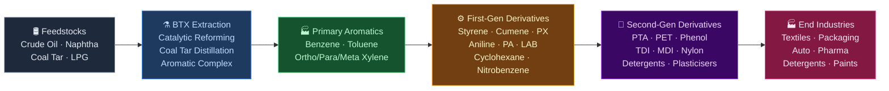
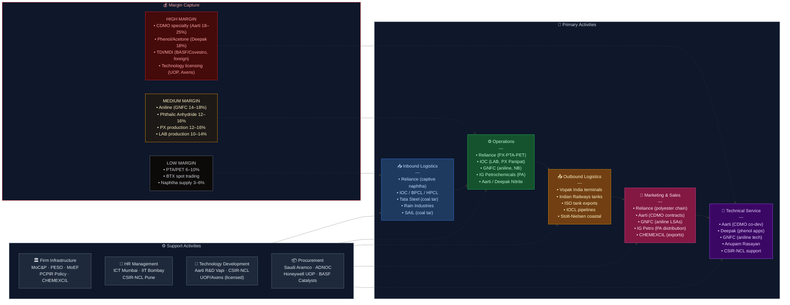

# Aromatics Chemicals Theme — Value Chain Analysis (India)

---

## 0. Segment Definition

**Precise boundary:** This analysis covers the **aromatics value chain in India** — from crude oil/naphtha/coal tar feedstocks through primary aromatic extraction (Benzene, Toluene, Xylene — BTX), to first-generation derivatives (styrene, cyclohexane, cumene, para-xylene, phthalic anhydride, LAB, aniline, nitrobenzene), and second-generation derivatives (PTA, PET, phenol, caprolactam, MDI/TDI, detergents, plasticisers, specialty chemicals). It covers both the petrochemical route (naphtha reforming in refineries) and the coal tar route (coke oven by-products from steel plants).

**Core product/service flow:**

**End customers and what they value most:**

| End Industry | Primary Aromatic Derivative Consumed | Value Driver |
|---|---|---|
| Polyester textiles & PET bottles | Para-xylene → PTA → PET | Price, consistency, volume |
| Detergents & surfactants | Benzene → LAB | Purity, supply reliability |
| Plastics (PS, ABS, SBR) | Benzene → Styrene | Price, grade specification |
| Polyurethane (insulation, foam) | Toluene/Benzene → TDI/MDI | Purity, technical service |
| Nylon 6 (tyre cord, engineering plastics) | Benzene → Cyclohexane → Caprolactam | Quality grade, delivery |
| Phenolic resins, BPA, epoxies | Benzene → Cumene → Phenol/Acetone | Grade, consistency |
| Dyes, pigments, pharma intermediates | Benzene/Toluene → Aniline, nitrobenzene | Purity, regulatory compliance |
| Plasticisers (PVC cables, flooring) | O-xylene → Phthalic Anhydride | Price, technical grade |
| Paints & coatings | Toluene (solvent), Xylene (solvent) | Purity, price |

**India's global position:**
- **Para-xylene → PTA → PET chain: Leader** — Reliance Industries runs the world's largest integrated PX-PTA-PET complex at Jamnagar
- **Benzene derivatives (LAB, aniline, phthalic anhydride): Challenger**
- **Styrene, TDI/MDI, caprolactam: Follower** — significant import dependence
- **Specialty aromatics-derived chemicals: Rising challenger** — Aarti Industries, Deepak Nitrite gaining global share

---

## 1. Value Chain Map — Primary Activities

### 1.1 Inbound Logistics

**What it involves:** Sourcing and receiving the three primary feedstocks that enter the aromatics chain:

1. **Naphtha** — the dominant petrochemical feedstock for aromatics in India; produced as a refinery by-product; transported by pipeline (within integrated complexes like Reliance Jamnagar or IOCL Panipat) or by coastal tanker/rail (for standalone petrochemical crackers). India imports ~4–5 million tonnes of naphtha annually as domestic refinery output is insufficient for petrochemical demand.

2. **Coal tar** — by-product of metallurgical coke production in steel plants; distilled to yield BTX (especially benzene and toluene). India's integrated steel plants (Tata Steel Jamshedpur, JSW Vijayanagar, SAIL plants) produce coal tar that is either distilled in-house or sold to coal tar distillers. This route supplies ~15–20% of India's benzene.

3. **Reformed naphtha / pyrolysis gasoline (pygas)** — by-product of naphtha crackers (primarily Reliance, IOCL) containing aromatics; fed into aromatic extraction units to recover BTX.

**Cost/differentiation drivers:**
- Crude oil price is the ultimate feedstock cost driver — naphtha is priced at crude-linked benchmarks; every $10/bbl crude move shifts naphtha cost ~$70–80/tonne
- Refinery integration — companies with captive naphtha from owned refineries (Reliance, IOCL, BPCL, HPCL) have structural feedstock cost advantage vs standalone petrochemical players who buy naphtha at market
- Coal tar availability is tied to steel production cycles — steel capex booms create surplus coal tar (lower prices); downturns tighten supply
- Import infrastructure (Mundra, Jamnagar, Hazira, Dahej, Nagothane) — proximity to port determines landed cost for importers

**Indian companies active here:**
- **Reliance Industries (NSE: RELIANCE)** — Jamnagar complex; 68 MMTPA refining capacity; largest captive naphtha source for aromatics in India; ₹9.7 lakh Cr revenue FY24
- **Indian Oil Corporation (NSE: IOC)** — Panipat, Mathura, Koyali refineries; produces naphtha and coal tar; runs LAB and PX units; ₹8.7 lakh Cr revenue FY24
- **BPCL (NSE: BPCL)** — Bina, Mumbai, Kochi refineries; naphtha producer
- **HPCL (NSE: HINDPETRO)** — Vizag, Mumbai refineries; naphtha producer; Rajasthan refinery under construction
- **Tata Steel (NSE: TATASTEEL)** — Jamshedpur; coal tar producer; operates coal tar distillation unit
- **JSW Steel (NSE: JSWSTEEL)** — Vijayanagar; coal tar by-product
- **SAIL (NSE: SAIL)** — Multiple plants; coal tar distillation at Durgapur, Bokaro, Bhilai
- **Rain Industries (NSE: RAIN)** — Coal tar distillation; carbon products; Hyderabad

---

### 1.2 Operations (BTX Extraction & Derivative Manufacturing)

**What it involves:** This is the most complex and capital-intensive stage, spanning multiple sub-layers:

**Layer 1 — BTX Extraction (Aromatic Complex):**
Naphtha or pygas is fed into an aromatic complex comprising:
- **Catalytic reformer** — converts naphtha to reformate rich in BTX
- **Aromatic extraction unit** — solvent extraction (sulfolane/NMP process) to separate benzene, toluene, mixed xylenes from non-aromatics
- **Xylene isomerisation + para-xylene separation** (by simulated moving bed / adsorption or crystallisation) — to produce high-purity para-xylene

**Layer 2 — First-Generation Derivatives:**

| Product | Route | Key Indian Producer |
|---|---|---|
| **Para-xylene (PX)** | From mixed xylenes via isomerisation + separation | Reliance (world's largest), IOCL Panipat |
| **LAB (Linear Alkyl Benzene)** | Benzene + linear olefin (Detal/UOP process) | IOCL Vadodara (160,000 MTPA); Reliance |
| **Styrene** | Benzene → Ethylbenzene → Styrene (dehydrogenation) | No Indian producer — 100% imported |
| **Cumene** | Benzene + propylene (zeolite catalyst) | HOCL Rasayani; SI Group India |
| **Cyclohexane** | Benzene hydrogenation | IOCL; small scale |
| **Nitrobenzene** | Benzene nitration | GNFC (NSE: GNFC); Aarti Industries (NSE: AARTIIND) |
| **Aniline** | Nitrobenzene hydrogenation | GNFC; Lanxess India (unlisted) |
| **Phthalic Anhydride (PA)** | O-xylene oxidation | IG Petrochemicals (NSE: IGPL); Thirumalai Chemicals (NSE: TIRUMALCHM); IOCL |
| **Maleic Anhydride** | Benzene oxidation | Thirumalai Chemicals |

**Layer 2 — Second-Generation Derivatives:**

| Product | Route | Key Indian Producer |
|---|---|---|
| **PTA (Purified Terephthalic Acid)** | Para-xylene oxidation | Reliance (world's largest integrated PX-PTA plant); IOC Petrochemicals |
| **PET (Polyethylene Terephthalate)** | PTA + MEG polymerisation | Reliance; Dhunseri Petrochem (NSE: DHUNSERINT) |
| **Phenol / Acetone** | Cumene oxidation (Hock process) | HOCL Rasayani (unlisted PSU); Deepak Nitrite (NSE: DEEPAKNTR) |
| **TDI (Toluene Diisocyanate)** | Toluene → DNT → TDA → TDI | No Indian producer — 100% imported (BASF, Covestro) |
| **MDI (Methylene Diphenyl Diisocyanate)** | Benzene → Aniline → MDI | No Indian producer — 100% imported |
| **Caprolactam** | Cyclohexane → Cyclohexanone → Caprolactam | GSFC (NSE: GSFC) — only Indian producer; Baroda |

**Cost/differentiation drivers:**
- **Scale and integration** — Reliance's Jamnagar complex: crude → naphtha → BTX extraction → PX → PTA → PET → polyester fibre, capturing margin at every step
- **Catalyst technology** — PX separation (UOP Parex vs Axens Eluxyl), aniline hydrogenation selectivity, and PA oxidation yield determine per-tonne economics
- **Energy intensity** — aromatics operations are energy-heavy; captive power (Reliance's 2,200 MW captive at Jamnagar) is a critical cost lever
- **Import substitution gaps** — styrene, TDI, MDI are 100% imported; caprolactam is near-monopoly (GSFC); these are the highest-value gaps in India's aromatics chain

**Indian companies active here:**
- **Reliance Industries (NSE: RELIANCE)** — Jamnagar; PX, PTA, PET, polyester; world scale; unmatched integration
- **Indian Oil Corporation (NSE: IOC)** — Panipat PX unit; Vadodara LAB plant
- **GNFC (NSE: GNFC)** — Bharuch; aniline (India's largest domestic producer), nitrobenzene, toluene derivatives; ₹4,500 Cr revenue FY24
- **IG Petrochemicals (NSE: IGPL)** — Taloja; India's largest PA producer; ₹1,900 Cr revenue FY24; EBITDA margin ~15%
- **Thirumalai Chemicals (NSE: TIRUMALCHM)** — Ranipet; phthalic anhydride + maleic anhydride; ₹2,100 Cr revenue FY24
- **Aarti Industries (NSE: AARTIIND)** — Vapi/Jhagadia; benzene-based specialty chemicals; CDMO; ₹7,200 Cr revenue FY24; EBITDA ~18%
- **Deepak Nitrite (NSE: DEEPAKNTR)** — Nandesari/Dahej; phenol, acetone, nitrotoluene, OBA; ₹6,800 Cr group revenue FY24
- **GSFC (NSE: GSFC)** — Baroda; India's only caprolactam producer; ₹4,100 Cr revenue FY24
- **HOCL (NSE: HOCL)** — Rasayani; phenol, acetone, beta-naphthol; PSU; under restructuring
- **Dhunseri Petrochem (NSE: DHUNSERINT)** — Haldia; PET resin; ₹3,200 Cr revenue FY24
- **Rain Industries (NSE: RAIN)** — Coal tar distillation; carbon black feedstock; benzene from coal tar route

---

### 1.3 Outbound Logistics

**What it involves:** BTX and derivative chemicals are transported from production sites to downstream consumers via:
- **Pipeline** — within integrated complexes (Reliance internal pipelines; IOCL's Panipat-Delhi product pipeline)
- **Tank trucks** — for liquid aromatics (benzene, toluene, xylene, styrene, phenol, LAB) within 500 km radius; hazmat certified (Class 3 flammable liquid)
- **Rail tank wagons** — for bulk liquid chemicals over long distances
- **ISO tank containers** — for export of specialty aromatics-derived chemicals (Aarti Industries, Deepak Nitrite export via Mundra, JNPT)
- **Bulk liquid terminals** — Vopak India, Indian Oiltanking, BPCL terminals handle BTX storage and distribution

**Cost/differentiation drivers:**
- Aromatics are hazmat liquids — specialised tank infrastructure raises last-mile cost and limits distributor options
- Proximity of petrochemical complex to port (Reliance Jamnagar, Aarti Vapi near Hazira, GNFC Bharuch near Dahej) enables cost-competitive export logistics
- Inventory management — benzene price moves rapidly with crude; holding 30 days of inventory creates significant P&L exposure

**Key logistics players:**
- **Vopak India (unlisted)** — Chemical liquid bulk storage terminals at Hazira, Mundra, JNPT
- **IOCL's pipeline network** — naphtha and petrochemical product movement
- **Indian Railways (tank wagon operators)** — bulk chemical rail movement
- **Stolt-Nielsen India (unlisted)** — chemical tanker shipping for coastal movement

---

### 1.4 Marketing & Sales

**What it involves:** Aromatics and derivatives are almost entirely B2B, sold through:
- **Long-term supply agreements (LSAs)** — dominant mode for commodity aromatics (PTA → polyester manufacturers; LAB → detergent makers); typically annual price-linked contracts
- **Spot market** — for BTX; prices track international benchmarks (benzene CFR India, PX Asia contract)
- **Export sales** — Aarti Industries sells ~40% of volumes to global specialty chemical companies (BASF, Bayer, Clariant) under 3–5 year take-or-pay CSM/CDMO arrangements
- **Distributors** — for smaller quantities of specialty derivatives (phthalic anhydride, maleic anhydride to small plasticiser and resin manufacturers)

**Cost/differentiation drivers:**
- **Benchmark pricing** — commodity aromatics (benzene, toluene, PX) are priced off Asian spot benchmarks; sellers have no pricing power
- **Reliability of supply** — for downstream polyester/PET/nylon manufacturers, supply disruption is catastrophic; long-term reliable supplier relationships command 3–5% price premium
- **Technical sales capability** — specialty derivatives require chemistry-literate sales teams (Aarti's sales force is a genuine differentiator)
- **Export market access** — CHEMEXCIL provides export facilitation

**Key players:**
- Reliance — direct long-term contracts with all major Indian polyester/PET manufacturers
- IOCL — government-to-government sales of LAB; also open market
- Aarti Industries — direct CSM/CDMO relationships with 6–8 global MNCs
- GNFC — direct supply of aniline to rubber chemical manufacturers (Lanxess, Nocil)

---

### 1.5 Service (Technical Support, R&D Co-development)

**What it involves:** In commodity aromatics (BTX, PTA, PET), after-sales service is minimal. In specialty aromatics derivatives, technical service is increasingly important:
- **Application development support** — helping customers formulate with a new intermediate
- **Regulatory/compliance support** — REACH registration for export, BIS certification for domestic
- **Process optimisation co-development** — Aarti's CDMO business involves co-development of synthesis routes with global innovators; the highest-margin, highest-stickiness service model in the aromatics chain

**Key players:**
- **Aarti Industries** — most developed technical service capability; co-development team of ~200 scientists at Vapi R&D centre
- **Deepak Nitrite** — growing technical service for phenol/acetone customers (paints, epoxy, BPA)
- **GNFC** — technical support for aniline customers (rubber chemicals, polyurethane downstream)

---

## 2. Value Chain Map — Support Activities

### 2.1 Firm Infrastructure (Governance, Regulation, Finance)

**Role:** Aromatics manufacturing is subject to multi-layer regulation — environment (MoEF&CC, State PCBs), safety (PESO for storage of flammable aromatics), and chemical import/export controls (DGFT, Hazardous Chemicals Rules 1989). Large capex projects require EIA approvals — timelines of 2–4 years.

**Key institutions:**
- **Ministry of Chemicals & Petrochemicals (MoC&P)** — sector regulator; PCPIR policy
- **PESO** — storage and handling of Class 3 flammable aromatic liquids
- **MoEF&CC / State PCBs** — environmental clearances
- **CHEMEXCIL** — export promotion body for chemicals
- **DPIIT** — PLI scheme for specialty chemicals
- **SBI, HDFC Bank, ICICI Bank, EXIM Bank** — project finance

**Strengths/weaknesses:**
- **Strength:** PCPIR policy (Dahej, Haldia, Visakhapatnam, Paradip PCPIRs) creates infrastructure clusters that reduce logistics cost for co-located aromatics plants
- **Weakness:** Environmental clearance timelines are the #1 capex delay factor; Aarti's Jhagadia expansion faced 18-month PCB delays
- **Weakness:** No PLI scheme for commodity petrochemicals; feedstock pricing policy (naphtha at import parity) puts Indian players at disadvantage vs Middle East ethane-based or Chinese coal-based producers

---

### 2.2 HR Management

**Role:** Aromatics requires chemical engineers (process design, plant operation), analytical chemists (quality control, R&D), HSE specialists (hazmat handling), and data scientists (for process optimisation).

**Strengths/weaknesses:**
- **Strength:** India's large chemical engineering graduate output (IITs, NIT Trichy, NIT Surathkal, ICT Mumbai, HBTU Kanpur) provides a deep talent pool
- **Strength:** ICT Mumbai is a globally recognised institution that has trained most of India's senior chemical industry leadership
- **Weakness:** Experienced process engineers with 10+ years in aromatic complex operations are scarce — Reliance, IOCL, and HPCL compete intensely for this profile
- **Weakness:** HSE-certified personnel for hazardous chemical handling (COSHH, Process Safety Management) are undersupplied

**Key institutions:**
- **ICT Mumbai (Institute of Chemical Technology)** — India's premier chemical engineering institution
- **IIT Bombay, IIT Madras, IIT Kharagpur** — chemical engineering talent
- **CSIR-NCL (National Chemical Laboratory, Pune)** — process chemistry R&D

---

### 2.3 Technology Development

**Role:** Aromatics chemistry is mature at the commodity level — all licensed from UOP/Honeywell, Axens, Invista, BP Chemicals. The technology frontier is in specialty derivative synthesis, green chemistry, process intensification, and chemical recycling of PET.

**Strengths/weaknesses:**
- **Strength:** Aarti Industries' Vapi R&D centre (~200 scientists) is genuinely world-class for benzene derivative chemistry; holds significant proprietary process IP
- **Strength:** Deepak Nitrite's Nandesari R&D — co-developed OBA and phenol/acetone process in-house
- **Weakness:** For commodity aromatics (BTX extraction, PX-PTA), India is 100% dependent on foreign licensors (UOP, Axens, Invista/Koch) — every new plant pays licence fees
- **Weakness:** BIM adoption is nascent; chemical recycling of PET is 5–10 years from commercial scale in India

**Key institutions/companies:**
- **CSIR-NCL Pune** — catalysis, green chemistry R&D
- **Aarti Industries R&D Centre (Vapi)** — most sophisticated private sector aromatic chemistry R&D in India
- **Reliance Research & Technology Centre (Jamnagar)** — process optimisation for PX-PTA-PET complex

---

### 2.4 Procurement

**Role:** Procurement of feedstock (naphtha, coal tar) and catalysts (reforming, hydrogenation, oxidation) are the critical functions. Catalyst sourcing is entirely from global suppliers — no Indian catalyst manufacturer operates at commercial scale for aromatics processes.

**Strengths/weaknesses:**
- **Strength:** India's domestic refinery output meets a large portion of naphtha demand
- **Weakness:** Styrene, TDI, MDI — entirely imported; procurement teams have no leverage on global producers (BASF, Dow, Covestro, LG Chem)
- **Weakness:** Reforming and hydrogenation catalysts are 100% imported; lifecycle management is a technical and financial burden

**Key suppliers:**
- **Honeywell UOP** — PX separation technology + catalysts; Parex adsorbent
- **Axens (France)** — Eluxyl PX separation; BTX extraction
- **BASF Catalysts** — reforming and hydrogenation catalysts
- **Clariant (Switzerland)** — specialty catalysts for PA and maleic anhydride
- **Invista / Koch** — PTA technology (used at Reliance Jamnagar)

---

## 3. Five Forces Analysis

### Supplier Power — HIGH (Commodity) / MEDIUM (Specialty)

For commodity aromatics, supplier power is exercised at two levels. First, **crude oil/naphtha suppliers** (Saudi Aramco, Abu Dhabi ADNOC, Iraq SOMO — India's primary crude sources) effectively set the floor cost for all aromatics. Every naphtha-based aromatics producer in India is a price-taker on their primary input. Second, **technology licensors** (UOP/Honeywell, Axens, Invista) extract rent through upfront licence fees (typically $5–15 million per technology block) and ongoing catalyst/adsorbent supply contracts — catalyst replacement alone can cost $20–50 million per cycle for a large PX unit. For specialty derivatives, supplier power is lower — benzene, toluene, and nitric acid (inputs to Aarti's specialty chemistry) are available from multiple domestic and international sources. India's aromatics chain is built on technology owned by American and French firms; there is no indigenised alternative for any core aromatic process technology.

### Buyer Power — HIGH (PTA/PET) / MEDIUM (Specialty Derivatives)

In the PTA-PET sub-chain, India's top 10 polyester manufacturers account for 80%+ of PTA demand. Reliance's scale gives it pricing discipline, but Antidumping Duty protection against Chinese PTA imports reveals the underlying competitiveness anxiety. In specialty derivatives (aniline, phthalic anhydride, specialty nitro-aromatics), buyer power is medium — 5–15 buyers per product segment, long-term supply agreements limit spot switching. In Aarti's CDMO model, buyer power is low — the CSM/CDMO relationship creates bilateral lock-in; switching a synthesis supplier for a complex benzene-derived intermediate takes 12–18 months of requalification.

### Threat of New Entrants — LOW (Commodity) / MEDIUM (Specialty)

For commodity aromatics (BTX extraction, PX-PTA-PET), entry barriers are extreme: a world-scale PX-PTA complex costs $3–5 billion; technology licences are controlled by 3–4 global firms; environmental clearances take 3–5 years; and Reliance has a 20-year learning curve advantage plus feedstock integration that cannot be replicated. For specialty derivatives (benzene → chlorobenzene → specialty intermediates), entry requires ₹100–500 Cr capex, process chemistry know-how, and hazmat handling permits — medium barriers. Recent entrants Anupam Rasayan, Clean Science & Technology, and Ami Organics confirm the medium-entry-barrier nature of specialty aromatics derivatives.

### Threat of Substitutes — LOW

Aromatic chemistry is largely irreplaceable for its end applications. PET cannot be substituted for bottle-grade packaging at comparable cost (bio-PET is 3–4x more expensive). Nylon 6 (from caprolactam/cyclohexane) has no commercially viable substitute for tyre cord at scale. LAB for detergents has no cost-competitive substitute. The only meaningful substitution risk is: (a) bio-based routes to aromatics (lignin pyrolysis → BTX) which remain pre-commercial globally; (b) PET to bio-PET or rPET for packaging (where ESG pressure from MNC brand owners is creating genuine demand shift).

### Rivalry Intensity — LOW (Commodity, Reliance Dominant) / HIGH (Specialty)

India's commodity aromatics sub-segment is structurally oligopolistic. Reliance commands 60–70% of PTA capacity; IOCL has the LAB near-monopoly; GSFC is the sole caprolactam producer. In specialty derivatives (phthalic anhydride — IG Petro vs Thirumalai; aniline — GNFC vs Lanxess; specialty benzene derivatives — Aarti vs Deepak vs multiple smaller players), rivalry is high: 5–10 players compete for similar customer sets, export market share in the same geographies, and the same China+1 demand pool. PA margins were under severe pressure in FY23–24 when IG Petro and Thirumalai both expanded capacity simultaneously.

### Five Forces Summary Table

| Force | Intensity | Key Driver |
|---|---|---|
| Supplier Power | High (commodity) / Medium (specialty) | Crude/naphtha price exposure; technology licensor monopoly |
| Buyer Power | High (PTA/PET) / Medium (specialty) | Concentrated polyester buyers; specialty has bilateral lock-in |
| Threat of New Entrants | Low (commodity) / Medium (specialty) | $3–5 Bn entry cost for PX-PTA; ₹100–500 Cr for specialty |
| Threat of Substitutes | Low | Aromatics irreplaceable in most end applications |
| Rivalry Intensity | Low (commodity oligopoly) / High (specialty) | Reliance dominates commodity; specialty is intensely competitive |

**Overall Attractiveness: MEDIUM-HIGH**
Structural attractiveness is high in commodity (oligopoly, substitution-resistant) but value capture is constrained by technology rent and crude exposure; specialty aromatics derivatives offer the best risk-adjusted return profile — medium entry barriers, high differentiation potential, and strong China+1 tailwinds.

---

## 4. GVC Governance & India's Position

### Lead Firms (Global)
- **BASF SE (Germany)** — world's largest chemical company; governs MDI/TDI, specialty aromatics markets
- **Covestro (Germany)** — leads TDI/MDI supply chain; no Indian competitor
- **Honeywell UOP (USA)** — governs PX separation technology globally
- **Invista / Koch (USA)** — PTA technology; polyester chain standards
- **China's Hengli/Rongsheng** — now the global cost benchmark for PX-PTA-PET

### Lead Firms (Indian)
- **Reliance Industries** — the only Indian aromatics firm that genuinely governs a sub-chain (PX-PTA-PET in India); sets domestic PTA pricing
- **Aarti Industries** — de facto lead firm in Indian benzene-derivative specialty chemistry; global pharmaceutical and agrochem MNCs treat Aarti as a preferred CSM/CDMO partner

### Governance Type: Market (Commodity BTX) + Relational (Specialty CDMO) + Hierarchy (Reliance PX-PTA-PET)

- **Market governance** for BTX spot trading — benzene, toluene, xylene prices are fully transparent, internationally benchmarked; buyers switch suppliers freely
- **Hierarchy governance** within Reliance's PX-PTA-PET complex — Reliance is simultaneously the technology operator, the PTA manufacturer, and the polyester producer; internal transfer price determines margin distribution
- **Relational governance** for specialty CDMO — Aarti's relationships with BASF, Bayer, Clariant involve bilateral lock-in, co-development, and multi-year take-or-pay

### Value Capture Map

| Stage | Margin Level | Who Captures |
|---|---|---|
| Crude oil / naphtha supply | High (20–30% on crude) | OPEC + Middle East NOCs (Saudi Aramco, ADNOC) |
| BTX extraction / aromatic complex | Medium (8–12% EBITDA) | Reliance, IOCL (integrated players) |
| Para-xylene production | Medium-High (12–18%) | Reliance (scale advantage at Jamnagar) |
| PTA production | Medium (8–12%) | Reliance; protected by AD duty |
| PET/polyester production | Low-Medium (6–10%) | Reliance, Dhunseri, JBF |
| LAB production | Medium (10–14%) | IOCL (near-monopoly in India) |
| Phthalic Anhydride | Medium (12–18%) | IG Petrochemicals, Thirumalai (volatile — PA-OX spread) |
| Aniline | Medium-High (14–20%) | GNFC (domestic near-monopoly) |
| Specialty benzene derivatives (CDMO) | High (18–25% EBITDA) | Aarti Industries, Deepak Nitrite |
| TDI/MDI (imported) | High (20–30%) | BASF, Covestro, LG Chem (all foreign) |
| Technology licensing (UOP, Axens) | Very High (pure IP rent) | Honeywell UOP, Axens (foreign) |

### India's Position & Upgrade Trajectory

India is simultaneously at multiple upgrade stages:
- **PX-PTA-PET:** Stage 2 (Product) — world-class at this specific product chain but no functional/chain upgrade attempted
- **Specialty benzene derivatives (Aarti, Deepak):** Stage 3 (Functional) — moving from pure chemical supply to CDMO services; co-developing molecules
- **TDI/MDI, caprolactam expansion, styrene:** Stage 1 (Process) — either absent or nascent; imports dominate

India is **moving up the ladder** in specialty derivatives. The China+1 tailwind (global MNCs reducing China chemical dependency post-2020) is the single biggest structural driver.

---

## 5. Key Linkages & Leverage Points

### Linkage 1: Naphtha Cost → All Downstream Margins
Every stage downstream of naphtha extraction is exposed to crude price movement. A $20/bbl crude swing alters naphtha cost by ~$140/tonne — directly impacting margin of every producer from BTX extractor to PTA manufacturer to phenol producer. Companies that are not integrated with a refinery face this pass-through risk on every quarterly result. The only structural hedge is: (a) integration backward into refining (Reliance's model), or (b) accepting feedstock price as a pass-through in customer contracts (Aarti's specialty CDMO model).

### Linkage 2: PX Production → PTA → Polyester Chain Competitiveness
India's polyester industry's global competitiveness is entirely dependent on Reliance's PX-PTA pricing. The Antidumping Duty on Chinese PTA imports is the policy band-aid holding this linkage together. Any removal of AD duty would cascade: PTA margins collapse → Reliance's polyester integration logic fractures → India's entire synthetic textile chain faces structural threat.

### Linkage 3: BTX Import Gaps → Specialty Chemical Capacity Constraint
India imports ~80% of its styrene requirements (~1.5 million MTPA). Every PS/ABS/SBR manufacturer pays a landed import cost premium. Similarly, 100% TDI/MDI import dependence makes India's polyurethane foam and rigid insulation industries permanently import-dependent. Building styrene and TDI/MDI capacity is the single highest-leverage intervention in the Indian aromatics chain.

### Linkage 4: CDMO Relationship Quality → Long-term Revenue Visibility
Aarti's transformation from a commodity benzene-derivative manufacturer to a specialty CDMO took 15 years of consistent delivery. Every successful molecule delivery → reference for next customer → higher-complexity molecule assignment → higher margin. Aarti's ₹4,500 Cr+ CDMO order book (multi-year contracts) represents this linkage at its most advanced.

### Linkage 5: Environmental Compliance → Plant Uptime → Customer Trust
Aarti Industries, Deepak Nitrite, and GNFC have all faced periodic Gujarat/Maharashtra PCB shutdowns. For a CDMO customer (BASF, Bayer) that has qualified an Indian supplier after 18 months of audit and regulatory review, a PCB-forced shutdown is a supply chain crisis.

**Single Highest-Leverage Intervention: Building domestic styrene production capacity.** India imports 1.3–1.5 million MTPA of styrene annually at a cost of ~$1.5–2 Bn per year. A world-scale (500,000 MTPA) Indian styrene plant would: (a) eliminate the import bill; (b) enable India's PS/ABS/EPS industries to compete globally; (c) create a downstream cascade into acrylonitrile-styrene derivatives.

---

## 6. Indian Company Landscape

### Listed Companies

| Value Chain Stage | Company Name | Listed? | Exchange & Ticker | Business Description | Approx. Revenue / Market Cap | Position in Chain |
|---|---|---|---|---|---|---|
| Feedstock + Full Integration | Reliance Industries | Yes | NSE: RELIANCE | World's largest integrated PX-PTA-PET complex at Jamnagar; BTX extraction, polyester | ₹9.7 lakh Cr revenue FY24; Mkt cap ~₹19 lakh Cr | Leader |
| Feedstock + LAB + PX | Indian Oil Corporation | Yes | NSE: IOC | Naphtha source; Panipat PX unit; Vadodara LAB (160,000 MTPA) | ₹8.7 lakh Cr revenue FY24; Mkt cap ~₹1.7 lakh Cr | Leader |
| Feedstock | BPCL | Yes | NSE: BPCL | Naphtha producer from Bina, Mumbai, Kochi refineries | ₹5.4 lakh Cr revenue FY24 | Supplier |
| Feedstock | HPCL | Yes | NSE: HINDPETRO | Naphtha producer; Rajasthan refinery with planned petrochemical complex | ₹4.9 lakh Cr revenue FY24 | Supplier |
| BTX + Aniline + Nitrobenzene | GNFC | Yes | NSE: GNFC | Bharuch; aniline (India's largest domestic producer), nitrobenzene, toluene derivatives | ₹4,500 Cr revenue FY24; Mkt cap ~₹6,500 Cr | Leader (aniline) |
| Phthalic Anhydride | IG Petrochemicals | Yes | NSE: IGPL | Taloja; India's largest PA producer; PA from O-xylene oxidation | ₹1,900 Cr revenue FY24; Mkt cap ~₹3,800 Cr; EBITDA ~15% | Leader (PA) |
| PA + Maleic Anhydride | Thirumalai Chemicals | Yes | NSE: TIRUMALCHM | Ranipet; phthalic anhydride + maleic anhydride + diethyl maleate | ₹2,100 Cr revenue FY24; Mkt cap ~₹2,200 Cr | Challenger (PA) |
| Specialty Benzene Derivatives | Aarti Industries | Yes | NSE: AARTIIND | Vapi/Jhagadia; nitrobenzene, aniline, chlorobenzene, dyes intermediates, pharma intermediates; CDMO | ₹7,200 Cr revenue FY24; Mkt cap ~₹25,000 Cr; EBITDA ~18% | Leader (specialty) |
| Phenol/Acetone + Specialty | Deepak Nitrite | Yes | NSE: DEEPAKNTR | Nandesari/Dahej; phenol, acetone, nitrotoluenes, OBA; India's first merchant phenol producer | ₹6,800 Cr group revenue FY24; Mkt cap ~₹22,000 Cr | Leader (phenol) |
| Caprolactam | GSFC | Yes | NSE: GSFC | Baroda; India's only caprolactam producer; nylon chain anchor | ₹4,100 Cr revenue FY24; Mkt cap ~₹8,500 Cr | Monopoly (caprolactam) |
| PET Resin | Dhunseri Petrochem | Yes | NSE: DHUNSERINT | Haldia; PET resin; food-grade packaging and industrial grades | ₹3,200 Cr revenue FY24; Mkt cap ~₹1,500 Cr | Challenger (PET) |
| Coal Tar / BTX (coal route) | Rain Industries | Yes | NSE: RAIN | Coal tar distillation; carbon black feedstock; benzene from coal tar | ₹12,500 Cr revenue FY24; Mkt cap ~₹3,800 Cr | Niche (coal tar BTX) |
| Phenol / Beta-naphthol | HOCL | Yes | NSE: HOCL | Rasayani; phenol, acetone, beta-naphthol; PSU; under strategic disinvestment | ₹~800 Cr revenue; Mkt cap ~₹500 Cr | Distressed |
| Specialty Benzene Downstream | Anupam Rasayan | Yes | NSE: ANURAS | Sachin (Surat); specialty chemicals from benzene/toluene base; pharma + agrochem CDMO | ₹1,200 Cr revenue FY24; Mkt cap ~₹5,500 Cr | Emerging |
| Dyes Intermediates / Chlorobenzene | Bodal Chemicals | Yes | BSE: 524370 | Dyes intermediates, sulphuric acid, chlorobenzene; Vatva, Gujarat | ₹~1,500 Cr revenue | Niche |

### Unlisted / Private Companies

| Value Chain Stage | Company Name | Listed? | Details | Business Description | Scale | Position |
|---|---|---|---|---|---|---|
| Cumene + Phenolic Resins | SI Group India | No (US parent) | SI Group (USA) | Cumene-based phenolic resins; Baroda; specialty applications | Not disclosed | Niche |
| Styrene (importer/compounder) | INEOS Styrolution India | No (Subsidiary) | INEOS (UK parent) | ABS, polystyrene compounding; imports styrene from parent | Not disclosed | Distributor |
| TDI/MDI (distributor/buyer) | Lanxess India | No (Subsidiary) | Lanxess (Germany) | TDI, MDI, rubber chemicals; aniline consumption for MDI precursors | Not disclosed | Buyer of aniline |
| MDI (importer/formulator) | Covestro India | No (Subsidiary) | Covestro (Germany) | MDI, TDI, polycarbonate; imports all precursors | Not disclosed | Buyer |
| Liquid Chemical Storage | Vopak India | No (JV) | Vopak (Netherlands) | Chemical bulk liquid storage; Hazira, Mundra, JNPT terminals | Not disclosed | Infrastructure |

### Notable Companies — Deeper Notes

**Aarti Industries (NSE: AARTIIND)**
- Stage: Specialty benzene derivative manufacturing + CDMO
- What makes them interesting: India's most complete aromatics-based specialty chemical platform. Started from benzene-based disulphonation chemistry 40 years ago; now runs 14 manufacturing sites and supplies over 150 global customers across pharma, agrochem, and polymer specialties. CDMO order book of ₹4,500+ Cr (multi-year contracts) represents the highest-quality revenue in Indian aromatics — locked-in, high-margin, requalification-protected. FY25 demerger separated the pharma CDMO (Aarti Pharmalabs) from the industrial chemical business, crystallising two distinct growth vectors.
- Key financials: Revenue ₹7,200 Cr FY24 (group); industrial EBITDA margin ~18–20%; Mkt cap ~₹25,000 Cr.
- Watch factor: Execution on new Jhagadia Phase 3 capacity expansion (₹2,000 Cr capex) — will determine whether Aarti can sustain 15% revenue CAGR through FY27.

**IG Petrochemicals (NSE: IGPL)**
- Stage: Phthalic anhydride (PA) production
- What makes them interesting: India's largest and most efficient PA producer at Taloja (Maharashtra). Benefits from the O-xylene → PA spread, which is linked to plasticiser demand (PVC cables, flooring, artificial leather). PA is a deceptively cyclical product — capacity additions by Thirumalai simultaneously suppressed PA-OX spreads in FY23–24. IG's operating leverage means EBITDA can swing 300–500 bps in a single year on spread movements.
- Key financials: Revenue ₹1,900 Cr FY24; EBITDA margin ~15% (down from ~22% in FY22); Mkt cap ~₹3,800 Cr.
- Watch factor: PA-OX spread recovery — any Chinese PA capacity rationalisation would be a catalyst.

**Deepak Nitrite (NSE: DEEPAKNTR)**
- Stage: Phenol/Acetone + Specialty nitro-aromatics
- What makes them interesting: Made the bravest bet in Indian aromatics — commissioned India's first merchant phenol plant at Dahej in 2020 (previously 100% imported). Now India's dominant phenol supplier at ~200,000 MTPA capacity. Phenol enables Deepak to supply BPA, epoxy resin, and pharmaceutical intermediates. Their OBA (Optical Brightening Agent) division has a global leadership position. The combination of commodity phenol scale + specialty chemistry = a two-speed business generating consistent 16–20% EBITDA margins.
- Key financials: Revenue ₹6,800 Cr group FY24; Deepak Phenolics (phenol sub) ₹4,000 Cr; EBITDA margin ~18%; Mkt cap ~₹22,000 Cr.
- Watch factor: Second phenol expansion (announced) — would make Deepak India's dominant phenol/BPA platform.

**GNFC (NSE: GNFC)**
- Stage: Aniline + Nitrobenzene + Toluene derivatives
- What makes them interesting: India's largest aniline producer at Bharuch — a quasi-monopoly in domestic aniline supply. Aniline is the precursor to MDI (methylene diphenyl diisocyanate — the largest-volume isocyanate globally). As India's MDI consumption grows (polyurethane insulation for cold chain, construction), GNFC's aniline becomes increasingly strategic. TAN (Toluene + Aniline + Nitric acid) complex at Bharuch is a genuine integrated specialty asset.
- Key financials: Revenue ₹4,500 Cr FY24; EBITDA margin ~18%; Mkt cap ~₹6,500 Cr.
- Watch factor: Whether GNFC integrates forward into MDI (partnering with a global isocyanate player) — would be a transformational move.

**GSFC (NSE: GSFC)**
- Stage: Caprolactam (Nylon 6 chain anchor)
- What makes them interesting: India's only caprolactam producer — a strategic monopoly in the nylon 6 supply chain. Every Indian nylon 6 plant buys from GSFC or imports. GSFC's caprolactam plant at Baroda (capacity ~60,000 MTPA) is undersized relative to India's demand (~120,000 MTPA) — India imports 50%+ of caprolactam needs.
- Key financials: Revenue ₹4,100 Cr FY24; EBITDA margin ~14%; Mkt cap ~₹8,500 Cr.
- Watch factor: Caprolactam capacity expansion decision — if GSFC expands to 120,000 MTPA, it ends India's structural caprolactam import dependence.

---

## 7. Strategic Insight

**Non-obvious insight:** India's aromatics chain is structurally bifurcated in a way that most sector analyses miss. At the commodity end (PX-PTA-PET), India has a **world-class, globally competitive platform** — Reliance's Jamnagar complex can match the best in the world on throughput and integration. At the specialty end (Aarti, Deepak, GNFC), India is building genuine global positions in benzene-derivative CDMO chemistry. **The structural gap is the middle** — first-generation derivatives that should exist in India but don't: styrene (1.5 MMTPA import), TDI (200,000 MTPA import), MDI (300,000 MTPA import), caprolactam (60,000 MTPA import gap). These are not nascent products — the global technology is mature, the domestic demand is established, and the economics are viable. The reason they don't exist in India is a combination of policy uncertainty, environmental clearance risk, and the fact that the most capable potential builders (Reliance, IOCL) have chosen not to prioritise them. Whoever builds India's first styrene plant will own the most strategically important missing link in the Indian aromatics chain.

**Blue Ocean Opportunity — Four Actions Framework:**

| Action | What |
|---|---|
| **Eliminate** | The commodity mindset in BTX trading — stop competing on spot benzene/toluene price and eliminate exposure to 90-day spot pricing cycles; move all volumes to annual formula-linked contracts with downstream users |
| **Reduce** | Technology licence dependency for mature processes — negotiate perpetual licences (rather than per-plant licences) with UOP/Axens for standard aromatic extraction; reduce recurring IP rent as a percentage of EBITDA |
| **Raise** | CDMO depth — raise the complexity of molecules served (from simple nitro-aromatics at ₹40/kg to complex multi-step benzene-derived APIs at ₹400/kg); Aarti's trajectory shows this is achievable |
| **Create** | **An integrated aromatics-to-MDI platform** — GNFC (aniline) + a global isocyanate partner (BASF/Covestro/Wanhua) forming a JV to produce MDI in India; this would be India's first MDI plant, would convert GNFC's aniline from a commodity to a captive feedstock, and would address India's ₹5,000+ Cr annual MDI import bill. Wanhua Chemical (China's MDI giant, expanding globally) is the natural JV partner. |

**Top 3 Priorities for an Indian Aromatics Firm Seeking Durable Advantage:**

1. **Build or co-invest in styrene capacity.** The 1.5 MMTPA styrene import gap is the biggest single unaddressed opportunity in Indian aromatics. A 500,000+ MTPA styrene plant (IOCL at Paradip, Reliance at Jamnagar, or a new entrant at Dahej PCPIR) creates a structural cost advantage for India's entire PS/ABS/SBR/EPS downstream — and owns the most strategically scarce asset in the Indian aromatic chain for a decade.

2. **Pursue the aniline → MDI integration.** GNFC's aniline monopoly is currently monetised at commodity aniline margins (~₹45,000/tonne). MDI prices at $2,000–2,500/tonne imply the aniline-to-MDI conversion adds 5–6x value per tonne. A GNFC-Wanhua JV would position India as an MDI exporter within 5 years. This is a ₹3,000–4,000 Cr investment that addresses a ₹10,000+ Cr annual import.

3. **Deepen the CDMO moat through regulatory pre-qualification.** Aarti and Deepak's CDMO businesses face a ceiling — global MNC customers will only assign high-complexity, high-volume molecules to suppliers pre-qualified under REACH (EU), EPA (USA), and PMDA (Japan). Indian specialty aromatics firms that invest proactively in REACH registration for their full product portfolio create an irreversible qualification advantage over Chinese competitors who face REACH compliance headwinds.

---

## 8. Value Chain Diagram (Mermaid)

