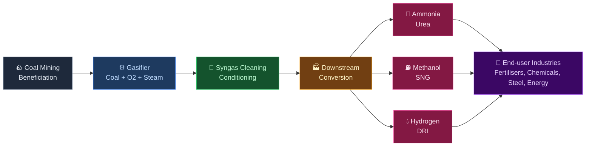
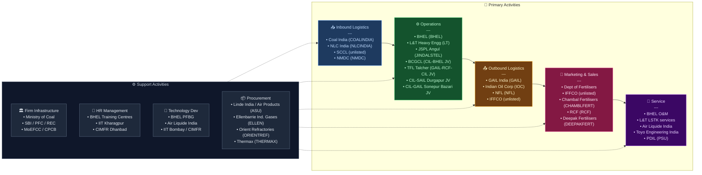

# Coal Gasification in India — Value Chain Analysis

*Analysis date: June 2026. Updated: July 2026.*

---

## 0. Segment Definition

**Precise boundary:** Surface coal/lignite gasification — the thermochemical conversion of solid coal into synthesis gas (syngas: CO + H₂) using steam and controlled oxygen, and the downstream processing of that syngas into industrial chemicals, fuels, and fertilisers. Underground Coal Gasification (UCG) is excluded from the core chain; so is coal combustion for power. (UCG pilots and feasibility studies — e.g. ECL's Kasta pilot, NLC India–Reliance's Gujarat lignite project — are noted where they signal capital-allocation intent, but are not analysed as part of the primary surface-gasification chain.)

**Core product/service flow:**

**End customers and what they value most:**
- Fertiliser manufacturers (IFFCO, NFL, Chambal, RCF, Deepak Fertilisers): feedstock price certainty, import substitution
- Steel mills (JSPL, SAIL): lower-cost reducing gas vs. natural gas
- Chemical companies (GAIL, RCF): reliable, domestically sourced syngas
- Government: energy security, USD import bill reduction, rural employment

**India's global position:** **Follower / emerging challenger.** China operates >80% of the world's coal gasification capacity. The US, South Africa (Sasol), and China are established players. India is at the very early stages of commercial scale — with only one operating facility at scale (JSPL Angul, DRI-focused). The ₹37,500 crore government scheme (approved May 2026, bidding framework notified June 26, 2026) marks the inflection point from policy intent to funded execution. Draft bidding documents are expected end-June/early-July 2026, with each bidding round open for two months — meaning the first live catalyst window falls within Q3 2026. The scheme targets gasification of ~75 MT/year of coal and lignite (toward the national 100 MT-by-2030 goal) and is expected to mobilise **₹2.5–4 lakh crore** in investment across ~25 projects, with an estimated ₹3 lakh crore/year in FX savings once at scale.

---

## 0.5 Quick Scan — Investable Listed Companies

| Company | Ticker | Cap Bucket | Chain Stage | One-Line Investment Thesis | Coverage |
|---|---|---|---|---|---|
| Coal India | NSE: COALINDIA | Large | Feedstock / JV equity | Gatekeeper of coal linkages; equity partner in 3 separate gasification JVs (BHEL, GAIL, SAIL) at near-zero incremental capex to its core business | Well-covered |
| BHEL | NSE: BHEL | Large | Gasifier tech / EPC | Sole indigenous gasifier technology (PFBG); a proven Jharsuguda outcome could re-rate BHEL from declining power EPC to anchor tech company for a multi-decade programme | Well-covered |
| Jindal Steel & Power | NSE: JINDALSTEL | Large | Operations / DRI | Only company with commercially proven coal gasification in India; 25.2 MTPA steel expansion keeps gasification structurally central, not peripheral | Well-covered |
| L&T (Heavy Engineering) | NSE: LT | Large | EPC | Scheme-linked LSTK wins (BCGCL, TFL) add optionality within a diversified order book; not a pure-play but a reliable beneficiary of every new FID | Well-covered |
| GAIL India | NSE: GAIL | Large | Distribution / JV equity | Equity in TFL plus the new CIL–GAIL Sonepur Bazari SNG JV (~₹13,000 Cr, FY29 target) positions GAIL as the pipeline backbone for gasification-derived gas | Well-covered |
| SAIL | NSE: SAIL | Large | Emerging JV (DRI) | New CIL–SAIL Durgapur syngas-for-DRI JV is barely on the market's radar relative to SAIL's core steel narrative — optionality not yet in consensus estimates | Well-covered (steel); gasification angle under-researched |
| NLC India | NSE: NLCINDIA | Large | Lignite gasification | Shelved its ₹4,400 Cr Neyveli lignite-to-methanol project on cost grounds (pivoting capital to nuclear) but signed a fresh JV with Reliance for Gujarat UCG — a live capital-cycle tell worth monitoring, not a clean "buy the theme" story | Moderate |
| RCF | NSE: RCF | Small | Downstream / JV equity | Smallcap PSU with 31.85% equity in TFL Talcher — a disproportionate exposure for its size; ammonia cost structure could re-rate meaningfully if TFL delivers on schedule | Under-researched |
| Chambal Fertilisers | NSE: CHAMBLFERT | Mid | Downstream | Urea major positioned to benefit from cheaper, domestically-sourced ammonia as coal-gasification supply scales and import-parity pricing pressure eases | Moderate |
| Deepak Fertilisers & Petrochemicals | NSE: DEEPAKFERT | Mid | Downstream / chemicals | Currently exposed to imported, LNG/ammonia-linked feedstock; domestic syngas-derived ammonia is a multi-year cost-security lever not yet reflected in valuation | Moderate |
| Ellenbarrie Industrial Gases | BSE: ELLEN | Small–Mid | ASU / industrial gas | Largest 100%-Indian-owned industrial gas company; 2025 IPO. As gasification capacity scales, oxygen/ASU demand is currently a 100%-import chokepoint — a credible domestic diversification candidate | Under-researched |
| Thermax | NSE: THERMAX | Large | Equipment | Process equipment and heat-recovery systems supplier; gasification is a small but growing slice of a diversified energy-equipment order book | Well-covered |
| IFGL Refractories | NSE: IFGLEXPOR | Small | Refractories | Specialist high-temperature refractory liners — a direct, recurring-revenue beneficiary of every gasifier commissioned and every subsequent relining cycle | Under-researched |
| Orient Refractories | NSE: ORIENTREF | Small | Refractories | Refractory liner supplier structurally linked to gasifier maintenance cadence; commodity-technology but volume-linked to fleet growth | Under-researched |

**Where the opportunity sits:** The small-cap refractory and industrial-gas names (Ellenbarrie, IFGL Refractories, Orient Refractories) and the smallcap JV-equity names (RCF) are the most under-researched slice of this chain — they are structurally levered to gasification capex growth (every new gasifier needs refractory relining and oxygen supply) but are covered by analysts primarily through their *other* businesses (steel refractories, industrial gas distribution, legacy fertiliser production), not through a coal-gasification lens. The large-cap names (Coal India, BHEL, JSPL, GAIL) are already the consensus trade and are priced with scheme optionality partially baked in.

---

## 1. Value Chain Map — Primary Activities

### 1.1 Inbound Logistics: Coal Supply, Beneficiation & Feedstock Preparation

**What it involves:** Sourcing, grading, and preparing coal for gasification. Indian coal has 30–45% ash content (vs. 10–15% in international grades) and high silica/alumina concentrations. This is the chain's most structurally distinctive challenge — nearly all global gasification technologies were designed for low-ash coal. Lignite is a parallel feedstock stream (India holds ~47 billion tonnes of lignite reserves, concentrated in Tamil Nadu and Gujarat) with its own gasification economics.

**Key cost drivers:** Royalty + mining costs, washing/beneficiation capex, rail freight (coal moves by rail from Jharkhand/Odisha/Chhattisgarh to gasification sites), moisture management.

**Key differentiation drivers:** Proximity to mine (captive linkage reduces logistics cost by ₹500–800/tonne); quality consistency; ash content management (determines reactor choice and opex).

**Indian players active here:**
- Coal India Limited (CIL, NSE: COALINDIA) — supplies ~80% of India's thermal coal; holds coal linkages for gasification projects under NRS auction framework with 30-year tenures; JV equity partner in three separate gasification projects (BHEL — ammonium nitrate at Jharsuguda/Lakhanpur; GAIL — SNG at Sonepur Bazari, Bardhaman; SAIL — syngas-DRI at Durgapur)
- NLC India Ltd (NLCIL, NSE: NLCINDIA) — India's principal lignite miner; holds lignite blocks in Tamil Nadu (Neyveli) and Gujarat; shelved its Neyveli lignite-to-methanol project (₹4,400 Cr, 0.4 MTPA) in 2026 on cost grounds, but signed a JV with Reliance Industries to assess underground lignite gasification in Gujarat
- Singareni Collieries Company Ltd (SCCL, unlisted — JV of GoI and Telangana) — southern coal supply
- NMDC Ltd (NSE: NMDC) — minor role; primarily iron ore but has coal assets
- Private washery operators (Aryan Coal Benefications, CLP India — unlisted)

---

### 1.2 Operations: Gasification & Syngas Processing

**What it involves:** The gasifier reactor converts prepared coal into raw syngas at high temperature (800–1,600°C) and pressure. Post-gasification: cooling, scrubbing, acid gas removal (Rectisol/Selexol), sulphur recovery (Claus process), and Water-Gas Shift (WGS) to tune the H₂:CO ratio for downstream requirements.

**Key cost drivers:** Oxygen supply (ASU — Air Separation Unit — is 15–25% of total opex); reactor maintenance (refractory liners, high wear in high-ash environments); water consumption; electricity for ASU; catalyst replacement.

**Key differentiation drivers:** Gasifier technology choice (entrained-flow vs. fluidised-bed — the latter better suited to Indian high-ash coal); thermal efficiency; carbon conversion rate; syngas purity.

**Technology landscape — India-specific:**
- **Entrained-flow gasifiers** (Air Products/GE technology, Thyssenkrupp Uhde PRENFLO): high efficiency, commercially proven — but struggle with Indian high-ash, high-silica coal due to slag viscosity issues
- **Fluidised-bed gasifiers** (BHEL PFBG, KBR TRIG): better suited to Indian coal; lower temperatures, tolerates ash variability — but lower carbon conversion efficiency
- **Fixed-bed/Lurgi gasifiers**: Used at JSPL Angul (L&T supplied 7 units) — mature technology

**Indian players:**
- BHEL (NSE: BHEL) — developed indigenous Pressurised Fluidised Bed Gasifier (PFBG); deploying at BCGCL's Jharsuguda plant; first-ever commercial-scale application
- L&T Heavy Engineering (Subsidiary of NSE: LT) — supplied Lurgi-spec gasification units to JSPL Angul; executing LSTK-3 and LSTK-4 packages at BCGCL Jharsuguda
- BCGCL (unlisted — 51% CIL, 49% BHEL JV) — India's first coal-to-ammonium-nitrate project; ~₹20,000–25,016 Cr total project cost, sited in the Jharsuguda/Lakhanpur coalfield, Odisha
- Talcher Fertilizers Ltd/TFL (unlisted — GAIL 31.85%, RCF 31.85%, CIL 31.85%, FCIL 4.45%) — coal gasification + ammonia + urea; Air Liquide technology; target completion December 2027
- JSPL Angul (subsidiary of NSE: JINDALSTEL) — world's largest syngas-based DRI facility; 2 MTPA DRI using coal gasification syngas; now expanding to 25.2 MTPA steel by 2030
- CIL–GAIL JV, Sonepur Bazari (Bardhaman, West Bengal) — coal-to-SNG project, ~₹13,000 Cr+, targeted commissioning FY29 (new since previous version of this analysis)
- CIL–SAIL JV, Durgapur Steel Plant (West Bengal) — targets syngas production for direct reduced iron (DRI) feedstock; currently at feasibility-to-sanction stage (new since previous version)
- NLC India–Reliance Industries JV, Gujarat — feasibility assessment of underground lignite gasification (UCG, outside the strict surface-gasification boundary of this analysis, but signals RIL's entry into the broader gasification theme)
- Eastern Coalfields Ltd (ECL, CIL subsidiary, unlisted) — commissioned India's first Underground Coal Gasification pilot at Kasta, Jamtara district, Jharkhand (UCG; noted for completeness, outside core chain boundary)

---

### 1.3 Outbound Logistics: Syngas Distribution & Intermediate Product Movement

**What it involves:** Syngas itself cannot be economically transported (unlike LNG or hydrogen at scale). The gasification model is therefore **co-location**: the gasifier sits adjacent to the downstream conversion plant. Outbound logistics mainly covers movement of **finished downstream products** — urea in bags, methanol in tankers, ammonium nitrate in bulk, SNG into pipeline grids.

**Key cost drivers:** Bagging and warehousing for fertilisers; tanker fleet for methanol; pipeline access for SNG; port logistics for export (if any)
**Key differentiation drivers:** Proximity to end-market; pipeline grid access (GAIL network); fertiliser distribution reach

**Indian players:**
- GAIL India (NSE: GAIL) — national gas pipeline network; logical SNG carrier once projects go live, reinforced by its own equity stake in the Sonepur Bazari SNG JV
- Indian Oil Corporation (NSE: IOC) — methanol blending and distribution
- NFL (National Fertilisers Ltd, NSE: NFL) — urea distribution infrastructure
- IFFCO (unlisted cooperative) — largest fertiliser distributor in India; strong last-mile rural reach

---

### 1.4 Marketing & Sales: Offtake Agreements & Pricing

**What it involves:** Given the capital intensity (₹8,000–25,000 Cr per project), virtually all coal gasification output is sold under **long-term offtake agreements** rather than spot markets. The government plays a decisive role through urea price controls, methanol blending mandates (NITI Aayog's methanol economy push), and fertiliser subsidy policy.

**Key cost drivers:** Negotiating offtake pricing vs. import parity; government subsidy pass-through for urea; currency risk on products that compete with USD-priced imports
**Key differentiation drivers:** Vertical integration (own the downstream = capture full margin); government relationships (NRS linkage access, VGF eligibility); product diversification across syngas derivatives

**Indian players:**
- Department of Fertilisers (buyer/price-setter for urea under NBS scheme)
- IFFCO, Chambal Fertilisers (NSE: CHAMBLFERT), Coromandel International (NSE: COROMANDEL), GSFC (NSE: GSFC), RCF (NSE: RCF), Deepak Fertilisers & Petrochemicals (NSE: DEEPAKFERT) — end-buyers of coal-gasification derived ammonia/urea; Deepak Fertilisers is currently exposed to imported LNG/ammonia-linked feedstock and is a structural beneficiary of any domestic syngas-derived ammonia supply
- NITI Aayog — methanol economy policy; mandates for 15% methanol blending in petrol by 2025 (partially implemented)
- Ministry of Petroleum — sets methanol and fuel blending policy

---

### 1.5 Service: Operations, Maintenance & Technology Licensing

**What it involves:** Gasification plants are complex, continuous-process facilities requiring specialised O&M — refractory relining, catalyst management, instrumentation, shutdown management. Technology licensors charge royalties and provide engineering support.

**Key cost drivers:** Planned shutdowns (typically 30–60 days/year); refractory wear rate (especially in high-ash Indian applications); imported spare parts; specialised manpower scarcity
**Key differentiation drivers:** Indigenisation of spares (Jindal reports 80–90% indigenisation = 30–40% cost reduction); remote monitoring; preventive maintenance contracts

**Indian players:**
- BHEL — O&M for its own PFBG installations; also offers training
- L&T — LSTK EPC and O&M services
- Air Liquide (French MNC, Indian subsidiary unlisted) — technology licensor for TFL Talcher; O&M support
- Toyo Engineering India (unlisted, subsidiary of Toyo Japan) — engineering services for fertiliser downstream
- PDIL (Projects & Development India Ltd, unlisted PSU) — project management consultant for TFL

---

## 2. Value Chain Map — Support Activities

### 2.1 Firm Infrastructure: Financing, Regulatory Compliance & JV Governance

The ₹37,500 Cr government scheme provides **up to 20% of plant and machinery cost** as capital subsidy, capped at ₹5,000 Cr per project and ₹12,000 Cr per entity, allocated via a competitive-bidding framework (notified June 26, 2026) that scores lower-incentive bids more favourably. Draft bidding documents are expected end-June/early-July 2026; each bidding round stays open for two months. This de-risks the equity IRR meaningfully and is the single nearest-term catalyst in the chain.

**Regulatory bodies:**
- Ministry of Coal — NRS linkage auctions, VGF administration, competitive-bidding scheme administration
- MoEFCC — environmental clearances (gasification requires EIA; high-ash slag disposal is a key concern)
- CPCB/State PCBs — pollution norms (NOx, SO₂, particulate from gasifiers)
- Coal linkage tenure extension to 30 years provides long-term policy certainty

**Indian players strong here:** Coal India (coal linkage allocator), SBI/PFC/REC (project finance lenders), L&T Finance, IIFCL for infrastructure debt

### 2.2 Human Resource Management

**Critical gap:** India has a near-zero base of trained gasification technicians and process engineers. The entire operating workforce at JSPL Angul was trained from scratch. Training institutions (NIT, IIT, BHEL's R&D centre Hyderabad) are now receiving government mandates to build curricula. The 100 MT by 2030 target implies 50,000–100,000 direct/indirect jobs — the supply side (skilled workforce) is a binding constraint.

**Players:** BHEL training centres; IIT Kharagpur (coal research), CIMFR (Central Institute of Mining & Fuel Research, Dhanbad) — India's primary coal technology R&D body.

### 2.3 Technology Development

This is the chain's most critical support activity and India's biggest gap.

- **BHEL PFBG** — only indigenous gasifier technology; unproven at commercial scale; if it works at BCGCL, it could become the national standard for high-ash coal
- **NITI Aayog** published a dedicated paper (October 2025) on coal gasification technology for Indian high-ash coal — signals government awareness of the tech gap
- **IIT Bombay, IIT Kharagpur, CIMFR** — academic R&D on fluidised-bed gasification
- **Global technology licensors operating in India:** Air Liquide (TFL), KBR, Thyssenkrupp Uhde — all charge royalties; India remains a technology importer at this stage

### 2.4 Procurement

EPC procurement follows LSTK (Lump Sum Turnkey) model. Major procurement items:
- **Air Separation Units (ASU):** Dominated by Air Products, Linde, Air Liquide — all imported or through Indian subsidiaries. Linde India (unlisted operating subsidiary of Linde plc; India's largest ASU/industrial-gas operator) is investing ~$60 Mn in a new 1,000 TPD ASU at Rourkela (Odisha) for SAIL — evidence that ASU capacity is scaling domestically, even if ownership/IP remains foreign. **Ellenbarrie Industrial Gases (BSE: ELLEN)**, the largest 100%-Indian-owned industrial gas company (2025 IPO, mkt cap ~₹3,800 Cr), is the most credible domestically-owned diversification candidate as gasification-driven oxygen demand scales. No Indian manufacturer has large-scale ASU *technology* (as opposed to operating capacity).
- **Heat exchangers, pressure vessels:** BHEL, L&T, Thermax (NSE: THERMAX)
- **Catalysts:** Imported — Clariant, Haldor Topsoe (Denmark), BASF
- **Refractory materials:** Orient Refractories (NSE: ORIENTREF), IFGL Refractories (NSE: IFGLEXPOR)
- **Instrumentation & control:** Honeywell, Emerson, ABB (Indian subsidiaries)

---

## 3. Five Forces Analysis

### Supplier Power — High

Technology suppliers (Air Liquide, Air Products, Thyssenkrupp Uhde, KBR) hold strong power. Their gasification technology IP, proprietary catalyst formulations, and engineering know-how are non-replicable by Indian firms in the near term. BHEL PFBG is the lone attempt at indigenisation — and it carries execution risk as it has never been commercially deployed. ASU suppliers (Air Products, Linde) are a global duopoly, though Linde India's Rourkela expansion and Ellenbarrie's emergence show early signs of domestic capacity (not technology) diversification. Coal supply is controlled by CIL, whose monopoly status and pricing power over linkage auctions gives it structural leverage over project developers.

### Buyer Power — Low to Medium

Urea buyers (fertiliser companies, government via subsidy) have limited direct buyer power because the government sets urea MRP at ₹242/bag (one of the world's lowest) — downstream buyers are essentially price-takers. For methanol and ammonia, buyers currently import at USD spot prices; domestic coal-gasification supply would actually give them better price stability, reducing their incentive to bargain hard. Long-term offtake agreements further lock in pricing. Buyer power is therefore moderate and structurally decreasing as import substitution logic takes hold.

### Threat of New Entrants — Low

Capital requirements are enormous (₹8,000–25,000 Cr per project). Technology is licensed and not freely available. Coal linkages are awarded through NRS auctions — a government-controlled gateway. Environmental clearances take 3–5 years. The combination of capital intensity, technology barriers, regulatory gatekeeping, and long gestation (5–7 years from FID to commissioning) creates very high barriers. The ₹37,500 Cr scheme's competitive-bidding framework is deliberately structured to reward lower-subsidy bids and prevent rent-seeking, but it still channels projects through government approval. Notably, even well-capitalised entrants can retreat — NLC India shelved its own lignite-to-methanol project on cost grounds, illustrating that capital availability alone does not guarantee commitment.

### Threat of Substitutes — Medium

Coal gasification competes with:
- **Natural gas / LNG** for ammonia and methanol feedstock — imported LNG is cheaper at current prices but exposed to USD volatility and geopolitical risk
- **Green hydrogen** for ammonia (electrolyser route) — currently 3–4x more expensive; long-term structural threat by 2035+
- **Nuclear power** as an alternative capital-allocation destination for PSU balance sheets — NLC India's pivot away from lignite-to-methanol toward nuclear is a live example of this substitution occurring at the capital-allocation level, not just the product level
- **Coal-bed methane / shale gas** — nascent in India
- **Imported urea, ammonia, methanol** — the status quo; this chain only makes sense if domestic production undercuts import parity

The substitute threat is real but not imminent — the window for coal gasification to establish itself and achieve cost learning is approximately 2025–2035 before green hydrogen becomes cost-competitive.

### Competitive Rivalry — Low (currently)

There are fewer than 10 projects at various stages of development in India (BCGCL, TFL, CIL–GAIL Sonepur Bazari, CIL–SAIL Durgapur, JSPL Angul, plus early-stage lignite work by NLCIL). Rivalry is essentially non-existent today — it is a pioneer market. Over the next decade, as the ₹37,500 Cr scheme unlocks ~25 projects, rivalry will increase in downstream product markets (especially methanol, urea) but the gasification segment itself will remain oligopolistic given barriers to entry.

### Summary Table

| Force | Intensity | Key driver |
|---|---|---|
| Supplier power | High | Technology IP concentration; CIL coal monopoly; ASU duopoly (early domestic capacity diversification via Linde India, Ellenbarrie) |
| Buyer power | Low–Medium | Government price controls; import parity logic favours domestic supply |
| New entrants | Low | Capital intensity; tech barriers; regulatory gatekeeping |
| Substitutes | Medium | LNG short-term; green hydrogen and nuclear (capital-allocation-level) longer-term |
| Rivalry | Low | Nascent market; <10 projects under development |

**Overall structural attractiveness: Medium.** The pioneer opportunity is substantial and government-backed, but technology risk, execution timelines, and the looming green hydrogen/nuclear substitution threats constrain long-term returns. Returns will be strong for first movers who commission before 2030 and lock in import-parity pricing.

**Capital cycle phase: Early Inflow (with a caution flag).** Capital is clearly flowing in at the policy and PSU-JV level — the ₹37,500 Cr scheme, three new CIL joint ventures (BHEL, GAIL, SAIL) announced or advancing since the previous version of this analysis, and a fresh NLCIL–Reliance JV all point to an early-inflow phase. But NLC India's decision to shelve its own Neyveli lignite-to-methanol project on cost grounds — in favour of nuclear — is an early signal that not every capital allocator finds project-level economics attractive yet. This is a young inflow phase, not a mature one: policy-level capital is committed before unit economics are fully proven.

**Investor stance: Selective — favour scheme infrastructure and picks-and-shovels over standalone project equity.** The most structurally attractive stage right now is not the gasification project companies themselves (BCGCL, TFL — both unlisted, pre-revenue, execution-risk-heavy) but the listed enablers that get paid regardless of which specific projects succeed: EPC/technology (BHEL, L&T), feedstock/JV-optionality (Coal India), and the overlooked picks-and-shovels layer (refractories, industrial gases). The stage to avoid, or treat with caution, is any single-project pure-play whose economics depend on one plant's on-time commissioning — TFL-linked RCF is the clearest example of concentrated single-project risk within an otherwise diversified fertiliser business. The single biggest risk that could invalidate the attractiveness thesis is a BHEL PFBG underperformance at Jharsuguda: since fluidised-bed technology is the only credible domestic answer to India's high-ash coal problem, a public failure there would validate continued dependence on expensive foreign licensors and could stall the entire 100 MT programme.

---

## 4. GVC Governance & India's Position

### Lead Firms (Global)

- **Air Products (US)** — dominant gasification technology licensor globally (60+ commercial plants); acquired GE's gasification business in 2019; provides technology for multiple Indian projects including TFL Talcher
- **Air Liquide (France)** — major technology licensor; TFL Talcher project
- **Thyssenkrupp Uhde (Germany)** — PRENFLO entrained-flow technology; global presence
- **KBR (US)** — TRIG technology specifically designed for low-rank, high-ash coals; well-positioned for Indian coal
- **Linde plc (Germany/Ireland)** — global ASU leader; expanding Indian operating capacity via Linde India, including the new Rourkela ASU serving SAIL
- **Sasol (South Africa)** — world's largest coal-to-liquids operator; not active in India but a reference benchmark

### Lead Firms (Indian)

- **Coal India (COALINDIA)** — controls feedstock; the gatekeeper of the entire chain; now equity partner in three separate gasification JVs
- **BHEL (BHEL)** — sole Indian technology developer; holds the key to import substitution in gasifier technology
- **JSPL (JINDALSTEL)** — only Indian company with a commercial-scale, operating coal gasification plant (Angul)
- **Reliance Industries (RELIANCE)** — new entrant via the NLCIL JV on Gujarat lignite gasification; a conglomerate with the balance-sheet capacity to accelerate the theme if the feasibility study is positive, though its current commitment is exploratory, not a funded project

### Governance Type: Captive

The chain exhibits captive governance — Indian project developers (BCGCL, TFL) are highly dependent on a small number of global technology licensors who set standards, control IP access, and provide essential engineering know-how. The developer cannot switch technologies mid-project; once locked in (technology selection at FEED stage), the relationship is effectively captive for the plant's 25–30 year life. BHEL's PFBG is an attempt to break this captivity.

### Value Capture Map

| Stage | Who captures margin | Geography |
|---|---|---|
| Technology licensing | Technology licensor (Air Products, Air Liquide, Uhde) | US / France / Germany |
| ASU supply | Air Products, Linde, Air Liquide (operating capacity increasingly local; IP remains foreign) | Imported IP; India-based operating capacity growing |
| Gasifier engineering | BHEL (partially), L&T (EPC) | India |
| Syngas conversion (ammonia/urea) | TFL, BCGCL | India (emerging) |
| Catalyst supply | Clariant, Topsoe, BASF | Imported |
| Downstream products | Fertiliser/chemical companies | India |

**Key insight:** The majority of high-margin value in this chain — technology IP, catalysts, specialty equipment — is captured **outside India**. India captures commodity-level value (construction, civil, basic engineering, end-product sales) while paying licence fees and equipment costs in USD.

### India's Upgrade Trajectory

India is currently at the **process upgrading** stage (learning to operate and construct gasification plants). The upgrade pathway:

1. **Process upgrading** (now): Master plant construction and O&M. JSPL Angul, BCGCL commissioning; new CIL–SAIL and CIL–GAIL JVs entering the same phase.
2. **Product upgrading** (2027–2030): Move from DRI/basic syngas → ammonia/urea/methanol (higher value per tonne of coal)
3. **Functional upgrading** (2030–2035): BHEL PFBG proves at commercial scale → India exports gasifier technology/EPC to South/Southeast Asia
4. **Chain upgrading** (2035+): Hydrogen-from-coal with CCS; transition toward blue hydrogen for export

---

## 5. Key Linkages & Leverage Points

### Critical Linkages

**1. Coal quality ↔ Gasifier technology selection**
Indian coal's high ash and silica content directly determines which gasifier technology can be used. Entrained-flow (most efficient globally) struggles with Indian coal; fluidised-bed is tolerant but less efficient. This linkage means technology choice is coal-quality-determined — a constraint no Indian developer can avoid. Optimising feedstock beneficiation upstream directly improves gasifier efficiency and longevity.

**2. ASU procurement ↔ Project economics**
The Air Separation Unit (which provides oxygen for gasification) consumes 15–25% of total project opex. Ownership of ASU *operating capacity* is beginning to localise (Linde India's Rourkela expansion, Ellenbarrie's emergence), but the underlying *technology* remains 100% foreign. This creates a cost and supply chain vulnerability that directly affects the long-run economics of every project in the chain. Developing domestic ASU manufacturing capability (a Rs 2,000–5,000 Cr capital commitment) would structurally reduce project costs by 10–15%.

**3. Coal linkage tenure ↔ Project financing**
Banks will not lend 25-year project finance against a 10-year coal supply agreement. The government's extension of coal linkage tenure to **30 years** directly unlocks project finance. This is one of the most consequential policy actions in the chain — without it, lenders would have charged equity-risk rates, killing project IRRs.

**4. Syngas H₂:CO ratio ↔ Downstream product mix**
The Water-Gas Shift reactor adjusts the ratio of hydrogen to carbon monoxide in syngas. A high H₂:CO ratio favours ammonia/urea (needs H₂). A lower ratio favours methanol and DRI (needs CO). This is a real-time operational linkage — the same gasifier can serve different downstream products by adjusting WGS conditions, providing flexibility and reducing market risk. This flexibility is exactly what the new CIL–SAIL (DRI-oriented) and CIL–GAIL (SNG-oriented) JVs are betting on at different points of the ratio spectrum.

**5. BHEL PFBG performance ↔ Technology import dependency**
BHEL's Pressurised Fluidised Bed Gasifier, if commercially proven at BCGCL Jharsuguda, is the single most important technology event in the chain. Success means India gains a domestic, high-ash-coal-adapted gasifier technology — breaking the captive governance structure and potentially enabling lower-cost replication at 15–20+ sites, including the newly announced CIL–SAIL and CIL–GAIL JVs. Failure means continued dependence on expensive international licensors and risks the entire 100 MT target.

### Highest-Leverage Intervention Point

**→ Domestic ASU manufacturing + BHEL PFBG commercial proof at Jharsuguda.**
These two together would reduce project capital costs by 20–30%, shorten technology licensing negotiations, and unlock the full 100 MT pipeline. The government's ₹37,500 Cr scheme addresses VGF, but has not yet tackled ASU technology indigenisation (only operating-capacity localisation) — this is the biggest unaddressed leverage point in the chain.

---

## 5.5 Upcoming Catalysts & Key Triggers

| Catalyst / Trigger | Timeline | Companies Likely to Benefit |
|---|---|---|
| Ministry of Coal releases draft bidding documents for the ₹37,500 Cr scheme | End-June/early-July 2026 | All scheme applicants; sentiment catalyst for Coal India, BHEL, L&T |
| First competitive-bidding round opens (2-month window) | H2 2026 | BCGCL, TFL sponsors, and any new project SPVs; BHEL, L&T (EPC pipeline visibility) |
| CIL–SAIL Durgapur DRI-syngas project moves from feasibility to formal sanction | Within 12–24 months | SAIL, Coal India |
| CIL–GAIL Sonepur Bazari SNG JV construction milestones toward FY29 commissioning | Ongoing through FY29 | GAIL, Coal India |
| Talcher Fertilizers Ltd (TFL) commissioning | Target December 2027 | GAIL, RCF, Coal India, FCIL |
| BHEL PFBG first commercial-scale performance data from BCGCL Jharsuguda | 2027–2028 | BHEL (re-rating trigger); L&T; downstream JV sponsors |
| NLC India–Reliance Gujarat UCG feasibility study conclusion | 12–18 months | NLC India, Reliance Industries |
| Linde India's new 1,000 TPD Rourkela ASU comes online | 2026 (per Linde guidance) | SAIL (captive oxygen supply); signals domestic ASU capacity trend relevant to future gasification projects |

These are specific, dated triggers — not generic "sector tailwinds" — and each has an identifiable set of listed beneficiaries.

---

## 6. Indian Company Landscape

### Listed Companies

| Stage | Company | Ticker | Cap Bucket | Revenue / Mkt Cap | PLI? | Coverage | Chain Position |
|---|---|---|---|---|---|---|---|
| Feedstock supply | Coal India Ltd | NSE: COALINDIA | Large | Mkt cap ~₹2,15,000 Cr (FY25) | No | Well-covered | Leader |
| Feedstock supply — lignite | NLC India Ltd | NSE: NLCINDIA | Large | Mkt cap ~₹49,690 Cr (May 2026) | No | Moderate | Emerging |
| Feedstock supply | NMDC Ltd | NSE: NMDC | Large | Mkt cap ~₹58,000 Cr | No | Well-covered | Niche |
| Gasifier technology & EPC | BHEL | NSE: BHEL | Large | Mkt cap ~₹42,000 Cr; Rev ₹28,000 Cr (FY25) | No | Well-covered | Challenger |
| Gasifier technology & EPC | L&T (Heavy Engineering) | NSE: LT (parent) | Large | L&T Rev ~₹2,25,000 Cr (FY25) | No | Well-covered | Challenger |
| EPC / engineering | Thermax Ltd | NSE: THERMAX | Large | Mkt cap ~₹45,000 Cr; Rev ₹10,000 Cr | No | Well-covered | Niche |
| Operations — DRI/Steel | Jindal Steel & Power | NSE: JINDALSTEL | Large | Mkt cap ~₹1,05,000 Cr; Rev ₹55,000 Cr (FY25) | No | Well-covered | Leader |
| Operations — DRI/Steel (emerging) | SAIL | NSE: SAIL | Large | Mkt cap ~₹72,379 Cr (Mar 2026) | No | Well-covered (gasification angle under-researched) | Emerging |
| Downstream — Fertilisers | Chambal Fertilisers | NSE: CHAMBLFERT | Mid | Mkt cap ~₹20,000 Cr; Rev ₹17,000 Cr | No | Moderate | Challenger |
| Downstream — Fertilisers | RCF (Rashtriya Chemicals) | NSE: RCF | Small | Mkt cap ~₹9,000 Cr; Rev ₹10,000 Cr | No | Under-researched | Emerging |
| Downstream — Fertilisers | GSFC | NSE: GSFC | Small | Mkt cap ~₹8,000 Cr; Rev ₹6,500 Cr | No | Moderate | Niche |
| Downstream — Fertilisers | Coromandel International | NSE: COROMANDEL | Large | Mkt cap ~₹48,000 Cr; Rev ₹22,000 Cr | No | Well-covered | Niche |
| Downstream — Fertilisers/Chemicals | Deepak Fertilisers & Petrochemicals | NSE: DEEPAKFERT | Mid | Mkt cap ~₹16,644 Cr (May 2026) | No | Moderate | Niche |
| Downstream — Gas/Methanol | GAIL India | NSE: GAIL | Large | Mkt cap ~₹1,25,000 Cr; Rev ₹1,35,000 Cr (FY25) | No | Well-covered | Leader |
| Downstream — Gas/Methanol | Indian Oil Corporation | NSE: IOC | Large | Mkt cap ~₹1,70,000 Cr; Rev ₹9,00,000 Cr | No | Well-covered | Niche |
| Industrial gas / ASU | Ellenbarrie Industrial Gases | BSE: ELLEN | Small–Mid | Mkt cap ~₹3,800 Cr (Recently listed, FY2025 IPO) | No | Under-researched | Emerging |
| Refractory materials | Orient Refractories | NSE: ORIENTREF | Small | Mkt cap ~₹3,200 Cr; Rev ₹800 Cr | No | Under-researched | Niche |
| Refractory materials | IFGL Refractories | NSE: IFGLEXPOR | Small | Mkt cap ~₹1,500 Cr; Rev ₹700 Cr | No | Under-researched | Niche |
| Downstream — Fertilisers | NFL (National Fertilisers Ltd) | NSE: NFL | Small | Mkt cap ~₹4,500 Cr | No | Under-researched | Niche |

### Unlisted / PSU / JV Companies

| Stage | Company | Type | Business Description | Scale | Notes |
|---|---|---|---|---|---|
| Operations — Gasification | BCGCL (Bharat Coal Gasification & Chemicals Ltd) | Unlisted PSU JV (CIL 51%, BHEL 49%) | India's first coal-to-ammonium-nitrate project; sited at Jharsuguda/Lakhanpur, Odisha | ~₹20,000–25,016 Cr project cost | Not disclosed as standalone financials |
| Operations — Fertiliser | Talcher Fertilizers Ltd (TFL) | Unlisted PSU JV (GAIL/RCF/CIL/FCIL) | Coal gasification + ammonia + urea at Talcher, Odisha; Air Liquide technology | ₹13,277 Cr project; target Dec 2027 | — |
| Operations — SNG | CIL–GAIL JV, Sonepur Bazari | Unlisted PSU JV | Coal-to-SNG project, Bardhaman district, West Bengal | ~₹13,000 Cr+; FY29 target | New since previous version of this analysis |
| Operations — DRI syngas | CIL–SAIL JV, Durgapur | Unlisted PSU JV | Syngas for DRI feedstock at Durgapur Steel Plant | Not yet disclosed; feasibility-to-sanction stage | New since previous version of this analysis |
| Feedstock supply | Singareni Collieries (SCCL) | Unlisted PSU JV (GoI + Telangana) | Southern India coal supply; potential gasification feedstock for Andhra/Telangana | Not disclosed | — |
| EPC — Technology services | Air Liquide India | MNC subsidiary (Air Liquide France) | Technology licensor for TFL Talcher; O&M support | Not disclosed | — |
| EPC — ASU operating capacity | Linde India | MNC subsidiary (Linde plc) | India's largest ASU/industrial-gas operator; new 1,000 TPD ASU at Rourkela for SAIL (~$60 Mn) | Not disclosed as standalone; parent Linde plc is a global major | Operating-capacity localisation, not technology transfer |
| Project management | PDIL | Unlisted PSU (Dept. of Fertilisers) | PMC for TFL and other fertiliser projects | Not disclosed | — |
| Downstream — Fertilisers | IFFCO | Cooperative society | Largest urea producer and distributor; potential buyer/adopter of coal-gasification syngas | Rev ~₹35,000 Cr | — |
| UCG (adjacent, outside core scope) | NLC India–Reliance JV, Gujarat | JV (listed NLCINDIA + listed RELIANCE) | Feasibility study for underground lignite gasification | Not disclosed | Early-stage; both parents listed, JV itself unlisted |

---

### Notable Companies — Deeper Notes

**Jindal Steel & Power (NSE: JINDALSTEL)**
- Stage in chain: Operations (gasification) + Downstream (steel / DRI)
- Cap bucket: Large — Mkt cap ~₹1,05,000 Cr
- Analyst coverage: Well-covered
- What makes them interesting: JSPL is the only Indian company that has proven coal gasification works at commercial scale in India. Their Angul plant — with the world's largest syngas-based DRI facility — is a living proof-of-concept for the entire national programme. Their 80–90% indigenisation of spares is the deepest know-how repository in the country. Expansion to 25.2 MTPA by 2030 means coal gasification will remain central to their production strategy.
- Key financials: Revenue ~₹55,000 Cr (FY25); EBITDA margin ~22%; Mkt cap ~₹1,05,000 Cr
- PLI beneficiary: No
- Watch factor: Whether they license their operational know-how to other projects or keep it proprietary; and whether their DRI expansion shifts from coal-gasification to green hydrogen post-2030.
- Investment angle: The market prices JSPL primarily as an integrated steel producer on standard EV/EBITDA multiples. It is under-pricing the option value of JSPL's decade-plus operating know-how being the *only* proven playbook in the country — as the ₹37,500 Cr scheme unlocks ~25 new projects, JSPL's technical expertise (not just its steel output) becomes a scarce, monetisable asset that consensus estimates do not currently capture.

**BHEL (NSE: BHEL)**
- Stage in chain: Technology development + EPC
- Cap bucket: Large — Mkt cap ~₹42,000 Cr
- Analyst coverage: Well-covered
- What makes them interesting: BHEL's PFBG technology is the single most strategically important asset in the chain. If the Jharsuguda BCGCL project proves it works at scale, BHEL transitions from a declining power-sector EPC player to the anchor technology company for India's 100 MT gasification programme — a multi-decade, multi-billion-dollar opportunity. The technology risk is real but so is the upside. Since the previous version of this analysis, BHEL has also picked up nomination-basis tenders for ASU, ash handling, steam generation and coal handling packages at BCGCL — widening its scope beyond the gasifier itself.
- Key financials: Revenue ~₹28,000 Cr (FY25); EBITDA margin ~5–6% (recovering); Mkt cap ~₹42,000 Cr
- PLI beneficiary: No
- Watch factor: PFBG technology performance at Jharsuguda — this is BHEL's most important proof-point in a decade.
- Investment angle: The market treats BHEL as a legacy, low-margin power-EPC turnaround story. What's underpriced is optionality: BHEL is the *only* domestic gasifier IP holder in a scheme designed to fund ~25 projects over the next decade. A single successful commissioning at Jharsuguda could shift BHEL's narrative from "declining PSU EPC" to "national technology champion," a re-rating catalyst not yet reflected in consensus multiples.

**BCGCL (Bharat Coal Gasification & Chemicals Ltd — Unlisted)**
- Stage in chain: First integrated coal-to-chemicals project in India
- What makes them interesting: India's national flagship for coal gasification. ~₹20,000–25,016 Cr project; coal-to-ammonium-nitrate is an interesting product choice (explosives for mining, not fertilisers) — differentiating from TFL's urea focus. Awarded both LSTK packages to BHEL and L&T, India's two largest engineering companies — signals national commitment.
- Key financials: Project company; not yet in operations
- Watch factor: Construction timeline adherence — any delay cascades into the broader ₹37,500 Cr scheme credibility.
- Investment angle: Unlisted — the investable proxies are its JV parents, Coal India and BHEL, both of which carry BCGCL as one signal among several rather than a standalone catalyst.

**GAIL India (NSE: GAIL)**
- Stage in chain: Downstream distribution + JV equity in TFL and the new Sonepur Bazari SNG project
- Cap bucket: Large — Mkt cap ~₹1,25,000 Cr
- Analyst coverage: Well-covered
- What makes them interesting: GAIL is positioned at the intersection of two megatrends — coal gasification (via TFL and the new Sonepur Bazari JV) and the emerging hydrogen economy. Its 18,000+ km pipeline network is the natural backbone for distributing SNG from coal gasification projects. As the scheme scales to 75 MT, GAIL's infrastructure becomes indispensable, and its second gasification JV (Sonepur Bazari, targeting FY29) shows the company is not a one-off participant but a repeat player.
- Key financials: Revenue ~₹1,35,000 Cr (FY25); EBITDA margin ~9%; Mkt cap ~₹1,25,000 Cr
- PLI beneficiary: No
- Watch factor: Whether GAIL pursues more direct equity in coal gasification projects beyond TFL and Sonepur Bazari — and how it bridges coal-gasification SNG with eventual green hydrogen distribution.
- Investment angle: GAIL's core business (pipeline tariffs) is well understood and fully priced by the market. What's underappreciated is that GAIL is now a *repeat* JV sponsor across two separate coal-gasification projects — a signal of a deliberate strategy, not opportunistic participation — that should command a higher multiple on the optionality embedded in future SNG offtake volumes.

**RCF (Rashtriya Chemicals & Fertilizers — NSE: RCF)**
- Stage in chain: Downstream (urea production) + JV equity in TFL
- Cap bucket: Small — Mkt cap ~₹9,000 Cr
- Analyst coverage: Under-researched
- What makes them interesting: RCF is a small-cap PSU fertiliser company that has taken a disproportionate strategic bet — 31.85% equity in TFL Talcher means their future feedstock economics could be transformed by domestic coal-gasification syngas. If TFL delivers, RCF's ammonia cost drops sharply vs. imported LNG-based feedstock peers.
- Key financials: Revenue ~₹10,000 Cr (FY25); EBITDA margin ~5%; Mkt cap ~₹9,000 Cr
- PLI beneficiary: No
- Watch factor: TFL completion by December 2027 — if delayed further, RCF's balance sheet bears the carrying cost.
- Investment angle: RCF trades as a generic, thinly-covered PSU fertiliser name. The market is not pricing the fact that a single project (TFL, on schedule for Dec 2027) could structurally re-rate RCF's cost base — this is a name where the TFL commissioning date is close to a binary catalyst for a company most analysts do not cover in depth.

**Ellenbarrie Industrial Gases (BSE: ELLEN)**
- Stage in chain: Procurement / ASU-adjacent industrial gas supply
- Cap bucket: Small–Mid — Mkt cap ~₹3,800 Cr (2025 IPO)
- Analyst coverage: Under-researched
- What makes them interesting: Ellenbarrie is the largest 100%-Indian-owned industrial gas company by installed capacity, freshly listed and largely covered — where covered at all — through the lens of its existing steel/healthcare oxygen business rather than the emerging coal-gasification capex cycle. ASU-derived oxygen is 15–25% of gasification project opex and today is almost entirely supplied by foreign-technology players (Air Products, Linde, Air Liquide); Ellenbarrie is the clearest domestically-owned name that could plausibly diversify that supply chain as gasification capacity scales toward 100 MT by 2030.
- Key financials: Not fully disclosed as a recent listing; mkt cap ~₹3,800 Cr
- PLI beneficiary: No
- Watch factor: Any announced supply agreement or capacity expansion explicitly tied to a coal-gasification project (as opposed to Ellenbarrie's existing steel/medical gas customers).
- Investment angle: The market currently prices Ellenbarrie purely on its established industrial-gas business. It is not pricing any optionality from India's ASU supply chain diversifying away from pure MNC dependence as the gasification scheme scales — a slow-burn, multi-year optionality that is easy to miss in a recently-listed, under-covered name.

---

## 7. Strategic Insight

### What This Chain Analysis Reveals That Is Non-Obvious

The most counter-intuitive finding is that **coal gasification in India is not primarily an energy story — it is an import substitution play disguised as energy policy.** The multi-lakh-crore annual import bill for LNG, ammonia, methanol, and urea is the true motivation. Coal gasification is the government's most credible mechanism to convert stranded domestic coal and lignite assets (CIL and NLCIL both sit on reserves that cannot competitively supply power at scale) into foreign exchange savings of an estimated ₹3 lakh crore/year at full scheme scale. The energy security narrative is real but secondary to the trade balance arithmetic.

The second non-obvious insight: **the chain's binding constraint is not capital or coal supply — it is technology, and the state's own PSUs are quietly testing that constraint with their own money.** India has the coal, is allocating the capital, and has the market. What it lacks is a commercially proven, high-ash-coal-adapted gasifier. BHEL's PFBG is the single most watched experiment in Indian industrial policy. Tellingly, NLC India — a PSU with direct exposure to the sister lignite-gasification opportunity — chose to shelve its own methanol project on cost grounds rather than push through, revealing that even government-owned capital allocators are not uniformly convinced the economics work yet at today's technology cost curve. If BHEL's PFBG fails at Jharsuguda, the entire 100 MT by 2030 programme is structurally handicapped, because all alternative technologies were designed for international low-ash coal and impose a significant performance penalty in Indian applications.

### Blue Ocean Opportunity — Four Actions Framework

| Action | What |
|---|---|
| **Eliminate** | Dependence on international technology licensing for every new project (break the captive governance trap) |
| **Reduce** | ASU import dependence — India has no domestic ASU *manufacturer* at gasification scale, though operating capacity is localising (Linde India Rourkela, Ellenbarrie); a Rs 3,000 Cr investment in true domestic ASU manufacturing reduces project costs for every subsequent plant |
| **Raise** | CO₂ capture rate — JSPL Angul already invites EoI for offtake of 3,600 TPD of captured CO₂; carbon as a value stream (industrial CO₂, enhanced oil recovery, carbon credits) is currently treated as waste |
| **Create** | A **Coal Gasification as a Service (CGaaS)** platform — a centrally owned gasification plant that sells syngas to multiple downstream operators (ammonia plant, methanol plant, SNG grid) via long-term supply agreements, amortising the technology and capital risk across buyers instead of requiring each downstream player to own their own gasifier |

The **CGaaS model** is the most compelling blue ocean. It mimics the industrial gas model (Air Products' own gasification service model globally) and resolves the primary barrier for medium-sized Indian chemical companies who want syngas but cannot absorb ₹8,000+ Cr capex for a dedicated plant. The multiplying number of single-purpose CIL JVs (BHEL, GAIL, SAIL) — each building its own dedicated gasifier for its own downstream need — is, if anything, evidence the market has *not yet* organised around this model; the company that breaks from this pattern and builds shared gasification infrastructure first captures the structural advantage.

### Top 3 Priorities for an Indian Firm Building Durable Advantage

1. **Secure captive coal linkage + co-locate downstream processing.** The firms that will capture the most value are those that integrate backwards into coal (or secure 30-year NRS linkages) and forward into high-value derivatives (ammonia, methanol, ammonium nitrate) rather than selling raw syngas. Vertical integration is the only durable moat in this chain.

2. **Build or co-develop true ASU manufacturing capability, not just operating capacity.** Air Separation Unit manufacturing is India's most significant cost leak in this chain. A JV with Linde or Air Products to manufacture ASUs in India (potentially under a future PLI-style scheme) would create a structural cost advantage across every project in the pipeline — this is a platform asset, not a point-project asset. Ellenbarrie's emergence as a domestically-owned operator is a start, but technology localisation, not just capacity localisation, is the prize.

3. **Bet on CCUS (Carbon Capture, Utilisation & Storage) as the bridge to 2035.** The green hydrogen threat to coal gasification is real but 10+ years away at cost parity; the nuclear-power substitution risk at the capital-allocation level (as seen in NLC India's own pivot) is arguably nearer-term for PSU balance sheets. Companies that invest now in CO₂ capture infrastructure (JSPL is already doing this) will be positioned to convert coal gasification plants into **blue hydrogen** production facilities — retaining the asset value while meeting decarbonisation mandates. This is the upgrade pathway that extends the commercial life of coal gasification beyond 2035.

---

## Sources

- [Cabinet approves ₹37,500 Crore Coal Gasification Scheme — PIB](https://www.pib.gov.in/PressReleasePage.aspx?PRID=2260621&reg=3&lang=1)
- [National Coal Gasification Mission — Ministry of Coal](https://coal.gov.in/major-statistics/national-coal-gasification-mission)
- [4 Stocks to Watch as Cabinet Approves Coal Gasification Scheme — Equitymaster](https://www.equitymaster.com/detail.asp?date=05%2F14%2F2026&story=11&title=4-Stocks-to-Watch-as-Cabinet-Approves-Coal-Gasification-Scheme)
- [BHEL Secures Coal Gasification Package for BCGCL Project — BHEL](https://www.bhel.com/bhel-secures-coal-gasification-package-bcgcl-project)
- [BHEL-Coal India JV ₹25,016 Cr Odisha Plant — Whalesbook](https://www.whalesbook.com/news/English/chemicals/BHEL-Coal-India-JV-to-Launch-indian-rupee25016-Cr-Odisha-Coal-Gasification-Plant/6a368799a1c5bf084327ef80)
- [BCGCL and MCL Sign Land Leasing Agreement — PIB](https://www.pib.gov.in/PressReleasePage.aspx?PRID=2247912&reg=3&lang=1)
- [Talcher Fertilizers Ltd — RCF](https://www.rcfltd.com/newpages/coal-gasification-plant-at-talcher-1)
- [JSPL Coal Gasification DRI Plants — SteelOrbis](https://www.steelorbis.com/steel-news/latest-news/indias-jspl-to-add-two-coal-gasification-based-dri-plants-at-its-steel-mills-1242842.htm)
- [JSPL Angul CO₂ offtake EoI — Indian Chemical News](https://www.indianchemicalnews.com/sustainability/jspl-angul-invites-eoi-for-offtake-of-3600-tpd-of-captured-co2-26666)
- [Coal Gasification challenges — Business Standard](https://www.business-standard.com/economy/news/coal-gasification-fits-fuel-diversification-narrative-but-challenges-loom-126061400804_1.html)
- [High-ash Coal Gasification Technology — NITI Aayog](https://niti.gov.in/sites/default/files/2025-10/Coal_Gasification_Technology_for_Indian_High_Ash_Content_Coal.pdf)
- [Coal Gasification Scheme ₹37,500 Cr bidding framework — Business Standard](https://www.business-standard.com/industry/news/centre-rolls-out-37-500-cr-coal-gasification-scheme-with-bidding-framework-126062600979_1.html)
- [Air Products Gasification Technology](https://www.airproducts.com/applications/syngas-solutions)
- [L&T Coal Gasification EPC](https://www.larsentoubro.com/heavy-engineering/products-services/process-plant/coal-gasification)
- [Coal Gasification Scheme Targets ₹4 Lakh Crore Investment — GKToday](https://www.gktoday.in/coal-gasification-scheme-targets-%E2%82%B94-lakh-crore-investment/)
- [₹65,000 Cr Coal Gasification Projects Underway in India — Sarkaritel](https://www.sarkaritel.com/coal-gasification-projects-india-65000-crore/)
- [Coal gasification project to strengthen India's energy security: Reddy — Business Standard](https://www.business-standard.com/industry/news/coal-gasification-project-to-strengthen-india-s-energy-security-reddy-126062000900_1.html)
- [Coal India Syngas Projects Driving India's Feedstock Revolution — Discovery Alert](https://discoveryalert.com.au/coal-india-syngas-projects-coal-gasification-india-2026/)
- [CIL-SAIL and CIL-GAIL JV updates — @iamDurgapur on X](https://x.com/iamDurgapur/status/2003095807063703676)
- [NLC India Pivots to Nuclear, Shelves Methanol — ESG News.earth](https://www.esgnews.earth/latest-news/nlc-india-pivots-to-nuclear-shelves-methanol/19144.html)
- [NLC India, RIL to jointly develop lignite gasification project in Gujarat — Business Standard](https://www.business-standard.com/companies/news/nlc-india-ril-to-jointly-develop-lignite-gasification-project-in-gujarat-126053100149_1.html)
- [NLC plans ₹4,400-crore lignite-to-methanol project — Projects in India](https://www.projectsinindia.com/news-bulletin/nlc-plans-4400-crore-lignite-to-methanol-project)
- [Linde to build new ASU as part of extended supply deal with SAIL — gasworld](https://www.gasworld.com/story/linde-to-build-new-asu-as-part-of-extended-supply-deal-with-sail/2133188.article/)
- [Ellenbarrie Industrial Gases Ltd — Screener](https://www.screener.in/company/ELLEN/)
- [How BHEL, Coal India, and Other Stocks Will Benefit From India's ₹37,500 Cr Coal Gasification Push — Trade Brains](https://tradebrains.in/how-bhel-coal-india-and-other-stocks-will-benefit-from-indias-37500-cr-coal-gasification-push/)

---

## 8. Value Chain Diagram

### Margin capture by stage

| Stage | Margin Level | Primary Capturer |
|---|---|---|
| Inbound Logistics | Low | Coal India, NLC India (regulated linkage pricing; commodity coal/lignite) |
| Operations | Medium | BHEL, L&T (EPC margins 8–12%); JSPL (integrated steel margins ~22%) |
| Outbound Logistics | Low | GAIL, IOC (pipeline/distribution tariffs; regulated) |
| Marketing & Sales | Low–Medium | Fertiliser companies (thin margins; urea price-controlled at ₹242/bag) |
| Service | Medium–High | Technology licensors (Air Liquide royalties); BHEL O&M contracts |

---

## Cross-Chain References

Several companies profiled in §6 also appear in other value chain analyses saved in this folder — useful for spotting names that show up across multiple structural themes:

- **BHEL** — also appears in [Shipbuilding](Shipbuilding%20-%20Value%20Chain%20Analysis.md), [Railway](Railway%20-%20Value%20Chain%20Analysis.md), [Renewable Energy](Renewable%20Energy%20-%20Value%20Chain%20Analysis.md), [Electrification](Electrification%20-%20Value%20Chain%20Analysis.md), and [Nuclear Power Generation](Nuclear%20Power%20Generation%20-%20Value%20Chain%20Analysis.md)
- **L&T** — also appears in [Water Infrastructure](Water%20Infrastructure%20-%20Value%20Chain%20Analysis.md), [Aerospace and Defense Technology](Aerospace%20and%20Defense%20Technology%20-%20Value%20Chain%20Analysis.md), [Shipbuilding](Shipbuilding%20-%20Value%20Chain%20Analysis.md), [Data Center and AI GCCs](Data%20Center%20and%20AI%20GCCs%20-%20Value%20Chain%20Analysis.md), [Railway](Railway%20-%20Value%20Chain%20Analysis.md), [Renewable Energy](Renewable%20Energy%20-%20Value%20Chain%20Analysis.md), [Electrification](Electrification%20-%20Value%20Chain%20Analysis.md), and [Nuclear Power Generation](Nuclear%20Power%20Generation%20-%20Value%20Chain%20Analysis.md)
- **SAIL** — also appears in [Aerospace and Defense Technology](Aerospace%20and%20Defense%20Technology%20-%20Value%20Chain%20Analysis.md), [Shipbuilding](Shipbuilding%20-%20Value%20Chain%20Analysis.md), [Railway](Railway%20-%20Value%20Chain%20Analysis.md), [Pre-Engineered Buildings (PEB)](Pre-Engineered%20Buildings%20%28PEB%29%20-%20Value%20Chain%20Analysis.md), and [Aromatics Chemicals Theme](Aromatics%20Chemicals%20Theme%20-%20Value%20Chain%20Analysis.md)
- **Thermax** — also appears in [Water Infrastructure](Water%20Infrastructure%20-%20Value%20Chain%20Analysis.md)
- **Chambal Fertilisers / RCF / GSFC / Coromandel / Deepak Fertilisers (fertiliser peer group)** — also appear in [Aromatics Chemicals Theme](Aromatics%20Chemicals%20Theme%20-%20Value%20Chain%20Analysis.md) and [Agro Chemicals](Agro%20Chemicals%20-%20Value%20Chain%20Analysis.md)
- **Reliance Industries** — appears extensively elsewhere, including [Aromatics Chemicals Theme](Aromatics%20Chemicals%20Theme%20-%20Value%20Chain%20Analysis.md) and [Data Center and AI GCCs](Data%20Center%20and%20AI%20GCCs%20-%20Value%20Chain%20Analysis.md); its coal-gasification exposure (via the NLC India JV) is new and minor relative to its role in those other chains
- **NLC India, GAIL, Coal India, Ellenbarrie Industrial Gases, IFGL Refractories, Orient Refractories** — not found in any other saved value chain analysis; this remains the primary reference point for these names in the current research library
