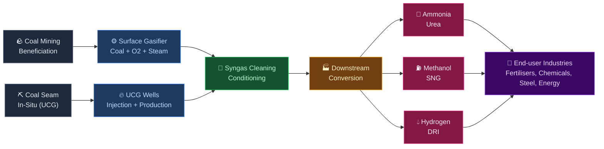
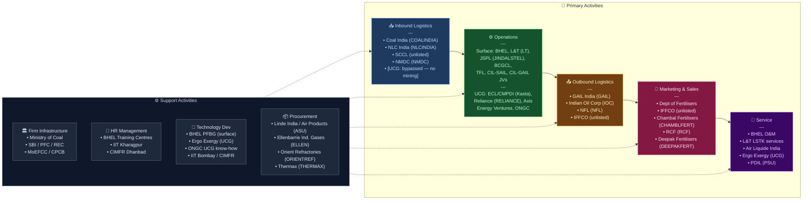

# Coal Gasification in India — Value Chain Analysis

*Analysis date: June 2026. Updated: July 2026 (UCG — Underground Coal Gasification — now integrated as a parallel pathway).*

---

## 0. Segment Definition

**Precise boundary:** Coal/lignite gasification — the thermochemical conversion of coal into synthesis gas (syngas: CO + H₂) — and the downstream processing of that syngas into industrial chemicals, fuels, and fertilisers. This analysis covers **both pathways to syngas**:

1. **Surface gasification (SCG):** Coal is mined, beneficiated, and fed into an above-ground gasifier reactor. This has been the primary focus of Indian policy and capital to date (JSPL Angul, BCGCL, TFL).
2. **Underground Coal Gasification (UCG):** Coal is gasified *in situ* — injection wells ignite and gasify the seam directly underground, and syngas is extracted through production wells, with no mining, beneficiation, or surface reactor required. UCG was treated as out-of-scope in the previous version of this analysis; it is now integrated because India crossed a genuine policy and commercial inflection point in April–June 2026 (detailed in §1.2 and §5.5) that makes it investable, not merely experimental.

Coal combustion for power generation is excluded from both pathways.

**Core product/service flow:**

**End customers and what they value most:**
- Fertiliser manufacturers (IFFCO, NFL, Chambal, RCF, Deepak Fertilisers): feedstock price certainty, import substitution
- Steel mills (JSPL, SAIL): lower-cost reducing gas vs. natural gas
- Chemical companies (GAIL, RCF): reliable, domestically sourced syngas
- Government: energy security, USD import bill reduction, rural employment, unlocking "unmineable" coal (deep, thin, or geologically difficult seams that UCG can access but conventional mining cannot)

**India's global position:** **Follower / emerging challenger in surface gasification; early-mover ambition in UCG.** China operates >80% of the world's surface coal gasification capacity, and established UCG programmes exist in Uzbekistan (Angren, operating since the 1960s), Australia, and South Africa. India's surface-gasification base is still just one operating facility at scale (JSPL Angul, DRI-focused). UCG in India has moved from failed 1980s–2010s R&D attempts (ONGC's Sobhasan and Vastan pilots, both abandoned) to a live commercial pilot (ECL's Kasta project, commercial output targeted September 2026) and — for the first time — private commercial coal-mine auctions carrying explicit UCG provisions (April 2026 CMDPAs won by Reliance Industries and Axis Energy Ventures). The ₹37,500 crore government scheme (approved May 2026, bidding framework notified June 26, 2026) covers surface gasification; a parallel, separate policy framework of revenue-share rebates and relaxed floor pricing specifically de-risks UCG. Together they target gasification of ~75 MT/year of coal and lignite (toward the national 100 MT-by-2030 goal), an estimated ₹2.5–4 lakh crore in investment across ~25 projects, and roughly ₹3 lakh crore/year in FX savings once at scale.

---

## 0.5 Quick Scan — Investable Listed Companies

| Company | Ticker | Cap Bucket | Chain Stage | One-Line Investment Thesis | Coverage |
|---|---|---|---|---|---|
| Coal India | NSE: COALINDIA | Large | Feedstock / JV equity (surface) | Gatekeeper of coal linkages; equity partner in 3 separate surface-gasification JVs (BHEL, GAIL, SAIL) at near-zero incremental capex to its core business | Well-covered |
| Reliance Industries | NSE: RELIANCE | Large | UCG — commercial mine operator + surface-gasification JV | Won two of the first four UCG-provision commercial coal mines (Recherla, Chintalpudi Sector A1, Andhra Pradesh) in April 2026, on top of its NLC India JV on Gujarat lignite UCG — RIL is now the most credible large-cap UCG optionality play, though the segment is a rounding error on RIL's overall balance sheet today | Well-covered (group); UCG angle almost entirely unpriced |
| ONGC | NSE: ONGC | Large | UCG — technology / R&D legacy | Three decades of UCG R&D (Sobhasan 1980s, Vastan 2004–2016 with Russia's NMRC-SIM) that never commercialised; now sits on dormant in-house UCG know-how just as the segment turns investable — a classic "forgotten optionality" name | Well-covered (core O&G business); UCG angle undiscovered |
| BHEL | NSE: BHEL | Large | Surface gasifier tech / EPC | Sole indigenous surface-gasifier technology (PFBG); a proven Jharsuguda outcome could re-rate BHEL from declining power EPC to anchor tech company for a multi-decade programme | Well-covered |
| Jindal Steel & Power | NSE: JINDALSTEL | Large | Operations / DRI (surface) | Only company with commercially proven coal gasification in India; 25.2 MTPA steel expansion keeps gasification structurally central, not peripheral | Well-covered |
| L&T (Heavy Engineering) | NSE: LT | Large | EPC (surface) | Scheme-linked LSTK wins (BCGCL, TFL) add optionality within a diversified order book; not a pure-play but a reliable beneficiary of every new FID | Well-covered |
| GAIL India | NSE: GAIL | Large | Distribution / JV equity (surface) | Equity in TFL plus the new CIL–GAIL Sonepur Bazari SNG JV (~₹13,000 Cr, FY29 target) positions GAIL as the pipeline backbone for gasification-derived gas | Well-covered |
| SAIL | NSE: SAIL | Large | Emerging JV (DRI, surface) | New CIL–SAIL Durgapur syngas-for-DRI JV is barely on the market's radar relative to SAIL's core steel narrative — optionality not yet in consensus estimates | Well-covered (steel); gasification angle under-researched |
| NLC India | NSE: NLCINDIA | Large | Lignite gasification (surface + UCG) | Shelved its ₹4,400 Cr Neyveli lignite-to-methanol project on cost grounds (pivoting capital to nuclear) but retains a JV with Reliance for Gujarat UCG — a live capital-cycle tell worth monitoring, not a clean "buy the theme" story | Moderate |
| RCF | NSE: RCF | Small | Downstream / JV equity (surface) | Smallcap PSU with 31.85% equity in TFL Talcher — a disproportionate exposure for its size; ammonia cost structure could re-rate meaningfully if TFL delivers on schedule | Under-researched |
| Chambal Fertilisers | NSE: CHAMBLFERT | Mid | Downstream | Urea major positioned to benefit from cheaper, domestically-sourced ammonia as coal-gasification supply scales and import-parity pricing pressure eases | Moderate |
| Deepak Fertilisers & Petrochemicals | NSE: DEEPAKFERT | Mid | Downstream / chemicals | Currently exposed to imported, LNG/ammonia-linked feedstock; domestic syngas-derived ammonia is a multi-year cost-security lever not yet reflected in valuation | Moderate |
| Ellenbarrie Industrial Gases | BSE: ELLEN | Small–Mid | ASU / industrial gas | Largest 100%-Indian-owned industrial gas company; 2025 IPO. As gasification capacity scales, oxygen/ASU demand is currently a 100%-import chokepoint — a credible domestic diversification candidate | Under-researched |
| IFGL Refractories | NSE: IFGLEXPOR | Small | Refractories (surface) | Specialist high-temperature refractory liners — a direct, recurring-revenue beneficiary of every surface gasifier commissioned and every subsequent relining cycle | Under-researched |
| Orient Refractories | NSE: ORIENTREF | Small | Refractories (surface) | Refractory liner supplier structurally linked to surface-gasifier maintenance cadence; commodity-technology but volume-linked to fleet growth | Under-researched |

**Where the opportunity sits:** Two distinct under-researched pockets exist now. First, the small-cap refractory and industrial-gas names (Ellenbarrie, IFGL Refractories, Orient Refractories) and smallcap JV-equity names (RCF) remain levered to *surface*-gasification capex growth but are covered through other lenses. Second, and newer: **UCG optionality inside large, well-covered names is almost completely unpriced.** Reliance Industries and ONGC are both followed by dozens of analysts, but virtually none of that coverage prices UCG — because until April 2026 there was no commercial UCG mining framework to price. That makes RIL's and ONGC's UCG exposure a rare case of a real catalyst hiding inside consensus large-caps rather than obscure small-caps.

---

## 1. Value Chain Map — Primary Activities

### 1.1 Inbound Logistics: Coal Supply, Beneficiation & Feedstock Preparation

**What it involves:** For **surface gasification**, this is sourcing, grading, and preparing coal. Indian coal has 30–45% ash content (vs. 10–15% in international grades) and high silica/alumina concentrations — the chain's most structurally distinctive challenge, since nearly all global gasification technologies were designed for low-ash coal. Lignite is a parallel feedstock stream (India holds ~47 billion tonnes of lignite reserves, concentrated in Tamil Nadu and Gujarat).

For **UCG, this activity is structurally different — it barely exists.** There is no mining, no beneficiation, no rail freight, no ash handling of raw coal. The coal seam is gasified where it sits, and only the resulting syngas is brought to surface. This collapses what is a multi-step, capital- and logistics-heavy activity for surface gasification into essentially nothing for UCG — one of the most important structural distinctions in the entire chain (see §5, Linkage 1).

**Key cost drivers (surface):** Royalty + mining costs, washing/beneficiation capex, rail freight (coal moves by rail from Jharkhand/Odisha/Chhattisgarh to gasification sites), moisture management.

**Key differentiation drivers:** Proximity to mine (captive linkage reduces logistics cost by ₹500–800/tonne) for surface gasification; for UCG, seam depth, thickness, permeability and hydrogeology (groundwater risk) replace coal-quality metrics as the key site-selection variables.

**Indian players active here:**
- Coal India Limited (CIL, NSE: COALINDIA) — supplies ~80% of India's thermal coal; holds coal linkages for surface gasification projects under NRS auction framework with 30-year tenures; JV equity partner in three separate surface-gasification projects (BHEL — ammonium nitrate at Jharsuguda/Lakhanpur; GAIL — SNG at Sonepur Bazari, Bardhaman; SAIL — syngas-DRI at Durgapur)
- NLC India Ltd (NLCIL, NSE: NLCINDIA) — India's principal lignite miner; holds lignite blocks in Tamil Nadu (Neyveli) and Gujarat; shelved its Neyveli lignite-to-methanol project (₹4,400 Cr, 0.4 MTPA) in 2026 on cost grounds, but retains a JV with Reliance Industries to develop underground lignite gasification in Gujarat
- Reliance Industries (NSE: RELIANCE) — won the Recherla and Chintalpudi Sector A1 coal blocks (Andhra Pradesh) in April 2026's first-ever CMDPAs carrying explicit UCG provisions; no mining/beneficiation required for the UCG portion of these blocks
- Axis Energy Ventures (unlisted, Hyderabad-based) — won the Dip Extension of Belpahar and Tangardihi East coal mines (Odisha) in the same April 2026 CMDPA round, specifically because these are geologically difficult "dip extension" seams where UCG is more viable than conventional mining
- Singareni Collieries Company Ltd (SCCL, unlisted — JV of GoI and Telangana) — southern coal supply
- NMDC Ltd (NSE: NMDC) — minor role; primarily iron ore but has coal assets
- Private washery operators (Aryan Coal Benefications, CLP India — unlisted)

---

### 1.2 Operations: Gasification & Syngas Processing

**What it involves:** The gasifier — surface reactor or underground seam — converts coal into raw syngas. Post-gasification: cooling, scrubbing, acid gas removal (Rectisol/Selexol), sulphur recovery (Claus process), and Water-Gas Shift (WGS) to tune the H₂:CO ratio for downstream requirements. This step is common to both pathways once syngas reaches the surface.

**Key cost drivers:** Oxygen supply (ASU — Air Separation Unit — is 15–25% of total surface-gasification opex, lower for UCG); reactor/well maintenance; water consumption; electricity for ASU; catalyst replacement.

**Key differentiation drivers:** Gasifier technology choice (surface: entrained-flow vs. fluidised-bed; UCG: injection-well pattern, ignition control, and groundwater management); thermal efficiency; carbon conversion rate; syngas purity.

#### Surface gasification technology landscape

- **Entrained-flow gasifiers** (Air Products/GE technology, Thyssenkrupp Uhde PRENFLO): high efficiency, commercially proven — but struggle with Indian high-ash, high-silica coal due to slag viscosity issues
- **Fluidised-bed gasifiers** (BHEL PFBG, KBR TRIG): better suited to Indian coal; lower temperatures, tolerates ash variability — but lower carbon conversion efficiency
- **Fixed-bed/Lurgi gasifiers**: Used at JSPL Angul (L&T supplied 7 units) — mature technology

**Indian players (surface):**
- BHEL (NSE: BHEL) — developed indigenous Pressurised Fluidised Bed Gasifier (PFBG); deploying at BCGCL's Jharsuguda plant; first-ever commercial-scale application; has also picked up nomination-basis tenders for ASU, ash handling, steam generation and coal handling packages at BCGCL
- L&T Heavy Engineering (Subsidiary of NSE: LT) — supplied Lurgi-spec gasification units to JSPL Angul; executing LSTK-3 and LSTK-4 packages at BCGCL Jharsuguda
- BCGCL (unlisted — 51% CIL, 49% BHEL JV) — India's first coal-to-ammonium-nitrate project; ~₹20,000–25,016 Cr total project cost, sited in the Jharsuguda/Lakhanpur coalfield, Odisha
- Talcher Fertilizers Ltd/TFL (unlisted — GAIL 31.85%, RCF 31.85%, CIL 31.85%, FCIL 4.45%) — coal gasification + ammonia + urea; Air Liquide technology; target completion December 2027
- JSPL Angul (subsidiary of NSE: JINDALSTEL) — world's largest syngas-based DRI facility; 2 MTPA DRI using coal gasification syngas; now expanding to 25.2 MTPA steel by 2030
- CIL–GAIL JV, Sonepur Bazari (Bardhaman, West Bengal) — coal-to-SNG project, ~₹13,000 Cr+, targeted commissioning FY29
- CIL–SAIL JV, Durgapur Steel Plant (West Bengal) — targets syngas production for direct reduced iron (DRI) feedstock; currently at feasibility-to-sanction stage

#### Underground Coal Gasification (UCG) — the parallel pathway

UCG has a long, largely unsuccessful history in India that only turned a corner in 2024–2026:

- **ONGC's first campaign (1980s):** A UCG pilot planned for Sobhasan, Mehsana district (Gujarat), funded by OIDB, was abandoned due to cost escalation and consultant disputes before it was built.
- **ONGC's second campaign (2004 onward):** ONGC signed a collaboration agreement with Russia's Skochinsky Institute of Mining (NMRC-SIM) in November 2004, and separately signed MOUs with GIPCL, GMDC, Coal India, SCCL, and NLC India. The flagship pilot — the **Vastan mine block**, Surat, Gujarat, run with Gujarat Industries Power Company Ltd (GIPCL) — was ultimately abandoned when GIPCL withdrew in December 2016, citing its own small size and lack of UCG experience. India spent roughly three decades attempting UCG without a single completed commercial pilot.
- **ECL's Kasta pilot (2024–2026) — the first pilot to actually reach commercial-output stage:** Eastern Coalfields Ltd (ECL, a Coal India subsidiary) launched a two-phase UCG pilot at the Kasta coal block, Jamtara district, Jharkhand, in collaboration with CMPDI Ranchi and Canada's **Ergo Exergy Technologies Inc. (EETI)**, funded by the CIL R&D Board. Phase 1 (from June 2024) completed technical feasibility via borehole drilling and core testing; Phase 2 is the pilot-scale gasification trial. As of mid-2026 the Kasta West pilot (West Burdwan district, West Bengal) has entered its final trial run, with **commercial output targeted for September 2026** — the nearest-term hard catalyst in this entire value chain.
- **April 2026 — UCG enters commercial coal mining for the first time:** The Ministry of Coal signed the first-ever Coal Mine Development and Production Agreements (CMDPAs) carrying explicit UCG provisions, for four coal blocks: **Reliance Industries** won Recherla and Chintalpudi Sector A1 (Andhra Pradesh); **Axis Energy Ventures** (unlisted, Hyderabad, previously a solar/wind developer with 1.5+ GW commissioned) won the Dip Extension of Belpahar and Tangardihi East (Odisha). This is a genuine structural shift: UCG is no longer PSU-only R&D, it is now open to private commercial bidders, and companies with zero prior coal experience (Axis Energy) are entering specifically because UCG unlocks geologically difficult "dip extension" seams that conventional mining cannot economically reach. Axis Energy has stated publicly it is close to acquiring UCG technology (implying it does not yet hold a licensed process) and plans to invest ~₹30,000 Cr in the segment.
- **NLC India–Reliance Industries JV, Gujarat** — a separate, earlier-stage feasibility assessment of underground *lignite* gasification, using NLCIL's existing Gujarat lignite blocks.

**Indian players (UCG):**
- Eastern Coalfields Ltd (ECL, CIL subsidiary, unlisted) — operator of the Kasta pilot, India's most advanced UCG project
- CMPDI (Central Mine Planning & Design Institute, unlisted CIL subsidiary) — technical partner on Kasta
- ONGC (NSE: ONGC) — three decades of UCG R&D and international technology-partner relationships (Russia's NMRC-SIM); currently not running an active UCG project, but retains in-house expertise as the segment reopens
- Reliance Industries (NSE: RELIANCE) — CMDPA winner (Recherla, Chintalpudi Sector A1); also NLCIL JV partner in Gujarat
- Axis Energy Ventures (unlisted) — CMDPA winner (Belpahar dip extension, Tangardihi East); technology-acquisition-stage new entrant

---

### 1.3 Outbound Logistics: Syngas Distribution & Intermediate Product Movement

**What it involves:** Syngas itself cannot be economically transported (unlike LNG or hydrogen at scale) — true for both surface and underground gasification, since UCG syngas still has to be processed and converted at or near the wellhead. The model is therefore **co-location**: the gasifier (or well cluster) sits adjacent to the downstream conversion plant. Outbound logistics mainly covers movement of **finished downstream products** — urea in bags, methanol in tankers, ammonium nitrate in bulk, SNG into pipeline grids.

**Key cost drivers:** Bagging and warehousing for fertilisers; tanker fleet for methanol; pipeline access for SNG; port logistics for export (if any)
**Key differentiation drivers:** Proximity to end-market; pipeline grid access (GAIL network); fertiliser distribution reach

**Indian players:**
- GAIL India (NSE: GAIL) — national gas pipeline network; logical SNG carrier once projects go live, reinforced by its own equity stake in the Sonepur Bazari SNG JV
- Indian Oil Corporation (NSE: IOC) — methanol blending and distribution
- NFL (National Fertilisers Ltd, NSE: NFL) — urea distribution infrastructure
- IFFCO (unlisted cooperative) — largest fertiliser distributor in India; strong last-mile rural reach

---

### 1.4 Marketing & Sales: Offtake Agreements & Pricing

**What it involves:** Given the capital intensity (₹8,000–25,000 Cr per surface project; UCG project economics are still being established but are expected to be materially lower per unit of syngas given the absent mining/beneficiation step), virtually all coal gasification output is sold under **long-term offtake agreements** rather than spot markets. The government plays a decisive role through urea price controls, methanol blending mandates (NITI Aayog's methanol economy push), and fertiliser subsidy policy.

**Key cost drivers:** Negotiating offtake pricing vs. import parity; government subsidy pass-through for urea; currency risk on products that compete with USD-priced imports
**Key differentiation drivers:** Vertical integration (own the downstream = capture full margin); government relationships (NRS linkage access, VGF eligibility); product diversification across syngas derivatives

**Indian players:**
- Department of Fertilisers (buyer/price-setter for urea under NBS scheme)
- IFFCO, Chambal Fertilisers (NSE: CHAMBLFERT), Coromandel International (NSE: COROMANDEL), GSFC (NSE: GSFC), RCF (NSE: RCF), Deepak Fertilisers & Petrochemicals (NSE: DEEPAKFERT) — end-buyers of coal-gasification derived ammonia/urea; Deepak Fertilisers is currently exposed to imported LNG/ammonia-linked feedstock and is a structural beneficiary of any domestic syngas-derived ammonia supply, whether sourced from surface or (eventually) UCG projects
- NITI Aayog — methanol economy policy; mandates for 15% methanol blending in petrol by 2025 (partially implemented)
- Ministry of Petroleum — sets methanol and fuel blending policy

---

### 1.5 Service: Operations, Maintenance & Technology Licensing

**What it involves:** Surface gasification plants are complex, continuous-process facilities requiring specialised O&M — refractory relining, catalyst management, instrumentation, shutdown management. UCG requires a different service stack — well integrity monitoring, groundwater quality monitoring (a key environmental risk), and burn-front control — that has essentially no existing Indian service industry yet, since Kasta is the first project to reach this stage. Technology licensors charge royalties and provide engineering support in both pathways.

**Key cost drivers:** Planned shutdowns (typically 30–60 days/year, surface); refractory wear rate (surface, especially in high-ash Indian applications); well monitoring and remediation (UCG); imported spare parts; specialised manpower scarcity — acute for UCG, where India has essentially zero trained personnel outside the small ONGC/CMPDI/ECL pilot teams
**Key differentiation drivers:** Indigenisation of spares (Jindal reports 80–90% indigenisation = 30–40% cost reduction, surface); remote monitoring; preventive maintenance contracts

**Indian players:**
- BHEL — O&M for its own PFBG installations; also offers training
- L&T — LSTK EPC and O&M services
- Air Liquide (French MNC, Indian subsidiary unlisted) — technology licensor for TFL Talcher; O&M support
- Ergo Exergy Technologies Inc. (Canada, unlisted) — UCG technology and engineering partner for ECL's Kasta pilot
- Toyo Engineering India (unlisted, subsidiary of Toyo Japan) — engineering services for fertiliser downstream
- PDIL (Projects & Development India Ltd, unlisted PSU) — project management consultant for TFL

---

## 2. Value Chain Map — Support Activities

### 2.1 Firm Infrastructure: Financing, Regulatory Compliance & JV Governance

**Surface gasification** is funded via the ₹37,500 Cr government scheme, which provides **up to 20% of plant and machinery cost** as capital subsidy, allocated via a competitive-bidding framework (notified June 26, 2026) that scores lower-incentive bids more favourably. Draft bidding documents are expected end-June/early-July 2026; each bidding round stays open for two months. Note: this ₹37,500 Cr unified scheme (May 2026) supersedes and expands an earlier ₹8,500 Cr viability-gap-funding scheme (approved January 2024, split ₹4,050 Cr PSU / ₹4,450 Cr private); secondary sources differ on the exact current per-project cap (₹5,000 Cr per project / ₹12,000 Cr per entity per the original PIB release vs. a ₹3,000 Cr per-project figure cited in some later commentary) — treat the PIB figure as authoritative pending a clarifying notification.

**UCG** is incentivised through a separate mechanism layered onto the commercial coal-mining auction framework rather than a standalone capex subsidy: incentives normally reserved for underground mining have been extended to UCG blocks, including a 2% revenue-share floor price, waiver of the upfront payment, a 50% rebate on performance security, and — specifically for gasification — an additional 50% rebate on revenue share. This is a materially different (and, on current terms, more generous) support structure than the surface-gasification capex subsidy, and it is what allowed Reliance and Axis Energy to bid competitively for UCG-provision mines in April 2026.

**Regulatory bodies:**
- Ministry of Coal — NRS linkage auctions, VGF administration, competitive-bidding scheme administration, CMDPA UCG provisions
- MoEFCC — environmental clearances (surface gasification requires EIA for high-ash slag disposal; UCG requires groundwater contamination risk assessment — historically one of the main reasons UCG projects globally have stalled or been cancelled)
- CPCB/State PCBs — pollution norms (NOx, SO₂, particulate from surface gasifiers; groundwater monitoring for UCG)
- Coal linkage tenure extension to 30 years provides long-term policy certainty for surface projects

**Indian players strong here:** Coal India (coal linkage allocator), SBI/PFC/REC (project finance lenders), L&T Finance, IIFCL for infrastructure debt

### 2.2 Human Resource Management

**Critical gap, more acute for UCG than surface.** India has a near-zero base of trained surface-gasification technicians and process engineers — the entire operating workforce at JSPL Angul was trained from scratch. For **UCG specifically, the trained-personnel base in India is smaller still** — essentially the handful of engineers who worked on ONGC's Vastan/Sobhasan attempts and the current ECL/CMPDI Kasta team. Training institutions (NIT, IIT, BHEL's R&D centre Hyderabad) are now receiving government mandates to build curricula, but UCG-specific curricula barely exist yet. The 100 MT by 2030 target implies 50,000–100,000 direct/indirect jobs — the supply side (skilled workforce) is a binding constraint, and it binds hardest exactly where the newest capital (Reliance, Axis Energy) is entering.

**Players:** BHEL training centres; IIT Kharagpur (coal research), CIMFR (Central Institute of Mining & Fuel Research, Dhanbad) — India's primary coal technology R&D body; CMPDI Ranchi (UCG-specific technical expertise).

### 2.3 Technology Development

This is the chain's most critical support activity and India's biggest gap — in both pathways.

- **BHEL PFBG** — only indigenous surface-gasifier technology; unproven at commercial scale; if it works at BCGCL, it could become the national standard for high-ash coal
- **Ergo Exergy Technologies Inc. (Canada)** — UCG technology and engineering partner for ECL's Kasta pilot; the only UCG technology actually deployed at pilot stage in India today
- **ONGC's dormant UCG know-how** — built over two campaigns (1980s; 2004–2016 with Russia's NMRC-SIM) but never commercialised; a latent asset now that UCG is investable again
- **NITI Aayog** published a dedicated paper (October 2025) on coal gasification technology for Indian high-ash coal — signals government awareness of the tech gap
- **IIT Bombay, IIT Kharagpur, CIMFR** — academic R&D on fluidised-bed gasification
- **Global technology licensors operating in India:** Air Liquide (TFL), KBR, Thyssenkrupp Uhde — all charge royalties for surface gasification; India remains a technology importer at this stage for both pathways. Axis Energy Ventures has publicly stated it is still in the process of acquiring UCG technology — underscoring how thin the available domestic and licensable technology base is

### 2.4 Procurement

EPC procurement follows LSTK (Lump Sum Turnkey) model for surface plants; UCG procurement is dominated by well-drilling and downhole equipment rather than large fabricated vessels. Major procurement items:
- **Air Separation Units (ASU):** Dominated by Air Products, Linde, Air Liquide — all imported or through Indian subsidiaries. Linde India (unlisted operating subsidiary of Linde plc; India's largest ASU/industrial-gas operator) is investing ~$60 Mn in a new 1,000 TPD ASU at Rourkela (Odisha) for SAIL — evidence that ASU capacity is scaling domestically, even if ownership/IP remains foreign. **Ellenbarrie Industrial Gases (BSE: ELLEN)**, the largest 100%-Indian-owned industrial gas company (2025 IPO, mkt cap ~₹3,800 Cr), is the most credible domestically-owned diversification candidate as gasification-driven oxygen demand scales. No Indian manufacturer has large-scale ASU *technology* (as opposed to operating capacity).
- **Heat exchangers, pressure vessels (surface):** BHEL, L&T, Thermax (NSE: THERMAX)
- **Drilling and downhole equipment (UCG):** No dedicated Indian UCG-drilling player has emerged yet; ONGC's own oilfield-services capability (drilling rigs, well logging) is the most obvious latent domestic resource, though it is not currently deployed for UCG
- **Catalysts:** Imported — Clariant, Haldor Topsoe (Denmark), BASF
- **Refractory materials (surface):** Orient Refractories (NSE: ORIENTREF), IFGL Refractories (NSE: IFGLEXPOR)
- **Instrumentation & control:** Honeywell, Emerson, ABB (Indian subsidiaries)

---

## 3. Five Forces Analysis

### Supplier Power — High

Technology suppliers (Air Liquide, Air Products, Thyssenkrupp Uhde, KBR for surface gasification; Ergo Exergy for UCG) hold strong power. Their gasification technology IP, proprietary catalyst formulations, and engineering know-how are non-replicable by Indian firms in the near term. BHEL PFBG is the lone attempt at surface-technology indigenisation — and it carries execution risk as it has never been commercially deployed. In UCG, the supplier-power picture is if anything starker: Ergo Exergy is effectively the only technology partner with an active Indian deployment, and Axis Energy Ventures' public admission that it is still "about to acquire" UCG technology confirms how few credible licensors exist. ASU suppliers (Air Products, Linde) are a global duopoly, though Linde India's Rourkela expansion and Ellenbarrie's emergence show early signs of domestic capacity (not technology) diversification. Coal supply is controlled by CIL, whose monopoly status and pricing power over linkage auctions gives it structural leverage over surface-project developers (this leverage is largely absent for UCG, where the operator holds the mining rights directly).

### Buyer Power — Low to Medium

Urea buyers (fertiliser companies, government via subsidy) have limited direct buyer power because the government sets urea MRP at ₹242/bag (one of the world's lowest) — downstream buyers are essentially price-takers. For methanol and ammonia, buyers currently import at USD spot prices; domestic coal-gasification supply (surface or UCG) would actually give them better price stability, reducing their incentive to bargain hard. Long-term offtake agreements further lock in pricing. Buyer power is therefore moderate and structurally decreasing as import substitution logic takes hold.

### Threat of New Entrants — Low for surface, Low-to-Medium and rising for UCG

Surface gasification: capital requirements are enormous (₹8,000–25,000 Cr per project). Technology is licensed and not freely available. Coal linkages are awarded through NRS auctions — a government-controlled gateway. Environmental clearances take 3–5 years. The combination of capital intensity, technology barriers, regulatory gatekeeping, and long gestation (5–7 years from FID to commissioning) creates very high barriers.

UCG changes this calculus. Because it eliminates mining, beneficiation, and large surface-reactor capex, the *capital* barrier is structurally lower — which is precisely why **Axis Energy Ventures, a company with no prior coal-industry experience, could win a UCG-provision coal block in April 2026.** The barrier that remains high for UCG is technology access (see Supplier Power above) and environmental clearance risk (groundwater contamination), not capital. This is a genuine shift in the entrant profile for this corner of the chain — from PSU-only, capital-gated entry to a mix of PSU R&D, a large diversified conglomerate (Reliance), and a mid-sized renewable-energy company pivoting sectors (Axis Energy) — and it should be read as an early sign that entry barriers into UCG specifically may fall further as more technology becomes available or gets acquired.

Notably, even well-capitalised entrants can retreat — NLC India shelved its own surface lignite-to-methanol project on cost grounds, illustrating that capital availability alone does not guarantee commitment in either pathway.

### Threat of Substitutes — Medium

Coal gasification (surface or underground) competes with:
- **Natural gas / LNG** for ammonia and methanol feedstock — imported LNG is cheaper at current prices but exposed to USD volatility and geopolitical risk
- **Green hydrogen** for ammonia (electrolyser route) — currently 3–4x more expensive; long-term structural threat by 2035+
- **Nuclear power** as an alternative capital-allocation destination for PSU balance sheets — NLC India's pivot away from lignite-to-methanol toward nuclear is a live example of this substitution occurring at the capital-allocation level, not just the product level
- **Coal-bed methane / shale gas** — nascent in India
- **Imported urea, ammonia, methanol** — the status quo; this chain only makes sense if domestic production undercuts import parity

The substitute threat is real but not imminent — the window for coal gasification to establish itself and achieve cost learning is approximately 2025–2035 before green hydrogen becomes cost-competitive.

### Competitive Rivalry — Low (currently), with UCG opening a new front

There are fewer than 10 surface-gasification projects at various stages of development in India (BCGCL, TFL, CIL–GAIL Sonepur Bazari, CIL–SAIL Durgapur, JSPL Angul, plus early-stage lignite work by NLCIL). UCG rivalry is even more nascent — precisely four commercial UCG-provision blocks exist as of mid-2026, split between two operators (Reliance, Axis Energy), plus ECL's non-commercial Kasta pilot. Rivalry is essentially non-existent today in either pathway — it is a pioneer market. Over the next decade, as the ₹37,500 Cr scheme unlocks ~25 surface projects and the Ministry of Coal potentially extends UCG provisions to more commercial-mining auctions, rivalry will increase in downstream product markets (especially methanol, urea) but both gasification segments will likely remain oligopolistic for years given remaining barriers (technology for UCG; capital and technology for surface).

### Summary Table

| Force | Intensity | Key driver |
|---|---|---|
| Supplier power | High | Technology IP concentration (Air Products/Uhde/KBR for surface, Ergo Exergy for UCG); CIL coal monopoly (surface); ASU duopoly (early domestic capacity diversification via Linde India, Ellenbarrie) |
| Buyer power | Low–Medium | Government price controls; import parity logic favours domestic supply |
| New entrants | Low (surface) / Low–Medium and rising (UCG) | Capital intensity high for surface; UCG's lower capex profile is drawing non-traditional entrants (Axis Energy) despite persistent tech and environmental-clearance barriers |
| Substitutes | Medium | LNG short-term; green hydrogen and nuclear (capital-allocation-level) longer-term |
| Rivalry | Low | Nascent market in both pathways; <10 surface projects, exactly 4 commercial UCG blocks |

**Overall structural attractiveness: Medium.** The pioneer opportunity is substantial and government-backed across both pathways, but technology risk, execution timelines, and the looming green hydrogen/nuclear substitution threats constrain long-term returns. Returns will be strong for first movers who commission before 2030 and lock in import-parity pricing; UCG specifically offers a lower-capital-intensity route to that same prize, at the cost of higher technology and environmental-clearance uncertainty.

**Capital cycle phase: Early Inflow (with a caution flag), and now broadening from PSU-led to PSU-plus-private.** Capital is clearly flowing in at the policy and project level — the ₹37,500 Cr surface scheme, three new CIL joint ventures (BHEL, GAIL, SAIL) advancing, and now the first-ever private UCG commercial mine awards (Reliance, Axis Energy) all point to an early-inflow phase that is actively widening its investor base beyond PSUs. But NLC India's decision to shelve its own Neyveli lignite-to-methanol project on cost grounds — in favour of nuclear — is an early signal that not every capital allocator finds project-level surface-gasification economics attractive yet, and India's three-decade history of abandoned UCG pilots (Sobhasan, Vastan) is a reminder that early-inflow enthusiasm has failed to convert into commercial output before. This is a young inflow phase, not a mature one: policy-level and mining-rights-level capital is committed before unit economics are fully proven in either pathway.

**Investor stance: Selective — favour scheme infrastructure and picks-and-shovels over standalone project equity; treat UCG optionality inside large-caps as a watch item, not yet a core position.** The most structurally attractive stage right now is not the gasification project companies themselves (BCGCL, TFL — both unlisted, pre-revenue, execution-risk-heavy) but the listed enablers that get paid regardless of which specific projects succeed: EPC/technology (BHEL, L&T), feedstock/JV-optionality (Coal India), and the overlooked picks-and-shovels layer (refractories, industrial gases). Within UCG, Reliance Industries and ONGC both carry real but currently unpriced optionality — worth tracking closely (especially the Kasta pilot's September 2026 commercial-output milestone as a read-through), but neither company's UCG exposure is yet large enough, or proven enough, to be an investment thesis on its own. The stage to avoid, or treat with caution, is any single-project pure-play whose economics depend on one plant's on-time commissioning — TFL-linked RCF is the clearest example of concentrated single-project risk within an otherwise diversified fertiliser business. The single biggest risk that could invalidate the attractiveness thesis is a BHEL PFBG underperformance at Jharsuguda (surface) or a Kasta-pilot disappointment / groundwater-contamination finding (UCG) — either would validate scepticism built up over India's long history of gasification false starts.

---

## 4. GVC Governance & India's Position

### Lead Firms (Global)

- **Air Products (US)** — dominant surface-gasification technology licensor globally (60+ commercial plants); acquired GE's gasification business in 2019; provides technology for multiple Indian projects including TFL Talcher
- **Air Liquide (France)** — major technology licensor; TFL Talcher project
- **Thyssenkrupp Uhde (Germany)** — PRENFLO entrained-flow technology; global presence
- **KBR (US)** — TRIG technology specifically designed for low-rank, high-ash coals; well-positioned for Indian coal
- **Linde plc (Germany/Ireland)** — global ASU leader; expanding Indian operating capacity via Linde India, including the new Rourkela ASU serving SAIL
- **Ergo Exergy Technologies Inc. (Canada)** — the UCG technology and engineering partner behind ECL's Kasta pilot, India's most advanced UCG project; a small, specialised firm punching well above its size in influence given how few UCG technology providers exist globally
- **Sasol (South Africa)** — world's largest coal-to-liquids operator; not active in India but a reference benchmark
- **Skochinsky Institute of Mining / NMRC-SIM (Russia)** — ONGC's historical UCG technology partner (2004 agreement); not currently active in India but the origin of most of the domestic UCG expertise that exists today

### Lead Firms (Indian)

- **Coal India (COALINDIA)** — controls surface feedstock; the gatekeeper of the surface chain; now equity partner in three separate gasification JVs
- **BHEL (BHEL)** — sole Indian surface-technology developer; holds the key to import substitution in gasifier technology
- **JSPL (JINDALSTEL)** — only Indian company with a commercial-scale, operating surface coal gasification plant (Angul)
- **Reliance Industries (RELIANCE)** — the most significant new entrant in the entire chain since the last version of this analysis: won two of the first four UCG-provision commercial coal mines (April 2026), on top of its existing NLCIL JV on Gujarat lignite UCG. A conglomerate with the balance-sheet capacity to accelerate UCG meaningfully if early results are positive
- **ONGC (ONGC)** — India's most experienced UCG operator by a wide margin, even though its two prior campaigns (1980s, 2004–2016) never reached commercial output; the natural technical partner or acquirer for any Indian company entering UCG without in-house expertise
- **Eastern Coalfields Ltd / CMPDI (unlisted CIL subsidiaries)** — operator and technical partner respectively on Kasta, India's first UCG project to reach the pilot-to-commercial threshold

### Governance Type: Captive (surface) / Emerging and less concentrated (UCG)

Surface gasification exhibits captive governance — Indian project developers (BCGCL, TFL) are highly dependent on a small number of global technology licensors who set standards, control IP access, and provide essential engineering know-how. The developer cannot switch technologies mid-project; once locked in (technology selection at FEED stage), the relationship is effectively captive for the plant's 25–30 year life. BHEL's PFBG is an attempt to break this captivity.

UCG governance is still forming, but early signals point to a *less* captive structure: Ergo Exergy is a small technology provider without the market power of an Air Products or Uhde, ONGC holds dormant but real in-house expertise it could reactivate or license, and new entrants like Axis Energy are explicitly shopping for technology rather than being locked into a single supplier relationship from the outset. If this pattern holds, UCG could develop into a more market-governed (rather than captive) segment of the chain over time — a meaningfully different governance trajectory from surface gasification.

### Value Capture Map

| Stage | Who captures margin | Geography |
|---|---|---|
| Technology licensing (surface) | Technology licensor (Air Products, Air Liquide, Uhde) | US / France / Germany |
| Technology licensing (UCG) | Ergo Exergy (Canada); historically NMRC-SIM (Russia) | Canada (currently); Russia (historically) |
| ASU supply | Air Products, Linde, Air Liquide (operating capacity increasingly local; IP remains foreign) | Imported IP; India-based operating capacity growing |
| Gasifier engineering (surface) | BHEL (partially), L&T (EPC) | India |
| Mining rights / seam access (UCG) | Reliance, Axis Energy, ECL (mining/development rights held domestically) | India |
| Syngas conversion (ammonia/urea) | TFL, BCGCL | India (emerging) |
| Catalyst supply | Clariant, Topsoe, BASF | Imported |
| Downstream products | Fertiliser/chemical companies | India |

**Key insight:** The majority of high-margin value in surface gasification — technology IP, catalysts, specialty equipment — is captured **outside India**. UCG is structurally different on this dimension: because the mining/development rights themselves (not a licensed reactor) are the primary asset, more of the value chain — everything except the actual gasification *technology* — sits with the Indian mine-rights holder from day one. India still imports UCG technology, but captures a larger share of the surrounding value (land, rights, syngas offtake) than it does in surface gasification.

### India's Upgrade Trajectory

India is currently at the **process upgrading** stage for surface gasification (learning to operate and construct plants) and at the **pre-commercial pilot** stage for UCG (Kasta has not yet delivered commercial output). The upgrade pathway:

1. **Process upgrading** (now, surface): Master plant construction and O&M. JSPL Angul, BCGCL commissioning; new CIL–SAIL and CIL–GAIL JVs entering the same phase.
1a. **Pilot-to-commercial transition** (now, UCG): Kasta reaching commercial output (targeted September 2026); Reliance and Axis Energy beginning technical work on their CMDPA blocks.
2. **Product upgrading** (2027–2030): Move from DRI/basic syngas → ammonia/urea/methanol (higher value per tonne of coal); for UCG, moving from pilot syngas output to sustained commercial-scale extraction
3. **Functional upgrading** (2030–2035): BHEL PFBG proves at commercial scale → India exports gasifier technology/EPC to South/Southeast Asia; parallel possibility of an Indian UCG technology capability emerging (via ONGC reactivation, an Axis Energy technology acquisition, or a domestic Ergo Exergy joint venture) that could similarly be exported
4. **Chain upgrading** (2035+): Hydrogen-from-coal with CCS; transition toward blue hydrogen for export

---

## 5. Key Linkages & Leverage Points

### Critical Linkages

**1. Coal quality ↔ Gasifier technology selection — and UCG's structural bypass of this constraint**
Indian coal's high ash and silica content directly determines which surface-gasifier technology can be used. Entrained-flow (most efficient globally) struggles with Indian coal; fluidised-bed is tolerant but less efficient. For **surface gasification**, this linkage means technology choice is coal-quality-determined — a constraint no Indian developer can avoid. **UCG structurally sidesteps this problem almost entirely**: because gasification happens in situ and only the resulting gas (not raw coal) is brought to surface, ash content — the single biggest technical headache in the surface chain — becomes largely irrelevant. This is arguably the most important strategic insight to emerge from integrating UCG into this analysis (see §7).

**2. ASU procurement ↔ Project economics**
The Air Separation Unit (which provides oxygen for surface gasification) consumes 15–25% of total project opex. Ownership of ASU *operating capacity* is beginning to localise (Linde India's Rourkela expansion, Ellenbarrie's emergence), but the underlying *technology* remains 100% foreign. UCG oxygen requirements differ (often lower, and injected downhole rather than at a large surface ASU), somewhat reducing this specific cost exposure for UCG projects. Developing domestic ASU manufacturing capability (a Rs 2,000–5,000 Cr capital commitment) would still structurally reduce project costs by 10–15% for surface plants.

**3. Coal linkage tenure / mining rights tenure ↔ Project financing**
Banks will not lend 25-year project finance against a short-tenure supply agreement. The government's extension of coal linkage tenure to **30 years** directly unlocks project finance for surface gasification. For UCG, the equivalent linkage is the CMDPA mining-rights tenure itself — since UCG-provision CMDPAs are new (April 2026), the financing market has not yet had a full cycle to price this risk, and early UCG project debt (if any) will likely be priced more conservatively than surface-gasification debt until a track record exists.

**4. Syngas H₂:CO ratio ↔ Downstream product mix**
The Water-Gas Shift reactor adjusts the ratio of hydrogen to carbon monoxide in syngas. A high H₂:CO ratio favours ammonia/urea (needs H₂). A lower ratio favours methanol and DRI (needs CO). This is a real-time operational linkage — the same gasifier can serve different downstream products by adjusting WGS conditions, providing flexibility and reducing market risk. This flexibility is exactly what the new CIL–SAIL (DRI-oriented) and CIL–GAIL (SNG-oriented) JVs are betting on at different points of the ratio spectrum; it will apply equally to UCG syngas once downstream conversion capacity is built out around Kasta or the CMDPA blocks.

**5. BHEL PFBG performance ↔ Technology import dependency (surface); Kasta pilot outcome ↔ UCG credibility (underground)**
BHEL's Pressurised Fluidised Bed Gasifier, if commercially proven at BCGCL Jharsuguda, is the single most important surface-technology event in the chain — success breaks the captive governance structure and enables lower-cost replication across the newly announced CIL–SAIL and CIL–GAIL JVs. The equivalent event for UCG is **ECL's Kasta pilot reaching genuine commercial output in September 2026** — after three decades of abandoned Indian UCG attempts, this is the linkage on which the entire UCG re-rating thesis for Reliance, Axis Energy, and ONGC rests. A disappointing or delayed Kasta outcome would likely set UCG optionality back years, exactly as GIPCL's 2016 withdrawal from Vastan did.

### Highest-Leverage Intervention Point

**→ Domestic ASU manufacturing + BHEL PFBG commercial proof at Jharsuguda (surface) + a successful Kasta commercial-output milestone (UCG).**
On the surface side, ASU indigenisation and PFBG proof together would reduce project capital costs by 20–30% and unlock the full 100 MT pipeline. On the UCG side, a successful Kasta outcome in September 2026 is the single highest-leverage event in the *entire* chain right now, because it would be the first genuinely successful UCG project in India's history and would directly de-risk the capital Reliance and Axis Energy have just committed via their CMDPAs. The government's ₹37,500 Cr scheme addresses surface VGF, but neither pathway has yet tackled true technology indigenisation (ASU manufacturing for surface; UCG process technology for underground) — this remains the biggest unaddressed leverage point in the chain.

---

## 5.5 Upcoming Catalysts & Key Triggers

| Catalyst / Trigger | Timeline | Companies Likely to Benefit |
|---|---|---|
| **ECL Kasta UCG pilot reaches commercial output** | **Targeted September 2026 — the nearest-term catalyst in the entire chain** | Coal India / ECL (sentiment); read-through for Reliance Industries, Axis Energy, ONGC's UCG optionality |
| Ministry of Coal releases draft bidding documents for the ₹37,500 Cr surface scheme | End-June/early-July 2026 | All scheme applicants; sentiment catalyst for Coal India, BHEL, L&T |
| First competitive-bidding round opens (2-month window) | H2 2026 | BCGCL, TFL sponsors, and any new project SPVs; BHEL, L&T (EPC pipeline visibility) |
| Reliance Industries / Axis Energy begin technical work (drilling, feasibility) on their UCG CMDPA blocks | H2 2026 – 2027 | Reliance Industries, Axis Energy Ventures |
| CIL–SAIL Durgapur DRI-syngas project moves from feasibility to formal sanction | Within 12–24 months | SAIL, Coal India |
| CIL–GAIL Sonepur Bazari SNG JV construction milestones toward FY29 commissioning | Ongoing through FY29 | GAIL, Coal India |
| Talcher Fertilizers Ltd (TFL) commissioning | Target December 2027 | GAIL, RCF, Coal India, FCIL |
| BHEL PFBG first commercial-scale performance data from BCGCL Jharsuguda | 2027–2028 | BHEL (re-rating trigger); L&T; downstream JV sponsors |
| NLC India–Reliance Gujarat lignite-UCG feasibility study conclusion | 12–18 months | NLC India, Reliance Industries |

These are specific, dated triggers — not generic "sector tailwinds" — and each has an identifiable set of listed beneficiaries. The Kasta pilot outcome (September 2026) is close enough and consequential enough that it deserves to be tracked as closely as any quarterly earnings date for RIL, ONGC, or Coal India shareholders.

---

## 6. Indian Company Landscape

### Listed Companies

| Stage | Company | Ticker | Cap Bucket | Revenue / Mkt Cap | PLI? | Coverage | Chain Position |
|---|---|---|---|---|---|---|---|
| Feedstock supply | Coal India Ltd | NSE: COALINDIA | Large | Mkt cap ~₹2,15,000 Cr (FY25) | No | Well-covered | Leader |
| Feedstock supply — lignite | NLC India Ltd | NSE: NLCINDIA | Large | Mkt cap ~₹49,690 Cr (May 2026) | No | Moderate | Emerging |
| UCG — commercial mine operator | Reliance Industries | NSE: RELIANCE | Large | Group mkt cap in multi-lakh-crore range; UCG-specific financials not disclosed | No | Well-covered (group); UCG angle undiscovered | Emerging |
| UCG — technology / R&D legacy | ONGC | NSE: ONGC | Large | Core O&G business; UCG-specific financials not disclosed | No | Well-covered (core); UCG angle undiscovered | Niche (dormant capability) |
| Feedstock supply | NMDC Ltd | NSE: NMDC | Large | Mkt cap ~₹58,000 Cr | No | Well-covered | Niche |
| Gasifier technology & EPC | BHEL | NSE: BHEL | Large | Mkt cap ~₹42,000 Cr; Rev ₹28,000 Cr (FY25) | No | Well-covered | Challenger |
| Gasifier technology & EPC | L&T (Heavy Engineering) | NSE: LT (parent) | Large | L&T Rev ~₹2,25,000 Cr (FY25) | No | Well-covered | Challenger |
| EPC / engineering | Thermax Ltd | NSE: THERMAX | Large | Mkt cap ~₹45,000 Cr; Rev ₹10,000 Cr | No | Well-covered | Niche |
| Operations — DRI/Steel | Jindal Steel & Power | NSE: JINDALSTEL | Large | Mkt cap ~₹1,05,000 Cr; Rev ₹55,000 Cr (FY25) | No | Well-covered | Leader |
| Operations — DRI/Steel (emerging) | SAIL | NSE: SAIL | Large | Mkt cap ~₹72,379 Cr (Mar 2026) | No | Well-covered (gasification angle under-researched) | Emerging |
| Downstream — Fertilisers | Chambal Fertilisers | NSE: CHAMBLFERT | Mid | Mkt cap ~₹20,000 Cr; Rev ₹17,000 Cr | No | Moderate | Challenger |
| Downstream — Fertilisers | RCF (Rashtriya Chemicals) | NSE: RCF | Small | Mkt cap ~₹9,000 Cr; Rev ₹10,000 Cr | No | Under-researched | Emerging |
| Downstream — Fertilisers | GSFC | NSE: GSFC | Small | Mkt cap ~₹8,000 Cr; Rev ₹6,500 Cr | No | Moderate | Niche |
| Downstream — Fertilisers | Coromandel International | NSE: COROMANDEL | Large | Mkt cap ~₹48,000 Cr; Rev ₹22,000 Cr | No | Well-covered | Niche |
| Downstream — Fertilisers/Chemicals | Deepak Fertilisers & Petrochemicals | NSE: DEEPAKFERT | Mid | Mkt cap ~₹16,644 Cr (May 2026) | No | Moderate | Niche |
| Downstream — Gas/Methanol | GAIL India | NSE: GAIL | Large | Mkt cap ~₹1,25,000 Cr; Rev ₹1,35,000 Cr (FY25) | No | Well-covered | Leader |
| Downstream — Gas/Methanol | Indian Oil Corporation | NSE: IOC | Large | Mkt cap ~₹1,70,000 Cr; Rev ₹9,00,000 Cr | No | Well-covered | Niche |
| Industrial gas / ASU | Ellenbarrie Industrial Gases | BSE: ELLEN | Small–Mid | Mkt cap ~₹3,800 Cr (Recently listed, FY2025 IPO) | No | Under-researched | Emerging |
| Refractory materials | Orient Refractories | NSE: ORIENTREF | Small | Mkt cap ~₹3,200 Cr; Rev ₹800 Cr | No | Under-researched | Niche |
| Refractory materials | IFGL Refractories | NSE: IFGLEXPOR | Small | Mkt cap ~₹1,500 Cr; Rev ₹700 Cr | No | Under-researched | Niche |
| Downstream — Fertilisers | NFL (National Fertilisers Ltd) | NSE: NFL | Small | Mkt cap ~₹4,500 Cr | No | Under-researched | Niche |

### Unlisted / PSU / JV / Private Companies

| Stage | Company | Type | Business Description | Scale | Notes |
|---|---|---|---|---|---|
| Operations — Gasification (surface) | BCGCL (Bharat Coal Gasification & Chemicals Ltd) | Unlisted PSU JV (CIL 51%, BHEL 49%) | India's first coal-to-ammonium-nitrate project; sited at Jharsuguda/Lakhanpur, Odisha | ~₹20,000–25,016 Cr project cost | — |
| Operations — Fertiliser (surface) | Talcher Fertilizers Ltd (TFL) | Unlisted PSU JV (GAIL/RCF/CIL/FCIL) | Coal gasification + ammonia + urea at Talcher, Odisha; Air Liquide technology | ₹13,277 Cr project; target Dec 2027 | — |
| Operations — SNG (surface) | CIL–GAIL JV, Sonepur Bazari | Unlisted PSU JV | Coal-to-SNG project, Bardhaman district, West Bengal | ~₹13,000 Cr+; FY29 target | — |
| Operations — DRI syngas (surface) | CIL–SAIL JV, Durgapur | Unlisted PSU JV | Syngas for DRI feedstock at Durgapur Steel Plant | Not yet disclosed; feasibility-to-sanction stage | — |
| Operations — UCG pilot | Eastern Coalfields Ltd (ECL) | Unlisted CIL subsidiary | Operator of the Kasta UCG pilot, Jamtara district, Jharkhand; commercial output targeted Sept 2026 | Pilot-scale; CIL R&D Board funded | India's most advanced UCG project |
| Technical partner — UCG | CMPDI Ranchi | Unlisted CIL subsidiary | Technical partner on the Kasta UCG pilot | Not disclosed | — |
| UCG technology licensor | Ergo Exergy Technologies Inc. | Private, Canada | UCG technology and engineering partner for ECL's Kasta pilot | Not disclosed | Foreign IP holder for India's only active UCG deployment |
| UCG — commercial mine operator | Axis Energy Ventures | Private, Hyderabad | Won Belpahar dip extension and Tangardihi East (Odisha) UCG-provision coal blocks, April 2026; previously a solar/wind developer (1.5+ GW commissioned); plans ~₹30,000 Cr UCG investment; still acquiring UCG technology as of mid-2026 | ~₹30,000 Cr planned investment | New entrant with no prior coal experience |
| Feedstock supply | Singareni Collieries (SCCL) | Unlisted PSU JV (GoI + Telangana) | Southern India coal supply; potential gasification feedstock for Andhra/Telangana | Not disclosed | — |
| EPC — Technology services | Air Liquide India | MNC subsidiary (Air Liquide France) | Technology licensor for TFL Talcher; O&M support | Not disclosed | — |
| EPC — ASU operating capacity | Linde India | MNC subsidiary (Linde plc) | India's largest ASU/industrial-gas operator; new 1,000 TPD ASU at Rourkela for SAIL (~$60 Mn) | Not disclosed as standalone; parent Linde plc is a global major | Operating-capacity localisation, not technology transfer |
| Project management | PDIL | Unlisted PSU (Dept. of Fertilisers) | PMC for TFL and other fertiliser projects | Not disclosed | — |
| Downstream — Fertilisers | IFFCO | Cooperative society | Largest urea producer and distributor; potential buyer/adopter of coal-gasification syngas | Rev ~₹35,000 Cr | — |
| Feedstock / UCG (lignite) | NLC India–Reliance JV, Gujarat | JV (listed NLCINDIA + listed RELIANCE) | Feasibility study for underground lignite gasification | Not disclosed | Both parents listed; JV itself unlisted |

---

### Notable Companies — Deeper Notes

**Jindal Steel & Power (NSE: JINDALSTEL)**
- Stage in chain: Operations (surface gasification) + Downstream (steel / DRI)
- Cap bucket: Large — Mkt cap ~₹1,05,000 Cr
- Analyst coverage: Well-covered
- What makes them interesting: JSPL is the only Indian company that has proven coal gasification works at commercial scale in India. Their Angul plant — with the world's largest syngas-based DRI facility — is a living proof-of-concept for the entire national programme. Their 80–90% indigenisation of spares is the deepest know-how repository in the country. Expansion to 25.2 MTPA by 2030 means coal gasification will remain central to their production strategy.
- Key financials: Revenue ~₹55,000 Cr (FY25); EBITDA margin ~22%; Mkt cap ~₹1,05,000 Cr
- PLI beneficiary: No
- Watch factor: Whether they license their operational know-how to other projects or keep it proprietary; and whether their DRI expansion shifts from coal-gasification to green hydrogen post-2030.
- Investment angle: The market prices JSPL primarily as an integrated steel producer on standard EV/EBITDA multiples. It is under-pricing the option value of JSPL's decade-plus operating know-how being the *only* proven playbook in the country — as the ₹37,500 Cr scheme unlocks ~25 new projects, JSPL's technical expertise (not just its steel output) becomes a scarce, monetisable asset that consensus estimates do not currently capture.

**BHEL (NSE: BHEL)**
- Stage in chain: Technology development + EPC (surface)
- Cap bucket: Large — Mkt cap ~₹42,000 Cr
- Analyst coverage: Well-covered
- What makes them interesting: BHEL's PFBG technology is the single most strategically important surface-gasification asset in the chain. If the Jharsuguda BCGCL project proves it works at scale, BHEL transitions from a declining power-sector EPC player to the anchor technology company for India's 100 MT gasification programme — a multi-decade, multi-billion-dollar opportunity. The technology risk is real but so is the upside. Since the previous version of this analysis, BHEL has also picked up nomination-basis tenders for ASU, ash handling, steam generation and coal handling packages at BCGCL — widening its scope beyond the gasifier itself.
- Key financials: Revenue ~₹28,000 Cr (FY25); EBITDA margin ~5–6% (recovering); Mkt cap ~₹42,000 Cr
- PLI beneficiary: No
- Watch factor: PFBG technology performance at Jharsuguda — this is BHEL's most important proof-point in a decade.
- Investment angle: The market treats BHEL as a legacy, low-margin power-EPC turnaround story. What's underpriced is optionality: BHEL is the *only* domestic surface-gasifier IP holder in a scheme designed to fund ~25 projects over the next decade. A single successful commissioning at Jharsuguda could shift BHEL's narrative from "declining PSU EPC" to "national technology champion," a re-rating catalyst not yet reflected in consensus multiples.

**Reliance Industries (NSE: RELIANCE)**
- Stage in chain: UCG — commercial mine operator + surface/UCG lignite JV
- Cap bucket: Large — group market cap in the multi-lakh-crore range
- Analyst coverage: Well-covered at the group level; the UCG-specific angle is essentially undiscovered
- What makes them interesting: RIL is the single most consequential new entrant into this entire value chain since the previous version of this analysis. In April 2026 it won two of the first four coal blocks ever auctioned with explicit UCG provisions (Recherla and Chintalpudi Sector A1, Andhra Pradesh) — a genuine first for Indian commercial mining. Combined with its existing JV with NLC India on Gujarat lignite UCG, RIL now has the broadest UCG footprint of any Indian company, PSU or private. Given RIL's balance-sheet scale and track record of moving fast once it commits to a new energy vertical (as it has in solar, green hydrogen, and new energy more broadly), a positive read-through from ECL's Kasta pilot (targeted September 2026) could accelerate RIL's own UCG development materially.
- Key financials: Group-level financials dwarf any single segment; UCG-specific capex/revenue not yet disclosed
- PLI beneficiary: No
- Watch factor: Any RIL capital-allocation disclosure (capex guidance, investor-day commentary) that explicitly quantifies UCG investment — as of mid-2026 this has not yet happened, meaning the market has no anchor for sizing this optionality.
- Investment angle: At RIL's scale, coal/lignite UCG is currently immaterial to consolidated financials and will not move the stock on its own. The investment angle here is optionality tracking, not a standalone thesis: if Kasta succeeds and the Ministry of Coal expands UCG provisions to more auctions, RIL is positioned to be the largest private beneficiary of a theme that barely existed a year ago — worth flagging now, before it shows up in any analyst model, rather than after.

**ONGC (NSE: ONGC)**
- Stage in chain: UCG — technology / R&D legacy
- Cap bucket: Large
- Analyst coverage: Well-covered on its core oil & gas business; the UCG angle is undiscovered
- What makes them interesting: ONGC is the most experienced UCG operator in Indian corporate history — with two multi-year campaigns (a 1980s Sobhasan attempt and a 2004–2016 partnership with Russia's NMRC-SIM at Vastan, Gujarat) — even though neither reached commercial output. That experience, including relationships with international UCG technical institutions, is a dormant asset that suddenly has renewed relevance now that UCG is commercially investable again via CMDPAs. ONGC is not currently an active UCG operator, but its in-house drilling, well-logging, and subsurface expertise (built for oil & gas) is directly transferable to UCG operations.
- Key financials: Not broken out for UCG; core O&G business dominates group financials
- PLI beneficiary: No
- Watch factor: Any announcement of ONGC re-entering UCG directly, partnering with an existing CMDPA winner (Reliance, Axis Energy), or licensing its accumulated know-how — none of which has happened yet as of mid-2026, but all of which are plausible given the segment's reopening.
- Investment angle: The market has zero UCG-related expectations baked into ONGC today — reasonably so, since ONGC has no active UCG project. But ONGC is exactly the kind of "quiet insider" name that could re-enter a reopening niche market with minimal incremental capital (it already owns much of the required drilling/subsurface capability) if the Kasta pilot de-risks the technology. This is a low-probability, high-optionality watch item rather than a current thesis.

**BCGCL (Bharat Coal Gasification & Chemicals Ltd — Unlisted)**
- Stage in chain: First integrated coal-to-chemicals project in India (surface)
- What makes them interesting: India's national flagship for surface coal gasification. ~₹20,000–25,016 Cr project; coal-to-ammonium-nitrate is an interesting product choice (explosives for mining, not fertilisers) — differentiating from TFL's urea focus. Awarded both LSTK packages to BHEL and L&T, India's two largest engineering companies — signals national commitment.
- Key financials: Project company; not yet in operations
- Watch factor: Construction timeline adherence — any delay cascades into the broader ₹37,500 Cr scheme credibility.
- Investment angle: Unlisted — the investable proxies are its JV parents, Coal India and BHEL, both of which carry BCGCL as one signal among several rather than a standalone catalyst.

**GAIL India (NSE: GAIL)**
- Stage in chain: Downstream distribution + JV equity in TFL and the new Sonepur Bazari SNG project (surface)
- Cap bucket: Large — Mkt cap ~₹1,25,000 Cr
- Analyst coverage: Well-covered
- What makes them interesting: GAIL is positioned at the intersection of two megatrends — coal gasification (via TFL and the new Sonepur Bazari JV) and the emerging hydrogen economy. Its 18,000+ km pipeline network is the natural backbone for distributing SNG from coal gasification projects. As the scheme scales to 75 MT, GAIL's infrastructure becomes indispensable, and its second gasification JV (Sonepur Bazari, targeting FY29) shows the company is not a one-off participant but a repeat player.
- Key financials: Revenue ~₹1,35,000 Cr (FY25); EBITDA margin ~9%; Mkt cap ~₹1,25,000 Cr
- PLI beneficiary: No
- Watch factor: Whether GAIL pursues more direct equity in coal gasification projects beyond TFL and Sonepur Bazari — and how it bridges coal-gasification SNG with eventual green hydrogen distribution.
- Investment angle: GAIL's core business (pipeline tariffs) is well understood and fully priced by the market. What's underappreciated is that GAIL is now a *repeat* JV sponsor across two separate coal-gasification projects — a signal of a deliberate strategy, not opportunistic participation — that should command a higher multiple on the optionality embedded in future SNG offtake volumes.

**RCF (Rashtriya Chemicals & Fertilizers — NSE: RCF)**
- Stage in chain: Downstream (urea production) + JV equity in TFL (surface)
- Cap bucket: Small — Mkt cap ~₹9,000 Cr
- Analyst coverage: Under-researched
- What makes them interesting: RCF is a small-cap PSU fertiliser company that has taken a disproportionate strategic bet — 31.85% equity in TFL Talcher means their future feedstock economics could be transformed by domestic coal-gasification syngas. If TFL delivers, RCF's ammonia cost drops sharply vs. imported LNG-based feedstock peers.
- Key financials: Revenue ~₹10,000 Cr (FY25); EBITDA margin ~5%; Mkt cap ~₹9,000 Cr
- PLI beneficiary: No
- Watch factor: TFL completion by December 2027 — if delayed further, RCF's balance sheet bears the carrying cost.
- Investment angle: RCF trades as a generic, thinly-covered PSU fertiliser name. The market is not pricing the fact that a single project (TFL, on schedule for Dec 2027) could structurally re-rate RCF's cost base — this is a name where the TFL commissioning date is close to a binary catalyst for a company most analysts do not cover in depth.

**Ellenbarrie Industrial Gases (BSE: ELLEN)**
- Stage in chain: Procurement / ASU-adjacent industrial gas supply (surface)
- Cap bucket: Small–Mid — Mkt cap ~₹3,800 Cr (2025 IPO)
- Analyst coverage: Under-researched
- What makes them interesting: Ellenbarrie is the largest 100%-Indian-owned industrial gas company by installed capacity, freshly listed and largely covered — where covered at all — through the lens of its existing steel/healthcare oxygen business rather than the emerging coal-gasification capex cycle. ASU-derived oxygen is 15–25% of surface-gasification project opex and today is almost entirely supplied by foreign-technology players (Air Products, Linde, Air Liquide); Ellenbarrie is the clearest domestically-owned name that could plausibly diversify that supply chain as gasification capacity scales toward 100 MT by 2030.
- Key financials: Not fully disclosed as a recent listing; mkt cap ~₹3,800 Cr
- PLI beneficiary: No
- Watch factor: Any announced supply agreement or capacity expansion explicitly tied to a coal-gasification project (as opposed to Ellenbarrie's existing steel/medical gas customers).
- Investment angle: The market currently prices Ellenbarrie purely on its established industrial-gas business. It is not pricing any optionality from India's ASU supply chain diversifying away from pure MNC dependence as the gasification scheme scales — a slow-burn, multi-year optionality that is easy to miss in a recently-listed, under-covered name.

---

## 7. Strategic Insight

### What This Chain Analysis Reveals That Is Non-Obvious

The most counter-intuitive finding, now sharpened by integrating UCG into this analysis, is that **India's single biggest surface-gasification problem — high-ash, high-silica coal that no global gasifier technology was designed for — barely exists for Underground Coal Gasification.** Every section of the surface-gasification chain (§1.1, §1.2, §5 Linkage 1) is shaped by the fight against Indian coal's ash content. UCG makes that fight largely irrelevant, because the coal is never mined or fed into a surface reactor — it is gasified where it lies, and only clean syngas comes to the surface. This is precisely why a company like Axis Energy Ventures, with zero prior coal experience, could plausibly enter this segment in April 2026: UCG substitutes India's hardest engineering problem (ash-tolerant surface gasifier design) for a different, arguably more tractable one (well engineering and groundwater risk management) that the oil & gas industry — where India already has real expertise via ONGC — is much better positioned to solve.

The second non-obvious insight: **coal gasification in India is not primarily an energy story — it is an import substitution play disguised as energy policy**, and UCG's entry via commercial mining auctions rather than a dedicated capex-subsidy scheme shows the government pursuing that goal through two structurally different policy instruments simultaneously. The multi-lakh-crore annual import bill for LNG, ammonia, methanol, and urea is the true motivation behind both. Coal gasification is the government's most credible mechanism to convert stranded domestic coal and lignite assets (CIL and NLCIL both sit on reserves that cannot competitively supply power at scale) — and now, via UCG, geologically difficult seams that were never economically mineable at all — into foreign exchange savings of an estimated ₹3 lakh crore/year at full scheme scale.

The third non-obvious insight: **India has tried and failed at UCG for three decades, and the market has no memory of this.** ONGC's Sobhasan (1980s) and Vastan (2004–2016) pilots both collapsed before reaching commercial output — the second one after twelve years of active work. Analysts and investors reacting to the April 2026 Reliance/Axis Energy CMDPA awards are, almost by definition, encountering this theme for the first time, with no institutional memory of why UCG has repeatedly failed in India before (cost escalation, partner withdrawal, technology gaps). That asymmetry — genuine history vs. a market treating this as a brand-new theme — is itself useful: it means the September 2026 Kasta outcome will be read by most of the market as a first data point, when a more informed view would treat it as the first potential break in a three-decade pattern of failure.

### Blue Ocean Opportunity — Four Actions Framework

| Action | What |
|---|---|
| **Eliminate** | Dependence on international technology licensing for every new surface project (break the captive governance trap); for UCG, eliminate the coal-quality/ash constraint entirely by gasifying in-seam rather than mining and processing coal above ground |
| **Reduce** | ASU import dependence — India has no domestic ASU *manufacturer* at gasification scale, though operating capacity is localising (Linde India Rourkela, Ellenbarrie); a Rs 3,000 Cr investment in true domestic ASU manufacturing reduces project costs for every subsequent surface plant. UCG separately reduces the entire mining/beneficiation/rail-logistics cost stack to near zero |
| **Raise** | CO₂ capture rate — JSPL Angul already invites EoI for offtake of 3,600 TPD of captured CO₂; carbon as a value stream (industrial CO₂, enhanced oil recovery, carbon credits) is currently treated as waste, in both surface and (eventually) UCG operations |
| **Create** | A **Coal Gasification as a Service (CGaaS)** platform — a centrally owned gasification plant (surface) or well cluster (UCG) that sells syngas to multiple downstream operators (ammonia plant, methanol plant, SNG grid) via long-term supply agreements, amortising the technology and capital risk across buyers instead of requiring each downstream player to own their own gasifier |

The **CGaaS model** remains the most compelling blue ocean, and UCG makes it more plausible, not less: because UCG's capital intensity is structurally lower than a surface plant, a shared-infrastructure operator could develop multiple UCG well clusters and sell syngas to several downstream buyers at a fraction of the capital a surface-plant CGaaS platform would require. The multiplying number of single-purpose CIL JVs (BHEL, GAIL, SAIL) — each building its own dedicated surface gasifier for its own downstream need — is, if anything, evidence the market has *not yet* organised around this model; a UCG-based CGaaS platform, built by a company like Reliance with both the balance sheet and the newly-won mining rights, would be a genuine market-creation move with no obvious current attempt beyond the CMDPA mine awards themselves.

### Top 3 Priorities for an Indian Firm Building Durable Advantage

1. **For surface gasification: secure captive coal linkage + co-locate downstream processing.** The firms that will capture the most value are those that integrate backwards into coal (or secure 30-year NRS linkages) and forward into high-value derivatives (ammonia, methanol, ammonium nitrate) rather than selling raw syngas. Vertical integration is the only durable moat in this chain. **For UCG: secure a technology partner or acquire capability before the next CMDPA round**, because the binding constraint is technology access, not capital or mining rights — Axis Energy's public admission it is still acquiring UCG technology after already winning its blocks illustrates the sequencing risk of moving on rights before technology.

2. **Build or co-develop true ASU manufacturing capability, not just operating capacity.** Air Separation Unit manufacturing is India's most significant cost leak in the surface chain. A JV with Linde or Air Products to manufacture ASUs in India (potentially under a future PLI-style scheme) would create a structural cost advantage across every project in the pipeline — this is a platform asset, not a point-project asset. Ellenbarrie's emergence as a domestically-owned operator is a start, but technology localisation, not just capacity localisation, is the prize. This priority is specific to surface gasification, since UCG's oxygen requirements and cost structure differ.

3. **Bet on CCUS (Carbon Capture, Utilisation & Storage) as the bridge to 2035, and treat ONGC's dormant UCG know-how as a strategic asset worth reactivating.** The green hydrogen threat to coal gasification is real but 10+ years away at cost parity; the nuclear-power substitution risk at the capital-allocation level (as seen in NLC India's own pivot) is arguably nearer-term for PSU balance sheets. Companies that invest now in CO₂ capture infrastructure (JSPL is already doing this) will be positioned to convert coal gasification plants into **blue hydrogen** production facilities — retaining the asset value while meeting decarbonisation mandates. Separately, any company entering UCG (Reliance, Axis Energy, or a future entrant) would be well served to partner with ONGC rather than starting from zero technology relationships, given ONGC's two decades of accumulated (if unsuccessful) UCG institutional knowledge.

---

## Sources

- [Cabinet approves ₹37,500 Crore Coal Gasification Scheme — PIB](https://www.pib.gov.in/PressReleasePage.aspx?PRID=2260621&reg=3&lang=1)
- [National Coal Gasification Mission — Ministry of Coal](https://coal.gov.in/major-statistics/national-coal-gasification-mission)
- [4 Stocks to Watch as Cabinet Approves Coal Gasification Scheme — Equitymaster](https://www.equitymaster.com/detail.asp?date=05%2F14%2F2026&story=11&title=4-Stocks-to-Watch-as-Cabinet-Approves-Coal-Gasification-Scheme)
- [BHEL Secures Coal Gasification Package for BCGCL Project — BHEL](https://www.bhel.com/bhel-secures-coal-gasification-package-bcgcl-project)
- [BHEL-Coal India JV ₹25,016 Cr Odisha Plant — Whalesbook](https://www.whalesbook.com/news/English/chemicals/BHEL-Coal-India-JV-to-Launch-indian-rupee25016-Cr-Odisha-Coal-Gasification-Plant/6a368799a1c5bf084327ef80)
- [BCGCL and MCL Sign Land Leasing Agreement — PIB](https://www.pib.gov.in/PressReleasePage.aspx?PRID=2247912&reg=3&lang=1)
- [Talcher Fertilizers Ltd — RCF](https://www.rcfltd.com/newpages/coal-gasification-plant-at-talcher-1)
- [JSPL Coal Gasification DRI Plants — SteelOrbis](https://www.steelorbis.com/steel-news/latest-news/indias-jspl-to-add-two-coal-gasification-based-dri-plants-at-its-steel-mills-1242842.htm)
- [JSPL Angul CO₂ offtake EoI — Indian Chemical News](https://www.indianchemicalnews.com/sustainability/jspl-angul-invites-eoi-for-offtake-of-3600-tpd-of-captured-co2-26666)
- [Coal Gasification challenges — Business Standard](https://www.business-standard.com/economy/news/coal-gasification-fits-fuel-diversification-narrative-but-challenges-loom-126061400804_1.html)
- [High-ash Coal Gasification Technology — NITI Aayog](https://niti.gov.in/sites/default/files/2025-10/Coal_Gasification_Technology_for_Indian_High_Ash_Content_Coal.pdf)
- [Coal Gasification Scheme ₹37,500 Cr bidding framework — Business Standard](https://www.business-standard.com/industry/news/centre-rolls-out-37-500-cr-coal-gasification-scheme-with-bidding-framework-126062600979_1.html)
- [Air Products Gasification Technology](https://www.airproducts.com/applications/syngas-solutions)
- [L&T Coal Gasification EPC](https://www.larsentoubro.com/heavy-engineering/products-services/process-plant/coal-gasification)
- [Coal Gasification Scheme Targets ₹4 Lakh Crore Investment — GKToday](https://www.gktoday.in/coal-gasification-scheme-targets-%E2%82%B94-lakh-crore-investment/)
- [₹65,000 Cr Coal Gasification Projects Underway in India — Sarkaritel](https://www.sarkaritel.com/coal-gasification-projects-india-65000-crore/)
- [Coal gasification project to strengthen India's energy security: Reddy — Business Standard](https://www.business-standard.com/industry/news/coal-gasification-project-to-strengthen-india-s-energy-security-reddy-126062000900_1.html)
- [Coal India Syngas Projects Driving India's Feedstock Revolution — Discovery Alert](https://discoveryalert.com.au/coal-india-syngas-projects-coal-gasification-india-2026/)
- [CIL-SAIL and CIL-GAIL JV updates — @iamDurgapur on X](https://x.com/iamDurgapur/status/2003095807063703676)
- [NLC India Pivots to Nuclear, Shelves Methanol — ESG News.earth](https://www.esgnews.earth/latest-news/nlc-india-pivots-to-nuclear-shelves-methanol/19144.html)
- [NLC India, RIL to jointly develop lignite gasification project in Gujarat — Business Standard](https://www.business-standard.com/companies/news/nlc-india-ril-to-jointly-develop-lignite-gasification-project-in-gujarat-126053100149_1.html)
- [NLC plans ₹4,400-crore lignite-to-methanol project — Projects in India](https://www.projectsinindia.com/news-bulletin/nlc-plans-4400-crore-lignite-to-methanol-project)
- [Linde to build new ASU as part of extended supply deal with SAIL — gasworld](https://www.gasworld.com/story/linde-to-build-new-asu-as-part-of-extended-supply-deal-with-sail/2133188.article/)
- [Ellenbarrie Industrial Gases Ltd — Screener](https://www.screener.in/company/ELLEN/)
- [How BHEL, Coal India, and Other Stocks Will Benefit From India's ₹37,500 Cr Coal Gasification Push — Trade Brains](https://tradebrains.in/how-bhel-coal-india-and-other-stocks-will-benefit-from-indias-37500-cr-coal-gasification-push/)
- [India's Coal Ministry Launches Underground Coal Gasification Pilot in Jharkhand — ChemAnalyst](https://www.chemanalyst.com/NewsAndDeals/NewsDetails/india-coal-ministry-launches-groundbreaking-underground-coal-gasification-pilot-28540)
- [Ministry of Coal initiates India's First Pilot Project for Underground Coal Gasification — PIB](https://www.pib.gov.in/PressReleaseIframePage.aspx?PRID=2028176)
- [India's first UCG project nears commercial start — Sxcoal](https://www.sxcoal.com/en/news/detail/2062708287755923458)
- [CMPDI and ECL Review Progress of UCG Pilot at Kasta — The Industrial Punch](https://www.industrialpunch.com/cmpdi-and-ecl-review-progress-of-underground-coal-gasification-pilot-project-at-kasta/)
- [Underground Coal Gasification — Experience of ONGC (ONGC official page)](https://ongcindia.com/web/eng/about-ongc/new-initiatives-in-energy/underground-coal-gasification)
- [Underground coal gasification: Option for decarbonisation and source of hydrogen? — ORF](https://www.orfonline.org/expert-speak/underground-coal-gasification)
- [India Strengthens Energy Security: Historic First — CMDPAs with UCG Provisions Signed — PIB](https://www.pib.gov.in/PressReleasePage.aspx?PRID=2256325&reg=3&lang=1)
- [Ministry of Coal signs CMDPAs with UCG provisions for four commercial coal mines — Indian Infrastructure](https://indianinfrastructure.com/2026/04/30/ministry-of-coal-signs-cmdpas-with-ucg-provisions-for-four-commercial-coal-mines/)
- [Reliance and Axis Energy win India's first coal mines with underground gasification provision — Madhyamam](https://madhyamamonline.com/business/reliance-and-axis-energy-win-indias-first-coal-mines-with-underground-gasification-provision-1515355)
- [Axis Energy plans ₹30,000 crore investment in underground coal gasification — News on Projects](https://www.newsonprojects.com/news/axis-energy-plans-30000-crore-investment-in-underground-coal-gasification-eyes-technology-acquisition)
- [Underground Coal Gasification (UCG) in India: CMDPAs and Energy Strategy Explained — InsightsOnIndia](https://www.insightsonindia.com/2026/04/29/historic-first-coal-mine-development-agreements-with-underground-coal-gasification-ucg/)

---

## 8. Value Chain Diagram

### Margin capture by stage

| Stage | Margin Level | Primary Capturer |
|---|---|---|
| Inbound Logistics | Low (surface) / N/A (UCG — this step is largely eliminated) | Coal India, NLC India (regulated linkage pricing; commodity coal/lignite) |
| Operations | Medium (surface) / Emerging, likely higher (UCG, given lower capex base) | BHEL, L&T (EPC margins 8–12%, surface); JSPL (integrated steel margins ~22%); Reliance, Axis Energy, ECL (UCG — too early to benchmark) |
| Outbound Logistics | Low | GAIL, IOC (pipeline/distribution tariffs; regulated) |
| Marketing & Sales | Low–Medium | Fertiliser companies (thin margins; urea price-controlled at ₹242/bag) |
| Service | Medium–High | Technology licensors (Air Liquide royalties, surface; Ergo Exergy, UCG); BHEL O&M contracts |

---

## Cross-Chain References

Several companies profiled in §6 also appear in other value chain analyses saved in this folder — useful for spotting names that show up across multiple structural themes:

- **BHEL** — also appears in [Shipbuilding](Shipbuilding%20-%20Value%20Chain%20Analysis.md), [Railway](Railway%20-%20Value%20Chain%20Analysis.md), [Renewable Energy](Renewable%20Energy%20-%20Value%20Chain%20Analysis.md), [Electrification](Electrification%20-%20Value%20Chain%20Analysis.md), and [Nuclear Power Generation](Nuclear%20Power%20Generation%20-%20Value%20Chain%20Analysis.md)
- **L&T** — also appears in [Water Infrastructure](Water%20Infrastructure%20-%20Value%20Chain%20Analysis.md), [Aerospace and Defense Technology](Aerospace%20and%20Defense%20Technology%20-%20Value%20Chain%20Analysis.md), [Shipbuilding](Shipbuilding%20-%20Value%20Chain%20Analysis.md), [Data Center and AI GCCs](Data%20Center%20and%20AI%20GCCs%20-%20Value%20Chain%20Analysis.md), [Railway](Railway%20-%20Value%20Chain%20Analysis.md), [Renewable Energy](Renewable%20Energy%20-%20Value%20Chain%20Analysis.md), [Electrification](Electrification%20-%20Value%20Chain%20Analysis.md), and [Nuclear Power Generation](Nuclear%20Power%20Generation%20-%20Value%20Chain%20Analysis.md)
- **SAIL** — also appears in [Aerospace and Defense Technology](Aerospace%20and%20Defense%20Technology%20-%20Value%20Chain%20Analysis.md), [Shipbuilding](Shipbuilding%20-%20Value%20Chain%20Analysis.md), [Railway](Railway%20-%20Value%20Chain%20Analysis.md), [Pre-Engineered Buildings (PEB)](Pre-Engineered%20Buildings%20%28PEB%29%20-%20Value%20Chain%20Analysis.md), and [Aromatics Chemicals Theme](Aromatics%20Chemicals%20Theme%20-%20Value%20Chain%20Analysis.md)
- **Thermax** — also appears in [Water Infrastructure](Water%20Infrastructure%20-%20Value%20Chain%20Analysis.md)
- **ONGC** — also appears in [Shipbuilding](Shipbuilding%20-%20Value%20Chain%20Analysis.md) and [Industrial Chemicals](Industrial%20Chemicals%20-%20Value%20Chain%20Analysis.md)
- **Chambal Fertilisers / RCF / GSFC / Coromandel / Deepak Fertilisers (fertiliser peer group)** — also appear in [Aromatics Chemicals Theme](Aromatics%20Chemicals%20Theme%20-%20Value%20Chain%20Analysis.md) and [Agro Chemicals](Agro%20Chemicals%20-%20Value%20Chain%20Analysis.md)
- **Reliance Industries** — appears extensively elsewhere, including [Aromatics Chemicals Theme](Aromatics%20Chemicals%20Theme%20-%20Value%20Chain%20Analysis.md) and [Data Center and AI GCCs](Data%20Center%20and%20AI%20GCCs%20-%20Value%20Chain%20Analysis.md); its UCG exposure (via the April 2026 CMDPA wins and the NLC India JV) is genuinely new and is not reflected in either of those other analyses — worth a note if updating them
- **NLC India, GAIL, Coal India, Ellenbarrie Industrial Gases, IFGL Refractories, Orient Refractories, Axis Energy Ventures, Ergo Exergy Technologies** — not found in any other saved value chain analysis; this remains the primary reference point for these names in the current research library
