# India Value Chain Analysis: Data Center and AI GCCs

*Analysis date: July 2026 | Analyst: Claude Code (India Value Chain Skill)*
*Supersedes: Data Center - Value Chain Analysis.md (June 2026)*

---

## 0. Segment Definition

**Precise boundary:** This analysis covers two inter-locked value chains:

1. **Data Center Infrastructure** — the end-to-end chain from land acquisition and civil construction, through power and mechanical systems, to IT hardware deployment, network connectivity, and managed/cloud services delivered to enterprise and hyperscale tenants. Includes colocation operators, hyperscale campuses, edge data centers, and AI-optimised GPU clusters.

2. **AI GCCs (Global Capability Centers)** — the chain of enablement services that allows multinational corporations to establish, operate, and scale AI-focused capability centers in India. GCCs are the single largest demand driver for India's data center market: 1,800+ GCCs generating USD 64.6 billion in revenue (FY2025), employing 1.9 million professionals, and accounting for 38% of all Grade-A office leasing in India's top-7 cities. Over 70% of new GCCs (2024–26) are building GenAI labs; 58% are investing in agentic AI. The two chains are inseparable — GCC demand absorbs GPU capacity, drives cloud adoption, and creates the regulatory and talent infrastructure around which data centers are built.

The analysis excludes pure-play cloud software (SaaS/PaaS applications), telecom towers, and GCC functions with no technology/AI component (e.g., pure-play back-office BPO). It covers fiber backhaul, transfer pricing, real estate, and talent as GCC-enablement activities.

**Core product/service flow:**

```mermaid
flowchart LR
    A["🏗️ Land &\nPermits"] --> B["🧱 Civil\nBuild"] --> C["⚡ Power &\nCooling"] --> D["🖥️ IT Hardware\n& GPU Clusters"] --> E["🔌 Fiber &\nConnectivity"] --> F["🏢 Colocation &\nManaged Services"]
    F --> G["🤖 AI GCC\nOperations"]
    G --> H["💡 AI Products\n& IP Output"]
    style A fill:#1e293b,stroke:#64748b,color:#e2e8f0
    style B fill:#1e3a5f,stroke:#3b82f6,color:#bfdbfe
    style C fill:#14532d,stroke:#22c55e,color:#bbf7d0
    style D fill:#713f12,stroke:#f59e0b,color:#fef3c7
    style E fill:#fee2e2,stroke:#ef4444,color:#1e293b
    style F fill:#ffedd5,stroke:#f97316,color:#1e293b
    style G fill:#3b0764,stroke:#a855f7,color:#e9d5ff
    style H fill:#f0fdf4,stroke:#16a34a,color:#1e293b
```

**End customers and what they value most:**
- **Hyperscalers** (AWS, Google, Microsoft, Meta, Reliance JioCloud): uptime (Tier III/IV), power availability and cost, fiber density, scalability of MW capacity, 100% renewable energy matching.
- **AI GCC operators** (JPMorgan, Goldman Sachs, Boeing, Walmart, Google, Microsoft, Cisco — all with India AI GCCs): GPU density, high-speed interconnects, proximity to AI talent pools (Bengaluru, Hyderabad, Pune), low latency to on-prem workloads, compliance with India DPDPA 2023 and sector-specific regulators (RBI, SEBI, IRDAI).
- **Enterprise/government**: latency to end users, MeitY empanelment, BCDR guarantees, data sovereignty.
- **Indian AI startups** (Krutrim, Sarvam AI, CoRover, Gnani.ai): affordable GPU compute, flexible contract size, managed MLOps support.

**India's global position: Challenger → Leader (accelerating).**
India is the 3rd-largest data center market in Asia-Pacific (behind China and Japan), with ~1,150 MW operational capacity as of December 2024, rising to 2,000–2,100 MW by March 2027 and a targeted ~4 GW by 2030. The total investment pipeline is USD 60–70 billion over five years. India is simultaneously the world's largest GCC ecosystem (1,800+ centers, 55%+ of global GCC count), making the two chains mutually reinforcing in a way no other country can replicate.

---

## 0.5 Quick Scan — Investable Listed Companies

| Company | Ticker | Cap Bucket | Chain Stage | One-Line Investment Thesis | Coverage |
|---|---|---|---|---|---|
| Tata Communications | NSE: TATACOMM | Large | DC Operations + Fiber | Unique dual ownership of global undersea fiber AND carrier-neutral DCs; AI-era ARPU uplift from connectivity and managed AI services not priced in | Moderate |
| Anant Raj Ltd | NSE: ANANTRAJ | Mid | DC Land + Operations | Freehold land bank in Haryana/Delhi-NCR at near-zero cost basis; 28 MW operational, ₹18,000 Cr plan underway; GCC-adjacent campus positioning | Under-researched |
| E2E Networks | NSE: E2E | Small | GPU Cloud Services | India's only listed pure-play GPU cloud; L&T (19%) validates infrastructure moat; AI startup demand surge largely unpriced | Under-researched |
| Netweb Technologies | NSE: NETWEB | Mid | AI/HPC Server Assembly | Fastest-growing DC supply-chain company (+90% FY26 rev); Make-in-India certification gives privileged government AI infra access | Under-researched |
| Quess Corp | NSE: QUESSCORP | Mid | GCC Talent Enablement | India's largest staffing firm pivoting to high-margin GCC setup + operations services; India-Japan GCC corridor launched June 2026 | Moderate |
| TeamLease Services | NSE: TEAMLEASE | Mid | GCC Talent Enablement | Pure-play beneficiary of GCC hiring boom (200,000–250,000 new jobs/year); AI-era specialised talent placement undervalued | Moderate |
| Sterlite Technologies | NSE: STLTECH | Small | Optical Fiber Supply | Every new DC and GCC campus needs fiber; STL is the domestic OFC champion; margins recovering from 2023–24 trough | Moderate |
| Cummins India | NSE: CUMMINSIND | Large | DC Power (DG Sets) | Every new DC MW requires DG backup; Cummins is the near-monopoly supplier in India; GCC campus power is an underappreciated order driver | Well-covered |
| ABB India | NSE: ABB | Large | DC Power Systems | HV switchgear and UPS for all major DC builds; DC capex wave is a multi-year order book driver | Well-covered |
| Embassy Office Parks REIT | NSE: EMBASSY | Large | GCC Workspace | 38% of Grade-A leasing is GCC-driven; Embassy is the largest workspace REIT with Bengaluru/Hyderabad concentration exactly where GCCs cluster | Moderate |
| Mindspace Business Parks REIT | NSE: MINDSPACE | Large | GCC Workspace | Pune, Hyderabad, Mumbai exposure — GCC demand wave will lift occupancy and rentals faster than consensus expects | Moderate |
| KEI Industries | NSE: KEI | Mid | DC Power Cables | Power cabling is ~15–20% of DC capex; KEI is order-flow winner from every new campus build | Moderate |
| Sify Technologies | NASDAQ: SIFY | (USD listed) | Full-Stack DC + Managed AI | NVIDIA DGX-Ready; planned India listing would unlock domestic institutional buying; AI services ARPU ramp not in current USD valuation | Moderate |
| ESDS Software Solution | NSE SME: ESDS | Micro | Govt Cloud / Edge DC | MeitY-empanelled; niche government and MSME cloud; overlooked by large-cap investors | Undiscovered |

**Under-researched opportunity:** The **Small and Micro cap** bucket holds the most asymmetric opportunity — E2E Networks (GPU cloud), ESDS (government cloud), and potential SME-listed GCC real-estate or facility-management plays are followed by 0–3 analysts despite direct structural exposure to India's AI infrastructure build-out. The REIT sub-segment (Embassy, Mindspace) is well-covered but consensus models may be underestimating GCC-driven rental escalation in Bengaluru and Pune over FY27–29.

---

## 1. Value Chain Map — Primary Activities

### Activity 1: Inbound Logistics — Site, Permits, and Supply Procurement

**What it involves:**
Land identification near HV grid substations and submarine cable landing stations; environmental and construction clearances; procurement of long-lead equipment (transformers, UPS, DG sets, chillers, servers, GPUs). For GCC campuses, inbound includes Grade-A office park leasing in knowledge corridors (Outer Ring Road Bengaluru, HITEC City Hyderabad, Hinjewadi Pune), GIFT City plug-and-play units, and transfer pricing/entity setup advisory.

**Key cost and differentiation drivers:**
- **Land cost near power corridors** in Mumbai, Chennai, Hyderabad, Delhi-NCR, and Pune is a critical bottleneck; Mumbai commands premium.
- **Grid connectivity** — securing dedicated 220/400 kV substation connections can take 18–36 months through DISCOMs (MSEDCL, TANGEDCO, TSNPDCL), creating a structural moat for early movers.
- **GCC office availability**: Bengaluru Grade-A vacancy fell below 8% in 2026; GCC pre-commitments are driving pre-leasing pipelines 24–36 months out.
- **GIFT City advantage**: 20-year tax holiday (Budget 2026), SEZ infrastructure, single-window clearances — the preferred location for financial-sector GCCs (Goldman Sachs, JPMorgan, HSBC).
- **Transfer pricing reform** (Budget 2026): Safe harbour margin set at 15.5% uniform, threshold raised to ₹2,000 Cr — materially reduces compliance friction for 1,000+ GCCs and accelerates new setup decisions.

**Indian companies active here:**
- Adani Enterprises / AdaniConneX (land near ports and power infrastructure — Mumbai, Chennai, Hyderabad, Navi Mumbai)
- Tata Realty and Infrastructure (site development, Tata Communications DC campuses; GCC park development)
- Anant Raj Ltd (NSE: ANANTRAJ) — freehold land in Manesar, Panchkula, Rai, Haryana; ₹25,000 Cr MoU with Haryana govt (June 2026)
- Embassy Office Parks REIT (NSE: EMBASSY) — Bengaluru, Hyderabad, Mumbai; 38M sq ft under management; GCC pre-leases
- Mindspace Business Parks REIT (NSE: MINDSPACE) — Pune, Hyderabad, Mumbai; GCC workspace
- L&T Construction (civil and structural contractor for DC builds; also strategic investor in E2E Networks)

---

### Activity 2: Operations — Construction, Fit-Out, and Infrastructure Management

**What it involves:**
Design, construction, and commissioning of DC facilities — MEP systems, HV switchgear, transformers, UPS, DG sets, BESS, precision cooling (CRACs, chillers, cooling towers; liquid cooling for 30–130 kW AI racks), fire suppression, DCIM software, 24/7 operations. For GCC campuses, operations include fit-out of AI labs, GPU cluster rooms, innovation hubs, and secure engineering floors within Grade-A office parks.

A Tier III hyperscale campus costs ₹8–15 Cr/MW shell-and-core + ₹25–40 Cr/MW IT fit-out. AI GPU racks (NVIDIA H100/H200 or Blackwell B200) cost USD 200,000–400,000 per rack — 10–30x the capex per rack of a standard server.

**Key cost and differentiation drivers:**
- **PUE**: Best-in-class Indian operators target PUE 1.3–1.4; AI liquid-cooled facilities can achieve PUE 1.2.
- **Power cost** is 40–55% of DC OpEx; open-access renewable energy at ₹3–4/kWh vs grid at ₹6–8/kWh is decisive.
- **Cooling technology**: The GPU transition (racks at 30–130 kW) forces liquid-cooled retrofits or ground-up liquid-cooled builds — AdaniConneX Chennai 400 MW campus (commissioned 2025–26) is India's first fully liquid-cooling-ready hyperscale build.
- **Reliance Industries' Gujarat AI DC** (1 GW, NVIDIA Blackwell GPUs) is the largest announced AI-specific facility globally; targets 2,000 MW eventual capacity with NVIDIA partnership.
- **Time-to-power**: Pre-permitted, shell-and-core-ready buildings reduce TTP from 24 months to 12 months — critical for hyperscale pre-leasing.

**Indian companies active here:**
- **AdaniConneX** (JV Adani Enterprises + EdgeConneX): 400 MW Chennai campus commissioned; Google-Adani USD 15 Bn alliance finalised for cloud regions in Bengaluru, Delhi-NCR, and Mumbai (first 80 MW due mid-2026); 1 GW+ total target
- **Nxtra by Airtel** (subsidiary of Bharti Airtel): 14 large DCs + 120+ edge nodes; USD 1 Bn raised from Alpha Wave (USD 435 M), Carlyle (USD 240 M), Anchorage Capital (USD 35 M) in March 2026 at USD 3.1 Bn valuation; targeting 1 GW; first DC in India to deploy AI for predictive maintenance and energy efficiency
- **Sify Technologies** (NASDAQ: SIFY): 14 operational DCs, ~200 MW IT capacity; NVIDIA DGX-Ready; liquid cooling at Mumbai-Rabale (130 kW racks)
- **Lumina CloudInfra** (Blackstone platform, unlisted): USD 1.2 Bn investment for 216 MW hyperscale hub in Chennai
- **Reliance Industries** (NSE: RELIANCE): 1 GW AI DC in Gujarat with NVIDIA Blackwell GPUs; NVIDIA partnership for 2,000 MW eventual capacity
- **STT GDC India** (subsidiary ST Telemedia Singapore, unlisted): 30 DCs, ~400 MW capacity; USD 3.2 Bn investment by 2030
- **E2E Networks** (NSE: E2E): AI-first GPU cloud; L&T 19% stake; NVIDIA H100/H200/A100 clusters
- **Anant Raj Ltd** (NSE: ANANTRAJ): 28 MW operational; ₹18,000 Cr plan; Haryana GCC-campus-adjacent positioning

---

### Activity 3: Outbound Logistics — Connectivity, Network, and GCC Access

**What it involves:**
High-speed, low-latency fiber connectivity from DC campuses and GCC offices to national long-distance networks, submarine cable landing stations (Mumbai: 14+ cables including SeaMeWe-6, 2Africa Peers, India-Asia-Xpress; Chennai: SMW-5, Bay of Bengal Gateway; 220 Tbps new subsea capacity arriving in Chennai and Mumbai), internet exchange points, CDN PoPs, and enterprise last-mile. For GCCs specifically, this includes SD-WAN overlays linking India GCC offices to parent HQ globally, private cloud interconnects (AWS Direct Connect, Azure ExpressRoute), and GCC-to-DC dark fiber links for GPU cluster access.

**Key cost and differentiation drivers:**
- Proximity to submarine cable landing stations commands 30–50% premium for latency-sensitive workloads.
- **Dark fiber ownership** (Tata Communications) creates structural cost advantage and end-to-end SLA capability.
- GCC private cloud connectivity: AWS Direct Connect, Azure ExpressRoute, and Google Cloud Interconnect all terminate in India DC campuses — operators hosting these PoPs capture recurring cross-connect revenue.
- **Reliance Jio** is rapidly building out enterprise-grade SD-WAN and MPLS for GCC multi-site connectivity — direct competitive threat to Tata Communications' enterprise connectivity franchise.

**Indian companies active here:**
- **Tata Communications** (NSE: TATACOMM): 500,000+ km private undersea fiber; carrier-neutral DCs in 5 cities; FY25 data revenue ₹19,000+ Cr; digital portfolio +51.5% YoY
- **Bharti Airtel** (NSE: BHARTIARTL): Enterprise IP transit, MPLS, SD-WAN; feeds into Nxtra DC campuses
- **Reliance Jio** (unlisted, NSE: RELIANCE parent): Expanding B2B fiber for enterprise and GCC SD-WAN connectivity; JioCloud as internal workload destination
- **Sterlite Technologies** (NSE: STLTECH): India's domestic OFC champion; supplies fiber to all DC and GCC connectivity buildouts

---

### Activity 4: Marketing & Sales — Pre-leasing, GCC Attraction, and Tenant Acquisition

**What it involves:**
For DCs: pre-leasing capacity to hyperscalers (10–15 year MW contracts) and enterprise clients. For GCCs: state government investment promotion (GCC-specific policies in Karnataka, Telangana, Maharashtra, Tamil Nadu, Gujarat GIFT City), location advisory, and certifications (Uptime Tier III/IV, NVIDIA DGX-Ready, ISO 27001, SOC 2, MeitY empanelment). Budget 2026's GCC-targeted transfer pricing reform (₹2,000 Cr threshold, 15.5% safe harbour) is a direct policy incentive that investment promotion agencies now actively market to multinational CFOs.

**Key differentiation drivers:**
- **Hyperscale pre-leases**: AWS, Google, Microsoft, Meta negotiate at ₹4–6 Cr/MW/month; supply constraint has recently improved operator pricing power.
- **GCC policy competition across states**: Karnataka (30+ GCC-specific incentives), Telangana (T-AIM initiative, 940+ AI startups ecosystem), Maharashtra (GIFT City proximity, BKC financial district), Tamil Nadu (Chennai port + submarine cable premium). States offering single-window DC Economic Zone clearances are winning both DC campuses and GCC location decisions.
- **Foreign cloud DC tax holiday until 2047** (Budget 2026) is the most significant hyperscale demand catalyst since data localisation norms.
- **MeitY empanelment** unlocks ₹10,000+ Cr annual government IT spend.

**Indian companies active here:**
- **Equinix India** (unlisted, parent NASDAQ: EQIX): BOM1/2/3 (Mumbai), MA1 (Chennai); the global interconnection standard; premium pricing power
- **Sify Technologies** (NASDAQ: SIFY): NVIDIA DGX-Ready; enterprise AI infrastructure partner
- **AdaniConneX**: Hyperscale pre-leases; Google alliance
- **State government investment agencies**: InvestKarnataka, TSIIC (Telangana), Invest Maharashtra, TIDCO (Tamil Nadu)
- **NxtGen Datacenter** (unlisted): MeitY-empanelled; government and BFSI
- **ESDS Software Solution** (NSE SME: ESDS): MeitY-empanelled; niche government and SME cloud

---

### Activity 5: Service — Managed Services, GCC Enablement, and AI Operations

**What it involves:**
Two distinct service layers converging:

**DC Managed Services**: Remote hands, managed SOC/NOC, DCIM-as-a-Service, disaster recovery, GPU-as-a-Service (E2E Networks, Sify — NVIDIA H100/H200/B200 clusters at ₹150–500/GPU-hour), managed AI inference hosting. AI-adjacent services are the fastest-growing and highest-margin layer, delivering 3–5x revenue per watt vs bare colocation.

**GCC Enablement Services**: Full GCC lifecycle management — entity setup (company formation, FEMA compliance, GSTN registration), real estate scouting, HR/talent acquisition (tech hiring for AI engineers, ML researchers, data scientists), employer-of-record (EOR) services for pre-incorporation phase, payroll, compliance, and ongoing talent management. These services are delivered by a distinct set of listed companies (Quess Corp, TeamLease, SIS Ltd, Collabera, ANSR) that are not traditional DC players but are structurally linked to GCC demand.

**Key cost and differentiation drivers:**
- **Managed services ARPU** is 3–5x higher than bare colocation — the margin expansion vector for DC operators.
- **GCC setup advisory**: Full-service GCC setup costs USD 500,000–2,000,000 for a mid-size center; ANSR (unlisted) and Zinnov (unlisted) dominate; listed beneficiaries are staffing companies (Quess, TeamLease).
- **AI talent scarcity**: GCCs added 200,000–250,000 new jobs annually in FY25–26; AI engineers and MLOps specialists command ₹25–60 lakh CTC in Bengaluru — salary inflation running 20–30% YoY; staffing companies with AI-specialised talent pools command premium placement fees.
- **IndiaAI Mission GPU pool**: Now at 38,000+ GPUs (3,850 added August 2025); intended for AI startup and research access; complements private GPU cloud operators.

**Indian companies active here:**
- **Tata Communications** (NSE: TATACOMM): Managed security, network, and cloud services
- **Sify Technologies** (NASDAQ: SIFY): Managed IT, cloud, GPU-as-a-Service; NVIDIA-certified clusters
- **E2E Networks** (NSE: E2E): GPU cloud; NVIDIA H100/H200/A100 on pay-per-hour/reserved basis
- **Netweb Technologies** (NSE: NETWEB): Builds and deploys AI/HPC servers; FY26 revenue ~₹2,202 Cr (+90% YoY)
- **Quess Corp** (NSE: QUESSCORP): India's largest staffing firm; GCC setup and managed operations (150+ GCCs globally); India-Japan GCC Corridor launched June 2026
- **TeamLease Services** (NSE: TEAMLEASE): Tech talent placement; direct beneficiary of GCC hiring cycle (200,000–250,000 new GCC jobs/year)
- **HCL Technologies** (NSE: HCLTECH): Managed cloud, DC migration; major GCC operator itself (HCL GCC for multiple MNCs)
- **Wipro** (NSE: WIPRO): Infrastructure managed services; GCC transformation consulting

---

## 2. Value Chain Map — Support Activities

### Support 1: Firm Infrastructure

**Role:** Data center development requires ₹3,000–10,000 Cr per 100 MW campus. GCC setups require entity incorporation, transfer pricing compliance, FEMA approvals, and SEZ/GIFT City registrations. Firm infrastructure encompasses project finance (infrastructure debt, green bonds, PE, InvIT), ESG reporting (hyperscalers mandate 100% renewable energy), and regulatory compliance.

**Where Indian firms are strong or weak:** Indian firms are weak in accessing low-cost international capital (Indian borrowing cost 8–10% vs Singapore/US at 4–5%). Budget 2026 partially offsets this: 20-year tax holiday for GIFT City, tax holiday until 2047 for foreign cloud providers using Indian DCs, and 15.5% safe harbour TP margin for GCCs up to ₹2,000 Cr. Adani's ability to raise project finance through Adani Green structures, and Tata Communications' balance sheet strength, are competitive advantages.

**Notable:** NIIF (National Investment and Infrastructure Fund) — potential co-investor in DC infrastructure; SEBI InvIT framework being explored for DC asset recycling; GIFT City IFSCA as a one-stop regulator for financial-sector GCCs.

---

### Support 2: Human Resource Management

**Role:** Skilled DC operations talent and AI GCC talent are both critically scarce. DC needs: HV/MV electrical engineers, MEP (HVAC, liquid cooling), DCIM platform operators, AI infrastructure engineers (GPU cluster management, MLOps). AI GCC needs: ML researchers, LLM engineers, data scientists, AI product managers, AI safety specialists.

**Where Indian firms are strong or weak:** India has 4.5 million+ tech graduates annually but acute shortage of (a) MEP engineers with DC-specific experience and (b) AI engineers with production-grade LLM experience. Salary inflation for DC ops staff ran 20–30% YoY in 2024–26. GCC demand is intensifying competition — GCCs now employ 200,000+ AI professionals in India, and that number is growing at 35–40% annually per NASSCOM.

**Notable:** IITs, NITs, IIIT Hyderabad (AI research), IISc Bengaluru (deep learning); IndiaAI Mission's compute skill development; Uptime Institute Accredited Tier Designer certifications; NASSCOM GCC skills initiative; Quess Corp and TeamLease as the commercial intermediaries of this talent market.

---

### Support 3: Technology Development

**Role:** Technology development covers DCIM software, liquid cooling for India's high ambient temperatures (35–45°C), AI/ML for predictive DC maintenance, AI model development within GCCs, and edge computing. India-specific challenges include cooling efficiency under high ambient conditions and dust ingress in northern sites.

**Where Indian firms are strong or weak:** Strong in software-defined DC management and AI model development (GCC AI output). Weak in hardware — India imports 100% of servers, GPUs (NVIDIA, AMD), cooling equipment (Schneider Electric, Vertiv, Stulz), and UPS. Reliance's NVIDIA partnership (Blackwell GPUs, 1 GW Gujarat DC) is the largest domestic AI hardware commitment but remains operator-owned hardware, not domestic manufacturing. The Semicon India programme (chip fabrication/packaging subsidies) will take 8–10 years to produce meaningful domestic hardware. Netweb Technologies (NSE: NETWEB) assembles and configures AI/HPC servers domestically using imported components — an interim indigenisation step.

**Notable:** Netweb Technologies (NSE: NETWEB) — FY26 revenue ₹2,202 Cr; L&T Technology Services (NSE: LTTS) — MEP design for DC builds; Tata Elxsi (NSE: TATAELXSI) — AI/ML product engineering for GCC clients.

---

### Support 4: Procurement

**Role:** Capital equipment supply chain for DCs (servers, UPS, DG sets, transformers, chillers, cooling towers, racks, cabling), renewable energy procurement (solar/wind PPAs at ₹3.0–3.5/kWh), and for GCCs: cloud software licenses, GPU reservations, and facility management services.

**Where Indian firms are strong or weak:** Indian DC operators are at a procurement disadvantage vs hyperscalers who negotiate direct OEM pricing from Dell, HPE, Schneider, Vertiv, and Eaton at global scale. Reliance's direct NVIDIA Blackwell GPU procurement (1 GW allocation) is unprecedented for an Indian operator and may signal a new era of domestic AI hardware procurement leverage. Renewable energy procurement is a growing strength — India's solar-wind hybrid PPAs at ₹3.0–3.5/kWh are globally competitive.

**Notable domestic suppliers:** Cummins India (NSE: CUMMINSIND) — DG sets; Kirloskar Electric (NSE: KIRLOSKAR) — transformers; ABB India (NSE: ABB) — HV switchgear; Voltas (NSE: VOLTAS) — precision air conditioning; KEI Industries (NSE: KEI) — power cables; Polycab India (NSE: POLYCAB) — power cables (DC campus exposure).

---

## 3. Five Forces + Capital Cycle Analysis

### Part A — Five Forces

**Supplier Power — HIGH**
GPU suppliers are effectively a monopoly (NVIDIA ~80% AI accelerator market globally; AMD MI300 series is a credible alternative but still minority). GPU availability in India remains constrained despite Reliance's 1 GW Blackwell allocation and the IndiaAI Mission's 38,000+ GPU pool. Critical equipment suppliers — Schneider Electric, Vertiv, Eaton, Stulz, Cummins/Caterpillar — are globally oligopolistic. Land near power substations in Mumbai and Chennai is controlled by a small number of landowners and state agencies. Softening factors: multiple fiber/network providers, and India's growing leverage in RE procurement. Supplier power: **HIGH**, especially for AI GPU infrastructure and HV power equipment.

**Buyer Power — MEDIUM-HIGH**
Hyperscaler buyers (AWS, Google, Microsoft, Meta) are few, buy at massive scale (50–200 MW per deal), and can self-build. The Google-Adani USD 15 Bn alliance, Microsoft's USD 3 Bn commitment, and AWS's USD 12.7 Bn commitment through 2030 reflect both buyer power (negotiated preferential pricing) and supply constraint (temporary reduction in buyer leverage). Budget 2026's tax holiday until 2047 for foreign cloud providers using Indian DCs has given hyperscalers a structural fiscal incentive to commit long-term, moderating near-term buyer power. GCC operators are medium-size buyers — they need 500 kW to 10 MW of DC capacity per campus, with moderate negotiating leverage. Overall: **MEDIUM-HIGH**.

**Threat of New Entrants — MEDIUM**
Capital requirements are enormous but PE firms (Blackstone's Lumina CloudInfra USD 1.2 Bn, Alpha Wave's USD 435 M into Nxtra, Carlyle's continued DC investments) demonstrate capital is not the binding constraint. Power/connectivity permitting is the real barrier (18–36 month DISCOM lead time). New entrants: Reliance Industries (1 GW Gujarat AI DC, unprecedented scale), Lumina CloudInfra (216 MW Chennai), Anant Raj (28 MW, ₹18,000 Cr plan). For GCC services, barriers are much lower — staffing and advisory firms can enter quickly. Overall: **MEDIUM** for DC; **LOW** for GCC enablement services.

**Threat of Substitutes — LOW-MEDIUM**
No substitute for physical DC infrastructure. The risk to Indian DC operators is: (a) hyperscaler self-build bypassing third-party colocators; (b) regional alternative locations (Singapore, Malaysia, UAE) capturing workloads. Singapore's power moratorium (new DCs restricted) has materially reduced its competitive threat, strengthening India's position. For GCC operators, the substitute is nearshoring to Poland, Philippines, or Mexico — but India's English-speaking AI talent pool and cost advantages remain unmatched. Overall: **LOW-MEDIUM**.

**Rivalry Intensity — HIGH and INCREASING**
From 5–6 operators in 2022 to 20+ credible players in 2026 including Reliance (1 GW Gujarat), Lumina CloudInfra (Blackstone, 216 MW Chennai), Adani (400 MW Chennai, Google alliance), Nxtra (1 GW target, USD 1 Bn raised), Sify, STT GDC, NTT Netmagic, Yotta, CtrlS, Anant Raj, E2E Networks, RackBank. In GCC enablement, Quess Corp, TeamLease, ANSR, Randstad, Adecco, and boutique GCC setup consultants compete intensely for enterprise mandates. Simultaneous capacity announcements create 2027–28 oversupply risk if hyperscale demand softens. Rivalry: **HIGH**.

### Part B — Capital Cycle Verdict

The India data center and AI GCC chain is in a **pronounced capital inflow phase** — PE firms, hyperscalers, Indian conglomerates (Reliance, Adani, Tata, Bharti), and sovereign funds (NIIF, GIC) are all committing capital simultaneously. The USD 60–70 Bn five-year pipeline represents the most concentrated capital inflow into any Indian sector since telecom in 2010–12. Capital inflow at this intensity historically precedes oversupply and margin compression 3–5 years out. **Entry timing caution is warranted for pure-play DC colocation operators at current valuations.** The smarter play is the supply chain around DC (Cummins, KEI, ABB, Sterlite) and the GCC enablement layer (Quess, TeamLease, Embassy REIT), where capital inflow is thinner but demand is directly driven by the same tailwind.

### Part C — Investor Implication

The Five Forces picture (HIGH supplier power, HIGH rivalry, MEDIUM-HIGH buyer power) combined with a capital inflow cycle means pure-play DC colocation operators face structurally compressed returns as the oversupply cycle plays out in 2027–29. The most structurally attractive positions are: (1) **AI-differentiated services** — GPU-as-a-Service (E2E Networks, Sify) and managed AI services operators who can charge 3–5x per-watt vs bare colocation; (2) **DC supply chain** — Cummins India, ABB India, KEI Industries, and Sterlite Technologies, where demand is assured but capital inflow is not creating oversupply; (3) **GCC enablement** — Quess Corp, TeamLease, Embassy REIT, Mindspace REIT, where every new GCC is a recurring revenue stream with no capex intensity. The stage to avoid near term is **undifferentiated hyperscale colocation operators without a power/connectivity/AI-certification moat**, as pricing power in that segment will erode as supply overtakes demand after 2027.

**Summary Table:**

| Force | Intensity | Key Driver |
|---|---|---|
| Supplier power | High | NVIDIA GPU monopoly; oligopolistic power & cooling equipment suppliers |
| Buyer power | Medium-High | Hyperscaler concentration; Budget 2026 tax holiday moderates near-term |
| Threat of new entrants | Medium | High capital barrier offset by PE availability; Reliance entry is disruptive |
| Threat of substitutes | Low-Medium | Singapore power moratorium reduces regional competition; self-build risk remains |
| Rivalry intensity | High | 20+ credible players, simultaneous capacity expansion, reliance entry |

**Overall structural attractiveness: MEDIUM-HIGH** — strong demand tailwinds but rivalry and capital inflow will compress colocation margins by 2027–28.
**Capital cycle phase: Inflow** — USD 60–70 Bn pipeline; most concentrated capital inflow into any Indian sector since telecom 2010–12.
**Investor stance: Selective** — accumulate AI services layer (E2E, Sify) and DC supply chain (Cummins, KEI, ABB, Sterlite); accumulate GCC enablers (Quess, TeamLease, Embassy REIT); avoid undifferentiated colocation pure-plays at peak cycle valuations.

---

## 4. GVC Governance and India's Position

### Lead Firms

**Global lead firms:** AWS, Microsoft Azure, Google Cloud, and Meta govern the hyperscale DC chain. NVIDIA governs the AI infrastructure sub-chain through GPU architecture, CUDA ecosystem, and DGX certification. The GCC chain is governed by Fortune 500 multinational corporations (JPMorgan, Goldman Sachs, Boeing, Walmart, Google, Microsoft, Cisco, Vanguard, McDonald's, T-Mobile) who set capability mandates, quality standards, and IP ownership structures.

**Indian lead firms (emerging):** Adani ConneX (hyperscale DC — 1 GW+ target, Google partnership). Tata Communications (connectivity and carrier-neutral DC). Reliance Industries (AI DC — 1 GW Gujarat, NVIDIA Blackwell partnership). Quess Corp (GCC enablement — 150+ GCCs globally, India-Japan corridor). Nxtra by Airtel (DC operations — USD 1 Bn raised, 1 GW target).

### Governance Type: Captive (DC) + Modular (GCC) → Transitioning

**DC layer:** Exhibits **Captive governance** — hyperscalers dictate exacting technical specifications (PUE thresholds, 100% renewable energy commitments, seismic/fire standards, network equipment requirements). Indian DC operators are suppliers with limited bargaining power. The Reliance-NVIDIA partnership (Blackwell GPU allocation) is a rare exception where an Indian operator negotiated as a near-equal.

**GCC layer:** Exhibits **Relational governance** — multinational GCC parents maintain deep collaboration with Indian GCC management teams, sharing proprietary processes, IP development frameworks, and global talent mobility. Unlike pure captive governance, Indian GCC leaders increasingly influence global technology roadmaps (AI model architecture, product engineering decisions) rather than just executing instructions.

### Value Capture Map

| Stage | Primary Value Capturer | Geography |
|---|---|---|
| GPU/server manufacturing | NVIDIA, Dell, HPE, Lenovo | USA, Taiwan, China |
| Cooling/power equipment | Schneider Electric, Vertiv, Eaton, Cummins | France, USA, Germany, India (partial) |
| Land and civil construction | Indian developers, contractors (Adani, L&T) | India |
| DC power ops and colocation | Indian DC operators (EBITDA 20–35% at scale) | India |
| Fiber/connectivity | Tata Communications (significant margin) | India |
| GCC office workspace | Embassy REIT, Mindspace REIT (15–20% yield on cost) | India |
| GCC talent enablement | Quess Corp, TeamLease (12–16% EBITDA) | India |
| GCC AI output (IP) | Multinational GCC parents | USA/global (IP ownership typically retained offshore) |
| Managed cloud/AI services | Hyperscalers (60–70% margin) | USA/global |

**Key insight:** India captures value in the middle of the chain — civil, power ops, connectivity, GCC workspace, and talent — while the highest-margin stages (GPU manufacturing, AI IP, hyperscale cloud platforms) are captured outside India. The GCC chain is structurally similar: India captures service delivery value but multinational parents retain IP ownership. This is the central structural limitation of India's current position in both chains.

### India's Upgrade Trajectory

1. **Process upgrading (now):** Achieving Tier III/IV certifications, liquid cooling, renewable energy integration; GCCs achieving ISO 27001, CMMI, and India-specific regulatory compliance.
2. **Product upgrading (2025–2027):** AI-optimised GPU clusters and managed AI infrastructure; GCCs building India-specific AI products (Indian language models, regulatory AI, healthcare AI).
3. **Functional upgrading (2027–2030):** Indian operators controlling DC design, financing, and technology selection; GCC leaders influencing global product roadmaps.
4. **Chain upgrading (2030+):** If Semicon India matures, and if Indian AI companies (Krutrim, Sarvam AI) and GCC-incubated AI products capture domestic and export markets, India begins to monetise the AI output layer — the highest-margin segment currently locked outside India.

---

## 5. Key Linkages and Leverage Points

### Linkage 1: Power Procurement ↔ Renewable Energy ↔ Hyperscaler Pre-leasing

The most critical linkage. Hyperscalers mandate 100% renewable energy. Indian DC operators who cannot offer renewable-matched power cannot win hyperscale pre-leases. Operators close to Adani Green Energy (ADANIGREEN), ReNew Power, or Greenko have a structural advantage. Reliance's Gujarat AI DC benefits from captive Reliance renewable energy assets — the most vertically integrated power-to-compute chain in India.

### Linkage 2: Connectivity Infrastructure ↔ Location Strategy ↔ Colocation Revenue

Proximity to submarine cable landing stations (Mumbai: Versova, Aksa Beach; Chennai: Ennore) determines latency-sensitive workload attraction. Tata Communications' dual role as DC operator and submarine cable owner enables end-to-end SLAs no pure-play DC operator can match. The 220 Tbps of new subsea capacity arriving in Mumbai and Chennai will materially expand India's bandwidth advantage over Singapore in 2026–28.

### Linkage 3: GPU/AI Hardware Procurement ↔ GCC AI Demand ↔ Premium Pricing

AI GCCs need GPU compute for LLM training, inference, and AI product development. Indian GPU cloud operators (E2E Networks, Sify) are the direct supply-side response to GCC AI demand. NVIDIA DGX-Ready certification links equipment procurement directly to GCC enterprise contracts at ₹150–500/GPU-hour — 3–5x the revenue per watt of colocation. The GCC-to-GPU-cloud linkage is the fastest-growing margin pool in the entire value chain.

### Linkage 4: GCC Office Demand ↔ Grade-A Real Estate ↔ REIT Re-rating

GCCs accounted for 38% of Grade-A office leasing in India's top-7 cities in 2025 — the highest proportion ever recorded, at 31.3 million sq ft. Every new GCC setup directly drives Embassy REIT and Mindspace REIT occupancy and rental escalation. The linkage is direct: Union Budget 2026's GCC-friendly transfer pricing reform will accelerate new GCC setups, directly re-rating REIT distributions over FY27–29. This linkage is under-modelled by equity analysts who cover REITs as property rather than as technology infrastructure beneficiaries.

### Linkage 5: Data Localisation Policy ↔ GCC Compliance Mandate ↔ Domestic DC Demand

India's DPDPA 2023, RBI payment data localisation, and SEBI BCDR norms are driving GCCs to store and process Indian user data on Indian soil. Every GCC operating in India under these regulations is a captive customer for Indian DC capacity — a regulatory-mandated demand floor that is independent of commercial cloud pricing cycles.

### Single Highest-Leverage Intervention

**Power access speed paired with renewable energy procurement reform.** DISCOM grid connection delays (18–36 months) are the single largest constraint on new DC capacity. A government-led intervention — dedicated HV transmission corridors for Data Center Economic Zones, paired with open-access RE procurement reforms removing DISCOM cross-subsidy levies — would unlock 2–3x faster capacity expansion, position India ahead of Singapore and Malaysia, and reduce the GPU-to-revenue cycle time for AI GCC operators from 30 months to under 15 months.

---

## 5.5 Upcoming Catalysts and Key Triggers

| Catalyst / Trigger | Timeline | Companies Likely to Benefit |
|---|---|---|
| Google-Adani first 80 MW site commissioning (Bengaluru) | Mid-2026 | ADANIENT, ADANIGREEN, TATACOMM (connectivity), KEI (cables), CUMMINSIND (DG sets) |
| Reliance Gujarat AI DC first phase commissioning (NVIDIA Blackwell) | H2 2026–H1 2027 | RELIANCE, NETWEB (server deployment), STLTECH (fiber), ABB (switchgear) |
| Nxtra USD 1 Bn raise deployment — Hyderabad 200 MW campus groundbreaking | H2 2026 | BHARTIARTL (parent), CUMMINSIND, ABB, KEI, VOLTAS |
| Budget 2026 GCC TP reform operationalisation (safe harbour ₹2,000 Cr, 15.5%) | FY27 filing season (Q3 2026 onwards) | QUESSCORP, TEAMLEASE, EMBASSY, MINDSPACE — new GCC setups accelerate |
| IndiaAI Mission GPU pool expansion (targeting 100,000 GPUs by 2027) | FY27 | E2E Networks (complementary private GPU cloud), NETWEB (server supply), Sify (managed AI infra) |
| DPDPA 2023 enforcement rules finalisation + first regulatory actions | Late 2026 | ESDS (MeitY-empanelled, compliance workloads), Sify, STT GDC (compliance-grade DC demand) |
| Lumina CloudInfra (Blackstone) Chennai 216 MW groundbreaking | H2 2026 | CUMMINSIND, ABB, KEI, STLTECH, L&T (construction), ADANIGREEN (RE supply) |
| Semiconductor fab/OSAT commissioning (Micron Sanand; Tata Electronics Dhoolera) | 2025–2027 | NETWEB (domestically sourced components reduce import dependency), broader DC supply chain |

---

## 6. Indian Company Landscape

### Listed Companies

| Stage | Company | Ticker | Cap Bucket | Revenue / Mkt Cap | PLI? | Coverage | Chain Position |
|---|---|---|---|---|---|---|---|
| DC Operations (build & operate) | Adani Enterprises Ltd | NSE: ADANIENT | Large | Mkt cap ~₹2,10,000 Cr; AdaniConneX revenue not separately disclosed | No | Well-covered | Leader |
| DC Operations (land & develop) | Anant Raj Ltd | NSE: ANANTRAJ | Mid | Mkt cap ~₹15,000 Cr; DC rev ₹58 Cr H1 FY26; ₹18,000 Cr plan | No | Under-researched | Emerging |
| DC Connectivity + Carrier-neutral | Tata Communications Ltd | NSE: TATACOMM | Large | FY25 data rev ₹19,000+ Cr; EBITDA ~19.8%; Mkt cap ~₹35,000 Cr | No | Moderate | Leader |
| GPU Cloud / AI Services | E2E Networks Ltd | NSE: E2E | Small | Rev ~₹200 Cr FY25 (growing rapidly); Mkt cap ~₹6,000 Cr | No | Under-researched | Emerging |
| AI/HPC Server Assembly | Netweb Technologies India Ltd | NSE: NETWEB | Mid | FY26 rev ~₹2,202 Cr (+90% YoY); PAT ~₹206 Cr; Mkt cap ~₹8,000 Cr | Applied | Under-researched | Leader (HPC) |
| Government / Edge DC | ESDS Software Solution Ltd | NSE SME: ESDS | Micro (SME) | Rev ~₹150 Cr; Mkt cap ~₹800 Cr | No | Undiscovered | Niche |
| Full-Stack DC + Managed AI | Sify Technologies Ltd | NASDAQ: SIFY | (USD listed) | Rev ~₹3,200 Cr FY25; Mkt cap ~USD 500 M | No | Moderate | Leader |
| DC Power — DG Sets | Cummins India Ltd | NSE: CUMMINSIND | Large | FY25 rev ~₹9,000 Cr; Mkt cap ~₹60,000 Cr | No | Well-covered | Leader (DG) |
| DC Power — HV Systems | ABB India Ltd | NSE: ABB | Large | FY25 rev ~₹12,000 Cr; Mkt cap ~₹70,000 Cr | No | Well-covered | Leader (power) |
| DC Power Cables | KEI Industries Ltd | NSE: KEI | Mid | FY25 rev ~₹8,500 Cr; Mkt cap ~₹25,000 Cr | No | Moderate | Niche |
| DC Power Cables | Polycab India Ltd | NSE: POLYCAB | Large | FY25 rev ~₹18,000 Cr; Mkt cap ~₹65,000 Cr | No | Well-covered | Niche |
| Precision Cooling | Voltas Ltd | NSE: VOLTAS | Large | FY25 rev ~₹14,000 Cr; Mkt cap ~₹30,000 Cr | No | Well-covered | Niche |
| Optical Fiber Supply | Sterlite Technologies Ltd | NSE: STLTECH | Small | FY25 rev ~₹6,000 Cr; Mkt cap ~₹4,500 Cr | No | Moderate | Leader (OFC) |
| Enterprise Connectivity / DC Parent | Bharti Airtel Ltd | NSE: BHARTIARTL | Large | Mkt cap ~₹9,00,000 Cr; Nxtra at USD 3.1 Bn valuation | No | Well-covered | Leader |
| Managed IT/Cloud Services | HCL Technologies Ltd | NSE: HCLTECH | Large | FY25 rev ~₹1,17,000 Cr; Mkt cap ~₹4,50,000 Cr | No | Well-covered | Leader |
| Civil Construction for DC | Larsen & Toubro Ltd | NSE: LT | Large | FY25 rev ~₹2,36,000 Cr; Mkt cap ~₹4,80,000 Cr | No | Well-covered | Leader (construction) |
| Renewable Energy to DC | Adani Green Energy Ltd | NSE: ADANIGREEN | Large | FY25 rev ~₹11,000 Cr; Mkt cap ~₹1,40,000 Cr | No | Well-covered | Leader (RE) |
| **GCC Talent Enablement** | **Quess Corp Ltd** | **NSE: QUESSCORP** | **Mid** | **Mkt cap ~₹4,000 Cr; India-Japan GCC Corridor (June 2026)** | **No** | **Moderate** | **Leader (GCC staffing)** |
| **GCC Talent Enablement** | **TeamLease Services Ltd** | **NSE: TEAMLEASE** | **Mid** | **Mkt cap ~₹5,000 Cr; 200,000–250,000 new GCC jobs/yr pipeline** | **No** | **Moderate** | **Challenger (GCC staffing)** |
| **GCC Workspace (REIT)** | **Embassy Office Parks REIT** | **NSE: EMBASSY** | **Large** | **FY25 NOI ~₹3,000+ Cr; 38M sq ft; Mkt cap ~₹33,000 Cr** | **No** | **Moderate** | **Leader (GCC workspace)** |
| **GCC Workspace (REIT)** | **Mindspace Business Parks REIT** | **NSE: MINDSPACE** | **Large** | **FY25 NOI ~₹2,000+ Cr; Pune/Hyd/Mum; Mkt cap ~₹22,000 Cr** | **No** | **Moderate** | **Challenger (GCC workspace)** |

---

### Unlisted / Private Companies

| Stage | Company | Type | Business Description | Scale | Notes |
|---|---|---|---|---|---|
| Hyperscale DC Development | AdaniConneX Pvt Ltd | PE-backed JV | Adani Enterprises + EdgeConneX USA JV; 400 MW Chennai commissioned; Google USD 15 Bn alliance | Not disclosed | IPO pathway unclear; conglomerate parent NSE: ADANIENT |
| DC Operations (1 GW target) | Nxtra Data Ltd (Nxtra by Airtel) | PE-backed subsidiary | 14 large DCs + 120+ edge nodes; USD 1 Bn raised March 2026 (Alpha Wave, Carlyle, Anchorage); targeting 1 GW | USD 3.1 Bn valuation; rev not disclosed | IPO DRHP reportedly being updated; Airtel retains control |
| Hyperscale DC (216 MW Chennai) | Lumina CloudInfra | PE-backed (Blackstone) | 216 MW hyperscale hub in Chennai; USD 1.2 Bn investment announced 2026 | Not disclosed | Blackstone's India DC platform; IPO plans not announced |
| DC Operations | STT GDC India Pvt Ltd | MNC subsidiary (ST Telemedia) | 30 DCs, ~400 MW; USD 3.2 Bn by 2030 | Not disclosed | Parent: ST Telemedia Global Data Centres, Singapore |
| DC Operations | CtrlS Datacenters Ltd | Private | Hyderabad-based; Tier IV; 72 MW Chennai campus; IPO planned | Rev ~₹800–1,000 Cr (est.) | IPO plans under review |
| DC Operations | NTT DATA (Netmagic Solutions) | MNC subsidiary (NTT Japan) | Pan-India; Mumbai, Bengaluru, Chennai, Delhi-NCR | Not disclosed | NTT Group subsidiary |
| DC Operations | Yotta Infrastructure Solutions | Private (SPAC pathway) | Mumbai, Noida, GIFT City, Chennai | Not disclosed | SPAC merger reportedly on hold |
| Edge / Tier-II DC | RackBank Datacenters | Private | 80 MW Nava Raipur campus (May 2025 groundbreaking); liquid cooling-ready | Not disclosed | Emerging Tier-II challenger |
| Government Cloud / DC | National Informatics Centre (NIC) | PSU | MeghRaj cloud backbone for government | Government entity | Not separately listed |
| GCC Setup Advisory | ANSR Source (ANSR) | Private | Full-lifecycle GCC setup and managed operations; 150+ GCCs globally; ISG Leader 2025 | Not disclosed | Unlisted; closest listed proxy is Quess Corp |
| GCC Research / Strategy | Zinnov Management Consulting | Private | GCC location selection, talent strategy, center transformation; 220+ MNC clients over 24 years | Not disclosed | Unlisted; Bengaluru / Silicon Valley |
| Renewable Energy (PPAs to DC) | ReNew Power Pvt Ltd | PE-backed | Solar/wind PPAs to DC operators under open access | Rev ~₹8,000 Cr (est.) | Pre-IPO; Nasdaq listing announced then postponed |

---

### Notable Companies — Deeper Notes

**Anant Raj Ltd (NSE: ANANTRAJ)**
- **Stage:** DC land and campus development + operations
- **Cap bucket:** Mid — Mkt cap ~₹15,000 Cr
- **Analyst coverage:** Under-researched
- **What makes them interesting:** Anant Raj owns freehold land in the Manesar-Panchkula-Rai Haryana corridor, one of India's fastest-growing enterprise and government cloud demand zones — and it carries that land at near-zero cost basis (legacy real estate). 75% of absolute EBITDA is now contributed by the nascent 28 MW DC business, a structural inflection point. June 2026 MoU with Haryana government for ₹25,000 Cr DC investment — larger than the company's current market cap. The GCC-to-DC adjacency is underappreciated: as Haryana becomes a GCC overspill location from Delhi-NCR (lower real estate cost, good connectivity), Anant Raj's campus positioning becomes doubly valuable.
- **Key financials:** FY26 projected revenue ~₹2,512 Cr; DC revenue ₹58 Cr H1 FY26; Mkt cap ~₹15,000 Cr.
- **PLI:** No
- **Watch factor:** Power procurement execution — Haryana DHBVN/HVPNL grid connection delays; whether hyperscale or GCC-oriented enterprise tenants sign long-term leases.
- **Investment angle:** Market prices Anant Raj primarily as a Haryana real estate developer at 20–25x earnings. The inflecting DC business (28 MW → target 300+ MW) carries none of the 30–40x EV/EBITDA multiples that Sify or STT GDC are valued at privately. If the DC business contributes ₹500–800 Cr EBITDA by FY28 (plausible at 100 MW scale), the implied valuation uplift on the listed entity is 2–3x from the current blended multiple.

**E2E Networks (NSE: E2E)**
- **Stage:** GPU cloud / AI infrastructure services
- **Cap bucket:** Small — Mkt cap ~₹6,000 Cr
- **Analyst coverage:** Under-researched
- **What makes them interesting:** India's only listed pure-play GPU cloud provider. The L&T 19% strategic stake (2024) and ₹1,500 Cr fundraise in 2025 de-risk the capital position. AI GCC demand for GPU compute (for LLM fine-tuning, inference, and AI product development) is structural and growing at 35–40% annually. E2E is currently the primary beneficiary of that GCC GPU demand — NVIDIA H100/H200/A100 clusters available on-demand in India at INR billing, without the USD conversion friction of AWS/Azure/GCP.
- **Key financials:** Rev ~₹200 Cr FY25 (growing rapidly); Mkt cap ~₹6,000 Cr; ₹1,500 Cr raised 2025.
- **PLI:** No
- **Watch factor:** GPU procurement security — if Reliance or Tata launch competing GPU cloud (both have scale), E2E's differentiation narrows; also watch NSE mainboard migration timeline.
- **Investment angle:** Market values E2E at ~30x FY25 revenue, which looks expensive until you recognise that GPU cloud revenue is growing at 100%+ annually and GCC demand is creating a captive customer base. If E2E achieves ₹800–1,000 Cr revenue by FY27 (3–4x growth from FY25 base, plausible given GPU capacity additions), the current multiple compresses to 6–8x — in line with global GPU cloud comparables. The risk is Reliance's 1 GW AI DC displacing E2E's GCC clients.

**Quess Corp (NSE: QUESSCORP)**
- **Stage:** GCC talent enablement and managed operations
- **Cap bucket:** Mid — Mkt cap ~₹4,000 Cr
- **Analyst coverage:** Moderate
- **What makes them interesting:** Quess is structurally the most direct listed beneficiary of India's GCC boom that is not a real estate play. GCCs add 200,000–250,000 new jobs annually; every new hire requires talent acquisition, payroll management, compliance, and often employer-of-record (EOR) services during the pre-incorporation phase. Quess, as India's largest staffing company with a dedicated GCC services vertical (150+ GCCs globally), is the operational backbone of GCC expansion. The June 2026 India-Japan GCC Corridor launch opens a new geographic market — Japan has 400+ manufacturing and automotive firms that have not yet established India GCCs at scale.
- **Key financials:** Mkt cap ~₹4,000 Cr; total workforce under management ~600,000+; GCC services revenue not separately disclosed but growing.
- **PLI:** No
- **Watch factor:** Margin expansion in GCC managed services vs. commodity staffing drag; Japan corridor execution speed.
- **Investment angle:** Market prices Quess as a low-margin staffing company (15–18x P/E). The GCC managed services business (higher-margin, recurring, technology-enabled) is structurally different but bundled into the same multiple. As the GCC vertical becomes a larger revenue mix, rerating to 25–30x on the GCC portion could drive meaningful share price appreciation even on modest earnings growth.

**Embassy Office Parks REIT (NSE: EMBASSY)**
- **Stage:** GCC workspace provision (REIT)
- **Cap bucket:** Large — Mkt cap ~₹33,000 Cr
- **Analyst coverage:** Moderate
- **What makes them interesting:** Embassy is the largest India-listed REIT and its portfolio is concentrated in Bengaluru and Hyderabad — the top-2 cities for GCC setups, absorbing 35–40% and ~20% of national GCC demand respectively. At 38% of Grade-A leasing being GCC-driven (FY25 record: 31.3 million sq ft), Embassy's occupancy outlook is effectively a function of GCC setup velocity. Budget 2026's TP reform (₹2,000 Cr threshold, 15.5% safe harbour) will accelerate mid-size GCC setups directly — Embassy is the primary workspace beneficiary.
- **Key financials:** FY25 NOI ~₹3,000+ Cr; distribution yield ~6–7%; Mkt cap ~₹33,000 Cr; 38M sq ft under management.
- **PLI:** No
- **Watch factor:** Bengaluru Grade-A vacancy (below 8% in 2026) — tight supply means rental escalation; watch new SEZ/ITES park approvals that could add supply.
- **Investment angle:** Equity analysts model Embassy on steady-state cap rate compression and organic rental escalation. The GCC-driven demand acceleration (potentially 4,000–5,000 new GCCs by 2030 from 1,800 today) is not captured in most models. If GCC leasing absorbs 35–40% of supply over FY26–29, Embassy's distribution per unit could grow at 10–12% CAGR — meaningfully above the 7–8% market expectation — while NAV re-rates on cap rate compression in a falling-interest-rate environment.

**Tata Communications (NSE: TATACOMM)**
- **Stage:** DC connectivity + carrier-neutral colocation + managed services
- **Cap bucket:** Large — Mkt cap ~₹35,000 Cr
- **Analyst coverage:** Moderate
- **What makes them interesting:** Structurally unique: the only operator that owns both a global undersea fiber network (500,000+ km) AND carrier-neutral DCs in India's top-5 cities. The 220 Tbps new subsea capacity arriving in Mumbai and Chennai amplifies this advantage. Digital portfolio (cloud networking, IoT, cybersecurity) grew 51.5% YoY in FY25. GCC clients need global private connectivity from India to parent HQ — exactly what Tata Communications delivers with end-to-end SLA accountability.
- **Key financials:** FY25 data revenue ₹19,000+ Cr; EBITDA margin ~19.8%; PAT +44.7% YoY; Mkt cap ~₹35,000 Cr.
- **PLI:** No
- **Watch factor:** Whether Tata Communications expands DC capacity aggressively (conservative vs. Adani/Nxtra/Reliance) or monetises fiber assets through connectivity-as-a-service for other DC operators.
- **Investment angle:** Market values TATACOMM as a legacy telecom carrier transitioning to digital, at 12–15x EV/EBITDA. The GCC connectivity franchise (every new GCC in India needs global MPLS/SD-WAN — TATACOMM is the natural provider) and the AI-era subsea bandwidth expansion are not adequately priced. If digital portfolio grows to 65–70% of revenue mix by FY27 (from ~55% today), a re-rating to 18–20x EV/EBITDA is justified — implying 25–35% upside from current levels.

---

## 7. Strategic Insight and Investment Angles

### Part A — Non-Obvious Strategic Insight

The conventional analysis of India's data center market focuses on MW capacity and capex pipelines. The non-obvious finding is that **the AI GCC ecosystem is both the primary demand driver AND the primary sustainability mechanism** for India's data center build-out — and the two chains are creating a self-reinforcing flywheel that is structurally stronger than in any other country.

Here is how the flywheel works: AI GCCs attract global AI talent to India (currently 200,000+ AI professionals employed in Indian GCCs). That talent pool creates domestic AI capability (model development, AI products). That capability attracts more hyperscale and GCC investment. That investment drives DC capacity demand. That capacity demand drives renewable energy procurement, which in turn attracts more investment because of India's cost advantage in solar-wind power. The flywheel is currently in an early-acceleration phase — the Budget 2026 GCC reforms (TP safe harbour, GIFT City extension, DC tax holiday until 2047) have injected the most concentrated policy tailwind in 15 years.

The non-obvious investment implication: **the GCC enablement layer (staffing, workspace, advisory) is a leveraged play on the same tailwind as data centers, with significantly less capital intensity, lower competition, and under-researched coverage.** Quess Corp, TeamLease, Embassy REIT, and Mindspace REIT will compound value from AI GCC growth just as surely as AdaniConneX — but at a fraction of the capex requirement and with none of the oversupply risk.

### Part B — Blue Ocean Opportunity

**Four Actions Framework:**

| Action | What to do |
|---|---|
| **Eliminate** | Eliminate the transfer pricing compliance burden for AI IP created in Indian GCCs — create a statutory "AI Safe Harbour IP Box" (analogous to UK Patent Box) where AI model IP developed in India by an Indian GCC entity is taxed at 10% rather than 25% corporate tax. This does not exist in India's current DPDPA or IT Act framework. |
| **Reduce** | Reduce the minimum GPU cluster commitment from the current 1-month reserved-capacity model (E2E Networks, Sify) to hourly spot pricing with guaranteed SLA — lowering the financial barrier for Indian AI startups and mid-size GCCs doing experimental AI workloads. |
| **Raise** | Raise the AI infrastructure standard to include co-located AI security (model safety testing, adversarial robustness, prompt injection monitoring) as a managed service layer bundled with GPU access — no Indian operator does this today. |
| **Create** | Create an **AI GCC Innovation Campus** — a purpose-built facility co-locating GPU compute, Grade-A GCC office space, NVIDIA AI Enterprise software stack, and an AI startup incubator under one roof. GCC AI teams, Indian AI startups, and university research labs share the same physical campus, enabling cross-pollination of ideas and talent. The closest global analogue is Singapore's one-north district, but India has neither replicated it nor added GPU compute as a physical campus resource. |

**Company attempting this:** **Tata Communications** is the closest to executing this vision — it controls carrier-neutral DC capacity, enterprise connectivity, and managed AI services, and the Tata Group has both university relationships (TIFR, IITs) and GCC client relationships. Probability of success: moderate. The constraint is that Tata Communications has been capital-conservative on DC expansion — it would need to significantly increase its DC capex to build the physical campus scale required. The NVIDIA partnership (if formalised) could be the catalyst.

### Part C — Top 3 Priorities for a Listed Indian Firm Seeking Durable Advantage

1. **Lock power access + GCC campus adjacency simultaneously.** The operators who own land adjacent to both a 220 kV substation AND a Grade-A GCC office park (e.g., Anant Raj's Manesar campus, which is near the Gurugram GCC corridor) can offer enterprise clients a "DC + GCC workspace" bundled proposition that no pure-play DC operator or pure-play REIT can match. This dual-purpose campus model reduces customer acquisition cost and creates switching cost that standalone DC or office plays lack.

2. **Build the managed AI services layer before the GPU commodity cycle arrives.** GPU pricing will commoditise as AMD, Intel, and Huawei alternatives mature and NVIDIA supply loosens. Operators who establish proprietary managed AI services (MLOps infrastructure, model serving, compliance-grade AI for BFSI GCCs, Indian-language AI inference) before that commoditisation will sustain 3–5x ARPU vs bare-metal GPU operators. The window is 2025–2027.

3. **Anchor the GCC talent flywheel with proprietary data.** Staffing companies (Quess, TeamLease) that build proprietary salary benchmarking, attrition prediction, and AI skill credentialing data for the GCC market create a data moat that generic staffing firms cannot replicate. The GCC market's structural complexity (multinational governance, transfer pricing, India labour law, AI skill taxonomy) creates a defensible specialisation for the staffing firm that invests in proprietary GCC-specific intelligence platforms.

### Part D — Investment Angle Summary

See Notable Companies section (§6) for individual investment angles on Anant Raj, E2E Networks, Quess Corp, Embassy REIT, and Tata Communications. The unifying theme: **the GCC-to-DC demand flywheel is creating compounding demand across every layer of the value chain, but the market is pricing this primarily in the large-cap DC operators (Adani, Bharti) and not in the mid/small-cap supply chain and GCC enablement companies where the alpha is highest.**

---

## 8. Value Chain Diagram

```mermaid
flowchart LR
    subgraph SUPPORT["⚙️ Support Activities"]
        direction TB
        FI["🏛️ Firm Infrastructure\n• NIIF co-investment\n• InvIT / REIT asset recycling\n• DC Economic Zones Policy\n• Budget 2026: DC tax holiday 2047"]
        HR["👥 HR Management\n• Quess Corp (QUESSCORP)\n• TeamLease (TEAMLEASE)\n• IITs / IIIT-H / IISc pipeline\n• IndiaAI Mission talent programs"]
        TD["🔬 Technology Dev\n• Netweb (NETWEB) HPC servers\n• L&T Technology Services (LTTS)\n• DCIM and liquid cooling R&D\n• NVIDIA DGX / Blackwell ecosystem"]
        PR["📦 Procurement\n• Cummins India (CUMMINSIND)\n• ABB India (ABB)\n• Adani Green Energy (ADANIGREEN)\n• KEI Industries / Polycab (cables)"]
    end

    subgraph PRIMARY["🔄 Primary Activities"]
        direction LR
        IL["📥 Inbound Logistics\n---\n• AdaniConneX (ADANIENT)\n• Anant Raj (ANANTRAJ)\n• Embassy REIT (EMBASSY)\n• Mindspace REIT (MINDSPACE)\n• L&T Construction (LT)"]
        OP["⚙️ Operations\n---\n• Adani ConneX (ADANIENT)\n• Nxtra by Airtel (BHARTIARTL)\n• Sify Technologies (SIFY)\n• Reliance AI DC (RELIANCE)\n• E2E Networks (E2E)"]
        OL["📤 Outbound Logistics\n---\n• Tata Communications (TATACOMM)\n• Bharti Airtel (BHARTIARTL)\n• Reliance Jio (RELIANCE)\n• Sterlite Technologies (STLTECH)"]
        MS["📣 Marketing and Sales\n---\n• Equinix India (EQIX)\n• Sify Technologies (SIFY)\n• Adani ConneX (ADANIENT)\n• State GCC Investment Agencies\n• NxtGen Datacenter"]
        SV["🔧 Service\n---\n• Tata Communications (TATACOMM)\n• E2E Networks (E2E)\n• Quess Corp (QUESSCORP)\n• TeamLease (TEAMLEASE)\n• HCL Technologies (HCLTECH)"]
    end

    subgraph GCC_LAYER["🤖 AI GCC Layer"]
        direction LR
        GS["🏢 GCC Setup\n---\n• ANSR (unlisted)\n• Zinnov (unlisted)\n• Quess Corp (QUESSCORP)\n• EY / KPMG / Deloitte India"]
        GO["💼 GCC Operations\n---\n• Embassy REIT (EMBASSY)\n• Mindspace REIT (MINDSPACE)\n• TeamLease (TEAMLEASE)\n• ANSR (unlisted)"]
        GA["🧠 GCC AI Output\n---\n• MNC GCC parents retain IP\n• Krutrim / Sarvam AI (startups)\n• Tata Elxsi (TATAELXSI)\n• Indian AI product ecosystem"]
    end

    IL --> OP --> OL --> MS --> SV
    SV --> GS --> GO --> GA

    SUPPORT -.-> IL
    SUPPORT -.-> OP
    SUPPORT -.-> OL
    SUPPORT -.-> MS
    SUPPORT -.-> SV
    SUPPORT -.-> GS
    SUPPORT -.-> GO

    style IL fill:#1e3a5f,stroke:#3b82f6,color:#bfdbfe
    style OP fill:#14532d,stroke:#22c55e,color:#bbf7d0
    style OL fill:#713f12,stroke:#f59e0b,color:#fef3c7
    style MS fill:#831843,stroke:#ec4899,color:#fce7f3
    style SV fill:#3b0764,stroke:#a855f7,color:#e9d5ff
    style GS fill:#1e3a5f,stroke:#60a5fa,color:#bfdbfe
    style GO fill:#134e4a,stroke:#2dd4bf,color:#ccfbf1
    style GA fill:#3b1f0e,stroke:#fb923c,color:#ffedd5
    style SUPPORT fill:#0f172a,stroke:#475569,color:#cbd5e1
    style FI fill:#1e293b,stroke:#64748b,color:#e2e8f0
    style HR fill:#1e293b,stroke:#64748b,color:#e2e8f0
    style TD fill:#1e293b,stroke:#64748b,color:#e2e8f0
    style PR fill:#1e293b,stroke:#64748b,color:#e2e8f0
    style GCC_LAYER fill:#0a1628,stroke:#7c3aed,color:#ddd6fe
```

### Margin Capture by Stage

| Stage | Margin Level | Primary Capturer |
|---|---|---|
| Inbound Logistics | Low | Land developers, civil contractors (Adani, L&T); REIT workspace providers (10–15% yield on cost) |
| DC Operations | Medium | DC operators (Sify, Nxtra, STT GDC) — EBITDA 20–35% at scale but capex-heavy; AI DC premium |
| Outbound Logistics | Medium-High | Tata Communications — fiber + connectivity at 19–22% EBITDA with recurring revenue |
| Marketing and Sales | High | Equinix India — interconnection-rich colocation premium; hyperscale MW contracts |
| Service (DC) | High | E2E Networks, Sify — GPU-as-a-Service at 3–5x revenue per watt vs bare colocation |
| GCC Setup | Medium-High | ANSR (unlisted), Quess Corp — managed GCC setup at 15–20% EBITDA; high repeat rate |
| GCC Operations | Medium | Embassy REIT, Mindspace REIT — 6–7% distribution yield; TeamLease at 12–16% EBITDA |
| GCC AI Output (IP) | Very High | MNC GCC parents — IP ownership offshore; value captured outside India currently |

---

## Cross-Chain References

Companies in this analysis that appear in other saved value chain analyses:

| Company | Ticker | Also Appears In |
|---|---|---|
| Tata Communications | TATACOMM | Telecom - Value Chain Analysis.md |
| Sterlite Technologies | STLTECH | Telecom - Value Chain Analysis.md |
| L&T | LT | Railway Infrastructure, Defence |
| HCL Technologies | HCLTECH | IT Services |
| Adani Green Energy | ADANIGREEN | Renewable Energy |
| Reliance Industries | RELIANCE | Telecom, Chemicals, Retail |
| Bharti Airtel | BHARTIARTL | Telecom |

---

*Sources: Airtel press releases (March 2026 Nxtra USD 1 Bn raise), CNBC / CRN Asia (Nxtra funding), DataCenter Dynamics (Nxtra Hyderabad 200 MW, AdaniConneX Chennai 400 MW), OpenPR / Dimension Market Research (India DC market USD 10.8 Bn 2026 → USD 36.6 Bn 2035), IBEF (India DC market USD 22 Bn by 2030), CARE Ratings (India DC capacity ~4 GW by 2030), Mordor Intelligence, MarkNtel Advisors, CRN Asia (AI DC execution), Introl Blog (India GPU infrastructure 80,000+ GPUs, USD 100 Bn pipeline), Spheron GPU Cloud India 2026 (H100/H200/B200 availability), KAS Business Consulting (GCC India 2026 launches), Flexiple (GCC city-wise list), EY India (GCC AI-native shift), Ceipal (new GCCs 2024–2026), Wisemonk / GCCXGlobal (2026 GCC guide), Plugscale (Bengaluru vs Pune GCC landscape), NASSCOM (GCC leasing 38% of Grade-A office), JLL India GCC office guide, Zinnov (India GCC story 2025), TradebrBains (Quess Corp India-Japan GCC Corridor June 2026), Whalesbook (TeamLease + GCC growth), Budget 2026 analysis (TP safe harbour ₹2,000 Cr, 15.5%; GIFT City 20-yr holiday; DC tax holiday 2047), Screener.in, Trendlyne, MoneyControl, Business Standard.*
