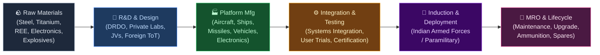

# INDIAN DEFENCE SECTOR — Value Chain Analysis
*Date: June 28, 2026 | Framework: Porter's Value Chain + Five Forces + GVC + Linkages + Blue Ocean*

---

## 0. Segment Definition

**Precise boundary:** The end-to-end Indian defence value chain — from raw material and component supply, through R&D and design, platform/system manufacturing (land, air, naval, space, cyber), to MRO (maintenance, repair, overhaul), export, and lifecycle support. Covers defence electronics, missiles, aircraft, warships, armoured vehicles, small arms, ammunition, and emerging domains (drones, cyber, space). Excludes pure civilian aerospace (covered separately).

**Core product/service flow:**

**End customer and what they value most:**
- **Indian Armed Forces (Army, Navy, Air Force):** Operational reliability, indigenisation, performance, lifecycle cost
- **Paramilitary / MHA forces:** Rapid procurement, cost, domestic availability
- **Export buyers (friendly nations):** Price competitiveness, technology, offset arrangements, supply reliability
- **Government / MoD:** Strategic autonomy, Atmanirbharta, forex savings, employment

**India's global position:** **Follower → Emerging Challenger.** India was the world's largest arms importer for a decade (SIPRI). Now #3 globally (2019–23). Defence budget FY25: ~₹6.21L Cr (~$75Bn), one of the world's top-5 defence spenders. Domestic procurement target: 75% from Indian industry by 2027. Defence exports: ₹21,083 Cr in FY24 — target ₹50,000 Cr by 2028-29. India's Nifty India Defence index (launched 2023) reflects the market's recognition of a structural transformation underway.

---

## 1. Value Chain Map — Primary Activities

### Inbound Logistics (Raw Materials & Components)

**What it involves:** Procurement of aerospace-grade steel, titanium, aluminium alloys, carbon fibre composites, rare earth elements (for radar, guidance), semiconductor chips, propellants, explosives, and sub-system components from domestic and import sources. Military specifications (Mil-Spec) apply to all inputs.

**Key cost drivers:** Import dependence for critical materials (titanium from Russia/Ukraine, AESA radar chips from US/Israel, carbon fibre from Japan/US), long lead times for classified components, foreign exchange exposure, strategic stockpiling requirements.

**Differentiation:** Companies with approved domestic material substitutes (DRDO-certified), multi-source procurement, and strategic buffer stocks hold supply chain resilience advantages.

**Key Indian players:**
- **Steel Authority of India (NSE: SAIL)** — armour steel for AFVs (Arjun tank hull plates)
- **Midhani (Mishra Dhatu Nigam, NSE: MIDHANI)** — speciality alloys (titanium, superalloys) for aerospace/defence; sole Indian source for several Mil-Spec alloys
- **Hindustan Copper (NSE: HINDCOPPER)** — copper alloys for ammunition casings
- **Aditya Birla Group / Hindalco (NSE: HINDALCO)** — aerospace aluminium
- **Tata Advanced Materials (unlisted, Tata subsidiary)** — carbon fibre composites for LCA Tejas
- **Solar Industries India (NSE: SOLARINDS)** — explosives and propellants for ammunition
- **Premier Explosives (NSE: PREMEXPLN)** — solid propellants for missiles (DRDO programmes)

---

### Operations (R&D, Design & Platform Manufacturing)

**What it involves:** The core of the defence value chain — broken into two distinct sub-layers:

**Sub-layer A: R&D & Design**
Conceptual design, prototype development, technology demonstration, user evaluation. DRDO (Defence Research and Development Organisation) has historically dominated; private sector R&D is nascent but growing.

**Key players — R&D:**
- **DRDO (Defence Research and Development Organisation)** — 52 labs; ₹23,855 Cr budget (FY25); responsible for LCA Tejas, Arjun MBT, BrahMos (with Russia), Akash missile, AESA radar (Uttam), ATAGS howitzer, INS Arihant nuclear submarine
- **IITs / IISc / DIAT (Pune)** — academic R&D; growing dual-use tech (AI, drones, materials)
- **HAL R&D Centre (Bengaluru)** — aircraft design (Tejas Mk1A, AMCA, HTT-40)
- **BrahMos Aerospace (JV)** — supersonic cruise missile development (India-Russia JV, India now 50.5%)

**Sub-layer B: Platform Manufacturing**

**Land Systems:**
- **Ordnance Factory Board → Advanced Weapons & Equipment India Ltd (AWEIL)** — small arms (INSAS, AK-203), field guns (now corporatised; 7 DPSUs)
- **Armoured Vehicles Nigam Ltd (AVNL)** — Arjun MBT, BMP variants (corporatised OFB)
- **Tata Motors Defence (subsidiary)** — high-mobility military vehicles; LPTV, Wheeled APC
- **Mahindra Defence Systems (subsidiary)** — Armoured Light Specialist Vehicles (ALSV), Mine Protected Vehicles
- **BEML Ltd (NSE: BEML)** — high-mobility trucks, Tatra-based vehicles, metro/defence equipment
- **Ashok Leyland Defence Systems (subsidiary)** — military trucks, armoured command vehicles

**Aerospace (Aircraft & Helicopters):**
- **Hindustan Aeronautics Ltd (NSE: HAL)** — largest defence PSU; ₹28,162 Cr revenue FY24; manufactures LCA Tejas, Su-30MKI (licensed), ALH Dhruv, LCH Prachand, Do228; AMCA (5th gen fighter) in development
- **Tata Advanced Systems Ltd (TASL, unlisted)** — C-295 transport aircraft fuselage (Airbus JV at Vadodara), Sikorsky helicopter cabins, Boeing Apache components

**Missiles & Space:**
- **BrahMos Aerospace (joint venture)** — BrahMos supersonic cruise missiles; ₹7,000+ Cr revenue; export orders from Philippines, Indonesia
- **Bharat Dynamics Ltd (NSE: BDL)** — guided missiles (Akash, Astra, Konkurs, MRSAM); ₹2,539 Cr revenue FY24
- **Larsen & Toubro Defence (L&T subsidiary)** — Pinaka MLRS rockets, K9 Vajra howitzers (licensed Samsung Techwin), BRAHMOS ground systems, naval gun mounts
- **DRDO / ISRO-linked entities** — Agni series ICBM/IRBM (DRDO-managed production via BHEL/BDL)

**Naval Systems:**
- **Mazagon Dock Shipbuilders (NSE: MAZDOCK)** — P-75 Scorpene submarines, P-15B destroyers (INS Visakhapatnam class); ₹9,466 Cr revenue FY24; order book >₹50,000 Cr
- **Garden Reach Shipbuilders & Engineers (NSE: GRSE)** — frigates (Project 17A), corvettes, Fast Patrol Vessels; ₹4,544 Cr revenue FY24
- **Cochin Shipyard (NSE: COCHINSHIP)** — aircraft carrier INS Vikrant (India's first), LPDs, submarines (future)
- **Goa Shipyard Ltd (unlisted PSU)** — offshore patrol vessels, corvettes
- **L&T Shipbuilding (unlisted)** — private shipyard at Kattupalli; potential warship contender

**Defence Electronics:**
- **Bharat Electronics Ltd (NSE: BEL)** — India's largest defence electronics company; radar, communication, sonar, EW systems, night vision; ₹19,496 Cr revenue FY24; Mkt cap ~₹2.2L Cr
- **Data Patterns (NSE: DATAPATT)** — indigenous radar and electronics sub-systems; recently listed (2021)
- **Astra Microwave Products (NSE: ASTRAMICRO)** — microwave and RF sub-systems for missiles, radar
- **Centum Electronics (NSE: CENTUM)** — aerospace & defence electronics, PCB assemblies
- **Paras Defence & Space Technologies (NSE: PARAS)** — EO/IR systems, space optics

**Drones & Emerging Tech:**
- **Ideaforge Technology (NSE: IDEAFORGE)** — SWITCH UAV series; Indian Army's largest drone supplier; ₹347 Cr revenue FY24
- **Garuda Aerospace (unlisted)** — military and agricultural drones; MoD approved
- **Adani Defence & Aerospace (unlisted)** — Drishti 10 MALE drone (from Elbit Systems JV); expanding rapidly
- **Alpha Design Technologies (unlisted)** — defence electronics assembly; acquired by Adani

---

### Outbound Logistics (Delivery, Induction & Distribution)

**What it involves:** Delivery of platforms to armed forces (DAC — Defence Acquisition Council acceptance), logistics for ammunition and spare part distribution to forward bases, strategic pre-positioning, classified transport logistics.

**Key dynamics:** Ministry of Defence coordinates delivery acceptance. All platforms undergo user trials (GSQR — General Staff Qualitative Requirements certification). DRDO handles quality assurance (DGQA — Directorate General Quality Assurance). Ordnance Supply Corps manages ammunition logistics.

**Key players:**
- **DGQA (Directorate General of Quality Assurance)** — government body; certifies all defence production
- **Ordnance Services Corps (Indian Army)** — manages ammunition depots, supply chain to field units
- **Defence Logistics Agency (DLA equivalent being built)** — India developing integrated logistics command (ILC under CDS/theatre commands)
- **Air India (post-privatisation)** — strategic airlift for defence cargo (supplement to IAF)

---

### Marketing & Sales (Export & Domestic Tender Management)

**What it involves:** Responding to Requests for Proposal (RFPs) from MoD under DPP (Defence Procurement Procedure) / DAP 2020; export marketing to friendly nations through government-to-government (G2G) channels, defence attaché networks, India Defence Expo; DTTI (Defence Trade and Technology Initiative) with US.

**Key dynamics:** India's DAP 2020 creates category priorities — IC (Indigenously Designed, Developed & Manufactured), iDDMM categories enforce domestic content. Positive Indigenisation Lists (4 lists published) ban imports of 509+ items including helicopters, assault rifles, artillery guns, radars — forcing domestic procurement.

**Key players:**
- **HAL** — marketing Tejas Mk1A (Egypt, Malaysia, Argentina inquiries), ALH Dhruv, Do228
- **BrahMos Aerospace** — most successful Indian defence export; Philippines ($375M contract, 2022); Indonesia, Saudi Arabia, Vietnam negotiations
- **L&T Defence** — K9 Vajra export potential; Pinaka MLRS (Armenia deal under discussion)
- **Bharat Forge (NSE: BHARATFORG)** — Kalyani M4 wheeled APC; artillery barrels export to Europe
- **BEML** — export of high-mobility vehicles
- **Adani Defence** — Drishti drones; international marketing

---

### Service (MRO, Upgrades, Lifecycle Support)

**What it involves:** Maintenance, repair, and overhaul (MRO) of inducted platforms over 30–40 year lifecycles; ammunition replenishment; mid-life upgrades (MLU); simulator training systems; spare parts supply.

**Key dynamics:** MRO is chronically underfunded in India — IAF aircraft availability rates are lower than global peers partly due to MRO bottlenecks and OEM-dependent spares for Russian platforms (Su-30, MiG series). The push for Atmanirbharta includes building domestic MRO capability.

**Key players:**
- **HAL** — licensed MRO for Su-30MKI, Jaguar, Mirage 2000; ALH/LCH; ₹5,000+ Cr MRO revenue
- **Bharat Electronics** — radar upgrades, EW system servicing
- **Indian Ordnance Factories (AWEIL, Munitions India Ltd)** — ammunition production + overhaul
- **Elofic Industries (NSE: ELOFICIN)** — filter systems for defence vehicles (niche MRO)
- **Tata Boeing Aerospace (unlisted JV)** — AH-64E Apache helicopter components + potential MRO
- **Air Works India (unlisted)** — civil MRO; defence expansion

---

## 2. Value Chain Map — Support Activities

### Firm Infrastructure

**Role:** MoD (Ministry of Defence) governs procurement policy (DAP 2020, Defence Acquisition Council), industrial licensing (industrial licence mandatory for defence manufacturing under Industries Development Act), FDI policy (74% automatic, 100% government route), export controls (SCOMET — Special Chemicals, Organisms, Materials, Equipment and Technologies).

**Key policy milestones:**
- **Positive Indigenisation Lists (PIL):** 509+ items now banned from import; creates captive domestic demand
- **DAP 2020 (Defence Acquisition Procedure):** IC category gives highest priority to indigenous design; DPP streamlined to reduce acquisition timelines
- **Defence Industrial Corridors:** UP DIC (Lucknow-Agra-Aligarh-Kanpur) and Tamil Nadu DIC (Chennai-Hosur-Coimbatore-Tiruchirappalli) — ₹50,000 Cr investment committed; 400+ MoUs signed
- **iDEX (Innovations for Defence Excellence):** ₹500 Cr fund for startups and MSMEs; 350+ challenges launched; 200+ contracts awarded
- **DPIIT Industrial Licence:** Mandatory for defence manufacturing — deregulated since 2014 (earlier only 2 licences in 60 years; now 600+ licences)
- **DPSUs (Defence Public Sector Undertakings):** HAL, BEL, BDL, BEML, MDL, GRSE, Cochin Shipyard, Goa Shipyard, MIDHANI — 9 listed/unlisted major PSUs

---

### HR Management

**Role:** Defence manufacturing requires the highest-precision skilled workforce — aerospace engineers, naval architects, systems integration specialists, software engineers for embedded systems, and certified quality personnel (DGQA approved).

**Strengths:** IITs/NITs produce aerospace/mechanical engineers; DIAT (Defence Institute of Advanced Technology, Pune) trains defence-specific engineers. HAL alone employs ~30,000 people.

**Weaknesses:** Critical shortage of systems engineering talent (vs US/Israel); brain drain of top engineers to IT sector (higher pay); private sector defence companies struggle to attract talent due to clearance requirements and comparatively lower pay vs FAANG.

**Emerging:** iDEX startup ecosystem attracting young talent; DIC corridors building industrial clusters with skill development centres (ITIs, polytechnics).

---

### Technology Development

**Role:** The single biggest constraint in Indian defence — DRDO has delivered some world-class systems (BrahMos, Akash, Pinaka, Arjun) but the average time from development to induction is 15–20 years vs 7–10 years globally. Private sector R&D is now being incentivised via iDEX, TDF (Technology Development Fund), and 25% of defence R&D budget opened to private sector.

**Critical technology gaps:** AESA radar (Uttam radar still in development; no indigenous operational AESA system in service); aero-engine (Kaveri engine failed; GTRE-DRDO working on next gen; India is the only major power with no domestic aero-engine); nuclear submarine propulsion; quantum communication for defence.

**Key players:**
- **DRDO** — 52 labs; ~25,000 scientists; focus areas: missiles, EW, materials, naval systems, nuclear
- **HAL R&D** — aircraft; AMCA (Advanced Medium Combat Aircraft — 5th gen, MMRCA class)
- **BEL Central R&D (Bengaluru)** — radar, EW, communication
- **L&T Technology Services (NSE: LTTS)** — defence electronics engineering
- **Tata Advanced Systems** — systems engineering for aerospace platforms
- **Ideaforge, Garuda Aerospace** — drone-specific R&D
- **IISc / DIAT / IIT Madras** — academic research (explosives, materials, AI for defence)

---

### Procurement

**Role:** DAP 2020 governs MoD procurement. Defence Procurement categories: IC (Make I), Make II, Buy Indian-IDDM, Buy Indian, Buy & Make (Indian), Buy & Make (Global), Buy Global. Offset policy (30% for >₹2,000 Cr contracts — recently revised/suspended temporarily for some categories).

**Key dynamics:** India's defence capital procurement is one of the world's most complex bureaucracies — average procurement cycle was 7–10 years (2010s); now targeted at 2–3 years for standard items post-DAP 2020 reforms. Emergency Procurement (EP) powers used extensively post-Galwan (2020) for fast-track acquisition from domestic/global vendors.

**PSU dominance:** PSUs still capture ~75% of domestic defence procurement budget. Private sector share growing but from a low base. HAL alone gets ~₹15,000+ Cr in MoD contracts annually.

---

## 3. Five Forces Analysis

**Supplier Power — MEDIUM (Domestic), EXTREME (Import-dependent):** For domestic suppliers — DPSUs are government-owned and procurement is policy-driven; supplier power is moderated by monopsony buyer (MoD). For imported technology/platforms — Russia (Su-30, MiG, submarines, tanks) and Western OEMs (Boeing, Lockheed, Airbus, Safran, Thales) have extreme supplier power because they supply irreplaceable systems. India's aero-engine gap (no domestic jet engine) gives foreign suppliers permanent leverage. Post-Galwan, shift to diversify from Russia is urgent — but expensive and slow.

**Buyer Power — EXTREME:** MoD is the monopsonist — the only buyer for most strategic systems in India. MoD sets requirements (GSQR), sets timelines (often delayed), sets prices (L1 bidding for commercial items), and controls export approvals. This extreme buyer concentration suppresses margins for domestic suppliers, particularly PSUs where cost-plus pricing is standard. The private sector has marginally better negotiating power for niche products where alternatives are limited.

**Threat of New Entrants — LOW-MEDIUM (for legacy systems), MEDIUM-HIGH (for drones/tech):** Building a warship, fighter aircraft, or submarine requires decades of specialised know-how and capital — virtually no new entrants possible for these platforms. However, in drones (Ideaforge, Garuda, Adani Defence), defence electronics (Data Patterns, Astra Microwave), and cyber/space, the barriers are lower. iDEX has deliberately lowered entry barriers for startups — 350+ startups now active in defence. Drone sector has seen 50+ new entrants in 3 years.

**Threat of Substitutes — LOW:** Defence platforms have no commercial substitutes — a frigate cannot be replaced with a commercial ship for warfighting. However, doctrinal substitution exists: drone swarms potentially replacing manned aircraft for certain missions; cyber warfare substituting for kinetic strikes; precision guided munitions (PGMs) substituting for mass artillery. These doctrinal shifts create new value chain opportunities (drone manufacturers, cyber companies) while threatening legacy platforms (manned strike aircraft demand could decline long-term).

**Rivalry Intensity — LOW (PSU vs PSU), MEDIUM (Private vs PSU):** Between PSUs, there is minimal competition — HAL makes aircraft, MDL makes submarines, BEL makes electronics. Each operates in its own silo. The emerging rivalry is between PSUs and private sector (HAL vs TASL for aircraft components; BEL vs Data Patterns for radar sub-systems; GRSE vs L&T Shipbuilding for smaller vessel contracts). This rivalry is intensifying post-DAP 2020 which mandates competitive bidding even for domestic industry. Export market rivalry (India vs Turkey, South Korea, Israel for global arms exports in the $5–25M per-unit range) is Medium and growing.

| Force | Rating |
|---|---|
| Supplier Power (imports) | Extreme |
| Supplier Power (domestic) | Medium |
| Buyer Power (MoD monopsony) | Extreme |
| Threat of New Entrants | Low-Medium |
| Threat of Substitutes | Low |
| Rivalry Intensity | Low-Medium |

**Overall Attractiveness: MEDIUM-HIGH (structurally improving).** The combination of captive domestic demand (₹6.2L Cr budget), government mandate for indigenisation (Positive Indigenisation Lists), growing exports, and emerging private sector participation creates a structurally improving attractiveness. However, monopsony buyer power, long payment cycles (PSUs often face 180–360 day receivable days from MoD), and technology gaps suppress near-term returns. The most attractive sub-segments: missiles (BDL, L&T), naval shipbuilding (MDL, GRSE, Cochin), defence electronics (BEL, Data Patterns), and drones (Ideaforge).

---

## 4. GVC Governance & India's Position

**Lead firms (global):** Lockheed Martin, Boeing, Raytheon/RTX, Northrop Grumman (US); BAE Systems, Airbus Defence (UK/EU); Rostec/United Aircraft (Russia — diminishing post-Ukraine); IAI, Elbit Systems, Rafael (Israel); KNDS, Thales (France). These firms set global defence technology standards, control critical subsystems (engines, avionics, sensors), and govern ToT (Transfer of Technology) access.

**Lead firms (Indian):** HAL (aircraft), BEL (electronics), MDL/GRSE (naval), BDL (missiles), L&T Defence (systems integration + artillery), Tata Advanced Systems (emerging), Adani Defence (emerging).

**Governance type: CAPTIVE (for high-tech imports) + transitioning toward RELATIONAL (for ToT-based joint ventures).**

India's defence GVC is predominantly CAPTIVE — Indian companies manufacture under licence or buy finished systems from global OEMs who set all technical and quality standards. The shift toward RELATIONAL governance is visible in: BrahMos (India-Russia JV), C-295 (Airbus-TASL JV), AH-64E (Boeing-Tata JV), MRSAM (Israel Aerospace Industries-BDL-BEL). In these relationships, India gains technology access but remains dependent on the foreign partner for critical IP.

**Value capture map:**

| Stage | Value Captured | Where |
|---|---|---|
| Advanced R&D / IP (engines, AESA, sensors) | 50–70% of platform value | US, EU, Israel |
| Systems Integration (Indian licensed mfg) | 10–20% | India (PSUs) |
| Platform Manufacturing (Indian content) | 15–25% | India (PSUs + private) |
| MRO for legacy Russian platforms | 5–10% (most goes to Russia/OEM) | Russia / India partially |
| Ammunition & consumables | 100% (domestic, growing) | India |
| Export value | Small but growing | India |

**India's upgrade trajectory:**
- **Process upgrading:** ✅ Partially done — India manufactures Su-30MKI with 63% indigenous content; licensed production of K9 Vajra with 50% indigenous content
- **Product upgrading:** 🔄 In progress — LCA Tejas Mk1A (indigenous fighter); AMCA (5th gen, still ~10 years away); Arjun Mk2; P-75I submarine (indigenous AIP)
- **Functional upgrading:** 🔄 In progress — TASL/Tata exporting Apache helicopter components to Boeing; BrahMos export makes India a missile systems exporter
- **Chain upgrading:** 🔄 Nascent — India's iDEX ecosystem is beginning to create home-grown defence tech companies; BrahMos is the only example of India governing a GVC segment (supersonic cruise missiles)

---

## 5. Key Linkages & Leverage Points

1. **Aero-engine Gap → Total Platform Dependence:** India's inability to produce its own jet engine (Kaveri programme failed after 30 years) means every Indian fighter aircraft — Tejas Mk1A, Rafale, Su-30MKI, Mirage 2000 — is engine-dependent on foreign suppliers. This is the most critical single-point vulnerability in India's defence value chain. Without a domestic engine, India can never achieve true strategic autonomy in airpower. The Kaveri 2.0 / next-gen GTRE engine programme with possible GE/Safran ToT is the critical path item.

2. **Positive Indigenisation Lists → Private Sector Manufacturing:** The ban on importing 509+ items is creating a ₹4L Cr+ captive domestic market for Indian manufacturers. Each PIL item creates a procurement opportunity where MoD must buy from Indian industry. This linkage — policy → domestic demand → private investment — is the engine of India's defence manufacturing transformation. L&T, Tata, Mahindra, Adani, Bharat Forge are all investing in anticipation of PIL-driven demand.

3. **R&D → Induction Cycle (BROKEN):** DRDO's 15–25 year development-to-induction cycles have historically broken the R&D → procurement linkage. The Arjun tank took 37 years; Tejas 33 years; INSAS rifle was replaced before successor was ready. Fixing this linkage through mission-mode R&D programmes (like iDEX's 18-month challenge-to-prototype timelines) is the single most important internal reform.

4. **Export → Scale → Cost Competitiveness Linkage:** India's domestic defence production scale is insufficient for cost-competitive manufacturing. BrahMos achieves competitive pricing because Russia + India share fixed costs. HAL's Tejas unit cost (~$50M) is competitive only if export orders come (targeted: Egypt 20 aircraft, Malaysia 18, others). Every export order reduces per-unit fixed costs, making domestic procurement cheaper. This virtuous cycle — export-driven scale → domestic cost reduction — is the model India must replicate across platforms.

5. **Theatre Commands → Integrated Logistics Demand:** India's ongoing military reorganisation into integrated theatre commands (under CDS) will create new demand for integrated logistics, joint communications, common platforms (reducing the Army/Navy/Air Force platform fragmentation), and joint training simulators. Companies positioned for theatre command interoperability requirements will gain long-term structural advantage.

**Highest-leverage intervention:** **Solve the aero-engine problem.** A domestic jet engine capability — achieved through GE F414 ToT (for Tejas Mk2/AMCA) or full indigenous development — would unlock India's ability to export fighters, offer engine upgrades to friendly nations, and eliminate the single largest strategic dependency. Every other investment in the defence value chain is secondary to this.

---

## 6. Indian Company Landscape

### Listed Companies

| Value Chain Stage | Company Name | Listed? | Exchange & Ticker | Business Description | Approx. Revenue / Mkt Cap | Position |
|---|---|---|---|---|---|---|
| Speciality Alloys | Midhani (Mishra Dhatu Nigam) | Yes | NSE: MIDHANI | Titanium, superalloys, speciality steels for aerospace/defence | ₹1,100 Cr revenue (FY24); Mkt cap ~₹5,500 Cr | Leader |
| Explosives / Propellants | Solar Industries India | Yes | NSE: SOLARINDS | Explosives, ammunition, rocket propellants; Nagastra-1 loitering munition | ₹6,100 Cr revenue (FY24); Mkt cap ~₹82,000 Cr | Leader |
| Explosives / Propellants | Premier Explosives | Yes | NSE: PREMEXPLN | Solid propellants for DRDO missiles; defence explosives | ₹440 Cr revenue (FY24) | Niche |
| Aircraft Manufacturing | Hindustan Aeronautics Ltd | Yes | NSE: HAL | Fighter aircraft, helicopters, aero-engines (licensed); largest defence PSU | ₹28,162 Cr revenue (FY24); Mkt cap ~₹2.7L Cr | Leader |
| Missiles | Bharat Dynamics Ltd | Yes | NSE: BDL | Guided missiles — Akash, Astra, Konkurs, MRSAM | ₹2,539 Cr revenue (FY24); Mkt cap ~₹25,000 Cr | Leader |
| Defence Electronics | Bharat Electronics Ltd | Yes | NSE: BEL | Radar, sonar, EW, communication, night vision for all three services | ₹19,496 Cr revenue (FY24); Mkt cap ~₹2.2L Cr | Leader |
| Naval Shipbuilding | Mazagon Dock Shipbuilders | Yes | NSE: MAZDOCK | Submarines (Scorpene), destroyers (P-15B), frigates | ₹9,466 Cr revenue (FY24); Mkt cap ~₹86,000 Cr | Leader |
| Naval Shipbuilding | Garden Reach Shipbuilders | Yes | NSE: GRSE | Frigates (P-17A), corvettes, fast patrol vessels | ₹4,544 Cr revenue (FY24); Mkt cap ~₹18,000 Cr | Leader |
| Naval Shipbuilding | Cochin Shipyard | Yes | NSE: COCHINSHIP | Aircraft carrier INS Vikrant; LPDs; submarine pipeline | ₹4,100 Cr revenue (FY24); Mkt cap ~₹25,000 Cr | Leader |
| Heavy Vehicles / Defence Eqpt | BEML Ltd | Yes | NSE: BEML | High-mobility military vehicles, Tatra trucks, metro + defence | ₹4,200 Cr revenue (FY24); Mkt cap ~₹7,000 Cr | Leader |
| Land Systems / Artillery | Larsen & Toubro | Yes | NSE: LT | K9 Vajra artillery, Pinaka MLRS, naval guns, defence systems | ₹2,21,000 Cr revenue (FY24); Defence division ~₹15,000 Cr | Leader |
| Land Systems / Artillery | Bharat Forge | Yes | NSE: BHARATFORG | Artillery barrels, Kalyani M4 APC, armour components | ₹15,000 Cr revenue (FY24); Defence ~₹3,000 Cr | Challenger |
| Defence Electronics (sub-systems) | Data Patterns (India) | Yes | NSE: DATAPATT | Radar electronics, AESA sub-assemblies, fire control systems | ₹520 Cr revenue (FY24); Mkt cap ~₹8,500 Cr | Challenger |
| Defence Electronics (RF/microwave) | Astra Microwave Products | Yes | NSE: ASTRAMICRO | RF and microwave sub-systems for missiles and radar | ₹550 Cr revenue (FY24); Mkt cap ~₹3,500 Cr | Niche |
| Defence Electronics | Centum Electronics | Yes | NSE: CENTUM | PCB assemblies, electronics for aerospace/defence | ₹900 Cr revenue (FY24) | Niche |
| Space / EO-IR Optics | Paras Defence & Space Technologies | Yes | NSE: PARAS | EO/IR systems, space optics, IEMI shielding | ₹180 Cr revenue (FY24); Mkt cap ~₹2,200 Cr | Niche |
| Drones (UAV) | Ideaforge Technology | Yes | NSE: IDEAFORGE | SWITCH UAV series; military surveillance drones | ₹347 Cr revenue (FY24); Mkt cap ~₹1,800 Cr | Challenger |
| Armoured Vehicles / Auto | Tata Motors (Defence div) | Yes | NSE: TATAMOTORS | High-mobility military vehicles, wheeled APCs, logistics vehicles | Defence division revenue: ~₹3,000 Cr; Parent mkt cap ~₹3.3L Cr | Challenger |
| Armoured Vehicles | Mahindra & Mahindra (Defence) | Yes | NSE: M&M | ALSV, Mine Protected Vehicles, military trucks | Defence division: ~₹1,500 Cr; Parent mkt cap ~₹3.7L Cr | Challenger |
| Shipbuilding / Infrastructure | Adani Ports (Adani Defence) | Yes | NSE: ADANIPORTS | Muntra UGV, Drishti MALE drone, shipbuilding (Kutch) | Adani Defence unlisted subsidiary; Parent mkt cap ~₹2.7L Cr | Emerging |

### Unlisted / Private Companies

| Value Chain Stage | Company Name | Listed? | Business Description | Notes |
|---|---|---|---|---|
| Aircraft Components | Tata Advanced Systems Ltd (TASL) | No | C-295 fuselage mfg (Airbus JV); Apache/Sikorsky components; Boeing AH-64 | Tata Sons subsidiary; Vadodara plant operational 2024 |
| Drone Mfg | Garuda Aerospace | No | Military and agricultural UAVs; MoD-approved supplier | Backed by Hyundai and others; 10,000+ drones deployed |
| Defence Electronics | Alpha Design Technologies | No | Defence electronics assembly and systems | Acquired by Adani Group (2022) |
| Missiles (JV) | BrahMos Aerospace | No | BrahMos supersonic cruise missile; India-Russia JV (India 50.5%) | Revenue ~₹7,000 Cr; Philippines export $375M |
| Aircraft MRO | Tata Boeing Aerospace | No | AH-64E Apache fuselage manufacturing + MRO (Boeing JV) | Hyderabad plant |
| Land Systems | Armoured Vehicles Nigam Ltd (AVNL) | No (DPSU) | Arjun MBT, T-72 upgrade, BMP-II; corporatised OFB | Formerly OFB; 7 DPSUs corporatised |
| Ammunition | Munitions India Ltd | No (DPSU) | All Indian Army ammunition; shells, bombs, grenades | Formerly OFB; monopoly ammunition producer |
| Small Arms | Advanced Weapons & Equipment India (AWEIL) | No (DPSU) | AK-203 rifles (Indo-Russian JV at Amethi), INSAS | Joint venture with Rosoboronexport |
| Naval Vessels | Goa Shipyard Ltd | No (DPSU) | OPVs, patrol vessels, offshore vessels | Unlisted PSU; government-owned |
| Defence Startups | iDEX ecosystem (350+ companies) | No | Drones, AI, materials, cyber, quantum — early stage | iDEX-funded; most pre-revenue or early revenue |

### Notable companies — deeper notes

**Hindustan Aeronautics Ltd (HAL)**
- Stage in chain: Aircraft Manufacturing, R&D, MRO
- What makes them interesting: HAL is India's strategic aerospace spine — the only company in the world that simultaneously designs, manufactures, and maintains fighter aircraft, helicopters, and aero-engines in a single entity. The Tejas Mk1A order (83 aircraft, ₹48,000 Cr) and the LCH Prachand order are transformative for revenue visibility. AMCA (5th gen fighter) development will define HAL's next 20 years. The chronic criticism — long development cycles, low production efficiency — is being addressed through private sector co-production models.
- Key financials: Revenue ₹28,162 Cr FY24; EBITDA margin ~24%; Mkt cap ~₹2.7L Cr; order book >₹94,000 Cr
- Watch factor: Tejas Mk1A production ramp (target: 16 aircraft/year by FY27); AMCA engine decision (GE F414 ToT or indigenous); export orders for Tejas and ALH Dhruv

**Bharat Electronics Ltd (BEL)**
- Stage in chain: Defence Electronics (Radar, EW, Communication, Sonar)
- What makes them interesting: BEL is India's most diversified defence electronics company — the backbone of India's radar modernisation, field communication networks (Battlefield Management Systems), submarine sonar (HUMSA-NG), and the Akash missile seeker. BEL's competitive moat is extraordinary: 9 manufacturing divisions, 65+ years of defence electronics know-how, DRDO's primary production partner. With AESA radar (Uttam) entering production, BEL is the designated manufacturer — potentially a ₹15,000 Cr programme over 10 years.
- Key financials: Revenue ₹19,496 Cr FY24; EBITDA margin ~22%; Mkt cap ~₹2.2L Cr; order book ~₹75,000 Cr
- Watch factor: Uttam AESA radar production order; Quick Reaction Surface-to-Air Missile (QRSAM) production; non-defence revenue (EVs, space) diversification

**Mazagon Dock Shipbuilders (MDL)**
- Stage in chain: Naval Submarine + Destroyer Manufacturing
- What makes them interesting: MDL built India's first domestically produced Scorpene submarines (six units for ₹23,562 Cr) and is building the P-15B Visakhapatnam-class destroyers — India's most capable warships. The P-75I (6 submarines with AIP propulsion) programme worth ~₹43,000 Cr is the next anchor order. MDL's order book-to-revenue ratio of ~5x gives extraordinary revenue visibility. As India's only submarine-capable shipyard, MDL has a monopoly on one of the most strategic defence capabilities.
- Key financials: Revenue ₹9,466 Cr FY24; EBITDA margin ~8%; Mkt cap ~₹86,000 Cr; order book >₹50,000 Cr
- Watch factor: P-75I contract award (delayed since 2021); Scorpene export potential (Canada, Australia shortlisted India)

**Solar Industries India (SOLARINDS)**
- Stage in chain: Explosives, Ammunition, Loitering Munitions
- What makes them interesting: Solar Industries is a rare example of a private Indian company that has climbed the defence value chain from commercial explosives (mining, infrastructure) all the way to loitering munitions — the Nagastra-1 (India's first indigenous suicide drone), rocket motors for DRDO programmes, and ammunition for the Indian Army. The Nagastra-1 induction (480 units ordered by Indian Army in FY24) represents a genuine private sector defence product achievement. Solar's Economic Explosives business provides the cash flow foundation to fund defence R&D.
- Key financials: Revenue ₹6,100 Cr FY24; EBITDA margin ~22%; Mkt cap ~₹82,000 Cr
- Watch factor: Nagastra-1 and Nagastra-2 (longer range) export potential; rocket motor business scale-up for Pinaka/QRSAM

**Data Patterns (India) Ltd (DATAPATT)**
- Stage in chain: Defence Electronics Sub-systems
- What makes them interesting: Data Patterns is the best example of a private Indian company building genuine defence electronics IP — their radar sub-systems, fire control systems, and AESA radar T/R modules are increasingly being chosen by DRDO/BEL as domestic alternatives to imported components. Revenue CAGR of 40%+ since IPO (2021). At ₹520 Cr revenue, they are tiny — but their EBITDA margins (35%+) demonstrate the pricing power of specialised defence electronics with genuine IP.
- Key financials: Revenue ₹520 Cr FY24; EBITDA margin ~35%; Mkt cap ~₹8,500 Cr
- Watch factor: Order book conversion for Uttam AESA radar sub-systems; EW programme wins

**BrahMos Aerospace (Unlisted JV)**
- Stage in chain: Missiles (Manufacturing + Export)
- What makes them interesting: BrahMos is India's most successful defence export product and the template for India's defence GVC strategy. At ~$2.5M per missile (land-attack variant), BrahMos is price-competitive vs US Tomahawk ($2M+) for a supersonic platform — a unique capability. India now holds 50.5% in BrahMos (Russia reduced to 49.5%) — making it effectively an Indian-governed GVC for supersonic cruise missiles. Philippines deal ($375M, 2022) opened the floodgates; negotiations active with Indonesia, Vietnam, Saudi Arabia, South Africa, Egypt. Next: BrahMos-NG (miniaturised, for Tejas Mk1A integration).
- Key financials: Revenue ~₹7,000 Cr (estimated FY24); export backlog $3Bn+
- Watch factor: BrahMos-NG integration on Tejas Mk1A; export contract closures in 2025-26; hypersonic BrahMos-II development

---

## 7. Strategic Insight

**Non-obvious insight:** India's defence transformation is often framed as a "Atmanirbharta" (self-reliance) story — but the deeper strategic reality is that India is attempting to compress 60 years of defence industrial development into 15 years, in a sector where technology half-life is shortening dramatically due to AI, drones, electronic warfare, and space-based ISR. The countries that will dominate 21st century warfare are not those with the most tanks or aircraft, but those with the most sophisticated defence tech ecosystems — integrated AI-enabled C4ISR, drone swarms, hypersonics, and cyber capabilities. India's iDEX/startup ecosystem is the most important initiative in this context — not HAL or DRDO — because it is the only mechanism by which India can generate genuinely new defence technology rather than license/manufacture legacy systems. The stock market has not yet valued this correctly: the listed defence PSUs (HAL, BEL, MDL) are valued on traditional defence manufacturing metrics, but the next wave of value creation will come from companies like Solar Industries (loitering munitions), Ideaforge (drone swarms), and yet-to-be-listed iDEX graduates.

**Blue Ocean opportunity (Four Actions Framework):**
- **Eliminate:** Dependence on Russian OEMs for MRO of legacy platforms (Su-30, T-90, Talwar-class) — build domestic MRO capability now using the Galwan supply shock as justification; every rupee spent on domestic MRO stays in India
- **Reduce:** The 509-item import ban list should be a floor, not a ceiling — reduce the threshold for PIL items from ₹500 Cr to ₹100 Cr to cover more sub-systems and components
- **Raise:** Investment in drone swarm technology and counter-drone systems — the Ukraine war has demonstrated that cheap drone swarms have fundamentally changed land warfare; India has the software talent and manufacturing base to lead globally in this domain within 5 years
- **Create:** India as Asia's defence export hub for the Global South — 60+ countries currently buy Russian arms and will need alternatives post-Ukraine; India (BrahMos, Tejas light combat, Pinaka MLRS, patrol vessels) can fill this gap at price points US/EU cannot match; a ₹1L Cr export target by 2030 is achievable if dedicated G2G defence export mechanisms are built

**Top 3 priorities for durable advantage:**
1. **Solve the aero-engine problem on a war-footing** — declare the indigenous jet engine programme (GTRE/Kaveri 2.0 or GE F414 ToT) as a national priority on par with the nuclear programme; without a domestic engine, India's air sovereignty is permanently mortgaged to foreign suppliers
2. **Scale BrahMos into a $10Bn export franchise** — BrahMos is India's only globally competitive, price-differentiated defence product with genuine IP; pursue 20+ export markets aggressively; use BrahMos as the template (JV + ToT + co-production) for Tejas, Pinaka, and Akash exports
3. **Fund iDEX at 10x current scale** — from ₹500 Cr to ₹5,000 Cr; mandate that 25% of MoD procurement be from iDEX-funded companies within 5 years; this is how Israel built Elbit, Rafael, IAI from scratch — sustained government demand for domestic tech startups

---

## 8. Value Chain Diagram

```mermaid
flowchart LR
    subgraph SUPPORT["⚙️ Support Activities"]
        direction TB
        FI["🏛️ Firm Infrastructure\nMoD · DAP 2020 · DAC\nPositive Indigenisation Lists\niDEX · Defence Corridors\nDPIIT Industrial Licences"]
        HR["👥 HR Management\nIIT/NIT engineers\nDIAT Pune specialists\nDRDO scientists (~25k)\nPrivate sector skill gap"]
        TD["🔬 Technology Development\nDRDO (52 labs)\nHAL R&D · BEL CRL\nIISc/IITs · iDEX startups\n⚠️ Aero-engine gap"]
        PR["📦 Procurement\nDAP 2020 categories\nEmergency Procurement\nOffset policy (30%)\nPIL-driven indigenisation"]
    end

    subgraph PRIMARY["🔄 Primary Activities"]
        direction LR
        IL["📥 Raw Materials\n---\n• Midhani (Ti/superalloys)\n• Solar Industries (propellants)\n• SAIL (armour steel)\n• Hindalco (aero-Al)\n• Import: chips, engines"]
        OP["⚙️ R&D + Platform Mfg\n---\n• HAL (aircraft/helos)\n• MDL + GRSE (naval)\n• BDL + BrahMos (missiles)\n• BEL (electronics/radar)\n• L&T + Bharat Forge (land)\n• DRDO (systems R&D)"]
        OL["📤 Integration & Testing\n---\n• DGQA (certification)\n• DRDO test ranges\n• HAL (flight test)\n• MDL (sea trials)\n• NTRO / DMSRDE"]
        MS["📣 Export & Tender Mgmt\n---\n• BrahMos (Philippines)\n• HAL (Tejas export)\n• L&T (K9 Vajra export)\n• Bharat Forge (barrels)\n• DefExpo / DTTI"]
        SV["🔧 MRO & Lifecycle\n---\n• HAL (Su-30/Tejas MRO)\n• BEL (radar upgrades)\n• Munitions India (ammo)\n• AWEIL (small arms)\n• Tata Boeing (Apache)"]
    end

    IL --> OP --> OL --> MS --> SV

    SUPPORT -.-> IL
    SUPPORT -.-> OP
    SUPPORT -.-> OL
    SUPPORT -.-> MS
    SUPPORT -.-> SV

    subgraph MARGIN["💰 Margin Capture"]
        direction TB
        M1["Defence Electronics\n20–35% EBITDA\n(BEL, Data Patterns)"]
        M2["Missiles / Propellants\n22–30% EBITDA\n(BDL, Solar Industries)"]
        M3["Shipbuilding\n8–12% EBITDA\n(MDL, GRSE)"]
        M4["Aircraft (HAL)\n20–25% EBITDA\n(cost-plus + ToT)"]
        M5["Value leaked:\nAero-engines to GE/Safran\nAvionics to foreign OEMs"]
    end

    OP --> MARGIN

    style IL fill:#1e3a5f,stroke:#3b82f6,color:#bfdbfe
    style OP fill:#14532d,stroke:#22c55e,color:#bbf7d0
    style OL fill:#713f12,stroke:#f59e0b,color:#fef3c7
    style MS fill:#831843,stroke:#ec4899,color:#fce7f3
    style SV fill:#3b0764,stroke:#a855f7,color:#e9d5ff
    style SUPPORT fill:#0f172a,stroke:#475569,color:#cbd5e1
    style PRIMARY fill:#0f172a,stroke:#475569,color:#cbd5e1
    style FI fill:#1e293b,stroke:#64748b,color:#e2e8f0
    style HR fill:#1e293b,stroke:#64748b,color:#e2e8f0
    style TD fill:#1e293b,stroke:#64748b,color:#e2e8f0
    style PR fill:#1e293b,stroke:#64748b,color:#e2e8f0
    style MARGIN fill:#0f172a,stroke:#f59e0b,color:#fef3c7
```

