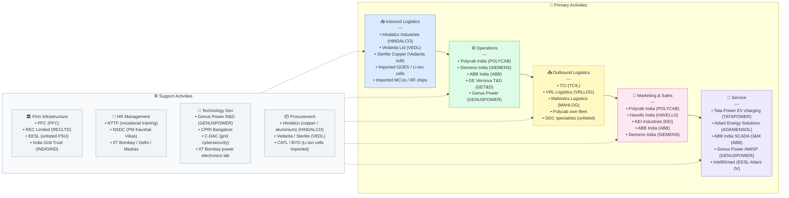

# Electrification — India Value Chain Analysis
*Strategy Analyst Report | Date: June 2026 | Frameworks: Porter VC · Five Forces · Gereffi GVC*

---

## 0. Segment Definition

### Precise boundary
This analysis covers India's **Electrification value chain** in its broadest infrastructure sense — from the point of power generation handoff to the end consumer's socket, motor, or battery. It encompasses:
- **Transmission & Distribution (T&D) grid** — EHV/HV transmission lines, substations, transformers, switchgear, cables & conductors
- **Smart Metering & Grid Automation** — advanced metering infrastructure (AMI), SCADA/EMS, communication networks
- **EV Charging Infrastructure** — AC/DC chargers, charging station management systems (CSMS), vehicle-to-grid (V2G)
- **Industrial Electrification** — switchboards, motor control centres, variable frequency drives (VFDs), automation & control
- **Energy Storage** — lead-acid and lithium-ion battery packs, Battery Energy Storage Systems (BESS), cell manufacturing

Excluded from scope: upstream power generation (thermal, solar, wind) and consumer electronics/white goods downstream.

### Core product/service flow
```
Raw materials (copper, aluminium, steel, lithium, silicon)
        ↓
Component manufacturing (conductors, cores, windings, cells, PCBs)
        ↓
Equipment manufacturing (transformers, switchgear, meters, chargers, inverters, battery packs)
        ↓
System integration & EPC (T&D projects, substation commissioning, BESS deployment, charging networks)
        ↓
Grid operation & asset management (DISCOMs, PGCIL, private T&D cos, SCADA operators)
        ↓
End consumers (households, industries, EV drivers, commercial buildings)
```

### End customers and what they value
| Customer segment | Primary value metric |
|---|---|
| DISCOMs / State utilities | AT&C loss reduction, uptime, regulatory compliance, capex efficiency |
| Industrial consumers | Power quality, uptime, energy efficiency (BEE PAT scheme) |
| EV drivers | Charging speed, network availability, reliability, price |
| Residential consumers | Cost of electricity, power availability, billing accuracy |
| Government / MoP | Energy security, energy access, grid decarbonisation |

### India's global position
| Sub-segment | Global position | Rationale |
|---|---|---|
| T&D EPC execution | **Challenger** | Strong domestic EPC firms; limited global exports so far |
| Transformers & switchgear | **Challenger** | Domestic production adequate; exporting at scale is nascent |
| Cables & conductors | **Leader** | India is a top-5 global exporter; Polycab, KEI export to 80+ countries |
| Smart metering | **Challenger** | Fastest AMI rollout globally under RDSS; domestic tech, not yet exported |
| EV charging infrastructure | **Follower** | Hardware often imported; charging density well below China/EU |
| Lithium-ion cell manufacturing | **Nascent** | Only 1.4 GWh of 50 GWh PLI target commissioned as of mid-2026 |
| BESS (stationary) | **Follower** | Growing; most cells/modules imported from China |

---

## 1. Value Chain Map — Primary Activities

### Activity 1: Inbound Logistics

**What it involves:**
Sourcing and receiving raw materials and components that feed electrification equipment manufacturing. Key inputs include copper and aluminium rods (cables, transformer windings), electrical-grade silicon steel (transformer cores), porcelain/polymer insulators, electronic components (ICs, microcontrollers for smart meters), lithium salts/cells (energy storage), epoxy resins, and specialist chemicals.

**Key cost drivers:**
- Copper price (LME-linked): accounts for 50–70% of cable/conductor manufacturing cost; Polycab and KEI are directly exposed
- Aluminium rod sourcing: heavily import-dependent; India's domestic smelting (Hindalco, Vedanta) partially meets demand
- Silicon steel: ~80% imported from Japan, South Korea, China; India has no significant grain-oriented silicon steel production
- Lithium carbonate/hydroxide: 100% imported; China controls ~70% of global refining
- Electronic components for smart meters: heavily import-dependent (MCUs, RF chips from China, Taiwan, US)

**Differentiation drivers:**
- Backward integration into copper rods (Polycab has captive rod drawing)
- Long-term LME hedging capability (larger listed players have treasury sophistication)
- Vendor diversification to reduce China exposure (increasingly important under BIS/DPIIT pressures)

**Indian companies active here:**
- Hindalco Industries (NSE: HINDALCO) — aluminium supply; ~₹2.6 lakh cr revenue FY26
- Vedanta Ltd (NSE: VEDL) — copper cathode, aluminium
- Sterlite Copper (subsidiary of Vedanta) — copper rod
- Metal Power Analytical (unlisted) — specialty alloys
- Imported components: managed in-house by ABB India, Siemens, GE Vernova T&D

---

### Activity 2: Operations (Manufacturing & Engineering)

**What it involves:**
This is the core value-creating activity — fabrication and assembly of electrification equipment. It spans five distinct manufacturing clusters:

**a) Power transformers & reactors:** Winding, core stacking, vacuum impregnation, testing. Capital-intensive; high skill requirement. Key sizes: distribution (11/33 kV), power (132/220/400/765 kV), and EHV.

**b) Switchgear & protection systems:** Low voltage (LV), medium voltage (MV), and high voltage (HV) switchgear. AIS (air-insulated) vs. GIS (gas-insulated). Circuit breakers, disconnectors, relays. GIS is technologically demanding; India is developing capability.

**c) Cables & conductors:** Copper and aluminium power cables, overhead conductors (ACSR, HTLS), optical ground wires (OPGW), underground cables. India's largest and most mature segment — globally competitive.

**d) Smart meters & grid electronics:** AMI meters (single-phase/three-phase), communication modules (RF mesh/NB-IoT/GPRS), data concentrators, head-end systems. Demand driven by RDSS mandate of 250 million meters.

**e) EV chargers & power electronics:** AC chargers (3.3–22 kW), DC fast chargers (30–360 kW), onboard chargers (OBC), DC-DC converters, BMS (battery management systems). Power electronics content (IGBTs, SiC MOSFETs) largely imported.

**f) BESS & battery packs:** Cell procurement/import → module assembly → pack integration → thermal management → BMS integration. India at early stage of cell manufacturing; most cells imported from CATL, BYD, Samsung SDI.

**Key cost drivers:**
- Labour (assembly): India's cost advantage in manual winding; eroding for automated lines
- Raw material (copper, aluminium, silicon steel): 50–70% of COGS for cables/transformers
- Automation capex: Shifting from manual to CNC/robotic winding increases quality and throughput
- Energy cost for manufacturing: Significant for copper rod drawing, transformer baking

**Differentiation drivers:**
- R&D capability in GIS, digital substations, smart meters (software stack)
- BIS certification, BEE star ratings, IS standards compliance — regulatory moat
- NABL-accredited in-house testing labs (reduces lead time, builds quality credibility)
- Digital twin / condition monitoring integration in transformers

**Indian companies active here:**
| Company | Product | NSE Ticker | Approx Revenue FY26 |
|---|---|---|---|
| Polycab India | Cables & conductors, wiring accessories | POLYCAB | ₹28,884 Cr |
| Havells India | Cables, switchgear, meters, consumer | HAVELLS | ₹22,466 Cr |
| KEI Industries | HT/LT power cables, engineering cables | KEI | ₹11,748 Cr |
| RR Kabel | Cables & wires | RRKABEL | ~₹5,800 Cr est. |
| ABB India | Switchgear, transformers, drives, robots | ABB | ~₹12,700 Cr (Q1 FY26 annualised) |
| Siemens India | Switchgear, transformers, automation | SIEMENS | ₹24,846 Cr |
| GE Vernova T&D India | Power transformers, GIS, grid automation | GET&D | ₹6,210 Cr |
| BHEL | Power transformers, generators, switchgear | BHEL | ₹32,350 Cr |
| Voltamp Transformers | Distribution & power transformers | VOLTAMP | ₹2,154 Cr |
| Genus Power | Smart meters, AMI systems | GENUSPOWER | ~₹4,800 Cr FY26 (94% growth) |
| HPL Electric & Power | Smart meters, switchgear, cables | HPL | ~₹1,200 Cr |
| Secure Meters | Smart meters (unlisted — private) | — | not disclosed |
| Amara Raja Energy & Mobility | Lead-acid & Li-ion battery packs | AMARAJABAT | ~₹12,000 Cr |
| Exide Industries | Lead-acid batteries, Li-ion JV | EXIDEIND | ~₹18,000 Cr |
| Servotech Power Systems | EV chargers, power electronics | SERVOTECH | ~₹800 Cr |
| Magenta Power | EV chargers, solar-EV integration | MAGENTA | small-cap |

---

### Activity 3: Outbound Logistics

**What it involves:**
Delivery of large, heavy, or fragile electrification equipment to project sites — transformers (some exceeding 300 MT), switch panels, cable reels (up to 20+ km per drum), BESS containerised units, EV charger units to charging stations. Includes:
- Overdimensional cargo (ODC) transport for large transformers (road/rail permits, special trailers)
- Port-to-site logistics for imported components (JNPT, Mundra, Chennai ports heavily used)
- Last-mile delivery to DISCOM substations, industrial plants, highway charging stations
- Cold-chain/climate-controlled logistics for Li-ion battery packs

**Key cost drivers:**
- ODC logistics for transformers: ₹5–15 lakh per unit move for 765 kV class; bottleneck when roads/bridges have constraints
- Cable delivery: large reels require flatbed trucks and sometimes crane unloading at site
- Customs clearance time for imported components (electronic ICs, battery cells): 2–6 weeks; affects project timelines

**Differentiation drivers:**
- Own logistics fleet or long-term 3PL partnerships (Polycab operates own fleet)
- PM Gati Shakti integration — better route planning for ODC movements
- Warehousing near industrial clusters (Gujarat, Pune corridor, Tamil Nadu, UP)

**Indian companies active here:**
- TCI (Transport Corporation of India, NSE: TCIL) — project cargo logistics
- VRL Logistics (NSE: VRLLOG) — distribution logistics
- Blue Dart (NSE: BLUEDART) — time-critical courier for electronic components
- Mahindra Logistics (NSE: MAHLOG) — integrated logistics
- Dedicated ODC specialists (unlisted): Patel Integrated Logistics, Mother Earth Transport

---

### Activity 4: Marketing & Sales

**What it involves:**
In electrification, "sales" is heavily B2G (government utilities) and B2B (industrials, EPC contractors, DISCOMs). Key sub-activities:
- **Tendering & bid management**: Government e-Procurement (GeM portal), NTPC, PGCIL, state TRANSCO, DISCOM tenders. Volume, price, and delivery timelines dominate
- **Specification writing & pre-qualification**: Companies work with utilities to shape specifications (beneficial to incumbents)
- **Channel distribution**: For LV switchgear, cables/wires — multi-tier dealer network (stockists → retailers → electricians)
- **EPC contractor relationships**: Transformer/switchgear makers dependent on KEC, Kalpataru, Sterlite Power as key channels
- **Government scheme participation**: RDSS, FAME II, PM e-Bus Sewa create captive demand; requires dedicated BD teams for scheme navigation
- **Brand building for retail channel**: Havells, Polycab, Anchor (Panasonic) compete in retail electricals

**Key cost/differentiation drivers:**
- Price is primary in government tenders (L1-driven procurement); quality enforcement improving but inconsistent
- Relationships with DISCOM/TRANSCO procurement teams (sticky but regulated)
- GeM portal participation is mandatory for many government contracts
- Dealer penetration in Tier 2/3 cities for wires & cables is strong moat (Polycab leads with 4,000+ distributors)

**Indian companies active here:**
- Polycab India (POLYCAB) — strongest dealer network; 4,000+ distributors, 200,000+ retail touch points
- Havells India (HAVELLS) — premium brand positioning; dealer + modern trade
- KEI Industries (KEI) — focused on institutional/EPC channel; expanding retail
- ABB India (ABB) — dedicated utility sales team; strong in HV switchgear
- Siemens India (SIEMENS) — government and industrial accounts

---

### Activity 5: Service (After-sales, O&M, Digital)

**What it involves:**
Post-installation services are growing rapidly as electrification assets become more complex and digital:
- **Transformer repair & rewinding**: Specialist service centres; BHEL and private firms
- **Substation O&M contracts**: ABB, Siemens, GE Vernova T&D offer comprehensive O&M
- **Smart meter data management**: Head-end system (HES) operation, data analytics for DISCOMs — growing SaaS opportunity
- **EV charging network O&M**: Uptime SLA management, remote diagnostics, payment ecosystem management
- **BESS monitoring & cycle optimisation**: BMS analytics, SoH monitoring, warranty management
- **Distribution Automation**: SCADA operations centre services, outage management systems (OMS)

**Key cost/differentiation drivers:**
- 24/7 NOC (network operations centre) capability for EV charging and smart grid
- Spare parts inventory positioning near site (critical for transformer failures — weeks of downtime otherwise)
- Digital platforms for predictive maintenance (IoT-based partial discharge monitoring for transformers)
- BEE energy audit certification adds credibility for industrial electrification services

**Indian companies active here:**
- Tata Power (NSE: TATAPOWER) — largest EV charging network O&M; 5,500+ stations
- Adani Energy Solutions (NSE: ADANIENSOL) — T&D asset O&M, smart meter AMISP
- ABB India (NSE: ABB) — SCADA and substation O&M
- IntelliSmart Infrastructure (JV: EESL + Adani) — AMI operations
- Genus Power (GENUSPOWER) — AMISP (Advanced Metering Infrastructure Service Provider) model

---

## 2. Value Chain Map — Support Activities

### Support Activity 1: Firm Infrastructure (Finance, Legal, Strategy)

**Role:**
Capital allocation for massive capex cycles — transformer plants cost ₹500–2,000 Cr to build; greenfield cable plants ₹300–1,000 Cr. Working capital is intense due to long project execution cycles (12–36 months). Legal teams manage complex EPC contracts, CERC/SERC tariff litigations, and BIS compliance.

**Where Indian firms are strong/weak:**
- **Strong**: Large listed players (Polycab, Siemens, ABB) have strong balance sheets, investment-grade credit, and sophisticated treasury functions
- **Weak**: MSME transformer manufacturers (<50 Cr revenue) are undercapitalised; dependent on LC-based bank credit; struggle with working capital in long-duration government projects
- **Emerging**: Project-finance expertise for InvIT-based T&D asset monetisation (India Grid Trust, Adani's transmission InvIT model)

**Notable institutions:**
- Power Finance Corporation (PFC, NSE: PFC) — primary lender to power sector; ₹9.5 lakh Cr loan book
- REC Limited (NSE: RECLTD) — co-lender with PFC for RDSS and T&D projects
- EESL (Energy Efficiency Services Ltd, unlisted PSU) — bulk procurement vehicle for smart meters, LEDs, EVs
- India Grid Trust (NSE: INDIGRID) — India's first InvIT for T&D assets

---

### Support Activity 2: Human Resource Management

**Role:**
Electrification requires a blend of: electrical engineers (transformer design, switchgear), power electronics engineers (EV charger, inverter), software/data engineers (AMI HES, SCADA), field technicians (installation and O&M), and skilled tradespeople (cable laying, substation erection).

**Where Indian firms are strong/weak:**
- **Strong**: India produces ~1.5 million engineering graduates/year; ample supply of electrical/electronics engineers at competitive salaries; BEML, BHEL, L&T have strong technical training academies
- **Weak**: 
  - Shortage of GIS and digital substation engineers (niche skills; gap vs. global peers)
  - EV power electronics design talent is scarce; most firms hire from IITs or poach from Tata Motors/Mahindra EV teams
  - Li-ion cell chemist/process engineer is a critical gap; only Ola Electric, Amara Raja have meaningful teams
  - Field technicians for smart meter installation at scale (200M+ meters) — RDSS is straining availability

**Notable companies/institutions:**
- NTTF (Nettur Technical Training Foundation) — vocational training for electrical technicians
- NSDC (National Skill Development Corporation) — PM Kaushal Vikas Yojana modules for electricians
- IIT/NIT pipeline: IIT Bombay, IIT Delhi, IIT Madras produce power electronics PhDs

---

### Support Activity 3: Technology Development (R&D)

**Role:**
R&D determines where Indian firms sit on the value ladder — process innovation keeps costs low, product innovation enables differentiation, functional/chain upgrading enables capturing software and services margins.

**Where Indian firms are strong/weak:**
- **Strong**:
  - Cable technology: Polycab, KEI have invested in EHV underground cable (220 kV XLPE) R&D; exporting to Europe
  - Smart meter software: Genus Power, HPL have proprietary HES and MDMS platforms — genuine IP
  - Energy management software: Tata Power's consumer-facing app, demand response platforms
- **Weak**:
  - GIS (gas-insulated switchgear): India relies on ABB, Siemens, GE Vernova T&D for design; local firms lack IP
  - SiC (silicon carbide) power electronics: Zero domestic R&D or manufacturing; 100% import
  - Lithium-ion cell chemistry: Even Ola Electric's 4680 cell relies on equipment from China/Japan; electrolyte and cathode formulation R&D is nascent
  - Transformer core materials (GOES): No domestic R&D capability

**Notable R&D activities:**
- C-DAC (Centre for Development of Advanced Computing) — grid cybersecurity
- CPRI (Central Power Research Institute, Bangalore) — transformer testing, standards
- IIT Bombay — power electronics lab (collaborating with Tata Power)
- Genus Power R&D centre (Jaipur) — smart meter communication stack
- CSTEP (Centre for Study of Science, Technology and Policy) — battery and grid policy research

---

### Support Activity 4: Procurement

**Role:**
Procurement is strategically critical in electrification because raw materials (copper, aluminium, steel) account for 50–70% of COGS. Procurement of electronic components (semiconductors, MCUs, RF chips) is increasingly strategic due to geopolitical supply-chain risk.

**Where Indian firms are strong/weak:**
- **Strong**:
  - Polycab has captive copper rod drawing facility — reduces purchase cost and ensures quality
  - BHEL has long-term silicon steel supply agreements with POSCO (South Korea)
  - Large EPC firms (L&T, KEC) have centralised commodity procurement desks with LME hedging
- **Weak**:
  - No domestic silicon steel (GOES) production — 100% import; SAIL does not produce GOES
  - Smart meter ICs: Primarily sourced from China (Renesas, Holtek, Microchip via Chinese distributors); supply-chain vulnerability
  - Li-ion cells for BESS and EV chargers: CATL, BYD dominant suppliers; India has no alternatives at scale until 2027–2028

**BIS/import duty impact:**
- BIS (Bureau of Indian Standards) mandatory certification for electrical equipment creates procurement advantage for domestic producers vs. imports (e.g., BIS certification for meters, cables, switchgear)
- Import duty on copper: 5% basic + 10% customs = cost advantage for domestic rod drawers
- Government push: DPIIT's "Make in India" and PMA (Public Procurement — preference to Make in India) policies are creating captive domestic demand for Indian-manufactured smart meters and switchgear

---

## 3. Five Forces Analysis

### Force 1: Supplier Power — MEDIUM-HIGH

The supplier landscape divides sharply by input type. For copper and aluminium, India has a functional domestic market (Hindalco, Vedanta/Sterlite) but these are commodity players with LME-linked pricing — manufacturers absorb price volatility or pass it through with a lag. Supplier power here is moderate because manufacturers can switch between copper/aluminium in some applications (ACSR vs. copper cables) and can hedge through financial instruments. The picture changes dramatically for grain-oriented electrical steel (GOES): India has zero domestic production. Nippon Steel, POSCO, ThyssenKrupp, and Chinese producers (BaoSteel, WISCO) are the only global suppliers — giving them significant pricing leverage over Indian transformer manufacturers, who cannot easily switch or backward-integrate. For lithium-ion cells, CATL and BYD collectively control ~65% of global production; Indian BESS developers are entirely captive to Chinese cell pricing, with no viable alternatives until domestic ACC PLI plants scale post-2027. Electronic component suppliers (MCUs, RF chips, communication modules for smart meters) are similarly concentrated in Taiwan, Japan, and China. Overall supplier power is **medium-high**, with pockets of very high power in GOES and battery cells.

### Force 2: Buyer Power — MEDIUM

Buyer concentration is high: a handful of entities (PGCIL, 5 major state TRANSCOs, ~30 DISCOMs, 10 large EPC contractors) account for the majority of T&D equipment demand. In a pure auction/tender environment, this should translate to very high buyer power — and in distribution transformers (<1,000 kVA), it does (fierce price competition, thin margins). However, several structural factors moderate buyer power: (a) BIS standards and technical specifications limit the pool of qualified bidders, reducing competition at the margin; (b) long project timelines and heavy penalties for failure create quality/reliability premia that sophisticated buyers (PGCIL, NTPC) are willing to pay — ABB, Siemens, GE Vernova T&D command a premium here; (c) for smart meters, the government has moved to the AMISP (Advanced Metering Infrastructure Service Provider) model, shifting revenue to long-duration O&M contracts (8–10 years) where switching cost is prohibitive once installed. For EV charging, buyer power is low-to-medium because the charging network operator (Tata Power EZ Charge, IOCL, BPCL) has choices among charger OEMs, but the total market is small. Overall buyer power is **medium**.

### Force 3: Threat of New Entrants — LOW-MEDIUM

Barriers to entry are substantial in most electrification sub-segments. For power transformers above 100 MVA, capex requirements (₹500–2,000 Cr for a modern plant), long customer qualification cycles (3–5 years), and PGCIL/utility approved vendor lists create meaningful entry barriers — Apar Industries, CG Power, and EMCO took years to enter higher voltage classes. For cables, minimum efficient scale requires large copper drawing machines and continuous extrusion lines; Polycab's scale advantage is nearly impossible to replicate quickly. For smart meters, the entry barrier is lower on the hardware side (PCBA assembly is modular) but the AMISP model requires large upfront capex for financing meter deployment + a 10-year operations track record — this has created a moat for Genus Power and Adani's IntelliSmart. For EV chargers, entry barriers are genuinely low: hardware is sourced from China (Delta, ABB, BTC Power globally dominate charger components), software platforms are largely open-source based, and capex per station is modest (₹5–50 lakh). This explains the fragmented field with 50+ charger vendors. Regulatory requirements (BIS IS 17017 for EV chargers, CEA grid connectivity norms) add a compliance layer but are navigable. New foreign entrants face BIS mandatory certification requirements and local content preferences under FAME II. Overall threat of new entrants is **low-medium** at the equipment manufacturing end, **medium-high** in EV charging.

### Force 4: Threat of Substitutes — LOW

Electrification by definition is the default pathway — there is no cost-competitive substitute for grid electricity delivery via T&D infrastructure, for smart digital metering, or for EV charging infrastructure. The closest substitutes are distributed/off-grid alternatives: rooftop solar (partially replaces DISCOM-supplied power), captive diesel generation (rapidly losing economics), and battery backup systems (which are complements, not substitutes). For industrial electrification, motor-driven systems (VFD-controlled electric motors) are substituting steam or hydraulic drives — this is actually a driver of demand, not a substitute threat. For EV charging, liquid hydrogen (FCEV) is a theoretical substitute but has zero current infrastructure in India and negligible near-term probability. The substitutes threat is **low across the chain** with the caveat that rooftop solar + storage (the PM Surya Ghar scheme) may partially reduce centralised grid consumption at the household level — but this is a decade-long, gradual transition rather than a substitution shock.

### Force 5: Competitive Rivalry — HIGH

Rivalry is intense in cables and wires (Polycab, Havells, KEI, RR Kabel, Finolex competing on price, quality, and channel reach); in distribution transformers (50+ manufacturers, many MSMEs competing on price alone in government tenders); and in EV charging (50+ operators with no clear winner). However, rivalry is less intense — and more value-accretive — in: EHV power transformers (only 4–5 qualified suppliers for 765 kV: BHEL, BHEL/GE Vernova T&D, ABB, CG Power); GIS switchgear (ABB, Siemens, GE Vernova T&D — effectively a triopoly); and smart meter AMISPs (Genus Power, HPL, IntelliSmart/Adani — only a handful qualified for large-scale deployment). The overall sector exhibits **bimodal rivalry**: high and destructive at the commoditised lower end; concentrated and rational at the high-technology upper end. Rating: **HIGH** overall but with protected niches.

### Five Forces Summary Table

| Force | Intensity | Key driver |
|---|---|---|
| Supplier power | Medium-High | GOES monopoly, battery cell concentration, chip imports |
| Buyer power | Medium | Government monopsony offset by qualification barriers and long-term AMI/AMISP contracts |
| Threat of new entrants | Low-Medium | High capex + qualification cycle in equipment; easier in EV charging |
| Threat of substitutes | Low | No cost-competitive substitute for grid electrification infrastructure |
| Competitive rivalry | High | Intense in cables/distribution transformers; rational in EHV/GIS |

### Overall Attractiveness Verdict: **MEDIUM-HIGH**

The electrification chain is structurally attractive because demand is policy-mandated (government schemes worth ₹3+ lakh crore across RDSS, PGCIL capex, PM Surya Ghar, FAME), substitutes are absent, and the highest-technology segments (EHV transformers, GIS, smart meter AMISPs, BESS) are served by a small number of qualified players earning reasonable returns (EBITDA 12–18% for equipment makers, 25–35% for regulated T&D asset owners). The segment is dampened below "High" attractiveness by intense rivalry and price-based procurement at the commoditised end and by structural raw material import dependency.

---

## 4. GVC Governance & India's Position

### Lead Firms (Global)
| Company | Country | What they govern |
|---|---|---|
| ABB | Switzerland | Switchgear, transformers, grid automation — global standards setter |
| Siemens Energy | Germany | Turbines, HVDC, digital grid — IP in GIS, SCADA |
| GE Vernova | USA | EHV transformers, grid solutions; strong in India via listed entity |
| Schneider Electric | France | MV/LV switchgear, SCADA, energy management — strong distribution |
| CATL / BYD | China | Li-ion cell manufacturing — captive governance of battery supply |
| Delta Electronics | Taiwan | EV charger power modules, UPS systems |
| Honeywell / Itron | USA | Smart meter communication, grid software platforms |

### Lead Firms (India)
| Company | What they govern |
|---|---|
| Power Grid Corporation (PGCIL) | Sets transmission grid architecture, equipment specifications, vendor qualification |
| Adani Energy Solutions | Controls private T&D franchise; emerging lead in AMISP |
| Tata Power | Lead firm in EV charging and urban distribution |
| Genus Power / Secure Meters | Shaping AMI technology standards via RDSS participation |
| L&T / KEC International / Kalpataru | Lead EPC contractors that define subcontractor and supplier requirements |

### Governance Type

The chain exhibits **mixed governance**:

- **Captive governance** (global → India): Indian smart meter and BESS manufacturers are captive to global MCU/chip suppliers and battery cell suppliers. CATL effectively governs the Indian BESS value chain through cell supply monopoly. ABB/Siemens/GE Vernova govern the EHV transformer and GIS segments — their Indian entities are assembly and services arms of global IP.

- **Modular governance** (cables & conductors): Polycab, KEI, and Havells operate in a modular governance structure vis-à-vis global buyers. They source copper/aluminium in the commodity market and can adapt production to global specifications. This explains India's cable export success — modular chains allow upgrading by adopting buyer standards.

- **Relational governance** (EPC contractors ↔ equipment makers): Large EPC firms (KEC, Kalpataru, L&T) have long-term relational ties with transformer and switchgear makers. Knowledge-sharing on project-specific requirements is mutual; these relationships cannot be easily disrupted by price alone.

- **Hierarchy governance** (PGCIL, DISCOMs ↔ EPC/equipment): Government utilities exercise hierarchical control through public procurement policy, vendor pre-qualification, price-capping in tenders, and mandated BIS standards. This shapes what gets manufactured and at what price in India.

### Value Capture Map

```
Stage                          | Primary capturer           | Geography     | Margin profile
-------------------------------|---------------------------|---------------|---------------
Lithium/copper mining          | Rio Tinto, Glencore, SQM   | Chile, Congo, | High (resource rent)
                               |                            | Australia     |
Cell manufacturing (Li-ion)    | CATL, BYD, Samsung SDI     | China/Korea   | 15–25% EBITDA
Raw copper → conductor         | Hindalco, Vedanta (India)  | India         | 8–12% EBITDA
Cable & conductor mfg          | Polycab, KEI (India)       | India         | 11–14% EBITDA
Transformer mfg (distribution) | 50+ Indian MSMEs           | India         | 4–8% EBITDA (eroded)
Transformer mfg (EHV/power)    | ABB, GE Vernova, Siemens   | India (MNC)   | 12–18% EBITDA
GIS switchgear                 | ABB, Siemens, GE Vernova   | India (MNC)   | 15–22% EBITDA
Smart meter mfg & AMI ops      | Genus Power, IntelliSmart  | India         | 18–25% EBITDA (AMISP)
T&D EPC execution              | KEC, Kalpataru, L&T        | India         | 8–12% EBITDA
T&D asset ownership            | PGCIL, Adani Energy        | India         | 30–38% EBITDA (regulated)
EV charging network            | Tata Power (early leader)  | India         | Negative (scale-up phase)
SCADA/EMS software             | ABB, Siemens, C-DAC (GoI) | India/global   | 30–45% (SaaS potential)
BESS (system integration)      | Sterling & Wilson, Tata    | India         | 8–12% EBITDA
```

**Key observation**: Value capture is U-shaped. The highest margins are at the raw resource/IP end (cell chemistry, GIS IP, regulated T&D assets) and in long-duration services (AMISP, SCADA SaaS). The middle manufacturing stages (especially commoditised transformers, LV switchgear) are margin-compressed.

### India's Current Position and Upgrade Trajectory

**Current position (by sub-segment):**

| Sub-segment | Current stage | Upgrade pathway |
|---|---|---|
| Cables & conductors | **Product upgrading** complete; exporting globally | Moving to functional: services, EHV underground cables |
| Distribution transformers | **Process upgrading** (cost efficiency) | Need product upgrading into digital/smart transformers |
| EHV/Power transformers | **Product upgrading** (BHEL, CG Power) | Functional: India needs GIS IP of its own |
| Smart meters | **Functional upgrading** underway (Genus Power AMISP model) | Chain upgrading: HES/MDMS SaaS export to Asia/Africa |
| EV charging | **Process stage** (assembling imported components) | Product: design domestic charger with Indian power electronics |
| Li-ion cells | **Nascent — process entry** (Ola's 4680 cell) | Long road to product upgrading; needs electrolyte + cathode IP |
| SCADA/EMS | **Process** (implementation of foreign SCADA) | Product: C-DAC + Indian software firms have potential |

**Upgrade trajectory summary:** India is a credible upgrader in cables (already globally competitive), smart metering (AMISP model creates functional value), and T&D EPC (global execution capability). The critical gaps are in: GIS technology IP, SiC power electronics, and Li-ion cell chemistry — all require sustained R&D investment that is presently sub-scale.

---

## 5. Key Linkages & Leverage Points

### Critical Linkage 1: Raw Material Procurement ↔ Manufacturing Cost Competitiveness

Copper and aluminium together represent 50–70% of cable COGS. Polycab's captive copper rod drawing capability (vertical integration) gives it a ₹5–8/kg cost advantage over peers that buy rods in the open market. This linkage between inbound logistics and operations is the primary driver of margin differential in the cables sub-segment. Disruption: any LME copper spike (as seen in 2024–2025 when copper crossed $10,000/MT) squeezes pass-through ability and compresses all players; those with hedging infrastructure (listed players) fare better.

### Critical Linkage 2: Equipment Manufacturing Quality ↔ DISCOM/PGCIL Vendor Qualification

Vendor approval by PGCIL (for 220 kV and above) or state utilities (for 132 kV and below) is a hard gate. Once approved, a manufacturer is effectively in a protected oligopoly for that voltage class. This linkage between operations quality (adherence to IS/IEC standards, in-house testing to NABL standards) and the marketing/sales activity (pre-qualification) creates a durable moat for incumbents. New entrants spend 4–7 years qualifying — a massive entry barrier.

### Critical Linkage 3: Smart Meter Deployment Speed ↔ AMISP Recurring Revenue

Under the RDSS AMISP model, the metering company finances installation upfront and recovers cost over 8–10 years via a monthly charge per meter to the DISCOM. This creates a direct linkage between outbound logistics (installation speed/quality) and long-duration service revenue. Genus Power's ability to install 1 crore meters in FY26 directly unlocked ₹25,173 Cr of order book and created an annuity-like EBITDA stream. Companies that cannot install fast enough lose revenue recognition for years.

### Critical Linkage 4: EV Charging Uptime ↔ Consumer Adoption Cycle

India's EV adoption is partially constrained by range anxiety rooted in unreliable charging infrastructure. The service activity linkage (network uptime, fault response time) determines consumer confidence in EVs, which in turn drives demand for the charging hardware itself. Tata Power reports ~95% uptime on its network; smaller operators average 70–80%. This feedback loop means that operators who invest in remote monitoring and rapid O&M will disproportionately capture the EV demand wave.

### Critical Linkage 5: Grid Modernisation (Smart Meters + SCADA) ↔ DISCOM Financial Health

AT&C losses average 15–18% nationally (target: 12–15% under RDSS). A 1% reduction in AT&C losses saves a mid-sized DISCOM ₹200–400 Cr/year. Smart meters enable theft detection and accurate billing; SCADA enables outage localisation. The linkage between smart metering deployment (operations/outbound logistics) and the service layer (data analytics, billing integration) creates economic value for DISCOMs — but only if back-office data management (MDMS, billing ERP) is integrated. Companies that offer the complete stack (meter + HES + MDMS + analytics) will capture far more value than pure-play hardware suppliers.

### Single Highest-Leverage Intervention Point

**The AMISP model expansion to SCADA-as-a-Service.**

Currently, DISCOMs operate their own SCADA systems (or don't have them). The highest-leverage intervention is for a smart metering AMISP (Genus Power, IntelliSmart, HPL) to bundle their AMI head-end system with a distribution automation (SCADA/OMS/ADMS) software layer offered on an SaaS basis to DISCOMs. This would:
1. Convert a capex-heavy project relationship to a recurring software revenue stream (35–45% gross margin vs. 18–22% for hardware)
2. Create a switching-cost moat: once a DISCOM's operational data flows through a company's platform, switching is prohibitively complex
3. Address the RDSS mandate holistically (smart meters + loss reduction + power quality monitoring)
4. Open an export market: 50+ emerging-market countries with under-electrified distribution grids, replicating India's RDSS model

No single Indian company has executed this full-stack play yet. Genus Power, with its ₹25,000 Cr AMISP order book, is closest.

---

## 6. Indian Company Landscape

### Table A: Listed Companies

| Value chain stage | Company name | Listed? | Exchange & ticker | Business description | Approx. revenue / market cap | Position |
|---|---|---|---|---|---|---|
| Raw material / upstream | Hindalco Industries | Yes | NSE: HINDALCO | Aluminium and copper production; key input for cables | Rev ~₹2.6 lakh Cr FY26 | Leader |
| Raw material / upstream | Vedanta Ltd | Yes | NSE: VEDL | Copper, zinc, aluminium; Sterlite Copper subsidiary | Rev ~₹1.5 lakh Cr FY26 | Leader |
| Cables & conductors | Polycab India | Yes | NSE: POLYCAB | Cables, wires, FMEG; India's largest cable maker | Rev ₹28,884 Cr FY26; Mkt cap ~₹1.23 lakh Cr | Leader |
| Cables & conductors | Havells India | Yes | NSE: HAVELLS | Cables, switchgear, lighting, consumer appliances | Rev ₹22,466 Cr FY26; Mkt cap ~₹1.1 lakh Cr | Leader |
| Cables & conductors | KEI Industries | Yes | NSE: KEI | HT/LT power cables; strong institutional channel | Rev ₹11,748 Cr FY26; Mkt cap ~₹50,361 Cr | Challenger |
| Cables & conductors | RR Kabel | Yes | NSE: RRKABEL | Wires, cables, FMEG; recently listed (2023) | Rev ~₹5,800 Cr est. FY26 | Challenger |
| Cables & conductors | Apar Industries | Yes | NSE: APAR | Conductors, cables, transformer oils, auto lubricants | Rev ~₹17,000 Cr FY26 | Leader (conductors) |
| Cables & conductors | Finolex Cables | Yes | NSE: FINCABLES | Cables, PVC pipes; strong retail brand | Rev ~₹4,500 Cr FY26 | Challenger |
| Transformers & reactors | BHEL | Yes | NSE: BHEL | Power & distribution transformers, generators, switchgear; dominant PSU | Rev ₹32,350 Cr FY26; Mkt cap ~₹75,000 Cr | Leader (by volume) |
| Transformers & reactors | ABB India | Yes | NSE: ABB | MV/HV switchgear, power transformers, drives, robots | Rev ~₹12,700 Cr FY26; Mkt cap ~₹1.48 lakh Cr | Leader (technology) |
| Transformers & reactors | Siemens India | Yes | NSE: SIEMENS | Transformers, switchgear, automation, smart infra | Rev ₹24,846 Cr; Mkt cap ~₹1.29 lakh Cr | Leader |
| Transformers & reactors | GE Vernova T&D India | Yes | NSE: GET&D | EHV power transformers, GIS, grid automation | Rev ₹6,210 Cr FY26; Mkt cap ~₹1.29 lakh Cr | Leader (EHV) |
| Transformers & reactors | Voltamp Transformers | Yes | NSE: VOLTAMP | Distribution & power transformers up to 160 MVA | Rev ₹2,154 Cr FY25; Mkt cap ~₹4,500 Cr | Niche |
| Transformers & reactors | CG Power and Industrial Solutions | Yes | NSE: CGPOWER | Power & distribution transformers, motors, switchgear | Rev ~₹8,500 Cr FY26; Mkt cap ~₹55,000 Cr | Challenger |
| Transformers & reactors | Techno Electric & Engineering | Yes | NSE: TECHNO | T&D EPC, transformers, substations | Rev ~₹1,800 Cr FY26 | Niche |
| Switchgear & protection | Schneider Electric India | Subsidiary | (Parent: SU.PA Paris) | MV/LV switchgear, energy management | not publicly disclosed | Leader |
| Smart metering | Genus Power Infrastructures | Yes | NSE: GENUSPOWER | Smart meters, AMISP model; 1 Cr+ meters installed in FY26 | Rev ~₹4,800 Cr FY26; order book ₹25,173 Cr | Leader |
| Smart metering | HPL Electric & Power | Yes | NSE: HPL | Smart meters (56% of revenue), switchgear, cables | Rev ~₹1,200 Cr; order book ₹3,190 Cr (Feb 2026) | Challenger |
| Smart metering | Adani Energy Solutions | Yes | NSE: ADANIENSOL | T&D infrastructure, AMISP (IntelliSmart JV), BESS | Rev ₹18,296 Cr FY26; Mkt cap ~₹60,000 Cr | Leader |
| T&D infrastructure / EPC | Power Grid Corporation of India | Yes | NSE: POWERGRID | National transmission grid owner and operator | Rev ₹46,733 Cr FY26; Mkt cap ₹2,64,044 Cr | Leader (PSU) |
| T&D infrastructure / EPC | Adani Energy Solutions | Yes | NSE: ADANIENSOL | Private T&D franchise + AMISP + BESS | Rev ₹18,296 Cr FY26 | Challenger |
| T&D infrastructure / EPC | KEC International | Yes | NSE: KEC | Power T&D EPC; global operations | Rev ~₹18,000 Cr FY26 est. | Leader (EPC) |
| T&D infrastructure / EPC | Kalpataru Projects International | Yes | NSE: KPIL | Power T&D, railways, urban infra EPC | Rev ₹27,143 Cr FY26 | Leader (EPC) |
| T&D infrastructure / EPC | India Grid Trust (IndiGrid) | Yes | NSE: INDIGRID | InvIT owning transmission assets; ~₹15,000 Cr AUM | Mkt cap ~₹9,500 Cr | Niche |
| T&D infrastructure / EPC | Sterlite Power / SIEVERT (InvIT) | Yes | BSE: 543273 | Private T&D InvIT holding Sterlite Power assets | Mkt cap ~₹3,500 Cr | Niche |
| EV charging | Tata Power | Yes | NSE: TATAPOWER | Largest EV charging network (5,500+ stations); distribution | Rev ~₹64,000 Cr FY26 (group) | Leader (EV charging) |
| EV charging | Servotech Power Systems | Yes | NSE: SERVOTECH | AC/DC EV charger manufacturer and deployer | Rev ~₹800 Cr | Challenger |
| EV charging | Magenta Power | Yes | NSE: MAGENTA | Solar-EV integrated charging stations | Small-cap, <₹500 Cr | Niche |
| EV OEM | Tata Motors (PV) | Yes | NSE: TATAMOTORS | EV OEM; 40.2% market share in Indian EV market | PV Rev ₹58,465 Cr FY26 | Leader |
| EV OEM | Ola Electric Mobility | Yes | NSE: OLAELEC | Electric 2-wheelers; Gigafactory for cell mfg | Mkt cap ~₹19,347 Cr; revenue under pressure | Challenger |
| Energy storage (lead-acid) | Exide Industries | Yes | NSE: EXIDEIND | Lead-acid batteries + Li-ion cell JV with Leclanché | Rev ~₹18,000 Cr | Leader |
| Energy storage (lead-acid) | Amara Raja Energy & Mobility | Yes | NSE: AMARAJABAT | Lead-acid + LFP battery packs; Giga Corridor (LFP cells) | Rev ~₹12,000 Cr; Mkt cap ~₹14,500 Cr | Challenger |
| Energy storage (BESS/solar) | Waaree Energies | Yes | NSE: WAAREEENER | Solar modules + ESS offering for utility scale | Rev ~₹17,000 Cr FY26 | Challenger |
| Lending / project finance | Power Finance Corporation | Yes | NSE: PFC | Lender to power sector T&D projects (RDSS, PGCIL) | Loan book ~₹9.5 lakh Cr | Leader |
| Lending / project finance | REC Limited | Yes | NSE: RECLTD | Co-lender with PFC; RDSS scheme implementation | Loan book ~₹6 lakh Cr | Leader |

---

### Table B: Unlisted / Private Companies

| Value chain stage | Company name | Listed? | Exchange & ticker | Business description | Approx. revenue / market cap | Position |
|---|---|---|---|---|---|---|
| Smart metering | Secure Meters Pvt. Ltd. | No | — | Smart meters + AMI; serves 39+ Indian DISCOMs | not publicly disclosed | Leader |
| Smart metering | IntelliSmart Infrastructure | No | — | JV of EESL + Adani; AMISP for multiple states | not publicly disclosed | Challenger |
| EV charging | ChargeZone | No | — | DC fast charging network; 5,000+ chargers | VC-backed; not disclosed | Challenger |
| EV charging | Statiq | No | — | AC/DC charging network; app-based aggregator | VC-backed; not disclosed | Niche |
| EV charging | Jio-bp Pulse | No | — | JV of Reliance Jio + BP; multi-energy stations | not disclosed | Emerging |
| EV charging | IOCL / BPCL / HPCL networks | Subsidiary | (Parent listed) | PSU oil marketing companies deploying EV chargers at fuel stations | part of larger OMC revenue | Emerging |
| Cables | Universal Cables (Birla Group) | No | — | Power cables, winding wires; subsidiary of Hindalco group | not publicly disclosed | Niche |
| Transformer core | No domestic GOES producer | — | — | India has NO grain-oriented electrical steel manufacturer | N/A — import dependent | N/A |
| Li-ion cell manufacturing | Reliance New Energy (subsidiary) | No | (Parent: NSE: RELIANCE) | Li-ion cell Gigafactory under development; ACC PLI recipient | not disclosed; ₹75,000 Cr pledged new energy investment | Emerging |
| Power electronics / EV tech | BorgWarner India | No | — | EV drivetrain components; subsidiary of BorgWarner USA | not disclosed | Niche |
| SCADA / grid software | Hitachi Energy India | Yes (delisted recently) | — | Grid automation, SCADA, HVDC; Hitachi ABB Power Grids | Not disclosed post-delisting | Leader |
| Grid automation software | C-DAC (Government) | No | — | Government R&D institute; smart grid cybersecurity | public funded | Niche |
| EPC / substations | L&T Power (subsidiary of L&T) | Subsidiary | (Parent: NSE: LT) | EPC for substations, T&D projects, smart grid | Part of L&T's ~₹2.3 lakh Cr revenue | Leader |
| BESS integration | Sterling and Wilson Renewable Energy | Yes | NSE: SWSOLAR | EPC for solar + BESS; utility-scale projects | Rev ~₹4,500 Cr; Mkt cap ~₹6,000 Cr | Challenger |

---

### Notable Companies — Deeper Notes

**Polycab India (POLYCAB)**
- Stage in chain: Cables & conductors manufacturing; retail FMEG
- What makes them interesting: Polycab is the clearest Indian example of a domestic player using operational scale and backward integration (captive copper rod drawing) to achieve global cost competitiveness. With ₹28,884 Cr revenue in FY26 (growing 28.9% YoY) and EBITDA of ₹4,006 Cr (14% margin), it is India's most profitable cable company. Its 4,000+ distributor network with 200,000+ retail touch points in Tier 2/3 cities constitutes a distribution moat that took decades to build and is essentially impossible to replicate quickly. Export revenues are growing — it already exports to 80+ countries — and the transition of Indian grid from overhead to underground cable (driven by urban distribution upgrades) plays to Polycab's EHV underground cable R&D investment.
- Key financials: Revenue ₹28,884 Cr FY26 | EBITDA ₹4,006 Cr (13.9% margin) | PAT ₹2,708 Cr | Mkt cap ~₹1.23 lakh Cr
- Watch factor: Entry of global players (Prysmian, Nexans) into India via RDSS-linked export demand; copper price volatility in FY27

**Genus Power Infrastructures (GENUSPOWER)**
- Stage in chain: Smart meter manufacturing + AMISP (Advanced Metering Infrastructure Service Provider)
- What makes them interesting: Genus Power is executing the most impressive value-chain upgrade in India's electrification space. It has shifted from a hardware meter maker (low margin) to an AMISP (medium/high margin) — financing, installing, operating, and monetising smart meter infrastructure over 8–10 year contracts. Its FY26 revenue of ~₹4,800 Cr grew 94% YoY. More importantly, its ₹25,173 Cr order book (as of March 2026) is largely AMISP in nature — a quasi-annuity stream. With 1 crore+ meters installed in FY26, it is demonstrating execution capability at national scale. The company's proprietary HES (Head-End System) and MDMS platform create software moat — the logical next step is offering this as a SaaS to DISCOMs outside its AMISP contracts, potentially internationally.
- Key financials: Revenue ~₹4,800 Cr FY26 | Order book ₹25,173 Cr | 94% YoY revenue growth in FY26 | Mkt cap data unconfirmed
- Watch factor: DISCOM payment risk (state DISCOMs have historically delayed payments); execution against ₹25,000+ Cr order book over 5–7 years

**GE Vernova T&D India (GET&D)**
- Stage in chain: EHV power transformers, GIS switchgear, grid automation
- What makes them interesting: This listed entity of GE Vernova's Grid Solutions business is the best proxy for India's EHV grid transformation trade. With FY26 revenue up 45% to ₹6,210 Cr and order book surging 188% to ₹8,610 Cr, it is the clearest winner from India's ₹9 trillion grid upgrade cycle. It manufactures 765 kV class transformers and GIS in India — technology that domestic players (BHEL excepted at limited scale) cannot match. The key differentiator: GIS (gas-insulated switchgear) has ~3x the land efficiency of conventional AIS substations — critical as urban land becomes expensive; India's GIS penetration is ~10% vs. 60%+ in Europe. As India's grid becomes denser in urban corridors (Delhi-Mumbai, Bengaluru), GIS demand will surge and GE Vernova T&D will be the primary beneficiary.
- Key financials: Revenue ₹6,210 Cr FY26 (+45% YoY) | Orders ₹8,610 Cr FY26 (+188% YoY) | Mkt cap ~₹1.29 lakh Cr
- Watch factor: Parent company (GE Vernova USA) strategic focus and any technology licensing changes; competition from China's TBEA if BIS restrictions ease

**Adani Energy Solutions (ADANIENSOL)**
- Stage in chain: Private T&D franchise ownership + AMISP + BESS deployment
- What makes them interesting: AESL is unique in the Indian electrification chain for being simultaneously a T&D infrastructure owner (regulated annuity revenue), an AMISP (8–10 year AMI contracts via IntelliSmart JV), and a BESS developer. This horizontal integration across the electrification value chain gives it the lowest WACC on regulated assets plus growth optionality in smart grid and storage. Its FY26 EBITDA of ₹8,726 Cr (record) at ~48% margin on its transmission segment reflects the power of regulated assets. The AMISP pipeline is growing rapidly — with 10+ million smart meters in deployment — and BESS is an emerging segment. Risk: governance/Adani Group overhang; transmission tariff disputes with regulators.
- Key financials: Revenue ₹18,296 Cr FY26 (+7.3%) | EBITDA ₹8,726 Cr (record) | Mkt cap ~₹60,000 Cr
- Watch factor: Regulatory risk on transmission tariffs (CERC reviews); Adani Group corporate governance scrutiny from international investors

**Amara Raja Energy & Mobility (AMARAJABAT)**
- Stage in chain: Lead-acid battery manufacturing + emerging LFP cell manufacturing
- What makes them interesting: Amara Raja is mid-transition — it dominates the mature lead-acid battery market for automotive and telecom UPS, but has bet its future on lithium. Its Giga Corridor Phase 1 produces LFP (Lithium Iron Phosphate) cells — the correct chemistry choice for India's high-temperature, high-cycle-count applications (two-wheelers, three-wheelers, BESS). LFP is CATL's chemistry for low-cost storage globally; Amara Raja's ability to produce it domestically would break CATL's supply chain grip in the ₹20,000+ Cr Indian BESS market. The company is also building EV battery packs and charging solutions — vertically integrating cell-to-pack. The key uncertainty: whether the Giga Corridor scales fast enough and cheaply enough before CATL/BYD Indian cell assembly comes online.
- Key financials: Rev ~₹12,000 Cr FY26 | Mkt cap ~₹14,500 Cr | CMP ₹834.80 (Jun 2026)
- Watch factor: Giga Corridor Phase 2 ramp-up timeline; lead-acid margin pressure from EV transition

**KEC International (KEC)**
- Stage in chain: Power T&D EPC, railway electrification EPC, civil construction
- What makes them interesting: KEC is India's largest pure-play T&D EPC contractor and an excellent bellwether for the India grid investment cycle. With operations in 105 countries and significant order inflows from both PGCIL/state utilities domestically and Middle East/Africa/Americas internationally, it is a rare Indian industrial that has genuinely globalised on T&D EPC. Its FY26 revenue of ~₹18,000 Cr was capacity-constrained; margins (EBITDA ~7–9%) lag peers due to working capital intensity. The structural opportunity is the shift to "total solution" EPC — design-build for HVDC links, digital substations, GIS substations — which commands 150–200 bps higher margin than conventional line EPC.
- Key financials: Rev ~₹18,000 Cr FY26 est. | EBITDA margin 7–9% | Order book $7+ billion (global)
- Watch factor: L&T's competitive push into international T&D EPC; RPower/Adani winning more domestic transmission projects directly via tariff-based competitive bidding

---

## 7. Strategic Insight

### Non-Obvious Finding

The electrification value chain is widely perceived as a hardware infrastructure story — transformers, cables, meters — driven by government capex and PLI schemes. The non-obvious insight is that **the dominant source of sustainable competitive advantage in this chain is not manufacturing scale but data sovereignty over grid operations**. Every smart meter, SCADA terminal, and BESS management system generates real-time operational data about power quality, load patterns, and consumer behaviour. The company that controls the software layer — the HES, MDMS, ADMS, and BESS management platform — and accumulates this data at national scale will have an unassailable moat: (a) DISCOMs cannot switch systems mid-contract without catastrophic operational disruption, (b) aggregated grid data enables AI-driven load forecasting, demand response, and dynamic tariff optimisation that create compounding economic value, and (c) this data stack is exportable to 50+ emerging markets attempting to replicate India's RDSS-scale smart grid journey. Currently, this software layer is largely occupied by foreign platforms (ABB Ellipse, Siemens Gridscale, Oracle Utilities) or is the underexploited backend of hardware-focused companies like Genus Power. The first Indian electrification company to pivot from "hardware + AMISP model" to "data platform + software SaaS" will capture 35–45% gross margins versus the 12–18% characteristic of equipment manufacturing.

### Blue Ocean Opportunity — Four Actions Framework

**Target: DISCOM Digital Transformation-as-a-Service (DT-as-a-Service) Platform**

Eliminate, Reduce, Raise, Create as applied to the current smart metering/AMISP model:

| Action | Element | Details |
|---|---|---|
| **Eliminate** | Fragmented vendor relationships | DISCOMs currently have 5–10 separate vendors for meters, HES, MDMS, SCADA, billing ERP, OMS, analytics. Eliminate fragmentation with an integrated platform |
| **Eliminate** | One-time hardware focus | Eliminate the project/capex mindset for DISCOMs; replace with subscription/OpEx model |
| **Reduce** | Upfront DISCOM capex | Reduce DISCOM's upfront investment to near-zero via AMISP + SaaS bundling; shift to per-unit/per-month fees |
| **Reduce** | Implementation risk | Reduce via standardised APIs, pre-built DISCOM workflow modules, and pre-certified integrations with PGCIL's grid management systems |
| **Raise** | Data intelligence | Raise the value of metering data beyond billing to include: grid health indices, theft detection, predictive outage prevention, consumer segmentation for demand response programs |
| **Raise** | Interoperability | Raise integration with national grid (POSOCO/NLDC), rooftop solar (PM Surya Ghar data), EV load curves, to enable real-time grid balancing at distribution level |
| **Create** | Revenue share model for DISCOMs | Create a model where the platform takes a percentage of AT&C loss reduction savings — aligning incentives with DISCOM financial health |
| **Create** | Cross-border grid SaaS export | Create an export product: "RDSS-in-a-box" — India's proven AMI + SCADA + MDMS stack offered as a hosted SaaS to Bangladesh, Sri Lanka, Vietnam, Nigeria, Kenya |

**Who could execute this:** Genus Power (has AMISP scale + HES IP), Tata Consultancy Services (has software depth + Tata Power relationship), or a new entrant at the intersection of grid operations and software. The platform does not yet exist in integrated form in India.

### Top 3 Priorities for an Indian Firm Seeking Durable Advantage

**Priority 1: Own the software layer, not just the hardware**
Build or acquire a proprietary MDMS (Meter Data Management System) + ADMS (Advanced Distribution Management System) stack. Partner with IITs or hire a 50-person data science team focused on grid analytics. Offer a SaaS subscription to DISCOMs at ₹5–10 per meter per month — a small number relative to meter installation cost but highly recurring. Target: 50 million meters under software management by FY30 = ₹3,000 Cr/year SaaS revenue at 40% gross margin. This is more valuable than ₹15,000 Cr hardware revenue at 12% EBITDA.

**Priority 2: Qualify for and win in the EHV/GIS segment**
The 765 kV transformer and GIS switchgear segment is the highest-margin, most defensible segment in India's T&D buildout. Currently dominated by GE Vernova T&D and ABB India (with BHEL as an Indian player). Any domestic company that can achieve PGCIL qualification for 765 kV GIS — which requires either in-house R&D or a technology JV (with Mitsubishi Electric, ALSTOM/GE, Hyundai Heavy Industries) — would access a market with 4–5 qualified suppliers and EBITDA margins of 18–22%. BHEL is the natural candidate but has organisational constraints; CG Power (backed by Murugappa Group with Siemens technical history) is the most viable private player to pursue this.

**Priority 3: Secure the lithium supply chain before it is locked up**
India's entire electrification future — BESS for grid stability, EV batteries, UPS for data centres — depends on lithium. The government has signed agreements for lithium exploration in Argentina and Australia. Any Indian electrification company (Amara Raja, Tata Motors, Reliance) that can secure upstream lithium equity stakes (even at 5–10% of a mine) and integrate this with cell manufacturing will have a structural cost advantage in 2028–2035 that cannot be replicated by latecomers. The ACC PLI scheme provides the downstream incentive; the missing piece is upstream resource security. This is the single most under-discussed strategic imperative in India's electrification ecosystem.

---

## Sources & Data Notes

*Data compiled June 2026. Key sources:*
- [India Power T&D T&D EPC Market — Astute Analytica](https://finance.yahoo.com/news/india-power-transmission-distribution-epc-083000353.html)
- [India T&D Supercycle Analysis — Trade Brains](https://tradebrains.in/is-india-entering-a-multi-year-td-supercycle-backed-by-record-orders-and-massive-capex/)
- [Polycab India Investors Page](https://polycab.com/investors)
- [Genus Power FY26 Revenue — SolarQuarter](https://solarquarter.com/2026/05/22/genus-power-infrastructures-ltd-reports-94-fy26-revenue-growth-crosses-1-crore-smart-meter-installations-in-india/)
- [Smart Meter Stocks — Equitymaster](https://www.equitymaster.com/detail.asp?date=05%2F01%2F2026&story=5&title=4-Smart-Meter-Companies-in-India-with-Strong-Order-Books)
- [GE Vernova T&D FY26 Record Orders](https://powerpeakdigest.com/ge-vernova-td-fy26-orders-vallam-plant/)
- [PGCIL FY26 Capex ₹35,540 Cr](https://www.multibagg.ai/market-pulse/articles/power-grid-fy26-capex-hike-cmn3icqeix6xss30j9qrgf182)
- [BHEL FY26 Revenue ₹32,350 Cr](https://meyka.com/blog/bhel-share-price-fy26-business-update-power-industrial-order-inflow-outlook-explained-2604/)
- [Adani Energy Solutions FY26](https://www.business-standard.com/markets/capital-market-news/adani-energy-q4-pat-steady-fy26-profit-jumps-on-transmission-and-smart-meter-push-126042400678_1.html)
- [Kalpataru Projects FY26 Revenue ₹27,143 Cr](https://www.whalesbook.com/corporate-news/English/industrial-goodsservices/Kalpataru-Projects-FY26-indian-rupee27143-Cr-Revenue-indian-rupee1030-Cr-Profit-and-indian-rupee11-Dividend/6a05d730335e73ece27aaea9)
- [Tata Motors EV FY26 Results](https://www.whalesbook.com/news/English/auto/Tata-Motors-PV-FY26-Record-Revenue-and-EV-Growth/6a30fa2cd017fdb50997add6)
- [India ACC PLI Battery Manufacturing — IEEFA](https://ieefa.org/articles/only-28-target-capacity-delivered-yet-under-indias-battery-manufacturing-incentive-scheme)
- [Siemens India FY26 Results](https://www.sahi.com/blogs/siemens-q4-fy26-results)
- [India Budget Power Allocation 2026-27 — PRS India](https://prsindia.org/budgets/parliament/demand-for-grants-2026-27-analysis-power-and-new-renewable-energy)
- [RDSS Smart Metering Progress — Indiastat](https://www.indiastat.com/data/power/revamped-distribution-sector-scheme-rdss)
- [KEI Industries FY26 Revenue](https://groww.in/stocks/kei-industries-ltd)
- [Amara Raja Share Price](https://www.valueresearchonline.com/stocks/40998/amara-raja-energy-mobility-ltd/)

---
*Report generated: June 28, 2026 | Analyst: Claude (Anthropic) | Version: 1.0*

---

## 8. Value Chain Diagram



### Margin capture by stage

| Stage | Margin Level | Primary Capturer |
|---|---|---|
| Inbound Logistics | Low–Medium | Hindalco / Vedanta (commodity margins 8–12%); CATL / BYD capture high margin on Li-ion cells (15–25%) offshore |
| Operations | Medium–High | ABB / Siemens / GE Vernova T&D (EHV / GIS: 15–22%); Genus Power AMISP (18–25%); cable makers (11–14%); distribution transformer MSMEs (4–8%) |
| Outbound Logistics | Low | TCI, VRL, Mahindra Logistics (logistics margins 4–7%); ODC specialists earn modest project premiums |
| Marketing & Sales | Medium | Polycab dealer network (brand premium, 13–14% EBITDA); institutional/tender sales thin (L1 pricing) |
| Service | Medium–High | Adani Energy Solutions T&D asset O&M (~48% EBITDA regulated); AMISP / SCADA SaaS potential 30–45% gross margin |
