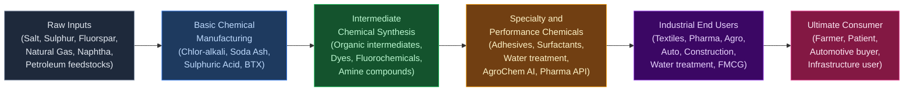
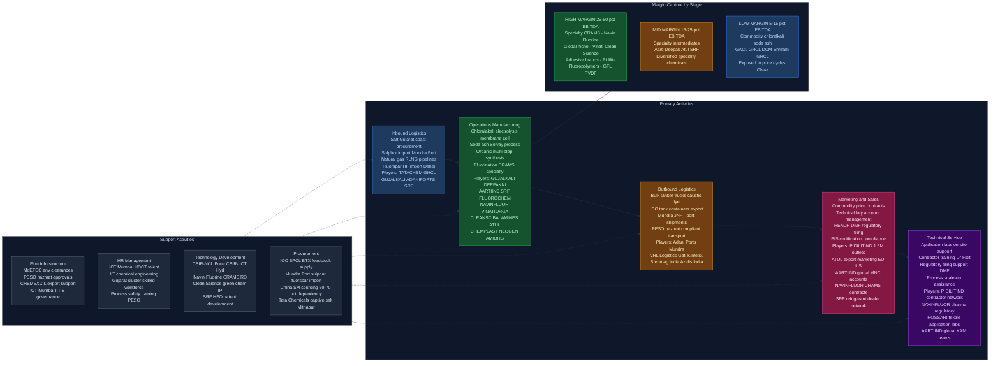

# Industrial Chemicals — Value Chain Analysis (India)

---

## 0. Segment Definition

### Precise Boundary

This analysis covers the **Industrial Chemicals** sector in India, spanning two broad sub-segments:

**Bulk / Commodity Chemicals** — High-volume, undifferentiated chemicals sold primarily on price. Includes:
- Chlor-alkali: caustic soda (NaOH), chlorine, soda ash (Na₂CO₃), hydrogen
- Inorganic acids: sulphuric acid, hydrochloric acid, nitric acid, phosphoric acid
- Basic petrochemicals feedstocks: ethylene, propylene, BTX (benzene, toluene, xylene) — only downstream derivatives included here
- Commodity polymers and monomers: PVC, chlorinated solvents

**Specialty / Performance Chemicals** — Lower-volume, higher-value formulated or synthesised chemicals where performance, consistency, and regulatory compliance drive price premiums. Includes:
- Dyes, pigments, and organic intermediates
- Fluorochemicals and refrigerants
- Agrochemical intermediates and active ingredients (AI)
- Pharma intermediates and API building blocks
- Surfactants, specialty solvents
- Performance chemicals: adhesives, sealants, water treatment chemicals, textile chemicals, construction chemicals
- Fine chemicals and CRAMS (Contract Research and Manufacturing Services)

**Excluded**: Bulk petrochemicals refining (covered under Refining/Petrochemicals chain), pure agrochemical formulation, pharmaceutical finished dosage — though intermediates feeding those chains are included.

---

### Core Product / Service Flow

---

### End Customer Industries and What They Value Most

| End Industry | Primary Chemical Inputs | What They Value |
|---|---|---|
| Textiles & Garments | Caustic soda, dyes, surfactants, bleaching agents | Colour consistency, wet fastness, cost |
| Pharmaceuticals | Chloro-intermediates, fluorinated APIs, solvents | Purity (>99.9%), DMF compliance, supply reliability |
| Agrochemicals | Intermediates, amines, acids | Regulatory approval, yield, cost |
| Paints & Coatings | Pigments, solvents, resins, adhesion promoters | Colour stability, VOC compliance |
| Construction | Adhesives, sealants, water treatment, concrete additives | Performance, ease of application |
| Automotive | Specialty polymers, coatings, lubricant additives | Heat resistance, durability |
| Water Treatment | Coagulants, alum, chlorine, specialty polymers | Efficacy, regulatory compliance |
| FMCG / Personal Care | Surfactants, preservatives, specialty esters | Consumer safety, COSMOS/REACH compliance |
| Paper & Pulp | Caustic soda, chlorine, bleaching agents | Cost, brightness consistency |
| Refrigeration / HVAC | HFCs, HFOs (fluorochemicals) | GWP compliance, cooling efficiency |

---

### India's Global Position

| Sub-Segment | India's Global Position | Global Rank |
|---|---|---|
| Dyes & Pigments | Leader (world's largest exporter of reactive dyes) | #2 globally after China |
| Agrochemical intermediates | Challenger (growing rapidly via China+1) | #4 globally |
| Fluorochemicals | Challenger | Top 5 globally; GFL and Navin Fluorine world-class |
| Chlor-alkali / Soda ash | Follower (large domestic base, limited exports) | Domestic sufficiency |
| Pharma intermediates (CRAMS) | Challenger (strong growth trajectory) | #3 globally |
| Surfactants | Follower | Primarily domestic |
| Specialty adhesives | Follower-to-Challenger | Pidilite dominant domestically |

---

## 1. Value Chain Map — Primary Activities

### Activity 1: Inbound Logistics

**What it involves:**
Procurement and movement of raw materials — primarily rock salt (for chlor-alkali), sulphur (for sulphuric acid), fluorspar/HF (for fluorochemicals), coal (energy), natural gas (hydrogen generation, ammonia), naphtha/benzene (petrochemical feedstocks), and imported precursor chemicals. For specialty chemicals, it includes procurement of starting materials (SMs) sourced from China (~60–70% dependency), basic aromatics, and specialty reagents.

**Key cost and differentiation drivers:**
- **Salt logistics**: Gujarat coastal location gives chlor-alkali producers a structural advantage (Sambhar and Kutch salt flats)
- **Sulphur**: ~100% imported (from Middle East refineries); sulphur price volatility directly impacts sulphuric acid economics
- **China SM dependency**: The single largest strategic vulnerability — Indian specialty chemical firms source 60–70% of starting materials from China. Disruption (as seen in COVID-2020, 2021) causes margin compression
- **Natural gas**: Domestic gas at RLNG spot prices vs. domestic APM gas creates cost disparity; gas-based chlor-alkali plants more efficient than coal-based
- **Freight and port access**: Proximity to Mundra, Hazira, Dahej (Gujarat) or Nhava Sheva provides logistics advantage. Gujarat firms have structural edge

**Indian companies active here:**
- **Tata Chemicals** (NSE: TATACHEM) — integrated salt-to-soda ash chain in Gujarat; captive salt works in Mithapur
- **GHCL Ltd** (NSE: GHCL) — soda ash producer with captive salt operations in Sutrapada, Gujarat
- **Gujarat Alkalies & Chemicals (GACL)** (NSE: GUJALKALI) — salt procurement for chlor-alkali
- **DCM Shriram Ltd** (NSE: DCMSHRIRAM) — integrated caustic soda with captive power and brine
- **Aarti Industries** (NSE: AARTIIND) — imports benzene/toluene/aniline as feedstock for nitro-aromatics chain
- **SRF Ltd** (NSE: SRF) — imports fluorspar/HF precursors for refrigerant gases

---

### Activity 2: Operations (Manufacturing)

**What it involves:**
The core transformation — electrochemical processes (chlor-alkali), Solvay/trona processes (soda ash), contact processes (sulphuric acid), multi-step organic synthesis (specialty dyes, intermediates, fluorochemicals), batch and continuous process chemistry, distillation, crystallisation, hydrogenation, nitration, halogenation.

**Key cost and differentiation drivers:**
- **Energy intensity**: Chlor-alkali is highly power-intensive (~2,800–3,000 kWh/tonne caustic soda). Captive power plants are critical — GACL, DCM Shriram have captive generation
- **Process technology**: Membrane cell technology (superior to mercury/diaphragm) is differentiating for chlor-alkali quality
- **Scale economies**: Larger plants reduce fixed cost per unit — GHCL's soda ash scale (~1 million MTPA) gives global cost competitiveness
- **Chemistry R&D capability**: For specialty chemicals, multi-step synthesis capability, yield optimisation, and waste minimisation define margins (Aarti, Deepak Nitrite, Vinati Organics)
- **Environmental compliance**: MoEF&CC environmental clearances, CPCB norms for effluent treatment — high compliance cost for hazardous processes. Zero Liquid Discharge (ZLD) mandates raise capex
- **PESO regulation**: Petroleum and Explosives Safety Organisation governs storage and handling of hazardous chemicals; compliance drives capex and operating costs
- **Backward integration depth**: Firms like Deepak Nitrite (basic to advanced nitro-aromatic derivatives), Aarti Industries (benzene to downstream intermediates), and Vinati Organics (isobutylene to ATBS/IBB) have built 6–8 step integration that creates cost and supply chain moats

**Indian companies active here:**

*Commodity / Bulk:*
- **Gujarat Alkalies & Chemicals (GACL)** — India's largest chlor-alkali producer; ~4.5 lakh MTPA caustic soda capacity
- **Tata Chemicals** (TATACHEM) — soda ash (Mithapur), bicarbonate; also specialty nutrition chemicals
- **GHCL Ltd** (GHCL) — soda ash, textiles; ~1 million MTPA capacity
- **DCM Shriram** (DCMSHRIRAM) — caustic soda, chlorine, PVC; UP + Rajasthan plants
- **Chemplast Sanmar** (NSE: CHEMPLAST) — PVC, chlorinated PVC, specialty paste PVC; Chennai cluster
- **Nirma Ltd** (Unlisted) — soda ash, AOS; Bhavnagar, Gujarat

*Specialty / Dyes / Intermediates:*
- **Aarti Industries** (AARTIIND) — benzene-based intermediates, NCB, para-nitroaniline; Vapi, Jhagadia
- **Deepak Nitrite** (NSE: DEEPAKNI) — sodium nitrite/nitrate, xylidines, OBA, phenol via cumene; Nandesari, Roha
- **Vinati Organics** (NSE: VINATIORGA) — ATBS, IBB, HPPA; Mahad, Maharashtra
- **Balaji Amines** (NSE: BALAMINES) — methylamines, ethylamines, specialty amines; Solapur
- **Anupam Rasayan** (NSE: ANURAS) — custom synthesis, agrochemical intermediates; Sachin (Gujarat)
- **Clean Science & Technology** (NSE: CLEANSC) — MEHQ, guaiacol, anisole; Kurkumbh

*Fluorochemicals:*
- **SRF Ltd** (SRF) — refrigerant gases (R22, R32, R134a), HFC/HFO; Bhiwadi, Rajasthan
- **Gujarat Fluorochemicals Ltd (GFL)** (NSE: FLUOROCHEM) — PTFE, specialty fluoropolymers, HF; Dahej
- **Navin Fluorine International** (NSE: NAVINFLUOR) — specialty fluorination (CRAMS), refrigerants, inorganic fluorides; Surat, Dewas

*Pharma intermediates:*
- **Ami Organics** (NSE: AMIORG) — pharma intermediates (API starting materials, NCEs); Sachin
- **Neogen Chemicals** (NSE: NEOGEN) — lithium compounds, organolithium; Vadodara
- **Fine Organics** (NSE: FINEORG) — oleochemical specialty additives, ATBC, food-grade additives; Ambernath

*Specialty formulations:*
- **Pidilite Industries** (NSE: PIDILITIND) — adhesives, sealants, construction chemicals, art materials; multiple plants
- **Apcotex Industries** (NSE: APCOTEX) — emulsion polymers, nitrile latex, SB latex; Taloja
- **Rossari Biotech** (NSE: ROSSARI) — textile, home care, animal health specialty chemicals; Silvassa

---

### Activity 3: Outbound Logistics

**What it involves:**
Distribution of chemical products from plant to domestic industrial customers (tank trucks for liquids, bags/jumbo bags for solids, ISO tanks/cylinders for gases) and export via ports (bulk liquid tankers, container loads). For hazardous materials, PESO-compliant vehicles and packaging are mandatory.

**Key cost and differentiation drivers:**
- **Bulk vs. packaged logistics**: Commodity chemicals (caustic soda lye, soda ash) move in bulk; specialty chemicals in drums, IBCs, or smaller containers — different logistics economics
- **Temperature/pressure sensitivity**: Chlorine in cylinders or tonners requires specialised handling; refrigerant gases require DOT/ISO cylinders
- **Export logistics**: Access to Mundra Port (largest private port), JNPT/Nhava Sheva, Hazira, Dahej, Pipavav is critical. Gujarat's chemical cluster benefits from proximity to Mundra
- **Last-mile to SME buyers**: Specialty chemical distributors and C&F agents serve the long tail of industrial buyers; relationships here matter for smaller specialty firms
- **Cold chain / controlled storage**: Certain pharma intermediates and specialty solvents need temperature-controlled warehousing

**Indian companies active here:**
- **Adani Ports (Mundra)** (NSE: ADANIPORTS) — largest private port; majority of Gujarat chemical exports transit here
- **DP World / JNPT** — key for Maharashtra chemical clusters
- **VRL Logistics, Gati** — bulk chemical road transport networks
- **Tata Chemicals, GACL** — own bulk truck fleets for large industrial deliveries
- **Chemical distributors**: Azelis India (subsidiary of Azelis Belgium, unlisted), Brenntag India (subsidiary of Brenntag Germany, unlisted) — key intermediaries for specialty segment

---

### Activity 4: Marketing & Sales

**What it involves:**
For commodity chemicals: largely price-based, relationship-driven sales to large industrial buyers (textile mills, paper mills, water utilities, soap manufacturers). Long-term supply agreements, e-auction/reverse bidding by large buyers. For specialty chemicals: technical sales requiring application support, product qualification at customer's facility, multi-year supply contracts once qualified. Export sales to global MNCs (agrochemical, pharma, flavour & fragrance companies) require REACH/EU registration, DMF (Drug Master File) filings, and relationship-based key account management.

**Key cost and differentiation drivers:**
- **Customer qualification**: For specialty chemicals supplying pharma/agro MNCs, qualification cycle is 12–36 months; once qualified, switching cost is very high — creates structural lock-in
- **Technical selling capability**: Application labs, field chemists, and formulation support differentiate specialty players
- **Regulatory filings**: REACH (EU), EPA (US), BIS certification (India) — compliance capability is a differentiator for export-oriented firms
- **Brand in adhesives/construction chemicals**: Pidilite's "Fevicol" brand is a textbook case of commodity-to-brand conversion in adhesives — demonstrates that even industrial chemicals can carry brand premium

**Indian companies active here:**
- **Pidilite Industries** — India's most powerful branded chemicals franchise; direct sales to 1.5 million retail outlets via 6,000+ distributors
- **Aarti Industries** — dedicated technical sales team for global agrochemical MNC accounts
- **Navin Fluorine** — CRAMS model; long-term exclusive supply agreements with global innovator companies
- **SRF Chemicals** — refrigerant gases sold via dealer network in India; HFO sold to global OEMs
- **Atul Ltd** (NSE: ATUL) — diversified specialty chemicals with strong export marketing to EU/US; dyes, pharma chemicals, agro chemicals

---

### Activity 5: Service (After-sales / Technical Support)

**What it involves:**
Application development labs, on-site technical assistance to industrial customers, troubleshooting formulation issues, helping customers achieve process efficiency with the supplied chemical. In CRAMS/pharma intermediates, this includes regulatory support (DMF writing, facility audit support), scale-up assistance. In construction chemicals, it includes on-site demonstrators and technical training for contractors.

**Key cost and differentiation drivers:**
- **Application laboratory investment**: Pidilite, Atul, Deepak Nitrite all invest in application labs; this creates differentiation that pure commodity players cannot match
- **Regulatory support**: Helping pharma customers file US FDA/EMA submissions based on intermediates supplied is high-value and builds lock-in (Navin Fluorine, Ami Organics)
- **Training networks**: Pidilite's Dr. Fixit brand has a massive contractor training network — 200,000+ certified contractors; replicating this takes years

**Indian companies active here:**
- **Pidilite** — industry benchmark for technical service in adhesives/waterproofing
- **Navin Fluorine** — regulatory support for CRAMS customers
- **Aarti Industries** — dedicated global key account management teams
- **Rossari Biotech** — provides textile application labs and process consultancy to textile mills

---

## 2. Value Chain Map — Support Activities

### Support Activity 1: Firm Infrastructure

**Role:** Corporate governance, financial management, legal/regulatory compliance, environmental management systems (EMS), site safety systems (PESO, CPCB, Factory Inspectorate). For listed companies: SEBI compliance, quarterly disclosures, investor relations.

**Indian firm strengths/weaknesses:**
- *Strength*: Several Indian chemical companies have established strong governance — Tata Chemicals (Tata Group governance), Pidilite (professional board), SRF (DCM Group with long institutional memory)
- *Weakness*: Many mid-size specialty chemical companies still family-managed with weak succession planning; environmental compliance infrastructure has historically been thin (Vapi, Ankleshwar CETP issues)
- *Regulatory complexity*: Multiple overlapping regulators — MoEF&CC (environmental clearances), PESO (explosives/flammable chemicals), CPCB/SPCBs (pollution norms), Factory Inspectorate (safety), DPIIT (industrial licensing for certain chemicals)

**Notable institutions:**
- **Indian Chemical Council (ICC)** — industry body, advocacy, REACH registration support
- **CHEMEXCIL** (Basic Chemicals Exports Promotion Council) — export promotion, trade data, trade shows
- **MoEF&CC** — grants environmental clearances for new/expanded plants; a major bottleneck in capex deployment
- **PESO (Petroleum and Explosives Safety Organisation)** — mandatory for storage/handling approvals of hazardous chemicals

---

### Support Activity 2: HR Management

**Role:** Sourcing and retaining chemical engineers, process chemists, R&D scientists, regulatory affairs specialists, and technical sales personnel. Building safety culture in hazardous manufacturing environments.

**Indian firm strengths/weaknesses:**
- *Strength*: India produces ~1.5 lakh chemical engineering graduates per year; IITs (Bombay, Delhi, Madras), UDCT (ICT Mumbai), BITS Pilani, NIT Surat supply strong talent pipelines. Gujarat's chemical clusters (Vapi, Ankleshwar, Bharuch, Dahej) have developed a regional skilled workforce
- *Weakness*: Process safety culture is still maturing — incidents at Vizag (2020 LG Polymers gas leak) highlight risks. R&D-grade chemists (PhD-level) for cutting-edge fluorination, photochemistry are scarce; companies like Navin Fluorine and Clean Science have had to develop internal talent pipelines
- *Retention challenge*: Competing with pharma sector for chemistry talent; specialty chemical firms struggle to match pharma salary levels for experienced chemists

**Notable companies/institutions:**
- **ICT Mumbai (formerly UDCT)** — premier chemical technology institute; alumni network deeply embedded in Indian chemical industry
- **Gujarat's chemical clusters** — Vapi, Ankleshwar, Bharuch, Dahej — regional talent pools
- **Aarti Industries, Deepak Nitrite** — known for strong internal training programs and process engineering capability

---

### Support Activity 3: Technology Development

**Role:** Process R&D, product innovation, scale-up from lab to plant, IP creation, regulatory filing (patents, DMFs, dossiers). This is the most critical differentiator between commodity and specialty positioning.

**Indian firm strengths/weaknesses:**
- *Strength*: India's CRAMS model (Navin Fluorine, Anupam Rasayan, Ami Organics) demonstrates world-class custom synthesis capability. Clean Science & Technology's use of catalytic green chemistry (MEHQ production without waste streams) is globally competitive. Vinati Organics holds global patents on ATBS process
- *Weakness*: India spends ~0.7% of GDP on R&D vs. China's ~2.4%; chemical industry R&D spend is ~0.5–0.8% of revenue vs. 3–5% for global specialty chemical majors (BASF, Evonik). Most Indian firms are process innovators rather than molecule innovators — they find cheaper routes to known molecules rather than discovering new molecules
- *IP vulnerability*: Heavy reliance on process patents; product patents in specialty chemicals are largely held by global innovators

**Notable companies/institutions:**
- **Navin Fluorine** — CRAMS R&D centre at Surat; co-development with global pharma majors
- **Vinati Organics** — proprietary ATBS process technology licensed from Lubrizol and subsequently improved
- **Clean Science & Technology** — green chemistry R&D (catalytic oxidation processes)
- **SRF Ltd** — HFO (next-generation low-GWP refrigerant) development; filed patents on HFO alternatives
- **CSIR-NCL Pune, CSIR-IICT Hyderabad** — national labs that provide process development support to industry

---

### Support Activity 4: Procurement

**Role:** Sourcing raw materials (domestic and imported), negotiating with suppliers, managing supply chain risk, vendor qualification, import/export documentation. For specialty chemical firms, this includes SM (starting material) procurement from China, Japan, and Korea.

**Indian firm strengths/weaknesses:**
- *Strength*: Gujarat-based firms benefit from proximity to Mundra Port (import efficiency) and domestic salt/mineral supply. Aarti Industries has developed domestic sourcing of benzene from IOC/BPCL (eliminating import dependence on BTX). Tata Chemicals' Mithapur salt works is a structural procurement advantage
- *Weakness*: 60–70% SM dependency on China for specialty chemicals is the Achilles' heel. India lacks domestic production of many specialised reagents (e.g., certain fluorinating agents, chiral building blocks). Sulphur is 100% imported
- *China+1 opportunity*: Indian firms are actively building backward integration to reduce China SM dependency — Deepak Nitrite's phenol plant (via cumene hydroperoxide process) is an example of import substitution investment

**Notable companies/institutions:**
- **ONGC/IOC/BPCL** — domestic suppliers of BTX feedstocks (benzene, toluene) to specialty chemical firms
- **Mundra Port (Adani Ports)** — critical import gateway for fluorspar, sulphur, specialty chemicals
- **CHEMEXCIL** — facilitates sourcing networks and export-import intelligence

---

## 3. Five Forces Analysis

### Force 1: Supplier Power — MEDIUM-HIGH (Commodity) / MEDIUM (Specialty)

For **commodity chemicals**, supplier power is moderate-to-high. Salt (domestic Gujarat) is widely available, but sulphur (100% imported from Middle East refineries) and natural gas (RLNG pricing volatile) create input cost risk. RLNG prices more than tripled between 2020 and 2022, compressing chlor-alkali margins industry-wide. For **specialty chemicals**, the China supplier dominance for starting materials is the defining risk: 60–70% of SMs are China-sourced, and Chinese export controls, tariff changes, or environmental production curtailments directly compress Indian margins. This was dramatically demonstrated in 2020–21 when Chinese SM supply disruptions caused SM price spikes of 40–80%. The mitigation pathway (backward integration, alternative SM sourcing from Japan/Korea/EU) is underway but takes 3–5 years per molecule. Overall: high for those not backward-integrated; medium for those that have invested in backward integration.

### Force 2: Buyer Power — MEDIUM (Specialty) / HIGH (Commodity)

In **commodity chemicals**, buyers (textile mills, paper mills, water utilities, soap manufacturers) are large, consolidated, and highly price-sensitive. Government utilities (water treatment) often procure via reverse auction, compressing margins. Spot contracts dominate; switching costs are near-zero. In **specialty chemicals**, the picture reverses significantly: once an intermediate is qualified by a global pharma or agrochemical company, switching a supplier requires 12–36 months of re-qualification — a very high switching cost that dramatically reduces buyer leverage. Indian CRAMS players like Navin Fluorine and Ami Organics operate under multi-year exclusive supply agreements with global innovators, insulating them from buyer pressure. However, large agrochemical and pharma buyers do negotiate hard on pricing at initial qualification stages. Overall verdict: HIGH for commodity sub-segment; MEDIUM-LOW for qualified specialty CRAMS relationships.

### Force 3: Threat of New Entrants — LOW-MEDIUM

Chemical manufacturing has multiple structural barriers to entry: (i) Capital intensity — a world-scale soda ash plant costs ₹2,000–3,000 Cr; a chlor-alkali plant ₹500–1,500 Cr; specialty synthesis plants ₹100–500 Cr depending on scale; (ii) Regulatory barriers — MoEF&CC environmental clearances for new greenfield plants take 2–4 years; PESO approvals for hazardous chemical storage add 6–12 months; (iii) Process know-how — multi-step specialty synthesis requires years of process optimisation; (iv) Customer qualification timelines — 12–36 months to become a qualified supplier to global pharma/agro MNCs; (v) Scale economies in energy — captive power plants require large upfront investment. However, China+1 tailwinds have attracted significant private equity capital into the sector (Anupam Rasayan, Ami Organics, Clean Science IPOs 2021–22), and several new entrants are building specialty chemical capacity. The threat is rising at the smaller specialty end but remains low for large-scale commodity.

### Force 4: Threat of Substitutes — LOW-MEDIUM

Industrial chemicals are by definition inputs into other manufacturing processes — their substitutes are other chemical inputs. For commodity chemicals (caustic soda, soda ash, sulphuric acid), there are no functional substitutes — these are process essentials for soap, glass, paper, and water treatment. For specialty chemicals, substitution risk is product-specific: (i) Fluorochemicals face regulatory substitution — HFCs are being phased out under the Kigali Amendment to the Montreal Protocol, pushing toward HFOs (low-GWP alternatives); Indian firms like SRF and GFL are investing in HFO capacity; (ii) Bio-based surfactants are beginning to challenge petrochemical surfactants in FMCG applications; (iii) Waterborne coatings replacing solvent-based creates both a threat (demand for traditional solvents falls) and opportunity (new specialty additives for waterborne systems); (iv) Synthetic dyes face competition from natural/plant-based dyes in certain textile segments (sustainability-driven). Overall: LOW threat for commodity; MEDIUM for certain specialty sub-segments facing regulatory or sustainability transitions.

### Force 5: Rivalry Intensity — HIGH (Commodity) / MEDIUM (Specialty)

Commodity chemicals are a classic commodity oligopoly-to-competitive market: GACL, DCM Shriram, GHCL, Nirma, Tata Chemicals compete intensely on caustic soda/soda ash pricing. Price cycles are driven by global overcapacity (China is the world's largest chlor-alkali and soda ash producer). The 2022–24 period saw commodity chemical margins compress significantly as Chinese capacity additions flooded global markets. In specialty chemicals, rivalry is lower due to customer lock-in, differentiated chemistry, and long qualification cycles. However, in segments like dyes (hundreds of MSME manufacturers in Ahmedabad-Vatva, Vapi clusters) and commodity intermediates, rivalry is intense. The India-China dynamic is critical: Chinese specialty chemical firms are themselves moving up the value chain and competing with Indian players in global agro/pharma intermediate supply.

---

### Five Forces Summary Table

| Force | Intensity | Key Driver |
|---|---|---|
| Supplier Power | Medium-High | China SM dependency; sulphur import dependency |
| Buyer Power | High (commodity) / Medium (specialty) | Price-based contracts in commodity; qualification lock-in in specialty |
| Threat of New Entrants | Low-Medium | High capex, regulatory barriers, China+1 tailwind attracting new capital |
| Threat of Substitutes | Low-Medium | Process essentials in commodity; HFO transition in fluorochemicals; bio-based alternatives in specialty |
| Rivalry Intensity | High (commodity) / Medium (specialty) | Chinese overcapacity; many MSME dye/intermediate producers |

**Overall Attractiveness: MEDIUM** — The commodity sub-segment is structurally unattractive (high rivalry, high buyer power, volatile input costs). The specialty/CRAMS sub-segment is structurally attractive (customer lock-in, qualification barriers, China+1 demand), but is currently attracting excess capital which may erode margins in 2025–27. The highest long-term returns will accrue to firms that successfully traverse the commodity-to-specialty upgrade pathway and build IP-protected chemistry positions.

---

## 4. GVC Governance & India's Position

### Lead Firms (Global)

| Firm | HQ | Governance Role |
|---|---|---|
| BASF | Germany | Sets quality standards, qualifies global suppliers for performance chemicals; major buyer of India-made intermediates |
| Bayer CropScience | Germany | Governs agrochemical intermediate supply chain; multi-year contracts with Indian API/intermediate suppliers |
| Syngenta (now ChemChina) | Switzerland/China | Major buyer of Indian agrochemical intermediates |
| Corteva Agriscience | USA | Qualifies Indian custom synthesis partners |
| Honeywell | USA | Lead firm in HFO refrigerant transition; licenses HFO technology to SRF, others |
| Solvay | Belgium | Soda ash, specialty polymers — competes with and buys from Indian producers |
| 3M | USA | Fluorochemicals; technology licensor |
| LANXESS | Germany | Specialty chemicals; sources intermediates from India |

### Lead Firms (Indian)

| Firm | Governance Role |
|---|---|
| Aarti Industries | Controls benzene-nitrotoluene-downstream chain in India; supply agreements with global agro/pharma MNCs |
| Pidilite Industries | Governs adhesive/sealant supply chain in India; defines product standards adopted by construction industry |
| SRF Ltd | Lead firm in Indian refrigerant/fluorochemical chain |
| Tata Chemicals | Lead in soda ash/chlor-alkali commodity governance |
| Navin Fluorine | Lead Indian CRAMS player in fluorination chemistry |

---

### Governance Type

The Industrial Chemicals GVC exhibits mixed governance across sub-segments:

| Sub-Segment | Governance Type | Rationale |
|---|---|---|
| Commodity chlor-alkali/soda ash | Market | Price-based, standardised products, low switching cost |
| Dyes & intermediates | Market to Modular | Quality specifications defined by buyers; Indian suppliers meet them independently |
| Agrochemical intermediates | Relational | Long-term relationships, technical co-development, but supplier has capability to serve multiple buyers |
| Pharma CRAMS | Captive to Relational | High asset specificity, regulatory requirements; Indian CRAMS firms depend heavily on 1–2 global innovators initially; evolves to Relational as capability grows |
| Fluorochemicals (HFO) | Captive/Hierarchy | Technology controlled by Honeywell/Chemours; Indian firms (SRF, GFL) operate under licensing agreements |
| Adhesives/Construction chemicals | Market (domestic India) | Pidilite dominates but domestic market is price-competitive at commodity end |

---

### Value Capture Map

| Stage | Who captures? | EBITDA Margin |
|---|---|---|
| Raw material supply | Global commodity companies | 5–15% |
| Basic chemical manufacturing | Indian commodity manufacturers | 8–15% |
| Intermediate synthesis | Indian specialty manufacturers | 15–25% |
| Advanced specialty chemicals | Indian/Global specialty firms | 20–35% |
| Formulation & application | Brand owner (global/Indian) | 30–50% |
| Regulatory/IP holder | Global innovator | 40–60% |

**Key insight**: The highest value capture occurs at the formulation/application layer (global MNCs) and the IP/regulatory layer (global innovators). Indian firms currently occupy the intermediate synthesis stage most efficiently. The China+1 opportunity is helping Indian firms move from Stage 2 to Stage 3. The stretch goal is Stage 4 (advanced specialty) — where Clean Science, Vinati, and Navin Fluorine are beginning to play.

---

### India's Upgrade Trajectory

India is currently a **strong Stage 2–3 player** (basic manufacturing to intermediate synthesis) with pockets of Stage 4 capability (Navin Fluorine in CRAMS fluorination; Vinati Organics in ATBS; Clean Science in MEHQ/guaiacol).

1. **Process Upgrading** (well-advanced): Indian firms have become more efficient manufacturers — energy optimisation, yield improvement, ZLD compliance. GACL moved from mercury to membrane cell; Deepak Nitrite moved from batch to continuous nitration
2. **Product Upgrading** (in progress): Moving from commodity intermediates to performance chemicals; Deepak Nitrite's move into phenol (import substitution of 3 lakh MTPA market); SRF's move from HFCs to HFOs
3. **Functional Upgrading** (early stage): Firms like Aarti Industries are beginning to take on formulation and application development roles, not just intermediate supply; Pidilite already fully functional-upgraded in adhesives
4. **Chain Upgrading** (nascent): Indian firms entering new value chains — GFL's PVDF for lithium-ion batteries is a chain upgrading move from refrigerant gases into energy materials

---

## 5. Key Linkages & Leverage Points

### Linkage 1: Feedstock Availability ↔ Operations (Manufacturing Cost)
The cost of benzene, toluene, HF, and natural gas directly determines whether Indian specialty manufacturers can compete with Chinese exporters. Indian petrochemical majors (ONGC, BPCL, IOC) supply BTX to specialty chemical firms; the linkage between refinery output planning and chemical feedstock availability is poorly coordinated. When refineries optimise for fuel, BTX output may be curtailed, squeezing specialty chemical feedstock supply. **Value destroyed**: Margin volatility for downstream specialty firms when BTX is imported at spot prices vs. long-term contracts. Deepak Nitrite addressed this by building a domestic phenol plant — eliminating the import dependency linkage.

### Linkage 2: R&D / Technology Development ↔ Operations (Process Yield)
Investment in process R&D directly translates to lower material consumption, higher product yield, and lower waste generation — reducing both cost and environmental compliance burden. Clean Science & Technology built its EBITDA margins of 50%+ (FY22 peak) by developing catalytic oxidation processes that reduce waste streams vs. conventional stoichiometric routes. When R&D is underfunded (as in most MSME dye manufacturers), process inefficiency and waste costs erode all margin. **Value created**: 5–15 percentage point EBITDA margin difference between R&D-investing specialty players and commodity manufacturers.

### Linkage 3: Customer Qualification ↔ Marketing & Sales (Lock-in Creation)
The time and investment to get qualified by a global pharma or agrochemical MNC (12–36 months) is a sunk cost — once incurred, it creates high switching cost on both sides. Indian CRAMS firms that have completed qualification with 3–5 global innovators enjoy near-captive revenue streams. **Value created**: 5–10 year revenue visibility; EBITDA margins 5–8 pp above commodity.

### Linkage 4: Environmental Compliance ↔ Operations (License to Operate)
MoEF&CC environmental clearances, CPCB pollution norms, and ZLD mandates create a direct linkage between environmental management systems and manufacturing operations. Firms that invest early in effluent treatment, ZLD systems, and pollution monitoring can scale faster (fewer regulatory hurdles to plant expansion). The Vapi/Ankleshwar cluster has historically suffered reputational issues due to effluent discharge — creating an opportunity for compliant firms in newer, better-regulated SEZ clusters (Dahej, Jhagadia) to command premium qualification from global buyers who conduct supplier audits. **Value at stake**: Ability to export to EU/US markets (which require supplier environmental audits) is contingent on compliance.

### Linkage 5: Outbound Logistics (Port Access) ↔ Export Marketing
Gujarat's chemical cluster proximity to Mundra Port is a structural advantage for export competitiveness. A specialty chemical shipment from Dahej to Mundra takes 2–3 hours; from a Maharashtra cluster to JNPT it takes 4–8 hours with higher truck costs. For time-sensitive shipments (pharmaceutical intermediates where inventory carrying cost is high), port proximity matters. **Value at stake**: 200–300 bps export margin advantage for Gujarat-based producers.

---

### Single Highest-Leverage Intervention

**Reducing China SM Dependency through Domestic Backward Integration** — Individual firms investing in backward integration molecule-by-molecule is capital-inefficient. The highest-leverage intervention is an industry consortium (potentially supported by PLI for specialty chemicals) to build shared SM manufacturing facilities for the 20–30 most commonly used starting materials that are currently 100% China-sourced. This would simultaneously: (i) reduce the single largest cost and supply-chain risk for the entire specialty chemical sector; (ii) create a new domestic manufacturing layer that generates employment; (iii) make Indian CRAMS/specialty chemical firms globally competitive on supply chain security — a key concern for global pharma and agrochemical MNCs post-COVID.

---

## 6. Indian Company Landscape

### Listed Companies

| Value Chain Stage | Company Name | Listed? | Exchange & Ticker | Business Description | Approx. Revenue / Market Cap | Position in Chain |
|---|---|---|---|---|---|---|
| Commodity Mfg — Chlor-alkali | Gujarat Alkalies & Chemicals Ltd (GACL) | Yes | NSE: GUJALKALI | India's largest chlor-alkali producer; caustic soda, chlorine, hydrogen, sodium hypochlorite | Rev: ~₹4,500 Cr (FY24); Mkt cap ~₹4,200 Cr | Leader |
| Commodity Mfg — Soda Ash | Tata Chemicals Ltd | Yes | NSE: TATACHEM | Soda ash (Mithapur), sodium bicarbonate, specialty nutrition chemicals; integrated salt works | Rev: ~₹15,000 Cr (FY24); Mkt cap ~₹22,000 Cr | Leader |
| Commodity Mfg — Soda Ash | GHCL Ltd | Yes | NSE: GHCL | Soda ash (~1 million MTPA) + home textiles; Gujarat-based captive salt operations | Rev: ~₹4,200 Cr (FY24); Mkt cap ~₹3,800 Cr | Leader |
| Commodity Mfg — Chlor-alkali/PVC | DCM Shriram Ltd | Yes | NSE: DCMSHRIRAM | Caustic soda, chlorine, PVC, cement, sugar; integrated industrial conglomerate | Rev: ~₹8,500 Cr (FY24); Mkt cap ~₹7,500 Cr | Leader |
| Commodity Mfg — PVC/Chlorinated PVC | Chemplast Sanmar Ltd | Yes | NSE: CHEMPLAST | PVC resins, chlorinated PVC, specialty paste PVC; Sanmar Group, Chennai cluster | Rev: ~₹5,800 Cr (FY24); Mkt cap ~₹5,500 Cr | Challenger |
| Specialty Mfg — Intermediates (benzene chain) | Aarti Industries Ltd | Yes | NSE: AARTIIND | Benzene-based nitro-aromatic intermediates, NCB, para-nitroaniline, pharma/agro AIs | Rev: ~₹7,000 Cr (FY24); Mkt cap ~₹18,000 Cr | Leader |
| Specialty Mfg — Nitro-aromatic/Phenol | Deepak Nitrite Ltd | Yes | NSE: DEEPAKNI | Sodium nitrite/nitrate, xylidines, OBA, phenol (via cumene), acetone | Rev: ~₹7,500 Cr (FY24); Mkt cap ~₹19,000 Cr | Leader |
| Specialty Mfg — ATBS/Specialty Monomers | Vinati Organics Ltd | Yes | NSE: VINATIORGA | ATBS (world's largest producer), IBB, HPPA, antioxidants; Mahad Maharashtra | Rev: ~₹2,000 Cr (FY24); Mkt cap ~₹14,000 Cr | Leader (global niche) |
| Specialty Mfg — Amines | Balaji Amines Ltd | Yes | NSE: BALAMINES | Aliphatic amines (methyl, dimethyl, trimethyl, ethyl), specialty amines; Solapur | Rev: ~₹1,800 Cr (FY24); Mkt cap ~₹3,200 Cr | Leader (India) |
| Specialty Mfg — Diversified | Atul Ltd | Yes | NSE: ATUL | Dyes, pharma chemicals, agro chemicals, epoxy resins, crop protection; Valsad Gujarat | Rev: ~₹5,200 Cr (FY24); Mkt cap ~₹20,000 Cr | Leader |
| Fluorochemicals | SRF Ltd | Yes | NSE: SRF | Refrigerant gases (HFCs, HFOs), specialty fluorochemicals, technical textiles, packaging films | Rev: ~₹15,000 Cr (FY24); Mkt cap ~₹62,000 Cr | Leader |
| Fluorochemicals/Fluoropolymers | Gujarat Fluorochemicals Ltd (GFL) | Yes | NSE: FLUOROCHEM | HF production, PTFE, specialty fluoropolymers, HFO refrigerants; Dahej | Rev: ~₹4,200 Cr (FY24); Mkt cap ~₹30,000 Cr | Leader (India), Challenger (global) |
| Fluorochemicals — CRAMS | Navin Fluorine International Ltd | Yes | NSE: NAVINFLUOR | Specialty fluorination CRAMS, inorganic fluorides, refrigerants; Surat, Dewas | Rev: ~₹2,300 Cr (FY24); Mkt cap ~₹14,000 Cr | Leader (India CRAMS) |
| Specialty Mfg — CRAMS/Custom Synthesis | Anupam Rasayan India Ltd | Yes | NSE: ANURAS | Custom synthesis of agrochemical/pharma intermediates; Sachin Gujarat (listed 2021) | Rev: ~₹1,200 Cr (FY24); Mkt cap ~₹5,000 Cr | Challenger |
| Specialty Mfg — Green Chemistry | Clean Science and Technology Ltd | Yes | NSE: CLEANSC | MEHQ, guaiacol, anisole, HALS; green catalytic chemistry; Kurkumbh Maharashtra (listed 2021) | Rev: ~₹900 Cr (FY24); Mkt cap ~₹7,500 Cr | Leader (global niche) |
| Specialty Mfg — Pharma Intermediates | Ami Organics Ltd | Yes | NSE: AMIORG | Pharma intermediates (NCEs, API starting materials), specialty chemicals; Sachin Gujarat (listed 2021) | Rev: ~₹700 Cr (FY24); Mkt cap ~₹3,800 Cr | Challenger |
| Specialty Mfg — Lithium/Organolithium | Neogen Chemicals Ltd | Yes | NSE: NEOGEN | Lithium compounds, organolithium reagents, specialty bromine chemicals; Vadodara | Rev: ~₹550 Cr (FY24); Mkt cap ~₹2,800 Cr | Niche |
| Specialty Mfg — Oleochemical additives | Fine Organics Industries Ltd | Yes | NSE: FINEORG | Oleochemical specialty additives (ATBC, food-grade additives, slip agents, anti-blocking agents); Ambernath Maharashtra | Rev: ~₹2,200 Cr (FY24); Mkt cap ~₹8,000 Cr | Leader (India), Niche (global) |
| Adhesives/Construction Chemicals | Pidilite Industries Ltd | Yes | NSE: PIDILITIND | Adhesives (Fevicol), sealants, construction chemicals (Dr. Fixit), art materials; pan-India distribution | Rev: ~₹13,000 Cr (FY24); Mkt cap ~₹1,40,000 Cr | Leader |
| Emulsion Polymers/Latex | Apcotex Industries Ltd | Yes | NSE: APCOTEX | Emulsion polymers, nitrile latex, SB latex, VP latex for paper/gloves/carpets; Taloja Maharashtra | Rev: ~₹800 Cr (FY24); Mkt cap ~₹1,100 Cr | Niche |
| Specialty Textile/Home Care Chemicals | Rossari Biotech Ltd | Yes | NSE: ROSSARI | Textile specialty chemicals, home/personal care chemicals, animal health chemicals; Silvassa | Rev: ~₹1,600 Cr (FY24); Mkt cap ~₹3,200 Cr | Challenger |

### Unlisted / Private Companies

| Value Chain Stage | Company Name | Listed? | Exchange & Ticker | Business Description | Approx. Revenue / Market Cap | Position in Chain |
|---|---|---|---|---|---|---|
| Commodity Mfg — Soda Ash | Nirma Ltd | No (Unlisted) | — | Soda ash (Bhavnagar Gujarat), surfactants, consumer soaps; Karsanbhai Patel family-owned | Rev: ~₹8,000 Cr est. | Leader |
| Commodity Mfg — Chlor-alkali | GACL-NALCO Alkalies & Chemicals Pvt Ltd | No (JV unlisted) | — | JV of GACL and NALCO; caustic soda, chlorine; Dahej Gujarat | Not publicly disclosed | Niche |
| Specialty Distribution | Brenntag India Pvt Ltd | No (Subsidiary of Brenntag Germany) | — | Specialty chemical distribution and blending services across India | Not publicly disclosed | Leader (distribution) |
| Specialty Distribution | Azelis India Pvt Ltd | No (Subsidiary of Azelis Belgium) | — | Specialty ingredient and chemical distribution; pharma, food, personal care, industrial segments | Not publicly disclosed | Challenger (distribution) |

---

### Notable Companies — Deeper Notes

**Deepak Nitrite Ltd (NSE: DEEPAKNI)**
- Stage in chain: Intermediate specialty manufacturing (nitro-aromatics to phenol)
- What makes them interesting: Deepak Nitrite has executed one of India's most impressive commodity-to-specialty transitions. Starting as a sodium nitrite/nitrate producer (commodity), the company backward-integrated into xylidines, OBA (optical brightening agents for detergents), and then made the audacious move of building India's first world-scale phenol plant (Deepak Phenolics — 2 lakh MTPA). This substitutes ~₹3,000 Cr of annual phenol imports. Acetone (co-product) supplies MDF, pharma, and paints industries. The management has demonstrated the ability to identify adjacent chemistries and execute large capex with discipline.
- Key financials: Revenue ~₹7,500 Cr (FY24); EBITDA margin ~18–22%; Market cap ~₹19,000 Cr
- Watch factor: Phenol-acetone margin cycle (dependent on propylene/cumene prices and phenol import parity); next capex cycle into downstream derivatives

**Vinati Organics Ltd (NSE: VINATIORGA)**
- Stage in chain: Specialty manufacturing (ATBS, IBB, specialty monomers)
- What makes them interesting: Vinati is a rare example of an Indian company that holds global #1 or #2 market share in its chosen molecules — ATBS (2-Acrylamido-2-methylpropane sulphonic acid) with ~65% global market share and IBB (Isobutyl Benzene, an ibuprofen precursor). This was achieved through relentless process improvement and cost leadership. The company follows a "3 molecules in 3 years" strategy — systematically building a portfolio of globally competitive niche molecules. New molecules include ATBS derivatives, antioxidants (for polymer stabilisation), and HPPA.
- Key financials: Revenue ~₹2,000 Cr (FY24); EBITDA margin ~28–32%; Market cap ~₹14,000 Cr
- Watch factor: New molecule ramp-up timeline; customer concentration (top customers are global polymer/specialty chemical companies)

**Gujarat Fluorochemicals Ltd (NSE: FLUOROCHEM)**
- Stage in chain: Fluorochemicals manufacturing — HF, PTFE, specialty fluoropolymers, HFO refrigerants
- What makes them interesting: GFL is India's most integrated fluorochemical company and is executing a strategy of moving from basic refrigerant gases (commoditising HFCs) into advanced fluoropolymers (PTFE, PVDF) for EV batteries, semiconductors, and fuel cells. PVDF (polyvinylidene fluoride) is a critical material for lithium-ion battery binders and separators — a segment where China holds near-monopoly. GFL's PVDF capacity could serve the domestic battery manufacturing ecosystem being built under PLI schemes. This is a textbook chain-upgrading move within GVC theory.
- Key financials: Revenue ~₹4,200 Cr (FY24); EBITDA margin ~25–30%; Market cap ~₹30,000 Cr
- Watch factor: Pace of EV adoption in India (determines PVDF demand); global fluoropolymer competitive landscape; HFO technology licensing terms

**Navin Fluorine International Ltd (NSE: NAVINFLUOR)**
- Stage in chain: CRAMS/specialty fluorination + refrigerants + inorganic fluorides
- What makes them interesting: Navin Fluorine is India's premier CRAMS fluorination specialist — a capability that is extremely rare globally and which commands premium pricing. Their specialty chemicals division (CRAMS) grew at ~30% CAGR over 5 years and now contributes >50% of revenue. They operate under long-term exclusive agreements with 2–3 global agrochemical and pharma innovators — giving them multi-year revenue visibility at 30–35% EBITDA margins. The company is building a High Performance Product (HPP) plant at Dahej for next-generation fluorinated building blocks.
- Key financials: Revenue ~₹2,300 Cr (FY24); EBITDA margin ~25–30%; Market cap ~₹14,000 Cr
- Watch factor: CRAMS project execution (new HPP plant); customer concentration risk (3 customers = ~60% revenue)

**Clean Science and Technology Ltd (NSE: CLEANSC)**
- Stage in chain: Specialty manufacturing — performance and functional chemicals (MEHQ, guaiacol, anisole)
- What makes them interesting: Clean Science is a globally dominant, green-chemistry-based manufacturer of functional chemicals. It holds ~40% global market share in MEHQ (Monomethyl Ether of Hydroquinone — a polymerisation inhibitor) and has built this position using catalytic oxidation processes that are economically and environmentally superior to conventional routes. The company's EBITDA margins peaked at 55–60% (FY22) — among the highest in Indian chemicals — reflecting the combination of global dominance, proprietary process, and low capital intensity.
- Key financials: Revenue ~₹900 Cr (FY24); EBITDA margin ~30–35%; Market cap ~₹7,500 Cr
- Watch factor: New product pipeline (HALS — hindered amine light stabilisers) to sustain margin through diversification; competitive entry risk in MEHQ from Chinese manufacturers

**Pidilite Industries Ltd (NSE: PIDILITIND)**
- Stage in chain: Formulation, branding, distribution (adhesives, sealants, construction chemicals)
- What makes them interesting: Pidilite is the most powerful case study in the Indian chemicals sector of how formulation and branding can transform a commodity into a premium franchise. Fevicol (white adhesive) holds >70% market share in India and commands a 30–40% price premium over generic alternatives — despite the underlying chemistry being replicated by dozens of firms. Its moat is not chemistry — it's brand equity built on a 60-year trust relationship with carpenters, contractors, and civil engineers.
- Key financials: Revenue ~₹13,000 Cr (FY24); EBITDA margin ~20–23%; Market cap ~₹1,40,000 Cr
- Watch factor: Rural market penetration for construction chemicals; competitive intensity from Asian Paints entering adjacencies; raw material (VAM — vinyl acetate monomer) sourcing

---

## 7. Strategic Insight

### Non-Obvious Insight

The conventional narrative about Indian specialty chemicals is a straightforward China+1 story — as if the sector merely needs to fill the gap left by Chinese supply chain disruption. The deeper, non-obvious insight is that India's specialty chemical advantage is not primarily about being a lower-cost China substitute, but about **chemistry depth plus regulatory access**. Indian CRAMS firms like Navin Fluorine and Ami Organics can qualify under US FDA Drug Master Files and EU REACH — something Chinese firms find systematically harder due to regulatory trust deficits with Western buyers. This "regulatory arbitrage" compounds with process chemistry capability to create a competitive position that is structurally durable even if Chinese cost competitiveness returns. The implication is that Indian specialty firms should invest heavily in US FDA-approved manufacturing sites, EU REACH registration, and ICH Q7-compliant systems — not because it solves the China cost gap, but because it builds a customer lock-in flywheel that Chinese competitors structurally cannot replicate in the medium term. The Indian firms that will dominate by 2030 are not the ones who are cheapest, but the ones who are most compliant.

---

### Blue Ocean Opportunity — Four Actions Framework

**Target Space:** Construction Chemicals for India's Tier 2/3 Cities Infrastructure Boom

**Eliminate:**
- Eliminate distributor intermediaries in Tier 2/3 construction chemical sales (currently 3–4 layer distribution) using direct B2B digital platforms connecting chemical manufacturers to civil contractors
- Eliminate the "specification engineering" bottleneck — where construction chemicals get specified by architects in metros but never reach actual contractors in smaller cities

**Reduce:**
- Reduce product SKU complexity — most construction chemical companies offer 150+ SKUs; a focused range of 20–30 system-based solutions (e.g., "roof waterproofing system" vs. 12 individual products) would reduce confusion and reduce sales cycle length
- Reduce minimum order quantities for smaller contractors by offering ready-mix/pre-measured system kits

**Raise:**
- Raise technical training investment — create a digital certification program for civil contractors embedded in regional languages; embed QR codes on products linking to application videos
- Raise after-application warranty — offer 10-year waterproofing performance warranties (backed by insurance), fundamentally shifting the value proposition from product sale to performance guarantee

**Create:**
- Create a subscription/maintenance model for building owners — periodic inspection and re-application services, converting a one-time product sale into a recurring service revenue stream
- Create an integrated BIM (Building Information Modelling) data partnership with construction software providers — embedding chemical product specifications into digital construction workflows

---

### Top 3 Priorities for an Indian Firm Seeking Durable Advantage

**Priority 1: Build Backward Integration to Reduce China SM Dependency**
The single greatest strategic vulnerability for Indian specialty chemical firms is China-sourced starting material dependency. Firms that invest in domestic SM manufacturing — either individually or via industry consortia — will eliminate the key margin volatility driver and become more attractive partners for global MNCs seeking "China+1" supply chains. This requires 3–5 years and significant capex, but it is the foundational condition for durable competitive advantage. Deepak Nitrite's phenol plant is the blueprint — identify the high-import-dependency input in your own chemistry, and build backward.

**Priority 2: Invest in Regulatory Capability as a Competitive Moat**
US FDA-approved manufacturing, EU REACH registration, BIS certification, ICH Q7 compliance — these are not compliance costs; they are competitive moats. Every ₹10 Cr invested in regulatory capability unlocks ₹100–500 Cr of qualified, sticky revenue from global innovators who are actively diversifying away from China. The regulatory trust deficit of Chinese suppliers is a structural opportunity that Indian firms must capitalise on by investing in world-class quality systems, EHS standards, and transparent supply chain documentation. Firms that complete this regulatory build-out by 2027 will be first to capture the full China+1 demand wave.

**Priority 3: Move up from Intermediate Supplier to Application Partner**
The value capture map is clear — molecule manufacturers capture 15–25% EBITDA; application partners and formulators capture 30–50%. Indian firms need to invest in application laboratories, co-development agreements with global end-use companies, and technical sales teams who can speak the customer's language (formulation chemist, not just synthetic chemist). The model is Navin Fluorine in CRAMS or Pidilite in adhesives — becoming embedded in the customer's development process, not just the supply chain. This requires 5–7 years to build but creates revenue streams that are 3–5x more profitable than commodity intermediate supply.

---

## 8. Value Chain Diagram (Mermaid)

---

*Analysis prepared: June 2026. Financial data indicative based on FY24 publicly available figures. Market caps are approximate and subject to market movements.*
