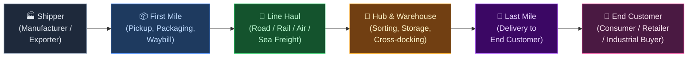
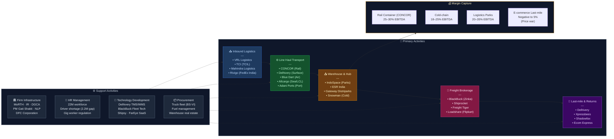

# INDIAN LOGISTICS SECTOR — Value Chain Analysis
*Date: June 28, 2026 | Framework: Porter's Value Chain + Five Forces + GVC + Linkages + Blue Ocean*

---

## 0. Segment Definition

**Precise boundary:** The end-to-end Indian logistics value chain — freight transportation (road, rail, air, sea), warehousing & storage, last-mile delivery, freight forwarding & customs, and 3PL/4PL value-added services. Includes express logistics, cold-chain, e-commerce fulfilment, and bulk commodity logistics. Excludes pure port infrastructure (covered under Ports sector).

**Core product/service flow:**

**End customer and what they value most:**
- **E-commerce consumers:** Speed, visibility, easy returns
- **Industrial/B2B shippers:** Cost, reliability, damage prevention
- **Cold-chain users (pharma, F&B):** Temperature integrity, compliance
- **Exporters:** Customs clearance speed, documentation, freight rates

**India's global position:** **Follower → Challenger.** India's logistics cost is ~8–13% of GDP vs 8% in developed countries — structurally high due to infrastructure gaps and fragmentation. National Logistics Policy (2022) targets 8% of GDP. India ranks 38th on World Bank Logistics Performance Index (2023). Growing rapidly with PM Gati Shakti, Dedicated Freight Corridors (DFCs), and e-commerce boom.

---

## 1. Value Chain Map — Primary Activities

### Inbound Logistics (Procurement Logistics for Shippers)
**What it involves:** Vendor-managed inventory, raw material movement to factories, port-to-plant container movement, FTL (full truckload) primary logistics for manufacturers.

**Key cost drivers:** Fuel prices (diesel — 65–70% of trucking cost), toll costs (NHAI), per-truck productivity. Differentiation: GPS tracking, load optimisation, dedicated fleet vs spot market access.

**Key Indian players:**
- **VRL Logistics (NSE: VRLLOG)** — surface logistics for industrial goods
- **TCI (Transport Corporation of India, NSE: TCIL)** — multi-modal, supply chain
- **GATI Ltd (NSE: GATI)** — surface express (Allcargo acquisition)
- **Rivigo (unlisted, acquired by FedEx India)** — relay trucking model; tech-first

---

### Operations (Transportation Line Haul)
**What it involves:** The actual movement of freight — road (dominant, ~60% of freight), rail (30%), air (<1% by volume, ~20% by value), coastal shipping/EXIM sea freight. Hub-and-spoke sorting at terminals.

**Key cost drivers:** Fleet ownership vs leasing, driver availability (chronic shortage), diesel price, highway infrastructure quality (DFC benefit). Differentiation: asset density (number of routes served), technology integration (TMS), service reliability SLA.

**Key Indian players — Road:**
- **Blue Dart Express (NSE: BLUEDART)** — premium express, DHL subsidiary; ~₹5,200 Cr revenue FY24
- **Delhivery (NSE: DELHIVERY)** — tech-first express; largest surface express network; ~₹8,700 Cr revenue FY24
- **Ecom Express (unlisted)** — e-commerce-focused last-mile; facing distress (2024-25)
- **Mahindra Logistics (NSE: MAHLOG)** — B2B road freight + auto logistics; M&M subsidiary
- **VRL Logistics (NSE: VRLLOG)** — pan-India LTL surface freight; ₹2,900 Cr revenue

**Key Indian players — Rail:**
- **Container Corporation of India (NSE: CONCOR)** — PSU; dominant rail container freight; ~₹9,000 Cr revenue FY24; Mkt cap ~₹40,000 Cr
- **Allcargo Logistics (NSE: ALLCARGO)** — multimodal; ECU Worldwide (global LCL)
- **Gateway Rail Freight (subsidiary of Gateway Distriparks, NSE: GATEWAYDI)** — rail containers

**Key Indian players — Air Cargo:**
- **Blue Dart** — operates own freighters (737Fs); dominant domestic air cargo
- **Air India Cargo (Air India subsidiary)** — widebody belly cargo post-privatisation
- **IndiGo Cargo (InterGlobe Aviation, NSE: INDIGO)** — growing domestic belly cargo

**Key Indian players — Sea / Freight Forwarding:**
- **Allcargo Logistics** — ECU Worldwide LCL consolidator; largest in India
- **Adani Logistics (Adani Ports, NSE: ADANIPORTS)** — port-centric logistics; container inland transport
- **Shreyas Shipping & Logistics (NSE: SHREYAS)** — coastal shipping

---

### Outbound Logistics (Warehousing + Distribution)
**What it involves:** Warehouse management (Grade A multi-client facilities, dedicated DCs), inventory management, sortation centers, zone-skipping in e-commerce.

**Key cost drivers:** Warehouse real estate (GST-consolidated warehousing reduced from 17 states → 1 national DC possible post-GST), automation capex, pick-pack-ship labour.

**Key Indian players:**
- **IndoSpace (unlisted, JV with GLP)** — largest Grade A industrial and logistics park developer
- **Embassy Industrial Parks (unlisted)** — logistics parks
- **ESR India (unlisted)** — warehouse developer
- **Mahindra Logistics** — 3PL warehousing
- **TVS Supply Chain Solutions (NSE: TVSSCS)** — 3PL + supply chain management

---

### Marketing & Sales (Freight Brokerage, Aggregation, 3PL Sales)
**What it involves:** Freight aggregators connecting shippers to carriers, digital freight platforms, 3PL contracts, freight forwarding agents, NVOCC operators.

**Key Indian players:**
- **BlackBuck (Zinka Logistics, NSE: BLACKBUCK)** — truck freight marketplace; recently listed (2024); ~1.5M+ registered trucks
- **Shiprocket (unlisted)** — SME e-commerce shipping aggregator
- **Shyplite (unlisted)** — aggregator for D2C brands
- **Freight Tiger (unlisted)** — B2B digital freight marketplace
- **Loadshare (unlisted, Flipkart-backed)** — last-mile aggregation

---

### Service (Value-Added & Returns Logistics)
**What it involves:** E-commerce returns management (reverse logistics), cold-chain compliance monitoring, customs consulting, track-and-trace, insurance, documentation.

**Key Indian players:**
- **Shadowfax (unlisted)** — last-mile + returns for e-commerce
- **Ecom Express** — returns specialist
- **Blue Dart** — premium service SLA guarantees
- **Mahindra Logistics** — automotive reverse logistics

---

## 2. Value Chain Map — Support Activities

### Firm Infrastructure
**Role:** Regulatory and infrastructure framework. Ministry of Road Transport & Highways (MoRTH) governs road transport; Indian Railways for rail freight; DGCA for air cargo; Ministry of Ports, Shipping & Waterways for sea freight.

**Key government programs:**
- **PM Gati Shakti (2021):** Integrated infrastructure planning; GIS-based coordination across 16 ministries to eliminate infrastructure gaps
- **National Logistics Policy (2022):** Reduce logistics cost to 8% GDP; Unified Logistics Interface Platform (ULIP) for data sharing; MSME logistics empowerment
- **Dedicated Freight Corridor (DFC):** EDFC (Eastern) and WDFC (Western) operational; doubles rail freight capacity; potential to shift 30% road freight to rail → cost reduction of 30–40%
- **ONDC Logistics:** Open-network logistics layer for e-commerce; disrupts Zomato/Swiggy/Dunzo duopoly

---

### HR Management
**Role:** Logistics is India's second-largest employment sector (~22 million workers). Critical shortage: 2.2 million trained truck drivers (AIMTC data). High attrition in last-mile delivery gig workforce. Technology talent for logistics startups.

**Key issues:** Driver shortage driving up freight rates; IRFC (Integrated Relay Fleet Concept) by Rivigo partially addresses this via relay model. Gig worker rights regulation (Platform Worker Bill) may raise last-mile delivery costs.

---

### Technology Development
**Role:** TMS (Transport Management Systems), WMS (Warehouse Management Systems), AI-driven route optimisation, EV fleet management, drone delivery (future), blockchain for trade documentation.

**Key players:**
- **Delhivery** — built own TMS/WMS tech stack; tech moat vs legacy players
- **BlackBuck** — IoT + telematics for truck fleet management; FASTag integration
- **Shipsy (unlisted)** — logistics SaaS for enterprises
- **FarEye (unlisted, US-listed ADR via SPAC attempt)** — last-mile SaaS

---

### Procurement (Fleet, Fuel, Real Estate)
**Role:** Fleet procurement (trucks, trailers, refrigerated vans), fuel management, warehouse real estate procurement, packaging materials.

**Key dynamics:** Truck prices up 25% post BS-VI norms; EV truck market nascent (Tata Motors, Ashok Leyland EVs entering); fuel is largest cost at 65–70% of trucking cost; FASTag-enabled toll collection has reduced border crossing times dramatically.

---

## 3. Five Forces Analysis

**Supplier Power — MEDIUM-HIGH:** Truck owners (small fleet operators, SFOs — 75% of India's 10 million trucks are owned by operators with <5 trucks) have aggregated bargaining power through digital platforms (BlackBuck). Fuel prices (government-controlled) are the key input. Airport slots (DGCA-controlled), railway slots (IR-controlled) → captive for air/rail. Driver scarcity → medium-high labour power in trucking.

**Buyer Power — HIGH:** Large e-commerce shippers (Amazon, Flipkart, Meesho) are concentrated and negotiate extremely hard on per-shipment rates. FMCG giants (HUL, P&G) run reverse auctions for freight. Spot market trucking (digital freight platforms) → commoditises lane pricing. Buyers have very high switching costs → LOW — switching logistic providers is easy in road freight (48-hour transition), driving chronic low margins.

**Threat of New Entrants — MEDIUM:** B2B road freight: low tech barriers, high capital (fleet). Last-mile e-commerce logistics: high capital (sortation centres, delivery network), but VC-funded startups like Delhivery, Xpressbees, Shadowfax have entered. Rail: very high entry barriers (IR owns infrastructure). Air: high barriers (aircraft, slots). Overall: Medium, with tech-enabled entrants targeting specific niches.

**Threat of Substitutes — MEDIUM:** Digital commerce reducing physical retail logistics (but increasing last-mile). DFC substituting road for rail (structural, multi-decade). Drone delivery for last-mile (regulatory and technical barriers — DGCA framework still evolving). D2C direct-from-factory (reducing intermediate distribution). WhatsApp/ONDC commerce potentially disaggregating existing courier networks.

**Rivalry Intensity — VERY HIGH:** Indian logistics is intensely fragmented — top-5 players hold <20% of ₹25L Cr+ market. E-commerce logistics: Delhivery, Xpressbees, Ecom Express, Shadowfax, Amazon Logistics, Meesho Logistics all competing → chronic price wars. B2B express: Blue Dart (DHL), DTDC, GATI (Allcargo), TCI racing on price. Structural overcapacity in express logistics post-pandemic.

| Force | Rating |
|---|---|
| Supplier Power | Medium-High |
| Buyer Power | High |
| Threat of New Entrants | Medium |
| Threat of Substitutes | Medium |
| Rivalry Intensity | Very High |

**Overall Attractiveness: MEDIUM-LOW.** Asset-heavy logistics is a commodity business with low EBITDA margins (8–15%). However, specific niches — cold-chain, industrial 3PL, freight forwarding, logistics parks — offer structural attractiveness of Medium-High due to specialisation and switching costs.

---

## 4. GVC Governance & India's Position

**Lead firms (global):** DHL (Blue Dart parent), FedEx (FedEx India + Rivigo acquisition), UPS, Maersk (logistics expansion), DB Schenker, Kuehne+Nagel. These firms set global logistics standards, SLA definitions, and control high-margin cross-border flows.

**Lead firms (Indian):** Delhivery (e-commerce express), CONCOR (rail containers), Allcargo (LCL sea freight), TCI (multi-modal), IndoSpace/ESR (logistics parks).

**Governance type: MARKET** — Indian logistics is overwhelmingly a market-governed GVC. No single actor controls access to the market. Digital freight platforms (BlackBuck, Delhivery) are moving toward MODULAR governance by standardising service definitions and creating data transparency.

**Value capture map:**

| Stage | Margin | Captured by |
|---|---|---|
| Freight forwarding (EXIM) | 15–25% EBITDA | Allcargo, global 3PLs |
| Logistics park real estate | 20–35% EBITDA | IndoSpace, ESR |
| Rail container (CONCOR) | 25–30% EBITDA | CONCOR (PSU monopoly) |
| Cold-chain | 18–25% EBITDA | Snowman, Coldman |
| E-commerce last-mile | Negative to 5% EBITDA | Delhivery, Xpressbees (still burning cash) |
| Road trucking (spot market) | 5–10% net margin | Small fleet operators |

**India's upgrade trajectory:**
- **Process upgrading:** 🔄 — DFC, GST-enabled hub-and-spoke replacing multi-state stockists
- **Product upgrading:** 🔄 — Moving to value-added 3PL/4PL from pure trucking
- **Functional upgrading:** 🔄 — Indian logistics companies building global EXIM networks (Allcargo's ECU Worldwide)
- **Chain upgrading:** ❌ — No Indian logistics firm governs a global value chain yet

---

## 5. Key Linkages & Leverage Points

1. **DFC Operationalisation → Road-to-Rail Modal Shift:** WDFC is now operational (2024). Every 1% shift from road to rail saves ₹7,000–10,000 Cr annually in logistics costs nationally. CONCOR is the direct beneficiary, but the entire industrial logistics chain benefits.

2. **GST Unification → Warehouse Consolidation:** Pre-GST, India had 17+ state-level warehouses (octroi/state-tax driven). Post-GST, companies rationalised to 3–5 national DCs → Grade A warehouse demand boom. IndoSpace, ESR, Embassy Parks are capturing this structural shift.

3. **E-commerce Growth → Last-Mile Infrastructure Investment:** India's e-commerce is growing 20%+ YoY. Each new tier-2/3 city added to delivery coverage requires ₹5–10 Cr in sortation infrastructure. Delhivery's surface network covering 18,000+ pin codes is a structural moat — but EBITDA break-even remains elusive.

4. **Tech Platform Adoption → Fleet Productivity:** BlackBuck's FASTag-linked toll management and GPS tracking has improved fleet utilisation from ~55% to ~65% for organised fleets. Digital freight marketplaces are reducing empty-mile ratios.

5. **Cold-Chain Capacity → Agri-Waste Reduction:** India wastes ~40% of fruits/vegetables (CIPHET data) due to cold-chain gaps. The ₹8,000 Cr PM Kisan SAMPADA scheme targets 80+ cold-chain infrastructure projects. Snowman, Coldman Logistics (unlisted) are direct beneficiaries.

**Highest-leverage intervention:** **Full operationalisation of DFCs + privatisation of CONCOR.** This single move could reduce India's logistics cost by 1.5–2% of GDP (₹3–4L Cr annually), make Indian manufacturing globally cost-competitive, and unlock massive value for CONCOR shareholders.

---

## 6. Indian Company Landscape

### Listed Companies

| Value Chain Stage | Company Name | Listed? | Exchange & Ticker | Business Description | Approx. Revenue / Mkt Cap | Position |
|---|---|---|---|---|---|---|
| Rail Container Freight | CONCOR | Yes | NSE: CONCOR | PSU rail container terminal operator | ₹9,000 Cr revenue (FY24); Mkt cap ~₹42,000 Cr | Leader |
| Road Express + E-commerce | Delhivery | Yes | NSE: DELHIVERY | Tech-first express logistics; 18k+ pin codes | ₹8,700 Cr revenue (FY24); Mkt cap ~₹14,000 Cr | Leader |
| Air Express | Blue Dart Express | Yes | NSE: BLUEDART | Premium express; DHL subsidiary | ₹5,200 Cr revenue (FY24); Mkt cap ~₹25,000 Cr | Leader |
| Multi-modal Freight | Allcargo Logistics | Yes | NSE: ALLCARGO | LCL sea freight + ECU Worldwide | ₹14,000 Cr revenue (FY24) | Leader |
| Surface Freight | VRL Logistics | Yes | NSE: VRLLOG | Pan-India LTL surface freight | ₹2,900 Cr revenue (FY24) | Leader |
| Multi-modal | TCI (Transport Corp) | Yes | NSE: TCIL | Multi-modal freight + supply chain | ₹4,200 Cr revenue (FY24) | Leader |
| 3PL / Auto Logistics | Mahindra Logistics | Yes | NSE: MAHLOG | 3PL warehousing + auto logistics | ₹5,500 Cr revenue (FY24) | Leader |
| Express / Surface | GATI Ltd | Yes | NSE: GATI | Surface express (Allcargo subsidiary) | ₹2,000 Cr revenue (FY24) | Challenger |
| Rail Containers | Gateway Distriparks | Yes | NSE: GATEWAYDI | Rail containers + warehousing | ₹2,200 Cr revenue (FY24) | Niche |
| Cold-chain | Snowman Logistics | Yes | NSE: SNOWMAN | Cold-chain warehousing and transport | ₹370 Cr revenue (FY24) | Niche |
| 3PL / Supply Chain | TVS Supply Chain | Yes | NSE: TVSSCS | 3PL + automotive supply chain | ₹10,000 Cr revenue (FY24) | Challenger |
| Freight Marketplace | BlackBuck (Zinka) | Yes | NSE: BLACKBUCK | Digital truck freight marketplace | ₹1,000 Cr revenue FY24; Mkt cap ~₹5,500 Cr (recently listed 2024) | Challenger |
| Coastal Shipping | Shreyas Shipping | Yes | NSE: SHREYAS | Coastal container shipping | ₹1,000 Cr revenue (FY24) | Niche |
| Ports / Logistics | Adani Ports & SEZ | Yes | NSE: ADANIPORTS | Port + logistics parks + container inland | ₹27,000 Cr revenue (FY24); Mkt cap ~₹2.7L Cr | Leader |
| Freight Forwarding | TCI Express | Yes | NSE: TCIEXP | Express cargo surface network | ₹1,000 Cr revenue (FY24) | Niche |

### Unlisted / Private Companies

| Value Chain Stage | Company Name | Listed? | Business Description | Notes |
|---|---|---|---|---|
| E-commerce Last-mile | Xpressbees | No | E-commerce-focused last-mile | Unicorn; backed by Alibaba; IPO expected |
| Last-mile + Returns | Shadowfax | No | Gig-model last-mile logistics for e-commerce | Unicorn; SoftBank-backed |
| SME Shipping Aggregator | Shiprocket | No | Shipping aggregator for D2C brands | Unicorn; 1L+ SME customers |
| Logistics Parks | IndoSpace | No | Grade A industrial logistics parks | JV with GLP (Singapore); 50M+ sq ft |
| Logistics Parks | ESR India | No | Logistics real estate developer | ESR Group (Hong Kong) India operations |
| Cold-chain | Coldman Logistics | No | Cold-chain logistics + warehousing | Unlisted; significant player |
| E-commerce Logistics | Ecom Express | No | E-commerce dedicated logistics | Financial distress (FY25); consolidation risk |
| Last-mile | Loadshare Networks | No | Agnostic last-mile platform | Flipkart-backed |

### Notable companies — deeper notes

**Delhivery (DELHIVERY)**
- Stage in chain: Express logistics + line haul + last-mile
- What makes them interesting: Built India's first true tech-native logistics infrastructure from scratch — proprietary TMS, WMS, network planning. Unlike Blue Dart (DHL-backed) or GATI (Allcargo), Delhivery was designed as a software company that happens to move packages. Their surface parcel network now handles 2Mn+ shipments/day. However, profitability remains elusive in last-mile (EBITDA breakeven achieved at consolidated level FY24, but thin margins).
- Key financials: Revenue ₹8,700 Cr FY24; EBITDA margin ~4%; Mkt cap ~₹14,000 Cr
- Watch factor: Freight forwarding services launch; EBITDA margin expansion to 8–10% targeted by FY26

**CONCOR (CONCOR)**
- Stage in chain: Rail container freight
- What makes them interesting: A near-monopoly PSU that controls ~74% of rail container freight through a privileged access to Indian Railways track. DFC operationalisation is a double-edged sword — it unlocks massive freight capacity but also enables private rail operators (IR licensed 12 private container train operators in 2020) to compete. GoI's divestment plan (strategic sale) has been repeatedly deferred — if completed, it would unlock massive value.
- Key financials: Revenue ₹9,000 Cr FY24; EBITDA margin ~28%; Mkt cap ~₹42,000 Cr
- Watch factor: GoI divestment; DFC-driven volume growth; private operator competition

**BlackBuck / Zinka Logistics (BLACKBUCK)**
- Stage in chain: Freight marketplace + fleet tech
- What makes them interesting: India's first digital trucking unicorn. Created a marketplace that aggregates 1.5M+ registered truck operators, reducing the information asymmetry between shippers and carriers. FASTag integration allowed BlackBuck to become embedded in fleet cost management. Recently listed (Nov 2024) — one of the first logistics tech IPOs in India.
- Key financials: Revenue ~₹1,000 Cr FY24; loss-making; Mkt cap ~₹5,500 Cr
- Watch factor: Path to profitability; freight brokerage margin compression from competition

---

## 7. Strategic Insight

**Non-obvious insight:** India's logistics sector is not one market — it is five structurally different markets with different economics, different winners, and different competitive dynamics: (1) B2B industrial freight (low-margin, asset-heavy, TCI/VRL win on density); (2) rail container (CONCOR quasi-monopoly, highest margins); (3) e-commerce last-mile (VC-subsidised price war, loss-making across the board); (4) cold-chain (structurally under-invested, highest unmet demand, best margin opportunity); (5) EXIM freight forwarding (Allcargo's global ECU network is India's only global logistics brand). Most investors treat these as one "logistics" bet — a significant analytical mistake.

**Blue Ocean opportunity (Four Actions Framework):**
- **Eliminate:** Per-shipment e-commerce pricing wars — nobody is making money; consolidation is inevitable
- **Reduce:** Physical branch networks for freight forwarding — Allcargo and others still operate expensive branch networks that digital platforms can eliminate
- **Raise:** Cold-chain penetration — 37 lakh MT of cold storage capacity vs 350 lakh MT needed; this is the most underpenetrated, highest-margin segment in Indian logistics
- **Create:** India as a Southeast Asian regional logistics hub — India's geographic position between Gulf, Southeast Asia, and Africa is underutilised. A world-class air cargo hub (like Dubai) at MOPA (Goa) or NOIDA (new Jewar airport) could position India as the logistics intermediary for the Global South trade boom

**Top 3 priorities for durable advantage:**
1. **Build Grade A cold-chain infrastructure at scale** — Cold-chain is the highest structural opportunity in Indian logistics; a company like Snowman or a new entrant backed by Adani/Tata could build a Rs 5,000–10,000 Cr cold-chain business in 5 years
2. **DFC leverage for intermodal dominance** — The WDFC Delhi-Mumbai freight corridor changes the economics of industrial freight; companies that build road-rail intermodal capabilities (CONCOR + ADANIPORTS) will capture the structural shift from road to rail
3. **Freight Tech SaaS for SME shippers** — 95% of India's 63M SMEs are underserved by formal logistics; Shiprocket, Loadshare, and BlackBuck are scratching the surface of a ₹2L Cr+ SME logistics market that can be captured through tech-enabled aggregation

---

## 8. Value Chain Diagram

