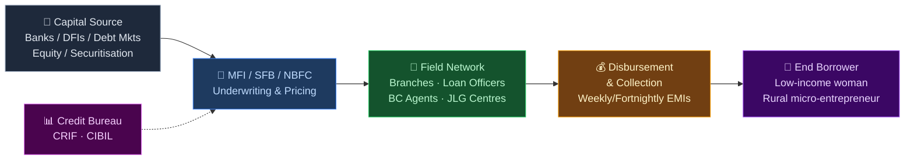
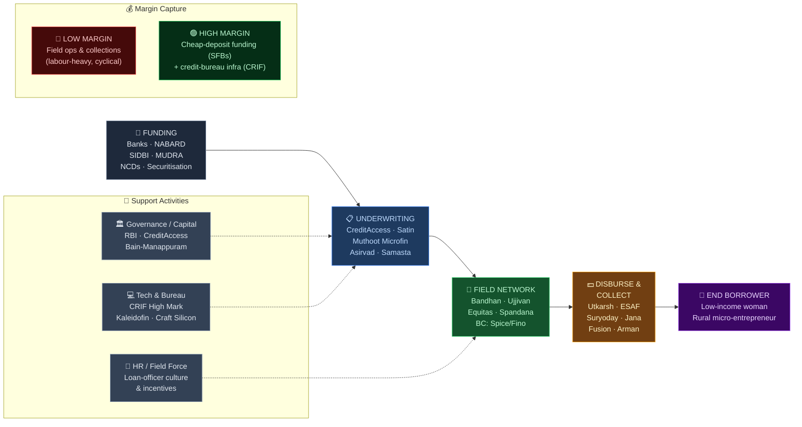

# Microfinance Sector — India Value Chain Analysis

*Investment-research lens · Data as of Q1 FY27 (July 2026). The sector is emerging from its worst asset-quality cycle since demonetisation — this shapes every conclusion below.*

---

## 0. Segment definition

**Boundary:** The business of extending small-ticket, collateral-free (JLG — Joint Liability Group) loans, typically ₹30,000–₹80,000, to low-income women borrowers in rural and semi-urban India for income-generating activities, plus the credit, technology, and collection infrastructure that supports it.

The analysis covers four institutional forms that deliver microcredit:
1. **NBFC-MFIs** — pure-play microfinance non-banks (RBI-regulated under the 2022 Microfinance Framework)
2. **Small Finance Banks (SFBs)** — most of which were born as MFIs and retain a large microfinance book
3. **Banks & diversified NBFCs** with microfinance divisions/subsidiaries (Bandhan, Manappuram–Asirvad, IIFL–Samasta, L&T Finance)
4. **Enabling infrastructure** — credit bureaus, business-correspondent (BC) networks, lending-tech, and funding sources (banks, DFIs, securitisation)

**End customer & what they value most:** A low-income woman (>98% of MFI borrowers are women) running a micro-enterprise — dairy, tailoring, kirana, agri-allied. She values **speed and certainty of access**, doorstep service, and flexible small-ticket repayment far more than headline interest rate. Her true "cost" is exclusion from formal credit; the MFI's product is *access itself*.

**India's global position:** **Global leader.** India hosts the world's largest microfinance market by borrower count (~5.5 crore unique live borrowers, ~8.2 crore active loans, portfolio ~₹2.70 lakh crore as of Dec 2025). CRIF's Indian microfinance database (80mn+ borrowers) is the largest such database globally. The JLG model, imported from Bangladesh (Grameen), was scaled and institutionalised most aggressively in India.

---

## 0.5 Quick Scan — Investable Listed Companies

*Full 8-pass research completed. This is the rapid-prioritisation shortlist; detailed tables in §6.*

| Company | Ticker | Cap Bucket | Chain Stage | One-Line Investment Thesis | Coverage |
|---|---|---|---|---|---|
| CreditAccess Grameen | NSE: CREDITACC | Large (~₹25,500 Cr) | Pure NBFC-MFI | Highest-quality survivor; best collection discipline, first to recover — market may under-price the through-cycle ROA normalisation to 4–5% | Well-covered |
| Bandhan Bank | NSE: BANDHANBNK | Large | Bank (MFI-origin) | Deeply de-rated on EEB stress; secured-book diversification + cheap deposit franchise not in a 1x-book price | Well-covered |
| Equitas SFB | NSE: EQUITASBNK | Mid (~₹8,000 Cr) | SFB (diversified) | Most-diversified SFB; MFI now <15% of book — de-rated *with* the sector it has largely exited | Well-covered |
| Ujjivan SFB | NSE: UJJIVANSFB | Mid (~₹6,500 Cr) | SFB (MFI-origin) | 20% ROE, secured-book pivot underway, trades ~1x book; MFI stress already in numbers | Well-covered |
| Muthoot Microfin | NSE: MUTHOOTMF | Small (~₹4,350 Cr) | Pure NBFC-MFI | South-heavy book (lower stress geography) + Muthoot Pappachan brand/funding; recovery optionality | Moderate |
| Fusion Finance | NSE: FUSION | Small (~₹3,600 Cr) | Pure NBFC-MFI | Deep-value / distressed turnaround; capital raise done, book cleaned — binary recovery bet | Moderate |
| Spandana Sphoorty | NSE: SPANDANA | Small | Pure NBFC-MFI | Most-stressed large MFI; highest operating leverage to a cycle turn if it survives — high risk | Moderate |
| Satin Creditcare | NSE: SATIN | Small (~₹2,945 Cr) | Pure NBFC-MFI | Cheapest large MFI at ~0.9x book, 8.8x P/E; North-India concentration is the risk & the option | Under-researched |
| Utkarsh SFB | NSE: UTKARSHBNK | Small (~₹3,320 Cr) | SFB (MFI-origin) | 15% ROE, Bihar/UP heartland; trades ~7x P/E — cheapest SFB on earnings | Under-researched |
| Manappuram Finance | NSE: MANAPPURAM | Mid | Diversified NBFC (Asirvad) | Gold-loan cash engine cushions MFI (Asirvad) stress; Bain-backed governance reset — MFI is the hidden option/overhang | Well-covered |
| ESAF SFB | NSE: ESAFSFB | Small | SFB (MFI-origin) | Kerala-rooted; universal-bank licence application is a re-rating trigger if approved | Under-researched |
| Suryoday SFB | NSE: SURYODAY | Small (~₹1,390 Cr) | SFB (MFI-origin) | Smallest SFB, ~0.7x book; Vikas Loan (MFI) stress + secured pivot | Under-researched |
| Arman Financial | NSE: ARMANFIN | Small/Micro | NBFC-MFI (Namra) | Gujarat-anchored microcap; MFI (Namra) + 2W/MSME mix; historically best-in-class ROE, sharp de-rating | Under-researched |
| Jana SFB | NSE: JANASFB | Small | SFB (MFI-origin) | Post-IPO (Feb 2024), secured book now >60%; MFI legacy overhang masking bank transition | Under-researched |
| IIFL Finance | NSE: IIFL | Mid | Diversified NBFC (Samasta) | MFI (Samasta) is one leg of a gold+MSME+MFI book; post-RBI-embargo recovery story | Moderate |

**Where the under-researched opportunity sits:** The richest mispricing is in the **Small-cap pure NBFC-MFI bucket** (Satin, Arman, and the recovering Fusion/Spandana) and the **under-covered SFBs** (Utkarsh, Suryoday, ESAF). These names carry maximum negative sentiment at the trough of the worst MFI cycle in a decade, minimal sell-side coverage, and prices at/below book — exactly the Chancellor set-up where survivors re-rate violently on the first two clean quarters. The large-caps (CreditAccess, Bandhan) are the *safer* recovery vehicles but are fully covered and less mispriced.

---

## 1. Value chain map — primary activities

**Reframing note:** In lending, Porter's physical-goods activities map onto a *financial* chain — the "raw material" is capital, "operations" is underwriting, "logistics" is the field distribution network, and "service" is collections. I use industry-native labels alongside Porter's.

### 1a. Inbound logistics → **Funding / Liability sourcing**
The single largest cost input for an MFI is money itself. MFIs raise from: term loans from banks (priority-sector-lending motivated), NABARD/SIDBI/MUDRA refinance, NCDs and market borrowings, external commercial borrowings (ECBs), securitisation/direct assignment (selling down loan pools to banks), and equity.
- **Cost/differentiation driver:** *Cost of funds is the whole ballgame.* An SFB funding at 7–8% via retail deposits has a structural 250–400 bps advantage over an NBFC-MFI funding at 11–12% via bank loans. This is why the SFB licence is the industry's most valuable prize.
- **Players:** Lenders — SBI, HDFC Bank, banks meeting PSL targets; refinance — NABARD, SIDBI, **MUDRA**; SFBs self-fund via deposits.

### 1b. Operations → **Underwriting, pricing & credit assessment**
Group formation, borrower KYC, income/household-indebtedness assessment, credit-bureau checks, loan sanction and pricing.
- **Cost/differentiation driver:** Credit discipline. Post-2022, RBI removed the interest-rate cap for NBFC-MFIs (retaining a household-income ceiling of ₹3 lakh and a 50% FOIR cap on repayment outflow), so **underwriting quality — not pricing — separates winners from losers.** The FY25–26 crisis was fundamentally an underwriting failure: multiple lenders lending to the same over-leveraged household.
- **Players:** CreditAccess Grameen (gold-standard discipline), all NBFC-MFIs and SFBs. Credit-bureau linkage (CRIF) is the critical input here.

### 1c. Outbound logistics → **Field distribution network**
The physical reach: branches, loan officers ("credit officers"), JLG centre meetings, and increasingly BC (business-correspondent) agents and digital disbursement.
- **Cost/differentiation driver:** Cost-to-serve per borrower. A dense, well-managed branch network in a chosen geography lowers per-loan operating cost; over-expansion into unfamiliar geographies (what triggered the crisis) raises it and destroys underwriting quality. Doorstep delivery is table stakes.
- **Players:** CreditAccess (South/West density), Bandhan (East heartland), Satin (North), Muthoot Microfin (South), plus BC networks (Spice Money, PayNearby, Fino).

### 1d. Marketing & sales → **Borrower acquisition & group formation**
Acquisition is via loan officers forming JLGs and word-of-mouth in villages, not advertising. Center-meeting model creates social collateral.
- **Cost/differentiation driver:** Trust and relationship density; low CAC because groups self-recruit. Brand matters at the *funding* end (rating, investor trust), not the borrower end.
- **Players:** All field-led; differentiation is execution, not brand.

### 1e. Service → **Collections & recovery**
Weekly/fortnightly EMI collection at center meetings; the true test of the model. Collection efficiency (CE) is the single most-watched operating metric.
- **Cost/differentiation driver:** This is where value is *won or destroyed*. In FY25–26, CE collapsed across the sector, PAR (portfolio-at-risk) spiked, and GNPA rose from ~2% to ~8%. Firms with disciplined collection cultures (CreditAccess) held up far better. Recovery/write-off management now defines FY26–27 earnings.
- **Players:** All; CreditAccess and South-heavy books materially outperformed North/East books through the cycle.

---

## 2. Value chain map — support activities

### 2a. Firm infrastructure (governance, capital allocation, risk)
The most important support activity in lending. Board-level risk appetite and capital-allocation discipline determine whether a lender over-grows into a bust. **Strong:** CreditAccess (Netherlands-based CreditAccess parent, conservative), Bandhan. **Weak/reset:** Manappuram (Bain Capital took control in 2025, governance overhaul underway), Spandana/Fusion (management churn through crisis). Regulator: **RBI**.

### 2b. HR management
Field-force intensive: tens of thousands of loan officers. Attrition among credit officers is chronically high (>30%) and directly correlates with collection quality. Training and incentive design (rewarding *quality* of book, not just disbursement volume) is a hidden moat. CreditAccess is repeatedly cited for lower attrition and stronger field culture.

### 2c. Technology development
Rapidly rising in importance: e-KYC, cashless disbursement (to bank accounts/UPI), digital collections, and — critically — **real-time credit-bureau integration** to enforce the 3-lender cap. Tech spend is shifting the model from cash-and-paper to digital. **Weak spot for India's smaller MFIs** — many rely on third-party core-lending platforms. Providers: Craft Silicon, Kaleidofin, Jocata, Perfios, BankSATHI; larger players build in-house.

### 2d. Procurement
Minimal physical procurement; "procurement" = sourcing of capital (covered in 1a) and of credit data. The one genuine procured input is **credit-bureau reports** (CRIF High Mark, TransUnion CIBIL, Equifax, Experian) — a small per-inquiry cost that is the highest-ROI input in the chain.

**Conglomerate check:** Limited classic-conglomerate presence, but three notable group entries — **Bajaj** (via Bajaj Finance's rural/microfinance-adjacent lending), **Mahindra** (Mahindra Finance rural), and the **Muthoot** families (both branches: Muthoot Finance→Belstar, Muthoot Pappachan→Muthoot Microfin). **Bain Capital's** control of Manappuram (2025) is the most significant recent capital-allocation event in the sector.

---

## 3. Five Forces + Capital Cycle analysis

### Part A — Five Forces

**Supplier power (of capital) — HIGH.** The dominant supplier is *funding*, and its providers (banks, debt markets) hold real power over NBFC-MFIs. During stress, banks cut credit lines and raise spreads exactly when MFIs need liquidity most — pro-cyclical and punishing. SFBs neutralise this by owning deposit funding, which is the entire strategic rationale for the licence. Rating downgrades in FY25–26 amplified supplier power sharply.

**Buyer power (borrowers) — LOW individually, but RISING collectively.** A single low-income borrower has no negotiating power. But the FY25–26 crisis revealed a new phenomenon: **coordinated default** (local "loan waiver" politics in Karnataka, and borrower over-leverage across multiple lenders) gives borrowers *collective* power to disrupt collections. Political interference (state ordinances) is a recurring buyer-side risk.

**Threat of new entrants — LOW-to-MODERATE.** RBI registration, capital requirements, and — post-crisis — heightened regulatory scrutiny raise barriers. The SFB licence is scarce (RBI issues few). But fintech/digital lenders and BC-model entrants can attack the origination layer cheaply. Net: hard to enter *at scale as a regulated MFI*, easier to nibble at origination.

**Threat of substitutes — MODERATE-to-HIGH and structurally rising.** This is the underappreciated force. Substitutes are multiplying: SHG-Bank linkage (NRLM/DAY), MUDRA loans direct from banks, gold loans (cheaper, collateralised), UPI-based small-ticket digital credit, and Kisan Credit Cards. As formal banking and digital rails penetrate rural India, the MFI's core "access" moat erodes at the margin.

**Rivalry — HIGH.** Fragmented (100+ registered NBFC-MFIs plus SFBs and banks), overlapping geographies, undifferentiated product. Pre-crisis rivalry manifested as *reckless multi-lending to the same borrower* — the direct cause of the bust. Guardrails 2.0 (3-lender cap) is an attempt to force rivalry discipline.

| Force | Intensity | Key Driver |
|---|---|---|
| Supplier power (funding) | **High** | Pro-cyclical bank funding; SFBs insulated via deposits |
| Buyer power (borrowers) | **Low → Rising** | Individually weak; collectively via political/coordinated default |
| Threat of new entrants | **Low–Moderate** | RBI licensing barrier; fintech nibbles origination |
| Threat of substitutes | **Moderate–High** | SHG linkage, MUDRA, gold loans, UPI credit, KCC |
| Rivalry | **High** | Fragmented; geographic overlap; undifferentiated product |

**Overall structural attractiveness: LOW-to-MEDIUM** — a structurally difficult, cyclical, thin-moat industry where only disciplined, low-cost-of-funds operators earn durable through-cycle returns.

### Part B — Capital Cycle verdict

The sector is in a **deep capital-outflow / trough phase** — the single most important fact for timing. Through FY25–FY26, NBFC-MFI AUM contracted ~19% YoY (to ~₹1.4 lakh crore), GNPA spiked to ~8%, banks pulled funding lines, equity investors fled, valuations collapsed to/below book, and weaker players are being written down, merged (Fincare→AU), or run off. CareEdge pegs cumulative sector stress at ~30% of the Mar-2024 book by end-FY26. This is textbook Chancellor: capital fleeing, capacity discipline being forced by guardrails, supply of credit shrinking — which *improves* pricing power and asset quality for survivors into FY27.

### Part C — Investor implication

The combined picture — a low-attractiveness industry at the *bottom* of a violent capital cycle — is precisely the asymmetric set-up value investors hunt for. **Most structurally attractive stage right now: the deposit-funded survivors and the highest-discipline pure-play** — i.e., SFBs with cheap liabilities (Ujjivan, Equitas, Utkarsh) and CreditAccess Grameen among NBFC-MFIs. These re-rate first as GNPA normalises (consensus: falling toward ~3.6% by Mar 2026, stabilising into FY27). **Stage to avoid:** newly-aggressive, thinly-capitalised NBFC-MFIs still fighting for survival with high North/East geographic concentration and no deposit base — unless bought explicitly as high-risk distressed turnarounds (Spandana, and to a lesser extent Fusion). **The single biggest risk that invalidates the thesis:** a *second leg down* driven by political intervention — a state-level loan-waiver ordinance or a widening of coordinated default beyond Karnataka — which would reset the recovery clock and hit the un-diversified pure-plays hardest.

**Overall structural attractiveness: Low–Medium** — thin-moat, cyclical, substitute-threatened; survivors earn only through discipline and funding cost.
**Capital cycle phase: Outflow / Trough** — AUM shrinking, funding withdrawn, valuations at multi-year lows; capacity discipline being forced.
**Investor stance: Selective Accumulate** — accumulate deposit-funded survivors and the top-discipline NBFC-MFI at the trough; avoid under-capitalised, geographically concentrated pure-plays except as explicit distressed bets.

---

## 4. Competitive Intensity & Consolidation

*(GVC framework skipped — microfinance is a ~100% domestic chain with negligible cross-border value flow. Replaced with consolidation analysis per skill guidance.)*

- **Top 3 by microfinance GLP (approx.):** Bandhan Bank (largest EEB/microfinance book among banks), CreditAccess Grameen (largest pure NBFC-MFI), and the Manappuram–Asirvad / IIFL–Samasta / Muthoot tier. Combined, the top 5 institutions hold a large share, but the *long tail* of 80+ small NBFC-MFIs keeps the overall market fragmented.
- **HHI: approximately 700–1,000 (fragmented → moderately concentrated).** Below the 1,500 "moderately concentrated" threshold when measured across all institutional forms — this is a fragmented industry.
- **Direction: consolidating, and the crisis is accelerating it.** Consolidation drivers: (1) the funding-cost advantage of deposit-taking SFBs squeezing sub-scale NBFC-MFIs; (2) the FY25–26 stress forcing weak players into distressed sales, mergers, or run-off (Fincare merged into AU SFB; several small MFIs seeking buyers); (3) rising compliance/tech costs of Guardrails 2.0 that only scaled players can absorb; (4) RBI's preference for fewer, better-capitalised entities.
- **Likely survivors in 5 years:** CreditAccess Grameen (pure-play consolidator), the deposit-funded SFBs (Ujjivan, Equitas, Utkarsh, Jana), and MFI arms backed by strong parents (Asirvad/Manappuram, Samasta/IIFL, Belstar/Muthoot). Sub-₹5,000 Cr standalone NBFC-MFIs without a funding edge are the most likely acquisition targets or run-off candidates.

---

## 5. Key linkages & leverage points

1. **Credit bureau ↔ Underwriting (the decisive linkage).** Real-time bureau data (CRIF) is what enforces the 3-lender cap and household-indebtedness ceiling. When this linkage is weak or gamed, the entire chain over-lends and blows up — exactly what happened in FY24. Tightening it is the industry's self-preservation mechanism.
2. **Funding cost ↔ Everything downstream.** Cost of funds sets the floor on lending rates and the ceiling on how much stress a book can absorb. The SFB-vs-NBFC funding gap is the master linkage that determines survival economics.
3. **Field-officer incentives ↔ Collection quality.** When officers are paid on disbursement volume rather than book quality, underwriting decays with a 12–18 month lag. This linkage is invisible in good times and fatal in bad ones.
4. **Geographic concentration ↔ Risk correlation.** Over-concentration in one state (Karnataka, Bihar, West Bengal) links political/monsoon/local-economy shocks directly to portfolio-wide default. Diversification is a genuine risk-management linkage.
5. **Capital adequacy ↔ Rating ↔ Funding access.** A capital buffer protects the rating, which protects funding lines, which protects the ability to lend through a downturn — a self-reinforcing loop that snaps viciously in reverse for the under-capitalised.

**Highest-leverage intervention:** **Enforcing the credit-bureau-linked lending discipline in real time (Guardrails 2.0/3.0).** If one lever could most improve value created and captured, it is hard-wiring the 3-lender cap and ₹2-lakh household ceiling into every disbursement decision via mandatory real-time bureau checks. This single linkage prevents the multi-lending that periodically destroys the entire industry's returns — converting microfinance from a boom-bust utility into a durably profitable one.

---

## 5.5 Upcoming catalysts & key triggers

| Catalyst / Trigger | Timeline | Companies Likely to Benefit |
|---|---|---|
| GNPA normalisation toward ~3.6% (Mar-26) → clean FY27 quarters | H2 FY26 – H1 FY27 | CreditAccess, Muthoot Microfin, Ujjivan, Equitas |
| Full impact of Guardrails 2.0 (3-lender cap) restoring credit discipline | FY26 onward | All disciplined survivors; hurts marginal lenders |
| RBI universal-bank licence approvals for SFBs | FY27 | ESAF, Ujjivan, AU (already applied/approved-track) |
| RBI rate-cut cycle lowering NBFC-MFI cost of funds | FY26–27 | Pure NBFC-MFIs (CreditAccess, Satin, Fusion) — biggest funding-cost beneficiaries |
| Bain Capital governance/turnaround at Manappuram–Asirvad | FY26–27 | Manappuram (MFI overhang resolution) |
| Karnataka/state political-risk resolution (no fresh waiver ordinances) | FY26 | South-concentrated MFIs (CreditAccess, Muthoot Microfin, Spandana) |
| Sector equity raises / capital infusions completing | FY26 | Fusion, Spandana (survival → recovery re-rating) |
| Return of bank funding & securitisation appetite to the sector | H2 FY26 | Small NBFC-MFIs most starved of funding (Satin, Arman) |

---

## 6. Indian company landscape

*8-pass research protocol completed: Screener.in MFI sector sweep, peer groups, IPO sweep (2022–25), SME check, sub-segment decomposition (NBFC-MFI / SFB / diversified-NBFC / infra), sector-index check, adjacency check (credit bureaus, BC networks, payments banks), and business-press sweep.*

### Listed companies — Pure NBFC-MFIs

| Stage | Company | Ticker | Cap Bucket | Revenue / Mkt Cap | PLI? | Coverage | Chain Position |
|---|---|---|---|---|---|---|---|
| Pure NBFC-MFI | CreditAccess Grameen | NSE: CREDITACC | Large | Mkt cap ~₹25,500 Cr | No | Well-covered | Leader |
| Pure NBFC-MFI | Muthoot Microfin | NSE: MUTHOOTMF | Small | Mkt cap ~₹4,350 Cr | No | Moderate | Challenger |
| Pure NBFC-MFI | Fusion Finance | NSE: FUSION | Small | Mkt cap ~₹3,600 Cr | No | Moderate | Niche (recovering) |
| Pure NBFC-MFI | Spandana Sphoorty | NSE: SPANDANA | Small | Mkt cap ~₹1,000–1,500 Cr* | No | Moderate | Niche (stressed) |
| Pure NBFC-MFI | Satin Creditcare | NSE: SATIN | Small | Mkt cap ~₹2,945 Cr | No | Under-researched | Challenger |
| NBFC-MFI (via Namra) | Arman Financial Services | NSE: ARMANFIN | Small/Micro | Mkt cap ~₹1,500–2,000 Cr* | No | Under-researched | Niche |

*Spandana and Arman market caps move sharply with the cycle; treat as indicative.

### Listed companies — Small Finance Banks (MFI-origin / MFI-heavy)

| Stage | Company | Ticker | Cap Bucket | Revenue / Mkt Cap | PLI? | Coverage | Chain Position |
|---|---|---|---|---|---|---|---|
| SFB (MFI-origin) | Bandhan Bank | NSE: BANDHANBNK | Large | Mkt cap ~₹28,000–30,000 Cr* | No | Well-covered | Leader |
| SFB (diversified) | Equitas SFB | NSE: EQUITASBNK | Mid | Mkt cap ~₹8,000 Cr | No | Well-covered | Leader |
| SFB (MFI-origin) | Ujjivan SFB | NSE: UJJIVANSFB | Mid | Mkt cap ~₹6,500 Cr | No | Well-covered | Leader |
| SFB (MFI-origin) | Utkarsh SFB | NSE: UTKARSHBNK | Small | Mkt cap ~₹3,320 Cr | No | Under-researched | Challenger |
| SFB (MFI-origin) | ESAF SFB | NSE: ESAFSFB | Small | Mkt cap ~₹1,500–2,000 Cr* | No | Under-researched | Niche |
| SFB (MFI-origin) | Jana SFB | NSE: JANASFB | Small | Mkt cap ~₹4,000–5,000 Cr* | No | Under-researched | Challenger (IPO Feb-24) |
| SFB (MFI-origin) | Suryoday SFB | NSE: SURYODAY | Small | Mkt cap ~₹1,390 Cr | No | Under-researched | Niche |
| SFB (diversified) | Capital SFB | NSE: CAPITALSFB | Small | Mkt cap ~₹1,200–1,500 Cr* | No | Under-researched | Niche (not MFI-led) |
| SFB (via Fincare merger) | AU Small Finance Bank | NSE: AUBANK | Large | Mkt cap ~₹45,000 Cr+* | No | Well-covered | Leader |

### Listed companies — Diversified NBFCs / Banks with MFI arms & enablers

| Stage | Company | Ticker | Cap Bucket | Revenue / Mkt Cap | PLI? | Coverage | Chain Position |
|---|---|---|---|---|---|---|---|
| Diversified NBFC (Asirvad MFI) | Manappuram Finance | NSE: MANAPPURAM | Mid | Mkt cap ~₹20,000 Cr* | No | Well-covered | Challenger (MFI) |
| Diversified NBFC (Samasta MFI) | IIFL Finance | NSE: IIFL | Mid | Mkt cap ~₹15,000–18,000 Cr* | No | Moderate | Challenger (MFI) |
| Diversified NBFC (rural/MFI) | L&T Finance | NSE: LTF | Large | Mkt cap ~₹40,000 Cr+* | No | Well-covered | Challenger (MFI) |
| Diversified NBFC (Belstar MFI) | Muthoot Finance | NSE: MUTHOOTFIN | Large | Mkt cap ~₹80,000 Cr+* | No | Well-covered | Niche (MFI via Belstar) |
| Payments Bank / BC rails | Fino Payments Bank | NSE: FINOPB | Small | Mkt cap ~₹2,500–3,500 Cr* | No | Under-researched | Enabler (distribution) |

*Indicative; financial-stock caps are cycle-sensitive.

### Unlisted / private companies

| Stage | Company | Type | Business Description | Scale | Notes |
|---|---|---|---|---|---|
| NBFC-MFI | Svatantra Microfin | PE-backed (Ananya Birla) | Largest unlisted NBFC-MFI after acquiring Chaitanya India (from L&T) | Large GLP | Potential future IPO candidate |
| NBFC-MFI | Asirvad Microfinance | Subsidiary (Manappuram) | 2nd-largest NBFC-MFI historically; ~98% owned by Manappuram | Large GLP | DRHP filed earlier; IPO shelved amid stress |
| NBFC-MFI | IIFL Samasta Finance | Subsidiary (IIFL Finance) | MFI arm of IIFL Finance | Large GLP | Formerly Samasta Microfinance |
| NBFC-MFI | Belstar Microfinance | Subsidiary (Muthoot Finance) | MFI arm of Muthoot Finance (G.A. Muthoot branch) | Mid–Large | DRHP filed; IPO plans |
| NBFC-MFI | Annapurna Finance | PE-backed | Large East/Central India NBFC-MFI | Mid–Large | Pre-IPO |
| NBFC-MFI | Midland Microfin | Private | North-India (Punjab-based) NBFC-MFI | Mid | — |
| NBFC-MFI | Light Microfinance | PE-backed | Gujarat/West NBFC-MFI | Small–Mid | — |
| Credit bureau | CRIF High Mark | MNC subsidiary (CRIF S.p.A, Italy) | India's dominant microfinance credit bureau (80mn+ borrowers) | — | Highest-leverage infra node |
| Credit bureau | TransUnion CIBIL / Equifax / Experian | MNC subsidiaries | Retail + MFI credit data | — | — |
| BC / lending-tech | Spice Money, PayNearby, Kaleidofin, Craft Silicon | Private / PE-backed | BC networks & lending-tech serving MFIs | — | Origination/distribution enablers |
| DFI / refinance | NABARD, SIDBI, MUDRA | Government entity | Primary refinance & funding for the sector | — | Policy lever |

### Notable companies — deeper notes

**CreditAccess Grameen (NSE: CREDITACC)**
- **Stage in chain:** Pure NBFC-MFI (underwriting + field + collections)
- **Cap bucket:** Large — Mkt cap ~₹25,500 Cr
- **Analyst coverage:** Well-covered
- **What makes them interesting:** India's largest and highest-quality pure-play MFI, majority-owned by CreditAccess India B.V. (Netherlands). Through the FY25–26 crisis it demonstrated materially better collection efficiency and lower GNPA than peers — the clearest evidence of a genuine underwriting/collections culture moat in a thin-moat industry. Concentrated in lower-stress South/West geographies.
- **Key financials:** P/E ~21x, market cap ~₹25,475 Cr; through-cycle ROA historically 4–5%, ROE mid-to-high teens (compressed during the crisis).
- **PLI beneficiary:** No (not applicable to financials)
- **Watch factor:** Quarterly collection-efficiency and GNPA trajectory into FY27; first clean quarter is the re-rating trigger.
- **Investment angle:** The market is pricing CreditAccess as a wounded MFI at the trough of a brutal cycle. What it may be underpricing is that CreditAccess is the *consolidator* — as sub-scale rivals run off or sell, it gains share, and its through-cycle ROA normalises back to 4–5% (vs. a depressed current level). If it re-establishes ~20% AUM growth on a cleaned book with normalised credit cost, earnings could compound off a low base while the multiple re-rates — a double lever consensus is slow to model at the bottom.

**Muthoot Microfin (NSE: MUTHOOTMF)**
- **Stage in chain:** Pure NBFC-MFI
- **Cap bucket:** Small — Mkt cap ~₹4,350 Cr
- **Analyst coverage:** Moderate
- **What makes them interesting:** Backed by the Muthoot Pappachan (Fincorp) group, giving it brand credibility and funding access superior to standalone small MFIs. South-heavy book sat in relatively lower-stress geography through the crisis.
- **Key financials:** P/E ~25x (depressed earnings inflate the multiple), ROCE ~9.3%, market cap ~₹4,348 Cr.
- **PLI beneficiary:** No
- **Watch factor:** Group funding support and South-India asset-quality trend.
- **Investment angle:** Market lumps it with the stressed small-MFI cohort, but its group backing (funding + governance) and geographic mix make it a higher-quality recovery vehicle than its de-rated price implies; a normalising ROE toward mid-teens on a growing book is the un-modelled upside.

**Fusion Finance (NSE: FUSION)**
- **Stage in chain:** Pure NBFC-MFI
- **Cap bucket:** Small — Mkt cap ~₹3,600 Cr
- **Analyst coverage:** Moderate
- **What makes them interesting:** One of the most visibly stressed large MFIs — GNPA spike, management change, and a capital raise to shore up the balance sheet. Now a classic distressed-turnaround profile: book cleaned via write-offs, fresh capital in, survival largely secured.
- **Key financials:** P/E optically ~259x (near-zero trailing earnings — meaningless at the trough); track book value and PAR trend instead.
- **PLI beneficiary:** No
- **Watch factor:** Trajectory of PAR 1–180 and whether credit cost peaks in FY26.
- **Investment angle:** A binary, high-risk-high-reward recovery bet. The market prices it near/below book on the assumption of continued losses; if credit cost peaks in FY26 and it returns to even a normalised 2.5–3% ROA on a cleaned book, the operating leverage off a distressed base is violent. Not a quality compounder — a mispriced option on survival-plus-normalisation.

**Satin Creditcare Network (NSE: SATIN)**
- **Stage in chain:** Pure NBFC-MFI
- **Cap bucket:** Small — Mkt cap ~₹2,945 Cr
- **Analyst coverage:** Under-researched (highest discovery value)
- **What makes them interesting:** The cheapest large NBFC-MFI on both earnings (P/E ~8.8x) and highest ROCE in the pure-play set (~13.8% per Screener). North-India (UP/Bihar) concentration is simultaneously its biggest risk and, if that geography stabilises, its biggest torque.
- **Key financials:** P/E ~8.85x, ROCE ~13.84%, market cap ~₹2,945 Cr — the value name of the cohort.
- **PLI beneficiary:** No
- **Watch factor:** North-India collection efficiency and funding-line restoration.
- **Investment angle:** Trades like a permanently impaired lender, yet already shows the highest ROCE among listed pure-plays. If the North-India book stabilises (the very thing the market fears), a re-rating from <1x toward 1.2–1.5x book plus earnings recovery is a large combined move — the highest-upside, least-covered name in the pure-play tier.

**Bandhan Bank (NSE: BANDHANBNK)**
- **Stage in chain:** Bank (MFI-origin; large EEB/microfinance book)
- **Cap bucket:** Large
- **Analyst coverage:** Well-covered
- **What makes them interesting:** The original Indian microfinance-to-universal-bank success story, now deeply de-rated on Emerging-Entrepreneurs-Business (EEB/microfinance) stress and past credit-guarantee/CGFMU issues. It combines a low-cost deposit franchise with an ongoing pivot toward secured lending (housing, commercial).
- **Key financials:** Trades around ~1x book at the trough — historically low for a bank with its deposit franchise and ROA history.
- **PLI beneficiary:** No
- **Watch factor:** EEB GNPA peaking; secured-book mix crossing ~50%.
- **Investment angle:** The market prices Bandhan as an MFI-in-a-bank-wrapper at the worst of the cycle, ignoring that (a) its liability franchise is a genuine cheap-funding moat and (b) its secured-book diversification structurally lowers cyclicality. A normalising EEB book plus mix-shift could re-rate it from ~1x toward 1.5–2x book — a bank multiple, not an MFI multiple.

**Manappuram Finance (NSE: MANAPPURAM)**
- **Stage in chain:** Diversified NBFC; MFI via Asirvad (~98%)
- **Cap bucket:** Mid
- **Analyst coverage:** Well-covered
- **What makes them interesting:** Its gold-loan business is a high-ROA cash engine that cushions the Asirvad MFI drag — a natural hedge most pure MFIs lack. **Bain Capital's controlling-stake acquisition (2025)** brought a governance and capital-allocation reset, a rare institutional-ownership catalyst in this sector.
- **Key financials:** Consolidated ROA/ROE historically strong on the gold book; MFI (Asirvad) has been the loss centre.
- **PLI beneficiary:** No
- **Watch factor:** Asirvad's asset-quality normalisation and Bain's strategic actions (potential Asirvad IPO/de-merger).
- **Investment angle:** The market treats Asirvad's MFI stress as an overhang on the whole entity. But the gold-loan core is a stable compounder, and Bain's entry could unlock value via governance upgrade and eventual Asirvad monetisation. Investors get a de-risked, professionally-governed structure where the MFI is a *free option* rather than the core thesis — the opposite risk profile of a standalone MFI.

---

## 7. Strategic insight & investment angles

### Part A — Non-obvious strategic insight

The consensus narrative is "microfinance is broken — avoid it." The non-obvious insight from mapping the full chain is that **the FY25–26 crisis was not a demand or credit-loss problem, it was a *supply-of-capital coordination failure*** — too many lenders funding the same borrower because the credit-bureau ↔ underwriting linkage was gamed. That is a *fixable, structural* problem, and it is being fixed right now by Guardrails 2.0 (the hard 3-lender cap and ₹2-lakh household ceiling, enforced via real-time bureau checks). The invisible implication: the very regulation that is shrinking AUM today is *permanently raising the industry's return quality* by killing the over-lending that periodically destroys it. The market is extrapolating the trough losses; it is missing that the industry is being structurally re-plumbed into a more disciplined, less boom-bust utility — which most benefits the disciplined survivors who never over-lent in the first place. Second, the *real* long-term winners are not the pure MFIs at all but the **deposit-funded SFBs**, because the entire crisis re-proved that cost-of-funds and funding-stability — not lending rates — decide who survives.

### Part B — Blue Ocean opportunity

**Four Actions Framework applied to microcredit:**
- **Eliminate:** The weekly cash-collection center-meeting (huge opex, the vector for both officer fraud and collection stress).
- **Reduce:** Physical branch density and field-officer headcount per borrower.
- **Raise:** Real-time, cross-lender credit visibility and borrower-level cash-flow underwriting.
- **Create:** A **digitally-underwritten, cash-flow-based, individually-liable micro-loan delivered via UPI/BC rails to the "graduating" MFI borrower** — the woman who has repaid three cycles and is now credit-visible but is under-served by both MFIs (which cap her at group loans) and banks (which won't touch her).

**Value curve reconstructed:** From high-touch/high-cost/group-liable → low-touch/low-cost/data-underwritten/individual. **Specific non-customer:** the "graduated" MFI borrower ready for a larger individual loan, currently falling through the crack between MFI and bank. **Company attempting it:** **CreditAccess Grameen** (individual retail-finance product for graduating borrowers) and, on the tech-enabled side, **Kaleidofin** (unlisted, cash-flow-based inclusive underwriting) and **Fino Payments Bank** (NSE: FINOPB, BC-rail distribution). **Probability of success:** Moderate-to-high for CreditAccess — it owns the borrower relationship, the repayment history, and the distribution, which is exactly the moat a fintech attacker lacks. The risk is that individual (non-group) loans remove the social-collateral mechanism just as the group model proved fragile — so underwriting must be genuinely data-driven, not just relabelled. **Investment implication:** CreditAccess is already in the listed table and this optionality is *not* in consensus estimates, which model it as a recovering group-lender only.

### Part C — Top 3 priorities for a listed Indian firm seeking durable advantage

1. **Win or protect cheap, stable funding.** Pursue an SFB/universal-bank licence, or build securitisation/co-lending partnerships that de-risk the liability side. Cost-of-funds is the master variable — the crisis re-proved it.
2. **Hard-wire credit discipline as a moat, not a compliance chore.** Real-time bureau integration, quality-weighted (not volume-weighted) field incentives, and disciplined geographic diversification. The firm that treats Guardrails 2.0 as a *competitive weapon* out-earns the cycle.
3. **Diversify the asset mix toward secured/individual lending off the microfinance customer base.** Graduate proven borrowers into housing, gold, LAP, and individual loans — lowering portfolio cyclicality while monetising the hardest-won asset in the chain: the repayment relationship.

### Part D — Investment angle summary

- **CreditAccess Grameen** — Market prices a wounded group-lender at the trough; it's underpricing the consolidator's share gains, the through-cycle ROA normalisation to 4–5%, and the un-modelled individual-lending optionality. The catalyst is the first clean GNPA quarter into FY27.
- **Satin Creditcare** — Priced as permanently impaired (<1x book, 8.8x P/E) despite the highest ROCE in the pure-play set; a North-India stabilisation drives both a multiple re-rating and earnings recovery. Least-covered, highest-torque.
- **Bandhan Bank** — Valued as an MFI-in-disguise at ~1x book; the market ignores the cheap deposit franchise and secured-book pivot that justify a bank multiple. Mix-shift past ~50% secured is the re-rating trigger.
- **Manappuram Finance** — The Asirvad MFI overhang masks a high-ROA gold-loan compounder now under Bain Capital's professionalised governance; the MFI is a free option, potential IPO/monetisation the catalyst.
- **Muthoot Microfin** — Lumped with stressed small-MFIs, but group funding + South mix make it a higher-quality recovery than its de-rated price; a mid-teens normalised ROE is the un-modelled upside.
- **Fusion Finance** — A distressed-turnaround option: near/below book on continued-loss assumptions; if credit cost peaks in FY26, operating leverage off a cleaned base is violent. Explicit high-risk bet, not a compounder.

---

## 8. Value chain diagram (Mermaid)

---

## Sources

- CareEdge — NBFC-MFI: Asset Quality & Earnings report (2025)
- Equifax — Microfinance Pulse Report Vol XXVI (March 2026)
- Brickwork Ratings — Microfinance Sector in India (May 2025)
- Business Standard — "Asset quality stress in MFI sector to persist in H1FY26: ICRA" (Jul 2025)
- Business Standard — "NBFC-MFIs' bad loans to fall to 3.6% by March 2026: CareEdge" (Oct 2025)
- RBI — Regulatory Framework for Microfinance Loans (July 2022, updated Jan 2025)
- MFIN — Guardrails 2.0 announcements (effective April 2025)
- Screener.in — Microfinance Institutions sector page & company pages
- CRIF High Mark — company profile (microfinance credit bureau)
- Motilal Oswal / Groww / Jainam — Top Small Finance Bank Stocks 2026
- Chittorgarh / Groww — Jana Small Finance Bank IPO (Feb 2024)

---

## Cross-Chain References

This is the **first financial-services value chain** saved in this folder; the other 21 analyses are industrial/manufacturing/infrastructure chains (Chemicals, Telecom, Railway, Defence, EMS, Textiles, Logistics, etc.). No direct company overlap was found with the existing saved analyses — none of the MFI/SFB/NBFC names above appear in the industrial chains. 

*Potential future cross-references to watch as the library grows:* Manappuram, IIFL Finance, and the SFBs would naturally appear in any future **Gold Loan**, **Housing Finance / Affordable Housing**, or **Consumer / MSME Lending** value chain analysis. Fino Payments Bank and the BC networks (Spice Money, PayNearby) would appear in a future **Fintech / Digital Payments** chain.
