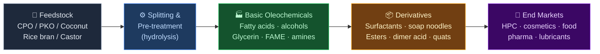
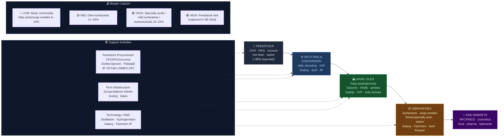

# Oleochemicals — Value Chain Analysis (India)

*Prepared: July 2026 · Investment-idea-generation lens · Frameworks: Porter Value Chain & Five Forces, Chancellor Capital Cycle, Gereffi GVC, Kim & Mauborgne Blue Ocean*

> **Note on figures:** Financials are most-recent-available (FY25 / early FY26). Market caps move; treat as approximate as of mid-2026. Uncertain data points are flagged explicitly.

---

## 0. Segment definition

**Oleochemicals** are chemicals derived from natural fats and oils (plant or animal) — the bio-based counterpart to petrochemicals. The chain converts **triglycerides** (crude palm oil, palm kernel oil, coconut oil, and increasingly non-edible/domestic oils like rice bran, castor, soya) into five **basic oleochemicals**:

1. **Fatty acids** (stearic, oleic, palmitic, lauric — the largest segment)
2. **Fatty alcohols** (C12–C18, feedstock for surfactants)
3. **Glycerin / glycerine** (co-product of splitting; pharma, food, personal care)
4. **Fatty acid methyl esters (FAME)** (biodiesel and ester intermediates)
5. **Fatty amines** (nitrogen derivatives → softeners, biocides, agrochemical actives)

These are then converted into **downstream derivatives**: surfactants, soap noodles, esters, dimer acids, alkanolamides, quats, and specialty nutraceutical fractions (tocopherols, sterols).

**Boundary of this analysis:** From oil/fat feedstock → basic oleochemicals (splitting, hydrogenation, distillation, transesterification) → first-level derivatives (surfactants, soap noodles, esters, specialty acids). It **excludes** the pure edible-oil refining business except where an integrated refiner captures oleochemical value from side-streams (palm stearin, PFAD, acid oil).

### Core product flow



**End customer & what they value most:** The primary buyers are Home & Personal Care (HPC) FMCG majors (HUL, P&G, Godrej Consumer, Reckitt), cosmetics/personal-care formulators, food & pharma excipient buyers, and industrial (lubricants, rubber, plastics, coatings). What they value: **consistent specification, sustainability/traceability certification (RSPO), security of supply, and price competitiveness against imports.** Increasingly, the "bio-based & natural" story lets brands command premiums — pulling demand toward oleochemical surfactants over petro-based ones.

**India's global position: FOLLOWER / CHALLENGER.** India is a large *consumer* of oleochemicals but a structural *net importer* of basic oleochemicals. The global cost-and-scale leaders sit in **Malaysia and Indonesia** (Wilmar, KLK, IOI, Musim Mas, Emery) — integrated back into palm plantations. India's disadvantage is structural: it imports ~55–60% of its edible/industrial oil and has almost no domestic palm plantation base. India's strength is in **downstream derivatives and specialty** (surfactants, dimer/specialty acids, nutraceutical fractions) where formulation know-how and proximity to a huge domestic HPC market matter more than feedstock cost.

---

## 0.5 Quick Scan — Investable Listed Companies

| Company | Ticker | Cap Bucket | Chain Stage | One-Line Investment Thesis | Coverage |
|---|---|---|---|---|---|
| Galaxy Surfactants | NSE: GALAXYSURF | Mid (~₹7,100 Cr) | Oleo-surfactants (derivatives) | India's #1 oleo-surfactant maker; margin recovery + premiumisation + specialty mix under-appreciated after 2 flat years | Well-covered |
| Godrej Industries | NSE: GODREJIND | Large (~₹40,000 Cr+) | Basic oleo + surfactants (leader) | ₹750 Cr chemicals capex to double fatty alcohol/glycerin; chemicals is a hidden re-rating engine inside a holdco | Well-covered |
| AWL Agri Business (ex-Adani Wilmar) | NSE: AWL | Large (~₹40,000 Cr) | Integrated refiner + oleo | Only Indian player integrated palm-refining → oleo at scale (Mundra 400 TPD); industrial-essentials optionality masked by edible-oil narrative | Well-covered |
| Fairchem Organics | NSE: FAIRCHEMOR | Micro (~₹1,000 Cr) | Specialty acids + nutraceuticals | Sole Indian maker of dimer & linoleic acid; deep-cyclical trough (8% margin, 3% ROCE) — turnaround optionality if spreads normalise | Under-researched |
| Jocil Ltd | NSE: JOCIL | Micro (~₹300–600 Cr)* | Fatty acids, stearic, soap noodles | Andhra Sugars-group cash-rich micro; commodity oleo but captive glycerin + power; deep-value/asset play | Undiscovered |
| Aarti Surfactants | NSE: AARTISURF | Small (~₹500 Cr)* | Surfactants (derivatives) | Aarti-pedigree turnaround; sulfonates/ethoxylates capacity ramp — margin normalisation not priced | Under-researched |
| Rossari Biotech | NSE: ROSSARI | Small (~₹3,500 Cr) | Specialty derivatives (HPPC) | Home/personal-care specialty blends; oleo-derivative downstream; capex digestion phase | Moderate |
| Patanjali Foods | NSE: PATANJALI | Large (~₹65,000 Cr) | Upstream palm + refining | Largest palm-plantation acreage push (NMEO-OP); feedstock backward-integration optionality for oleo | Moderate |
| Godrej Agrovet | NSE: GODREJAGRO | Mid (~₹15,000 Cr) | Upstream oil palm | Largest oil-palm plantation player; feedstock security node in an import-dependent chain | Moderate |
| Indo Amines | NSE: INDOAMIN | Micro (~₹500 Cr)* | Fatty amines & derivatives | Niche fatty-amine/perfumery/API maker; import-substitution + China+1 optionality | Undiscovered |
| Privi Speciality | NSE: PRIVISCL | Small (~₹5,000 Cr) | Ester/aroma (adjacent) | Uses oleo feedstock for aroma esters; pine + oleo dual-feedstock story | Moderate |
| VVF India | *Unlisted* | — | Fatty alcohol/acid/glycerin (leader) | Largest single fatty-alcohol facility in Asia (Taloja); watch for eventual IPO | n/a |

*Market caps marked with asterisk are approximate / conflicting across sources and should be verified before action.

**Where the under-researched opportunity sits:** The **Micro/Small bucket (Fairchem, Jocil, Aarti Surfactants, Indo Amines)** is where discovery value is highest — these are cyclical commodity/specialty oleo names near cycle-trough margins with 0–3 analysts. But they carry the chain's core weakness (feedstock import dependence, thin spreads). The most *durable* risk-adjusted opportunity is in the **derivatives/specialty layer (Galaxy, and the chemicals arm inside Godrej Industries)** where formulation IP and customer stickiness insulate margins from the feedstock commodity swing. The upstream feedstock names (Patanjali, Godrej Agrovet) are an indirect India-palm-mission play, not pure oleochemical exposure.

---

## 1. Value chain map — primary activities

### 1.1 Inbound logistics (feedstock sourcing)
**What it involves:** Procuring triglyceride feedstock — crude palm oil (CPO), palm kernel oil (PKO), coconut oil, plus PFAD (palm fatty acid distillate), palm stearin, acid oils, and domestic non-edible oils (rice bran, castor, karanja). ~85% of the base feedstock is *imported* from Indonesia/Malaysia; port-based storage tankage and blending are critical.

**Cost & differentiation drivers:** Feedstock is 65–80% of oleochemical COGS — so **inbound logistics IS the margin.** Location on the coast (Mundra, Kandla, Taloja/JNPT, Kakinada) and access to bonded tankage decides landed cost. Traceability/RSPO certification is now a differentiation lever for exporters and premium HPC buyers.

**Indian players:** AWL Agri (Mundra — integrated with own refining), Godrej Industries (Valia, Ambernath), VVF (Taloja), Jocil (Andhra), Patanjali Foods & Godrej Agrovet (only meaningful *domestic* palm plantation base under NMEO-OP). **Conglomerate check: Adani (via AWL) and Godrej both present at this node** — this is the single most important structural fact in the chain.

### 1.2 Operations (conversion)
**What it involves:** (a) **Splitting/hydrolysis** of triglycerides → fatty acids + glycerin; (b) **fractional distillation** to separate fatty-acid chain lengths; (c) **hydrogenation** → fatty alcohols; (d) **transesterification** → FAME/esters; (e) **amination** → fatty amines; (f) derivative reactions (sulphation/ethoxylation → surfactants; dimerisation → dimer acid).

**Cost & differentiation drivers:** Scale (world-scale splitters), energy integration (steam/power), yield on distillation, and the ability to make *high-value narrow-cut fractions and specialties* rather than commodity mixed acids. Captive power and glycerin recovery swing unit economics. EBITDA ranges widely: **commodity fatty acids 6–10%; oleo-surfactants 11–15%; specialty acids/derivatives 15–22%.**

**Indian players:** Godrej Industries (fatty alcohols, glycerin, surfactants — market leader), VVF (fatty alcohol/acid/glycerin), Galaxy Surfactants (oleo-surfactants), Fairchem (dimer/linoleic acid, specialty), Jocil (stearic acid, soap noodles), Aarti Surfactants (sulfonates/ethoxylates), Indo Amines (fatty amines).

### 1.3 Outbound logistics
**What it involves:** Bulk liquid (tanker, ISO-tank, flexi-bag) and solid (flaked stearic acid, soap noodles in bags) distribution to domestic HPC/industrial buyers and export markets. Fatty acids/alcohols are often shipped hot (heated tankers).

**Cost & differentiation drivers:** Proximity to HPC manufacturing clusters and ports; ability to serve JIT to large FMCG plants creates stickiness. Export logistics competitiveness vs. SE-Asian suppliers who ship directly.

**Indian players:** Integrated players (AWL, Godrej) co-locate with customer clusters; Galaxy exports to 80+ countries with overseas units (Egypt, US) — outbound reach is a genuine moat.

### 1.4 Marketing & sales
**What it involves:** Largely B2B contractual — annual/quarterly formula-priced contracts with FMCG majors, plus spot for industrial buyers. Specialty and personal-care grades sold on technical service and regulatory documentation (cosmetic-grade, halal, kosher, RSPO, pharma DMF).

**Cost & differentiation drivers:** In commodity oleo it's price competition; in specialty/personal-care it's **technical service, regulatory dossiers, co-development and approval lock-in** (multi-year to get designed into a global cosmetic brand's formulation).

**Indian players:** Galaxy is the exemplar — deep approvals with global HPC majors create switching costs. Godrej leverages group HPC relationships. Fairchem sells specialty acids into paints/inks/adhesives on a technical basis.

### 1.5 Service (post-sale)
**What it involves:** Technical support, formulation troubleshooting, custom-grade development, regulatory/sustainability documentation, supply-security assurance.

**Cost & differentiation drivers:** In specialty and personal-care, service creates lock-in and is a profit protector. In commodity oleo, service is minimal — it's a spot commodity.

**Indian players:** Galaxy (application labs, co-development), Godrej chemicals (Samagam industry platform, application development), Rossari (formulation/blend service in HPPC).

---

## 2. Value chain map — support activities

### 2.1 Firm infrastructure
Capital-allocation discipline is the swing factor — oleochemical assets are capital-heavy and cyclical. **Group balance sheets (Godrej, Adani) can sustain capex through troughs that would break pure-plays.** Godrej Industries' holdco structure lets its chemicals arm fund a ₹750 Cr expansion off group strength. Pure-plays (Fairchem, Jocil) must self-fund from cyclical cash flows — an investability constraint.

### 2.2 HR management
Not talent-scarce vs. IT/pharma, but process-engineering and R&D talent for specialty fractions and surfactant chemistry is the differentiator. Galaxy's and Godrej's R&D depth is a genuine moat vs. commodity converters.

### 2.3 Technology development
**The single biggest lever between "commodity" and "specialty."** Capabilities in narrow-cut distillation, selective hydrogenation, enzymatic splitting, dimerisation, ethoxylation, and green/bio-surfactant chemistry decide value capture. India lags SE-Asia on basic-oleo scale but competes on derivative/specialty chemistry. Fairchem's dimer/linoleic acid and mixed-tocopherol/sterol recovery is proprietary process IP; Galaxy holds patents in mild surfactants.

### 2.4 Procurement
Feedstock procurement (see 1.1) is 65–80% of cost — the highest-leverage support activity. Backward integration into palm plantation (Godrej Agrovet, Patanjali, 3F Oil Palm) or into refining (AWL) is the ultimate procurement moat. Currency (INR/USD), CPO price, and import-duty policy are the key exogenous variables.

---

## 3. Five Forces + Capital Cycle analysis

### Part A — Five Forces

**Supplier power — HIGH.** Feedstock suppliers (Indonesian/Malaysian palm majors) hold structural power: India has no domestic palm base, ~85% of feedstock is imported, and the same SE-Asian players (Wilmar, KLK, IOI, Musim Mas) are *both* the feedstock suppliers *and* the world-scale oleochemical competitors — they can squeeze Indian converters from both ends. CPO price and export-duty moves by Indonesia/Malaysia directly set Indian margins.

**Buyer power — HIGH (commodity) / MEDIUM (specialty).** Large FMCG buyers (HUL, P&G, Godrej Consumer, Reckitt) are concentrated, sophisticated, and can backward-integrate or import directly. In commodity fatty acids/soap noodles they dictate formula pricing. In specialty/personal-care surfactants, technical approval lock-in shifts power back toward the supplier.

**Threat of new entrants — MEDIUM-LOW.** Basic oleochemicals need world-scale capex, port tankage, and feedstock access — high barriers. But downstream derivative/blend units have lower entry barriers, so the surfactant/blend layer sees more entrants. The decisive barrier is feedstock cost access, which favours integrated incumbents.

**Threat of substitutes — MEDIUM (and asymmetric).** Petrochemical-derived surfactants/alcohols (from ethylene/LAB) are the substitute — cheaper when crude is low, but losing ground to the **structural "bio-based / natural / RSPO" demand shift** that favours oleochemicals. So substitution risk runs *in oleochemicals' favour* over the long arc.

**Rivalry — HIGH.** Commodity oleo is a fragmented, price-competitive, import-exposed business with thin, cyclical margins. Specialty/personal-care is less rivalrous (fewer qualified players). Import competition from SE-Asia is the dominant rivalry vector, not just domestic peers.

### Part B — Capital Cycle verdict

The chain is in a **mixed / early-recovery phase, bifurcated by layer.** In *commodity basic oleo*, the last two years have been a **margin trough** — Fairchem's collapse to 8% EBITDA / 3% ROCE and Jocil's compression are classic capital-cycle trough signals (weak pricing, spread compression, market disinterest, near-zero analyst coverage). Simultaneously, **capital is now flowing back in selectively at the top of the chain**: Godrej's ₹750 Cr expansion, AWL's Mundra/Omkar buildout, and Adani's 2024 acquisition of Omkar Chemicals signal that the *strong, integrated* players are adding capacity into an expected demand upcycle. This is the tell-tale pattern: **weak players starved, strong players consolidating and expanding at the trough** — historically the right entry window, but only for the survivors/consolidators, not the marginal commodity converter.

### Part C — Investor implication

The **specialty & derivative layer (surfactants, specialty acids, blends)** is the structurally attractive place to be — it is insulated from the feedstock commodity swing by formulation IP and customer approval lock-in, and it rides the bio-based demand shift. The **basic commodity fatty-acid/soap-noodle layer should be approached only as a deep-cyclical trade near trough** (asset-value/mean-reversion, not compounding), and only for balance-sheet-strong survivors. The **single biggest risk that invalidates the thesis:** an adverse feedstock shock — CPO price spike or import-duty/policy change (India cut CPO duty to 10% in May 2025; a reversal, or an Indonesian export-duty hike) that compresses spreads and delays the recovery, hitting the un-integrated players hardest.

### Summary table

| Force | Intensity | Key Driver |
|---|---|---|
| Supplier power | **High** | 85% imported feedstock; SE-Asian suppliers are also competitors |
| Buyer power | **High / Medium** | Concentrated FMCG buyers; softened by specialty approval lock-in |
| Threat of new entrants | **Medium-Low** | High capex + feedstock access barrier upstream; lower downstream |
| Threat of substitutes | **Medium (favourable)** | Petro-surfactants losing to bio-based demand shift |
| Rivalry | **High** | Import competition from SE-Asia; fragmented commodity layer |

**Overall structural attractiveness: MEDIUM** — a structurally feedstock-disadvantaged chain rescued by a strong domestic demand market and a favourable bio-based substitution trend; attractiveness concentrates entirely in the specialty/derivative layer.
**Capital cycle phase: OUTFLOW → EARLY RECOVERY (bifurcated)** — commodity layer at trough with capital starved; integrated leaders adding capacity for the upcycle.
**Investor stance: SELECTIVE** — accumulate the specialty/derivative survivors and integrated leaders; treat commodity pure-plays as trough-only cyclical trades.

---

## 4. GVC governance & India's position

Oleochemicals is a genuinely **global, export-traded chain** (>40% of value crosses borders — India imports feedstock and basic oleo, exports surfactants/specialties), so the full GVC lens applies.

**Lead firms:** Globally, the vertically integrated palm-to-oleo majors — **Wilmar, KLK OLEO, IOI, Musim Mas, Emery Oleochemicals, BASF (Care Chemicals), P&G Chemicals**. In India, **Godrej Industries, AWL/Wilmar (captive), VVF, Galaxy Surfactants**.

**Governance type: MARKET (commodity basic oleo) → MODULAR/RELATIONAL (specialty & personal-care).** Basic fatty acids/glycerin trade at arm's length on price (market governance) — Indian converters are price-takers exposed to commodity risk. In specialty surfactants and personal-care, the relationship shifts **modular-to-relational** — buyers set specs, suppliers self-certify and co-develop, and multi-year approvals create stickiness. This is where Galaxy operates and where Indian firms have autonomy and pricing power.

**Value capture map:**
- **Feedstock/plantation (SE-Asia):** captures the resource rent — highest structural margin, controlled by Indonesia/Malaysia.
- **Basic oleo conversion:** thin, cyclical margin (6–10%) — commoditised, value leaks to feedstock owners.
- **Derivatives/surfactants:** better margin (11–15%), captured by formulation-capable players.
- **Specialty (dimer/nutraceutical/mild surfactants):** highest India-capturable margin (15–22%) via process IP.

**India's position & upgrade trajectory:** India sits **downstream** — value-adding on imported feedstock. The upgrade ladder: (1) *process* — energy integration, yield (ongoing); (2) *product* — commodity acids → specialty acids, mild/bio-surfactants (Galaxy, Fairchem executing); (3) *functional* — moving into branded ingredient / co-development with global HPC (Galaxy furthest along); (4) *chain* — backward integration into feedstock (Godrej Agrovet/Patanjali via NMEO-OP palm mission is the only structural fix, but decades away). **China+1 and the bio-based shift are the tailwinds** that could pull India up the ladder in the derivative layer.

---

## 5. Key linkages & leverage points

**Critical linkages:**
1. **Procurement ↔ Operations (feedstock cost ↔ conversion margin):** the dominant linkage — 65–80% of cost. Whoever controls landed feedstock cost controls the P&L. Integration (AWL refining, Godrej Agrovet plantation) is the winning coordination.
2. **Splitting ↔ Glycerin recovery (co-product economics):** glycerin is a co-product of fatty-acid production; efficient glycerin capture and pharma-grade upgrading swings a commodity plant from loss to profit. A linkage the best operators exploit.
3. **Technology ↔ Product mix (specialty pivot):** process IP in distillation/hydrogenation/dimerisation is what lets a plant escape commodity pricing — the linkage that separates Galaxy/Fairchem from generic converters.
4. **Regulation/duty ↔ Import parity (policy ↔ competitiveness):** a single import-duty change on CPO/PFAD or finished oleo re-rates the entire domestic converter economics vs. SE-Asian imports.
5. **Sustainability certification ↔ Premium sales (RSPO ↔ export access):** traceable/RSPO feedstock unlocks premium HPC and export demand — a linkage that increasingly gates market access.

**Highest-leverage intervention:** **Securing structurally cheaper feedstock — through domestic palm plantation scale (NMEO-OP), backward integration, or long-term SE-Asian supply tie-ups.** In a chain where feedstock is 65–80% of cost and India imports 85% of it, the single change with the largest effect on India's value capture is closing the feedstock cost gap. This is precisely why the integrated players (AWL, Godrej) and the plantation players (Godrej Agrovet, Patanjali, 3F Oil Palm) are the structurally advantaged nodes.

---

## 5.5 Upcoming catalysts & key triggers

| Catalyst / Trigger | Timeline | Companies Likely to Benefit |
|---|---|---|
| Godrej Industries ₹750 Cr chemicals capex commissioning (fatty alcohol/glycerin/surfactant doubling) | FY26–FY28 | Godrej Industries (GODREJIND) |
| AWL Mundra oleo expansion + Omkar Chemicals (20,000 TPA) integration ramp | FY26–FY27 | AWL Agri Business (AWL) |
| CPO / feedstock price + import-duty policy moves (India cut CPO BCD to 10% in May 2025; watch reversal & Indonesian export-duty) | Ongoing, budget-linked | All converters; hurts un-integrated most, helps integrated |
| Oleo-surfactant margin normalisation as HPC demand & premiumisation recover | FY26–FY27 | Galaxy Surfactants (GALAXYSURF), Aarti Surfactants |
| NMEO-OP (National Mission on Edible Oils – Oil Palm) plantation acreage maturing → domestic feedstock | FY27+ (multi-year) | Godrej Agrovet, Patanjali Foods, 3F Oil Palm |
| Specialty-acid spread recovery (dimer/linoleic) off cyclical trough | FY26–FY27 | Fairchem Organics (FAIRCHEMOR) |
| Bio-based / RSPO demand shift + China+1 sourcing diversification in surfactants | 12–24 months | Galaxy, Rossari, Godrej chemicals |
| Potential VVF India IPO (largest fatty-alcohol facility in Asia) | Watch (unconfirmed) | New listed-universe entrant if it happens |

---

## 6. Indian company landscape

### Listed companies

| Stage | Company | Ticker | Cap Bucket | Revenue / Mkt Cap | PLI? | Coverage | Chain Position |
|---|---|---|---|---|---|---|---|
| Basic oleo + surfactants (leader) | Godrej Industries | NSE: GODREJIND | Large | Mkt cap ~₹40,000 Cr+; chemicals rev grew 26% FY25 | No | Well-covered | Leader |
| Integrated refiner + oleo | AWL Agri Business (ex-Adani Wilmar) | NSE: AWL | Large | ~₹63,000 Cr rev (FY25, mostly edible oil); Mundra 400 TPD oleo | No | Well-covered | Leader (integrated) |
| Oleo-surfactants (derivatives) | Galaxy Surfactants | NSE: GALAXYSURF | Mid | ₹4,249 Cr rev (FY25); mkt cap ~₹7,100 Cr | No | Well-covered | Leader |
| Upstream palm + refining | Patanjali Foods | NSE: PATANJALI | Large | ~₹34,000 Cr rev; mkt cap ~₹65,000 Cr | No | Moderate | Leader (upstream) |
| Upstream oil palm plantation | Godrej Agrovet | NSE: GODREJAGRO | Mid | ~₹9,000+ Cr rev; mkt cap ~₹15,000 Cr | No | Moderate | Leader (feedstock) |
| Specialty derivatives (HPPC) | Rossari Biotech | NSE: ROSSARI | Small | ~₹1,900 Cr rev; mkt cap ~₹3,500 Cr | No | Moderate | Challenger |
| Ester/aroma (adjacent) | Privi Speciality Chemicals | NSE: PRIVISCL | Small | ~₹2,000 Cr rev; mkt cap ~₹5,000 Cr | No | Moderate | Niche (adjacent) |
| Specialty acids + nutraceuticals | Fairchem Organics | NSE: FAIRCHEMOR | Micro | ₹538 Cr rev (FY25); mkt cap ~₹1,000 Cr | No | Under-researched | Niche leader (dimer/linoleic) |
| Surfactants (derivatives) | Aarti Surfactants | NSE: AARTISURF | Small* | Mkt cap ~₹500 Cr* | No | Under-researched | Challenger |
| Fatty acids, stearic, soap noodles | Jocil Ltd | NSE: JOCIL | Micro | Mkt cap ~₹300–600 Cr*; Andhra Sugars group | No | Undiscovered | Niche |
| Fatty amines & derivatives | Indo Amines | NSE: INDOAMIN | Micro | Mkt cap ~₹500 Cr* | No | Undiscovered | Niche |
| Aroma/camphor (adjacent oleo feedstock) | Oriental Aromatics | NSE: OAL | Small | Mkt cap ~₹1,500 Cr* | No | Under-researched | Niche (adjacent) |

*Asterisked figures are approximate / vary across sources — verify before action. **PLI: no dedicated oleochemicals PLI exists**; the chain benefits indirectly from NMEO-OP (palm mission) and the broader chemicals/Make-in-India push, not a formal PLI scheme.

### Unlisted / private companies

| Stage | Company | Type | Business Description | Scale | Notes |
|---|---|---|---|---|---|
| Fatty alcohol/acid/glycerin (leader) | VVF (India) Ltd | Private | One of world's largest oleo makers; largest single fatty-alcohol plant in Asia (Taloja); also contract-mfg of personal-care | >50,000 TPA oleo | Potential future IPO candidate — watch |
| Fatty acids, stearic, soap noodles, glycerin | 3F Industries (Foods, Fats & Fertilizers) | Private | Integrated soap noodles, stearic acid, glycerin, specialty fats; expanding palm base in Arunachal/Andhra | Large private | Major soap-noodle supplier |
| Integrated palm + oleo (captive) | Wilmar (India ops via AWL) | MNC JV | Wilmar's oleo tech backs AWL's Mundra complex | — | Global oleo leader's India arm |
| Oleo + edible oil | Emami Agrotech | Private (Emami group) | Edible oil + biodiesel/oleo side-streams | Large | Kolkata-based |
| Basic oleo / glycerin trading & mfg | Oil Base India | Private | Glycerin, soap noodles, basic oleochemicals | Mid | Delhi-based |
| Biodiesel / FAME | Universal Biofuels (subsidiary) | Private/foreign-parent | FAME/biodiesel from oils | Mid | Andhra-based |
| Oil palm plantation | 3F Oil Palm | Private | Oil-palm plantation & processing under NMEO-OP | Emerging | Feedstock upstream |

**Completeness check:** Screener/Trendlyne oleo & surfactant peer sets swept; IPO sweeps 2022–25 (no significant pure-oleo IPO found — Fairchem's 2021 demerger-listing is the most recent structural entrant; VVF remains the notable unlisted IPO candidate); SME sweep found no material pure-oleo SME listing; each sub-segment (fatty acids, alcohols, glycerin, surfactants, amines, esters) searched; adjacency captured (Privi/Oriental Aromatics as oleo-feedstock aroma players, Patanjali/Godrej Agrovet/3F as feedstock); conglomerate presence confirmed at feedstock & basic-oleo nodes (**Adani via AWL, Godrej via GIL + Agrovet**).

### Notable companies — deeper notes

**Galaxy Surfactants (NSE: GALAXYSURF)**
- **Stage in chain:** Oleo-based surfactants (derivatives / specialty)
- **Cap bucket:** Mid — mkt cap ~₹7,100 Cr
- **Analyst coverage:** Well-covered
- **What makes them interesting:** India's largest maker of oleochemical-based surfactants for the HPC industry, with deep multi-year approvals across global FMCG majors and overseas plants (Egypt, US) giving genuine export reach. It is the purest listed way to own the *specialty/derivative* layer that is insulated from feedstock commodity risk.
- **Key financials:** FY25 revenue ₹4,249 Cr (+11% YoY), PAT ₹305 Cr, EBITDA margin ~11–12% (Q4 dipped to 11.7%).
- **PLI beneficiary:** No
- **Watch factor:** Volume growth recovery in Performance Surfactants and EBITDA/kg trend as premiumisation and specialty mix ramp.
- **Investment angle:** After two years of flat volumes and margin compression, the market is pricing Galaxy as a mature single-digit-grower. It is under-pricing (a) the specialty-care mix shift toward higher-margin mild surfactants, (b) EBITDA/kg normalisation as raw-material volatility settles, and (c) the structural bio-based surfactant demand shift where Galaxy is the qualified Indian incumbent. A return to double-digit volume growth + margin normalisation is not in consensus.

**Godrej Industries (NSE: GODREJIND)**
- **Stage in chain:** Basic oleo (fatty alcohols, glycerin) + surfactants — market leader
- **Cap bucket:** Large — mkt cap ~₹40,000 Cr+ (holdco)
- **Analyst coverage:** Well-covered (but chemicals arm under-modelled inside the holdco)
- **What makes them interesting:** India's oldest and largest oleochemical maker (Valia, Ambernath), now committing ₹750 Cr to double fatty-alcohol, glycerin and specialty capacity toward a USD-1bn-chemicals ambition by 2030. The chemicals engine is buried inside a conglomerate valued largely on Godrej Consumer/Properties stakes.
- **Key financials:** Chemicals segment revenue grew 26% in FY25; Q3/Q4 FY25 chemicals PBIT up sharply (Q3 +266%, Q4 +72%); exports ~30% of chemicals revenue.
- **PLI beneficiary:** No
- **Watch factor:** Commissioning timeline of the ₹750 Cr expansion (FY26–FY28) and chemicals-segment EBIT margin trajectory.
- **Investment angle:** The market values GIL primarily as a holding company for its listed-subsidiary stakes; the chemicals business — a scale oleo leader entering a capacity-doubling upcycle — is under-modelled. As the expansion commissions into a demand recovery, chemicals PBIT re-rating is optionality consensus is not fully capturing in the SOTP.

**Fairchem Organics (NSE: FAIRCHEMOR)**
- **Stage in chain:** Specialty fatty acids (dimer, linoleic) + nutraceutical fractions (tocopherols, sterols)
- **Cap bucket:** Micro — mkt cap ~₹1,000 Cr
- **Analyst coverage:** Under-researched
- **What makes them interesting:** One of India's *only* makers of dimer acid and linoleic acid, with proprietary recovery of high-value nutraceutical fractions from oil side-streams. A genuine niche-monopoly process IP, currently masked by a deep cyclical trough.
- **Key financials:** FY25 revenue ₹538 Cr (down from ₹622 Cr FY24, ~16% volume decline), PAT ₹22 Cr, EBITDA margin ~8%, ROCE ~3%, debt ~₹63 Cr, promoter holding 61.2%.
- **PLI beneficiary:** No
- **Watch factor:** Recovery in dimer/linoleic acid spreads and nutraceutical realisations off the trough; volume normalisation.
- **Investment angle:** The stock is priced on trough earnings (8% margin, 3% ROCE, profit down ~48% over 3 years) as if the cyclical bottom is permanent. It is under-pricing the mean-reversion in specialty-acid spreads plus the scarcity value of being India's sole dimer/linoleic producer (import-substitution + China+1 optionality). This is a classic capital-cycle trough micro-cap — high risk, high mean-reversion optionality if spreads normalise.

**AWL Agri Business (NSE: AWL, ex-Adani Wilmar)**
- **Stage in chain:** Integrated palm refining → oleochemicals (Mundra 400 TPD)
- **Cap bucket:** Large — mkt cap ~₹40,000 Cr
- **Analyst coverage:** Well-covered
- **What makes them interesting:** The only Indian player integrated from palm refining into oleochemicals at scale — Mundra produces fatty acids, stearic acid, soap noodles and refined glycerin from its own refining side-streams (palm stearin), plus the 2024 Omkar Chemicals (20,000 TPA) acquisition. Structurally the lowest-feedstock-cost oleo position in India.
- **Key financials:** ~₹63,000 Cr revenue (FY25, dominated by edible oil); oleo/"industrial essentials" is a small but structurally advantaged segment.
- **PLI beneficiary:** No
- **Watch factor:** Industrial-essentials (oleo) segment disclosure and margin; Mundra/Omkar capacity ramp.
- **Investment angle:** The market values AWL almost entirely as an edible-oil FMCG/commodity story; the integrated oleochemical optionality — lowest-cost feedstock position in Indian oleo, expandable off the refining backbone — is essentially free in the current valuation. Adani-group backing removes the balance-sheet constraint that caps pure-play peers.

**Jocil Ltd (NSE: JOCIL)**
- **Stage in chain:** Commodity fatty acids, stearic acid, soap noodles, glycerin (+ captive power, refined oils)
- **Cap bucket:** Micro — mkt cap ~₹300–600 Cr (sources conflict; verify)
- **Analyst coverage:** Undiscovered
- **What makes them interesting:** An Andhra Sugars-group micro-cap with captive glycerin and power integration, typically a clean balance sheet and asset-backed value. A deep-value/asset play on the commodity layer rather than a compounder.
- **Key financials:** Small revenue base (~₹300–400 Cr range); commodity-cyclical margins. *Verify latest financials on Screener before action.*
- **PLI beneficiary:** No
- **Watch factor:** Fatty-acid/soap-noodle spread recovery; capacity utilisation; any group capital-allocation move.
- **Investment angle:** Priced as a forgotten commodity micro-cap; the market may be under-pricing the asset value + captive integration + group backing relative to a cyclical earnings recovery. Purely a trough cyclical / asset-value trade, not a quality-compounding thesis.

---

## 7. Strategic insight & investment angles

### Part A — Non-obvious strategic insight

The consensus frame is "oleochemicals = a green, sustainable, growing bio-chemicals story — own the theme." The full-chain map reveals the opposite structural truth: **India is a feedstock colony in this chain.** With ~85% of feedstock imported and the *same SE-Asian palm majors serving as both India's suppliers and its world-scale competitors*, the value in basic Indian oleo is permanently pinched — the resource rent is captured upstream in Indonesia/Malaysia, and Indian commodity converters are structurally condemned to thin, cyclical spreads. The non-obvious implication: **almost none of the "oleochemical growth" accrues to the commodity converters everyone screens for; it accrues either (a) to the specialty/derivative players who escape the commodity via formulation IP (Galaxy, Fairchem's niche), or (b) to the integrated/plantation players who own the feedstock cost (AWL, Godrej Agrovet, Patanjali).** The un-integrated commodity fatty-acid maker — the archetypal "oleochemical stock" — is the *worst* place to be, yet is where the retail screen lands. The map inverts the naive theme.

### Part B — Blue Ocean opportunity

**Four Actions Framework applied to Indian oleochemicals:**
- **Eliminate:** dependence on imported palm feedstock as the sole base (the industry's inherited constraint).
- **Reduce:** exposure to the commodity mixed-fatty-acid segment where India can never win on cost vs. SE-Asia.
- **Raise:** domestic non-palm/non-edible feedstock use (rice bran acid oil, castor, used cooking oil) and specialty/personal-care mild-surfactant chemistry where formulation IP, not feedstock cost, decides.
- **Create:** a **"traceable, domestically-fed-stock, bio-based specialty ingredient" value curve** — RSPO-plus, non-palm, made-in-India mild surfactants and specialty esters sold to global clean-beauty/personal-care brands seeking to *de-risk from palm and from China* simultaneously.

**Value curve reconstructed:** away from "cheap commodity acid competing on landed CPO cost" toward "certified, palm-alternative, formulation-led specialty ingredient." **Non-customer targeted:** global clean-label personal-care and cosmetic brands that currently avoid palm-derived and Chinese surfactants on ESG/supply-risk grounds and are not buying from Indian commodity oleo at all.

**Company already attempting it: Galaxy Surfactants** — its mild-surfactant and specialty-care portfolio, patents, global approvals, and non-palm/naturals positioning is the clearest existing move toward this blue ocean. **Probability of success: Medium-High.** Galaxy has the moat (approvals, R&D, overseas plants, incumbent qualification with global HPC) that a new entrant lacks; the risk is that the same global majors (BASF, Croda) own the premium clean-beauty ingredient space and out-innovate. Fairchem, in a narrower niche (specialty acids from non-palm oils), is a smaller second attempt. **Investment implication:** Galaxy is already in the listed table — the blue-ocean optionality (premium specialty mix + palm-de-risking demand) is exactly the piece consensus under-prices in Part A of §6's Galaxy thesis.

### Part C — Top 3 priorities for a listed Indian firm seeking durable advantage

1. **Own the feedstock cost curve** — integrate backward into refining side-streams (AWL model) or domestic palm/non-palm plantation (Godrej Agrovet/NMEO-OP), because in a chain where feedstock is 65–80% of cost, no downstream cleverness survives a feedstock disadvantage.
2. **Escape the commodity via specialty/formulation IP** — invest in mild surfactants, specialty acids, esters, and nutraceutical fractions where value is set by chemistry and customer approval lock-in, not by landed CPO price.
3. **Certify and diversify feedstock (RSPO + non-palm + traceability)** — turn sustainability from a compliance cost into a market-access weapon for premium HPC/export demand, and de-risk from palm-price and geopolitical concentration.

### Part D — Investment angle summary

- **Galaxy Surfactants:** Market prices it as a mature single-digit grower after two flat years; it under-prices the specialty-care margin-mix shift, EBITDA/kg normalisation, and Galaxy's position as the qualified Indian incumbent in the bio-based/palm-de-risking surfactant shift.
- **Godrej Industries:** Valued as a holdco on its consumer/property stakes; the scale oleo-chemicals arm entering a ₹750 Cr capacity-doubling upcycle is under-modelled in the SOTP — a hidden chemicals re-rating engine.
- **AWL Agri Business:** Priced as an edible-oil commodity FMCG; the integrated, lowest-feedstock-cost oleochemical optionality (Mundra + Omkar, Adani balance sheet) sits essentially free inside the valuation.
- **Fairchem Organics:** Priced on trough earnings as if the cyclical bottom is permanent; under-prices mean-reversion in specialty-acid spreads and the scarcity value of being India's sole dimer/linoleic producer — high-risk, high-optionality capital-cycle micro-cap.
- **Jocil Ltd:** A forgotten commodity micro-cap where asset value + captive integration + Andhra Sugars-group backing may be under-priced vs. a cyclical spread recovery — an asset/trough trade, not a compounder.

---

## 8. Value chain diagram (Mermaid)



---

## Sources

- India Oleochemicals market size & forecast — [IMARC](https://www.imarcgroup.com/india-oleochemicals-market), [6W Research](https://www.6wresearch.com/industry-report/india-oleochemicals-market), [Nexdigm](https://www.nexdigm.com/market-research/report-store/india-oleochemicals-market/), [Research & Markets](https://www.researchandmarkets.com/report/india-oleochemical-market)
- Player landscape — [Businessworths 2026 guide](https://businessworths.com/oleochemical-companies-in-india-2026-guide/), [Fairchem](https://fairchem.in/oleochemicals/), [VVF](https://www.vvfltd.com/oleochemicals.html)
- Godrej Industries ₹750 Cr capex — [Godrej press release](https://www.godrejindustries.com/uploads/July_3_2025_GIL_Chem_Media_Release_Godrej_Industries_Chemicals_Business_to_Invest_over_INR_700_CR_for_Capacity_Expansion_July_25_0821275990.pdf), [Business Standard](https://www.business-standard.com/companies/news/godrej-industries-to-invest-750-cr-on-capacity-expansion-of-chemicals-biz-125070300294_1.html), [Indian Chemical News](https://www.indianchemicalnews.com/chemical/godrej-industries-chemicals-to-invest-over-rs-750-crore-for-capacity-expansion-26662)
- AWL / Adani Wilmar Mundra oleo & Omkar acquisition — [AWL](https://www.awl.in/), [Wikipedia AWL Agri](https://en.wikipedia.org/wiki/Adani_Wilmar), [Dialogue Earth palm profile](https://dialogue.earth/en/company-profile/adani-wilmar/)
- Galaxy Surfactants FY25 — [Business Standard](https://www.business-standard.com/amp/markets/capital-market-news/galaxy-surfactants-records-pat-of-nearly-rs-76-crore-in-q4-ebitda-margin-falls-to-11-7-125051700438_1.html), [Indian Chemical News](https://www.indianchemicalnews.com/general/galaxy-surfactants-q3-fy25-revenue-up-76-profit-up-23-25110), [Screener](https://www.screener.in/company/GALAXYSURF/consolidated/), [Wikipedia](https://en.wikipedia.org/wiki/Galaxy_Surfactants)
- Fairchem Organics FY25 — [Screener](https://www.screener.in/company/FAIRCHEMOR/), [CARE Ratings PR](https://www.careratings.com/upload/CompanyFiles/PR/202506120614_Fairchem_Organics_Limited.pdf), [Fairchem](https://fairchem.in/)
- Jocil / VVF / 3F Industries — [Businessworths](https://businessworths.com/oleochemical-companies-in-india-2026-guide/), [3F Industries](https://www.fff.co.in/), [Screener Jocil](https://www.screener.in/company/JOCIL/)
- Aarti Surfactants / Rossari — [Trendlyne](https://trendlyne.com/posts/2998113/galaxy-surfactants-can-it-maintain-growth-as-consumer-habits-change), Wikipedia
- Feedstock / palm import & duty — [TradeInt](https://tradeint.com/insights/india-imports-palm-oil-from-which-country-2024-2025/), [Fibre2Fashion CPO analysis](https://www.alchempro.com/industry-article/10493/crude-palm-oil-cpo-analysis-trade-policy-price-trends-outlook-jun-2025), [Oleochemicals Asia](https://www.oleochemicalsasia.com/market-insights/malaysia-palm-oil-policy-oleochemical-market-trends-august-2025)
- Fatty amines / derivatives — [Indo Amines](https://indoaminesltd.com/), [Privi](https://privi.com/), [Oriental Aromatics](https://www.orientalaromatics.com/)

---

## Cross-Chain References

Companies in this analysis that also appear in other saved value-chain reports in this folder:

| Company | Ticker | Also appears in |
|---|---|---|
| Godrej Industries / Godrej Agrovet | GODREJIND / GODREJAGRO | Likely *Agro Chemicals*, *Industrial Chemicals* (Godrej group chemicals) |
| Galaxy Surfactants | GALAXYSURF | *Industrial Chemicals*, *Aromatics Chemicals Theme* (specialty chemicals overlap) |
| Aarti Surfactants (Aarti group) | AARTISURF | *Industrial Chemicals*, *Agro Chemicals* (Aarti Industries ecosystem) |
| Privi Speciality / Oriental Aromatics | PRIVISCL / OAL | *Aromatics Chemicals Theme - Value Chain Analysis.md* |
| Fairchem Organics | FAIRCHEMOR | *Industrial Chemicals* (specialty chemicals) |
| Adani (AWL) | AWL | *Renewable Energy*, *Logistics*, *Data Centre* (Adani group cross-refs) |

*Recommend cross-checking the Aromatics and Industrial Chemicals reports in this folder for overlapping specialty-chemical company coverage.*
```
