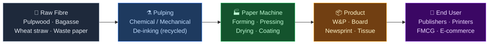
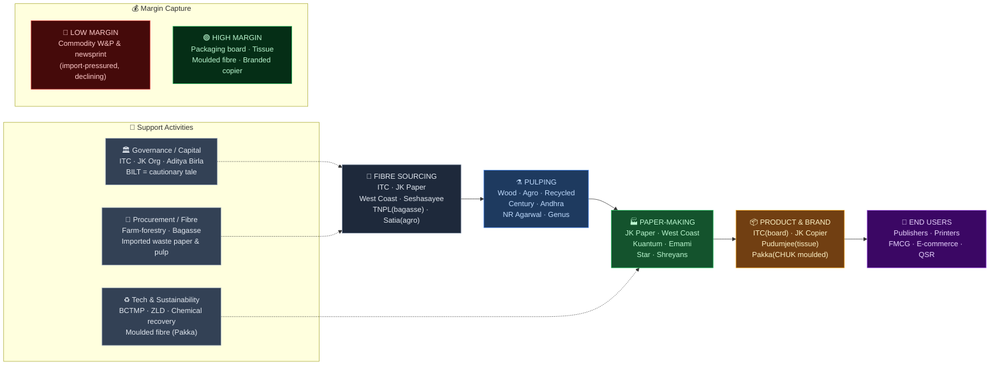

# Paper Industry — India Value Chain Analysis

*Investment-research lens · Data as of Q1 FY27 (July 2026). The industry sits at a classic capital-cycle inflection: cheap valuations and a domestic demand tailwind colliding with a global virgin-board oversupply and an import glut.*

---

## 0. Segment definition

**Boundary:** The manufacture of paper and paperboard in India — from raw fibre (wood/pulpwood, agro-residue, recovered/waste paper) through pulping and paper-making to the four end-product families: (1) **Writing & Printing (W&P)** paper, (2) **Paperboard / packaging board** (folding boxboard, duplex, kraft liner), (3) **Newsprint**, and (4) **Specialty & tissue** (including moulded-fibre/compostable tableware). Excludes downstream box/carton conversion (corrugation, printing) except where noted as adjacency.

**End customer & what they value most:** Segment-dependent. *Publishers/printers/education* (W&P) value price, brightness, consistency and availability. *FMCG & pharma brand-owners* (packaging board) value board strength, printability, food-grade safety and — increasingly — sustainability/recyclability. *E-commerce & QSR* (kraft, moulded fibre) value burst strength and plastic-substitution credentials. Across all: **cost competitiveness against imports** is now the decisive buyer variable.

**India's global position:** **Challenger, structurally cost-disadvantaged on fibre.** India is the world's fastest-growing large paper market (~8–10% demand CAGR, targeting ₹1 lakh crore by 2027) but is a *wood-scarce* geography — mills cannot own captive forests at scale, so per-tonne fibre cost runs above global peers who own plantations (Indonesia, Brazil, Scandinavia). India is a net importer at the margin, exposed to ASEAN-FTA zero-duty inflows.

---

## 0.5 Quick Scan — Investable Listed Companies

*Full 8-pass research completed. Rapid-prioritisation shortlist; detailed tables in §6.*

| Company | Ticker | Cap Bucket | Chain Stage | One-Line Investment Thesis | Coverage |
|---|---|---|---|---|---|
| ITC Ltd | NSE: ITC | Large | Paperboard (division) | India's #1 paperboard maker inside an FMCG major; the division's earnings power & possible value-unlock are buried in the conglomerate | Well-covered |
| JK Paper | NSE: JKPAPER | Mid (~₹7,500 Cr) | W&P + packaging board | Largest listed pure-play; BCTMP + corrugated-packaging integration completing FY26 lowers cost & shifts mix toward board — through-cycle earnings underappreciated at 1x book | Moderate |
| West Coast Paper | NSE: WSTCSTPAPR | Small (~₹3,842 Cr) | W&P + newsprint | Integrated, low-debt, deep cyclical value; owns Andhra Paper stake — sum-of-parts vs. depressed W&P sentiment | Moderate |
| Andhra Paper | NSE: ANDHRAPAP | Small | W&P + specialty | Ex-International Paper asset, now Bangur-controlled; efficient wood-based mill trading cheap on a cyclical earnings trough | Under-researched |
| Seshasayee Paper | NSE: SESHAPAPER | Small (~₹1,495 Cr) | W&P (integrated) | Most capital-efficient integrated mill, captive plantation & low debt; ~15x P/E understates balance-sheet quality | Under-researched |
| TNPL | NSE: TNPL | Small (~₹1,080 Cr) | W&P + board + tissue | Bagasse fibre = raw-material cost edge; 100 TPD tissue line commissioning Mar-2026 diversifies away from stressed W&P; 4.3x P/E | Under-researched |
| Pudumjee Paper | NSE: PDMJEPAPER | Small (~₹910 Cr) | Tissue / specialty | Highest ROCE in the sector (~20%); tissue demand structurally growing; asset-light-ish, under-followed | Under-researched |
| NR Agarwal Inds | NSE: NRAIL | Small (~₹826 Cr) | Recycled board (duplex) | Pure recycled-board play; e-commerce + plastic-substitution demand; leveraged to waste-paper spread | Under-researched |
| Kuantum Papers | NSE: KUANTUM | Small (~₹700 Cr) | Agro-based W&P | Agro-residue (wheat straw) cost model; capacity expansion; cheap on earnings | Under-researched |
| Emami Paper | NSE: EMAMIPAP | Small (~₹677 Cr) | Newsprint + board | Pivoting from declining newsprint to packaging board; 7x P/E, turnaround optionality | Under-researched |
| Satia Industries | NSE: SATIA | Small (~₹621 Cr) | Agro-based W&P | Agro-fibre, captive power, education/textbook demand chunky; expansion-led | Under-researched |
| Pakka Ltd | NSE: PAKKA | Micro (~₹342 Cr) | Moulded fibre / compostable | The sector's blue-ocean name: bagasse compostable tableware & flexibles riding the plastic ban; capacity doubling FY26 | Under-researched |
| Ruchira Papers | NSE: RUCHIRA | Micro (~₹327 Cr) | Kraft + W&P | Kraft-paper (packaging feedstock) + W&P; 7.4x P/E, 11% ROCE — deep value microcap | Undiscovered |
| Orient Paper | NSE: ORIENTPPR | Small | Tissue + W&P | CK Birla group; loss-making now (ROCE −4%) — pure turnaround / asset play | Under-researched |
| Genus Paper & Boards | NSE: GENUSPAPER | Micro (~₹324 Cr) | Recycled kraft | Recycled kraft + agri-based; microcap leverage to packaging demand | Undiscovered |

**Where the under-researched opportunity sits:** The richest mispricing is across the **Small- and Micro-cap pure-play mills** (Seshasayee, TNPL, Pudumjee, NR Agarwal, Kuantum, Ruchira) — most trade at 4–10x earnings, several below or near book, with 0–3 analysts, precisely because the sector screens as "commodity + import-threatened." The differentiation that matters — *fibre cost model* (captive wood vs. bagasse vs. agro-residue vs. recycled) and *product-mix shift toward packaging board / tissue / moulded fibre* — is invisible in a sector-level screen. **Pakka** is the one genuine growth/re-rating micro-cap (plastic-substitution structural demand) rather than a cyclical.

---

## 1. Value chain map — primary activities

### 1a. Inbound logistics → **Fibre sourcing (the decisive cost stage)**
Three competing fibre routes, each defining a company's cost structure and cyclicality:
- **Wood/pulpwood** (eucalyptus, subabul, casuarina) — sourced via *farm-forestry / social-forestry* programmes (mills give saplings to farmers, buy back wood). Best fibre quality, but India is wood-scarce → structurally higher cost than plantation-owning global peers.
- **Agro-residue** (bagasse, wheat straw, rice straw) — cheaper feedstock, sustainability angle, but higher effluent load and seasonal availability.
- **Recovered/waste paper** (OCC, ONP, mixed) — lowest capex, but India imports the bulk of quality waste paper (US/Europe), so cost swings with global RCF prices and the rupee.

**Cost/differentiation driver:** *This stage is where the whole game is won.* ~50–60% of cost is fibre + energy. Captive/farm-forestry wood integration (Seshasayee, JK Paper, West Coast, ITC-Bhadrachalam) and bagasse (TNPL, Pakka) are the durable cost moats.
**Players:** ITC, JK Paper, West Coast, Andhra, Seshasayee (wood-integrated); TNPL, Pakka (bagasse); Satia, Kuantum, Shreyans (agro/wheat-straw); NR Agarwal, Genus, Emami, Khanna Paper (unlisted) (recycled). **No PLI exists for paper.**

### 1b. Operations → **Pulping & paper-making**
Chemical (Kraft) or mechanical pulping, bleaching, then the paper machine (forming–pressing–drying–calendering), plus coating for board/coated paper. Highly capital- and energy-intensive; scale and machine efficiency drive unit cost. Modern additions: **BCTMP** (bleached chemi-thermo-mechanical pulp — JK Paper's Songadh line, H2 FY26) raises yield and lowers fibre cost.
**Cost/differentiation driver:** Machine scale, energy self-sufficiency (captive power/black-liquor recovery), and yield. Integrated mills with chemical recovery + captive power have the lowest cash cost.
**Players:** All mills; ITC (largest board capacity, Bhadrachalam/Kovai), JK Paper (6.5 lakh TPA), Century Pulp & Paper (Aditya Birla, Lalkua).

### 1c. Outbound logistics → **Distribution**
Bulk B2B dispatch of reels/sheets to converters, printers, publishers, FMCG plants; regional warehousing and dealer networks for W&P. Freight is meaningful (low value-density product), so mill location vs. demand cluster matters.
**Cost/differentiation driver:** Proximity to demand and ports (for exporters/importers of waste paper); dealer reach for W&P.
**Players:** All; West Coast (Dandeli, near western markets), TNPL (South).

### 1d. Marketing & sales → **Brand, grade mix & channel**
W&P is semi-commoditised (brands like JK Copier, Century have some pull in copier/office paper); packaging board is spec-and-relationship-driven (FMCG approvals); tissue is retail-brandable (Pudumjee's "Pudumjee", Orient's tissue). Moulded fibre is a solution-sell (Pakka's CHUK brand).
**Cost/differentiation driver:** In W&P, branded copier paper (JK Copier) earns a premium over commodity reels — the only real consumer-facing branding in the chain. In board, FMCG customer approvals create switching costs.
**Players:** JK Paper (JK Copier — India's leading office-paper brand), Century, ITC (Classmate/paperboard), Pakka (CHUK).

### 1e. Service → **Technical & sustainability support**
Grade customisation, food-safety certification (FSSAI/BRC for board), recyclability/compostability certification, and supply reliability. Rising importance as brands demand sustainable, certified substrates to replace plastic.
**Cost/differentiation driver:** Certification and consistency; a lock-in for board suppliers into FMCG chains.
**Players:** ITC, JK Paper, Pakka (compostability certifications).

---

## 2. Value chain map — support activities

### 2a. Firm infrastructure (governance, capital allocation)
Mostly promoter/family-group governed. **Strong, disciplined allocators:** ITC (professional), Seshasayee (conservative, low-debt), JK Organisation. **Groups present:** JK Organisation (JK Paper), Aditya Birla (Century Pulp & Paper), CK Birla (Orient Paper), S.K. Bangur (West Coast, Andhra), Emami, Trident (Rajinder Gupta). **Cautionary tale:** Ballarpur Industries (BILT, Avantha group) — once India's largest, destroyed by over-leverage, now in insolvency — the sector's defining capital-cycle lesson.

### 2b. HR management
Not a differentiator; process-industry labour. Effluent/environmental compliance skills and plantation-extension (farm-forestry) field teams are the specialised capabilities.

### 2c. Technology development
Incremental: energy efficiency, chemical recovery, water recycling (ZLD — zero liquid discharge), and higher-yield pulping (BCTMP). The genuine tech frontier is **moulded-fibre/compostable materials** (Pakka) and barrier coatings that replace plastic lamination. India is a technology follower in mainstream paper machinery (imported from Voith/Valmet/Andritz) but innovating at the sustainable-packaging edge.

### 2d. Procurement
Wood (farm-forestry contracts), imported waste paper, pulp (imported market pulp for non-integrated mills), coal/biomass energy, and chemicals (caustic soda, starch, coating pigments). **Imported market-pulp price and waste-paper price are the two swing procurement variables** that determine margins for non-integrated players.

**Conglomerate check:** Heavy conglomerate presence, which shapes the whole chain — **ITC** (paperboard leader, can cross-subsidise from FMCG, sets board pricing discipline), **Aditya Birla** (Century Pulp & Paper), **CK Birla** (Orient), **Trident** (paper + textiles), **JK Organisation**. This matters: pure-play mills compete against deep-balance-sheet groups, and ITC's dominance caps board pricing power for smaller players.

---

## 3. Five Forces + Capital Cycle analysis

### Part A — Five Forces

**Supplier power — MODERATE-to-HIGH.** The binding constraint of Indian paper. Wood is structurally scarce (no large captive forestry permitted), so pulpwood pricing sits with fragmented farmers and swings with agri cycles; quality waste paper is largely imported (US/EU price + FX exposure); market pulp is a global commodity. Energy (coal/biomass) adds volatility. Mills mitigate via farm-forestry and captive power, but the input side is a genuine, permanent disadvantage vs. plantation-owning global peers.

**Buyer power — MODERATE.** W&P buyers (printers, publishers, education/govt) are fragmented but price-sensitive and have imports as an outside option. Packaging-board buyers (FMCG majors) are large and concentrated, giving them real power — though food-safety approvals create some switching cost. The decisive shift: **imports have become the buyers' bargaining chip**, capping domestic pricing.

**Threat of new entrants — LOW domestically, HIGH via imports.** Greenfield entry is hard (high capex, water/pollution clearances, fibre access), so few domestic entrants. But zero-duty **ASEAN-FTA imports function as the entrant** — ASEAN paper/board imports grew ~37% CAGR over five years and +14% in H1 FY26, and China+Indonesia are adding ~24 lakh tonnes of new virgin-board capacity. The "new entrant" is a container ship, not a new mill.

**Threat of substitutes — BIFURCATED (this is the key nuance).** For **W&P and newsprint: HIGH and structural** — digitalisation permanently erodes newsprint and office-paper demand. For **packaging board, kraft and moulded fibre: paper IS the substitute** (for single-use plastic), so the plastic ban and sustainability shift are a *tailwind*, not a threat. The chain's future value is migrating from W&P → packaging/tissue/moulded fibre.

**Rivalry — HIGH.** Fragmented (~800 mills, ~57 listed), largely commoditised product, cyclical pricing, and now import competition on top. Consolidation is slow. Differentiation comes only from fibre-cost position and product mix, not product itself.

| Force | Intensity | Key Driver |
|---|---|---|
| Supplier power | **Moderate–High** | Wood scarcity; imported waste paper & pulp; energy volatility |
| Buyer power | **Moderate** | Fragmented W&P buyers but imports as outside option; concentrated FMCG board buyers |
| Threat of new entrants | **Low domestic / High imports** | ASEAN-FTA zero-duty imports = the real entrant |
| Threat of substitutes | **High (W&P) / Tailwind (board, moulded fibre)** | Digitalisation vs. plastic-substitution — opposite directions |
| Rivalry | **High** | Fragmented, commoditised, cyclical, import-pressured |

**Overall structural attractiveness: LOW-to-MEDIUM** — a commodity, cyclical, fibre-disadvantaged, import-exposed industry where only low-cost integrated players and those mix-shifted to packaging/tissue earn durable returns.

### Part B — Capital Cycle verdict

The industry is in a **margin-trough / depressed-sentiment phase with a bifurcated capital picture.** Globally it is *late-inflow*: China+Indonesia's ~24 lakh-tonne virgin-board build-out has created oversupply that is spilling into India as cheap imports, compressing domestic realisations and margins through FY25–26. Domestically, Indian mills have been *disciplined* (wood scarcity prevents reckless greenfield), and capital is now flowing selectively into the *right* pockets — packaging board, tissue, and BCTMP integration (JK Paper, TNPL, packaging-board expansions) — while W&P is being starved. Valuations are at multi-year lows (many mills at 4–10x P/E, some near book), which is the classic Chancellor set-up: **buy disciplined, integrated survivors when the sector is ignored and margins are at the floor — but time entry to the clearing of the import glut** (anti-dumping duties now landing help).

### Part C — Investor implication

The most structurally attractive stage right now is **the fibre-advantaged, integrated mill that is mix-shifting toward packaging board / tissue / moulded fibre** — it combines the lowest cash cost (surviving the import squeeze) with exposure to the growing, plastic-substitution end of demand. Concretely: JK Paper (board integration), TNPL (bagasse + new tissue), Seshasayee (captive wood, low debt), and Pakka (moulded fibre) fit best. **Stage to avoid:** non-integrated, pure-W&P/newsprint mills with imported-pulp dependence and no packaging pivot — they face the worst of both the import glut and structural digital substitution. **The single biggest risk that invalidates the thesis:** the anti-dumping/safeguard actions fail to stem imports (or the rupee/pulp move adversely) and the global virgin-board oversupply extends into FY27, keeping domestic realisations depressed for longer than the cheap valuations assume.

**Overall structural attractiveness: Low–Medium** — commodity, cyclical, fibre-disadvantaged, import-exposed.
**Capital cycle phase: Neutral → Outflow (margin trough)** — global oversupply spilling in, domestic sentiment/valuations depressed, capex disciplined and selective.
**Investor stance: Selective Accumulate** — accumulate low-cost integrated mills and the packaging/tissue/moulded-fibre pivots at trough valuations; avoid non-integrated pure-W&P mills.

---

## 4. Competitive Intensity & Consolidation

*(GVC framework skipped — India's paper chain is predominantly domestic; trade is a threat (imports) rather than an export value chain. Replaced with consolidation analysis.)*

- **Top 3 by capacity/value:** **ITC** (largest paperboard & specialty maker), **JK Paper** (largest listed pure-play W&P + board), and the **Aditya Birla / West Coast-Andhra / TNPL** tier. In paperboard specifically, ITC is the clear #1.
- **HHI: low (~400–700) — fragmented.** ~800 mills nationally and ~57 listed keep concentration low, though the *organised, wood-based W&P and board* sub-segment is more concentrated (top 5–6 mills hold the bulk of quality capacity).
- **Direction: slow consolidation, accelerated by imports and cost pressure.** Drivers: (1) fibre-cost and environmental-compliance economics favour scale and integration; (2) the import glut is squeezing sub-scale, non-integrated mills toward closure or sale (BILT's collapse being the extreme case); (3) demand mix-shift toward board/tissue rewards those who can fund conversion capex. JK Paper has been the active consolidator (Sirpur Paper acquisition earlier; corrugated-packaging bolt-ons — Horizon Packs, Securipax, Radhesham Wellpack).
- **Likely survivors in 5 years:** ITC (dominant board), JK Paper (integrated consolidator), West Coast/Andhra & Seshasayee (low-cost wood-integrated), TNPL (bagasse + tissue), and the sustainable-packaging specialist Pakka. Sub-scale, non-integrated, pure-W&P microcaps are the closure/acquisition candidates.

---

## 5. Key linkages & leverage points

1. **Fibre sourcing ↔ Operations cost (the master linkage).** Farm-forestry/plantation integration or bagasse access directly sets cash cost per tonne. Mills that coordinate agronomy (sapling supply, buy-back) with pulping economics own a structural cost moat imports can't easily undercut on landed-cost basis.
2. **Energy/chemical recovery ↔ Margin resilience.** Captive power + black-liquor chemical recovery de-risks the two most volatile cost lines; it's the difference between surviving and closing in a price trough.
3. **Product mix ↔ Demand trajectory.** The linkage between capex allocation (W&P vs. board vs. tissue) and where demand is actually growing determines whether a mill compounds or declines. Shifting a paper machine to board/tissue is the highest-value coordination decision management makes.
4. **Trade policy ↔ Domestic pricing.** Anti-dumping/safeguard duties and FTA terms directly set the price ceiling domestic mills can realise — an external linkage that can swing sector profitability overnight.
5. **Sustainability certification ↔ Customer lock-in.** Food-grade + compostability certification links the operations/tech stage to durable FMCG/QSR relationships, converting a commodity into a specified, switching-cost-protected product.

**Highest-leverage intervention:** **Securing a low-cost, secure fibre base (captive farm-forestry or bagasse) and using it to fund a mix-shift into packaging board / tissue / moulded fibre.** If one lever most improves value created and captured by Indian mills, it is converting the fibre-cost advantage into the *growing, plastic-substituting, import-resistant* end of the product spectrum — simultaneously escaping W&P's structural decline and the commodity board price war.

---

## 5.5 Upcoming catalysts & key triggers

| Catalyst / Trigger | Timeline | Companies Likely to Benefit |
|---|---|---|
| Anti-dumping duty on Indonesian virgin multi-layer paperboard ($261–376/MT, final findings Jun 2026) | FY27 | ITC, JK Paper, West Coast, Century (board makers) |
| JK Paper BCTMP mill (125,000 ADMT) commissioning, Songadh | H2 FY26 | JK Paper (lower fibre cost, higher board mix) |
| TNPL 100 TPD tissue machine commissioning (~₹340 Cr) | March 2026 | TNPL (mix-shift into growing tissue) |
| Pakka "Project Jagriti" capacity ~doubling (moulded fibre/compostables) | Late FY26 | Pakka |
| Plastic Waste Management rules tightening (single-use plastic ban enforcement, recycled-content mandates) | FY26–27 | Pakka, NR Agarwal, kraft/board makers |
| Wood-pulp & imported waste-paper price normalisation | FY26–27 | Non-integrated mills (NR Agarwal, Emami, Genus) |
| Education/textbook & election-cycle W&P demand + monsoon-linked agri (farm-forestry) wood cost | FY26–27 | Satia, Kuantum, Shreyans (agro/W&P) |
| Further safeguard-duty / FTA-review petitions by IPMA against ASEAN imports | FY27 | Whole domestic board & W&P complex |

---

## 6. Indian company landscape

*8-pass research protocol completed: Screener.in "Paper, Forest & Jute Products" sector sweep (60 companies), peer groups, IPO sweep (Pakka 2023 the most recent mainboard listing), SME check, sub-segment decomposition (wood-W&P / agro-W&P / recycled board / newsprint / tissue / moulded fibre), sector-index check (no dedicated Nifty paper index — smallcap/microcap universe), adjacency check (waste-paper recycling, corrugated packaging, conglomerate divisions), business-press sweep. Jute names in the same Screener class (Gloster, Cheviot, Ludlow) excluded as non-paper.*

### Listed companies — Paper & paperboard mills

| Stage | Company | Ticker | Cap Bucket | Revenue / Mkt Cap | PLI? | Coverage | Chain Position |
|---|---|---|---|---|---|---|---|
| Paperboard (division) | ITC Ltd | NSE: ITC | Large | Paperboards & Specialty Papers Div. of FMCG major | No | Well-covered | Leader (board) |
| W&P + board | JK Paper | NSE: JKPAPER | Mid | Mkt cap ~₹7,500 Cr | No | Moderate | Leader (pure-play) |
| W&P + newsprint | West Coast Paper Mills | NSE: WSTCSTPAPR | Small | Mkt cap ~₹3,842 Cr | No | Moderate | Challenger |
| W&P + specialty | Andhra Paper | NSE: ANDHRAPAP | Small | Mkt cap ~₹2,500–3,000 Cr* | No | Under-researched | Challenger |
| Pulp & paper (division) | Century Textiles & Inds (Century Pulp & Paper) | NSE: CENTURYTEX | Large | Paper is a division; group is RE-heavy | No | Well-covered | Challenger (board/tissue) |
| W&P (integrated) | Seshasayee Paper & Boards | NSE: SESHAPAPER | Small | Mkt cap ~₹1,495 Cr | No | Under-researched | Challenger |
| W&P + board + tissue | Tamil Nadu Newsprint (TNPL) | NSE: TNPL | Small | Mkt cap ~₹1,080 Cr | No | Under-researched | Challenger |
| Tissue / specialty | Pudumjee Paper Products | NSE: PDMJEPAPER | Small | Mkt cap ~₹910 Cr | No | Under-researched | Niche (tissue) |
| Recycled board (duplex) | NR Agarwal Industries | NSE: NRAIL | Small | Mkt cap ~₹826 Cr | No | Under-researched | Niche (recycled) |
| Agro-based W&P | Kuantum Papers | NSE: KUANTUM | Small | Mkt cap ~₹700 Cr | No | Under-researched | Niche |
| Newsprint + board | Emami Paper Mills | NSE: EMAMIPAP | Small | Mkt cap ~₹677 Cr | No | Under-researched | Niche |
| Agro-based W&P | Satia Industries | NSE: SATIA | Small | Mkt cap ~₹621 Cr | No | Under-researched | Niche |
| Tissue + W&P | Orient Paper & Industries | NSE: ORIENTPPR | Small | Mkt cap ~₹700 Cr*; loss-making (ROCE −4%) | No | Under-researched | Niche (turnaround) |
| Moulded fibre / compostable | Pakka Ltd | NSE: PAKKA | Micro | Mkt cap ~₹342 Cr | No | Under-researched | Emerging (blue ocean) |
| Kraft + W&P | Ruchira Papers | NSE: RUCHIRA | Micro | Mkt cap ~₹327 Cr | No | Undiscovered | Niche |
| Recycled kraft | Genus Paper & Boards | NSE: GENUSPAPER | Micro | Mkt cap ~₹324 Cr | No | Undiscovered | Niche |
| Agro-based W&P | Shree Ajit Pulp & Paper | BSE: 531889 | Micro | Mkt cap ~₹266 Cr | No | Undiscovered | Niche |
| W&P + kraft | Star Paper Mills | NSE: STARPAPER | Micro | Mkt cap ~₹235 Cr | No | Undiscovered | Niche |
| Agro-based W&P | Shreyans Industries | NSE: SHREYANS | Micro | Mkt cap ~₹200 Cr | No | Undiscovered | Niche |
| Recycled paper | Nikita Greentech Recycling | NSE SME (ticker unconfirmed) | Micro/SME | Mkt cap ~₹186 Cr | No | Undiscovered | Emerging |
| Paper (+ textiles) | Trident Ltd | NSE: TRIDENT | Mid | Agro-based W&P div. of textile major | No | Moderate | Challenger (paper div.) |

*Andhra Paper, Orient Paper caps indicative/cycle-sensitive.

### Unlisted / private companies

| Stage | Company | Type | Business Description | Scale | Notes |
|---|---|---|---|---|---|
| W&P + board + tissue | Century Pulp & Paper | Division (Aditya Birla) | Large integrated mill, Lalkua (Uttarakhand) | Large | Housed in listed Century Textiles (CENTURYTEX) |
| W&P + board | Ballarpur Industries (BILT) | Distressed (Avantha) | Once India's largest paper co.; over-leveraged | Was large | Insolvency/NCLT — capital-cycle cautionary tale |
| Recycled newsprint/W&P | Khanna Paper Mills | Private | Large recycled-paper mill, Amritsar (Punjab) | Large | Unlisted; among biggest single-location mills |
| W&P | Naini Papers | Private | Uttarakhand agro/wood W&P mill | Mid | Unlisted |
| Global pulp/board | Stora Enso, APP/Sinar Mas, APRIL | MNC | Global pulp & virgin-board suppliers/importers | Global | Source of import competition into India |
| Exited | International Paper | MNC (exited) | Sold APPM → now Andhra Paper | — | Signals MNC retreat from India paper |

### Notable companies — deeper notes

**JK Paper (NSE: JKPAPER)**
- **Stage in chain:** W&P + packaging board (largest listed pure-play)
- **Cap bucket:** Mid — Mkt cap ~₹7,500 Cr
- **Analyst coverage:** Moderate
- **What makes them interesting:** India's largest pure-play W&P + board maker (6.5 lakh TPA, three integrated mills), with the country's leading office-paper brand (JK Copier). It is actively transforming: a 125,000 ADMT BCTMP pulp line (Songadh, commissioning H2 FY26) lowers fibre cost, and a string of corrugated-packaging acquisitions (Horizon Packs, Securipax, Radhesham Wellpack) shifts mix toward the growing, import-resistant packaging end.
- **Key financials:** P/E ~27x on trough earnings (~₹7,500 Cr mkt cap); historically 18–22% EBITDA margins, strong FCF, moderate debt.
- **PLI beneficiary:** No
- **Watch factor:** BCTMP commissioning and ramp; packaging-segment revenue mix crossing a meaningful share.
- **Investment angle:** The market prices JK as a cyclical W&P commodity at a margin trough. It's underpricing two structural shifts: (1) BCTMP integration structurally lowers cash cost (fibre is 50%+ of cost), and (2) the corrugated-packaging build-out re-rates the mix toward secular-growth board and away from declining W&P. Neither is fully in consensus trough estimates; a normalising cycle plus mix-shift is a double lever off a ~1x-book base.

**TNPL — Tamil Nadu Newsprint & Papers (NSE: TNPL)**
- **Stage in chain:** W&P + packaging board + (new) tissue
- **Cap bucket:** Small — Mkt cap ~₹1,080 Cr
- **Analyst coverage:** Under-researched
- **What makes them interesting:** TN-government-promoted, and the only large mill built around **bagasse** (sugarcane residue) fibre — a genuine raw-material cost advantage over wood-based peers. A new 100 TPD tissue machine (~₹340 Cr, commissioning March 2026) diversifies into the fastest-growing, higher-margin paper segment.
- **Key financials:** P/E ~4.3x — among the cheapest in the sector; ROCE ~6.4% (cyclically depressed).
- **PLI beneficiary:** No
- **Watch factor:** Tissue-line commissioning and ramp; bagasse availability/pricing; PSU-governance discount.
- **Investment angle:** At 4.3x earnings, the market treats TNPL as a low-quality PSU commodity mill. It's ignoring the structural bagasse cost edge and the tissue pivot into a growing segment — a re-rating candidate if the tissue line executes and the W&P cycle turns. The PSU discount is the risk *and* the source of the cheapness.

**Pudumjee Paper Products (NSE: PDMJEPAPER)**
- **Stage in chain:** Tissue & specialty paper
- **Cap bucket:** Small — Mkt cap ~₹910 Cr
- **Analyst coverage:** Under-researched
- **What makes them interesting:** The sector's **highest ROCE (~20%)** — a standout in a low-return industry — driven by a focus on tissue and specialty grades rather than commodity W&P. Tissue demand (hygiene, HoReCa, retail) is one of the few structurally growing paper segments in India.
- **Key financials:** P/E ~9.7x, ROCE ~19.8% — high return at a low multiple.
- **PLI beneficiary:** No
- **Watch factor:** Tissue capacity additions and premiumisation; input (pulp) cost.
- **Investment angle:** The market lumps Pudumjee with cyclical W&P mills and prices it at ~10x, but its 20% ROCE and tissue-led mix make it a structurally higher-quality, growth-tilted business than the sector label implies. The mispricing is the sector-average multiple applied to a well-above-average-return, secularly-growing niche.

**Pakka Ltd (NSE: PAKKA, formerly Yash Pakka)**
- **Stage in chain:** Moulded fibre / compostable packaging (the blue-ocean edge)
- **Cap bucket:** Micro — Mkt cap ~₹342 Cr
- **Analyst coverage:** Under-researched
- **What makes them interesting:** A bagasse-based maker of compostable, fossil-free specialty paper and **moulded-fibre tableware** (brand: CHUK) — positioned squarely at the plastic-substitution frontier. It's the one name in the sector that is a *structural growth* story rather than a cyclical, riding single-use-plastic bans and FMCG/QSR sustainability mandates. Capacity is roughly doubling ("Project Jagriti", late FY26).
- **Key financials:** P/E ~18.9x, ROCE ~4.4% (expansion-phase, sub-scale); ~₹400 Cr revenue base.
- **PLI beneficiary:** No
- **Watch factor:** Project Jagriti commissioning and utilisation; moulded-fibre export traction; margin scaling with volume.
- **Investment angle:** Priced as a small specialty-paper mill, Pakka is really an option on India's plastic-substitution wave. If the capacity doubling fills and moulded-fibre margins scale (operating leverage off a sub-scale base), earnings could inflect sharply — a growth re-rating the market isn't underwriting at a micro-cap valuation. The risk: execution and margin proof at scale in a still-nascent category.

**West Coast Paper Mills (NSE: WSTCSTPAPR)**
- **Stage in chain:** W&P + newsprint (integrated)
- **Cap bucket:** Small — Mkt cap ~₹3,842 Cr
- **Analyst coverage:** Moderate
- **What makes them interesting:** A low-debt, integrated wood-based mill (Dandeli, Karnataka) with a conservative balance sheet — and it controls **Andhra Paper**, adding a sum-of-parts angle. Classic deep-cyclical value: strong through-cycle cash generation, currently de-rated on W&P weakness.
- **Key financials:** P/E ~25x on trough earnings; historically low leverage and healthy FCF.
- **PLI beneficiary:** No
- **Watch factor:** W&P realisation recovery; consolidated value of the Andhra Paper holding.
- **Investment angle:** The market prices West Coast on depressed spot W&P margins and ignores (a) the low-debt, integrated cost position that lets it survive the import squeeze and (b) the embedded Andhra Paper value. A cyclical turn plus SoP recognition is the twin lever, with downside cushioned by balance-sheet quality.

**Seshasayee Paper & Boards (NSE: SESHAPAPER)**
- **Stage in chain:** W&P (integrated, captive plantation)
- **Cap bucket:** Small — Mkt cap ~₹1,495 Cr
- **Analyst coverage:** Under-researched
- **What makes them interesting:** Widely regarded as the most **capital-efficient integrated mill** in India — captive plantation/farm-forestry, chemical recovery, captive power, and a famously conservative, low-debt balance sheet. It's the quality-survivor archetype in a low-return sector.
- **Key financials:** P/E ~15x; consistently positive ROCE and strong net cash / low debt through cycles.
- **PLI beneficiary:** No
- **Watch factor:** Wood cost (farm-forestry), W&P realisation, capex discipline.
- **Investment angle:** The market applies a commodity-mill multiple to what is effectively the sector's lowest-cost, best-balance-sheet operator. In a capital-cycle trough, the disciplined survivor with net cash is exactly what compounds as weaker mills close — an under-followed quality name whose durability isn't reflected in a mid-teens multiple.

---

## 7. Strategic insight & investment angles

### Part A — Non-obvious strategic insight

The consensus reads "Indian paper" as one cyclical, import-threatened commodity to avoid. Mapping the full chain reveals that **"paper" is actually two industries moving in opposite directions, hidden inside one sector label and one valuation multiple.** One is *Writing & Printing / newsprint* — in structural, digitalisation-driven decline, correctly de-rated. The other is *packaging board + tissue + moulded fibre* — in structural, plastic-substitution-driven *growth*, where paper is the substitute winning share from plastic. The market prices the whole sector on the declining half's economics, which means the mills quietly shifting capacity toward the growing half (JK Paper → board, TNPL → tissue, Pakka → moulded fibre) are being valued as if they're still pure W&P commodity players. Second non-obvious point: because India is *fibre-scarce*, the country will never win on cost against Indonesian/Brazilian plantation pulp — so the durable Indian edge is **not** low-cost commodity paper but *specified, certified, sustainable packaging* (food-grade board, compostable moulded fibre) where proximity, customisation, and plastic-substitution demand — not landed pulp cost — decide the winner. The import threat is real for commodity grades and largely irrelevant for the sustainable-packaging frontier.

### Part B — Blue Ocean opportunity

**Four Actions Framework applied to paper packaging:**
- **Eliminate:** Single-use plastic and styrofoam foodservice packaging (the thing being replaced).
- **Reduce:** Reliance on scarce, expensive wood pulp (use agri-residue/bagasse instead).
- **Raise:** Compostability, food-safety certification, and brand-level sustainability credentials.
- **Create:** A **branded, certified, compostable moulded-fibre and barrier-coated paper packaging category** for QSR, e-commerce, and FMCG — replacing plastic without the recyclability compromises of plastic-laminated paper.

**Value curve reconstructed:** From commodity paper competing on price/brightness → sustainable packaging *solutions* competing on compostability, certification, and plastic-replacement. **Specific non-customer:** the FMCG/QSR/e-commerce brand that today uses plastic or plastic-lined packaging and faces bans/ESG pressure but sees existing paper alternatives as inadequate. **Company attempting it:** **Pakka Ltd** (bagasse moulded-fibre tableware under CHUK, plus compostable flexibles) — most directly; ITC and JK Paper are pursuing sustainable board at the larger end. **Probability of success:** Moderate-to-good for Pakka — it has first-mover brand (CHUK), bagasse feedstock, compostability certifications, and a doubling of capacity underway; the risks are margin proof at scale and competition from larger board mills entering the category. It is a genuine market-creation move (new demand from plastic bans), not a re-labelling. **Investment implication:** Pakka is already in the listed table as a micro-cap; this optionality is what separates it from the cyclical mills, and it is not priced as a growth story.

### Part C — Top 3 priorities for a listed Indian firm seeking durable advantage

1. **Lock in a low-cost, secure fibre base.** Deepen farm-forestry/plantation integration (wood) or bagasse/agro-residue sourcing, plus captive power and chemical recovery — the only durable defence against both input volatility and import competition.
2. **Migrate capacity mix from W&P toward packaging board, tissue, and moulded fibre.** Allocate every incremental capex rupee to the structurally growing, plastic-substituting, import-resistant end of demand — and away from digitally-declining W&P/newsprint.
3. **Build certified sustainability as a moat.** Food-grade, recyclable, and compostable certifications that lock in FMCG/QSR customers convert a commodity into a specified product with switching costs — the one place Indian mills can out-compete cheap imports.

### Part D — Investment angle summary

- **JK Paper** — Priced as a trough-cycle W&P commodity; the market misses that BCTMP integration structurally lowers cash cost and the corrugated-packaging build-out shifts mix to secular-growth board. Double lever off ~1x book; BCTMP ramp is the catalyst.
- **TNPL** — At 4.3x earnings, dismissed as a low-quality PSU mill; ignores the bagasse cost edge and the March-2026 tissue-line pivot into a growing, higher-margin segment.
- **Pudumjee Paper** — Sector-average ~10x multiple applied to the highest-ROCE (~20%), tissue-led, structurally-growing niche business — a quality/mix mispricing.
- **Pakka** — Valued as a small specialty mill; is actually an under-priced option on India's plastic-substitution wave, with capacity doubling that could inflect earnings if moulded-fibre margins scale.
- **West Coast Paper** — Depressed on spot W&P margins; market overlooks the low-debt integrated cost position and the embedded Andhra Paper stake (sum-of-parts).
- **Seshasayee Paper** — Commodity-mill multiple on the sector's lowest-cost, net-cash, best-governed operator — the disciplined survivor that compounds as weaker mills close in the capital-cycle trough.

---

## 8. Value chain diagram (Mermaid)

---

## Sources

- Univest — Best Paper Stocks in India 2026
- Screener.in — Paper, Forest & Jute Products sector page & individual company pages
- IBEF — India's Paper & Packaging Industry
- Brickwork Research — Pulp & Paper Industry in India
- The Pulp & Paper Times — India recommends anti-dumping duty (USD 261–376/MT) on Indonesian virgin multi-layer paperboard (Jun 2026)
- Paperdesk — Imports of Paper & Paperboard from ASEAN surge 14% in H1FY26
- PrintWeek India — Fastest-growing Indian paper market facing import threats; Govt anti-dumping investigation on virgin paperboard
- Papermart — Top Paper Companies 2025; Yash Pakka profile
- Screener.in — Pakka Ltd company page

---

## Cross-Chain References

Companies in §6 that also appear in other value chain analyses saved in this folder:

| Company | Ticker | Also appears in | Note |
|---|---|---|---|
| NR Agarwal Industries | NSE: NRAIL | *Recycling Sector - Value Chain Analysis.md* | Named as a significant player in the **Paper recycling** sub-segment (wastepaper → recycled board) |
| TNPL | NSE: TNPL | *Recycling Sector - Value Chain Analysis.md* | Cited under Paper recycling sub-segment (bagasse + recovered fibre) |
| Trident Ltd | NSE: TRIDENT | *Textile and Apparel - Value Chain Analysis.md* | Trident is primarily a home-textile/yarn major (appears in Textile chain); its agro-based paper division places it in this chain too |
| Genus Paper & Boards / recycled-kraft names | NSE: GENUSPAPER | *Recycling Sector - Value Chain Analysis.md* | Recycled-paper sub-segment overlap (wastepaper-based board/kraft) |

*Potential future cross-references:* ITC would anchor a future **FMCG / Cigarettes / Consumer** value chain; the corrugated-box converters and flexible-packaging names would populate a dedicated **Packaging** value chain (Pakka, NR Agarwal, and the kraft makers would bridge into it).
