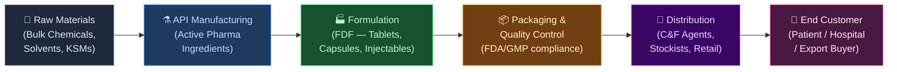

# INDIAN PHARMA SECTOR — Value Chain Analysis
*Date: June 28, 2026 | Framework: Porter's Value Chain + Five Forces + GVC + Linkages + Blue Ocean*

---

## 0. Segment Definition

**Precise boundary:** The full Indian pharmaceutical value chain — from active pharmaceutical ingredient (API) manufacturing through finished dose formulation (FDF), to domestic distribution and export. Includes both patented and generic drugs, OTC medicines, and biologics/biosimilars. Excludes medical devices and hospital services.

**Core product/service flow:**

**End customer and what they value most:**
- **Domestic patients:** Price affordability, brand trust, doctor recommendation
- **Export buyers (US/EU generics):** USFDA/EMA compliance, pricing, supply reliability
- **Regulated market buyers:** Dossier quality, bioequivalence data, patent non-infringement

**India's global position:** **Challenger → Leader in generics.** India is the world's largest supplier of generic medicines by volume (~20% of global exports), third-largest by volume of production. Called "pharmacy of the world." However, still a follower in innovator/patented drugs and a captive buyer of Chinese APIs (60–70% import dependence for key APIs).

---

## 1. Value Chain Map — Primary Activities

### Inbound Logistics
**What it involves:** Procurement of key starting materials (KSMs), intermediates, bulk chemicals, solvents from domestic and Chinese suppliers. Cold-chain management for biologics. Import clearance via customs.

**Key cost drivers:** API import costs (China-linked), solvent prices, energy for chemical synthesis. Differentiation: vertical integration (making own APIs), dual-sourcing strategies, PLI-backed domestic API parks.

**Key Indian players:**
- **Divi's Laboratories (NSE: DIVISLAB)** — largest API manufacturer; sources primarily domestic/captive
- **Aarti Industries (NSE: AARTIIND)** — upstream specialty chemicals → pharma intermediates
- **Laurus Labs (NSE: LAURUSLABS)** — backward-integrated into APIs for ARVs and other generics
- **Hikal Ltd (NSE: HIKAL)** — custom synthesis, pharma chemicals
- **BASF India (NSE: BASF)** — industrial chemicals for API synthesis

---

### Operations (API Manufacturing + Formulation)

**What it involves:** Two sub-layers:
1. **API Manufacturing** — multi-step chemical synthesis, fermentation, biotechnology
2. **Formulation (FDF)** — converting APIs into tablets, capsules, injectables, syrups; includes quality control, stability testing, regulatory filing

**Key cost drivers:** API synthesis complexity, energy, skilled chemists, plant efficiency. Differentiation: US FDA/EMA approval count, complex generics (injectables, peptides), NDDS (novel drug delivery systems).

**Key Indian players — APIs:**
- **Divi's Laboratories** — EBITDA margins ~35%; leader in off-patent API synthesis
- **Laurus Labs** — ARV APIs; expanding into CDMO
- **Suven Pharma (NSE: SUVENPHAR)** — CDMO focus, NCE intermediates
- **Neuland Laboratories (NSE: NEULANDLAB)** — complex APIs, CDMO
- **Solara Active Pharma Sciences (NSE: SOLARA)** — APIs, turnaround story

**Key Indian players — Formulation:**
- **Sun Pharmaceutical (NSE: SUNPHARMA)** — largest by mkt cap (~₹3.8L Cr); domestic + US speciality
- **Dr. Reddy's Laboratories (NSE: DRREDDY)** — strong US generics, PSAI (API) division
- **Cipla (NSE: CIPLA)** — domestic brand leader + respiratory speciality in US
- **Lupin (NSE: LUPIN)** — US generics + domestic branded formulations
- **Aurobindo Pharma (NSE: AUROPHARMA)** — backward integrated; highest US ANDA count
- **Zydus Lifesciences (NSE: ZYDUSLIFE)** — biosimilars + US generics
- **Alkem Laboratories (NSE: ALKEM)** — domestic prescription brand leader
- **Torrent Pharmaceuticals (NSE: TORNTPHARM)** — branded generics, Germany + Brazil
- **Mankind Pharma (NSE: MANKIND)** — OTC + prescription; largest domestic volumes

---

### Outbound Logistics

**What it involves:** Temperature-controlled warehousing, C&F (Clearing & Forwarding) agents in each state, stockists, retail distribution to ~850,000 chemist shops. Export freight (sea for generics, air for high-value injectables).

**Key cost drivers:** State GST compliance, cold-chain capex, last-mile penetration depth. Differentiation: speed-to-shelf for domestic launches, customs/documentation speed for exports.

**Key Indian players:**
- **Mahindra Logistics (NSE: MAHLOG)** — pharma-dedicated cold-chain trucking
- **Blue Dart (NSE: BLUEDART)** — express courier for high-value pharma
- **VRL Logistics (NSE: VRLLOG)** — pan-India surface freight for pharma
- **Snowman Logistics (NSE: SNOWMAN)** — dedicated cold-chain warehousing (Gateway Distriparks subsidiary)

---

### Marketing & Sales

**What it involves:** Medical representative (MR) force calling on doctors, hospital tender sales, e-commerce (PharmEasy/1mg/Netmeds), government procurement (PMBJP/Jan Aushadhi), export channel management (US distributors, EU tenders).

**Key cost drivers:** MR force (India's largest field force globally), trade scheme margins, advertising. Differentiation: brand equity with doctors, chronic therapy leadership, US FDA-approved plant count.

**Key Indian players:**
- **Sun Pharma** — largest MR force in India (~12,000 MRs)
- **Abbott India (NSE: ABBOTINDIA)** — premium branded generics, strong chronic focus
- **Pfizer India (NSE: PFIZER)** — patented + generic brands
- **Sanofi India (NSE: SANOFI)** — insulin + vaccines
- **PharmEasy (API Holdings)** — unlisted; B2C e-pharmacy
- **Tata 1mg (Tata Digital)** — subsidiary; e-pharmacy
- **Netmeds (Reliance Retail)** — subsidiary of RELIANCE

---

### Service (Post-Market)

**What it involves:** Pharmacovigilance, patient support programs, DAVA monitoring, medical affairs, regulatory compliance post-approval (PSUR, REMS in US). CROs for clinical trials.

**Key Indian players:**
- **Syneos Health India** (unlisted) — CRO services
- **IQVIA India** (unlisted) — pharma market intelligence + CRO
- **Syngene International (NSE: SYNGENE)** — contract research + manufacturing (Biocon subsidiary)
- **Hiranandani Healthcare** (unlisted) — clinical trials
- **Medgenesis Therapeutix** (unlisted) — rare disease post-market

---

## 2. Value Chain Map — Support Activities

### Firm Infrastructure
**Role:** Regulatory compliance (CDSCO, USFDA, EMA), corporate governance, financing (capital for FDA-approved plant upgrades), IP management. India's CDSCO (Central Drugs Standard Control Organisation) governs domestic drug approvals; USFDA oversees export quality.

**India-specific:** India's National Pharmaceutical Pricing Authority (NPPA) sets prices for ~900+ drugs under DPCO 2013, capping domestic margins. PLI Scheme for Pharmaceuticals (₹15,000 Cr outlay) incentivises bulk drug parks and KSM manufacturing.

**Institutions:** CDSCO, NPPA, Pharmexcil (export promotion), IDMA (Indian Drug Manufacturers Association), Bulk Drug Parks at Visakhapatnam (AP), Himachal Pradesh, Gujarat.

---

### HR Management
**Role:** India's strength — large pool of pharmacy graduates, organic chemists, regulatory scientists at globally competitive costs. MR force management is a critical operational capability.

**Strengths:** ~2 million pharmacy graduates; IITs/NIITs produce process chemists. Weakness: shortage of clinical pharmacologists, bioinformaticians, AI-drug discovery talent.

**Notable:** Manipal Academy, JSS College of Pharmacy, BITS Pilani (Pharma). Many Indian pharma companies run in-house regulatory training (USFDA GMP).

---

### Technology Development
**Role:** R&D for new chemical entities (NCEs), complex generics (peptides, long-acting injectables, biosimilars), NDDS, and process chemistry innovation (yield improvement, green chemistry).

**Key players:**
- **Sun Pharma** — R&D spend ~7% of revenue; speciality pipeline (Winlevi, Ilumya)
- **Dr. Reddy's** — complex generics, biosimilars
- **Biocon (NSE: BIOCON)** — biologics/biosimilars leader; Biocon Biologics (unlisted subsidiary)
- **Zydus Lifesciences** — first Indian NCE approval (Saroglitazar)
- **Aurobindo** — ANDAs factory (~500+ US approvals)

---

### Procurement
**Role:** API and intermediate sourcing — heavily China-dependent for KSMs (Vitamin B12, Penicillin, HCQ, Paracetamol intermediates). Solvent, excipient, and packaging procurement.

**Key leverage:** Domestic Bulk Drug Parks (PLI) aim to reduce China dependence. India imported ~₹27,000 Cr of drug intermediates (FY24), primarily from China.

**Notable:** Divi's, Aarti, Laurus — attempting backward integration. SEPC (Solvent Extractors Association) governs solvent trade.

---

## 3. Five Forces Analysis

**Supplier Power — MEDIUM-HIGH:** For formulation companies, API suppliers (especially Chinese) hold power for several KSMs where India has no domestic alternative. Within India, API manufacturers like Divi's have strong pricing power with innovators (custom synthesis). Excipient and packaging suppliers are fragmented → low power. The key risk: China supply disruption for APIs (seen in COVID-2020 paracetamol shortage).

**Buyer Power — MEDIUM:** In the domestic market, fragmented retail (chemists) and doctors (MR-influenced prescriptions) → low buyer power. However, hospital/institutional tenders and government (Jan Aushadhi) → HIGH buyer power. In the US, the PBM (Pharmacy Benefit Manager) concentration — 3 PBMs control ~80% of US prescription volume — gives buyers enormous power over Indian generics companies, compressing generic drug prices 5–10% annually.

**Threat of New Entrants — LOW-MEDIUM:** USFDA-approved manufacturing plants cost ₹300–600 Cr to set up; compliance journey takes 3–5 years. CDSCO domestic approval is easier but brand-building with MRs is expensive. Biosimilars require clinical trial investment (₹50–150 Cr per molecule). Barriers are high for exports; medium for domestic generics.

**Threat of Substitutes — LOW (domestic), MEDIUM (US):** In India, patent-protected drugs are substituted by branded generics once patent expires → government-mandated generic prescribing policy (National Medical Commission) pushing further generic substitution. In the US, channel substitution via biosimilars for biologics is accelerating (Humira biosimilar market opened 2023).

**Rivalry Intensity — HIGH:** India has 10,500+ pharma manufacturing units, 3,000+ pharma companies. Domestic market ₹2.1L Cr (FY24, AIOCD data) growing ~10% YoY but intensely competitive. US generics market: chronic price erosion. Top-10 players hold ~40% domestic share → still fragmented. Consolidation happening through acquisitions (Sun-Ranbaxy, Dr. Reddy's-Cidla).

| Force | Rating |
|---|---|
| Supplier Power | Medium-High |
| Buyer Power | Medium |
| Threat of New Entrants | Low-Medium |
| Threat of Substitutes | Low-Medium |
| Rivalry Intensity | High |

**Overall Attractiveness: MEDIUM.** Formulation export to regulated markets offers structural tailwinds (US generic pricing stabilising, biosimilar opportunity), but domestic price controls and US generic price erosion cap returns. API manufacturing (Divi's model) offers the highest structural attractiveness — Medium-High.

---

## 4. GVC Governance & India's Position

**Lead firms (global):** Pfizer, Novartis, AstraZeneca, Johnson & Johnson (set standards, IP, and control access to innovator molecules). In generics: Teva (Israel), Mylan/Viatris (US). In biosimilars: Amgen, Samsung Bioepis.

**Lead firms (Indian):** Sun Pharma (domestic market governance), Dr. Reddy's (US generic governance), Divi's (API governance for innovators — exclusive synthesis partnerships), Biocon Biologics (biosimilar GVC).

**Governance type: CAPTIVE (for innovator APIs) + MODULAR (for generics).** Indian API manufacturers working for innovator companies are in captive relationships — Divi's manufactures APIs exclusively for specific innovators under long-term contracts with high switching costs. For generic formulations, the US generics market is modular — Indian companies supply standardised ANDAs to US distributors/PBMs with low relationship specificity.

**Value capture map:**

| Stage | Value Captured | Where |
|---|---|---|
| Drug Discovery / IP | 60–70% of product lifetime value | US/EU innovators |
| API custom synthesis | 30–40% EBITDA margin | India (Divi's model) |
| Formulation (generics) | 15–20% EBITDA margin | India (Sun, DRL) |
| US Distribution/PBM | High — via rebates and formulary control | US PBMs |
| Domestic retail | Low — price-controlled | India |

**India's upgrade trajectory:**
- **Process upgrading:** ✅ Done — India world-class in process chemistry
- **Product upgrading:** 🔄 In progress — moving to complex generics, biosimilars (Zydus, Biocon)
- **Functional upgrading:** 🔄 In progress — CDMO (Syngene, Divi's CDMO), clinical trials (CRO)
- **Chain upgrading:** ❌ Nascent — virtually no Indian NCE in global commercial market yet (Zydus Saroglitazar is a domestic NCE)

---

## 5. Key Linkages & Leverage Points

1. **API → Formulation linkage:** Backward integration into APIs (Dr. Reddy's PSAI, Aurobindo) creates cost + supply security advantage. Companies without API integration are vulnerable to China supply shocks.

2. **Regulatory compliance → Market access linkage:** A single USFDA warning letter (import alert) can destroy years of export revenue. Sun Pharma lost ~$500M in US revenue after Halol plant issues (2014–16). Compliance is not a cost — it is a market access gate.

3. **R&D → Complex generic pipeline linkage:** Companies that invested in complex injectables and dermatology (Sun Pharma Speciality) now earn 4–5x the margins of plain oral generics. R&D ROI here is the chain's highest leverage.

4. **Doctor prescription → Brand equity linkage:** In India's branded generic market, the prescribing doctor is the de facto buyer. MR field force productivity and brand recall with doctors directly determines domestic market share. Alkem, Mankind, Abbott have built durable moats here.

5. **China API dependence → Supply chain resilience:** The biggest systemic vulnerability. India's API import from China: ~60% for antibiotics, ~70% for vitamins. PLI-backed domestic API parks in AP and HP are the structural fix — but will take 5–7 years to meaningfully reduce dependence.

**Highest-leverage intervention:** Building a world-class domestic API manufacturing base (PLI Bulk Drug Parks) — this single intervention reduces input cost volatility, improves margins, reduces geopolitical risk, and enables India to move from "pharmacy of the world" to "full-stack pharma powerhouse."

---

## 6. Indian Company Landscape

### Listed Companies

| Value Chain Stage | Company Name | Listed? | Exchange & Ticker | Business Description | Approx. Revenue / Mkt Cap | Position |
|---|---|---|---|---|---|---|
| Raw Materials / Chemicals | Aarti Industries | Yes | NSE: AARTIIND | Pharma intermediates, specialty chemicals | ₹6,800 Cr revenue (FY24) | Leader |
| Raw Materials | Hikal Ltd | Yes | NSE: HIKAL | Pharmaceutical chemicals, CDMO | ₹1,600 Cr revenue (FY24) | Niche |
| API Manufacturing | Divi's Laboratories | Yes | NSE: DIVISLAB | Custom API synthesis for global innovators | ₹7,700 Cr revenue (FY24); Mkt cap ~₹1.1L Cr | Leader |
| API Manufacturing | Laurus Labs | Yes | NSE: LAURUSLABS | ARV APIs + CDMO + formulations | ₹5,000 Cr revenue (FY24) | Challenger |
| API Manufacturing | Neuland Laboratories | Yes | NSE: NEULANDLAB | Complex APIs, CDMO | ₹1,600 Cr revenue (FY24) | Niche |
| API Manufacturing | Solara Active Pharma | Yes | NSE: SOLARA | APIs including Ibuprofen, Ranitidine | ₹1,100 Cr revenue (FY24) | Niche |
| Formulation | Sun Pharmaceutical | Yes | NSE: SUNPHARMA | Largest Indian pharma; domestic + US speciality | ₹47,000 Cr revenue (FY24); Mkt cap ~₹3.8L Cr | Leader |
| Formulation | Dr. Reddy's Laboratories | Yes | NSE: DRREDDY | US generics + branded generics + PSAI | ₹27,800 Cr revenue (FY24); Mkt cap ~₹1.1L Cr | Leader |
| Formulation | Cipla | Yes | NSE: CIPLA | Branded generics, respiratory, US inhalation | ₹25,800 Cr revenue (FY24); Mkt cap ~₹1.1L Cr | Leader |
| Formulation | Lupin | Yes | NSE: LUPIN | US generics + domestic brands + biosimilars | ₹21,500 Cr revenue (FY24) | Leader |
| Formulation | Aurobindo Pharma | Yes | NSE: AUROPHARMA | Backward integrated; US injectables | ₹28,500 Cr revenue (FY24) | Leader |
| Formulation | Zydus Lifesciences | Yes | NSE: ZYDUSLIFE | Biosimilars + US generics + NCE | ₹19,200 Cr revenue (FY24) | Leader |
| Formulation | Alkem Laboratories | Yes | NSE: ALKEM | Domestic branded generics; anti-infectives | ₹12,500 Cr revenue (FY24) | Leader |
| Formulation | Torrent Pharmaceuticals | Yes | NSE: TORNTPHARM | Branded generics, Germany, Brazil, chronic | ₹10,500 Cr revenue (FY24) | Leader |
| Formulation | Mankind Pharma | Yes | NSE: MANKIND | Domestic OTC + prescription; highest volume | ₹10,200 Cr revenue (FY24) | Leader |
| Formulation | Abbott India | Yes | NSE: ABBOTINDIA | Premium branded generics, chronic therapy | ₹6,200 Cr revenue (FY24) | Leader |
| Biologics/Biosimilars | Biocon | Yes | NSE: BIOCON | Biologics, biosimilars, CDMO (Syngene parent) | ₹15,000 Cr revenue (FY24) | Leader |
| CDMO / CRO | Syngene International | Yes | NSE: SYNGENE | Contract research + manufacturing (Biocon sub) | ₹3,300 Cr revenue (FY24) | Leader |
| Cold-chain Logistics | Snowman Logistics | Yes | NSE: SNOWMAN | Dedicated cold-chain warehousing | ₹370 Cr revenue (FY24) | Niche |
| Marketing / MNC | Pfizer India | Yes | NSE: PFIZER | Patented + off-patent brands, hospital focus | ₹2,500 Cr revenue (FY24) | Niche |
| Marketing / MNC | Sanofi India | Yes | NSE: SANOFI | Insulin, vaccines, OTC | ₹2,900 Cr revenue (FY24) | Niche |

### Unlisted / Private Companies

| Value Chain Stage | Company Name | Listed? | Business Description | Notes |
|---|---|---|---|---|
| E-pharmacy | PharmEasy (API Holdings) | No | B2C e-pharmacy, diagnostic aggregator | Unicorn; IPO withdrawn; loss-making |
| E-pharmacy | Tata 1mg | No | E-pharmacy + diagnostics (Tata Digital sub) | Subsidiary of Tata Digital |
| E-pharmacy | Netmeds | No | E-pharmacy (Reliance Retail subsidiary) | Acquired by Reliance in 2020 |
| Distribution | MedPlus Health | Yes | NSE: MEDPLUS | Pharmacy retail chain (South India focus) | ₹4,200 Cr revenue (FY24) |
| Bulk Drug Park | APITCO (Andhra Pradesh) | No | Government API park operator | PSU; AP Bulk Drug Park, Visakhapatnam |
| CRO | IQVIA India | No | Market research + CRO services | Subsidiary of NYSE: IQV |

### Notable companies — deeper notes

**Divi's Laboratories (DIVISLAB)**
- Stage in chain: API Manufacturing
- What makes them interesting: Pure-play API manufacturer with innovator relationships — Divi's synthesises APIs for 7 of the top-10 global pharma companies under exclusive long-term contracts. This is a captive GVC relationship with extremely high switching costs. Their Kakinada plant expansion is adding 30% capacity. EBITDA margins historically 35%+ — best in class globally for API companies of this scale.
- Key financials: Revenue ₹7,700 Cr FY24; EBITDA margin ~33%; Mkt cap ~₹1.1L Cr
- Watch factor: China API competition on cost, and USFDA scrutiny on any new plants

**Sun Pharmaceutical (SUNPHARMA)**
- Stage in chain: Formulation + Speciality
- What makes them interesting: Transformed from a pure Indian branded-generics player to a global speciality pharma company post-Ranbaxy acquisition. US speciality portfolio (Ilumya for psoriasis, Winlevi for acne) now generates >$500M annual revenue with 60%+ gross margins vs 40% for generics. This is the most significant "chain upgrading" example in Indian pharma.
- Key financials: Revenue ₹47,000 Cr FY24; EBITDA margin ~27%; Mkt cap ~₹3.8L Cr (Nifty 50)
- Watch factor: Success of speciality pipeline ramp-up in US; Odomzo/MM-II launches

**Biocon (BIOCON) + Biocon Biologics (unlisted)**
- Stage in chain: Biologics / Biosimilars
- What makes them interesting: India's only company with a credible global biosimilar play. Biocon Biologics (carved out as a separate entity, seeking IPO) has commercialised Semglee (insulin glargine) in the US — India's first biosimilar approved and marketed in the US. Partnership with Viatris (formerly Mylan) for global biosimilar commercialisation.
- Key financials: Biocon consolidated revenue ₹15,000 Cr FY24; Biocon Biologics revenue ~₹5,500 Cr
- Watch factor: Biocon Biologics IPO timeline; US biosimilar pricing pressure from multiple entrants

**Mankind Pharma (MANKIND)**
- Stage in chain: Formulation / Marketing
- What makes them interesting: Built India's largest prescription volume franchise by targeting sub-urban and rural India (Tier 2–4 cities) with affordable branded generics. Acquired Panacea Biotec's consumer healthcare division and BSV (Bharat Serums and Vaccines) for ₹13,630 Cr in FY25 — transforming it into vaccines + consumer OTC. Recently listed (2023).
- Key financials: Revenue ₹10,200 Cr FY24; EBITDA margin ~22%; Mkt cap ~₹85,000 Cr
- Watch factor: BSV integration (vaccines is a new capability); rural distribution moat sustainability

---

## 7. Strategic Insight

**Non-obvious insight:** The Indian pharma value chain's most durable moat is not manufacturing efficiency (China is competitive) or ANDA count (commoditised), but **regulatory trust accumulated over decades with the USFDA.** Companies like Divi's, Sun, and Dr. Reddy's have invested ₹1,000s of Cr in plant compliance, quality systems, and regulatory relationships. This trust is a non-replicable intangible that Chinese manufacturers have systematically failed to build despite cost advantages — explaining why China's share in US generics has barely moved despite being cheaper at the API level. Indian companies should lean into this trust as their primary strategic asset.

**Blue Ocean opportunity (Four Actions Framework):**
- **Eliminate:** Dependence on US generic drug price discovery (pure commodity generics where price erosion is -10% annually)
- **Reduce:** MR field force for commoditised off-patent drugs in India (digital prescription platforms can serve this at 1/10th cost)
- **Raise:** Investment in clinical data generation for complex generics and 505(b)(2) speciality drugs where India has no NDA holder yet
- **Create:** India as a global CDMO hub — comparable to Samsung Biologics in Korea. India has the chemistry talent, the cost base, and the regulatory trust — but no large-scale CDMO with Lonza/Samsung-scale capacity. Divi's and Syngene are building toward this but remain sub-scale globally.

**Top 3 priorities for durable advantage:**
1. **Build CDMO capabilities at global scale** — India should target $10Bn in CDMO revenues by 2030 (currently ~$2Bn); this means Divi's, Syngene, Laurus investing in biologics CDMO manufacturing
2. **Eliminate China API dependence for top-50 molecules** — PLI Bulk Drug Parks must be operationalised; the geopolitical risk is existential
3. **Move to speciality/biosimilars pipeline** — invest ₹500–1,000 Cr per molecule in clinical trials for biosimilar launches in US (Humira market alone is $20Bn — India's share is <2% currently)

---

## 8. Value Chain Diagram

```mermaid
flowchart LR
    subgraph SUPPORT["⚙️ Support Activities"]
        direction TB
        FI["🏛️ Firm Infrastructure\nCDSCO · NPPA · USFDA\nPLI Bulk Drug Parks\nPharmexcil"]
        HR["👥 HR Management\nPharmacy graduates\n2M+ pool; IIT chemists\nMR force mgmt"]
        TD["🔬 Technology Development\nBiocon Biologics · Zydus NCE\nSun Speciality R&D\nSyngene CDMO"]
        PR["📦 Procurement\nChina KSM imports\nAarti · Hikal\nDomestic API Parks (PLI)"]
    end

    subgraph PRIMARY["🔄 Primary Activities"]
        direction LR
        IL["📥 Inbound Logistics\n---\n• Aarti Industries\n• Hikal Ltd\n• BASF India\n• Import from China"]
        OP["⚙️ API + Formulation\n---\n• Divi's Labs (API)\n• Laurus Labs (API)\n• Sun Pharma (FDF)\n• Dr. Reddy's (FDF)\n• Aurobindo (FDF)\n• Biocon (Biologics)"]
        OL["📤 Outbound Logistics\n---\n• Blue Dart\n• Snowman Logistics\n• Mahindra Logistics\n• VRL Logistics"]
        MS["📣 Marketing & Sales\n---\n• Sun Pharma MR force\n• Mankind Pharma\n• Cipla / Alkem\n• PharmEasy / 1mg\n• Tata Netmeds"]
        SV["🔧 Service\n---\n• Syngene (CRO)\n• IQVIA India\n• Pharmacovigilance\n• Medical Affairs"]
    end

    IL --> OP --> OL --> MS --> SV

    SUPPORT -.-> IL
    SUPPORT -.-> OP
    SUPPORT -.-> OL
    SUPPORT -.-> MS
    SUPPORT -.-> SV

    subgraph MARGIN["💰 Margin Capture"]
        direction TB
        M1["Custom API synthesis\n30–35% EBITDA\n(Divi's model)"]
        M2["US Speciality Pharma\n25–30% EBITDA\n(Sun model)"]
        M3["Domestic Generics\n18–22% EBITDA"]
        M4["Value Destroyed:\nUS PBM rebates\nIndia DPCO price caps"]
    end

    OP --> MARGIN

    style IL fill:#1e3a5f,stroke:#3b82f6,color:#bfdbfe
    style OP fill:#14532d,stroke:#22c55e,color:#bbf7d0
    style OL fill:#713f12,stroke:#f59e0b,color:#fef3c7
    style MS fill:#831843,stroke:#ec4899,color:#fce7f3
    style SV fill:#3b0764,stroke:#a855f7,color:#e9d5ff
    style SUPPORT fill:#0f172a,stroke:#475569,color:#cbd5e1
    style PRIMARY fill:#0f172a,stroke:#475569,color:#cbd5e1
    style FI fill:#1e293b,stroke:#64748b,color:#e2e8f0
    style HR fill:#1e293b,stroke:#64748b,color:#e2e8f0
    style TD fill:#1e293b,stroke:#64748b,color:#e2e8f0
    style PR fill:#1e293b,stroke:#64748b,color:#e2e8f0
    style MARGIN fill:#0f172a,stroke:#f59e0b,color:#fef3c7
```

