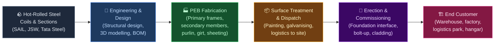
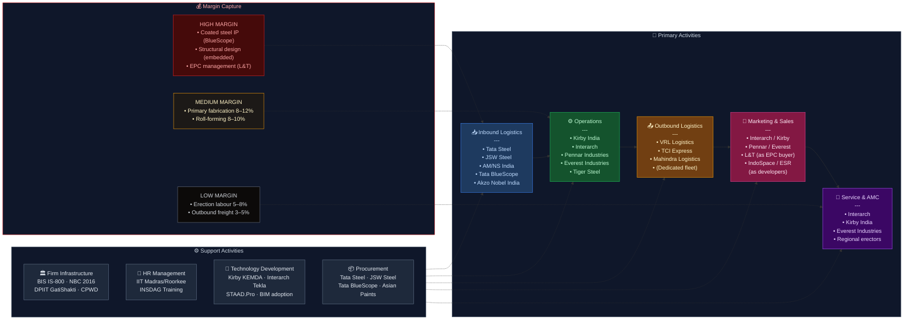

# Pre-Engineered Buildings (PEB) — Value Chain Analysis (India)

---

## 0. Segment Definition

**Precise boundary:** This analysis covers the **Pre-Engineered Buildings (PEB) segment in India** — the design, fabrication, supply, and erection of steel-framed building systems where the structural components (primary frames, secondary members, roofing, wall cladding, accessories) are engineered, manufactured in a factory, and assembled on-site. It includes industrial sheds, warehouses, logistics parks, cold storage structures, aircraft hangars, commercial buildings, sports facilities, and modular buildings. It excludes conventional RCC construction, structural steel fabrication for bridges/infrastructure, and pure civil works.

**Core product/service flow:**

**End customers and what they value most:**

| Customer Segment | Primary Value Driver |
|---|---|
| Warehousing & logistics (3PLs, e-commerce) | Speed of construction, clear span, cost/sqft |
| Industrial (auto, FMCG, pharma, engineering) | Clear span flexibility, fire rating, customisation |
| Cold storage / food processing | Insulation (PUF/EPS panels), vapour barrier, hygiene |
| Aviation (hangars) | Extra-wide clear span (60–100m), height, wind load |
| Data centres | Floor load, EMI shielding, precise temp control |
| Real estate / commercial | Aesthetics, LEED compliance, fast delivery |

**India's global position: Challenger (domestic) / Nascent (export)**
India is the world's **3rd-largest PEB market** by volume after the US and China. The domestic PEB market was estimated at ~₹18,000–20,000 Cr in FY24 and is growing at 12–15% CAGR, driven by warehousing, PLI-linked manufacturing capex, and the National Logistics Policy. Indian PEB manufacturers export to the Middle East, Southeast Asia, and Africa — but export share is low relative to market size (~8–10% of revenues for leading players).

---

## 1. Value Chain Map — Primary Activities

### 1.1 Inbound Logistics

**What it involves:** Procurement of hot-rolled (HR) coils and plates (the dominant raw material — steel is 60–70% of PEB input cost), cold-rolled (CR) sheets for cladding, zinc for galvanising, primer and finishing paints, fasteners (self-drilling screws, anchor bolts), insulation materials (PUF panels, EPS, glasswool), and accessories (skylights, ridge vents, gutters, downspouts, doors/windows). Steel is typically procured directly from primary mills or through steel service centres.

**Cost/differentiation drivers:**
- **Steel price volatility** is the #1 P&L risk — HR coil prices swung ₹40,000–72,000/tonne between FY21–FY23; firms with hedging capability or backward integration have structural advantage
- **Procurement scale** — large players (Interarch, Kirby, Pennar) negotiate 3–5% better rates vs smaller fabricators
- **Steel grade mix** — use of higher-strength steel (Fe 550, Fe 600) reduces tonnage per sqm (material efficiency), a key design differentiator
- **Vendor managed inventory (VMI)** with steel mills reduces working capital for large players
- **Import dependency** for specialty steels: Galvalume/ZINCALUME coated steel for roofing (Tata BlueScope Steel is the dominant supplier in India)

**Indian companies active here:**
- **Tata Steel (NSE: TATASTEEL)** — HR coils, structural sections; preferred supplier to most PEB majors
- **JSW Steel (NSE: JSWSTEEL)** — HR coils, CR sheets; competitive with Tata on price
- **SAIL (NSE: SAIL)** — HR plates and sections; less consistent quality perception vs private mills
- **Tata BlueScope Steel (unlisted, JV)** — Galvalume/Colorbond coated steel for roof/wall sheeting; near-monopoly in premium coated steel for PEB
- **AM/NS India (unlisted, ArcelorMittal-NSSMC JV)** — HR coils
- **Steel service centres:** Shree Steel, Mahavir Steel, JSW One Platforms — slit and cut-to-length service

---

### 1.2 Operations (PEB Fabrication)

**What it involves:** Engineering drawings (from design team) are converted into CNC-controlled cutting, drilling, welding, and assembly of:
- **Primary structural frames:** Built-up I-sections (tapered or straight) welded from HR plates using submerged arc welding (SAW) — the heaviest, most capital-intensive component
- **Secondary members:** Purlins, girts, eave struts (cold-formed Z/C sections from CR coils using roll-forming machines)
- **Roof & wall sheeting:** Single-skin or insulated panels (trapezoidal profile, standing seam) roll-formed from Galvalume/coated coils
- **Accessories:** Ridge caps, flashings, gutters, trim, fasteners (some sourced, some in-house)

**Cost/differentiation drivers:**
- **CNC automation level** — determines throughput, wastage, and dimensional accuracy; leading plants achieve <2% steel wastage vs 5–8% at smaller yards
- **SAW welding line capacity** — primary frame output capacity is the manufacturing bottleneck
- **Roll-forming machine variety** — breadth of purlin/sheeting profiles producible determines product range
- **Factory footprint** — optimal PEB plants are 10–15 acres with covered fabrication; proximity to steel mills (Gujarat, Maharashtra, Karnataka clusters) reduces freight
- **ISO 9001 and IS 800** compliance — mandatory for credibility with institutional buyers

**Indian companies active here:**
- **Interarch Building Products (NSE: INTERARCH)** — Listed July 2024; ₹1,265 Cr revenue FY24; plants at Kichha (Uttarakhand) and Srikalahasti (AP); EBITDA margin ~10%
- **Pennar Industries (NSE: PENNARIND)** — ₹3,400 Cr revenue FY24 (group); PEB division ~₹900 Cr; Hyderabad; diversified steel processor
- **Everest Industries (NSE: EVERESTIND)** — ₹1,800 Cr revenue FY24; PEB + building products; Roorkee plant
- **Kirby Building Systems India (unlisted)** — Subsidiary of Kirby Building Systems (Kuwait); Hyderabad; India's largest PEB plant by capacity (~150,000 MTPA); supplies across India and exports to Middle East
- **Tiger Steel Engineering (unlisted)** — Pune; significant mid-tier player
- **Lloyd Insulations (unlisted)** — specialises in insulated panel systems (cold storage)
- **Multicolor Steels (unlisted)** — Gujarat; roofing and walling specialist
- **Shah Pre-Fab (unlisted)** — Ahmedabad; mid-market warehousing focus
- **Richa Industries (NSE: RICHA)** — Chandigarh; PEB + tents; smallcap listed
- **Bajaj Steel Industries (unlisted)** — Nagpur; agri-processing + PEB structures

---

### 1.3 Outbound Logistics

**What it involves:** Finished fabricated components (primary frames, purlins, sheeting, accessories) are tagged, bundled, and dispatched from the factory to the construction site. A typical 5,000 sqm warehouse requires 10–20 truck loads. Components are sequenced for erection order (foundation bolts first, columns next, rafters, then purlins and sheeting) to minimise on-site handling.

**Cost/differentiation drivers:**
- **Freight cost** — typically 3–5% of project cost; PEB's lightweight advantage vs RCC reduces freight significantly (PEB: 25–35 kg/sqm vs RCC: 250–400 kg/sqm)
- **Just-in-time sequencing** — sites have minimal storage space; erection delays from mis-sequenced delivery are costly
- **Erection supervision** — most PEB companies provide supervision alongside supply; bundled logistics+supervision is the norm
- **Export packaging** — sea-worthy crating and anti-corrosion wrapping for Middle East/Africa exports

**Key players/logistics partners:**
- **VRL Logistics (NSE: VRLLOG)** — preferred freight partner for many PEB players in Deccan region
- **TCI Express (NSE: TCIEXP)**, **Mahindra Logistics (NSE: MAHLOG)** — used for smaller loads
- Most large PEB companies manage outbound with dedicated fleet or long-term 3PL contracts

---

### 1.4 Marketing & Sales

**What it involves:** PEB is predominantly a **B2B, project-based, relationship-driven** sales model. Key channels:
- **Direct sales to end-users** (large industrials, 3PLs, e-commerce companies — Amazon, Flipkart, Delhivery, DHL, FM Logistic have all procured PEB warehouses)
- **Channel through architects/PMCs** (Project Management Consultants) — specifiers who recommend PEB vs RCC
- **EPC contractors** (L&T Construction, Shapoorji Pallonji, Capacit'e Infraprojects) — who sub-contract PEB supply to specialists
- **Real estate developers** (Embassy Industrial Parks, IndoSpace, ESR, Welspun One) — who build warehousing parks and buy PEB in bulk

**Cost/differentiation drivers:**
- **Design-sell capability** — the ability to offer a complete structural design and 3D visualisation as part of the sales pitch drives win rates
- **Reference project portfolio** — institutional buyers (especially MNCs) demand a track record in similar project types
- **Relationship with government** — CPWD, railways, defence estate, HAL are significant buyers of PEB structures
- **Speed of quotation** — in competitive tenders, a 48-hour detailed quote (vs 2 weeks for conventional structure) is a competitive advantage

**Key Indian players:**
- **Interarch** — strongest brand recognition among institutional buyers; preferred vendor for MNC manufacturing clients
- **Kirby India** — dominates large-format industrial and power sector
- **Pennar** — strong in Telangana/AP industrial corridor
- **Everest** — known for agri, rural, and smaller commercial projects

---

### 1.5 Service (After-Sales, O&M, Extensions)

**What it involves:** PEB structures have a design life of 25–40 years. Post-delivery services include:
- **Erection supervision** (typically bundled in supply contract; lasts 4–16 weeks)
- **Warranty management** — 1-year structural defect warranty; 10–20 year paint warranty (via Tata BlueScope/AkzoNobel)
- **Expansion/extension services** — PEB's modular nature allows bays to be added; repeat business from expanding customers is a key revenue stream
- **Re-roofing / retrofitting** — replacing ageing roofing sheets on older industrial sheds (large installed base)
- **Annual maintenance contracts (AMC)** — rare in India currently; a missed opportunity

**Cost/differentiation drivers:**
- Modular expandability is a structural differentiator vs RCC (RCC expansion requires demolition)
- **Installed base monetisation** — companies with a large installed base (Kirby since 1987; Interarch since 1983) have captive extension/retrofit demand
- AMC penetration in India is <5% of projects; low but growing, especially for large logistics parks

**Key players:**
- Interarch, Kirby, Everest — all maintain service teams; largely reactive rather than proactive AMC model
- Third-party steel structure maintenance players (largely unlisted, regional)

---

## 2. Value Chain Map — Support Activities

### 2.1 Firm Infrastructure (Governance, Regulation, Finance)

**Role:** PEB projects require building plan approvals from local municipal bodies / industrial development authorities (MIDC, GIDC, KIADB, UPSIDC). The National Building Code of India (NBC 2016) and IS 800:2007 are the governing standards. Wind load (IS 875), seismic zone classification, and fire rating requirements drive structural design parameters.

**Indian strengths/weaknesses:**
- **Strength:** SBFAP: BIS standards (IS 800, IS 801 for cold-formed sections) are well-established and understood
- **Strength:** DPIIT's PM GatiShakti and National Logistics Policy creating massive demand for warehousing/industrial structures
- **Weakness:** No dedicated PEB fast-track building approval mechanism; faces same lengthy municipal approvals as RCC
- **Weakness:** Project financing for end-users (especially MSMEs) is a constraint; PEB manufacturers often extend 60–90 day credit

**Key institutions:**
- **Bureau of Indian Standards (BIS)** — IS 800, IS 801, IS 875
- **DPIIT / Ministry of Commerce** — PM GatiShakti, National Logistics Policy
- **CPWD** — significant government buyer; sets specifications for government PEB projects
- **SBI, HDFC Bank, ICICI Bank** — project finance for end-customer capex

---

### 2.2 HR Management

**Role:** PEB requires structural engineers (for design), shop-floor fabricators (CNC operators, SAW welders, roll-forming operators), and site erectors. The design function is the highest-skill, highest-leverage role — a 5-person design team can generate designs for ₹100–200 Cr of projects annually.

**Indian strengths/weaknesses:**
- **Strength:** Large pool of structural and civil engineers from IITs, NITs, and regional engineering colleges; design capability is world-class at leading firms
- **Strength:** Relatively low engineering salaries vs global comparables — enables cost-competitive design services
- **Weakness:** Skilled erection supervisors scarce; most erection is done by semi-skilled labour
- **Weakness:** High attrition in design roles as engineers move to larger EPC firms or abroad

**Key institutions:**
- **IIT Madras, IIT Bombay, IIT Roorkee** — structural engineering talent pipeline
- **INSDAG (Institute for Steel Development & Growth)** — runs training programmes for structural steel
- **CREDAI, CII** — awareness and standards advocacy

---

### 2.3 Technology Development

**Role:** PEB is design-intensive. Leading manufacturers invest in 3D structural design software, parametric design tools, and proprietary software for automated drawing generation.

**Indian strengths/weaknesses:**
- **Strength:** Kirby uses proprietary KEMDA design software (developed in-house); Interarch uses a customised Tekla-based workflow with automated BOM generation
- **Strength:** Indian PEB firms have developed design expertise in challenging conditions: high seismic zones, high wind zones, corrosive coastal environments
- **Weakness:** No Indian PEB firm has developed proprietary structural design software comparable to Nucor/BlueScope's BUTLER Manufacturing System
- **Weakness:** BIM adoption is nascent (<15% of projects); most projects still run on 2D drawing workflows

**Key institutions/companies:**
- **INSDAG** — steel design training and advocacy
- **IIT Madras / SERC (Structural Engineering Research Centre)** — research on steel structures
- Tekla (Trimble), STAAD.Pro (Bentley) — dominant foreign design software

---

### 2.4 Procurement

**Role:** Given steel's 60–70% share of input cost, procurement is the most strategically critical support function. Large PEB firms run formal steel procurement teams with market intelligence on HR coil/plate prices, forward contracting, and order-by-order hedging.

**Indian strengths/weaknesses:**
- **Strength:** India's domestic steel capacity means no import dependency for primary structural steel
- **Strength:** India's developed coatings industry provides competitive pricing for primers and finishing paints
- **Weakness:** Galvalume/Zincalume coated steel for roofing is near-monopoly supplied by Tata BlueScope — pricing power in supplier's favour
- **Weakness:** PUF panel manufacturing is fragmented; quality consistency is a recurring complaint for cold-storage applications

**Key suppliers:**
- **Tata BlueScope Steel (unlisted JV: Tata Steel + BlueScope Australia)** — coated steel sheets; dominant supplier
- **Asian Paints (NSE: ASIANPAINT)** — industrial primers and topcoats
- **Akzo Nobel India (NSE: AKZOINDIA)** — Interpon/Dulux industrial coatings
- **Hilti India (unlisted)** — premium fasteners for structural connections
- **SFS Group India (unlisted)** — self-drilling fasteners for sheeting

---

## 3. Five Forces Analysis

### Supplier Power — MEDIUM-HIGH

The most critical inputs — large marine diesel engines, marine electronics/navigation systems, thrusters, and propulsion systems — are supplied by a handful of global OEMs. In PEB, steel (HR coils and plates) is PEB's dominant input at 60–70% of cost, and while multiple domestic mills compete (Tata, JSW, SAIL, AM/NS), commodity pricing means mills do not negotiate away from prevailing HR coil benchmarks. The real supplier power concentration lies in **coated steel for roofing/cladding**, where Tata BlueScope effectively holds a premium near-monopoly. PEB firms cannot easily substitute away from coated steel for exterior sheeting — corrosion resistance is non-negotiable. Steel price volatility (not supplier concentration per se) is the structural risk; PEB firms absorb 6-month lead time between steel procurement and project billing, creating mark-to-market exposure.

### Buyer Power — MEDIUM-HIGH

Large institutional buyers (e-commerce warehousing platforms, MNC manufacturers, real estate developers like IndoSpace, ESR, Embassy) have **high buyer power**: they run structured tenders, compare 3–5 PEB suppliers, specify detailed technical requirements, and negotiate aggressively on price/sqft. A single large warehousing developer can place ₹200–500 Cr of orders annually — representing 15–30% of a mid-sized PEB firm's revenue. However, for smaller buyers (MSME industrial shed, family-owned factory), buyer power is low — PEB manufacturers are more knowledgeable and the buyer is less price-sensitive relative to total project cost.

### Threat of New Entrants — MEDIUM

Entry into PEB fabrication requires ₹50–150 Cr of capital for a greenfield plant (land, SAW welding lines, roll-forming machines, CNC cutting equipment, paint shop), plus 2–3 years to build a credible project reference list. This is not prohibitive for a large steel company or construction conglomerate wanting to enter. Regional fabricators can enter the lower end (<₹5 Cr project size) with as little as ₹5–10 Cr investment in basic roll-forming and welding equipment. The real barrier is **design capability and brand** for institutional buyers, not manufacturing capital.

### Threat of Substitutes — MEDIUM (declining)

PEB's primary substitute is **conventional RCC (reinforced cement concrete) construction**, which has 80%+ market share of India's industrial/commercial building stock. PEB competes and wins on speed (8–16 weeks vs 6–18 months), clear span (up to 100m+ vs 12–15m economically for RCC), and cost (₹1,800–2,800/sqft vs ₹2,500–4,500/sqft for equivalent industrial structure). The substitution threat is reducing as awareness of PEB's advantages grows.

### Rivalry Intensity — HIGH

The PEB market has 3–4 national players (Interarch, Kirby, Pennar, Everest) and 50–100+ regional fabricators. Price competition is intense at the commodity end. EBITDA margins for listed PEB players are 8–12%, reflecting competitive intensity. Exit barriers are low (SAW machines and roll-forming equipment can be redeployed), which attracts opportunistic regional entrants during boom periods.

### Five Forces Summary Table

| Force | Intensity | Key Driver |
|---|---|---|
| Supplier Power | Medium-High | Tata BlueScope near-monopoly on coated steel; HR coil price volatility |
| Buyer Power | Medium-High | Large institutional buyers (3PL, e-commerce, MNCs) run structured tenders |
| Threat of New Entrants | Medium | ₹50–150 Cr entry capex; design brand is the real barrier |
| Threat of Substitutes | Medium (declining) | RCC remains dominant but PEB share is structurally growing |
| Rivalry Intensity | High | 50–100+ players; price competition intense at commodity end |

**Overall Attractiveness: MEDIUM**
The PEB segment offers medium structural attractiveness — strong secular demand tailwinds (warehousing, PLI-led manufacturing) are partly offset by high competitive intensity, steel price volatility exposure, and buyer concentration at the top end of the market.

---

## 4. GVC Governance & India's Position

### Lead Firms (Global)
- **Nucor/BlueScope/Butler Manufacturing (US)** — the global PEB technology originators
- **Kirby Building Systems (Kuwait-headquartered)** — the largest PEB manufacturer in the Middle East and a major player in India; owned by Alghanim Industries
- **Zamil Steel (Saudi Arabia)** — Middle East giant; competes with Indian players in Gulf export markets
- **BlueScope Steel (Australia)** — governs the coated steel sub-chain globally through Galvalume/Colorbond IP and licensing

### Lead Firms (Indian)
- **Interarch Building Products** — India's best-capitalised listed PEB pure-play post its July 2024 IPO
- **Pennar Industries** — most diversified; PEB + railway components + tubes; Hyderabad anchor
- **Kirby India** — largest capacity; technically the most sophisticated; but unlisted

### Governance Type: Modular

PEB sits in a **Modular governance** structure. Buyers specify performance requirements (clear span, height, load, wind zone, fire rating) and engage PEB suppliers who independently handle design, fabrication, and erection. Suppliers are not captive — they serve multiple buyers — but must meet codified technical standards (IS 800, NBC, wind/seismic zone specs). There is limited relational governance at the design-intensive top end (MNC manufacturers who prefer a single approved PEB vendor work relationally across multiple projects).

### Value Capture Map

| Stage | Margin Level | Who Captures |
|---|---|---|
| Coated steel manufacturing (Galvalume) | High (15–20%) | Tata BlueScope (JV — value partly captured by BlueScope IP) |
| Structural design & engineering | High (20–30% on design fee) | PEB firm's design team (embedded in project margin) |
| Primary frame fabrication | Medium (8–12% EBITDA) | Kirby, Interarch, Pennar, Everest |
| Secondary member roll-forming | Medium (8–10%) | Same — integrated into fabrication |
| Roofing & cladding supply | Low-Medium (6–10%) | Often subcontracted to sheeting specialists |
| Erection (on-site) | Low (5–8%) | Labour subcontractors; often sub-contracted by PEB firms |
| EPC management/PMC oversight | High (10–20%) | L&T Construction, Shapoorji, consultants |

### India's Position & Upgrade Trajectory

India is at **Stage 3 (Functional Upgrading)** in PEB — beyond pure fabrication (Stage 1) and standard product variety (Stage 2), leading Indian firms are now managing full turnkey EPC delivery. The next upgrade step is **chain upgrading** — moving into coated steel manufacturing or developing proprietary design software for export.

India is a **net exporter** of PEB structures to the Middle East (~10–15% of Kirby India's revenue is exports; Interarch exports ~8% of revenues). This is a positive trajectory signal.

---

## 5. Key Linkages & Leverage Points

### Linkage 1: Steel Procurement → Project Margin
Steel price movements between order booking and project delivery (typically 4–8 months) directly determine profitability. Firms that book steel immediately upon contract signing are protected; those that buy on spot face mark-to-market exposure. This is the **single most common cause of margin erosion** at mid-tier PEB players.

### Linkage 2: Design Quality → Erection Speed → Customer Satisfaction
A well-detailed design (every bolt, every clip, every flashing specified) reduces on-site queries and rework, cutting erection time by 20–30%. Erection speed is the #1 customer satisfaction driver post-contract.

### Linkage 3: Manufacturing Throughput → Project Lead Time → Order Conversion
A customer comparing PEB vs RCC is primarily motivated by speed. Manufacturing throughput (SAW welding line utilisation, CNC cutting speed) directly determines delivery lead time and thus order conversion rate.

### Linkage 4: Reference Projects → Large Account Access → Revenue Quality
Institutional buyers require 2–3 reference projects of comparable scale before awarding. This creates a **reference project moat** — once on a global manufacturer's approved vendor list, PEB firms get right-of-first-refusal on all India capex.

### Linkage 5: Erection Subcontractor Quality → Warranty Cost → Brand Perception
Most PEB firms subcontract erection to specialist steel erectors. Poor workmanship generates warranty claims and reputational damage to the PEB manufacturer, not the erector.

**Single Highest-Leverage Intervention:** **Formalised steel price pass-through clauses in standard contracts.** Standardising an industry-wide **steel price escalation clause** tied to HR coil index would de-risk the business model, enable more aggressive order booking, and improve EBITDA predictability — benefiting both PEB manufacturers and their institutional buyers.

---

## 6. Indian Company Landscape

### Listed Companies

| Value Chain Stage | Company Name | Listed? | Exchange & Ticker | Business Description | Approx. Revenue / Market Cap | Position in Chain |
|---|---|---|---|---|---|---|
| Operations — Full PEB | Interarch Building Products | Yes (IPO Jul 2024) | NSE: INTERARCH | End-to-end PEB: design, fabrication, supply & erection; plants at Kichha (UK) & Srikalahasti (AP) | ₹1,265 Cr revenue FY24; Mkt cap ~₹3,200 Cr | Leader |
| Operations — PEB + Steel Processing | Pennar Industries | Yes | NSE: PENNARIND | PEB division + railway wagons + tubes + precision tubes; Hyderabad | ₹3,400 Cr group revenue FY24; PEB ~₹900 Cr | Leader |
| Operations — PEB + Building Products | Everest Industries | Yes | NSE: EVERESTIND | PEB + fibre cement boards + roofing sheets; Roorkee plant | ₹1,800 Cr revenue FY24; Mkt cap ~₹1,500 Cr | Challenger |
| Operations — PEB (small-mid) | Richa Industries | Yes | NSE: RICHA | PEB structures + military tents + canvas products; Chandigarh | ₹~300 Cr revenue FY24 | Niche |
| Inbound — Steel | Tata Steel | Yes | NSE: TATASTEEL | HR coils, plates, structural sections — primary steel input | ₹2,29,170 Cr revenue FY24 | Supplier/Leader |
| Inbound — Steel | JSW Steel | Yes | NSE: JSWSTEEL | HR coils and CR sheets for PEB fabrication | ₹2,27,148 Cr revenue FY24 | Supplier/Leader |
| Inbound — Steel | SAIL | Yes | NSE: SAIL | HR plates and structural sections | ₹1,03,516 Cr revenue FY24 | Supplier/Niche |
| Inbound — Coated Steel | Tata BlueScope Steel | No (JV — unlisted) | — | Galvalume/Colorbond coated steel for PEB roofing/cladding; near-monopoly in premium segment | Not disclosed | Supplier/Leader |
| Inbound — Coatings | Asian Paints | Yes | NSE: ASIANPAINT | Industrial primers and protective coatings for steel structures | ₹35,494 Cr revenue FY24 | Supplier/Niche |
| Inbound — Coatings | Akzo Nobel India | Yes | NSE: AKZOINDIA | Interpon/Dulux industrial coatings for PEB exterior | ₹4,007 Cr revenue FY24 | Supplier/Niche |
| Outbound Logistics | VRL Logistics | Yes | NSE: VRLLOG | Full-truckload freight for PEB component dispatch | ₹2,753 Cr revenue FY24 | Niche |
| Marketing & Sales (as buyer) | IndoSpace (Investcorp-backed) | No (unlisted) | — | India's largest industrial REIT developer; buys PEB for warehousing parks | Manages 60mn+ sqft | Large buyer |
| Marketing & Sales (as EPC buyer) | L&T Construction | Yes (parent NSE: LT) | NSE: LT | Sub-contracts PEB supply for large industrial/infra EPC projects | Group ₹2.2 lakh Cr | Buyer/Specifier |

### Unlisted / Private Companies

| Value Chain Stage | Company Name | Listed? | Details | Business Description | Scale | Position |
|---|---|---|---|---|---|---|
| Operations — PEB (largest plant) | Kirby Building Systems India | No (Subsidiary) | Alghanim Industries, Kuwait | India's largest PEB plant (~150,000 MTPA); Hyderabad | ₹~2,500 Cr revenue (est.) | Leader |
| Operations — PEB (mid-market) | Tiger Steel Engineering | No (Private) | Pune-based | Warehousing, industrial sheds; strong in West India | Not disclosed | Challenger |
| Operations — Insulated Panels | Lloyd Insulations (India) | No (Private) | Delhi-based | PUF insulated panels for cold storage and clean rooms | Not disclosed | Niche |
| Operations — PEB Roofing | Multicolor Steels | No (Private) | Gujarat | Roofing and walling sheet specialist | Not disclosed | Niche |
| Operations — PEB (mid-market) | Shah Pre-Fab | No (Private) | Ahmedabad | Warehousing and factory structures; Gujarat/Rajasthan focus | Not disclosed | Niche |
| Operations — PEB (agri focus) | Bajaj Steel Industries | No (Private) | Nagpur | Agri-processing plant structures + PEB | Not disclosed | Niche |
| Inbound — Steel (JV) | AM/NS India | No (JV) | ArcelorMittal + NSSMC | HR coils from Hazira plant; growing PEB steel supply | ₹~55,000 Cr revenue (est.) | Supplier/Challenger |
| Buyer — Warehousing REIT | ESR India | No (unlisted) | ESR (HK-listed parent) | Logistics park developer; bulk PEB buyer | Manages 25mn+ sqft | Large buyer |
| Buyer — Warehousing | Welspun One Logistics Parks | No (Welspun group) | Mumbai | Logistics park developer; one of fastest-growing | Not disclosed | Large buyer |
| Technology — Design Software | INSDAG | No (Industry body) | Steel industry body | Training and design guides for steel structures in India | N/A | Enabler |

### Notable Companies — Deeper Notes

**Interarch Building Products (NSE: INTERARCH)**
- Stage: Operations — Full PEB (design through erection)
- What makes them interesting: India's only pure-play listed PEB company post its July 2024 IPO. Has the most institutionally credible management team and the broadest reference list among Indian players. Two-plant model (North India via Kichha, South India via Srikalahasti) gives geographic reach that single-plant competitors lack. Their Tekla-based automated design workflow is a genuine process differentiator.
- Key financials: Revenue ₹1,265 Cr FY24; EBITDA margin ~10%; Mkt cap ~₹3,200 Cr.
- Watch factor: Whether Interarch can grow its export revenue from current ~8% to 15%+ — Middle East warehousing boom is the opportunity.

**Kirby Building Systems India (unlisted)**
- Stage: Operations — PEB (all segments)
- What makes them interesting: Technically the most sophisticated PEB manufacturer in India — uses proprietary KEMDA design software, runs India's largest single PEB plant, and has the deepest experience in large-format complex structures. Parent Alghanim Industries (Kuwait) provides financial stability and access to Middle East order flow. The unlisted status is a strategic gap — a Kirby India IPO would likely command ₹8,000–12,000 Cr market cap.
- Key financials: Revenue estimated ₹2,000–2,500 Cr; margins not disclosed.
- Watch factor: Any move toward listing — would restructure competitive dynamics among PEB players.

**Pennar Industries (NSE: PENNARIND)**
- Stage: Operations — PEB + diversified steel processing
- What makes them interesting: Most diversified player — PEB is ~25–30% of revenue alongside railway wagons (under PLI-backed Vande Bharat supply chain), precision tubes, and engineered products. Has built a credible digital order management platform for faster quotation.
- Key financials: Group revenue ₹3,400 Cr FY24; PEB division ~₹900 Cr; EBITDA margin ~9%.
- Watch factor: Whether PLI railway component revenue accelerates faster than PEB — could shift capital allocation away from PEB expansion.

**Tata BlueScope Steel (unlisted JV)**
- Stage: Inbound logistics — coated steel
- What makes them interesting: Controls the most critical differentiated input in the PEB supply chain — Galvalume/Colorbond coated steel. Any PEB manufacturer wanting a 25+ year roof paint warranty specification from a blue-chip MNC buyer will be directed to Tata BlueScope. An upstream monopoly that earns structural above-average margins while PEB fabricators compete intensely downstream.
- Key financials: Not publicly disclosed (JV between Tata Steel and BlueScope Australia).
- Watch factor: Whether JSW or AM/NS India enters coated steel manufacturing at scale — would break Tata BlueScope's pricing power.

**Everest Industries (NSE: EVERESTIND)**
- Stage: Operations — PEB + building products
- What makes them interesting: Only player combining PEB steel structures with fibre cement boards and asbestos-free roofing — making it a one-stop shop for building envelope materials. Strong in tier-2 and rural markets where smaller agricultural and MSME structures are being upgraded.
- Key financials: Revenue ₹1,800 Cr FY24; EBITDA margin ~9%; Mkt cap ~₹1,500 Cr.
- Watch factor: Fibre cement board division is growing faster than PEB — watch for capital reallocation.

---

## 7. Strategic Insight

**Non-obvious insight:** The PEB industry in India is universally described as a manufacturing business — and optimisation efforts focus on fabrication capacity, steel procurement, and plant efficiency. But the chain analysis reveals that **the real competitive moat in PEB is design speed, not fabrication speed**. A buyer deciding between Interarch and a regional fabricator is not comparing welding quality (both meet IS 800) — they are comparing design responsiveness (can you give me a detailed 3D proposal in 48 hours?), design intelligence (can you engineer out 15% of the steel tonnage while meeting the same load spec?), and design credibility (does your structural stamp get accepted by MNC procurement teams without re-verification?). The firms that will dominate the next decade are those that invest in parametric/generative design tools, build a Design-as-a-Service capability, and charge separately for design — rather than treating design as a free sales cost.

**Blue Ocean Opportunity — Four Actions Framework:**

| Action | What |
|---|---|
| **Eliminate** | The free-design model — stop bundling structural design into the fabrication contract; unbundle and charge a design fee (₹15–25/sqft) that is credited against fabrication orders but retained if the buyer goes elsewhere |
| **Reduce** | Erection subcontractor fragmentation — reduce reliance on 10–20 ad-hoc labour subcontractors per project; build a network of 3–5 trained, certified erection partners who are economically tied to the PEB firm |
| **Raise** | Post-delivery engagement — raise AMC penetration from <5% to 25%+ among large institutional accounts through predictive maintenance offers and roof-health monitoring |
| **Create** | A **PEB-as-a-Service (PEBaaS) model** — offer a turnkey "lease your factory/warehouse building" product where the PEB manufacturer owns the structure, leases it to the end-user, and refinances through a REIT or infrastructure fund. This eliminates the end-user's capex entirely, dramatically increases PEB penetration among capital-constrained MSMEs, and creates a high-quality recurring annuity revenue stream for the PEB firm. |

**Top 3 Priorities for an Indian PEB Firm Seeking Durable Advantage:**

1. **Build a proprietary parametric design engine.** Invest ₹15–25 Cr over 3 years to develop in-house generative structural design software — one that can produce a code-compliant, fully detailed design with BOQ in <4 hours for standard building typologies. This reduces design cost per project by 60%, increases quoting speed 10x, and creates an IP moat that cannot be replicated by a ₹50 Cr regional fabricator.

2. **Lock in the logistics REIT supply chain.** India's industrial REIT sector (Embassy Industrial Parks, IndoSpace, ESR, Welspun One, Blackstone's Horizon Industrial Parks) is building 200–300 mn sqft of logistics/warehouse space over 2030. Secure 2–3 framework agreements with preferred-supplier status to lock in predictable multi-year order flow, which enables steel procurement planning and workforce stability.

3. **Enter coated steel manufacturing.** Tata BlueScope's near-monopoly on premium Galvalume coated steel is the industry's most exploitable structural gap. A PEB leader with ₹500 Cr of balance sheet strength (or in JV with a steel group) that commissions its own continuous galvanising and colour-coating line (₹200–300 Cr investment) would simultaneously break its own input bottleneck, capture 10–15% additional margin, and create a strategic supply advantage over all competitors.

---

## 8. Value Chain Diagram (Mermaid)

