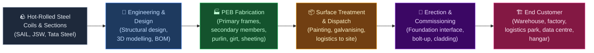
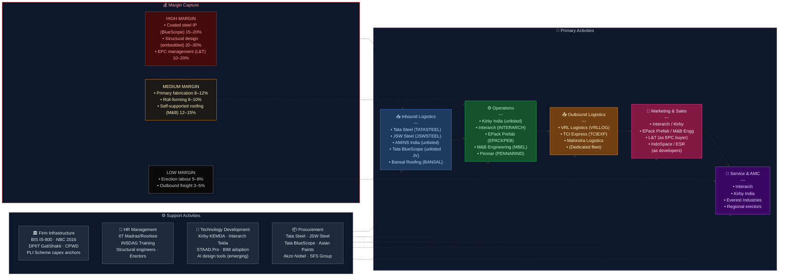

# Pre-Engineered Buildings (PEB) — Value Chain Analysis (India)

**Last updated:** June 2026
**Sector:** Pre-Engineered Buildings / Prefabricated Steel Structures
**Geography:** India (domestic focus; export context for Middle East / SE Asia)

---

## 0. Segment Definition

**Precise boundary:** This analysis covers the **Pre-Engineered Buildings (PEB) segment in India** — the design, fabrication, supply, and erection of steel-framed building systems where the structural components (primary frames, secondary members, roofing, wall cladding, accessories) are engineered, manufactured in a factory, and assembled on-site. It includes industrial sheds, warehouses, logistics parks, cold storage structures, aircraft hangars, data centre shells, commercial buildings, sports facilities, and modular buildings. It excludes conventional RCC construction, structural steel fabrication for bridges/infrastructure, and pure civil works.

**Core product/service flow:**

**End customers and what they value most:**

| Customer Segment | Primary Value Driver |
|---|---|
| Warehousing & logistics (3PLs, e-commerce) | Speed of construction, clear span, cost/sqft |
| Industrial (auto, FMCG, pharma, engineering) | Clear span flexibility, fire rating, customisation |
| Cold storage / food processing | Insulation (PUF/EPS panels), vapour barrier, hygiene |
| Aviation (hangars) | Extra-wide clear span (60–100m), height, wind load |
| Data centres | Floor load, speed of build, steel tonnage capacity, structural precision |
| Defence corridors | Seismic/wind compliance, security specifications, government approval |
| Real estate / commercial | Aesthetics, LEED compliance, fast delivery |

**India's global position: Challenger (domestic) / Nascent (export)**
India is the world's **3rd-largest PEB market** by volume after the US and China. The domestic PEB market was estimated at ~₹22,000–25,000 Cr in FY25 and is growing at 12–15% CAGR, driven by warehousing, PLI-linked manufacturing capex, the data centre boom, and the National Logistics Policy. Indian PEB manufacturers export to the Middle East, Southeast Asia, and Africa — but export share remains low (~8–12% of revenues for leading players). The DAM Capital June 2026 sector initiation report confirms a structural shift: large-capex projects (data centres, PLI factories, defence corridors) are driving consolidation toward the top 4–5 national players.

---

## 0.5 Quick Scan — Investable Listed Companies

*8-pass research protocol completed. Table covers all confirmed listed companies including recent IPOs (FY24–FY26).*

| Company | Ticker | Cap Bucket | Chain Stage | One-Line Investment Thesis | Coverage |
|---|---|---|---|---|---|
| Interarch Building Solutions | NSE: INTERARCH | Small (₹~3,200 Cr) | Full PEB (Ops) | Only pure-play listed PEB with pan-India plant network; data centre + warehouse cycle drives FY26–27 order re-rating | Moderate (4–9) |
| EPack Prefab Technologies | NSE: EPACKPEB | Small (₹~2,700 Cr) | Full PEB (Ops) | Recently listed (Oct 2025); South India focused; greenfield Gujarat plant will add West India reach — market yet to price the capacity ramp | Under-researched (1–3) |
| M&B Engineering | NSE: MBEL | Small (₹~1,700 Cr) | Full PEB + Roofing | IPO Aug 2025; India's largest self-supported steel roofing player (75% market share); dual-plant (Gujarat + Tamil Nadu); market conflating it with generic PEB, missing the roofing moat | Under-researched (1–3) |
| Pennar Industries | NSE: PENNARIND | Small (₹~2,200 Cr) | PEB + Diversified Steel | PEB India (~₹780 Cr order backlog) + US PEB operations ($53M backlog) — international diversification not in Indian peer comparisons | Moderate (4–9) |
| Everest Industries | NSE: EVERESTIND | Small (₹~770 Cr) | PEB + Building Products | Depressed valuation post stock decline (-58% in one year); fibre cement board growth + PEB recovery could re-rate; risk is execution | Under-researched (1–3) |
| Richa Industries | NSE: RICHA | Micro (<₹500 Cr) | PEB + Defence Tents | Niche defence tent exposure adds optionality to PEB cycle; very small float | Undiscovered (0) |
| Tata Steel | NSE: TATASTEEL | Large (>₹20,000 Cr) | Inbound — HR Coil | Indirect play; PEB demand is a fraction of Tata Steel's revenue; own it for the steel cycle, not PEB specifically | Well-covered (10+) |
| JSW Steel | NSE: JSWSTEEL | Large (>₹20,000 Cr) | Inbound — HR Coil | Same as Tata Steel — indirect; JSW's coated steel ambitions could eventually challenge Tata BlueScope's monopoly | Well-covered (10+) |
| Bansal Roofing Products | NSE: BANSAL | Micro (<₹500 Cr) | Inbound — Coated Steel | Mid-market alternative to Tata BlueScope; Gujarat-based; benefits directly from PEB volume growth without competing on design | Undiscovered (0) |
| VRL Logistics | NSE: VRLLOG | Mid (₹~5,800 Cr) | Outbound Logistics | Preferred freight partner for PEB components in Deccan region; indirect play on PEB throughput | Moderate (4–9) |
| Asian Paints | NSE: ASIANPAINT | Large (>₹20,000 Cr) | Support — Coatings | Industrial protective coatings for steel; PEB is a marginal revenue driver; own for the industrial cycle broadly | Well-covered (10+) |
| Akzo Nobel India | NSE: AKZOINDIA | Mid (₹~7,500 Cr) | Support — Coatings | Interpon powder coatings for PEB sheeting; higher exposure than Asian Paints to industrial/architectural coatings | Moderate (4–9) |

**Which cap bucket holds the most under-researched opportunity right now?**

The **Small cap** bucket — specifically the recently listed PEB pure-plays — is where the most under-researched opportunity sits. EPack Prefab Technologies (listed October 2025) and M&B Engineering (listed August 2025) have fewer than 4 analysts initiating coverage and are being valued by markets using generic "small steel fabricator" multiples that do not capture their national capacity expansion stories or the structural demand shift toward large-capex PEB projects (data centres, PLI factories, defence corridors). Interarch, while slightly better-covered, still has limited institutional ownership and its order book re-rating from the data centre wave is not yet in consensus estimates.

---

## 1. Value Chain Map — Primary Activities

### 1.1 Inbound Logistics

**What it involves:** Procurement of hot-rolled (HR) coils and plates (the dominant raw material — steel is 60–70% of PEB input cost), cold-rolled (CR) sheets for cladding, zinc for galvanising, primer and finishing paints, fasteners (self-drilling screws, anchor bolts), insulation materials (PUF panels, EPS, glasswool), and accessories (skylights, ridge vents, gutters, downspouts, doors/windows). Steel is typically procured directly from primary mills or through steel service centres.

**Cost/differentiation drivers:**
- **Steel price volatility** is the #1 P&L risk — HR coil prices have risen 34% year-on-year to ~USD 1,183/tonne as of June 2026; firms with price pass-through clauses or forward hedging have structural margin advantage. M&B Engineering management explicitly declined FY27 margin guidance in their FY26 results call due to steel price uncertainty.
- **Procurement scale** — large players (Interarch, Kirby, Pennar) negotiate 3–5% better rates vs smaller fabricators
- **Steel grade mix** — use of higher-strength steel (Fe 550, Fe 600) reduces tonnage per sqm (material efficiency), a key design differentiator
- **Vendor managed inventory (VMI)** with steel mills reduces working capital for large players
- **Import dependency** for specialty steels: Galvalume/ZINCALUME coated steel for roofing (Tata BlueScope Steel is the dominant premium supplier; Bansal Roofing Products serves the mid-market)

**Indian companies active here:**
- **Tata Steel (NSE: TATASTEEL)** — HR coils, structural sections; preferred supplier to most PEB majors
- **JSW Steel (NSE: JSWSTEEL)** — HR coils, CR sheets; competitive with Tata on price
- **SAIL (NSE: SAIL)** — HR plates and sections; less consistent quality perception vs private mills
- **Tata BlueScope Steel (unlisted, JV)** — Galvalume/Colorbond coated steel for roof/wall sheeting; dominant in premium segment
- **Bansal Roofing Products (NSE: BANSAL)** — Gujarat-based listed manufacturer of colour-coated roofing sheets and Galvalume profiled panels; mid-market alternative to Tata BlueScope; serves smaller PEB fabricators who cannot access BlueScope allocations or find BlueScope pricing uncompetitive
- **AM/NS India (unlisted, ArcelorMittal-NSSMC JV)** — HR coils from Hazira plant; growing share in PEB steel supply
- **Steel service centres:** Shree Steel, Mahavir Steel, JSW One Platforms — slit and cut-to-length service

**Conglomerate check:** Tata Group (Tata Steel + Tata BlueScope JV) dominates this stage — both as primary steel supplier and as the monopoly coated steel supplier. JSW Group is the primary challenger. No Adani/Reliance/Birla presence at this stage.

---

### 1.2 Operations (PEB Fabrication)

**What it involves:** Engineering drawings (from design team) are converted into CNC-controlled cutting, drilling, welding, and assembly of:
- **Primary structural frames:** Built-up I-sections (tapered or straight) welded from HR plates using submerged arc welding (SAW) — the heaviest, most capital-intensive component
- **Secondary members:** Purlins, girts, eave struts (cold-formed Z/C sections from CR coils using roll-forming machines)
- **Roof & wall sheeting:** Single-skin or insulated panels (trapezoidal profile, standing seam) roll-formed from Galvalume/coated coils
- **Accessories:** Ridge caps, flashings, gutters, trim, fasteners (some sourced, some in-house)

**Cost/differentiation drivers:**
- **CNC automation level** — determines throughput, wastage, and dimensional accuracy; leading plants achieve <2% steel wastage vs 5–8% at smaller yards
- **SAW welding line capacity** — primary frame output capacity is the manufacturing bottleneck
- **Roll-forming machine variety** — breadth of purlin/sheeting profiles producible determines product range
- **Factory footprint** — optimal PEB plants are 10–15 acres with covered fabrication; proximity to steel mills (Gujarat, Maharashtra, Karnataka clusters) reduces freight
- **ISO 9001 and IS 800** compliance — mandatory for credibility with institutional buyers
- **Geographic reach** — the DAM Capital June 2026 report highlights that EPack Prefab (South India) and M&B Engineering (Gujarat + Tamil Nadu) are shedding their regional tags through greenfield plant expansion; pan-India plant network is the key differentiator for large institutional orders

**Indian companies active here (updated June 2026):**
- **Interarch Building Solutions (NSE: INTERARCH)** — Listed Aug 2024; ₹1,454 Cr revenue FY25; plants at Kichha (Uttarakhand) and Srikalahasti (AP); EBITDA margin ~10%; order book ₹1,695 Cr
- **EPack Prefab Technologies (NSE: EPACKPEB)** — Listed Oct 2025; ₹1,525 Cr revenue (TTM); Mkt cap ~₹2,700 Cr; South India + AP focus; expanding to Gujarat greenfield
- **M&B Engineering (NSE: MBEL)** — Listed Aug 2025; Mkt cap ~₹1,700 Cr; plants at Sanand (Gujarat) and Cheyyar (Tamil Nadu); combined capacity 103,800 MTPA; also India's largest self-supported roofing player (75% market share)
- **Pennar Industries (NSE: PENNARIND)** — ₹3,226 Cr group revenue FY25; India PEB backlog ₹780 Cr; US PEB operations ($53M backlog); new Raebareli plant at ~50% utilisation
- **Everest Industries (NSE: EVERESTIND)** — ₹1,723 Cr revenue FY25; PEB + fibre cement boards + roofing sheets; Roorkee plant; market cap depressed to ~₹770 Cr after ~58% stock decline
- **Richa Industries (NSE: RICHA)** — Chandigarh; PEB + military tents + canvas products; smallcap/micro-cap listed
- **Kirby Building Systems India (unlisted)** — Subsidiary of Kirby Building Systems (Kuwait/Alghanim Industries); Hyderabad; India's largest PEB plant by capacity (~150,000 MTPA); supplies across India and exports to Middle East
- **Tiger Steel Engineering (unlisted)** — Pune; significant mid-tier player
- **Lloyd Insulations (unlisted)** — specialises in insulated panel systems (cold storage)

**Conglomerate check:** No major Indian conglomerate (Tata, Adani, JSW, Reliance) operates a listed PEB fabrication entity. This is structurally positive for listed pure-plays — no conglomerate cross-subsidy distorting competition. However, Tata Projects (Tata Group's EPC arm, unlisted) does buy PEB as a component of larger EPC contracts.

---

### 1.3 Outbound Logistics

**What it involves:** Finished fabricated components (primary frames, purlins, sheeting, accessories) are tagged, bundled, and dispatched from the factory to the construction site. A typical 5,000 sqm warehouse requires 10–20 truck loads. Components are sequenced for erection order (foundation bolts first, columns next, rafters, then purlins and sheeting) to minimise on-site handling.

**Cost/differentiation drivers:**
- **Freight cost** — typically 3–5% of project cost; PEB's lightweight advantage vs RCC reduces freight significantly (PEB: 25–35 kg/sqm vs RCC: 250–400 kg/sqm)
- **Just-in-time sequencing** — sites have minimal storage space; erection delays from mis-sequenced delivery are costly
- **Erection supervision** — most PEB companies provide supervision alongside supply; bundled logistics+supervision is the norm
- **Export packaging** — sea-worthy crating and anti-corrosion wrapping for Middle East/Africa exports

**Key players/logistics partners:**
- **VRL Logistics (NSE: VRLLOG)** — preferred freight partner for many PEB players in Deccan region
- **TCI Express (NSE: TCIEXP)**, **Mahindra Logistics (NSE: MAHLOG)** — used for smaller loads
- Most large PEB companies manage outbound with dedicated fleet or long-term 3PL contracts

---

### 1.4 Marketing & Sales

**What it involves:** PEB is predominantly a **B2B, project-based, relationship-driven** sales model. Key channels:
- **Direct sales to end-users** (large industrials, 3PLs, e-commerce companies — Amazon, Flipkart, Delhivery, DHL, FM Logistic have all procured PEB warehouses; hyperscalers now joining this buyer pool for data centre shells)
- **Channel through architects/PMCs** (Project Management Consultants) — specifiers who recommend PEB vs RCC
- **EPC contractors** (L&T Construction, Shapoorji Pallonji, Capacit'e Infraprojects) — who sub-contract PEB supply to specialists
- **Real estate developers** (Embassy Industrial Parks, IndoSpace, ESR, Welspun One) — who build warehousing parks and buy PEB in bulk; India's 3PL market projected at USD 78 Bn by 2034, meaning sustained warehousing demand pipeline

**Cost/differentiation drivers:**
- **Design-sell capability** — the ability to offer a complete structural design and 3D visualisation as part of the sales pitch drives win rates
- **Reference project portfolio** — institutional buyers (especially MNCs) demand a track record in similar project types
- **Relationship with government** — CPWD, railways, defence estate, HAL are significant buyers of PEB structures
- **Speed of quotation** — in competitive tenders, a 48-hour detailed quote (vs 2 weeks for conventional structure) is a competitive advantage
- **Client consolidation trend** (per DAM Capital June 2026 report) — large clients increasingly reducing the number of PEB vendors they coordinate with, making preferred-vendor status more valuable

**Key Indian players:**
- **Interarch** — strongest brand recognition among institutional buyers; preferred vendor for MNC manufacturing clients
- **Kirby India** — dominates large-format industrial and power sector
- **Pennar** — strong in Telangana/AP industrial corridor + US market
- **Everest** — known for agri, rural, and smaller commercial projects; weaker institutional presence
- **EPack Prefab, M&B Engineering** — building institutional credentials post-listing

---

### 1.5 Service (After-Sales, O&M, Extensions)

**What it involves:** PEB structures have a design life of 25–40 years. Post-delivery services include:
- **Erection supervision** (typically bundled in supply contract; lasts 4–16 weeks)
- **Warranty management** — 1-year structural defect warranty; 10–20 year paint warranty (via Tata BlueScope/AkzoNobel)
- **Expansion/extension services** — PEB's modular nature allows bays to be added; repeat business from expanding customers is a key revenue stream
- **Re-roofing / retrofitting** — replacing ageing roofing sheets on older industrial sheds (large installed base)
- **Annual maintenance contracts (AMC)** — rare in India currently; a missed opportunity

**Cost/differentiation drivers:**
- Modular expandability is a structural differentiator vs RCC (RCC expansion requires demolition)
- **Installed base monetisation** — companies with a large installed base (Kirby since 1987; Interarch since 1983) have captive extension/retrofit demand
- AMC penetration in India is <5% of projects; low but growing, especially for large logistics parks

**Key players:**
- Interarch, Kirby, Everest — all maintain service teams; largely reactive rather than proactive AMC model
- Third-party steel structure maintenance players (largely unlisted, regional)

---

## 2. Value Chain Map — Support Activities

### 2.1 Firm Infrastructure (Governance, Regulation, Finance)

**Role:** PEB projects require building plan approvals from local municipal bodies / industrial development authorities (MIDC, GIDC, KIADB, UPSIDC). The National Building Code of India (NBC 2016) and IS 800:2007 are the governing standards. Wind load (IS 875), seismic zone classification, and fire rating requirements drive structural design parameters.

**Indian strengths/weaknesses:**
- **Strength:** BIS standards (IS 800, IS 801 for cold-formed sections) are well-established and understood
- **Strength:** DPIIT's PM GatiShakti and National Logistics Policy creating massive demand for warehousing/industrial structures; Union Budget FY26 capital outlay of ₹11.11 lakh crore directly funding industrial infrastructure
- **Weakness:** No dedicated PEB fast-track building approval mechanism; faces same lengthy municipal approvals as RCC
- **Weakness:** Project financing for end-users (especially MSMEs) is a constraint; PEB manufacturers often extend 60–90 day credit

**Key institutions:**
- **Bureau of Indian Standards (BIS)** — IS 800, IS 801, IS 875
- **DPIIT / Ministry of Commerce** — PM GatiShakti, National Logistics Policy, PLI schemes
- **CPWD** — significant government buyer; sets specifications for government PEB projects
- **SBI, HDFC Bank, ICICI Bank** — project finance for end-customer capex

---

### 2.2 HR Management

**Role:** PEB requires structural engineers (for design), shop-floor fabricators (CNC operators, SAW welders, roll-forming operators), and site erectors. The design function is the highest-skill, highest-leverage role — a 5-person design team can generate designs for ₹100–200 Cr of projects annually.

**Indian strengths/weaknesses:**
- **Strength:** Large pool of structural and civil engineers from IITs, NITs, and regional engineering colleges; design capability is world-class at leading firms
- **Strength:** Relatively low engineering salaries vs global comparables — enables cost-competitive design services
- **Weakness:** Skilled erection supervisors scarce; most erection is done by semi-skilled labour
- **Weakness:** High attrition in design roles as engineers move to larger EPC firms or abroad

**Key institutions:**
- **IIT Madras, IIT Bombay, IIT Roorkee** — structural engineering talent pipeline
- **INSDAG (Institute for Steel Development & Growth)** — runs training programmes for structural steel
- **CREDAI, CII** — awareness and standards advocacy

---

### 2.3 Technology Development

**Role:** PEB is design-intensive. Leading manufacturers invest in 3D structural design software, parametric design tools, and proprietary software for automated drawing generation.

**Indian strengths/weaknesses:**
- **Strength:** Kirby uses proprietary KEMDA design software (developed in-house); Interarch uses a customised Tekla-based workflow with automated BOM generation
- **Strength:** Indian PEB firms have developed design expertise in challenging conditions: high seismic zones, high wind zones, corrosive coastal environments
- **Weakness:** No Indian PEB firm has developed proprietary structural design software comparable to Nucor/BlueScope's BUTLER Manufacturing System
- **Weakness:** BIM adoption is nascent (<15% of projects); most projects still run on 2D drawing workflows

**Key institutions/companies:**
- **INSDAG** — steel design training and advocacy
- **IIT Madras / SERC (Structural Engineering Research Centre)** — research on steel structures
- Tekla (Trimble), STAAD.Pro (Bentley) — dominant foreign design software

---

### 2.4 Procurement

**Role:** Given steel's 60–70% share of input cost, procurement is the most strategically critical support function. Large PEB firms run formal steel procurement teams with market intelligence on HR coil/plate prices, forward contracting, and order-by-order hedging.

**Indian strengths/weaknesses:**
- **Strength:** India's domestic steel capacity means no import dependency for primary structural steel
- **Strength:** India's developed coatings industry provides competitive pricing for primers and finishing paints
- **Weakness:** Galvalume/Zincalume coated steel for roofing is near-monopoly supplied by Tata BlueScope — pricing power in supplier's favour
- **Weakness:** PUF panel manufacturing is fragmented; quality consistency is a recurring complaint for cold-storage applications
- **Weakness (June 2026 update):** HR coil prices have risen ~34% year-on-year; PEB manufacturers unable to fully pass through cost increases in fixed-price projects are facing margin compression

**Key suppliers:**
- **Tata BlueScope Steel (unlisted JV: Tata Steel + BlueScope Australia)** — coated steel sheets; dominant supplier
- **Asian Paints (NSE: ASIANPAINT)** — industrial primers and protective coatings
- **Akzo Nobel India (NSE: AKZOINDIA)** — Interpon/Dulux industrial coatings for PEB exterior
- **Hilti India (unlisted)** — premium fasteners for structural connections
- **SFS Group India (unlisted)** — self-drilling fasteners for sheeting

---

## 3. Five Forces + Capital Cycle Analysis

### Part A — Five Forces

**Supplier Power — MEDIUM-HIGH**

Steel (HR coils and plates) is PEB's dominant input at 60–70% of cost, and while multiple domestic mills compete (Tata, JSW, SAIL, AM/NS), commodity pricing means mills do not negotiate away from prevailing HR coil benchmarks. The structural supply-power risk lies in **coated steel for roofing/cladding**, where Tata BlueScope dominates the premium segment (Galvalume/Colorbond brand). Bansal Roofing Products (NSE: BANSAL) provides a mid-market domestic alternative, giving smaller PEB fabricators some optionality — but BlueScope's quality premium means large institutional buyers typically specify it by name. PEB firms cannot easily substitute away from coated steel for exterior sheeting — corrosion resistance is non-negotiable. The June 2026 environment adds another dimension: HR coil prices are 34% higher year-on-year, creating significant mark-to-market exposure for PEB firms with 4–8 month order-to-delivery cycles. M&B Engineering explicitly refused margin guidance for FY27 due to steel price uncertainty.

**Buyer Power — MEDIUM-HIGH**

Large institutional buyers (e-commerce warehousing platforms, MNC manufacturers, hyperscalers building data centres, real estate developers like IndoSpace, ESR, Embassy) have **high buyer power**: they run structured tenders, compare 3–5 PEB suppliers, specify detailed technical requirements, and negotiate aggressively on price/sqft. A single large warehousing developer can place ₹200–500 Cr of orders annually — representing 15–30% of a mid-sized PEB firm's revenue. However, for smaller buyers (MSME industrial shed, family-owned factory), buyer power is low — PEB manufacturers are more knowledgeable and the buyer is less price-sensitive relative to total project cost. Notably, the DAM Capital report observes that large clients are consolidating their vendor lists — this reduces buyer power for preferred vendors but increases it severely for the non-preferred.

**Threat of New Entrants — MEDIUM**

Entry into PEB fabrication requires ₹50–150 Cr of capital for a greenfield plant (land, SAW welding lines, roll-forming machines, CNC cutting equipment, paint shop), plus 2–3 years to build a credible project reference list. This is not prohibitive for a large steel company or construction conglomerate wanting to enter. Regional fabricators can enter the lower end (<₹5 Cr project size) with as little as ₹5–10 Cr investment in basic roll-forming and welding equipment. The real barrier is **design capability and brand** for institutional buyers, not manufacturing capital. The recent wave of listings (Interarch Aug 2024, M&B Aug 2025, EPack Prefab Oct 2025) signals that the PEB market is attracting growth capital — a mild inflow signal.

**Threat of Substitutes — MEDIUM (declining)**

PEB's primary substitute is **conventional RCC (reinforced cement concrete) construction**, which has 80%+ market share of India's industrial/commercial building stock. PEB competes and wins on speed (8–16 weeks vs 6–18 months), clear span (up to 100m+ vs 12–15m economically for RCC), and cost (₹1,800–2,800/sqft vs ₹2,500–4,500/sqft for equivalent industrial structure). The data centre wave amplifies this advantage: hyperscale data centres require 20,000+ tonnes of steel with extreme structural precision — PEB is effectively the only viable construction method for the timeline hyperscalers demand. The substitution threat is structurally declining as PEB penetration grows and awareness increases.

**Rivalry Intensity — HIGH**

The PEB market has 4–5 national players (Interarch, Kirby, EPack Prefab, M&B Engineering, Pennar) and 50–100+ regional fabricators. Price competition is intense at the commodity end. EBITDA margins for listed PEB players are 8–12%, reflecting competitive intensity. Exit barriers are low (SAW machines and roll-forming equipment can be redeployed), which attracts opportunistic regional entrants during boom periods. However, the DAM Capital June 2026 report notes a structural improvement: large projects are concentrating among fewer suppliers, meaning rivalry at the top-end is consolidating while remaining intense at the middle/lower end.

---

### Part B — Capital Cycle Verdict

**Capital is flowing INTO Indian PEB.** Three concurrent signals confirm early-to-mid inflow phase: (1) three PEB-sector IPOs in 14 months (Interarch Aug 2024, M&B Aug 2025, EPack Prefab Oct 2025), indicating access to public capital and elevated sentiment; (2) major capacity expansions announced by all listed players — Pennar's Raebareli plant, M&B's Tamil Nadu greenfield, EPack Prefab's Gujarat greenfield; (3) steel price tailwinds attracting new entrants into the adjacent roofing and sheeting sub-segments. The inflow is **demand-driven (not speculative)** — unlike pure financial-cycle inflows, this is being pulled by concrete capex anchors (PLI factories, data centres, defence corridors, logistics parks). This distinction matters: demand-driven inflows are more sustainable, and the risk of overcapacity building faster than demand is lower than in a purely financial-cycle-driven sector. However, investors should monitor whether small regional players over-expand on the back of easy credit and compressed the middle market — that is the cycle risk for mid-tier listed players.

---

### Part C — Investor Implication

The combined Five Forces + Capital Cycle picture points to **selective accumulation of top-3 national PEB fabricators with multi-plant networks and established institutional client relationships** — and avoidance of single-plant regional players and steel input-stage pure-plays. The most structurally attractive segment right now is the **national PEB fabricator** tier (Interarch, EPack Prefab, M&B Engineering), because: (i) vendor consolidation by large buyers structurally increases winner-take-most dynamics; (ii) the data centre and PLI factory pipeline provides 24–36 months of visible order runway; (iii) these firms are still priced on historical earnings rather than the forward order book re-rating. The segment to avoid or underweight is single-plant mid-tier PEB players facing steel price pass-through risk without the scale to absorb margin compression. The **single biggest risk** to the bull thesis is a steel price spike that compresses EBITDA margins from the current 9–12% to 5–7% — creating earnings misses in H1 FY27 that spook markets before the long-cycle data centre orders start contributing to revenue. This is not a structural risk to the business model but a timing/sentiment risk.

---

### Five Forces Summary Table

| Force | Intensity | Key Driver |
|---|---|---|
| Supplier Power | Medium-High | Tata BlueScope near-monopoly on coated steel; HR coil price +34% YoY as of June 2026 |
| Buyer Power | Medium-High | Large institutional buyers (3PL, e-commerce, hyperscalers) run structured tenders; vendor consolidation cuts both ways |
| Threat of New Entrants | Medium | ₹50–150 Cr entry capex; design brand and reference list are the real barriers; 3 recent IPOs signal inflow |
| Threat of Substitutes | Medium (declining) | RCC remains dominant but PEB share is structurally growing; data centre wave is PEB-exclusive demand |
| Rivalry Intensity | High (consolidating at top) | 50–100+ players; top tier consolidating; middle market intensely competitive |

**Overall structural attractiveness: MEDIUM** — strong secular demand tailwinds partly offset by high rivalry, steel price volatility, and buyer concentration at the institutional end. Structural improvement underway as top-tier consolidates.

**Capital cycle phase: Early Inflow** — demand-driven inflow from PLI, data centres, and logistics; 3 recent IPOs confirm capital is entering; watch for overcapacity signal in FY27–28 regional expansion.

**Investor stance: Selective Accumulate** — concentrate in multi-plant national PEB fabricators (Interarch, EPack Prefab, M&B Engineering); underweight single-plant regionals and avoid pure steel input plays for the PEB thesis.

---

## 4. GVC Governance & India's Position

### Lead Firms (Global)
- **Nucor/BlueScope/Butler Manufacturing (US)** — the global PEB technology originators
- **Kirby Building Systems (Kuwait-headquartered)** — the largest PEB manufacturer in the Middle East and a major player in India; owned by Alghanim Industries
- **Zamil Steel (Saudi Arabia)** — Middle East giant; competes with Indian players in Gulf export markets
- **BlueScope Steel (Australia)** — governs the coated steel sub-chain globally through Galvalume/Colorbond IP and licensing

### Lead Firms (Indian)
- **Interarch Building Solutions** — India's best-capitalised listed PEB pure-play post its August 2024 IPO; ranked 2nd by PEB operating revenue in FY25
- **EPack Prefab Technologies** — newly listed (Oct 2025); strong South India base; national ambitions via Gujarat greenfield
- **M&B Engineering** — newly listed (Aug 2025); India's largest self-supported roofing player; dual-plant; differentiated by roofing vertical
- **Kirby India** — largest capacity; technically most sophisticated; unlisted subsidiary of Alghanim Industries

### Governance Type: Modular

PEB sits in a **Modular governance** structure. Buyers specify performance requirements (clear span, height, load, wind zone, fire rating) and engage PEB suppliers who independently handle design, fabrication, and erection. Suppliers are not captive — they serve multiple buyers — but must meet codified technical standards (IS 800, NBC, wind/seismic zone specs). There is limited relational governance at the design-intensive top end (MNC manufacturers who prefer a single approved PEB vendor work relationally across multiple projects). The data centre wave is pushing toward **Relational governance** for hyperscalers: Google, Microsoft, and Amazon are developing approved PEB vendor lists in India, creating captive relationship opportunities for 2–3 national players.

### Value Capture Map

| Stage | Margin Level | Who Captures |
|---|---|---|
| Coated steel manufacturing (Galvalume) | High (15–20%) | Tata BlueScope (JV — value partly captured by BlueScope IP) |
| Structural design & engineering | High (20–30% on design fee) | PEB firm's design team (embedded in project margin) |
| Primary frame fabrication | Medium (8–12% EBITDA) | Kirby, Interarch, EPack Prefab, M&B, Pennar |
| Secondary member roll-forming | Medium (8–10%) | Same — integrated into fabrication |
| Roofing & cladding supply | Low-Medium (6–10%) | M&B Engineering has structural advantage here via roofing moat |
| Erection (on-site) | Low (5–8%) | Labour subcontractors; often sub-contracted by PEB firms |
| EPC management/PMC oversight | High (10–20%) | L&T Construction, Shapoorji, consultants |

### India's Position & Upgrade Trajectory

India is at **Stage 3 (Functional Upgrading)** in PEB — beyond pure fabrication (Stage 1) and standard product variety (Stage 2), leading Indian firms are now managing full turnkey EPC delivery. The next upgrade step is **chain upgrading** — moving into coated steel manufacturing or developing proprietary design software for export.

India is a **net exporter** of PEB structures to the Middle East (~10–15% of Kirby India's revenue is exports; Interarch exports ~8% of revenues). This is a positive trajectory signal.

---

## 5. Key Linkages & Leverage Points

### Linkage 1: Steel Procurement → Project Margin
Steel price movements between order booking and project delivery (typically 4–8 months) directly determine profitability. Firms that book steel immediately upon contract signing are protected; those that buy on spot face mark-to-market exposure. This is the **single most common cause of margin erosion** at mid-tier PEB players — validated by M&B Engineering's FY26 results commentary in June 2026.

### Linkage 2: Design Quality → Erection Speed → Customer Satisfaction
A well-detailed design (every bolt, every clip, every flashing specified) reduces on-site queries and rework, cutting erection time by 20–30%. Erection speed is the #1 customer satisfaction driver post-contract.

### Linkage 3: Manufacturing Throughput → Project Lead Time → Order Conversion
A customer comparing PEB vs RCC is primarily motivated by speed. Manufacturing throughput (SAW welding line utilisation, CNC cutting speed) directly determines delivery lead time and thus order conversion rate. For data centre customers, who are legally committed to hyperscaler capacity timelines, this linkage is existential — PEB delivery delays have contractual penalty implications for the data centre developer.

### Linkage 4: Reference Projects → Large Account Access → Revenue Quality
Institutional buyers require 2–3 reference projects of comparable scale before awarding. This creates a **reference project moat** — once on a global manufacturer's approved vendor list, PEB firms get right-of-first-refusal on all India capex. The client consolidation trend (per DAM Capital June 2026) makes this linkage increasingly winner-take-most.

### Linkage 5: Erection Subcontractor Quality → Warranty Cost → Brand Perception
Most PEB firms subcontract erection to specialist steel erectors. Poor workmanship generates warranty claims and reputational damage to the PEB manufacturer, not the erector.

**Single Highest-Leverage Intervention:** **Formalised steel price pass-through clauses in standard contracts.** Standardising an industry-wide **steel price escalation clause** tied to HR coil index would de-risk the business model, enable more aggressive order booking, and improve EBITDA predictability — benefiting both PEB manufacturers and their institutional buyers. In the current June 2026 environment of 34% YoY steel price increases, this intervention would immediately improve the risk profile of every listed PEB company.

---

## 5.5 Upcoming Catalysts & Key Triggers

| Catalyst / Trigger | Timeline | Companies Likely to Benefit |
|---|---|---|
| **Data centre hyperscaler capex wave** — Microsoft, Google, Amazon, Adani (5 GW target), Lodha (2.5 GW) and TCS (1 GW) committed; 30+ large projects announced Mar 2025–Apr 2026 adding ~3.5 GW capacity in India | FY26–FY28 (active construction phase) | Interarch (institutional preferred-vendor track record), Kirby (large-format complex structure expertise), EPack Prefab, M&B Engineering |
| **PM MITRA textile park construction orders** — 7 parks (Tamil Nadu, Telangana, Karnataka, Maharashtra, Gujarat, MP, UP) under ₹4,445 Cr allocation; Dhar MP park entering execution phase in 2026 with ₹21,500 Cr investment attracted | FY26–FY28 (factories being built) | Interarch, EPack Prefab (South India plants well-positioned for Tamil Nadu, Telangana, Karnataka parks), M&B Engineering (Gujarat plant for Gujarat park) |
| **PLI factory construction** — 14 PLI schemes covering electronics, pharma, auto, food, solar, batteries, textiles; each PLI factory requires industrial shed / PEB structure | FY26–FY27 (bulk of PLI capex hitting construction phase) | All listed PEB fabricators; Pennar (strong in industrial/auto corridor) |
| **Warehouse & logistics park expansion** — IndoSpace (52+ parks), ESR, Welspun One building; 3PL market projected USD 78 Bn by 2034; Delhivery-Ecom Express merger creates larger warehouse footprint need | Ongoing through FY28 | Interarch, Kirby, EPack Prefab; VRL Logistics (outbound transport) |
| **UP & TN Defence Corridor factory builds** — BEL acquired 75 hectares in UP corridor (Apr 2026); BrahMos Aerospace 200-acre facility; HAL, BDL expansions planned | FY26–FY28 | Interarch, Kirby (defence project track record critical); Richa Industries (defence exposure provides differentiated entry point) |
| **Cold chain infrastructure expansion** — PM Kisan Cold Chain scheme + post-harvest infrastructure push; cold storage PEB demand from food processing and dairy sector | FY26–FY28 | Lloyd Insulations (unlisted, insulated panels), Everest Industries (agri/rural market), EPack Prefab |
| **Steel price correction** — if HR coil prices moderate from current elevated levels (USD 1,183/tonne in June 2026), PEB fabricator margins recover 150–200 bps, re-rating the sector | FY27 (if global steel cycle turns) | All listed PEB fabricators; margin recovery most leveraged at EPack Prefab and M&B Engineering (currently most price-sensitive given newer plants) |
| **Kirby India IPO** — any move by Alghanim Industries to list Kirby India (est. ₹8,000–12,000 Cr market cap potential) would restructure sector dynamics and serve as a re-rating catalyst for all listed PEB peers | Speculative; no confirmed timeline | All listed PEB players (sector re-rating on Kirby listing); pure-plays could derate if Kirby's listing at premium P/E resets comps |

---

## 6. Indian Company Landscape

*8-pass research protocol completed: Screener.in sweep, Trendlyne peers, IPO sweep (FY22–FY26), SME exchange search, sub-segment decomposition, sectoral index check, supply-chain adjacency, business press sweep. Tickers verified against NSE/BSE.*

### Listed Companies

| Stage | Company | Ticker | Cap Bucket | Revenue / Mkt Cap | PLI? | Coverage | Chain Position |
|---|---|---|---|---|---|---|---|
| Full PEB — Design to Erection | Interarch Building Solutions Ltd | NSE: INTERARCH | Small — Recently listed (FY25) | ₹1,454 Cr rev (FY25); Mkt cap ~₹3,200 Cr | No (PEB not PLI sector; end-customers may be PLI factories) | Moderate (4–9) | Leader |
| Full PEB — Design to Erection | EPack Prefab Technologies Ltd | NSE: EPACKPEB | Small — Recently listed (FY26) | ₹1,525 Cr rev (TTM); Mkt cap ~₹2,700 Cr | No | Under-researched (1–3) | Challenger |
| Full PEB + Roofing | M&B Engineering Ltd | NSE: MBEL | Small — Recently listed (FY26) | Mkt cap ~₹1,700 Cr; rev not confirmed | No | Under-researched (1–3) | Challenger |
| PEB + Steel Processing | Pennar Industries Ltd | NSE: PENNARIND | Small | ₹3,226 Cr rev (FY25); India PEB backlog ₹780 Cr | No (but supplies to PLI factories — indirect beneficiary) | Moderate (4–9) | Leader |
| PEB + Building Products | Everest Industries Ltd | NSE: EVERESTIND | Small | ₹1,723 Cr rev (FY25); Mkt cap ~₹770 Cr | No | Under-researched (1–3) | Challenger |
| PEB (Niche) + Defence Tents | Richa Industries Ltd | NSE: RICHA | Micro | ~₹300 Cr rev (est.); Mkt cap <₹200 Cr | No | Undiscovered (0) | Niche |
| Inbound — Primary Steel | Tata Steel Ltd | NSE: TATASTEEL | Large | ₹2,29,170 Cr rev (FY24) | No | Well-covered (10+) | Supplier/Leader |
| Inbound — Primary Steel | JSW Steel Ltd | NSE: JSWSTEEL | Large | ₹2,27,148 Cr rev (FY24) | No | Well-covered (10+) | Supplier/Leader |
| Inbound — Primary Steel (PSU) | SAIL | NSE: SAIL | Large | ₹1,03,516 Cr rev (FY24) | No | Well-covered (10+) | Supplier/Niche |
| Inbound — Coated Steel | Bansal Roofing Products Ltd | NSE: BANSAL | Micro | Not publicly disclosed | No | Undiscovered (0) | Supplier/Challenger |
| Support — Coatings | Asian Paints Ltd | NSE: ASIANPAINT | Large | ₹35,494 Cr rev (FY24) | No | Well-covered (10+) | Supplier/Niche |
| Support — Coatings | Akzo Nobel India Ltd | NSE: AKZOINDIA | Mid | ₹4,007 Cr rev (FY24) | No | Moderate (4–9) | Supplier/Niche |
| Outbound Logistics | VRL Logistics Ltd | NSE: VRLLOG | Mid | ₹2,753 Cr rev (FY24) | No | Moderate (4–9) | Niche |

**Note on PLI flag:** PEB manufacturers themselves are NOT PLI scheme beneficiaries — PEB is not among the 14 PLI sectors. However, PEB companies are **indirect beneficiaries** of PLI schemes because their end-customers (electronics factories, pharma plants, auto component manufacturers, battery plants) are PLI beneficiaries and are using PEB structures for their new manufacturing facilities. This is a structurally important distinction — PEB demand is tied to PLI capex execution, not PLI incentive receipts.

### Unlisted / Private Companies

| Stage | Company | Type | Business Description | Scale | Notes |
|---|---|---|---|---|---|
| Full PEB — largest capacity | Kirby Building Systems India | MNC subsidiary | India's largest PEB plant (~150,000 MTPA); Hyderabad; design-to-erection; exports to Middle East | ~₹2,000–2,500 Cr rev (est.) | Parent: Alghanim Industries, Kuwait; unlisted; potential IPO candidate |
| Full PEB — mid-market | Tiger Steel Engineering | Private | Warehousing, industrial sheds; strong in West India; Pune-based | Not disclosed | Active in Maharashtra, Gujarat market |
| Insulated Panels | Lloyd Insulations (India) Ltd | Private | PUF insulated panels for cold storage and clean rooms | Not disclosed | Delhi-based; key supplier for cold chain PEB |
| Roofing Specialist | Multicolor Steels | Private | Roofing and walling sheet specialist; Gujarat | Not disclosed | Regional mid-market player |
| PEB — agri focus | Bajaj Steel Industries | Private | Agri-processing plant structures + PEB; Nagpur | Not disclosed | Strong in agri-corridor markets |
| PEB — mid-market | Shah Pre-Fab | Private | Warehousing and factory structures; Gujarat/Rajasthan focus | Not disclosed | Ahmedabad-based |
| Inbound — Steel (JV) | AM/NS India | PE-backed JV | HR coils from Hazira plant; ArcelorMittal-NSSMC JV; growing PEB steel supply | ~₹55,000 Cr rev (est.) | Could be a disruptive coated-steel entrant |
| Buyer — Warehousing | IndoSpace | PE-backed | India's largest industrial REIT developer; bulk PEB buyer; 52+ parks | Manages 60mn+ sqft | Investcorp-backed; not listed in India |
| Buyer — Warehousing | ESR India | MNC subsidiary | Logistics park developer; bulk PEB buyer | Manages 25mn+ sqft | HK-listed parent: ESR Group |
| Buyer — Warehousing | Welspun One Logistics Parks | Conglomerate | Logistics park developer; Welspun group; fastest-growing | Not disclosed | Welspun group backing |
| Coated Steel — JV | Tata BlueScope Steel | Unlisted JV | Galvalume/Colorbond coated steel; dominant PEB roofing supplier | Not disclosed | JV: Tata Steel (50%) + BlueScope Australia (50%) |

### Notable Companies — Deeper Notes

---

**Interarch Building Solutions (NSE: INTERARCH)**
- **Stage in chain:** Full PEB — design, fabrication, supply, and erection
- **Cap bucket:** Small — Mkt cap ~₹3,200 Cr; Recently listed (IPO Aug 2024, listed at 44% premium to issue price)
- **Analyst coverage:** Moderate (4–9); DAM Capital initiated coverage June 2026
- **What makes them interesting:** India's only pure-play listed PEB company with a two-plant model (North India via Kichha/Uttarakhand, South India via Srikalahasti/AP) giving geographic reach that single-plant competitors lack. ₹1,695 Cr order book as of latest disclosure with ₹4,000 Cr medium-term pipeline — revenue visibility is unusually high for a company of this size. Their Tekla-based automated design workflow is a genuine process differentiator vs regional players. Ranked 2nd by PEB operating revenue among integrated Indian players in FY25.
- **Key financials:** Revenue ₹1,454 Cr (FY25); EBITDA margin ~10%; PEB contracts ₹1,225 Cr (84% of revenue); Mkt cap ~₹3,200 Cr
- **PLI beneficiary:** No (PEB not a PLI sector; indirect beneficiary via customer PLI factory orders)
- **Watch factor:** Monthly order inflow announcements — a 3-month run above ₹250 Cr/month would signal the data centre re-rating has begun
- **Investment angle:** The market is pricing Interarch as a standard industrial fabricator at ~8–10x EV/EBITDA — standard for a steel processing business. What it is not pricing in: (1) the data centre structural demand wave, where hyperscalers require PEB build times of 12–18 months for shells and Interarch's institutional track record positions it as a top-2 preferred vendor; (2) the client consolidation dynamic identified by DAM Capital, which is structurally improving Interarch's win rate on large tenders; (3) the near-zero export revenue (~8% currently) which could double to 15% from Middle East data centre builds if the company executes one marquee export project. A re-rating from 10x to 14x EV/EBITDA on 20% revenue growth implies 70–80% stock upside in 24 months — this is not in consensus.

---

**EPack Prefab Technologies (NSE: EPACKPEB)**
- **Stage in chain:** Full PEB — design, fabrication, supply, and erection
- **Cap bucket:** Small — Mkt cap ~₹2,700 Cr; Recently listed (IPO Oct 2025)
- **Analyst coverage:** Under-researched (1–3); sector initiation barely underway
- **What makes them interesting:** One of the largest PEB players in South India with a proven track record in large industrial projects (won ₹130 Cr contract from Avaada Ventures for glass factory in Maharashtra in Oct 2025). ₹1,525 Cr TTM revenue makes it a genuine peer to Interarch despite having listed only months ago. The planned Gujarat greenfield plant is the strategic catalyst — it would make EPack a true national player, directly competing for North/West India data centre and PLI factory orders that currently go to Interarch and Kirby. Currently being valued by markets with no coverage premium and no greenfield option value priced in.
- **Key financials:** Revenue ~₹1,525 Cr (TTM); Mkt cap ~₹2,700 Cr; EBITDA margin data limited (recently listed)
- **PLI beneficiary:** No
- **Watch factor:** Gujarat plant construction progress and first order win from Gujarat/Maharashtra PLI factory or data centre — this would confirm national ambition and likely trigger rating upgrades
- **Investment angle:** Market is valuing EPack Prefab at approximately the same multiple as Interarch despite Interarch having more analyst coverage, more institutional ownership, and a longer track record. This is a mispricing — EPack at this price offers Interarch-equivalent upside with the additional option value of the Gujarat capacity ramp and an under-researched status that means positive surprises are not in sell-side models. The specific catalyst: any large West India order win announced post-Gujarat plant commissioning could be the re-rating event. Structural upside: if Gujarat ramp adds ₹400–500 Cr incremental revenue by FY28, and margins normalise to 10–11%, the stock could deliver 2–2.5x from current levels.

---

**M&B Engineering (NSE: MBEL)**
- **Stage in chain:** Full PEB + self-supported steel roofing
- **Cap bucket:** Small — Mkt cap ~₹1,700 Cr; Recently listed (IPO Aug 2025)
- **Analyst coverage:** Under-researched (1–3)
- **What makes them interesting:** India's largest self-supported steel roofing player with **75% market share** — this is a structural moat that is almost entirely invisible in how the market currently classifies M&B as a "PEB company." Self-supported roofing (for large-span structures like airports, stadiums, warehouses) is a distinct, more specialised product with higher margins and fewer competitors than standard PEB. Dual-plant model (Sanand, Gujarat + Cheyyar, Tamil Nadu) provides geographic coverage for both Western and Southern industrial corridors. Founded 1981 with 8,700+ projects completed — credibility with institutional buyers already established.
- **Key financials:** Mkt cap ~₹1,700 Cr; raised ₹275 Cr via IPO Aug 2025; combined PEB + roofing capacity 103,800 MTPA; revenue data limited for listed period
- **PLI beneficiary:** No
- **Watch factor:** FY26 annual results and first full-year data as listed company — will establish what margin profile the market should apply. Also watch for large airport or stadium roofing contracts, which would demonstrate the differentiated product moat.
- **Investment angle:** The market is pricing M&B as a generic PEB company. What it misses: the 75% roofing market share is a near-monopoly in a structurally growing sub-segment (airports, sports infrastructure, large logistics hubs all need self-supported roofing). If the roofing vertical grows at 20%+ CAGR from India's infrastructure push (airports — UDAN scheme expanding regional airports, stadia — upcoming sporting events), the embedded roofing business alone could justify the current full-company market cap. The PEB business is essentially a free option at current prices. First-mover disadvantage correction: the market has not yet fully processed that IPO in Aug 2025 means limited analyst models exist — initiation of coverage by 2–3 brokers would alone re-rate the stock.

---

**Pennar Industries (NSE: PENNARIND)**
- **Stage in chain:** PEB (India + US) + diversified steel processing
- **Cap bucket:** Small — Mkt cap ~₹2,200 Cr
- **Analyst coverage:** Moderate (4–9)
- **What makes them interesting:** Most diversified player — PEB is one of four businesses alongside railway wagon components (Vande Bharat supply chain), precision tubes, and engineered products. The US PEB operations ($53M order backlog) provide a genuine international revenue stream that Indian PEB investors typically do not factor into valuation. New Raebareli plant at 50% utilisation provides a natural earnings ramp as utilisation improves, with peak monthly revenue potential of ₹38 Cr/month from that plant alone. FY25 PBT of ₹158 Cr was the company's highest ever — cycle dynamics are favourable.
- **Key financials:** Group revenue ₹3,226 Cr (FY25); PBT ₹158 Cr (highest ever); India PEB order backlog ₹780 Cr; US PEB $53M backlog; Mkt cap ~₹2,200 Cr
- **PLI beneficiary:** No (PEB not a PLI sector; railway wagons under Vande Bharat are indirect PLI-adjacent)
- **Watch factor:** Raebareli plant utilisation progression — target is peak revenue of ₹38 Cr/month; currently at ~50%. Every 10pp improvement in utilisation is ~₹40 Cr annualised incremental revenue.
- **Investment angle:** Market prices Pennar as a diversified steel processor (lower P/E than pure PEB plays) despite having the most earnings-resilient portfolio — the US PEB exposure provides dollar-revenue insurance against domestic margin pressure from steel price spikes. Specifically: consensus models do not appear to value the US PEB operations on a separate geographical segment basis. If US operations ($53M backlog) are valued at 1x revenue (conservative for a recurring-order business), that alone adds ₹400–450 Cr to enterprise value — ~20% of current market cap. Combined with Raebareli ramp, this is a 30–40% re-rating opportunity over 18 months with lower risk profile than pure-play PEB peers.

---

**Everest Industries (NSE: EVERESTIND)**
- **Stage in chain:** PEB + fibre cement boards + roofing sheets
- **Cap bucket:** Small — Mkt cap ~₹770 Cr (down ~58% in the year ending June 2025)
- **Analyst coverage:** Under-researched (1–3)
- **What makes them interesting:** The only player combining PEB steel structures with fibre cement boards and asbestos-free roofing — making it a one-stop shop for building envelope materials. Strong in tier-2 and rural markets where smaller agricultural and MSME structures are being upgraded. The severe stock decline has compressed valuation, creating a potential mean-reversion opportunity if business fundamentals stabilise.
- **Key financials:** Revenue ₹1,723 Cr (FY25, 9.35% growth); Mkt cap ~₹770 Cr; recent quarterly revenue declining (-18.71% in Q2 FY26)
- **PLI beneficiary:** No
- **Watch factor:** Q3 and Q4 FY26 revenue trajectory — if the revenue decline reverses, the depressed mkt cap provides significant operating leverage on any recovery. Also watch fibre cement board industry dynamics, which is a more differentiated segment than commodity PEB.
- **Investment angle:** Everest is a **distressed recovery** call, not a growth call. Market has priced in continued revenue decline (-58% stock, declining quarterly revenues). The specific mispricing to test: whether Q2 FY26 was the trough. Fibre cement boards have structurally better competitive dynamics than PEB (fewer players, differentiated product, rural construction tailwind from PM Awas Yojana). If fibre cement returns to growth, the current ₹770 Cr market cap on ₹1,723 Cr revenue business looks excessively discounted. **High-risk, high-reward**: appropriate only for investors comfortable with earnings uncertainty.

---

**Kirby Building Systems India (Unlisted — Listed Optionality)**
- **Stage in chain:** Full PEB (all segments)
- **Cap bucket:** Unlisted; estimated fair value ₹8,000–12,000 Cr if listed
- **Analyst coverage:** Not listed — not applicable
- **What makes them interesting:** Technically the most sophisticated PEB manufacturer in India — uses proprietary KEMDA design software, runs India's largest single PEB plant (~150,000 MTPA capacity at Hyderabad), and has the deepest experience in large-format complex structures. Parent Alghanim Industries (Kuwait) provides financial stability and access to Middle East order flow.
- **Key financials:** Revenue estimated ₹2,000–2,500 Cr; margins not disclosed
- **Watch factor:** Any signal of Kirby India IPO preparation — would be the sector's most significant listing event since Interarch, and would structurally validate (and potentially re-rate) all listed PEB peers.
- **Investment angle:** Kirby's unlisted status is the sector's largest pricing anomaly — all listed PEB companies are valued in reference to each other, but the clear market leader is invisible to public markets. An IPO would force a revaluation of the entire sector upward as the market gains a Kirby-anchored comparable.

---

## 7. Strategic Insight & Investment Angles

### Part A — Non-Obvious Strategic Insight

The PEB industry in India is universally described as a manufacturing business — and optimisation efforts focus on fabrication capacity, steel procurement, and plant efficiency. But the chain analysis reveals that **the real competitive moat in PEB is design speed, not fabrication speed**. A buyer deciding between Interarch and a regional fabricator is not comparing welding quality (both meet IS 800) — they are comparing design responsiveness (can you give me a detailed 3D proposal in 48 hours?), design intelligence (can you engineer out 15% of the steel tonnage while meeting the same load spec?), and design credibility (does your structural stamp get accepted by MNC procurement teams without re-verification?). The second non-obvious insight: **M&B Engineering's 75% roofing market share is structurally more valuable than its PEB business**, but is invisible to investors who read "PEB company" in the classification. Markets are valuing M&B on blended PEB multiples when a roofing-business-only valuation would imply a materially higher number.

### Part B — Blue Ocean Opportunity

**Four Actions Framework:**

| Action | What |
|---|---|
| **Eliminate** | The free-design model — stop bundling structural design into the fabrication contract; unbundle and charge a design fee (₹15–25/sqft) that is credited against fabrication orders but retained if the buyer goes elsewhere |
| **Reduce** | Erection subcontractor fragmentation — reduce reliance on 10–20 ad-hoc labour subcontractors per project; build a network of 3–5 trained, certified erection partners who are economically tied to the PEB firm |
| **Raise** | Post-delivery engagement — raise AMC penetration from <5% to 25%+ among large institutional accounts through predictive maintenance offers and roof-health monitoring |
| **Create** | A **PEB-as-a-Service (PEBaaS) model** — offer a turnkey "lease your factory/warehouse building" product where the PEB manufacturer owns the structure, leases it to the end-user, and refinances through a REIT or infrastructure fund. This eliminates the end-user's capex entirely, dramatically increases PEB penetration among capital-constrained MSMEs, and creates a high-quality recurring annuity revenue stream for the PEB firm. |

**Company attempting this:** Interarch is partially attempting the "Raise" and "Create" elements — its move toward data centre structural solutions (higher-spec, higher-value projects) and discussions with REIT developers around framework agreements are early steps. Probability of success is **medium** — the data centre move is well-timed and aligned with the demand wave, but the PEBaaS annuity model requires balance sheet strength and capital markets access (structured finance partnerships) that Interarch has not yet demonstrated.

### Part C — Top 3 Priorities for a Listed Indian PEB Firm Seeking Durable Advantage

1. **Build a proprietary parametric design engine.** Invest ₹15–25 Cr over 3 years to develop in-house generative structural design software — one that can produce a code-compliant, fully detailed design with BOQ in <4 hours for standard building typologies. This reduces design cost per project by 60%, increases quoting speed 10x, and creates an IP moat that cannot be replicated by a ₹50 Cr regional fabricator. AI-assisted structural design (large language model + FEM solver integration) is within reach for a ₹10–15 Cr software investment in FY27.

2. **Lock in the data centre + logistics REIT supply chain.** India's industrial REIT sector (Embassy Industrial Parks, IndoSpace, ESR, Welspun One) and data centre developers (Adani, Microsoft-Nxtra, Google, TCS) will build 200+ Mn sqft of logistics/warehouse space and 3.5 GW of data centre capacity through 2028. Secure 2–3 framework agreements with preferred-supplier status to lock in predictable multi-year order flow, which enables steel procurement planning and workforce stability. The window for this is FY26–FY27 before preferred-vendor lists close.

3. **Enter coated steel manufacturing.** Tata BlueScope's near-monopoly on premium Galvalume coated steel is the industry's most exploitable structural gap. A PEB leader with ₹500 Cr of balance sheet strength (or in JV with a steel group) that commissions its own continuous galvanising and colour-coating line (₹200–300 Cr investment) would simultaneously break its own input bottleneck, capture 10–15% additional margin, and create a strategic supply advantage over all competitors.

### Part D — Investment Angle Summary

*For the notable companies profiled above, a cross-reference of investment angles:*

- **Interarch (INTERARCH):** Market is pricing fabrication business; not pricing data centre preferred-vendor status or the client consolidation winner-take-most dynamic. Re-rating trigger: large data centre order win + Q2 FY27 margin expansion as steel prices stabilise. 70–80% upside at 14x EV/EBITDA on 20% growth.

- **EPack Prefab (EPACKPEB):** Market applies Interarch-equivalent multiple to a less-covered company with higher optionality (Gujarat greenfield). Under-researched = any positive surprise creates disproportionate response. Catalyst: Gujarat plant commissioning + first West India order announcement.

- **M&B Engineering (MBEL):** 75% roofing market share priced as generic PEB. If roofing is valued separately, the implied PEB business is near-free. Watch: airport + stadium roofing wins that signal the moat.

- **Pennar (PENNARIND):** Diversification penalised at current multiples; US PEB operations not valued on geographic segment basis. Catalyst: Raebareli utilisation data, US backlog drawdown, Indian PEB margin recovery.

- **Everest (EVERESTIND):** Distressed recovery call — wrong for most investors, but the fibre cement segment has structural recovery potential. Very high risk; requires direct fundamental diligence before position.

- **Bansal Roofing (BANSAL):** Undiscovered volume-growth play — benefits from every PEB order without the design/erection risk. Small float; no coverage. Pure risk: Tata BlueScope pricing aggression at the mid-market.

---

## 8. Value Chain Diagram (Mermaid)

---

## Cross-Chain References

The following companies in this PEB analysis also appear in other value chain analyses saved in `C:\Users\anubh\Documents\Anubhav\Value chain analysis\Value_chain\`:

| Company | Ticker | Also appears in | Relevance |
|---|---|---|---|
| Tata Steel | TATASTEEL | Industrial Chemicals, Railway, Shipbuilding | Primary steel input supplier across multiple chains; Tata group cross-chain presence |
| JSW Steel | JSWSTEEL | Industrial Chemicals, Recycling | Primary steel supplier; JSW group has growing coated steel ambitions |
| SAIL | SAIL | Railway, Shipbuilding, Defence | PSU steel; structural sections supplied across multiple industrial chains |
| VRL Logistics | VRLLOG | Logistics Sector | Full-truckload freight; PEB is one of multiple industrial freight categories |
| L&T (parent of L&T Construction) | LT | Railway, Defence, Data Center, Shipbuilding, Electrification | EPC contractor — buys PEB as a sub-component of large industrial EPC projects |
| Asian Paints | ASIANPAINT | Industrial Chemicals | Industrial coatings overlap |
| Delhivery | DELHIVERY | Logistics Sector | As a *buyer* of PEB warehouses — not a supplier; its warehouse expansion drives PEB demand |
| Adani Group (Adani Enterprises / Adani Ports) | ADANIENT, ADANIPORTS | Data Center, Renewable Energy, Logistics | As data centre developer (5 GW Adani AI infra commitment) — massive PEB demand driver; also as port/logistics infrastructure developer |
| BEL | BEL | Defence, Railway | As end-customer building PEB factory structures in UP Defence Corridor (75 ha acquired Apr 2026) |
| HAL | HAL | Defence, Space Technology | As end-customer for aircraft hangar PEB structures |
| Dixon Technologies | DIXON | EMS | As end-customer building PLI-funded electronics factories using PEB structures |
| Tata Communications / Tata group entities | Multiple | Data Center, Telecom | Data centre shells increasingly using PEB for construction speed; TCS announced 1 GW data centre build |

**Key cross-chain observation:** The PEB sector is unusual in that its **demand drivers appear across nearly every other value chain in this analysis folder** — data centres, EMS/PLI factories, defence corridors, logistics parks, railway maintenance depots, and renewable energy plants all require industrial buildings that PEB serves. This makes PEB a "pick-and-shovel" play on India's broader capex supercycle, with Interarch, EPack Prefab, and M&B Engineering as the primary listed beneficiaries.

---

## Sources

1. DAM Capital — *Sector Initiation: Pre-Engineered Buildings*, June 2026 (private circulation) — via Interarch investor relations page
2. Screener.in — INTERARCH, EPACKPEB, MBEL, PENNARIND (formerly PENIND), EVERESTIND, BANSAL company pages
3. NSE India — ticker and listing date verification for INTERARCH (Aug 2024), EPACKPEB (Oct 2025), MBEL (Aug 2025)
4. Chittorgarh.com — IPO details for Interarch Building Products, M&B Engineering Ltd
5. Mangal Keshav Research — *Interarch Building Solutions: Riding the PEB Wave* (August 2025)
6. Pennar Industries Q4FY25 Earnings Conference Call transcript (pennarindia.com investor relations)
7. Pennar Industries Q4FY25 Investor Presentation
8. StockAnalysis.com — EPACKPEB revenue data, EVERESTIND market cap and revenue
9. Groww.in / INDmoney — EPack Prefab Technologies, M&B Engineering share price and market cap data
10. India Infoline — *M&B Engineering Limited: A Strong Player in Pre Engineered Buildings Industry*
11. IndiaIPO.in / IPOji.com / mstock.com — M&B Engineering IPO details
12. IMARC Group — India Pre-Engineered Buildings Market Size Report 2025
13. Exactitude Consultancy — India PEB Market Growth Analysis 2025
14. Linesight — *Forging the future: How steel can enable India's digital infrastructure revolution*
15. BlackRidge Research — *Upcoming Data Center Projects in India 2026*
16. TradeBrains — *5 Companies Setting Up Hyperscale Data Centres of More Than 1 GW in India*
17. Niveshaay — *Building Fast, Scaling Faster: India's PEB Multi-Billion Dollar Opportunity*
18. PIB / texmin.nic.in — PM MITRA Scheme details and park status (2025–2026)
19. Organiser.org — Dhar MP PM MITRA Park development (September 2025)
20. IDRW.org — BEL factory in UP Defence Corridor (April 2026)
21. Lohaa.co.in — Steel price outlook India Jan–Jun 2026
22. MoneyMuscle.in — M&B Engineering FY26 Results and FY27 guidance
23. PathLogicity — Logistics Park India 2026 Guide
24. Address Advisors — Growing Landscape of Warehousing Sector in India
25. GuruFocus / investing.com — Pennar Industries Q4 2025 Earnings Call highlights
26. EquityMaster — *3 Prefab Structure Stocks to Add to Your Watchlist* (Oct 2025)
27. TickerTape — Prefab Structures Stocks collection (India)
28. EPACK Durable investor presentation (June 2024) — confirmed EPACK (NSE) is an EMS/ODM air conditioner company, distinct from EPACKPEB (NSE), the PEB company
