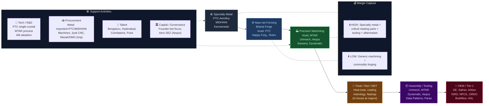

# Precision Engineering — India Value Chain Analysis

*Prepared: July 2026. Market caps are approximate as of ~July 2026; verify before acting.*

---

## 0. Segment definition

**Precision engineering** here means the manufacture of high-tolerance, mission- or life-critical metal (and increasingly composite) components and sub-assemblies — machined to microns, forged/cast to net-shape, and validated to aerospace/nuclear-grade quality standards — serving **aerospace, defence, energy (gas turbines, nuclear, oil & gas), medical devices, semiconductors, and high-end industrial/automotive** end-markets.

The defining characteristic is **not the product but the tolerance regime and qualification barrier**: 5–10 micron tolerances, single-digit ppm defect rates, multi-year OEM vendor approvals (Nadcap, AS9100), and material traceability. This separates it from commodity machining/forging (which competes on price and volume). Excluded: pure mass-market auto components and generic fabrication. Included: the aerospace/defence/energy-facing precision arms of larger forging houses (Bharat Forge, Sansera).

**Core product/service flow:**

```mermaid
flowchart LR
    A["🪨 Special metals\nTi / superalloys /\nspecialty steel"] --> B["⚙️ Near-net forming\nForging / Investment\ncasting / bar stock"]
    B --> C["🏭 Precision machining\n5-axis CNC / EDM /\ngrinding to microns"]
    C --> D["🔬 Treatment & test\nHeat-treat / coating /\nNDT / metrology"]
    D --> E["📦 Assembly & integration\nSub-systems / tooling /\nkitted modules"]
    E --> F["👤 OEM / Tier-1\nGE, Safran, Airbus,\nISRO, NPCIL, DRDO"]
    style A fill:#1e293b,stroke:#94a3b8,color:#e2e8f0
    style B fill:#1e3a5f,stroke:#3b82f6,color:#bfdbfe
    style C fill:#14532d,stroke:#22c55e,color:#bbf7d0
    style D fill:#713f12,stroke:#f59e0b,color:#fef3c7
    style E fill:#3b0764,stroke:#a855f7,color:#e9d5ff
    style F fill:#4c0519,stroke:#f43f5e,color:#fecdd3
```

**End customer & what they value most:** Global engine/airframe OEMs and Tier-1s (GE Aerospace, Safran, Rolls-Royce, Honeywell, Collins, Pratt & Whitney, Airbus, Boeing) and Indian strategic buyers (ISRO, NPCIL, DRDO, HAL, BrahMos). They value, in order: **qualification & reliability > on-time delivery > cost**. Once qualified on a critical part, switching is extraordinarily costly — the source of the segment's moat.

**India's global position: Challenger, rising fast.** A credible, cost-advantaged China+1 precision hub closing a genuine capability gap (titanium/superalloy melting, single-crystal casting). Still a follower on frontier materials science and OEM design ownership, but a clear challenger on machined/forged critical components.

---

## 0.5 Quick Scan — Investable Listed Companies

| Company | Ticker | Cap Bucket | Chain Stage | One-Line Investment Thesis | Coverage |
|---|---|---|---|---|---|
| Azad Engineering | NSE: AZAD | Mid (~₹15,800 Cr) | Precision forging + machining (turbine airfoils) | Sole/dual-source on life-critical rotating airfoils for GE/Siemens/MHI energy turbines — 15–20yr LTAs give visibility market treats as pure defence cyclical | Well-covered |
| MTAR Technologies | NSE: MTARTECH | Mid (~₹16,800 Cr) | Ultra-precision assemblies (nuclear/space/H₂) | Clean-energy (electrolyser) optionality on top of ISRO/NPCIL base; margin recovery underappreciated | Well-covered |
| Unimech Aerospace | NSE: UNIMECH | Mid (~₹6,000 Cr) | Aero tooling + precision components | Asset-light, ~30%+ margin tooling niche; nuclear + semiconductor order additions not in consensus | Moderate |
| PTC Industries | NSE: PTCIL | Mid/Large (~₹20,000 Cr+, approx) | Titanium/superalloy castings (Aerolloy) | Only Indian integrated Ti + superalloy melt-to-machine complex — import-substitution monopoly optionality | Moderate |
| Bharat Forge | NSE: BHARATFORG | Large (~₹83,000 Cr) | Forging + defence (Kalyani Strategic) | Defence order book ~₹9,500 Cr in carved-out subsidiary; hidden inside an "auto forger" multiple | Well-covered |
| Sansera Engineering | NSE: SANSERA | Mid/Large (~₹20,000 Cr) | Precision machined/forged components | Aerospace + defence + tech-agnostic pivot re-rating a legacy auto-parts label | Well-covered |
| Paras Defence | NSE: PARAS | Mid (~₹9,600 Cr) | Defence optics + heavy engineering | Electro-optics + space optics niche monopoly; drone/anti-drone optionality | Moderate |
| Data Patterns | NSE: DATAPATTNS | Mid | Defence electronics (precision systems) | FY26 order inflow +216% YoY; vertically integrated design-to-build rarity | Moderate |
| Jyoti CNC Automation | NSE: JYOTICNC | Mid (~₹17,900 Cr) | Capital equipment (5-axis CNC machines) | The "picks-and-shovels" supplier to the whole chain; aero/defence order mix richening margins | Moderate |
| Dynamatic Technologies | NSE: DYNAMATIC | Small/Mid | Aero-structures + hydraulics | Airbus/Boeing build-to-print; turnaround + defence entry under-modelled | Under-researched |
| Rolex Rings | NSE: ROLEXRINGS | Small (~₹4,400 Cr) | Forged/machined bearing rings | Bearing-ring niche with aero/defence/windmill diversification beyond auto | Under-researched |
| Happy Forgings | NSE: HAPPYFORGE | Mid | Heavy precision forging | Diversification into non-auto (industrial, defence, wind) | Moderate |
| Aequs | NSE: AEQUS | Small/Mid (Recently listed FY26) | Vertically-integrated aero contract mfg | Only Indian aerospace SEZ ecosystem; consumer-durable arm masks aero margin ramp | Under-researched |
| Gala Precision Engg | NSE: GALAPREC | Micro (Recently listed FY25) | Precision springs & fasteners | 10% domestic disc-spring share; renewables/railway/EV diversification | Under-researched |
| TechEra Engineering | NSE SME: TECHERA | Micro (SME, FY25) | Aero tooling & precision machining | SME-listed pure aero-tooling play; discovery-stage | Undiscovered |

**Where the under-researched opportunity sits:** The most inefficiently priced pocket is the **Small/Micro and recently-listed cohort** (Dynamatic, Rolex Rings, Aequs, Gala, TechEra) plus the **hidden-precision-arm-inside-a-conglomerate** case (Bharat Forge's Kalyani Strategic, Sansera's aerospace). The marquee names (Azad, MTAR, Unimech, PTC) are structurally superb but carry 60–140x P/E — the mispricing there is directional (order-book/margin surprise), not valuation-cheapness. The genuine "cheap + good" combinations are the diversifying legacy forgers whose defence/aero mix the market still values on an auto multiple.

---

## 1. Value chain map — primary activities

### 1.1 Inbound logistics — specialty raw material
- **What it involves:** Sourcing aerospace-grade titanium sponge, nickel/cobalt superalloys (Inconel, Rene), maraging & specialty steels, and forging billets — most historically **imported** (Timet, ATI, VSMPO, Carpenter). Material traceability and mill certification are non-negotiable.
- **Cost/differentiation drivers:** Metal cost is 30–50% of COGS; import dependence creates FX + lead-time risk. The single biggest India bottleneck. Whoever domesticates melt-and-cast captures structural margin.
- **Indian players:** **PTC Industries (Aerolloy Technologies)** — first Indian titanium + superalloy melting plant (Lucknow SMTC, inaugurated 2025); **MIDHANI (Mishra Dhatu Nigam, NSE: MIDHANI)** — PSU, superalloys/titanium for strategic use; **Kalyani group** (specialty steel). India's weakest, fastest-improving stage.

### 1.2 Operations — forming + machining (the core)
- **What it involves:** Near-net forging / investment casting → multi-axis CNC machining, EDM, grinding, honing to micron tolerances. The heart of value creation.
- **Cost/differentiation drivers:** Capital intensity (5-axis machines ₹2–5 Cr each), yield/scrap rates, and — decisively — **OEM qualification**. Labour-cost arbitrage (India ~1/3 of Western) is real but secondary to capability.
- **Indian players:** *Machining/critical components:* Azad, MTAR, Unimech, Aequs, Dynamatic. *Forging:* Bharat Forge, Sansera, Happy Forgings, Ramkrishna Forgings, Rolex Rings, CIE Automotive India. *Casting:* PTC Industries, Craftsman Automation. No PLI directly; defence indigenisation functions like one.

### 1.3 Outbound logistics — delivery to OEM/Tier-1
- **What it involves:** Serialised, documented, often air-freighted delivery of low-volume high-value parts into global OEM chains under long-term agreements (LTAs).
- **Drivers:** On-time-in-full (OTIF) performance gates the next order. SEZ/FTWZ status (Aequs) reduces duty friction on export re-import cycles.
- **Indian players:** Same manufacturers; no distinct listed logistics layer. Aequs' aerospace SEZ is the notable infrastructure differentiator.

### 1.4 Marketing & sales — qualification-led B2B
- **What it involves:** Sales = winning OEM audits, getting onto approved-vendor lists, converting NPI trials into serial LTAs spanning 10–20 years.
- **Drivers:** Track record, certifications (AS9100, Nadcap), reference customers. Customer concentration is high (visibility plus, negotiation risk).
- **Indian players:** Azad (GE, Siemens Energy, Honeywell, MHI, Eaton), Unimech (global aero OEMs), Aequs (Airbus, Boeing, Safran, Collins, GKN), PTC (Safran, Dassault, BAE, IAI).

### 1.5 Service — MRO, spares, aftermarket
- **What it involves:** Maintenance-repair-overhaul, spares, life-cycle support — structurally the **highest-margin, stickiest** part of aerospace value, currently under-captured by India.
- **Drivers:** Installed-base access and OEM authorisation. India's biggest whitespace.
- **Indian players:** TechEra (MRO tooling), HAL (engine MRO), GMR/Air India MRO JVs (services, not components). Component-level MRO is an upgrade pathway, not a current strength.

---

## 2. Value chain map — support activities

### 2.1 Firm infrastructure (capital allocation & governance)
- **Role:** Capex-heavy with long qualification gestation — patient capital and disciplined promoter capital allocation are decisive.
- **India strength/weakness:** Strong founder-led focus (Azad's Rakesh Chopdar, MTAR, Unimech founders). Governance generally sound in marquee names; watch working-capital intensity (long cycles).

### 2.2 HR management (talent)
- **Role:** Metallurgists, CNC programmers, quality/NDT engineers — a war for scarce talent.
- **India strength/weakness:** Deep engineering-graduate pool (cost advantage) but shortage of experienced aerospace-grade shop-floor talent and metallurgy PhDs. Clustered around Bengaluru (Peenya), Hyderabad, Coimbatore, Pune.

### 2.3 Technology development (R&D / process)
- **Role:** Process innovation (single-crystal casting, additive manufacturing, 5-axis programming, in-line metrology) drives differentiation.
- **India strength/weakness:** Improving — PTC's single-crystal + powder-metallurgy/AM, MTAR's process depth. Still trails on frontier materials science; most design IP sits with OEMs (build-to-print dominates).

### 2.4 Procurement (input & equipment)
- **Role:** Two axes — specialty metal (see 1.1) and **capital equipment** (5-axis CNC, EDM, CMMs), largely imported (DMG Mori, Mazak, Makino) with a domesticating layer.
- **India strength/weakness:** Metal procurement is the weak link; machine-tool procurement is import-heavy but **Jyoti CNC / Lakshmi Machine Works** are climbing the 5-axis ladder. Jyoti CNC is both a supplier *into* this chain and a proxy *for* it.

---

## 3. Five Forces + Capital Cycle analysis

**Part A — Five Forces**

**Supplier power — HIGH.** Specialty metal is concentrated in a few global mills; India imports most, so suppliers hold pricing/lead-time leverage. Capital-equipment suppliers (Mazak, DMG Mori) similarly concentrated. The segment's structural weak point — why PTC/MIDHANI melt capability matters.

**Buyer power — MODERATE-HIGH but two-sided.** Buyers are giant OEMs with enormous price leverage. But once qualified on a critical part, the OEM's switching cost (re-qualification, flight-safety liability) is huge — buyer power collapses post-qualification into a quasi-partnership.

**Threat of new entrants — LOW.** Qualification barrier (5–7 years for a critical part), capital intensity, and metallurgy know-how make entry brutally hard. Reputation is non-transferable. The most attractive feature of the segment.

**Threat of substitutes — LOW-MODERATE.** Little substitution within a given part, but **additive manufacturing** could disintermediate some casting/forging over time (threat to forgers, opportunity for AM adopters like PTC). Composites-for-metal in airframes shifts value between sub-segments.

**Rivalry — MODERATE.** Domestic players are largely non-overlapping (Azad in airfoils, MTAR in assemblies, Unimech in tooling, PTC in castings) — they compete more against global incumbents than each other. Rivalry rises as everyone chases the same China+1 pool.

**Part B — Capital Cycle verdict:** The segment is in a **capital INFLOW phase — mid-stage, heating up.** Signals: an IPO wave (Azad Dec-2023, Jyoti Jan-2024, Gala Sep-2024, Unimech Dec-2024, Aequs Dec-2025, Poojaa Precision 2026), aggressive capacity announcements (PTC ₹1,000+ Cr complex, Azad new plants), and stretched valuations (60–140x earnings). Inflow phases historically precede overcapacity — but the demand side (global aero super-cycle + defence indigenisation) is unusually long and structural, which can sustain the inflow longer than a normal cycle. **Caution warranted on valuation, not on the sector thesis.**

**Part C — Investor implication:** The **operations layer (machining + forming) with locked-in LTAs** is most structurally attractive — visible multi-year revenue, high switching costs. Be wary of **generic capacity added by new/undifferentiated entrants** riding the IPO wave without qualifications — where eventual margin compression lands. Biggest risk to the thesis: **a global aerospace demand air-pocket (OEM production cut/recession)** landing as India's freshly-added capacity commissions — the classic capital-cycle whipsaw. Secondary risk: valuations already discount years of flawless execution; any qualification delay or margin slip de-rates hard.

**Summary table:**

| Force | Intensity | Key Driver |
|---|---|---|
| Supplier power | High | Imported specialty metal + machine tools, concentrated |
| Buyer power | Moderate-High | Giant OEMs, offset by post-qualification lock-in |
| Threat of new entrants | Low | 5–7yr qualification, capex, metallurgy know-how |
| Threat of substitutes | Low-Moderate | Additive mfg + composites shift value over time |
| Rivalry | Moderate | Domestic players mostly non-overlapping niches |

**Overall structural attractiveness: HIGH** — qualification barriers + switching costs create durable moats for incumbents.
**Capital cycle phase: INFLOW (mid-stage)** — IPO wave + capacity build + rich valuations, sustained by a structural demand super-cycle.
**Investor stance: SELECTIVE** — accumulate qualified LTA-backed incumbents on pullbacks; avoid undifferentiated IPO-wave capacity at peak multiples.

---

## 4. GVC governance & India's position

Export-oriented chain (Azad, Aequs, PTC, Unimech have large export shares) — full GVC framework applies.

- **Lead firms:** GE Aerospace, Rolls-Royce, Safran, Pratt & Whitney, Honeywell, Airbus, Boeing, Siemens Energy, MHI. They own design, certification, the customer.
- **Governance type: predominantly CAPTIVE → migrating to MODULAR/RELATIONAL.** Indian firms started captive (build-to-print, buyer-specified, monitored). The best (Azad, MTAR, PTC) are moving to relational — trusted, hard-to-replace LTA partners — and even modular where they self-certify to codified specs. This upgrade is the investment story.
- **Value capture map:** OEMs capture the lion's share (design IP + aftermarket + brand). Within manufacturing, **forming + machining of critical rotating parts** captures the richest margins (Azad EBITDA ~30%+; Unimech tooling ~30%+); **generic machining/forging** captures far less (10–18%). Raw-material and machine-tool suppliers capture stable margins; MRO/aftermarket (mostly outside India today) is the fattest untapped pool.
- **India's position & trajectory:** Rising from Tier-2/captive toward Tier-1/relational. Upgrade ladder in motion: **process** (yield, 5-axis) → **product** (airfoils, single-crystal castings) → **functional** (Aerolloy into materials + AM; some design collaboration). Not yet at **chain upgrade** (owning platforms/aftermarket) — the decade-ahead prize.

---

## 5. Key linkages & leverage points

1. **Raw material ↔ Operations:** Domestic Ti/superalloy melt (PTC, MIDHANI) de-risks and re-margins every downstream machiner. The chain's most important linkage — India's Achilles heel becoming a moat.
2. **Qualification ↔ Sales:** A completed OEM qualification is simultaneously a sunk cost and the primary sales asset. Coordination between quality/NDT and business development *is* the business model.
3. **Technology (process) ↔ Operations:** 5-axis + AM + in-line metrology compress cost and unlock parts previously un-makeable in India — expanding the addressable pool.
4. **Capital equipment ↔ Capacity:** Machine-tool lead times (12–18 months) gate how fast capacity commissions — the timing risk in the capital cycle.
5. **Defence indigenisation policy ↔ Domestic demand:** Positive-indigenisation lists and offset rules convert policy directly into order books (Bharat Forge/Kalyani, Data Patterns, Paras).

**Highest-leverage intervention:** **Domesticating aerospace-grade specialty-metal melting and casting (Ti + superalloys).** It attacks the supplier-power weakness, captures the fattest upstream margin, and lets Indian firms offer OEMs a *vertically integrated melt-to-machine* value proposition no other low-cost geography can match. PTC's Aerolloy is the purest bet.

---

## 5.5 Upcoming catalysts & key triggers

| Catalyst / Trigger | Timeline | Companies Likely to Benefit |
|---|---|---|
| PTC/Aerolloy titanium + superalloy plant ramp to commercial volumes & OEM approvals | FY26–FY27 | PTC Industries, downstream machiners |
| Global aero build-rate recovery (A320/B737 rate hikes) & OEM de-stocking end | FY26–FY27 | Aequs, Dynamatic, Unimech, Sansera |
| Defence positive-indigenisation lists + artillery/missile order execution | Rolling, FY26–FY27 | Bharat Forge (Kalyani Strategic), Data Patterns, Paras, MTAR |
| Nuclear expansion (SMRs / NPCIL fleet) precision-component orders | FY26–FY28 | MTAR, Unimech (nuclear order additions) |
| Green-hydrogen electrolyser localisation orders | FY26–FY28 | MTAR (electrolyser stacks) |
| New IPOs/listings deepening the investable set (Poojaa Precision 2026, more SMEs) | FY26–FY27 | New entrants; peer re-rating read-across |
| GE/Safran/Rolls-Royce India LTA expansions & new part awards | FY26–FY27 | Azad Engineering, Unimech, Aequs |
| Semiconductor-equipment precision-part localisation (India fab build-out) | FY27+ | Unimech, MTAR, precision machiners |

---

## 6. Indian company landscape

### Listed companies

| Stage | Company | Ticker | Cap Bucket | Revenue / Mkt Cap | PLI? | Coverage | Chain Position |
|---|---|---|---|---|---|---|---|
| Turbine airfoils / forged-machined | Azad Engineering | NSE: AZAD | Mid | Mkt cap ~₹15,800 Cr | No | Well-covered | Leader (niche) |
| Ultra-precision assemblies | MTAR Technologies | NSE: MTARTECH | Mid | Mkt cap ~₹16,800 Cr; OB ~₹2,580 Cr | No | Well-covered | Leader (niche) |
| Aero tooling + precision comp. | Unimech Aerospace | NSE: UNIMECH | Mid (Recently listed FY25) | Mkt cap ~₹6,000 Cr; OB ~₹314 Cr | No | Moderate | Challenger |
| Ti / superalloy castings | PTC Industries (Aerolloy) | NSE: PTCIL | Mid/Large (approx) | Mkt cap ~₹20,000 Cr+ (approx) | No | Moderate | Leader (frontier) |
| Forging + defence | Bharat Forge | NSE: BHARATFORG | Large | Mkt cap ~₹83,000 Cr; defence OB ~₹9,500 Cr | No | Well-covered | Leader |
| Precision machined/forged | Sansera Engineering | NSE: SANSERA | Mid/Large | Mkt cap ~₹20,000 Cr | No | Well-covered | Leader |
| Heavy precision forging | Happy Forgings | NSE: HAPPYFORGE | Mid | Mkt cap ~₹10,000 Cr (approx) | No | Moderate | Challenger |
| Forging (auto/rail/defence) | Ramkrishna Forgings | NSE: RKFORGE | Mid | Mkt cap ~₹13,000 Cr (approx) | No | Moderate | Challenger |
| Forged/machined bearing rings | Rolex Rings | NSE: ROLEXRINGS | Small | Mkt cap ~₹4,400 Cr | No | Under-researched | Niche |
| Precision machining + casting | Craftsman Automation | NSE: CRAFTSMAN | Mid | Mkt cap ~₹18,700 Cr | No | Well-covered | Leader |
| Aero-structures + hydraulics | Dynamatic Technologies | NSE: DYNAMATIC | Small/Mid | Mkt cap ~₹6,000 Cr (approx) | No | Under-researched | Niche |
| Defence optics + heavy eng. | Paras Defence | NSE: PARAS | Mid | Mkt cap ~₹9,600 Cr | No | Moderate | Niche leader |
| Defence electronics (precision) | Data Patterns | NSE: DATAPATTNS | Mid | OB ~₹2,062 Cr (May-26) | No | Moderate | Niche leader |
| 5-axis CNC machines (equipment) | Jyoti CNC Automation | NSE: JYOTICNC | Mid | Mkt cap ~₹17,900 Cr | No | Moderate | Leader (equipment) |
| Textile/CNC machinery | Lakshmi Machine Works | NSE: LAXMIMACH | Mid | Mkt cap ~₹18,000 Cr (approx) | No | Moderate | Leader (equipment) |
| Special metals (PSU) | Mishra Dhatu Nigam | NSE: MIDHANI | Mid | Mkt cap ~₹8,000 Cr (approx) | No | Moderate | Niche (strategic) |
| Superalloys / cutting tools | Kennametal India | NSE: KENNAMET | Mid | Mkt cap ~₹6,000 Cr (approx) | No | Moderate | Niche (tooling) |
| Vertically-integrated aero CM | Aequs | NSE: AEQUS | Small/Mid (Recently listed FY26) | IPO ~₹922 Cr; listed Dec-2025 | No | Under-researched | Challenger |
| Precision springs/fasteners | Gala Precision Engg | NSE: GALAPREC | Micro (Recently listed FY25) | IPO ₹168 Cr; listed Sep-2024 | No | Under-researched | Niche |
| Precision tooling / MRO (SME) | TechEra Engineering | NSE SME: TECHERA | Micro (SME, FY25) | Listed Oct-2024 | No | Undiscovered | Emerging |
| Precision components (SME) | Ratnaveer Precision | NSE: RATNAVEER | Micro (SME) | Listed FY24 | No | Undiscovered | Emerging |
| Al die-cast / precision (SME) | Poojaa Precision Engg | NSE SME (pending) | Micro (SME, FY26) | IPO ~₹160 Cr, listing Aug-2026 | No | Undiscovered | Emerging |

*Market caps approximate as of ~July 2026, marked (approx) where not directly verified. No dedicated PLI for this niche — "No" throughout — though defence indigenisation and Make-in-India function as de-facto support.*

### Unlisted / private companies

| Stage | Company | Type | Business Description | Scale | Notes |
|---|---|---|---|---|---|
| Aero precision components | Tata Advanced Systems (TASL) | Conglomerate subsidiary | Aero-structures, fuselages (Airbus C295, Apache), engine parts | Large | Part of Tata Sons; potential future value unlock |
| Aero-structures | Mahindra Aerospace | Conglomerate subsidiary | Aerostructures + components | Mid | Mahindra group |
| Precision machining | TAL Manufacturing / Tata | Conglomerate subsidiary | Aero components, robotics | Mid | Tata group |
| Special steel/forging | Kalyani Strategic Systems | Carve-out subsidiary | Defence systems, artillery, aero forgings | Large | Bharat Forge subsidiary; separate-listing optionality |
| Titanium sponge | KMML / private | PSU / Private | Titanium sponge (mostly pigment-grade) | Mid | Aerospace-grade Ti still largely imported |
| Precision castings | Investment-casting cos (various) | Private/MSME | Fragmented investment-casting base | Small | Consolidation candidates |

**Conglomerate check:** Present and material. **Tata** (TASL — biggest private aero-structures play, unlisted), **Bharat Forge/Kalyani** (listed leader + defence carve-out), **Mahindra** (aerospace). Their presence raises the entry barrier and creates M&A/acquisition-target optionality for pure-plays. A TASL listing would be a landmark event for the chain.

### Notable companies — deeper notes

**Azad Engineering (NSE: AZAD)**
- **Stage in chain:** Precision forging + 5-axis machining of turbine airfoils and rotating components.
- **Cap bucket:** Mid — ~₹15,800 Cr.
- **Analyst coverage:** Well-covered.
- **What makes them interesting:** Sole/dual-source on life-critical 3D airfoils/blades for global energy and aerospace turbine OEMs (GE, Siemens Energy, MHI, Honeywell, Eaton) under 15–20 year LTAs. Extraordinary switching costs; among the highest-margin precision names in India.
- **Key financials:** EBITDA margin ~30%+; revenue growth 25–30%+; very rich P/E (~140x range).
- **PLI beneficiary:** No.
- **Watch factor:** New capacity commissioning; conversion of energy-transition (hydrogen turbine) part awards.
- **Investment angle:** Market oscillates between euphoric defence multi-bagger pricing and valuation de-rating. Under-appreciated is the *energy* (gas/steam turbine) LTA book — long-dated, less cyclical than defence sentiment implies, tied to global power-capacity additions. If energy revenue is re-rated as annuity-like rather than cyclical, the premium is more defensible than bears assume; any qualification slip is punished hard.

**PTC Industries (NSE: PTCIL) — via Aerolloy Technologies**
- **Stage in chain:** Titanium + superalloy melting, casting (incl. single-crystal), forging, machining — the upstream frontier.
- **Cap bucket:** Mid/Large (approx).
- **Analyst coverage:** Moderate.
- **What makes them interesting:** The only Indian player building an *integrated melt-to-machine* Ti and superalloy complex (Lucknow SMTC, inaugurated 2025), with OEM relationships (Safran, Dassault, BAE, IAI, Honeywell) and BrahMos titanium orders. Attacks the chain's biggest weakness — import dependence on aerospace metal.
- **Key financials:** High-growth, high-multiple; large capex phase compresses near-term returns.
- **PLI beneficiary:** No (strategic-materials support via UP defence corridor).
- **Watch factor:** Commercial-volume ramp and OEM qualification of the Ti/superalloy plant through FY26–27.
- **Investment angle:** Market can't yet model an import-substitution monopoly with no domestic precedent. If Aerolloy qualifies as an approved melt source for global OEMs, PTC moves from "casting company" to "India's strategic-metals gateway" — capturing upstream margin *and* pulling downstream machining. Consensus treats the capex as risk rather than a moat being dug; catalyst is the first serial OEM melt-source approval.

**Unimech Aerospace (NSE: UNIMECH)**
- **Stage in chain:** Aero tooling (jigs, fixtures, GSE) + high-precision components/assemblies.
- **Cap bucket:** Mid — ~₹6,000 Cr; recently listed (Dec 2024).
- **Analyst coverage:** Moderate.
- **What makes them interesting:** Asset-light, build-to-print + build-to-spec model with ~30%+ margins and blue-chip global aero/defence customers. Order book expanding into **nuclear (~₹87 Cr) and semiconductor** — diversification beyond aero tooling.
- **Key financials:** OB ~₹314 Cr; very high margins; premium multiple (~65–70x).
- **PLI beneficiary:** No.
- **Watch factor:** Nuclear + semiconductor order conversion; new-facility ramp.
- **Investment angle:** Consensus values it as an aero-tooling niche. Nuclear + semiconductor additions signal a repeatable *"precision-hard-to-make-parts-for-any-strategic-sector"* platform — a wider TAM than the tooling label. If semiconductor-equipment localisation plays out, Unimech is an under-modelled beneficiary.

**Bharat Forge (NSE: BHARATFORG) — Kalyani Strategic Systems**
- **Stage in chain:** Forging + precision machining across auto, aero-engine, and defence; defence carved into Kalyani Strategic Systems.
- **Cap bucket:** Large — ~₹83,000 Cr.
- **Analyst coverage:** Well-covered.
- **What makes them interesting:** A ~₹9,500 Cr defence order book (artillery incl. a ₹3,417 Cr guns contract) sits inside a subsidiary, plus growing aero-engine forging capability — all wrapped in a stock the market still anchors to commercial-vehicle forging cyclicality.
- **Key financials:** Diversified; defence + aero the margin-accretive growth engines.
- **PLI beneficiary:** No (defence indigenisation beneficiary).
- **Watch factor:** Kalyani Strategic execution; any value-unlock (separate listing) of the defence arm.
- **Investment angle:** Priced as an auto-forging cyclical with a defence "option." The mispricing is the *quality and duration* of the defence + aerospace book in Kalyani Strategic — a potential sum-of-parts re-rating if the defence business is valued on a defence multiple rather than blended into the auto parent.

**Aequs (NSE: AEQUS)**
- **Stage in chain:** Vertically-integrated aerospace contract manufacturing (forging→machining→assembly) within a dedicated aero SEZ + consumer-durables arm.
- **Cap bucket:** Small/Mid — recently listed (Dec 2025).
- **Analyst coverage:** Under-researched.
- **What makes them interesting:** India's only aerospace-SEZ ecosystem model, supplying A320/B737/A350/B787 for Airbus, Boeing, Safran, Collins, GKN, Honeywell. Consumer-durables/electronics arm diversifies but dilutes aero-margin optics.
- **Key financials:** ₹922 Cr IPO; vertically integrated cost model; margins ramping.
- **PLI beneficiary:** No.
- **Watch factor:** Aero build-rate recovery; aero-segment margin ramp separate from the consumer arm.
- **Investment angle:** Fresh listing, thin coverage, consumer-durables revenue masking the aerospace engine. If the global aero build-rate recovers, the SEZ vertical-integration model (duty efficiency + captive supply chain) is a structural cost moat the market hasn't separated from the lower-margin consumer business.

**Dynamatic Technologies (NSE: DYNAMATIC)**
- **Stage in chain:** Aero-structures (flap-track beams for Airbus, Boeing) + hydraulic gear pumps + defence.
- **Cap bucket:** Small/Mid.
- **Analyst coverage:** Under-researched.
- **What makes them interesting:** Long-standing build-to-print relationships with Airbus/Boeing on critical airframe assemblies — a hard-won position — plus a turnaround and defence-entry angle.
- **Key financials:** Improving margins post-restructuring; smaller scale than peers.
- **PLI beneficiary:** No.
- **Watch factor:** Debt reduction, defence order wins, aero build-rate flow-through.
- **Investment angle:** Chronically under-covered and historically balance-sheet-constrained, so the market discounts genuine Tier-1 airframe qualifications. A cleaner balance sheet + defence order inflow could re-rate it from "troubled legacy" to "qualified aero-structures Tier-1" — the qualifications are already the moat; the market is pricing the past.

---

## 7. Strategic insight & investment angles

**Part A — Non-obvious strategic insight:** Consensus frames precision engineering as a **defence** story riding order-book momentum. Mapping the full chain reveals two things it misses. First, **the real bottleneck — and the real prize — is upstream, in specialty-metal melting, not downstream in machining.** Everyone is adding machining capacity; almost no one can melt aerospace Ti/superalloy in India. That inverts the usual "value sits downstream" intuition — the scarce, un-competable margin is upstream at PTC/MIDHANI. Second, **the marquee names are mostly *energy and civil-aerospace* businesses wearing a defence valuation.** Azad's turbine airfoils and MTAR's nuclear/hydrogen work are tied to global power and aviation super-cycles that are longer and less lumpy than the defence-order-book sentiment driving prices — the demand is more durable than the volatile multiples imply, even as the multiples themselves are the risk.

**Part B — Blue Ocean opportunity (Four Actions):**
- **Eliminate:** Dependence on imported aerospace-grade metal (treated as a fixed constraint).
- **Reduce:** Fragmentation between melting, casting, and machining (today across different firms and countries).
- **Raise:** Vertical traceability and single-source accountability from melt to finished critical part.
- **Create:** A *sovereign melt-to-machine* offering — an Indian OEM sources a flight-critical Ti part from raw metal to finished component under one roof, one qualification, one country.
- **Value curve reconstructed:** From "low-cost machining sub-supplier" to "integrated strategic-materials partner" — targeting the **non-customer**: OEMs and governments who currently *won't* single-source strategic parts to India because the metal itself is foreign/insecure.
- **Company attempting it:** **PTC Industries / Aerolloy Technologies.** **Probability of success: moderate-to-high but capital- and time-intensive** — the moat is real (no domestic precedent, government backing, OEM relationships) but success hinges on qualifying as an approved melt source, a multi-year process where any technical slip is costly. The highest-optionality, highest-execution-risk bet in the chain.

**Part C — Top 3 priorities for a listed Indian firm seeking durable advantage:**
1. **Move upstream into specialty-metal melting/casting** (or lock long-term captive supply) to convert the supplier-power weakness into an integration moat.
2. **Climb from build-to-print to build-to-spec/design-share** on at least one platform — the only way to escape captive-supplier margin ceilings and capture aftermarket.
3. **Diversify the qualified customer base across sectors** (aero + energy + nuclear + semiconductor) so a single-end-market air-pocket doesn't strand freshly-added capacity — the key defence against the capital-cycle downturn.

**Part D — Investment angle summary:**
- **Azad Engineering:** Market underprices the *annuity-like, less-cyclical energy-turbine LTA book* buried under defence sentiment; catalyst is energy revenue re-rating + hydrogen-turbine awards.
- **PTC Industries:** Market treats the ₹1,000 Cr+ metals capex as risk rather than a soon-to-be-monopoly moat; catalyst is the first serial OEM melt-source qualification.
- **Unimech Aerospace:** Priced as an aero-tooling niche; nuclear + semiconductor additions reveal a broader strategic-precision platform the consensus TAM ignores.
- **Bharat Forge:** A high-quality defence book (Kalyani Strategic, ~₹9,500 Cr) blended into an auto-forging multiple; catalyst is sum-of-parts recognition or a defence-arm value unlock.
- **Aequs:** Fresh listing where the consumer-durables arm masks an integrated aerospace-SEZ cost moat; catalyst is the global aero build-rate recovery flowing to aero-segment margin.
- **Dynamatic Technologies:** Under-covered; market prices its troubled past, not its Airbus/Boeing airframe qualifications; catalyst is deleveraging + defence order inflow.

---

## 8. Value chain diagram (Mermaid)

---

## Sources
- Equitymaster — Precision Engineering Stocks (Dec 2024, Jun 2025)
- Screener.in — Azad, Unimech, MTAR, Paras, Sansera, Jyoti CNC
- PTC Industries / Aerolloy — Ti & superalloy plant (Indian Defence News, 2025); Aerolloy–Honeywell partnership (ScanX)
- Aequs IPO — Chittorgarh; feature-asia.com aerospace supply chain
- Unimech IPO peer comparison (Upstox); Azad vs Unimech / Azad vs MTAR (Trade Brains)
- Gala Precision IPO (Chittorgarh); TechEra NSE SME debut (Business Standard); Poojaa Precision IPO (Goodreturns)
- Bharat Forge / Rolex Rings context (SecondSource, InvestorZone)
- Defence stocks — Paras/Data Patterns/Dynamatic (Business Standard); Best Defence Stocks 2026 (Univest)
- MTAR & Unimech share prices (Business Standard, Jul 2026)

---

## Cross-Chain References

Companies in this analysis that also appear in other saved value-chain reports in this folder:

| Company | Ticker | Also appears in (saved report) |
|---|---|---|
| Bharat Forge | BHARATFORG | *Aerospace and Defense Technology*, *Railway*, *Shipbuilding* (defence forgings) |
| MTAR Technologies | MTARTECH | *Nuclear Power Generation*, *Aerospace and Defense Technology*, *Renewable Energy* (hydrogen/electrolyser) |
| Paras Defence | PARAS | *Aerospace and Defense Technology* |
| Data Patterns | DATAPATTNS | *Aerospace and Defense Technology* |
| Sansera Engineering | SANSERA | *Aerospace and Defense Technology* (auto/aero components) |
| MIDHANI | MIDHANI | *Aerospace and Defense Technology*, *Nuclear Power Generation*, *Shipbuilding* (special metals) |
| Dynamatic Technologies | DYNAMATIC | *Aerospace and Defense Technology* |

*Note: strong overlap with the Aerospace & Defense Technology, Nuclear Power, Shipbuilding, and Railway analyses — precision engineering is the shared manufacturing substrate beneath all of them.*
