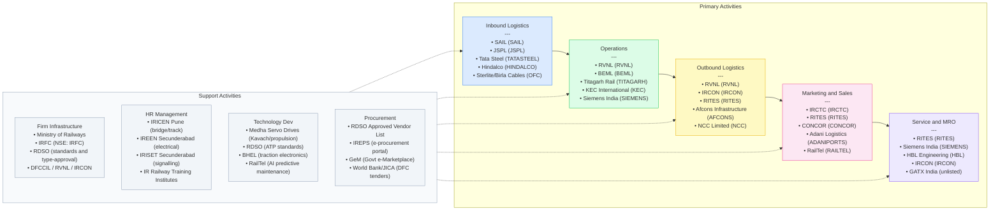

# India Value Chain Analysis — Railways
**Date:** June 2026 | **Analyst:** India Value Chain Skill v2.0
**Segment:** Railways — Rolling Stock, Rail Infrastructure, Signalling & Telecom, OHE, Metro Rail, DFC, Ancillaries/MRO

---

## 0. Segment Definition

### Precise boundary
This analysis covers the full value chain of the Indian railways ecosystem:
- **Rolling stock**: Locomotives (electric, diesel), passenger coaches (LHB, Vande Bharat trainsets, sleeper EMUs), freight wagons (BOXN, BFKN, tank wagons), EMUs/MEMUs, metro rail cars, DEMU
- **Rail infrastructure**: Track (rails, sleepers/ties, ballast, fishplates), fasteners, turnouts/points, bridges, tunnels, earthworks, ROB/RUB
- **Signalling & telecom**: Conventional interlocking, electronic interlocking, ATP systems (Kavach/TCAS), ETCS Level 2, communication-based train control (CBTC for metro), optical fibre networks (OFC), radio-based systems
- **Overhead electrification (OHE)**: 25 kV AC traction systems, power substations (TSS), auto transformer feeding, third-rail DC systems (metro)
- **Metro rail**: Turnkey metro projects, civil works, systems (signalling, OHE, AFC), rolling stock for urban mass rapid transit
- **Dedicated Freight Corridors (DFC)**: EDFC (1,337 km, complete Oct 2023), WDFC (1,506 km, complete Mar 2026), three new corridors under DPR (East Coast, East-West, North-South; ~₹4 lakh crore estimated)
- **Ancillaries & MRO**: Wheels, axles, bogies, brake systems, pantographs, couplers, HVAC, seating, MRO services

**Excluded**: Road/port freight forwarding, aviation, passenger tour operations (except IRCTC's ticketing monopoly as a distribution node).

### Core product/service flow
```
Raw materials (steel, aluminium, copper, electronics)
        ↓
Component manufacturing (wheels, bogies, electrical systems, signalling hardware)
        ↓
Rolling stock assembly / civil construction (track, OHE, structures)
        ↓
Testing, RDSO certification, commissioning
        ↓
Indian Railways / Metro corps / DFCCIL (owner/operator)
        ↓
Freight customers / passengers (end users)
        ↓
MRO / Periodic Overhaul (POH) lifecycle services
```

### End customer and what they value most
- **Indian Railways (MoR/GoI)**: Capital efficiency, indigenisation %, safety (Kavach rollout), on-time performance, freight loading (target 3,000 MT by 2030)
- **State metro corporations (DMRC, BMRCL, MMRDA, etc.)**: Project cost, timely delivery, ridership yield, energy efficiency
- **Freight shippers (steel, cement, coal, FMCG)**: Transit time reliability, cost per tonne-km, wagon availability, DFC throughput
- **Passengers**: Punctuality, safety, comfort (Vande Bharat premium), ticketing ease (IRCTC)

### India's global position
| Sub-segment | Global Position | Rationale |
|---|---|---|
| Railway network scale | **Leader** | 4th largest network (67,000+ route km); 2nd largest freight mover by volume |
| Rolling stock manufacturing | **Challenger** | ICF/CLW world-class volume; Vande Bharat is export-aspirant; still imports traction technology |
| Signalling/ATP | **Challenger → Leader** | Kavach is world's cheapest ATP (~₹50 lakh/km vs ₹2 Cr+ for ETCS L2 in Europe); potential export product |
| High-speed rail | **Nascent** | Mumbai-Ahmedabad HSR (Shinkansen JV) under construction; no domestic HSR technology |
| Metro systems | **Follower → Challenger** | Deep international partnerships (Alstom, Siemens, CRRC); BEML developing indigenous capability |
| DFC freight logistics | **Challenger** | EDFC + WDFC now complete; transformative for logistics cost; 3 more corridors planned |

---

## 1. Value Chain Map — Primary Activities

### 1A. Inbound Logistics
**What it involves:**
Sourcing and delivery of raw materials and sub-components to manufacturing plants:
- **Steel**: Rails (60 kg/m, 90 UTS high-tensile), steel sleepers, wagon body steel (IRSM-41), structural sections
- **Non-ferrous metals**: Copper (OHE catenary wire), aluminium (coach body extrusions for LHB/Vande Bharat)
- **Electronics**: Microcontrollers, field-programmable gate arrays (FPGAs), sensors, IGBT modules for traction converters
- **Rubber/composites**: Brake pads, vibration isolators, primary/secondary suspension components
- **Imported critical items**: Traction motors (historically Siemens/Alstom), bearings (SKF, TIMKEN), glass, HVAC compressors

**Key cost/differentiation drivers:**
- Steel (rails, sleepers, wagon bodies) = 40–55% of rolling stock/infrastructure material cost; domestic sourcing from SAIL/Tata/JSW provides ~15% cost advantage over import
- Electronics remain a vulnerability; India imports ~70% of power electronics components (IGBTs, gate drivers) from Europe/Japan/China
- Logistics from port to inland plant adds 3–5% to cost of imported components
- RDSO's approved vendor list (AVL) creates a controlled inbound ecosystem — only AVL-approved suppliers can supply IR; this is a moat and entry barrier simultaneously

**Indian players:**
- **SAIL** (NSE: SAIL) — sole domestic rail manufacturer (Bhilai Steel Plant, 1 MT capacity rail rolling mill); supplies 90 UTS and R-350 grade rails
- **Jindal Steel & Power** (NSE: JSPL) — rail production at Raigarh; competes with SAIL for IR rail tenders; supplies 60 kg head-hardened rails
- **Tata Steel** (NSE: TATASTEEL) — supplies wagon-body steel, LHB coach steel; IRSM-41 approved
- **Hindalco** (NSE: HINDALCO) — aluminium extrusions for LHB/Vande Bharat coach bodies (via subsidiary Novelis)
- **Sterlite Technologies / Birla Cables** — OFC cable supply for RailTel's fibre networks

---

### 1B. Operations (Manufacturing & Construction)

**What it involves:**
The core value-add stage: fabrication, assembly, testing, and civil construction across all sub-segments.

#### Rolling Stock Manufacturing
- **Locomotives**: Diesel (DLW, Varanasi — IR captive), Electric (CLW, Chittaranjan — IR captive); Siemens 9,000 HP WAG-12B at Dahod under 1,200-loco contract (€3B, 2023)
- **Passenger coaches**: ICF Chennai (LHB coaches, ~2,000/year capacity), MCF Raebareli (Vande Bharat trainsets); BEML (metro, Vande Bharat sleeper), Titagarh (metro for Kolkata, freight wagons)
- **Freight wagons**: Texmaco Rail (Belgharia), Titagarh (Titagarh), Jupiter Wagons (Kolkata), Braithwaite (Kolkata, unlisted), BHEL (defence wagons)
- **EMU/MEMU**: ICF, BEML, Titagarh; MEMU manufacturing increasingly outsourced to private sector
- **Metro rolling stock**: BEML (Delhi, Jaipur, Kolkata, Bengaluru metro), Alstom India (Delhi Metro Line 6, MEMU), CRRC (Pune Metro), CAF (Kochi Metro)

#### Track & Civil Infrastructure
- **Track laying**: Major EPC contractors (L&T, Afcons, KEC International, RVNL, IRCON)
- **Sleeper manufacturing**: Private concrete sleeper plants (SPML, Dilip Buildcon supply chain); pre-stressed concrete (PSC) sleepers dominate
- **Fasteners**: Pandrol (UK subsidiary in India), Rahee Industries (unlisted, Kolkata)
- **Bridges/tunnels**: L&T, Afcons (Shapoorji Pallonji), NCC Ltd, Welspun Enterprises

#### Signalling & Telecom
- **Conventional relay interlocking**: Siemens India, Alstom India, Kyosan (JV with Indian partners)
- **Electronic interlocking**: Medha Servo Drives (unlisted, Hyderabad), Kernex Microsystems (BSE), HBL Engineering (NSE: HBL), RailTel
- **Kavach TCAS**: Medha Servo Drives (largest share), HBL Engineering, Kernex Microsystems; Quadrant Future Tek (NSE: QUADPRO, listed Jan 2025, cable-based Kavach subsystem)
- **CBTC for metro**: Alstom (Urbalis), Siemens (Trainguard), Thales (SelTrac) — all through Indian subsidiaries

#### OHE & Electrification
- **OHE civil/erection**: Texmaco Rail EPC Division (post-Kalindee merger), KEC International Rail & Metro segment, L&T Power Transmission, RVNL-Siemens consortiums
- **Traction transformers/rectifiers**: Hind Rectifiers (BSE: HINDRECT), BHEL (NSE: BHEL), Siemens India
- **Auto transformers**: BHEL, Siemens, ABB India

**Key cost/differentiation drivers:**
- IR's own production units (CLW, DLW, ICF, MCF) supply ~60% of rolling stock by volume; private OEMs compete for the balance
- RDSO certification is the primary differentiation gate — 18-24 months typical approval cycle; incumbents (ICF, CLW) face no certification cost; private entrants do
- Vande Bharat's semi-high speed capability (160 kmph) requires European-grade propulsion technology → dependency on Alstom/Siemens/Medha partnerships
- Kavach is a "Make in India" winner: 3 licensed vendors, ~₹50 lakh/km cost, vs ₹2 Cr+ for European ATP; 34,000 km rollout pipeline
- Labour cost advantage: India's manufacturing labour is 8-12x cheaper than Western Europe — critical for labour-intensive track laying and coach assembly

---

### 1C. Outbound Logistics

**What it involves:**
- Delivery of rolling stock from manufacturing plant to Railway zones (coaches travel under their own power or on flat cars)
- Transportation of track materials (rails by special rail-carrying wagons, sleepers by bogie flat wagons) to construction sites
- Systems commissioning: OHE energisation, signalling testing, rolling stock trials on test track before zone handover
- For metro projects: inter-city transport of metro cars (special road transporters for large-diameter metro bogies)
- RDSO type-testing and acceptance testing at railway test tracks (Lucknow RRI, Pune test track)

**Key cost/differentiation drivers:**
- For project contractors, mobilisation and site logistics = 8–12% of project cost
- Last-mile delivery to remote mountain/coastal projects (Northeast, J&K) carries 15-25% premium on civil work
- Rolling stock handover involves mandatory commissioning runs; delays here directly impact contractor revenue recognition

**Indian players:**
- **RVNL** (NSE: RVNL) — manages project logistics for IR's capital works including rolling stock delivery
- **IRCON** (NSE: IRCON) — cross-border project delivery including exported railway systems (Myanmar, Sri Lanka, Bangladesh)
- **RITES** (NSE: RITES) — inspection and quality assurance for rolling stock exports; manages export financing for IR

---

### 1D. Marketing & Sales

**What it involves:**
This is a predominantly B2G (business-to-government) chain:
- Rolling stock/infrastructure: Tendering via IR's IREPS (Indian Railway E-Procurement System) and zonal railway tenders; metro tenders through respective SPVs
- IRCTC: B2C ticketing (monopoly on online passenger ticketing, 700M+ tickets/year in FY25); catering B2C; tourism packages
- Private freight (wagon leasing, PFT): B2B sales to shippers; Adani Logistics operates 101 private freight trains
- RITES: Export marketing of IR rolling stock to neighbouring/African countries; consulting mandates

**Key cost/differentiation drivers:**
- Tendering is price-driven for standard items (wagons, concrete sleepers); L1-wins dominate
- Technical differentiation matters for complex systems (ATP, metro CBTC, HSR) — qualifications, track record, technology partnerships are the moat
- IR's IREPS platform creates procurement transparency but also commoditises suppliers
- IRCTC's monopoly on internet ticketing (₹1,426 Cr revenue in FY25) is a regulatory moat — booking fee per ticket is a near-zero-cost revenue stream
- Metro projects are often single-bid or duopoly situations (BEML + one foreign OEM consortium)

**Indian players:**
- **IRCTC** (NSE: IRCTC) — monopoly ticketing, catering concession, tourism packages; FY25 internet ticketing ~₹1,426 Cr
- **RITES** (NSE: RITES) — rolling stock exports, consulting; record order book ~₹8,900 Cr as of FY25
- **Adani Logistics** (subsidiary of NSE: ADANIPORTS) — B2B freight train operator; 101 trains, largest private operator
- **Gateway Rail Freight** (unlisted, Blackstone-backed) — container train operator, intermodal logistics on DFC

---

### 1E. Service (After-Sales, MRO, Overhaul)

**What it involves:**
- **Periodic Overhaul (POH)**: IR conducts POH of coaches every 18-24 months at 45 workshops (Golden Rock, Perambur, Jodhpur, etc.); EMU/loco overhaul at Loco Sheds
- **Kavach maintenance**: Post-installation O&M contracts; Medha, HBL, Kernex hold O&M rights in their licensed zones
- **Metro O&M**: DMRC, BMRCL, MMRDA operate in-house with OEM spares support (Alstom, Siemens, BEML); some outsourced (Alstom holds O&M contract for Delhi Metro BRTS)
- **DFC O&M**: DFCCIL contracting multi-year O&M for track/OHE/signalling; Siemens India holds O&M for WDFC traction system
- **Wagon leasing MRO**: GATX India (10,000+ wagon fleet), Srei Equipment Finance (wagon financing); workshop maintenance at private sidings

**Key cost/differentiation drivers:**
- MRO is the most under-monetised segment in Indian railways — IR's 45 workshops handle ~90% in-house; private MRO is nascent
- Spare parts monopoly (RDSO-approved vendors only) creates high switching costs for maintenance
- DFC O&M contracts (multi-year, annuity-like) are the highest-quality revenue streams in the chain — stable, government-backed
- As Vande Bharat fleet scales to 400+ trainsets, traction system MRO (Alstom/Medha) will be a ₹500–1,000 Cr/year market by 2027
- IR's own workshops employ 1.2 million workers — political economy makes privatisation of MRO slow

**Indian players:**
- **RITES** (NSE: RITES) — MRO consulting, export rolling stock servicing
- **IRCON** (NSE: IRCON) — civil O&M for IR projects
- **Siemens India** (NSE: SIEMENS) — DFC traction O&M, loco O&M (WAG-12B)
- **Alstom India** (unlisted subsidiary of global Alstom) — metro and Vande Bharat component MRO
- **Medha Servo Drives** (unlisted, Hyderabad) — propulsion system MRO for Vande Bharat fleet
- **GATX India** (unlisted, US parent) — private wagon fleet MRO

---

## 2. Value Chain Map — Support Activities

### 2A. Firm Infrastructure

**Role:** Governance, finance, project management, legal/regulatory compliance.

India's railway infrastructure is dominated by GoI entities that simultaneously act as regulator, operator, and project owner — a unique structural characteristic:
- **Ministry of Railways (MoR)**: Policy setter, capital allocator (₹2.52 lakh crore capex in FY26, heading to ₹2.92 lakh crore in FY27)
- **IRFC** (NSE: IRFC): Finances IR's rolling stock and infrastructure procurement; borrowing arm of MoR; balance sheet ₹4.5 lakh crore; FY26 PAT ₹7,009 Cr (record)
- **RDSO** (Lucknow, unlisted): Standards-setting and type-approval body — controls product entry into IR supply chain; backlog of certifications is a systemic bottleneck
- **DFCCIL**: SPV executing Eastern and Western DFCs; now entering O&M phase; DPRs for 3 new corridors submitted
- **RVNL** (NSE: RVNL): Project execution arm of IR; largest order book ₹80,000+ Cr; executes electrification, new lines, metro, gauge conversion
- **IRCON** (NSE: IRCON): Executes international railway projects; order book ₹23,800 Cr

**Where Indian firms are strong/weak:**
- Strong: Project finance (IRFC sovereign-backed borrowing at sub-8% cost), project management (RVNL/IRCON track record)
- Weak: Private-sector project management capability for complex multi-technology projects (metro systems integration); over-dependence on public balance sheets

---

### 2B. HR Management

**Role:** Talent acquisition, training, retention for manufacturing, engineering, and project execution.

- IR is the world's largest employer in rail (1.2 million employees); civil service culture dominates
- ICF/CLW/DLW train shop-floor workers through Railway Training Institutes (RTIs) — strong vocational capability
- Signalling/Kavach requires embedded software and systems engineering — a talent gap India is working to fill
- Metro system integration (CBTC, AFC, SCADA) talent is concentrated in Alstom, Siemens, BEML — thin domestic pipeline
- PM Gati Shakti's Human Resource portal aims to create a unified skills database for infrastructure sectors

**Notable institutions:** IRICEN (Pune, bridge/track engineering), IREEN (Secunderabad, electrical), IRISET (Secunderabad, signalling), IRIM (Gorakhpur, mechanical) — IR's own engineering institutes

**Where strong/weak:**
- Strong: Civil/mechanical engineering talent (abundant, competitively priced)
- Weak: Power electronics R&D, embedded systems, train control software, rolling stock systems integration

---

### 2C. Technology Development

**Role:** R&D, indigenous design, product innovation, IP development.

India's railway technology development is at an inflection point:

| Technology Area | Current State | Key Indian Innovators |
|---|---|---|
| Kavach/TCAS ATP | Commercially deployed; world's cheapest ATP | RDSO + Medha + HBL + Kernex |
| Vande Bharat (train design) | ICF-designed indigenously; propulsion still partially imported | ICF, Medha Servo Drives |
| CBTC (metro) | Imported (Alstom, Siemens, Thales); no domestic CBTC vendor | — |
| High-speed rail | Shinkansen technology transfer (HSR Univ, NHSRCL) | NHSRCL + JICA |
| Traction motors/IGBT | Near-zero domestic; BHEL attempting but behind | BHEL (nascent) |
| AI-based predictive maintenance | Pilots underway (RailTel AI platform, IIT collaborations) | RailTel, start-ups |
| Wheel/axle forging | Wholly import-dependent; Bharat Forge entering | Bharat Forge (BHARATFORG) |

**RDSO** remains the gatekeeper for all technology deployment — its certification backlog (often 18–36 months) is the single biggest choke point for technology absorption.

**Make in India push**: IR's Vande Bharat programme targets progressive indigenisation — current content ~70% by value; target 85%+ by 2026.

---

### 2D. Procurement

**Role:** Vendor development, tendering, materials management, quality assurance.

- IR procures through zonal tenders, DG (S&T) tenders, IREPS portal, and Gem (Government e-Marketplace)
- RDSO's Approved Vendor List (AVL) is the procurement gatekeeper — only AVL-listed firms can supply critical safety items
- Metro corporations procure independently (DMRC, BMRCL issue global tenders); often more open to foreign OEMs
- DFC procurement through World Bank / JICA-funded tenders — international competitive bidding; opened market to global players
- IR's Make in India push: >50% domestic content mandatory for rolling stock tenders since 2022

**Notable dynamics:**
- IREPS portal digitised procurement but has not eliminated L1-bias — quality-based procurement remains rare
- For Kavach rollout (34,000 km target), IR has shifted to quality-and-price balanced scoring — a structural improvement
- Vendor finance (IRFC → IR → manufacturer) creates a complex but stable payment chain; delays of 90–180 days are common for private suppliers

---

## 3. Five Forces Analysis

### Force 1: Supplier Power — MEDIUM-HIGH

The railway supply chain operates under RDSO's Approved Vendor List, which creates a **controlled oligopoly** of suppliers for each critical item. For rails: only SAIL and JSPL are qualified — supplier power is HIGH, though IR's monopsony buying power keeps pricing in check. For traction technology (IGBT-based converters, traction motors), India is heavily import-dependent — Siemens, Alstom, ABB, and Mitsubishi are the global oligopolists. India has no domestic IGBT manufacturer, making this a critical vulnerability with HIGH supplier power. For concrete sleepers, ballast, and other commoditised inputs, supplier power is LOW — hundreds of geographically distributed suppliers. For Kavach specifically, only three vendors (Medha, HBL, Kernex) hold RDSO type-certification — effectively giving them HIGH supplier power, though IR is adding vendors. The net assessment is MEDIUM-HIGH, concentrated at the technology end and LOW at the commoditised input end.

### Force 2: Buyer Power — HIGH (but structurally captive)

Indian Railways is a **monopsonist** for most of this supply chain — it is the only buyer of standard gauge rolling stock, IR-specification signalling, and OHE in India. MoR sets the tariff, the specifications, and the payment terms. However, IR's ₹2.52 lakh crore annual capex makes it the world's largest single-entity railway investor — scale partially offsets its pricing power because it must maintain a viable supplier ecosystem. Metro corporations collectively represent a ₹30,000–40,000 Cr annual procurement market (25+ cities active or under construction), providing a secondary buyer pool. Private freight operators (Adani, Gateway Rail, CONCOR) are emerging as buyers for wagons and terminals. The buyer concentration remains very HIGH — effectively one dominant buyer — giving this force a HIGH rating from suppliers' perspective. This structurally compresses private-sector margins.

### Force 3: Threat of New Entrants — LOW-MEDIUM

Entry barriers are formidable:
- **RDSO certification**: 18–36 months, 3–5 Cr cost per product type, mandatory field trials
- **Capital intensity**: A greenfield wagon plant requires ₹150–300 Cr; a metro coach plant ₹800–1,500 Cr
- **Track record requirements**: IR tenders typically require 5–10 years' proven supply history for complex systems
- **IR's own production units**: CLW, DLW, ICF, MCF pre-empt private entry into core rolling stock manufacturing
- **Exceptions**: Signalling (Kavach) attracted Quadrant Future Tek (IPO 2025) and start-ups because IR actively invited new vendors; wagon manufacturing attracted Jupiter Wagons (grew from unlisted to ₹6,200 Cr order book in 5 years)
- International OEMs (Alstom, Siemens, CRRC) can enter through local JV structures — but face domestic content mandates

Net: LOW-MEDIUM — high for most sub-segments, slightly lower for signalling/electronics where IR is actively seeding new vendors.

### Force 4: Threat of Substitutes — LOW (systemic shift to rail is the policy direction)

- For bulk freight (coal, steel, cement): Road is the current incumbent (dominates ~64% of freight by tonne-km); DFC completion dramatically improves rail's cost-time proposition; substitution is occurring **into rail, not away from it**
- For passenger intercity travel: Aviation is a substitute for premium tier (Air India, IndiGo); but rail addresses price-sensitive mass market (85%+ of intercity travel); Vande Bharat at 160 kmph competes with low-cost air on 400–700 km routes
- For metro/urban rail: BRT (bus rapid transit) and private EVs are substitutes; but metro capacity is irreplaceable at >30,000 PHPDT (peak hour peak direction throughput)
- Technological substitution (Hyperloop): Aspirational; not a credible 10-year substitute

Net: LOW — macro policy, DFC completion, and urbanisation all drive demand growth into rail.

### Force 5: Competitive Rivalry — MEDIUM

**Within rolling stock (private sector)**: Moderate rivalry between Titagarh, Texmaco, Jupiter Wagons, BEML for wagon/coach orders — often segmented by IR allocation of annual demand. BEML faces limited competition in metro coaches (duopoly with foreign OEMs). For Vande Bharat: ICF is the dominant assembler; private competition is nascent (BEML, TMH-RVNL JV).

**Within project/EPC**: RVNL, IRCON, L&T, KEC, Afcons compete actively on metro and DFC civil packages — rivalry is HIGH here; L1-bid selection means margin pressure.

**Within signalling/Kavach**: Medha leads, HBL and Kernex are credible challengers, Quadrant Future Tek is a new entrant — rivalry is LOW-MEDIUM as IR has allocated separate geographic zones to vendors to manage rollout speed.

**Within freight logistics**: Adani dominates private train operations; CONCOR (NSE: CONCOR) is IR's own container subsidiary; Gateway Rail, Hind Terminals compete — rivalry is LOW-MEDIUM and the market is growing rapidly.

Net: MEDIUM overall — segmented markets, government allocation, and IR's own production units limit rivalry in most manufacturing niches.

### Five Forces Summary Table

| Force | Rating | Key Driver |
|---|---|---|
| Supplier power | Medium-High | Technology import dependency; RDSO AVL oligopoly for safety-critical items |
| Buyer power | High | IR monopsony; price-driven L1 tendering suppresses margins |
| Threat of new entrants | Low-Medium | RDSO certification + capital intensity + IR captive plants |
| Threat of substitutes | Low | DFC/rail expansion is secular tailwind; policy direction is pro-rail |
| Competitive rivalry | Medium | Segmented by sub-sector; L1 EPC competition is intense |

### Overall Attractiveness: MEDIUM

**Rationale**: The Indian railways supply chain offers enormous volume (₹2.52 lakh crore capex/year, secular 10-year growth) but structural margin compression from monopsony buyer power and L1 procurement. Superior risk-adjusted returns accrue to technology-differentiated niches (Kavach, Vande Bharat propulsion, metro CBTC) and to financing/aggregation plays (IRFC, IRCTC). Pure EPC and commodity supply businesses are volume games with thin margins (EBITDA 8–12%).

---

## 4. GVC Governance & India's Position

### Lead Firms

**Global lead firms (setting standards, controlling technology):**
- **Siemens Mobility** (Germany): 1,200 WAG-12B locos under ₹26,000 Cr contract; DFC traction O&M; signalling
- **Alstom** (France): Vande Bharat Sleeper traction (€144 M, 2025); Delhi Metro Line 6; metro CBTC globally
- **CAF** (Spain): Kochi Metro rolling stock; bidding for Vande Bharat expansion
- **CRRC** (China): Pune Metro; bidding excluded from sensitive IR tenders post-2020 border tensions
- **Stadler Rail** (Switzerland): Bidding for Vande Bharat; no current confirmed wins
- **Thales / Alstom / Siemens**: Metro CBTC signalling — complete dominance, no Indian substitute

**Indian lead firms (govern segments domestically):**
- **Indian Railways / MoR**: Ultimate rule-setter; RDSO standards govern all product specifications
- **RVNL**: Dominant project execution; shapes contractor ecosystem via sub-contracting patterns
- **IRFC**: Shapes capital allocation and payment terms across the chain
- **IRCTC**: Monopoly distribution gateway for passenger ticketing
- **Medha Servo Drives**: De-facto lead firm for Kavach technology and Vande Bharat propulsion

### Governance Type

**Hierarchy (dominant)**: IR's own production units (CLW, DLW, ICF) operate under Ministry control — pure hierarchy for ~60% of rolling stock volume.

**Captive (for private suppliers)**: RDSO AVL certification + monopsony IR creates a captive governance structure for private suppliers — they cannot switch markets, cannot price independently, and must conform to IR specs. Classic Gereffi captive governance.

**Relational (for technology-intensive sub-systems)**: Medha's relationship with ICF for Vande Bharat propulsion, Siemens' relationship with IR for WAG-12B, Alstom's for metro — complex, knowledge-intensive, hard to replicate relationships. These suppliers exercise real influence over product design.

**Modular (emerging, signalling)**: Kavach's 3-vendor model is transitioning toward modular governance — vendors supply standardised ATP modules to IR's open specification; this is a healthy development for the ecosystem.

### Value Capture Map

| Stage | Who captures margin | Geography | Approx. EBITDA margin |
|---|---|---|---|
| Technology/IP (traction, ATP) | Siemens/Alstom (global); Medha (India) | Germany/France/India | 20–30% |
| Rolling stock assembly (IR captive) | Ministry (non-market; cost-plus) | India | N/A (government workshop) |
| Rolling stock assembly (private) | Titagarh, Texmaco, Jupiter | India | 8–12% |
| Rail/sleeper supply | SAIL, JSPL | India | 10–18% |
| EPC (track, OHE, civil) | RVNL, IRCON, L&T, KEC | India | 7–10% |
| Project financing | IRFC | India | ~25% net interest margin spread |
| Signalling (Kavach) | Medha, HBL, Kernex | India | 15–22% (estimated) |
| Ticketing/distribution | IRCTC | India | ~25% PAT margin |
| Freight operations (private) | Adani Logistics, CONCOR | India | 10–15% |
| MRO (DFC) | Siemens (WDFC), IR workshops | Germany/India | 15–20% |

**Key observation**: The highest margin stages — traction IP, metro signalling, MRO — are captured by foreign OEMs. IRCTC's ticketing monopoly is the standout high-margin Indian business. IRFC captures a spread without technology risk (sovereign guarantee). Manufacturing and EPC are structurally low-margin.

### India's Upgrade Trajectory

| Upgrading Type | Current State | Example | Direction |
|---|---|---|---|
| **Process upgrading** | Complete for many segments | ICF's Vande Bharat production efficiency (16 trains/month); Texmaco's lean wagon lines | Done / Ongoing |
| **Product upgrading** | In progress | Vande Bharat from LHB → semi-HSR; Kavach from relay to embedded software | Active 2023–2027 |
| **Functional upgrading** | Nascent | Medha moving from component supply → system integration → O&M; RITES from inspection → design-build export | Key battleground |
| **Chain upgrading** | Very early | India exporting Kavach as a product to neighbouring countries; RITES/IRCON as railway turnkey exporters to Africa/SE Asia | 2026–2030 potential |

**India's current position**: India is a strong process and product upgrader in rolling stock and infrastructure EPC. The Kavach programme is a rare functional-to-chain upgrading opportunity — India has designed a globally cost-competitive ATP system and can potentially export it. The gap remains in metro CBTC and high-speed rail traction technology, where India is a technology importer.

---

## 5. Key Linkages & Leverage Points

### Linkage 1: RDSO Certification ↔ New Technology Adoption
The linkage between RDSO's approval process and industry innovation cycles is the chain's most critical bottleneck. RDSO type-approval takes 18–36 months; during this period, suppliers carry inventory risk without revenue. This delays Kavach rollout, delays new wagon types, and slows the ecosystem's ability to absorb global technology. Breaking this linkage — through RDSO digitisation, third-party testing accreditation, and parallel field trials — would unlock the entire chain.

### Linkage 2: IRFC Financing ↔ Capital Expenditure Velocity
IRFC's cost of borrowing directly determines IR's capex velocity. When IRFC raises long-term bonds at 7.2–7.5% (FY25 rate), it can sustain ₹2.5 lakh crore capex/year. Any sovereign rating downgrade or global rate spike would compress the IRFC-IR financing channel, rippling through to rolling stock orders, EPC contracts, and supplier revenues. This linkage makes the entire private supply chain a leveraged bet on India's sovereign creditworthiness.

### Linkage 3: Indigenisation % in Vande Bharat ↔ Traction Technology Ecosystem
Each percentage point of local content in Vande Bharat translates to ₹500–800 Cr of additional domestic supplier revenue across a 400-trainset fleet. The linkage between the Make in India mandate and traction electronics capability is the value-creation frontier. Medha Servo Drives is the key actor — its ability to develop indigenous IGBT converters determines whether India retains or loses this margin to Alstom/Siemens.

### Linkage 4: DFC Completion ↔ Private Freight Operator Viability
With EDFC and WDFC now operational, private freight operators (Adani, Gateway Rail, CONCOR) can offer guaranteed 60 km/h average speed vs. the 25 km/h on general routes. This transforms the economics of private freight train operations. The linkage: DFC utilisation → private freight volumes → wagon demand → wagon manufacturer order books. Every 10% increase in DFC utilisation creates incremental wagon demand of ~5,000–8,000 units/year.

### Linkage 5: Metro Expansion ↔ Domestic Rolling Stock Capability
India has 50+ cities with approved metro projects; ~1,000 km under construction. Each metro car costs ₹10–15 Cr; a 6-car rake is ₹60–90 Cr. At full build-out, this is a ₹50,000–80,000 Cr procurement opportunity over 2025–2030. BEML's ability to scale (current capacity: ~250 cars/year) and reduce import dependence on bogies/traction determines whether this value is captured domestically or leaks to China (CRRC) and Europe (Alstom, Siemens).

### Single Highest-Leverage Intervention Point
**Accelerating and expanding RDSO's approved vendor list for Kavach and traction electronics**, specifically by:
1. Granting third-party testing labs (NABL-accredited) the right to conduct type-tests, with RDSO review limited to 60 days
2. Expanding Kavach licensed vendors from 3 to 8–10 (to meet the 34,000 km target in 5 years, not 15)
3. Creating a technology partnership framework that allows Indian IGBT/power electronics firms (e.g., Bharat Forge's electronics ambitions) to access traction know-how through licensed co-development with Siemens/Alstom

This single intervention would unlock Kavach's export potential, accelerate IR's safety modernisation, reduce import dependency in traction, and create 3–5 new high-margin listed companies in the signalling/electronics space.

---

## 6. Indian Company Landscape

### Listed Companies

| Value chain stage | Company name | Listed? | Exchange & ticker | Business description | Approx. revenue / market cap | Position in chain |
|---|---|---|---|---|---|---|
| **Project Financing** | Indian Railway Finance Corporation | Yes | NSE: IRFC | Sovereign-backed NBFC that finances all IR rolling stock and infrastructure capex | Revenue ₹27,156 Cr (FY25); Mkt cap ~₹1,50,000 Cr | Leader |
| **Project Execution (EPC)** | Rail Vikas Nigam Ltd | Yes | NSE: RVNL | GoI's primary railway EPC arm; electrification, new lines, gauge conversion, metro | Revenue ~₹20,000 Cr est. (FY25); Order book ₹80,000+ Cr; Mkt cap ~₹40,000 Cr | Leader |
| **Project Execution (EPC)** | IRCON International | Yes | NSE: IRCON | IR's international & domestic project execution subsidiary | Revenue ~₹9,500 Cr est. (FY25); Order book ₹23,800 Cr; Mkt cap ~₹10,000 Cr | Leader |
| **Consulting & Inspection** | RITES Ltd | Yes | NSE: RITES | IR's consultancy, inspection, rolling stock exports; operates globally | Order book ₹8,900 Cr (FY25); Revenue ~₹3,200 Cr; Mkt cap ~₹8,500 Cr | Leader |
| **Ticketing & Catering** | IRCTC | Yes | NSE: IRCTC | Monopoly online ticketing, catering, tourism for IR | Revenue ~₹5,600 Cr (FY25); Mkt cap ~₹55,000 Cr | Leader (monopoly) |
| **Rolling Stock (Metro/Coaches)** | BEML Ltd | Yes | NSE: BEML | Manufactures metro cars, Vande Bharat sleeper coaches, mining equipment | Revenue ~₹4,000 Cr (FY25); Order book ₹16,300+ Cr; Mkt cap ~₹13,000 Cr | Leader (metro coaches) |
| **Rolling Stock (Wagons)** | Titagarh Rail Systems | Yes | NSE: TITAGARH | Freight wagons, metro coaches (Kolkata Blue Line); Vande Bharat components | Revenue ₹3,143 Cr (FY26); Order book ₹27,540 Cr; Mkt cap ~₹8,000 Cr | Leader (wagons) |
| **Rolling Stock (Wagons)** | Texmaco Rail & Engineering | Yes | NSE: TEXRAIL | Freight wagons (10,600 cars delivered FY25), rail EPC (OHE/track) via Kalindee merger | Revenue ₹4,377 Cr (FY26); Order book ₹5,408 Cr; Mkt cap ~₹4,500 Cr | Leader (wagons + EPC) |
| **Rolling Stock (Wagons)** | Jupiter Wagons | Yes | NSE: JWL | Freight wagons + brake systems; fast-growing challenger | Order book ₹6,200 Cr; Revenue ~₹2,500 Cr est. (FY25); Mkt cap ~₹7,000 Cr | Challenger |
| **Telecom / IT Infrastructure** | RailTel Corporation | Yes | NSE: RAILTEL | IR's telecom subsidiary; OFC backbone, data centres, Wi-Fi at stations, system integration | Revenue ₹3,551 Cr (FY25); PAT ₹300 Cr; Mkt cap ~₹7,000 Cr | Leader (rail telecom) |
| **Signalling (Kavach)** | HBL Engineering (HBL Power) | Yes | NSE: HBL | Kavach ATP hardware, railway batteries, defence electronics | Revenue ~₹1,600 Cr est. (FY25); Mkt cap ~₹5,000 Cr | Niche (Kavach) |
| **Signalling (Kavach)** | Kernex Microsystems | Yes | BSE: 532686 | TCAS/Kavach systems, electronic interlocking; smaller scale | Revenue ~₹200 Cr est. (FY25); Mkt cap ~₹800 Cr | Niche (Kavach) |
| **Signalling (Kavach, cables)** | Quadrant Future Tek | Yes | NSE: QUADPRO (Recently listed Jan 2025) | Train collision avoidance cable systems; Kavach wiring harness supply | IPO size ₹290 Cr; Revenue pre-IPO ~₹100 Cr est. | Emerging |
| **EPC (Track, OHE, Civil)** | KEC International | Yes | NSE: KEC | Power T&D + railway EPC (OHE, track, Kavach, metro electrification) | Revenue ~₹20,000 Cr (FY25); Order book ₹41,000 Cr; Mkt cap ~₹18,000 Cr | Challenger (rail EPC) |
| **OHE / Traction Electronics** | BHEL | Yes | NSE: BHEL | Traction transformers, power electronics, loco propulsion components | Revenue ~₹25,000 Cr (FY25, all segments); Mkt cap ~₹30,000 Cr | Leader (traction equipment) |
| **OHE / Power Electronics** | Siemens India | Yes | NSE: SIEMENS | Traction systems, signalling, power distribution for IR and metro | Revenue ~₹19,000 Cr (FY25, all segments); Mkt cap ~₹1,00,000 Cr | Leader (technology) |
| **Traction Electronics** | Hind Rectifiers | Yes | BSE: 504036 | Rail traction rectifiers, IGBT-based power converters, battery chargers for IR | Revenue ~₹300 Cr est. (FY25); Mkt cap ~₹600 Cr | Niche |
| **Rail Supply (Steel)** | SAIL | Yes | NSE: SAIL | Sole domestic rail manufacturer (Bhilai mill); 1 MT/year rail rolling capacity | Revenue ~₹98,000 Cr (FY25); Mkt cap ~₹35,000 Cr | Leader (rails) |
| **Rail Supply (Steel)** | JSPL (Jindal Steel & Power) | Yes | NSE: JSPL | Rail manufacturing at Raigarh; head-hardened and standard rails for IR | Revenue ~₹50,000 Cr (FY25); Mkt cap ~₹60,000 Cr | Challenger (rails) |
| **Freight Logistics (Containers)** | Container Corp of India | Yes | NSE: CONCOR | IR's container train subsidiary; 60%+ market share in container rail freight | Revenue ~₹9,000 Cr (FY25); Mkt cap ~₹35,000 Cr | Leader (container logistics) |
| **Wheel/Axle Forging** | Bharat Forge | Yes | NSE: BHARATFORG | Rail wheels and axles (emerging); artillery shells (defence); global forger | Revenue ~₹15,000 Cr (FY25, all segments); Mkt cap ~₹45,000 Cr | Emerging (railway wheels) |
| **Civil EPC (Bridges/Tunnels)** | NCC Ltd | Yes | NSE: NCC | Infrastructure EPC including railway bridges, tunnels | Revenue ~₹20,000 Cr (FY25); Mkt cap ~₹8,000 Cr | Challenger |
| **Civil EPC** | Welspun Enterprises | Yes | NSE: WELENT | Hybrid annuity road + railway civil EPC | Revenue ~₹3,000 Cr (FY25); Mkt cap ~₹3,500 Cr | Niche |

---

### Unlisted / Private Companies

| Value chain stage | Company name | Listed? | Exchange & ticker | Business description | Approx. revenue / market cap | Position in chain |
|---|---|---|---|---|---|---|
| **Rolling Stock (Metro/Coaches)** | Alstom India | No | Subsidiary of NYSE: ALO | Metro rolling stock (Delhi, Chennai metro), Vande Bharat sleeper traction (€144 M, 2025) | Not disclosed (parent €17B revenue globally) | Leader (metro, traction) |
| **Signalling (ATP/CBTC)** | Alstom India (Signalling) | No | Subsidiary | Urban CBTC (Urbalis system), mainline ATP | Not disclosed | Leader (metro CBTC) |
| **Rolling Stock (Locos)** | Siemens Mobility India | No | Subsidiary of NSE: SIEMENS | WAG-12B 9,000 HP electric loco (1,200 units, €3B contract); DFC traction O&M | Not disclosed separately | Leader (locos) |
| **Propulsion / Kavach** | Medha Servo Drives Pvt Ltd | No | Unlisted (Hyderabad) | Largest Kavach vendor; Vande Bharat propulsion systems; dominant domestic player | Revenue ~₹2,500–3,000 Cr est. (FY25, not disclosed) | Leader (Kavach + Vande Bharat propulsion) |
| **Rolling Stock (Metro)** | CAF India | No | Subsidiary of Spain's CAF | Kochi Metro rolling stock; bidding for new metro contracts | Not disclosed | Niche |
| **Wagon Leasing** | GATX India Pvt Ltd | No | Subsidiary of NYSE: GATX | Largest private wagon fleet owner (10,000+ wagons); wagon leasing to freight shippers | Not disclosed | Leader (wagon leasing) |
| **Freight Logistics** | Gateway Rail Freight | No | Unlisted (Blackstone-backed) | Container train operator; ICD network; DFC-first strategy | Revenue ~₹1,500 Cr est. | Challenger |
| **Freight Logistics** | Adani Logistics | No | Subsidiary of NSE: ADANIPORTS | 101 private freight trains (largest private operator); 7 ICD/MMLP facilities | Not disclosed separately | Leader (private freight) |
| **Civil EPC** | Afcons Infrastructure | Yes (recently listed) | NSE: AFCONS | Bridge, tunnel, metro civil EPC; Shapoorji Pallonji group | Revenue ~₹15,000 Cr (FY25); Recently listed 2024 | Challenger |
| **Fasteners / Track hardware** | Rahee Industries | No | Unlisted (Kolkata) | Rail fastening systems, elastic clips, anchor bolts for IR track | Revenue not disclosed | Niche |
| **DFC (Special Purpose Vehicle)** | DFCCIL | No | GoI SPV | Executing India's Eastern + Western Dedicated Freight Corridors; now in O&M phase | Not a revenue-generating entity (govt SPV) | System owner |
| **High-Speed Rail** | NHSRCL | No | GoI JV (JICA) | Executing Mumbai-Ahmedabad HSR (bullet train) project | Not a revenue entity; project cost ~₹1.08 lakh crore | Owner/developer |
| **Electronics (Kavach subsystems)** | Kyosan India | No | JV (Kyosan Electric, Japan + Indian partner) | Railway signalling and relay interlocking; JV in India | Revenue not disclosed | Niche |
| **Track (PSC Sleepers)** | Multiple regional manufacturers | No | Unlisted | Pre-stressed concrete sleeper plants (30+ plants across India, capacity 30 lakh sleepers/year) | Revenue varies per plant | Niche |

---

### Notable Companies — Deeper Notes

**IRFC (NSE: IRFC)**
- Stage in chain: Project Financing / Capital Markets
- What makes them interesting: IRFC is the financing backbone of the entire Indian railways supply chain — without IRFC's ability to raise long-term bonds at sub-8% cost (sovereign-equivalent rating), Indian Railways' ₹2.52 lakh crore annual capex machine would stall. It is effectively a non-bank infrastructure financier with zero credit risk (100% of its borrowers = Government of India), making it a near-utility with monopoly economics. FY26 PAT hit ₹7,009 Cr — its highest ever — on a balance sheet of ₹4.5 lakh crore. The risk: its loan book earns a fixed spread over government cost of funds; if IR's capex is reduced (political economy), IRFC's AUM growth stalls.
- Key financials: Revenue ₹27,156 Cr (FY25); PAT ₹6,502 Cr (FY25), ₹7,009 Cr (FY26); Net Interest Margin ~1.5%; Mkt cap ~₹1,50,000 Cr (FY26)
- Watch factor: Any government decision to diversify IR's financing sources (PPP, InvIT, green bonds) could dilute IRFC's captive role.

**IRCTC (NSE: IRCTC)**
- Stage in chain: Marketing & Sales / Distribution
- What makes them interesting: IRCTC is India's most unusual monopoly — it earns a booking fee on every Indian Railways passenger ticket sold online (700M+ tickets/year in FY25) and cannot lose this concession without parliamentary action. Internet ticketing revenue of ₹1,426 Cr in FY25 is pure high-margin (near-zero COGS) annuity income. Its catering business (₹2,000+ Cr) is lower-margin but growing with premium Vande Bharat trains. The consumer-facing brand is strong enough to expand into travel insurance, hotel bookings, and financial services — blue ocean adjacencies from a captive distribution platform.
- Key financials: Revenue ~₹5,600 Cr (FY25); PAT margin ~25%; Mkt cap ~₹55,000 Cr; Ticketing revenue ₹1,426 Cr
- Watch factor: Any government decision to allow competing online ticketing platforms (historically mooted) would be an existential threat to the core business model.

**Medha Servo Drives Pvt Ltd (Unlisted)**
- Stage in chain: Technology Development / Signalling (Kavach) / Rolling Stock propulsion
- What makes them interesting: Medha is India's most strategically important unlisted railway company. It is the lead developer and largest deployer of Kavach ATP — the system RDSO developed in partnership with Medha, HBL, and Kernex. Medha supplied propulsion to 44 Vande Bharat trainsets (₹2,211 Cr contract), partnered with Alstom for Vande Bharat Sleeper propulsion, and is the de-facto technology lead for India's semi-HSR ambitions. An eventual IPO of Medha would be among the most significant railway sector listings in India — estimated revenue ₹2,500–3,000 Cr; margins likely 20%+.
- Key financials: Revenue estimated ₹2,500–3,000 Cr (not disclosed, Hyderabad-based private firm)
- Watch factor: Medha's decision on whether/when to go public; any partnership or acquisition by a global OEM (Alstom, Siemens) would reshape the Kavach ecosystem.

**Titagarh Rail Systems (NSE: TITAGARH)**
- Stage in chain: Rolling Stock (wagons + metro coaches + Vande Bharat components)
- What makes them interesting: Titagarh represents India's best example of a private-sector rolling stock manufacturer successfully diversifying from freight wagons to passenger coaches and metro cars. Its order book of ₹27,540 Cr (as of FY26, including JVs) — with 77% from the Passenger Rail Systems segment — shows a strategic pivot from commoditised wagon supply to higher-margin metro/intercity work. The company manufactures metro cars for Kolkata Blue Line (in JV with Alstom) and is a Vande Bharat component supplier.
- Key financials: Revenue ₹3,143 Cr (FY26, down from ₹3,747 Cr in FY25 — execution delays); PAT ₹150 Cr (FY26, returned to profit from loss in FY25); Order book ₹27,540 Cr; Mkt cap ~₹8,000 Cr
- Watch factor: Execution risk on metro coach delivery (historically delayed); margin recovery as Passenger Rail Systems order book converts.

**RVNL (NSE: RVNL)**
- Stage in chain: EPC / Project Execution (rail infrastructure, metro, electrification)
- What makes them interesting: RVNL is the engine of Indian Railways' capital expansion — it executes new lines, gauge conversions, metro civils, OHE electrification, and station redevelopment. With an order book of ₹80,000+ Cr (3-4 years' revenue visibility), it is the single largest project execution entity in the Indian railways space. It is now also entering international markets (JV with TMH of Russia for Vande Bharat manufacturing) and metro systems work globally. The structural risk: RVNL earns a thin margin (EPC margins ~7–9%) and is heavily dependent on IR's project approvals — any slowdown in MoR budgetary releases ripples directly through to revenue.
- Key financials: Q3 FY26 revenue ₹4,684 Cr; FY25 full year est. ~₹18,000–20,000 Cr; Order book ₹80,000+ Cr; Mkt cap ~₹40,000 Cr
- Watch factor: Margin improvement story — if RVNL can move from pure EPC to O&M concessions or PPP projects, ROE could improve materially.

**HBL Engineering (NSE: HBL)**
- Stage in chain: Signalling (Kavach) / Defence Electronics / Rail Batteries
- What makes them interesting: HBL Engineering (formerly HBL Power Systems) is one of only three RDSO-approved Kavach vendors, giving it a structural position in India's 34,000 km ATP rollout plan — a ₹15,000–20,000 Cr opportunity at ₹50 lakh/km. Beyond Kavach, HBL supplies railway batteries (for diesel locos, standby power at stations) and has a growing defence electronics division. The company's revenue of ~₹1,600 Cr (est.) significantly understates its potential if Kavach deployment accelerates.
- Key financials: Revenue ~₹1,600 Cr est. (FY25); Mkt cap ~₹5,000 Cr; Kavach orders include ₹54 Cr West Central Railway contract (Aug 2025)
- Watch factor: Speed of Kavach rollout — IR's ability to tender and execute 5,000+ km/year is the binding constraint; HBL's share depends on geographic allocation of IR's Kavach tenders.

---

## 7. Strategic Insight

### What the Chain Analysis Reveals (Non-Obvious)

The conventional narrative on Indian railways is about infrastructure deficit — the gap between current capacity and what India needs. But the deeper insight from this value chain analysis is about **margin geography and who will capture the value from India's ₹30+ lakh crore rail investment cycle through 2030**.

The answer is uncomfortable: the highest-margin stages of the chain are currently held either by foreign OEMs (Siemens, Alstom in traction technology and metro CBTC) or by IR's own captive entities (IR workshops, ICF). Private Indian firms are structurally confined to the 7–12% EBITDA margin band of EPC and commodity manufacturing. The notable exceptions — IRCTC's ticketing monopoly, IRFC's financing spread, and the emerging Kavach vendor oligopoly — all share one characteristic: **regulatory-granted exclusivity**, not technological or cost-based moats.

The real strategic opportunity for the next 5–10 years is **Kavach as a platform**. India has built the world's cheapest automatic train protection system, with 3 vendors who between them have the technical knowledge, the RDSO approvals, and the cost advantage to win in any developing-country railway market. Sri Lanka, Bangladesh, Ethiopia, Tanzania, Vietnam — all are modernising railways where European ATP at €2M+/km is unaffordable and Chinese systems are geopolitically complex. An Indian Kavach exported at ₹1–1.5 Cr/km (still 2–3x profit margin) would find buyers. RITES + Medha + HBL could constitute a Kavach export consortium under IRCON's international project umbrella. No one is building this systematically yet — this is the non-obvious white space.

### Blue Ocean Opportunity — Four Actions Framework

**Applied to: Railway MRO / Asset Management Services**

India's 45 railway workshops and hundreds of loco sheds handle ~90% of MRO in-house at sub-market efficiency. As the fleet modernises (400+ Vande Bharat, 1,200 WAG-12B locos, 1,000 metro cars), the technical complexity of MRO rises sharply — these are software-intensive, traction-electronics-heavy assets. IR's workshops, built for mechanical LHB coaches, lack embedded diagnostics, predictive analytics, and OEM-specific tooling for new fleets.

| Action | What to do |
|---|---|
| **Eliminate** | Eliminate the assumption that MRO must be fully government-owned; stop treating private MRO as a threat to employment |
| **Reduce** | Reduce IR's direct employment in workshop operations via voluntary retirement and natural attrition; reduce inventory holding at workshops (deploy SAP/ERP with rolling replenishment) |
| **Raise** | Raise the technical capability bar — mandate OEM-certified technicians for Vande Bharat and WAG-12B; raise warranty periods (currently 12 months) to performance-linked 5-year contracts that incentivise OEM-side quality |
| **Create** | Create a "Railway Asset Management Service" concession model — private operators (Siemens, Alstom, Medha, or a new Indian MRO platform) bid for 15-year O&M contracts on defined fleet pools; government retains ownership, private firms deliver uptime SLAs; pricing linked to fleet availability (%) rather than input costs |

The blue ocean: a **performance-based private MRO ecosystem** for IR's modern fleet, analogous to PBH (Power by the Hour) models in aviation MRO. First mover captures a ₹5,000–10,000 Cr/year annuity market by 2030 that does not exist today.

### Top 3 Priorities for an Indian Firm Seeking Durable Advantage

**Priority 1: Own RDSO certification as a strategic asset**
The firms that will build durable advantage are those that accumulate the maximum number of RDSO-approved product certifications across the rolling stock/signalling chain — each certification is a 2-3 year entry barrier. Titagarh, HBL, and Kernex are on this path. A strategy of certification-stacking (expanding AVL presence in adjacent product categories) creates a portfolio of regulated exclusivities. This is more defensible than any single product.

**Priority 2: Build the "Kavach export" coalition before a foreign firm does**
Medha, HBL, and Kernex should form a consortium (with RITES as the export channel and IRCON as the EPC vehicle) to bid for ATP projects in 3-5 target countries over 2026-2030. The risk is that Alstom or Siemens creates a "Kavach-equivalent" at slightly higher cost but with export financing and government relationships that India's private firms cannot match. First-mover advantage in export markets is perishable — act within 24 months.

**Priority 3: Pivot to performance-based O&M from pure product supply**
The highest-margin, most durable business model in the railways value chain is long-term O&M concessions on complex assets (DFC track/OHE, Vande Bharat fleet, metro systems). Siemens already holds the WDFC traction O&M; Alstom holds Delhi Metro BRTS O&M. Indian firms (RVNL, IRCON, RailTel) should aggressively bid for O&M roles on IR's assets as they modernise. A ₹200 Cr annual O&M contract on 50 Vande Bharat trainsets over 15 years is worth ₹3,000 Cr — and comes with a government counterparty. This is a fundamentally better business than selling the trainsets.

---

*Sources: IRFC Annual Results FY25/FY26; Titagarh Rail Systems Investor Presentation Q3 & Q4 FY26; Texmaco Rail FY26 results; RVNL order book disclosures; RailTel FY25 Annual Report; DFCCIL project completion announcements; Ministry of Railways Budget Statement FY26; Business Standard; Trade Brains; Equitymaster; Wright Research; Railway Gazette International; Alstom press release Jan 2025.*

---

## 8. Value Chain Diagram



### Margin capture by stage

| Stage | Margin Level | Primary Capturer |
|---|---|---|
| Inbound Logistics | Low-Medium (10-18% EBITDA for steel producers) | SAIL and JSPL (rail steel); Hindalco (aluminium extrusions); foreign suppliers capture high margins on traction electronics |
| Operations | Low-Medium (7-12% EBITDA for EPC and rolling stock assembly; 15-22% for signalling/Kavach) | Siemens/Alstom (traction technology); Medha Servo Drives (Kavach); RVNL and IRCON (EPC at thin margins) |
| Outbound Logistics | Low (8-12% of project cost for mobilisation and site logistics) | RVNL (project delivery); IRCON (cross-border delivery); RITES (inspection and quality assurance for exports) |
| Marketing and Sales | High for monopoly plays; Low for commodity supply | IRCTC (approx 25% PAT margin on ticketing monopoly); CONCOR (container freight, 10-15%); commodity rolling stock suppliers earn thin margins |
| Service and MRO | Medium-High (15-20% for DFC O and M; 20-30% for traction IP holders) | Siemens India (WDFC traction O and M); Alstom India (metro MRO); HBL Engineering (Kavach O and M) |
