# India Value Chain Analysis — Railways
**Date:** June 2026 | **Analyst:** India Value Chain Skill v2.0
**Segment:** Railways — Rolling Stock, Rail Infrastructure, Signalling & Telecom, OHE, Metro Rail, DFC, HSR, Ancillaries/MRO

---

## 0. Segment Definition

### Precise boundary
This analysis covers the full value chain of the Indian railways ecosystem:
- **Rolling stock**: Locomotives (electric, diesel), passenger coaches (LHB, Vande Bharat trainsets, sleeper EMUs), freight wagons (BOXN, BFKN, tank wagons), EMUs/MEMUs, metro rail cars, DEMU
- **Rail infrastructure**: Track (rails, sleepers/ties, ballast, fishplates), fasteners, turnouts/points, bridges, tunnels, earthworks, ROB/RUB
- **Signalling & telecom**: Conventional interlocking, electronic interlocking, ATP systems (Kavach 4.0/TCAS), ETCS Level 2, communication-based train control (CBTC for metro), optical fibre networks (OFC), radio-based systems
- **Overhead electrification (OHE)**: 25 kV AC traction systems, power substations (TSS), auto transformer feeding, third-rail DC systems (metro)
- **Metro rail**: Turnkey metro projects, civil works, systems (signalling, OHE, AFC), rolling stock for urban mass rapid transit
- **Dedicated Freight Corridors (DFC)**: EDFC (1,337 km, fully operational since 2023), WDFC (1,506 km, fully commissioned by Mar 2026), East-West DFC (2,052 km, Dankuni–Surat, announced Budget FY27), East Coast DFC (1,115 km) and North-South sub-corridor (975 km) under DPR consideration
- **High-Speed Rail (HSR)**: Mumbai-Ahmedabad Shinkansen (under construction); 7 new HSR "growth connector" corridors (~4,000 km, ₹16 lakh crore investment) announced Budget 2026-27: Mumbai–Pune, Pune–Hyderabad, Hyderabad–Bengaluru, Hyderabad–Chennai, Chennai–Bengaluru, Delhi–Varanasi, Varanasi–Siliguri
- **Ancillaries & MRO**: Wheels, axles, bogies, brake systems, pantographs, couplers, HVAC, seating, MRO services

**Excluded**: Road/port freight forwarding, aviation, passenger tour operations (except IRCTC's ticketing monopoly as a distribution node).

### Core product/service flow

```mermaid
flowchart LR
    A["🪨 Raw Materials\nsteel / aluminium / copper / electronics"] --> B["🔧 Component Mfg\nwheels / bogies / signalling hardware"] --> C["🚂 Rolling Stock Assembly\nlocomotives / coaches / wagons"] --> D["🏗️ Civil Construction\ntrack / OHE / bridges / tunnels"] --> E["🔬 Testing and Certification\nRDSO approval / commissioning"] --> F["🏛️ Railways / Metro / DFCCIL\nowner and operator"] --> G["👤 End Users\nfreight shippers / passengers"] --> H["⚙️ MRO and Overhaul\nPOH / lifecycle services"]
    style A fill:#1e293b,stroke:#64748b,color:#e2e8f0
    style B fill:#1e3a5f,stroke:#3b82f6,color:#bfdbfe
    style C fill:#14532d,stroke:#22c55e,color:#bbf7d0
    style D fill:#713f12,stroke:#f59e0b,color:#fef3c7
    style E fill:#831843,stroke:#ec4899,color:#fce7f3
    style F fill:#3b0764,stroke:#a855f7,color:#e9d5ff
    style G fill:#1e3a5f,stroke:#3b82f6,color:#bfdbfe
    style H fill:#14532d,stroke:#22c55e,color:#bbf7d0
```

### End customer and what they value most
- **Indian Railways (MoR/GoI)**: Capital efficiency, indigenisation %, safety (Kavach rollout — 3,103 RKM deployed by Mar 2026), on-time performance, freight loading (target 3,000 MT by 2030)
- **State metro corporations (DMRC, BMRCL, MMRDA, etc.)**: Project cost, timely delivery, ridership yield, energy efficiency
- **Freight shippers (steel, cement, coal, FMCG)**: Transit time reliability, cost per tonne-km, wagon availability, DFC throughput (400 trains/day on EDFC+WDFC as of Nov 2025)
- **Passengers**: Punctuality, safety, comfort (Vande Bharat premium), ticketing ease (IRCTC)

### India's global position
| Sub-segment | Global Position | Rationale |
|---|---|---|
| Railway network scale | **Leader** | 4th largest network (67,000+ route km); 2nd largest freight mover by volume |
| Rolling stock manufacturing | **Challenger** | ICF/CLW world-class volume; 100 Vande Bharat trainsets built by end-2025; export aspirant |
| Signalling/ATP | **Challenger → Leader** | Kavach 4.0 on 1,452 km of Delhi-Mumbai/Delhi-Howrah routes; world's cheapest ATP (~₹50 lakh/km vs ₹2 Cr+ for ETCS L2); export potential rising |
| High-speed rail | **Nascent → Early** | Mumbai-Ahmedabad HSR under construction; 7 HSR corridors (4,000 km, ₹16 lakh crore) announced in Budget FY27; domestic HSR technology still absent |
| Metro systems | **Follower → Challenger** | Deep international partnerships (Alstom, Siemens, CRRC excluded post-2020); BEML developing indigenous capability |
| DFC freight logistics | **Challenger → Leader** | Both EDFC and WDFC fully operational; 400 trains/day; 3 more corridors in pipeline; logistics cost transformation underway |

---

## 0.5 Quick Scan — Investable Listed Companies

| Company | Ticker | Cap Bucket | Chain Stage | One-Line Investment Thesis | Coverage |
|---|---|---|---|---|---|
| IRFC | NSE: IRFC | Large | Project Financing | Sovereign-guaranteed NBFC with monopoly on IR financing; record PAT ₹7,009 Cr FY26; re-rates if IR capex accelerates to ₹3+ lakh crore | Well-covered |
| IRCTC | NSE: IRCTC | Large | Distribution / Ticketing | Monopoly internet ticketing on 700M+ tickets/year; Vande Bharat catering premium drives ARPU expansion; any digital services adjacency is free optionality | Well-covered |
| RVNL | NSE: RVNL | Large | EPC / Project Execution | Order book ₹99,262 Cr (5x revenue); 7 new HSR corridors could add ₹20,000–30,000 Cr of new orders; BharatNet diversification reduces IR dependency | Well-covered |
| BEML | NSE: BEML | Mid | Metro Rolling Stock | 50+ city metro pipeline; Vande Bharat Sleeper ramp; partial privatisation optionality; order book ₹16,300+ Cr | Moderate |
| Titagarh Rail | NSE: TITAGARH | Mid | Wagons + Metro Coaches | Order book ₹27,540 Cr (77% passenger rail — structural mix shift to higher-margin coaches); execution ramp from FY27 key | Moderate |
| KEC International | NSE: KEC | Mid | Rail EPC (OHE/Track) | Record FY26 revenue ₹23,506 Cr; railway EPC is re-accelerating; HSR OHE/civil work is a new ₹10,000 Cr+ opportunity | Well-covered |
| RailTel | NSE: RAILTEL | Mid | Telecom / IT Infra | FY26 revenue ₹4,328 Cr (+22%); order book ₹11,466 Cr; data centre + BharatNet = second growth engine beyond rail telecom | Moderate |
| HBL Engineering | NSE: HBL | Small | Kavach / Rail Batteries | One of 3 RDSO-approved Kavach vendors; 5,000 km/year rollout target = sustained multi-year order pipeline; defence electronics optionality | Under-researched |
| Jupiter Wagons | NSE: JWL | Small | Freight Wagons | FY26 revenue ₹2,961 Cr; PAT ₹166 Cr; new brake-systems division (acquired CJ Wagon) adds high-margin component revenue | Moderate |
| Texmaco Rail | NSE: TEXRAIL | Small | Wagons + Rail EPC | Revenue ₹4,377 Cr FY26; Kalindee merger gives OHE EPC capability; undervalued relative to peers on EV/EBITDA | Under-researched |
| Kernex Microsystems | BSE: 532686 | Micro | Kavach Signalling | One of 3 Kavach vendors; Kavach 4.0 deployment accelerating; FY26 revenue ~₹153 Cr but pipeline large relative to base | Undiscovered |
| Quadrant Future Tek | NSE: QUADPRO | Micro | Kavach Cable Systems | Recently listed (Jan 2025); Kavach 4.0 passenger trials approved; entire business is a leveraged play on 34,000 km Kavach rollout | Undiscovered |
| Hind Rectifiers | BSE: 504036 | Micro | Traction Electronics | Rail traction IGBT converters; tiny but structural beneficiary of loco electrification; completely undiscovered | Undiscovered |
| Airfloa Rail Technology | BSE SME | Micro (SME) | Rolling Stock Components | Listed Sep 2025; IPO 281x subscribed; rolling stock precision components + interior furnishing for Vande Bharat, Metro, RRTS | Undiscovered |
| CONCOR | NSE: CONCOR | Large | Container Freight | DFC utilisation driving record 4.15M TEU throughput in FY26; ₹15,000 Cr revenue target by FY29; disinvestment optionality | Well-covered |

**Most under-researched opportunity**: The Kavach sub-ecosystem (Kernex, Quadrant Future Tek, HBL) offers the highest discovery value — three companies with explicit regulatory exclusivity in a 34,000-km, ₹15,000–20,000 Cr government-mandated programme, yet market caps are ₹500 Cr–₹5,000 Cr with 0–3 analyst reports each. The binding constraint is rollout pace (currently 5,000 km/year target from FY26), not demand. The HSR supply chain (OHE, civil, signalling for 4,000 km of new corridors) is the next wave — but the ecosystem is 3–5 years away from meaningful order flows.

---

## 1. Value Chain Map — Primary Activities

### 1A. Inbound Logistics
**What it involves:**
Sourcing and delivery of raw materials and sub-components to manufacturing plants:
- **Steel**: Rails (60 kg/m, 90 UTS high-tensile), steel sleepers, wagon body steel (IRSM-41), structural sections
- **Non-ferrous metals**: Copper (OHE catenary wire), aluminium (coach body extrusions for LHB/Vande Bharat)
- **Electronics**: Microcontrollers, field-programmable gate arrays (FPGAs), sensors, IGBT modules for traction converters
- **Rubber/composites**: Brake pads, vibration isolators, primary/secondary suspension components
- **Imported critical items**: Traction motors (historically Siemens/Alstom), bearings (SKF, TIMKEN), glass, HVAC compressors

**Key cost/differentiation drivers:**
- Steel (rails, sleepers, wagon bodies) = 40–55% of rolling stock/infrastructure material cost; domestic sourcing from SAIL/Tata/JSW provides ~15% cost advantage over import
- Electronics remain a vulnerability; India imports ~70% of power electronics components (IGBTs, gate drivers) from Europe/Japan/China
- Logistics from port to inland plant adds 3–5% to cost of imported components
- RDSO's approved vendor list (AVL) creates a controlled inbound ecosystem — only AVL-approved suppliers can supply IR; this is a moat and entry barrier simultaneously

**Indian players:**
- **SAIL** (NSE: SAIL) — sole domestic rail manufacturer (Bhilai Steel Plant, 1 MT capacity rail rolling mill); supplies 90 UTS and R-350 grade rails
- **Jindal Steel & Power** (NSE: JSPL) — rail production at Raigarh; competes with SAIL for IR rail tenders; supplies 60 kg head-hardened rails
- **Tata Steel** (NSE: TATASTEEL) — supplies wagon-body steel, LHB coach steel; IRSM-41 approved
- **Hindalco** (NSE: HINDALCO) — aluminium extrusions for LHB/Vande Bharat coach bodies (via subsidiary Novelis)
- **Sterlite Technologies / Birla Cables** — OFC cable supply for RailTel's fibre networks

---

### 1B. Operations (Manufacturing & Construction)

**What it involves:**
The core value-add stage: fabrication, assembly, testing, and civil construction across all sub-segments.

#### Rolling Stock Manufacturing
- **Locomotives**: Diesel (DLW, Varanasi — IR captive), Electric (CLW, Chittaranjan — IR captive); Siemens 9,000 HP WAG-12B at Dahod under 1,200-loco contract (€3B, 2023)
- **Passenger coaches**: ICF Chennai (LHB coaches, primary Vande Bharat EMU hub — 720 of 1,500 new cars under 2026-30 order), MCF Raebareli (444 new cars), RCF Kapurthala (336 new cars); BEML (metro, Vande Bharat sleeper — 2 sleeper units delivered by end-2025); Titagarh (metro for Kolkata, freight wagons)
- **Freight wagons**: Texmaco Rail (Belgharia, 10,600 cars FY25), Titagarh (Titagarh), Jupiter Wagons (Kolkata, FY26 revenue ₹2,961 Cr), Braithwaite (Kolkata, unlisted), BHEL (defence wagons)
- **EMU/MEMU**: ICF, BEML, Titagarh; MEMU manufacturing increasingly outsourced to private sector
- **Metro rolling stock**: BEML (Delhi, Jaipur, Kolkata, Bengaluru metro), Alstom India (Delhi Metro Line 6, MEMU), CRRC (Pune Metro — new contracts excluded post-2020), CAF (Kochi Metro)
- **Interior fitout / components**: Airfloa Rail Technology (BSE SME, listed Sep 2025) — precision rolling stock components and turnkey interior furnishing for ICF coaches, Vande Bharat, Metro, RRTS

#### Track & Civil Infrastructure
- **Track laying**: Major EPC contractors (L&T, Afcons, KEC International, RVNL, IRCON)
- **Sleeper manufacturing**: Private concrete sleeper plants (SPML, Dilip Buildcon supply chain); pre-stressed concrete (PSC) sleepers dominate
- **Fasteners**: Pandrol (UK subsidiary in India), Rahee Industries (unlisted, Kolkata)
- **Bridges/tunnels**: L&T, Afcons (Shapoorji Pallonji — listed NSE: AFCONS since Oct 2024), NCC Ltd, Welspun Enterprises

#### Signalling & Telecom
- **Kavach 4.0 (ATP)**: As of March 2026, 3,103 route km deployed, 4,277 locos fitted, 767 stations covered, 8,570 km OFC laid; Kavach 4.0 commissioned on 1,452 km of Delhi-Mumbai and Delhi-Howrah corridors
- **Kavach vendors**: Medha Servo Drives (largest share), HBL Engineering, Kernex Microsystems; Quadrant Future Tek (cable systems, Kavach 4.0 passenger trials approved FY26)
- **Electronic interlocking**: Medha Servo Drives (unlisted), Kernex Microsystems (BSE), HBL Engineering (NSE: HBL), RailTel
- **CBTC for metro**: Alstom (Urbalis), Siemens (Trainguard), Thales (SelTrac) — all through Indian subsidiaries; no domestic CBTC vendor

#### OHE & Electrification
- **OHE civil/erection**: Texmaco Rail EPC Division (post-Kalindee merger), KEC International Rail & Metro segment, L&T Power Transmission, RVNL-Siemens consortiums
- **Traction transformers/rectifiers**: Hind Rectifiers (BSE: 504036), BHEL (NSE: BHEL), Siemens India
- **Auto transformers**: BHEL, Siemens, ABB India

#### HSR Supply Chain (Emerging)
- **Mumbai-Ahmedabad HSR**: Larsen & Toubro (civil packages), NHSRCL (SPV), J-TREC (rolling stock, Shinkansen technology transfer); RVNL expected to play significant role in 7 new HSR corridors (~4,000 km, ₹16 lakh crore)
- **HSR OHE**: Global vendors + KEC/RVNL JVs for new corridors; domestic HSR OHE capability nascent

**Key cost/differentiation drivers:**
- IR's own production units (CLW, DLW, ICF, MCF, RCF) supply rolling stock volume; private OEMs compete for the balance and are gaining share via Vande Bharat/metro/export orders
- RDSO certification is the primary differentiation gate — 18-24 months typical approval cycle; incumbents (ICF, CLW) face no certification cost; private entrants do
- Vande Bharat: 100 trainsets built by end-2025; 88 more (1,500 cars) sanctioned for 2026-2030 from 3 production sites; 24-coach sleeper prototype expected by end-2026
- Kavach rollout target from FY26: 5,000–5,500 km/year; ₹1,673 Cr budgeted for FY26; total spend to Feb 2026: ₹2,763.9 Cr
- Labour cost advantage: India's manufacturing labour is 8-12x cheaper than Western Europe — critical for labour-intensive track laying and coach assembly

---

### 1C. Outbound Logistics

**What it involves:**
- Delivery of rolling stock from manufacturing plant to Railway zones (coaches travel under their own power or on flat cars)
- Transportation of track materials (rails by special rail-carrying wagons, sleepers by bogie flat wagons) to construction sites
- Systems commissioning: OHE energisation, signalling testing, rolling stock trials on test track before zone handover
- For metro projects: inter-city transport of metro cars (special road transporters for large-diameter metro bogies)
- RDSO type-testing and acceptance testing at railway test tracks (Lucknow RRI, Pune test track)

**Key cost/differentiation drivers:**
- For project contractors, mobilisation and site logistics = 8–12% of project cost
- Last-mile delivery to remote mountain/coastal projects (Northeast, J&K) carries 15-25% premium on civil work
- Rolling stock handover involves mandatory commissioning runs; delays here directly impact contractor revenue recognition

**Indian players:**
- **RVNL** (NSE: RVNL) — manages project logistics for IR's capital works including rolling stock delivery; order book ₹99,262 Cr as of Mar 2026
- **IRCON** (NSE: IRCON) — cross-border project delivery including exported railway systems (Myanmar, Sri Lanka, Bangladesh)
- **RITES** (NSE: RITES) — inspection and quality assurance for rolling stock exports; manages export financing for IR

---

### 1D. Marketing & Sales

**What it involves:**
This is a predominantly B2G (business-to-government) chain:
- Rolling stock/infrastructure: Tendering via IR's IREPS (Indian Railway E-Procurement System) and zonal railway tenders; metro tenders through respective SPVs
- IRCTC: B2C ticketing (monopoly on online passenger ticketing, 700M+ tickets/year); catering B2C; tourism packages; FY26 revenue ₹5,215 Cr, PAT ₹1,393 Cr
- Private freight (wagon leasing, PFT): B2B sales to shippers; Adani Logistics operates 101 private freight trains; CONCOR handling record 4.15 million TEUs in FY26
- RITES: Export marketing of IR rolling stock to neighbouring/African countries; consulting mandates

**Key cost/differentiation drivers:**
- Tendering is price-driven for standard items (wagons, concrete sleepers); L1-wins dominate
- Technical differentiation matters for complex systems (ATP, metro CBTC, HSR) — qualifications, track record, technology partnerships are the moat
- IR's IREPS platform creates procurement transparency but also commoditises suppliers
- IRCTC's monopoly on internet ticketing is a regulatory moat — booking fee per ticket is a near-zero-cost revenue stream
- Metro projects are often single-bid or duopoly situations (BEML + one foreign OEM consortium)
- 7 HSR corridors (~4,000 km, ₹16 lakh crore) represent a once-in-a-generation B2G procurement wave — technology qualification and political relationships will determine who wins the supply chain

**Indian players:**
- **IRCTC** (NSE: IRCTC) — monopoly ticketing, catering concession, tourism packages; FY26 revenue ₹5,215 Cr, PAT ₹1,393 Cr
- **RITES** (NSE: RITES) — rolling stock exports, consulting
- **Adani Logistics** (subsidiary of NSE: ADANIPORTS) — B2B freight train operator; 101 trains, largest private operator
- **Gateway Rail Freight** (unlisted, Blackstone-backed) — container train operator, intermodal logistics on DFC
- **CONCOR** (NSE: CONCOR) — 60%+ share of container rail freight; record 4.15M TEU throughput FY26; ₹15,000 Cr revenue target FY29

---

### 1E. Service (After-Sales, MRO, Overhaul)

**What it involves:**
- **Periodic Overhaul (POH)**: IR conducts POH of coaches every 18-24 months at 45 workshops (Golden Rock, Perambur, Jodhpur, etc.); EMU/loco overhaul at Loco Sheds
- **Kavach O&M**: Post-installation O&M contracts; Medha, HBL, Kernex hold O&M rights in their licensed zones; Kavach 4.0 adding software update cycles
- **Metro O&M**: DMRC, BMRCL, MMRDA operate in-house with OEM spares support (Alstom, Siemens, BEML); some outsourced (Alstom holds O&M contract for Delhi Metro BRTS)
- **DFC O&M**: DFCCIL has contracted multi-year O&M; Siemens India holds O&M for WDFC traction system; now generating annuity revenue as both corridors operate
- **Wagon leasing MRO**: GATX India (10,000+ wagon fleet), wagon financing market growing with DFC traffic
- **HSR MRO**: Mumbai-Ahmedabad HSR O&M structure still being designed; NHSRCL likely to award long-term O&M to Shinkansen consortium

**Key cost/differentiation drivers:**
- MRO is the most under-monetised segment in Indian railways — IR's 45 workshops handle ~90% in-house; private MRO is nascent
- Spare parts monopoly (RDSO-approved vendors only) creates high switching costs for maintenance
- DFC O&M contracts (multi-year, annuity-like) are the highest-quality revenue streams in the chain — stable, government-backed
- As Vande Bharat fleet scales to 200+ trainsets (and targeting 400+ by 2030), traction system MRO (Alstom/Medha) will be a ₹500–1,000 Cr/year market
- IR's own workshops employ 1.2 million workers — political economy makes privatisation of MRO slow

**Indian players:**
- **RITES** (NSE: RITES) — MRO consulting, export rolling stock servicing
- **IRCON** (NSE: IRCON) — civil O&M for IR projects
- **Siemens India** (NSE: SIEMENS) — DFC traction O&M, WAG-12B loco O&M (WDFC fully operational now)
- **Alstom India** (unlisted subsidiary of global Alstom) — metro and Vande Bharat component MRO
- **Medha Servo Drives** (unlisted, Hyderabad) — propulsion system MRO for Vande Bharat fleet
- **GATX India** (unlisted, US parent) — private wagon fleet MRO

---

## 2. Value Chain Map — Support Activities

### 2A. Firm Infrastructure

**Role:** Governance, finance, project management, legal/regulatory compliance.

India's railway infrastructure is dominated by GoI entities that simultaneously act as regulator, operator, and project owner — a unique structural characteristic:
- **Ministry of Railways (MoR)**: Policy setter, capital allocator — **₹2.93 lakh crore capex in FY27** (record), up from ₹2.52 lakh crore FY26; includes ₹2.77 lakh crore from general budget + ₹15,000 Cr IEBR
- **IRFC** (NSE: IRFC): Finances IR's rolling stock and infrastructure procurement; borrowing arm of MoR; balance sheet ₹4.5 lakh crore; **FY26 PAT ₹7,009 Cr (record)**; disbursed ₹35,067 Cr in FY26 (above guidance)
- **RDSO** (Lucknow, unlisted): Standards-setting and type-approval body — controls product entry into IR supply chain; backlog of certifications is a systemic bottleneck; now under pressure to clear Kavach 4.0 and HSR approvals faster
- **DFCCIL**: SPV operating Eastern and Western DFCs (both fully commissioned by Mar 2026); handling ~400 trains/day; DPRs for 3 new corridors in progress
- **RVNL** (NSE: RVNL): Project execution arm of IR; **order book ₹99,262 Cr (Mar 2026)** — a 5-year revenue pipeline at current run rate; expanding into BharatNet, ports, highways
- **IRCON** (NSE: IRCON): Executes international railway projects; order book ~₹23,800 Cr
- **NHSRCL**: Executing Mumbai-Ahmedabad HSR; will be the procuring entity for 7 new HSR corridors

**Where Indian firms are strong/weak:**
- Strong: Project finance (IRFC sovereign-backed borrowing at sub-8% cost), project management (RVNL/IRCON track record)
- Weak: Private-sector project management capability for complex multi-technology projects (metro systems integration, HSR turnkey); over-dependence on public balance sheets for capex

---

### 2B. HR Management

**Role:** Talent acquisition, training, retention for manufacturing, engineering, and project execution.

- IR is the world's largest employer in rail (1.2 million employees); civil service culture dominates
- ICF/CLW/DLW train shop-floor workers through Railway Training Institutes (RTIs) — strong vocational capability
- Signalling/Kavach 4.0 requires embedded software and systems engineering — a talent gap India is actively working to fill as rollout scales to 5,000 km/year
- Metro system integration (CBTC, AFC, SCADA) talent is concentrated in Alstom, Siemens, BEML — thin domestic pipeline
- HSR (7 new corridors) will create demand for a new category of high-speed systems engineers — almost entirely absent in India today
- PM Gati Shakti's Human Resource portal aims to create a unified skills database for infrastructure sectors

**Notable institutions:** IRICEN (Pune, bridge/track engineering), IREEN (Secunderabad, electrical), IRISET (Secunderabad, signalling), IRIM (Gorakhpur, mechanical) — IR's own engineering institutes

**Where strong/weak:**
- Strong: Civil/mechanical engineering talent (abundant, competitively priced)
- Weak: Power electronics R&D, embedded systems, train control software, rolling stock systems integration, HSR civil/systems engineering

---

### 2C. Technology Development

**Role:** R&D, indigenous design, product innovation, IP development.

India's railway technology development is at a significant inflection point:

| Technology Area | Current State | Key Indian Innovators |
|---|---|---|
| Kavach 4.0 (ATP) | 3,103 RKM deployed; 4,277 locos fitted; 5,000 km/year target | RDSO + Medha + HBL + Kernex + Quadrant Future Tek |
| Vande Bharat (train design) | 100 trainsets by end-2025; 88 more 2026-30 from 3 factories; 24-coach sleeper prototype by end-2026 | ICF, Medha Servo Drives, BEML |
| CBTC (metro) | Fully imported (Alstom, Siemens, Thales); no domestic CBTC vendor in sight | — |
| High-speed rail | Shinkansen technology transfer (NHSRCL + JICA); 7 new HSR corridors announced — domestic tech participation undefined | NHSRCL + JICA; RVNL as EPC |
| Traction motors/IGBT | Near-zero domestic; BHEL attempting but behind schedule | BHEL (nascent), Medha (partial) |
| AI-based predictive maintenance | Pilots underway (RailTel AI platform, IIT collaborations) | RailTel, start-ups |
| Wheel/axle forging | Import-dependent; Bharat Forge entering rail wheels actively | Bharat Forge (BHARATFORG) |
| OFC telecom backbone | 8,570 km OFC laid alongside Kavach deployment | RailTel (RAILTEL), Sterlite Technologies |

**RDSO** remains the gatekeeper for all technology deployment — certification backlog (often 18–36 months) is the single biggest choke point for technology absorption; particularly acute for HSR systems.

**Make in India push**: IR's Vande Bharat programme targets progressive indigenisation — current content ~70% by value; target 85%+ as new production sites ramp at RCF and MCF.

---

### 2D. Procurement

**Role:** Vendor development, tendering, materials management, quality assurance.

- IR procures through zonal tenders, DG (S&T) tenders, IREPS portal, and GeM (Government e-Marketplace)
- RDSO's Approved Vendor List (AVL) is the procurement gatekeeper — only AVL-listed firms can supply critical safety items
- Metro corporations procure independently (DMRC, BMRCL issue global tenders); often more open to foreign OEMs; CRRC excluded from sensitive tenders post-2020
- DFC procurement through World Bank / JICA-funded tenders — international competitive bidding; opened market to global players
- IR's Make in India push: >50% domestic content mandatory for rolling stock tenders since 2022; HSR corridors will face similar mandates
- Kavach rollout shifted to quality-and-price balanced scoring — a structural improvement from pure L1 tendering

**Notable dynamics:**
- FY27 capex ₹2.93 lakh crore is the highest-ever; procurement pipeline is deep and visible 3–5 years forward
- East-West DFC (2,052 km) will likely require World Bank / ADB funding — international competitive bidding will open the door to global players again
- 7 HSR corridors (₹16 lakh crore) will be the largest single procurement event in IR history when tenders are issued; likely 2027-2028

---

## 3. Five Forces + Capital Cycle Analysis

### Part A — Five Forces

**Force 1: Supplier Power — MEDIUM-HIGH**

The railway supply chain operates under RDSO's Approved Vendor List, which creates a **controlled oligopoly** of suppliers for each critical item. For rails: only SAIL and JSPL are qualified — supplier power is HIGH, though IR's monopsony buying power keeps pricing in check. For traction technology (IGBT-based converters, traction motors), India is heavily import-dependent — Siemens, Alstom, ABB, and Mitsubishi are the global oligopolists; India has no domestic IGBT manufacturer. For Kavach: only 3–4 vendors hold RDSO type-certification (Medha, HBL, Kernex, Quadrant Future Tek entering) — HIGH supplier power in the near term, but IR is actively working to expand the AVL. For concrete sleepers, ballast, and other commoditised inputs, supplier power is LOW — hundreds of geographically distributed suppliers. Net assessment: MEDIUM-HIGH, concentrated at the technology end.

**Force 2: Buyer Power — HIGH (but structurally captive)**

Indian Railways is a **monopsonist** for most of this supply chain — it is the only buyer of standard gauge rolling stock, IR-specification signalling, and OHE in India. MoR sets the tariff, the specifications, and the payment terms. However, IR's ₹2.93 lakh crore annual capex (FY27) makes it the world's largest single-entity railway investor — scale partially offsets its pricing power because it must maintain a viable supplier ecosystem. Metro corporations collectively represent a ₹30,000–40,000 Cr annual procurement market (25+ cities active or under construction). The 7 new HSR corridors (₹16 lakh crore) will introduce NHSRCL as a second major buyer with different procurement norms (likely international competitive bidding, technology partnerships). Buyer concentration remains very HIGH from suppliers' perspective — structurally compresses private-sector margins.

**Force 3: Threat of New Entrants — LOW-MEDIUM**

Entry barriers are formidable:
- **RDSO certification**: 18–36 months, ₹3–5 Cr cost per product type, mandatory field trials
- **Capital intensity**: A greenfield wagon plant requires ₹150–300 Cr; a metro coach plant ₹800–1,500 Cr; HSR rolling stock plant likely ₹3,000+ Cr
- **Track record requirements**: IR tenders typically require 5–10 years' proven supply history for complex systems
- **IR's own production units**: CLW, DLW, ICF, MCF pre-empt private entry into core rolling stock manufacturing
- **Exceptions**: Kavach attracted Quadrant Future Tek (IPO Jan 2025) and Airfloa Rail Technology (SME IPO Sep 2025); Jupiter Wagons grew from unlisted to ₹4,675 Cr order book in 5 years
- International OEMs (Alstom, Siemens) can enter through local JV structures but face domestic content mandates; CRRC effectively blocked from key tenders

Net: LOW-MEDIUM — high for most sub-segments, slightly lower for signalling/electronics where IR is seeding new vendors.

**Force 4: Threat of Substitutes — LOW**

- For bulk freight (coal, steel, cement): Road is the current incumbent (~64% of freight by tonne-km); EDFC+WDFC now handling 400 trains/day — rail's cost-time proposition has structurally improved; substitution is occurring **into rail, not away from it**
- For passenger intercity travel: Aviation is a substitute for premium tier; but rail addresses price-sensitive mass market (85%+ of intercity travel); 7 HSR corridors will expand rail's appeal to business travellers in top corridors (Delhi-Varanasi in ~3.5 hrs, Varanasi-Siliguri in ~3 hrs)
- For metro/urban rail: BRT and private EVs are substitutes; but metro capacity is irreplaceable at >30,000 PHPDT
- Technological substitution (Hyperloop): Aspirational; not a credible 10-year substitute

Net: LOW — macro policy, DFC completion, HSR scale-up, and urbanisation all drive demand growth into rail.

**Force 5: Competitive Rivalry — MEDIUM**

**Within rolling stock (private sector)**: Moderate rivalry between Titagarh, Texmaco, Jupiter Wagons, BEML for wagon/coach orders — often segmented by IR allocation of annual demand. For Vande Bharat: ICF dominates assembly; private competition via BEML for sleeper variant; 88-trainset order (1,500 cars) for 2026-30 split across 3 factories limits private rivalry. For metro coaches: BEML + foreign OEM duopoly; CRRC excluded.

**Within project/EPC**: RVNL, IRCON, L&T, KEC, Afcons compete actively on metro and DFC civil packages — rivalry is HIGH here; L1-bid selection means margin pressure. RVNL's ₹99,262 Cr order book gives it visibility advantage.

**Within signalling/Kavach**: Medha leads, HBL and Kernex are credible challengers, Quadrant Future Tek is a cable-systems entrant — rivalry is LOW-MEDIUM as IR has allocated separate geographic zones to vendors to manage rollout speed.

**Within freight logistics**: Adani dominates private train operations; CONCOR (IR's own container subsidiary) handled record 4.15M TEUs in FY26; Gateway Rail, Hind Terminals compete.

Net: MEDIUM overall — segmented markets, government allocation, and IR's own production units limit rivalry in most manufacturing niches.

### Part B — Capital Cycle Verdict

The Indian railways supply chain is **firmly in a capital inflow phase** — and this phase is intensifying, not plateauing. The FY27 capex at ₹2.93 lakh crore is the highest-ever, compounding from ₹2.52 lakh crore in FY26; the 7 HSR corridor announcements (₹16 lakh crore investment) represent a new capex wave that will begin tendering in 2027–2028; and both EDFC and WDFC are now in their utilisation phase, validating DFC economics and prompting 3 new corridors. New entrants are flooding the stock market (Quadrant Future Tek IPO Jan 2025; Airfloa Rail Technology SME IPO Sep 2025), PE capital is entering freight logistics (Gateway Rail, GATX), and private sector capex in wagon manufacturing is accelerating. **This is a classic late-inflow phase**: government capex remains supportive and visibility is high, but competition is intensifying, L1 tendering is compressing margins in EPC, and valuations of listed railway stocks have already re-rated significantly. The sweet spot for entry has passed for the pure-play EPC/manufacturing names; the opportunity now is in technology-differentiated niches (Kavach, traction electronics) and in the early innings of the HSR supply chain build-out.

### Part C — Investor Implication

**Most structurally attractive stages**: (1) **Kavach/signalling** — regulatory exclusivity, government-mandated multi-year pipeline, EBITDA margins 15–22%, under-researched companies; HBL, Kernex, and Quadrant Future Tek offer the best discovery value. (2) **Distribution/financing** — IRCTC's ticketing monopoly and IRFC's spread are quasi-utility economics with no technology risk; these deserve a core allocation. (3) **DFC logistics operations** — CONCOR and Adani Logistics benefit from near-saturation DFC utilisation driving freight modal shift.

**Stages to be cautious on**: Pure EPC contractors (RVNL, IRCON, NCC, KEC rail segment) face L1 margin compression, working capital intensity, and execution risk on complex projects; RVNL's FY26 net profit fell 32.6% despite flat revenue. Rolling stock manufacturing (Titagarh, Texmaco, Jupiter Wagons) is a volume game with 8–12% EBITDA margins and high receivables; execution delays are endemic.

**Single biggest risk to the thesis**: A **reduction in IR's capex budget** (political economy — election years, fiscal stress, competing demands from defence and infrastructure) would compress order inflows across the entire chain simultaneously. The secondary risk is **HSR corridors failing to translate from budget announcement to tender/execution** — at ₹16 lakh crore, these projects require unprecedented financing architecture; any delay resets the timeline for companies positioned for HSR.

### Five Forces Summary Table

| Force | Intensity | Key Driver |
|---|---|---|
| Supplier power | Medium-High | Technology import dependency; RDSO AVL oligopoly for safety-critical items |
| Buyer power | High | IR monopsony; price-driven L1 tendering suppresses margins |
| Threat of new entrants | Low-Medium | RDSO certification + capital intensity + IR captive plants |
| Threat of substitutes | Low | DFC/rail expansion is secular tailwind; HSR broadens rail's appeal to premium segment |
| Competitive rivalry | Medium | Segmented by sub-sector; L1 EPC competition is intense |

**Overall structural attractiveness: MEDIUM** — enormous volume and 10-year visibility, but monopsony buyer power and L1 procurement structurally compress margins outside technology-differentiated niches.

**Capital cycle phase: INFLOW (late stage)** — capex at all-time high, new entrants arriving, valuations re-rated; HSR announcement marks a new inflow wave beginning 2027–2028.

**Investor stance: SELECTIVE** — accumulate Kavach/signalling names (HBL, Kernex, Quadrant) and distribution monopolies (IRCTC, IRFC); be cautious on EPC and commodity manufacturing until next capex cycle compression forces consolidation.

---

## 4. GVC Governance & India's Position

### Lead Firms

**Global lead firms (setting standards, controlling technology):**
- **Siemens Mobility** (Germany): 1,200 WAG-12B locos under ₹26,000 Cr contract; WDFC traction O&M (now fully operational); signalling
- **Alstom** (France): Vande Bharat Sleeper traction (€144 M, 2025); Delhi Metro Line 6; metro CBTC globally; 2 Vande Bharat sleeper units delivered by end-2025
- **CAF** (Spain): Kochi Metro rolling stock; bidding for new metro contracts
- **CRRC** (China): Pune Metro; effectively excluded from new sensitive IR and metro tenders post-2020 border tensions — strategic retreat in progress
- **Thales / Alstom / Siemens**: Metro CBTC signalling — complete dominance, no Indian substitute in development
- **J-TREC / Hitachi / Kawasaki** (Japan): HSR rolling stock for Mumbai-Ahmedabad; likely to compete for 7 new HSR corridors under Shinkansen technology framework

**Indian lead firms (govern segments domestically):**
- **Indian Railways / MoR**: Ultimate rule-setter; RDSO standards govern all product specifications
- **RVNL**: Dominant project execution; order book ₹99,262 Cr; shapes contractor ecosystem
- **IRFC**: Shapes capital allocation and payment terms across the chain; record PAT ₹7,009 Cr FY26
- **IRCTC**: Monopoly distribution gateway for passenger ticketing; FY26 revenue ₹5,215 Cr
- **Medha Servo Drives**: De-facto lead firm for Kavach technology and Vande Bharat propulsion
- **NHSRCL**: Emerging as the HSR lead firm — will govern a ₹16 lakh crore supply chain from 2027 onward

### Governance Type

**Hierarchy (dominant)**: IR's own production units (CLW, DLW, ICF, MCF, RCF) operate under Ministry control — pure hierarchy for ~60% of rolling stock volume.

**Captive (for private suppliers)**: RDSO AVL certification + monopsony IR creates a captive governance structure for private suppliers — they cannot switch markets, cannot price independently, and must conform to IR specs. Classic Gereffi captive governance.

**Relational (for technology-intensive sub-systems)**: Medha's relationship with ICF for Vande Bharat propulsion, Siemens' relationship with IR for WAG-12B and WDFC O&M, Alstom's for metro — complex, knowledge-intensive, hard to replicate relationships. These suppliers exercise real influence over product design.

**Modular (emerging, signalling)**: Kavach's 4-vendor model is transitioning toward modular governance — vendors supply standardised ATP modules to IR's open specification; a healthy development for the ecosystem. HSR corridors will likely use a similar modular approach for non-traction sub-systems.

### Value Capture Map

| Stage | Who captures margin | Geography | Approx. EBITDA margin |
|---|---|---|---|
| Technology/IP (traction, ATP) | Siemens/Alstom (global); Medha (India) | Germany/France/India | 20–30% |
| Rolling stock assembly (IR captive) | Ministry (non-market; cost-plus) | India | N/A (government workshop) |
| Rolling stock assembly (private) | Titagarh, Texmaco, Jupiter Wagons | India | 8–12% |
| Rail/sleeper supply | SAIL, JSPL | India | 10–18% |
| EPC (track, OHE, civil) | RVNL, IRCON, L&T, KEC | India | 7–10% |
| Project financing | IRFC | India | ~25% net interest margin spread |
| Signalling (Kavach) | Medha, HBL, Kernex, Quadrant | India | 15–22% (estimated) |
| Ticketing/distribution | IRCTC | India | ~25% PAT margin |
| Freight operations (private) | Adani Logistics, CONCOR | India | 10–15% |
| MRO (DFC) | Siemens (WDFC), IR workshops | Germany/India | 15–20% |
| HSR (emerging) | Global OEMs (J-TREC, Alstom, Siemens) | Japan/Germany/France | 25–35% (global precedent) |

**Key observation**: The highest margin stages — traction IP, metro signalling, HSR systems, DFC O&M — are captured or will be captured by foreign OEMs. IRCTC's ticketing monopoly is the standout high-margin Indian business. IRFC captures a spread without technology risk (sovereign guarantee). Manufacturing and EPC are structurally low-margin. The HSR build-out (7 corridors, ₹16 lakh crore) risks repeating this pattern unless India builds domestic HSR technology capability within the next 5 years.

### India's Upgrade Trajectory

| Upgrading Type | Current State | Example | Direction |
|---|---|---|---|
| **Process upgrading** | Complete for many segments | ICF's Vande Bharat production efficiency; Texmaco's lean wagon lines | Done / Ongoing |
| **Product upgrading** | In progress | Vande Bharat from LHB → semi-HSR (160 kmph); Kavach 4.0 from relay to embedded software; 24-coach sleeper VB prototype by end-2026 | Active 2023–2027 |
| **Functional upgrading** | Nascent | Medha moving from component supply → system integration → O&M; RITES from inspection → design-build export | Key battleground |
| **Chain upgrading** | Very early | India exporting Kavach to neighbouring countries; RITES/IRCON as railway turnkey exporters to Africa/SE Asia; HSR technology participation still absent | 2026–2030 potential |

---

## 5. Key Linkages & Leverage Points

### Linkage 1: RDSO Certification ↔ New Technology Adoption
The linkage between RDSO's approval process and industry innovation cycles is the chain's most critical bottleneck. RDSO type-approval takes 18–36 months; during this period, suppliers carry inventory risk without revenue. This has slowed Kavach 4.0's rollout (3,103 RKM vs. 34,000 km target; deadline extensions persistent) and will be the critical constraint for HSR systems approvals. Breaking this linkage — through RDSO digitisation, third-party testing accreditation, and parallel field trials — would unlock the entire chain. This is even more urgent now that 7 HSR corridors have been announced.

### Linkage 2: IRFC Financing ↔ Capital Expenditure Velocity
IRFC's cost of borrowing directly determines IR's capex velocity. At FY26's sub-8% borrowing rate, IR can sustain ₹2.93 lakh crore capex/year. Any sovereign rating downgrade or global rate spike would compress the IRFC-IR financing channel. The ₹16 lakh crore HSR investment will require a new financing architecture beyond IRFC's balance sheet — likely PPP, green bonds, Japan ODA, or HSR InvIT structures. How this is structured will determine whether private capital (and private returns) enter this sub-segment.

### Linkage 3: Indigenisation % in Vande Bharat ↔ Traction Technology Ecosystem
Each percentage point of local content in Vande Bharat translates to ₹500–800 Cr of additional domestic supplier revenue across a 400-trainset target fleet. The linkage between the Make in India mandate and traction electronics capability is the value-creation frontier. As RCF and MCF join ICF in Vande Bharat production (FY26), Medha's ability to develop indigenous IGBT converters at scale becomes commercially critical.

### Linkage 4: DFC Utilisation ↔ Private Freight Operator Viability
With EDFC and WDFC fully operational and handling ~400 trains/day (near-saturation), the East-West DFC (Dankuni-Surat, 2,052 km) has been announced in Budget FY27 — precisely because existing capacity is being absorbed. Every 10% increase in DFC throughput drives incremental wagon demand of 5,000–8,000 units/year and improves CONCOR/Adani Logistics economics. The linkage: DFC utilisation → private freight volumes → wagon order books → Jupiter Wagons/Titagarh/Texmaco revenue.

### Linkage 5: HSR Network Build-out ↔ Domestic Supply Chain Formation
7 new HSR corridors (~4,000 km, ₹16 lakh crore) are the largest structural shift in Indian rail since gauge unification. The linkage between the political decision to build HSR and India's ability to capture domestic supply chain value is critical and time-sensitive. For Mumbai-Ahmedabad HSR: essentially 100% technology import (Japan). For 7 new corridors: if tenders are structured with 50%+ domestic content mandates (as in rolling stock), Indian firms (Bharat Forge for HSR wheels, BHEL for traction, BEML for rolling stock) have a window to enter. Without deliberate policy, the HSR value chain will replicate the metro pattern — import-heavy, low domestic capture.

### Single Highest-Leverage Intervention Point
**Accelerating Kavach vendor expansion AND mandating 50%+ domestic HSR content** simultaneously:
1. Expanding Kavach licensed vendors from 4 to 10+ (to meet 5,000 km/year with quality vendors, not just Medha)
2. Creating a HSR technology partnership framework (analogous to defence industrial licensing) that requires Shinkansen/Alstom/Siemens to transfer traction and signalling IP to Indian JV partners as a condition of HSR corridor contracts
3. Granting NABL-accredited third-party labs the right to conduct RDSO type-tests for faster clearance

This two-pronged intervention would (a) create 5–10 new high-margin listed companies in signalling/electronics via Kavach, and (b) ensure that HSR's ₹16 lakh crore does not become a repeat of metro — where India builds world-class infrastructure while foreigners capture 60–70% of the technology margin.

---

## 5.5 Upcoming Catalysts & Key Triggers

| Catalyst / Trigger | Timeline | Companies Likely to Benefit |
|---|---|---|
| Kavach rollout reaches 5,000 km in FY27 (vs. 3,103 km in FY26) | Q2–Q4 FY27 | HBL Engineering, Kernex Microsystems, Quadrant Future Tek, Medha (unlisted), RailTel (OFC) |
| East-West DFC (2,052 km, Dankuni–Surat) DPR approval and first tenders | H2 FY27 – FY28 | RVNL, IRCON, KEC International, L&T, Titagarh Rail (wagons for new corridor), Jupiter Wagons |
| 7 HSR corridors: NHSRCL formation and first DPR completions | FY27–FY28 | NHSRCL ecosystem; RVNL (civil EPC), Bharat Forge (HSR wheel forging), BEML (rolling stock ambition), Siemens/Alstom India (systems) |
| Vande Bharat 24-coach sleeper prototype roll-out and fleet order | Q3–Q4 FY27 (prototype) → FY28 (order) | BEML, Medha Servo Drives, Alstom India (traction), Titagarh (components), Airfloa Rail Technology (interior) |
| CONCOR disinvestment (long-pending; revived under PSU monetisation) | FY27 (possible) | CONCOR itself (strategic premium); logistics peers (Gateway Rail — valuation anchor) |
| FY27 Union Budget capex translation into actual orders (IR order placement lag is 6-12 months) | Q2–Q3 FY27 | RVNL, IRCON, Texmaco Rail, Titagarh Rail, KEC International |
| Kavach 4.0 deployment on Northeast Frontier Railway (complex terrain) — new tender | FY27 | HBL Engineering (strong NF Railway track record), Kernex Microsystems |
| Bharat Forge wheel plant commissioning and first RDSO approval for rail wheels | FY27–FY28 | Bharat Forge (BHARATFORG) — first domestic rail wheel supplier would command a strategic premium in any tender; reduces India's 100% import dependence on wheels |

---

## 6. Indian Company Landscape

### Listed Companies

| Stage | Company | Ticker | Cap Bucket | Revenue / Mkt Cap | PLI? | Coverage | Chain Position |
|---|---|---|---|---|---|---|---|
| Project Financing | Indian Railway Finance Corporation | NSE: IRFC | Large | Rev ₹27,156 Cr (FY25); PAT ₹7,009 Cr (FY26 record); Mkt cap ~₹1,50,000 Cr | No | Well-covered | Leader |
| Ticketing & Catering | IRCTC | NSE: IRCTC | Large | Rev ₹5,215 Cr (FY26); PAT ₹1,393 Cr; Mkt cap ~₹55,000 Cr | No | Well-covered | Leader (monopoly) |
| EPC / Project Execution | Rail Vikas Nigam Ltd | NSE: RVNL | Large | Rev ₹20,012 Cr (FY26); Order book ₹99,262 Cr; PAT ₹800 Cr (down 32.6%); Mkt cap ~₹40,000 Cr | No | Well-covered | Leader |
| EPC / International | IRCON International | NSE: IRCON | Mid | Rev ~₹9,500 Cr est.; Order book ₹23,800 Cr; Mkt cap ~₹10,000 Cr | No | Moderate | Leader |
| Consulting & Inspection | RITES Ltd | NSE: RITES | Mid | Rev ~₹3,200 Cr; Order book ₹8,900 Cr; Mkt cap ~₹8,500 Cr | No | Moderate | Leader |
| Metro Rolling Stock | BEML Ltd | NSE: BEML | Mid | Rev ~₹4,000 Cr est.; Order book ₹16,300+ Cr; Mkt cap ~₹13,000 Cr | No | Moderate | Leader (metro) |
| Wagons + Metro Coaches | Titagarh Rail Systems | NSE: TITAGARH | Mid | Rev ₹3,143 Cr (FY26); PAT ₹150 Cr (returned to profit); Order book ₹27,540 Cr; Mkt cap ~₹8,000 Cr | No | Moderate | Leader (wagons) |
| Wagons + Rail EPC | Texmaco Rail & Engineering | NSE: TEXRAIL | Small | Rev ₹4,377 Cr (FY26); Order book ₹5,408 Cr; Mkt cap ~₹4,500 Cr | No | Under-researched | Leader (wagons + OHE EPC) |
| Freight Wagons | Jupiter Wagons | NSE: JWL | Small | Rev ₹2,961 Cr (FY26); PAT ₹166 Cr; Order book ₹4,675 Cr; Mkt cap ~₹7,000 Cr | No | Moderate | Challenger |
| Rail Telecom / IT Infra | RailTel Corporation | NSE: RAILTEL | Mid | Rev ₹4,328 Cr (FY26, +22%); PAT ₹346 Cr (+17%); Order book ₹11,466 Cr; Mkt cap ~₹7,000 Cr | No | Moderate | Leader (rail telecom) |
| Rail EPC (OHE / T&D) | KEC International | NSE: KEC | Mid | Rev ₹23,506 Cr (FY26 record); PAT ₹650 Cr (+18%); Order book ₹36,267 Cr; Mkt cap ~₹18,000 Cr | No | Well-covered | Challenger (rail EPC) |
| Signalling (Kavach) | HBL Engineering | NSE: HBL | Small | Rev ~₹1,600 Cr est. (FY25/26); Mkt cap ~₹5,000 Cr | No | Under-researched | Niche (Kavach) |
| Signalling (Kavach) | Kernex Microsystems | BSE: 532686 | Micro | Rev ~₹153 Cr (FY26); Mkt cap ~₹800 Cr | No | Undiscovered | Niche (Kavach) |
| Kavach Cable Systems | Quadrant Future Tek | NSE: QUADPRO | Micro (Recently listed Jan 2025) | Rev ~₹153 Cr (FY26); Kavach 4.0 passenger trials approved; Mkt cap ~₹600 Cr | No | Undiscovered | Emerging |
| OHE / Power Electronics | BHEL | NSE: BHEL | Large | Rev ~₹25,000 Cr (FY25, all segments); Mkt cap ~₹30,000 Cr | No | Well-covered | Leader (traction equipment) |
| Technology / Traction | Siemens India | NSE: SIEMENS | Large | Rev ~₹19,000 Cr (FY25); Mkt cap ~₹1,00,000 Cr | No | Well-covered | Leader (technology) |
| Traction Electronics | Hind Rectifiers | BSE: 504036 | Micro | Rev ~₹300 Cr est.; Mkt cap ~₹600 Cr | No | Undiscovered | Niche |
| Rail Supply (Steel) | SAIL | NSE: SAIL | Large | Rev ~₹98,000 Cr (FY25); Mkt cap ~₹35,000 Cr | No | Well-covered | Leader (rails) |
| Rail Supply (Steel) | JSPL | NSE: JSPL | Large | Rev ~₹50,000 Cr (FY25); Mkt cap ~₹60,000 Cr | No | Well-covered | Challenger (rails) |
| Container Freight | Container Corp of India | NSE: CONCOR | Large | Rev ~₹9,000 Cr (FY25); Record 4.15M TEUs FY26; Mkt cap ~₹35,000 Cr | No | Well-covered | Leader |
| Wheel / Axle Forging | Bharat Forge | NSE: BHARATFORG | Large | Rev ~₹15,000 Cr (FY25, all segments); Mkt cap ~₹45,000 Cr | No | Well-covered | Emerging (railway wheels) |
| Civil EPC (Bridges/Tunnels) | NCC Ltd | NSE: NCC | Mid | Rev ~₹20,000 Cr (FY25); Mkt cap ~₹8,000 Cr | No | Moderate | Challenger |
| Civil EPC | Welspun Enterprises | NSE: WELENT | Small | Rev ~₹3,000 Cr (FY25); Mkt cap ~₹3,500 Cr | No | Under-researched | Niche |
| Civil EPC | Afcons Infrastructure | NSE: AFCONS | Mid | Rev ~₹15,000 Cr (FY25); Listed Oct 2024; Mkt cap ~₹12,000 Cr | No | Moderate | Challenger |
| Rolling Stock Components | Airfloa Rail Technology | BSE SME: ticker unconfirmed | Micro (SME, listed Sep 2025) | IPO ₹91 Cr (281x subscribed); Rev pre-IPO modest; Vande Bharat, Metro, RRTS interior + components | No | Undiscovered | Niche |

---

### Unlisted / Private Companies

| Stage | Company | Type | Business Description | Scale | Notes |
|---|---|---|---|---|---|
| Rolling Stock (Metro/Locos) | Alstom India | MNC subsidiary (NYSE: ALO) | Metro rolling stock, Vande Bharat Sleeper traction, Delhi Metro Line 6; 2 VB sleeper units delivered by end-2025 | Not disclosed (parent €17B revenue) | Key for HSR signalling/CBTC |
| Rolling Stock (Locos) | Siemens Mobility India | MNC subsidiary (NSE: SIEMENS) | WAG-12B 9,000 HP electric loco (1,200 units, €3B contract); WDFC traction O&M (now fully operational) | Not disclosed separately | WDFC O&M = annuity revenue |
| Propulsion / Kavach | Medha Servo Drives Pvt Ltd | Private (Hyderabad) | Largest Kavach vendor; Vande Bharat propulsion systems; dominant domestic player; Kavach 4.0 deployment | Rev ~₹2,500–3,000 Cr est. (FY25, not disclosed) | IPO is the most anticipated railway listing |
| Rolling Stock (Metro) | CAF India | MNC subsidiary (Spain's CAF) | Kochi Metro rolling stock; bidding for new metro contracts | Not disclosed | Positioned for HSR with European HSR capability |
| Wagon Leasing | GATX India Pvt Ltd | MNC subsidiary (NYSE: GATX) | Largest private wagon fleet owner (10,000+ wagons); wagon leasing to freight shippers | Not disclosed | DFC utilisation expanding addressable market |
| Freight Logistics | Gateway Rail Freight | PE-backed (Blackstone) | Container train operator; ICD network; DFC-first strategy | Rev ~₹1,500 Cr est. | IPO plans mooted; CONCOR disinvestment would re-rate |
| Freight Logistics | Adani Logistics | Subsidiary (NSE: ADANIPORTS) | 101 private freight trains (largest private operator); 7 ICD/MMLP facilities | Not disclosed separately | DFC utilisation is primary value driver |
| DFC (SPV) | DFCCIL | GoI SPV | Operating Eastern + Western DFCs; ~400 trains/day; DPR for East-West DFC (2,052 km) | Not a revenue entity (govt SPV) | New DFC will be a 5-7 year procurement cycle |
| High-Speed Rail | NHSRCL | GoI JV (JICA) | Executing Mumbai-Ahmedabad HSR; will be procuring entity for 7 new HSR corridors | Not a revenue entity; project cost ~₹1.08 lakh crore for MAHSR | ₹16 lakh crore total for 7 corridors |
| Signalling (JV) | Kyosan India | JV (Kyosan Electric, Japan) | Railway signalling and relay interlocking | Revenue not disclosed | Niche, RDSO-approved |
| Track (PSC Sleepers) | Multiple regional manufacturers | Private | Pre-stressed concrete sleeper plants (30+ plants, 30 lakh sleepers/year capacity) | Revenue varies per plant | Commoditised; no investment interest |
| Fasteners / Track hardware | Rahee Industries | Private (Kolkata) | Rail fastening systems, elastic clips, anchor bolts for IR track | Revenue not disclosed | Niche; RDSO-approved |

---

### Notable Companies — Deeper Notes

**IRFC (NSE: IRFC)**
- **Stage in chain:** Project Financing / Capital Markets
- **Cap bucket:** Large — Mkt cap ~₹1,50,000 Cr
- **Analyst coverage:** Well-covered
- **What makes them interesting:** IRFC is the financing backbone of the entire Indian railways supply chain — without IRFC's ability to raise long-term bonds at sub-8% cost (sovereign-equivalent rating), Indian Railways' ₹2.93 lakh crore annual capex machine would stall. It is effectively a non-bank infrastructure financier with zero credit risk (100% of its borrowers = Government of India). FY26 PAT hit ₹7,009 Cr (record) — 7.8% YoY growth; it sanctioned ₹72,949 Cr and disbursed ₹35,067 Cr in FY26, above annual guidance.
- **Key financials:** Revenue ₹27,156 Cr (FY25); PAT ₹7,009 Cr (FY26); Net Interest Margin ~1.5%; Balance sheet ₹4.5 lakh crore
- **PLI beneficiary:** No
- **Watch factor:** Any government decision to diversify IR's financing sources (PPP, InvIT, green bonds) for HSR could dilute IRFC's captive role; equally, IRFC could become the financing vehicle for new DFC corridors, expanding its AUM.
- **Investment angle:** Market is pricing IRFC as a quasi-bond with limited growth upside. The non-obvious angle: if HSR corridors use IRFC as the primary financing channel, AUM could grow 30–40% faster than consensus, reclassifying it from a yield instrument to a growth-oriented infrastructure financier.

**RVNL (NSE: RVNL)**
- **Stage in chain:** EPC / Project Execution (rail infrastructure, metro, electrification, BharatNet)
- **Cap bucket:** Large — Mkt cap ~₹40,000 Cr
- **Analyst coverage:** Well-covered
- **What makes them interesting:** RVNL's order book hit ₹99,262 Cr as of March 2026 (5× FY26 revenue) — its highest ever — driven by signalling (₹14,900 Cr), railway works (₹57,000 Cr), and new additions from ports/highways/BharatNet. FY26 PAT fell 32.6% to ₹800 Cr despite flat revenue (₹20,012 Cr) due to project mix and higher sub-contracting costs — a near-term pain point. Management guiding 15–20% revenue growth for FY27.
- **Key financials:** Rev ₹20,012 Cr; PAT ₹800 Cr (FY26); Order book ₹99,262 Cr; Mkt cap ~₹40,000 Cr
- **PLI beneficiary:** No
- **Watch factor:** Margin recovery in FY27–28 as high-complexity signalling and metro orders (better margins than civil EPC) convert. Any HSR civil EPC mandate would be a step-change event.
- **Investment angle:** Market is pricing RVNL as a thin-margin EPC contractor (3–4% PAT margin). The mispricing: RVNL's ₹14,900 Cr signalling order book (Kavach + metro CBTC civil) carries 10–12% EBITDA, not 7%; as this converts over FY27–29, blended margins improve and PAT re-rates. BharatNet scope (non-railways revenue) is a genuine diversification that the market hasn't priced.

**HBL Engineering (NSE: HBL)**
- **Stage in chain:** Signalling (Kavach) / Defence Electronics / Rail Batteries
- **Cap bucket:** Small — Mkt cap ~₹5,000 Cr
- **Analyst coverage:** Under-researched
- **What makes them interesting:** HBL is one of only 3–4 RDSO-approved Kavach vendors, giving it a structural position in India's 34,000 km ATP rollout plan — a ₹15,000–20,000 Cr opportunity at ₹50 lakh/km. Q2 FY26 saw a 170% profit surge as Kavach orders began converting at scale. Beyond Kavach, HBL supplies railway batteries (diesel locos, standby power at stations) and has a growing defence electronics division. The company's revenue of ~₹1,600 Cr significantly understates its potential if Kavach deployment sustains at 5,000 km/year.
- **Key financials:** Rev ~₹1,600 Cr est. (FY25/26); Q2 FY26 revenue ~₹1,222 Cr (annualised); operating margin 44% in Q2 FY26 (Kavach revenue mix spike); Mkt cap ~₹5,000 Cr
- **PLI beneficiary:** No
- **Watch factor:** Speed of Kavach rollout — IR's ability to tender and execute 5,000 km/year is the binding constraint; HBL's share depends on geographic zone allocation. Northeast Frontier Railway Kavach tender is a near-term catalyst.
- **Investment angle:** Market has re-rated HBL from a battery company to a Kavach play but still prices it as a small-cap with execution risk. The non-obvious angle: HBL's battery business (loco batteries for 22,000 diesel locos) is a stable annuity (~₹400 Cr/year) that the market bundles into Kavach uncertainty. Separated, the battery business alone would trade at 12–15× earnings; Kavach is optionality on top.

**Titagarh Rail Systems (NSE: TITAGARH)**
- **Stage in chain:** Rolling Stock (wagons + metro coaches + Vande Bharat components)
- **Cap bucket:** Mid — Mkt cap ~₹8,000 Cr
- **Analyst coverage:** Moderate
- **What makes them interesting:** Titagarh represents India's best example of a private-sector rolling stock manufacturer successfully diversifying from freight wagons to passenger coaches and metro cars. Order book of ₹27,540 Cr (77% Passenger Rail Systems) shows a decisive strategic pivot. FY26 PAT returned to ₹150 Cr from a loss of ₹76 Cr in FY25 — recovery driven by metro coach deliveries beginning.
- **Key financials:** Rev ₹3,143 Cr (FY26, down from ₹3,747 Cr FY25 — execution delays); PAT ₹150 Cr (FY26); Order book ₹27,540 Cr; Mkt cap ~₹8,000 Cr
- **PLI beneficiary:** No
- **Watch factor:** Metro coach delivery ramp in FY27 — the Kolkata Blue Line metro coaches and the passenger rail segment executing on ₹10,625 Cr of standalone orders is the key revenue inflection.
- **Investment angle:** Market is discounting Titagarh for past execution failures and a depressed FY26 revenue line. The mispricing: the ₹27,540 Cr order book (8.75× FY26 revenue) is real and government-contracted; as metro coach production scales from 200 cars/year toward 350–400 in FY27–28, revenue recognition will step-change and PAT margins should reach 6–8% (vs. ~5% in FY26). At current market cap, the stock trades at ~1.8× order book — cheap for a structurally upgrading rolling stock player.

**Quadrant Future Tek (NSE: QUADPRO)**
- **Stage in chain:** Kavach cable systems (Kavach 4.0 wiring harness and track-circuit cable)
- **Cap bucket:** Micro — Mkt cap ~₹600 Cr (Recently listed Jan 2025)
- **Analyst coverage:** Undiscovered
- **What makes them interesting:** Quadrant is the newest entrant into the Kavach ecosystem — listed January 2025 at ₹290 Cr IPO size. Its RDSO-approved cable systems are a critical sub-component of Kavach 4.0 track-side infrastructure. The company received regulatory approval for Kavach 4.0 passenger trials in FY26 — the critical gate for large-scale commercial deployment. At ₹600 Cr market cap, it is a pure-play on 34,000 km of Kavach rollout with essentially no analyst coverage.
- **Key financials:** Rev ~₹153 Cr (FY26); Mkt cap ~₹600 Cr; entire revenue is railway-linked
- **PLI beneficiary:** No
- **Watch factor:** Scale of Kavach 4.0 passenger trial clearances and commercial orders from IR zones in FY27. Any large zone-level order win would be a multi-bagger catalyst relative to current revenue base.
- **Investment angle:** At 4× FY26 revenue and zero analyst coverage, the market is treating Quadrant as a micro-cap lottery ticket. The non-obvious angle: Kavach 4.0's cable infrastructure (track-circuit loops, wiring harnesses) is a repeatable, standardised product with RDSO approval acting as a 3-year entry barrier — the business is more predictable than the market implies, and the addressable market (34,000 km × implied cable spend per km) dwarfs the current revenue base.

---

## 7. Strategic Insight & Investment Angles

### Part A — Non-Obvious Strategic Insight

The conventional narrative on Indian railways is about infrastructure deficit — the gap between current capacity and what India needs. But the deeper insight from this value chain analysis is about **margin geography and who will capture the value from India's ₹30+ lakh crore rail investment cycle through 2030 — and now, an additional ₹16 lakh crore HSR announcement through 2040**.

The answer is uncomfortable: the highest-margin stages of the chain are currently held either by foreign OEMs (Siemens, Alstom in traction technology and metro CBTC) or by IR's own captive entities (IR workshops, ICF). Private Indian firms are structurally confined to the 7–12% EBITDA margin band of EPC and commodity manufacturing. The notable exceptions — IRCTC's ticketing monopoly, IRFC's financing spread, and the emerging Kavach vendor oligopoly — all share one characteristic: **regulatory-granted exclusivity**, not technological or cost-based moats.

The non-obvious insight from the 7 HSR corridor announcement is this: **India is about to repeat the metro mistake at 10× the scale**. When India built 25+ metro systems over 2000–2020, it created world-class urban rail infrastructure while Japanese, French, and German companies captured 60–70% of the technology margin. If the 7 HSR corridors (~4,000 km, ₹16 lakh crore) are executed with the same import-heavy model, India will have the world's second-largest HSR network by 2040 — and minimal domestic technology capability to show for it. The Kavach programme is proof that India *can* build globally competitive rail technology indigenously. HSR is the next Kavach opportunity — but only if the technology transfer mandate is built into the first corridor contracts (2027–2028 tenders). The window to shape this is now.

### Part B — Blue Ocean Opportunity

**Applied to: Railway MRO / Asset Management Services**

India's 45 railway workshops and hundreds of loco sheds handle ~90% of MRO in-house at sub-market efficiency. As the fleet modernises (200+ Vande Bharat, 1,200 WAG-12B locos, 1,000 metro cars), the technical complexity of MRO rises sharply.

| Action | What to do |
|---|---|
| **Eliminate** | Eliminate the assumption that MRO must be fully government-owned; stop treating private MRO as a threat to employment |
| **Reduce** | Reduce IR's direct employment in workshop operations via voluntary retirement and natural attrition; reduce inventory holding at workshops (deploy SAP/ERP with rolling replenishment) |
| **Raise** | Raise the technical capability bar — mandate OEM-certified technicians for Vande Bharat and WAG-12B; raise warranty periods (currently 12 months) to performance-linked 5-year contracts that incentivise OEM-side quality |
| **Create** | Create a "Railway Asset Management Service" concession model — private operators bid for 15-year O&M contracts on defined fleet pools; government retains ownership, private firms deliver uptime SLAs; pricing linked to fleet availability (%) rather than input costs |

**Company attempting this**: Siemens India (NSE: SIEMENS) is already executing the WDFC traction O&M model — long-term, availability-based, government counterparty. **Probability of success**: HIGH for Siemens on WDFC (contracted and operational). The blue ocean is replicating this model for Vande Bharat fleet MRO — Medha (unlisted) is best positioned to attempt this as Vande Bharat fleet crosses 200 trainsets. The ₹5,000–10,000 Cr/year annuity MRO market by 2030 is a genuine market-creation opportunity.

### Part C — Top 3 Priorities for a Listed Indian Firm Seeking Durable Advantage

**Priority 1: Own RDSO certification as a strategic asset**
The firms that will build durable advantage are those that accumulate the maximum number of RDSO-approved product certifications across the rolling stock/signalling chain — each certification is a 2–3 year entry barrier. Titagarh, HBL, and Kernex are on this path. A strategy of certification-stacking (expanding AVL presence in adjacent product categories) creates a portfolio of regulated exclusivities. This is more defensible than any single product.

**Priority 2: Build the "Kavach export" coalition before a foreign firm does**
Medha, HBL, and Kernex should form a consortium (with RITES as the export channel and IRCON as the EPC vehicle) to bid for ATP projects in 3–5 target countries (Sri Lanka, Bangladesh, Vietnam, Ethiopia, Tanzania) over 2026–2030. The risk: Alstom or Siemens creates a "Kavach-equivalent" at slightly higher cost but with export financing and government relationships that India's private firms cannot match. First-mover advantage in export markets is perishable — act within 24 months.

**Priority 3: Pivot to performance-based O&M from pure product supply**
The highest-margin, most durable business model in the railways value chain is long-term O&M concessions on complex assets (DFC track/OHE, Vande Bharat fleet, metro systems). Siemens already holds the WDFC traction O&M; Alstom holds Delhi Metro BRTS O&M. Indian firms (RVNL, IRCON, RailTel) should aggressively bid for O&M roles on IR's assets as they modernise. A ₹200 Cr annual O&M contract on 50 Vande Bharat trainsets over 15 years is worth ₹3,000 Cr — and comes with a government counterparty. This is a fundamentally better business than selling the trainsets.

### Part D — Investment Angle Summary

**IRFC**: Market prices it as a quasi-bond. Mispricing: if HSR corridors use IRFC as financing vehicle, AUM could grow 30–40% faster than consensus, reclassifying it from yield instrument to growth compounder. Re-rating trigger: first HSR corridor financing announcement.

**HBL Engineering**: Market has partially re-rated but still treats it as a small-cap with lumpy orders. Mispricing: the battery annuity (~₹400 Cr/year, 12–15× earnings quality) is bundled into the Kavach uncertainty discount. Northeast Frontier Railway Kavach tender would provide a visible FY27 earnings step-up.

**Titagarh Rail**: Market discounting for FY25/FY26 execution disappointment. Mispricing: ₹27,540 Cr order book (8.75× FY26 revenue) with 77% in Passenger Rail Systems (structural upgrade, better margins) — the revenue inflection as metro coaches ramp is not in consensus.

**Quadrant Future Tek**: Zero analyst coverage, micro-cap. Mispricing: market treats as pure lottery; reality is that its RDSO-approved cable systems have a 3-year moat, the addressable market is 34,000 km × cable spend/km, and the company has received passenger trial clearance for Kavach 4.0 — the key regulatory gate. Revenue could 3–5× from current base by FY28 if rollout sustains at 5,000 km/year.

**RVNL**: Market prices as thin-margin EPC. Mispricing: ₹14,900 Cr signalling order book (Kavach + metro civil — 10–12% EBITDA) being averaged with civil EPC (7%) makes blended margins look worse than they will be in FY27–29 as signalling converts. BharatNet = non-railways diversification not yet in market models.

**CONCOR**: Market pricing in CRRC-linked DFC utilisation growth. Mispricing: CONCOR's disinvestment (long-pending, FY27 possible) would unlock strategic buyer premium; meanwhile, record 4.15M TEU throughput and East-West DFC announcement extend growth runway to FY29 target of ₹15,000 Cr revenue.

---

*Sources: IRFC Annual Results FY25/FY26; Titagarh Rail Systems Investor Presentation Q4 FY26; Texmaco Rail FY26 results; RVNL FY26 annual results (May 2026); RailTel FY26 annual results; KEC International FY26 record results; DFCCIL project completion announcements; Ministry of Railways Budget Statement FY26 & FY27; Kavach 4.0 deployment data (RDSO/PIB, March 2026); Business Standard; DD News; Swarajya Magazine; Trade Brains; Railway Supply; Railway Gazette International; PIB India (HSR corridors announcement, Budget 2026-27); IndexBox India rail budget analysis; Alstom press release (Vande Bharat Sleeper traction, 2025); investywise.com Q4 FY26 transcripts; Airfloa Rail Technology IPO prospectus (Sep 2025).*

---

## 8. Value Chain Diagram

```mermaid
flowchart LR
    subgraph SUPPORT["Support Activities"]
        direction TB
        FI["Firm Infrastructure\n• Ministry of Railways (₹2.93L Cr FY27 capex)\n• IRFC (NSE: IRFC) — PAT ₹7,009 Cr FY26\n• RDSO (standards and type-approval)\n• DFCCIL / NHSRCL / RVNL / IRCON"]
        HR["HR Management\n• IRICEN Pune (bridge/track)\n• IREEN Secunderabad (electrical)\n• IRISET Secunderabad (signalling)\n• IR Railway Training Institutes"]
        TD["Technology Dev\n• Medha Servo Drives (Kavach 4.0 / propulsion)\n• RDSO (ATP/HSR standards)\n• BHEL (traction electronics — nascent)\n• RailTel (AI predictive maintenance)"]
        PR["Procurement\n• RDSO Approved Vendor List\n• IREPS e-procurement portal\n• GeM (Govt e-Marketplace)\n• World Bank/JICA (DFC/HSR tenders)"]
    end

    subgraph PRIMARY["Primary Activities"]
        direction LR
        IL["Inbound Logistics\n---\n• SAIL (SAIL) — rail steel\n• JSPL (JSPL) — rail steel\n• Tata Steel (TATASTEEL)\n• Hindalco (HINDALCO) — aluminium\n• Sterlite Tech / Birla Cables (OFC)"]
        OP["Operations\n---\n• RVNL (RVNL) — order book ₹99,262 Cr\n• BEML (BEML) — metro coaches\n• Titagarh Rail (TITAGARH) — wagons/metro\n• KEC International (KEC) — rail EPC\n• Siemens India (SIEMENS) — traction/locos"]
        OL["Outbound Logistics\n---\n• RVNL (RVNL)\n• IRCON (IRCON)\n• RITES (RITES)\n• Afcons Infrastructure (AFCONS)\n• NCC Limited (NCC)"]
        MS["Marketing and Sales\n---\n• IRCTC (IRCTC) — rev ₹5,215 Cr FY26\n• RITES (RITES)\n• CONCOR (CONCOR) — 4.15M TEUs FY26\n• Adani Logistics (ADANIPORTS)\n• RailTel (RAILTEL) — order book ₹11,466 Cr"]
        SV["Service and MRO\n---\n• Siemens India (SIEMENS) — WDFC O&M\n• HBL Engineering (HBL) — Kavach O&M\n• IRCON (IRCON) — civil O&M\n• RITES (RITES) — export MRO\n• Quadrant Future Tek (QUADPRO) — Kavach"]
    end

    IL --> OP --> OL --> MS --> SV

    SUPPORT -.-> IL
    SUPPORT -.-> OP
    SUPPORT -.-> OL
    SUPPORT -.-> MS
    SUPPORT -.-> SV

    subgraph MARGIN["💰 Margin Capture by Stage"]
        direction TB
        HIGH["HIGH MARGIN (20-30%)\n• IRCTC ticketing monopoly\n• IRFC financing spread\n• Kavach/ATP vendors (Medha, HBL, Kernex)\n• DFC O&M (Siemens)\n• Traction IP (Alstom/Siemens global)"]
        MED["MEDIUM MARGIN (10-18%)\n• Steel/rail supply (SAIL, JSPL)\n• Container logistics (CONCOR)\n• Rail telecom (RailTel)\n• Private freight operations (Adani)"]
        LOW["LOW MARGIN (7-12%)\n• Rolling stock assembly (Titagarh, BEML, Jupiter)\n• EPC (RVNL, IRCON, KEC rail)\n• Civil construction (NCC, Welspun, Afcons)"]
    end

    style IL fill:#1e3a5f,stroke:#3b82f6,color:#bfdbfe
    style OP fill:#14532d,stroke:#22c55e,color:#bbf7d0
    style OL fill:#713f12,stroke:#f59e0b,color:#fef3c7
    style MS fill:#831843,stroke:#ec4899,color:#fce7f3
    style SV fill:#3b0764,stroke:#a855f7,color:#e9d5ff
    style SUPPORT fill:#0f172a,stroke:#475569,color:#cbd5e1
    style FI fill:#1e293b,stroke:#64748b,color:#e2e8f0
    style HR fill:#1e293b,stroke:#64748b,color:#e2e8f0
    style TD fill:#1e293b,stroke:#64748b,color:#e2e8f0
    style PR fill:#1e293b,stroke:#64748b,color:#e2e8f0
    style HIGH fill:#14532d,stroke:#22c55e,color:#bbf7d0
    style MED fill:#713f12,stroke:#f59e0b,color:#fef3c7
    style LOW fill:#1e3a5f,stroke:#3b82f6,color:#bfdbfe
    style MARGIN fill:#0f172a,stroke:#475569,color:#cbd5e1
```

---

## Cross-Chain References

Companies in this analysis that appear in other saved value chain reports in the same folder:

| Company | Ticker | Also appears in |
|---|---|---|
| Tata Group (various) | Multiple | Defence, Telecom, EMS, Data Centre, Chemicals |
| Adani Group (various) | Multiple | Renewable Energy, Data Centre, Ports/Logistics, Defence |
| Siemens India | SIEMENS | Defence (electronics), Energy (power distribution) |
| BHEL | BHEL | Defence, Power/Energy, Renewable Energy |
| Sterlite Technologies | STLTECH | Telecom, Data Centre |
| HFCL | HFCL | Telecom (signalling OFC), Defence |
| BEL | BEL | Defence, Telecom, Space |
| KEC International | KEC | Power T&D (primary chain), Renewable Energy EPC |
| Delhivery | DELHIVERY | Logistics, Textile, EMS, Ecommerce |
| Tata Communications | TATACOMM | Telecom, Data Centre |
| SRF Ltd | SRF | Chemicals, Technical Textiles |
