# RARE EARTH ELEMENTS (REE) SECTOR — Value Chain Analysis (India Focus)
*Date: June 28, 2026 | Framework: Porter's Value Chain + Five Forces + GVC + Linkages + Blue Ocean*

---

## 0. Segment Definition

**Precise boundary:** The rare earth elements value chain — from geological exploration and mining of rare earth-bearing minerals (monazite, bastnäsite, xenotime), through chemical separation and refining into rare earth oxides (REOs) and metals, to the production of rare earth permanent magnets (NdFeB — Neodymium-Iron-Boron) and other applications (catalysts, phosphors, alloys). Focus on India's position within this globally critical chain.

**The 17 rare earth elements covered:** Lanthanum (La), Cerium (Ce), Praseodymium (Pr), Neodymium (Nd), Samarium (Sm), Europium (Eu), Gadolinium (Gd), Terbium (Tb), Dysprosium (Dy), and 8 others. Heavy REEs (HREEs: Tb, Dy, Er, Yb) and Light REEs (LREEs: La, Ce, Pr, Nd) have very different supply/demand dynamics.

**Core product/service flow:**

```mermaid
flowchart LR
    A["🪨 Ore / Mineral\n(Monazite, Bastnäsite\nXenotime — Mining)"] --> B["⚗️ Chemical Processing\n(Cracking, Leaching,\nSolvent Extraction)"] --> C["🔬 REO Production\n(Rare Earth Oxides\n+ Separated Metals)"] --> D["🏭 Alloy / Magnet Mfg\n(NdFeB Magnets,\nMischmetal, Alloys)"] --> E["🔋 End Applications\n(EV Motors, Wind\nTurbines, Electronics)"] --> F["👤 End Customer\n(Auto OEM / Energy\n/ Defence / Consumer)"]
    style A fill:#1e293b,stroke:#94a3b8,color:#e2e8f0
    style B fill:#1e3a5f,stroke:#3b82f6,color:#bfdbfe
    style C fill:#14532d,stroke:#22c55e,color:#bbf7d0
    style D fill:#713f12,stroke:#f59e0b,color:#fef3c7
    style E fill:#3b0764,stroke:#a855f7,color:#e9d5ff
    style F fill:#4a1942,stroke:#ec4899,color:#fce7f3
```

**End customer and what they value most:**
- **EV manufacturers (Tata Motors, M&M, global OEMs):** Reliable supply of NdFeB magnets; cost, performance, supply security
- **Wind turbine manufacturers:** Permanent magnets for direct-drive turbines; cost per MW
- **Defence & aerospace:** High-purity REEs for guidance systems, radar, night-vision; supply sovereignty (non-China sourcing)
- **Electronics OEMs:** Phosphors, catalysts, polishing compounds

**India's global position:** **Nascent → Potential Challenger.** India has the world's 5th-largest rare earth reserves (6.9 million tonnes, ~5.9% of global reserves — USGS 2024). However, India is effectively a **raw material exporter** (monazite via beach sand mining) and a **finished product importer** (REE magnets, oxides). India has virtually no separation, refining, or magnet manufacturing at commercial scale. This is one of India's most critical critical-mineral gaps.

---

## 1. Value Chain Map — Primary Activities

### Inbound Logistics (Mining & Ore Movement)
**What it involves:** Beach sand mineral (BSM) mining in coastal states (Kerala, Tamil Nadu, Odisha, AP), ilmenite, rutile, zircon, and monazite separation, transportation of mineral concentrates to processing facilities.

**Key cost drivers:** Mining lease costs, beneficiation plant capex, coastal transportation. Critical constraint: **Monazite is a prescribed substance under the Atomic Energy Act 1962** — only government entities can mine and process it. This is the single biggest structural barrier preventing private sector development of India's REE reserves.

**Key Indian players:**
- **IREL (India) Ltd (formerly Indian Rare Earths Ltd)** — PSU under DAE (Dept of Atomic Energy); controls all monazite mining and processing; sites at Chavara (Kerala), Manavalakurichi (Tamil Nadu), Orissa Sands (Odisha), Aluva (Kerala)
- **Kerala Minerals and Metals Ltd (KMML)** — State PSU; ilmenite and REE processing (Chavara)
- **V.V. Mineral (unlisted, private)** — largest private BSM miner (non-monazite minerals; monazite is reserved for DAE)

---

### Operations (Chemical Processing + Separation + REO Production)
**What it involves:** The most technically complex and value-adding stage — cracking monazite/bastnäsite concentrate, selective leaching, solvent extraction (SX) circuits for element-by-element separation, precipitation of individual REOs (Nd₂O₃, Pr₂O₃, Dy₂O₃), reduction to metals.

**Why this matters:** China dominates this stage globally. China processes ~90% of global REE concentrates into separated oxides, even for ore mined elsewhere (including Mountain Pass in the US — ore was shipped to China for processing until 2017). India has almost NO commercial-scale SX separation capacity outside IREL's limited Alwaye plant.

**Key cost drivers:** Solvent extraction reagent costs, acid consumption, environmental compliance (radioactive thorium co-product from monazite processing is regulated by AERB), energy (SX is energy-intensive).

**Key Indian players:**
- **IREL (India) Ltd** — sole significant player; produces mixed REE concentrates + some separated oxides (small scale, ~2,000 tonnes REO/year vs China's 200,000+ tonnes)
- **Atomic Minerals Directorate (AMD)** — geological survey arm of DAE; REE exploration
- **Council of Scientific & Industrial Research (CSIR-IMMT, CSIR-NML)** — process R&D for REE separation technology
- **No private sector players** exist at commercial scale in India for REO separation

---

### Outbound Logistics (REO + Intermediate Product Movement)
**What it involves:** IREL exports mixed REE concentrates (largely to China and Japan); some domestic supply to DRDO for speciality applications. No domestic market of scale exists for separated REOs within India today.

**Key dynamics:** India is a net exporter of low-value REE concentrates and a net importer of high-value REO and magnets. This is the classic "primary commodities trap" — exporting raw materials and importing finished products at 10–50x the value.

**Indian exports:** India exported ~₹800 Cr of REE-related minerals (FY24, DGFT data; primarily ilmenite and zircon; monazite export is banned). India imports REE permanent magnets and oxides worth ~₹2,000–3,000 Cr annually.

---

### Marketing & Sales (Downstream Applications)
**What it involves:** Applications consuming REEs in India: EV motors (NdFeB magnets from China), wind turbines (Siemens Gamesa, Suzlon), consumer electronics (assembled devices), defence (DRDO projects), petroleum refining catalysts (FCC catalysts using lanthanum/cerium).

**Key Indian players (consumers of REEs, not producers):**
- **Tata Motors (NSE: TATAMOTORS)** — EV manufacturing; imports NdFeB magnets for Nexon EV, Punch EV motors
- **Mahindra & Mahindra (NSE: M&M)** — EV manufacturing; BE6/XEV magnets sourced from China
- **Suzlon Energy (NSE: SUZLON)** — wind turbines; permanent magnet generators import REE magnets
- **Bharat Electronics Ltd (NSE: BEL)** — defence electronics; imports REE for radar/guidance
- **Indian Oil Corporation (NSE: IOC)** — FCC catalyst (lanthanum/cerium) for petroleum refining
- **Titan Company (NSE: TITAN)** — uses REE polishing compounds in watch glass/lens manufacturing

**Emerging REE demand drivers in India:**
- EV penetration: India targets 30% EV by 2030 → each EV uses 1–2 kg NdFeB magnets; 3M EVs/year = 3,000–6,000 tonnes NdFeB magnets/year by 2030
- Wind energy: 500 GW renewable target by 2030 → permanent magnet wind turbines are growing share
- Defence modernisation: AESA radars, electric propulsion for ships

---

### Service (R&D, Testing, Recycling)
**What it involves:** REE analytical testing (purity verification), recycling of end-of-life NdFeB magnets (nascent globally; India has zero commercial recycling), DRDO research applications, geological survey (AMD).

**Key players:**
- **DRDO (Defence Research & Development Organisation)** — REE magnet R&D for defence applications
- **BARC (Bhabha Atomic Research Centre)** — thorium/REE processing research
- **IIT Madras / IIT Kharagpur / CSIR-NML** — academic REE separation research
- **No commercial REE recycling** exists in India

---

## 2. Value Chain Map — Support Activities

### Firm Infrastructure
**Role:** India's REE governance is uniquely complex — split between Dept of Atomic Energy (DAE, controls monazite), Ministry of Mines (controls other REE minerals), and Ministry of New & Renewable Energy (downstream demand). This fragmented governance is the primary reason India's REE chain has not developed.

**Key regulatory shifts:**
- **Mines and Minerals (Development and Regulation) Amendment Act, 2023** — added REE minerals to Schedule I of critical minerals; government can now auction REE blocks to private players (excluding monazite)
- **National Critical Minerals Mission (NCMM, 2024)** — ₹16,300 Cr outlay for domestic critical mineral exploration and processing; REE is Priority #1
- **KABIL (Khanij Bidesh India Ltd)** — JV between NALCO, HCL, MECL to acquire mineral assets overseas for critical minerals including REE (Australia, Kazakhstan, Argentina deals in progress)
- **Atomic Energy Act reform discussions** — pending; could allow private sector into monazite processing (politically sensitive)

---

### HR Management
**Role:** India has almost no commercially trained REE metallurgists or hydrometallurgists. IREL employs ~1,200 people but most expertise is in beach sand beneficiation, not advanced REE separation chemistry. CSIR and BARC have limited REE expertise.

**Gap:** China has 50,000+ trained REE industry professionals across the chain. India would need 5,000–10,000 over 10 years to build a credible REE industry. No dedicated REE engineering curriculum exists in Indian universities.

---

### Technology Development
**Role:** REE separation technology is highly proprietary — China developed it over 40 years with massive state support. India has not independently developed competitive SX technology.

**Key research efforts:**
- **CSIR-IMMT (Bhubaneswar)** — mineral processing R&D
- **CSIR-NML (Jamshedpur)** — hydrometallurgy research
- **BARC** — thorium separation from monazite (dual-use: nuclear + REE)
- **IIT Madras** — REE magnet material research
- **No commercial REE tech transfer** has happened at scale; China and Japan guard SX IP closely

---

### Procurement
**Role:** India's REE industry imports: SX reagents (D2EHPA, EHEHPA — largely from China), hydrochloric acid, nitric acid for processing. No domestic supply of key SX reagents. This creates a secondary China dependence even if India builds separation capacity.

**KABIL strategy:** Overseas REE mineral acquisition to ensure India has captive REE feedstock independent of China. KABIL signed MoU with Greenland (REE deposits), Australia (CSIRO collaboration), and Brazil for REE mineral access.

---

## 3. Five Forces Analysis

**Supplier Power — EXTREME (Global), HIGH (India):** China controls ~60% of global REE mining (down from 97% in 2010), 85–90% of separation, and 92% of NdFeB magnet production. This is historically unprecedented supplier concentration. For India specifically, IREL (monazite) is the only domestic supplier — a government monopoly. Any private Indian downstream processor would be entirely dependent on IREL (domestic) or China (imported oxides) for feedstock. Supplier power is extreme.

**Buyer Power — MEDIUM (shifting to LOW):** Current buyers of India's REE output (mixed concentrates) are largely Chinese refiners and Japanese trading companies who have significant bargaining power over India's low-value exports. However, with the green energy transition, demand for REEs — particularly Nd, Pr, Dy, Tb for EV magnets — is expected to triple by 2035 (IEA estimates). This demand surge will shift power away from buyers toward producers. Indian domestic buyers (EV makers, wind OEMs) are desperate for non-China REE sources.

**Threat of New Entrants — LOW-MEDIUM:** REE mining and processing has massive regulatory barriers (DAE control of monazite), high capital requirements (SX plant: $200–500M for meaningful scale), long gestation (7–10 years from exploration to production), and technological barriers (proprietary SX chemistry). The 2023 Mining Amendment opens the door to private REE mining (non-monazite deposits), but monazite (India's richest REE source) remains locked. New entrants (Adani, Vedanta) are showing interest but face significant barriers.

**Threat of Substitutes — LOW-MEDIUM:** NdFeB magnets for EV motors: no viable substitute at comparable performance/cost. The "magnet-free" motor designs (switched reluctance, wound field synchronous) are less efficient and not yet mainstream. For catalysts (lanthanum): some substitution possible but REE catalysts are performance-superior. For phosphors: LEDs have reduced REE phosphor demand but not eliminated it.

**Rivalry Intensity — LOW (current), but will rise:** Currently, India's REE production is IREL alone → no rivalry in domestic production. Globally, post-China: Mountain Pass (MP Materials, US), Lynas Rare Earths (Australia), MP Mine (Greenland, Vital Metals), Energy Fuels (US/Canada). India has no competitive position globally yet. As private sector enters (post-2023 Amendment), rivalry will increase but remain low for the next decade given barriers.

| Force | Rating |
|---|---|
| Supplier Power (China) | Extreme |
| Buyer Power | Medium (declining) |
| Threat of New Entrants | Low-Medium |
| Threat of Substitutes | Low-Medium |
| Rivalry Intensity | Low (current) |

**Overall Attractiveness: HIGH (strategically) but currently VERY LOW commercially.** The structural attractiveness of REE (inelastic demand, supply concentration, green energy megatrend) is extremely high. But India's current position (no processing, no magnets, regulatory barriers) makes commercial attractiveness very low today. The opportunity is a 10–15 year strategic build, not a near-term commercial play.

---

## 4. GVC Governance & India's Position

**Lead firms (global):** China Northern Rare Earth Group (largest REE company globally, ~40% of Chinese production), China Minmetals, Lynas Rare Earths (Australia; only significant non-China SX operator), MP Materials (US; Mountain Pass mine), Shenghe Resources (China; Mountain Pass offtake partner), Less Common Metals (UK), Shin-Etsu Chemical (Japan; NdFeB magnets).

**Lead firms (India):** IREL India Ltd (sole significant player, government-controlled); KABIL (acquiring overseas assets).

**Governance type: CAPTIVE → HIERARCHY (China-dominated).** China exercises near-hierarchical control over the global REE value chain — it sets quality standards, processes >85% of global separated oxides regardless of where ore is mined, and dominates magnet production. This is the most extreme example of GVC hierarchy by a single nation in any critical material globally. India is in a deeply captive position — mining monazite but unable to process it beyond simple beneficiation.

**Value capture map:**

| Stage | Value Multiple | Captured by |
|---|---|---|
| REE ore (monazite) | 1x (base) | India (IREL) — very low |
| Mixed REE concentrate | 2–3x | China (mostly) |
| Separated REO (Nd₂O₃) | 10–15x | China (Nd oxide = ~$85/kg vs ore at ~$5–8/kg REO equivalent) |
| NdFeB Alloy | 30–40x | China/Japan |
| NdFeB Magnet (finished) | 50–100x | China (Nd magnet = $80–120/kg) |
| EV Motor with magnet | 200–500x | Global OEMs/Tier 1s |

**India's upgrade trajectory:**
- **Process upgrading:** ❌ Not done — IREL's SX capability is minimal scale; no commercial REO separation
- **Product upgrading:** ❌ Not done — India makes no REE magnets commercially
- **Functional upgrading:** 🔄 Nascent — KABIL acquiring overseas assets is functional upgrade attempt
- **Chain upgrading:** ❌ Not started — India is not a governing actor in any REE GVC

**Critical observation:** India is at Stage 0 of what needs to be a 5-stage upgrade journey. Every stage passed represents 3–10x value multiplication. The question is whether India can compress China's 40-year REE development journey into 10–15 years through strategic state investment.

---

## 5. Key Linkages & Leverage Points

1. **Monazite Mining → Processing Linkage (BROKEN):** The DAE's Atomic Energy Act creates a hard break between India's REE reserves and their processing. IREL can mine but processes only a tiny fraction. Fixing this — either by reforming the Act or massively scaling IREL's processing — is the single most important structural intervention.

2. **Processing → Magnet Manufacturing Linkage (MISSING):** Even if India builds REO separation capacity, there is no NdFeB magnet manufacturing ecosystem in India. Building both simultaneously requires coordinated investment — a chicken-and-egg problem. Government must mandate domestic magnet content in EV/wind tenders to create demand certainty for magnet manufacturers to invest.

3. **EV Demand → REE Import Dependency Linkage:** India's EV ambition is directly hostage to China's REE magnet supply. Every EV manufactured in India with a Chinese magnet is a geopolitical vulnerability. The FAME III EV subsidy scheme could include a "domestic magnet content" condition — this is the leverage point.

4. **KABIL Overseas Assets → Domestic Processing Linkage:** Acquiring mineral assets overseas is meaningless without domestic processing. KABIL's strategy must be paired with large-scale SX investment — otherwise India is still exporting ore (just from a different country) to China for processing.

5. **Thorium Co-product → Nuclear Fuel Linkage:** Monazite processing produces both REEs and thorium — India's thorium reserves (world's largest, ~30% of global) are the fuel for India's Stage 3 nuclear programme. BARC's thorium research gives India a unique dual incentive to process monazite. This linkage — REE processing + thorium recovery — is India's unique strategic advantage that no other country has.

**Highest-leverage intervention:** **Amend the Atomic Energy Act to permit private sector participation in monazite processing under DAE oversight, combined with a ₹10,000 Cr government investment in a world-class REO separation facility.** This single intervention unlocks India's 6.9 MT reserves, creates the domestic REO supply base, and enables downstream magnet manufacturing. Without it, all other REE initiatives are incremental.

---

## 6. Indian Company Landscape

### Listed Companies (demand-side / adjacent players)

| Value Chain Stage | Company Name | Listed? | Exchange & Ticker | Business Description | Approx. Revenue / Mkt Cap | Position |
|---|---|---|---|---|---|---|
| REE Ore Consumer (Catalyst) | Indian Oil Corporation | Yes | NSE: IOC | Uses La/Ce for FCC catalysts in refineries | Mkt cap ~₹1.9L Cr | Large consumer |
| REE Applications (Defence) | Bharat Electronics Ltd | Yes | NSE: BEL | Defence electronics; uses REE for radar, magnets | Mkt cap ~₹2.2L Cr | Niche consumer |
| REE Applications (EV) | Tata Motors | Yes | NSE: TATAMOTORS | EV manufacturing; imports NdFeB magnets | Mkt cap ~₹3.3L Cr | Large consumer |
| REE Applications (EV) | Mahindra & Mahindra | Yes | NSE: M&M | EV manufacturing; imports RE magnets | Mkt cap ~₹3.7L Cr | Large consumer |
| REE Applications (Wind) | Suzlon Energy | Yes | NSE: SUZLON | Wind turbines; permanent magnet generators | Mkt cap ~₹55,000 Cr | Large consumer |
| REE Applications (Wind) | Inox Wind | Yes | NSE: INOXWIND | Wind turbine manufacturer; PM turbine line | Mkt cap ~₹12,000 Cr | Niche consumer |
| Beach Sand Mining | KMML (Kerala Minerals) | No (State PSU) | — | BSM mining + ilmenite/REE processing | Not publicly disclosed | Leader (state) |
| Minerals Overseas | NALCO (KABIL parent) | Yes | NSE: NATIONALUM | Aluminium PSU + KABIL JV for REE overseas | Mkt cap ~₹25,000 Cr | Strategic |
| Minerals Overseas | Hindustan Copper (KABIL) | Yes | NSE: HINDCOPPER | Copper PSU + KABIL JV | Mkt cap ~₹12,000 Cr | Strategic |
| Specialty Chemicals | Atul Ltd | Yes | NSE: ATUL | Specialty chemicals; some REE adjacent chemistry | Mkt cap ~₹22,000 Cr | Adjacent |
| REE Adjacent (Mining) | Vedanta Ltd | Yes | NSE: VEDL | Exploring REE mining opportunities post-2023 Act | Mkt cap ~₹1.8L Cr | Emerging |

### Unlisted / Government Players

| Value Chain Stage | Company Name | Listed? | Business Description | Notes |
|---|---|---|---|---|
| REE Mining & Processing | IREL (India) Ltd | No (Central PSU) | Sole monazite miner/processor; DAE subsidiary | Strategic PSU; Chavara, MK, Orissa Sands |
| Overseas REE Acquisition | KABIL | No (JV) | NALCO+HCL+MECL JV for overseas critical minerals | Active in Australia, Greenland, Brazil |
| REE R&D | CSIR-IMMT | No (Government) | REE mineral processing R&D (Bhubaneswar) | Key IP generation body |
| REE R&D | BARC | No (Government) | Thorium/REE chemistry research | Dual-use nuclear + REE |
| Geological Exploration | AMD (DAE) | No (Government) | Atomic Minerals Directorate; REE resource mapping | |
| Private BSM Mining | V.V. Mineral | No (Private) | Largest private beach sand miner (non-monazite) | Tamil Nadu/AP operations |
| Potential Entrant | Adani Enterprises | No (for REE) | Exploring critical mineral/REE opportunities | Adani Group strategic intent |

### Notable companies — deeper notes

**IREL (India) Ltd (Unlisted PSU)**
- Stage in chain: Mining + Limited Processing
- What makes them interesting: IREL is simultaneously India's most strategic REE company and its biggest bottleneck. It controls all of India's monazite (the primary REE source) under the Atomic Energy Act's Schedule I status. IREL's total REO production is ~2,000–3,000 tonnes/year — against China's 240,000 tonnes. IREL has been talking about expanding its Aluva, Kerala chemical plant for 20+ years but bureaucratic inertia, DAE's nuclear focus, and lack of capital have prevented meaningful scale-up. The government's NCMM 2024 allocates capital for IREL expansion — execution is the critical variable.
- Key financials: Revenue ~₹1,200 Cr (FY23 estimate); not publicly disclosed; fully government-funded
- Watch factor: NCMM-funded expansion timeline; whether government permits IREL-private JV for SX plant

**KABIL (Khanij Bidesh India Ltd)**
- Stage in chain: Overseas Mineral Acquisition (upstream)
- What makes them interesting: KABIL represents India's attempt to solve the REE problem through overseas mineral acquisition rather than domestic development. KABIL has signed MoUs with Australia (CSIRO, Lynas), Argentina (lithium + REE), and Kazakhstan for mineral sourcing. The logic: secure feedstock overseas, process in India. The weakness: India has no processing capacity to utilise even if overseas ore is secured. KABIL's strategy is necessary but not sufficient — and risks repeating the monazite problem at a foreign location.
- Key financials: Government-funded JV; not commercial scale yet
- Watch factor: First commercially operating overseas REE supply agreement with a non-China partner

**Suzlon Energy (SUZLON)**
- Stage in chain: REE Applications (Wind Turbines)
- What makes them interesting: As India's dominant wind turbine maker (~33% domestic market share), Suzlon is India's largest single importer of NdFeB permanent magnets for direct-drive turbine generators. With India's 500 GW renewable target, Suzlon's REE magnet import dependency is a strategic vulnerability. Suzlon has been in conversations with the government about domestic magnet manufacturing — if a domestic REE chain were established, Suzlon would be a natural anchor customer, making the economics of a domestic magnet plant viable.
- Key financials: Revenue ~₹8,700 Cr FY24; EBITDA margin ~15%; Mkt cap ~₹55,000 Cr
- Watch factor: Integration into domestic REE magnet supply chain if India builds one; order book visibility for 5GW+ capacity additions annually

**Vedanta Ltd (VEDL)**
- Stage in chain: Potential REE Mining Entrant
- What makes them interesting: Post the Mines Amendment 2023, Vedanta has publicly stated interest in REE and critical mineral development. Vedanta has the mining expertise (zinc, copper, aluminium), the capital, the existing relationships with state governments for mining leases, and the global metal processing know-how to potentially build India's first private REE processing operation — for non-monazite deposits (bastnäsite, xenotime type) if found in India. Aravalli geologic belt in Rajasthan has indicated REE potential.
- Key financials: Revenue ~₹1.47L Cr FY24; Mkt cap ~₹1.8L Cr
- Watch factor: REE block auction bids; whether government opens REE blocks in Rajasthan/Karnataka

---

## 7. Strategic Insight

**Non-obvious insight:** India's rare earth problem is not a resource problem — India has the 5th-largest reserves globally. It is a **governance architecture problem.** The Atomic Energy Act 1962 — designed for nuclear security — accidentally created a total stranglehold on India's most strategically valuable critical minerals. By classifying monazite (which contains thorium, a nuclear material) as a prescribed substance, the Act has effectively prevented 60 years of REE industry development. China built its entire REE dominance not because it had better geology (though it does) but because it had no such governance barriers and aggressively invested in industrial scale-up. India's path to REE significance runs directly through the Atomic Energy Act amendment — everything else is peripheral.

**Blue Ocean opportunity (Four Actions Framework):**
- **Eliminate:** Dependence on IREL as sole bottleneck — amend the Act to allow private processing under DAE licensing (like nuclear power plant operators exist under AERB oversight)
- **Reduce:** The time from REE block auction to first production — currently 10–15 years; Japan (JOGMEC model) demonstrates this can be compressed to 5–7 years with strong government-private partnership
- **Raise:** Investment in NdFeB magnet manufacturing — India should announce a PLI scheme for rare earth permanent magnets (no PLI exists today) that guarantees demand from EV and wind OEMs; ₹3,000 Cr PLI could attract domestic and foreign magnet manufacturers (Japanese, Korean firms seeking China alternatives)
- **Create:** India as the non-China global REE processing hub — leveraging geographic position (Australia REE ore shipped to India is closer than shipping to China for many Australian deposits), English-language regulatory framework, and rule-of-law to attract Western mining companies seeking China-alternative processing

**Top 3 priorities for durable advantage:**
1. **Amend the Atomic Energy Act + Massively scale IREL** — reform the governance architecture that is the root cause of India's REE failure; give IREL the mandate, capital (₹5,000–8,000 Cr), and private JV flexibility to build commercial-scale SX separation by 2030
2. **Launch a PLI scheme for REE Permanent Magnets** — without domestic demand certainty, no magnet manufacturer will invest; mandate domestic REE content in FAME III (EV), PM Kusum (solar), and wind tenders; this creates the demand anchor for a domestic magnet plant
3. **Build technology capability** — send 500 CSIR/IREL scientists to Lynas/MP Materials on exchange programs; license SX technology; invest in IIT-based REE processing research centres — China's knowledge monopoly is as dangerous as its supply monopoly

---

## 8. Value Chain Diagram

```mermaid
flowchart LR
    subgraph SUPPORT["⚙️ Support Activities"]
        direction TB
        FI["🏛️ Firm Infrastructure\nDAE · Ministry of Mines\nNCMM (₹16,300 Cr)\nAtomic Energy Act reform\nKABIL overseas strategy"]
        HR["👥 HR Management\nCritical shortage:\nREE metallurgists\nCSIR/BARC researchers\nNo dedicated curriculum"]
        TD["🔬 Technology Development\nCSIR-IMMT · CSIR-NML\nBARC (thorium-REE)\nIIT Madras (magnets)\nNo commercial SX IP"]
        PR["📦 Procurement\nSX reagents (China)\nAcid supply chains\nKABIL overseas ore\nNo domestic REO market"]
    end

    subgraph PRIMARY["🔄 Primary Activities"]
        direction LR
        IL["📥 Mining & Ore\n---\n• IREL India (PSU)\n• KMML (State PSU)\n• V.V. Mineral (pvt)\n• AMD (Exploration)\n⚠️ Monazite locked\nunder Atomic Energy Act"]
        OP["⚙️ Chemical Processing\n---\n• IREL Aluva (limited)\n• CSIR-IMMT (R&D)\n• BARC (research)\n⚠️ NO commercial\nscale SX separation\nin India"]
        OL["📤 REO Distribution\n---\n• Exports to China/Japan\n(low-value concentrate)\n• DRDO (small volumes)\n⚠️ India imports\nhigh-value REOs back"]
        MS["📣 Applications Mkt\n---\n• IOC (FCC catalyst)\n• BEL (defence)\n• Tata Motors (EV)\n• M&M (EV)\n• Suzlon (wind)\n• Imports from China"]
        SV["🔧 R&D & Recycling\n---\n• DRDO (magnets)\n• BARC (thorium)\n• IIT research\n⚠️ ZERO commercial\nREE recycling in India"]
    end

    IL --> OP --> OL --> MS --> SV

    SUPPORT -.-> IL
    SUPPORT -.-> OP
    SUPPORT -.-> OL
    SUPPORT -.-> MS
    SUPPORT -.-> SV

    subgraph MARGIN["💰 Value Destruction (India's Position)"]
        direction TB
        M1["India exports REE ore\nat 1x value"]
        M2["China processes →\nSells REO back at 10–15x"]
        M3["China makes magnets →\nSells to India at 50–100x"]
        M4["TOTAL VALUE LOST:\n49x–99x multiplier\ngoes to China"]
    end

    OL --> MARGIN

    style IL fill:#1e3a5f,stroke:#3b82f6,color:#bfdbfe
    style OP fill:#7f1d1d,stroke:#ef4444,color:#fee2e2
    style OL fill:#713f12,stroke:#f59e0b,color:#fef3c7
    style MS fill:#831843,stroke:#ec4899,color:#fce7f3
    style SV fill:#3b0764,stroke:#a855f7,color:#e9d5ff
    style SUPPORT fill:#0f172a,stroke:#475569,color:#cbd5e1
    style PRIMARY fill:#0f172a,stroke:#475569,color:#cbd5e1
    style FI fill:#1e293b,stroke:#64748b,color:#e2e8f0
    style HR fill:#1e293b,stroke:#64748b,color:#e2e8f0
    style TD fill:#1e293b,stroke:#64748b,color:#e2e8f0
    style PR fill:#1e293b,stroke:#64748b,color:#e2e8f0
    style MARGIN fill:#450a0a,stroke:#ef4444,color:#fee2e2
```

