# Recycling Sector — India Value Chain Analysis
*Updated: June 2026 | Framework: Porter Value Chain · Five Forces · Capital Cycle · Gereffi GVC · Blue Ocean*

---

## 0. Segment Definition

### Precise boundary
This analysis covers India's **organised and semi-organised secondary materials recycling sector**, spanning five sub-segments:

| Sub-segment | Input waste stream | Output material |
|---|---|---|
| **E-waste recycling** | End-of-life electrical and electronic equipment (EEE) | Recovered metals (gold, silver, copper, palladium, rare earths), plastics, glass |
| **Battery / Lithium-ion recycling** | Used lead-acid batteries (LAB), lithium-ion batteries (EV packs, consumer cells) | Secondary lead, refined lithium, cobalt, nickel, manganese, black mass, battery-grade Li carbonate/Co sulphate |
| **Plastic recycling** | Post-consumer PET bottles, HDPE, PP, multi-layer packaging | rPET flake/pellets, recycled HDPE, PP granules, rPVC |
| **Metal scrap recycling** | Ferrous (steel, iron) and non-ferrous (aluminium, copper, zinc, brass) scrap | Secondary aluminium alloy ingots, copper rods, zinc ingots, steel billets via EAF; now formally covered under EPR from April 2026 |
| **Paper recycling** | Wastepaper (OCC — Old Corrugated Containers, ONP — Old Newsprint, mixed paper) | Recycled newsprint, duplex board, kraft liner, tissue |

### Regulatory landscape — material 2025-26 changes

| Rule / Scheme | Date | Key change | Impact on sector |
|---|---|---|---|
| Plastic Waste Management (Amendment) Rules, 2026 | April 1, 2026 | Category I rigid plastics must have **40% recycled content** in FY26-27 (rising to 60% later); EPR collection/recycling target 70% by FY26-27, 100% by FY28-29 | Structural mandatory demand uplift for rPET; Ganesha Ecosphere direct beneficiary |
| EPR extended to non-ferrous metal scrap | April 1, 2026 | EPR obligations now cover **aluminium, copper, zinc, and their alloys** — previously unregulated; producers of these metals must arrange take-back | CMR Green, Gravita India (aluminium/copper) gain regulatory moat; formal sector structurally advantaged |
| Critical Mineral Recycling Incentive Scheme (CMRIS) | Cabinet approval Sep 3, 2025 | ₹1,500 Cr total outlay (₹700 Cr Li-ion recycling, ₹650 Cr e-waste, ₹135 Cr others); 20% capex subsidy + opex subsidies FY26-31; **58 recyclers already approved**; targeting 270 kt annual capacity + 40 kt critical mineral output | LOHUM, Attero, Namo eWaste primary beneficiaries; raises effective ROI on Li-ion recycling capex by ~15-20% |
| GST RCM on metal scrap | October 2024 | Reverse Charge Mechanism on metal scrap — buyers now remit GST, closing the tax-arbitrage that informal scrap dealers exploited | Ongoing formalisation driver; CMR Green, Gravita benefit as formal players |
| Battery Waste Management Amendment Rules, 2025 | 2025 | Tighter enforcement provisions, quarterly non-compliance listings | Raises barriers for informal recyclers |

### Core product/service flow

### End customers and what they value most
- **Steel EAF/IF mills**: Consistent scrap quality (chemistry, absence of contaminants), competitive price vs. iron ore + DRI route
- **Paper mills** (newsprint, packaging board): Certified wastepaper free from contamination, OCC strength metrics
- **Battery manufacturers**: Specification-grade recovered lead, lithium carbonate/hydroxide, cobalt sulphate; now under EPR take-back obligation
- **FMCG/packaging brands**: rPET meeting food-contact grade specs, EPR compliance certificates; **40% recycled content in rigid plastics now mandatory from FY26-27**
- **Auto OEMs / die-casters**: Secondary aluminium alloy ingots meeting ASTM/IS specifications; EPR obligation now applies to non-ferrous metal producers from April 2026

### India's global position
| Sub-segment | India's global position | Comment |
|---|---|---|
| E-waste recycling | **Follower → Challenger** | 2nd largest e-waste generator in Asia; formal recycling <30%; CMRIS scheme (₹650 Cr e-waste allocation) accelerating formal capacity |
| Battery (LAB) recycling | **Challenger** | Gravita India is globally competitive; informal smelters still dominant but GST RCM + EPR tightening are formalising flows |
| Battery (Li-ion) recycling | **Nascent → Early Challenger** | LOHUM targeting ₹4,000 Cr revenue by 2027; CMRIS (₹700 Cr) directly funding capacity expansion; China still dominates terminal refining |
| Plastic recycling | **Follower → Challenger** | April 2026 mandatory 40% recycled content rule transforms market from voluntary to regulatory; Ganesha Ecosphere is the primary beneficiary |
| Metal scrap recycling (non-ferrous) | **Follower → Challenger** | CMR Green Technologies listed June 2026 (₹631 Cr IPO, 127x subscribed); EPR now extended to non-ferrous metals — structural formalisation underway |
| Paper recycling | **Challenger** | High wastepaper import dependency; NR Agarwal, TNPL significant; limited policy acceleration |

---

## 0.5 Quick Scan — Investable Listed Companies

| Company | Ticker | Cap Bucket | Chain Stage | One-Line Investment Thesis | Coverage |
|---|---|---|---|---|---|
| Gravita India | NSE: GRAVITA | Mid | LAB + Al + Copper recycling | FY26 PAT ₹378 Cr (+21% YoY); RMIL copper acquisition (₹559 Cr) adds new stream; Vision 2029 at 8 lakh MTPA — market underprices diversification into copper | Moderate |
| CMR Green Technologies | NSE: CMRGREEN | Mid (Recently listed Jun 2026) | Non-ferrous metal scrap (Al, Zn, Cu) | India's largest non-ferrous metal recycler (₹6,697 Cr revenue); EPR now extended to non-ferrous metals from Apr 2026 — structural demand uplift not priced at IPO levels | Under-researched |
| Ganesha Ecosphere | NSE: GANECOS | Small | PET plastic recycling | Mandatory 40% recycled plastic content in rigid packaging from FY26-27 creates regulatory demand floor; FY27 EBITDA guidance ₹225-250 Cr vs. depressed FY26; capacity ramp to 1 lakh MTPA by end-FY27 | Moderate |
| Antony Waste Handling Cell | NSE: AWHCL | Small | MSW collection + WTE | FY26 revenue ₹1,084 Cr (+13%); order book ₹18,000 Cr; JFE Engineering JV for WTE; entered EPR business; infrastructure moat via long-tenure municipal concessions | Under-researched |
| Eco Recycling (Ecoreco) | BSE: ECORECO | Micro | E-waste + ITAD + EPR certs | Q4 FY26 profit +200%, revenue +83%; subsidiary acquisition; CMRIS e-waste beneficiary (₹650 Cr scheme); ITAD margin at 72% EBITDA is exceptional | Undiscovered |
| Namo eWaste Management | NSE SME: NAMOEWASTE | Micro (SME) | E-waste + Li-ion recycling | 12,400 MTPA Li-ion plant (Nashik) commissioning; CMRIS beneficiary; first-mover in listed Li-ion recycling space | Undiscovered |
| GRP Ltd | NSE: GRPLTD | Small | Tyre/rubber recycling | India's largest reclaim rubber maker; EOL tyre recycling volumes growing; 5 product verticals reduce single-commodity risk | Under-researched |
| NR Agarwal Industries | NSE: NRAIL | Small | Recycled paperboard | Largest single-location recycled paperboard plant; packaging board demand secular; wastepaper import cost is key variable | Under-researched |
| Nile Ltd | NSE: NILE | Micro | Lead + Li-ion recycling | New Li-ion plant in Telangana; LAB recycling base is stable; CMRIS beneficiary; pure-play on formal battery recycling | Undiscovered |
| TNPL | NSE: TNPL | Mid | Recycled newsprint/paper | State PSU; bagasse + recycled fibre base; newsprint demand stable; partial privatisation optionality | Moderate |

**Most under-researched opportunity**: The e-waste/Li-ion CMRIS beneficiary cluster (Ecoreco, Namo eWaste, Nile) is entirely undiscovered — zero to 1 analyst coverage each, direct beneficiaries of ₹1,500 Cr government scheme, with first payments flowing from FY26-27. The mandatory plastic recycled content rule (April 2026) is the second under-priced catalyst — at 40% recycled content for rigid plastics and rising, Ganesha Ecosphere faces a structural demand step-change that FY26's depressed revenue doesn't reveal.

---

## 1. Value Chain Map — Primary Activities

### 1.1 Inbound Logistics — Waste Collection & Aggregation

**What it involves:**
The first and most structurally complex activity in the recycling value chain. Recyclable material is dispersed across millions of households, offices, factories, and municipalities. Collection happens through: (a) the informal kabadiwala network — India's ~1.5–4 million itinerant waste buyers/pickers who handle 60–70% of first-mile collection; (b) formal take-back schemes under EPR rules — Producer Responsibility Organisations (PROs) and recycler collection drives; (c) municipal solid waste (MSW) systems managed by urban local bodies (ULBs); (d) industrial scrap dealers aggregating from factories.

**Key cost drivers:**
- First-mile collection logistics: most expensive, least automated step
- Scrap price volatility — influences whether informal sellers choose formal vs. informal channels
- Reverse logistics from tier-2/3 cities — often uneconomical without scale

**Differentiation drivers:**
- PRO partnerships and EPR certificate generation (creates formal flow)
- Digital collection platforms (Attero's MetalMandi — crossed 2 lakh downloads, 1.1 lakh users, 50,000 MAU by 2026; ScrapCart)
- Owned/leased collection centres with geo-density advantage
- EPR expanded to non-ferrous metals (April 2026) forces producers to arrange formal collection — channels scrap to registered recyclers

**Indian players:**
- *Karo Sambhav* (unlisted) — PRO network, facilitates EPR take-back across 18 states
- *E-Parisaraa* (unlisted, Bengaluru) — formal e-waste collection, authorised by MoEFCC
- *Attero Recycling* (unlisted, Noida) — MetalMandi B2B digital scrap platform; 2 lakh+ downloads, ₹962 Cr revenue (FY25); pre-IPO funding round in progress (May 2026)
- *Gravita India* (NSE: GRAVITA) — 33 owned scrap yards across India + global sourcing from 13 countries; now also sourcing copper scrap via RMIL (Sarigam, Gujarat)
- *Antony Waste Handling Cell* (NSE: AWHCL) — municipal MSW collection contracts; ₹18,000 Cr order book; new WTE projects in Andhra Pradesh; JFE Engineering strategic partnership
- Informal kabadiwala aggregators (fragmented, unnamed)

---

### 1.2 Operations — Processing, Dismantling & Refining

**What it involves:**
The core value-creating step. Depending on sub-segment:
- **E-waste**: Manual dismantling → shredding → density separation → hydrometallurgical/pyrometallurgical extraction of precious and base metals
- **LAB recycling**: Mechanical crushing → acid neutralisation → smelting (rotary/blast furnace) → refining to battery-grade or alloy-grade lead
- **Li-ion recycling**: Discharge → dismantling → shredding → thermal/chemical processing → black mass production → hydromet refining to Li carbonate, Co sulphate, NMC precursor
- **Plastic recycling**: Sorting by polymer type → washing → shredding → extrusion → rPET flake/pellet or recycled polymer granule
- **Metal scrap**: Shredding → magnetic/eddy-current separation → melting (induction furnace) → casting to alloy ingot; now for copper: scrap crushing → smelting → copper rod/alloy
- **Paper recycling**: Pulping → screening → de-inking (for newsprint) → cleaning → paper machine

**Key cost drivers:**
- Energy cost (smelting is energy-intensive — 15–25% of COGS)
- Furnace technology and throughput utilisation
- Yield rate on precious metal extraction (for e-waste/LAB)
- Contamination rate in input feedstock

**Differentiation drivers:**
- Proprietary process technology and yield rates (Attero: 98% precious metal extraction; LOHUM: 90%+ lithium refining, targeting 25-30 GWh capacity by 2027 vs. current 5 GWh)
- CMRIS capex subsidy (20% subsidy for CMRIS-approved recyclers) now lowers effective capex cost for qualifying investments
- Certifications: IS/ISO, CPCB authorisation, R2 (Responsible Recycling) standard
- Ability to process complex/mixed-chemistry feedstocks

**Indian players:**
- *Gravita India* (NSE: GRAVITA) — 12 plants; 3.3 lakh+ MTPA LAB + aluminium recycling; copper entering via RMIL acquisition (₹559 Cr, Mar 2026); copper capacity doubling RMIL from 30,000 → 60,000 MTPA + new Mandvi plant (29,400 MTPA, ₹160 Cr capex); targeting 8 lakh MTPA total by FY29
- *CMR Green Technologies* (NSE: CMRGREEN, listed June 10, 2026) — 13 plants; **6.15 lakh MTPA aluminium alloy recycling capacity**; revenue ₹6,697 Cr (FY25); PAT ₹155 Cr (returned to profit from ₹839 Cr loss in FY24)
- *Ganesha Ecosphere* (NSE: GANECOS) — 6 plants; ~1 lakh MTPA rPET capacity by end-FY27 (brownfield expansion at Warangal commissioned); FY26 standalone revenue ₹1,014 Cr; Q4 FY26 EBITDA +70% QoQ; FY27 EBITDA guidance ₹225-250 Cr
- *LOHUM* (unlisted) — proprietary Li-ion hydromet refining; targeting 25-30 GWh capacity by 2027 (5x from current 5 GWh); revenues targeting ₹4,000 Cr by 2027; ₹1,000 Cr run rate in current year; $109M total funding raised
- *Attero Recycling* (unlisted) — e-waste + Li-ion, 45+ patents, ₹962 Cr revenue (FY25); pre-IPO funding round May 2026 ahead of 2027 listing
- *GRP Ltd* (NSE: GRPLTD) — tyre/rubber recycling to reclaim rubber; 5 business verticals; ₹550 Cr revenue (FY25)
- *Eco Recycling / Ecoreco* (BSE: ECORECO) — e-waste dismantling, ITAD, precious metal recovery; FY26 revenue ₹48 Cr (+9% YoY); PAT ₹23.77 Cr; Q4 FY26 profit +200%, revenue +83%; subsidiary acquisition announced
- *Namo eWaste Management* (NSE SME: NAMOEWASTE) — e-waste + Li-ion; 12,400 MTPA Nashik plant; CMRIS beneficiary
- *Nile Ltd* (NSE: NILE) — lead refining + new Li-ion plant (Telangana); CMRIS beneficiary
- *NR Agarwal Industries* (NSE: NRAIL) — largest single-location recycled paperboard plant; rev ~₹2,145 Cr (FY25)

---

### 1.3 Outbound Logistics — Secondary Material Distribution

**What it involves:**
Delivering recovered secondary materials (secondary lead ingots, rPET pellets, aluminium alloy ingots, copper rods, black mass, recycled paper pulp/boards) to manufacturing customers. This is largely a B2B logistics step — bulk commodity movement.

**Key cost drivers:**
- Distance between recycling plant and customer (co-location advantage)
- Packaging and handling costs for hazardous materials (lead, battery acid)
- Inventory carrying cost given commodity price cyclicality

**Differentiation drivers:**
- Long-term supply agreements with OEM/manufacturing customers (price certainty)
- Ability to deliver export-quality certified material (opens global customers)
- Location of plants near industrial clusters (Pune, Rajkot, Coimbatore automotive; Mumbai/Delhi packaging hubs)
- For copper: Gravita targeting backward integration — replacing cathode procurement with in-house recycled copper, targeting ~18,000 tonnes in FY27

**Indian players:**
- *Gravita India* — supplies secondary lead to Exide, Amara Raja; aluminium alloys to auto OEMs; copper rods via RMIL; exports to 13 countries; targeting copper as third major revenue stream
- *CMR Green Technologies* — supplies aluminium alloy to auto OEMs (Maruti, Hyundai suppliers); liquid aluminium delivery to nearby die-casters (co-location advantage)
- *Ganesha Ecosphere* — sells rPET flakes/fibre to polyester staple fibre manufacturers, FMCG packagers; mandatory recycled content from FY26-27 creates captive demand at contracted prices
- *NR Agarwal Industries* — supplies recycled duplex board/packaging board to FMCG and e-commerce companies

---

### 1.4 Marketing & Sales — EPR Credits, Customer Acquisition, Pricing

**What it involves:**
A uniquely structured market. Two distinct revenue streams coexist:
1. **Secondary material sales** — commodity price-linked (LME for lead/aluminium/copper, PET spot prices); margins thin and cyclical
2. **EPR credit/certificate sales** — mandated under E-Waste Rules 2022, Plastic Waste Management (Amendment) Rules 2026, Battery Waste Management Rules 2022; **now extended to non-ferrous metals (April 2026)**; recyclers generate EPR certificates that producers/importers must purchase to meet compliance targets. Non-commodity, non-cyclical, higher-margin revenue stream

CPCB's centralised EPR portal is the marketplace for these certificates. Plastic Waste Management (Amendment) Rules 2026 added labelling norms requiring brands to disclose recycled content percentage — adding traceability requirements that formal recyclers are better equipped to satisfy.

**Key cost drivers:**
- Customer acquisition for corporate EPR clients (IT companies, FMCG brands, auto OEMs now obligated for non-ferrous metals)
- Branding and certification maintenance (R2, ISO 14001, CPCB authorisation)

**Differentiation drivers:**
- Scale of EPR certificate generation — favours large formal recyclers
- Relationships with PROs (Karo Sambhav, Ecoverde, Hulladek)
- Brand recognition among corporate ESG procurement teams
- Ability to satisfy mandatory 40% recycled content documentation for rigid plastic brand owners — only certified formal recyclers can provide this

**Indian players:**
- *LOHUM* — issues >70% of all EPR certificates in India's battery category; targeting ₹4,000 Cr revenue by 2027 includes EPR stream; CMRIS beneficiary
- *Ecoreco* (BSE: ECORECO) — ITAD + EPR certificate business; Q4 FY26 revenue +83%
- *Namo eWaste* — growing EPR certificate revenues post-listing; CMRIS approved
- *Attero* — EPR services + material sale to global tech brands; MetalMandi targeting ₹10,000 Cr revenue in 5 years
- *Ganesha Ecosphere* — rPET supplied under EPR mandatory recycled content framework from FY26-27

---

### 1.5 Service — Compliance Services, ITAD, Brand Partnerships

**What it involves:**
Value-added services layer growing fastest in the sector:
- **ITAD** (IT Asset Disposition) — data destruction + certified recycling for enterprises; Q4 FY26 Ecoreco profit +200% driven by ITAD growth
- **EPR compliance consulting** — helping brand owners register, track, and meet CPCB targets; now more complex with non-ferrous metals added from April 2026
- **Reverse logistics management** — take-back program design and execution for brands
- **Refurbishment/reuse** — second-life battery packs (LOHUM with Mercedes-Benz Energy, Tata Motors), refurbished electronics

**Key cost drivers:**
- Certification and audit costs
- Data security infrastructure for ITAD
- Sales force for enterprise accounts

**Differentiation drivers:**
- Data destruction certifications (ISO 27001, NIST 800-88) for enterprise ITAD
- End-to-end chain-of-custody documentation
- Second-life battery integration with EV/storage players
- Mandatory recycled content labelling under April 2026 rules — creates demand for traceability-as-a-service

**Indian players:**
- *Ecoreco* (BSE: ECORECO) — ITAD pioneer in India; FY26 subsidiary acquisition to expand service scope
- *Attero* — ITAD + EPR consulting + MetalMandi platform; pre-IPO funding in progress
- *LOHUM* — battery repurposing/second-life integration with Tata Motors, Mercedes-Benz Energy; targeting 300 MW EV battery repurposing
- *Karo Sambhav* (unlisted) — PRO-model EPR compliance management across 18 states
- *Antony Waste* (NSE: AWHCL) — recently entered EPR business as new service line; leverages municipal scale

---

## 2. Value Chain Map — Support Activities

### 2.1 Firm Infrastructure — Regulatory Compliance, Finance, Governance

**Role in the industry:**
Recycling is one of India's most regulation-intensive sectors — and the regulatory environment has intensified materially in 2025-26. Every formal recycler must now maintain: CPCB/SPCB authorisations (Hazardous Waste Management Rules), EPR portal registrations (separate for e-waste, batteries, plastics, and now non-ferrous metals), environmental compliance (ETP, STP, air emission norms), and annual returns filing.

**India-specific dynamics (updated 2026):**
- **Plastic Waste Management (Amendment) Rules, 2026** (effective April 1, 2026): 40% recycled content mandate for Category I rigid plastics from FY26-27; 70% EPR collection target by FY26-27, 100% by FY28-29; mandatory labelling of recycled content
- **EPR extended to non-ferrous metal scrap** (April 1, 2026): Aluminium, copper, zinc producers now under formal EPR obligation — a landmark that has never existed before
- **CMRIS** (Sep 2025): ₹1,500 Cr scheme under National Critical Minerals Mission; 58 recyclers approved; 20% capex subsidy + opex incentives through FY31
- RCM (Reverse Charge Mechanism) under GST on metal scrap (October 2024) — formalisation driver; one quarter in, showing material reduction in informal sector volumes in metals
- SEBI's BRSR (Business Responsibility and Sustainability Reporting) creating demand for ESG-linked recycling certificates from listed companies

**Where Indian firms are strong/weak:**
- Strong: Gravita, Ecoreco, Attero have robust compliance infrastructure; CMRIS-approved recyclers have first-mover advantage on government incentives
- Weak: Most of the sector is informal and structurally non-compliant; formal recyclers face cost disadvantage vs. informal operators, though this gap is narrowing with GST RCM, EPR enforcement, and CPCB quarterly non-compliance listings

---

### 2.2 HR Management — Skilled Workforce, Safety, Informality

**Role in the industry:**
Manual dismantling (especially e-waste) is labour-intensive and hazardous. India's advantage is low labour cost; its weakness is lack of trained e-waste/Li-ion handlers, high informal worker exposure to lead/mercury/cadmium, and the absence of social safety nets for kabadiwala networks.

**Where Indian firms are strong/weak:**
- Strong: Large formal players (Gravita, CMR Green) have formal employment, ESG reporting; LOHUM employing data scientists + chemists alongside plant workers
- Weak: Informal sector employs millions under hazardous conditions; CMRIS scheme requires formal employment norms as a compliance condition for receiving subsidies — structural incentive for formalisation
- Gap: No formal vocational training ecosystem for Li-ion battery handling at scale — a safety risk as EV battery volumes increase

---

### 2.3 Technology Development — Process IP, Automation, Digitisation

**Role in the industry:**
Technology is the single most important differentiator. The range:
- Basic: Manual sorting + pyrometallurgy (commodity business, low margin)
- Advanced: Hydrometallurgy, sensor-based sorting (XRF, NIR), proprietary leaching chemistry, digital collection platforms

**Where Indian firms are strong/weak:**
- Strong: Attero (45+ patents, 98% precious metal recovery), LOHUM (90%+ lithium refining, targeting 25-30 GWh by 2027, comparable to global standards), Gravita (continuous process improvement in lead smelting; now entering copper via RMIL)
- Emerging: CMR Green (furnace technology for aluminium alloys — 6.15 lakh MTPA capacity), Namo eWaste (12,400 MTPA Li-ion plant), Ganesha Ecosphere (rPET granule line at Warangal commissioned, capacity toward 1 lakh MTPA)
- Weak: Most Indian e-waste recyclers are manual dismantlers — no real IP; compete on cheap labour rather than technology
- Critical gap: pCAM (precursor cathode active material) and CAM (cathode active material) refining — India currently stops at black mass; China/Korea capture terminal refining value. CMRIS + PLI for ACC are attempting to bridge this but execution is early (India's ACC PLI has delivered only 2.8% of 50 GWh target as of Oct 2025)

**Notable institutions:**
- IIT Delhi, IIT Bombay — research on battery recycling, critical mineral recovery
- CECRI (Central Electrochemical Research Institute, Karaikudi) — battery materials R&D; partnered with Metastable Materials for Li-ion recycling
- MNRE (Ministry of New and Renewable Energy) — Battery Mission; CMRIS operational under National Critical Minerals Mission (Ministry of Mines)

---

### 2.4 Procurement — Scrap Sourcing, Import Dependencies

**Role in the industry:**
Scrap availability is the primary constraint on growth for all sub-segments. India's domestic scrap generation is growing but remains insufficient for formal recyclers' capacity:
- India imports ~8–9 million tonnes of steel scrap annually (major source: US, UK, Middle East)
- Wastepaper imports: significant OCC imports from US, Europe to supplement domestic collection
- Li-ion battery recycling feedstock: currently limited; 2027–2030 expected inflection as first wave of EV batteries reaches end-of-life; LOHUM targeting 25-30 GWh recycling capacity by 2027 implies the company is front-running feedstock

**India-specific dynamics:**
- Scrap import duty structure shapes economics — steel scrap: 2.5% basic customs duty; ferrous scrap periodically zero-rated to control steel prices
- **EPR now covers non-ferrous metal scrap** (April 2026) — producers of aluminium, copper, zinc must arrange domestic collection, channelling scrap to registered recyclers (CMR Green, Gravita) rather than allowing informal smelters to capture it
- GST on domestic scrap (18% under RCM from Oct 2024) is closing the compliance cost gap between formal and informal sectors

**Where Indian firms are strong/weak:**
- Strong: Gravita (global sourcing from 13 countries, adding copper via RMIL-Sarigam scrap network); CMR Green (automotive cluster proximity for aluminium scrap — largest domestic sourcer)
- Weak: Li-ion feedstock is structurally scarce until 2027-2028; food-contact grade PET scrap quality is inconsistent; wastepaper feedstock quality requires import supplementation

---

## 3. Five Forces + Capital Cycle Analysis

### Part A — Five Forces

**Force 1: Threat of New Entrants — Moderate (declining for formal segment)**
Entering formal recycling requires CPCB/SPCB authorisation (6–18 month process), substantial capital for processing equipment (a basic e-waste plant costs ₹5–20 Cr; a LAB smelter ₹50–150 Cr; a Li-ion hydromet plant ₹200–500 Cr), and compliance infrastructure. CMRIS' application window (closed April 2026) has created an early-mover advantage — the 58 approved recyclers get capex subsidies and opex incentives that late entrants miss. EPR regulations expanded to non-ferrous metals (April 2026) add a new compliance layer that informal players cannot meet. In the informal/unorganised segment, barriers remain near-zero. **Rating: Moderate** (formal: barriers rising; informal: still easy entry — but informal's economic advantage is eroding).

**Force 2: Bargaining Power of Suppliers (Waste Generators) — Low to Moderate (shifting)**
Waste generators are highly fragmented, with no single supplier controlling a significant share of feedstock. However, EPR rules have created a structural shift: producers/brand owners are now legally obligated to arrange collection and are directing material to preferred (registered) recyclers through PROs. As EPR extends to non-ferrous metals from April 2026, large aluminium/copper producers become powerful scrap channellers — they can direct material to CMR Green, Gravita, or maintain captive in-house recycling. As scrap becomes more valuable (critical minerals in batteries), waste generators will increasingly demand revenue sharing. **Rating: Low to Moderate** (shifting toward Moderate as EPR obligation empowers generators with channelling authority).

**Force 3: Bargaining Power of Buyers (Secondary Material Purchasers) — Moderate to High**
Buyers of secondary materials — steel mills, paper mills, battery manufacturers, auto die-casters — are large, concentrated, and can switch between recyclers or use virgin/primary materials. However, two structural changes are reducing buyer power: (a) **mandatory 40% recycled plastic content** (April 2026) means FMCG brands can no longer freely switch to virgin plastic — they must buy certified recycled content; (b) **EPR certificate buyers** (producers seeking compliance) have limited options — they must buy from CPCB-registered recyclers; compliance is non-negotiable. The EPR certificate market is thus buyer-inelastic for compliance-grade volumes. **Rating: Moderate** (commodity material = high buyer power; EPR certificates + mandatory recycled content = low buyer power — the regulatory segment is structurally shifting power toward recyclers).

**Force 4: Threat of Substitutes — Low to Moderate (declining)**
The substitutes for recycled materials are primary/virgin materials. The April 2026 mandatory recycled content rules represent a decisive policy move against substitution: Category I rigid plastic brand owners now legally cannot substitute virgin plastic for certified recycled content up to the mandated 40% share. For battery materials, recycled lithium/cobalt has no true substitute. CMRIS + critical mineral policy is further reducing the threat of substitutes by building domestic critical mineral supply chains. **Rating: Low** (declining further as EPR mandates and critical mineral strategy entrenches recycled material use).

**Force 5: Competitive Rivalry — High (formal + informal); Moderate (EPR/service segment)**
The informal sector remains the dominant competitor in commodity recycling, with zero compliance cost. Within the formal sector, rivalry has intensified with CMR Green's June 2026 IPO (₹6,697 Cr revenue entering the market with new funding), LOHUM targeting ₹4,000 Cr by 2027 from ₹835 Cr currently, and Attero's pre-IPO round signalling accelerating competition. EPR certificate revenues remain moderate-rivalry — the market is growing faster than formal recycler capacity, so the pie is expanding. **Rating: High** overall; Moderate in technology-differentiated niches (Li-ion hydromet, food-contact rPET, ITAD).

### Part B — Capital Cycle Verdict

The Indian recycling sector is in a **capital inflow phase — but an early and healthy one, unlike the late-stage inflow seen in railways**. Capital is flowing in from multiple directions: government (₹1,500 Cr CMRIS, ₹200 Cr+ capex from CMRIS-approved companies), private equity (LOHUM $109M+ raised, Attero pre-IPO round), and public markets (CMR Green IPO ₹631 Cr, Namo eWaste SME IPO, Ecoreco equity raise). However, this is not overcapacity-driven inflow — it is regulatory-mandated capacity building to serve legal obligations (EPR mandates) and strategic needs (critical minerals). The sector was chronically under-capitalised relative to its EPR-mandated potential; current capex is catch-up, not excess. The EV battery feedstock wave (2027-2030) is the next trigger — companies building Li-ion capacity now are investing ahead of demand, which is the right move but carries 2-3 year payback risk if EV adoption lags. **Capital cycle phase: Early Inflow** — unlike most commodity industries, this inflow is regulation-mandated and demand-certain for EPR streams; the investment risk is execution and technology, not demand.

### Part C — Investor Implication

**Most structurally attractive stages**: (1) **EPR certificate generation** — regulatory demand floor, near-pure margin, no commodity price exposure; LOHUM (unlisted), Ecoreco, Namo eWaste; (2) **Mandatory recycled content supply** — Ganesha Ecosphere is the primary beneficiary of the April 2026 40% mandatory plastic recycled content rule; FY26 was a transition year, FY27 is the inflection; (3) **Li-ion battery recycling (CMRIS-backed)** — capacity built now will capture feedstock when EV batteries reach end-of-life 2027-2030.

**Stages to be cautious on**: Commodity metal recycling (CMR Green at 4.6% EBITDA, secondary lead at 3-8%) — thin margins with commodity price exposure; these businesses grow with volume, not pricing. Paper recycling (NRAIL, TNPL) — stable but low-growth, no EPR structural uplift.

**Single biggest risk**: CPCB enforcement failure. If CPCB does not enforce the 40% recycled content mandate and the EPR collection targets, formal recyclers lose their pricing premium over informal competitors and EPR certificate revenues collapse. The entire investment thesis for formal recyclers is built on regulatory enforcement delivering on its promise.

### Five Forces Summary Table

| Force | Rating | Key driver |
|---|---|---|
| Threat of new entrants | Moderate | Regulatory barriers in formal sector rising (CMRIS closed to late entrants); near-zero in informal |
| Supplier power | Low–Moderate | EPR channelling authority shifting toward large generators; scarce Li-ion feedstock (until 2028) gives generators leverage |
| Buyer power | Moderate | Commodity buyers concentrated; but mandatory recycled content + EPR compliance obligation creates captive demand |
| Threat of substitutes | Low | April 2026 mandatory recycled content rules legally prevent substitution of virgin materials in covered categories |
| Competitive rivalry | High | Informal sector competes at zero compliance cost; formal sector consolidating rapidly post-IPO wave |

**Overall structural attractiveness: Medium (improving to Medium-High)** — April 2026 EPR mandates, CMRIS, and mandatory recycled content are turning a historically unattractive commodity business into a regulated market with stable, non-commodity revenue streams. The transition is underway but not yet complete.

**Capital cycle phase: Early Inflow** — regulation-mandated rather than overcapacity-driven; healthy for the next 3-5 years before saturation.

**Investor stance: Selective-Accumulate** — accumulate EPR/recycled content plays (GANECOS, ECORECO, NAMOEWASTE) and Li-ion infrastructure builders (NILE, watch for LOHUM IPO); be patient on commodity recyclers (CMR Green, Gravita) — value exists but the re-rating catalyst is margin expansion, not volume.

---

## 4. GVC Governance & India's Position

### Lead Firms (Global)
- **Umicore** (Belgium) — global leader in battery material recycling and precious metal refining from e-waste; sets global standards for hydromet processing
- **Glencore / Li-Cycle** — battery black mass processing, global supply agreements with OEMs
- **Sims Metals** (Australia) — global metal scrap trading and recycling
- **Veolia / SUEZ** (France) — global waste management; India presence through technology licensing
- **CATL / Ganfeng** (China) — controls terminal critical mineral refining (Li carbonate, Co sulphate, NMC precursor); India's current black mass flows primarily to China
- **Stena Recycling** (Sweden) — e-waste, metal recycling; sets ISO/R2 certification benchmarks

### Lead Firms (Indian)
- **Gravita India** — leads Indian LAB recycling and aluminium recycling; global footprint in 13 countries; now entering copper via RMIL acquisition
- **LOHUM** — dominates domestic Li-ion EPR certificate market (>70% share); technology comparable to global standards; targeting ₹4,000 Cr revenue by 2027
- **CMR Green Technologies** — India's largest non-ferrous metal recycler by revenue; just listed (June 2026)
- **Attero Recycling** — deepest e-waste/Li-ion technology IP in India; MetalMandi digital platform; pre-IPO

### Governance Type: **Relational (tending toward Captive in Li-ion)**
India's recycling GVC is Relational at the collection-processing interface: formal recyclers build long-term relationships with corporate waste generators, PROs, and secondary material buyers because transaction complexity (contamination specs, chain-of-custody, EPR documentation, mandatory recycled content labelling from April 2026) requires sustained interaction. In Li-ion battery recycling, governance is trending **Captive**: OEMs (Tata Motors, Ola Electric) are specifying that their battery packs must go to named recyclers (LOHUM, Attero) — the OEM controls the flow. In e-waste processing for global brands, governance is **Modular** — global brands (Apple, Samsung, Dell) specify standards and outsource to certified Indian recyclers. For non-ferrous metals (aluminium, copper), EPR's April 2026 extension is creating a new Captive governance structure between large metal producers and EPR-registered recyclers.

### Value Capture Map

| Stage | Actor | Geography | Margin captured |
|---|---|---|---|
| Technology / IP for hydromet | Umicore, global chemical cos. | Europe, China | High (technology licensing, proprietary reagents) |
| Black mass refinement (Li-ion) | LOHUM, partially Attero | India | Moderate-High; bulk still sent to China for terminal refining |
| Li/Co/Ni terminal refining | CATL, Ganfeng (China) | China | High — controls terminal critical mineral output; India is attempting to capture this via CMRIS |
| Lead refining (LAB) | Gravita, Nile | India | Low–Moderate (commodity; ~3–8% EBITDA) |
| Copper recycling | Gravita (via RMIL) | India | Moderate (higher than lead; ~8-12% EBITDA potential) |
| Al alloy recycling | CMR Green, Gravita | India | Low (4–6% EBITDA, commodity; but EPR extension adds compliance revenue stream) |
| rPET fibre/pellet | Ganesha Ecosphere | India | Moderate-High (10–14% EBITDA; mandatory recycled content from April 2026 creates non-commodity uplift) |
| EPR certificate issuance | LOHUM, Ecoreco, Namo eWaste | India | High (near-pure margin; compliance-driven demand) |
| ITAD/service layer | Ecoreco, Attero | India | Moderate-High (branded service, recurring contracts) |
| Collection/aggregation | Informal sector | India | Very low (margin on volume spread) |

**Key insight**: China captures the highest-value terminal refining step for Li-ion critical minerals. India currently stops at black mass or mixed metal oxide. CMRIS (₹700 Cr for Li-ion) and the ACC PLI are attempting to create domestic pCAM/CAM capability — but progress is slow (ACC PLI at 2.8% of 50 GWh target as of Oct 2025). The Copper CMRIS allocation (₹135 Cr for other scrap streams, including copper) combined with Gravita's RMIL acquisition creates India's first serious attempt at formal copper recycling at scale — copper is the metal where India is most import-dependent and where domestic recycling can make the biggest strategic difference.

### India's Current Position and Upgrade Trajectory

| Upgrading type | Status | Example |
|---|---|---|
| **Process upgrading** | Underway | Gravita improving lead smelting yield; LOHUM hydromet process improvements; CMR Green adding liquid aluminium delivery capability |
| **Product upgrading** | Active | LOHUM moving from black mass → Li carbonate + Co sulphate; Gravita from secondary lead → copper alloys; Ganesha from rPET flake → food-contact grade rPET granule (value-added) |
| **Functional upgrading** | Nascent | Attero integrating MetalMandi platform (collection → processing → trading); LOHUM moving toward second-life batteries + EPR compliance management; Antony Waste entering EPR services from MSW |
| **Chain upgrading** | Very early | CMRIS targeting domestic pCAM/CAM production (currently zero); Gravita's 13-country network suggests chain-level ambitions; pCAM remains China-controlled |

---

## 5. Key Linkages & Leverage Points

### Critical Linkage 1: Collection Quality → Processing Yield
The contamination level of incoming scrap directly determines processing yield and thus profitability. Poorly sorted e-waste means lower precious metal recovery; contaminated PET means off-spec rPET (unusable for mandatory recycled content mandates); mixed metal scrap means higher furnace energy and lower alloy quality. **Implication**: Formal recyclers must either own/control collection (vertical integration upstream) or invest heavily in sorting technology at the plant gate. With mandatory recycled content labels now required (April 2026), the chain-of-custody from collection to product becomes a legal requirement — further incentivising vertical integration in collection.

### Critical Linkage 2: EPR Regulation → Formal Sector Revenue Floor
EPR rules (E-Waste 2022, Plastic PWM Amendment 2026, Battery 2022, Non-ferrous metals April 2026) have created a regulatory demand floor for formal recyclers' services. The April 2026 extension to non-ferrous metals is the most significant expansion since EPR was introduced — it captures ~₹1,00,000 Cr+ of aluminium, copper, zinc production under a formal recycling obligation for the first time. **Implication**: CMR Green and Gravita's aluminium/copper businesses gain structural EPR revenue that they lacked before April 2026; this is a direct earnings uplift as EPR compliance contracts are signed with metal producers.

### Critical Linkage 3: EV Battery Wave → Li-ion Feedstock Inflection
India's Li-ion battery recycling feedstock is currently limited — EV penetration is still early. The 2027–2030 period will see the first meaningful wave of EV batteries reaching end-of-life. LOHUM is correctly front-running: scaling from 5 GWh to 25-30 GWh capacity by 2027 ($100M+ capex) is a bet on being first in position when feedstock arrives. **Implication**: LOHUM's IPO (planned 2027) will likely coincide with the feedstock inflection — a powerful timing alignment. Attero's pre-IPO (May 2026) positions it for similar timing. Namo eWaste's Nashik plant (12,400 MTPA) is the listed proxy.

### Critical Linkage 4: Informal Sector Integration → Feedstock Security
The kabadiwala network handles 60–70% of India's recyclable collection. GST RCM (Oct 2024) on metal scrap is closing the compliance arbitrage that kept informal collectors outside the formal system. Attero's MetalMandi (2 lakh+ downloads, 50,000 MAU) is the most scalable digital approach. **Implication**: The platform that digitises and formalises the kabadiwala network — linking them to GPS tracking, RFID collection points, real-time pricing, and instant mobile payments — will own the feedstock supply chain for the next decade.

### Critical Linkage 5: CMRIS Capex Subsidy → First-Mover Critical Mineral Refining
The CMRIS scheme (₹1,500 Cr, 58 approved recyclers, closed April 2026) is a once-in-a-cycle policy event. The 20% capex subsidy effectively lowers the hurdle rate for building Li-ion hydromet refining and e-waste precious metal recovery capacity. Recyclers outside the 58 approved beneficiaries face a structural cost disadvantage. **Implication**: CMRIS is an effective moat for early movers; unlisted companies (LOHUM, Attero, BatX) that made the cut will enter the IPO market with a cost advantage that late-listed entrants cannot replicate.

### Single Highest-Leverage Intervention Point
**CPCB enforcement + mandatory recycled content traceability system**: The April 2026 recycled content mandate (40% rigid plastics) and the EPR extension to non-ferrous metals are transformative on paper. The question is enforcement. If CPCB implements quarterly non-compliance listings and escalates penalties under the Environment Protection Act, formal EPR certificate demand and mandatory recycled content supply contracts will increase sharply — creating a structural re-rating for formal recyclers. The single highest-leverage action is implementing the labelling verification system (requiring products sold in India to display recycled content %, third-party audited) — this makes non-compliance visible to consumers and creates reputational incentive for brands to comply, independent of CPCB enforcement capacity.

---

## 5.5 Upcoming Catalysts & Key Triggers

| Catalyst / Trigger | Timeline | Companies Likely to Benefit |
|---|---|---|
| Mandatory 40% recycled plastic content enforcement for Category I rigid plastics (FY26-27 first compliance year) | Q2–Q3 FY27 (first compliance reports) | Ganesha Ecosphere (GANECOS) — primary beneficiary; rPET supply under mandatory contract framework; mandatory content rising to 60% in later years |
| CMRIS first subsidy disbursements to approved recyclers (opex subsidies begin FY26-27) | H1 FY27 | LOHUM, Attero, Namo eWaste (NAMOEWASTE), Nile (NILE), Ecoreco (ECORECO), BatX — 58 approved companies |
| LOHUM IPO (planned 2027) — India's most anticipated recycling listing | H1–H2 FY27 (pre-IPO funding round; IPO 2027) | LOHUM IPO itself; re-rates entire Li-ion recycling sub-sector including Namo eWaste, Nile, Attero |
| Attero pre-IPO funding round closure and IPO (2026-27) | H2 FY26 – H1 FY27 | Attero itself; MetalMandi platform value unlocked |
| EV battery first-wave end-of-life inflection (Ola, Ather, Tata EV scooters/cars from 2020-22 reaching 5-year mark) | 2027–2028 | LOHUM, Attero, Namo eWaste — Li-ion feedstock availability step-change |
| CPCB quarterly non-compliance listings publication (EPR enforcement escalation) | Q2 FY27 onwards (stated policy) | All formal EPR certificate generators — Ecoreco, LOHUM, Namo eWaste, Gravita (battery recycling arm), Ganesha Ecosphere |
| Gravita copper ramp-up at RMIL and Mandvi plant commissioning | H2 FY27 (Mandvi within 12 months of FY26 announcement) | Gravita India (GRAVITA) — copper now adds third major revenue stream; re-rates from "lead recycler" to "multi-metal recycler" |
| EPR non-ferrous metal compliance contracts signed (aluminium, copper, zinc producers obligated from April 2026) | FY27 (first compliance year) | CMR Green (CMRGREEN) — aluminium EPR; Gravita (GRAVITA) — copper EPR; creates new recurring revenue independent of commodity prices |

---

## 6. Indian Company Landscape

### Listed Companies

| Stage | Company | Ticker | Cap Bucket | Revenue / Mkt Cap | PLI? | Coverage | Chain Position |
|---|---|---|---|---|---|---|---|
| LAB + Al + Copper recycling | Gravita India Ltd | NSE: GRAVITA | Mid | Rev ₹4,265 Cr (FY26, +10% YoY); PAT ₹378 Cr (+21%); RMIL acquisition adds copper; Mkt cap ~₹12,000 Cr | No | Moderate | Leader |
| Non-ferrous metal scrap (Al, Zn, Cu) | CMR Green Technologies Ltd | NSE: CMRGREEN | Mid (Recently listed Jun 10, 2026) | Rev ₹6,697 Cr (FY25); PAT ₹155 Cr; IPO ₹631 Cr (127x subscribed); Listed at 43% premium ₹275 vs ₹192 issue; Mkt cap ~₹4,000-5,000 Cr | No | Under-researched | Leader |
| PET plastic recycling | Ganesha Ecosphere Ltd | NSE: GANECOS | Small | FY26 standalone rev ₹1,014 Cr; Q4 FY26 EBITDA +70% QoQ; FY27 EBITDA guidance ₹225-250 Cr; capacity to 1 lakh MTPA by end-FY27; Mkt cap ~₹2,400 Cr | No | Moderate | Leader |
| Municipal waste management | Antony Waste Handling Cell Ltd | NSE: AWHCL | Small | FY26 rev ₹1,084 Cr (+13%); PAT ₹91.8 Cr; order book ₹18,000 Cr; 5.69 MMT managed; Mkt cap ~₹1,800 Cr | No | Under-researched | Leader |
| E-waste + ITAD + EPR certs | Eco Recycling Ltd (Ecoreco) | BSE: ECORECO | Micro | FY26 standalone rev ₹48.18 Cr (+9% YoY); PAT ₹23.77 Cr; Q4 profit +200%, rev +83%; subsidiary acquisition; Mkt cap ~₹837 Cr | No | Undiscovered | Niche/Leader |
| E-waste + Li-ion recycling | Namo eWaste Management Ltd | NSE SME: NAMOEWASTE | Micro (SME) | Rev ~₹150 Cr est. (FY25); Li-ion Nashik plant commissioned; CMRIS approved; Mkt cap ~₹300 Cr | Applied (CMRIS) | Undiscovered | Emerging |
| Lead + Li-ion recycling | Nile Ltd | NSE: NILE | Micro | LAB recycling base + Li-ion Telangana plant; CMRIS approved; Mkt cap ~₹200 Cr | Applied (CMRIS) | Undiscovered | Emerging |
| Tyre/rubber recycling | GRP Ltd | NSE: GRPLTD | Small | Rev ₹550 Cr (FY25); Mkt cap ~₹1,471 Cr | No | Under-researched | Leader |
| Recycled paperboard | NR Agarwal Industries Ltd | NSE: NRAIL | Small | Rev ₹2,145 Cr (FY25); largest single-location plant; Mkt cap ~₹1,200 Cr | No | Under-researched | Challenger |
| Recycled paper/newsprint | Tamil Nadu Newsprint & Papers Ltd | NSE: TNPL | Mid | Rev ~₹4,200 Cr (FY24); Mkt cap ~₹3,500 Cr; State PSU | No | Moderate | Leader (newsprint) |
| Paper recycling (kraft) | Seshasayee Paper & Boards Ltd | NSE: SESHAPAPER | Small | Mkt cap ~₹1,500 Cr; recycled fibre-based kraft | No | Under-researched | Challenger |

---

### Unlisted / Private Companies

| Stage | Company | Type | Business Description | Scale | Notes |
|---|---|---|---|---|---|
| Li-ion battery recycling | LOHUM Cleantech Pvt Ltd | PE-backed private | India's largest Li-ion recycler; >70% national Li-ion EPR certificates; 90%+ lithium refining; CMRIS approved; scaling to 25-30 GWh by 2027 | Rev ~₹1,000 Cr run rate (2026); targeting ₹4,000 Cr by 2027; ₹5,000 Cr by 2028; $109M raised | IPO planned 2027 at ₹200M raise; will be India's most significant recycling listing |
| E-waste + Li-ion + EPR | Attero Recycling Pvt Ltd | PE-backed private | Pioneer e-waste and Li-ion recycler; 45+ patents; 98% precious metal recovery; MetalMandi platform (2 lakh+ downloads, ₹10,000 Cr revenue target in 5 years); CMRIS approved | Rev ₹962 Cr (FY25); $31M raised total | Pre-IPO funding round May 2026; IPO targeted 2027 |
| Li-ion battery recycling | BatX Energies Pvt Ltd | Private (2020) | Co-founded 2020; battery recycling; CMRIS approved | Not publicly disclosed | Rising start-up; among 58 CMRIS approved recyclers |
| Li-ion battery recycling | Metastable Materials Pvt Ltd | Private (Pune) | Specialises in battery raw material recovery; tech collaboration with CECRI | Not publicly disclosed | CMRIS applicant |
| EPR compliance / PRO | Karo Sambhav Services Pvt Ltd | Private | PRO-model EPR compliance across 18 states; expanding to non-ferrous metals EPR (from April 2026) | Not publicly disclosed | Now covers non-ferrous metal EPR compliance |
| E-waste collection | E-Parisaraa Pvt Ltd | Private (Karnataka) | MoEFCC-authorised e-waste recycler; one of India's oldest formal recyclers | Not publicly disclosed | CMRIS applicant |
| Digital scrap aggregation | ScrapCart (Scrapcart India) | Private | Tech-enabled B2B scrap aggregation and pricing platform | Not publicly disclosed | Competes with MetalMandi |
| Plastic recycling / EPR | Hulladek Recycling Pvt Ltd | Private (Kolkata) | Plastic waste collection and recycling; EPR partnerships with FMCG brands | Not publicly disclosed | Benefits from mandatory recycled content rule |

---

### Notable Companies — Deeper Notes

**Gravita India Ltd (NSE: GRAVITA)**
- **Stage in chain:** Lead-acid battery recycling (primary); aluminium scrap recycling; copper entering via RMIL
- **Cap bucket:** Mid — Mkt cap ~₹12,000 Cr
- **Analyst coverage:** Moderate
- **What makes them interesting:** FY26 results (PAT ₹378 Cr, +21%) show compounding quality, but the real story is Gravita's strategic pivot. The March 2026 acquisition of 99.44% of Rashtriya Metal Industries Ltd (RMIL) for ₹559-562 Cr gives Gravita its third major metal — copper — alongside lead and aluminium. It is doubling RMIL's Sarigam capacity from 30,000 → 60,000 MTPA and building a new Mandvi plant (29,400 MTPA, ₹160 Cr capex) — targeting 8 lakh MTPA total capacity by FY29 (up from current ~3.3 lakh MTPA). Total capex guidance through FY29 has been raised to ₹1,700 Cr. EPR extension to non-ferrous metals (April 2026) now covers both aluminium and copper — Gravita gains regulated revenue streams in both.
- **Key financials:** Rev ₹4,265 Cr (FY26, consolidated, +10% YoY); EBITDA ₹452 Cr (+12%); PAT ₹378 Cr (+21%); Mkt cap ~₹12,000 Cr; Net debt-free (post ₹1,000 Cr QIP)
- **PLI beneficiary:** CMRIS (applied for copper recycling under CMRIS)
- **Watch factor:** RMIL integration speed and copper volume ramp (targeting 18,000 tonnes in FY27); scrap import duty changes for copper; LME copper price
- **Investment angle:** Market prices Gravita as a lead recycler (trading at ~8–10x EV/EBITDA on lead-only economics). The mispricing: copper recycling (entering via RMIL) carries higher margins (8–12%) than lead (3–8%), and copper's structural demand from EVs/renewables is more secular than lead (which is in a battery chemistry decline). As copper ramps to ₹500-800 Cr revenue in FY27-28 and RMIL's capacity doubles, the blended margin profile re-rates toward 12–15%. The April 2026 EPR extension to copper further adds a non-commodity revenue component that the market hasn't priced.

**CMR Green Technologies Ltd (NSE: CMRGREEN)**
- **Stage in chain:** Non-ferrous metal scrap recycling — aluminium alloy ingots, zinc alloys
- **Cap bucket:** Mid — Mkt cap ~₹4,000-5,000 Cr (recently listed)
- **Analyst coverage:** Under-researched (just listed)
- **What makes them interesting:** CMR is India's largest aluminium scrap recycler by revenue (₹6,697 Cr FY25), yet it listed in June 2026 and has virtually no analyst coverage. FY24 had a ₹839 Cr net loss (reflecting accounting/restructuring), but FY25 PAT returned to ₹155 Cr — a clean earnings recovery. Its business is deeply integrated with India's automotive supply chain: liquid aluminium delivery to nearby die-casters (location advantage), 6.15 lakh MTPA capacity, 13 plants. The April 2026 EPR extension to aluminium and zinc is the most significant structural change for CMR Green since its founding — it converts a purely commodity recycling business into one with regulated EPR compliance revenue for the first time.
- **Key financials:** Rev ₹6,697 Cr (FY25); PAT ₹155 Cr; EBITDA margin 4.6%; IPO June 2026 at ₹192 (listed at ₹275, 43% premium); 127x subscribed
- **PLI beneficiary:** Applied under CMRIS
- **Watch factor:** First EPR contracts signed with aluminium/copper producers (structural revenue floor); margin expansion from commodity toward specification alloys; scrap import duty changes
- **Investment angle:** Market is pricing CMR Green as a thin-margin commodity recycler (4.6% EBITDA). The mispricing: April 2026 EPR obligation on non-ferrous metals is a regulatory watershed for CMR Green. Aluminium producers (Hindalco, Vedanta, Nalco) now legally must arrange take-back — and will channel primary supply chain scrap to CMR. EPR compliance contracts (multi-year, non-commodity) could add ₹100-200 Cr of high-margin revenue within 2 years. At listing, no analyst has modelled this.

**Ganesha Ecosphere Ltd (NSE: GANECOS)**
- **Stage in chain:** PET plastic recycling — rPET flakes, rPET fibre, rPET granules
- **Cap bucket:** Small — Mkt cap ~₹2,400 Cr
- **Analyst coverage:** Moderate
- **What makes them interesting:** GESL is the purest listed play on India's EPR plastic recycling mandate — and the April 2026 mandatory 40% recycled content rule for Category I rigid plastics is the direct demand catalyst. FY26 standalone revenue of ₹1,014 Cr looks optically weak (vs. ₹1,465 Cr FY25) but Q4 FY26 showed a dramatic inflection: revenue +18.7% QoQ, EBITDA +70% QoQ, PAT +389% QoQ — the exit rate into FY27 is strong. Management is guiding FY27 EBITDA ₹225-250 Cr (vs. depressed FY26) and the Warangal brownfield expansion (22,500 tonnes commissioned) is ramping. Total capacity targeting 1 lakh MTPA by end-FY27 (targeting value-added products at 65% of revenue).
- **Key financials:** FY26 standalone rev ₹1,014 Cr; Q4 FY26 EBITDA ₹52.35 Cr (+70% QoQ); FY27 EBITDA guidance ₹225-250 Cr; 105% capacity utilisation; Mkt cap ~₹2,400 Cr
- **PLI beneficiary:** No
- **Watch factor:** Pace of mandatory recycled content enforcement by CPCB (the thesis driver); food-contact grade rPET certification (unlocks premium pricing); capacity commissioning to 1 lakh MTPA
- **Investment angle:** Market is discounting FY26's depressed revenue as a structural decline. The mispricing: FY26's revenue weakness was a transition year as brands restructured supply chains ahead of mandatory content rules; the April 2026 rules create guaranteed contracted volumes at premium pricing (rPET for mandatory compliance is bought at a price premium to spot); FY27 at the guidance midpoint (₹237 Cr EBITDA) vs. current market cap implies a very undemanding multiple for the only large-scale listed rPET producer in India.

**LOHUM Cleantech Pvt Ltd (Unlisted)**
- **Stage in chain:** Li-ion battery recycling → black mass → Li carbonate/Co sulphate/NMC precursor; second-life battery repurposing
- **Cap bucket:** Pre-IPO (implied valuation $500M+)
- **Analyst coverage:** Moderate (private company; covered by ESG/impact investors)
- **What makes them interesting:** LOHUM occupies the most strategically valuable position in India's emerging battery circular economy — >70% of all national Li-ion battery EPR certificates, $109M total funding (Angel round Jan 2026 most recent), CMRIS approved, 5-GWh capacity scaling to 25-30 GWh by 2027, partnerships with Mercedes-Benz Energy and Tata Motors for second-life battery deployment. Revenue targeting ₹1,000 Cr run rate currently → ₹4,000 Cr by 2027 → ₹5,000 Cr by 2028. IPO planned for 2027 at ~$200M raise — would be the largest recycling sector IPO in India.
- **Key financials:** Rev ~₹835 Cr (FY25); targeting ₹1,000 Cr+ current year; $109M raised; $200M IPO targeted 2027
- **PLI beneficiary:** Yes — CMRIS approved; also working under MNRE Battery Mission
- **Watch factor:** EV battery feedstock inflection timing (2027-2028 critical); China competition in black mass and precursor materials; IPO timing/valuation vs. public market appetite
- **Investment angle (unlisted watch):** LOHUM's IPO in 2027 will be a sector-defining event — the first large-scale, technology-differentiated Li-ion recycler listing in India. The CMRIS subsidy (available to approved companies; LOHUM is approved) gives it a structural cost advantage over post-cut companies. When listed, it will trade at a significant premium to commodity recyclers — the EPR certificate monopoly + second-life battery partnerships + 5x capacity expansion plan create a multi-year compounding story.

**Eco Recycling Ltd / Ecoreco (BSE: ECORECO)**
- **Stage in chain:** E-waste collection, dismantling, ITAD, precious metal recovery, EPR certificate generation
- **Cap bucket:** Micro — Mkt cap ~₹837 Cr
- **Analyst coverage:** Undiscovered
- **What makes them interesting:** FY26 saw a strong acceleration: standalone revenue ₹48.18 Cr (+9% YoY full year, but Q4 alone +83% YoY); PAT ₹23.77 Cr; Q4 FY26 profit +200%. The company announced a subsidiary acquisition in FY26 to expand service scope. Its EBITDA margin (~72% on small base) reflects EPR certificate + ITAD service mix. As India's first and oldest formal e-waste recycler, it holds CPCB authorisations that competitors have spent years acquiring. CMRIS (₹650 Cr e-waste allocation, Ecoreco approved) provides 20% capex subsidy on new investment.
- **Key financials:** FY26 standalone rev ₹48.18 Cr; PAT ₹23.77 Cr; EBITDA margin ~72%; Mkt cap ~₹837 Cr; Consolidated FY26 total income ₹52.81 Cr
- **PLI beneficiary:** Yes — CMRIS approved
- **Watch factor:** Revenue scale-up; CMRIS capex subsidy utilisation for expanded plant; competition from Attero and Namo eWaste in ITAD
- **Investment angle:** Market is pricing Ecoreco at ~17x revenue (extraordinarily high multiple on a tiny base) — a bet on regulatory scale-up. The real question is execution: can CMRIS-funded expansion + the subsidiary acquisition take revenue from ₹48 Cr to ₹200-300 Cr in 2-3 years? If yes, the current market cap is not expensive for a company with regulatory moats (CPCB authorisation, ISO 27001, R2 certification) that would take 18-24 months for any new entrant to replicate. The subsidiary acquisition (not yet disclosed fully) is the key unknown.

**Antony Waste Handling Cell Ltd (NSE: AWHCL)**
- **Stage in chain:** Municipal solid waste collection, processing, waste-to-energy; EPR services (new in FY26)
- **Cap bucket:** Small — Mkt cap ~₹1,800 Cr
- **Analyst coverage:** Under-researched
- **What makes them interesting:** AWHCL's FY26 was its strongest year: revenue ₹1,084 Cr (+13%), managed 5.69 MMT waste (record), maiden dividend declared, ₹18,000 Cr order book (16-18 years of revenue visibility), and entered EPR business as a new service line. The JFE Engineering strategic partnership (for WTE technology) and Andhra Pradesh WTE projects mark geographic expansion beyond Maharashtra. The AG Enviro merger strengthens operational integration. AWHCL is the infrastructure backbone of India's urban recycling system — without effective MSW collection infrastructure, none of the downstream processing economics work.
- **Key financials:** Rev ₹1,084 Cr (FY26, +13%); PAT ₹91.8 Cr; EBITDA ~23%; Order book ₹18,000 Cr; 5.69 MMT managed
- **PLI beneficiary:** No
- **Watch factor:** New municipal contract wins outside Maharashtra; WTE (waste-to-energy) project commissioning in AP and other states; EPR services revenue ramp-up
- **Investment angle:** Market under-prices AWHCL's ₹18,000 Cr order book as "just MSW contracts." The non-obvious angle: AWHCL's entry into EPR business gives it a second revenue stream from the same collection infrastructure at near-zero incremental cost. EPR certificate generation from MSW waste (plastics, metals) collected under its municipal contracts could add ₹50-100 Cr of high-margin revenue by FY28 with minimal capex. JFE partnership gives India's most proven WTE technology path — WTE at scale is the highest-margin segment of municipal waste management (potential 25-35% EBITDA), and AWHCL is building this capability methodically.

---

## 7. Strategic Insight & Investment Angles

### Part A — Non-Obvious Strategic Insight

The most counter-intuitive finding from this updated analysis is that **India's recycling sector has undergone a structural inflection in a single year (April 2025 – April 2026) that has not yet been priced by the market**. Three simultaneous regulatory events have transformed the sector's economics:

1. **GST RCM on metal scrap** (Oct 2024): Closed the compliance cost arbitrage that allowed informal sector to undercut formal recyclers on price — the most significant formalisation event in 20 years of informal metal recycling in India.

2. **CMRIS scheme** (Sep 2025): ₹1,500 Cr government incentive with 58 approved recyclers — effectively creates a protected ecosystem for formal battery/e-waste recycling with lower effective capex cost through FY31.

3. **Plastic Waste Management Amendment + EPR extension to non-ferrous metals** (April 2026): Two watershed events in one month. Mandatory 40% recycled content in rigid plastics creates legal demand for rPET. EPR on aluminium/copper/zinc means the ₹1,00,000 Cr+ non-ferrous metal production ecosystem must now formally engage with recyclers.

The combined effect: India has shifted from a **voluntary recycling economy** (driven by commodity prices and social norms) to a **regulatory recycling economy** (driven by legal mandates, compliance obligations, and EPR certificates). This is the same structural shift that made European recycling a high-margin regulated market in the 2000s. India is at the beginning of this transition. Companies positioned in the new regulatory regime — LOHUM (battery EPR), Ganesha Ecosphere (plastic recycled content), CMR Green/Gravita (non-ferrous metal EPR), Ecoreco (e-waste EPR) — deserve fundamentally different valuations than they would have as pure commodity recyclers.

### Part B — Blue Ocean Opportunity

**Applied to: "Recycling-as-a-Service" (RaaS) Platform for India's EPR-Liable SME Producers**

Eliminate: Manual EPR registration processes, paper-based chain-of-custody documentation, annual CPCB return filing friction
Reduce: Time to EPR compliance from 6 months to days; geographic concentration (currently Delhi-NCR/Maharashtra heavy; South and East under-served)
Raise: Traceability standards to international audit level (enabling ESG-driven global brand contracts at premium prices); technology intensity from pyrometallurgy to hydrometallurgy
Create: A **full-stack digital EPR compliance platform** — SaaS subscription bundling EPR registration, reverse logistics orchestration, certified recycler routing, recycled content labelling compliance, certificate generation, and CPCB annual return filing. Pricing: SaaS fee per tonne of material covered, not per certificate. The April 2026 labelling requirement (brands must disclose recycled content %) creates new demand for this platform — brand owners need digital audit trails, not just certificates.

**Company attempting this**: Attero's MetalMandi is the closest existing attempt — B2B scrap platform, 2 lakh+ downloads, ₹10,000 Cr revenue target in 5 years. **Probability of success**: MEDIUM-HIGH for Attero — it has the platform, the recycling capability, and the brand relationships. The risk is that MetalMandi is currently scrap-trading focused rather than EPR compliance focused; the pivot to full-stack RaaS requires regulatory/compliance product development that trading platforms often underestimate.

### Part C — Top 3 Priorities for a Listed Indian Firm Seeking Durable Advantage

**Priority 1 — Maximise EPR certificate revenue as % of total revenue**
EPR certificates are the highest-margin, lowest-cyclicality revenue stream in Indian recycling — and the addressable market just expanded to non-ferrous metals (April 2026). An Indian firm should maximise registered recycling capacity under CPCB, build relationships with the largest EPR-liable brand owners, and create long-term EPR supply agreements. LOHUM's >70% share of Li-ion EPR certificates is the gold standard. Replicating this dominance in non-ferrous metals (CMR Green, Gravita) and plastic recycled content (Ganesha Ecosphere) is the highest-priority strategic move.

**Priority 2 — Build collection infrastructure and digital aggregation before feedstock scarcity becomes acute**
The structural bottleneck for all formal recyclers is feedstock security — amplified by EPR mandates that require documented collection chains. Attero's MetalMandi is the most advanced approach; but Gravita's 33 owned scrap yards, CMR Green's automotive cluster co-location, and Ganesha Ecosphere's direct PET bottle collection drives are all valid models. The April 2026 mandatory labelling requirement (recycled content %, third-party audited) adds a new dimension — recyclers who can provide CPCB-auditable collection chain documentation will win long-term contracts.

**Priority 3 — Move up the Li-ion critical mineral value chain by 2027-2028 or lose the window**
India exported black mass containing ~350 tonnes of cobalt, ~72 tonnes of lithium, and ~215 tonnes of nickel in a single year — critical minerals that fed China's battery manufacturing rather than India's. CMRIS + PLI for ACC are the policy scaffolding; execution must happen now. Firms that invest in hydrometallurgical refining capability — moving from black mass to battery-grade lithium carbonate, cobalt sulphate, and NMC precursors — capture 3-5x the value. The EV battery feedstock wave arrives 2027-2028. After 2029, if China-linked global players establish Indian pCAM refineries, the domestic critical mineral opportunity will be largely foreclosed. LOHUM and Attero must execute pCAM/CAM capability in the next 24 months.

### Part D — Investment Angle Summary

**Gravita India**: Market prices as lead recycler. Mispricing: copper addition via RMIL (higher margin than lead, secular EV/renewable demand) + EPR extension to copper (non-commodity revenue floor) = material re-rating candidate. Catalyst: copper ramp to ₹500-800 Cr revenue in FY27-28.

**CMR Green**: Market prices as thin-margin commodity recycler (4.6% EBITDA). Mispricing: April 2026 EPR obligation on non-ferrous metals is unmodelled at IPO — aluminium/copper/zinc producers now legally must arrange take-back, channelling scrap to CMR Green at contracted terms. First EPR contracts signed with Hindalco/Vedanta/Nalco would re-rate the stock significantly.

**Ganesha Ecosphere**: Market discounting FY26 revenue weakness. Mispricing: mandatory 40% recycled plastic content from FY26-27 creates non-cyclical contracted demand; FY27 guidance (₹225-250 Cr EBITDA) represents a 3-4× step-up from FY26 and is underpriced given Q4 FY26's strong exit rate.

**Ecoreco**: Market pricing speculative EPR scale-up. The real call option: CMRIS capex subsidy (20%) makes Ecoreco's next capacity expansion structurally cheaper than its current investors paid. At ₹48 Cr revenue with ₹837 Cr market cap, it's clearly priced for growth — the question is execution. Q4 FY26 (+83% revenue, +200% profit) suggests the inflection is underway.

**Antony Waste**: Market sees MSW utility. Mispricing: EPR services (new line in FY26) at near-zero incremental capex from existing collection infrastructure, plus JFE Engineering WTE rollout (highest-margin segment) — both unmodelled in current consensus. ₹18,000 Cr order book (16-18x FY26 revenue) provides exceptional revenue visibility; the market discounts it as thin-margin infrastructure. WTE re-rates significantly higher.

---

*Sources: Gravita India FY26 audited results (May 2026); CMR Green Technologies IPO prospectus and listing details (June 2026); Ganesha Ecosphere Q4 FY26 earnings call transcript; LOHUM Cleantech press releases and funding announcements (2025-2026); Attero.in MetalMandi updates (2026); Antony Waste FY26 results (May 2026); Eco Recycling FY26 standalone results; PMIndia.gov.in (CMRIS Cabinet approval Sep 2025); PIB India (CMRIS details); MoEFCC / CPCB (Plastic Waste Management Amendment Rules 2026, EPR non-ferrous extension April 2026); VisionIAS (PWM Rules 2026 analysis); corporateprofessionals.com (PWM Amendment Rules 2026 analysis); IEEFA (India battery recycling); DIYguru (India Li-ion battery recycling market 2026); IBEF (battery recycling circular supply chain); Bloomberg (India $170M critical mineral recycling plan); Equitymaster (recycled plastic mandatory use April 2026); Investywise (FY26 transcripts); Tracxn / PitchBook (LOHUM, Attero profiles); Business India (LOHUM profile).*

---

## 8. Value Chain Diagram

```mermaid
flowchart LR
    subgraph SUPPORT["⚙️ Support Activities"]
        direction TB
        FI["🏛️ Firm Infrastructure\n• MoEFCC and CPCB regulation\n• SEBI BRSR ESG reporting\n• GST RCM on metal scrap (Oct 2024)\n• CMRIS scheme ₹1,500 Cr (Sep 2025)\n• EPR extended to non-ferrous (Apr 2026)"]
        HR["👥 HR Management\n• IIT Delhi and IIT Bombay research\n• CECRI battery materials R and D\n• Informal kabadiwala networks\n• No formal ITI recycling track yet"]
        TD["🔬 Technology Dev\n• Attero Recycling (45+ patents)\n• LOHUM Cleantech (hydromet IP, 5x scale)\n• Gravita India (GRAVITA) process tech\n• CMR Green (CMRGREEN) furnace tech"]
        PR["📦 Procurement\n• Gravita India (GRAVITA) global sourcing 13 countries\n• CMR Green (CMRGREEN) auto cluster\n• Attero MetalMandi (2L+ downloads)\n• EPR channelling via PROs (Karo Sambhav)"]
    end

    subgraph PRIMARY["🔄 Primary Activities"]
        direction LR
        IL["📥 Inbound Logistics\n---\n• Gravita India (GRAVITA)\n• Antony Waste (AWHCL) ₹18,000 Cr OB\n• Attero Recycling (MetalMandi)\n• Karo Sambhav PRO network\n• E-Parisaraa"]
        OP["⚙️ Operations\n---\n• Gravita India (GRAVITA) + RMIL copper\n• CMR Green (CMRGREEN) 6.15L MTPA Al\n• Ganesha Ecosphere (GANECOS) rPET\n• LOHUM Cleantech (Li-ion hydromet)\n• Attero Recycling (e-waste and Li-ion)"]
        OL["📤 Outbound Logistics\n---\n• Gravita India (GRAVITA)\n• CMR Green (CMRGREEN)\n• Ganesha Ecosphere (GANECOS)\n• NR Agarwal Industries (NRAIL)"]
        MS["📣 Marketing and Sales\n---\n• LOHUM Cleantech (70%+ battery EPR certs)\n• Ecoreco (ECORECO) EPR certs + ITAD\n• Namo eWaste (NAMOEWASTE)\n• Ganesha Ecosphere (GANECOS) rPET\n• CMR Green (CMRGREEN) non-ferrous EPR"]
        SV["🔧 Service\n---\n• Ecoreco (ECORECO) ITAD\n• Attero Recycling EPR consulting\n• LOHUM second-life batteries\n• Karo Sambhav PRO compliance\n• Antony Waste (AWHCL) EPR services"]
    end

    IL --> OP --> OL --> MS --> SV

    SUPPORT -.-> IL
    SUPPORT -.-> OP
    SUPPORT -.-> OL
    SUPPORT -.-> MS
    SUPPORT -.-> SV

    subgraph MARGIN["💰 Margin Capture by Stage (updated 2026)"]
        direction TB
        HIGH["HIGH MARGIN (25-72%)\n• EPR certificate generation (LOHUM, Ecoreco, NAMOEWASTE)\n• ITAD services (Ecoreco at 72% EBITDA)\n• Mandatory recycled content supply (GANECOS - transitioning)\n• Second-life batteries (LOHUM + OEM partnerships)"]
        MED["MEDIUM MARGIN (10-18%)\n• rPET granule and fibre (GANECOS at 14% + EPR uplift)\n• Copper recycling - Gravita via RMIL (8-12%)\n• MSW concessions (AWHCL at 23% EBITDA via long-tenure contracts)"]
        LOW["LOW MARGIN (3-8%)\n• LAB lead refining (Gravita, Nile)\n• Aluminium alloy recycling (CMR Green at 4.6%)\n• Scrap collection and aggregation (informal sector)\n• Paper recycling (NRAIL, TNPL)"]
    end

    style IL fill:#1e3a5f,stroke:#3b82f6,color:#bfdbfe
    style OP fill:#14532d,stroke:#22c55e,color:#bbf7d0
    style OL fill:#713f12,stroke:#f59e0b,color:#fef3c7
    style MS fill:#831843,stroke:#ec4899,color:#fce7f3
    style SV fill:#3b0764,stroke:#a855f7,color:#e9d5ff
    style SUPPORT fill:#0f172a,stroke:#475569,color:#cbd5e1
    style FI fill:#1e293b,stroke:#64748b,color:#e2e8f0
    style HR fill:#1e293b,stroke:#64748b,color:#e2e8f0
    style TD fill:#1e293b,stroke:#64748b,color:#e2e8f0
    style PR fill:#1e293b,stroke:#64748b,color:#e2e8f0
    style HIGH fill:#14532d,stroke:#22c55e,color:#bbf7d0
    style MED fill:#713f12,stroke:#f59e0b,color:#fef3c7
    style LOW fill:#1e3a5f,stroke:#3b82f6,color:#bfdbfe
    style MARGIN fill:#0f172a,stroke:#475569,color:#cbd5e1
```

---

## Cross-Chain References

Companies in this analysis that also appear in other saved value chain reports:

| Company | Ticker | Also appears in |
|---|---|---|
| Tata Group (various) | Multiple | Railway (Tata Steel for rail supply), Defence, EMS, Chemicals |
| Adani Group (various) | Multiple | Renewable Energy, Ports/Logistics |
| Exide Industries | EXIDEIND | Battery (LAB buyer from Gravita) |
| Amara Raja Batteries | AMARAJABAT | Battery (LAB buyer from Gravita) |
| Hindalco | HINDALCO | Railway (aluminium for coach bodies); now an EPR-obligated entity for aluminium (feeds CMR Green/Gravita) |
| Sterlite Technologies | STLTECH | Telecom, Railway (OFC), Data Centre |
| TNPL | TNPL | Paper recycling (cross-listed in Paper/Packaging chain) |
