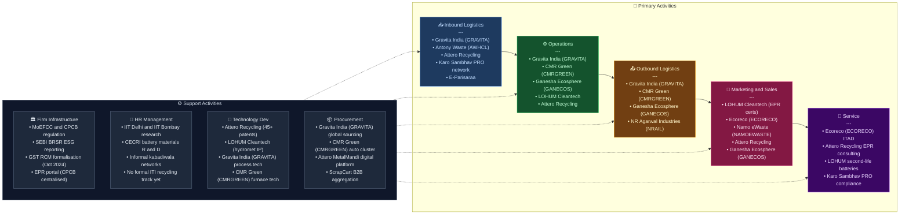

# Recycling Sector — India Value Chain Analysis
*Prepared: June 2026 | Framework: Porter Value Chain · Five Forces · Gereffi GVC · Blue Ocean*

---

## 0. Segment Definition

### Precise boundary
This analysis covers India's **organised and semi-organised secondary materials recycling sector**, spanning five sub-segments:

| Sub-segment | Input waste stream | Output material |
|---|---|---|
| **E-waste recycling** | End-of-life electrical and electronic equipment (EEE) | Recovered metals (gold, silver, copper, palladium, rare earths), plastics, glass |
| **Battery / Lithium-ion recycling** | Used lead-acid batteries (LAB), lithium-ion batteries (EV packs, consumer cells) | Secondary lead, refined lithium, cobalt, nickel, manganese, black mass |
| **Plastic recycling** | Post-consumer PET bottles, HDPE, PP, multi-layer packaging | rPET flake/pellets, recycled HDPE, PP granules, rPVC |
| **Metal scrap recycling** | Ferrous (steel, iron) and non-ferrous (aluminium, copper, zinc, brass) scrap | Secondary aluminium alloy ingots, copper rods, zinc ingots, steel billets via EAF |
| **Paper recycling** | Wastepaper (OCC — Old Corrugated Containers, ONP — Old Newsprint, mixed paper) | Recycled newsprint, duplex board, kraft liner, tissue |

### Core product/service flow

```mermaid
flowchart LR
    A["🗑️ Waste Generation"] --> B["♻️ Collection and Aggregation"] --> C["🔍 Primary Sorting and Dismantling"] --> D["⚙️ Secondary Processing and Refining"] --> E["📦 Recovered Secondary Material"] --> F["🏭 Manufacturing Customer"]
    style A fill:#1e293b,stroke:#64748b,color:#e2e8f0
    style B fill:#1e3a5f,stroke:#3b82f6,color:#bfdbfe
    style C fill:#14532d,stroke:#22c55e,color:#bbf7d0
    style D fill:#713f12,stroke:#f59e0b,color:#fef3c7
    style E fill:#3b0764,stroke:#a855f7,color:#e9d5ff
    style F fill:#f0fdf4,stroke:#16a34a
```

### End customers and what they value most
- **Steel EAF/IF mills**: Consistent scrap quality (chemistry, absence of contaminants), competitive price vs. iron ore + DRI route
- **Paper mills** (newsprint, packaging board): Certified wastepaper free from contamination, OCC strength metrics
- **Battery manufacturers**: Specification-grade recovered lead, lithium carbonate/hydroxide, cobalt sulphate
- **FMCG/packaging brands**: rPET that meets food-contact grade specs, EPR compliance certificates
- **Auto OEMs / die-casters**: Secondary aluminium alloy ingots meeting ASTM/IS specifications

### India's global position
| Sub-segment | India's global position | Comment |
|---|---|---|
| E-waste recycling | **Follower → Challenger** | 2nd largest e-waste generator in Asia; formal recycling <30% of waste generated |
| Battery (LAB) recycling | **Challenger** | Gravita India is globally competitive; informal smelters still dominant |
| Battery (Li-ion) recycling | **Nascent → Early Challenger** | LOHUM, Attero hold proprietary tech; China still dominates black mass processing |
| Plastic recycling | **Follower → Challenger** | India largest PET bottle market; Ganesha Ecosphere is large-scale |
| Metal scrap recycling | **Follower** | CMR Green is large; scrap availability and collection infrastructure are bottlenecks |
| Paper recycling | **Challenger** | High wastepaper import dependency; NR Agarwal, TNPL significant recycled paper producers |

---

## 1. Value Chain Map — Primary Activities

### 1.1 Inbound Logistics — Waste Collection & Aggregation

**What it involves:**
The first and most structurally complex activity in the recycling value chain. Recyclable material is dispersed across millions of households, offices, factories, and municipalities. Collection happens through: (a) the informal kabadiwala network — India's ~1.5–4 million itinerant waste buyers/pickers who handle 60–70% of first-mile collection; (b) formal take-back schemes under EPR rules — Producer Responsibility Organisations (PROs) and recycler collection drives; (c) municipal solid waste (MSW) systems managed by urban local bodies (ULBs); (d) industrial scrap dealers aggregating from factories.

**Key cost drivers:**
- First-mile collection logistics: most expensive, least automated step
- Scrap price volatility — influences whether informal sellers choose formal vs. informal channels
- Reverse logistics from tier-2/3 cities — often uneconomical without scale

**Differentiation drivers:**
- PRO partnerships and EPR certificate generation (creates formal flow)
- Digital collection platforms (Attero's MetalMandi, ScrapCart, Kabadiwala.com)
- Owned/leased collection centres with geo-density advantage

**Indian players:**
- *Karo Sambhav* (unlisted) — PRO network, facilitates EPR take-back across 18 states
- *E-Parisaraa* (unlisted, Bengaluru) — formal e-waste collection, authorised by MoEFCC
- *Attero Recycling* (unlisted, Noida) — MetalMandi B2B digital scrap platform, 2 lakh app downloads, 28 states
- *Gravita India* (NSE: GRAVITA) — 33 owned scrap yards across India + global sourcing
- *Antony Waste Handling Cell* (NSE: AWHCL) — municipal collection contracts in Mumbai/Pune
- Informal kabadiwala aggregators (fragmented, unnamed)

---

### 1.2 Operations — Processing, Dismantling & Refining

**What it involves:**
The core value-creating step. Depending on sub-segment:
- **E-waste**: Manual dismantling → shredding → density separation → hydrometallurgical/pyrometallurgical extraction of precious and base metals
- **LAB recycling**: Mechanical crushing → acid neutralisation → smelting (rotary/blast furnace) → refining to battery-grade or alloy-grade lead
- **Li-ion recycling**: Discharge → dismantling → shredding → thermal/chemical processing → black mass production → hydromet refining to Li carbonate, Co sulphate, NMC precursor
- **Plastic recycling**: Sorting by polymer type → washing → shredding → extrusion → rPET flake/pellet or recycled polymer granule
- **Metal scrap**: Shredding → magnetic/eddy-current separation → melting (induction furnace) → casting to alloy ingot
- **Paper recycling**: Pulping → screening → de-inking (for newsprint) → cleaning → paper machine

**Key cost drivers:**
- Energy cost (smelting is energy-intensive — 15–25% of COGS)
- Furnace technology and throughput utilisation
- Yield rate on precious metal extraction (for e-waste/LAB)
- Contamination rate in input feedstock

**Differentiation drivers:**
- Proprietary process technology and yield rates (Attero: 98% precious metal extraction; LOHUM: 90%+ lithium refining)
- Certifications: IS/ISO, CPCB authorisation, R2 (Responsible Recycling) standard
- Ability to process complex/mixed-chemistry feedstocks

**Indian players:**
- *Gravita India* (NSE: GRAVITA) — 12 plants, 3.3 lakh MTPA LAB + aluminium + plastic recycling capacity
- *CMR Green Technologies* (NSE: CMRGREEN, recently listed June 2026) — 13 plants, 6.15 lakh MTPA aluminium alloy recycling
- *Ganesha Ecosphere* (NSE: GANECOS) — 6 plants, 1.96 lakh MTPA PET bottle recycling
- *LOHUM* (unlisted) — proprietary Li-ion hydromet refining, IPO expected 2027
- *Attero Recycling* (unlisted) — e-waste + Li-ion, 45+ patents
- *GRP Ltd* (NSE: GRPLTD) — tyre/rubber recycling to reclaim rubber, 5 business verticals
- *Eco Recycling / Ecoreco* (BSE: ECORECO) — e-waste dismantling, ITAD, precious metal recovery
- *Namo eWaste Management* (NSE SME: NAMOEWASTE) — e-waste + Li-ion, 12,400 MTPA plant in Nashik
- *Nile Ltd* (NSE: NILE) — lead refining + new Li-ion plant (Telangana, FY24)
- *NR Agarwal Industries* (NSE: NRAIL) — largest single-location recycled paperboard plant

---

### 1.3 Outbound Logistics — Secondary Material Distribution

**What it involves:**
Delivering recovered secondary materials (secondary lead ingots, rPET pellets, aluminium alloy ingots, black mass, recycled paper pulp/boards) to manufacturing customers. This is largely a B2B logistics step — bulk commodity movement.

**Key cost drivers:**
- Distance between recycling plant and customer (co-location advantage)
- Packaging and handling costs for hazardous materials (lead, battery acid)
- Inventory carrying cost given commodity price cyclicality

**Differentiation drivers:**
- Long-term supply agreements with OEM/manufacturing customers (price certainty)
- Ability to deliver export-quality certified material (opens global customers)
- Location of plants near industrial clusters (Pune, Rajkot, Coimbatore automotive; Mumbai/Delhi packaging hubs)

**Indian players:**
- *Gravita India* — supplies secondary lead to battery manufacturers (Exide, Amara Raja); exports aluminium alloys; operates in 13 countries
- *CMR Green Technologies* — supplies aluminium alloy to auto OEMs (Maruti, Hyundai suppliers)
- *Ganesha Ecosphere* — sells rPET flakes/fibre to polyester staple fibre manufacturers, FMCG packagers
- *NR Agarwal Industries* — supplies recycled duplex board/packaging board to FMCG and e-commerce companies

---

### 1.4 Marketing & Sales — EPR Credits, Customer Acquisition, Pricing

**What it involves:**
A uniquely structured market. Two distinct revenue streams coexist:
1. **Secondary material sales** — commodity price-linked (LME for lead/aluminium, PET spot prices); margins thin and cyclical
2. **EPR credit/certificate sales** — mandated under E-Waste Rules 2022, Plastic Waste Management Rules 2022, Battery Waste Management Rules 2022; recyclers generate EPR certificates that producers/importers must purchase to meet compliance targets. This is a regulatory-mandated, non-commodity revenue stream with significantly better margins

CPCB's centralised EPR portal is the marketplace for these certificates. Pricing is market-determined but subject to floor prices introduced by CPCB for plastics.

**Key cost drivers:**
- Customer acquisition for corporate EPR clients (IT companies, FMCG brands)
- Branding and certification maintenance (R2, ISO 14001, CPCB authorisation)

**Differentiation drivers:**
- Scale of EPR certificate generation — favours large formal recyclers
- Relationships with PROs (Karo Sambhav, Ecoverde, Hulladek)
- Brand recognition among corporate ESG procurement teams

**Indian players:**
- *LOHUM* — issues >70% of all EPR certificates in India's battery category (dominant position)
- *Ecoreco* (BSE: ECORECO) — significant EPR certificate business; ESG/CSR channel partnerships
- *Namo eWaste* — growing EPR certificate revenues post-listing
- *Attero* — EPR services + material sale to global tech brands

---

### 1.5 Service — Compliance Services, ITAD, Brand Partnerships

**What it involves:**
Value-added services layer that is growing fastest:
- **ITAD** (IT Asset Disposition) — data destruction + certified recycling for enterprises
- **EPR compliance consulting** — helping brand owners register, track, and meet CPCB targets
- **Reverse logistics management** — take-back program design and execution for brands
- **Refurbishment/reuse** — second-life battery packs, refurbished electronics

**Key cost drivers:**
- Certification and audit costs
- Data security infrastructure for ITAD
- Sales force for enterprise accounts

**Differentiation drivers:**
- Data destruction certifications (ISO 27001, NIST 800-88) for enterprise ITAD
- End-to-end chain-of-custody documentation
- Second-life battery integration with EV/storage players

**Indian players:**
- *Ecoreco* (BSE: ECORECO) — ITAD pioneer in India, serves 120+ countries; ISO 27001 certified
- *Attero* — ITAD + EPR consulting + MetalMandi platform
- *LOHUM* — battery repurposing/second-life integration with Tata Motors, Mercedes-Benz Energy
- *Karo Sambhav* (unlisted) — PRO-model EPR compliance management

---

## 2. Value Chain Map — Support Activities

### 2.1 Firm Infrastructure — Regulatory Compliance, Finance, Governance

**Role in the industry:**
Recycling is one of India's most regulation-intensive sectors. Every formal recycler must maintain: CPCB/SPCB authorisations (Hazardous Waste Management Rules), EPR portal registrations (separate for e-waste, batteries, plastics), environmental compliance (ETP, STP, air emission norms), and annual returns filing. This creates significant overhead for smaller players and a structural entry barrier for those who cannot afford it.

**India-specific dynamics:**
- MoEFCC and CPCB are the apex regulatory bodies; State PCBs handle local inspections
- RCM (Reverse Charge Mechanism) under GST introduced October 2024 for metal scrap — formalisation push
- SEBI's BRSR (Business Responsibility and Sustainability Reporting) is creating demand for ESG-linked recycling certificates from listed companies

**Where Indian firms are strong/weak:**
- Strong: Gravita, Ecoreco, Attero have robust compliance infrastructure
- Weak: Most of the sector is informal and structurally non-compliant; formal recyclers face cost disadvantage vs. informal operators

---

### 2.2 HR Management — Skilled Workforce, Safety, Informality

**Role in the industry:**
Manual dismantling (especially e-waste) is labour-intensive and hazardous. India's advantage is low labour cost; its weakness is lack of trained e-waste handlers, high informal worker exposure to lead/mercury/cadmium, and the absence of social safety nets for kabadiwala networks.

**Where Indian firms are strong/weak:**
- Strong: Large formal players (Gravita, CMR Green) have formal employment, ESG reporting
- Weak: Informal sector employs millions under hazardous conditions; Pure Earth/CPCB studies document lead poisoning in Moradabad, Kolkata clusters
- Gap: No formal vocational training ecosystem for recycling technicians at scale (ITIs do not have a specialised recycling track)

---

### 2.3 Technology Development — Process IP, Automation, Digitisation

**Role in the industry:**
Technology is the single most important differentiator in this sector. The range:
- Basic: Manual sorting + pyrometallurgy (commodity business, low margin)
- Advanced: Hydrometallurgy, sensor-based sorting (XRF, NIR), proprietary leaching chemistry, digital collection platforms

**Where Indian firms are strong/weak:**
- Strong: Attero (45+ patents, 98% precious metal recovery — among best globally), LOHUM (90%+ lithium refining, hydromet IP), Gravita (continuous process improvement in lead smelting)
- Emerging: CMR Green (furnace technology for aluminium alloys), Namo eWaste (Li-ion plant)
- Weak: Most Indian e-waste recyclers are manual dismantlers — no real IP; compete on cheap labour rather than technology

**Notable institutions:**
- IIT Delhi, IIT Bombay — research on battery recycling, critical mineral recovery
- CECRI (Central Electrochemical Research Institute, Karaikudi) — battery materials R&D
- MNRE (Ministry of New and Renewable Energy) funding for Li-ion circular economy

---

### 2.4 Procurement — Scrap Sourcing, Import Dependencies

**Role in the industry:**
Scrap availability is the primary constraint on growth for all sub-segments. India's domestic scrap generation is growing but remains insufficient for formal recyclers' capacity:
- India imports ~8–9 million tonnes of steel scrap annually (major source: US, UK, Middle East)
- Wastepaper imports: significant OCC imports from US, Europe to supplement domestic collection
- Li-ion battery recycling feedstock: currently limited (EV penetration still early); 2027–2030 expected inflection as first wave of EV batteries reaches end-of-life

**India-specific dynamics:**
- Scrap import duty structure shapes economics — steel scrap: 2.5% basic customs duty; ferrous scrap periodically zero-rated to control steel prices
- GST on domestic scrap (18% under RCM from Oct 2024) disadvantages formal players vs. informal
- EPR framework creates a captive domestic collection obligation — producers must arrange take-back; this channels scrap to registered recyclers

**Where Indian firms are strong/weak:**
- Strong: Gravita (global sourcing from 13 countries), CMR Green (automotive cluster proximity for scrap sourcing)
- Weak: Wastepaper and e-waste feedstock security; no robust reverse vending machine infrastructure unlike EU/Japan

---

## 3. Five Forces Analysis

### Threat of New Entrants — Moderate to Low
Entering formal recycling requires CPCB/SPCB authorisation (6–18 month process), substantial capital for processing equipment (a basic e-waste plant costs ₹5–20 Cr; a LAB smelter ₹50–150 Cr; a Li-ion hydromet plant ₹200–500 Cr), and compliance infrastructure. EPR certificate generation requires volume scale — a prerequisite that disadvantages new entrants in winning corporate EPR contracts. However, in the informal/unorganised segment, barriers are near-zero — a kabadiwala can start with minimal capital. This dual-track structure means formal recycling enjoys meaningful barriers at scale, but the informal sector constantly threatens to undercut margins and divert feedstock. The Battery Waste Management Amendment Rules 2025 and tightening CPCB enforcement are raising barriers over time. **Rating: Moderate** (for formal segment — barriers real but not prohibitive; informal entry remains easy).

### Bargaining Power of Suppliers (Waste Generators) — Low to Moderate
Waste generators — households, corporates, municipalities — are highly fragmented, with no single supplier controlling a significant share of feedstock. However, in specialised streams (e.g., large IT company decommissioning 10,000 laptops, EV battery packs from an OEM), the generator has bargaining power because formal recyclers compete for certified feedstock. Under EPR, producers must arrange collection — this creates a situation where producers/PROs become powerful scrap channellers who can direct material to preferred recyclers. As scrap becomes more valuable (critical minerals in batteries), waste generators will demand revenue sharing or higher buyback prices. **Rating: Low to Moderate** (shifting toward Moderate as scrap value rises).

### Bargaining Power of Buyers (Secondary Material Purchasers) — Moderate to High
Buyers of secondary materials — steel mills (EAF), paper mills, battery manufacturers, auto die-casters — are large, concentrated, and can typically source from multiple recyclers or switch to virgin/primary materials when prices are unfavourable. Lead battery manufacturers (Exide, Amara Raja) have multi-supplier policies and can play recyclers against each other. rPET buyers (FMCG, textiles) can switch between suppliers. However, food-contact rPET buyers are constrained to a small number of BIS/FSSAI-certified suppliers, giving those recyclers pricing leverage. Similarly, EPR certificate buyers (producers seeking compliance) have limited options — they must buy from CPCB-registered recyclers. The EPR certificate market is thus buyer-inelastic for compliance-grade volumes. **Rating: Moderate** (commodity material = high buyer power; EPR certificates = low buyer power — two very different revenue streams).

### Threat of Substitutes — Low to Moderate
The substitutes for recycled materials are primary/virgin materials: iron ore → steel, bauxite → aluminium, virgin PET resin, primary lead/lithium. When primary commodity prices fall sharply (e.g., oil price decline reducing virgin plastic economics), recycled material economics weaken. However: (a) EPR regulations mandate minimum recycled content use for packaging brands from FY26 onwards (Plastic Waste Management Rules 2022 mandate 30% recycled content in rigid plastics by 2025-26), creating mandatory demand; (b) carbon pricing/ESG considerations make virgin material increasingly costly on a lifecycle basis; (c) EV battery recycling has no true substitute — recovered lithium/cobalt is strategic. The regulatory mandate for recycled content is the key factor reducing substitution risk over time. **Rating: Low to Moderate** (declining over time due to EPR mandates).

### Competitive Rivalry — High (in commodity segment); Moderate (in EPR/service segment)
The informal sector is the dominant competitor in all sub-segments and competes on price, regulatory arbitrage, and zero compliance cost. Within the formal sector, rivalry is intensifying: new listings (CMR Green IPO June 2026, Namo eWaste 2024), PE-backed unlisted entrants (LOHUM, Attero), and established players all seeking to scale under EPR tailwinds. Differentiation is limited in commodity recycling — lead ingot is lead ingot; margins thin (EBITDA 4–15% for most). Rivalry is less intense in niches: Li-ion recycling (few players with real technology), food-contact rPET (certification barrier), ITAD (enterprise trust barrier). **Rating: High** overall; Moderate in technology-differentiated niches.

### Five Forces Summary Table

| Force | Rating | Key driver |
|---|---|---|
| Threat of new entrants | Moderate | Regulatory barriers in formal sector; near-zero in informal |
| Supplier power | Low–Moderate | Fragmented generators; PROs gaining channelling power |
| Buyer power | Moderate–High | Commodity buyers concentrated; EPR certificate buyers captive |
| Threat of substitutes | Low–Moderate | EPR mandates for recycled content reduce substitution risk |
| Competitive rivalry | High | Informal sector is price-below-cost competitor; formal sector consolidating |

**Overall structural attractiveness: Medium** — EPR regulation is the structural tailwind transforming what would otherwise be a low-attractiveness commodity business into a medium-attractiveness regulated market. The informal sector overhang remains the single largest structural depressant of returns.

---

## 4. GVC Governance & India's Position

### Lead Firms (Global)
- **Umicore** (Belgium) — global leader in battery material recycling and precious metal refining from e-waste; sets global standards for hydromet processing
- **Glencore/Li-Cycle** — battery black mass processing, global supply agreements with OEMs
- **Sims Metals** (Australia) — global metal scrap trading and recycling
- **Veolia / SUEZ** (France) — global waste management; India presence through technology licensing
- **Stena Recycling** (Sweden) — e-waste, metal recycling; sets ISO/R2 certification benchmarks

### Lead Firms (Indian)
- **Gravita India** — leads the Indian LAB recycling and aluminium recycling chain; operates in 13 countries; only Indian recycler with meaningful global footprint
- **LOHUM** — dominates domestic Li-ion EPR certificate market; technology comparable to global standards
- **Attero Recycling** — deepest e-waste/Li-ion technology IP in India; actively pursuing global partnerships

### Governance Type: **Relational (tending toward Captive in Li-ion)**
India's recycling GVC is Relational at the collection-processing interface: formal recyclers build long-term relationships with corporate waste generators, PROs, and secondary material buyers because transaction complexity (contamination specs, chain-of-custody, EPR documentation) requires sustained interaction. However, in Li-ion battery recycling, governance is trending **Captive**: OEMs (Tata Motors, Ola Electric) are specifying that their battery packs must go to named recyclers (LOHUM, Attero) — the OEM controls the flow. In e-waste processing for global brands, governance is **Modular** — global brands (Apple, Samsung, Dell) specify standards and outsource to certified Indian recyclers.

### Value Capture Map

| Stage | Actor | Geography | Margin captured |
|---|---|---|---|
| Technology / IP for hydromet | Umicore, global chemical cos. | Europe, China | High (technology licensing, proprietary reagents) |
| Black mass refinement (Li-ion) | LOHUM, partially Attero | India | Moderate-High; bulk still sent to China for terminal refining |
| Li/Co/Ni terminal refining | CATL, Ganfeng (China) | China | High — controls terminal critical mineral output |
| Lead refining (LAB) | Gravita, Nile | India | Low–Moderate (commodity; ~3–8% EBITDA) |
| Al alloy recycling | CMR Green, Gravita | India | Low (4–6% EBITDA, commodity) |
| rPET fibre/pellet | Ganesha Ecosphere | India | Moderate (10–14% EBITDA; EPR uplift) |
| EPR certificate issuance | LOHUM, Ecoreco, NAMO | India | High (near-pure margin; compliance-driven demand) |
| ITAD/service layer | Ecoreco, Attero | India | Moderate-High (branded service, recurring contracts) |
| Collection/aggregation | Informal sector | India | Very low (margin on volume spread) |

**Key insight**: China captures the highest-value terminal refining step for Li-ion critical minerals. India currently stops at black mass or mixed metal oxide — it needs to develop capability at the precursor cathode active material (pCAM) and cathode active material (CAM) stage to capture more value.

### India's Current Position and Upgrade Trajectory

| Upgrading type | Status | Example |
|---|---|---|
| **Process upgrading** | Underway | Gravita improving lead smelting yield; LOHUM hydromet process improvements |
| **Product upgrading** | Early stage | LOHUM moving from black mass → Li carbonate; Ecoreco from manual dismantling → ITAD |
| **Functional upgrading** | Nascent | Attero integrating MetalMandi platform (collection → processing → trading); LOHUM moving toward second-life batteries |
| **Chain upgrading** | Not yet significant | India remains embedded in the collection-processing part of the chain; terminal refining of critical minerals still China-dominated |

**Direction**: India is clearly moving upward on process and product axes, driven by EPR regulation and EV battery wave. The strategic gap is the Li-ion terminal refining and pCAM/CAM stage — where MNRE's Battery Mission and PLI for ACC (Advanced Chemistry Cell) batteries are attempting to build capability.

---

## 5. Key Linkages & Leverage Points

### Critical Linkage 1: Collection Quality → Processing Yield
The contamination level of incoming scrap directly determines processing yield and thus profitability. Poorly sorted e-waste means lower precious metal recovery; contaminated PET means off-spec rPET; mixed metal scrap means higher furnace energy and lower alloy quality. This linkage is the root cause of why informal collection — which does not sort to specification — degrades formal recyclers' economics. **Implication**: Formal recyclers must either own/control collection (vertical integration upstream) or invest heavily in sorting technology at the plant gate.

### Critical Linkage 2: EPR Regulation → Formal Sector Revenue Floor
EPR rules (E-Waste 2022, Plastic 2022, Battery 2022) have created a regulatory demand floor for formal recyclers' services. When CPCB enforces collection targets, producers must buy EPR certificates — creating a revenue stream that is independent of commodity prices. This linkage is the single most important structural change in India's recycling economics in the past five years. **Implication**: Recyclers with EPR certificate generation capability trade at a premium to pure commodity recyclers; Gravita, LOHUM, Ecoreco are most exposed to this upside.

### Critical Linkage 3: EV Battery Wave → Li-ion Feedstock Inflection
India's Li-ion battery recycling feedstock is currently limited — EV penetration is still early. The 2027–2030 period will see the first wave of EV batteries reaching end-of-life (3-year scooter batteries from Ola, Ather; 5-year car batteries from Tata Nexon EV early cohort). Recyclers who pre-build capacity and technology now will have first-mover advantage in sourcing this feedstock. **Implication**: LOHUM and Attero are correctly front-running capacity; Namo eWaste's Nashik plant (commissioned 2025) positions it well.

### Critical Linkage 4: Informal Sector Integration → Feedstock Security + Formalisation
The kabadiwala network handles the majority of India's recyclable collection. Formal recyclers who integrate this network (through aggregator models, digital platforms, or PRO partnerships) gain feedstock security while improving their ESG credentials. The October 2024 GST RCM on scrap metal has begun incentivising formalisation, but full integration requires social architecture (financial inclusion for kabadiwalas, digital payments, Aadhar-linked registration). **Implication**: Attero's MetalMandi platform and ScrapCart's digital aggregation model represent the most scalable approach to capturing this linkage.

### Critical Linkage 5: Secondary Material Quality → Customer Concentration Risk
Most Indian recyclers sell to a handful of large manufacturing customers (e.g., Gravita sells secondary lead to Exide + Amara Raja; CMR Green to automotive die-casters). Quality consistency determines whether the customer can rely on recycled input rather than virgin material. Poor quality = customer switches; consistent quality = longer contracts and potential for price premium over spot. **Implication**: Investment in quality management systems (NABL labs, statistical process control) is directly linked to revenue stability.

### Single Highest-Leverage Intervention Point
**EPR enforcement + CPCB penalty escalation**: If CPCB implements its stated plan of quarterly non-compliance listings (from Q2 2025) and escalates penalties under the Environment Protection Act, formal EPR certificate demand will increase sharply. This single regulatory enforcement action would: (a) increase formal recycler revenues via EPR certificate premiums; (b) drive brand owners to sign long-term EPR contracts with formal recyclers; (c) disadvantage informal sector which cannot generate CPCB-registered certificates. CPCB enforcement is thus the highest-leverage intervention — it simultaneously strengthens formal sector economics, improves feedstock flows to authorised recyclers, and reduces environmental harm from informal processing.

---

## 6. Indian Company Landscape

### Listed Companies

| Value chain stage | Company name | Listed? | Exchange & ticker | Business description | Approx. revenue / market cap | Position in chain |
|---|---|---|---|---|---|---|
| LAB + Al + Plastic recycling | Gravita India Ltd | Yes | NSE: GRAVITA | Global lead-acid battery and aluminium recycler with 12 plants and operations in 13 countries | Rev: ₹4,265 Cr (FY25); Mkt cap ~₹12,333 Cr | Leader |
| Non-ferrous metal scrap recycling | CMR Green Technologies Ltd | Yes | NSE: CMRGREEN | India's largest aluminium alloy recycler from automotive scrap, 13 plants, 6.15 lakh MTPA capacity | Rev: ₹6,666 Cr (FY25); IPO June 2026 | Leader |
| PET plastic recycling | Ganesha Ecosphere Ltd | Yes | NSE: GANECOS | India's largest PET bottle recycler producing rPET flakes and recycled polyester fibre | Rev: ₹1,465 Cr (FY25); Mkt cap ~₹2,417 Cr | Leader |
| Municipal waste management | Antony Waste Handling Cell Ltd | Yes | NSE: AWHCL | Integrated municipal solid waste collection, processing, and WTE operations in Maharashtra | Rev: ₹959 Cr (FY25); EBITDA margin 23% | Leader |
| E-waste recycling + ITAD | Eco Recycling Ltd (Ecoreco) | Yes | BSE: ECORECO | India's first e-waste recycler; ITAD, precious metal recovery, EPR certificate generation | Rev: ₹46 Cr (FY25); Mkt cap ~₹837 Cr | Niche/Leader |
| E-waste + Li-ion recycling | Namo eWaste Management Ltd | Yes | NSE SME: NAMOEWASTE | E-waste recycler with new 12,400 MTPA Li-ion plant in Nashik; fast-growing post-IPO (Sep 2024) | Rev: ₹150 Cr (FY25); Recently listed | Emerging |
| Lead + Li-ion recycling | Nile Ltd | Yes | NSE: NILE | Secondary lead manufacturer with new Li-ion recycling plant (phase 1) in Telangana | Not publicly disclosed; small cap | Emerging |
| Tyre/rubber recycling | GRP Ltd | Yes | NSE: GRPLTD | Largest reclaim rubber manufacturer in India; recycling EOL tyres into 5 rubber/polymer product lines | Rev: ₹550 Cr (FY25); Mkt cap ~₹1,471 Cr | Leader |
| Recycled paper/paperboard | NR Agarwal Industries Ltd | Yes | NSE: NRAIL | Largest single-location recycled paperboard plant in India; wastepaper-based duplex board production | Rev: ₹2,145 Cr (FY25); targeting ₹2,200 Cr FY26 | Challenger |
| Recycled paper/newsprint | Tamil Nadu Newsprint & Papers Ltd | Yes | NSE: TNPL | State PSU; significant bagasse + recycled fibre use; newsprint and paperboard production | Rev: ~₹4,200 Cr (FY24); Mkt cap ~₹3,500 Cr | Leader (newsprint) |
| Paper recycling (wastepaper-based) | Seshasayee Paper & Boards Ltd | Yes | NSE: SESHAPAPER | Kraft paper and linerboard production using recycled fibre; sustainable manufacturing | Not publicly disclosed; Mkt cap ~₹1,500 Cr | Challenger |
| Recycled paper packaging | JK Paper Ltd | Yes | NSE: JKPAPER | Packaging boards and office paper; part of recycled content sourcing | Rev: ~₹5,500 Cr (FY25); large-cap | Leader (paper, partial recycled) |

---

### Unlisted / Private Companies

| Value chain stage | Company name | Listed? | Exchange & ticker | Business description | Approx. revenue / market cap | Position in chain |
|---|---|---|---|---|---|---|
| Li-ion battery recycling | LOHUM Cleantech Pvt Ltd | No | — | India's largest Li-ion battery recycler; >70% national EPR certificates; 90%+ lithium refining; IPO planned 2027 | Rev: ₹835 Cr (FY25); raised >$120M | Leader |
| E-waste + Li-ion + EPR | Attero Recycling Pvt Ltd | No | — | Pioneer e-waste and Li-ion recycler; 45+ patents, 98% precious metal recovery; MetalMandi digital platform | Rev: not publicly disclosed; well-funded | Leader |
| EPR compliance / PRO | Karo Sambhav Services Pvt Ltd | No | — | Producer Responsibility Organisation facilitating EPR take-back programs across 18 states | Not publicly disclosed | Niche |
| E-waste collection/recycling | E-Parisaraa Pvt Ltd | No | — | Karnataka-based, government-supported e-waste recycler; MoEFCC authorised; one of India's oldest formal recyclers | Not publicly disclosed | Niche |
| Li-ion battery recycling | ReBAT India | No | — | Specialises in battery raw material recovery, EPR services; recent entrant | Not publicly disclosed | Emerging |
| Digital scrap aggregation | ScrapCart (Scrapcart India Pvt Ltd) | No | — | Tech-enabled scrap aggregation and pricing platform for B2B scrap trade | Not publicly disclosed | Emerging |
| Plastic recycling / EPR | Hulladek Recycling Pvt Ltd | No | — | Kolkata-based plastic waste collection and recycling; EPR partnerships with FMCG brands | Not publicly disclosed | Niche |
| Battery recycling | Metastable Materials Pvt Ltd | No | — | Pune-based Li-ion battery recycler; technical collaboration with CECRI | Not publicly disclosed | Emerging |

---

### Notable Companies — Deeper Notes

**Gravita India Ltd (NSE: GRAVITA)**
- Stage in chain: Lead-acid battery recycling (primary); aluminium scrap recycling; plastic recycling (secondary)
- What makes them interesting: Gravita is the only Indian recycler with a genuinely global footprint — it operates plants and sourcing networks across Africa (Ghana, Tanzania, Mozambique), Central America (Nicaragua), and Southeast Asia, giving it diversified raw material access. Its FY25 volume growth of 20% YoY came partly from a 60% surge in domestic scrap sourcing driven by stricter regulations. Its Vision 2029 targets 30%+ non-lead revenue (aluminium, plastics, Li-ion) — a critical diversification given lead is a declining chemistry in new batteries.
- Key financials: Revenue ₹4,265 Cr (FY25); PAT ₹378 Cr; Net debt-free post ₹1,000 Cr QIP (3.5x oversubscribed); EBITDA margin ~12–14%; Mkt cap ~₹12,333 Cr
- Watch factor: Execution of Li-ion recycling entry and pace of non-lead revenue ramp; China competition in secondary lead exports

**CMR Green Technologies Ltd (NSE: CMRGREEN)**
- Stage in chain: Non-ferrous metal scrap recycling — aluminium alloy ingots, zinc alloys, billets
- What makes them interesting: CMR is India's largest aluminium scrap recycler with ₹6,666 Cr revenue — substantially larger than the more-discussed Gravita in revenue terms. Its business is deeply integrated with India's automotive supply chain: it sources automotive scrap (used engine blocks, cylinder heads, wheels) and returns aluminium alloy ingots to the same OEM tier-1 suppliers. The June 2026 IPO listed at a 43% premium, signalling strong market appetite. Thin EBITDA margin (4.6%) reflects commodity positioning — the strategic question is whether it can move up toward specification alloys that command premiums.
- Key financials: Revenue ₹6,666 Cr (FY25); PAT ₹155 Cr; EBITDA margin 4.6%; IPO at ₹192/share (Jun 2026), listed at ₹275 (43% premium); Capacity 6.15 lakh MTPA
- Watch factor: Margin expansion from commodity aluminium toward high-specification alloy grades; scrap import duty changes

**Ganesha Ecosphere Ltd (NSE: GANECOS)**
- Stage in chain: PET plastic recycling — rPET flakes, rPET fibre, rPET pellets
- What makes them interesting: GESL is the purest listed play on India's EPR plastic recycling mandate. The Plastic Waste Management Rules 2022 require brand owners to incorporate increasing percentages of recycled plastic in packaging (30% for rigid by FY26), and mandatory use of recycled plastic in packaging was made law in April 2026 — a direct demand catalyst for GESL. Its 1.96 lakh MTPA capacity and 8+ billion PET bottles recycled annually make it the dominant formal PET recycler in India. Revenue grew 30% YoY in FY25.
- Key financials: Revenue ₹1,465 Cr (FY25); EBITDA margin ~14%; PAT margin ~7%; Mkt cap ~₹2,417 Cr; 6 manufacturing units
- Watch factor: Commissioning of new capacity phases, food-contact grade rPET certification progress (food-contact enables premium pricing), EPR mandate enforcement pace

**LOHUM Cleantech Pvt Ltd (Unlisted)**
- Stage in chain: Li-ion battery recycling → black mass → lithium carbonate/cobalt sulphate; second-life battery repurposing
- What makes them interesting: LOHUM occupies the most strategically valuable position in India's emerging battery circular economy — it issues over 70% of all national Li-ion battery EPR certificates, has raised over $120M in funding (Baring Private Equity, Singularity Growth, Cactus Partners), and refines over 90% of all lithium processed in India. Its technology is comparable to global standards and it has secured partnerships with Mercedes-Benz Energy and Tata Motors for second-life battery deployment. With IPO planned for 2027, it is set to become the highest-profile listing in India's recycling sector.
- Key financials: Revenue ₹835 Cr (FY25, up from ₹529 Cr FY24); PAT ₹28 Cr (FY24, growing); Pre-Series C raised $15M at >$500M implied valuation (estimated)
- Watch factor: EV battery feedstock inflection (2027–2030 key years); China competition in black mass and precursor materials; IPO timing and valuation

**Eco Recycling Ltd / Ecoreco (BSE: ECORECO)**
- Stage in chain: E-waste collection, dismantling, ITAD, precious metal recovery, EPR certificate generation
- What makes them interesting: India's first and oldest formal e-waste recycler (since 2005) — Ecoreco has established the ITAD market in India, serving enterprises needing certified data destruction alongside recycling. Its EBITDA margin (~72% EBITDA/revenue on a small base) is extraordinarily high for a recycler — a function of its EPR certificate and ITAD service revenue mix rather than commodity recycling. The company serves 120+ countries. Very small revenue base (₹46 Cr) relative to its market cap (₹837 Cr) suggests the market is pricing future EPR scale; this creates valuation risk if EPR enforcement is delayed.
- Key financials: Revenue ₹46 Cr (FY25, +43% YoY); EBITDA ₹33 Cr (72% margin); PAT ₹23 Cr; Mkt cap ~₹837 Cr
- Watch factor: Revenue scale-up to justify market cap; competition from better-capitalised entrants in ITAD (Attero, Namo eWaste); CPCB enforcement pace on e-waste EPR targets

**Antony Waste Handling Cell Ltd (NSE: AWHCL)**
- Stage in chain: Municipal solid waste collection, processing, waste-to-energy; upstream inbound logistics for recyclables
- What makes them interesting: AWHCL is India's best proxy for municipal recycling infrastructure — it operates large-scale integrated MSW contracts in Mumbai and Pune, including India's first operational waste-to-energy plant. Its business model (long-tenure municipal concessions, tipping fee revenue) provides cash flow stability that pure recyclers lack. Growing 7% YoY with 23% EBITDA margin, it represents the infrastructure backbone without which informal collection cannot transition to formal systems.
- Key financials: Revenue ₹959 Cr (FY25); EBITDA ₹220 Cr (23% margin); PAT ₹101 Cr
- Watch factor: New municipal contract wins outside Maharashtra, expansion into processing/recycling from pure collection, leverage of waste-to-energy at scale

---

## 7. Strategic Insight

### Non-Obvious Finding from Chain Analysis
The most counter-intuitive finding from this analysis is that **India's recycling sector has two entirely distinct economic logics coexisting under the same regulatory umbrella** — and conflating them leads to systematically wrong investment and policy conclusions. The first logic is commodity recycling (secondary lead, aluminium alloy, recycled paper): a thin-margin, volume-driven, import-parity-priced business with EBITDA margins of 4–12%, structurally depressed by informal sector competition and raw material volatility. The second logic is regulatory compliance-as-a-service (EPR certificates, ITAD, PRO management): a near-pure-margin, recurring-revenue business where the "product" is a compliance certificate mandated by law, buyers have no alternative, and the marginal cost of certificate generation (once the recycling plant is running) is low. Companies that have access to both revenue streams (LOHUM, Ecoreco, Gravita, Ganesha Ecosphere) trade at a significant premium to pure commodity recyclers — rightly so. The strategic imperative for any recycler is to maximise EPR certificate revenue as a share of total revenue, because this is the only segment that structurally escapes commodity pricing and informal sector undercutting. The fact that LOHUM — with ₹835 Cr revenue — has a higher implied valuation than CMR Green with ₹6,666 Cr revenue is entirely explained by this logic.

### Blue Ocean Opportunity — Four Actions Framework

**Eliminate:**
- Manual precious metal recovery processes that create toxic worker exposure and low yield (replace with hydromet/solvent extraction)
- Paper-based EPR certificate processes that create friction and fraud risk (CPCB's centralised digital portal is partially doing this)

**Reduce:**
- Dependence on imported scrap for feedstock security (reduce by deepening domestic collection infrastructure)
- Geographic concentration (most formal recycling plants in Delhi-NCR, Maharashtra, Rajasthan; South and East India underserved)

**Raise:**
- EPR certificate traceability and chain-of-custody documentation (raise to international audit standards — this enables ESG-driven global brand contracts at premium prices)
- Technology intensity: move from pyrometallurgy to hydrometallurgy across all streams; raise precious metal/critical mineral recovery yield from industry average 60–70% to 90%+

**Create:**
- **"Recycling-as-a-Service" (RaaS) platform for SMEs**: Most of India's EPR-liable producers are mid-size FMCG and electronics brands with no recycling infrastructure. A digital platform that bundles EPR registration, collection logistics orchestration, certified recycler routing, certificate generation, and CPCB annual return filing — all in one subscription — is unbuilt at scale. Karo Sambhav partially addresses this; but a full-stack SaaS-enabled RaaS platform would compress the 6-month EPR compliance cycle to days, while charging a recurring SaaS fee rather than a per-tonne commodity fee. This is the blue ocean: move the value proposition from "we recycle your waste" to "we make your compliance effortless and auditable."
- **Critical mineral refinery** (pCAM/CAM stage): India currently stops at black mass. A domestic precursor cathode active material (pCAM) facility — requiring ₹500–1,500 Cr capex but capturing 3–5x the value of black mass — would retain value that currently flows to China/South Korea/Japan. LOHUM and Attero are positioned to attempt this; they need policy support (MNRE/PLI for battery materials).

### Top 3 Priorities for an Indian Firm Seeking Durable Advantage

**Priority 1 — Control the EPR certificate supply chain, not just the processing plant.**
EPR certificates are the highest-margin, lowest-cyclicality revenue stream in Indian recycling. An Indian firm should maximise registered recycling capacity under CPCB, build relationships with the largest EPR-liable brand owners (top 50 FMCG/electronics companies account for the majority of EPR obligation), and create long-term EPR supply agreements. LOHUM's dominant 70%+ share of Li-ion EPR certificates is the best business model in Indian recycling today — replicate it across e-waste, plastics, and tyres.

**Priority 2 — Invest in collection infrastructure and digital aggregation to solve the feedstock problem.**
The structural bottleneck for all formal recyclers is feedstock security. India's kabadiwala network handles the majority of collection but is informal, fragmented, and leaking material to unregistered processors. An Indian firm that builds a digital platform linking registered kabadiwala agents, GPS-tracked collection vehicles, RFID-tagged collection points, and a real-time price discovery mechanism — and integrates this with its own processing capacity — will have a sustainable competitive advantage that no amount of capex in processing technology alone can replicate. Attero's MetalMandi is the most advanced version of this; the opportunity remains very large.

**Priority 3 — Move up the Li-ion critical mineral value chain before 2027–2028.**
The EV battery end-of-life wave is approaching. Firms that invest now in hydrometallurgical refining capability — moving from black mass to battery-grade lithium carbonate, cobalt sulphate, and NMC precursors — will capture 3–5x the value of those that remain at the shredding/black mass stage. This requires ₹500–1,500 Cr capital, proprietary chemistry, and partnerships with global battery manufacturers for offtake. The window to establish domestic leadership is narrow: 2024–2028. After 2028, if China-linked global players establish Indian refineries, the opportunity will be largely foreclosed. PLI for ACC batteries and MNRE's Battery Mission provide the policy platform; firms must act on it now.

---

*Analysis prepared using Porter's Value Chain (1985), Porter's Five Forces (1980), Gereffi GVC Framework (2018), and Blue Ocean Four Actions Framework (Kim & Mauborgne, 2004). Company financials sourced from Screener.in, company investor presentations, BSE/NSE filings, and web searches conducted June 2026. All figures in Indian Rupees (INR) unless stated.*

*Sources consulted: Dhan.co recycling stocks list; Equitymaster recycling sector; Screener.in (GRAVITA, GANECOS, AWHCL, ECORECO, GRPLTD, NRAIL, NAMOEWASTE); CMR Green Technologies IPO documents (June 2026); LOHUM press releases and funding announcements; Attero.in; CPCB EPR rules portal; Pure Earth (GST analysis); Mordor Intelligence India Recycling Market; IMARC Group India waste plastic recycling market; DIYguru Battery Recycling India 2026; Business India LOHUM profile; The Week (informal sector digitisation); CSE India (GST recycling study); Pib.gov.in Steel Scrap Recycling Policy; Aleph India (Battery Waste Management Amendment Rules 2025).*

---

## 8. Value Chain Diagram

### Margin capture by stage

| Stage | Margin Level | Primary Capturer |
|---|---|---|
| Inbound Logistics | Very Low | Informal kabadiwala networks and PROs — volume-spread margins; formal players (Antony Waste at 23% EBITDA) are exception via municipal concessions |
| Operations | Low-Medium | Commodity recyclers (CMR Green at 4–6% EBITDA, Gravita at 12–14% EBITDA); LOHUM commands higher margins via hydromet technology |
| Outbound Logistics | Low | B2B commodity delivery — margins thin; Gravita partially offsets via export to 13 countries |
| Marketing and Sales | High | LOHUM and Ecoreco — EPR certificate sales deliver near-pure margin; compliance-mandated demand with no commodity price linkage |
| Service | Medium-High | Ecoreco ITAD (72% EBITDA margin on small base); LOHUM second-life battery partnerships — recurring enterprise contracts at premium pricing |
