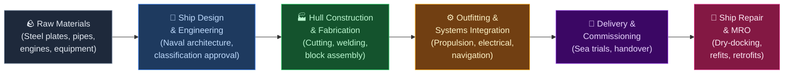
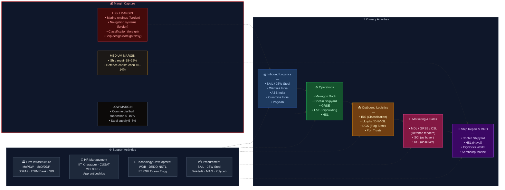

# Shipbuilding Industry — Value Chain Analysis (India)

---

## 0. Segment Definition

**Precise boundary:** This analysis covers the **commercial and defence shipbuilding value chain in India** — from raw material procurement (steel plates, marine equipment) through ship design, construction, outfitting, and delivery, to after-sales repair & maintenance (ship repair). It includes new vessel construction (bulk carriers, tankers, container ships, dredgers, offshore vessels, naval vessels, coast guard ships, barges, tugs) and excludes inland waterway vessels below 500 DWT and recreational/leisure boats.

**Core product/service flow:**

**End customers and what they value most:**
- **Indian Navy / Coast Guard:** Mission readiness, indigenous content (IDDM classification), technology transfer, through-life support
- **Shipping companies (SCI, private):** Delivery schedule, price, fuel efficiency, class certification
- **Port trusts & dredging agencies (DCI):** Specialised vessel types, timely delivery
- **Offshore & oil sector (ONGC, HPCL):** Specialised OSVs, safety certification
- **Export buyers (global):** Competitive price, delivery reliability, quality class certification (Lloyd's, DNV, BV)

**India's global position: Nascent / Follower**
India holds ~1% of global shipbuilding orderbook by CGT (South Korea ~32%, China ~47%, Japan ~16%). However, India is an emerging force in ship repair, naval/defence shipbuilding, and is a significant target of the government's Maritime India Vision 2030 and Shipbuilding Financial Assistance Policy (SBFAP).

---

## 1. Value Chain Map — Primary Activities

### 1.1 Inbound Logistics

**What it involves:** Sourcing and receiving steel plates & profiles (the single largest cost item at 20–25% of vessel cost), marine diesel engines, propellers, gearboxes, generators, navigation & communication systems, pumps, valves, electrical equipment, paints, and outfitting materials. Coordinating with classification societies for material certification. Managing bonded warehousing and customs for imported equipment (engines primarily from MAN Energy Solutions, Wärtsilä, Caterpillar Marine — all foreign).

**Cost/differentiation drivers:**
- Steel cost and availability (JSW Steel, SAIL supply ship-grade plates; ~60% of Indian yards import specialty steel)
- Engine import dependency — India has no indigenous large marine diesel engine manufacturer (critical gap)
- Port proximity of yard to material suppliers
- Inventory carrying cost on long build cycles (18–48 months per vessel)

**Indian companies active here:**
- **SAIL (BSE: 500113)** — Supplies shipbuilding-grade steel plates to Indian yards
- **JSW Steel (NSE: JSWSTEEL)** — Emerging supplier of ship-grade steel
- **NMDC (NSE: NMDC)** — Iron ore, indirect input
- **Kirloskar Oil Engines (NSE: KIRLOSKAR)** — Small/medium marine engines (auxiliary)
- **Cummins India (NSE: CUMMINSIND)** — Diesel gensets for smaller vessels
- **Wartsila India (unlisted, subsidiary)** — Marine propulsion & auxiliary systems
- **ABB India (NSE: ABB)** — Electrical systems, automation

---

### 1.2 Operations (Ship Construction)

**What it involves:** Hull design and lofting → steel cutting (CNC plasma/laser) → block fabrication & welding → block assembly in dry dock or on slipway → launching → outfitting (piping, electrical, HVAC, accommodation) → machinery installation → painting (anti-corrosion, antifouling) → systems testing. Defence vessels require additional weapons system integration managed by Navy/DRDO.

**Cost/differentiation drivers:**
- **Dock infrastructure** (dry dock size determines maximum vessel class)
- **Labour productivity** — Indian yards are labour-abundant but suffer from lower automation vs Korea/China; 30–40% lower labour cost but significantly lower throughput efficiency
- **Design capability** — yards that own design IP vs those that build to buyer-supplied designs earn higher margins
- **Block pre-outfitting ratio** — world-class yards pre-outfit 70–80% before erection; Indian yards typically 30–50%
- **Cycle time** — directly impacts working capital

**Indian companies active here:**
- **Mazagon Dock Shipbuilders (NSE: MAZDOCK)** — Mumbai; defence (submarines, destroyers, frigates); India's premier defence shipyard; ₹9,466 Cr revenue FY24; EBITDA margin ~12%
- **Cochin Shipyard (NSE: COCHINSHIP)** — Kochi; largest commercial + defence yard; first indigenous aircraft carrier INS Vikrant; ₹3,302 Cr revenue FY24; net margin ~14%
- **Garden Reach Shipbuilders (NSE: GRSE)** — Kolkata; frigates, corvettes, fast patrol vessels; ₹3,561 Cr revenue FY24
- **Hindustan Shipyard Ltd (HSL)** — Visakhapatnam; PSU (unlisted); submarines, tankers
- **Alcock Ashdown** — Bhavnagar; Gujarat; small vessels, repair (unlisted, state PSU)
- **ABG Shipyard** — formerly India's largest private commercial yard; under insolvency (NCLT), assets being acquired
- **Larsen & Toubro (NSE: LT)** — Katupalli (Chennai) and Hazira yards; defence vessels, jack-up rigs; significant player
- **Pipavav Defence (NSE: PIPAVAVDEF)** — Gujarat; under restructuring; strategic naval assets
- **Chowgule & Co** — Goa; unlisted; dredgers, barges, patrol vessels
- **Tebma Shipyards** — Chennai; unlisted; OSVs, barges, tugs

---

### 1.3 Outbound Logistics

**What it involves:** Sea trials (vessel self-propels to testing ground), classification society final survey and certification (Lloyd's Register, DNV-GL, Bureau Veritas, Indian Register of Shipping — IRS), vessel delivery voyage or tow to buyer's port, crew handover, documentation (flag state registration, SOLAS compliance certificates, stability booklet). For export orders, customs clearance and export documentation.

**Cost/differentiation drivers:**
- Classification society relationships and speed of certification
- Flag state registration (Panama, Marshall Islands commonly used for international trade vessels)
- **Indian Register of Shipping (IRS)** — India's own classification body; recognition by international shipping community is expanding
- Delivery voyage fuel cost (significant for large vessels)

**Key institutions:**
- **Indian Register of Shipping (IRS)** — Mumbai; India's classification society; classifies ~4,500 vessels
- **Directorate General of Shipping (DGS)** — Mumbai; flag state administration
- **DGFT** — Export licensing for defence-related vessels

---

### 1.4 Marketing & Sales

**What it involves:** Tendering for government/defence contracts (MoD, Navy, Coast Guard, port trusts); direct relationship-based selling for PSU shipping companies (SCI, DCI); participation in international ship shows (Posidonia, SMM Hamburg, Europort); technical pre-qualification with classification societies; consortium bidding for complex naval projects.

**Cost/differentiation drivers:**
- **Government relationships** — defence orders are relationship-driven; DPP (Defence Procurement Procedure) compliance is non-negotiable
- **IDDM (Indigenously Designed, Developed and Manufactured)** classification under DPP fetches highest priority
- **Track record** — repeat orders for warship classes require delivery of first vessel
- Price competitiveness vs Korean/Chinese yards for commercial vessels (Indian yards are currently 20–30% more expensive for bulk carriers/tankers)

**Key companies/institutions active here:**
- Mazagon Dock, GRSE, Cochin Shipyard — government tender specialists
- L&T Defence — leverages corporate group relationships with MoD
- **CSLA (Confederation of Indian Shipbuilding & Shiprepair Industry)** — industry body for advocacy
- **SCI (NSE: SCI)** — as buyer; dominant Indian shipping company placing orders

---

### 1.5 Service (Ship Repair & After-Sales)

**What it involves:** Scheduled dry-docking (every 2.5–5 years per SOLAS), hull cleaning and repainting, machinery overhaul, navigational equipment upgrades, retrofits (scrubbers for IMO 2020, ballast water treatment systems, LNG conversion), emergency repairs, life-extension refits. Ship repair is a more predictable revenue stream than new construction.

**Cost/differentiation drivers:**
- **Turnaround time** — ship operators lose ~$10,000–$50,000/day during repair; speed is the #1 buying criterion
- Dry dock availability and size
- Skilled trades workforce (welders, pipefitters, electricians, divers)
- Location relative to major shipping lanes (Cochin, Visakhapatnam, Mumbai, Kandla are strategically placed)

**Key Indian players:**
- **Cochin Shipyard** — India's largest ship repair facility; handles VLCC tankers
- **Hindustan Shipyard (HSL)** — Naval repair, submarine refits
- **Drydocks World (Dubai-owned)** — Mumbai facility; large commercial repairs (unlisted)
- **Sembcorp Marine India** — Hazira; offshore vessel repairs (subsidiary of Singapore's Sembcorp)
- **Bharati Defence** — Goa; unlisted; patrol vessels, barges repair
- **Mumbai Port Trust Workshops** — in-house repair for port craft

---

## 2. Value Chain Map — Support Activities

### 2.1 Firm Infrastructure (Governance, Regulation, Finance)

**Role:** Regulatory approvals for yards (MoS — Ministry of Shipping, now MoPSW), defence production licences (MoD/DDP), coastal regulation zone clearances (MoEF&CC), financing for long gestation contracts (shipbuilding advances of 20–30% of contract value are standard), SBFAP subsidy administration.

**Indian strengths/weaknesses:**
- **Strength:** SBFAP (Shipbuilding Financial Assistance Policy) provides financial assistance of up to 20% on new ship orders placed with Indian yards — critical support mechanism
- **Strength:** Strong DPP framework for defence procurement with IDDM preference
- **Weakness:** India has no dedicated shipbuilding development bank; SBI and EXIM Bank provide project finance but at higher rates than Korean Eximbank which subsidises Korean yards heavily
- **Weakness:** Land acquisition and coastal regulation make greenfield yard development extremely difficult

**Key institutions:**
- **Ministry of Ports, Shipping & Waterways (MoPSW)**
- **Ministry of Defence / DDP (Dept of Defence Production)**
- **Directorate General of Shipping (DGS)**
- **Indian Register of Shipping (IRS)**
- **SBI Capital Markets, EXIM Bank** — project finance

---

### 2.2 HR Management

**Role:** Shipbuilding is one of the most skill-intensive manufacturing industries — naval architects, marine engineers, structural engineers, CNC operators, underwater welders (Class II/III), pipefitters, riggers, painters. India has a large but under-trained workforce; the tradesman productivity gap vs Korea/Japan is the industry's deepest structural problem.

**Indian strengths/weaknesses:**
- **Strength:** Large engineering graduate pool (IITs, NITs produce naval architecture graduates; IIT Kharagpur has India's oldest naval architecture department)
- **Strength:** Low cost of labour (welder costs ₹600–900/day vs Korea ₹3,000–5,000/day equivalent)
- **Weakness:** Severe shortage of skilled underwater welders and CNC ship-cutting operators
- **Weakness:** No industry-wide apprenticeship pipeline; each PSU yard trains internally

**Key institutions:**
- **IIT Kharagpur** — Naval Architecture & Ocean Engineering (oldest & best)
- **Cochin University of Science and Technology (CUSAT)** — Naval architecture programme
- **NTTF (Nettur Technical Training Foundation)** — Trade skills training for yards
- **Mazagon Dock & GRSE** — In-house apprenticeship programmes (ITI-level)

---

### 2.3 Technology Development

**Role:** Ship design is the highest-margin, highest-barrier activity in the chain. CAD/CAM-based hull design, structural analysis (FEA), CFD (computational fluid dynamics) for hull form optimisation, combat management systems for naval vessels, propulsion system engineering. India's yards are design-capable for standard vessel types but depend on foreign designers/licensors for complex vessels (LNG carriers, large container ships).

**Indian strengths/weaknesses:**
- **Strength:** DRDO/NSTL (Naval Science & Technological Laboratory, Vizag) — India's premier naval R&D lab; developed sonar systems, torpedo systems
- **Strength:** Warship Design Bureau (WDB) under Indian Navy — full design capability for surface warships; designed INS Vikrant
- **Strength:** CSL's in-house design team — India's first indigenous aircraft carrier design
- **Weakness:** No Indian yard has designed (and won export orders for) large commercial vessels (bulk carriers >80,000 DWT, container ships >5,000 TEU, LNG carriers)
- **Weakness:** Most commercial shipbuilding software (Tribon/Aveva Marine, NAPA, ShipConstructor) is foreign

**Key institutions:**
- **DRDO — NSTL** (Vizag)
- **Warship Design Bureau (WDB)** — Indian Navy
- **IIT Kharagpur — Ocean Engineering Dept**
- **CSIR-NIO** (National Institute of Oceanography) — marine research

---

### 2.4 Procurement

**Role:** Shipbuilding's procurement function manages 200–500 vendors per vessel project. The critical bottleneck is **marine equipment imports** — India manufactures virtually no large marine diesel engines, no large marine gearboxes, limited marine-grade electronics. This import dependency adds 8–12 weeks to procurement lead times and ~15–20% to equipment cost vs yards in equipment-manufacturing countries.

**Indian strengths/weaknesses:**
- **Strength:** Local procurement for structural steel (SAIL, JSW), paints (Asian Paints Marine, Jotun India, AkzoNobel India), cables (Polycab), basic electrical fittings
- **Weakness:** Large marine engine 100% imported (MAN B&W, Wärtsilä, Caterpillar)
- **Weakness:** Marine propellers, shafts: largely imported (Nakashima Japan, Wärtsilä)
- **Weakness:** Anchor chains, mooring ropes: partially Indian

**Key companies:**
- **SAIL (NSE: SAIL)** — Structural steel plates
- **JSW Steel (NSE: JSWSTEEL)** — Ship-grade steel
- **Polycab India (NSE: POLYCAB)** — Marine-grade cables
- **Jotun India (unlisted)** — Marine coatings
- **Asian Paints Marine (NSE: ASIANPAINT)** — Marine paints (niche division)

---

## 3. Five Forces Analysis

### Supplier Power — HIGH

The most critical inputs — large marine diesel engines, marine electronics/navigation systems, thrusters, and propulsion systems — are supplied by a handful of global OEMs: MAN Energy Solutions (Germany), Wärtsilä (Finland), Caterpillar Marine (US), ABB (Switzerland), Kongsberg (Norway). These suppliers hold strong IP, have no credible Indian alternatives, and routinely quote 18–24 month lead times. Indian yards cannot negotiate pricing meaningfully; they are price-takers on equipment that constitutes 35–45% of a vessel's total cost. Steel is the only major input where Indian suppliers (SAIL, JSW) provide leverage, though ship-grade specialty plates still require imports for some standards. Supplier power is the single largest structural constraint on Indian shipbuilding competitiveness.

### Buyer Power — HIGH (commercial) / MEDIUM (defence)

Commercial shipbuilding is a buyer's market globally — shipping companies can place orders in Korea, China, or Japan at 20–30% lower prices than Indian yards. SCI (Shipping Corporation of India) and other Indian shipping companies have historically preferred foreign yards precisely for this reason. Buyer power is somewhat constrained in the defence segment: the Navy must order from Indian yards under the Atmanirbhar Bharat/IDDM framework, reducing yard negotiating pressure, but MoD's audit/accountability processes and fixed-price contract structures impose cost risk on yards. Port trusts and dredging agencies (DCI) represent captive domestic buyers for dredgers and port craft.

### Threat of New Entrants — LOW

Entry barriers are exceptionally high: a greenfield shipyard capable of building vessels >10,000 DWT requires ₹1,500–5,000 Cr of capital investment, 50–100 acres of waterfront land (subject to CRZ clearances), dry dock construction (₹300–800 Cr per dock), 3–5 years of construction time, and regulatory approvals from DGS, MoEF, MoPSW, and DDP (for defence). Workforce training takes 5–7 years to build institutional capability. The failure of ABG Shipyard (India's once-largest private yard) and Pipavav Defence has further deterred private capital. L&T's entry via Hazira (2009) and Katupalli (2012) is the only significant greenfield success of the past 20 years.

### Threat of Substitutes — LOW

For ocean-going cargo transport, there is no substitute for ships (air cargo is 10–15x more expensive and capacity-constrained). For the vessels themselves, there is no substitute product. The only partial substitution risk is in the ship repair segment: some operators defer maintenance (extending dry-dock intervals with class society permission) or relocate repair work to lower-cost yards in Dubai, Singapore, or Bangladesh. IMO's increasingly stringent environmental regulations (EEXI, CII ratings) are actually creating upgrade demand rather than substitution threat.

### Rivalry Intensity — MEDIUM-LOW (domestic) / EXTREME (global)

Domestically, there are only 6–8 significant yards (3 listed PSUs, 1–2 private), so rivalry for domestic orders is moderate — especially for defence contracts where yards compete on technical capability rather than price alone. However, in the global commercial market, Indian yards face brutal rivalry from Chinese yards (CSSC, COSCO Shipping Heavy Industry) and Korean yards (Hyundai HHI, Samsung Heavy, DSME), which benefit from massive scale, automation, subsidised finance, and decades of learning curve advantages. India's cost competitiveness exists only in labour — and Korean/Chinese automation is eliminating that gap.

### Five Forces Summary Table

| Force | Intensity | Key Driver |
|---|---|---|
| Supplier Power | High | 100% import dependence on large marine engines & electronics |
| Buyer Power | High (commercial) / Medium (defence) | Global alternatives at 20–30% lower cost for commercial |
| Threat of New Entrants | Low | ₹1,500–5,000 Cr capex, CRZ land, multi-year regulatory approvals |
| Threat of Substitutes | Low | No alternative to ocean freight; IMO regs drive MRO demand |
| Rivalry Intensity | Medium-Low (domestic) | Only 6–8 significant Indian yards; brutal in global market |

**Overall Attractiveness: MEDIUM (Defence-led) / LOW (Commercial)**
The defence and ship repair sub-segments offer medium structural attractiveness with government-mandated domestic sourcing providing insulation from global competition. Pure commercial shipbuilding in India is structurally unattractive at current scale and capability levels — India cannot compete on price or delivery against Korean/Chinese yards without step-change investment in automation and marine equipment manufacturing.

---

## 4. GVC Governance & India's Position

### Lead Firms (Global)
- **Hyundai Heavy Industries (HHI, Korea)** — World's largest shipbuilder; sets quality and delivery benchmarks
- **China State Shipbuilding Corporation (CSSC)** — China's dominant SOE; largest by orderbook
- **Wärtsilä (Finland)** and **MAN Energy Solutions (Germany)** — Lead firms in propulsion; govern the equipment sub-chain globally
- **Lloyd's Register, DNV-GL, Bureau Veritas** — Classification societies that effectively govern quality standards across the entire global chain

### Lead Firms (Indian)
- **Mazagon Dock (MAZDOCK)** — Leads Indian defence shipbuilding; submarine capability is the nation's crown jewel
- **Cochin Shipyard (COCHINSHIP)** — Leads on commercial + aircraft carrier construction
- **Indian Navy Warship Design Bureau** — Leads naval design IP in India

### Governance Type: Captive (Defence) + Market (Commercial)

For **defence shipbuilding**, governance is Captive: the Indian Navy (through MoD/DDP) sets highly codified specifications, controls access to the market via DPP categorisation (IDDM/Buy Indian), mandates technology transfer terms with foreign OEMs, and monitors execution through dedicated Project Monitoring Units. Indian yards are captive suppliers with limited negotiating power on margins (fixed-price contracts). The Navy captures significant value through cost-plus scrutiny.

For **commercial shipbuilding**, governance is Market: global shipping companies issue tenders specifying class standards, and yards compete purely on price and delivery. Indian yards are marginal participants in this segment.

### Value Capture Map

| Stage | Margin Level | Who Captures |
|---|---|---|
| Ship design / naval architecture (complex vessels) | 15–25% | Foreign design houses (TNSW, Deltamarin); Indian Navy WDB (non-commercial) |
| Marine diesel engines / propulsion | 20–30% | Wärtsilä, MAN (Finland/Germany) |
| Navigation & electronics systems | 25–35% | Kongsberg, Raytheon, Thales (foreign) |
| Hull construction (India) | 6–12% EBITDA | Indian PSU yards (Mazagon, GRSE, CSL) |
| Classification & certification | High (fee-based) | Lloyd's, DNV-GL (foreign); IRS (India, growing) |
| Ship financing & insurance | High | Western banks, P&I clubs; State Bank (limited) |
| Ship repair (India) | 10–18% | Cochin Shipyard, HSL, private yards |

### India's Position & Upgrade Trajectory

India is at **Stage 1 (Process Upgrading)** for commercial vessels and **Stage 2 (Product Upgrading)** for naval vessels.

**Upgrade pathway:**
1. **Process upgrade (underway):** Modernising block pre-outfitting ratios; CSL's new dry dock (India's largest, 310m × 75m, commissioned 2023) enables VLCC and aircraft carrier class
2. **Product upgrade (naval, achieved):** INS Vikrant (IAC-1) demonstrates India can build complex naval vessels; P17A stealth frigates underway at MDL and GRSE
3. **Functional upgrade (target):** Own the design IP for standard commercial vessel classes (bulk carriers 40–80,000 DWT, tankers, OSVs) — currently absent
4. **Chain upgrade (aspiration):** Become an integrated marine equipment manufacturer — the missing piece that Korea/Japan built in 1960s–1980s

India is **moving up the ladder** in defence but remains stagnant in commercial. The SBFAP subsidy and Maritime India Vision 2030's target of 5% global market share by 2030 are aspirational — the 1% current share vs the 5% target implies a 5x orderbook increase in 6 years, which is structurally implausible without massive investment in marine equipment manufacturing.

---

## 5. Key Linkages & Leverage Points

### Linkage 1: Marine Equipment Import → Operations Cost
The absence of domestic marine diesel engine manufacturing directly inflates construction cost by 15–20% and extends delivery timelines by 8–12 weeks (import lead times). This linkage destroys cost competitiveness in every commercial tender. **Highest leverage intervention:** A joint venture between an Indian industrial conglomerate (L&T, Tata, BHEL) and Wärtsilä or MAN to manufacture medium-bore marine engines (6–15 MW) in India under licence. BHEL has the foundry and machining capability; what is missing is the licence agreement and naval commitment to specify Indian engines.

### Linkage 2: Design Capability → Orderbook Quality
Yards that own design IP earn 5–10% higher margins (design fee embedded in contract) and can win repeat orders for standard vessel series without repeat tendering. MDL's ability to replicate Scorpène submarine design (under licence from Naval Group, France) is the closest India has come to a modular build strategy. **Leverage:** Expand IRS's design approval capability and incentivise yards to invest in in-house design teams through SBFAP top-up grants for design R&D.

### Linkage 3: Classification Society (IRS) Recognition → Export Access
Indian-built vessels must typically carry Lloyd's/DNV/BV certificates for international buyers to accept delivery. IRS is not yet mutually recognised by major flag states for all vessel categories. Every vessel needing a foreign classification society adds 2–4% to certification cost and delays delivery. **Leverage:** Bilateral MoU between IRS and Lloyd's Register / DNV-GL for mutual recognition — MoPSW is pursuing this under Maritime India Vision 2030.

### Linkage 4: Ship Repair Utilisation → Yard Financial Health
For most Indian yards, ship repair work (higher utilisation, faster cash cycle, lower working capital) cross-subsidises the long gestation of new construction contracts. CSL's ship repair division runs at 18–20% EBITDA vs new construction at 10–12%. Yards that lack a captive repair basin face cash flow stress during construction troughs.

### Linkage 5: Government Order Pipeline Visibility → Workforce Retention
Indian shipbuilding's perpetual workforce challenge is that the skilled tradesman pool disperses between contracts (welders, pipefitters take alternative construction work). 18–24 month gaps between consecutive naval contracts result in workforce attrition and retraining costs when the next contract arrives. **Leverage:** A rolling 7-year naval/coast guard construction plan published annually (similar to UK's National Shipbuilding Strategy) would allow yards to retain skilled workforce and justify training investment.

**Single Highest-Leverage Intervention:** **Domestic marine diesel engine manufacturing** — a JV between BHEL/L&T and Wärtsilä/MAN to manufacture 6–20 MW marine engines in India. This would cut vessel cost by 12–15%, reduce delivery timelines by 8–10 weeks, improve Make-in-India content ratios, and create a domestic supplier ecosystem. It is the one structural change that would simultaneously improve commercial competitiveness and enhance defence supply chain security.

---

## 6. Indian Company Landscape

### Listed Companies

| Value Chain Stage | Company Name | Listed? | Exchange & Ticker | Business Description | Approx. Revenue / Market Cap | Position in Chain |
|---|---|---|---|---|---|---|
| Operations — Defence Shipbuilding | Mazagon Dock Shipbuilders | Yes | NSE: MAZDOCK | Builds submarines (Scorpène class) and destroyers/frigates for Indian Navy | ₹9,466 Cr revenue FY24; Mkt cap ~₹90,000 Cr | Leader |
| Operations — Commercial + Defence | Cochin Shipyard Ltd | Yes | NSE: COCHINSHIP | India's largest shipyard; built INS Vikrant; commercial tankers, dredgers | ₹3,302 Cr revenue FY24; Mkt cap ~₹32,000 Cr | Leader |
| Operations — Defence Shipbuilding | Garden Reach Shipbuilders | Yes | NSE: GRSE | Frigates, corvettes, fast patrol vessels, mine countermeasure vessels | ₹3,561 Cr revenue FY24; Mkt cap ~₹23,000 Cr | Leader |
| Operations — Defence/Commercial | Pipavav Defence & Offshore | Yes | NSE: PIPAVAVDEF | Strategic naval yard; under restructuring; drydock for large vessels | ₹~200 Cr revenue; Mkt cap ~₹2,000 Cr | Distressed/Emerging |
| Operations — Defence/Infrastructure | L&T (Shipbuilding division) | Yes (parent) | NSE: LT | Builds naval OPVs, jack-up rigs at Hazira and Katupalli; not a separate listed entity | L&T group ₹2.2 lakh Cr revenue | Challenger |
| Inbound Logistics — Steel | SAIL | Yes | NSE: SAIL | Supplies ship-grade steel plates to Indian yards | ₹1,03,516 Cr revenue FY24; Mkt cap ~₹48,000 Cr | Niche (ship steel) |
| Inbound Logistics — Steel | JSW Steel | Yes | NSE: JSWSTEEL | Growing supplier of ship-grade steel | ₹2,27,148 Cr revenue FY24 | Niche (ship steel) |
| Inbound Logistics — Electrical | ABB India | Yes | NSE: ABB | Marine electrical systems, drives, automation | ₹12,469 Cr revenue FY24 | Niche |
| Inbound Logistics — Engines | Cummins India | Yes | NSE: CUMMINSIND | Diesel gensets for auxiliary marine power | ₹9,434 Cr revenue FY24 | Niche |
| Inbound Logistics — Cables | Polycab India | Yes | NSE: POLYCAB | Marine-grade cables and wiring systems | ₹18,004 Cr revenue FY24 | Niche |
| Outbound / Classification | Indian Register of Shipping | No (autonomous body) | — | India's classification society; certifies ~4,500 vessels | Not public | Leader (India) |
| Marketing & Sales (Buyer) | Shipping Corporation of India | Yes | NSE: SCI | State-owned shipping company; primary Indian buyer of new vessels | ₹2,476 Cr revenue FY24; Mkt cap ~₹7,500 Cr | Buyer/Leader |
| Service — Ship Repair | Cochin Shipyard | Yes | NSE: COCHINSHIP | India's largest commercial ship repair facility; VLCC-capable dry dock | See above | Leader |

### Unlisted / Private Companies

| Value Chain Stage | Company Name | Listed? | Details | Business Description | Approx. Scale | Position |
|---|---|---|---|---|---|---|
| Operations — Defence | Hindustan Shipyard Ltd (HSL) | No (Central PSU) | Ministry of Shipping | Submarines, tankers, naval repair; Visakhapatnam | ₹~800 Cr revenue (est.) | Niche |
| Operations — Defence/Patrol | Alcock Ashdown (Gujarat) | No (State PSU) | Gujarat govt | Small patrol vessels, barges; Bhavnagar | Small | Niche |
| Operations — Commercial | Chowgule & Co | No (Private) | Goa | Dredgers, barges, OSVs; strong in Goa/West coast | Not disclosed | Niche |
| Operations — Commercial | Tebma Shipyards | No (Private) | Chennai | OSVs, tugs, barges | Not disclosed | Niche |
| Operations — Defence/Patrol | Bharati Defence & Infrastructure | No (Private, restructuring) | Goa | Fast patrol vessels, barges; supply chain stress | Not disclosed | Distressed |
| Service — Ship Repair | Drydocks World India | No (Subsidiary) | Dubai-owned | Large commercial vessel repairs; Mumbai | Not disclosed | Niche |
| Service — Ship Repair | Sembcorp Marine India | No (Subsidiary) | Singapore-owned | Offshore vessel repairs; Hazira | Not disclosed | Niche |
| Inbound — Propulsion | Wärtsilä India | No (Subsidiary) | Finland parent | Marine engines, propulsion systems, after-sales service | Not disclosed | Leader (supplier) |
| Technology — Design | Warship Design Bureau (WDB) | No (Government) | Indian Navy | Full naval architecture capability for warships | Government entity | Leader (defence design) |
| Technology — Naval R&D | DRDO-NSTL | No (Government) | DRDO | Sonar, torpedoes, underwater weapons for naval vessels | Government entity | Leader (naval tech) |

### Notable Companies — Deeper Notes

**Mazagon Dock Shipbuilders (MAZDOCK)**
- Stage: Operations — Defence Shipbuilding
- What makes them interesting: India's only submarine builder — a natural monopoly of the highest strategic value. The Scorpène programme (P75) delivered 6 submarines and the P75-I programme (6 more advanced submarines, ~₹43,000 Cr) is underway with technology transfer from partner TBD. MDL also builds P15B destroyers and P17A stealth frigates. Their order book (~₹37,000 Cr as of FY24) provides 4–5 years of revenue visibility.
- Key financials: Revenue ₹9,466 Cr FY24; EBITDA margin ~12%; Mkt cap ~₹90,000 Cr; virtually debt-free.
- Watch factor: P75-I submarine partner selection (Spanish Navantia, German TKMS, French Naval Group competing) — will determine technology level and MDL's capability jump.

**Cochin Shipyard (COCHINSHIP)**
- Stage: Operations + Service
- What makes them interesting: India's most diversified yard — builds aircraft carriers, commercial tankers, and LNG bunker vessels, while running India's largest commercial ship repair operation. Successfully delivered INS Vikrant (40,000-tonne aircraft carrier) — a landmark product upgrade. Now targeting international ship repair market with a new 310m dry dock.
- Key financials: Revenue ₹3,302 Cr FY24; Net profit margin ~14%; Mkt cap ~₹32,000 Cr.
- Watch factor: Whether CSL wins international VLCC repair contracts — would validate its ambition as a regional ship repair hub competing with Dubai/Singapore.

**Garden Reach Shipbuilders (GRSE)**
- Stage: Operations — Defence Shipbuilding
- What makes them interesting: Niche in fast patrol vessels and frigate-class warships; has diversified into Bailey bridges and modular bridges for defence (unique cross-chain play). First Indian yard to export a warship (patrol vessel to Mauritius). Strong execution track record on P17A frigates.
- Key financials: Revenue ₹3,561 Cr FY24; EBITDA margin ~11%; Mkt cap ~₹23,000 Cr.
- Watch factor: Export order pipeline — has quotes outstanding to several Southeast Asian navies.

**L&T Shipbuilding (unlisted division of NSE: LT)**
- Stage: Operations — Defence + Offshore
- What makes them interesting: Only private yard with credible large-vessel construction capability (jack-up drilling rigs at Hazira; OPVs at Katupalli). L&T's engineering DNA gives it a design edge over PSU yards. Could be the anchor for India's commercial shipbuilding ambition if government provides SBFAP support and land.
- Key financials: L&T group FY24 revenue ₹2.2 lakh Cr; shipbuilding division revenue not separately disclosed.
- Watch factor: Whether L&T pursues a separate listing for its defence/shipbuilding business — would unlock significant value.

**Wärtsilä India (unlisted, subsidiary)**
- Stage: Inbound Logistics / Service
- What makes them interesting: Controls India's marine propulsion after-sales market. Any vessel with a Wärtsilä engine in Indian waters uses Wärtsilä India for servicing. This MRO lock-in generates recurring, high-margin revenue. Represents exactly the type of value India is not capturing domestically.
- Key financials: Not publicly disclosed (subsidiary of Wärtsilä OYJ, Finland)
- Watch factor: Whether Indian policy (Atmanirbhar, PLI for marine equipment) forces Wärtsilä to localise engine manufacturing vs merely assembling/servicing.

---

## 7. Strategic Insight

**Non-obvious insight:** The Indian shipbuilding industry's core problem is not labour cost, not yard capacity, and not order pipeline — it is the **absence of a domestic marine equipment manufacturing ecosystem**. Every analysis of Indian shipbuilding correctly identifies that Korea and Japan built their shipbuilding industries by first building their steel, engine, and electronics industries. India's mistake has been trying to build the assembly (hull fabrication) capability while tolerating permanent import dependence on the highest-margin components. The result is a structurally low-margin, high-working-capital, cyclically distressed industry that cannot compete commercially and only survives through government defence mandates. The entire strategic debate about "more yards vs better yards" misses the point — the transformation required is upstream, in the supplier ecosystem, not in the yards themselves. An Indian yard that can source a Wärtsilä-equivalent engine domestically at 15% cost advantage would be globally competitive in bulk carriers and tankers within a decade.

**Blue Ocean Opportunity — Four Actions Framework:**

| Action | What |
|---|---|
| **Eliminate** | The cottage-industry model of one-off custom vessel designs for each order; eliminate bespoke engineering rework costs |
| **Reduce** | Dependence on foreign classification societies for standard vessel types — expand IRS mutual recognition agreements |
| **Raise** | Pre-outfitting ratio from India's current ~40% to 70%+ (world-class standard); would cut construction time by 25–30% |
| **Create** | A **"Series Build" platform** — standardise 3–4 vessel designs (40,000 DWT bulk carrier, 6,000 DWT product tanker, 5,000 DHP tug, 3,500 m³ dredger) and market them to Southeast Asian buyers as catalogue products, bypassing the bespoke tender process entirely. This is exactly what South Korean yards did in the 1980s to take share from Japan. |

**Top 3 Priorities for an Indian Firm Seeking Durable Advantage:**

1. **Anchor a marine diesel engine JV.** Partner with Wärtsilä or MAN to manufacture medium-bore marine engines (6–20 MW) in India. This is a 10-year investment but the only intervention that transforms the cost structure of every vessel built in India. BHEL or L&T are the natural anchors; requires MoD commitment to specify Indian engines in all future naval contracts to provide guaranteed volume.

2. **Build a Series-Build commercial orderbook.** Choose 2 standardised vessel designs (e.g., 40,000 DWT bulk carrier, 6,500 DWT tanker) and invest in the tooling, jigs, and process standardisation to build them at 30% lower cycle time than today. Price aggressively (supported by SBFAP subsidy) to win 3–5 repeat orders from the same buyer, building the learning curve. Cochin Shipyard and L&T are best positioned to execute this.

3. **Dominate Asian ship repair.** India's geography (sits astride the India-Europe and India-East Asia shipping lanes) gives it a locational advantage for ship repair that it has never monetised at scale. Singapore and Dubai capture most of this value today. A ₹2,000 Cr investment in a dedicated world-class ship repair facility (4 drydocks, floating dock, 24/7 turnaround guarantee) at a West Coast location (Kandla or Cochin) could capture 10–15% of the MENA-India-SE Asia repair market within 7 years — at 18–22% EBITDA margins.

---

## 8. Value Chain Diagram (Mermaid)

