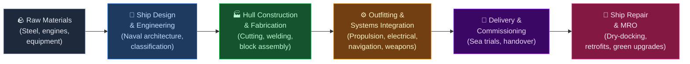

# India Value Chain Analysis: Shipbuilding

*Analysis date: July 2026 | Analyst: Claude Code (India Value Chain Skill)*
*Supersedes: Shipbuilding - Value Chain Analysis.md (prior version)*

---

## 0. Segment Definition

**Precise boundary:** This analysis covers the **commercial and defence shipbuilding value chain in India** — from raw material procurement (steel plates, marine equipment) through ship design, construction, outfitting, and delivery, to after-sales repair and maintenance (ship repair and MRO). It includes new vessel construction (bulk carriers, tankers, chemical tankers, container ships, dredgers, offshore vessels, naval vessels, coast guard ships, barges, tugs, green/dual-fuel vessels) and ship repair. It excludes inland waterway vessels below 500 DWT and recreational/leisure boats.

**Core product/service flow:**

**End customers and what they value most:**
- **Indian Navy / Coast Guard:** Mission readiness, indigenous content (IDDM classification), technology transfer, through-life support. Navy entering a commissioning super-cycle: one new warship every 40–42 days from 2026.
- **Shipping companies (SCI, private):** Delivery schedule, price, fuel efficiency, IMO 2030/2050 decarbonisation compliance (EEXI, CII ratings), LNG/dual-fuel readiness.
- **Port trusts & dredging agencies (DCI):** Specialised vessel types, timely delivery.
- **Offshore & oil sector (ONGC, HPCL):** Specialised OSVs, safety certification.
- **Export buyers (global):** Competitive price, delivery reliability, IRS/Lloyd's/DNV certification, green propulsion credentials.

**India's global position: Nascent → Challenger (policy-driven acceleration).**
India holds ~1% of global shipbuilding orderbook by CGT. The government has set an explicit target to become a top-5 shipbuilding nation by 2047 through the Maritime Amrit Kaal Vision 2047 and two landmark schemes totalling ₹44,700 crore (SBFAS + SbDS), notified September 2025. A ₹697 billion Maritime Development Package was announced in 2025. The Navy's commissioning super-cycle (one new vessel every 40–42 days from 2026) and the ₹66,000–70,000 crore P75I submarine programme (MDL-TKMS, IGA signed January 2026) are transforming India's shipbuilding ambition from aspiration to funded programme.

---

## 0.5 Quick Scan — Investable Listed Companies

| Company | Ticker | Cap Bucket | Chain Stage | One-Line Investment Thesis | Coverage |
|---|---|---|---|---|---|
| Mazagon Dock Shipbuilders | NSE: MAZDOCK | Large | Defence Shipbuilding (Submarines + Destroyers) | ₹99,000 Cr defence contract pipeline (P75I + follow-on programs); Colombo Dockyard acquisition opens international ship repair; FY26 PAT doubled YoY | Well-covered |
| Cochin Shipyard | NSE: COCHINSHIP | Mid | Commercial + Defence + Ship Repair | ₹21,100 Cr order book; new ISRF facility adds 25% national ship repair capacity; IAC-2 aircraft carrier decision is a re-rating trigger if it materialises | Moderate |
| Garden Reach Shipbuilders (GRSE) | NSE: GRSE | Mid | Defence Shipbuilding (Frigates, Corvettes) | ₹15,320 Cr order book; P-17A frigates + hybrid vessel contracts; export pipeline to Southeast Asia and Indian Ocean navies | Moderate |
| Swan Defence & Heavy Industries | NSE: PIPAVAVDEF (rebranded SWAN DEFENCE) | Small | Commercial + Naval Shipbuilding | Pipavav restructuring complete; SBFAS 25% subsidy directly applicable to its chemical tanker + LNG-ready dual-fuel orderbook; largest private drydock in India | Under-researched |
| L&T (Shipbuilding division) | NSE: LT | Large | Defence + Offshore Vessel Construction | P75I strategic partner bid disqualified; L&T's Hazira/Katupalli yards well-placed for NGOPV and future submarine work; not separately listed but real optionality | Well-covered |
| SAIL | NSE: SAIL | Large | Ship-grade Steel Supply | Every new Indian shipyard order is a SAIL order; SBFAS-driven demand acceleration not in consensus models | Well-covered |
| JSW Steel | NSE: JSWSTEEL | Large | Ship-grade Steel Supply | Growing supplier of ship-grade plates; SBFAS-driven demand uplift | Well-covered |
| Polycab India | NSE: POLYCAB | Large | Marine Cables | Marine-grade cable content per vessel is 2–4% of total cost; every new warship/tanker is a Polycab order | Well-covered |
| ABB India | NSE: ABB | Large | Marine Electrical Systems | Shore power, propulsion drives, automation for all major Indian yards | Well-covered |
| Knowledge Marine & Engineering Works | NSE SME: KMEW | Micro (SME) | Small Vessel / Green Tug Construction + Marine Services | ₹930 Cr green tug order (FY25–26); acquired Kamal Marine 2025; SBFAS green-tech 30% subsidy directly applies; overlooked micro-cap with structural tailwind | Undiscovered |
| Shipping Corporation of India | NSE: SCI | Mid | Ship Buyer / Operator | Primary domestic buyer for new vessel orders; beneficiary of SCI fleet renewal plan under MoPSW | Moderate |

**Under-researched opportunity:** The **Small-cap and Micro-cap** bucket — Swan Defence & Heavy Industries (restructured Pipavav) and Knowledge Marine (NSE SME) — is where the new SBFAS and SbDS policy tailwind will flow most asymmetrically. Both companies are positioned in vessel classes (chemical tankers, LNG-ready vessels, green tugs) that attract the highest SBFAS subsidy tiers (25–30% of contract value). Analyst coverage is 0–2 per stock, yet the structural demand driver (government ₹44,700 Cr scheme active through FY36) is locked in for a decade.

---

## 1. Value Chain Map — Primary Activities

### Activity 1: Inbound Logistics — Steel, Engines, and Equipment Procurement

**What it involves:**
Sourcing and receiving steel plates and profiles (single largest cost item at 20–25% of vessel cost), marine diesel engines, propellers, gearboxes, generators, navigation and communication systems, pumps, valves, electrical equipment, paints, and outfitting materials. For green/dual-fuel vessels (an emerging category under IMO 2030), procurement includes LNG fuel systems, scrubbers, ballast water treatment systems, and hybrid battery-electric systems. Coordinating with classification societies for material certification and managing import logistics for equipment still predominantly sourced outside India (engines, navigation, electronics).

**Key cost and differentiation drivers:**
- **Steel cost and availability**: JSW Steel and SAIL supply ship-grade plates domestically; specialty grades (high-tensile ship plate HTS40/HTS47, DH36/EH36 for naval vessels) still partially imported. Both schemes (SBFAS + SbDS) are incentivising domestic steel mills to invest in higher-grade plate manufacturing.
- **Engine import dependency**: India has no indigenous large marine diesel engine manufacturer — the single most structural cost gap in the chain. Critical gap being partially addressed through BHEL and L&T discussions with Wärtsilä/MAN for domestic manufacturing under the SbDS.
- **Green equipment procurement**: LNG fuel tanks, dual-fuel engines, scrubbers, and BWTS are new procurement categories that the Indian supply chain cannot yet serve domestically; imports at significant premium.
- **Port proximity**: Yards near major import ports (Mumbai, Kochi, Visakhapatnam) save 2–3 weeks on equipment logistics.

**Indian companies active here:**
- **SAIL** (NSE: SAIL): Ship-grade steel plates; armour steel for naval vessels
- **JSW Steel** (NSE: JSWSTEEL): Growing ship-grade steel supplier; HTS plates
- **Polycab India** (NSE: POLYCAB): Marine-grade cables for all vessel types
- **ABB India** (NSE: ABB): Marine electrical switchgear, drives, automation systems
- **Cummins India** (NSE: CUMMINSIND): Auxiliary diesel gensets for smaller vessels
- **Wärtsilä India** (unlisted, subsidiary of Wärtsilä OYJ Finland): Marine propulsion, dual-fuel engines, after-sales service — the most critical foreign-owned supplier node in the chain

---

### Activity 2: Operations — Ship Design, Construction, and Outfitting

**What it involves:**
Hull design and lofting → steel cutting (CNC plasma/laser) → block fabrication and welding → block assembly in dry dock or on slipway → launching → outfitting (piping, electrical, HVAC, accommodation) → machinery installation → painting (anti-corrosion, antifouling) → weapons/sensors installation (defence vessels) → systems testing. For green vessels: installation of LNG fuel systems, scrubbers, or battery-hybrid propulsion before delivery.

**Key structural updates (2025–26):**
- **Navy commissioning super-cycle**: Indian Navy adding one new warship every 40–42 days from 2026 — MDL, GRSE, and CSL are all operating at near-peak utilisation.
- **P75I submarine programme**: MDL-TKMS IGA signed January 2026 during German Chancellor Merz's India visit. Contract value ₹66,000–70,000 Cr; CCS clearance expected; main contract signature expected late FY26–early FY27. Six Type-214/218 variant submarines with AIP — MDL is the Indian build yard. First submarine expected early 2030s.
- **L&T Navantia bid disqualified** (January 2025): L&T's P75I bid with Spain's Navantia was disqualified for lacking a sea-proven AIP system — MDL-TKMS is now the sole bidder.
- **SBFAS greenfield clusters**: New SbDS (₹19,989 Cr) explicitly funds greenfield shipbuilding clusters to add 4.5 million GT commercial capacity by 2047 — first greenfield cluster approvals expected in FY27–28.
- **Colombo Dockyard acquisition by MDL**: Mazagon Dock acquired 51% controlling stake in Colombo Dockyard PLC (Sri Lanka's largest yard) for ~₹237 Cr ($53 Mn) — MDL's first international expansion, enabling regional ship repair and export servicing capability.

**Key cost and differentiation drivers:**
- **Dry dock infrastructure** determines maximum vessel class; CSL's new 310m × 75m dock commissioned 2023–24 enables VLCC and aircraft carrier class.
- **Block pre-outfitting ratio**: World-class yards pre-outfit 70–80% before erection; Indian yards typically 30–50%. SbDS funds automation investment to narrow this gap.
- **Green-tech compliance**: Vessels built with LNG/dual-fuel, scrubbers, or BWTS attract 25–30% SBFAS assistance (vs 15–20% for standard vessels) — creating a direct financial incentive for green shipbuilding.
- **India Ship Technology Centre (ISTC)**: To be established under SbDS at Indian Maritime University; will provide centralized design, R&D, and simulation capability accessible to all yards.

**Indian companies active here:**
- **Mazagon Dock Shipbuilders** (NSE: MAZDOCK): Mumbai; defence (P75 Scorpène submarines + P75I Type-214, P15B destroyers, P17A frigates); FY26 revenue ₹13,006 Cr; PAT ₹2,578 Cr; order book end FY26 ₹20,535 Cr; ₹99,000 Cr defence contract pipeline in advanced negotiations; acquired Colombo Dockyard 51% stake
- **Cochin Shipyard** (NSE: COCHINSHIP): Kochi; largest commercial + defence yard; INS Vikrant delivered; ASW Shallow Water Craft, Next-Generation Missile Vessels, commercial tankers, LNG-capable vessels; order book ₹21,100 Cr (June 2025); 65% defence mix; International Ship Repair Facility (ISRF) commissioned 2024
- **Garden Reach Shipbuilders** (NSE: GRSE): Kolkata; P-17A stealth frigates, NGOPVs, ASW vessels, fast patrol vessels; 13 hybrid all-weather ferries (Hooghly River); 4 hybrid multipurpose vessels; order book ₹15,320 Cr end FY26 across 39 platforms
- **Swan Defence & Heavy Industries** (NSE: PIPAVAVDEF / rebranded SWAN DEFENCE): Pipavav restructuring complete (Swan Energy acquired Jan 2024; rebranded Jan 2025); chemical tanker orders with dual-fuel LNG-ready hybrid propulsion; largest private drydock in India; SBFAS direct beneficiary
- **Hindustan Shipyard Ltd** (HSL, unlisted PSU): Visakhapatnam; submarines, tankers, naval repair
- **L&T Shipbuilding** (unlisted, subsidiary of NSE: LT): Hazira (jack-up rigs) and Katupalli (OPVs, naval vessels); P75I bid disqualified but L&T remains a credible bidder for future programmes; only private yard with large-vessel construction capability
- **Knowledge Marine & Engineering Works** (NSE SME: KMEW): Green tugs (₹700 Cr long-term project), support vessels; acquired Kamal Marine 2025 (renamed Knowledge Shipyard Pvt Ltd); SBFAS green-tech 30% subsidy applies
- **Chowgule & Co** (unlisted, Goa): Dredgers, barges, OSVs
- **Tebma Shipyards** (unlisted, Chennai): OSVs, tugs, barges

---

### Activity 3: Outbound Logistics — Classification, Certification, and Delivery

**What it involves:**
Sea trials (vessel self-propels to testing ground), classification society final survey and certification (Lloyd's Register, DNV-GL, Bureau Veritas, Indian Register of Shipping — IRS), vessel delivery voyage or tow to buyer's port, crew handover, documentation (flag state registration, SOLAS compliance certificates, stability booklet, EEXI certificate for IMO 2030 compliance). For export orders, customs clearance and export documentation. For defence vessels, formal induction ceremony into Naval/Coast Guard service.

**Key updates:**
- **IRS expanding scope**: Indian Register of Shipping is progressively seeking mutual recognition agreements with major flag states; MoPSW pursuing bilateral MoUs with Lloyd's Register and DNV-GL under Maritime India Vision 2030.
- **Green certification requirement**: Every vessel built from 2025 onwards must carry EEXI (Energy Efficiency Existing Ship Index) and CII (Carbon Intensity Indicator) certification — creating a new certification workstream for IRS and foreign classification societies operating in India.
- **ISRF at Cochin Shipyard**: The new International Ship Repair Facility (42 acres, 6,000 ton syncrolift, Willingdon Island) has boosted national ship repair capacity by ~25% and is designed to attract international vessel repair — pending IRS mutual recognition upgrades.

**Key institutions:**
- **Indian Register of Shipping (IRS)**: Mumbai; classifies ~4,500 vessels; expanding scope
- **Directorate General of Shipping (DGS)**: Flag state administration; Mumbai
- **DGFT**: Export licensing for defence-related vessels
- **Lloyd's Register / DNV-GL / Bureau Veritas**: Required for export vessels and most international commercial orders

---

### Activity 4: Marketing & Sales — Naval Tenders, SBFAS Orders, and Exports

**What it involves:**
Tendering for government/defence contracts (MoD, Navy, Coast Guard, port trusts); direct sales for PSU shipping companies (SCI, DCI); export marketing (GRSE to Southeast Asian navies; MDL via Colombo Dockyard for regional presence); participation in international ship shows (Posidonia, SMM Hamburg, Europort); and — a new activity unlocked by SBFAS — proactive marketing of SBFAS-subsidised standard vessel designs to domestic and regional private shipping companies who have historically ordered abroad.

**Key updates:**
- **SBFAS 2.0 demand catalysis**: ₹24,736 Cr SBFAS expected to catalyse ₹96,000 Cr of domestic shipbuilding contracts over 10 years (FY26–FY36). The 15–25% contract value subsidy (30% for green vessels) directly narrows the price gap between Indian yards and Korean/Chinese yards. This is the most significant commercial shipbuilding market-making policy India has ever enacted.
- **SCI fleet renewal**: Shipping Corporation of India is in the process of a fleet renewal programme; new vessels expected to be ordered domestically under SBFAS mandates — MDL, CSL, and Swan Defence are the natural beneficiaries.
- **India's first chemical tanker order**: A landmark commercial order signalling India's entry into speciality vessel commercial shipbuilding (not just bulk/defence). Swan Defence built dual-fuel LNG-ready chemical tankers.
- **Export pipeline**: GRSE has outstanding quotes to multiple Southeast Asian navies; MDL's Colombo Dockyard acquisition gives it a regional presence for repairs and potentially lighter naval vessel construction. India's BrahMos export success is creating diplomatic goodwill in exactly the markets (Philippines, Vietnam, Southeast Asia) where naval shipbuilding export conversations are happening.

**Key companies:**
- MDL, GRSE, CSL — government tender specialists (naval orders)
- L&T Defence — group relationship leverage with MoD
- Swan Defence — SBFAS commercial vessel marketing
- **CSLA (Confederation of Indian Shipbuilding & Shiprepair Industry)** — advocacy
- **SCI** (NSE: SCI) — primary domestic buyer for new commercial vessels

---

### Activity 5: Service — Ship Repair, MRO, and Green Retrofits

**What it involves:**
Scheduled dry-docking (every 2.5–5 years per SOLAS), hull cleaning and repainting, machinery overhaul, navigational equipment upgrades, retrofits (scrubbers for IMO 2020, ballast water treatment systems, LNG conversion for green compliance), emergency repairs, life-extension refits, and — now a significant emerging sub-segment — **green retrofit work** as the global fleet of 50,000+ vessels scrambles to meet IMO 2030 EEXI and CII requirements. Cochin Shipyard holds ~45% of India's ship repair market; the new ISRF (commissioned 2024) positions it to capture international VLCC repair work currently flowing to Singapore and Dubai.

**Key updates:**
- **Cochin Shipyard ISRF**: 42-acre International Ship Repair Facility on Willingdon Island with 6,000-ton syncrolift commissioned 2024; adds ~25% to India's national ship repair capacity; enables VLCC-class international repair contracts.
- **MDL Colombo Dockyard**: MDL's 51% acquisition of Colombo Dockyard PLC gives it a captive ship repair operation in a strategically located Indian Ocean port — positioned to capture container ship and bulk carrier repair from the India-Europe and India-East Asia shipping routes.
- **Green retrofit demand**: IMO's EEXI and CII regulations are creating a mandatory retrofit demand wave — scrubber installations, LNG conversion kits, waste heat recovery, energy-saving devices. This is pure high-margin MRO work for Indian yards with no foreign competition advantage.
- **Navy PBL (Performance-Based Logistics)**: Navy is transitioning to PBL contracts where MDL and GRSE guarantee platform availability — structurally higher recurring revenue and margin vs time-and-material repair contracts.

**Key Indian players:**
- **Cochin Shipyard** (NSE: COCHINSHIP): India's largest commercial ship repair; 45% domestic market share; VLCC-capable ISRF
- **Hindustan Shipyard** (HSL, unlisted PSU): Naval repair; submarine refits
- **MDL via Colombo Dockyard**: New international repair capability (51% stake acquired)
- **Drydocks World India** (unlisted, Dubai-owned): Mumbai; large commercial vessel repairs
- **Sembcorp Marine India** (unlisted, Singapore-owned): Hazira; offshore vessel repairs
- **Knowledge Marine & Engineering Works** (NSE SME: KMEW): Small vessel repair and marine services; growing tug repair/maintenance capability

---

## 2. Value Chain Map — Support Activities

### Support 1: Firm Infrastructure

**Role:** Regulatory approvals, defence licences (DPP/DAP 2026 compliance), coastal regulation zone clearances, and — newly transformed — a dramatically improved financing ecosystem. The ₹44,700 Cr twin-scheme package (SBFAS + SbDS) and the Maritime Development Fund (MDF, ₹25,000 Cr for long-term affordable finance) collectively represent the most comprehensive state support framework Indian shipbuilding has ever had.

**Key 2025–26 policy changes:**
- **SBFAS (Shipbuilding Financial Assistance Scheme)**: ₹24,736 Cr; 15–20% assistance for standard vessels, 25% for complex vessels (tankers, container ships), 30% for green-tech vessels; Shipbreaking Credit Note (up to 40% of scrap value from Indian ship recycling) is an innovative demand-creation mechanism; applicable for contracts signed FY26–FY36.
- **SbDS (Shipbuilding Development Scheme)**: ₹19,989 Cr; funds greenfield shipbuilding clusters, brownfield modernisation, and India Ship Technology Centre (ISTC) at Indian Maritime University for design/R&D/skills; ₹1,200 Cr for Shipbuilding Capability Development Centres (SCDC); ₹610 Cr for ship technology R&D.
- **Maritime Development Fund (MDF)**: ₹25,000 Cr; long-term, affordable project finance to compete with Korean Eximbank's heavily subsidised loans to Korean yards.
- **Target**: 4.5 million GT annual commercial shipbuilding capacity by 2047; India in global top 5 by 2047.

**Key institutions:** Ministry of Ports, Shipping & Waterways (MoPSW); Ministry of Defence / DDP; DGS; IRS; SBI Capital Markets; EXIM Bank; MDF (new); Indian Maritime University (ISTC host).

---

### Support 2: Human Resource Management

**Role:** Shipbuilding requires naval architects, marine engineers, CNC operators, underwater welders, pipefitters, riggers, and painters. India's tradesman productivity gap vs Korea/Japan remains the industry's deepest structural problem. SbDS addresses this directly: ₹1,200 Cr for Shipbuilding Capability Development Centres (SCDCs) and the ISTC — the most significant skills investment in Indian maritime history.

**Where Indian firms are strong or weak:**
- **Strong**: Large engineering graduate pool; IIT Kharagpur naval architecture (India's oldest); CUSAT; low labour cost (welder ₹700–1,000/day vs Korea ₹3,000–5,000/day equivalent).
- **Weak**: Acute shortage of underwater welders and CNC ship-cutting operators; no industry-wide apprenticeship pipeline; SbDS SCDCs intended to fill this gap from FY27 onwards.
- **New**: Green shipbuilding requires LNG systems engineers, battery-electric propulsion technicians, and IMO-compliance specialists — new skill categories that Indian technical institutions do not yet produce in volume.

**Notable:** IIT Kharagpur (Naval Architecture & Ocean Engineering); CUSAT (Naval Architecture); NTTF (trade skills); MDL/GRSE in-house apprenticeships; ISTC (to be established under SbDS).

---

### Support 3: Technology Development

**Role:** Ship design IP is the highest-margin, highest-barrier activity. CAD/CAM hull design, structural FEA, CFD for hull form optimisation, combat management systems for naval vessels, propulsion engineering, and — increasingly — digital twin technology for through-life vessel management.

**Key 2025–26 developments:**
- **India Ship Technology Centre (ISTC)**: To be established under Indian Maritime University with SbDS funding; will provide centralised hull design, simulation, and digital twin capability to all Indian yards — the most structural technology investment ever made in Indian commercial shipbuilding.
- **India's first chemical tanker design**: Swan Defence's dual-fuel LNG-ready chemical tanker represents India's first entry into speciality commercial vessel design and construction — a genuine product upgrade.
- **Hybrid ferry design**: GRSE's 13 hybrid all-weather ferries for Hooghly River are India's first production-run hybrid vessels — building domestic competence in electric/hybrid propulsion that will be mandatory for IMO 2030 compliance.
- **P75I design transfer**: MDL-TKMS IGA (signed January 2026) mandates technology transfer for Type-214/218 variant submarine design — India's most sophisticated naval engineering programme to date.

**Where Indian firms are strong/weak:** Strong in naval design (WDB, DRDO-NSTL, DRDO-CMT); strong in warship construction execution (MDL, GRSE). Weak in commercial vessel design IP (no Indian yard has designed and exported a large commercial vessel — 40,000+ DWT bulk carrier, 3,000 TEU container ship, LNG carrier). ISTC is the structural response to this gap but will take 5–8 years to produce commercial-grade design output.

---

### Support 4: Procurement

**Role:** Managing 200–500 vendors per vessel project; importing large marine engines, thrusters, navigation systems, marine electronics; managing bonded warehousing; and increasingly — sourcing green technology equipment (LNG fuel systems, scrubbers, BWTS, hybrid batteries) that is 100% imported.

**Where Indian firms are strong/weak:**
- **Strong**: Domestic procurement for structural steel (SAIL, JSW), paints (Jotun India, AkzoNobel), marine cables (Polycab), basic electrical fittings; Indian Register of Shipping classification saves ~2% vs foreign class.
- **Weak**: Large marine engines 100% imported (MAN B&W, Wärtsilä, Caterpillar); marine propellers largely imported; green technology equipment (LNG tanks, scrubbers, hybrid batteries) 100% imported at premium; navigation and electronics largely imported (Kongsberg, Raytheon, Thales).
- **SbDS intervention**: ₹610 Cr R&D fund + SCDC investment explicitly intended to build domestic marine equipment supplier ecosystem — starting with medium auxiliary engines, pumps, valves, and basic deck equipment.

**Notable domestic suppliers:** SAIL (NSE: SAIL); JSW Steel (NSE: JSWSTEEL); Polycab India (NSE: POLYCAB); ABB India (NSE: ABB); Cummins India (NSE: CUMMINSIND); Kirloskar Oil Engines (NSE: KIRLOSKAR) — auxiliary marine engines; Jotun India (unlisted) — marine coatings.

---

## 3. Five Forces + Capital Cycle Analysis

### Part A — Five Forces

**Supplier Power — HIGH**
The most critical inputs — large marine diesel engines, marine electronics/navigation systems, thrusters, and propulsion systems — are supplied by a handful of global OEMs: MAN Energy Solutions (Germany), Wärtsilä (Finland), Caterpillar Marine (US), ABB (Switzerland), Kongsberg (Norway). India has no domestic alternative for any of these. Indian yards cannot negotiate pricing and are price-takers on equipment constituting 35–45% of vessel cost. The new green technology layer (LNG fuel systems, hybrid batteries, scrubbers) adds further import-dependent procurement categories. The SbDS R&D fund is a 10-year solution to a current problem. Supplier power remains **HIGH**.

**Buyer Power — HIGH (commercial) / MEDIUM (defence)**
SBFAS 2.0 has materially changed the commercial dynamic: the 15–30% contract value subsidy narrows Indian yards' price gap vs Korean/Chinese competition from 20–30% to near-parity for standard vessels and below-parity for green/complex vessels. This is a direct reduction in commercial buyer power — buyers who previously had no reason to consider Indian yards now have financial incentive to do so. Defence buyer power remains MEDIUM: MoD's DAP 2026 domestic sourcing mandate, fixed-price contract risk, and audit scrutiny impose cost risk on yards, but yards like MDL have near-monopoly on submarine construction — genuine pricing power in that sub-segment.

**Threat of New Entrants — LOW (large yards) / MEDIUM (small/green vessels)**
Large-yard entry barriers remain extreme: ₹1,500–5,000 Cr capex, CRZ-protected waterfront land, 3–5 years of regulatory approvals, workforce training, and classification society relationships. However, SbDS explicitly funds **greenfield shipbuilding cluster development** — creating state-sponsored industrial estates where the land and infrastructure barriers are substantially reduced for new entrants. This will lower barriers for small/medium vessels (tugs, patrol boats, ferries, OSVs) built in cluster settings. Knowledge Marine's acquisition of Kamal Marine and Swan Defence's resurrection of Pipavav are the early manifestations of this lower-barrier entry into niche segments.

**Threat of Substitutes — LOW**
No substitute for ocean-going cargo transport. IMO's EEXI and CII regulations are creating a mandatory retrofit demand wave — structurally additive to ship repair revenue. The only threat is deferred dry-docking (class society extensions) but IMO 2030 compliance deadlines will prevent indefinite deferral.

**Rivalry Intensity — MEDIUM-LOW (domestic) / HIGH (global commercial)**
Domestically: 3 listed PSU yards + Swan Defence + L&T — moderate domestic rivalry for defence tenders; now increasingly rational given the commissioning super-cycle demand exceeding available domestic capacity. Globally: Indian yards remain uncompetitive vs Korean/Chinese yards for standard commercial vessels without SBFAS subsidy. SBFAS brings Indian yards into a competitive price band for the first time — creating the conditions for genuine rivalry against foreign yards in the domestic commercial market.

### Part B — Capital Cycle Verdict

India's shipbuilding chain is in an **early-stage policy-driven capital inflow phase** — but from a critically low base. Unlike sectors where inflow creates oversupply risk, India's commercial shipbuilding capacity is so small (~0.5 million GT current capacity vs 4.5 million GT 2047 target) that the entire announced investment pipeline is genuinely capacity-additive with no near-term oversupply risk. The defence super-cycle (P75I ₹70,000 Cr + one warship every 40–42 days) creates an absorbed demand floor that will consume every unit of installed naval construction capacity for 10+ years. **The capital cycle risk is execution** — specifically, whether greenfield clusters under SbDS are delivered on time (historically, Indian infrastructure projects face 3–5 year delays) and whether MDL can manage simultaneous P75I, P15B destroyer, and P17A frigate programmes without quality/delivery degradation.

### Part C — Investor Implication

The Five Forces + Capital Cycle picture creates a genuinely favourable medium-term investment environment for Indian shipbuilding — perhaps the strongest since the industry's inception. The most attractive positions: (1) **Naval PSU yards** (MDL, GRSE, CSL) — guaranteed demand, P75I locked in, commissioning super-cycle; (2) **Ship repair** (CSL's ISRF, MDL via Colombo Dockyard) — IMO retrofit demand wave is structurally additive, high-margin, and international; (3) **Green commercial shipbuilding** (Swan Defence) — SBFAS 30% subsidy on green vessels creates a 3-year window of protected commercial competitiveness for early movers. Avoid: undifferentiated commercial yards without clear SBFAS-qualifying orderbook or private yards without solid MoD relationships.

**Summary Table:**

| Force | Intensity | Key Driver |
|---|---|---|
| Supplier power | High | 100% import dependence on large marine engines, green tech, and navigation electronics |
| Buyer power | High (commercial) / Medium (defence) | SBFAS narrows price gap; defence: MDL monopoly on submarines |
| Threat of new entrants | Low (large yards) / Medium (cluster-based small vessels) | SbDS greenfield clusters lower barriers for niche segments |
| Threat of substitutes | Low | No alternative to ocean freight; IMO regs drive MRO retrofit demand |
| Rivalry intensity | Medium-Low (domestic) / High (global) | Domestic: commissioning super-cycle absorbs all capacity; global: SBFAS narrows gap |

**Overall structural attractiveness: MEDIUM-HIGH** — Defence segment is HIGH; Commercial improving to MEDIUM as SBFAS transforms the economics.
**Capital cycle phase: Early-stage policy-driven inflow** — ₹44,700 Cr twin-scheme committed through FY36; no oversupply risk given near-zero commercial base.
**Investor stance: Accumulate naval PSUs + ship repair; selective on commercial/green builders** — MDL and CSL are the core; Swan Defence is the high-conviction small-cap trade on SBFAS.

---

## 4. GVC Governance and India's Position

### Lead Firms

**Global lead firms:** Hyundai Heavy Industries (world's largest); CSSC (China's dominant SOE); Wärtsilä (Finland) and MAN Energy Solutions (Germany) — governing the propulsion sub-chain; Lloyd's Register, DNV-GL, Bureau Veritas — governing quality standards.

**Indian lead firms (established):** Mazagon Dock (MAZDOCK) — defence, submarines; Cochin Shipyard (COCHINSHIP) — commercial + aircraft carrier + ship repair; Indian Navy Warship Design Bureau (WDB) — naval design IP.

**Indian lead firms (emerging):** Swan Defence & Heavy Industries — green/LNG commercial shipbuilding; GRSE — naval export.

### Governance Type: Captive (Defence) + Market/Modular (Commercial, transitioning with SBFAS)

**Defence:** Captive governance — the Indian Navy sets highly codified specifications, controls market access via DAP 2026 IDDM classification, and monitors execution through dedicated Project Monitoring Units. The MDL-TKMS P75I IGA mandates technology transfer and skills training — moving from pure captive (licenced build only) toward relational governance (joint development elements for Indian equipment integration).

**Commercial:** Transitioning from pure Market governance (Indian yards uncompetitive, irrelevant to global ordering) toward **Modular governance** as SBFAS-enabled standard vessel designs become repeatable catalogue products that Indian yards can market to domestic and regional buyers on fixed specifications.

### Value Capture Map

| Stage | Margin Level | Primary Capturer |
|---|---|---|
| Ship design (complex vessels) | 15–25% | Foreign design houses; Indian Navy WDB (non-commercial); ISTC (future) |
| Marine diesel engines | 20–30% | Wärtsilä, MAN — Finland/Germany; 100% foreign |
| Navigation/electronics | 25–35% | Kongsberg, Raytheon, Thales — foreign |
| Hull construction (India) | 8–14% EBITDA | Indian PSU yards (MDL 14–16%, GRSE ~11%, CSL ~14–15%) |
| Classification and certification | Fee-based high margin | Lloyd's, DNV-GL (foreign); IRS (India, growing) |
| Ship repair (India) | 15–22% | CSL (largest); HSL (naval); MDL via Colombo Dockyard (new) |
| Green retrofit work | 18–25% | Emerging; CSL ISRF positioned to capture |
| Naval P75I design-build | Above-average | MDL — near-monopoly pricing power on submarine build |

**Key insight:** India captures value primarily in hull construction (the lowest-margin activity) and ship repair (medium-high margin). The highest-margin activities — propulsion systems, navigation electronics, and ship design — remain almost entirely foreign-captured. The ISTC (design) and SbDS R&D fund (marine equipment) are the structural interventions needed to change this distribution — but on a 10–15 year horizon.

### India's Upgrade Trajectory

1. **Process upgrading (underway):** CSL ISRF, SbDS automation investment, improved pre-outfitting ratios, MDL/GRSE SBFAS-funded dry dock modernisation.
2. **Product upgrading (naval — achieved; commercial — beginning):** INS Vikrant (aircraft carrier), P17A stealth frigates; Swan Defence chemical tankers; GRSE hybrid ferries — India's first speciality commercial product designs.
3. **Functional upgrading (2027–2032):** ISTC-enabled standard commercial vessel design IP; IRS mutual recognition with major flag states; MDL technology transfer from TKMS P75I (AIP, sonar, CMS) upgrading submarine design capability.
4. **Chain upgrading (2035–2047):** Domestic marine engine manufacturing (SbDS JV target); full EEXI/CII compliant green vessel design capability; India as regional maritime hub competing with Singapore and Dubai for ship repair.

---

## 5. Key Linkages and Leverage Points

### Linkage 1: Marine Engine Import Dependency → Construction Cost → Commercial Competitiveness

The absence of domestic marine diesel engine manufacturing directly inflates construction cost by 15–20% and extends delivery timelines by 8–12 weeks. SBFAS subsidies of 15–30% partially offset this but do not eliminate it. SbDS's R&D fund and SCDC investment are structural responses. **Highest leverage intervention:** A JV between BHEL or L&T and Wärtsilä/MAN for medium-bore marine engines (6–20 MW) in India — this single intervention would transform commercial competitiveness permanently.

### Linkage 2: SBFAS Subsidy + Green Vessel Premium → Swan Defence Commercial Orderbook

The 30% SBFAS subsidy on green-tech vessels (dual-fuel LNG, hybrid) combined with Swan Defence's LNG-ready chemical tanker capability creates a unique competitive window: Swan Defence can now offer green vessels at below-Korean-parity pricing with the subsidy. The first 2–3 commercial orders won under this structure will build the series-build learning curve that Korean yards used to take global share in the 1980s. The commercial orderbook growth of Swan Defence over FY26–FY28 is the clearest leading indicator of whether SBFAS is working in practice.

### Linkage 3: P75I Programme → MDL Capacity Lock-in → Sub-system Supplier Pipeline

The ₹66,000–70,000 Cr P75I contract (6 submarines, ~₹11,000 Cr per submarine) will absorb MDL's primary construction capability for 12–15 years after contract signature. This directly crowds out MDL's commercial shipbuilding ambitions — MDL cannot simultaneously build 6 Type-214 submarines AND meaningfully ramp commercial output. The beneficiaries of this crowding-out are CSL (diverts more commercial orders to Kochi) and Swan Defence (captures commercial tonnage that MDL will be unable to bid on). The sub-system supplier pipeline (MTAR for precision components, Data Patterns for submarine electronics, BEL for combat management systems) benefits directly from P75I's domestic content requirements.

### Linkage 4: MDL Colombo Dockyard → Regional Ship Repair Hub → International Revenue

MDL's 51% stake in Colombo Dockyard positions it as the Indian Ocean's first Indian-owned international ship repair hub. Colombo is strategically located on the India-Europe and India-East Asia shipping route — one of the world's busiest corridors. If MDL can leverage Colombo Dockyard's existing international client relationships while applying its naval repair quality credentials, it could capture 3–5% of MENA-India-SE Asia repair market that currently flows exclusively to Singapore and Dubai. This is MDL's highest-value strategic option post-P75I — and is entirely absent from current analyst models.

### Linkage 5: IMO 2030 Decarbonisation Mandates → Green Retrofit → CSL ISRF Utilisation

Every vessel built before 2020 that operates in international trade must achieve EEXI compliance (or face carbon levy penalties) by 2030. The retrofit work (scrubber installation, waste heat recovery, BWTS, LNG conversion) is labour-intensive, high-margin, and cannot be deferred indefinitely. CSL's ISRF — designed specifically to handle large international vessels (6,000 ton syncrolift) — is India's primary facility for capturing this green retrofit wave. The utilisation rate of CSL ISRF through FY27–FY30 is the key financial metric to track.

### Single Highest-Leverage Intervention

**Domestic marine diesel engine manufacturing** — a JV between BHEL/L&T and Wärtsilä or MAN to manufacture 6–20 MW marine engines in India. This single intervention would simultaneously: (a) cut vessel construction cost by 12–15%; (b) reduce delivery timelines by 8–10 weeks; (c) improve SBFAS indigenous content calculations (increasing effective subsidy percentage); and (d) create a domestic supplier ecosystem for MRO parts. SbDS explicitly identifies this as a priority — the challenge is finding an Indian industrial partner willing to commit ₹1,500–2,500 Cr for a JV with 10-year payback in a market currently too small to justify the investment.

---

## 5.5 Upcoming Catalysts and Key Triggers

| Catalyst / Trigger | Timeline | Companies Likely to Benefit |
|---|---|---|
| P75I submarine main contract signature (₹66,000–70,000 Cr) — post CCS clearance | Late FY27 (early 2027) | MAZDOCK (prime contractor), BEL (CMS electronics), MTAR (precision components), Data Patterns (avionics/electronics) |
| SBFAS first order pipeline — commercial yards filing claims for new contracts signed after Sep 2025 | FY26–FY27 (ongoing) | COCHINSHIP, Swan Defence (SDHI), KMEW (green tugs), GRSE (hybrid vessels) |
| CSL ISRF first international VLCC repair contract | FY27 | COCHINSHIP (direct); validates India's ship repair ambition |
| MDL Colombo Dockyard integration and first new international repair mandates | FY27 | MAZDOCK (consolidated P&L uplift from Colombo Dockyard) |
| SbDS greenfield cluster locations announced and approved | FY27–FY28 | SAIL/JSW (steel demand uplift), new private entrants (cluster-facilitated), Polycab, ABB |
| GRSE export order win from Southeast Asian navy | FY27–FY28 | GRSE (direct); re-rating trigger for the stock |
| IAC-2 aircraft carrier design contract placement | FY28 (uncertain timing) | COCHINSHIP (natural builder), BEL (carrier electronics), MDL (if involved in design) |
| IRS mutual recognition MoU with Lloyd's Register / DNV-GL signed | FY27 | All Indian shipbuilders (cuts certification cost 2–3% per vessel) |

---

## 6. Indian Company Landscape

### Listed Companies

| Stage | Company | Ticker | Cap Bucket | Revenue / Mkt Cap | PLI? | Coverage | Chain Position |
|---|---|---|---|---|---|---|---|
| Defence Shipbuilding (Submarines + Destroyers) | Mazagon Dock Shipbuilders | NSE: MAZDOCK | Large | FY26 rev ₹13,006 Cr; PAT ₹2,578 Cr; order book ₹20,535 Cr; Mkt cap ~₹80,000 Cr | No | Well-covered | Leader |
| Commercial + Defence + Ship Repair | Cochin Shipyard Ltd | NSE: COCHINSHIP | Mid | FY26 rev ~₹4,500–5,000 Cr (est. on 14–15% guidance); order book ₹21,100 Cr; Mkt cap ~₹22,000 Cr | No | Moderate | Leader |
| Defence Shipbuilding (Frigates, Corvettes) | Garden Reach Shipbuilders | NSE: GRSE | Mid | FY26 rev ~₹5,500–6,000 Cr (est.); order book ₹15,320 Cr; Mkt cap ~₹17,000 Cr | No | Moderate | Leader |
| Commercial + Naval (Private, restructured) | Swan Defence & Heavy Industries | NSE: PIPAVAVDEF (rebranding to SWAN DEFENCE) | Small | Rev not fully disclosed post-restructuring; Mkt cap ~₹3,000–4,000 Cr | Applied | Under-researched | Emerging |
| Small Vessel / Green Tug + Marine Services | Knowledge Marine & Engineering Works | NSE SME: KMEW | Micro (SME) | Rev ~₹200–300 Cr est.; ₹700 Cr green tug project; Mkt cap ~₹500–700 Cr | No | Undiscovered | Emerging |
| Ship-grade Steel Supply | SAIL | NSE: SAIL | Large | FY24 rev ₹1,03,516 Cr; Mkt cap ~₹45,000 Cr | No | Well-covered | Niche (ship steel) |
| Ship-grade Steel Supply | JSW Steel | NSE: JSWSTEEL | Large | FY24 rev ₹2,27,148 Cr; Mkt cap ~₹2,00,000 Cr | No | Well-covered | Niche (ship steel) |
| Marine Electrical Systems | ABB India | NSE: ABB | Large | FY25 rev ~₹12,000 Cr; Mkt cap ~₹70,000 Cr | No | Well-covered | Niche |
| Marine Cables | Polycab India | NSE: POLYCAB | Large | FY25 rev ~₹18,000 Cr; Mkt cap ~₹65,000 Cr | No | Well-covered | Niche |
| Auxiliary Marine Engines | Cummins India | NSE: CUMMINSIND | Large | FY25 rev ~₹9,000 Cr; Mkt cap ~₹60,000 Cr | No | Well-covered | Niche |
| Auxiliary Engines / Transformers | Kirloskar Oil Engines | NSE: KIRLOSKAR | Small | FY25 rev ~₹5,000 Cr; Mkt cap ~₹8,000 Cr | No | Moderate | Niche |
| Ship Buyer / Operator | Shipping Corporation of India | NSE: SCI | Mid | FY24 rev ~₹2,476 Cr; Mkt cap ~₹7,000 Cr | No | Moderate | Buyer/Leader |

---

### Unlisted / Private Companies

| Stage | Company | Type | Business Description | Scale | Notes |
|---|---|---|---|---|---|
| Defence Shipbuilding (Naval) | Hindustan Shipyard Ltd (HSL) | PSU (unlisted) | Submarines, tankers, naval repair; Visakhapatnam | Rev ~₹900–1,000 Cr (est.) | MoPSW owned; modernisation capex under SbDS |
| Defence + Large Vessels | L&T Shipbuilding | Unlisted subsidiary (NSE: LT) | Hazira (jack-up rigs), Katupalli (OPVs, naval vessels); P75I bid disqualified (Navantia AIP issue) | Est. ~₹3,000–5,000 Cr shipbuilding revenue | Listed parent NSE: LT is proxy |
| Marine Propulsion (Key Supplier) | Wärtsilä India | MNC subsidiary (Wärtsilä OYJ Finland) | Marine engines, dual-fuel systems, after-sales service for all Indian yards | Not disclosed; highest-margin node in the chain | No localisation plan yet; SbDS targets changing this |
| Ship Repair (Commercial) | Drydocks World India | MNC subsidiary (Dubai-owned) | Large commercial vessel repairs; Mumbai facility | Not disclosed | Competes with CSL ISRF for international repair contracts |
| Ship Repair (Offshore) | Sembcorp Marine India | MNC subsidiary (Sembcorp, Singapore) | Offshore vessel repairs; Hazira | Not disclosed | Focuses on offshore/OSV segment |
| Small Vessels, Patrol Boats | Bharati Defence & Infrastructure | Private (restructuring) | Fast patrol vessels, barges, repair; Goa | Not disclosed | Still in restructuring; may emerge under SbDS cluster scheme |
| Small Vessels, Dredgers | Chowgule & Co | Private | Dredgers, barges, OSVs; West Coast | Not disclosed | Steady niche player; SBFAS eligible for smaller dredger orders |
| Naval Design | Warship Design Bureau (WDB) | Indian Navy (Government) | Full naval architecture capability; designed INS Vikrant; P17A, P75I Indian systems integration | Government entity; not investable | India's most valuable ship design institution |
| Naval R&D | DRDO-NSTL | Government (DRDO) | Sonar systems, torpedoes, underwater weapons | Government entity | Feeds into P75I AIP/sonar indigenous content requirements |
| International Ship Repair | Colombo Dockyard PLC | 51% MDL subsidiary | Sri Lanka's largest shipyard; ~US$ 35 Mn revenue; Indian Ocean ship repair | ₹250–300 Cr revenue (est.) | MDL consolidates into P&L; re-rating catalyst if international repair scales |

---

### Notable Companies — Deeper Notes

**Mazagon Dock Shipbuilders (NSE: MAZDOCK)**
- **Stage:** Defence shipbuilding — submarines and destroyers
- **Cap bucket:** Large — Mkt cap ~₹80,000 Cr
- **Analyst coverage:** Well-covered
- **What makes them interesting:** MDL is India's only submarine builder and is now entering its most consequential programme cycle. P75I (₹66,000–70,000 Cr, IGA signed January 2026) will dominate MDL's primary capacity for 12–15 years post-contract — guaranteeing revenue visibility through the early 2040s. The Colombo Dockyard acquisition is a strategically under-appreciated move: it gives MDL a revenue-generating international ship repair presence at India's largest strategic port, on the world's busiest East-West shipping route.
- **Key financials:** FY26 revenue ₹13,006 Cr (+12.77% YoY); PAT ₹2,578 Cr; order book ₹20,535 Cr end FY26; ₹99,000 Cr defence contract pipeline in negotiations (likely P75I + follow-on destroyer/submarine programs).
- **PLI:** No
- **Watch factor:** P75I CCS clearance and main contract signature timeline; quality management during concurrent P15B destroyer, P17A frigate, and P75I ramp-up; Colombo Dockyard integration and first international repair mandate wins.
- **Investment angle:** Market prices MDL at ~30–35x P/E on FY26 earnings. The ₹99,000 Cr contract pipeline represents ~7–8x current annual revenue — extraordinary multi-year revenue lock-in that no other Indian industrial company possesses. P75I alone (₹70,000 Cr over 12–15 years) implies ₹4,700–5,800 Cr of annual revenue from a single programme. When added to existing destroyer/frigate programmes and the Colombo Dockyard contribution, MDL's FY30 revenue profile at 12–14% EBITDA margin implies PAT of ₹4,000–5,000 Cr — not adequately reflected in current consensus estimates which extrapolate FY26 run-rate linearly.

**Cochin Shipyard (NSE: COCHINSHIP)**
- **Stage:** Commercial + defence shipbuilding + ship repair (largest Indian ship repair facility)
- **Cap bucket:** Mid — Mkt cap ~₹22,000 Cr
- **Analyst coverage:** Moderate
- **What makes them interesting:** CSL's ISRF (International Ship Repair Facility, commissioned 2024) is potentially its most valuable asset — 42 acres, 6,000-ton syncrolift, Willingdon Island location (one of India's premier repair locations). CSL holds ~45% of India's ship repair market. If ISRF successfully captures international VLCC and container ship repair contracts (currently going to Singapore's Sembcorp and Dubai's Drydocks World), it would structurally elevate CSL's EBITDA margin from ~14–15% to 18–20% — Singapore-style ship repair margins.
- **Key financials:** Q1 FY26 revenue ₹1,069 Cr (+38.5% YoY); order book ₹21,100 Cr (June 2025); 65% defence mix (ASW + NGMV); PAT margin ~14–15%.
- **PLI:** No
- **Watch factor:** ISRF first international contract win (the re-rating trigger); IAC-2 aircraft carrier order placement (another major upside catalyst if it comes through); IRS mutual recognition progress (enables ISRF to attract flag-registered international vessels).
- **Investment angle:** Consensus models CSL on steady-state domestic shipbuilding + repair growth at 12–15% CAGR. The ISRF optionality — if CSL captures even 5% of the MENA-India-SE Asia repair market (estimated at USD 2–3 Bn/year) — adds ₹800–1,200 Cr in high-margin repair revenue not in any consensus model. This is the "hidden" rerating option: investors buying CSL at current levels are paying for the existing business but getting the ISRF for free.

**Garden Reach Shipbuilders (NSE: GRSE)**
- **Stage:** Defence shipbuilding — frigates, corvettes, patrol vessels, hybrid ferries
- **Cap bucket:** Mid — Mkt cap ~₹17,000 Cr
- **Analyst coverage:** Moderate
- **What makes them interesting:** GRSE is the most export-oriented of India's three listed shipbuilders. Its P-17A stealth frigates are India's most complex surface combatants; its fast patrol vessels have been exported to Mauritius, Seychelles, and have outstanding quotes to multiple Southeast Asian navies. The addition of hybrid-propulsion vessel capability (13 hybrid Hooghly ferries, 4 hybrid multipurpose vessels) creates a green vessel competency that SBFAS rewards with 25–30% subsidy. GRSE also has a unique secondary revenue stream: Bailey bridges and defence infrastructure — genuinely cross-chain diversification that provides counter-cyclical buffer when ship orders are between programmes.
- **Key financials:** FY26 order book ₹15,320 Cr across 39 platforms; PAT margin ~8–10%; Mkt cap ~₹17,000 Cr.
- **PLI:** No
- **Watch factor:** Export order win from a Southeast Asian navy — would re-rate GRSE as India's first commercial naval vessel exporter and validate its export ambition; NGMVs (Next-Generation Missile Vessels) order finalisation.
- **Investment angle:** GRSE trades at a discount to MAZDOCK on a P/E basis, reflecting its lower strategic monopoly position (no submarine exclusivity) and smaller order book. The discount is partially warranted — but a Southeast Asian export win would compress the gap significantly. The hybrid ferry programme positions GRSE for the domestic green vessel market that SBFAS is creating, a revenue stream GRSE's peers (MDL, CSL) are less equipped to capture.

**Swan Defence & Heavy Industries (NSE: PIPAVAVDEF, rebranding to SWAN DEFENCE)**
- **Stage:** Commercial + naval shipbuilding (private sector)
- **Cap bucket:** Small — Mkt cap ~₹3,000–4,000 Cr
- **Analyst coverage:** Under-researched
- **What makes them interesting:** Swan Defence is the most direct SBFAS beneficiary in the listed universe. The chemical tanker orders with dual-fuel LNG-ready hybrid propulsion qualify for the 30% SBFAS green-tech subsidy — the highest tier. Swan's Pipavav yard has India's largest private dry dock, which has been dormant during the restructuring years; now that restructuring is complete (Swan Energy acquisition finalized Jan 2024, rebranding Jan 2025), the physical infrastructure is in place to build serious commercial tonnage. No other Indian private yard has attempted speciality vessel construction (chemical tankers with dual-fuel systems) at this scale.
- **Key financials:** Revenue not fully disclosed post-restructuring; Mkt cap ~₹3,000–4,000 Cr.
- **PLI:** Applied
- **Watch factor:** Commercial order book build-up under SBFAS (the clearest leading indicator of whether the restructuring has produced a viable shipbuilder); whether Swan Energy's balance sheet (parent) supports the investment needed to certify the yard for international-class commercial vessel delivery.
- **Investment angle:** Swan Defence is a classic restructuring-to-growth optionality play. The SBFAS 30% green-tech subsidy is the policy-level unlock that makes the business model viable. If Swan wins 3–5 green vessel orders of USD 50–100 Mn each over FY27–FY28, it will have demonstrated commercial repeatability — a re-rating from ~1x revenue to 2–3x revenue (in line with CSL/GRSE) implies significant upside from current levels. The risk is execution: Swan is rebuilding yard capability from near-zero and chemical tankers are technically complex.

---

## 7. Strategic Insight and Investment Angles

### Part A — Non-Obvious Strategic Insight

The conventional view is that Indian shipbuilding is a structurally weak industry that only survives through government defence mandates. The non-obvious finding from this updated analysis is that **the SBFAS + SbDS twin-scheme package, combined with IMO's mandatory decarbonisation timeline, has for the first time created a commercially viable pathway for Indian yards to compete in speciality commercial vessel segments** — not by matching Korean/Chinese scale, but by targeting the specific vessel types (LNG-ready dual-fuel, green tugs, chemical tankers, hybrid ferries) where the 30% SBFAS green-tech subsidy brings Indian yards below Korean competitive pricing, and where Korean/Chinese yards face their own capacity constraints from the current global orderbook supercycle.

This is not a generic optimism claim. The strategic insight is specific: **the global shipbuilding industry is currently at near-peak utilisation** (Korean yards' orderbooks are 3–4 years deep as of 2026; Chinese yards are constrained by steel costs and geopolitical factors limiting their access to some Western clients). Indian yards, with SBFAS subsidy and newly commissioned infrastructure (CSL's new dry dock, ISRF, Swan's Pipavav restart), are entering exactly the right phase of the global cycle — when the global leaders are too full to take new orders, and green-vessel demand is creating first-time RFQs that Indian yards can realistically compete for. This window is approximately 2026–2029.

### Part B — Blue Ocean Opportunity

**Four Actions Framework:**

| Action | What to do |
|---|---|
| **Eliminate** | The one-off bespoke design model for each commercial order; eliminate the need for foreign design houses by investing in ISTC-backed standard vessel design library (3–4 vessel types, IRS-certified, SBFAS-eligible, immediately available for any buyer) |
| **Reduce** | Green retrofit turnaround time — India has 6,000 commercial vessels calling at its ports annually; if CSL ISRF and MDL Colombo Dockyard can offer 25% faster EEXI/CII retrofit completion vs Singapore competitors, the revenue capture is transformational |
| **Raise** | Pre-outfitting ratio from India's current ~40% to 65%+ using SbDS-funded automation investment in block pre-outfitting stations at all three PSU yards |
| **Create** | A **"Green Vessel Series Build Platform"** — 2–3 SBFAS-eligible, EEXI-compliant, IRS-certified standard designs (40,000 DWT LNG-ready bulk carrier; 8,000 DWT chemical/product tanker; 5,000 BHP green hybrid tug) marketed as catalogue products at fixed price + delivery schedule to Indian and Southeast Asian shipping companies. This would be India's answer to the Korean "series build" model of the 1980s and does not exist anywhere in India today. |

**Company attempting this:** **Cochin Shipyard** is best positioned — it has the infrastructure (new dry dock, ISRF), the SBFAS eligibility, IRS relationships, and the institutional credibility to market standard designs to private Indian and regional shipping companies. Probability of success: **Moderate** — constrained by the absence of ISTC (not operational yet) and IRS mutual recognition gaps, but ISRF operationalisation in FY24–25 means the physical capability is now available.

### Part C — Top 3 Priorities for a Listed Indian Shipbuilder Seeking Durable Advantage

1. **Anchor an international ship repair order via ISRF or Colombo Dockyard within 18 months.** The green retrofit wave (IMO 2030 EEXI/CII deadline) is creating a demand wave for large-vessel retrofits that Singapore and Dubai cannot fully absorb. An Indian yard that captures even ₹500 Cr of international ship repair annually at 20% EBITDA margin generates more bottom-line impact than ₹2,000 Cr of domestic naval construction at 10% margin. CSL's ISRF is purpose-built for this — the limiting constraint is IRS mutual recognition, which MoPSW must prioritise.

2. **Build a 5-year series-build orderbook in SBFAS-eligible green vessel categories.** The 30% green-tech SBFAS subsidy is available through FY36 — a 10-year window. Any Indian yard that builds a series of 5+ identical LNG-ready vessels for the same buyer (creating learning curve cost reduction of 15–20% by the 4th unit) will achieve Korean-level cost competitiveness by unit 5. Swan Defence's chemical tanker programme is the embryo of this strategy; CSL should pursue a similar series for domestic LNG bunker vessels.

3. **Execute the TKMS technology transfer for P75I as a capability upgrade, not just a production contract.** India has historically signed technology transfer agreements and then failed to assimilate the technology (Scorpène/Kalvari experience). MDL should explicitly budget for parallel ISTC investment alongside P75I construction — capturing German AIP design methodology, advanced sonar integration, and composite pressure hull manufacturing. The capability accumulated could position India for its own indigenous submarine design (P76/SSBN follow-on) rather than another licensed build in the 2040s.

### Part D — Investment Angle Summary

See Notable Companies section for individual investment angles on MAZDOCK, COCHINSHIP, GRSE, and Swan Defence. The unifying thesis: **India's shipbuilding sector has crossed a policy-structural inflection — the ₹44,700 Cr scheme combined with the Navy's commissioning super-cycle and the global IMO retrofit demand wave creates the first genuine multi-decade compounding opportunity in Indian shipbuilding.** MDL and CSL are the core holdings; Swan Defence is the high-conviction structural call on SBFAS for those willing to take execution risk on the restructuring.

---

## 8. Value Chain Diagram

```mermaid
flowchart LR
    subgraph SUPPORT["⚙️ Support Activities"]
        direction TB
        FI["🏛️ Firm Infrastructure\n• SBFAS ₹24,736 Cr (15–30%)\n• SbDS ₹19,989 Cr (clusters+ISTC)\n• Maritime Dev Fund ₹25,000 Cr\n• DAP 2026 IDDM mandate"]
        HR["👥 HR Management\n• IIT Kharagpur Naval Arch\n• CUSAT / IMU\n• SbDS SCDC ₹1,200 Cr\n• MDL/GRSE apprenticeships"]
        TD["🔬 Technology Dev\n• WDB (Naval Design)\n• DRDO-NSTL (Sonar/Torpedoes)\n• ISTC (India Ship Tech Centre)\n• P75I TKMS tech transfer"]
        PR["📦 Procurement\n• SAIL (SAIL) ship steel\n• JSW Steel (JSWSTEEL)\n• Polycab (POLYCAB) cables\n• Wärtsilä India (MFG gap)"]
    end

    subgraph PRIMARY["🔄 Primary Activities"]
        direction LR
        IL["📥 Inbound Logistics\n---\n• SAIL / JSW Steel\n• Wärtsilä India (engines)\n• ABB India (ABB)\n• Cummins India (CUMMINSIND)\n• Polycab (cables)"]
        OP["⚙️ Operations\n---\n• Mazagon Dock (MAZDOCK)\n• Cochin Shipyard (COCHINSHIP)\n• GRSE (GRSE)\n• Swan Defence (PIPAVAVDEF)\n• L&T Shipbuilding (LT)"]
        OL["📤 Outbound Logistics\n---\n• IRS (Indian Reg of Shipping)\n• Lloyd's / DNV-GL / BV\n• DGS (Flag State)\n• IMO EEXI/CII certification"]
        MS["📣 Marketing & Sales\n---\n• MDL/GRSE/CSL (defence tender)\n• Swan Defence (SBFAS commercial)\n• GRSE (export — SE Asian navies)\n• SCI (NSE:SCI) as buyer\n• KMEW (green tugs)"]
        SV["🔧 Ship Repair & MRO\n---\n• Cochin Shipyard ISRF\n• MDL via Colombo Dockyard\n• HSL (naval repair)\n• KMEW (small vessel MRO)\n• IMO retrofit (green) wave"]
    end

    subgraph MARGIN["💰 Margin Capture by Stage"]
        direction TB
        HM["HIGH MARGIN\n• Marine engines (Wärtsilä/MAN — foreign)\n• Navigation systems (foreign)\n• Naval design IP (WDB govt; foreign design houses)\n• P75I monopoly pricing (MDL 14–16%)"]
        MM["MEDIUM MARGIN\n• Ship repair 18–22% (CSL ISRF, MDL Colombo)\n• Defence construction 12–16% (MDL, GRSE, CSL)"]
        LM["LOW MARGIN\n• Commercial hull fabrication 6–10%\n• Ship-grade steel supply 5–8%"]
    end

    IL --> OP --> OL --> MS --> SV

    SUPPORT -.-> IL
    SUPPORT -.-> OP
    SUPPORT -.-> OL
    SUPPORT -.-> MS
    SUPPORT -.-> SV

    style IL fill:#1e3a5f,stroke:#3b82f6,color:#bfdbfe
    style OP fill:#14532d,stroke:#22c55e,color:#bbf7d0
    style OL fill:#713f12,stroke:#f59e0b,color:#fef3c7
    style MS fill:#831843,stroke:#ec4899,color:#fce7f3
    style SV fill:#3b0764,stroke:#a855f7,color:#e9d5ff
    style SUPPORT fill:#0f172a,stroke:#475569,color:#cbd5e1
    style PRIMARY fill:#0f172a,stroke:#475569,color:#cbd5e1
    style FI fill:#1e293b,stroke:#64748b,color:#e2e8f0
    style HR fill:#1e293b,stroke:#64748b,color:#e2e8f0
    style TD fill:#1e293b,stroke:#64748b,color:#e2e8f0
    style PR fill:#1e293b,stroke:#64748b,color:#e2e8f0
    style MARGIN fill:#0f172a,stroke:#dc2626,color:#fca5a5
    style HM fill:#450a0a,stroke:#dc2626,color:#fca5a5
    style MM fill:#1c1917,stroke:#f59e0b,color:#fef3c7
    style LM fill:#0c0a09,stroke:#6b7280,color:#d1d5db
```

---

## Cross-Chain References

| Company | Ticker | Also Appears In |
|---|---|---|
| Mazagon Dock Shipbuilders | MAZDOCK | Aerospace and Defense Technology - Value Chain Analysis.md |
| Cochin Shipyard | COCHINSHIP | Aerospace and Defense Technology - Value Chain Analysis.md |
| GRSE | GRSE | Aerospace and Defense Technology - Value Chain Analysis.md |
| Bharat Electronics Ltd | BEL | Aerospace and Defense (submarine CMS electronics); cross-chain supplier into P75I |
| MTAR Technologies | MTAR | Aerospace and Defense (precision components); potential P75I sub-system supplier |
| L&T | LT | Data Center (civil construction); Aerospace and Defense (L&T Defence, L&T MBDA) |
| ABB India | ABB | Data Center (HV switchgear for DC power); Shipbuilding (marine electrical) |
| Polycab India | POLYCAB | Data Center (DC power cables); Shipbuilding (marine cables) |
| SAIL | SAIL | Shipbuilding (ship-grade steel) |

---

*Sources: AngelOne / Maritime Gateway (₹44,700 Cr twin scheme, Sep 2025), BusinessToday (GRSE/MAZDOCK/COCHINSHIP stocks June 2026), Maritime Gateway (Top 10 India shipbuilding companies 2026, MAZDOCK/GRSE/CSL orderbook growth), IBEF (SBFAS guidelines), Baird Maritime (SBFAS risk), Abhyansh Shipping (SBFAP 2.0 analysis), IMPRI India (Maritime Development Fund), Wikipedia (P75I project), NavalNews (P75I Jan 2025 TKMS update; indigenous submarine programs Sep 2025), Indian Defence News (P75I ₹70,000 Cr February 2026), The Wire (P75I Finance Ministry nod), Defense.info (India submarine program 2025), News-Nest (P75I strategic balance), Whalesbook (MDL FY26 profit + Colombo Dockyard acquisition; MAZDOCK ₹13,006 Cr revenue), Maritime Executive (MDL Colombo Dockyard acquisition; India first chemical tanker), ICICI Direct MDL Q2FY26, IndianMasterminds (MAZDOCK Q3FY26 ₹878 Cr profit), Multibagg.ai (Colombo Dockyard $53 Mn), BusinessToday (MDL shares April 2026), Maritime Gateway (orderbook 3x potential), CARE Ratings (CSL October 2025), ICICI Direct CSL Q1FY26, Cochin Shipyard investor transcript FY26, Equentis (GRSE/MDL/CSL 20% surge), Share.Market (India shipbuilding boom), CRISIL (Forging New Horizons shipbuilding report Feb 2025), IBEF (future of shipbuilding), Tarangya (Top 10 India shipbuilding), Maritime Executive (India first chemical tanker), Dailyhunt (India shipbuilding expansion), Screener.in, MoneyControl.*
