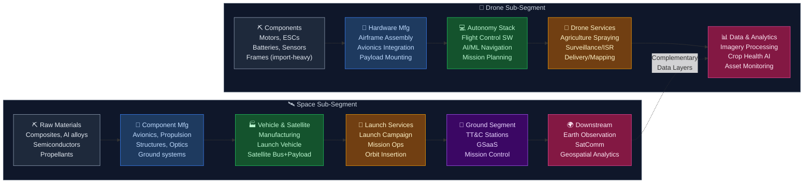

# Space Technology & Drones in India — Value Chain Analysis

*Prepared: June 2026 | Analyst: Claude Code Strategy | Frameworks: Porter Value Chain, Five Forces, Gereffi GVC, Blue Ocean*

---

## 0. Segment Definition

### Precise Boundary

This analysis covers **two interconnected sub-segments** of India's aerospace & deep-tech economy:

**(a) Space Technology** — End-to-end activities spanning: raw material and component procurement → satellite bus and payload design/manufacturing → launch vehicle design/manufacturing → launch campaign operations → ground segment (tracking, telemetry, command) → downstream data/applications (earth observation analytics, satellite communications, navigation, weather, geospatial platforms). Includes both government (ISRO/NSIL/Antrix) and private players.

**(b) Drones / UAVs** — End-to-end activities spanning: component procurement (motors, ESCs, frames, sensors, batteries) → airframe/drone hardware manufacturing → avionics/autonomy software development → drone services (agriculture spraying, surveying/mapping, surveillance, delivery, inspection) → data analytics from drone-gathered imagery. Includes hardware OEMs, software platforms, and drone-as-a-service operators.

**Boundary exclusions:** Pure satellite TV broadcast (already mature, dominated by Tata Sky/Airtel); satellite phone services (Inmarsat, Iridium); anti-drone/counter-UAS systems (treated as adjacent).

### Market Sizing

| Segment | Current Size | Target | CAGR |
|---|---|---|---|
| India Space Economy | ~$8.4B (FY24) | $44B by 2033 | ~18% |
| India Drone Market | ~$1.6B (2024) | $15B by 2030 | ~45%+ |
| Global Space Economy | ~$550B (2023) | $1T+ by 2040 | — |
| India share of global space | ~2-3% | ~8% by 2033 | — |

### Core Product/Service Flow

### End Customers and What They Value

| Customer Type | Space Segment Value | Drone Segment Value |
|---|---|---|
| Government / Defence (MoD, DRDO, Army) | Sovereign capability, ISR, secure comms | Surveillance, border patrol, logistics |
| Civil Govt (MoCA, MoEF, Disaster Mgmt) | Weather, disaster response, land records | Disaster mapping, inspection, delivery |
| Agriculture sector | Precision farming via satellite data | Spraying, crop health monitoring |
| Telecom / Broadband | SatComm for rural connectivity | Last-mile mapping for towers |
| Enterprise / Infrastructure | Asset monitoring, GIS, precision agriculture analytics | Survey, inspection, delivery |
| Startups / Developers | Satellite imagery APIs, earth observation data | Drone-as-a-service, autonomy platforms |

### India's Global Position

| Sub-Segment | Position | Rationale |
|---|---|---|
| Launch Services | **Challenger** | ISRO proven (PSLV 60+ launches, GSLV Mk III/LVM3 operational); private sector nascent (Skyroot suborbital 2022, Agnikul SOrTeD May 2024); cost-competitive but cadence low |
| Satellite Manufacturing | **Follower → Challenger** | ISRO builds own satellites; private now building small-sats (Pixxel, Dhruva); quality proven, scale lacking |
| Downstream Applications | **Emerging** | MapmyIndia, SatSure, Pixxel's data platform are early movers; huge greenfield |
| Drone Manufacturing | **Challenger** | 200+ registered manufacturers; ideaForge globally ranked #3 in dual-use UAVs; DJI ban created opportunity |
| Drone Services | **Nascent-Emerging** | Agriculture services scaling fast; BVLOS (Beyond Visual Line of Sight) not yet unlocked |

---

## 1. Value Chain Map — Primary Activities

### 1.1 Inbound Logistics

**What it involves:**
Procurement and receipt of raw materials (aerospace-grade aluminium alloys, carbon-fibre composites, titanium), electronic components (microprocessors, FPGAs, star trackers, radiation-hardened ICs), propellants (liquid oxygen, cryogenic hydrogen, solid propellant blocks — HTPB-based), drone components (brushless motors, ESCs, LiPo batteries, LiDAR sensors, gimbals, thermal cameras).

**Key cost and differentiation drivers:**
- For space: radiation-hardened components are almost entirely imported (US, Europe, Japan); ITAR/EAR export control restricts access to advanced US semiconductors. Propellants are domestically available (ISRO's SDSC propellant facility). Composites: limited domestic supply of aerospace-grade CFRP.
- For drones: motors/ESCs/batteries are heavily imported from China (80%+ before restrictions). Post-DJI sourcing restrictions, Indian manufacturers face either importing from non-Chinese suppliers (higher cost) or indigenising (DRDO/private). LiPo batteries and LiDAR have no significant Indian domestic supply chain.

**Import dependency risk:** HIGH for both sub-segments. Electronics supply chain is a structural vulnerability.

**Key Players:**
- **Godrej Aerospace** (unlisted, subsidiary of Godrej & Boyce) — manufactures liquid propulsion components, indigenised several ISRO components
- **Bharat Dynamics Ltd (NSE: BDL)** — propellants and energetic materials for defence/space (adjacency)
- **Mishra Dhatu Nigam / MIDHANI (NSE: MIDHANI)** — specialty alloys and advanced materials for space/defence; FY24 revenue ~₹1,400 Cr; listed
- **Sika Interplant Systems** (unlisted) — aerospace fasteners and hardware, supplies to ISRO/HAL
- **Alpha Design Technologies** (unlisted, acquired by BEL) — defence electronics sub-assemblies

---

### 1.2 Operations

**What it involves:**

*Space — Satellite Manufacturing:*
Design of satellite bus (power systems, attitude control, thermal, structure) and payload integration (optical cameras, hyperspectral sensors, SAR, comms transponders). Testing (vibration, thermal vacuum, EMI/EMC). Clean room facilities required.

*Space — Launch Vehicle Manufacturing:*
Solid rocket motor casting (PSLV uses four solid strap-ons), liquid stage fabrication (Vikas engine), cryogenic upper stage assembly (CE-20 engine for LVM3), integration and testing.

*Drone Manufacturing:*
Airframe fabrication (injection-moulded composites or carbon fibre), motor/ESC assembly, avionics board integration, payload installation (EO sensors, multispectral, LiDAR), software loading/calibration, ground control station assembly.

*Autonomy/Software Development:*
Flight control firmware (PX4-based or proprietary), mission planning software, AI/ML models for obstacle avoidance, object detection, crop disease identification.

**Key cost drivers:** Precision CNC machining, clean room operations, propulsion testing, software development manhours. Launch vehicles have very high fixed cost base (propellant testing facilities, engine test stands).

**Key Differentiation drivers:**
- For space: proven heritage in launch vehicle reliability; in-house cryogenic capability (only ISRO/HAL/MTAR); satellite miniaturisation capability
- For drones: flight time/payload ratio; autonomy stack reliability; multi-sensor integration; localisation (Atma Nirbhar compliance)

**Key Players:**

*Space Manufacturing:*
- **ISRO** (unlisted PSU) — designs and manufactures PSLV, GSLV, LVM3, all ISRO satellites; anchor for entire ecosystem
- **HAL (NSE: HAL)** — manufactures PSLV structural segments; awarded SSLV manufacturing contract (₹511 Cr, June 2025); FY25 revenue ₹30,400 Cr; mkt cap ~₹2.9 lakh Cr
- **MTAR Technologies (NSE: MTARTECH)** — precision machined cryogenic engine components, Vikas engine parts, turbo pumps; FY24 revenue ~₹825 Cr; mkt cap ~₹5,500 Cr
- **Godrej Aerospace** (unlisted) — liquid engine valves, welded assemblies, pressure vessels for ISRO
- **Ananth Technologies** (unlisted, Hyderabad) — satellite sub-systems, electronic packages for ISRO satellites
- **Skyroot Aerospace** (unlisted startup) — Vikram-S suborbital (Nov 2022, 89.5 km apogee); Vikram-I orbital targeting H2 2025; raised ~$68M total; based in Hyderabad
- **Agnikul Cosmos** (unlisted startup) — Agnibaan SOrTeD (May 30, 2024 — world's first 3D-printed single-piece engine; India's first private launchpad ALP-01 at Sriharikota); Agnibaan orbital vehicle in development; IIT Madras incubated
- **Pixxel** (unlisted startup) — hyperspectral imaging small satellites; Firefly 1-3 launched Jan 2025 (SpaceX Transporter-12); Firefly 4-6 launched Aug 2025; Series B total $60M; $95M raised to date
- **Dhruva Space** (unlisted startup) — satellite platforms, Trishul (3U, 6U, 12U CubeSats); Project Garud 500kg-class platform (₹105 Cr RDIF grant); GSaaS authorized by IN-SPACe July 2024
- **Bellatrix Aerospace** (unlisted startup) — green propulsion systems, Hall-effect thrusters for small satellites
- **Paras Defence (NSE: PARAS)** — space optics (hyper-spectral cameras for ISRO), EMP protection; only private Indian firm making ISRO-grade hyper-spectral cameras; FY25 revenue ~₹477 Cr; mkt cap ~₹9,942 Cr

*Electronics/Avionics:*
- **BEL (NSE: BEL)** — radar, ground systems, satellite communication equipment; FY25 revenue ₹27,610 Cr; defence = 90% of revenue; mkt cap ~₹2.97 lakh Cr
- **Data Patterns India (NSE: DATAPATTNS)** — defence electronics, radar sub-systems, electronic warfare modules; FY25 revenue ~₹925 Cr; mkt cap ~₹25,230 Cr; order book ₹1,868 Cr
- **Centum Electronics (NSE: CENTUM)** — PCB assemblies, electronic sub-systems for space/defence; FY24 revenue ~₹1,091 Cr; 54% revenue from defence/space/aerospace

*Drone Manufacturing:*
- **ideaForge Technology (NSE: IDEAFORGE)** — India's #1 UAV OEM; SWITCH, RYNO, HEX series; dual-use civil/defence; FY26 Q4 revenue ₹141 Cr (up 594% YoY); FY26 order inflow ₹530 Cr (record); listed June 2023
- **Garuda Aerospace** (unlisted) — agriculture drones (Droni series), defence drones; Series B $12M (March 2025); new Defence Drone Facility (Chennai, Aug 2025)
- **Throttle Aerospace** (unlisted) — drone hardware for agriculture and infrastructure
- **Asteria Aerospace** (unlisted, acquired by Mahindra Group) — enterprise/government survey drones; part of Mahindra Defence Systems

---

### 1.3 Outbound Logistics

**What it involves:**

*Space:*
- Launch campaign logistics: transporting assembled satellite/launch vehicle to launch site (SDSC SHAR, Sriharikota)
- Payload integration with fairing at launch site
- Real-time telemetry data routing from satellite post-separation to customer ground station
- For commercial launch: rideshare slot allocation, orbital insertion precision guarantees
- Data product distribution: near-real-time EO imagery delivery via cloud APIs

*Drones:*
- Drone delivery to end customer (ruggedised packaging for export-sensitive equipment)
- For services: drone fleet deployment to field (agriculture — seasonal mobilisation across states)
- Data uplink from drone to ground control; data transfer to processing servers
- Last-mile data delivery (crop reports, inspection reports) to enterprise customers

**Key cost and differentiation drivers:**
- Launch: launch window reliability, orbital accuracy, payload protection during ascent
- Drones: fleet management software for large-scale deployments; network of drone pilots/operators; cold chain for medical delivery
- Data: latency (how fast EO data reaches customer after acquisition); API reliability; data resolution and revisit frequency

**Key Players:**
- **NSIL (NewSpace India Ltd)** (unlisted PSU) — commercial arm of ISRO; handles commercial launch manifest, manages rideshare missions; contracted foreign satellite launches on LVM3
- **Antrix Corporation** (unlisted PSU, subsidiary of DoS) — ISRO's commercial marketing arm; historically handled international satellite contracts
- **Dhruva Space** (unlisted) — GSaaS (Ground Stations as a Service) — provides distributed ground station network for satellite operators; IN-SPACe authorised July 2024
- **Skye Air** (unlisted startup) — drone delivery (medicines, emergency cargo); operates in Himachal Pradesh, Tamil Nadu; tie-up with govt health missions
- **TechEagle** (unlisted startup) — drone logistics for medical delivery, especially hilly terrain; BVLOS trials underway

---

### 1.4 Marketing & Sales

**What it involves:**

*Space:*
- Government tendering: ISRO/NSIL tenders for satellite manufacturing (₹1,200 Cr Pixxel consortium EO constellation contract), ground segment, component supply
- IN-SPACe authorization process as a de facto entry requirement
- Commercial satellite launch marketing to foreign customers (OneWeb/LVM3 missions by NSIL)
- Downstream data product sales: subscription APIs (MapmyIndia, SatSure, Pixxel) to enterprise/government
- International: competing with SpaceX Falcon 9 rideshare, ISRO PSLV-C series for small satellite launch market

*Drones:*
- Government defence tenders (Ministry of Defence, DRDO): ideaForge has significant Army contracts
- Agricultural ministry/state govt tenders for Kisan Drone programs
- Enterprise direct sales: infrastructure companies, mining, telecom
- Drone-as-a-service contracts with agri-input companies (Coromandel, UPL, Bayer using drone spraying)
- Export: ideaForge exporting to Southeast Asia; Garuda Aerospace targeting Middle East

**Key cost and differentiation drivers:**
- For space: relationships within DoS/ISRO ecosystem; ability to handle classified requirements (security clearance); technical proposal quality
- For drones: DGCA type certification (mandatory for commercial operations); field demonstration track record; cost per acre for agriculture; ITAR/export compliance for defence export

**Key Players:**
- **NSIL / Antrix** — manage govt-to-govt and commercial launch marketing
- **MapmyIndia / CE Info Systems (NSE: MAPMYINDIA)** — geospatial data products marketed to automotive, govt, enterprise; FY24 revenue ₹379 Cr; EBITDA margin 41%; PAT ₹134 Cr
- **SatSure** (unlisted startup) — satellite analytics for agriculture, infrastructure; sells to banks (crop credit risk), insurance, state govts; raised $8M Series A
- **ideaForge (NSE: IDEAFORGE)** — sells directly to MoD, state police, NDRF, enterprise; Army and NDRF are key customers
- **Garuda Aerospace** — kisan drone services sold via agri-input companies and govt

---

### 1.5 Service

**What it involves:**

*Space:*
- Satellite mission operations: daily health monitoring, orbit manoeuvring, anomaly resolution
- Ground station operations (tracking, telemetry, command) throughout mission life
- On-orbit data calibration and quality assurance
- Earth observation analytics as managed service (SatSure, Pixxel's Aurora platform)
- Satellite communication managed services (VSAT, maritime, aviation)

*Drones:*
- Drone maintenance and repair (rotors, ESC replacements, sensor calibration)
- Drone Pilot Training: DGCA-mandated certified pilot training (booming post-Drone Rules 2021)
- Analytics-as-a-service: converting raw drone imagery to actionable crop reports, inspection reports
- DaaS (Drone-as-a-Service): operators providing end-to-end spraying services per acre
- MRO for military UAV fleets

**Key cost and differentiation drivers:**
- Mission operations: 24/7 staffing, software automation (reduces cost); proprietary mission planning tools
- DaaS: cost per acre (agriculture); scale of pilot network; sensor quality for repeat customers
- Analytics: AI/ML quality; turnaround time; integration with customer ERP/farm management systems

**Key Players:**
- **ISRO / ISTRAC** (Indian Space Science Data Centre, Bangalore) — master ground station; Mission Operations Complex
- **Dhruva Space** — GSaaS commercial ground stations (IN-SPACe authorised 2024)
- **Pixxel** — Aurora hyperspectral data analytics platform; subscription-based
- **SatSure** — analytics-as-a-service to banks, insurance, govt
- **MapmyIndia** — managed geospatial services, IoT fleet management, SaaS platforms
- **Marut Drones** (unlisted) — drone spraying services at scale; also sells drones to operators
- **Garuda Aerospace** — drone spraying services; pilot training academy
- **ideaForge** — after-sales support, fleet management software for defence UAV fleets

---

## 2. Value Chain Map — Support Activities

### 2.1 Firm Infrastructure

**Role:** Policy framework, regulatory authorisation, financing, corporate governance, and the institutional scaffolding that shapes investment flows and risk appetite across the chain.

**Key developments (post-2020 Space Reforms):**

- **IN-SPACe (Indian National Space Promotion and Authorisation Centre)**: Established 2020; single-window regulator for all private space activities. As of March 2025: 658+ applications received; 1,200+ startups and 6,400 users on digital platform. NGP (Norms, Guidelines and Procedures) released May 2024 — the consolidated policy document for private space activities.
- **Indian Space Policy 2023**: Formally opened the space sector to private players across the entire value chain. Converted ISRO's commercial arm structure (NSIL for launch manifest, Antrix for marketing).
- **FDI liberalisation (April 2024)**: 100% FDI under automatic route for satellite manufacturing components; 74% automatic for satellite manufacturing/operation; 49% automatic for launch vehicles/spaceports (government approval beyond thresholds).
- **Rs 1,000 Cr VC fund under IN-SPACe** (approved October 2024): First dedicated government VC for space startups. Planned Rs 10,000 Cr fund for 40+ companies over five years (Rs 10-60 Cr per company).
- **DGCA (Directorate General of Civil Aviation)**: Drone regulator. Drone Rules 2021 replaced earlier UAS Rules; introduced a risk-based framework (Green/Yellow/Red zones); Digital Sky Platform for online UIN registration and permission management.
- **Drone PLI Scheme (2021)**: ₹120 Cr initial outlay; 20% incentive on value addition; minimum 40% domestic value addition required; expanded to ₹2,000 Cr for 2025-28.
- **Drone Shakti Scheme**: Government initiative to promote drone use across 25+ ministries and departments.

**Indian firms' strength/weakness:** Strong at PSU-led policy execution (ISRO's track record is credible). Private firms benefit from IN-SPACe but the approval process is still maturing. DGCA drone regulation is evolving rapidly — good for compliance-ready firms, challenging for startups.

---

### 2.2 Human Resource Management

**Role:** Aerospace engineers, propulsion scientists, satellite systems engineers, software developers (autonomy, image processing, GIS), drone pilots, and program managers.

**Indian strengths:**
- Large pool of engineering graduates (IITs, NITs, BITS; aerospace-specific: IIT Madras, IIT Bombay, IIST Thiruvananthapuram)
- ISRO has trained two generations of space engineers (founded 1969); acts as talent reservoir — many private startups founded by ex-ISRO scientists (Skyroot founders Pawan Kumar Chandana and Naga Bharath Daka are ISRO alumni)
- India's large software talent pool is a structural advantage for autonomy/AI/ML development

**Indian weaknesses:**
- Cryogenic propulsion expertise is rare; only ISRO's Liquid Propulsion Systems Centre (LPSC) holds deep knowledge
- Drone pilots: DGCA certification requirement created a shortage; several thousand certified pilots vs. demand for tens of thousands
- Space program management (systems engineering, reliability engineering) is ISRO-concentrated; private sector is hiring but thin

**Notable institutions:**
- **IIST (Indian Institute of Space Science and Technology)**, Thiruvananthapuram — India's premier space-focused university; feeder for ISRO and now private sector
- **NAL (National Aerospace Laboratories)** Bangalore — aerospace R&D under CSIR; composites, fluid dynamics expertise
- Drone pilot training: RPTO (Remote Pilot Training Organisation) network; ideaForge, Garuda both operate RPTOs

---

### 2.3 Technology Development

**Role:** Propulsion R&D, satellite bus standardisation, AI/ML for autonomy, remote sensing algorithms, miniaturisation, materials science.

**Key technology themes:**

*Space:*
- **Cryogenic propulsion**: ISRO's CE-20 engine (LVM3 cryogenic upper stage) — domestic capability; private sector (Bellatrix's green propulsion, Skyroot's Dhawan-II cryo upper stage in development)
- **Small satellite bus standardisation**: Pixxel (Firefly bus), Dhruva Space (Trishul CubeSat bus) — moving toward reusable platforms
- **3D-printed rocket engines**: Agnikul Cosmos's Agnilet engine — world's first single-piece 3D-printed semi-cryogenic engine (proven May 2024) — significant manufacturing cost reduction potential
- **Hyperspectral imaging**: Pixxel (5m resolution, 40km swath, 256 spectral bands); Paras Defence (indigenous hyper-spectral cameras)
- **SAR (Synthetic Aperture Radar)**: PierSight (unlisted startup) developing India's first commercial SAR constellation

*Drones:*
- **Flight control software**: Most Indian OEMs use modified open-source stacks (PX4, ArduPilot); proprietary development at ideaForge
- **AI for agriculture**: Crop disease identification, yield prediction from multispectral imagery — startups like CropIn, Intello Labs
- **BVLOS technology**: Extended range command links, sense-and-avoid; waiting for DGCA BVLOS framework finalisation — critical unlock for drone delivery/logistics

**Indian firms strong/weak:**
- Strong: software/AI development (cost advantage, talent), incremental satellite bus design
- Weak: advanced microelectronics (no domestic fab for rad-hard ICs), high-power propulsion, large composite structures

**Notable R&D entities:**
- **DRDO** — defence drone development (Rustom-2, TAPAS-BH-201); also developing counter-drone systems
- **NAL** — composite airframe research; high-altitude platform systems
- **IIT Madras** — incubated Agnikul Cosmos through IITM Research Park
- **IIT Bombay** — propulsion research

---

### 2.4 Procurement

**Role:** Sourcing aerospace-grade raw materials, electronic components, propellants, sensors; managing import compliance (ITAR/EAR for US components); building domestic supplier network.

**Key procurement challenges:**
- **ITAR/EAR controls**: US export regulations restrict supply of radiation-hardened processors, certain gyroscopes and star trackers to Indian private entities (ISRO has government-to-government arrangements). Private launch companies must navigate entity list compliance.
- **Semiconductor supply**: No Indian fab producing space-grade chips. Dependence on TSMC (Taiwan), European suppliers (STMicro, Infineon).
- **Drone component indigenisation**: Post-DJI dominance, GoI banned Chinese drone imports for government use; Indian OEMs pushed to source from Taiwan, South Korea, Europe — higher cost. PLI scheme incentivises domestic component production.
- **Composites**: Limited aerospace-grade CFRP domestic supply; HAL/NAL produce some; primarily imported from Toray (Japan), Hexcel (US).

**Notable supply relationships:**
- MTAR Technologies ↔ ISRO (cryogenic components since 1989)
- Paras Defence ↔ ISRO (hyper-spectral cameras — sole domestic supplier)
- Centum Electronics ↔ BEL/HAL (PCB assemblies, AESA radar modules)
- **MIDHANI (NSE: MIDHANI)** — special alloys (titanium, superalloys) for space/defence; strategic near-monopoly in India

---

## 3. Five Forces Analysis

### 3.1 Supplier Power — HIGH (Space) / MEDIUM-HIGH (Drones)

For the space segment, supplier power is structurally high and represents the most significant structural constraint on India's private space ambitions. The most critical inputs — radiation-hardened microprocessors (from BAE Systems, Cobham, Microchip Technology), star trackers (from Ball Aerospace, Jena-Optronik), cryogenic pumps and seals — are supplied by a small number of Western manufacturers subject to ITAR/EAR export controls. India's ISRO has navigated this through government-to-government agreements and decades of indigenous development (CE-20 cryogenic engine, ADCS systems), but new private players cannot easily replicate these arrangements. Domestic alternatives exist at the component level from MTAR, Paras Defence, Centum, and BEL, but are not yet full substitutes. Propellants are a relative exception — ISRO's SDSC facility produces HTPB and other propellants domestically. For the drone segment, the historical dependence on Chinese components (DJI-ecosystem motors, ESCs, batteries constituting 80%+ of BOM) created extreme supplier dependency that government policy (DJI restrictions, PLI incentives) is now beginning to address. Post-DJI, Indian OEMs shifted to Taiwanese and Korean suppliers (higher cost but geopolitically safer), keeping supplier power elevated in the near term until domestic supply chains mature.

### 3.2 Buyer Power — HIGH (Space, government segment) / MEDIUM (commercial)

The dominant buyer in the space segment is the Indian government — specifically ISRO, DoD, MHA, and associated PSUs — which controls the overwhelming majority of domestic demand and acts as both customer and regulator. This creates a classic monopsony dynamic for component and sub-system suppliers: ISRO's technical specifications are non-negotiable, payment terms are on government cycle (90-120 days), and a supplier losing an ISRO qualification risks losing their primary revenue stream. MTAR Technologies' exposure to ISRO and Bloom Energy illustrates this — their customer concentration risk is real. The emerging commercial satellite market (EO data buyers, SatComm customers) has more distributed buyer power, but remains nascent. For drones, government (MoD, state police, NDRF) similarly dominates as a buyer for surveillance/defence drones (ideaForge's primary channel), with very high power. Agricultural drone service buyers (farmers, agri-input companies) are highly price-sensitive and fragmented — buyer power is lower individually but aggregators (FPOs, state government bulk tenders) wield growing power.

### 3.3 Threat of New Entrants — LOW (Space manufacturing) / HIGH (Drone services/software)

Space manufacturing presents formidable barriers: minimum capital investment of ₹100-500 Cr for a launch vehicle company, access to propellant testing facilities (virtually impossible without ISRO/government partnership), stringent IN-SPACe authorization, and a decade-long learning curve. This is evidenced by the fact that despite India's rich startup ecosystem, fewer than 10 credible launch vehicle companies exist, and none have achieved orbital launch as of mid-2026. However, the Indian Space Policy 2023 and IN-SPACe's ₹10,000 Cr fund are deliberately lowering these barriers, suggesting moderate new entrant threat over a 5-year horizon for satellite-related activities. Drone hardware manufacturing has moderate barriers (DGCA type certification, minimum investment in assembly lines, quality systems), but is not prohibitive — over 200 manufacturers are now registered with DGCA. Drone services present the lowest barriers: a DGCA-certified pilot, a commercially available drone, and a spraying contract is sufficient to enter agriculture services. This explains the intense fragmentation and price competition in drone services — over 1,000 drone service operators are active nationally.

### 3.4 Threat of Substitutes — MEDIUM-HIGH (Space connectivity) / HIGH (Drone services, locally)

The most significant substitute threat in the space segment is from global commercial satellite operators — Starlink (SpaceX LEO constellation) for broadband connectivity threatens the economics of India's GEO satellite communication business (NSIL's GSAT fleet). OneWeb (backed by Bharti Enterprises) is both a partner and potential substitute. For earth observation, commercial satellite imagery from Planet Labs, Maxar, Airbus Defence is widely available at declining prices. For launch services, SpaceX Falcon 9 and Falcon Heavy with rideshare (Transporter series) offer highly cost-competitive alternatives — at ~$5,000/kg for rideshare, ISRO's PSLV must match or undercut this to stay competitive. For drones, the substitute threat is less about technology and more about economics: in agriculture, manual labour and chemical aerial application (manned aircraft) remain alternatives, though drone cost curves are rapidly improving. In delivery, roads and courier networks are the primary substitute for drone logistics, and BVLOS restrictions still make drone delivery uncompetitive for most routes.

### 3.5 Competitive Rivalry — LOW (Space manufacturing, few can do it) / HIGH (Drone services and hardware)

In the space manufacturing segment, rivalry is structurally low — there are fewer than five credible private launch vehicle companies (Skyroot, Agnikul, Bellatrix, plus HAL now entering), and the sovereign government demand from ISRO means even a second or third player can find a viable niche. However, rivalry for ISRO contracts is intense at the component level — MTAR, Godrej Aerospace, Centum, Data Patterns, BEL, and HAL all compete for the same ISRO/defence electronics RFPs, and pricing pressure is rising as more companies qualify. In the drone segment, rivalry is fierce: 200+ registered manufacturers, many producing commodity multi-rotor agriculture drones at similar price points, with no dominant standard. Agriculture spraying is approaching a margin-compressive commodity model. ideaForge maintains a differentiated position in defence UAVs (type-certified for dual-use) but even here, Garuda Aerospace, DRDO's Rustom platform, and imports from Israel (IAI Heron) create competitive pressure.

### Five Forces Summary Table

| Force | Rating | Key Driver |
|---|---|---|
| Supplier Power | HIGH | ITAR-controlled components; China-dependent drone BOM |
| Buyer Power | HIGH (govt) / MEDIUM (commercial) | ISRO/MoD monopsony; fragmented commercial market |
| New Entrants | LOW (space mfg) / HIGH (drone svcs) | Capital/tech barriers for launch; low for drone services |
| Substitutes | MEDIUM-HIGH | Starlink for SatComm; SpaceX rideshare for launch |
| Rivalry | LOW (launch) / HIGH (drones) | Few launch players; 200+ drone manufacturers |

**Overall attractiveness verdict: MEDIUM for the segment as a whole.** The space manufacturing niche is HIGH attractiveness (low rivalry, high barriers, growing sovereign demand), but drone services is LOW attractiveness due to intense rivalry and thin margins. The highest-value sub-segment — downstream space data/applications — is MEDIUM-HIGH attractiveness (growing demand, low physical asset base, high IP content) and is where margin pools are migrating.

---

## 4. GVC Governance & India's Position

### 4.1 Lead Firms (Global)

| Category | Global Lead Firms | Governance Role |
|---|---|---|
| Launch Services | SpaceX (Falcon 9/Heavy, Starship); Arianespace (Ariane 6); ULA (Atlas V/Vulcan) | Set cost benchmarks; SpaceX's rideshare pricing dictates market rates |
| Large Satellites | Airbus Defence & Space (GEO communication satellites); Boeing Defence; Thales Alenia | Define satellite bus architecture standards; supply chain integrators |
| Small Satellites | Planet Labs, Maxar Technologies | EO constellation operators; define data product standards |
| Drone Hardware | DJI (Shenzhen, China) — ~70% global commercial drone market share | Sets price-performance baseline; supply chain architecture |
| Drone Software | Skydio (USA), Autel (China) | Autonomy software benchmarks |

### 4.2 Indian Lead Firms

| Category | Indian Lead Firm | Role |
|---|---|---|
| Space (Sovereign) | ISRO | Anchor customer, technology developer, launch provider, regulator (de facto) |
| Space (Commercial) | NSIL / Antrix | Commercial launch marketing; satellite leasing |
| Space (Private) | Skyroot Aerospace | First private orbital launch aspirant; Pixxel for EO constellation |
| Drones (Hardware) | ideaForge Technology | Market leader dual-use UAVs; defence contracts anchor |
| Drones (Services) | Garuda Aerospace | Agriculture services scale; 5 lakh+ acre coverage claimed |
| Geospatial Data | MapmyIndia (CE Info Systems) | Downstream data platform; B2B2C geospatial services |

### 4.3 Governance Type

The space segment historically operated under **Hierarchy** governance — ISRO controlled the entire value chain (designing, building, launching, operating all satellites and launch vehicles) with private firms as captive tier-2 suppliers under long-term ISRO purchase orders. Post-2020 Space Reforms (Indian Space Policy 2023, IN-SPACe establishment), the governance is transitioning:

- **Captive → Relational**: New private entrants (Skyroot, Agnikul, Pixxel) are developing independent capabilities but still depend on ISRO infrastructure (Sriharikota launch range, ISRO ground stations, ISRO technical mentorship). The relationship is Relational — complex, tacit knowledge exchange, mutual dependence, not arm's-length.
- For drone hardware: approaching **Modular** — Indian OEMs design complete drones to DGCA standards using modular components from global suppliers. The component supply chain remains largely captive to Chinese/Taiwanese suppliers.
- For downstream data/applications: **Market** governance — SatSure, MapmyIndia, Pixxel sell data products at market prices; buyers switch between providers based on data quality and price.

### 4.4 Value Capture Map

| Chain Stage | Margin Level | Who Captures | Geography |
|---|---|---|---|
| Raw materials / components | LOW | Global suppliers (US, EU, Japan, China) | Offshore |
| Launch vehicle manufacturing | LOW-MEDIUM | ISRO/HAL (cost-covered, not profit-maximising); private players pre-revenue | India |
| Satellite manufacturing | MEDIUM | ISRO (sovereign); small private players emerging | India |
| Launch services | MEDIUM | ISRO (govt-subsidised); margins low for private without reusability | India |
| Ground segment | MEDIUM-HIGH | BEL, Dhruva Space (GSaaS) | India |
| Downstream data/applications | HIGH (40-50% EBITDA) | MapmyIndia (41% EBITDA), SatSure, Pixxel Aurora | India (primarily) |
| Drone hardware (premium) | MEDIUM | ideaForge (~18% EBITDA at scale) | India |
| Drone hardware (commodity) | LOW | Chinese OEMs (DJI-like), low-cost Indian assemblers | China/India |
| Drone services | LOW-MEDIUM | Garuda, Marut, operators (thin margins) | India |
| Drone analytics | HIGH | Emerging (CropIn, SatSure) | India |

### 4.5 India's Position & Upgrade Trajectory

**Current position (2026):** India is a proven **Tier 2 launch nation** (ISRO's PSLV has 60+ launches, LVM3/GSLV operational) and an **emerging Tier 1 nation in satellite manufacturing** for medium-sized satellites. In the GVC, India is in a **functional upgrading** transition — moving from pure launch services to full-stack satellite+launch+application capabilities.

| Upgrade Type | Current Status | Target (2030) |
|---|---|---|
| Process upgrading | PSLV cost optimization; drone assembly automation | Reusable launch vehicles; automated satellite production |
| Product upgrading | Small satellite manufacturing; hyperspectral EO (Pixxel) | Medium/large satellite constellation (12+ EO sats) |
| Functional upgrading | Adding analytics/data layer to launch+satellite | End-to-end space economy (manufacture + operate + monetise) |
| Chain upgrading | Space tech transferring to drone autonomy | Space-drone-AI convergent platforms |

**Upgrade accelerators:** IN-SPACe ₹10,000 Cr fund; 100% FDI in components; Agnikul's 3D-printing breakthrough (reduces launch vehicle manufacturing cost by 50-60%); Pixxel's data platform as proof-of-concept for high-margin downstream.

**Upgrade risks:** BVLOS regulation delay (blocks drone delivery monetisation); ITAR constraints on private access to US components; brain drain of ISRO talent to global firms.

---

## 5. Key Linkages & Leverage Points

### Linkage 1: ISRO Anchor Demand → Private Component Ecosystem

ISRO's multi-decade procurement of precision components from MTAR (cryogenic parts since 1989), Godrej Aerospace (liquid engine valves), Paras Defence (space optics), and Centum/BEL (electronics) has created a supply base with genuine space-grade capability. Without ISRO's pull demand, these firms would not exist at their current technical level. This linkage is the foundation of India's private space ecosystem — ISRO is not just a buyer but a technology co-developer and qualification authority. As private launch vehicle companies (Skyroot, Agnikul) scale, they can draw on this existing supplier base rather than building from scratch. Disruption risk: if ISRO launch cadence slows (budget constraints), the whole supplier tier contracts.

### Linkage 2: IN-SPACe Approvals → Private Launch Cadence → Downstream Constellation Economics

IN-SPACe authorisation is a gating function for every private space activity. The speed and predictability of IN-SPACe approvals directly determines how quickly Skyroot can attempt orbital launch, how fast Dhruva can expand GSaaS, and how rapidly Pixxel's constellation achieves revisit frequency targets. With 658+ applications received but approvals still measured in months, the bottleneck is the regulatory pipeline — not technology or capital. Every 3-month delay in launch authorisation translates to delayed revenue for downstream data services that depend on constellation density.

### Linkage 3: Drone PLI → Manufacturing Scale → Cost Competitiveness → Export Market

The PLI scheme for drones (₹120 Cr initial, expanded to ₹2,000 Cr for 2025-28) creates a direct financial incentive for volume. Volume drives component indigenisation (motors, batteries) as Indian suppliers find the market large enough to invest. Component indigenisation reduces BOM cost (breaking Chinese import dependence). Lower BOM cost enables Indian drone OEMs to compete on price in export markets (Southeast Asia, Middle East, Africa). This is the classical PLI logic — the linkage works only if each step executes. Currently, the bottleneck is components (Indian motor and battery manufacturers are not yet cost-competitive with Chinese counterparts).

### Linkage 4: EO Satellite Data Density → Downstream Analytics Revenue → Cross-Subsidisation of Space Manufacturing

Pixxel's business model illustrates a crucial linkage: constellation density (number of satellites and revisit frequency) determines data volume, which determines analytics platform revenue, which can cross-subsidise satellite manufacturing cost. This is the SpaceX/Planet Labs model — use downstream subscription revenue to fund manufacturing cost reductions. India's space economy will unlock true scale when 2-3 EO constellation operators achieve 10+ satellites and consistent daily revisit, enabling a subscription data economy. The Pixxel consortium's ₹1,200 Cr government contract for 12 satellites is the first step toward this linkage.

### Linkage 5: BVLOS Regulation Unlock → Drone Delivery Economics → New Demand for Drone Manufacturing

Drone delivery (Skye Air, TechEagle, Swiggy's drone delivery pilots) is constrained by DGCA's requirement for Visual Line of Sight (VLOS) operations. BVLOS (Beyond Visual Line of Sight) certification, when granted at scale, would enable autonomous long-range delivery routes — collapsing delivery cost structures for medical supplies, e-commerce, and food delivery. BVLOS unlock is the single largest potential demand catalyst for drone manufacturing (new form factors, extended range, redundant safety systems) and drone services (new business models). The delay in BVLOS finalisation is directly suppressing investment in next-generation drone platforms.

### Single Highest-Leverage Intervention

**Accelerate BVLOS regulatory framework finalisation (DGCA) while simultaneously mandating IN-SPACe approvals within 60 days.**

These two regulatory acceleration actions would unlock more incremental private investment and revenue than any PLI scheme or fund commitment. BVLOS unlocks drone delivery's $5-10B market opportunity; 60-day IN-SPACe approvals would accelerate private launch cadence by 2-3 years. Both are regulatory actions requiring zero government capital expenditure.

---

## 6. Indian Company Landscape

### Table A: Listed Companies

| Value Chain Stage | Company Name | Listed? | Exchange & Ticker | Business Description | Approx. Revenue / Market Cap | Position |
|---|---|---|---|---|---|---|
| Operations — Launch/Satellite Mfg | Hindustan Aeronautics Ltd (HAL) | Yes | NSE: HAL | Manufactures PSLV structures; awarded SSLV commercial production contract (₹511 Cr, June 2025); aerospace prime contractor | Revenue ₹30,400 Cr (FY25); Mkt cap ~₹2.9 lakh Cr | Leader |
| Operations — Space Electronics | Bharat Electronics Ltd (BEL) | Yes | NSE: BEL | Manufactures radar, ground systems, SatComm equipment; 90% revenue from defence/space | Revenue ₹27,610 Cr (FY25); Mkt cap ~₹2.97 lakh Cr | Leader |
| Operations — Drone Mfg | ideaForge Technology | Yes | NSE: IDEAFORGE | India's #1 drone OEM; SWITCH/RYNO/HEX UAVs; defence-grade dual use; listed June 2023 | Q4 FY26 revenue ₹141 Cr (+594% YoY); FY26 order inflow ₹530 Cr | Leader |
| Operations — Electronics/Avionics | Data Patterns (India) Ltd | Yes | NSE: DATAPATTNS | Vertically integrated defence & space electronics; radar subsystems, avionics, EW modules | Revenue ~₹925 Cr (FY25); Mkt cap ~₹25,230 Cr | Challenger |
| Operations — Electronics | Centum Electronics | Yes | NSE: CENTUM | PCB assemblies, electronic sub-systems for space/defence/aerospace (54% of revenue mix) | Revenue ~₹1,091 Cr (FY24) | Challenger |
| Operations — Precision Components | MTAR Technologies | Yes | NSE: MTARTECH | Cryogenic engine components, turbo pumps, Vikas engine parts for ISRO since 1989; also fuel cell components | Revenue ~₹825 Cr (FY24); Mkt cap ~₹5,500 Cr | Leader (niche) |
| Operations — Space Optics | Paras Defence & Space Technologies | Yes | NSE: PARAS | Space optics (hyper-spectral cameras for ISRO), defence electronics, EMP protection; sole domestic maker of ISRO hyper-spectral cameras | Revenue ~₹477 Cr (FY25); Mkt cap ~₹9,942 Cr | Leader (niche) |
| Marketing/Service — Geo Data | MapmyIndia (CE Info Systems) | Yes | NSE: MAPMYINDIA | Digital maps, geospatial data, IoT/SaaS platforms; downstream space and drone data applications | Revenue ₹379 Cr (FY24); EBITDA margin 41%; Mkt cap ~₹7,500 Cr | Leader |
| Operations — Materials | MIDHANI (Mishra Dhatu Nigam) | Yes | NSE: MIDHANI | Speciality alloys (titanium, superalloys, special steels) for space/defence; strategic national supplier | Revenue ~₹1,400 Cr (FY24 est.) | Leader (niche) |
| Operations — Defence/Space Adjacent | Bharat Dynamics Ltd (BDL) | Yes | NSE: BDL | Missiles, propulsion systems, energetic materials; adjacent propellant supply | Revenue ~₹2,700 Cr (FY24); Mkt cap ~₹18,000 Cr | Adjacent |

### Table B: Unlisted / Private Companies

| Value Chain Stage | Company Name | Listed? | Exchange & Ticker | Business Description | Approx. Revenue / Funding | Position |
|---|---|---|---|---|---|---|
| Operations (Space — Sovereign) | ISRO | No (PSU) | — | Sovereign space agency; PSLV, GSLV, LVM3 launch vehicles; all ISRO satellite design/manufacturing | Budget ~₹13,000 Cr/year (FY25) | Leader |
| Outbound / Marketing | NSIL (NewSpace India Ltd) | No (PSU) | — | ISRO's commercial launch arm; manages rideshare, foreign satellite launches (OneWeb on LVM3) | Not publicly disclosed | Leader (govt) |
| Marketing | Antrix Corporation | No (PSU subsidiary) | — | ISRO's original commercial marketing arm; satellite-related commercial contracts | Not publicly disclosed | Established |
| Regulation | IN-SPACe | No (Govt body) | — | Single-window regulator for all private space activities; 658+ applications to date | Government body | Regulator |
| Operations (Space — Launch) | Skyroot Aerospace | No (startup) | — | Vikram rocket family; first Indian private rocket Vikram-S (Nov 2022, 89.5 km); Vikram-I orbital targeting 2025 | Raised ~$68M total | Emerging |
| Operations (Space — Launch) | Agnikul Cosmos | No (startup) | — | Agnibaan launch vehicle; world's first 3D-printed engine Agnilet; Agnibaan SOrTeD suborbital May 2024; first private Indian launchpad | Raised ~$35M+; IIT Madras incubated | Emerging |
| Operations (Space — Satellite/Data) | Pixxel | No (startup) | — | Hyperspectral imaging satellites (Firefly constellation; 6 sats operational Aug 2025); Aurora analytics platform | Raised $95M total; Series B $60M | Challenger |
| Operations (Space — Satellite) | Dhruva Space | No (startup) | — | CubeSat platforms (Trishul series); GSaaS authorised IN-SPACe 2024; Project Garud 500kg platform | ₹105 Cr RDIF grant; Pre-Series B $4.2M | Emerging |
| Operations (Space — Propulsion) | Bellatrix Aerospace | No (startup) | — | Green propulsion (water-based thrusters), Hall-effect thrusters for small satellites | Not publicly disclosed | Niche |
| Operations (Space — Components) | Godrej Aerospace | No (subsidiary of Godrej & Boyce) | — | Liquid engine valves, welded assemblies, pressure vessels for ISRO PSLV/GSLV | Not publicly disclosed | Leader (captive) |
| Operations (Space — Electronics) | Ananth Technologies | No (private) | — | Satellite sub-systems, electronic packages for ISRO missions; Hyderabad-based | Not publicly disclosed | Niche |
| Operations (Space — Components) | Sika Interplant Systems | No (private) | — | Aerospace fasteners, hardware; supplies ISRO and HAL | Not publicly disclosed | Niche |
| Operations (Space — SAR) | PierSight | No (startup) | — | Developing India's first commercial SAR satellite constellation | Seed/Series A stage | Emerging |
| Service (Space — Analytics) | SatSure | No (startup) | — | Satellite analytics for agriculture credit, insurance, infrastructure monitoring; sells to banks and state govts | Raised ~$8M Series A | Niche |
| Operations (Drone — Mfg) | Garuda Aerospace | No (startup) | — | Agriculture drones (Droni series), defence drones; Defence Drone Facility Chennai (Aug 2025) | Series B $12M (March 2025) | Challenger |
| Operations (Drone — Mfg) | Asteria Aerospace | No (acquired by Mahindra) | — | Enterprise/government survey drones; part of Mahindra Defence Systems | Not disclosed post-acquisition | Niche |
| Operations (Drone — Mfg) | Throttle Aerospace Systems | No (startup) | — | Agriculture and infrastructure drones; Bangalore-based | Not publicly disclosed | Niche |
| Service (Drone — Delivery) | Skye Air Mobility | No (startup) | — | Drone logistics and delivery; government health supply chain pilots; Himachal Pradesh/Tamil Nadu | Seed/Series A stage | Emerging |
| Service (Drone — Delivery) | TechEagle | No (startup) | — | Drone delivery for hilly terrain; medical logistics; BVLOS trials | Seed stage | Niche |
| Service (Drone — Agriculture) | Marut Drones | No (startup) | — | Drone-as-a-service for agriculture; pilot training academy | Not publicly disclosed | Challenger |
| Operations (Space — Components) | Alpha Design Technologies | No (acquired by BEL) | — | Defence electronics sub-assemblies; radar components; Bangalore | Acquired by BEL | Niche |

---

### Notable Companies — Deeper Notes

**HAL — Hindustan Aeronautics Limited (NSE: HAL)**
- Stage in chain: Operations — launch vehicle manufacturing, aircraft structures, aero-engines
- What makes them interesting: HAL's June 2025 contract for SSLV commercial production (₹511 Cr) marks a strategic pivot — from pure aircraft/helicopter manufacturer to commercial launch vehicle producer. HAL has the factory footprint, precision machining capabilities, and government relationships to become India's Boeing Defence equivalent in the space domain. The SSLV (Small Satellite Launch Vehicle, 500 kg to LEO) is designed for the small satellite launch market where SpaceX's Transporter rideshare currently dominates. HAL's entry creates a government-backed alternative with indigenous supply chain.
- Key financials: Revenue ₹30,400 Cr (FY25); EBITDA margin ~20%; order backlog ₹1,84,000 Cr (6x revenue); market cap ~₹2.9 lakh Cr
- Watch factor: Ability to ramp SSLV production to 12-15 launches/year to be commercially viable; competition from Skyroot's cheaper Vikram-I once it achieves orbital flight

**MTAR Technologies (NSE: MTARTECH)**
- Stage in chain: Operations — precision-engineered cryogenic components for ISRO
- What makes them interesting: MTAR is the clearest "picks and shovels" play on India's space economy — every GSLV/LVM3 launch requires their cryogenic turbo pumps and booster pumps, which they have manufactured for ISRO since 1989. Their moat is not just the machining capability but the 35-year qualification history with ISRO (re-qualification cost and time for a new supplier is prohibitive). The emerging risk and opportunity: as Skyroot and Agnikul scale, MTAR wants to supply their propulsion sub-systems too — doubling their addressable market without leaving their core competence. Space revenue CAGR projected at 94% over FY24-26.
- Key financials: Revenue ~₹825 Cr (FY24); space segment revenue ~₹40-45 Cr; Bloom Energy (fuel cells) is 40%+ of revenue — diversification risk; market cap ~₹5,500 Cr
- Watch factor: Dependence on Bloom Energy (US fuel cell company) for ~40% of revenue creates revenue concentration risk in a non-space segment; any Bloom slowdown hits MTAR disproportionately

**ideaForge Technology (NSE: IDEAFORGE)**
- Stage in chain: Operations — drone manufacturing (defence and civil)
- What makes them interesting: ideaForge is India's only listed pure-play drone OEM and occupies a genuinely differentiated position as the only Indian drone company ranked globally (#3 dual-use UAVs by some rankings). Their SWITCH UAV series has been inducted by Indian Army, DRDO, and multiple state police forces — giving them a classified/credentialled customer base that cannot easily switch (DGCA type certification specific to their aircraft). FY26 turnaround (revenue up 594% in Q4, order inflow ₹530 Cr) signals that the government's Make-in-India drone push is finally translating into large orders. Their challenge is transitioning from a project-revenue model (lumpy government orders) to a recurring maintenance/service model.
- Key financials: Q4 FY26 revenue ₹141 Cr (+594% YoY); FY26 order inflow ₹530 Cr (record); FY24-25 was loss-making (restructuring period); listed June 2023
- Watch factor: BVLOS regulation unlock — if DGCA enables BVLOS, ideaForge's product roadmap (longer-range, autonomous UAVs) becomes a ₹1,000 Cr+ TAM expansion opportunity

**Skyroot Aerospace (Unlisted)**
- Stage in chain: Operations — private launch vehicles
- What makes them interesting: Skyroot made history in November 2022 with Vikram-S — the first privately developed Indian rocket to reach near-space (89.5 km). Founders Pawan Kumar Chandana and Naga Bharath Daka are ex-ISRO, and they have replicated the ISRO playbook but with faster iteration cycles and VC discipline. The Vikram-I orbital vehicle targeting H2 2025 uses a modular architecture (same Kalam solid motor stages) enabling rapid production scaling. If Vikram-I achieves orbit, Skyroot becomes India's first commercial launch provider — potentially unlocking a $100M+ annual revenue run rate within 3 years (at 12-15 launches/year at ~$6-8M per rideshare mission).
- Key financials: Raised ~$68M total; valuations not public; pre-revenue on launch services
- Watch factor: Achieving orbital insertion on Vikram-I — the gap between suborbital (89.5 km) and orbital (LEO, 500+ km at orbital velocity) is massive in technical difficulty; any failure would set back India's private launch timeline by 2-3 years

**Pixxel (Unlisted)**
- Stage in chain: Operations — hyperspectral satellite manufacturing and data platform
- What makes them interesting: Pixxel has achieved what few Indian space startups have — genuine commercial satellite operations, with 6 Firefly satellites operational as of August 2025 (Firefly 1-6). Their hyperspectral imaging capability (5m resolution, 256 bands, 40km swath) is globally differentiated — most commercial EO providers offer multispectral (3-8 bands); Pixxel's 256 bands enable use cases in mineral exploration, environmental monitoring, and agriculture that multispectral cannot support. The Aurora data platform creates a SaaS layer on top of the constellation. The ₹1,200 Cr government contract for 12-satellite EO constellation (Pixxel-led consortium) is a massive demand signal.
- Key financials: Raised $95M total (Series B $60M as of Dec 2024); revenue not disclosed; global clients include NASA partners, mining companies, environmental agencies
- Watch factor: Ability to launch all 18 Phase I Fireflies by 2026 and achieve daily global revisit — that threshold makes the Aurora platform defensible at scale

**MapmyIndia / CE Info Systems (NSE: MAPMYINDIA)**
- Stage in chain: Marketing & Sales / Service — downstream geospatial applications
- What makes them interesting: MapmyIndia is the proof-of-concept that India's "picks-and-shovels" opportunity in space/geo data is not in hardware but in applications. With 41% EBITDA margins, 35% revenue growth (FY24), and an expanding IoT/platform business, MapmyIndia has built a genuinely high-quality moat in Indian geospatial data (30+ years of ground-truth mapping, relationships with OEMs for in-vehicle navigation in 2.5M+ vehicles annually). The convergence of satellite EO data (from Pixxel, ISRO), drone data, and MapmyIndia's map layer creates a compelling integration opportunity. Enterprise/government B2B is MapmyIndia's fortress vs. Google Maps' consumer dominance.
- Key financials: Revenue ₹379 Cr (FY24, +35% YoY); EBITDA ₹156 Cr (41% margin); PAT ₹134 Cr (35% net margin); market cap ~₹7,500 Cr
- Watch factor: Diversification of revenue beyond automotive into space/drone-derived data analytics, which offers higher TAM growth

---

## 7. Strategic Insight

### Non-Obvious Insight

The widely-told narrative of India's space ambitions centres on launch vehicles — ISRO's PSLV reliability, Skyroot's private rockets, Agnikul's 3D-printed engines. But the real value creation in India's emerging space economy is not in launch at all. Launch services are a **capital-intensive, logistics business** with thin margins (~10-15% EBITDA at best for reusable vehicles like Falcon 9), brutal competition from SpaceX, and high failure risk. The actual margin pool — and the sustainable competitive advantage for Indian firms — lies in **downstream data intelligence**: hyperspectral EO analytics (Pixxel Aurora at potentially 40%+ SaaS margins), precision agriculture insights (SatSure, CropIn), geospatial platform APIs (MapmyIndia, 41% EBITDA), and satellite-enabled IoT (fleet management, asset tracking). India's structural advantages — large STEM talent pool, low-cost software development, a 1.4B-person domestic market hungry for precision agriculture and smart infrastructure — are perfectly aligned with the downstream data layer, not with rocket manufacturing. The smartest Indian firms will use space hardware (satellites, drones) as a **Trojan horse** to build recurring data subscription businesses where the real cash flows.

Similarly, in the drone segment, the non-obvious insight is that **drone services economics are a regulation problem, not a technology problem**. The hardware and autonomy technology to enable drone delivery, infrastructure inspection, and long-range agriculture services already exists. What prevents the market from scaling to its $15B 2030 potential is the BVLOS regulatory constraint. Every month of BVLOS delay costs the industry approximately ₹500-1,000 Cr in foregone investment and revenue. The firms that are building BVLOS-capable hardware and software stacks today — even before regulatory approval — will have a 2-3 year head start when the framework unlocks.

### Blue Ocean Opportunity — Four Actions Framework

**Target: Satellite-Enabled Precision Agriculture Data Platform for Indian Smallholders**

| Action | Detail |
|---|---|
| **Eliminate** | Eliminate the need for farmer fieldwork (soil sampling, manual scouting) — replace with satellite + drone derived data, delivered via mobile app in vernacular languages |
| **Reduce** | Reduce the price of actionable crop advisory from ₹5,000-10,000/season (current agri consultancy) to ₹200-500/season via SaaS subscription on satellite/drone data analytics |
| **Raise** | Raise the accuracy and timeliness of crop disease alerts from 2-3 week lag (traditional extension services) to 3-5 day satellite revisit with AI-driven alerts |
| **Create** | Create a new revenue stream by aggregating farmer data into a credit-underwriting product sold to Kisan Credit Card lenders (banks, NBFCs) and crop insurance companies — turning farmer data into a B2B2C financial services product |

**Blue ocean opportunity summary:** No player has yet built an **end-to-end satellite+drone+AI precision agriculture platform at sub-₹500/acre economics** that is accessible to the 120 million Indian smallholder farmers (average holding: 1.1 hectares). SatSure is attacking the B2B (bank/insurer) side; MapmyIndia is attacking the enterprise/government side. The B2C farmer-facing layer — vernacular, mobile-first, affordable — is unclaimed territory. The firm that builds this creates a data moat of 120M+ farm plots, a subscription revenue base, and a financial services distribution channel simultaneously.

### Top 3 Priorities for an Indian Firm Building Durable Advantage

**Priority 1: Own the data layer, not just the hardware.**
Whether in space or drones, the sustainable moat is the recurring analytics and insights business, not the capital equipment. Build satellite or drone hardware to gather data, but invest disproportionately in the proprietary data processing, AI models, and application layer. MapmyIndia's 41% EBITDA vs. drone hardware manufacturers' 10-18% EBITDA illustrates this differential starkly.

**Priority 2: Build ISRO-aligned, not ISRO-dependent.**
Use ISRO's demand as the qualification pathway (ISRO contracts force you to achieve space-grade quality) but simultaneously develop commercial and export customers. MTAR's Bloom Energy revenue, Paras Defence's defence optics diversification, and ideaForge's export strategy all reflect this wisdom. ISRO budget cycles are long and uncertain; commercial revenue provides resilience. The ideal revenue mix: 40-50% ISRO/government, 30-40% Indian commercial, 20-30% export.

**Priority 3: Stack regulatory-first advantages now, ahead of BVLOS and IN-SPACe normalisation.**
DGCA type certification, BVLOS experimental permissions, IN-SPACe authorisation for novel activities — these approvals take 12-36 months and create durable first-mover barriers. Firms that achieve these certifications 2-3 years ahead of market normalisation will have a defensible window to establish customer relationships and iterate products before competition arrives. Invest in regulatory engagement as a strategic capability, not a compliance cost.

---

## 8. Value Chain Diagram (Mermaid)

```mermaid
flowchart LR
    subgraph SUPPORT["⚙️ Support Activities"]
        direction TB
        FI["🏛️ Firm Infrastructure\nIN-SPACe (regulator)\nDGCA (drone rules)\nIndian Space Policy 2023\nPLI Drone Scheme 2000Cr\n10000Cr IN-SPACe VC Fund"]
        HR["👥 HR Management\nIIST Thiruvananthapuram\nIIT Madras/Bombay\nEx-ISRO founders\nDGCA pilot certification\nRPTO networks"]
        TD["🔬 Technology Development\nISRO: CE-20 cryo engine\nAgnikul: 3D-printed Agnilet\nPixxel: hyperspectral\nBellatrix: green propulsion\nideaForge: autonomy stack"]
        PR["📦 Procurement\nMIDHANI: specialty alloys\nImported rad-hard ICs\nChinese/Taiwanese drone BOM\nHTPB propellant domestic\nCFRP: Toray/Hexcel import"]
    end

    subgraph SPACE["🛰️ SPACE Primary Activities"]
        direction LR
        SP_IL["📥 Inbound Logistics\n---\nMIDHANI: alloys\nGodrej Aerospace: valves\nSika Interplant: fasteners\nImported: star trackers\nrad-hard ICs, composites"]
        SP_OP["⚙️ Operations\n---\nISRO: PSLV/GSLV/LVM3\nHAL: structures, SSLV\nMTAR: cryo components\nParas Defence: optics\nSkyroot: Vikram-I\nAgnikul: Agnibaan\nPixxel: Firefly sats\nDhruva: CubeSat platforms\nBEL/Data Patterns: avionics\nCentum: electronics"]
        SP_OL["📤 Outbound Logistics\n---\nNSIL: launch manifest\nAntrix: commercial mktg\nDhruva: GSaaS network\nISTRAC: TT&C ops\nSpaceX rideshare interim"]
        SP_MS["📣 Marketing & Sales\n---\nNSIL: govt and commercial\nPixxel: constellation data\nSatSure: analytics B2B\nMapmyIndia: geo platform\nISRO: sovereign missions"]
        SP_SV["🔧 Service\n---\nISRO/ISTRAC: mission ops\nDhruva: GSaaS managed\nPixxel: Aurora platform\nSatSure: agri analytics\nMapmyIndia: IoT/SaaS"]
    end

    subgraph DRONE["🚁 DRONE Primary Activities"]
        direction LR
        DR_IL["📥 Inbound Logistics\n---\nImported: motors/ESCs\nChinese/Taiwanese BOM\nLiDAR: import-heavy\nBatteries: LiPo imports\nPLI driving indigenisation"]
        DR_OP["⚙️ Operations\n---\nideaForge: SWITCH/RYNO\nGaruda: Droni series\nAsteria (Mahindra): survey\nThrottle: agri drones\nDRDO: Rustom/TAPAS\nMarut: agri platforms"]
        DR_OL["📤 Outbound Logistics\n---\nideaForge: MoD delivery\nGaruda: fleet deployment\nSkye Air: last-mile\nTechEagle: medical cargo"]
        DR_MS["📣 Marketing & Sales\n---\nideaForge: MoD tenders\nGaruda: agri-input cos\nMarut: state govt tenders\nKisan Drone scheme\nExport: SE Asia and ME"]
        DR_SV["🔧 Service\n---\nMarut: DaaS agriculture\nGaruda: pilot training\nideaForge: fleet mgmt SW\nSkye Air: delivery ops\nTechEagle: medical BVLOS"]
    end

    subgraph MARGIN["💰 Value Capture by Stage"]
        direction TB
        M1["🔴 LOW: Components\noffshore capture"]
        M2["🟡 MEDIUM: Launch/Mfg\nIndia cost-recovery"]
        M3["🟢 HIGH: Data/Analytics\n40-50% EBITDA\nMapmyIndia, SatSure\nPixxel Aurora"]
    end

    SP_IL --> SP_OP --> SP_OL --> SP_MS --> SP_SV
    DR_IL --> DR_OP --> DR_OL --> DR_MS --> DR_SV
    SP_SV -.->|"Space data layer\nfuels drone analytics"| DR_SV

    SUPPORT -.-> SP_IL
    SUPPORT -.-> SP_OP
    SUPPORT -.-> DR_OP
    SUPPORT -.-> DR_MS

    M1 -.-> SP_IL
    M2 -.-> SP_OP
    M3 -.-> SP_SV

    style SP_IL fill:#1e3a5f,stroke:#3b82f6,color:#bfdbfe
    style SP_OP fill:#14532d,stroke:#22c55e,color:#bbf7d0
    style SP_OL fill:#713f12,stroke:#f59e0b,color:#fef3c7
    style SP_MS fill:#831843,stroke:#ec4899,color:#fce7f3
    style SP_SV fill:#3b0764,stroke:#a855f7,color:#e9d5ff
    style DR_IL fill:#1e3a5f,stroke:#3b82f6,color:#bfdbfe
    style DR_OP fill:#14532d,stroke:#22c55e,color:#bbf7d0
    style DR_OL fill:#713f12,stroke:#f59e0b,color:#fef3c7
    style DR_MS fill:#831843,stroke:#ec4899,color:#fce7f3
    style DR_SV fill:#3b0764,stroke:#a855f7,color:#e9d5ff
    style SUPPORT fill:#0f172a,stroke:#475569,color:#cbd5e1
    style SPACE fill:#0a1628,stroke:#3b82f6,color:#bfdbfe
    style DRONE fill:#0a1a0a,stroke:#22c55e,color:#bbf7d0
    style MARGIN fill:#1a0a1a,stroke:#a855f7,color:#e9d5ff
    style FI fill:#1e293b,stroke:#64748b,color:#e2e8f0
    style HR fill:#1e293b,stroke:#64748b,color:#e2e8f0
    style TD fill:#1e293b,stroke:#64748b,color:#e2e8f0
    style PR fill:#1e293b,stroke:#64748b,color:#e2e8f0
    style M1 fill:#3b0a0a,stroke:#ef4444,color:#fca5a5
    style M2 fill:#3b2a0a,stroke:#f59e0b,color:#fef3c7
    style M3 fill:#0a2a0a,stroke:#22c55e,color:#bbf7d0
```

---

## Sources

- [India Space Economy — FICCI/ISpA](https://ficci.in/press_release_details/5033)
- [India Space Economy size data — NextIAS](https://www.nextias.com/ca/editorial-analysis/26-07-2024/indias-space-economy-2)
- [Novaspace India Space Economy Report — SpaceInsider](https://spaceinsider.tech/2025/05/12/indias-expanding-space-economy-generates-jobs-drives-innovation-and-bolsters-inclusion-study-finds/)
- [IN-SPACe approvals and ecosystem — IBEF](https://www.ibef.org/blogs/india-s-private-spacetech-boom-a-new-era-unfolds)
- [India space sector 2025 — Communications Today](https://www.communicationstoday.co.in/ispa-year-end-note-for-indian-space-sector-in-2025/)
- [Indian space regulatory developments 2024 — Trilegal](https://trilegal.com/knowledge_repository/trilegal-update-the-indian-space-industry-key-regulatory-and-policy-developments-from-2024/)
- [Skyroot Aerospace Wikipedia](https://en.wikipedia.org/wiki/Skyroot_Aerospace)
- [Agnikul Cosmos Agnibaan SOrTeD Wikipedia](https://en.wikipedia.org/wiki/Agnibaan_SOrTeD)
- [Agnikul 3D-printed rocket launch — Organiser](https://organiser.org/2024/05/30/240206/bharat/bharats-legendary-milestone-indias-agnikul-cosmos-launches-worlds-first-3d-printed-agnibaan-rocket/)
- [Pixxel Series B $60M funding](https://www.pixxel.space/news/pixxel-raises-24m-in-additional-funding-taking-its-total-series-b-raise-to-60m)
- [ideaForge Technology FY25 annual report analysis — Equitymaster](https://www.equitymaster.com/research-it/annual-results-analysis/IDEAT/IDEAFORGE-TECHNOLOGY-2024-25-Annual-Report-Analysis/12365)
- [MTAR Technologies analysis — Bastion Research](https://bastionresearch.substack.com/p/have-you-heard-of-mtar-technologies)
- [Data Patterns financials — Screener](https://www.screener.in/company/DATAPATTNS/)
- [MapmyIndia FY24 Revenue — SMEStreet](https://smestreet.in/infocus/mapmyindia-fy24-revenue-surges-35-percent-to-rs-379-cr-4572912)
- [HAL FY25 Revenue — ICICIDirect](https://www.icicidirect.com/research/equity/trending-news/hindustan-aeronautics-has-recorded-revenue-of-rs-30400-crore-for-fy25)
- [Drone PLI Scheme ₹120 Cr — PIB](https://www.pib.gov.in/Pressreleaseshare.aspx?PRID=1779782)
- [India FDI Space Sector 2024 — India Briefing](https://www.india-briefing.com/news/india-fdi-space-sector-policy-update-relaxation-norms-32403.html/)
- [India Space FDI 100% automatic route — UNCTAD](https://investmentpolicy.unctad.org/investment-policy-monitor/measures/4590/-allowed-up-to-100-per-cent-fdi-in-the-space-sector)
- [Paras Defence financials — Screener](https://www.screener.in/company/PARAS/consolidated/)
- [Dhruva Space Project Garud — Dhruva Space Press Release](https://www.dhruvaspace.com/press-releases/dhruva-space-secures-inr-105-crores-rdif-backing-to-develop-project-garud-advancing-india-private-sector-500-kg-class-satellite-capability-for-constellation-missions)
- [India Drone Market — MarketsandMarkets](https://www.marketsandmarkets.com/Market-Reports/india-drone-market-136782206.html)
- [Garuda Aerospace Series B — Kotak Neo](https://www.kotakneo.com/investing-guide/articles/india-drone-industry-growth/)
- [Centum Electronics BEL MoU — Business Standard](https://www.business-standard.com/markets/news/centum-electronics-shares-hit-record-high-on-inking-mou-with-bel-125082000590_1.html)
- [BEL FY25 revenue — Screener](https://www.screener.in/company/BEL/consolidated/)
