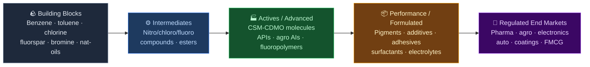
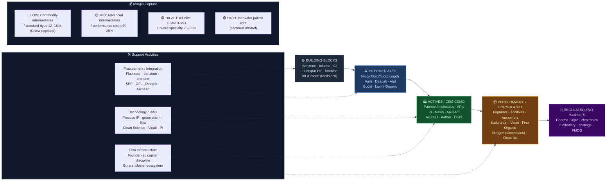

# Specialty Chemicals — Value Chain Analysis (India)

*Prepared: July 2026 · Investment-idea-generation lens · Frameworks: Porter Value Chain & Five Forces, Chancellor Capital Cycle, Gereffi GVC, Kim & Mauborgne Blue Ocean*

> **Scope note:** This is the **specialty / performance chemicals** deep-dive requested as "Industrial Chemicals (specialty chemicals)." It is a focused companion to the broader `Industrial Chemicals - Value Chain Analysis.md` already in this folder (which spans bulk/commodity chlor-alkali + specialty). Here the boundary is drawn tightly around *specialty*: custom synthesis & manufacturing (CSM/CDMO), fluorochemicals & fluoropolymers, agro & pharma intermediates/actives, dyes & pigments, aroma chemicals, performance monomers, and new-age (bromine/lithium/battery) chemistries. Commodity chlor-alkali, soda ash, and bulk petrochemicals are excluded except as feedstock.

> **Figures caveat:** Market caps as of ~July 2026 (anchored to Tickertape/Screener where verified); a few are approximate and flagged. Verify before action.

---

## 0. Segment definition

**Specialty chemicals** are low-to-medium-volume, high-value molecules and formulations sold on *performance, purity, and regulatory compliance* rather than price. Value is captured through **process chemistry IP, multi-step synthesis capability, regulatory approvals (DMF/REACH/RSPO), and innovator-customer relationships** — not scale-driven cost leadership (that's commodity chemicals).

The chain runs: **basic building blocks → intermediates → advanced intermediates / actives → formulated performance products → regulated end markets.**

**End customer & what they value most:** Global innovator pharma & agrochemical companies (Bayer, Syngenta, Corteva, big pharma), electronics/EV supply chains, coatings/auto/FMCG formulators. What they value: **security & confidentiality of supply, first-time-right quality, complex chemistry capability, regulatory documentation, and de-risking from single-country (China) dependence.** Price matters far less than reliability and IP protection — the whole China+1 thesis rests on this.

**India's global position: CHALLENGER, rising fast.** India is #2 to China across most specialty sub-segments and is the primary beneficiary of global supply-chain diversification. India's specialty chemicals market is ~USD 35–40 bn (2026), targeted at USD 86–100 bn by 2033–35 (~10–12% CAGR). World-class in **fluorochemicals** (GFL, Navin, SRF — top-5 globally in fluoropolymers), **agro CSM** (PI Industries), **reactive dyes** (#2 exporter globally), and **pharma CDMO** (#3 globally). Structurally behind China on scale and backward integration into basic building blocks.

---

## 0.5 Quick Scan — Investable Listed Companies

| Company | Ticker | Cap Bucket | Chain Stage | One-Line Investment Thesis | Coverage |
|---|---|---|---|---|---|
| PI Industries | NSE: PIIND | Large (~₹55,000 Cr) | Agro CSM/CDMO | Best-in-class CSM order book (~$1.5bn); pharma CDMO pivot + electronic-chemicals optionality under-modelled | Well-covered |
| SRF Ltd | NSE: SRF | Large (~₹90,000 Cr) | Fluoro + specialty | Fluoropolymer/specialty capex (₹745 Cr) into a refrigerant upcycle; Chemours tie-up de-risks tech | Well-covered |
| Gujarat Fluorochemicals | NSE: FLUOROCHEM | Large (~₹50,000 Cr) | Fluoropolymers + battery | Only integrated Indian fluoropolymer + PVDF/battery-material play; EV/semis optionality not priced | Well-covered |
| Navin Fluorine | NSE: NAVINFLUOR | Large (~₹38,600 Cr) | Fluoro specialty + CDMO | CDMO revenue +141% YoY; high-margin cycle as new plants ramp | Well-covered |
| Anupam Rasayan | NSE: ANURAS | Mid (~₹14,200 Cr) | Agro/pharma CSM | US acquisitions (Jayhawk/Monitchem) + large LoI book; margin-compression fear over-discounted | Moderate |
| Aether Industries | NSE: AETHER | Mid (~₹18,900 Cr) | Advanced intermediates | R&D-led niche intermediates; high multiple resting on execution of new contracts | Moderate |
| Sudarshan Chemical | NSE: SUDARSHAN | Mid (~₹8,500 Cr)* | Pigments | Post-Heubach, becomes world's #3 pigment player; integration + global share gain not fully priced | Moderate |
| Neogen Chemicals | NSE: NEOGEN | Mid (~₹5,600 Cr) | Bromine/lithium/battery | ₹1,500 Cr battery-material capex (electrolytes/salts); China-substitution optionality | Under-researched |
| Vinati Organics | NSE: VINATIORGA | Mid (~₹13,400 Cr) | Performance monomers | ATBS/IBB global monopoly economics; new products (butyl phenol, MEHQ) diversify | Well-covered |
| Clean Science | NSE: CLEANSCI | Mid (~₹7,700 Cr) | Green performance chem | Catalytic-process cost moat (MEHQ/anisole); capex into new molecules extends the moat | Moderate |
| Fine Organic | NSE: FINEORG | Mid (~₹14,800 Cr) | Oleo-additives | Global-scale food/polymer additive niche; Malaysia + US plant expansion | Moderate |
| Acutaas Chemicals (ex-Ami Organics) | NSE: ACUTAAS | Mid (~₹5,500 Cr)* | Pharma intermediates + advanced | Advanced-intermediate/CDMO pivot; renamed 2025, still under-tracked | Under-researched |
| Aarti Industries | NSE: AARTIIND | Mid (~₹17,300 Cr) | Benzene-chain intermediates | Benzene-chemistry leader at cyclical trough; long-term contracts + recovery optionality | Well-covered |
| Deepak Nitrite | NSE: DEEPAKNTR | Large (~₹28,000 Cr) | Intermediates + phenol | Phenol/acetone import-substitution + forward integration into specialty; capex-heavy | Well-covered |
| Archean Chemical | NSE: ACI | Mid (~₹8,000 Cr)* | Bromine/marine chem | Lowest-cost bromine (Rann of Kutch); ZincGel battery optionality | Under-researched |

*Asterisked caps are approximate — verify.

**Where the under-researched opportunity sits:** The **Mid-cap bucket** holds the richest under-researched ideas right now — specifically the **new-age chemistry names (Neogen, Archean) and the CDMO/advanced-intermediate pivots (Acutaas, Anupam Rasayan)**. These sit at a cyclical inflection: the sector spent FY24–FY25 in a brutal destocking + China-dumping downcycle that compressed multiples, while the structural China+1 order-shift and battery-material capex are only now ramping. The marquee large-caps (SRF, PI, Navin, GFL) are well-covered and priced for quality; the discovery value is in the mid-caps whose new capacity/contracts have not yet shown up in reported numbers.

---

## 1. Value chain map — primary activities

### 1.1 Inbound logistics (building blocks & key raw materials)
**What it involves:** Sourcing basic building blocks — benzene, toluene, xylene, chlorine, fluorspar (→ HF), bromine, phenol, acetone, natural oils, and China-origin advanced intermediates. Fluorspar and many advanced intermediates are import-dependent (China, Mexico, Vietnam).

**Cost & differentiation drivers:** Raw material is 45–60% of specialty COGS — less dominant than in commodity chemicals but still material. **Backward integration into building blocks is the key structural advantage** (SRF/GFL into fluorspar-HF, Deepak Nitrite into phenol, Aarti into nitro-chloro benzene). Access to captive/low-cost feedstock insulates margin during raw-material spikes.

**Indian players:** SRF, GFL, Navin (fluorspar→HF integration); Deepak Nitrite (phenol/acetone); Aarti Industries (benzene derivatives); Archean/Neogen (captive bromine). **Conglomerate check: Tata (Tata Chemicals — bromine/soda ash side), Reliance (aromatics/benzene feedstock supplier upstream), Aditya Birla (Grasim's chlor-alkali) present as feedstock suppliers**, but no diversified conglomerate dominates specialty synthesis itself — it remains a founder/promoter-led space.

### 1.2 Operations (multi-step synthesis / CSM-CDMO)
**What it involves:** The heart of the chain — multi-step organic synthesis, fluorination, nitration, hydrogenation, and custom synthesis under confidentiality for innovators. Includes dedicated CSM/CDMO blocks, kilo labs, pilot plants, and continuous-flow reactors.

**Cost & differentiation drivers:** This is where value is *created and captured*. Differentiators: number of synthesis steps mastered, hazardous-chemistry capability (fluorine, azides, nitration), yield/purity, R&D-to-commercial scale-up speed, and regulatory/quality systems. Margins scale with complexity: **commodity intermediates 12–18% EBITDA; specialty/CSM 22–30%; patented/exclusive CDMO molecules 25–35%.**

**Indian players:** PI Industries (agro CSM gold standard), Navin Fluorine & GFL (fluoro-specialty + CDMO), Anupam Rasayan (multi-step CSM), Aether (R&D intermediates), Suven/Neuland/Divi's (pharma CDMO — adjacent), Vinati (ATBS monopoly process), Clean Science (catalytic green processes).

### 1.3 Outbound logistics
**What it involves:** Bulk (ISO-tank, drums), temperature-controlled and hazmat-compliant shipping, largely export-oriented (60–70% exports for the leaders). Cold-chain and regulatory export documentation for pharma/agro actives.

**Cost & differentiation drivers:** Reliability and confidentiality of delivery to global innovators; proximity to ports (Gujarat cluster — Dahej, Jhagadia, Ankleshwar dominates). Export competitiveness vs. China on logistics and lead time.

**Indian players:** Gujarat-cluster concentration (SRF, GFL, Navin, Aarti, Anupam, Aether, Deepak all Gujarat-heavy); export reach is itself a moat for the leaders.

### 1.4 Marketing & sales
**What it involves:** B2B, relationship-driven — multi-year custom-synthesis contracts and LoIs with global innovators, built on trust, IP protection, and successful validation batches. Sales cycles run 2–5 years from lab to commercial.

**Cost & differentiation drivers:** **The moat is the innovator relationship + IP confidentiality track record.** Once designed into a patented agro/pharma molecule, the supplier is locked in for the product's life. This is modular-to-relational GVC governance and the source of pricing power.

**Indian players:** PI Industries (deepest global-innovator relationships in agro CSM), Anupam Rasayan (LoI-driven model), Navin/GFL (CDMO contracts), Divi's/Suven (pharma innovator relationships).

### 1.5 Service (technical & co-development)
**What it involves:** Process R&D, route scouting, scale-up engineering, regulatory dossier support, and co-development with the innovator. Increasingly the differentiator that wins the *next* molecule.

**Cost & differentiation drivers:** R&D depth and scale-up reliability create the "sticky" relationship. A profit protector, not a cost centre, for the CSM/CDMO leaders.

**Indian players:** PI Industries, Navin Fluorine, Aether Industries, Syngene (research-led CDMO), Sai Life Sciences.

---

## 2. Value chain map — support activities

### 2.1 Firm infrastructure
Predominantly **founder/promoter-led, disciplined-capital-allocator companies** (Vinati's Saraf family, PI's Singhal family, Navin/Aarti/Deepak promoters). Balance-sheet strength matters because specialty capex is lumpy and long-gestation. Unlike commodity chemicals, few diversified conglomerates dominate — this is a "focused specialist" space, which is *positive* for pure-play investability.

### 2.2 HR management
R&D chemists and process engineers are the scarce resource. India's cost-competitive PhD/chemist talent pool is a structural GVC advantage vs. the West — the same labour-arbitrage logic that built IT and pharma. Talent depth separates CDMO winners from commodity converters.

### 2.3 Technology development
**The single biggest value lever.** Process IP (catalysis, continuous flow, hazardous chemistry, green chemistry) is what converts a commodity intermediate into a margin-rich specialty. Clean Science (catalytic processes eliminating effluent), Vinati (proprietary ATBS), PI (complex multi-step), and the fluorine players (hazardous F-chemistry) all compete on tech, not price. R&D spend of 3–6% of sales among the leaders.

### 2.4 Procurement
Feedstock/intermediate procurement (see 1.1) — the China-dependence in advanced intermediates is the chain's key vulnerability *and* its China+1 opportunity. Fluorspar (China), key intermediates (China), and specialty reagents are the pinch points; import-substitution of these is a live investment theme.

---

## 3. Five Forces + Capital Cycle analysis

### Part A — Five Forces

**Supplier power — MEDIUM.** Building-block suppliers (benzene from RIL/petchem, chlorine, fluorspar imports) have moderate power; the acute vulnerability is *Chinese-origin advanced intermediates* where China can weaponise supply. Backward-integrated players (SRF, GFL, Deepak) neutralise this; un-integrated formulators are exposed. Fluorspar import concentration is a structural supplier risk.

**Buyer power — MEDIUM-LOW (specialty) / HIGH (commodity intermediate).** For patented CSM/CDMO molecules, buyers are locked in for the molecule's life — low buyer power, high supplier pricing power. For commodity intermediates and dyes, buyers are price-sensitive and can switch to China — high buyer power. The chain bifurcates sharply on this axis.

**Threat of new entrants — MEDIUM-LOW.** High barriers: process IP, regulatory approvals, innovator trust (years to earn), hazardous-chemistry capability, and capex. But new domestic entrants keep appearing at the *simpler intermediate* end, and Chinese overcapacity is the perennial entrant-from-abroad threat.

**Threat of substitutes — LOW-MEDIUM.** Within a molecule, substitution is low (it's a specified input). The real "substitute" is *geographic* — the customer sourcing from China instead of India. Bio-based/green chemistry is a substitution vector that mostly *favours* Indian innovators (Clean Science).

**Rivalry — MEDIUM-HIGH, and China-driven.** Domestic rivalry is moderate (differentiated niches), but the dominant competitive force is **Chinese overcapacity and price dumping**, which drove the FY24–FY25 downcycle. Rivalry intensity is inversely correlated with product complexity — fierce in commodity dyes/intermediates, benign in exclusive CDMO.

### Part B — Capital Cycle verdict

The sector is at an **early-recovery inflection after a deep 2-year outflow/trough.** FY24–FY25 saw the classic capital-cycle bottom: Chinese dumping, customer destocking, collapsed realisations, margin compression (Aarti, Anupam, dyes players hit hardest), sharp de-rating, and stalled capex — capital left the sector and marginal players suffered. Simultaneously, the **strong players kept building strategic capacity into the downcycle** (SRF fluoropolymers, GFL battery materials, Neogen electrolytes, Sudarshan's Heubach buyout, Anupam's US acquisitions) — positioning for the China+1 upcycle. This "survivors expand at the trough" pattern is historically the right entry window, but only for the quality/integrated names, not the commodity-intermediate marginal producer.

### Part C — Investor implication

The **CSM/CDMO and fluoro-specialty stages are the structurally attractive place to be** — insulated from Chinese price competition by IP, relationships, and hazardous-chemistry barriers, and riding the China+1 order-shift (20–30% of global innovator orders moving to India). The **commodity-intermediate and standard-dye stages should be avoided or treated as pure trough-cyclical trades** — they carry the full brunt of Chinese overcapacity with no moat. The **new-age battery/bromine-lithium stage is a high-optionality, higher-risk sub-theme** worth selective exposure. The **single biggest risk that invalidates the thesis: a prolonged Chinese overcapacity/dumping regime** (Beijing subsidising to hold share) that delays the margin recovery, compounded by a weak global agro/pharma capex cycle — this would keep realisations depressed and strand the capacity being built now.

### Summary table

| Force | Intensity | Key Driver |
|---|---|---|
| Supplier power | **Medium** | Fluorspar + Chinese advanced-intermediate dependence; neutralised by integration |
| Buyer power | **Med-Low / High** | Locked-in for CSM/CDMO; price-sensitive & China-switchable for commodity |
| Threat of new entrants | **Medium-Low** | IP + regulatory + trust barriers; Chinese overcapacity the external threat |
| Threat of substitutes | **Low-Medium** | Geographic (China) substitution is the real risk; green chem favours India |
| Rivalry | **Medium-High** | Chinese dumping dominates; benign in exclusive CDMO |

**Overall structural attractiveness: MEDIUM-HIGH** — a genuinely moated, IP-driven export chain riding China+1, but exposed to Chinese overcapacity cycles; attractiveness concentrates in the complex/CSM/fluoro layer.
**Capital cycle phase: OUTFLOW → EARLY RECOVERY** — deep FY24–FY25 trough with capital-starved marginals; quality players expanded through it and are positioned for the upcycle.
**Investor stance: ACCUMULATE (selective)** — accumulate integrated CSM/CDMO and fluoro leaders + new-age optionality mid-caps at post-de-rating valuations; avoid moatless commodity-intermediate producers.

---

## 4. GVC governance & India's position

Specialty chemicals is a **deeply globalised, export-led chain** (60–70% of leaders' revenue is exported) — full GVC lens applies.

**Lead firms:** Global innovators who own the demand — **Bayer, Syngenta, Corteva, BASF, big pharma (agro/pharma actives); Chemours, Daikin, Honeywell (fluorine); Merck, DIC, Clariant (pigments/electronics).** Indian lead firms in their niches: **PI Industries (agro CSM), SRF/GFL/Navin (fluorine), Divi's (pharma CDMO), Sudarshan (pigments, post-Heubach).**

**Governance type: MODULAR → RELATIONAL (the upgrade India is executing).** Commodity intermediates trade at arm's length (market/modular — price-taker, China-exposed). The prize is the **relational** tier — exclusive multi-year CSM/CDMO relationships where mutual dependence and tacit process knowledge make the Indian supplier hard to replace. PI Industries is the exemplar of an Indian firm that has reached relational governance and captures the associated pricing power.

**Value capture map:**
- **Building blocks/commodity intermediates:** thin margin (12–18%), China-price-anchored, value leaks abroad.
- **Advanced intermediates / specialty:** better margin (20–28%), captured by process-IP holders.
- **Exclusive CSM/CDMO actives:** highest margin (25–35%), captured by relationship + IP holders (PI, Navin, Divi's).
- **The innovator (global) still captures the largest rent** via the patented end-product — India supplies the molecule, not the patent.

**India's position & upgrade trajectory:** India sits mid-chain and is climbing the ladder: (1) *process* upgrading — yield, green chemistry, continuous flow (ongoing everywhere); (2) *product* — commodity intermediates → specialty/complex molecules (Aarti, Deepak, Acutaas); (3) *functional* — contract manufacturing → co-development/CDMO with IP (PI, Navin, Anupam); (4) *chain* — leveraging capability into adjacent high-value chains like **electronic chemicals, battery materials, and semiconductors** (GFL, Neogen, PI's electronic-materials foray). China+1 is the tailwind pulling India up every rung.

---

## 5. Key linkages & leverage points

**Critical linkages:**
1. **Technology ↔ Operations (process IP ↔ margin):** the dominant linkage — proprietary chemistry is what separates a 15% commodity intermediate from a 30% specialty. The entire investment case rests here.
2. **R&D/Service ↔ Marketing (co-development ↔ next contract):** winning a molecule's process development locks in commercial supply and the *follow-on* molecules — the compounding relationship linkage (PI's model).
3. **Procurement ↔ Operations (feedstock integration ↔ margin stability):** backward integration into fluorspar/HF, phenol, bromine insulates margin from raw-material and Chinese-supply shocks — the difference between SRF/GFL and an exposed formulator.
4. **Regulation/Quality ↔ Sales (approvals ↔ market access):** DMF/REACH/GMP compliance and audit track record gate access to regulated pharma/agro buyers; a quality failure severs an innovator relationship instantly.
5. **Capital allocation ↔ Capacity timing (capex discipline ↔ cycle positioning):** building capacity into the trough (as the leaders did FY24–25) vs. into the peak decides who captures the next upcycle — a capital-cycle linkage.

**Highest-leverage intervention:** **Moving up from contract manufacturing to IP-sharing co-development (functional upgrading) while backward-integrating key China-dependent intermediates.** In a chain where the innovator captures the patent rent and China threatens the input supply, the single change that most increases India's durable value capture is climbing into relational CDMO governance *and* substituting the Chinese advanced-intermediate dependence domestically. PI Industries (functional upgrade) and Deepak/Neogen (import substitution) are the two archetypes executing this.

---

## 5.5 Upcoming catalysts & key triggers

| Catalyst / Trigger | Timeline | Companies Likely to Benefit |
|---|---|---|
| Refrigerant (F-gas) upcycle + quota tightening globally | FY26–FY27 | SRF, GFL, Navin Fluorine |
| SRF specialty fluoropolymer plant (₹745 Cr) commissioning | By Dec 2026 | SRF |
| Neogen battery-material capacity (30,000 MT electrolytes) commissioning | FY26–FY27 | Neogen Chemicals |
| Sudarshan–Heubach integration → #3 global pigment player synergies | FY26–FY27 | Sudarshan Chemical |
| Agrochemical destocking end + global agro capex revival | FY26–FY27 | PI Industries, Anupam Rasayan, Aarti Industries |
| China+1 order awards (20–30% of innovator volumes shifting to India) | Ongoing, 12–24 mo | PI, Navin, Divi's, Acutaas, Anupam |
| GFL / Neogen battery-material (PVDF, electrolyte) offtake with EV cell makers | FY27+ | Gujarat Fluorochemicals, Neogen |
| New specialty IPOs (Prasol, Safex, others filed with SEBI) | FY26–FY27 | New listed-universe entrants |
| Chinese anti-involution / capacity-discipline signals (dumping easing) | Watch | Whole sector, esp. intermediates/dyes |

---

## 6. Indian company landscape

### Listed companies

| Stage | Company | Ticker | Cap Bucket | Revenue / Mkt Cap | PLI? | Coverage | Chain Position |
|---|---|---|---|---|---|---|---|
| Agro CSM/CDMO | PI Industries | NSE: PIIND | Large | ~₹8,000 Cr rev; mkt cap ~₹55,000 Cr | No | Well-covered | Leader |
| Fluoro + specialty (diversified) | SRF Ltd | NSE: SRF | Large | ₹14,601 Cr rev (FY26); mkt cap ~₹90,000 Cr | No | Well-covered | Leader |
| Fluoropolymers + battery mat. | Gujarat Fluorochemicals | NSE: FLUOROCHEM | Large | ~₹4,500 Cr rev; mkt cap ~₹50,000 Cr | No | Well-covered | Leader |
| Fluoro specialty + CDMO | Navin Fluorine Intl | NSE: NAVINFLUOR | Large | ~₹2,300 Cr rev; mkt cap ~₹38,600 Cr | No | Well-covered | Leader |
| Phenol + intermediates | Deepak Nitrite | NSE: DEEPAKNTR | Large | ~₹8,000 Cr rev; mkt cap ~₹28,000 Cr | No | Well-covered | Leader |
| Agro/AgSci (adjacent CSM) | Sumitomo Chemical India | NSE: SUMICHEM | Large | ~₹3,700 Cr rev; mkt cap ~₹25,000 Cr* | No | Moderate | Challenger |
| Diversified specialty (aromatics/dyes) | Atul Ltd | NSE: ATUL | Large | ~₹5,000 Cr rev; mkt cap ~₹22,000 Cr* | No | Moderate | Leader (niche) |
| Advanced intermediates (R&D-led) | Aether Industries | NSE: AETHER | Mid | ~₹900 Cr rev; mkt cap ~₹18,900 Cr | No | Moderate | Emerging |
| Benzene-chain intermediates | Aarti Industries | NSE: AARTIIND | Mid | ~₹7,000 Cr rev; mkt cap ~₹17,300 Cr | No | Well-covered | Leader |
| Vitamins/pharma-agro intermediates | Jubilant Ingrevia | NSE: JUBLINGREA | Mid | ~₹4,200 Cr rev; mkt cap ~₹15,000 Cr* | No | Moderate | Challenger |
| Oleo-additives (food/polymer) | Fine Organic | NSE: FINEORG | Mid | ₹2,302 Cr rev (FY25); mkt cap ~₹14,800 Cr | No | Moderate | Niche leader |
| Agro/pharma CSM | Anupam Rasayan | NSE: ANURAS | Mid | ₹1,448 Cr rev (FY25); mkt cap ~₹14,200 Cr | No | Moderate | Challenger |
| Performance monomers (ATBS/IBB) | Vinati Organics | NSE: VINATIORGA | Mid | ~₹2,200 Cr rev; mkt cap ~₹13,400 Cr | No | Well-covered | Niche monopoly |
| Green performance chemicals | Clean Science & Tech | NSE: CLEANSCI | Mid | ~₹1,000 Cr rev; mkt cap ~₹7,700 Cr | No | Moderate | Niche leader |
| Pigments (post-Heubach) | Sudarshan Chemical | NSE: SUDARSHAN | Mid | ~₹2,500 Cr standalone rev; mkt cap ~₹8,500 Cr* | No | Moderate | Leader (global #3) |
| Bromine/lithium/battery | Neogen Chemicals | NSE: NEOGEN | Mid | ₹774 Cr rev (FY25); mkt cap ~₹5,600 Cr | No | Under-researched | Emerging |
| Bromine/marine chem | Archean Chemical | NSE: ACI | Mid | ~₹1,200 Cr rev; mkt cap ~₹8,000 Cr* | No | Under-researched | Niche (cost leader) |
| Fluoro-specialty intermediates | Laxmi Organic | NSE: LXCHEM | Mid | ~₹2,900 Cr rev; mkt cap ~₹6,000 Cr* | No | Moderate | Challenger |
| Pharma intermediates + advanced | Acutaas Chemicals (ex-Ami Organics) | NSE: ACUTAAS | Mid | ~₹800 Cr rev; mkt cap ~₹5,500 Cr* | No | Under-researched | Emerging |
| HPPC specialty blends | Rossari Biotech | NSE: ROSSARI | Small | ~₹1,900 Cr rev; mkt cap ~₹3,500 Cr | No | Moderate | Challenger |
| Rubber chemicals | NOCIL | NSE: NOCIL | Small | ~₹1,400 Cr rev; mkt cap ~₹4,000 Cr* | No | Moderate | Niche leader |
| Aroma chemicals | Privi Speciality | NSE: PRIVISCL | Small | ~₹2,000 Cr rev; mkt cap ~₹5,000 Cr* | No | Moderate | Niche |
| Fragrance/flavour | SH Kelkar (Keva) | NSE: SHK | Small | ~₹2,000 Cr rev; mkt cap ~₹4,000 Cr* | No | Moderate | Leader (niche) |
| Aroma/camphor | Oriental Aromatics | NSE: OAL | Small | ~₹800 Cr rev; mkt cap ~₹1,500 Cr* | No | Under-researched | Niche |
| Structure-directing agents | Tatva Chintan | NSE: TATVA | Small | ~₹400 Cr rev; mkt cap ~₹2,000 Cr* | No | Under-researched | Niche |
| Agro AI/intermediates | Astec LifeSciences | NSE: ASTEC | Small | ~₹600 Cr rev; mkt cap ~₹2,000 Cr* | No | Under-researched | Niche (Godrej-owned) |
| Dyes & dye intermediates | Bodal Chemicals | NSE: BODALCHEM | Small | ~₹1,700 Cr rev; mkt cap ~₹1,000 Cr* | No | Under-researched | Cost player |
| Pigments (niche) | Vipul Organics | NSE: VIPULORG | Micro | ~₹200 Cr rev; mkt cap ~₹350 Cr* | No | Undiscovered | Niche |

*Asterisked figures approximate/verify. **PLI: no dedicated specialty-chemicals PLI** — the sector rides China+1 and Make-in-India rather than a formal PLI (battery-material players may touch the ACC/battery PLI indirectly).

### Unlisted / private companies

| Stage | Company | Type | Business Description | Scale | Notes |
|---|---|---|---|---|---|
| Aroma/fine chemistry | Anthea Group (Anthea Aromatics) | Private | Flavour/fragrance, pharma & agro building blocks | Mid | Mumbai-based, 1992 |
| Pharma CDMO | Piramal Pharma Solutions | Listed-parent (PPLPHARMA) | End-to-end CDMO | Large | Listed via Piramal Pharma |
| Specialty intermediates | Prasol Chemicals | Private (DRHP) | Phosphorus & specialty chemistry | Mid | SEBI-approved ₹800 Cr IPO — watch |
| Agro CSM | Safex Chemicals | PE-backed (DRHP) | Agrochemicals + CSM | Mid | Filed ₹450 Cr IPO — watch |
| Fluoro-intermediates | Chemours-SRF JV entities | MNC JV | Refrigerant/fluoro supply agreements | — | 2026 strategic tie-up |
| Battery electrolyte | Neogen–Morita / Neogen Ionics JV | JV | Electrolyte salts & additives (Japan tech) | Emerging | Under listed Neogen |

**Completeness check:** Screener specialty-chemicals universe (145 names) swept; Tickertape/Trendlyne peer sets reviewed; IPO sweep 2021–25 (Ami/Acutaas, Clean Science, Anupam, Aether, Archean listed 2021–22; Prasol/Safex in pipeline); SME sweep (Vipul Organics, smaller names); sub-segments decomposed (fluoro, CSM/CDMO, pigments, aroma, monomers, bromine/battery, rubber chem, dyes); adjacency captured (Sumitomo/Astec agro, Piramal/Divi's/Suven pharma CDMO); conglomerate check — **Godrej owns Astec; Tata (Tata Chemicals) in bromine/soda ash; RIL/Grasim as feedstock suppliers; otherwise founder-led space.**

### Notable companies — deeper notes

**PI Industries (NSE: PIIND)**
- **Stage in chain:** Agro custom synthesis & manufacturing (CSM), pivoting into pharma CDMO + electronic materials
- **Cap bucket:** Large — mkt cap ~₹55,000 Cr
- **Analyst coverage:** Well-covered
- **What makes them interesting:** The benchmark Indian CSM franchise — a ~$1.5bn order book of patented molecules for global agro innovators, with a moat built on decades of trust, IP confidentiality, and complex multi-step chemistry. Now extending the same capability into pharma CDMO and electronic/specialty materials.
- **Key financials:** ~₹8,000 Cr revenue, ~24–26% EBITDA margin, strong cash generation, near-debt-free.
- **PLI beneficiary:** No
- **Watch factor:** Pharma CDMO commercialisation ramp and new molecule additions to the CSM book; agro destocking recovery.
- **Investment angle:** The market prices PI as a mature agro-CSM compounder; it under-models the *optionality* of the pharma-CDMO and electronic-materials diversification, which leverages the same relational moat into larger, higher-value chains. If the pharma pivot commercialises, PI re-rates from "best agro CSM" to "India's diversified CDMO platform" — a wider TAM not in consensus.

**Gujarat Fluorochemicals (NSE: FLUOROCHEM)**
- **Stage in chain:** Fluoropolymers + fluoro-specialty + battery materials (PVDF)
- **Cap bucket:** Large — mkt cap ~₹50,000 Cr
- **Analyst coverage:** Well-covered
- **What makes them interesting:** India's only fully integrated fluoropolymer player (fluorspar → HF → polymers), a top-5 global fluoropolymer producer, now building integrated battery materials (PVDF binders, electrolyte) with an IFC-backed plan. Sits at the intersection of three structural themes: fluorine specialty, EV/battery, and semiconductors.
- **Key financials:** ~₹4,500 Cr revenue, cyclical margins (fluoropolymer pricing softened in the downcycle), heavy growth capex.
- **PLI beneficiary:** No (potential indirect battery linkage)
- **Watch factor:** Battery-material (PVDF) offtake agreements with cell makers; fluoropolymer price recovery; new-energy segment revenue inflection.
- **Investment angle:** Consensus values GFL largely on the mature fluoropolymer cycle; the market under-prices the battery-material/new-energy optionality — an integrated domestic PVDF supplier is strategically scarce as India builds cell capacity. If EV battery localisation accelerates, the new-energy segment is a call option the current multiple doesn't fully capture.

**Neogen Chemicals (NSE: NEOGEN)**
- **Stage in chain:** Bromine & lithium chemistry → battery electrolytes and salts
- **Cap bucket:** Mid — mkt cap ~₹5,600 Cr
- **Analyst coverage:** Under-researched
- **What makes them interesting:** India's pioneer in bromine + lithium chemistry, transitioning from a specialty-compound maker into an EV **battery-materials** platform — a ₹1,500 Cr capex to make 30,000 MT electrolytes + 5,500 MT electrolyte salts/additives, with Japanese (Morita) technology partnership. A direct import-substitution play against Chinese electrolyte dominance.
- **Key financials:** ₹774 Cr revenue (FY25) → ₹855 Cr (FY26E, +10.6%); margins in transition as battery-materials capex ramps.
- **PLI beneficiary:** No (touches battery ecosystem indirectly)
- **Watch factor:** Electrolyte plant commissioning and first EV-cell-maker offtake; margin trajectory as new capacity utilises.
- **Investment angle:** The market still prices Neogen partly as a legacy bromine/lithium specialty maker; the battery-electrolyte transition — India's first at-scale domestic electrolyte capacity into a market ~100% import-dependent on China — is a step-change in TAM and strategic value that reported numbers haven't yet shown. High-risk, high-optionality China-substitution bet.

**Sudarshan Chemical (NSE: SUDARSHAN)**
- **Stage in chain:** Colour pigments (organic + inorganic)
- **Cap bucket:** Mid — mkt cap ~₹8,500 Cr*
- **Analyst coverage:** Moderate
- **What makes them interesting:** With the ₹1,180 Cr acquisition of Germany's insolvent Heubach Group (2024–25), Sudarshan vaults to **the world's #3 pigment player**, gaining 19 international sites, global customer access, and a 200-year pigment franchise — a transformational scale-up of a mid-cap Indian specialty firm.
- **Key financials:** ~₹2,500 Cr standalone revenue pre-integration; Heubach roughly doubles the consolidated topline; near-term margins depend on turning around the acquired assets.
- **PLI beneficiary:** No
- **Watch factor:** Heubach integration/turnaround execution, synergy capture, and consolidated margin trajectory over FY26–FY27.
- **Investment angle:** The market is discounting integration/execution risk on a distressed European asset; if Sudarshan executes the turnaround, it re-rates from a domestic mid-cap pigment maker to a global pigment consolidator with #3 worldwide share and pricing power in a concentrated industry — a structural step-up not yet in the multiple.

**Anupam Rasayan (NSE: ANURAS)**
- **Stage in chain:** Agro & pharma custom synthesis (multi-step CSM)
- **Cap bucket:** Mid — mkt cap ~₹14,200 Cr
- **Analyst coverage:** Moderate
- **What makes them interesting:** A multi-step CSM specialist with a large LoI/contract book and an aggressive US-acquisition strategy (Jayhawk, Monitchem/Kansas) to move closer to global customers and up the value chain — expanding from Indian CSM toward a trans-Atlantic specialty platform.
- **Key financials:** ₹1,448 Cr revenue (FY25, −4% YoY in the downcycle), Q4 FY25 PAT +56% YoY (recovery signs), margins compressed but improving.
- **PLI beneficiary:** No
- **Watch factor:** LoI-to-revenue conversion, US-acquisition integration and debt from acquisition funding, margin normalisation.
- **Investment angle:** The market over-discounts the margin compression and acquisition-debt risk after the downcycle; it under-prices the LoI book conversion and the strategic value of US manufacturing proximity to innovator customers. If the contract book commercialises and US integration delivers, the earnings recovery is sharper than the de-rated multiple implies — but execution/leverage risk is real.

---

## 7. Strategic insight & investment angles

### Part A — Non-obvious strategic insight

The consensus frames Indian specialty chemicals as one homogeneous "China+1 growth story" — buy the theme. The full-chain map reveals the opposite: **China+1 is bifurcating the sector, not lifting it uniformly.** The FY24–FY25 downcycle exposed that at the *commodity-intermediate and standard-dye* end, China+1 is a myth — Chinese overcapacity dumped product below Indian cash cost and crushed exactly the players a naive "specialty chemicals" screen picks up (dyes, basic intermediates, simple molecules). The China+1 order-shift is real *only* at the **relational CSM/CDMO and hazardous-fluoro-chemistry tier**, where IP, innovator trust, and multi-year contracts make the Indian supplier non-substitutable. The non-obvious implication: **the "specialty chemicals" label is doing enormous work hiding two opposite businesses** — a moated, relationship-locked export franchise (PI, Navin, Divi's) and a moatless commodity converter dressed in specialty clothing (many dyes/intermediate names). The market frequently prices both on "specialty" multiples; the mispricing is in telling them apart. The single most valuable analytical act in this chain is classifying each company by *governance tier* (modular/price-taker vs. relational/locked-in), not by sub-segment.

### Part B — Blue Ocean opportunity

**Four Actions Framework applied to Indian specialty chemicals:**
- **Eliminate:** dependence on Chinese-origin advanced intermediates and electrolyte salts (the input vulnerability).
- **Reduce:** exposure to commodity intermediates/dyes where India cannot out-scale China.
- **Raise:** complex/hazardous chemistry capability, green/catalytic processes, and IP co-development depth.
- **Create:** a **domestic "battery + electronic + semiconductor chemicals" value curve** — India-made electrolytes, PVDF binders, high-purity electronic gases, and photoresist/CMP chemicals that currently *don't exist at scale in India and are ~100% imported from China/Japan/Korea.*

**Value curve reconstructed:** away from "another agro/pharma intermediate competing with China on price" toward "strategic, import-substituting electronic & battery materials for India's new manufacturing base (semicon fabs, EV cell gigafactories)." **Non-customer targeted:** India's nascent semiconductor fabs and battery-cell makers who currently import 100% of their process chemicals and have *no* qualified domestic supplier — a market that does not yet buy from Indian specialty chemicals at all.

**Company already attempting it: Neogen Chemicals** (battery electrolytes/salts via Morita JV) and **Gujarat Fluorochemicals** (PVDF binders, fluoro-electronic materials). **Probability of success: Medium.** Both have genuine chemistry and integration advantages and a captive strategic-import-substitution demand as India localises. The risks are (a) the customer base (Indian fabs/cell makers) is itself nascent and delayed, and (b) Japanese/Korean/Chinese incumbents are entrenched and cost-competitive. **Investment implication:** Neogen and GFL are already in the listed table — the battery/electronic-materials optionality is exactly the piece under-priced in their §6 theses; this blue ocean is a real, capital-backed move, not a slideware ambition.

### Part C — Top 3 priorities for a listed Indian firm seeking durable advantage

1. **Climb from modular to relational governance** — invest in process R&D and co-development to become the innovator's *irreplaceable* partner on patented molecules (life-of-product lock-in), escaping the China-price-anchored commodity tier.
2. **Backward-integrate the China-dependent inputs** — domesticate fluorspar/HF, key advanced intermediates, and electrolyte salts to convert the sector's biggest vulnerability into a supply-security selling point.
3. **Build optionality into strategic new chains (battery/electronic/semiconductor materials)** — use existing chemistry capability to enter India's import-dependent, policy-supported new-manufacturing chains before global incumbents localise.

### Part D — Investment angle summary

- **PI Industries:** Priced as a mature agro-CSM compounder; the pharma-CDMO + electronic-materials diversification (same relational moat, larger TAM) is optionality consensus under-models.
- **Gujarat Fluorochemicals:** Valued on the mature fluoropolymer cycle; the integrated battery-material/PVDF new-energy segment is a strategically scarce call option not fully in the multiple.
- **Neogen Chemicals:** Still partly priced as a legacy bromine/lithium specialty maker; the at-scale domestic battery-electrolyte transition (into a ~100% China-import market) is a TAM step-change not yet in reported numbers.
- **Sudarshan Chemical:** Discounted for Heubach integration risk; successful turnaround re-rates it from domestic mid-cap to global #3 pigment consolidator with concentration-driven pricing power.
- **Anupam Rasayan:** Over-discounts downcycle margin compression and acquisition leverage; under-prices LoI-book conversion and US-proximity strategic value — a sharper earnings recovery than the de-rated multiple implies (with real execution risk).

---

## 8. Value chain diagram (Mermaid)

---

## Sources

- Sector outlook / China+1 / destocking — [Whalesbook H1 FY26](https://www.whalesbook.com/news/English/chemicals/Specialty-Chemicals-Sector-Faces-Headwinds-Outlook-Muted-for-H1-FY26-Amid-Tariffs-and-Weak-Demand/68da6d1fa48b937a3c22270b), [Multibagg Q4 FY26 synthesis](https://www.multibagg.ai/deep-dive/sector-analysis/q4-fy2026-specialty-chemicals-india-sector-synthesis-cmrausj16000p2rm4lc30em0c), [IBEF](https://www.ibef.org/industry/chemicals-presentation), [EY India](https://www.ey.com/en_in/insights/chemicals/indian-specialty-chemicals-industry-ready-for-a-quantum-leap)
- Market size — [OpenPR/USD 86.2bn by 2035](https://www.openpr.com/news/4577430/india-specialty-chemicals-export-market-set-to-surge-to-usd-86-2), [Custom Market Insights](https://www.custommarketinsights.com/report/india-specialty-chemicals-market/)
- SRF capex & Chemours tie-up — [Indian Chemical News](https://www.indianchemicalnews.com/chemical/lite/srf-revises-capex-for-specialty-fluoropolymers-facility-27977), [Barchart/Chemours-SRF](https://www.barchart.com/story/news/34238536/chemours-and-srf-limited-announce-strategic-agreements-in-india-to-support-market-needs-for-essential-applications-by-2026)
- Navin Fluorine CDMO — [Business Standard](https://www.business-standard.com/amp/markets/capital-market-news/navin-fluorine-intl-q4-pat-rises-35-yoy-to-rs-95-cr-declares-dividend-of-rs-7-sh-125051200346_1.html)
- GFL fluoropolymers/battery — [Screener](https://www.screener.in/company/FLUOROCHEM/consolidated/), [Mordor](https://www.mordorintelligence.com/industry-reports/fluorochemical-market/companies)
- PI Industries CSM — [Univest](https://univest.in/blogs/best-specialty-chemical-stocks-in-india-2026-2)
- Sudarshan–Heubach — [Plastics News](https://www.plasticsnews.com/news/german-pigments-maker-heubach-group-sold-sudarshan-chemical/), [Indian Chemical News](https://www.indianchemicalnews.com/chemical/sudarshan-chemical-acquires-pigment-business-of-heubach-group-for-rs-1180-cr-23670), [C&EN](https://cen.acs.org/business/mergers-&-acquisitions/Sudarshan-bags-bankrupt-pigment-firm/102/i33)
- Neogen battery materials — [TradeBrains](https://tradebrains.in/neogen-chemicals-shares-can-it-reduce-indias-dependency-on-china-for-lithium-electrolyte-salts/), [Neogen Ionics](https://neogenchem.com/neogen-ionics/), [Business Standard](https://www.business-standard.com/amp/markets/news/neogen-surges-9-in-weak-market-on-strong-q3-soars-28-in-5-days-125020300519_1.html)
- Anupam Rasayan — [Indian Chemical News Q4 FY25](https://www.indianchemicalnews.com/general/anupam-rasayan-india-q4-fy25-consolidated-pat-up-56-yoy-to-rs-63-cr-26269), [Whalesbook Monitchem](https://www.whalesbook.com/news/English/chemicals/Anupam-Rasayan-Completes-dollar155M-Monitchem-Kansas-Acquisition/69a17975fa7d0695d1aba2b7), [Screener](https://www.screener.in/company/ANURAS/consolidated/)
- Fine Organic — [Indian Chemical News](https://www.indianchemicalnews.com/general/fine-organic-industries-q2-fy25-pat-up-136-at-rs-1174-cr-24041), [SimplyWall.st](https://simplywall.st/stocks/in/materials/nse-fineorg/fine-organic-industries-shares/news/fine-organic-industries-full-year-2025-earnings-revenues-bea)
- Market caps — [Tickertape specialty chemicals collection](https://www.tickertape.in/stocks/collections/specialty-chemicals-stocks), [Screener](https://www.screener.in/)
- IPO pipeline (Prasol, Safex) — [Zee Business/Safex](https://www.zeebiz.com/hindi/stock-markets/ipo/upcoming-ipo-safex-chemicals-files-draft-papers-with-sebi-for-rs-450-crore-ipo-check-details-222984), [Chittorgarh sector IPOs](https://www.chittorgarh.com/report/sector-wise-ipo-list-in-india/96/all/15/?year=2025)
- CDMO adjacency — [6W Research CDMO](https://www.6wresearch.com/market-takeaways-view/cdmo-companies-in-india), [Equitymaster CDMO order books](https://www.equitymaster.com/detail.asp?date=05%2F10%2F2026&story=1&title=4-Pharma-CDMO-Stocks-with-Strong-Order-Book)

---

## Cross-Chain References

Companies in this analysis that also appear in other saved value-chain reports in this folder:

| Company | Ticker | Also appears in |
|---|---|---|
| SRF Ltd | SRF | *Industrial Chemicals*, Technical Textiles, Packaging (standing cross-ref) |
| Galaxy Surfactants / Fine Organic / Fairchem | GALAXYSURF / FINEORG / FAIRCHEMOR | *Oleochemicals - Value Chain Analysis.md* (oleo-derivative overlap) |
| Aarti Industries / Aarti group | AARTIIND | *Industrial Chemicals*, *Agro Chemicals* |
| PI Industries / Sumitomo / Astec | PIIND / SUMICHEM / ASTEC | *Agro Chemicals - Value Chain Analysis.md* (agro CSM overlap) |
| Privi Speciality / Oriental Aromatics / SH Kelkar | PRIVISCL / OAL / SHK | *Aromatics Chemicals Theme - Value Chain Analysis.md* |
| Deepak Nitrite / Atul / Jubilant Ingrevia | DEEPAKNTR / ATUL / JUBLINGREA | *Industrial Chemicals - Value Chain Analysis.md* |
| Neogen / Archean (battery/lithium) | NEOGEN / ACI | *Renewable Energy*, *EMS* (battery-material adjacency) |

*This report is the specialty-focused companion to `Industrial Chemicals - Value Chain Analysis.md`; consult that file for the commodity/chlor-alkali half of the chain, and the Agro Chemicals & Aromatics reports for deeper sub-segment coverage.*
