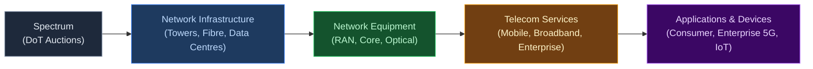

# Telecom & 5G Ecosystem in India — Value Chain Analysis

*Prepared: June 2026 | Framework: Porter Value Chain + Five Forces + GVC Governance + Blue Ocean*

---

## 0. Segment Definition

### Boundary

India's telecom value chain encompasses the full spectrum-to-application stack: spectrum procurement and allocation by the government, passive and active network infrastructure (towers, fibre, radio access networks), network equipment manufacturing (RAN, core, optical), device ecosystem (handsets, CPE, IoT endpoints), telecom services (mobile, broadband, enterprise), and the emerging 5G application layer (private networks, FWA, IoT, edge computing). The focus is particularly on the 5G transition — India commercially launched 5G in October 2022 and had crossed 250 million 5G subscribers by early 2025, with 5.18 lakh 5G base transceiver stations deployed across 99.9% of districts by December 2025.

### Core Product/Service Flow

### End Customers and What They Value

- **Consumer subscribers (~1.17 billion):** Affordable data, voice coverage, network speed/quality, device compatibility. India has the world's lowest average data tariffs — consumers are extremely price-sensitive but rapidly upgrading to 5G for speed and Fixed Wireless Access (FWA).
- **Enterprise/B2B buyers (banks, manufacturers, ports, mines):** SLA-backed uptime, private network isolation, low latency for automation, managed security, integration with enterprise systems. Willingness-to-pay is significantly higher.
- **Government/PSU:** Rural connectivity, digital public infrastructure, defence and homeland security networks.

### India's Global Position

**Challenger / Fast-Follower transitioning to Leader.** India is the world's 2nd largest telecom market by subscribers and crossed 250 million 5G users by early 2025 — the largest 5G base outside China. Jio runs the world's largest Standalone (SA) 5G network. India is now attempting to move from equipment importer to equipment exporter through the BSNL indigenous 4G/5G stack (TCS + C-DOT + Tejas Networks) and the PLI scheme for telecom equipment.

---

## 1. Value Chain Map — Primary Activities

### 1.1 Inbound Logistics: Spectrum Procurement & Infrastructure Sourcing

**What it involves:** Spectrum is India's foundational input — allocated by the Department of Telecommunications (DoT) via competitive auctions. The July–August 2022 5G auction raised ₹1.5 lakh crore (Jio: ₹88,000 Cr for 48% of spectrum sold; Airtel: ₹44,000 Cr; Vodafone Idea: ₹19,000 Cr; Adani Data Networks: ₹212 Cr). Additional inbound logistics include: sourcing 5G RAN equipment (primarily from Ericsson and Nokia as Huawei is effectively excluded from 5G), optical fibre cable from domestic and international suppliers, tower steel and civil works, and power infrastructure for base stations.

**Cost and differentiation drivers:**
- Spectrum cost is the single largest financial input — Jio's massive 2022 outlay gives it superior sub-GHz low-band coverage for deep rural penetration and mid-band (3.5GHz) capacity for urban 5G.
- Equipment vendor concentration (Ericsson/Nokia duopoly for 5G RAN) limits negotiating power for telcos, though large operators like Jio negotiate global frame agreements.
- Indigenous 5G stack (C-DOT/Tejas/TCS for BSNL) is a strategic inbound logistics disruption — if successful, it reduces dependence on foreign OEMs and creates cost competitive options.

**Key Indian players:**
- Jio Infocomm (NSE: RELIANCE subsidiary) — largest spectrum holder post-2022 auction
- Bharti Airtel (NSE: BHARTIARTL) — strong mid-band + mmWave portfolio; acquired Adani Data Networks' mmWave spectrum (26GHz) in 2025
- Vodafone Idea (NSE: IDEA) — constrained spectrum position; relies heavily on 900MHz and 1800MHz
- BSNL (unlisted PSU) — spectrum granted administratively for rural coverage; 4G sites now upgraded via indigenous stack
- Tejas Networks (NSE: TEJASNET) — supplying indigenous 4G/5G RAN for BSNL rollout
- Sterlite Technologies (NSE: STLTECH) — optical fibre cable manufacturer; key input supplier for backhaul
- HFCL (NSE: HFCL) — optical fibre and networking equipment; PLI beneficiary

---

### 1.2 Operations: Network Build, Maintenance & Service Delivery

**What it involves:** This is the core value-creating activity — building and operating the radio access network (BTS/gNodeB), transport/backhaul (fibre, microwave), and the core network (EPC for 4G, 5GC for standalone 5G). Includes tower construction, power management (DG sets, solar, grid), fibre laying, data centre operations (for edge and core), and 24x7 network operations centres (NOCs).

**Cost and differentiation drivers:**
- Tower sharing is critical for capex efficiency — without Indus Towers, per-operator tower capex would be 2-3x higher.
- Standalone vs. Non-Standalone 5G architecture is a key differentiation: Jio (SA) enables true network slicing and low-latency applications; Airtel (NSA) leverages existing 4G core but is faster to deploy.
- Fibre backhaul density is the hidden bottleneck for 5G quality — only ~35% of India's towers are fiberised vs. 70%+ in China.
- Data centre footprint for edge computing is the next battleground as enterprise 5G applications require sub-10ms latency.

**Key Indian players:**
- Reliance Jio (NSE: RELIANCE) — 191M 5G subscribers (Q4 FY25); Standalone 5G network; ~480M total subscribers; operates pan-India SA 5G since Dec 2023
- Bharti Airtel (NSE: BHARTIARTL) — 135M 5G subscribers (FY25); NSA 5G in 1,000+ cities; ₹1,74,559 Cr revenue FY25; EBITDA margin ~56%
- Vodafone Idea (NSE: IDEA) — ~193M subscribers; still largely 4G; FY26 revenue ~₹44,789 Cr; net loss ₹27,383 Cr in FY25; no meaningful 5G rollout yet
- BSNL (unlisted) — ~97,500 sites with indigenous 4G stack; targeting 5G in Delhi/Mumbai by Dec 2025 via TCS+C-DOT upgrade
- Indus Towers (NSE: INDUSTOWER) — 1.26 lakh towers; revenue ~₹29,588 Cr (FY24); market cap ~$12.1B (2026); shared passive infrastructure
- ATC India (unlisted subsidiary of American Tower Corp) — second largest tower company in India; ~70,000+ towers
- Tata Communications (NSE: TATACOMM) — international and domestic data connectivity; submarine cables; revenue ₹24,803 Cr (FY26); market cap ~₹56,684 Cr

---

### 1.3 Outbound Logistics: SIM Distribution, Handset Retail & Digital Activation

**What it involves:** Distributing SIM cards through retailer networks (millions of kiranas), handset distribution channels (modern trade, e-commerce, exclusive brand stores), digital app-based activation (instant KYC via Aadhaar-linked e-KYC), Fixed Wireless Access (FWA) CPE deployment, and enterprise circuit provisioning (MPLS, SD-WAN, leased lines).

**Cost and differentiation drivers:**
- Jio disrupted traditional SIM distribution by launching with ~130 million free SIMs in 2016 and now uses JioMart/JioPoints ecosystem.
- E-KYC via Aadhaar has collapsed the cost of SIM activation from ~₹200 to near-zero, enabling Jio's mass market penetration.
- FWA (Fixed Wireless Access) is the high-growth outbound channel — Jio's JioAirFiber targets 50M homes; Airtel's Xstream Air competes; both use 5G mmWave/mid-band to bypass the last-mile fibre gap.
- Device bundling and EMI schemes (JioPhone Next, partnering with Qualcomm/Google for sub-₹5,000 4G/5G smartphones) drive 5G device adoption.

**Key Indian players:**
- Reliance Jio — JioAirFiber (FWA CPE); JioMart distribution network; JioPhone ecosystem
- Bharti Airtel — Airtel Thanks app; Airtel Xstream Air (FWA); Airtel Digital TV retail network
- Dixon Technologies (NSE: DIXON) — contract manufacturer for 5G-capable smartphones and CPE; FY25 revenue ₹38,860 Cr; PLI beneficiary; top Make-in-India smartphone manufacturer
- Lava International (unlisted) — domestic smartphone brand; 4G/5G handsets; PLI beneficiary
- Samsung India (unlisted subsidiary) — largest 5G device market share in India; manufactures locally at Noida factory

---

### 1.4 Marketing & Sales: Subscriber Acquisition, ARPU Growth & Enterprise Deals

**What it involves:** Mass consumer marketing (brand building, tariff wars, bundled content), ARPU improvement through premium plan migrations (Jio's ₹206 ARPU vs. Airtel's ₹245 ARPU in FY25 — a significant gap that reflects Airtel's premium positioning), enterprise/B2B sales (dedicated account managers, RFP responses for private networks, connectivity-as-a-service), and government tender participation.

**Cost and differentiation drivers:**
- India's ARPU remains among the lowest globally — Airtel at ₹245/month vs. global average of $15+ (₹1,250+). The tariff hike cycle (2024 hikes by all operators) is the key ARPU lever.
- Jio's strategy is volume-first (488M subscribers at lower ARPU); Airtel's is value-first (390M subscribers at higher ARPU with premium positioning through network quality).
- Enterprise 5G is the next ARPU frontier — private network deals command ₹5-50 Cr/year per enterprise customer, vs. ₹2,500/year from a consumer.
- Content bundling (JioSaavn, JioCinema, Airtel Thanks) reduces churn and justifies premium pricing.

**Key Indian players:**
- Jio (NSE: RELIANCE) — price leader; largest subscriber base; content ecosystem
- Airtel (NSE: BHARTIARTL) — premium positioning; enterprise sales force (Airtel Business); Africa exposure
- Vodafone Idea — defensive; relies on legacy brand equity in certain circles; partnered with Microsoft Azure for enterprise cloud
- Tata Communications — enterprise-only; MOVE platform for private 5G; global MPLS backbone
- Affle 3i (NSE: AFFLE) — programmatic adtech platform riding on telecom data; revenue ~₹2,709 Cr; market cap ~₹20,401 Cr

---

### 1.5 Service: Customer Care, Managed Services & B2B Solutions

**What it involves:** Post-sale support (call centre, digital self-care apps), managed network services for enterprise (outsourced NOC, SD-WAN management, IoT connectivity management), Value-Added Services (VAS — music, OTT, gaming, insurance bundles), and B2B solutions (IoT SIM management, private 5G network-as-a-service, edge computing).

**Cost and differentiation drivers:**
- AI-driven self-care (chatbots, Jio's AI agent, Airtel's Thanks app) is reducing per-subscriber service cost.
- Managed services for enterprise (Tata Communications, Airtel Business) generate sticky, high-margin revenue — SLAs create exit barriers.
- After-sale enterprise support (private 5G SLA, edge computing uptime) is the differentiation frontier; most telcos are building dedicated enterprise service organisations.

**Key Indian players:**
- Tata Communications (NSE: TATACOMM) — global managed services; MOVE private 5G platform
- Airtel Business — enterprise connectivity + cloud + security + IoT
- Jio Enterprise — enterprise 5G private networks; smart manufacturing; ports/logistics
- C-DOT (unlisted government R&D) — develops telecom standards and managed network software for BSNL; government-backed

---

## 2. Value Chain Map — Support Activities

### 2.1 Firm Infrastructure: Regulatory, Financial & Governance Framework

**Role:** TRAI (Telecom Regulatory Authority of India) sets tariff floors, QoS norms, and interconnect regulations. DoT issues Unified Licences and conducts spectrum auctions. The USO (Universal Service Obligation) Fund (~₹80,000 Cr corpus) subsidises rural connectivity and BharatNet. The Supreme Court's 2019 AGR ruling created a ₹1.6 lakh Cr liability for the industry, effectively crippling Vodafone Idea and nearly destroying the 3-player market structure. Government owns ~33% of Vodafone Idea post debt-to-equity conversion, making it a quasi-state enterprise.

**Where Indian firms are strong/weak:** Regulatory uncertainty (retrospective tax, AGR interpretation) is a persistent weakness. However, the government's 2023-24 telecom reforms (spectrum payment deferrals, right-of-way relaxation, 5G spectrum pricing) have been broadly positive. India's Digital Personal Data Protection Act (2023) adds data governance obligations.

**Notable institutions:** TRAI, DoT, Department for Promotion of Industry and Internal Trade (DPIIT — PLI scheme), Ministry of Electronics and IT (MeitY — BharatNet, Digital India), Telecom Disputes Settlement and Appellate Tribunal (TDSAT).

---

### 2.2 HR Management: Talent, Skills & Workforce

**Role:** Telecom requires a highly differentiated workforce: network engineers (RF, core, transmission), tower technicians, software engineers for OSS/BSS systems, data scientists for network analytics, enterprise sales specialists, and increasingly 5G application developers.

**Where Indian firms are strong/weak:** India has a large pool of software talent but limited RF/telecom hardware engineers. 5G-specific skills (network slicing, open RAN, NR configuration) are scarce. ITIs and NITs produce tower technicians, but the industry relies heavily on OEM training (Ericsson Academy, Nokia Bell Labs). The BSNL indigenous stack requires a new class of Indian 5G software engineers — C-DOT and IITs are the primary pipelines.

**Notable companies:** C-DOT (R&D workforce), IIT Bombay/Delhi (5G research), TCS Telecom CoE (systems integration talent), Ericsson India Training Academy.

---

### 2.3 Technology Development: 5G R&D, Open RAN & Private Networks

**Role:** This is the most strategically important support activity in the current cycle. Technology choices made now (SA vs. NSA, Open RAN vs. proprietary RAN, mmWave vs. mid-band) will determine competitive positions for the next decade.

**Where Indian firms are strong/weak:**
- **Jio's in-house 5G stack:** Reliance Jio, through JioTech, has developed its own Standalone 5G core and is exploring Open RAN-compatible radio units — a rare example of a telco building proprietary technology at scale.
- **BSNL's indigenous stack:** C-DOT (core), Tejas Networks (RAN), TCS (integration) have successfully demonstrated India can build a complete 4G/5G-ready stack — India is only the 5th country to achieve this.
- **Open RAN push:** India's government is actively promoting Open RAN (through the O-RAN Alliance and domestic PLI) to reduce dependence on Ericsson/Nokia.
- **Weakness:** India has no domestic 5G chipset capability (Qualcomm and MediaTek dominate chipsets for both devices and small cells); no domestic optical transport chip.

**Notable companies:** C-DOT (unlisted; government R&D), Tejas Networks (NSE: TEJASNET), HFCL (NSE: HFCL), Saankhya Labs (unlisted; Open RAN chipset startup), Mavenir (unlisted; Open RAN software, India operations), Vvdn Technologies (unlisted; PLI beneficiary).

---

### 2.4 Procurement: Spectrum, Equipment & Fibre

**Role:** Procurement decisions shape cost structure for 10-15 year asset lives. Key procurement categories: spectrum (₹1.5 lakh Cr in 2022 alone), active RAN equipment (Nokia, Ericsson — 3-5 year replacement cycles), passive tower infrastructure (outsourced to Indus Towers/ATC), fibre cable (Sterlite Tech, HFCL, Corning India), power and energy, and enterprise IT systems (OSS/BSS — typically Amdocs, Netcracker, or TCS).

**Where Indian firms are strong/weak:** India has domestic optical fibre cable capacity (STLTECH, HFCL are global players). However, 5G RAN silicon, power amplifiers, and advanced optical transceivers remain 100% import-dependent. The PLI scheme has attracted Nokia, Ericsson (via Jabil), Samsung, and HFCL to manufacture in India — total PLI production exceeded ₹57,000 Cr by July 2024.

**Notable companies:** Sterlite Technologies (NSE: STLTECH), HFCL (NSE: HFCL), Corning India (unlisted), ITI Limited (NSE: ITI), Bharat Electronics (NSE: BEL — defence telecom procurement).

---

## 3. Five Forces Analysis

### Force 1: Supplier Power — HIGH

The 5G equipment supply chain exhibits extreme concentration. For 5G Radio Access Networks (RAN), India's telcos effectively have two credible vendors: Ericsson and Nokia. Huawei, which supplied a significant portion of 4G infrastructure, has been excluded from 5G rollouts due to national security concerns, eliminating a major price moderator. Samsung has a limited India 5G RAN presence (primarily through the BSNL indigenous stack pilot). This duopoly gives Ericsson and Nokia significant pricing power — global RAN equipment revenues have grown at double digits. Tower infrastructure adds another layer: Indus Towers, as the largest passive infrastructure provider with 1.26 lakh towers and a near-captive customer base (Jio, Airtel, Vi are all shareholders), has significant leverage on rental rates. Optical fibre is the exception — India has domestic manufacturing scale (STLTECH, HFCL) and global alternatives, keeping fibre cable competitive. Chipset supply (Qualcomm, MediaTek) is another high-power supplier segment with no domestic alternative.

### Force 2: Buyer Power — MEDIUM (BIFURCATED)

Retail consumers (~1.17 billion) individually have negligible power but collectively enforce brutal price discipline — India's ARPU at ₹200-245/month is among the lowest globally. Number portability (MNP) enables churn, and the three-operator market means consumers have meaningful switching options; however, network quality inertia and SIM distribution density reduce actual churn rates. Enterprise buyers are a different story: large corporations, ports, factories, and smart city projects command significant negotiating power for private 5G networks, SLA-backed connectivity, and managed services — they can invite multiple bids, negotiate multi-year contracts, and switch providers at renewal. The government as a buyer (BharatNet, defence networks, railway communications) is perhaps the most powerful single buyer, using L1 (lowest bid) procurement that structurally compresses margins for equipment vendors.

### Force 3: Threat of New Entrants — LOW for MNOs, MEDIUM for vertically specialised layers

Mobile Network Operator (MNO) entry is effectively blocked by the combination of spectrum scarcity (spectrum is licensed and auctioned at high cost — ₹1.5 lakh Cr in 2022), minimum rollout obligations, and the enormous capex required (a greenfield nationwide 5G network requires ₹50,000-80,000 Cr+ over 3-5 years). Adani Data Networks entered the 2022 auction but acquired only mmWave spectrum (enterprise-only band), failed to meet rollout obligations, and ultimately sold its spectrum to Airtel in 2025 — a cautionary tale. However, at the application and private network layers, entry barriers are lower: hyperscalers (AWS, Azure, Google Cloud) can combine cloud with edge computing to displace managed services; IT majors (TCS, Infosys, Wipro) can package enterprise 5G solutions as system integrators; and satellite operators (Starlink, OneWeb/Eutelsat) can serve niche rural and enterprise segments with LEO broadband.

### Force 4: Threat of Substitutes — MEDIUM AND RISING

Wi-Fi 6/7 is the most direct substitute for indoor 5G — enterprise campuses, airports, malls, and factories can deploy private Wi-Fi 6 (802.11ax) at lower cost than private 5G, though without the mobility, SLA guarantees, or spectrum licensing advantages of licensed-band private networks. Fixed Wireless Access (FWA) via 5G is itself cannibalising fixed fibre broadband (BSNL FTTH, Jio Fiber) in under-fiberised geographies. Most significantly, Low Earth Orbit (LEO) satellite is an emerging structural substitute: Starlink (SpaceX), which has received provisional spectrum from DoT and started India tests in late 2025, and OneWeb (Eutelsat/Bharti-backed) can deliver 25-220 Mbps to underserved areas, directly substituting rural mobile broadband. Jio (partnered with SES for JioSpaceFiber) and Airtel (partnered with Starlink for distribution) have shrewdly decided to embrace satellite as a complementary channel rather than fight it — suggesting the substitute threat is real enough that incumbents are pre-empting it.

### Force 5: Rivalry Intensity — VERY HIGH

India's telecom market has effectively consolidated from 12 operators in 2016 to 3 private operators (Jio, Airtel, Vodafone Idea) plus state-owned BSNL — an oligopoly. Yet rivalry intensity remains extreme because: (a) Jio's price-leadership strategy has kept tariffs structurally depressed — the July 2024 tariff hikes (first in 2+ years) were a watershed, but ARPU remains far below global peers; (b) Vodafone Idea is financially distressed (net loss ₹27,383 Cr in FY25) creating irrational competitive behaviour as it fights for survival; (c) 5G capex requirements intensify cash burn — Jio and Airtel combined spent ₹2.5+ lakh Cr on spectrum and 5G network build; (d) subscriber market share is zero-sum in the mass market; and (e) the enterprise 5G market, though smaller today, is the next battleground with all three operators plus Tata Communications competing aggressively.

### Five Forces Summary Table

| Force | Intensity | Key Driver |
|---|---|---|
| Supplier Power | High | Ericsson/Nokia 5G RAN duopoly; tower company leverage; chipset import dependence |
| Buyer Power | Medium | Bifurcated: retail buyers collectively powerful via price sensitivity; enterprise buyers individually powerful |
| New Entrants | Low (MNO) / Medium (layer-specific) | Spectrum cost and capex barriers deter MNOs; enterprise/application layer more open |
| Substitutes | Medium and Rising | Wi-Fi 6/7 for indoor; LEO satellite for rural; OTT as functional substitute for voice/SMS |
| Rivalry | Very High | Price-led oligopoly; financially distressed Vi; 5G capex burn; zero-sum mass market |

**Overall Structural Attractiveness: LOW-MEDIUM.** India's telecom industry is structurally unattractive at the MNO level — high supplier power, brutal rivalry, low ARPU, and massive capex requirements consistently destroy shareholder value (Jio excluded, given Reliance's cross-subsidy capacity). Value is captured above (by Ericsson, Nokia, Qualcomm) and below (by OTT players — Google, Meta, Netflix riding on telco pipes for free) with telcos squeezed in the middle. The exception is at the infrastructure layer (Indus Towers, with stable rental yields) and at the enterprise connectivity/managed services layer (Tata Communications, Airtel Business), where differentiation and switching costs are higher.

---

## 4. GVC Governance & India's Position

### Global Lead Firms

**Equipment layer (Captive/Modular governance):**
- **Ericsson (Sweden)** — governs global 5G RAN standards through 3GPP; sets technical specifications that all RAN vendors must comply with; dominates Airtel's RAN supply chain in India.
- **Nokia (Finland)** — major 5G RAN and core supplier; supplies Jio's RAN (in partnership); PLI beneficiary through India manufacturing.
- **Qualcomm (USA)** — governs 5G device chipsets (Snapdragon X series); every 5G smartphone in India uses Qualcomm or MediaTek chipsets; no Indian alternative exists.
- **Samsung Electronics (South Korea)** — governs premium 5G device market; manufactures in Noida; growing RAN presence (supplied BSNL pilot).

**Device layer (Market governance):**
- Apple (iPhone), Samsung, and increasingly Chinese OEMs (Xiaomi, Oppo, Vivo — though under scrutiny) govern the premium-to-mid-range device market. India has no domestic smartphone chip or OS.

**Application layer (Relational/Modular governance):**
- Google (Android OS, Google Play), Meta (WhatsApp/Instagram on telco pipes), Netflix, Amazon Prime Video — these hyperscalers are the largest beneficiaries of India's data growth while paying nothing to telcos (the "free rider" OTT problem that TRAI periodically addresses).

### Governance Type

**Predominantly Captive (for major telcos) + Modular (for equipment supply chain).**
- Jio exemplifies a Captive governance model: it built its own network, developed its own OSS/BSS, is building its own 5G core (JioTech), and has its own device ecosystem (JioPhone), content (JioCinema/JioSaavn), and distribution. This vertical integration is unusual globally.
- For equipment procurement, Indian telcos operate in a Modular relationship with Nokia/Ericsson — they follow global 3GPP standards but source equipment competitively (limited by the 2-vendor choice).
- The BSNL indigenous stack represents an attempt at Hierarchy governance — the state owns the technology stack (C-DOT core, Tejas RAN), controls the system integrator (TCS), and owns the operator (BSNL).

### Value Capture Map

| Chain Stage | Margin Level | Who Captures Value |
|---|---|---|
| Spectrum | Government revenue (not private value) | DoT/Government of India |
| Tower infrastructure | Medium-High (Indus: ~40-42% EBITDA margin) | Indus Towers, ATC India |
| 5G RAN equipment | High (Ericsson/Nokia: ~13-15% EBIT margins) | Ericsson, Nokia — value exported to Sweden/Finland |
| Optical fibre | Low-Medium (STLTECH: ~8-12% EBITDA) | STLTECH, HFCL — some domestic capture |
| Device manufacturing | Low (EMS/contract: ~3-5% EBITDA) | Dixon (contract), OEMs (Apple/Samsung capture brand premium) |
| Mobile services (MNO) | Low-Medium (Jio: ~48% EBITDA; Vi: negative) | Jio and Airtel capture modest margin; Vi destroys value |
| Enterprise managed services | Medium-High (~20-25% EBITDA) | Tata Communications, Airtel Business |
| OTT applications | Very High | Google, Meta, Netflix — not Indian entities |

**Key insight on value capture:** India's telcos are "dumb pipe" operators in the consumer segment — they carry the traffic that Google, Meta, and Netflix monetise, while bearing all infrastructure cost. The strategic prize is enterprise 5G private networks and managed services, where telcos can embed in customer operations and capture higher margins.

### India's Upgrade Trajectory

India is on an accelerated **functional upgrade** trajectory:
1. **Process upgrade (done):** India's telcos have adopted global 5G network operations processes (automated NOCs, AI-driven SON — Self-Organising Networks).
2. **Product upgrade (in progress):** Tejas Networks (Jio/TATA group) has developed indigenous optical transport and RAN products; C-DOT has built a 5GC core — India is moving from product importer to product manufacturer.
3. **Functional upgrade (emerging):** The BSNL indigenous stack is India's most ambitious attempt to capture R&D and design functions domestically. Jio's in-house 5G stack development puts it among a handful of telcos globally that own their technology.
4. **Chain upgrade (nascent):** India is beginning to export telecom technology — Tejas Networks sells optical products in Africa and Southeast Asia; C-DOT is offering its 5G stack to developing countries (part of India's digital diplomacy).

---

## 5. Key Linkages & Leverage Points

### Critical Linkage 1: Spectrum Cost ↔ ARPU Viability
Telcos paid ₹1.5 lakh Cr in the 2022 auction — this debt service burden (~₹15,000-18,000 Cr/year across operators) directly constrains their ability to reduce tariffs. The AGR crisis (₹1.6 lakh Cr liability industry-wide) compounds this. For India's telecom industry to be financially sustainable, ARPU must rise from ₹200 to ₹300+ by FY27 — the 2024 tariff hike (approximately 10-25%) was a first step but insufficient. **If ARPU does not rise, spectrum investment cannot generate adequate returns, deferring future auction participation and weakening network quality.**

### Critical Linkage 2: Tower Sharing ↔ Capex Efficiency
The existence of Indus Towers (shared passive infrastructure) has allowed India to deploy network infrastructure at 40-50% lower capex than a non-sharing model. However, Vodafone Idea's financial distress (non-payment of tower rental dues) creates systemic risk — Indus Towers wrote off significant Vi receivables in FY24. If Vi collapses, Indus loses a major tenant and Jio/Airtel face tower shortage in Vi's abandoned coverage areas, creating a temporary coverage gap.

### Critical Linkage 3: Fibre Backhaul Density ↔ 5G Network Quality
5G's promise of multi-Gbps speeds and sub-millisecond latency depends critically on fibre-connected base stations. India currently has only ~35% of towers fiberised (vs. 70-80% in South Korea/China). This is the primary reason India's 5G speeds (~100-250 Mbps average) lag behind theoretical maximums. **BharatNet (now 2.15 lakh gram panchayats connected; 42.36 lakh route-km of fibre by 2025) is the supply-side response**, but last-mile fibre-to-tower remains a gap, especially in Tier-2/3 cities.

### Critical Linkage 4: Device Ecosystem ↔ 5G Adoption
5G subscriber growth is gated by 5G device penetration. India had 250M+ 5G subscribers by early 2025 largely because mid-range 5G smartphones (₹12,000-25,000) became mainstream in 2023-24, driven by PLI scheme-enabled local manufacturing (Dixon + Xiaomi, Motorola + Flex India) and JioPhone Next. The indigenisation of 5G device manufacturing (Dixon: ₹38,860 Cr revenue FY25) reduces device costs and accelerates the device upgrade cycle.

### Critical Linkage 5: Enterprise 5G Standards ↔ Private Network Deployment
Enterprise 5G (private networks) requires clear spectrum policy (dedicated enterprise spectrum vs. shared use), standardised interfaces (open APIs for vertical integration), and available system integrators. TRAI's recommendation for allowing enterprises direct spectrum access (captive private networks) without mandatory telco intermediation is a key policy linkage — if approved, it could catalyse large-scale private 5G deployments in manufacturing, mining, and logistics, bypassing MNOs entirely.

### Single Highest-Leverage Intervention
**Accelerate fiberisation of telecom towers to 70%+ by 2027.** This single intervention unlocks: (a) true 5G speeds (from ~150 Mbps average to 500+ Mbps), driving consumer ARPU uplift through premium plans; (b) enables enterprise private 5G with the latency (<5ms) required for robotic automation; (c) makes FWA competitive with cable broadband, expanding the addressable market; and (d) creates ₹50,000+ Cr in fibre cable/deployment orders for domestic companies (STLTECH, HFCL, ITI). BharatNet Phase III (~₹1.39 lakh Cr, connecting 6.4 lakh villages) is the government's vehicle, but private operator fiberisation incentives (right-of-way reforms, USO fund matching grants) need acceleration.

---

## 6. Indian Company Landscape

### Listed Companies

| Value Chain Stage | Company Name | Listed? | Exchange & Ticker | Business Description | Approx. Revenue / Market Cap | Position in Chain |
|---|---|---|---|---|---|---|
| Spectrum / Policy | Bharti Airtel Ltd | Yes | NSE: BHARTIARTL | India's #2 telco (390M subs); premium 5G NSA network in 1,000+ cities; Africa operations | Rev: ₹1,74,559 Cr (FY25); Mkt cap ~₹10.5 lakh Cr | Leader |
| Spectrum / MNO | Vodafone Idea Ltd | Yes | NSE: IDEA | India's #3 telco (193M subs); financially distressed; limited 5G rollout; govt holds ~33% | Rev: ₹44,789 Cr (FY26); Mkt cap ~₹30,000 Cr | Challenger (distressed) |
| Tower Infrastructure | Indus Towers Ltd | Yes | NSE: INDUSTOWER | Largest tower company in India; 1.26 lakh towers; shared passive infra for Jio, Airtel, Vi | Rev: ~₹29,588 Cr (FY24); Mkt cap ~$12.1B | Leader |
| Network Equipment / RAN | Tejas Networks Ltd | Yes | NSE: TEJASNET | Indian telecom equipment company (Tata Group); optical, RAN products; built indigenous 4G/5G RAN for BSNL | Rev: ₹8,923 Cr (FY25); subsidiary of Tata Sons | Challenger |
| Optical Fibre / Networking | HFCL Ltd | Yes | NSE: HFCL | Optical fibre cable + networking equipment; PLI beneficiary; order book ₹21,200 Cr (Q4 FY26) | Rev: ~₹4,200 Cr (FY25); Mkt cap ~₹10,000 Cr | Challenger |
| Optical Fibre / Cable | Sterlite Technologies Ltd | Yes | NSE: STLTECH | Optical fibre cable manufacturer; order book doubled to ₹7,687 Cr (FY26); BharatNet supplier | Rev: ₹1,441 Cr (FY26); Mkt cap ~₹5,000 Cr | Niche |
| Telecom Equipment (PSU) | ITI Limited | Yes | NSE: ITI | State-owned telecom equipment manufacturer; BharatNet Phase III, BSNL 4G; order book ₹16,180 Cr | Rev: ₹3,616 Cr (FY25; +186% YoY); Mkt cap ~₹12,000 Cr | Niche (government-focused) |
| Enterprise Connectivity | Tata Communications Ltd | Yes | NSE: TATACOMM | Wholesale + enterprise connectivity; submarine cables; MOVE private 5G platform | Rev: ₹24,803 Cr (FY26); Mkt cap ~₹56,684 Cr | Leader (enterprise niche) |
| Device Manufacturing | Dixon Technologies (India) Ltd | Yes | NSE: DIXON | Contract electronics manufacturer; India's largest smartphone manufacturer; PLI beneficiary | Rev: ₹38,860 Cr (FY25); Mkt cap ~₹70,000 Cr | Leader (EMS) |
| Adtech / Telecom Applications | Affle 3i Ltd (formerly Affle India) | Yes | NSE: AFFLE | Programmatic adtech platform; CPCU model; rides on telecom data for mobile user conversion | Rev: ~₹2,709 Cr; Mkt cap ~₹20,401 Cr | Niche (application layer) |
| Defence / Government Telecom | Bharat Electronics Ltd | Yes | NSE: BEL | Defence electronics + government telecom equipment; tactical communication systems | Rev: ~₹21,690 Cr (FY25); Mkt cap ~₹2.1 lakh Cr | Niche (defence) |
| Integrated Telecom (parent) | Reliance Industries Ltd | Yes | NSE: RELIANCE | Conglomerate; owns Jio Platforms (488M subs; 191M 5G users); JioAirFiber; JioTech 5G stack | Rev: ₹9.27 lakh Cr consolidated (FY25); Mkt cap ~₹17 lakh Cr | Leader |

### Unlisted / Private Companies

| Value Chain Stage | Company Name | Listed? | Exchange & Ticker | Business Description | Approx. Revenue / Market Cap | Position in Chain |
|---|---|---|---|---|---|---|
| MNO (PSU) | BSNL (Bharat Sanchar Nigam Ltd) | No | Unlisted PSU | State-owned telco; ~97,500 sites with indigenous 4G stack (TCS+C-DOT+Tejas); 5G planned Dec 2025 | Not publicly disclosed | Niche (rural + govt) |
| Telecom R&D | C-DOT (Centre for Development of Telematics) | No | Unlisted (Govt.) | Government telecom R&D organisation; developed EPC core for BSNL's indigenous 4G/5G stack | Not publicly disclosed | Strategic (government) |
| RAN Equipment (MNC) | Nokia India Pvt Ltd | No | Subsidiary of Nokia, Finland | Supplies 5G RAN equipment to Jio and Airtel; PLI beneficiary for local manufacturing in India | Not publicly disclosed (part of Nokia global) | Leader (equipment) |
| RAN Equipment (MNC) | Ericsson India Pvt Ltd | No | Subsidiary of Ericsson, Sweden | Supplies 5G RAN to Airtel and Vi; main competitor to Nokia in India; PLI beneficiary (via Jabil) | Not publicly disclosed (part of Ericsson global) | Leader (equipment) |
| Device (MNC) | Samsung India Electronics Pvt Ltd | No | Subsidiary of Samsung, South Korea | Manufactures 5G smartphones locally in Noida; leading 5G device market share in India | Not publicly disclosed (part of Samsung global) | Leader (devices) |
| Satellite / LEO | Starlink India (SpaceX subsidiary) | No | Unlisted | LEO satellite broadband; provisional DoT spectrum; starting commercial tests; distribution via Jio/Airtel | Not publicly disclosed | Emerging (substitute) |
| Satellite / GEO | OneWeb India (Eutelsat / Bharti-backed) | No | Unlisted | LEO satellite broadband; DoT licensed; Bharti Enterprises as anchor shareholder | Not publicly disclosed | Emerging |
| Handset Manufacturing | Lava International Ltd | No | Unlisted | Indian smartphone brand; 4G/5G devices; PLI beneficiary; significant domestic brand | Not publicly disclosed | Niche |
| MNO Application Layer | Jio Platforms Ltd | No | Subsidiary of Reliance Industries | Holds Jio Infocomm (telco) + JioCinema, JioSaavn, JioMart + JioTech; Standalone 5G operator | Rev: ~₹1,38,000 Cr (estimated FY25 consolidated) | Leader |
| Open RAN Chipsets | Saankhya Labs Pvt Ltd | No | Unlisted (VC-backed) | Indian startup developing Open RAN-compatible chipsets and software defined radio | Not publicly disclosed | Emerging |
| Telecom IT/OSS | VVDN Technologies | No | Unlisted (PLI beneficiary) | Product engineering + telecom equipment manufacturing; Open RAN development | Not publicly disclosed | Niche |

---

### Notable Companies — Deeper Notes

**Reliance Jio / Jio Platforms (NSE: RELIANCE)**
- Stage in chain: Full vertical stack — spectrum, network, devices, content, applications
- What makes them interesting: Jio is unique globally — a telco that built its own network from scratch (greenfield, all-IP), avoided legacy 2G/3G infrastructure, ran the world's largest free SIM launch in 2016, and is now operating the world's largest Standalone 5G network. With 488 million subscribers and 191 million 5G users, it has achieved scale no other non-Chinese telco has matched. Its JioTech division is developing proprietary 5G stack components. The Starlink distribution partnership (2025) shows strategic flexibility — embracing the satellite substitute rather than fighting it.
- Key financials: Jio Q4 FY25: net profit ₹7,022 Cr (+25.7% YoY); ARPU ₹206.2; ~₹1.38 lakh Cr estimated FY25 revenue (Jio Platforms consolidated)
- Watch factor: Jio's IPO — Reliance has repeatedly signalled intent to list Jio Platforms separately; a Jio IPO would be India's largest ever and would re-rate the entire telecom sector.

**Bharti Airtel (NSE: BHARTIARTL)**
- Stage in chain: MNO (India + 14 African countries); passive infra (Indus Towers ~42% stake); enterprise services (Airtel Business)
- What makes them interesting: Airtel has executed a disciplined "quality over quantity" strategy — it trails Jio in subscribers (390M vs. 488M) but leads on ARPU (₹245 vs. ₹206) and consistently tops network quality surveys (Opensignal). Its Africa business (~30% of revenue) is a structural differentiator — most emerging market telcos are India-only. The acquisition of Adani's 26GHz mmWave spectrum in 2025 gives it a private enterprise 5G edge.
- Key financials: FY25 revenue ₹1,74,559 Cr (+15.3% YoY); EBITDA margin ~56%; 5G subscribers 135M
- Watch factor: ARPU trajectory — each ₹10 ARPU increase adds ~₹3,000 Cr annualised EBITDA.

**Tejas Networks (NSE: TEJASNET)**
- Stage in chain: Network equipment — optical transport + 5G RAN (4G/5G base stations for BSNL)
- What makes them interesting: Tejas is India's most strategically important listed telecom equipment company. Acquired by Tata Sons in 2021, it is now the RAN supplier for the BSNL indigenous 4G/5G stack alongside C-DOT — making it the only Indian company with a deployed commercial 5G RAN product. Its FY25 revenue surge (₹8,923 Cr, driven by BSNL rollout) validates the indigenous stack strategy. The critical question is whether BSNL-execution risk (BSNL's financial weakness) concentrates too much of Tejas' revenue in a single government customer.
- Key financials: FY25 revenue ₹8,923 Cr; net profit ₹447 Cr
- Watch factor: International export of indigenous 5G stack to other developing countries (South Asia, Africa) via government-to-government deals; BharatNet Phase III orders.

**Indus Towers (NSE: INDUSTOWER)**
- Stage in chain: Passive tower infrastructure — cell towers, ground-based masts, rooftop sites
- What makes them interesting: Indus is India's infrastructure-as-a-service story in telecom. With 1.26 lakh towers (largest tower company in India by count), it earns recurring rental income from Jio, Airtel, and Vi — a classic annuity business with 40-42% EBITDA margins. The risk is Vodafone Idea's financial distress: Vi has been a chronic late-payer and Indus has had to provision for Vi receivables. As 5G densification requires more micro-cells and small cells, Indus' role expands — but small cells need fibre backhaul, which Indus doesn't provide.
- Key financials: Revenue ~₹29,588 Cr (FY24); market cap ~$12.1B (2026)
- Watch factor: Vi's potential insolvency — if Vi exits, Jio and Airtel would absorb Vi's spectrum and subscribers but not necessarily Vi's tower tenancies, impacting Indus' tenancy ratio.

**Dixon Technologies (NSE: DIXON)**
- Stage in chain: Device/equipment manufacturing — contract electronics manufacturing (EMS)
- What makes them interesting: Dixon is India's manufacturing success story in telecom devices. It has grown from a white goods maker to India's largest smartphone manufacturer via PLI scheme partnerships (Motorola, Samsung, Xiaomi). FY25 mobile+EMS revenue of ₹33,043 Cr (+203% YoY) is extraordinary growth. Dixon represents India's bet on becoming a device manufacturing export hub — it is now in the global top 20 EMS companies by revenue.
- Key financials: FY25 revenue ₹38,860 Cr; Mobile+EMS: ₹33,043 Cr (85% of total)
- Watch factor: Ability to move up the value chain from assembly to component manufacturing (PCBs, displays, batteries) — still heavily import-dependent for components despite high assembly volumes.

**Vodafone Idea (NSE: IDEA)**
- Stage in chain: MNO — mobile services, 4G; minimal 5G
- What makes them interesting: Vi is the industry's most important distress story. With ₹2 lakh Cr+ in AGR+spectrum debt, net loss of ₹27,383 Cr (FY25), and ~193M subscribers still to serve, Vi's survival is a political and economic question. The government converted ₹16,000 Cr of dues to equity (~33% ownership), effectively nationalising Vi partially. The planned ₹35,000 Cr fundraise (SBI-led consortium) and the AGR relief (27% reduction) have bought time. If Vi survives and rolls out 5G, it maintains market competition and keeps ARPU from Jio/Airtel from rising too fast; if Vi fails, a 2-player market (Jio + Airtel) plus state BSNL emerges — raising antitrust and affordability concerns.
- Key financials: FY26 revenue ₹44,789 Cr (+3.1% YoY); net loss ₹27,383 Cr (FY25); ARPU ₹190 (Q4 FY26)
- Watch factor: Fundraising execution — whether SBI-led consortium materialises; ability to launch at least partial 5G to stop subscriber bleed.

---

## 7. Strategic Insight

### Non-Obvious Insight: The Real 5G Battle is Enterprise Private Networks, Not Consumer 5G

Consumer 5G in India is largely a marketing story masking a structural trap: Jio has 191 million 5G subscribers but at ₹206 ARPU — not materially different from 4G. Consumers experience faster speeds but do not pay more for them. The real economic value of 5G — network slicing, ultra-reliable low-latency communications (URLLC), massive IoT — is unlocked only in enterprise private networks. A single private 5G network at a manufacturing plant, mine, or port can generate ₹5-50 Cr/year in service revenue for the telco, vs. ₹2,500/year from a retail subscriber. Yet India's private 5G market is nascent — Adani's failed attempt, Tata Communications' Private 5G Global Centre of Excellence, and Jio/Airtel's early pilots suggest the market is real but ecosystem maturity (vertical applications, integrators, devices) is 3-5 years behind consumer 5G. The operator that cracks the enterprise private 5G market — by building deep vertical expertise in manufacturing, logistics, healthcare — will capture disproportionate value.

A second non-obvious insight: **India's indigenous telecom stack (BSNL + TCS + C-DOT + Tejas Networks) is a geopolitical asset, not just a domestic policy.** India becoming the 5th country with a self-reliant 5G stack gives it technology diplomacy currency — the ability to offer a non-Western, non-Chinese 5G option to Global South countries. This mirrors India's success with the UPI payments stack (deployed in Singapore, UAE, France, Mauritius). If India can export its telecom stack the way it exported UPI, companies like Tejas Networks and C-DOT derivatives become globally significant.

### Blue Ocean Opportunity — Four Actions Framework

**Context: The underserved enterprise vertical automation segment using private 5G + edge AI**

| Action | What to Do |
|---|---|
| **Eliminate** | Eliminate the complexity of multi-vendor integration (OEM RAN + hyperscaler cloud + system integrator) that currently makes private 5G unaffordable for mid-market enterprises |
| **Reduce** | Reduce the minimum deployment scale and capex commitment for private 5G — currently requires ₹5-20 Cr upfront; bring it down to ₹50-200 lakh for SME factories via shared/sliced private networks |
| **Raise** | Raise the intelligence layer — embed AI-driven quality control, predictive maintenance, and logistics optimisation natively into the 5G network, not as a bolt-on IT application |
| **Create** | Create a "Private 5G-as-a-Service" subscription model for manufacturing clusters (MSME industrial estates, special economic zones) — one operator manages a shared private 5G fabric for 50-200 tenants in a cluster, monetising through per-unit-of-automation pricing rather than connectivity Mbps |

**Blue ocean space:** A company that combines Open RAN (low-cost radio hardware), edge AI (on-premise inference), and outcome-based pricing (per robot arm controlled, per quality inspection performed) can create a new market category that bypasses the traditional connectivity-only model. This is what Jio Enterprise is attempting — but the market is large enough for 3-4 players.

### Top 3 Priorities for an Indian Firm Building Durable Advantage

**Priority 1: Own a vertical in enterprise 5G, not horizontal connectivity.**
The "horizontal connectivity" market (selling Mbps to all industries) will remain a Jio/Airtel duopoly. The durable advantage lies in picking 1-2 industry verticals (e.g., textile manufacturing, port logistics, healthcare) and building deep domain expertise — application software, integration with ERP/MES systems, trained models for that vertical — on top of a private 5G foundation. Switching costs become extremely high once 5G is embedded in operational technology (OT) systems.

**Priority 2: Invest in fibre infrastructure and tower fiberisation.**
As the highest-leverage intervention in the chain, fibre rollout generates durable returns. Companies that own fibre-of-the-ground (Sterlite Tech, HFCL) or that control tower-to-fibre connections will earn annuity revenues for 20-30 years. The BharatNet Phase III opportunity (₹1.39 lakh Cr government program) is the entry point; the long-term prize is dark fibre ownership in Tier-2/3 cities where 5G densification will require thousands of new fiberised small cells.

**Priority 3: Build for export, not just India.**
The indigenous 5G stack and India's PLI-driven manufacturing capability create a platform for export. The highest-margin play is not to serve Indian telcos (where ARPU pressure compresses vendor margins) but to export Indian-designed 5G equipment and software to Africa, Southeast Asia, and the Middle East — markets where Western equipment is expensive and Chinese equipment faces political resistance. Tejas Networks' optical product exports and the government-to-government indigenous stack diplomacy are early proof points. An Indian firm that achieves "Design-in-India, manufacture-in-India, export globally" captures the full value chain.

---

## 8. Value Chain Diagram (Mermaid)

```mermaid
flowchart LR
    subgraph SUPPORT["Support Activities"]
        direction TB
        FI["Firm Infrastructure\nTRAI regulation, DoT licensing\nUSO Fund, AGR framework\nDPIIT PLI scheme"]
        HR["HR Management\nC-DOT & IIT 5G researchers\nTCS telecom engineers\nTower technicians (ITIs)"]
        TD["Technology Development\nJio SA 5G stack (JioTech)\nC-DOT 5GC core\nTejas Networks 5G RAN\nOpen RAN - Saankhya Labs"]
        PR["Procurement\nSpectrum: DoT auctions (Rs 1.5L Cr 2022)\nRAN: Nokia, Ericsson\nFibre: STLTECH, HFCL\nPower: grid + solar"]
    end

    subgraph PRIMARY["Primary Activities"]
        direction LR
        IL["Inbound Logistics\nSpectrum procurement\nRAN equipment sourcing\nTower rollout capex\n---\nJio (RELIANCE)\nAirtel (BHARTIARTL)\nVodafone Idea (IDEA)\nTejas Networks (TEJASNET)\nHFCL (HFCL), STLTECH"]
        OP["Operations\nNetwork build and maintenance\n5G BTS deployment (5.18L sites)\nFibre backhaul rollout\nData centre operations\n---\nJio - 191M 5G users, SA network\nAirtel - 135M 5G users, NSA\nIndus Towers (INDUSTOWER)\nBSNL + TCS indigenous 4G\nTata Comms (TATACOMM)"]
        OL["Outbound Logistics\nSIM distribution\nFWA CPE deployment\nHandset retail channels\nDigital activation (e-KYC)\n---\nJio - JioAirFiber, JioMart\nAirtel Xstream Air\nDixon Tech (DIXON)\nSamsung India (unlisted)\nLava International (unlisted)"]
        MS["Marketing and Sales\nSubscriber acquisition\nARPU improvement plans\nEnterprise 5G deals\nContent bundling\n---\nJio (ARPU Rs 206)\nAirtel (ARPU Rs 245)\nTata Comms enterprise\nVodafone Idea (ARPU Rs 190)\nAffle 3i (AFFLE) - adtech"]
        SV["Service\nCustomer care and self-serve\nManaged network services\nPrivate 5G solutions\nEnterprise IoT and edge\n---\nTata Communications MOVE\nAirtel Business\nJio Enterprise\nC-DOT (govt solutions)\nBEL (NSE: BEL) defence"]
    end

    IL --> OP --> OL --> MS --> SV

    SUPPORT -.-> IL
    SUPPORT -.-> OP
    SUPPORT -.-> OL
    SUPPORT -.-> MS
    SUPPORT -.-> SV

    subgraph MARGIN["Value Capture vs Destruction"]
        direction TB
        HM["HIGH MARGIN captured by:\nIndus Towers ~42% EBITDA\nEricsson and Nokia RAN equipment\nTata Comms enterprise ~22% EBITDA\nOTT players (Google Meta Netflix)"]
        LM["LOW or NEGATIVE MARGIN:\nVodafone Idea (net loss Rs 27383 Cr FY25)\nDevice EMS Dixon ~3-5% EBITDA\nSTLTECH optical cable ~8-10%\nBSNL (government subsidised)"]
    end

    SV --> MARGIN

    style IL fill:#1e3a5f,stroke:#3b82f6,color:#bfdbfe
    style OP fill:#14532d,stroke:#22c55e,color:#bbf7d0
    style OL fill:#713f12,stroke:#f59e0b,color:#fef3c7
    style MS fill:#831843,stroke:#ec4899,color:#fce7f3
    style SV fill:#3b0764,stroke:#a855f7,color:#e9d5ff
    style SUPPORT fill:#0f172a,stroke:#475569,color:#cbd5e1
    style PRIMARY fill:#0f172a,stroke:#475569,color:#cbd5e1
    style FI fill:#1e293b,stroke:#64748b,color:#e2e8f0
    style HR fill:#1e293b,stroke:#64748b,color:#e2e8f0
    style TD fill:#1e293b,stroke:#64748b,color:#e2e8f0
    style PR fill:#1e293b,stroke:#64748b,color:#e2e8f0
    style MARGIN fill:#1a0a00,stroke:#f59e0b,color:#fef3c7
    style HM fill:#052e16,stroke:#22c55e,color:#bbf7d0
    style LM fill:#450a0a,stroke:#ef4444,color:#fecaca
```

---

## Sources

- [Indian operators expand 5G to 469k base stations, 250m subscribers](https://www.rcrwireless.com/20250326/5g/india-5g-base-stations) — RCR Wireless, March 2025
- [Jio to reach pan-India coverage with 5G FWA service in H1 2024](https://www.rcrwireless.com/20240122/featured/jio-reach-pan-india-coverage-5g-fwa-service-h1-2024) — RCR Wireless
- [Vodafone Idea plans Rs 35,000 crore fundraise with SBI-led consortium](https://www.goodreturns.in/news/vodafone-idea-plans-rs-35000-crore-fundraise-with-sbi-led-consortium-agr-dues-cut-vi-stock-up-buy-1506171.html) — Goodreturns
- [AGR relief boosts Vodafone Idea outlook](https://www.business-standard.com/markets/news/vodafone-idea-share-price-agr-relief-analysts-spectrum-dues-2026-126011200422_1.html) — Business Standard
- [BSNL, TCS, C-DOT and Tejas unveil indigenous 4G stack](https://developingtelecoms.com/telecom-technology/wireless-networks/19125-bsnl-tcs-c-dot-and-tejas-unveil-indigenous-4g-stack.html) — Developing Telecoms
- [Intelligent Swadeshi 4G Network — TCS Press Release](https://www.tcs.com/who-we-are/newsroom/press-release/intelligent-swadeshi-4G-network-launched-bsnl-connects-26700-more-villages) — TCS
- [BSNL to upgrade all 4G sites to 5G within eight months](https://www.rcrwireless.com/20251008/5g/bsnl-4g-5g) — RCR Wireless
- [5G spectrum auction: Who won what?](https://www.thehansindia.com/amp/business/5g-spectrum-auction-who-won-what-759458) — Hans India
- [Airtel acquires spectrum from Adani to boost 5G](https://www.rcrwireless.com/20250424/5g/airtel-spectrum-adani-5g) — RCR Wireless
- [Bharti Airtel Revenue Rises 28% YoY in Q4 FY25](https://www.indmoney.com/blog/stocks/bharti-airtel-q4-results) — INDmoney
- [Jio Platforms reports 25.7% profit surge, ARPU climbs to Rs 206.2](https://www.businesstoday.in/amp/markets/stocks/story/jio-platforms-reports-257-profit-surge-arpu-climbs-to-rs-2062-473718-2025-04-26) — Business Today
- [Tejas reports significant YoY revenue growth in FY25](https://www.tejasnetworks.com/press-and-news/tejas-reports-significant-yoy-revenue-growth-and-profitability-in-fy-25/) — Tejas Networks
- [HFCL leads AI-driven network boom](https://www.communicationstoday.co.in/hfcl-leads-ai-driven-network-boom-stl-gains-tejas-battles-bsnl-headwind/) — Communications Today
- [Over 5 lakh 5G base transceiver stations installed across India](https://www.ibef.org/news/over-5-lakh-5g-base-transceiver-stations-installed-across-the-country-till-date) — IBEF
- [BharatNet connects 2.15 lakh Gram Panchayats](https://ddnews.gov.in/en/bharatnet-connects-2-15-lakh-gram-panchayats-as-rural-digital-network-expands/) — DD News
- [Starlink's India launch](https://www.atlanticcouncil.org/blogs/new-atlanticist/starlinks-india-launch-is-a-crash-course-on-new-delhis-approach-to-tech-sovereignty/) — Atlantic Council
- [Halfway through the telecom PLI scheme](https://www.investindia.gov.in/blogs/halfway-through-telecom-pli-scheme) — Invest India
- [Dixon Technologies emerges as top Make-in-India smartphone maker](https://www.outlookbusiness.com/explainers/dixon-technologies-emerges-as-top-make-in-india-smartphone-maker-in-q2) — Outlook Business
- [Digital Fabric Boosts FY25 Revenue — Tata Communications](https://www.tatacommunications.com/press-release/q4-fy2025-financial-results) — Tata Communications
- [Tata Communications launches Private 5G Global Centre of Excellence](https://www.tatacommunications.com/press-release/tata-communications-launches-private-5g-global-centre-of-excellence-in-india) — Tata Communications
- [ITI Limited FY25 results](https://www.screener.in/company/ITI/) — Screener.in

---

*Analysis prepared using Porter's Value Chain (1985), Porter's Five Forces (1980), Gereffi's GVC Governance Framework (2018), and Kim & Mauborgne's Blue Ocean Strategy (2004). All financial data from most recent available filings (FY25/FY26). Market cap figures as of June 2026.*
