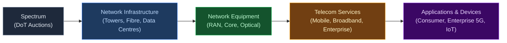

# Telecom & 5G Ecosystem in India — Value Chain Analysis

*Prepared: June 2026 | Framework: Porter Value Chain + Five Forces + Capital Cycle + GVC Governance + Blue Ocean*

---

## 0. Segment Definition

### Boundary

India's telecom value chain encompasses the full spectrum-to-application stack: spectrum procurement and allocation by the government, passive and active network infrastructure (towers, fibre, radio access networks), network equipment manufacturing (RAN, core, optical), device ecosystem (handsets, CPE, IoT endpoints), telecom services (mobile, broadband, enterprise), and the emerging 5G application layer (private networks, FWA, IoT, edge computing). The focus is particularly on the 5G transition — India commercially launched 5G in October 2022 and had crossed 250 million 5G subscribers by early 2025, with 5.18 lakh 5G base transceiver stations deployed across 99.9% of districts by December 2025.

### Core Product/Service Flow

### End Customers and What They Value

- **Consumer subscribers (~1.17 billion):** Affordable data, voice coverage, network speed/quality, device compatibility. India has the world's lowest average data tariffs — consumers are extremely price-sensitive but rapidly upgrading to 5G for speed and Fixed Wireless Access (FWA).
- **Enterprise/B2B buyers (banks, manufacturers, ports, mines):** SLA-backed uptime, private network isolation, low latency for automation, managed security, integration with enterprise systems. Willingness-to-pay is significantly higher.
- **Government/PSU:** Rural connectivity, digital public infrastructure, defence and homeland security networks.

### India's Global Position

**Challenger / Fast-Follower transitioning to Leader.** India is the world's 2nd largest telecom market by subscribers and crossed 250 million 5G users by early 2025 — the largest 5G base outside China. Jio runs the world's largest Standalone (SA) 5G network. India is now attempting to move from equipment importer to equipment exporter through the BSNL indigenous 4G/5G stack (TCS + C-DOT + Tejas Networks) and the PLI scheme for telecom equipment.

---

## 0.5 Quick Scan — Investable Listed Companies

| Company | Ticker | Cap Bucket | Chain Stage | One-Line Investment Thesis | Coverage |
|---|---|---|---|---|---|
| Bharti Airtel | NSE: BHARTIARTL | Large | MNO / Services | Premium ARPU franchise; each ₹10 ARPU increase = ~₹3,000 Cr incremental EBITDA; Africa optionality free | Well-covered |
| Reliance Industries | NSE: RELIANCE | Large | Full vertical stack | Jio IPO (DRHP expected H2 2026) will unlock hidden NAV; market undervalues Jio at conglomerate holdco discount | Well-covered |
| Indus Towers | NSE: INDUSTOWER | Large | Passive infra | Vi AGR relief reduces receivables overhang; dividend resumption from FY26; 5G densification = structurally higher tenancy ratio | Well-covered |
| Dixon Technologies | NSE: DIXON | Large | Device/EMS mfg | Electronics Component Mfg Scheme approval + HKC JV shifts Dixon from assembler to component maker — a structural re-rating trigger not in consensus | Well-covered |
| Tata Communications | NSE: TATACOMM | Large | Enterprise connectivity | Private 5G managed services ramp + data centre interconnect = margin expansion; market prices it as a legacy carrier | Moderate |
| Tejas Networks | NSE: TEJASNET | Mid | RAN/Optical equip | 1st international wireless order (NEC deal, Americas trial); order book ₹25,000 Cr with 24–36M visibility; international target 30% revenue by end-2026 — not in price | Moderate |
| HFCL | NSE: HFCL | Mid | OFC/Networking equip | Order book ₹21,200 Cr (Q4 FY26); PLI beneficiary; BharatNet Phase III and defence Wi-Fi catalyst in H2 FY27 | Moderate |
| Sterlite Technologies | NSE: STLTECH | Mid | Optical fibre cable | BharatNet Phase III launched May 2026 (₹1.5 lakh Cr) = multi-year fibre cable demand; order book doubled to ₹7,687 Cr FY26 | Moderate |
| ITI Limited | NSE: ITI | Mid | Govt telecom equip | BharatNet Phase III consortium; BSNL 4G/5G rollout; order book ₹16,180 Cr; PLI beneficiary; government capex insulated | Under-researched |
| Vodafone Idea | NSE: IDEA | Mid | MNO (distressed) | Binary bet: ₹20,000 Cr raise approval + ₹25,000 Cr SBI consortium = survival; if resolved, stock is multi-bagger from current; if not, near-zero | Well-covered |
| Exicom Tele-Systems | NSE: EXICOM | Small | Tower power infra | 5G densification = 3–5× more power nodes per km²; lithium-ion mandate structurally grows TAM; listed March 2024, under-researched | Under-researched |
| Suyog Telematics | NSE: SUYOG | Micro | Passive infra (niche) | 6,000-site BSNL order in final stages; Vi ₹45,000 Cr capex plan = significant Suyog pipeline; 70% EBITDA margin on expanding base | Under-researched |
| SAR Televenture | NSE SME: SARTELE | Micro (SME) | Tower installation | Eastern India focus; 5,000 small-site Vi deal; ₹356 Cr FY26 revenue at age 5; fastest-growing small tower installer | Undiscovered |
| GTL Infrastructure | NSE: GTLINFRA | Micro | Passive infra (legacy) | ~26,000 towers; financially stressed but operationally relevant; speculative recovery play if Vi/BSNL increase tenancy | Under-researched |
| Affle (3i) India | NSE: AFFLE | Large | Application/Adtech | Rides telecom data pipes; CPCU model insulated from tariff wars; emerging market expansion underpriced | Moderate |

**Under-researched opportunity:** The Small and Micro cap bucket — specifically Exicom Tele-Systems, Suyog Telematics, SAR Televenture, and GTL Infrastructure — has the most under-researched opportunity in this chain right now. These companies sit at the passive infrastructure and power layer of the 5G densification cycle, a segment with structural tailwinds (every new 5G small cell needs power + passive infra) but minimal institutional analyst coverage (0–3 reports each). The market is pricing Suyog and SAR at commodity-infrastructure multiples while their EBITDA margins (~70% and ~13% respectively) and growth rates (15–30% revenue CAGR) suggest a quality-infrastructure premium is warranted.

---

## 1. Value Chain Map — Primary Activities

### 1.1 Inbound Logistics: Spectrum Procurement & Infrastructure Sourcing

**What it involves:** Spectrum is India's foundational input — allocated by the Department of Telecommunications (DoT) via competitive auctions. The July–August 2022 5G auction raised ₹1.5 lakh crore (Jio: ₹88,000 Cr for 48% of spectrum sold; Airtel: ₹44,000 Cr; Vodafone Idea: ₹19,000 Cr; Adani Data Networks: ₹212 Cr). Additional inbound logistics include: sourcing 5G RAN equipment (primarily from Ericsson and Nokia as Huawei is effectively excluded from 5G), optical fibre cable from domestic and international suppliers, tower steel and civil works, and power infrastructure for base stations.

**Cost and differentiation drivers:**
- Spectrum cost is the single largest financial input — Jio's massive 2022 outlay gives it superior sub-GHz low-band coverage for deep rural penetration and mid-band (3.5GHz) capacity for urban 5G.
- Equipment vendor concentration (Ericsson/Nokia duopoly for 5G RAN) limits negotiating power for telcos, though large operators like Jio negotiate global frame agreements.
- Indigenous 5G stack (C-DOT/Tejas/TCS for BSNL) is a strategic inbound logistics disruption — if successful, it reduces dependence on foreign OEMs and creates cost competitive options.
- Power infrastructure is a structurally significant input — every BTS requires reliable DC power backup; lithium-ion battery packs are replacing legacy VRLA batteries as 5G densification and energy efficiency mandates intensify, with Exicom Tele-Systems (NSE: EXICOM) being India's leading listed supplier.

**Key Indian players:**
- Jio Infocomm (NSE: RELIANCE subsidiary) — largest spectrum holder post-2022 auction
- Bharti Airtel (NSE: BHARTIARTL) — strong mid-band + mmWave portfolio; acquired Adani Data Networks' mmWave spectrum (26GHz) in 2025
- Vodafone Idea (NSE: IDEA) — constrained spectrum position; relies heavily on 900MHz and 1800MHz
- BSNL (unlisted PSU) — spectrum granted administratively for rural coverage; 4G sites now upgraded via indigenous stack
- Tejas Networks (NSE: TEJASNET) — supplying indigenous 4G/5G RAN for BSNL rollout; PLI beneficiary
- Sterlite Technologies (NSE: STLTECH) — optical fibre cable manufacturer; key input supplier for backhaul
- HFCL (NSE: HFCL) — optical fibre and networking equipment; PLI beneficiary
- Exicom Tele-Systems (NSE: EXICOM) — DC power systems and lithium-ion energy storage for telecom towers; listed March 2024; PLI applied

---

### 1.2 Operations: Network Build, Maintenance & Service Delivery

**What it involves:** This is the core value-creating activity — building and operating the radio access network (BTS/gNodeB), transport/backhaul (fibre, microwave), and the core network (EPC for 4G, 5GC for standalone 5G). Includes tower construction, power management (DG sets, solar, grid), fibre laying, data centre operations (for edge and core), and 24x7 network operations centres (NOCs).

**Cost and differentiation drivers:**
- Tower sharing is critical for capex efficiency — without Indus Towers, per-operator tower capex would be 2-3x higher.
- Standalone vs. Non-Standalone 5G architecture is a key differentiation: Jio (SA) enables true network slicing and low-latency applications; Airtel (NSA, now migrating to SA by FY27) is faster to deploy but limits enterprise capabilities.
- Fibre backhaul density is the hidden bottleneck for 5G quality — only ~35% of India's towers are fiberised vs. 70%+ in China. BharatNet Phase III (launched May 2026, ₹1.5 lakh Cr) is the supply-side response.
- Power management is a critical but underappreciated operations cost driver — energy accounts for 30-35% of tower operating costs. The shift from diesel generators + VRLA batteries to solar + lithium-ion systems (supplied by Exicom, NSE: EXICOM) directly reduces opex for tower companies like Indus Towers and ATC India, and is increasingly mandated under TRAI's green telecom guidelines.
- Data centre footprint for edge computing is the next battleground as enterprise 5G applications require sub-10ms latency.

**Key Indian players:**
- Reliance Jio (NSE: RELIANCE) — 210M 5G subscribers (Q1 FY27 est.); Standalone 5G network; ~488M total subscribers; operates pan-India SA 5G
- Bharti Airtel (NSE: BHARTIARTL) — 153M 5G subscribers (FY26); NSA 5G in 1,000+ cities; migrating to SA; ₹1,74,559 Cr revenue FY25; EBITDA margin ~56%
- Vodafone Idea (NSE: IDEA) — ~193M subscribers; still largely 4G; FY26 revenue ~₹44,789 Cr; net loss ₹27,383 Cr in FY25; no meaningful 5G rollout yet; ₹20,000 Cr fundraise EGM approved June 2025
- BSNL (unlisted) — ~97,500 sites with indigenous 4G stack; government announced ₹47,000 Cr new capex plan FY26; 5G pilot in Delhi/Mumbai Dec 2025
- Indus Towers (NSE: INDUSTOWER) — 1.26 lakh towers; revenue ~₹29,588 Cr (FY24); market cap ~$12.1B (2026); shared passive infrastructure
- ATC India (unlisted subsidiary of American Tower Corp) — second largest tower company in India; ~70,000+ towers
- Tata Communications (NSE: TATACOMM) — international and domestic data connectivity; submarine cables; revenue ₹24,803 Cr (FY26); market cap ~₹56,684 Cr
- **Suyog Telematics (NSE: SUYOG)** — independent passive infra provider; ~5,900 towers across 26 states; 7,200 tenancies; specialises in poles, towers, OFC, and small cells; revenue ₹228 Cr (TTM FY26); EBITDA margin ~70%; market cap ~₹879 Cr; 6,000-site BSNL order in final negotiation
- **SAR Televenture (NSE SME: SARTELE)** — listed July 2024; installs and commissions towers primarily in eastern and northern India; signed deal with Vi for 5,000 small sites; FY26 revenue ₹356 Cr; profit ₹46.9 Cr
- **GTL Infrastructure (NSE: GTLINFRA)** — legacy independent tower company; ~26,000 towers; historically financially stressed but operationally relevant in circles where Indus has limited coverage
- **CloudExtel (unlisted)** — Network-as-a-Service provider; 6,500+ small cells across 500 cities; 12,000 km of fibre; FTTH to 1M+ homes; first neutral shared RAN infrastructure in India; raised ₹200 Cr debt (2025) to expand fibre and launch Data Centre Interconnect

---

### 1.3 Outbound Logistics: SIM Distribution, Handset Retail & Digital Activation

**What it involves:** Distributing SIM cards through retailer networks (millions of kiranas), handset distribution channels (modern trade, e-commerce, exclusive brand stores), digital app-based activation (instant KYC via Aadhaar-linked e-KYC), Fixed Wireless Access (FWA) CPE deployment, and enterprise circuit provisioning (MPLS, SD-WAN, leased lines).

**Cost and differentiation drivers:**
- Jio disrupted traditional SIM distribution by launching with ~130 million free SIMs in 2016 and now uses JioMart/JioPoints ecosystem.
- E-KYC via Aadhaar has collapsed the cost of SIM activation from ~₹200 to near-zero, enabling Jio's mass market penetration.
- FWA (Fixed Wireless Access) is the high-growth outbound channel — Jio's JioAirFiber targets 50M homes; Airtel's Xstream Air competes; both use 5G mmWave/mid-band to bypass the last-mile fibre gap.
- Device bundling and EMI schemes (JioPhone Next, partnering with Qualcomm/Google for sub-₹5,000 4G/5G smartphones) drive 5G device adoption.

**Key Indian players:**
- Reliance Jio — JioAirFiber (FWA CPE); JioMart distribution network; JioPhone ecosystem
- Bharti Airtel — Airtel Thanks app; Airtel Xstream Air (FWA); Airtel Digital TV retail network
- Dixon Technologies (NSE: DIXON) — contract manufacturer for 5G-capable smartphones and CPE; FY25 revenue ₹38,860 Cr; PLI beneficiary; top Make-in-India smartphone manufacturer; Electronics Component Manufacturing Scheme approval (2025) for 11 product segments
- Lava International (unlisted) — domestic smartphone brand; 4G/5G handsets; PLI beneficiary
- Samsung India (unlisted subsidiary) — largest 5G device market share in India; manufactures locally at Noida factory

---

### 1.4 Marketing & Sales: Subscriber Acquisition, ARPU Growth & Enterprise Deals

**What it involves:** Mass consumer marketing (brand building, tariff wars, bundled content), ARPU improvement through premium plan migrations (Jio's ₹206 ARPU vs. Airtel's ₹245 ARPU in FY25; industry wireless ARPU rose to ₹196 in Q1 FY27), enterprise/B2B sales (dedicated account managers, RFP responses for private networks, connectivity-as-a-service), and government tender participation.

**Cost and differentiation drivers:**
- India's ARPU remains among the lowest globally — Airtel at ₹245/month vs. global average of $15+ (₹1,250+). The tariff hike cycle (10–20% hike expected mid-2026 per Morgan Stanley) is the key ARPU lever; the 2024 hike was a first step.
- Jio's strategy is volume-first (488M subscribers at lower ARPU); Airtel's is value-first (390M subscribers at higher ARPU with premium positioning through network quality).
- Enterprise 5G is the next ARPU frontier — private network deals command ₹5-50 Cr/year per enterprise customer, vs. ₹2,500/year from a consumer.
- Content bundling (JioSaavn, JioCinema, Airtel Thanks) reduces churn and justifies premium pricing.

**Key Indian players:**
- Jio (NSE: RELIANCE) — price leader; largest subscriber base; content ecosystem
- Airtel (NSE: BHARTIARTL) — premium positioning; enterprise sales force (Airtel Business); Africa exposure
- Vodafone Idea — defensive; relies on legacy brand equity in certain circles; partnered with Microsoft Azure for enterprise cloud
- Tata Communications — enterprise-only; MOVE platform for private 5G; global MPLS backbone
- Affle (3i) India (NSE: AFFLE) — programmatic adtech platform riding on telecom data; revenue ~₹2,709 Cr; market cap ~₹20,401 Cr

---

### 1.5 Service: Customer Care, Managed Services & B2B Solutions

**What it involves:** Post-sale support (call centre, digital self-care apps), managed network services for enterprise (outsourced NOC, SD-WAN management, IoT connectivity management), Value-Added Services (VAS — music, OTT, gaming, insurance bundles), and B2B solutions (IoT SIM management, private 5G network-as-a-service, edge computing).

**Cost and differentiation drivers:**
- AI-driven self-care (chatbots, Jio's AI agent, Airtel's Thanks app) is reducing per-subscriber service cost.
- Managed services for enterprise (Tata Communications, Airtel Business) generate sticky, high-margin revenue — SLAs create exit barriers.
- After-sale enterprise support (private 5G SLA, edge computing uptime) is the differentiation frontier; most telcos are building dedicated enterprise service organisations.

**Key Indian players:**
- Tata Communications (NSE: TATACOMM) — global managed services; MOVE private 5G platform; Private 5G Global Centre of Excellence (India)
- Airtel Business — enterprise connectivity + cloud + security + IoT
- Jio Enterprise — enterprise 5G private networks; smart manufacturing; ports/logistics
- C-DOT (unlisted government R&D) — develops telecom standards and managed network software for BSNL; government-backed

---

## 2. Value Chain Map — Support Activities

### 2.1 Firm Infrastructure: Regulatory, Financial & Governance Framework

**Role:** TRAI (Telecom Regulatory Authority of India) sets tariff floors, QoS norms, and interconnect regulations. DoT issues Unified Licences and conducts spectrum auctions. The USO (Universal Service Obligation) Fund (~₹80,000 Cr corpus) subsidises rural connectivity and BharatNet. The Supreme Court's 2019 AGR ruling created a ₹1.6 lakh Cr liability for the industry, effectively crippling Vodafone Idea and nearly destroying the 3-player market structure. Government owns ~33% of Vodafone Idea post debt-to-equity conversion, making it a quasi-state enterprise. In June 2026, TRAI issued the draft Telecom Consumer Protection (13th Amendment) Regulation mandating proportionate pricing for voice-only plans.

**Where Indian firms are strong/weak:** Regulatory uncertainty (retrospective tax, AGR interpretation) is a persistent weakness. However, the government's 2023-24 telecom reforms (spectrum payment deferrals, right-of-way relaxation, 5G spectrum pricing) have been broadly positive. The AGR relief package (Dec 2025) reducing Vi's dues by 27% to ₹64,046 Cr and staggering repayments to FY36–FY41 is a structural positive for market stability. India's Digital Personal Data Protection Act (2023) adds data governance obligations.

**Notable institutions:** TRAI, DoT, Department for Promotion of Industry and Internal Trade (DPIIT — PLI scheme), Ministry of Electronics and IT (MeitY — BharatNet, Digital India), Telecom Disputes Settlement and Appellate Tribunal (TDSAT).

---

### 2.2 HR Management: Talent, Skills & Workforce

**Role:** Telecom requires a highly differentiated workforce: network engineers (RF, core, transmission), tower technicians, software engineers for OSS/BSS systems, data scientists for network analytics, enterprise sales specialists, and increasingly 5G application developers.

**Where Indian firms are strong/weak:** India has a large pool of software talent but limited RF/telecom hardware engineers. 5G-specific skills (network slicing, open RAN, NR configuration) are scarce. ITIs and NITs produce tower technicians, but the industry relies heavily on OEM training (Ericsson Academy, Nokia Bell Labs). The BSNL indigenous stack requires a new class of Indian 5G software engineers — C-DOT and IITs are the primary pipelines.

**Notable companies:** C-DOT (R&D workforce), IIT Bombay/Delhi (5G research), TCS Telecom CoE (systems integration talent), Ericsson India Training Academy.

---

### 2.3 Technology Development: 5G R&D, Open RAN & Private Networks

**Role:** This is the most strategically important support activity in the current cycle. Technology choices made now (SA vs. NSA, Open RAN vs. proprietary RAN, mmWave vs. mid-band) will determine competitive positions for the next decade. The DoT released a 6G Spectrum Roadmap in December 2025 covering short-term (2025–26), medium-term (2027–30), and long-term (2031–35) phases; 6G trials expected 2026–27; commercial deployment targeted ~2030.

**Where Indian firms are strong/weak:**
- **Jio's in-house 5G stack:** Reliance Jio, through JioTech, has developed its own Standalone 5G core and is exploring Open RAN-compatible radio units — a rare example of a telco building proprietary technology at scale.
- **BSNL's indigenous stack:** C-DOT (core), Tejas Networks (RAN), TCS (integration) have successfully demonstrated India can build a complete 4G/5G-ready stack — India is only the 5th country to achieve this. As of October 2025, 97,068 4G sites installed, 93,511 on-air; all equipment is technically 5G-upgradeable.
- **Open RAN push:** India's government is actively promoting Open RAN (through the O-RAN Alliance and domestic PLI) to reduce dependence on Ericsson/Nokia.
- **Weakness:** India has no domestic 5G chipset capability (Qualcomm and MediaTek dominate chipsets for both devices and small cells); no domestic optical transport chip.
- **Tejas international:** First commercial 5G wireless order in international markets (NEC deal; Americas trial); order book ~₹25,000 Cr entering FY27; target 30% international revenue by end-2026.

**Notable companies:** C-DOT (unlisted; government R&D), Tejas Networks (NSE: TEJASNET), HFCL (NSE: HFCL), Saankhya Labs (unlisted; Open RAN chipset startup; Tata group connection via Tejas), VVDN Technologies (unlisted; PLI beneficiary).

---

### 2.4 Procurement: Spectrum, Equipment & Fibre

**Role:** Procurement decisions shape cost structure for 10-15 year asset lives. Key procurement categories: spectrum (₹1.5 lakh Cr in 2022 alone), active RAN equipment (Nokia, Ericsson — 3-5 year replacement cycles), passive tower infrastructure (outsourced to Indus Towers/ATC), fibre cable (Sterlite Tech, HFCL, Corning India), power and energy, and enterprise IT systems (OSS/BSS — typically Amdocs, Netcracker, or TCS).

**Where Indian firms are strong/weak:** India has domestic optical fibre cable capacity (STLTECH, HFCL are global players). However, 5G RAN silicon, power amplifiers, and advanced optical transceivers remain 100% import-dependent. The PLI scheme (42 beneficiaries, 61 manufacturing units in 14 states, ₹57,000 Cr+ production by July 2024) has attracted Nokia, Ericsson (via Jabil), Samsung, and HFCL to manufacture in India. In power electronics for telecom, India has a competitive domestic player: Exicom Tele-Systems (NSE: EXICOM), which supplies DC power systems and lithium-ion batteries to Indus Towers, ATC India, and all three MNOs. BSNL's new ₹47,000 Cr capex plan (FY26 announcement) is the largest government procurement cycle in Indian telecom history.

**Notable companies:** Sterlite Technologies (NSE: STLTECH), HFCL (NSE: HFCL), Corning India (unlisted), ITI Limited (NSE: ITI), Bharat Electronics (NSE: BEL — defence telecom procurement), Exicom Tele-Systems (NSE: EXICOM — DC power systems and lithium-ion energy storage for telecom towers).

---

## 3. Five Forces + Capital Cycle Analysis

### Part A — Five Forces

**Force 1: Supplier Power — HIGH**

The 5G equipment supply chain exhibits extreme concentration. For 5G Radio Access Networks (RAN), India's telcos effectively have two credible vendors: Ericsson and Nokia. Huawei, which supplied a significant portion of 4G infrastructure, has been excluded from 5G rollouts due to national security concerns, eliminating a major price moderator. Samsung has a limited India 5G RAN presence (primarily through the BSNL indigenous stack pilot). This duopoly gives Ericsson and Nokia significant pricing power — global RAN equipment revenues have grown at double digits. Tower infrastructure adds another layer: Indus Towers, as the largest passive infrastructure provider with 1.26 lakh towers and a near-captive customer base (Jio, Airtel, Vi are all shareholders), has significant leverage on rental rates. Optical fibre is the exception — India has domestic manufacturing scale (STLTECH, HFCL) and global alternatives, keeping fibre cable competitive. Chipset supply (Qualcomm, MediaTek) is another high-power supplier segment with no domestic alternative.

**Force 2: Buyer Power — MEDIUM (BIFURCATED)**

Retail consumers (~1.17 billion) individually have negligible power but collectively enforce brutal price discipline — India's ARPU at ₹196–245/month is among the lowest globally. Number portability (MNP) enables churn, and the three-operator market means consumers have meaningful switching options; however, network quality inertia and SIM distribution density reduce actual churn rates. Enterprise buyers are a different story: large corporations, ports, factories, and smart city projects command significant negotiating power for private 5G networks, SLA-backed connectivity, and managed services — they can invite multiple bids, negotiate multi-year contracts, and switch providers at renewal. The government as a buyer (BharatNet, defence networks, railway communications) is perhaps the most powerful single buyer, using L1 (lowest bid) procurement that structurally compresses margins for equipment vendors.

**Force 3: Threat of New Entrants — LOW for MNOs, MEDIUM for vertically specialised layers**

Mobile Network Operator (MNO) entry is effectively blocked by the combination of spectrum scarcity (spectrum is licensed and auctioned at high cost — ₹1.5 lakh Cr in 2022), minimum rollout obligations, and the enormous capex required (a greenfield nationwide 5G network requires ₹50,000-80,000 Cr+ over 3-5 years). Adani Data Networks entered the 2022 auction but acquired only mmWave spectrum (enterprise-only band), failed to meet rollout obligations, and ultimately sold its spectrum to Airtel in 2025 — a cautionary tale. However, at the application and private network layers, entry barriers are lower: hyperscalers (AWS, Azure, Google Cloud) can combine cloud with edge computing to displace managed services; IT majors (TCS, Infosys, Wipro) can package enterprise 5G solutions as system integrators; and satellite operators (Starlink, OneWeb/Eutelsat) can serve niche rural and enterprise segments with LEO broadband. As of June 2026, Starlink, Eutelsat OneWeb, and Jio-SES all hold licences but none has commercially launched — pending spectrum allocation and 29 new DoT security regulations (May 2026).

**Force 4: Threat of Substitutes — MEDIUM AND RISING**

Wi-Fi 6/7 is the most direct substitute for indoor 5G — enterprise campuses, airports, malls, and factories can deploy private Wi-Fi 6 (802.11ax) at lower cost than private 5G, though without the mobility, SLA guarantees, or spectrum licensing advantages of licensed-band private networks. Fixed Wireless Access (FWA) via 5G is itself cannibalising fixed fibre broadband in under-fiberised geographies. Most significantly, Low Earth Orbit (LEO) satellite is an emerging structural substitute: Starlink (SpaceX), which received trial spectrum in September 2025 and started India commercial preparation, and OneWeb (Eutelsat/Bharti-backed) can deliver 25-220 Mbps to underserved areas, directly substituting rural mobile broadband. Jio (partnered with SES for JioSpaceFiber) and Airtel (partnered with Starlink for distribution) have shrewdly decided to embrace satellite as a complementary channel rather than fight it.

**Force 5: Rivalry Intensity — VERY HIGH**

India's telecom market has effectively consolidated from 12 operators in 2016 to 3 private operators (Jio, Airtel, Vodafone Idea) plus state-owned BSNL — an oligopoly. Yet rivalry intensity remains extreme because: (a) Jio's price-leadership strategy has kept tariffs structurally depressed — the 2024 tariff hikes were a watershed, but another 10–20% hike is expected in mid-2026 and ARPU remains far below global peers; (b) Vodafone Idea is financially distressed (net loss ₹27,383 Cr in FY25) creating irrational competitive behaviour as it fights for survival; (c) 5G capex requirements intensify cash burn — Jio and Airtel combined spent ₹2.5+ lakh Cr on spectrum and 5G network build; (d) subscriber market share is zero-sum in the mass market; and (e) the enterprise 5G market, though smaller today, is the next battleground with all three operators plus Tata Communications competing aggressively.

### Five Forces Summary Table

| Force | Intensity | Key Driver |
|---|---|---|
| Supplier Power | High | Ericsson/Nokia 5G RAN duopoly; tower company leverage; chipset import dependence |
| Buyer Power | Medium | Bifurcated: retail buyers collectively powerful via price sensitivity; enterprise buyers individually powerful |
| New Entrants | Low (MNO) / Medium (layer-specific) | Spectrum cost and capex barriers deter MNOs; enterprise/application layer more open |
| Substitutes | Medium and Rising | Wi-Fi 6/7 for indoor; LEO satellite for rural; OTT as functional substitute for voice/SMS |
| Rivalry | Very High | Price-led oligopoly; financially distressed Vi; 5G capex burn; zero-sum mass market |

**Overall Structural Attractiveness: LOW-MEDIUM.** India's telecom industry is structurally unattractive at the MNO level — high supplier power, brutal rivalry, low ARPU, and massive capex requirements consistently destroy shareholder value (Jio excluded, given Reliance's cross-subsidy capacity). Value is captured above (by Ericsson, Nokia, Qualcomm) and below (by OTT players — Google, Meta, Netflix riding on telco pipes for free) with telcos squeezed in the middle. The exception is at the infrastructure layer (Indus Towers, with stable rental yields) and at the enterprise connectivity/managed services layer (Tata Communications, Airtel Business), where differentiation and switching costs are higher.

**Capital cycle phase: Transitioning from Inflow to Neutral/Early Outflow.** Capital is no longer flooding in — 5G site addition rates fell from ~111,000/quarter in Q2 FY24 to ~8,000–9,000/quarter in Q2-Q3 FY25, and overall capex is expected to taper from ₹59,300 Cr (FY25) toward ₹35,000–40,000 Cr annually. This is the transition from rollout to monetisation — the early-recovery phase for tower companies and equipment suppliers.

**Investor stance: Selective — Accumulate infrastructure layer; Avoid MNO equity (except Airtel for ARPU compounding).** The infrastructure layer (Indus Towers, Suyog, Exicom) is the most structurally attractive right now — capex cycle peaking means free cash flow improvement ahead. Equipment suppliers with export optionality (Tejas, HFCL) offer a risk-adjusted entry. Avoid Vodafone Idea unless the ₹20,000 Cr raise closes definitively; avoid GTL Infrastructure unless purely speculative.

---

### Part B — Capital Cycle Verdict

Indian telecom infrastructure capex peaked in FY24 when 5G rollout was at its most intense, and the industry is now entering the monetisation phase — quarterly site additions have collapsed ~93% from peak, and analyst consensus expects annual capex to taper ~30–40% from peak levels through FY26–27. This is the transition from Late Inflow to Early Outflow — the phase when passive infrastructure (towers, fibre) begins generating improving free cash flows as the new assets are sweated, while equipment vendors' order cycles are transitioning from domestic BSNL/BharatNet government orders to the more durable international export cycle. The single clearest signal that the recovery phase is upon us: Indus Towers is expected to resume dividends from FY26, and HFCL's order book doubled in FY26 even as the peak 5G domestic rollout decelerated, suggesting BharatNet Phase III and export demand are filling the gap.

---

### Part C — Investor Implication

The combined Five Forces + Capital Cycle picture points to a selective accumulation stance focused on the infrastructure-adjacent segments rather than MNO equity. The most structurally attractive stage right now is passive infrastructure (Indus Towers, Suyog Telematics) and power infra (Exicom) — these are annuity revenue businesses entering a free cash flow improvement phase as the capex-heavy rollout cycle peaks. The second most attractive is telecom equipment with export optionality (Tejas Networks, HFCL) — the domestically-driven BSNL cycle is maturing but the international export cycle is just beginning, and the market has not yet priced this transition. Avoid pure MNO equity at current valuations except Airtel, where the ARPU compounding story (₹245 toward ₹300+) provides a credible 20–30% EBITDA growth path. The single biggest risk to the entire thesis is a sustained delay in Vi's fundraising resolution — if Vi enters insolvency proceedings rather than raising capital, Indus Towers faces a major tenancy write-off, Suyog and SAR lose their largest marginal customer, and the 2-player oligopoly (Jio + Airtel) dampens the tariff hike urgency that underpins the ARPU story.

---

## 4. GVC Governance & India's Position

### Global Lead Firms

**Equipment layer (Captive/Modular governance):**
- **Ericsson (Sweden)** — governs global 5G RAN standards through 3GPP; sets technical specifications that all RAN vendors must comply with; dominates Airtel's RAN supply chain in India.
- **Nokia (Finland)** — major 5G RAN and core supplier; supplies Jio's RAN (in partnership); PLI beneficiary through India manufacturing.
- **Qualcomm (USA)** — governs 5G device chipsets (Snapdragon X series); every 5G smartphone in India uses Qualcomm or MediaTek chipsets; no Indian alternative exists.
- **Samsung Electronics (South Korea)** — governs premium 5G device market; manufactures in Noida; growing RAN presence (supplied BSNL pilot).

**Device layer (Market governance):**
- Apple (iPhone), Samsung, and increasingly Chinese OEMs (Xiaomi, Oppo, Vivo — though under scrutiny) govern the premium-to-mid-range device market. India has no domestic smartphone chip or OS.

**Application layer (Relational/Modular governance):**
- Google (Android OS, Google Play), Meta (WhatsApp/Instagram on telco pipes), Netflix, Amazon Prime Video — these hyperscalers are the largest beneficiaries of India's data growth while paying nothing to telcos (the "free rider" OTT problem that TRAI periodically addresses).

### Governance Type

**Predominantly Captive (for major telcos) + Modular (for equipment supply chain).**
- Jio exemplifies a Captive governance model: it built its own network, developed its own OSS/BSS, is building its own 5G core (JioTech), and has its own device ecosystem (JioPhone), content (JioCinema/JioSaavn), and distribution. This vertical integration is unusual globally.
- For equipment procurement, Indian telcos operate in a Modular relationship with Nokia/Ericsson — they follow global 3GPP standards but source equipment competitively (limited by the 2-vendor choice).
- The BSNL indigenous stack represents an attempt at Hierarchy governance — the state owns the technology stack (C-DOT core, Tejas RAN), controls the system integrator (TCS), and owns the operator (BSNL).

### Value Capture Map

| Chain Stage | Margin Level | Who Captures Value |
|---|---|---|
| Spectrum | Government revenue (not private value) | DoT/Government of India |
| Tower infrastructure | Medium-High (Indus: ~40-42% EBITDA margin) | Indus Towers, ATC India |
| 5G RAN equipment | High (Ericsson/Nokia: ~13-15% EBIT margins) | Ericsson, Nokia — value exported to Sweden/Finland |
| Optical fibre | Low-Medium (STLTECH: ~8-12% EBITDA) | STLTECH, HFCL — some domestic capture |
| Device manufacturing | Low (EMS/contract: ~3-5% EBITDA) | Dixon (contract), OEMs (Apple/Samsung capture brand premium) |
| Mobile services (MNO) | Low-Medium (Jio: ~48% EBITDA; Vi: negative) | Jio and Airtel capture modest margin; Vi destroys value |
| Enterprise managed services | Medium-High (~20-25% EBITDA) | Tata Communications, Airtel Business |
| OTT applications | Very High | Google, Meta, Netflix — not Indian entities |

**Key insight on value capture:** India's telcos are "dumb pipe" operators in the consumer segment — they carry the traffic that Google, Meta, and Netflix monetise, while bearing all infrastructure cost. The strategic prize is enterprise 5G private networks and managed services, where telcos can embed in customer operations and capture higher margins.

### India's Upgrade Trajectory

India is on an accelerated **functional upgrade** trajectory:
1. **Process upgrade (done):** India's telcos have adopted global 5G network operations processes (automated NOCs, AI-driven SON — Self-Organising Networks).
2. **Product upgrade (in progress):** Tejas Networks (Jio/TATA group) has developed indigenous optical transport and RAN products; C-DOT has built a 5GC core — India is moving from product importer to product manufacturer. First international 5G wireless order signed in FY26 (Tejas + NEC for Americas).
3. **Functional upgrade (emerging):** The BSNL indigenous stack is India's most ambitious attempt to capture R&D and design functions domestically. Jio's in-house 5G stack development puts it among a handful of telcos globally that own their technology.
4. **Chain upgrade (nascent):** India is beginning to export telecom technology — Tejas Networks targets 30% international revenue by end-2026; C-DOT is offering its 5G stack to developing countries (part of India's digital diplomacy). This mirrors the UPI digital diplomacy playbook.

---

## 5. Key Linkages & Leverage Points

### Critical Linkage 1: Spectrum Cost ↔ ARPU Viability
Telcos paid ₹1.5 lakh Cr in the 2022 auction — this debt service burden (~₹15,000-18,000 Cr/year across operators) directly constrains their ability to reduce tariffs. The AGR crisis (₹1.6 lakh Cr liability industry-wide) compounds this. For India's telecom industry to be financially sustainable, ARPU must rise from ~₹200 to ₹300+ by FY27 — the 2024 tariff hike was a first step; analysts expect a further 10–20% hike in mid-2026. **If ARPU does not rise, spectrum investment cannot generate adequate returns, deferring future auction participation and weakening network quality.**

### Critical Linkage 2: Tower Sharing ↔ Capex Efficiency
The existence of Indus Towers (shared passive infrastructure) has allowed India to deploy network infrastructure at 40-50% lower capex than a non-sharing model. However, Vodafone Idea's financial distress (non-payment of tower rental dues) creates systemic risk — Indus Towers has provisioned significant Vi receivables (₹3,548 Cr doubtful receivables as of September 2025, down from ₹5,386 Cr in March 2024, showing improvement following Vi's AGR relief). If Vi collapses, Indus loses a major tenant and Jio/Airtel face tower shortage in Vi's abandoned coverage areas.

### Critical Linkage 3: Fibre Backhaul Density ↔ 5G Network Quality
5G's promise of multi-Gbps speeds and sub-millisecond latency depends critically on fibre-connected base stations. India currently has only ~35% of towers fiberised (vs. 70-80% in South Korea/China). This is the primary reason India's 5G speeds (~100-250 Mbps average) lag behind theoretical maximums. **BharatNet Phase III (officially launched May 2026, ₹1.5 lakh Cr, connecting remaining gram panchayats) is the supply-side response**, but last-mile fibre-to-tower remains a gap, especially in Tier-2/3 cities.

### Critical Linkage 4: Device Ecosystem ↔ 5G Adoption
5G subscriber growth is gated by 5G device penetration. India had 250M+ 5G subscribers by early 2025 largely because mid-range 5G smartphones (₹12,000-25,000) became mainstream in 2023-24, driven by PLI scheme-enabled local manufacturing (Dixon + Xiaomi, Motorola + Flex India) and JioPhone Next. The indigenisation of 5G device manufacturing (Dixon: ₹38,860 Cr revenue FY25) reduces device costs and accelerates the device upgrade cycle. Dixon's Electronics Component Manufacturing Scheme approval (2025) for 11 product segments signals the next phase: component manufacturing, not just assembly.

### Critical Linkage 5: Enterprise 5G Standards ↔ Private Network Deployment
Enterprise 5G (private networks) requires clear spectrum policy (dedicated enterprise spectrum vs. shared use), standardised interfaces (open APIs for vertical integration), and available system integrators. TRAI's recommendation for allowing enterprises direct spectrum access (captive private networks) without mandatory telco intermediation is a key policy linkage — if approved, it could catalyse large-scale private 5G deployments in manufacturing, mining, and logistics, bypassing MNOs entirely.

### Critical Linkage 6: Small Cell Densification ↔ Independent Tower Companies
5G mid-band (3.5GHz) and mmWave (26GHz) signals have short propagation ranges — dense urban 5G coverage requires 5–10× more sites per km² than 4G. This creates a structural growth opportunity for independent passive infrastructure providers (IPPs) beyond Indus Towers. Niche operators — **Suyog Telematics** (small cells + poles + OFC, 26 states), **SAR Televenture** (tower installation, eastern India), **CloudExtel** (6,500+ small cells, NaaS model), and **Ascend Telecom** (~18,600 towers) — fill this gap. Their growth is directly linked to Vi's ability to fund network capex, BSNL's government-backed 4G/5G rollout, and TRAI's right-of-way reforms. **If the independent tower ecosystem is not scaled, 5G coverage in Tier-2/3 cities and rural areas will remain patchy regardless of spectrum allocation.**

### Single Highest-Leverage Intervention
**Accelerate fiberisation of telecom towers to 70%+ by 2027.** This single intervention unlocks: (a) true 5G speeds (from ~150 Mbps average to 500+ Mbps), driving consumer ARPU uplift through premium plans; (b) enables enterprise private 5G with the latency (<5ms) required for robotic automation; (c) makes FWA competitive with cable broadband, expanding the addressable market; and (d) creates ₹50,000+ Cr in fibre cable/deployment orders for domestic companies (STLTECH, HFCL, ITI). BharatNet Phase III (launched May 2026, ~₹1.5 lakh Cr, connecting 6.4 lakh villages) is the government's vehicle, but private operator fiberisation incentives (right-of-way reforms, USO fund matching grants) need acceleration.

---

## 5.5 Upcoming Catalysts & Key Triggers

| Catalyst / Trigger | Timeline | Companies Likely to Benefit |
|---|---|---|
| **Jio IPO DRHP filing** — DRHP filing expected H2 2026; actual IPO possibly H2 FY27; Reliance 49th AGM (June 2026) expected to provide clarity; fresh issue of ₹25,000 Cr; post-IPO valuation estimated $133–180B | H2 2026 – H1 FY27 | NSE: RELIANCE (NAV uplift); NSE: BHARTIARTL (sector re-rating); NSE: INDUSTOWER (institutional flows into India telecom infra) |
| **Vi ₹20,000 Cr equity raise + ₹25,000 Cr SBI-led term loan closing** — EGM approved June 2025; SBI consortium finalisation is the critical binary; if closed, Vi's ₹45,000 Cr 3-year capex plan begins activating; closes existential risk for independent tower operators | Q2–Q3 FY27 | NSE: IDEA (multi-bagger if resolved), NSE: INDUSTOWER (receivables recovery), NSE: SUYOG (Vi tower pipeline), NSE SME: SARTELE (5,000 small-site deal), NSE: GTLINFRA (tenancy recovery) |
| **BharatNet Phase III order awards** — Phase III officially launched May 24, 2026; ₹1.5 lakh Cr PPP model; orders being awarded in waves; Creative Newtech, ITI, RailTel already won Odisha and other circles; remaining orders across 28 states | Q2 FY27 – Q4 FY27 | NSE: ITI (BSNL/BharatNet preferred vendor), NSE: HFCL (OFC + networking), NSE: STLTECH (fibre cable; order book already doubled), NSE: TEJASNET (optical transport), NSE: RELIANCE (JioFiber last-mile) |
| **BSNL 5G commercial launch in Delhi/Mumbai** — targeted December 2025 (delayed); BSNL has 97,500+ 4G sites on-air; government announced ₹47,000 Cr new capex plan; 5G upgrade of all 4G sites planned within 8 months of Delhi/Mumbai launch | H1 FY27 | NSE: TEJASNET (5G upgrade orders for BSNL RAN), NSE: HFCL (networking and OFC for BSNL), NSE: ITI (BSNL supply chain), NSE: SUYOG (BSNL tower portfolio expansion — 6,000 sites under negotiation) |
| **Satellite spectrum allocation + Starlink India commercial launch** — TRAI recommended 4% AGR charge; DoT issued 29 new security regulations May 2026; trial spectrum allocated September 2025; commercial launch pending security clearances; Airtel has distribution partnership with Starlink | H2 FY27 | NSE: BHARTIARTL (Starlink distribution revenue + enterprise rural connectivity), NSE: RELIANCE (JioSpaceFiber via SES), NSE: TATACOMM (enterprise satellite backhaul), unlisted: Starlink India, OneWeb India |
| **Industry-wide tariff hike ~10–20%** — Morgan Stanley assumes 16–20% hike across 4G and 5G plans (prepaid and postpaid) in 2026; Jio, Airtel, Vi all expected to participate; incremental ARPU of ₹20–40/subscriber; Airtel's ₹10 ARPU = ~₹3,000 Cr incremental EBITDA | Mid-2026 (imminent) | NSE: BHARTIARTL (highest ARPU leverage), NSE: RELIANCE (Jio EBITDA expansion), NSE: INDUSTOWER (rental escalations linked to operator revenue), NSE: IDEA (liquidity lifeline if ARPU improves before fundraise closes) |
| **DoT 6G Spectrum Roadmap implementation — upper 6 GHz band allocation for IMT** — NFAP-2025 released; WRC-27 alignment; upper 6 GHz for future 5G/6G; lower 6 GHz delicensed for Wi-Fi 7; 6G trials expected 2026–27 | FY27 – FY28 (policy), FY30 (commercial) | NSE: TEJASNET (R&D for future RAN; Saankhya Labs satellite-direct integration), NSE: HFCL (Wi-Fi 7 products if 6 GHz delicensed), long-term: C-DOT derivatives |
| **Tejas Networks first international revenue from wireless products** — First commercial 5G wireless order (NEC deal, Americas); trials with operator in Americas; target 30% international revenue by end-FY27; order book ₹25,000 Cr with 24–36M visibility | Q3-Q4 FY27 | NSE: TEJASNET (direct — major multiple re-rating if exports scale; market currently prices Tejas as BSNL-captive) |

---

## 6. Indian Company Landscape

### Listed Companies

| Stage | Company | Ticker | Cap Bucket | Revenue / Mkt Cap | PLI? | Coverage | Chain Position |
|---|---|---|---|---|---|---|---|
| MNO / Full Stack | Bharti Airtel Ltd | NSE: BHARTIARTL | Large | Rev: ₹1,74,559 Cr (FY25); Mkt cap ~₹10.5 lakh Cr | No | Well-covered | Leader |
| MNO (distressed) | Vodafone Idea Ltd | NSE: IDEA | Large | Rev: ₹44,789 Cr (FY26); Mkt cap ~₹30,000 Cr | No | Well-covered | Challenger (distressed) |
| Passive Tower Infra | Indus Towers Ltd | NSE: INDUSTOWER | Large | Rev: ~₹29,588 Cr (FY24); Mkt cap ~$12.1B | No | Well-covered | Leader |
| Device/EMS Mfg | Dixon Technologies (India) Ltd | NSE: DIXON | Large | Rev: ₹38,860 Cr (FY25); Mkt cap ~₹70,000 Cr | Yes | Well-covered | Leader (EMS) |
| Enterprise Connectivity | Tata Communications Ltd | NSE: TATACOMM | Large | Rev: ₹24,803 Cr (FY26); Mkt cap ~₹56,684 Cr | No | Moderate | Leader (enterprise) |
| MNO Parent / Full Stack | Reliance Industries Ltd | NSE: RELIANCE | Large | Rev: ₹9.27 lakh Cr consolidated (FY25); Mkt cap ~₹17 lakh Cr | No | Well-covered | Leader |
| Adtech / App Layer | Affle (3i) India Ltd | NSE: AFFLE | Large | Rev: ~₹2,709 Cr; Mkt cap ~₹20,401 Cr | No | Moderate | Niche (app layer) |
| RAN / Optical Equip | Tejas Networks Ltd | NSE: TEJASNET | Mid | Rev: ₹8,923 Cr (FY25); order book ₹25,000 Cr | Yes | Moderate | Challenger |
| OFC / Networking | HFCL Ltd | NSE: HFCL | Mid | Rev: ~₹4,200 Cr (FY25); order book ₹21,200 Cr (Q4 FY26); Mkt cap ~₹10,000 Cr | Yes | Moderate | Challenger |
| Optical Fibre Cable | Sterlite Technologies Ltd | NSE: STLTECH | Mid | Rev: ₹1,441 Cr (FY26); order book ₹7,687 Cr; Mkt cap ~₹5,000 Cr | No | Moderate | Niche |
| Govt Telecom Equip (PSU) | ITI Limited | NSE: ITI | Mid | Rev: ₹3,616 Cr (FY25 +186% YoY); order book ₹16,180 Cr; Mkt cap ~₹12,000 Cr | Yes | Under-researched | Niche (govt-focused) |
| Defence / Govt Telecom | Bharat Electronics Ltd | NSE: BEL | Large | Rev: ~₹21,690 Cr (FY25); Mkt cap ~₹2.1 lakh Cr | No | Well-covered | Niche (defence) |
| Tower Power Infra | Exicom Tele-Systems Ltd | NSE: EXICOM | Small (Recently listed FY24) | Mkt cap ~₹3,500–4,500 Cr; rev not separately disclosed | Applied | Under-researched | Niche (critical input) |
| Passive Tower Infra | Suyog Telematics Ltd | NSE: SUYOG | Micro | Rev: ₹228 Cr (TTM FY26); Mkt cap ~₹879 Cr; EBITDA ~70% | No | Under-researched | Niche (emerging) |
| Tower Installation | SAR Televenture Ltd | NSE SME: SARTELE | Micro (SME, Recently listed FY24) | Rev: ₹356 Cr (FY26); PAT ₹46.9 Cr; mkt cap unconfirmed | No | Undiscovered | Emerging |
| Passive Tower Infra (legacy) | GTL Infrastructure Ltd | NSE: GTLINFRA | Micro | Rev/mkt cap not at current public filings | No | Under-researched | Niche (distressed) |

### Unlisted / Private Companies

| Stage | Company | Type | Business Description | Scale | Notes |
|---|---|---|---|---|---|
| MNO (PSU) | BSNL (Bharat Sanchar Nigam Ltd) | Unlisted PSU | State-owned telco; 97,500+ sites with indigenous 4G stack (TCS+C-DOT+Tejas); 5G pilot Dec 2025; ₹47,000 Cr new capex FY26 | Not publicly disclosed | Government backstop; largest single buyer in Indian telecom |
| Telecom R&D | C-DOT (Centre for Development of Telematics) | Government entity | Government telecom R&D organisation; developed EPC core for BSNL's indigenous 4G/5G stack; exports stack to Global South countries | Not publicly disclosed | Strategic; government |
| RAN Equipment (MNC) | Nokia India Pvt Ltd | MNC subsidiary | Supplies 5G RAN equipment to Jio and Airtel; PLI beneficiary for local manufacturing | Part of Nokia global | Sweden-based; PLI manufacturer |
| RAN Equipment (MNC) | Ericsson India Pvt Ltd | MNC subsidiary | Supplies 5G RAN to Airtel and Vi; PLI beneficiary via Jabil | Part of Ericsson global | Sweden-based; PLI manufacturer |
| Device (MNC) | Samsung India Electronics Pvt Ltd | MNC subsidiary | Manufactures 5G smartphones locally in Noida; leading 5G device market share in India | Part of Samsung global | South Korea-based |
| Satellite / LEO | Starlink India (SpaceX subsidiary) | Private/MNC | LEO satellite broadband; trial spectrum allocated September 2025; commercial launch pending DoT security clearances; distribution via Airtel | Not publicly disclosed | Pre-launch; regulatory risk |
| Satellite / GEO | OneWeb India (Eutelsat / Bharti-backed) | Private/MNC | LEO satellite broadband; DoT licensed; Bharti Enterprises as anchor shareholder | Not publicly disclosed | Emerging |
| Handset Manufacturing | Lava International Ltd | Private | Indian smartphone brand; 4G/5G devices; PLI beneficiary | Not publicly disclosed | Pre-IPO rumoured |
| MNO Application Layer | Jio Platforms Ltd | Private (subsidiary of RELIANCE) | Holds Jio Infocomm (telco) + JioCinema, JioSaavn, JioMart + JioTech; Standalone 5G operator; IPO DRHP expected H2 2026 | Rev: ~₹1,38,000 Cr (est. FY25 consolidated) | DRHP imminent; will be India's largest IPO |
| Open RAN Chipsets | Saankhya Labs Pvt Ltd | Private (VC/Tata-linked) | Indian startup developing Open RAN-compatible chipsets and software defined radio; now part of Tejas/Tata group ecosystem | Not publicly disclosed | Emerging |
| Telecom IT/OSS | VVDN Technologies | Private (PLI beneficiary) | Product engineering + telecom equipment manufacturing; Open RAN development | Not publicly disclosed | PLI beneficiary |
| Small Cell / NaaS | CloudExtel Pvt Ltd | PE-backed | NaaS provider; 6,500+ small cells in 500 cities; 12,000 km fibre; first neutral shared RAN in India; raised ₹200 Cr debt (2025) for fibre + data centre interconnect expansion | Not publicly disclosed | Pre-IPO potential |
| Passive Tower Infra | Ascend Telecom Infrastructure | PE-backed | India's large independent tower company (~18,600 towers); passive infra for all major MNOs | Not publicly disclosed | PE-owned |
| Passive Tower Infra | Pratap Technocrats Pvt Ltd | Private | Telecom infrastructure management across 21 states since 1998; tower installation, fibre, and project execution | Not publicly disclosed | Niche |

---

### Notable Companies — Deeper Notes

**Reliance Jio / Jio Platforms (NSE: RELIANCE)**
- **Stage in chain:** Full vertical stack — spectrum, network, devices, content, applications
- **Cap bucket:** Large — Reliance Industries Mkt cap ~₹17 lakh Cr (conglomerate); Jio Platforms estimated $133–180B post-IPO
- **Analyst coverage:** Well-covered (Reliance as conglomerate); Jio as standalone: pre-IPO limited
- **What makes them interesting:** Jio is unique globally — a telco that built its own network from scratch (greenfield, all-IP), avoided legacy 2G/3G infrastructure, ran the world's largest free SIM launch in 2016, and is now operating the world's largest Standalone 5G network. With 488 million subscribers and 210M+ 5G users, it has achieved scale no other non-Chinese telco has matched. The Starlink distribution partnership (2025) shows strategic flexibility. The government issued amended listing rules in March 2026 allowing companies >₹5 lakh Cr to list with 2.5% public float — clearing the regulatory path for Jio's IPO.
- **Key financials:** Jio Q4 FY25: net profit ₹7,022 Cr (+25.7% YoY); ARPU ₹206.2; ~₹1.38 lakh Cr estimated FY25 revenue (Jio Platforms consolidated); fresh issue ₹25,000 Cr planned
- **PLI beneficiary:** No
- **Watch factor:** DRHP filing date — once DRHP is filed (expected H2 2026), the NAV discount in RELIANCE narrows materially. Jio IPO will be India's largest listing and will attract global institutional flows into the telecom sector.
- **Investment angle:** The market values Jio inside Reliance at a 20–30% conglomerate holdco discount relative to its standalone fair value ($133–180B). A DRHP filing immediately catalyses NAV discovery — RELIANCE shareholders get this optionality at no incremental cost. Additionally, the 2026 tariff hike cycle (10–20%) adds ~₹3,000–5,000 Cr to Jio's EBITDA per ₹10 ARPU increase from its 488M subscriber base, which is similarly not priced into consensus estimates that assume a flat-ARPU base case.

**Bharti Airtel (NSE: BHARTIARTL)**
- **Stage in chain:** MNO (India + 14 African countries); passive infra (Indus Towers ~42% stake); enterprise services (Airtel Business)
- **Cap bucket:** Large — Mkt cap ~₹10.5 lakh Cr
- **Analyst coverage:** Well-covered
- **What makes them interesting:** Airtel has executed a disciplined "quality over quantity" strategy — it trails Jio in subscribers (390M vs. 488M) but leads on ARPU (₹245 vs. ₹206) and consistently tops network quality surveys (Opensignal). Its Africa business (~30% of revenue) is a structural differentiator. The acquisition of Adani's 26GHz mmWave spectrum in 2025 gives it a private enterprise 5G edge. Airtel is migrating from NSA to SA 5G architecture, which will unlock network slicing and enterprise-grade private 5G capabilities — an incremental capex cycle beginning FY27 per JP Morgan.
- **Key financials:** FY25 revenue ₹1,74,559 Cr (+15.3% YoY); EBITDA margin ~56%; 5G subscribers 153M (FY26 est.)
- **Watch factor:** ARPU trajectory — each ₹10 ARPU increase adds ~₹3,000 Cr annualised EBITDA; the mid-2026 tariff hike is the single most important near-term catalyst for BHARTIARTL.
- **Investment angle:** Consensus models embed ARPU of ₹260–275 by FY27; if the 16–20% tariff hike (Morgan Stanley base case) materialises, ARPU could reach ₹285–295 by FY27 — a 5–10% beat that compounds into a 15–20% EBITDA beat vs. consensus. The Africa business (Airtel Africa, separately listed in London) provides a free option on Sub-Saharan Africa's mobile data growth — this division alone would trade at a significant premium if listed independently in India.

**Tejas Networks (NSE: TEJASNET)**
- **Stage in chain:** Network equipment — optical transport + 5G RAN (4G/5G base stations for BSNL)
- **Cap bucket:** Mid — Mkt cap not disclosed separately from parent Tata Sons ownership; listed entity Tejas Networks
- **Analyst coverage:** Moderate
- **What makes them interesting:** Tejas is India's most strategically important listed telecom equipment company. Acquired by Tata Sons in 2021, it is now the RAN supplier for the BSNL indigenous 4G/5G stack alongside C-DOT. FY25 revenue surge (₹8,923 Cr, driven by BSNL rollout) validates the indigenous stack strategy. Critically, Tejas signed its first commercial 5G wireless order in international markets in FY26 (NEC deal; Americas trial) — the market is still pricing Tejas as a BSNL-captive entity, not as an emerging global telecom equipment exporter. Order book entering FY27: ~₹25,000 Cr with 24–36M revenue visibility. Saankhya Labs integration adds satellite IoT and direct-to-mobile capabilities.
- **Key financials:** FY25 revenue ₹8,923 Cr; net profit ₹447 Cr; order book ₹25,000 Cr (FY26 entry)
- **PLI beneficiary:** Yes
- **Watch factor:** International wireless revenue in Q3-Q4 FY27 — if Tejas reports >5% of revenue from international wireless, the re-rating from "BSNL-captive" to "emerging global equipment vendor" could be significant.
- **Investment angle:** The market values Tejas on BSNL execution risk (single government customer = concentration risk = discount multiple). What the market is not pricing: (1) Tejas has the only commercially deployed indigenous 5G RAN product in the world outside the top-5 traditional vendors — a geopolitical asset as Global South countries seek non-Western, non-Chinese 5G vendors; (2) the international expansion roadmap (30% international revenue target by end-FY27) is in its early stages with the first commercial wireless win just announced; (3) BharatNet Phase III is a second domestic order wave independent of BSNL, providing a bridge. A scenario where Tejas achieves ₹1,000–2,000 Cr in international wireless revenue by FY28 would be a transformative re-rating from current multiples.

**Indus Towers (NSE: INDUSTOWER)**
- **Stage in chain:** Passive tower infrastructure — cell towers, ground-based masts, rooftop sites
- **Cap bucket:** Large — Mkt cap ~$12.1B (₹1 lakh Cr+)
- **Analyst coverage:** Well-covered
- **What makes them interesting:** Indus is India's infrastructure-as-a-service story in telecom. With 1.26 lakh towers (largest tower company in India by count), it earns recurring rental income from Jio, Airtel, and Vi — a classic annuity business with 40-42% EBITDA margins. The Vi AGR relief (dues reduced 27%, repayments deferred to FY36–FY41) has materially reduced Indus' receivable risk — doubtful receivables fell from ₹5,386 Cr (March 2024) to ₹3,548 Cr (September 2025) and are expected to continue declining. Analysts expect Indus to resume dividends from FY26, making it an income as well as growth story.
- **Key financials:** Revenue ~₹29,588 Cr (FY24); market cap ~$12.1B (2026); tenancy ratio 1.63x; net tenancy additions 4,505 in most recent quarter
- **PLI beneficiary:** No
- **Watch factor:** Vi's fundraising resolution — the ₹20,000 Cr equity raise + SBI term loan determines whether Vi becomes a net asset or net liability for Indus. A fully funded Vi accelerating its ₹45,000 Cr capex plan adds new tenancies for Indus; a Vi collapse writes off ₹3,500+ Cr of receivables.
- **Investment angle:** The market has been pricing Indus at a discount to its steady-state value due to the Vi receivables overhang. As the overhang clears (Vi AGR relief announced, fundraise in progress), the discount should compress — yet consensus estimates have not fully incorporated the dividend resumption (from FY26) or the 5G densification tailwind (each 5G small cell site is a new Indus revenue unit). If Vi stabilises and Airtel's SA 5G upgrade begins (FY27 capex cycle), Indus' tenancy ratio could move from 1.63x toward 1.75x — a ~7% EBITDA beat that is not in current models.

**Dixon Technologies (NSE: DIXON)**
- **Stage in chain:** Device/equipment manufacturing — contract electronics manufacturing (EMS)
- **Cap bucket:** Large — Mkt cap ~₹70,000 Cr
- **Analyst coverage:** Well-covered
- **What makes them interesting:** Dixon is India's manufacturing success story in telecom devices. It has grown from a white goods maker to India's largest smartphone manufacturer via PLI scheme partnerships (Motorola, Samsung, Xiaomi). FY25 mobile+EMS revenue of ₹33,043 Cr (+203% YoY) is extraordinary growth. Dixon received approval under the Electronics Component Manufacturing Scheme in 2025, covering 11 product segments across sectors including mobile phones and telecom. The HKC JV signals Dixon moving from screen-assembly to screen-manufacturing — a structural shift in the value capture from ~3-4% EMS EBITDA to potentially 6-8% as components become domestic.
- **Key financials:** FY25 revenue ₹38,860 Cr; Mobile+EMS: ₹33,043 Cr (85% of total); Q2 FY26 PAT ₹745.7 Cr (+81% YoY)
- **PLI beneficiary:** Yes
- **Watch factor:** HKC JV commissioning timeline and first display panel production — the inflection from assembler to component maker is a structural margin re-rating event.
- **Investment angle:** The market prices Dixon as an EMS assembler at 40–50x P/E (deserved for the growth rate, less so for the margin profile). The Electronics Component Manufacturing Scheme approval is not yet in consensus models — it shifts Dixon from a Captive GVC position (dependent on OEM brand owners for specifications) to a Modular one (designing and manufacturing sub-components that it can supply to multiple OEMs). Once HKC display panel production begins, Dixon's EBITDA margin could structurally re-rate from ~3.5% to 5–6% — a doubling in absolute EBITDA per rupee of revenue. At Dixon's growth trajectory, this is a ₹500–800 Cr annual EBITDA delta that current analysts are not modelling.

**Suyog Telematics (NSE: SUYOG)**
- **Stage in chain:** Passive tower infrastructure — macro towers, small cells, poles, OFC systems
- **Cap bucket:** Micro — Mkt cap ~₹879 Cr
- **Analyst coverage:** Under-researched (2–3 reports)
- **What makes them interesting:** Suyog sits in the most structurally interesting niche in the tower space — it deliberately serves the operators Indus Towers under-prioritises: Vodafone Idea, BSNL, and MTNL. A 6,000-site BSNL order (out of a 17,000-site tender) is in final negotiation stages. Vi's ₹45,000 Cr 3-year capex plan, if it closes with the fundraise, represents the largest single additional demand driver for independent tower operators. With MSAs in place for 3,000+ macro towers and 1,000+ small cells, Suyog's pipeline per its size is exceptional. Its ~70% EBITDA margin (on ₹228 Cr TTM revenue) rivals Indus Towers on a percentage basis. At a market cap of ~₹879 Cr against ~₹228 Cr revenue, it trades at a premium to traditional infra multiples — the market is pricing in small-cell densification as a structural tailwind.
- **Key financials:** TTM FY26 revenue ₹228 Cr; EBITDA margin ~70%; PAT ~₹34 Cr (FY25); market cap ~₹879 Cr; towers: ~5,900; tenancies: ~7,200; targeting 8,500–9,000 tenancies by FY-end; 15,000 tenancies by following year
- **PLI beneficiary:** No
- **Watch factor:** BSNL order conversion (6,000 sites from 17,000-site tender) and Vi fundraising resolution — both would substantially de-risk and accelerate the growth thesis simultaneously.
- **Investment angle:** At 70% EBITDA margin and ~3.9x EV/revenue, Suyog trades at a discount to Indus Towers (~6x EV/revenue) despite superior percentage margins. The discount reflects tenant concentration risk (Vi, BSNL, MTNL — all financially weak). What the market is not pricing: if BSNL's 6,000-site order lands and Vi's ₹45,000 Cr capex begins, Suyog's tenancy count could double within 24 months, driving a revenue of ₹400–450 Cr at similar margins — a >90% EBITDA increase that would make the current market cap look deeply discounted at 70% EBITDA margin. The NSE mainboard migration from Suyog's current exchange listing would be a further catalyst for institutional access.

**SAR Televenture (NSE SME: SARTELE)**
- **Stage in chain:** Passive tower infrastructure — tower installation and commissioning, eastern/northern India
- **Cap bucket:** Micro (SME, Recently listed FY24)
- **Analyst coverage:** Undiscovered (0 institutional reports)
- **What makes them interesting:** SAR Televenture was incorporated only in 2019 yet listed on the NSE SME platform in July 2024 and already clocked ₹356 Cr in FY26 revenue — remarkable velocity for a 5-year-old infrastructure company. Its geographic concentration (West Bengal, Bihar, UP, Odisha, Jharkhand — underserved circles) aligns with the Vi + BSNL rural 4G/5G coverage mandate, and it signed a deal to install 5,000 small sites for Vi. In under-penetrated eastern India, where Indus Towers is less dominant, SAR can build a defensible regional franchise.
- **Key financials:** FY26 revenue ₹356 Cr; net profit ₹46.9 Cr; listed NSE SME (July 2024); PAT margin ~13%
- **PLI beneficiary:** No
- **Watch factor:** Execution on the Vi 5,000 small-site deal and the financial health of its anchor customer; ability to diversify tenancy base to Airtel and Jio.
- **Investment angle:** SAR Televenture is entirely undiscovered by the institutional community — zero broker coverage for a company with ₹356 Cr revenue and ₹46.9 Cr PAT (PAT margin 13%, impressive for a tower installer). The Vi 5,000-site deal alone, if executed, could push FY28 revenue to ₹600–700 Cr — nearly 2x current. The risk is Vi's financial health and SAR's SME exchange illiquidity. An NSE mainboard migration or DRHP for a mainboard shift would be the catalyst that triggers institutional discovery. At current prices (if SME exchange valuations remain undemanding), SAR may represent one of the highest-risk, highest-reward bets in the entire telecom chain.

---

## 7. Strategic Insight

### Part A — Non-Obvious Strategic Insight

Consumer 5G in India is largely a marketing story masking a structural trap: Jio has 210+ million 5G subscribers but at ₹206 ARPU — not materially different from 4G. Consumers experience faster speeds but do not pay more for them. The real economic value of 5G — network slicing, ultra-reliable low-latency communications (URLLC), massive IoT — is unlocked only in enterprise private networks. A single private 5G network at a manufacturing plant, mine, or port can generate ₹5-50 Cr/year in service revenue for the telco, vs. ₹2,500/year from a retail subscriber. Yet India's private 5G market is nascent — the operator that cracks enterprise private 5G by building deep vertical expertise (manufacturing, logistics, healthcare) will capture disproportionate value. A second non-obvious insight: **India's indigenous telecom stack (BSNL + TCS + C-DOT + Tejas Networks) is a geopolitical asset, not just a domestic policy.** India becoming the 5th country with a self-reliant 5G stack gives it technology diplomacy currency — the ability to offer a non-Western, non-Chinese 5G option to Global South countries. This mirrors India's success with the UPI payments stack (deployed in Singapore, UAE, France, Mauritius). Tejas Networks' international wireless orders in FY26 are the first commercial proof point of this thesis.

### Part B — Blue Ocean Opportunity — Four Actions Framework

**Context: The underserved enterprise vertical automation segment using private 5G + edge AI**

| Action | What to Do |
|---|---|
| **Eliminate** | Eliminate the complexity of multi-vendor integration (OEM RAN + hyperscaler cloud + system integrator) that currently makes private 5G unaffordable for mid-market enterprises |
| **Reduce** | Reduce the minimum deployment scale and capex commitment for private 5G — currently requires ₹5-20 Cr upfront; bring it down to ₹50-200 lakh for SME factories via shared/sliced private networks |
| **Raise** | Raise the intelligence layer — embed AI-driven quality control, predictive maintenance, and logistics optimisation natively into the 5G network, not as a bolt-on IT application |
| **Create** | Create a "Private 5G-as-a-Service" subscription model for manufacturing clusters (MSME industrial estates, special economic zones) — one operator manages a shared private 5G fabric for 50-200 tenants in a cluster, monetising through per-unit-of-automation pricing rather than connectivity Mbps |

**Blue ocean space:** A company that combines Open RAN (low-cost radio hardware), edge AI (on-premise inference), and outcome-based pricing (per robot arm controlled, per quality inspection performed) can create a new market category that bypasses the traditional connectivity-only model. **Tata Communications** (NSE: TATACOMM) is the most credibly positioned listed entity attempting this — its Private 5G Global Centre of Excellence in India and the MOVE platform are designed around outcome-based managed service delivery. CloudExtel (unlisted) is attempting the shared RAN version in urban micro-cell deployments (9 Mumbai railway stations as a pilot). Tata Communications' probability of success is moderate-high: it has enterprise relationships, global backbone, and the Tata brand for large-enterprise trust; its weakness is the mid-market (SME clusters) where it lacks distribution.

### Part C — Top 3 Priorities for a Listed Indian Firm Building Durable Advantage

**Priority 1: Own a vertical in enterprise 5G, not horizontal connectivity.**
The "horizontal connectivity" market (selling Mbps to all industries) will remain a Jio/Airtel duopoly. The durable advantage lies in picking 1-2 industry verticals (e.g., textile manufacturing, port logistics, healthcare) and building deep domain expertise — application software, integration with ERP/MES systems, trained models for that vertical — on top of a private 5G foundation. Switching costs become extremely high once 5G is embedded in operational technology (OT) systems.

**Priority 2: Invest in fibre infrastructure and tower fiberisation.**
As the highest-leverage intervention in the chain, fibre rollout generates durable returns. Companies that own fibre-in-the-ground (Sterlite Tech, HFCL) or that control tower-to-fibre connections will earn annuity revenues for 20-30 years. BharatNet Phase III (launched May 2026, ₹1.5 lakh Cr) is the entry point; the long-term prize is dark fibre ownership in Tier-2/3 cities where 5G densification will require thousands of new fiberised small cells.

**Priority 3: Build for export, not just India.**
The indigenous 5G stack and India's PLI-driven manufacturing capability create a platform for export. The highest-margin play is not to serve Indian telcos (where ARPU pressure compresses vendor margins) but to export Indian-designed 5G equipment and software to Africa, Southeast Asia, and the Middle East — markets where Western equipment is expensive and Chinese equipment faces political resistance. Tejas Networks' first international wireless commercial order (FY26) and the government-to-government indigenous stack diplomacy are early proof points. An Indian firm that achieves "Design-in-India, manufacture-in-India, export globally" captures the full value chain.

---

## 8. Value Chain Diagram (Mermaid)

```mermaid
flowchart LR
    subgraph SUPPORT["Support Activities"]
        direction TB
        FI["Firm Infrastructure\nTRAI regulation, DoT licensing\nUSO Fund, AGR framework\nDPIIT PLI scheme"]
        HR["HR Management\nC-DOT and IIT 5G researchers\nTCS telecom engineers\nTower technicians (ITIs)"]
        TD["Technology Development\nJio SA 5G stack (JioTech)\nC-DOT 5GC core\nTejas Networks 5G RAN\nOpen RAN - Saankhya Labs"]
        PR["Procurement\nSpectrum: DoT auctions (Rs 1.5L Cr 2022)\nRAN: Nokia, Ericsson\nFibre: STLTECH, HFCL\nTower power: Exicom (EXICOM)"]
    end

    subgraph PRIMARY["Primary Activities"]
        direction LR
        IL["Inbound Logistics\nSpectrum procurement\nRAN equipment sourcing\nTower rollout capex\n---\nJio (RELIANCE)\nAirtel (BHARTIARTL)\nVodafone Idea (IDEA)\nTejas Networks (TEJASNET)\nHFCL (HFCL), STLTECH"]
        OP["Operations\nNetwork build and maintenance\n5G BTS deployment (5.18L sites)\nFibre backhaul rollout\nData centre operations\n---\nJio - 210M 5G users, SA network\nAirtel - 153M 5G users, NSA to SA\nIndus Towers (INDUSTOWER)\nBSNL + TCS indigenous 4G\nTata Comms (TATACOMM)\nSuyog Telematics (SUYOG)\nSAR Televenture (SME: SARTELE)\nCloudExtel (small cells)"]
        OL["Outbound Logistics\nSIM distribution\nFWA CPE deployment\nHandset retail channels\nDigital activation (e-KYC)\n---\nJio - JioAirFiber, JioMart\nAirtel Xstream Air\nDixon Tech (DIXON)\nSamsung India (unlisted)\nLava International (unlisted)"]
        MS["Marketing and Sales\nSubscriber acquisition\nARPU improvement plans\nEnterprise 5G deals\nContent bundling\n---\nJio (ARPU Rs 206)\nAirtel (ARPU Rs 245)\nTata Comms enterprise\nVodafone Idea (ARPU Rs 190)\nAffle (AFFLE) - adtech"]
        SV["Service\nCustomer care and self-serve\nManaged network services\nPrivate 5G solutions\nEnterprise IoT and edge\n---\nTata Communications MOVE\nAirtel Business\nJio Enterprise\nC-DOT (govt solutions)\nBEL (NSE: BEL) defence"]
    end

    IL --> OP --> OL --> MS --> SV

    SUPPORT -.-> IL
    SUPPORT -.-> OP
    SUPPORT -.-> OL
    SUPPORT -.-> MS
    SUPPORT -.-> SV

    subgraph MARGIN["Value Capture vs Destruction"]
        direction TB
        HM["HIGH MARGIN captured by:\nIndus Towers ~42% EBITDA\nEricsson and Nokia RAN equipment\nTata Comms enterprise ~22% EBITDA\nOTT players (Google Meta Netflix)"]
        LM["LOW or NEGATIVE MARGIN:\nVodafone Idea (net loss Rs 27383 Cr FY25)\nDevice EMS Dixon ~3-5% EBITDA\nSTLTECH optical cable ~8-10%\nBSNL (government subsidised)"]
    end

    SV --> MARGIN

    style IL fill:#1e3a5f,stroke:#3b82f6,color:#bfdbfe
    style OP fill:#14532d,stroke:#22c55e,color:#bbf7d0
    style OL fill:#713f12,stroke:#f59e0b,color:#fef3c7
    style MS fill:#831843,stroke:#ec4899,color:#fce7f3
    style SV fill:#3b0764,stroke:#a855f7,color:#e9d5ff
    style SUPPORT fill:#0f172a,stroke:#475569,color:#cbd5e1
    style PRIMARY fill:#0f172a,stroke:#475569,color:#cbd5e1
    style FI fill:#1e293b,stroke:#64748b,color:#e2e8f0
    style HR fill:#1e293b,stroke:#64748b,color:#e2e8f0
    style TD fill:#1e293b,stroke:#64748b,color:#e2e8f0
    style PR fill:#1e293b,stroke:#64748b,color:#e2e8f0
    style MARGIN fill:#1a0a00,stroke:#f59e0b,color:#fef3c7
    style HM fill:#052e16,stroke:#22c55e,color:#bbf7d0
    style LM fill:#450a0a,stroke:#ef4444,color:#fecaca
```

---

## Cross-Chain References

The following companies in this telecom analysis also appear in other value chain analyses saved in `C:\Users\anubh\Documents\Anubhav\Value chain analysis\Value_chain\`:

| Company | Ticker | Telecom Role | Also Appears In |
|---|---|---|---|
| HFCL | NSE: HFCL | OFC, networking equipment, PLI | **Railway - Value Chain Analysis.md** (Railway signalling cables, OFC for signalling networks); **Defence Sector - Value Chain Analysis.md** (tactical communication systems, Wi-Fi solutions for defence) |
| Bharat Electronics Ltd | NSE: BEL | Defence/government telecom equipment | **Defence Sector - Value Chain Analysis.md** (primary analysis; tactical communication, radars); **Railway - Value Chain Analysis.md** (railway signalling electronics) |
| Dixon Technologies | NSE: DIXON | Contract device manufacturing, PLI | **EMS - Value Chain Analysis.md** (primary analysis as India's largest EMS player) |
| Tata Communications | NSE: TATACOMM | Enterprise connectivity, private 5G, submarine cables | **Data Center - Value Chain Analysis.md** (Data Centre Interconnect, colocation); submarine cables shared infrastructure |
| Sterlite Technologies | NSE: STLTECH | Optical fibre cable for backhaul | **Railway - Value Chain Analysis.md** (OFC for railway signalling and communication networks); **Data Center - Value Chain Analysis.md** (intra-data-centre and interconnect fibre) |
| Reliance Industries | NSE: RELIANCE | Jio telecom vertical | Multiple chains — Petrochemicals (Industrial Chemicals), Retail (Logistics), Telecom; conglomerate cross-chain presence |
| ITI Limited | NSE: ITI | Government telecom equipment, BharatNet | **Railway - Value Chain Analysis.md** (railway communications equipment, signalling) |
| Delhivery | NSE: DELHIVERY | Not directly in telecom | **Logistics Sector - Value Chain Analysis.md** (primary); cross-chain: logistics infrastructure benefits from improved connectivity from telecom buildout |

**Note:** Tejas Networks (NSE: TEJASNET), though a Tata Group company and thus connected to TCS, Tata Power, and Tata Motors appearing in other chains, does not appear directly in any other saved value chain analysis — it is uniquely telecom-infrastructure.

---

## Sources

- [Jio, Airtel Spent Billions on 5G Rollout; Now They Want Users to Pay for It](https://www.outlookbusiness.com/corporate/jio-airtel-spend-billions-on-5g-rollout-now-they-want-users-to-pay-for-it) — Outlook Business
- [Airtel, Reliance Jio scale back 5G expansion amid lower network investment](https://www.business-standard.com/industry/news/india-5g-expansion-slowdown-jio-airtel-capex-125030700219_1.html) — Business Standard, March 2025
- [Looking ahead: Indian telecom in 2026](https://www.lightreading.com/wireless/looking-ahead-indian-telecom-in-2026) — Light Reading
- [Jio IPO Date Update: Reliance Jio Listing Likely Delayed to H2FY27](https://www.mstock.com/articles/reliance-jio-ipo) — mStock
- [Jio IPO 2026: Date, Valuation, Fresh Issue Structure](https://bigul.co/blog/jio-is-going-public-heres-what-that-actually-means-for-you) — Bigul
- [Vodafone Idea to seek shareholder nod for ₹20,000 cr fundraise](https://www.business-standard.com/companies/news/vodafone-idea-to-seek-shareholder-nod-for-20-000-cr-fundraise-aoa-tweak-125060401363_1.html) — Business Standard, June 2025
- [Vodafone Idea's Survival Hinges on Government Support and Bank Funding](https://www.outlookbusiness.com/in-depth/vodafone-ideas-survival-hinges-on-government-support-and-bank-funding) — Outlook Business
- [Vodafone Idea unit seeks $570m debt raise to fund 5G rollout](https://developingtelecoms.com/telecom-business/operator-news/18986-vodafone-idea-unit-seeks-570m-debt-raise-to-fund-5g-rollout.html) — Developing Telecoms
- [India Launches 'BharatNet Phase III' to Extend Broadband](https://clearyourexam.com/current-affairs/india-launches-bharatnet-phase-iii-broadband-gram-panchayats) — ClearYourExam, May 2026
- [Creative Newtech wins ₹3,194.83 crore BSNL order for Odisha BharatNet](https://scanx.trade/stock-market-news/companies/creative-newtech-secures-3-194-83-crore-bsnl-order-for-odisha-bharatnet-project/42296216) — ScanX
- [BSNL targets 5G launches in Delhi, Mumbai by end-2025](https://www.rcrwireless.com/20250922/5g/bsnl-5g) — RCR Wireless, September 2025
- [BSNL to upgrade all 4G sites to 5G within eight months](https://www.rcrwireless.com/20251008/5g/bsnl-4g-5g) — RCR Wireless, October 2025
- [BSNL reaches nearly 100,000 4G sites in India](https://www.rcrwireless.com/20251205/5g/bsnl-4g-india) — RCR Wireless, December 2025
- [DoT Drops Draft Spectrum Rules, Starlink and Jio Satellite Excluded Completely](https://www.outlookbusiness.com/industry/dot-drops-draft-spectrum-rules-starlink-and-jio-satellite-excluded-completely) — Outlook Business
- [India's satellite broadband crackdown: Three operators, one bottleneck, no launch date](https://www.broadcastandcablesat.co.in/indias-satellite-broadband-crackdown-three-operators-one-bottleneck-no-launch-date/) — Broadcast and Cable Sat
- [TRAI tariff shake-up threatens telcos' upgrade strategy](https://www.communicationstoday.co.in/trais-tariff-shake-up-threatens-telcos-upgrade-strategy/) — Communications Today
- [Indian telecom tariff hike 2026: why prices may rise](https://www.multibagg.ai/market-pulse/articles/indian-telecom-tariff-hike-2026-prices-cmo9oadyzug1hph0jbgloei2r) — MultiBagg.ai
- [India's spectrum agenda for 2026 — Balancing growth, innovation, and global alignment](https://www.communicationstoday.co.in/indias-spectrum-agenda-for-2026-balancing-growth-innovation-and-global-alignment/) — Communications Today
- [DoT Spectrum Roadmap for 6G Services](https://www.dot.gov.in/static/uploads/2026/02/092d793d6ea912a5dd79bf0c26ea1a84.pdf) — Department of Telecommunications, December 2025
- [Can Tejas Networks bounce back in H2 FY26 amid BSNL 4G execution and rising receivables?](https://tradebrains.in/can-tejas-networks-bounce-back-in-h2-fy26-amid-bsnl-4g-execution-and-rising-receivables/) — Trade Brains
- [Tejas Networks Expands Horizons: Wireless Leadership](https://www.telecomreviewafrica.com/articles/exclusive-interviews/13476-tejas-networks-expands-horizons-from-optical-and-broadband-strength-to-wireless-leadership/) — Telecom Review Africa
- [Indus Towers: Voda Idea relief positive; 5G rollouts, solid tenancy outlook](https://www.businesstoday.in/markets/stocks/story/indus-towers-voda-idea-relief-positive-5g-rollouts-solid-tenancy-outlook-to-lead-growth-510467-2026-01-12) — BusinessToday, January 2026
- [Indus Towers' doubtful receivables from Vodafone Idea slips in Q2](https://www.indiainfoline.com/news/companies/indus-towers-doubtful-receivables-from-vodafone-idea-slips-in-q2) — India Infoline
- [Govt clears 22 proposals under electronics component scheme; Dixon, Foxconn, Hindalco enter approval list](https://upstox.com/news/business-news/latest-updates/govt-clears-22-proposals-under-electronics-component-scheme-dixon-foxconn-hindalco-enter-approval-list/article-187120/) — Upstox
- [Suyog Telematics Ltd Q4 2026 Earnings Call Highlights](https://ca.investing.com/news/company-news/suyog-telematics-ltd-bom537259-q4-2026-earnings-call-highlights-strong-ebitda-amidst-delays--4683276) — Investing.com
- [Suyog Telematics Reports 16% Revenue Growth in Q2, Eyes Major Expansion](https://scanx.trade/stock-market-news/earnings/suyog-telematics-reports-16-revenue-growth-in-q2-eyes-major-expansion-with-bsnl-and-vodafone-rollouts/24926519) — ScanX
- [Indian operators expand 5G to 469k base stations, 250m subscribers](https://www.rcrwireless.com/20250326/5g/india-5g-base-stations) — RCR Wireless, March 2025
- [Jio Platforms reports 25.7% profit surge, ARPU climbs to Rs 206.2](https://www.businesstoday.in/amp/markets/stocks/story/jio-platforms-reports-257-profit-surge-arpu-climbs-to-rs-2062-473718-2025-04-26) — Business Today
- [Tejas reports significant YoY revenue growth and profitability in FY-25](https://www.tejasnetworks.com/press-and-news/tejas-reports-significant-yoy-revenue-growth-and-profitability-in-fy-25/) — Tejas Networks
- [HFCL leads AI-driven network boom](https://www.communicationstoday.co.in/hfcl-leads-ai-driven-network-boom-stl-gains-tejas-battles-bsnl-headwind/) — Communications Today
- [Over 5 lakh 5G base transceiver stations installed across India](https://www.ibef.org/news/over-5-lakh-5g-base-transceiver-stations-installed-across-the-country-till-date) — IBEF
- [BharatNet connects 2.15 lakh Gram Panchayats](https://ddnews.gov.in/en/bharatnet-connects-2-15-lakh-gram-panchayats-as-rural-digital-network-expands/) — DD News
- [Halfway through the telecom PLI Scheme](https://www.investindia.gov.in/blogs/halfway-through-telecom-pli-scheme) — Invest India
- [Dixon Technologies emerges as top Make-in-India smartphone maker](https://www.outlookbusiness.com/explainers/dixon-technologies-emerges-as-top-make-in-india-smartphone-maker-in-q2) — Outlook Business
- [Digital Fabric Boosts FY25 Revenue — Tata Communications](https://www.tatacommunications.com/press-release/q4-fy2025-financial-results) — Tata Communications
- [Tata Communications launches Private 5G Global Centre of Excellence in India](https://www.tatacommunications.com/press-release/tata-communications-launches-private-5g-global-centre-of-excellence-in-india) — Tata Communications
- [ITI Limited FY25 results](https://www.screener.in/company/ITI/) — Screener.in
- [Suyog Telematics company overview and financials](https://www.screener.in/company/SUYOG/) — Screener.in
- [Suyog Telematics — a deep dive](https://zennivesh.substack.com/p/suyog-telematics-a-deep-dive) — Zen Nivesh
- [SAR Televenture — Screener profile](https://www.screener.in/company/SARTELE/consolidated/) — Screener.in
- [CloudExtel ramps small cell and fiber infrastructure](https://www.fierce-network.com/wireless/indias-cloudextel-ramps-small-cell-and-fiber-infra-digital-economy-booms) — Fierce Network
- [CloudExtel secures INR 200 Cr debt to expand digital infrastructure](https://yourstory.com/2025/11/cloudextel-raises-rs-200-cr-debt-expand-fibre-and-data-center-connectivity-network) — YourStory, November 2025
- [BSNL's Indigenous 4G stack embodies Swadeshi spirit](https://www.pib.gov.in/PressReleasePage.aspx?PRID=2172447) — PIB / Press Information Bureau
- [Airtel acquires spectrum from Adani to boost 5G](https://www.rcrwireless.com/20250424/5g/airtel-spectrum-adani-5g) — RCR Wireless

---

*Analysis prepared using Porter's Value Chain (1985), Porter's Five Forces (1980), Capital Cycle framework (Edward Chancellor / Marathon Asset Management), Gereffi's GVC Governance Framework (2018), and Kim & Mauborgne's Blue Ocean Strategy (2004). All financial data from most recent available filings (FY25/FY26). Market cap figures as of June 2026. Updated June 2026 to incorporate: §0.5 Quick Scan, §3 Capital Cycle verdict and investor implication, §5.5 Upcoming Catalysts, Cap Bucket + PLI + Coverage columns in §6, Investment Angle in all notable company profiles, and Cross-Chain References section.*
