# Textile & Apparel — India Value Chain Analysis

*Prepared: June 2026 | Framework: Porter Value Chain + Five Forces + Capital Cycle + GVC Governance + Blue Ocean*

---

## 0. Segment Definition

### Boundary

India's textile and apparel value chain spans the full spectrum-to-shelf stack: cultivation and production of natural and man-made fibres → spinning into yarn → weaving and knitting into fabric → wet processing (dyeing, printing, finishing) → garmenting and made-up fabrication → retail branding and distribution. The analysis covers both the domestic consumption market (~$116.6 billion in 2025, targeting $350 billion by 2030) and the export chain (~$36.6 billion in FY25, growing to ~₹3.16 lakh Cr in FY26, +2.1% YoY). It includes three distinct sub-segments: **apparel and ready-made garments (RMG)**, **home textiles** (bed linen, towels, upholstery), and **technical textiles** (agro-textiles, geo-textiles, medical textiles, defence fabrics). India is the world's 6th largest textile and apparel exporter, the 2nd largest cotton producer, and the 3rd largest cotton consumer.

### Core Product/Service Flow

### End Customers and What They Value

- **Global fashion brands (H&M, Walmart, Gap, Zara, M&S, PVH, Primark):** Price competitiveness, lead-time reliability, ESG compliance (no forced labour, water stewardship), consistent quality at scale, and ethical sourcing traceability. Increasingly mandate sustainability certifications (GOTS, GRS, BCI cotton, OEKO-TEX).
- **Indian domestic consumers (~1.4 billion):** Value-for-money (57% of the $102.8 billion domestic market is value fashion), access to branded ethnic/occasion wear (Manyavar, Fabindia), branded innerwear/athleisure (Jockey/Page Industries), and fast fashion (Zudio, Myntra, Ajio). Gen Z consumers are driving premiumisation in urban markets alongside demand for "fast ethnic" fusion wear.
- **B2B / Industrial:** Technical textile buyers (construction, defence, agriculture, healthcare) demand functional performance — strength, durability, flame-retardancy — not aesthetics.

### India's Global Position

**Challenger transitioning toward Leader in specific sub-segments.** India dominates home textiles (Welspun is the world's largest integrated home textile company), has a strong position in cotton yarn exports (largest exporter globally), and is the world's #2 readymade garment exporter after Bangladesh in certain categories. However, India has been a laggard in full-package garmenting compared to Bangladesh (which achieves 5× more garment exports per capita), primarily due to fragmented manufacturing scale, labour policy constraints, and high power/logistics costs. The China-plus-one sourcing shift and Bangladesh's political instability (2024-26) are creating a structural window for India to accelerate.

---

## 0.5 Quick Scan — Investable Listed Companies

| Company | Ticker | Cap Bucket | Chain Stage | One-Line Investment Thesis | Coverage |
|---|---|---|---|---|---|
| KPR Mill | NSE: KPRMILL | Large | Integrated (Spinning → Garmenting) | Market prices only the spinning business; garmenting scale (181M pieces FY26) + captive renewable energy cost advantage not fully in consensus | Well-covered |
| Page Industries | NSE: PAGEIND | Large | Brand / Distribution (Jockey/Speedo) | Market underweights Speedo growth and owns-brand optionality; distributor payout reset catalysing volume recovery | Well-covered |
| Welspun Living | NSE: WELSPUNLIV | Mid | Home Textiles Export | India-UK FTA (effective July 15, 2026) and India-EU FTA entry into force (2027) could re-rate UK/EU revenue meaningfully from current depressed base | Well-covered |
| Indo Count Industries | NSE: INDOCOUNT | Mid | Home Textiles (Bed Linen) | Under-covered relative to Welspun; similar FTA tailwind; 94M metre FY26 run-rate shows volume recovery; US revenue share already moderating | Moderate |
| Pearl Global Industries | NSE: PGIL | Mid | Garment Export (Multi-Country) | Multi-country model (India, Bangladesh, Vietnam, Indonesia, Guatemala) is uniquely tariff-agnostic; FY27 12-15% growth guide + India-EU/UK FTA benefit not priced | Moderate |
| Gokaldas Exports | NSE: GOKEX | Mid | Garment Export | Africa operations ramping to 8-10% EBITDA in H2 FY27; BTPL vertical integration targeting ₹10,000 Mn revenue; 11%+ EBITDA guide underappreciated | Moderate |
| Vedant Fashions | NSE: MANYAVAR | Mid | Branded Ethnic Retail | 17 international EBOs across 5 countries; NRI diaspora wedding market structurally large and underpenetrated; domestic urban wedding season demand intact | Well-covered |
| Vardhman Textiles | NSE: VTL | Mid | Spinning + Fabric | India's largest yarn exporter; benefits from cotton MSP + China+1 yarn order shifts; integration into fabric adds margin stability | Moderate |
| Trident Ltd | NSE: TRIDENT | Mid | Home Textiles + Yarn | Home textile + yarn + paper diversification; India-UK FTA tailwind; PLI beneficiary status in MMF segment | Moderate |
| Arvind Ltd | NSE: ARVIND | Mid | Denim + Woven Fabric | Denim is the most China+1-substitutable segment; sustainable fabrics R&D; advanced materials division growing | Moderate |
| SRF Ltd | NSE: SRF | Large | Technical Textiles + Chemicals | Tyre cord demand tied to CV radialisation (multi-year megatrend); near-term headwind from Chinese dumping is temporary; specialty chemicals diversification adds re-rating potential | Well-covered |
| Lakshmi Machine Works | NSE: LAXMIMACH | Mid | Textile Machinery | Every PM MITRA park and PLI-driven capex cycle benefits LMW first as the domestic ring-frame OEM; aerospace/CNC diversification provides non-cyclical ballast | Moderate |
| TCNS Clothing | NSE: TCNSCLOTH | Small | Women's Ethnic Brand (W/Aurelia) | Premium women's kurta market structurally growing; post-restructuring margin recovery play; deeply under-researched relative to wedding wear peers | Under-researched |
| Himatsingka Seide | NSE: HIMATSEIDE | Small | Home Textiles (Silk + Cotton) | US brand portfolio (Columbia Sportswear home division licensed) adds customer diversification; India-UK/EU FTA adds incremental upside | Under-researched |
| Arvind Fashions | NSE: ARVINDFA | Small | Licensed Brands (Tommy, CK, Arrow) | India premium western wear market growing at 12-15% CAGR; licence portfolio reduces capex requirement; brand mix skewing toward higher-margin Tommy/CK | Under-researched |

**Under-researched opportunity assessment:** The Small-cap bucket — particularly TCNS Clothing, Himatsingka Seide, and Arvind Fashions — offers the highest under-researched opportunity in the textile chain right now. All three sit at structural inflection points (ethnic brand recovery, FTA-driven export upside, licensed brand premiumisation) but carry minimal analyst coverage, meaning the information advantage for early investors is real. The Mid-cap garment exporters (Pearl Global, Gokaldas) are covered but still under-appreciated for FY27 margin expansion driven by the US-India tariff resolution and the India-UK FTA going live July 2026.

---

## 1. Value Chain Map — Primary Activities

### 1.1 Inbound Logistics: Fibre Procurement and Raw Material Supply

**What it involves:** The textile chain begins with raw fibre — cotton (natural) and man-made fibres (MMF: polyester staple fibre, polyester filament yarn, viscose staple fibre, nylon, acrylic). India grows approximately 320-340 lakh bales of cotton annually, making it the world's 2nd largest cotton producer after China; however, yield per hectare (~500 kg/ha) is far below the US (~1,000 kg/ha) and Australia (~1,800 kg/ha), limiting cost competitiveness. The Cotton Corporation of India (CCI) and the Minimum Support Price (MSP) mechanism structurally supports farm income but distorts raw cotton prices for spinning mills. The government raised cotton MSP by up to 11.84% for the 2025-26 season (medium staple to ₹7,710/quintal; long staple to ₹8,110/quintal), widening the gap with global market prices and further pressuring Indian spinning mill competitiveness. MMF raw materials — PTA (purified terephthalic acid) and MEG for polyester; dissolving pulp/wood for viscose — are procured by large domestic producers (Reliance for polyester, Grasim for viscose) who then supply the downstream spinning industry.

**Cost and differentiation drivers:**
- Cotton lint price volatility (correlated with global weather, US WASDE reports) is the single largest cost risk for spinning mills — a 10% move in cotton prices directly impacts spinning mill EBITDA by 3-5 percentage points.
- MSP for cotton (₹7,710/quintal medium staple; ₹8,110/quintal long staple in 2025-26) is set above global prices in good crop years, making Indian cotton structurally more expensive than US or Brazilian cotton — a persistent competitiveness drag.
- Man-made fibre economics are shaped by Reliance Industries' (NSE: RELIANCE) dominant position: it produces ~57% of domestic PSF, giving it pricing influence over the entire downstream chain. Grasim Industries (NSE: GRASIM) holds a monopoly on viscose staple fibre (VSF) production in India (824 KTPA post-expansion), enabling premium pricing.
- Supply chain risk: India imports ~15-20% of its cotton in deficit years (primarily from the US and African origins), exposing mills to rupee depreciation risk.
- Silk and wool remain niche — silk is concentrated in Karnataka (70% of production) while wool imports supplement thin domestic clip.

**Key Indian players:**
- Cotton Corporation of India (CCI — unlisted PSU): government cotton procurement agency; buffer stock operations; MSP procurement
- Reliance Industries (NSE: RELIANCE) — dominant PSF/PFY producer; ~57% domestic PSF market share; backward integrated into PTA
- Grasim Industries (NSE: GRASIM / Aditya Birla Group) — India's sole VSF producer; 824 KTPA capacity; brands viscose under "Liva" label; revenue ~₹1.17 lakh Cr (FY25 consolidated including paints)
- IndoRama Synthetics (NSE: INDORAMA) — polyester staple fibre and filament yarn; key MMF supplier to textile mills
- RSWM Ltd (NSE: RSWM) — LNJ Bhilwara Group; synthetic spinning and yarn production
- Sutlej Textiles (NSE: SUTLEJTEX) — synthetic and cotton blended yarn; vertical from fibre to fabric

---

### 1.2 Operations: Spinning, Weaving/Knitting, Processing and Garmenting

**What it involves:** This is the largest and most structurally complex primary activity in the chain, comprising four distinct sub-stages:

**Sub-stage A — Spinning (Fibre → Yarn):** India has the world's 2nd largest installed spinning capacity with ~50 million spindles. The spinning industry is fragmented — thousands of mills across Tamil Nadu (Coimbatore belt), Maharashtra (Ichalkaranji), Punjab, Rajasthan, and Madhya Pradesh — with only a few large integrated players. Open-end (OE) spinning and ring-spinning dominate; compact and air-jet spinning are premium segments growing with technical textile demand.

**Sub-stage B — Fabric Manufacturing (Yarn → Fabric):** India is strong in handloom and power loom weaving (handloom is the 2nd largest employer in India after agriculture; power loom at Bhiwandi, Surat, Malegaon, Erode). Knitting (hosiery) is concentrated in Tiruppur, Tamil Nadu — Tiruppur alone exports ₹22,000+ Cr of knitwear annually. Organised integrated mill players (Vardhman, Arvind, Raymond, Trident) control quality weaving for export and premium domestic customers.

**Sub-stage C — Wet Processing (Fabric → Finished Fabric):** Dyeing, printing, bleaching, and functional finishing (anti-microbial, moisture-wicking, UV protection) are highly polluting processes concentrated in industrial clusters with CETP (common effluent treatment plant) infrastructure. India's processing sector is fragmented and historically below global ETP standards — this is the biggest ESG bottleneck in the Indian textile GVC and the root cause of many buyer compliance rejections.

**Sub-stage D — Garmenting (Fabric → Apparel):** India's garmenting sector produces ~22,000 million pieces annually. However, average factory size (300-500 workers) is far smaller than Bangladesh (5,000-10,000 workers per factory), resulting in lower productivity, longer lead times, and lower economies of scale. The PM MITRA park scheme (7 parks; ₹4,445 Cr outlay) is designed to aggregate capacity at scale. Shahi Exports, Gokaldas, and Pearl Global are India's largest garment manufacturers. PLI-approved companies (96 firms under Round III) are committed to ₹12,822 Cr of incremental investment, targeting ₹61,140 Cr in additional turnover.

**Cost and differentiation drivers:**
- Power cost is the single largest manufacturing cost driver after raw material — spinning mills consume 6-8 units of electricity per kg of yarn; Indian power tariffs (₹6-9/unit for industrial consumers) are 30-50% higher than Bangladesh/Vietnam, structurally penalising India. KPR Mill's 192 MW renewable energy (wind + solar + co-gen) is the structural cost moat answer.
- Labour productivity: India's garment factory output per operator per day is ~15-20 pieces vs. Bangladesh's 25-30+ pieces — a labour productivity gap driven by lower mechanisation and higher absenteeism.
- Vertical integration is the key moat: companies that integrate spinning → weaving/knitting → processing → garmenting (KPR Mill, Vardhman, Welspun, Trident) outperform pure-play operators on margin and lead time.
- Water usage and ETP compliance is the ESG bottleneck — brands like H&M and M&S mandate zero liquid discharge (ZLD) plants; Indian processing clusters lag. PM MITRA Warangal (inaugurated May 10, 2026) is the first park with operational ZLD CETP at cluster scale.
- Tiruppur's knitwear cluster has developed world-class sustainability practices post-2011 court orders (CETP, ZLD) — now the model for rest of India.

**Key Indian players:**
- Vardhman Textiles (NSE: VTL) — India's largest listed yarn manufacturer; 1.4 million spindles; vertical integration into fabric; revenue ~₹10,000 Cr (FY25); EBITDA margin ~17%
- KPR Mill (NSE: KPRMILL) — vertically integrated (spinning → knitting → garmenting); Tiruppur-based; 181 million pieces FY26 garments; revenue ₹6,800+ Cr (FY26); EBITDA ~20%; net cash ₹835 Cr; zero debt; PLI applicant
- Trident Ltd (NSE: TRIDENT) — home textile + yarn + paper; Barnala, Punjab cluster; revenue ₹6,200+ Cr; serves global home textile buyers; PLI applicant
- Arvind Mills (NSE: ARVIND) — large denim and fabric manufacturer; Ahmedabad; supplies global brands; also has branded apparel (Arrow, Flying Machine)
- Raymond Ltd (NSE: RAYMOND) — integrated worsted (wool) suiting manufacturer; demerged into Raymond Ltd (consumer businesses) and Raymond Realty; revenue ~₹9,000 Cr (FY25 pre-demerger); EBITDA ~14%
- Welspun Living (NSE: WELSPUNLIV) — world's largest home textile company (terry towels, bed linen); Anjar, Gujarat; revenue ₹8,000+ Cr (FY25); PLI beneficiary; Nevada (US) pillow unit operational from March 2026
- Indo Count Industries (NSE: INDOCOUNT) — premium bed linen manufacturer; Kolhapur, Maharashtra; revenue ~₹3,500 Cr (FY25); 94 million metres FY26; strong US/EU export positioning; PLI applicant
- Himatsingka Seide (NSE: HIMATSEIDE) — integrated home textile (silk, cotton); revenue ~₹2,800 Cr; Mkt cap ~₹2,500 Cr
- Pearl Global Industries (NSE: PGIL) — India's largest listed garment exporter; 20 manufacturing units across 5 countries; 100M+ pieces capacity; revenue ₹5,025 Cr (FY26 — highest ever; +11.5% YoY); EBITDA 9.3%
- Gokaldas Exports (NSE: GOKEX) — India's 2nd largest listed garment exporter; 30 factories; 40+ years; revenue ₹4,065 Cr (FY26); 50+ countries; mid-market casualwear and outerwear
- Shahi Exports (unlisted) — India's largest garment exporter by revenue; ~₹9,360 Cr (FY24); privately held; 150,000+ employees

---

### 1.3 Outbound Logistics: Export Channels, Warehousing and Last-Mile Retail

**What it involves:** Getting finished textile and apparel products to end customers — whether global buyers (FOB container shipments from JNPT/Mundra/Chennai ports to EU and US), domestic wholesale (textile markets at Surat, Kolkata's Burrabazar, Delhi's Gandhi Nagar), or modern retail (brand stores, department stores, hypermarkets, quick-commerce). This stage includes: freight forwarding, customs clearance, bonded warehousing (for export-oriented units), order management for global buyers, and domestic retail logistics (last-mile delivery for ecommerce via Delhivery, Ecom Express, XpressBees).

**Cost and differentiation drivers:**
- Port logistics costs are higher in India than Bangladesh (average 18-22 days freight to US/EU vs. 25-30 days from India). Inland container depot (ICD) access and rail connectivity to JNPT are critical cost levers.
- Export-oriented units (EOUs) and Special Economic Zones (SEZs) like MEPZ Chennai, NOIDA SEZ provide duty-free input and streamlined customs for exporters — a significant cost advantage vs. domestic tariff area (DTA) manufacturers.
- Domestic wholesale market dependence (50%+ of domestic apparel is still unorganised retail) creates payment and working capital risk; branded retail achieves 3-5× better receivables management.
- Ecommerce last-mile is rapidly growing — Myntra (Flipkart) and Ajio (Reliance) together account for ~40% of Indian branded fashion ecommerce; both have fulfilment infrastructure in Bengaluru, Mumbai, Delhi, and Hyderabad.
- India Post and rural kirana channels are important for mass-market domestic distribution, especially in the ₹200-800 garment segment.

**Key Indian players:**
- Delhivery (NSE: DELHIVERY) — India's largest logistics platform; significant textile/apparel ecommerce volumes
- Gati (NSE: GATI) — domestic freight forwarding; key for textile cluster-to-market transport
- Container Corporation of India (NSE: CONCOR) — rail-linked ICD infrastructure for export containers; key for JNPT-bound garment boxes from inland clusters (Tiruppur, Noida)
- DHL India / Kuehne+Nagel (unlisted) — international freight forwarding for garment exporters
- Shahi Exports, Pearl Global — operate own bonded warehousing and quality inspection facilities at factory level
- Reliance Retail / Ajio (unlisted subsidiary) — India's largest fashion retail distribution network; Ajio is the #1 fashion ecommerce platform by GMV

---

### 1.4 Marketing & Sales: Brand Building, Retail Expansion and Export Account Management

**What it involves:** For domestic branded apparel, this means national advertising campaigns, celebrity endorsements (Manyavar with Virat Kohli/Deepika Padukone), store expansion (Zudio at 765 stores; Manyavar at 850+ stores), loyalty programmes, and omnichannel integration. For export manufacturers, this means maintaining relationships with global buying agents (Li & Fung, Intertek) or direct buyer accounts (Walmart, Primark, M&S), attending Première Vision (Paris), Texworld, and India International Garment Fair, and managing compliance documentation for global buyers.

**Cost and differentiation drivers:**
- Brand premium is the highest-margin activity: Page Industries earns ~20% PAT margins on Jockey branded innerwear vs. ~3-5% for contract manufacturers supplying the same category unbranded.
- Ethnic and celebration wear commands extraordinary margins — Vedant Fashions (Manyavar) achieves ~30%+ EBITDA on wedding sherwani retailing, where emotional value far exceeds fabric cost. FY26 total retail sales crossed ₹20 billion (+6.1% YoY); 17 international EBOs in USA, UAE, Canada, UK, Australia mark diaspora expansion.
- China-plus-one sourcing strategy is driving India's export marketing opportunity: Walmart has publicly committed to reducing China dependence; global brands are actively establishing new supply partnerships with Indian manufacturers.
- Value fashion (Zudio, H&M India, Shein-style ultra-fast fashion via ecommerce) is the fastest-growing domestic segment — Zudio crossed the $1 billion revenue mark in FY25 with 765 stores.
- Digital marketing through Instagram and YouTube "reels commerce" is disrupting traditional brand budgets — D2C brands (Bewakoof, The Bear House, Snitch) gain millions of followers before opening a single store.

**Key Indian players:**
- Vedant Fashions (NSE: MANYAVAR) — India's largest branded ethnic wear company; Manyavar + Mohey brands; 850+ stores; 17 international EBOs; revenue ~₹1,320 Cr (FY26); EBITDA ~30%+; PAT margin ~26%
- Trent Ltd (NSE: TRENT / Tata Group) — owns Zudio (value fashion, 765+ stores, $1B+ revenue FY25) and Westside (mid-market); fastest-growing large-format fashion retailer in India
- Page Industries (NSE: PAGEIND) — exclusive Jockey licensee in India + 8 countries; Speedo India; revenue ~₹5,800 Cr (FY26, est.); EBITDA ~23%; the gold standard for brand-distribution power in Indian innerwear
- Aditya Birla Fashion & Retail (NSE: ABFRL) — portfolio of brands (Pantaloons, Louis Philippe, Van Heusen, Allen Solly, Reebok India, American Eagle); revenue ~₹14,000 Cr (FY25); omnichannel focused
- Raymond Ltd (NSE: RAYMOND) — aspirational suiting brand; largest branded fabric retail chain in India (~1,200 Raymond shops); undergoing strategic demerger
- TCNS Clothing (NSE: TCNSCLOTH) — W and Aurelia women's ethnic brands; niche premium ethnic fashion
- Arvind Fashions (NSE: ARVINDFA) — Tommy Hilfiger, Calvin Klein, Arrow India licences; domestic premium brands

---

### 1.5 Service: After-Sale, Compliance Management and Vendor Managed Inventory

**What it involves:** In textiles and apparel, "service" encompasses post-sale quality management (returns handling for ecommerce — returns rate in fashion ecommerce can be 30-50%), compliance certification management (GOTS organic, OEKO-TEX, SA8000 labour standards, WRAP), vendor managed inventory (VMI) programmes for large retailers (Walmart, Target, Tesco), sustainability reporting and carbon footprint disclosure, and repair/care services for premium garments. For B2B technical textile buyers, service includes on-site installation, performance testing (geotextile certification, fire retardancy standards) and post-supply technical support.

**Cost and differentiation drivers:**
- Ecommerce returns handling costs 30-60% of the garment's selling price — poor quality control at source (incorrect size, colour mismatch) is the primary driver; investments in AI-based size recommendation (Ajio, Myntra) are reducing return rates.
- ESG compliance is increasingly a licensing condition for global market access — GOTS certification (for organic cotton supply chains) and ZDHC (Zero Discharge of Hazardous Chemicals) compliance are now mandatory for many European buyers; Indian processors are catching up.
- Repair café culture and recommerce (Myntra's Studio Moda resale; ThredUp-style models) are nascent in India but set to grow as ESG mandates intensify.

**Key Indian players:**
- Intertek India / Bureau Veritas India (unlisted) — testing, inspection, and certification for global buyers; every garment shipment requires third-party testing reports
- WRAP (Worldwide Responsible Accredited Production) India — labour compliance standard used by most Indian garment exporters
- Myntra / Ajio — manage fashion ecommerce returns processing at scale; Ajio's reverse logistics handles millions of pieces per month

---

## 2. Value Chain Map — Support Activities

### 2.1 Firm Infrastructure: Regulatory, Policy and Governance Framework

**Role:** The Ministry of Textiles (MoT) is the primary governance body, complemented by TEXPROCIL (Cotton Textiles Export Promotion Council), AEPC (Apparel Export Promotion Council), and FIEO. SEBI-listed companies face standard corporate governance norms. Import duties (Basic Customs Duty of 20-25% on cotton imports; 5% on raw cotton to moderate domestic supply shortages) and export incentives (RoDTEP — Remission of Duties and Taxes on Exported Products) shape the economics of every stage. RoDTEP rates were cut to 50% of prior levels in February 2026, creating a sharp export margin squeeze for cotton yarn exporters; the cut was partially reversed for exports through March 2026.

**Major policy interventions active in 2025-26:**
- **PLI Scheme for Textiles (₹10,683 Cr outlay; FY22-FY30):** 96 companies approved under Round III; total committed investment ₹12,822 Cr; projected turnover ₹61,140 Cr. Focused on MMF fabric/apparel and technical textiles. Application window extended to March 31, 2026 with new Round III acceptances still being processed.
- **PM MITRA Parks (₹4,445 Cr; 7 parks in 7 states):** First functional park (Warangal, Telangana) inaugurated by PM Modi on May 10, 2026 — equipped with ZLD CETP, assured water, dedicated power substation; 62% allotted at inauguration with >₹6,000 Cr committed investment. Tamil Nadu (Virudhnagar): 190.44 acres allotted to 23 investors, ₹2,192 Cr committed, targeting ~15,000 jobs. MP (Dhar): Foundation stone laid September 2025; targeted completion by mid-2026 per ministry guidance.
- **National Technical Textiles Mission (NTTM; ₹1,480 Cr; extended to March 2026):** Funds R&D and market development for technical textiles.
- **RoDTEP Rates:** Set at 0.5-8.2% range (product dependent); the February 2026 50% across-the-board cut caused cotton yarn export price falls; partially restored for March 2026 exports. Uncertainty remains for FY27 rate notifications.
- **US Tariff Resolution (2026):** The US-India interim trade agreement (February 2, 2026) fixed a 18% reciprocal tariff on Indian goods including textiles/apparel — down sharply from the 27-50% IEEPA-era levels in H1 FY26. A full Bilateral Trade Agreement (BTA) is targeted for late 2026 / 2027. This is a significant positive for Indian garment exporters recovering from H1 FY26 headwinds.
- **India-UK FTA (signed May 6, 2025; effective July 15, 2026):** Zero-duty access for 99% of Indian exports to UK, including 1,143 textile/clothing tariff lines (11.7% of all FTA lines). UK tariffs on Indian textiles were 8-12%; elimination is directly accretive for home textile and garment exporters. Bilateral textile trade expected to double within 5-6 years.
- **India-EU FTA (concluded January 27, 2026; legal vetting through July 2026; entry into force: Early 2027):** Zero-duty access on 97% of EU tariff lines covering 99.5% of Indian export value. Indian textile exports to EU could grow from $7 billion to $30-40 billion over the next decade per industry estimates.

**Notable institutions:** Ministry of Textiles, AEPC, TEXPROCIL, SRTEPC, Textile Committee, CITI, MSME ministry.

---

### 2.2 HR Management: Labour, Skills and Workforce

**Role:** Textiles employs 45 million people directly — India's 2nd largest employer after agriculture. The workforce is highly skewed: 77% of garment workers are women (especially in South India), concentrated in home-based and factory employment. HR is a structural competitive advantage (low-cost labour) and a structural risk (compliance scrutiny, minimum wage revisions, labour law complexity across 28 states).

**Where Indian firms are strong/weak:**
- **Strong:** Deep pool of semi-skilled garment operators, hand-embroidery and craft artisans (India's handcraft textiles — zari, block printing, Banarasi weaving — are globally unique and irreplaceable), English-speaking management talent for global brand management.
- **Weak:** Factory productivity per operator (15-20 pieces/operator/day vs. Bangladesh's 25-30) due to fragmented training, absenteeism, and lower mechanisation; a large share of garment workers still work in home-based piece-rate arrangements that are hard to certify under global labour standards; skilled pattern-makers, technical designers, and product development managers are scarce.
- The Apparel Training and Design Centre (ATDC) network (65 institutes) and the National Institute of Fashion Technology (NIFT, 19 campuses) are the primary training pipelines — but industry-institute linkage quality is inconsistent.

**Notable institutions:** NIFT (design talent), ATDC (garment operator training), IIT Delhi (technical textiles research), Cotton Textiles Research Association (BTRA), Ahmedabad Textile Industry Research Association (ATIRA).

---

### 2.3 Technology Development: R&D, Automation and Sustainability

**Role:** Technology in this chain spans five dimensions: (a) fibre innovation (functional fibres — anti-microbial, flame-retardant, moisture-management); (b) fabric engineering (technical textiles for defence, medical, automotive, agriculture); (c) processing chemistry (reactive dyes, enzyme processing, waterless dyeing); (d) garmenting automation (robotic cutting, automated sewing — still nascent for flexible fabrics); and (e) supply chain tech (RFID traceability, AI demand forecasting, blockchain for ethical sourcing).

**Where Indian firms are strong/weak:**
- **Strong:** India has world-class cotton yarn technology at scale; Grasim/ABG is a global leader in VSF chemistry; SRF Ltd (NSE: SRF) leads in technical textiles (coated fabrics, belting, tyre cord) with significant R&D investment. KPR Mill's 192 MW renewable energy capacity (61.92 MW wind + 90 MW co-gen + 40 MW rooftop solar) is an operational technology advantage unavailable to peers without equivalent capex commitment.
- **Weak:** India has virtually no domestic fibre or chemical innovation comparable to DuPont (Lycra), Toray (carbon fibre), or Lenzing (Tencel). Fashion design technology — CAD/CAM pattern-making software (Gerber, Lectra) — is entirely imported. Automated sewing is a global frontier that no country has fully cracked; India is experimenting with semi-automation.
- **Sustainability technology:** Waterless dyeing, recycled polyester (rPET), and organic cotton certification are now buyer requirements — Indian processors are investing. Welspun Living's Nevada pillow manufacturing unit (commenced full commercial production March 2026) and its advanced technical textiles division (nonwovens, technical fabrics) are at the sustainability frontier for Indian home textiles.

**Notable companies:** SRF Ltd (NSE: SRF — technical textiles, specialty chemicals), Grasim/ABG (VSF innovation), Arvind Ltd (sustainable fabric R&D), Raymond (worsted technology), Welspun Advanced Textiles (nonwovens, technical fabrics).

---

### 2.4 Procurement: Raw Material, Machinery and Chemicals

**Role:** Procurement decisions determine 60-70% of the cost structure for spinning mills and 40-50% for garment manufacturers. Key procurement categories: raw cotton (through the CCI-regulated MSP market or direct farm procurement); MMF raw materials (PTA, MEG — procured from Reliance/IOCL domestically or imported); textile machinery (looms, spinning frames, knitting machines — heavily imported from Germany, Japan, Switzerland, China); chemicals (dyes, auxiliaries — Archroma, Huntsman, Atul Ltd domestically); and packaging materials.

**Where Indian firms are strong/weak:**
- **Strong:** India has competitive domestic procurement in cotton, chemicals (Atul Ltd for dyes), and logistics inputs; Grasim VSF is competitively priced; export clusters have developed strong raw material procurement systems.
- **Weak:** Textile machinery is almost entirely imported — India imports ~₹10,000-15,000 Cr of machinery annually (looms from Picanol/Toyota, rotor spinning from Rieter/Saurer, knitting machines from Mayer & Cie, digital printing from Kornit). India's textile machinery industry (LMW — Lakshmi Machine Works, NSE: LAXMIMACH) covers ring-spinning frames but not full-breadth loom and finishing technology. Every PM MITRA park and PLI capex cycle thus directly benefits LMW's order book.

**Notable companies:** Lakshmi Machine Works (NSE: LAXMIMACH — ring spinning machinery; revenue ~₹5,000 Cr (FY25); Mkt cap ~₹18,000 Cr); Atul Ltd (NSE: ATUL — dyes and chemicals for textile processing); Archroma India (unlisted — Huntsman specialty chemicals subsidiary); Cotton Corporation of India (unlisted PSU — cotton procurement and buffer stock); Rieter India / Toyota Industries India (unlisted — spinning machinery).

---

## 3. Five Forces Analysis

### Part A — Five Forces

### Force 1: Supplier Power — MEDIUM-HIGH (BIFURCATED)

Supplier power in Indian textiles is bifurcated by fibre type. **Cotton:** Structurally, cotton farmers are highly fragmented (30 million+ small holdings), and the CCI and private traders mediate procurement — however, MSP-driven floor pricing means mills cannot benefit from global cotton price softness in Indian domestic market. The 11.84% MSP hike for 2025-26 has worsened this dynamic, drawing industry criticism that Indian cotton is now structurally expensive vs. US/Brazilian origins. **Man-made fibre:** High — Reliance (~57% PSF) and Grasim (monopoly VSF) have significant pricing power. Downstream spinners are price-takers in domestic MMF markets; switching to imports is an option but faces Basic Customs Duty barriers. **Machinery:** Very High — key textile machinery is an effective duopoly/oligopoly of global OEMs (Rieter, Saurer, Picanol, Toyota, Mayer & Cie) with no Indian substitute for advanced machines; long delivery queues and service dependency create lock-in.

### Force 2: Buyer Power — HIGH

Global fashion brands exert extreme buyer power over Indian manufacturers. A handful of mega-buyers — Walmart, H&M, Inditex, PVH, Target — collectively control 60-70% of garment import volumes from developing countries. They: (a) dictate price, quality, and delivery terms through "open-book" cost negotiations; (b) run reverse auctions among competing country suppliers; (c) impose compliance and sustainability mandates (GOTS, ZDHC, SA8000) that require Indian manufacturers to invest heavily; and (d) can shift volume to Bangladesh, Vietnam, Cambodia, or Indonesia at will. In the domestic market, modern retail consolidation (Reliance Retail, Trent/Tata, ABFRL, D-Mart) is increasing retailer bargaining power vs. textile suppliers, especially for private label. The exception is branded apparel companies (Page Industries, Vedant Fashions, Raymond) — brands insulate themselves from buyer power by building consumer pull.

### Force 3: Threat of New Entrants — LOW for integrated mills, HIGH for D2C brands and garment factories

Entry into integrated textile manufacturing (spinning + weaving + processing) requires ₹500-2,000 Cr in capital expenditure, 3-5 years of gestation, and deep expertise in process technology — effectively blocking casual entry. Regulatory requirements (pollution control consent, labour factory act compliance, water allocation permits) add to barriers. However, **garmenting** (cut-make-trim, or CMT) has low capital barriers — a garment factory with 500 machines can start for ₹5-20 Cr — and India sees thousands of new small garment units emerging annually, especially in Bengaluru, NCR, and Tiruppur. **D2C apparel brands** face essentially zero production barrier (outsource manufacturing) but very high marketing and branding barrier in an attention-scarce digital economy. Technical textiles is a medium-barrier segment — requires specialised equipment and certifications but government NTTM funding has lowered R&D entry cost. The PLI Round III approvals (96 firms, many new entrants from adjacent industries) are bringing new capital into MMF textiles — a mild crowding-in signal.

### Force 4: Threat of Substitutes — MEDIUM

The primary substitutes within the textile chain are fibre substitutions: polyester vs. cotton; viscose vs. cotton; recycled polyester (rPET) vs. virgin polyester; lyocell (Tencel) vs. viscose. India's textile industry has historically been cotton-dominant, but MMF now represents 56% of global fibre consumption vs. cotton's 25%, and India is under-indexed in MMF (only ~45% of Indian textile output is MMF). The PLI scheme explicitly targets this gap — incentivising MMF production. At the consumer level, ultra-fast fashion platforms (Shein model — 10,000+ new SKUs daily, algorithmic demand-driven micro-batch production in China) are a systemic substitute to the traditional 2-season apparel cycle, disrupting Indian garment manufacturers who are not positioned for micro-lot production. Secondhand/recommerce remains nascent in India but will grow with ESG mandates.

### Force 5: Rivalry Intensity — VERY HIGH (especially in export markets)

India competes directly with Bangladesh, Vietnam, Cambodia, Indonesia, Sri Lanka, Ethiopia, and China across every export textile segment. Bangladesh remains the most direct threat despite its political instability — its garment factories saw 90+ closures and 50,000 job losses in FY26 due to labour unrest, but it secured preferential tariff treatment in the US-Bangladesh deal (announced early 2026), potentially recapturing order momentum post-election stabilisation. Vietnam dominates synthetic woven apparel for global sportswear brands (Nike, Adidas). Within India, rivalry in domestic branded segments is intensifying: fast fashion's entry (Zara, H&M with domestic manufacturing scale, Shein via ecommerce), the blurring of ethnic and Western wear (Zudio selling fusion wear), and D2C digital-native brands disrupting traditional brand economics. The export rivalry has one silver lining: China-plus-one is real — global brands are actively disincentivised from concentrating in China, and India is the most credible large-scale alternative.

### Five Forces Summary Table

| Force | Intensity | Key Driver |
|---|---|---|
| Supplier Power | Medium-High | MMF monopoly (Reliance PSF, Grasim VSF); cotton MSP floor raised 11.84% for FY26; machinery OEM lock-in |
| Buyer Power | High | Global fashion brand concentration; domestic retail consolidation; easy country-switching |
| New Entrants | Low (integrated mills) / High (garment CMT, D2C) | Capital and compliance barriers for mills; low capital for garment units and D2C; PLI drawing in new MMF players |
| Substitutes | Medium | MMF vs. cotton fibre shift; ultra-fast fashion algorithmic micro-batch model; secondhand/recommerce |
| Rivalry | Very High | Bangladesh (garments), Vietnam (synthetics), China (all); domestic D2C disruption; Bangladesh instability creates temporary India window |

**Overall Structural Attractiveness: LOW-MEDIUM at commodity/contract level; MEDIUM-HIGH at brand/niche level.**

### Part B — Capital Cycle Verdict

Indian textiles is in a **late-inflow / early-overcapacity phase at the manufacturing layer, but with selective early-recovery pockets at the export/brand layer.** PM MITRA parks, PLI Round III (96 companies, ₹12,822 Cr committed), and ₹60,000+ Cr in sector-wide investment inflows in FY25-26 signal significant new capital entering integrated manufacturing — a caution flag for commodity spinning and generic fabric. However, the garment export layer is simultaneously recovering from the FY26 tariff shock (orders had been deferred/disrupted for 2-3 quarters), meaning capacity is being absorbed faster than new supply can come online. The brand layer (domestic) is in an early-recovery phase after FY26 macro headwinds; brands that survived the weak FY26 demand cycle are now well-positioned for operating leverage as growth resumes.

**Survivor/consolidator read:** In spinning, the large integrated players with renewable energy and zero-debt balance sheets (KPR Mill, Vardhman) are the cycle survivors. In home textiles, Welspun and Indo Count are the consolidators. In domestic brands, Page Industries and Vedant Fashions have the pricing power to absorb competitive noise from D2C entrants.

### Part C — Investor Implication

The most structurally attractive parts of the textile chain right now are: (1) **garment exporters** (Pearl Global, Gokaldas) — they are recovering from the FY26 tariff-driven order drought, and FY27 guide of 12-15% revenue growth with 11%+ EBITDA looks credible given the US 18% tariff resolution and India-UK FTA effective July 2026; the stocks have not fully priced in the FTA tailwind; (2) **home textile exporters** (Welspun Living, Indo Count) — the India-UK FTA is the most concrete near-term catalyst (effective July 15, 2026); both stocks rallied 20% on the FTA announcement but fundamental EPS revision from UK duty elimination will compound over 2-3 years; (3) **domestic ethnic/innerwear brands** (Vedant Fashions, Page Industries) — post-FY26 demand slowdown, recovery earnings leverage into FY27-28 is significant and the stocks are at reasonable valuations. **Avoid or underweight:** commodity spinning (margin pressure from 11.84% cotton MSP hike + new PLI capacity entering), wet processing job workers (ESG compliance capex burden with no pricing power), and generic fabric (MMF China import pressure). The single biggest risk to the attractiveness thesis is a full Bangladesh stabilisation post-election (elections completed early 2026) and Bangladesh recapturing garment orders at volume — this would deflate the China+1/Bangladesh disruption thesis that underpins FY27 growth projections for Indian garment exporters.

**Capital cycle phase: Late Inflow / Selective Early Recovery** — manufacturing layer sees new PLI/PM MITRA capital inflows (caution); export/brand layer recovering from FY26 tariff shock (opportunity).
**Investor stance: Selective Accumulate** — garment exporters (FTA + tariff resolution beneficiaries), home textile exporters (UK FTA direct beneficiary), domestic brands (FY27 earnings recovery leverage). Avoid commodity spinning at current capex multiples.

---

## 4. GVC Governance & India's Position

### Global Lead Firms

**Apparel/Fashion layer (Market/Captive governance):**
- **Inditex / Zara (Spain):** The world's largest fashion retailer; sets near-real-time design-to-shelf demand signals; sources from India (primarily denim — Arvind is a key supplier); operates a "Captive" governance style — strict vendor factory standards, exclusive product line development.
- **H&M (Sweden):** 2nd largest global fashion retailer; major India sourcer through its office in Bengaluru; "Modular" governance — open standards (GOTS, HIGG), multiple competing suppliers.
- **Walmart / Flipkart (USA / India):** Largest global retailer; "Market" governance for commodity categories (basic T-shirts, socks, towels); "Captive" for exclusive private label lines.
- **PVH Corp (Calvin Klein, Tommy Hilfiger) / VF Corp (Timberland, Dickies):** "Relational" governance — long-term preferred supplier relationships with audited Indian factories; switching costs are high once quality credentials are established.
- **Primark (Ireland/UK):** Ultra-value fast fashion; "Market" governance; India is a key supplier hub for Primark's South Asia strategy.

**Retail/platform layer:**
- **Amazon India, Myntra (Flipkart), Ajio (Reliance Retail), Meesho:** These platforms govern the Indian domestic apparel distribution layer, setting digital shelf standards, return policies, and algorithm-driven visibility — now more powerful than traditional wholesale intermediaries for fashion brands.

### Governance Type

**Predominantly Market and Relational — with pockets of Captive.**
- For commodity cotton yarn and fabric exports, India operates under **Market governance** — price-driven, low barriers to switching, competing on landed cost.
- For mid-tier apparel supply to global brands (Gokaldas, Pearl Global, Shahi): **Relational governance** — long-term partnerships, factory auditing, product development collaboration, switching costs on both sides.
- For integrated home textile exporters (Welspun, Indo Count) supplying Walmart, Target: **Captive governance** — vendor-managed inventory, exclusive branded programmes (Welspun's proprietary Hygrocotton technology for Walmart), deep interdependence.
- For domestic branded apparel (Manyavar, Page Industries, Trent): India's companies are the **Lead Firms** in the domestic chain — they set standards, govern their supply base, and capture brand margin.

### Value Capture Map

| Chain Stage | Margin Level | Who Captures Value |
|---|---|---|
| Cotton farming | Very Low (~3-8% net) | Indian farmers; partially supported by MSP — not commercially attractive |
| Spinning (yarn) | Low-Medium (EBITDA 10-17%) | Vardhman, KPR, Trident — some domestic capture |
| Weaving / Knitting | Low-Medium (EBITDA 10-15%) | Arvind, Raymond, KPR — moderate capture; commodity risk |
| Wet Processing | Low (EBITDA 8-12%) | Fragmented job workers; compliance cost squeeze |
| Garmenting (CMT) | Low (EBITDA 5-12%) | Gokaldas, Pearl Global, Shahi — squeezed by brand buyer power |
| Home Textiles | Medium (EBITDA 12-20%) | Welspun, Indo Count — proprietary technology + scale |
| Technical Textiles | Medium-High (EBITDA 18-28%) | SRF, KPR, ABG — specialised, lower competition |
| Branded Domestic Retail | High (EBITDA 20-35%) | Vedant Fashions, Page Industries, Trent — brand premium |
| Global Brand Ownership | Very High | Inditex, H&M, PVH, Walmart — not Indian entities; value exported |

**Key insight:** India's value capture is systematically concentrated in the upstream (yarn, fabric) and domestic brand layers, while the mid-chain (garmenting) — which employs the most workers — captures the least margin and faces the most international competition.

### India's Upgrade Trajectory

India is on a **mixed upgrade path** — advancing in some segments while stagnating in others:
1. **Process upgrade (advanced):** Large integrated mills (Vardhman, KPR, Welspun) have adopted global best practices in spinning, knitting, and home textile manufacturing.
2. **Product upgrade (in progress):** India's PLI scheme is driving functional fibre and MMF product upgrades; SRF is advancing into coated technical fabrics; Arvind is developing sustainable and performance fabrics (anti-microbial, recycled content).
3. **Functional upgrade (nascent for manufacturing; advanced for brands):** Indian domestic brands (Vedant Fashions, Page Industries, Trent/Zudio) have achieved functional upgrade — they govern their own supply chains as lead firms in domestic consumption. Export manufacturers remain production-function players, not design or brand owners.
4. **Chain upgrade (very nascent):** India has virtually no globally recognised fashion export brand. One exception: Fabindia's global ambition and Sabyasachi's international luxury positioning — but neither is at scale.

---

## 5. Key Linkages & Leverage Points

### Critical Linkage 1: Cotton Price Volatility ↔ Spinning Mill Profitability
The Indian spinning industry's profitability cycles are almost entirely driven by cotton price movements. When global cotton prices rise (or when Indian cotton is priced above global parity via MSP), yarn mill margins compress — and the pain transmits downstream to weaving and garment stages with a 90-120 day lag (the inventory cycle). The 11.84% MSP hike for 2025-26 has amplified this linkage: Indian cotton is now more expensive vs. global benchmarks in a period when global cotton prices remain soft. **India lacks an effective cotton price risk management ecosystem** — MCX cotton futures are thinly traded and not trusted for hedging by small mills. A robust cotton derivatives market would flatten the cycle and allow mills to commit capex with greater confidence.

### Critical Linkage 2: Fabric Processing Compliance ↔ Export Market Access
Global buyers increasingly require Zero Discharge of Hazardous Chemicals (ZDHC) MRSL compliance from all processing units in their supply chain. India's processing cluster (Surat, Erode, Bhiwandi, Ludhiana) is fragmented with thousands of small dyeing units — most lack the ETP infrastructure for ZDHC compliance. **A single non-compliant processor can get an entire factory cluster suspended from a global brand's approved vendor list.** This linkage makes processing the single biggest ESG bottleneck blocking India's garment export growth — the PM MITRA parks, by aggregating processing within compliant CETP/ZLD infrastructure (as demonstrated by Warangal's ZLD-equipped common facility), are the supply-side fix.

### Critical Linkage 3: Garmenting Scale ↔ Lead Time Competitiveness
Bangladesh's factories (5,000-10,000 workers) can produce a 10,000-piece order in 2-3 weeks; India's average garment factory (300-500 workers) takes 6-8 weeks. This lead time gap directly determines whether Indian factories get fast-fashion replenishment orders (which go to Bangladesh and Vietnam) or only planned carry-over seasonal orders. Scaling garmenting factory size — through PM MITRA parks, anchor investor incentives, and labour law reforms (fixed-term employment contracts, relaxation of night-shift restrictions for women) — is the binding constraint on India's garment export share growth.

### Critical Linkage 4: MMF Adoption ↔ Global Market Share
Globally, man-made fibre (MMF) commands 56% of apparel fibre consumption; India's exports are ~65% cotton-based. The segments India is missing — athleisure, outerwear, performance sportswear (Nike, Adidas, Lululemon supply chains) — are almost entirely MMF. India's PLI scheme is explicitly targeting this gap, but the domestic MMF processing ecosystem (texturising, false-twisting, warp knitting for synthetics) is underdeveloped. Closing the MMF processing gap would open $15-20 billion of additional annual export opportunity that is currently dominated by Vietnam, China, and Indonesia.

### Critical Linkage 5: Brand Building ↔ Domestic Margin Capture
The single most important strategic choice for an Indian textile company is whether to remain a manufacturer (low margin, scale-dependent, cyclical) or become a brand (high margin, sticky, compounding). Page Industries earns ~20% PAT on ₹5,800 Cr revenue; a comparable-revenue spinning mill earns ~5-8% PAT. The domestic branded apparel market is growing at 9-10% CAGR — but successful brand building requires 5-10 years of consistent marketing investment and brand management capability that manufacturing-oriented managements historically lack.

### Critical Linkage 6: Technical Textiles Investment ↔ Defence and Infrastructure Demand
The Indian government is mandating domestic technical textile procurement: defence (ballistic protection, camouflage fabrics — ₹5,000+ Cr annual demand), geotextiles for national highway construction (PM GatiShakti — 25 lakh km road target requires geotextile underlays), and medical nonwovens (post-COVID healthcare expansion). **Technical textiles are the highest-margin growth segment in the chain** — SRF's technical textiles division (belting fabric, tyre cord, coated fabric) commands structurally higher margins than any commodity textile sub-segment. The NTTM (₹1,480 Cr) is the government's supply-side investment.

### Single Highest-Leverage Intervention
**Accelerate PM MITRA park operationalisation with anchor garment factories of 5,000+ workers each.** India's garment export share is capped by factory scale — not by labour cost, demand, or capability. The Warangal inauguration (May 2026) is the proof-of-concept; Tamil Nadu (Virudhnagar) is the next critical data point given its proximity to Chennai port. A single PM MITRA park, if it attracts 10 anchor garment factories each with 5,000+ operators, shared ZLD CETP, plug-and-play bonded warehouse, and seamless port connectivity, would: (a) add ₹5,000-10,000 Cr in annual garment exports from one park; (b) create 50,000-100,000 direct employment; (c) enable GOTS/ZDHC compliance at cluster level; and (d) reduce lead times to 3-4 weeks, unlocking fast-fashion replenishment orders.

---

## 5.5 Upcoming Catalysts & Key Triggers

| Catalyst / Trigger | Timeline | Companies Likely to Benefit |
|---|---|---|
| **India-UK FTA enters force (July 15, 2026)** — zero duty on 1,143 textile/apparel tariff lines; eliminates 8-12% UK import duties on Indian textiles | July 15, 2026 (confirmed) | Welspun Living, Indo Count Industries, Gokaldas Exports, Pearl Global, KPR Mill — all exporters with UK revenue |
| **PM MITRA Virudhnagar (Tamil Nadu) anchor tenant allocation** — 190.44 acres allotted to 23 investors; first factory commissioning and production ramp | H2 FY27 (2H 2026 — 2027) | KPR Mill, Pearl Global, Gokaldas (potential anchor tenants); Lakshmi Machine Works (machinery supply) |
| **India-EU FTA legal vetting completion and entry into force** — could reduce EU tariffs on Indian textiles from 12% to near-zero; textile exports could grow from $7 bn to $30-40 bn over a decade | Legal vetting: July 2026; Entry into force: Early 2027 | Welspun Living, Indo Count, Vardhman Textiles, KPR Mill, Pearl Global, Gokaldas |
| **US-India Bilateral Trade Agreement (BTA) conclusion** — interim trade deal fixes 18% tariff; full BTA targeted late 2026/early 2027 could further reduce or rationalise tariffs | Late 2026 / Early 2027 | Pearl Global, Gokaldas, Welspun Living, Indo Count — all US-revenue exporters |
| **PLI textile scheme first major disbursements (Round III beneficiaries)** — 96 approved companies receiving production-linked incentive payouts as capacity comes online and turnover thresholds are crossed | FY27-FY28 | KPR Mill (garmenting PLI), Welspun Living (PLI beneficiary), Trident, Indo Count, Vardhman — confirmed/applied PLI participants |
| **Bangladesh election stabilisation / order flow normalisation** — Bangladesh held elections early 2026; if political stability returns and the garment industry's 90+ closed factories reopen at scale, order diversion to India may partially reverse | H1-H2 FY27 (monitoring event) | If Bangladesh stabilises: risk for Gokaldas, Pearl Global, KPR Mill (who benefited from order diversion); conversely, sustained instability prolongs the India opportunity |
| **Cotton import duty removal / extension** — government removed cotton basic customs duty (0%) through Oct 30, 2025; if extended or made permanent, reduces raw material cost for yarn mills exposed to domestic MSP pricing | Ongoing / Budget 2026 policy | KPR Mill, Vardhman Textiles, Trident, Arvind — all cotton-consuming spinners and weavers |
| **RoDTEP rate revision and restoration** — the February 2026 50% RoDTEP cut (subsequently partially reversed) created margin uncertainty; a clear, stable rate notification for FY27+ would restore exporter confidence and planning horizon | Q1-Q2 FY27 | All textile exporters, particularly cotton yarn (most affected by the cut): Vardhman, Trident, RSWM, Sutlej Textiles |

---

## 6. Indian Company Landscape

### Listed Companies

| Stage | Company | Ticker | Cap Bucket | Revenue / Mkt Cap | PLI? | Coverage | Chain Position |
|---|---|---|---|---|---|---|---|
| MMF Raw Material | Reliance Industries Ltd | NSE: RELIANCE | Large | Rev: ₹9.27 lakh Cr (FY25 consolidated); Mkt cap ~₹17 lakh Cr | No (PLI not applicable — raw material producer) | Well-covered | Leader |
| MMF Raw Material | Grasim Industries Ltd | NSE: GRASIM | Large | Rev: ~₹1.17 lakh Cr (FY25 consolidated); Mkt cap ~₹1.7 lakh Cr | No | Well-covered | Leader (VSF monopoly) |
| MMF Raw Material | Indo Rama Synthetics (India) Ltd | NSE: INDORAMA | Small | Rev: ~₹3,500 Cr; Mkt cap ~₹1,000 Cr | No | Under-researched | Challenger |
| Spinning (Yarn) | Vardhman Textiles Ltd | NSE: VTL | Mid | Rev: ~₹10,000 Cr (FY25); Mkt cap ~₹12,000 Cr | Applied | Moderate | Leader |
| Spinning + Integrated | KPR Mill Ltd | NSE: KPRMILL | Large | Rev: ~₹6,800 Cr (FY26 est.); Mkt cap ~₹21,000 Cr | Applied | Well-covered | Leader |
| Spinning + Home Textile | Trident Ltd | NSE: TRIDENT | Mid | Rev: ₹6,200+ Cr (FY25); Mkt cap ~₹13,000 Cr | Applied | Moderate | Leader (home textiles) |
| Spinning / Synthetic Yarn | RSWM Ltd | NSE: RSWM | Small | Rev: ~₹3,500 Cr; Mkt cap ~₹1,500 Cr | No | Under-researched | Challenger |
| Spinning / Synthetic | Sutlej Textiles & Industries Ltd | NSE: SUTLEJTEX | Small | Rev: ~₹2,800 Cr; Mkt cap ~₹1,200 Cr | No | Under-researched | Niche |
| Fabric / Denim | Arvind Ltd | NSE: ARVIND | Mid | Rev: ~₹8,500 Cr (FY25); Mkt cap ~₹6,000 Cr | Applied | Moderate | Leader (denim) |
| Fabric / Suiting | Raymond Ltd | NSE: RAYMOND | Mid | Rev: ~₹9,000 Cr (FY25 pre-demerger); Mkt cap ~₹6,500 Cr | No | Well-covered | Leader (branded suiting) |
| Home Textiles | Welspun Living Ltd | NSE: WELSPUNLIV | Mid | Rev: ~₹8,000 Cr (FY25); Mkt cap ~₹12,760 Cr | Yes | Well-covered | Leader |
| Home Textiles | Indo Count Industries Ltd | NSE: INDOCOUNT | Mid | Rev: ~₹3,500 Cr (FY25); 94M metres FY26; Mkt cap ~₹6,000 Cr | Applied | Moderate | Leader (bed linen) |
| Home Textiles | Himatsingka Seide Ltd | NSE: HIMATSEIDE | Small | Rev: ~₹2,800 Cr; Mkt cap ~₹2,500 Cr | No | Under-researched | Niche |
| Garment Export | Pearl Global Industries Ltd | NSE: PGIL | Mid | Rev: ₹5,025 Cr (FY26); EBITDA 9.3%; Mkt cap ~₹7,000 Cr | No | Moderate | Leader |
| Garment Export | Gokaldas Exports Ltd | NSE: GOKEX | Mid | Rev: ₹4,065 Cr (FY26); Mkt cap ~₹4,000 Cr | No | Moderate | Leader |
| Technical Textiles | SRF Ltd | NSE: SRF | Large | Rev: ~₹14,000 Cr (FY25); EBITDA ~22%; Mkt cap ~₹66,000 Cr | Yes | Well-covered | Leader |
| Textile Machinery | Lakshmi Machine Works Ltd | NSE: LAXMIMACH | Mid | Rev: ~₹5,000 Cr (FY25); Mkt cap ~₹18,000 Cr | No | Moderate | Leader (domestic machinery) |
| Branded Innerwear | Page Industries Ltd | NSE: PAGEIND | Large | Rev: ~₹5,800 Cr (FY26 est.); EBITDA ~23%; Mkt cap ~₹45,000 Cr | No | Well-covered | Leader |
| Branded Ethnic Wear | Vedant Fashions Ltd | NSE: MANYAVAR | Mid | Rev: ~₹1,320 Cr (FY26); EBITDA ~30%+; Mkt cap ~₹14,000 Cr | No | Well-covered | Leader (niche) |
| Branded Value Fashion | Trent Ltd | NSE: TRENT | Large | Rev: ~₹15,000 Cr (FY26 est.); Mkt cap ~₹1.3 lakh Cr | No | Well-covered | Leader |
| Branded Multi-Format | Aditya Birla Fashion & Retail Ltd | NSE: ABFRL | Mid | Rev: ~₹14,000 Cr (FY25); Mkt cap ~₹18,000 Cr | No | Well-covered | Leader |
| Branded Women's Ethnic | TCNS Clothing Co. Ltd | NSE: TCNSCLOTH | Small | Rev: ~₹1,400 Cr (FY25); Mkt cap ~₹2,500 Cr | No | Under-researched | Niche |
| Branded Diversified | Arvind Fashions Ltd | NSE: ARVINDFA | Small | Rev: ~₹4,700 Cr (FY25); Mkt cap ~₹3,500 Cr | No | Under-researched | Challenger |
| Dyes & Chemicals | Atul Ltd | NSE: ATUL | Large | Rev: ~₹4,700 Cr (FY25); Mkt cap ~₹22,000 Cr | No | Moderate | Leader (dye chemicals) |

### Unlisted / Private Companies

| Stage | Company | Type | Business Description | Scale | Notes |
|---|---|---|---|---|---|
| Garment Export (largest) | Shahi Exports Pvt Ltd | Private | India's largest garment exporter by revenue; 150,000+ employees; 65+ factories; Bengaluru HQ | Rev: ~₹9,360 Cr (FY24) | No IPO plans announced |
| Garment Export | Orient Craft Ltd | Private | Major garment exporter (woven and knits); Gurgaon; 25,000+ workers | Not publicly disclosed | Challenger |
| Garment Export | Matrix Clothing Pvt Ltd | Private | High-quality woven garment manufacturer; Gurgaon; global brand supplier | Not publicly disclosed | Niche |
| Cotton Procurement | Cotton Corporation of India | Unlisted PSU | Government MSP procurement agency; buffer stock management; cotton exports | Not publicly disclosed | Strategic (policy) |
| Fibre / Viscose | Aditya Birla Group — Liva | Division of GRASIM | Brand management and marketing division for Grasim's VSF under "Liva" | Part of Grasim consolidated | Strategic |
| Fast Fashion (online) | Myntra (Flipkart subsidiary) | MNC subsidiary | India's largest fashion ecommerce platform; exclusive brand partnerships | GMV ~₹35,000+ Cr; not disclosed separately | Leader (platform) |
| Fast Fashion (online) | Ajio (Reliance Retail subsidiary) | MNC subsidiary | India's #1 fashion ecommerce platform by GMV; curated + mass-market | GMV ~₹40,000+ Cr (est.); not disclosed separately | Leader (platform) |
| Fast Fashion (online) | Meesho (Fashnear Technologies) | VC-backed | Social commerce platform; value fashion (₹200-800 garments); T2/T3 city penetration | GMV ~$5 billion total (est. FY25) | Challenger (value) |
| Handloom / Craft | Fabindia Overseas Pvt Ltd | Private | India's largest handloom retail chain; natural fabrics + handicrafts; 350+ stores | Rev: ~₹1,800 Cr (FY25, est.) | Niche (craft retail) |
| Testing / Compliance | SGS India / Intertek India | MNC subsidiaries | Third-party textile testing, inspection, and certification (GOTS, OEKO-TEX, HIGG Index) | Not disclosed | Strategic (compliance) |
| D2C Fashion | Snitch / Bewakoof / The Bear House | VC-backed | Digital-native D2C apparel brands targeting Gen Z urban consumers via Instagram virality | ₹200-800 Cr GMV range each (est.) | Emerging |

---

### Notable Companies — Deeper Notes

**Page Industries (NSE: PAGEIND)**
- **Stage in chain:** Brand licensing, retail, and distribution — Jockey (innerwear, athleisure, lounge) and Speedo (swimwear) in India and 8 SAARC countries
- **Cap bucket:** Large — Mkt cap ~₹45,000 Cr
- **Analyst coverage:** Well-covered (10+ analysts)
- **What makes them interesting:** Page Industries is India's single most compelling illustration of brand vs. manufacturing economics. It doesn't spin a single thread of yarn or sew a single seam in-house for its own brand — it owns the Jockey licence, manages quality specifications, and distributes through India's deepest innerwear retail network (150,000+ dealers) and ecommerce. The result: ~20% PAT margins on ₹5,800 Cr estimated FY26 revenue, sustained for a decade, with essentially zero capital intensity relative to a spinning mill. Q4 FY26 revenue rose 14.1% with PAT up 9%, signalling demand recovery.
- **Key financials:** Rev: ~₹5,800 Cr (FY26 est.); EBITDA ~23%; PAT margin ~20%; market cap ~₹45,000 Cr; essentially debt-free; three interim dividends of ₹400 total in FY26
- **PLI beneficiary:** No
- **Watch factor:** Distributor payout restructuring catalysing volume recovery; Speedo India growth trajectory; any Hanesbrands India strategy signal
- **Investment angle:** The market has spent the last 18 months debating whether Jockey is becoming "too expensive" for its core middle-income customer — Nuvama and other analysts note new customer acquisition in men's innerwear has been subdued due to price perception. What the market is not pricing: (a) the distributor payout reset initiated in late FY26, which incrementally improves retail penetration and volume throughput without a margin sacrifice; (b) Speedo India is a genuinely underpenetrated opportunity — India's swimming culture is exploding with the Sports Authority of India (SAI) infrastructure push and IPL-model franchise leagues in aquatics; (c) the Hanesbrands global restructuring (cost-cutting, asset sales) may actually make the Page licence cheaper to renew or expand, not more expensive. If the volume recovery is sustained at 14% topline growth through FY27, consensus ₹5,800 Cr → ₹6,800 Cr revenue revision would be accompanied by margin leverage (23%+ EBITDA on a more fixed cost base). The upside framing is 15-20% EPS growth compounding for 3 years from a currently subdued base — at 55-60x PE (historically deserved), that is substantial value creation.

---

**KPR Mill (NSE: KPRMILL)**
- **Stage in chain:** Fully vertically integrated — cotton procurement → spinning (ring and rotor) → knitting → dyeing → garmenting → own branded distribution (FASO brand)
- **Cap bucket:** Large — Mkt cap ~₹21,000 Cr
- **Analyst coverage:** Well-covered (10+ analysts)
- **What makes them interesting:** KPR is India's most admired vertically integrated textile company. Starting as a spinning mill in Tiruppur, it has built 192 MW of renewable energy capacity (61.92 MW wind + 90 MW co-gen + 40 MW rooftop solar — far ahead of any listed peer), forward integrated into garmenting (181 million pieces in FY26, up from 173 million in FY25), and maintained a net cash position of ₹835 Cr. FY26 full-year net profit rose 6.3% to ₹866.50 Cr with analysts at Motilal Oswal projecting 13% revenue / 20% EBITDA / 20% APAT CAGR over FY26-28.
- **Key financials:** FY26 PAT ₹866.50 Cr (+6.3%); net cash ₹835 Cr; garment volumes 181.45 Mn units (FY26) vs. 173.63 Mn (FY25); garment revenue ₹3,179 Cr vs. ₹2,924 Cr (FY25)
- **PLI beneficiary:** Applied
- **Watch factor:** Garmenting capacity ramp toward 250 million pieces and beyond; FASO branded innerwear scale; AGM July 29, 2026 for guidance on next capex cycle
- **Investment angle:** The market prices KPR primarily as a premium spinning/knitting mill at 20x EV/EBITDA, but the investment thesis is really three compounding levers in one stock: (1) the renewable energy moat (192 MW) structurally lowers power opex by an estimated ₹200-300 Cr/year vs. grid tariff — this saving is invisible in segment reporting but directly flows to EBITDA margin resilience; (2) garmenting expansion (181M → 250M+ pieces) is a higher-margin activity than spinning — consensus models treat garmenting as a revenue line but underestimate its margin accretion (garment EBITDA at KPR is estimated at 14-16% vs. spinning at 10-12%); (3) the India-UK FTA (effective July 2026) and the India-EU FTA (2027) will re-rate Indian garment export economics — KPR, with the largest garmenting capacity among listed Indian textile companies, is the clearest beneficiary. None of these three levers are fully in current consensus EPS; the combined thesis is that FY28 EPS could be 20-25% ahead of sell-side consensus.

---

**Vedant Fashions (NSE: MANYAVAR)**
- **Stage in chain:** Brand ownership, product development, and retail — exclusively domestic celebration/ethnic wear
- **Cap bucket:** Mid — Mkt cap ~₹14,000 Cr
- **Analyst coverage:** Well-covered
- **What makes them interesting:** Manyavar has built India's most profitable large-format apparel retail business by owning one insight: Indian weddings are a ₹5+ lakh Cr annual market, and male occasion wear was fragmented and unbranded. FY26 total retail sales crossed ₹20 billion (+6.1% YoY); the company has 850+ stores including 17 international EBOs across 5 countries (USA, UAE, Canada, UK, Australia). Revenue from operations grew 3.5% in FY26 with PAT margin of 26.2%; Q4 FY26 was stronger with 8.7% revenue growth and 28.6% PAT margin — showing momentum recovery as the wedding season bounced back. Analysts forecast 15-20% PAT growth in FY27 as India's ethnic fashion retail sector grows at 12-18% CAGR.
- **Key financials:** Rev: ~₹1,320 Cr (FY26); EBITDA margin ~30%+; PAT margin ~26.2%; Mkt cap ~₹14,000 Cr
- **PLI beneficiary:** No
- **Watch factor:** Mohey women's brand scale-up; international EBO expansion pace (currently 17 EBOs, with US, UK, UAE the most material); FY27 Q3 (wedding season) sales as the sentiment indicator
- **Investment angle:** The market is pricing Vedant Fashions as a pure India wedding-seasonality story with a modest growth rate — the FY26 3.5% revenue growth disappointed consensus and the stock de-rated significantly from its peak. What the market is missing is the international NRI diaspora optionality: India has 35 million+ NRIs globally, many of them high-income, and Indian destination weddings (in Goa, Rajasthan, UAE, UK) are a growing ₹5,000+ Cr market. At 17 EBOs today across 5 countries, Manyavar has barely scratched the surface — the UK FTA (effective July 2026) eliminates the 12% UK import tariff on Indian ethnic apparel, directly making Manyavar's UK expansion economics better. If the international business reaches ₹300-400 Cr revenue in 2-3 years (vs. <₹100 Cr today), it provides a 25-30% revenue upside vs. current consensus on a business that compound-grows at brand-like ROIC (>40%). This is not in any sell-side model.

---

**Pearl Global Industries (NSE: PGIL)**
- **Stage in chain:** Garment manufacturing and export — multi-country supply chain operator
- **Cap bucket:** Mid — Mkt cap ~₹7,000 Cr
- **Analyst coverage:** Moderate (4-9 analysts)
- **What makes them interesting:** Pearl Global has cracked the playbook that eluded most Indian garment exporters — it went multi-country before its competitors. With manufacturing facilities in India (6 units), Bangladesh (2 units), Vietnam (2 units), Indonesia (1 unit), and Guatemala (1 unit), it is a true "geo-neutral" supply chain partner for global brands. FY26 revenue of ₹5,025 Cr (record) at 9.3% EBITDA; FY27 management guide of 12-15% revenue growth with double-digit EBITDA margins. US revenue share has reduced from ~86% in FY21 to ~50% in FY26 through active diversification to Japan, Australia, UK, Europe.
- **Key financials:** FY26 rev ₹5,025 Cr (+11.5% YoY); EBITDA ₹468 Cr (9.3%); PAT ₹270 Cr (+17%); 100M+ pieces capacity
- **PLI beneficiary:** No
- **Watch factor:** Bangladesh capacity completion (H1 FY27; +6-7M pieces); US tariff final resolution; new EU/UK buyer wins post-FTA
- **Investment angle:** The consensus view on Pearl Global is that it is a garment exporter at 9% EBITDA — correct but incomplete. The market is missing three things: (1) the multi-country model is uniquely tariff-agnostic — when US imposes a new tariff on India, Pearl moves orders to Bangladesh or Vietnam; when Bangladesh is destabilised, Pearl India absorbs the volume. This is structural resilience that no India-only exporter can match, and it deserves a structural valuation premium over Gokaldas; (2) the India-UK FTA (July 2026) adds a direct incremental export opportunity of ~$1 billion per management estimate — Pearl, with established UK buyer relationships, captures disproportionate share; (3) margin guidance of 11%+ EBITDA in FY27 vs. 9.3% in FY26 represents ~200 bps improvement — on a ₹5,600 Cr+ FY27 revenue, that is ~₹100-115 Cr additional EBITDA vs. FY26. At current market cap of ~₹7,000 Cr, this incremental EBITDA is not priced in.

---

**Welspun Living (NSE: WELSPUNLIV)**
- **Stage in chain:** Integrated home textile manufacturing and export — towels, bed linen, flooring, rugs; also advancing technical textiles (nonwovens, performance fabrics)
- **Cap bucket:** Mid — Mkt cap ~₹12,760 Cr
- **Analyst coverage:** Well-covered
- **What makes them interesting:** Welspun is India's most globally significant textile manufacturer — the world's largest integrated home textile company. Its Walmart and Target supply relationships are decades-deep; its Hygrocotton proprietary technology creates product differentiation uncommon in home textiles. The Nevada (US) pillow manufacturing unit commenced full commercial production on March 31, 2026 and is targeted to generate $60 million in FY27 revenue. FY27 guidance targets double-digit revenue growth with EBITDA margins advancing into the teens.
- **Key financials:** FY25 rev ~₹8,000 Cr; Mkt cap ~₹12,760 Cr; FY27 capex guidance ₹400-500 Cr; Nevada unit: $60 mn FY27 revenue target
- **PLI beneficiary:** Yes
- **Watch factor:** India-UK FTA volume ramp (UK market duty-free from July 2026); India-EU FTA entry into force (2027); Nevada unit revenue against $60 mn target
- **Investment angle:** Welspun's FY26 was a tale of two tariffs — Q2 FY26 revenue fell 16.4% YoY as US buyers deferred orders during the IEEPA tariff shock; the stock de-rated significantly. The market has partially recovered but is still not pricing in two transformational catalysts simultaneously: (1) India-UK FTA (effective July 15, 2026) eliminates 8-12% UK duties on home textiles — UK is a £2 billion+ home textile import market where India has ~6% share; Welspun, as the leading supplier, can plausibly double share to 12% in 3-5 years, adding £60-80 million in incremental annual revenue; (2) India-EU FTA (entry into force 2027) eliminates 12% EU duties — the EU home textile import market is €6 billion+, and Indian producers are currently at a 12% cost disadvantage vs. zero-tariff Bangladesh. Post-FTA, Welspun's EU economics improve structurally. The combined FTA tailwind, plus Nevada contributing $60 Mn+ in FY27 and the PLI-linked capex completing, could drive FY28 EBITDA toward ₹1,500+ Cr vs. ₹800-900 Cr in FY25 — a potential 60-70% EBITDA expansion in 2-3 years that is not in consensus estimates.

---

**SRF Ltd (NSE: SRF)**
- **Stage in chain:** Technical textiles (belting fabric, coated fabrics, tyre cord fabric) + Specialty Chemicals + Packaging Films
- **Cap bucket:** Large — Mkt cap ~₹66,000 Cr
- **Analyst coverage:** Well-covered
- **What makes them interesting:** SRF is the most sophisticated industrial textile company in India — its technical textiles division supplies nylon tyre cord fabric (to tyre OEMs globally), industrial belting reinforcement fabric, and coated technical fabrics. SRF is building India's first polyester industrial yarn plant (14,400 MT; ₹180 Cr capex) to capture the commercial vehicle tyre radialisation trend — as Indian CV penetration of radial tyres grows (currently ~50%; targeting 70%+ by 2030), the demand for polyester tyre cord fabric structurally grows. Q2 FY26 saw a 11% revenue decline in technical textiles due to aggressive Chinese import pricing in nylon tyre cord — a timing headwind, not a structural break.
- **Key financials:** FY25 consolidated rev ~₹14,000 Cr; EBITDA ~22%; Mkt cap ~₹66,000 Cr; Technical textiles Q2 FY26 segment revenue ₹474 Cr (-11% YoY); new polyester yarn plant: 14,400 MT, ₹180 Cr
- **PLI beneficiary:** Yes (technical textiles PLI)
- **Watch factor:** Chinese nylon tyre cord dumping — if BIS anti-dumping investigation leads to duties, SRF's tyre cord margin recovers sharply; polyester industrial yarn plant commissioning
- **Investment angle:** The market views SRF as a conglomerate discount story — a technical textile + specialty chemicals + packaging films company where none of the three divisions gets full credit. What the market is missing specifically in the technical textiles division: (1) the Chinese import pressure on nylon tyre cord (the Q2 FY26 margin hit) is cyclical — India's BIS has initiated product quality norms for tyre cord imports that, if enforced, would dramatically reduce Chinese competition; (2) the new polyester yarn plant (commissioning FY26-27) taps into a structurally growing market as CV radialisation accelerates — management estimates this plant runs at 15%+ EBITDA margin vs. nylon cord's current pressured 8-10%; (3) SRF's specialty chemicals division (fluorocarbon refrigerants) benefits from HCFC phase-out under the Montreal Protocol — a regulatory tailwind that creates captive demand for next-generation HFO refrigerants where SRF has India's only manufacturing. If nylon cord margins recover (China dumping resolution) and polyester yarn ramps successfully, FY28 technical textiles segment EBITDA could be 50%+ above FY25 levels — a re-rating catalyst that is not in consensus as of June 2026.

---

## 7. Strategic Insight

### Non-Obvious Insight: India's Textile Chain Has Two Completely Different Businesses Disguised Under One Label

The "Indian textile industry" is in reality two fundamentally different businesses that require opposite strategies:

**Business 1 — The Manufacturing Chain (Fibre → Yarn → Fabric → Garments for global brands):** This is a commodity-adjacent, capital-intensive, low-margin, high-employment business where winning requires scale, process efficiency, ESG compliance, and proximity to global supply chain requirements. India's competitive advantage here is real but fragile — it relies on abundant cotton, a large labour pool, and the China-plus-one tailwind. The strategic threat is that Bangladesh, Vietnam, and Cambodia are better positioned for pure labour-cost garmenting, and China is rebuilding its cost competitiveness through automation. India wins in this business only by: (a) scaling factory size (PM MITRA), (b) building ESG compliance infrastructure (CETP/ZLD clusters — Warangal now the model), and (c) owning vertical integration end-to-end (KPR Mill model).

**Business 2 — The Domestic Brand Chain (Yarn → Brand → Consumer in India):** This is a high-margin, IP-driven, consumer psychology-intensive business where winning requires brand building, retail format innovation, and consumer insight — not manufacturing efficiency. Page Industries, Vedant Fashions, and Trent/Zudio are playing a completely different game than Gokaldas and Pearl Global. India's domestic clothing market at $116.6 billion (2025), growing at 9.6% CAGR, is the real prize — and Indian companies have enormous home-court advantage here that global brands cannot easily replicate (cultural nuance, occasion wear understanding, tier-2/3 city retail economics).

The non-obvious strategic insight: **most Indian textile companies are stuck in the middle** — not purely manufacturing-efficient enough to compete with Bangladesh in garment exports, and not purely brand-focused enough to build Page Industries-like margins. The winning strategy is to choose one definitively, invest accordingly, and stop trying to do both with the same management team and balance sheet.

### Blue Ocean Opportunity — Four Actions Framework

**Context: The underserved MMF performance apparel segment for Indian mass-market consumers**

| Action | What to Do |
|---|---|
| **Eliminate** | Eliminate the assumption that India's domestic apparel opportunity is only in cotton and ethnic wear — the $15 billion athleisure/performance market (yoga pants, running shorts, technical sportswear) is almost entirely served by imported brands (Decathlon, Nike, Adidas, Lululemon) |
| **Reduce** | Reduce the price point of performance apparel from ₹2,000-8,000 (current import brands) to ₹400-1,200 — within reach of India's 300 million aspirational middle class via domestically manufactured recycled polyester and nylon products |
| **Raise** | Raise sustainability credentials — make recycled-content performance apparel the default Indian offer, ahead of global brands that are only now transitioning to rPET; source certified recycled PET from India's growing plastic bottle recycling ecosystem (Dalmia, Apar, PET recyclers in Gujarat) |
| **Create** | Create a "Made-in-India performance wear" category at the intersection of MMF PLI manufacturing scale + India's yoga/wellness cultural moment + domestic brand trust — analogous to how KPR Mill's FASO brand is positioned, but specifically targeting the athleisure/sportswear occasion |

**Blue ocean space:** An Indian company that combines PLI-incentivised MMF fabric manufacturing, domestic athleisure brand building, and Decathlon-style value retail pricing could capture the fast-growing Indian performance apparel market before global brands fully localise. KPR Mill's FASO brand is the closest listed proxy — but FASO is currently focused on basic innerwear, not performance athleisure. The specific opportunity is for KPR to pivot FASO toward performance wear using its captive MMF fabric (after PLI capacity ramps), producing ₹600-1,000 price-point athleisure that undercuts Decathlon and Nike. This space is currently unclaimed at scale; KPR is the most plausible listed beneficiary given its manufacturing base, brand distribution (FASO), and PLI-funded capacity expansion.

### Top 3 Priorities for an Indian Firm Seeking Durable Advantage

**Priority 1: Pick one lane — manufacturing excellence OR brand ownership — and double down.**
The structural trap for Indian textile companies is trying to be both a low-cost exporter and a high-margin brand simultaneously. The capital requirements and management capabilities are incompatible. KPR Mill is succeeding as a manufacturing excellence play (vertical integration, renewable energy, zero debt). Page Industries is succeeding as a brand play (no manufacturing, all brand management). Companies like Arvind (which tried both) have diluted returns. Pick one, resource it fully, and build the competence that lane requires.

**Priority 2: Invest in ESG compliance infrastructure as a competitive weapon, not a cost.**
The single biggest barrier to India's garment export growth is not labour cost — it is ESG compliance gaps in wet processing. Companies that invest now in ZLD processing, GOTS certification, and carbon footprint disclosure will be the preferred vendors for the next decade of global brand sourcing. The window is 3-5 years before competitors catch up. The Warangal PM MITRA park's ZLD CETP is the government-funded template — companies co-locating within these parks acquire the ESG infrastructure at shared cost. Welspun's early investment in Hygrocotton technology and proprietary differentiation is the private company template: technology-backed ESG differentiation creates buyer lock-in.

**Priority 3: Build for the $350 billion domestic market, not just the $100 billion export target.**
India's domestic apparel and home textile market will reach $350 billion by 2030 — 3.5× the export target — and Indian companies have natural advantages in serving domestic consumers (cultural knowledge, local distribution, lower logistics costs, no currency risk, no US tariff exposure). The highest-ROI capital deployment in Indian textiles is building domestic brand equity: a branded ethnic wear chain in Tier-2/3 cities (following Vedant Fashions' playbook in new occasion categories), a domestic innerwear brand in the women's underserved segment (the women's innerwear market is far less consolidated than men's Jockey), or a value fashion chain targeting the 200 million aspiring urban consumers who have outgrown Meesho but cannot afford Zara. These opportunities compound in rupee terms, are insulated from US tariff volatility, and reward deep India-specific consumer insight.

---

## 8. Value Chain Diagram (Mermaid)

```mermaid
flowchart LR
    subgraph SUPPORT["⚙️ Support Activities"]
        direction TB
        FI["🏛️ Firm Infrastructure\nMinistry of Textiles, AEPC, TEXPROCIL\nPLI Scheme (Rs 10,683 Cr; 96 cos Round III)\nPM MITRA 7 Parks (Rs 4,445 Cr)\nIndia-UK FTA (July 2026); India-EU FTA (2027)\nUS-India tariff: 18% (Feb 2026 deal)"]
        HR["👥 HR Management\nNIFT (19 campuses) — design talent\nATDC (65 institutes) — operators\nIIT Delhi — technical textiles R&D\n45 million direct employees\nWomen 77% of garment workforce"]
        TD["🔬 Technology Development\nGrasim VSF chemistry (Liva fibre)\nSRF technical textiles R&D\nArvind sustainable fabrics\nKPR captive solar/wind (192 MW)\nWelspun Advanced Textiles (nonwovens)"]
        PR["📦 Procurement\nCotton: CCI MSP market + private traders\nMMF: Reliance PSF, Grasim VSF\nMachinery: LMW (domestic), Rieter/Picanol (import)\nChemicals: Atul Ltd, Archroma India\nPort logistics: CONCOR, Delhivery"]
    end

    subgraph PRIMARY["🔄 Primary Activities"]
        direction LR
        IL["📥 Inbound Logistics\nRaw Fibre Procurement\n---\nReliance (RELIANCE) — PSF ~57% share\nGrasim (GRASIM) — VSF monopoly\nIndoRama (INDORAMA) — PFY\nCCI (unlisted) — cotton MSP\nRSWM (RSWM) — synthetic yarn inputs"]
        OP["⚙️ Operations\nSpinning · Weaving · Processing · Garmenting\n---\nVardhman (VTL) — 1.4M spindles\nKPR Mill (KPRMILL) — 181M pieces FY26\nTrident (TRIDENT) — home textiles\nWelspun (WELSPUNLIV) — towels, bed linen\nIndo Count (INDOCOUNT) — 94M m bed linen\nPearl Global (PGIL) — 100M+ pieces\nGokaldas (GOKEX) — garment export\nShahi Exports (unlisted) — largest exporter"]
        OL["📤 Outbound Logistics\nExport + Domestic Distribution\n---\nCONCOR (CONCOR) — ICD rail export\nDelhivery (DELHIVERY) — ecomm last mile\nAjio / Myntra (unlisted) — fashion ecomm\nEOUs and SEZs (MEPZ, NOIDA SEZ)\nPM MITRA Warangal — first operational park"]
        MS["📣 Marketing and Sales\nBrand + Retail + Export Account Mgmt\n---\nPage Industries (PAGEIND) — Jockey brand\nVedant Fashions (MANYAVAR) — ethnic\nTrent Zudio (TRENT) — 765 stores value\nABFRL (ABFRL) — multi-brand\nRaymond (RAYMOND) — branded suiting\nGlobal: H&M, Walmart, Primark buyers"]
        SV["🔧 Service\nCompliance · ESG · VMI · Returns\n---\nIntertek / SGS India — testing and cert\nWRAP India — labour compliance\nGOTS / OEKO-TEX / ZDHC certification\nMyntra / Ajio — returns processing\nSRF (SRF) — technical textile B2B service"]
    end

    IL --> OP --> OL --> MS --> SV

    SUPPORT -.-> IL
    SUPPORT -.-> OP
    SUPPORT -.-> OL
    SUPPORT -.-> MS
    SUPPORT -.-> SV

    subgraph MARGIN["💰 Value Capture Map"]
        direction TB
        HM["HIGH MARGIN — 20-35% EBITDA\nPage Industries (brand licensing)\nVedant Fashions (ethnic celebration wear)\nSRF (technical textiles)\nKPR Mill (vertical integration + 192 MW renewable)"]
        LM["LOW MARGIN — 5-12% EBITDA\nCotton farmers (MSP-distorted)\nCMT garment factories\nCommodity spinning mills\nWet processing job workers"]
        EX["VALUE EXPORTED — not captured in India\nInditex / H&M / Walmart (brand premium)\nRieter / Picanol (machinery rents)\nAmazon Fashion / Shein (platform rake)"]
    end

    SV --> MARGIN

    style IL fill:#1e3a5f,stroke:#3b82f6,color:#bfdbfe
    style OP fill:#14532d,stroke:#22c55e,color:#bbf7d0
    style OL fill:#713f12,stroke:#f59e0b,color:#fef3c7
    style MS fill:#831843,stroke:#ec4899,color:#fce7f3
    style SV fill:#3b0764,stroke:#a855f7,color:#e9d5ff
    style SUPPORT fill:#0f172a,stroke:#475569,color:#cbd5e1
    style PRIMARY fill:#0f172a,stroke:#475569,color:#cbd5e1
    style FI fill:#1e293b,stroke:#64748b,color:#e2e8f0
    style HR fill:#1e293b,stroke:#64748b,color:#e2e8f0
    style TD fill:#1e293b,stroke:#64748b,color:#e2e8f0
    style PR fill:#1e293b,stroke:#64748b,color:#e2e8f0
    style MARGIN fill:#1a0a00,stroke:#f59e0b,color:#fef3c7
    style HM fill:#052e16,stroke:#22c55e,color:#bbf7d0
    style LM fill:#450a0a,stroke:#ef4444,color:#fecaca
    style EX fill:#1e1b4b,stroke:#818cf8,color:#e0e7ff
```

---

## 9. Cross-Chain References

The following companies in this textile analysis also appear in other value chain analyses saved in `C:\Users\anubh\Documents\Anubhav\Value chain analysis\Value_chain\`:

| Company | Ticker | Textile Chain Role | Also Appears In |
|---|---|---|---|
| Reliance Industries | NSE: RELIANCE | MMF raw material (PSF/PFY producer) | Telecom 5G Ecosystem (Jio), Industrial Chemicals, Renewable Energy |
| Grasim Industries / ABG | NSE: GRASIM | VSF monopoly producer (Liva) | Industrial Chemicals (VSF chemistry), Aromatics Chemicals Theme |
| SRF Ltd | NSE: SRF | Technical textiles (tyre cord, belting, coated fabrics) | Industrial Chemicals (specialty chemicals), Agro Chemicals (packaging films) |
| Atul Ltd | NSE: ATUL | Dyes and chemicals for textile processing | Agro Chemicals (specialty chemicals), Industrial Chemicals |
| Delhivery | NSE: DELHIVERY | Ecommerce last-mile for apparel | Logistics Sector |
| Trent Ltd | NSE: TRENT | Branded value fashion (Zudio, Westside) | Retail / Consumer (Tata Group) — note Tata Group cross-chain presence |
| Aditya Birla Fashion & Retail | NSE: ABFRL | Multi-brand domestic retail | Retail / Consumer (Birla Group) |

*Note: Grasim/Aditya Birla Group appears across textiles (VSF/Liva), chemicals (Aditya Birla Chemicals), cement (UltraTech), and fashion (ABFRL) — a classic conglomerate that cross-subsidises its textile raw material business from higher-margin segments. This makes VSF pricing semi-strategic for the group, not purely profit-maximising — a factor that sometimes protects downstream spinners from the full impact of global viscose price moves.*

---

## Sources

- [India's textile exports grow 2.1% to ₹3.16 lakh Cr in FY26 — Business Standard](https://www.business-standard.com/economy/news/india-s-textile-exports-grow-2-1-to-3-16-trn-in-fy26-despite-us-tariffs-126042200576_1.html)
- [India's T&A exports gain 6% to $36.6 bn in FY25 — Fibre2Fashion](https://www.fibre2fashion.com/news/textiles-import-export-news/india-s-textile-apparel-exports-gain-6-to-36-6-bn-in-fy25-302035-newsdetails.htm)
- [Textile Industry in India — IBEF](https://www.ibef.org/industry/textiles)
- [KPR Mill FY26 Net Profit Rises 6.3% to ₹866.50 Cr — Scanx Trade](https://scanx.trade/stock-market-news/companies/kpr-mill-reports-consolidated-net-profit-of-86-650-lakhs-for-fy26-board-recommends-250-final-dividend/40121543)
- [KPR Mill Q3 FY26 Investor Presentation — InvestyWise](https://www.investywise.com/kpr-mill-limited-investor-presentation-for-q3-fy26-results/)
- [KPR Mill, Gokex, Indo Count, Pearl Global, Welspun Living analyst targets — Business Today](https://www.businesstoday.in/amp/markets/stocks/story/kpr-mill-gokex-indo-count-pearl-global-welspun-living-shares-see-targets-for-these-textile-stocks-538864-2026-06-24)
- [Pearl Global Industries FY26 record revenue ₹5,025 Cr — Apparel Views](https://www.apparelviews.com/pearl-global-industries-records-highest-ever-revenue-of-inr-5025-crore-for-fy26-grew-by-115-y-o-y)
- [Pearl Global FY26 record revenue; capacity 100M pieces — MultiBAGG](https://www.multibagg.ai/market-pulse/articles/pearl-fy26-93997)
- [Pearl Global: Tariff Relief Fuels Growth, Diversification Key — Whalesbook](https://www.whalesbook.com/news/English/textile/Pearl-Global-Tariff-Relief-Fuels-Growth-Diversification-Key/6986f541b81b2b81dcfbaf0c)
- [Gokaldas Exports FY26 revenue ₹4,065 Cr — Scanx Trade](https://scanx.trade/stock-market-news/companies/gokaldas-exports-fy26-revenue-rises-4-to-inr4-065-crore/41951889)
- [Gokaldas Exports FY27 margin outlook — MultiBAGG](https://www.multibagg.ai/market-pulse/articles/gokaldas-exports-fy27-margin-outlook-cmqknpt40tws1nv0jhknriz8g)
- [Welspun Living Q2 FY26 revenue decline amid tariff headwinds — Scanx Trade](https://scanx.trade/stock-market-news/companies/welspun-living-reports-q2-fy26-results-revenue-declines-amid-global-tariff-headwinds/24557670)
- [Welspun Living's Nevada unit hits full production, targets $60m FY27 revenue — Scanx Trade](https://scanx.trade/stock-market-news/companies/welspun-living-commences-full-commercial-production-at-nevada-pillow-unit-with-13-million-investment/43138101)
- [India's Textile Export Opportunity Creates Strong Growth Runway for Welspun Living — ANI / The Wire](https://m.thewire.in/article/ptiprnews/indias-textile-export-opportunity-creates-strong-growth-runway-for-welspun-living/amp)
- [India-UK FTA Set To Unlock New Growth Era For Textile and Apparel Exports From July 15 — Textile Excellence](https://www.textileexcellence.com/single-news/7035/india-uk-fta-set-to-unlock-new-growth-era-for-textile-and-apparel-exports-from-july-15)
- [India-UK FTA takes effect from July 15 — Textiles Resources](https://www.textilesresources.com/news/india-uk-fta-takes-effect-from-july-15-will-boost-textile-apparel-export-competitiveness/)
- [India–UK Textile Trade to Double by 2030 Under FTA — Kohan Textile Journal](https://kohantextilejournal.com/india-uk-textile-trade-fta-growth/)
- [India-EU FTA concluded January 27, 2026 — GK365](https://gk365.in/current-affairs-articles/national/india-eu-free-trade-agreement-2026/)
- [India-EU FTA: A Historic Trade Breakthrough for Textiles — The Kashmir Images](https://thekashmirimages.com/2026/03/02/india-eu-fta-a-historic-trade-breakthrough-for-textiles/)
- [India FTA Tracker 2026 — India Briefing](https://india-briefing.com/news/india-fta-tracker-2026-updates-42864.html)
- [PM MITRA Park Warangal inaugurated by PM Modi, May 10, 2026 — PIB](https://www.pib.gov.in/PressReleasePage.aspx?PRID=2259537&reg=3&lang=1)
- [PM MITRA Park Warangal: India's First Mega Textile Hub — EduNovations](https://edunovations.com/currentaffairs/national/telangana/pm-mitra-park-warangal/)
- [PM MITRA Park Tamil Nadu allots 190 acres to 23 investors — Fibre2Fashion](https://www.fibre2fashion.com/news/textile-news/pm-mitra-park-tamil-nadu-allots-190-acres-to-23-textile-investors-308732-newsdetails.htm)
- [PM MITRA Park Dhar MP — Foundation Stone laid September 2025 — Global Agriculture](https://www.global-agriculture.com/india-region/prime-minister-modi-lays-foundation-stone-of-indias-first-pm-mitra-park-in-madhya-pradesh/)
- [PM MITRA parks and PLI — ₹95,000 Cr investment — Business Standard](https://www.business-standard.com/industry/news/pm-mitra-pli-schemes-to-bring-rs-95-000-cr-investment-into-textiles-sector-124102100794_1.html)
- [Government approves 96 Companies under PLI Round III — Swarajya Mag](https://swarajyamag.com/amp/story/business/government-approves-22-more-textile-companies-under-pli-scheme-taking-total-round-iii-selections-to-96)
- [India Textile PLI Application Extended to March 31, 2026 — India Briefing](https://www.india-briefing.com/news/india-textile-pli-new-applications-window-39327.html)
- [US-India tariff agreement reduces Indian textile tariff to 18% — Billoomifashion](https://www.billoomifashion.com/post/usa-cuts-tariffs-on-indian-imports-from-up-to-50-to-around-18-big-relief-for-apparel-sector)
- [United States removes additional tariffs on imports from India — KPMG](https://kpmg.com/us/en/taxnewsflash/news/2026/02/united-states-removes-tariffs-imports-india.html)
- [Bangladesh unrest and garment sector — Organiser](https://organiser.org/2025/12/22/331422/world/bangladesh-unrest-over-india-turns-inward-as-garment-industry-unravels-and-national-growth-falters/)
- [Bangladesh election raises hopes for garment sector — Modern Diplomacy](https://moderndiplomacy.eu/2026/02/11/bangladesh-vote-raises-hopes-for-garment-sector-hit-by-tariffs-and-turmoil/)
- [Indian govt raises cotton MSP up to 11.84% for 2025-26 — Fibre2Fashion](https://www.fibre2fashion.com/news/textile-news/indian-govt-raises-cotton-msp-up-to-11-84-for-2025-26-season-302944-newsdetails.htm)
- [Cotton yarn prices slide after RoDTEP cut — Apparel Resources](https://apparelresources.com/business-news/trade-business-news/cotton-yarn-prices-slide-rodtep-cut-squeezes-export-margins/)
- [SRF Technical Textiles Q2 FY26 results — Machine Maker](https://themachinemaker.com/news/srf-limited-reports-robust-performance-in-q2-and-h1-fy26/)
- [SRF Tyre Cord and Polyester Industrial Yarn — SRF.com](https://www.srf.com/our-businesses/technical-textiles/tyre-cord/)
- [Vedant Fashions Q4 and FY26 Financial Highlights — InvestyWise](https://www.investywise.com/vedant-fashions-limited-q4-and-fy26-financial-results/)
- [Year End Review 2025 — Ministry of Textiles PIB](https://www.pib.gov.in/PressReleasePage.aspx?PRID=2208051&reg=6&lang=1)
- [PLI Scheme for Textiles — official portal](https://pli.texmin.gov.in/)
- [Grasim Industries VSF capacity — Grasim](https://www.grasim.com/about-us/our-businesses/cellulosic-staple-fibre)
- [Zudio crosses $1 billion revenue — Franchise Bazar](https://www.franchisebazar.com/blog/zudio-franchise-2026-indias-fastest-growing-apparel-retail-opportunity)
- [India-UK FTA Sparks Rally in Textile Stocks; Welspun Living, Indo Count Surge Up to 20% — India Infoline](https://www.indiainfoline.com/news/companies/india-uk-fta-sparks-rally-in-textile-stocks-welspun-living-indo-count-surge-up-to-20)

---

*Analysis prepared using Porter's Value Chain (1985), Porter's Five Forces (1980), Chancellor's Capital Cycle (Marathon Asset Management), Gereffi's GVC Governance Framework (2018), and Kim & Mauborgne's Blue Ocean Strategy (2004). All financial data from most recent available filings (FY25/FY26). Market cap figures as of June 2026.*
