# Textile & Apparel — India Value Chain Analysis

*Prepared: June 2026 | Framework: Porter Value Chain + Five Forces + GVC Governance + Blue Ocean*

---

## 0. Segment Definition

### Boundary

India's textile and apparel value chain spans the full spectrum-to-shelf stack: cultivation and production of natural and man-made fibres → spinning into yarn → weaving and knitting into fabric → wet processing (dyeing, printing, finishing) → garmenting and made-up fabrication → retail branding and distribution. The analysis covers both the domestic consumption market (~$116.6 billion in 2025, targeting $350 billion by 2030) and the export chain (~$36.6 billion in FY25, targeting $100 billion by 2030). It includes three distinct sub-segments: **apparel and ready-made garments (RMG)**, **home textiles** (bed linen, towels, upholstery), and **technical textiles** (agro-textiles, geo-textiles, medical textiles, defence fabrics). India is the world's 6th largest textile and apparel exporter, the 2nd largest cotton producer, and the 3rd largest cotton consumer.

### Core Product/Service Flow

### End Customers and What They Value

- **Global fashion brands (H&M, Walmart, Gap, Zara, M&S, PVH, Primark):** Price competitiveness, lead-time reliability, ESG compliance (no forced labour, water stewardship), consistent quality at scale, and ethical sourcing traceability. Increasingly mandate sustainability certifications (GOTS, GRS, BCI cotton, OEKO-TEX).
- **Indian domestic consumers (~1.4 billion):** Value-for-money (57% of the $102.8 billion domestic market is value fashion), access to branded ethnic/occasion wear (Manyavar, Fabindia), branded innerwear/athleisure (Jockey/Page Industries), and fast fashion (Zudio, Myntra, Ajio). Gen Z consumers are driving premiumisation in urban markets alongside demand for "fast ethnic" fusion wear.
- **B2B / Industrial:** Technical textile buyers (construction, defence, agriculture, healthcare) demand functional performance — strength, durability, flame-retardancy — not aesthetics.

### India's Global Position

**Challenger transitioning toward Leader in specific sub-segments.** India dominates home textiles (Welspun is the world's largest integrated home textile company), has a strong position in cotton yarn exports (largest exporter globally), and is the world's #2 readymade garment exporter after Bangladesh in certain categories. However, India has been a laggard in full-package garmenting compared to Bangladesh (which achieves 5× more garment exports per capita), primarily due to fragmented manufacturing scale, labour policy constraints, and high power/logistics costs. The China-plus-one sourcing shift and Bangladesh's political instability (2024-25) are creating a structural window for India to accelerate.

---

## 1. Value Chain Map — Primary Activities

### 1.1 Inbound Logistics: Fibre Procurement and Raw Material Supply

**What it involves:** The textile chain begins with raw fibre — cotton (natural) and man-made fibres (MMF: polyester staple fibre, polyester filament yarn, viscose staple fibre, nylon, acrylic). India grows approximately 320-340 lakh bales of cotton annually, making it the world's 2nd largest cotton producer after China; however, yield per hectare (~500 kg/ha) is far below the US (~1,000 kg/ha) and Australia (~1,800 kg/ha), limiting cost competitiveness. The Cotton Corporation of India (CCI) and the Minimum Support Price (MSP) mechanism structurally supports farm income but distorts raw cotton prices for spinning mills. MMF raw materials — PTA (purified terephthalic acid) and MEG for polyester; dissolving pulp/wood for viscose — are procured by large domestic producers (Reliance for polyester, Grasim for viscose) who then supply the downstream spinning industry.

**Cost and differentiation drivers:**
- Cotton lint price volatility (correlated with global weather, US Dept. of Agriculture crop estimates) is the single largest cost risk for spinning mills — a 10% move in cotton prices directly impacts spinning mill EBITDA by 3-5 percentage points.
- MSP for cotton (₹7,121/quintal in 2025-26) is set above global prices in good crop years, making Indian cotton structurally more expensive than US or Brazilian cotton — a persistent competitiveness drag.
- Man-made fibre economics are shaped by Reliance Industries' (NSE: RELIANCE) dominant position: it produces ~57% of domestic PSF, giving it pricing influence over the entire downstream chain. Grasim Industries (NSE: GRASIM) holds a monopoly on viscose staple fibre (VSF) production in India (824 KTPA post-expansion), enabling premium pricing.
- Supply chain risk: India imports ~15-20% of its cotton in deficit years (primarily from the US and African origins), exposing mills to rupee depreciation risk.
- Silk and wool remain niche — silk is concentrated in Karnataka (70% of production; NSE-listed SILK companies like Karnataka Silk Industries Corp) while wool imports supplement thin domestic clip.

**Key Indian players:**
- Cotton Corporation of India (CCI — unlisted PSU): government cotton procurement agency; buffer stock operations; MSP procurement
- Reliance Industries (NSE: RELIANCE) — dominant PSF/PFY producer; ~57% domestic PSF market share; backward integrated into PTA
- Grasim Industries (NSE: GRASIM / Aditya Birla Group) — India's sole VSF producer; 824 KTPA capacity; brands viscose under "Liva" label; revenue ~₹1.17 lakh Cr (FY25 consolidated including paints)
- IndoRama Synthetics (NSE: INDORAMA) — polyester staple fibre and filament yarn; key MMF supplier to textile mills
- RSWM Ltd (NSE: RSWM) — LNJ Bhilwara Group; synthetic spinning and yarn production
- Sutlej Textiles (NSE: SUTLEJTEX) — synthetic and cotton blended yarn; vertical from fibre to fabric

---

### 1.2 Operations: Spinning, Weaving/Knitting, Processing and Garmenting

**What it involves:** This is the largest and most structurally complex primary activity in the chain, comprising four distinct sub-stages:

**Sub-stage A — Spinning (Fibre → Yarn):** India has the world's 2nd largest installed spinning capacity with ~50 million spindles. The spinning industry is fragmented — thousands of mills across Tamil Nadu (Coimbatore belt), Maharashtra (Ichalkaranji), Punjab, Rajasthan, and Madhya Pradesh — with only a few large integrated players. Open-end (OE) spinning and ring-spinning dominate; compact and air-jet spinning are premium segments growing with technical textile demand.

**Sub-stage B — Fabric Manufacturing (Yarn → Fabric):** India is strong in handloom and power loom weaving (handloom is the 2nd largest employer in India after agriculture; power loom at Bhiwandi, Surat, Malegaon, Erode). Knitting (hosiery) is concentrated in Tiruppur, Tamil Nadu — Tiruppur alone exports ₹22,000+ Cr of knitwear annually. Organised integrated mill players (Vardhman, Arvind, Raymond, Trident) control quality weaving for export and premium domestic customers.

**Sub-stage C — Wet Processing (Fabric → Finished Fabric):** Dyeing, printing, bleaching, and functional finishing (anti-microbial, moisture-wicking, UV protection) are highly polluting processes concentrated in industrial clusters with CETP (common effluent treatment plant) infrastructure. India's processing sector is fragmented and historically below global ETP standards — this is the biggest ESG bottleneck in the Indian textile GVC and the root cause of many buyer compliance rejections.

**Sub-stage D — Garmenting (Fabric → Apparel):** India's garmenting sector produces ~22,000 million pieces annually. However, average factory size (300-500 workers) is far smaller than Bangladesh (5,000-10,000 workers per factory), resulting in lower productivity, longer lead times, and lower economies of scale. The PM MITRA park scheme (7 parks; ₹4,445 Cr outlay) is designed to aggregate capacity at scale. Shahi Exports, Gokaldas, and Pearl Global are India's largest garment manufacturers.

**Cost and differentiation drivers:**
- Power cost is the single largest manufacturing cost driver after raw material — spinning mills consume 6-8 units of electricity per kg of yarn; Indian power tariffs (₹6-9/unit for industrial consumers) are 30-50% higher than Bangladesh/Vietnam, structurally penalising India.
- Labour productivity: India's garment factory output per operator per day is ~15-20 pieces vs. Bangladesh's 25-30+ pieces — a labour productivity gap driven by lower mechanisation and higher absenteeism.
- Vertical integration is the key moat: companies that integrate spinning → weaving/knitting → processing → garmenting (KPR Mill, Vardhman, Welspun, Trident) outperform pure-play operators on margin and lead time.
- Water usage and ETP compliance is the ESG bottleneck — brands like H&M and M&S mandate zero liquid discharge (ZLD) plants; Indian processing clusters lag.
- Tiruppur's knitwear cluster has developed world-class sustainability practices post-2011 court orders (CETP, ZLD) — now the model for rest of India.

**Key Indian players:**
- Vardhman Textiles (NSE: VARDHMAN) — India's largest listed yarn manufacturer; 1.4 million spindles; vertical integration into fabric; revenue ~₹10,000 Cr (FY25); EBITDA margin ~17%
- KPR Mill (NSE: KPRMILL) — vertically integrated (spinning → knitting → garmenting); Tiruppur-based; 5.7 billion metres capacity; revenue ₹6,462 Cr (FY25); EBITDA margin 20.4%; zero debt
- Trident Ltd (NSE: TRIDENT) — home textile + yarn + paper; Barnala, Punjab cluster; revenue ₹6,200+ Cr; serves global home textile buyers
- Arvind Mills (NSE: ARVIND) — large denim and fabric manufacturer; Ahmedabad; supplies global brands; also has branded apparel (Arrow, Flying Machine)
- Raymond Ltd (NSE: RAYMOND) — integrated worsted (wool) suiting manufacturer; demerged into Raymond Ltd (consumer businesses) and Raymond Realty; revenue ~₹9,000 Cr (FY25 pre-demerger); EBITDA ~14%
- Welspun Living (NSE: WELSPUNLIV) — world's largest home textile company (terry towels, bed linen); Anjar, Gujarat; revenue ₹8,000+ Cr; FY26 Q2 impacted by US tariff headwinds
- Indo Count Industries (NSE: INDOCOUNT) — premium bed linen manufacturer; Kolhapur, Maharashtra; revenue ~₹3,500 Cr; 94 million metres FY26; strong US/EU export positioning
- Himatsingka Seide (NSE: HIMATSEIDE) — integrated home textile (silk, cotton); revenue ~₹2,800 Cr
- Pearl Global Industries (NSE: PGIL) — India's largest listed garment exporter; 20 manufacturing units; multi-country sourcing (India, Bangladesh, Vietnam, Indonesia); revenue ₹5,025 Cr (FY26 — highest ever; +11.5% YoY); EBITDA 9.3%
- Gokaldas Exports (NSE: GOKEX) — India's 2nd largest listed garment exporter; 30 factories; 40+ years; revenue ₹4,065 Cr (FY26); 50+ countries; mid-market casualwear and outerwear
- Shahi Exports (unlisted) — India's largest garment exporter by revenue; ~₹9,360 Cr (FY24); privately held; 150,000+ employees

---

### 1.3 Outbound Logistics: Export Channels, Warehousing and Last-Mile Retail

**What it involves:** Getting finished textile and apparel products to end customers — whether global buyers (FOB container shipments from JNPT/Mundra/Chennai ports to EU and US), domestic wholesale (textile markets at Surat, Kolkata's Burrabazar, Delhi's Gandhi Nagar), or modern retail (brand stores, department stores, hypermarkets, quick-commerce). This stage includes: freight forwarding, customs clearance, bonded warehousing (for export-oriented units), order management for global buyers, and domestic retail logistics (last-mile delivery for ecommerce via Delhivery, Ecom Express, XpressBees).

**Cost and differentiation drivers:**
- Port logistics costs are higher in India than Bangladesh (average 18-22 days freight to US/EU vs. 25-30 days from India). Inland container depot (ICD) access and rail connectivity to JNPT are critical cost levers.
- Export-oriented units (EOUs) and Special Economic Zones (SEZs) like MEPZ Chennai, NOIDA SEZ provide duty-free input and streamlined customs for exporters — a significant cost advantage vs. domestic tariff area (DTA) manufacturers.
- Domestic wholesale market dependence (50%+ of domestic apparel is still unorganised retail) creates payment and working capital risk; branded retail achieves 3-5× better receivables management.
- Ecommerce last-mile is rapidly growing — Myntra (Flipkart) and Ajio (Reliance) together account for ~40% of Indian branded fashion ecommerce; both have fulfilment infrastructure in Bengaluru, Mumbai, Delhi, and Hyderabad.
- India Post and rural kirana channels are important for mass-market domestic distribution, especially in the ₹200-800 garment segment.

**Key Indian players:**
- Delhivery (NSE: DELHIVERY) — India's largest logistics platform; significant textile/apparel ecommerce volumes
- Gati (NSE: GATI) — domestic freight forwarding; key for textile cluster-to-market transport
- Container Corporation of India (NSE: CONCOR) — rail-linked ICD infrastructure for export containers; key for JNPT-bound garment boxes from inland clusters (Tiruppur, Noida)
- DHL India / Kuehne+Nagel (unlisted) — international freight forwarding for garment exporters
- Shahi Exports, Pearl Global — operate own bonded warehousing and quality inspection facilities at factory level
- Reliance Retail / Ajio (unlisted subsidiary) — India's largest fashion retail distribution network; Ajio is the #1 fashion ecommerce platform by GMV

---

### 1.4 Marketing & Sales: Brand Building, Retail Expansion and Export Account Management

**What it involves:** For domestic branded apparel, this means national advertising campaigns, celebrity endorsements (Manyavar with Virat Kohli/Deepika Padukone), store expansion (Zudio at 765 stores; Manyavar at 850+ stores), loyalty programmes, and omnichannel integration. For export manufacturers, this means maintaining relationships with global buying agents (Li & Fung, Intertek) or direct buyer accounts (Walmart, Primark, M&S), attending Première Vision (Paris), Texworld, and India International Garment Fair, and managing compliance documentation for global buyers.

**Cost and differentiation drivers:**
- Brand premium is the highest-margin activity: Page Industries earns ~20% PAT margins on Jockey branded innerwear vs. ~3-5% for contract manufacturers supplying the same category unbranded.
- Ethnic and celebration wear commands extraordinary margins — Vedant Fashions (Manyavar) achieves ~30%+ EBITDA on wedding sherwani retailing, where emotional value far exceeds fabric cost.
- China-plus-one sourcing strategy is driving India's export marketing opportunity: Walmart has publicly committed to reducing China dependence; global brands are actively establishing new supply partnerships with Indian manufacturers.
- Value fashion (Zudio, H&M India, Shein-style ultra-fast fashion via ecommerce) is the fastest-growing domestic segment — Zudio crossed the $1 billion revenue mark in FY25 with 765 stores.
- Digital marketing through Instagram and YouTube "reels commerce" is disrupting traditional brand budgets — D2C brands (Bewakoof, The Bear House, Snitch) gain millions of followers before opening a single store.

**Key Indian players:**
- Vedant Fashions (NSE: MANYAVAR) — India's largest branded ethnic wear company; Manyavar + Mohey brands; 850+ stores; revenue ~₹1,200 Cr (FY25); EBITDA ~33%; PAT margin ~22%
- Trent Ltd (NSE: TRENT / Tata Group) — owns Zudio (value fashion, 765+ stores, $1B+ revenue FY25) and Westside (mid-market); fastest-growing large-format fashion retailer in India
- Page Industries (NSE: PAGEIND) — exclusive Jockey licensee in India + 8 countries; Speedo India; revenue ~₹5,100 Cr (FY25); EBITDA ~23%; the gold standard for brand-distribution power in Indian innerwear
- Aditya Birla Fashion & Retail (NSE: ABFRL) — portfolio of brands (Pantaloons, Louis Philippe, Van Heusen, Allen Solly, Reebok India, American Eagle); revenue ~₹14,000 Cr (FY25); omnichannel focused
- Raymond Ltd (NSE: RAYMOND) — aspirational suiting brand; largest branded fabric retail chain in India (~1,200 Raymond shops); undergoing strategic demerger
- TCNS Clothing (NSE: TCNSCLOTH) — W and Aurelia women's ethnic brands; niche premium ethnic fashion
- Arvind Fashions (NSE: ARVINDFA) — Tommy Hilfiger, Calvin Klein, Arrow India licences; domestic premium brands

---

### 1.5 Service: After-Sale, Compliance Management and Vendor Managed Inventory

**What it involves:** In textiles and apparel, "service" encompasses post-sale quality management (returns handling for ecommerce — returns rate in fashion ecommerce can be 30-50%), compliance certification management (GOTS organic, OEKO-TEX, SA8000 labour standards, WRAP), vendor managed inventory (VMI) programmes for large retailers (Walmart, Target, Tesco), sustainability reporting and carbon footprint disclosure, and repair/care services for premium garments. For B2B technical textile buyers, service includes on-site installation, performance testing (geotextile certification, fire retardancy standards) and post-supply technical support.

**Cost and differentiation drivers:**
- Ecommerce returns handling costs 30-60% of the garment's selling price — poor quality control at source (incorrect size, colour mismatch) is the primary driver; investments in AI-based size recommendation (Ajio, Myntra) are reducing return rates.
- ESG compliance is increasingly a licensing condition for global market access — GOTS certification (for organic cotton supply chains) and ZDHC (Zero Discharge of Hazardous Chemicals) compliance are now mandatory for many European buyers; Indian processors are catching up.
- Repair café culture and recommerce (Myntra's Studio Moda resale; ThredUp-style models) are nascent in India but set to grow as ESG mandates intensify.

**Key Indian players:**
- Intertek India / Bureau Veritas India (unlisted) — testing, inspection, and certification for global buyers; every garment shipment requires third-party testing reports
- WRAP (Worldwide Responsible Accredited Production) India — labour compliance standard used by most Indian garment exporters
- Myntra / Ajio — manage fashion ecommerce returns processing at scale; Ajio's reverse logistics handles millions of pieces per month

---

## 2. Value Chain Map — Support Activities

### 2.1 Firm Infrastructure: Regulatory, Policy and Governance Framework

**Role:** The Ministry of Textiles (MoT) is the primary governance body, complemented by TEXPROCIL (Cotton Textiles Export Promotion Council), AEPC (Apparel Export Promotion Council), and FIEO. SEBI-listed companies face standard corporate governance norms. Import duties (Basic Customs Duty of 20-25% on cotton imports; 5% on raw cotton to moderate domestic supply shortages) and export incentives (RoDTEP — Remission of Duties and Taxes on Exported Products) shape the economics of every stage.

**Major policy interventions active in 2025-26:**
- **PLI Scheme for Textiles (₹10,683 Cr outlay; FY22-FY30):** Targets MMF fabric/apparel and technical textiles; 74 selected applicants; projected turnover ₹2,16,760 Cr; employment 2.59 lakh. Focused on segments where India is weak (MMF) vs. naturally strong (cotton).
- **PM MITRA Parks (₹4,445 Cr; 7 parks in 7 states):** Greenfield and brownfield mega integrated textile regions — designed to replicate Bangladesh's export processing zone model at Indian scale; investment MoUs worth ₹27,434 Cr signed as of 2025. Parks: Tamil Nadu (Virudhnagar), Telangana (Warangal), Gujarat (Navsari), Karnataka (Kalaburagi), MP (Dhar — PM laid foundation stone Sept 2025), UP (Lucknow), Maharashtra (Amravati).
- **National Technical Textiles Mission (NTTM; ₹1,480 Cr; extended to March 2026):** Funds R&D and market development for technical textiles.
- **RoDTEP Rates:** After long uncertainty, government set RoDTEP rates for textile exporters in 2023 (0.5-8.2% depending on product) — below industry expectation but stabilising.
- **US Tariff Situation (2025-26):** IEEPA reciprocal tariffs (India: 27%) imposed April 9, 2025; struck down by US Supreme Court Feb 20, 2026; uniform 10% Section 122 tariff applies through ~July 2026 — creating near-term uncertainty for Indian exporters. US-Bangladesh deal (zero tariff for specific Bangladesh apparel in exchange for US cotton/MMF fibre sourcing) could displace Indian exports if extended.

**Notable institutions:** Ministry of Textiles, AEPC (Apparel Export Promotion Council), TEXPROCIL, SRTEPC (Synthetic & Rayon Textiles Export Promotion Council), Textile Committee (quality testing labs), CITI (Confederation of Indian Textile Industry), MSME ministry (for power loom/handloom units).

---

### 2.2 HR Management: Labour, Skills and Workforce

**Role:** Textiles employs 45 million people directly — India's 2nd largest employer after agriculture. The workforce is highly skewed: 77% of garment workers are women (especially in South India), concentrated in home-based and factory employment. HR is a structural competitive advantage (low-cost labour) and a structural risk (compliance scrutiny, minimum wage revisions, labour law complexity across 28 states).

**Where Indian firms are strong/weak:**
- **Strong:** Deep pool of semi-skilled garment operators, hand-embroidery and craft artisans (India's handcraft textiles — zari, block printing, Banarasi weaving — are globally unique and irreplaceable), English-speaking management talent for global brand management.
- **Weak:** Factory productivity per operator (15-20 pieces/operator/day vs. Bangladesh's 25-30) due to fragmented training, absenteeism, and lower mechanisation; a large share of garment workers still work in home-based piece-rate arrangements that are hard to certify under global labour standards; skilled pattern-makers, technical designers, and product development managers are scarce.
- The Apparel Training and Design Centre (ATDC) network (65 institutes) and the National Institute of Fashion Technology (NIFT, 19 campuses) are the primary training pipelines — but industry-institute linkage quality is inconsistent.

**Notable institutions:** NIFT (design talent), ATDC (garment operator training), IIT Delhi (technical textiles research), Cotton Textiles Research Association (BTRA), Ahmedabad Textile Industry Research Association (ATIRA).

---

### 2.3 Technology Development: R&D, Automation and Sustainability

**Role:** Technology in this chain spans five dimensions: (a) fibre innovation (functional fibres — anti-microbial, flame-retardant, moisture-management); (b) fabric engineering (technical textiles for defence, medical, automotive, agriculture); (c) processing chemistry (reactive dyes, enzyme processing, waterless dyeing); (d) garmenting automation (robotic cutting, automated sewing — still nascent for flexible fabrics); and (e) supply chain tech (RFID traceability, AI demand forecasting, blockchain for ethical sourcing).

**Where Indian firms are strong/weak:**
- **Strong:** India has world-class cotton yarn technology at scale; Grasim/ABG is a global leader in VSF chemistry; SRF Ltd (NSE: SRF) leads in technical textiles (coated fabrics, belting, tarpaulin) with significant R&D investment.
- **Weak:** India has virtually no domestic fibre or chemical innovation comparable to DuPont (Lycra), Toray (carbon fibre), or Lenzing (Tencel). Fashion design technology — CAD/CAM pattern-making software (Gerber, Lectra) — is entirely imported. Automated sewing is a global frontier that no country has fully cracked; India is experimenting with semi-automation.
- **Sustainability technology:** Waterless dyeing (Oritain, DyeCoo technology), recycled polyester (rPET), and organic cotton certification are now buyer requirements — Indian processors are investing, led by Arvind (sustainable fabrics R&D), Welspun (HeiQ AeoniQ recycled fibre licensing), and Indo Count.

**Notable companies:** SRF Ltd (NSE: SRF — technical textiles, specialty chemicals), Grasim/ABG (VSF innovation), Arvind Ltd (sustainable fabric R&D), Raymond (worsted technology), CIRCULATE Capital (recycled textile financing — unlisted), Fibertrace (traceability tech — unlisted), IIT Delhi/BTRA (research).

---

### 2.4 Procurement: Raw Material, Machinery and Chemicals

**Role:** Procurement decisions determine 60-70% of the cost structure for spinning mills and 40-50% for garment manufacturers. Key procurement categories: raw cotton (through the CCI-regulated MSP market or direct farm procurement); MMF raw materials (PTA, MEG — procured from Reliance/IOCL domestically or imported); textile machinery (looms, spinning frames, knitting machines — heavily imported from Germany, Japan, Switzerland, China); chemicals (dyes, auxiliaries — Archroma, Huntsman, Atul Ltd domestically); and packaging materials.

**Where Indian firms are strong/weak:**
- **Strong:** India has competitive domestic procurement in cotton, chemicals (Atul Ltd for dyes), and logistics inputs; Grasim VSF is competitively priced; export clusters have developed strong raw material procurement systems.
- **Weak:** Textile machinery is almost entirely imported — India imports ~₹10,000-15,000 Cr of machinery annually (looms from Picanol/Toyota, rotor spinning from Rieter/Saurer, knitting machines from Mayer & Cie, digital printing from Kornit). India's textile machinery industry (LMW — Lakshmi Machine Works, NSE: LAXMIMACH) covers ring-spinning frames but not full-breadth loom and finishing technology.

**Notable companies:** Lakshmi Machine Works (NSE: LAXMIMACH — ring spinning machinery; revenue ~₹5,000 Cr); Atul Ltd (NSE: ATUL — dyes and chemicals for textile processing); Archroma India (unlisted — Huntsman specialty chemicals subsidiary); Cotton Corporation of India (unlisted PSU — cotton procurement and buffer stock); Rieter India / Toyota Industries India (unlisted — spinning machinery).

---

## 3. Five Forces Analysis

### Force 1: Supplier Power — MEDIUM-HIGH (BIFURCATED)

Supplier power in Indian textiles is bifurcated by fibre type. **Cotton:** Structurally, cotton farmers are highly fragmented (30 million+ small holdings), and the CCI and private traders mediate procurement — however, MSP-driven floor pricing means mills cannot benefit from global cotton price softness in Indian domestic market, giving effective pricing power to the policy/procurement system rather than any single supplier. Global cotton price swings (driven by US WASDE reports, China demand) expose Indian mills to volatility with limited domestic hedging. **Man-made fibre:** High — Reliance (~57% PSF) and Grasim (monopoly VSF) have significant pricing power. Downstream spinners are price-takers in domestic MMF markets; switching to imports is an option but faces Basic Customs Duty barriers. **Machinery:** Very High — key textile machinery is an effective duopoly/oligopoly of global OEMs (Rieter, Saurer, Picanol, Toyota, Mayer & Cie) with no Indian substitute for advanced machines; long delivery queues and service dependency create lock-in.

### Force 2: Buyer Power — HIGH

Global fashion brands exert extreme buyer power over Indian manufacturers. A handful of mega-buyers — Walmart, H&M, Inditex, PVH, Target — collectively control 60-70% of garment import volumes from developing countries. They: (a) dictate price, quality, and delivery terms through "open-book" cost negotiations; (b) run reverse auctions among competing country suppliers; (c) impose compliance and sustainability mandates (GOTS, ZDHC, SA8000) that require Indian manufacturers to invest heavily; and (d) can shift volume to Bangladesh, Vietnam, Cambodia, or Indonesia at will. In the domestic market, modern retail consolidation (Reliance Retail, Trent/Tata, ABFRL, D-Mart) is increasing retailer bargaining power vs. textile suppliers, especially for private label. The exception is branded apparel companies (Page Industries, Vedant Fashions, Raymond) — brands insulate themselves from buyer power by building consumer pull.

### Force 3: Threat of New Entrants — LOW for integrated mills, HIGH for D2C brands and garment factories

Entry into integrated textile manufacturing (spinning + weaving + processing) requires ₹500-2,000 Cr in capital expenditure, 3-5 years of gestation, and deep expertise in process technology — effectively blocking casual entry. Regulatory requirements (pollution control consent, labour factory act compliance, water allocation permits) add to barriers. However, **garmenting** (cut-make-trim, or CMT) has low capital barriers — a garment factory with 500 machines can start for ₹5-20 Cr — and India sees thousands of new small garment units emerging annually, especially in Bengaluru, NCR, and Tiruppur. **D2C apparel brands** face essentially zero production barrier (outsource manufacturing) but very high marketing and branding barrier in an attention-scarce digital economy. The real constraint for new D2C brands is not production but customer acquisition cost (CAC on Instagram/Facebook is rising sharply). Technical textiles is a medium-barrier segment — requires specialised equipment and certifications but government NTTM funding has lowered R&D entry cost.

### Force 4: Threat of Substitutes — MEDIUM

The primary substitutes within the textile chain are fibre substitutions: polyester vs. cotton; viscose vs. cotton; recycled polyester (rPET) vs. virgin polyester; lyocell (Tencel) vs. viscose. India's textile industry has historically been cotton-dominant, but MMF now represents 56% of global fibre consumption vs. cotton's 25%, and India is under-indexed in MMF (only ~45% of Indian textile output is MMF). The PLI scheme explicitly targets this gap — incentivising MMF production. At the consumer level, durable goods (home textiles are being partially substituted by technical non-wovens and disposables in certain segments), experiences over physical goods (Millennials/Gen Z spending shift), and secondhand/recommerce are structural substitutes. Most significantly, ultra-fast fashion platforms (Shein model — 10,000+ new SKUs daily, algorithmic demand-driven micro-batch production in China) are a systemic substitute to the traditional 2-season apparel cycle, disrupting Indian garment manufacturers who are not positioned for micro-lot production.

### Force 5: Rivalry Intensity — VERY HIGH (especially in export markets)

India competes directly with Bangladesh, Vietnam, Cambodia, Indonesia, Sri Lanka, Ethiopia, and China across every export textile segment. Bangladesh is the most direct threat: 85% of Bangladesh's exports are garments ($47 billion in FY25); its productivity advantage, duty-free EU access (EBA/GSP+), and now preferential US tariff treatment (under the 2026 US-Bangladesh deal) give it structural advantages that India cannot easily replicate. Vietnam dominates synthetic woven apparel for global sportswear brands (Nike, Adidas). Within India, rivalry in domestic branded segments is also intensifying: fast fashion's entry (Zara, H&M with domestic manufacturing scale, Shein via ecommerce), the blurring of ethnic and Western wear (Zudio selling fusion wear), and D2C digital-native brands disrupting traditional brand economics. The export rivalry has one silver lining: China-plus-one is real — global brands are actively disincentivised from concentrating in China, and India is the most credible large-scale alternative.

### Five Forces Summary Table

| Force | Intensity | Key Driver |
|---|---|---|
| Supplier Power | Medium-High | MMF monopoly (Reliance PSF, Grasim VSF); cotton MSP floor; machinery OEM lock-in |
| Buyer Power | High | Global fashion brand concentration; domestic retail consolidation; easy country-switching |
| New Entrants | Low (integrated mills) / High (garment CMT, D2C) | Capital and compliance barriers for mills; low capital for garment units and D2C |
| Substitutes | Medium | MMF vs. cotton fibre shift; ultra-fast fashion algorithmic micro-batch model; secondhand |
| Rivalry | Very High | Bangladesh (garments), Vietnam (synthetics), China (all); domestic D2C disruption |

**Overall Structural Attractiveness: LOW-MEDIUM at commodity/contract level; MEDIUM-HIGH at brand/niche level.** Raw spinning and commodity fabric are low-margin (EBITDA 8-14%); garmenting for global brands is similarly squeezed (EBITDA 8-12%). The genuinely attractive positions are: branded domestic apparel (Page Industries, Vedant Fashions — EBITDA 23-33%), vertically integrated exporters with scale and ESG differentiation (KPR Mill — 20% EBITDA, zero debt), and technical textiles (SRF — 25%+ EBITDA in technical fabric segments). The structural challenge is that value capture consistently favours the brand owner (global or Indian) over the manufacturer.

---

## 4. GVC Governance & India's Position

### Global Lead Firms

**Apparel/Fashion layer (Market/Captive governance):**
- **Inditex / Zara (Spain):** The world's largest fashion retailer; sets near-real-time design-to-shelf demand signals; sources from India (primarily denim — Arvind is a key supplier); operates a "Captive" governance style — strict vendor factory standards, exclusive product line development.
- **H&M (Sweden):** 2nd largest global fashion retailer; major India sourcer through its office in Bengaluru; "Modular" governance — open standards (GOTS, HIGG), multiple competing suppliers.
- **Walmart / Flipkart (USA / India):** Largest global retailer; "Market" governance for commodity categories (basic T-shirts, socks, towels); "Captive" for exclusive private label lines.
- **PVH Corp (Calvin Klein, Tommy Hilfiger) / VF Corp (Timberland, Dickies):** "Relational" governance — long-term preferred supplier relationships with audited Indian factories; switching costs are high once quality credentials are established.
- **Primark (Ireland/UK):** Ultra-value fast fashion; "Market" governance; India is a key supplier hub for Primark's South Asia strategy.

**Retail/platform layer:**
- **Amazon India, Myntra (Flipkart), Ajio (Reliance Retail), Meesho:** These platforms govern the Indian domestic apparel distribution layer, setting digital shelf standards, return policies, and algorithm-driven visibility — now more powerful than traditional wholesale intermediaries for fashion brands.

### Governance Type

**Predominantly Market and Relational — with pockets of Captive.**
- For commodity cotton yarn and fabric exports, India operates under **Market governance** — price-driven, low barriers to switching, competing on landed cost.
- For mid-tier apparel supply to global brands (Gokaldas, Pearl Global, Shahi): **Relational governance** — long-term partnerships, factory auditing, product development collaboration, switching costs on both sides.
- For integrated home textile exporters (Welspun, Indo Count) supplying Walmart, Target: **Captive governance** — vendor-managed inventory, exclusive branded programmes (Welspun's proprietary Hygrocotton technology for Walmart), deep interdependence.
- For domestic branded apparel (Manyavar, Page Industries, Trent): India's companies are the **Lead Firms** in the domestic chain — they set standards, govern their supply base, and capture brand margin.

### Value Capture Map

| Chain Stage | Margin Level | Who Captures Value |
|---|---|---|
| Cotton farming | Very Low (~3-8% net) | Indian farmers; partially supported by MSP — not commercially attractive |
| Spinning (yarn) | Low-Medium (EBITDA 10-17%) | Vardhman, KPR, Trident — some domestic capture |
| Weaving / Knitting | Low-Medium (EBITDA 10-15%) | Arvind, Raymond, KPR — moderate capture; commodity risk |
| Wet Processing | Low (EBITDA 8-12%) | Fragmented job workers; compliance cost squeeze |
| Garmenting (CMT) | Low (EBITDA 5-12%) | Gokaldas, Pearl Global, Shahi — squeezed by brand buyer power |
| Home Textiles | Medium (EBITDA 12-20%) | Welspun, Indo Count — proprietary technology + scale |
| Technical Textiles | Medium-High (EBITDA 18-28%) | SRF, KPR, ABG — specialised, lower competition |
| Branded Domestic Retail | High (EBITDA 20-35%) | Vedant Fashions, Page Industries, Trent — brand premium |
| Global Brand Ownership | Very High | Inditex, H&M, PVH, Walmart — not Indian entities; value exported |

**Key insight:** India's value capture is systematically concentrated in the upstream (yarn, fabric) and domestic brand layers, while the mid-chain (garmenting) — which employs the most workers — captures the least margin and faces the most international competition.

### India's Upgrade Trajectory

India is on a **mixed upgrade path** — advancing in some segments while stagnating in others:
1. **Process upgrade (advanced):** Large integrated mills (Vardhman, KPR, Welspun) have adopted global best practices in spinning, knitting, and home textile manufacturing.
2. **Product upgrade (in progress):** India's PLI scheme is driving functional fibre and MMF product upgrades; SRF is advancing into coated technical fabrics; Arvind is developing sustainable and performance fabrics (anti-microbial, recycled content).
3. **Functional upgrade (nascent for manufacturing; advanced for brands):** Indian domestic brands (Vedant Fashions, Page Industries, Trent/Zudio) have achieved functional upgrade — they govern their own supply chains as lead firms in domestic consumption. Export manufacturers remain production-function players, not design or brand owners.
4. **Chain upgrade (very nascent):** India has virtually no globally recognised fashion export brand (unlike Italy's Gucci, France's LVMH, or even Bangladesh-originated factories turning brand). One exception: Fabindia's global ambition and Sabyasachi's international luxury positioning — but neither is at scale.

---

## 5. Key Linkages & Leverage Points

### Critical Linkage 1: Cotton Price Volatility ↔ Spinning Mill Profitability
The Indian spinning industry's profitability cycles are almost entirely driven by cotton price movements. When global cotton prices rise (or when Indian cotton is priced above global parity via MSP), yarn mill margins compress — and the pain transmits downstream to weaving and garment stages with a 90-120 day lag (the inventory cycle). **India lacks an effective cotton price risk management ecosystem** — MCX cotton futures are thinly traded and not trusted for hedging by small mills. A robust cotton derivatives market would flatten the cycle and allow mills to commit capex with greater confidence.

### Critical Linkage 2: Fabric Processing Compliance ↔ Export Market Access
Global buyers increasingly require Zero Discharge of Hazardous Chemicals (ZDHC) MRSL (Manufacturing Restricted Substances List) compliance from all processing units in their supply chain. India's processing cluster (Surat, Erode, Bhiwandi, Ludhiana) is fragmented with thousands of small dyeing units — most lack the ETP infrastructure for ZDHC compliance. **A single non-compliant processor can get an entire factory cluster suspended from a global brand's approved vendor list.** This linkage makes processing the single biggest ESG bottleneck blocking India's garment export growth — the PM MITRA parks, by aggregating processing within compliant CETP/ZLD infrastructure, are the supply-side fix.

### Critical Linkage 3: Garmenting Scale ↔ Lead Time Competitiveness
Bangladesh's factories (5,000-10,000 workers) can produce a 10,000-piece order in 2-3 weeks; India's average garment factory (300-500 workers) takes 6-8 weeks. This lead time gap directly determines whether Indian factories get fast-fashion replenishment orders (which go to Bangladesh and Vietnam) or only planned carry-over seasonal orders. Scaling garmenting factory size — through PM MITRA parks, anchor investor incentives, and labour law reforms (fixed-term employment contracts, relaxation of night-shift restrictions for women) — is the binding constraint on India's garment export share growth.

### Critical Linkage 4: MMF Adoption ↔ Global Market Share
Globally, man-made fibre (MMF) commands 56% of apparel fibre consumption; India's exports are ~65% cotton-based. The segments India is missing — athleisure, outerwear, performance sportswear (Nike, Adidas, Lululemon supply chains) — are almost entirely MMF. India's PLI scheme is explicitly targeting this gap, but the domestic MMF processing ecosystem (texturising, false-twisting, warp knitting for synthetics) is underdeveloped. Closing the MMF processing gap would open $15-20 billion of additional annual export opportunity that is currently dominated by Vietnam, China, and Indonesia.

### Critical Linkage 5: Brand Building ↔ Domestic Margin Capture
The single most important strategic choice for an Indian textile company is whether to remain a manufacturer (low margin, scale-dependent, cyclical) or become a brand (high margin, sticky, compounding). Page Industries (Jockey licensee) earns ~20% PAT on ₹5,100 Cr revenue; a comparable-revenue spinning mill earns ~5-8% PAT. The domestic branded apparel market is growing at 9-10% CAGR — but successful brand building requires 5-10 years of consistent marketing investment and brand management capability that manufacturing-oriented managements historically lack. The most successful transitions (Trent/Zudio, Vedant/Manyavar) succeeded by focusing relentlessly on one insight: price-to-value wedge in a specific consumer occasion.

### Critical Linkage 6: Technical Textiles Investment ↔ Defence and Infrastructure Demand
The Indian government is mandating domestic technical textile procurement: defence (ballistic protection, camouflage fabrics — ₹5,000+ Cr annual demand), geotextiles for national highway construction (PM GatiShakti — 25 lakh km road target requires geotextile underlays), and medical nonwovens (post-COVID healthcare expansion). **Technical textiles are the highest-margin growth segment in the chain** — SRF's belting fabric division earns 25%+ EBITDA — but require capital-intensive specialised equipment and long certification cycles. The NTTM (National Technical Textiles Mission; ₹1,480 Cr) is the government's supply-side investment. Indian firms that enter this segment now face 5-7 years of protected demand with minimal global competition.

### Single Highest-Leverage Intervention
**Accelerate PM MITRA park operationalisation with anchor garment factories of 5,000+ workers each.** India's garment export share is capped by factory scale — not by labour cost, demand, or capability. A single PM MITRA park (Tamil Nadu Virudhnagar, for example), if it attracts 10 anchor garment factories each with 5,000+ operators, shared CETP/ZLD processing, plug-and-play bonded warehouse, and seamless connectivity to Chennai port, would: (a) add ₹5,000-10,000 Cr in annual garment exports from one park; (b) create 50,000-100,000 direct employment; (c) enable GOTS/ZDHC compliance at cluster level; and (d) reduce lead times to 3-4 weeks, unlocking fast-fashion replenishment orders. The government's ₹4,445 Cr park outlay is small relative to the prize — execution and anchor tenant attraction are the make-or-break variables.

---

## 6. Indian Company Landscape

### Listed Companies

| Value Chain Stage | Company Name | Listed? | Exchange & Ticker | Business Description | Approx. Revenue / Market Cap | Position in Chain |
|---|---|---|---|---|---|---|
| MMF Raw Material | Reliance Industries Ltd | Yes | NSE: RELIANCE | Dominant PSF (polyester staple fibre) producer; ~57% domestic market share; backward integrated into PTA/MEG | Rev: ₹9.27 lakh Cr consolidated (FY25); Mkt cap ~₹17 lakh Cr | Leader |
| MMF Raw Material | Grasim Industries Ltd | Yes | NSE: GRASIM | India's sole VSF (viscose staple fibre) producer; 824 KTPA; "Liva" branded fibre | Rev: ~₹1.17 lakh Cr (FY25 consolidated); Mkt cap ~₹1.7 lakh Cr | Leader (monopoly) |
| MMF Raw Material | Indo Rama Synthetics (India) Ltd | Yes | NSE: INDORAMA | Polyester filament yarn and staple fibre; key supplier to downstream spinning and fabric mills | Rev: ~₹3,500 Cr; Mkt cap ~₹1,000 Cr | Challenger |
| Spinning (Yarn) | Vardhman Textiles Ltd | Yes | NSE: VTL | India's largest listed yarn manufacturer; 1.4 million spindles; cotton + blended yarn; fabric manufacturing | Rev: ~₹10,000 Cr (FY25); Mkt cap ~₹12,000 Cr | Leader |
| Spinning + Integrated | KPR Mill Ltd | Yes | NSE: KPRMILL | Fully vertically integrated (spinning → knitting → dyeing → garmenting); Tiruppur; zero-debt | Rev: ₹6,462 Cr (FY25); EBITDA 20.4%; Mkt cap ~₹21,000 Cr | Leader |
| Spinning + Home Textile | Trident Ltd | Yes | NSE: TRIDENT | Integrated home textiles (towels, bed linen) + yarn + paper + chemicals; Barnala, Punjab | Rev: ₹6,200+ Cr (FY25); Mkt cap ~₹13,000 Cr | Leader (home textiles) |
| Spinning / Synthetic Yarn | RSWM Ltd | Yes | NSE: RSWM | LNJ Bhilwara Group; synthetic and blended yarn; fabric manufacturing | Rev: ~₹3,500 Cr; Mkt cap ~₹1,500 Cr | Challenger |
| Spinning / Synthetic | Sutlej Textiles & Industries | Yes | NSE: SUTLEJTEX | Synthetic and cotton blended spinning + fabric; Rajasthan | Rev: ~₹2,800 Cr; Mkt cap ~₹1,200 Cr | Niche |
| Fabric / Denim | Arvind Ltd | Yes | NSE: ARVIND | Integrated denim + woven fabric manufacturer; also owns retail brands | Rev: ~₹8,500 Cr (FY25); Mkt cap ~₹6,000 Cr | Leader (denim) |
| Fabric / Suiting | Raymond Ltd | Yes | NSE: RAYMOND | Integrated worsted suiting + lifestyle brands (Park Avenue, Parx); undergoing demerger | Rev: ~₹9,000 Cr (FY25 pre-demerger); Mkt cap ~₹6,500 Cr | Leader (branded suiting) |
| Home Textiles | Welspun Living Ltd | Yes | NSE: WELSPUNLIV | World's largest home textile company (towels, bed linen); Anjar, Gujarat; Walmart/Target supplier | Rev: ~₹8,000 Cr (FY25); Mkt cap ~₹18,000 Cr | Leader |
| Home Textiles | Indo Count Industries Ltd | Yes | NSE: INDOCOUNT | Premium bed linen manufacturer; Kolhapur, Maharashtra; US/EU export focus | Rev: ~₹3,500 Cr (FY25); 94M metres FY26; Mkt cap ~₹6,000 Cr | Leader (bed linen) |
| Home Textiles | Himatsingka Seide Ltd | Yes | NSE: HIMATSEIDE | Integrated home textile (silk + cotton); Columbia SC (US) retail brands | Rev: ~₹2,800 Cr; Mkt cap ~₹2,500 Cr | Niche |
| Garment Export | Pearl Global Industries Ltd | Yes | NSE: PGIL | India's largest listed garment exporter; multi-country (India, Bangladesh, Vietnam, Indonesia); 100M+ pieces | Rev: ₹5,025 Cr (FY26); EBITDA 9.3%; Mkt cap ~₹7,000 Cr | Leader |
| Garment Export | Gokaldas Exports Ltd | Yes | NSE: GOKEX | India's 2nd largest listed garment exporter; 30 factories; casualwear + outerwear; 50+ countries | Rev: ₹4,065 Cr (FY26); Mkt cap ~₹4,000 Cr | Leader |
| Technical Textiles | SRF Ltd | Yes | NSE: SRF | Technical textiles (belting fabric, coated fabric, tyre cord) + chemicals + refrigerants; premium margins | Rev: ~₹14,000 Cr (FY25); EBITDA ~22%; Mkt cap ~₹66,000 Cr | Leader |
| Textile Machinery | Lakshmi Machine Works Ltd | Yes | NSE: LAXMIMACH | India's largest textile machinery maker; ring spinning frames; also aerospace/CNC | Rev: ~₹5,000 Cr (FY25); Mkt cap ~₹18,000 Cr | Leader (domestic machinery) |
| Branded Innerwear | Page Industries Ltd | Yes | NSE: PAGEIND | Exclusive Jockey (innerwear/athleisure) and Speedo licensee in India + 8 countries | Rev: ~₹5,100 Cr (FY25); EBITDA ~23%; Mkt cap ~₹45,000 Cr | Leader |
| Branded Ethnic Wear | Vedant Fashions Ltd | Yes | NSE: MANYAVAR | Manyavar + Mohey brands; India's #1 celebration/wedding wear; 850+ stores | Rev: ~₹1,200 Cr (FY25); EBITDA ~33%; Mkt cap ~₹14,000 Cr | Leader (niche) |
| Branded Value Fashion | Trent Ltd | Yes | NSE: TRENT | Zudio (765 stores, $1B+ rev FY25) + Westside; fastest-growing large-format retailer | Rev: ~₹15,000 Cr (FY26 est.); Mkt cap ~₹1.3 lakh Cr | Leader |
| Branded Multi-Format | Aditya Birla Fashion & Retail | Yes | NSE: ABFRL | Pantaloons, Louis Philippe, Van Heusen, Allen Solly, Reebok India, American Eagle | Rev: ~₹14,000 Cr (FY25); Mkt cap ~₹18,000 Cr | Leader |
| Branded Women's Ethnic | TCNS Clothing Co. Ltd | Yes | NSE: TCNSCLOTH | W and Aurelia ethnic women's wear brands; premium ethnic kurta/fusion | Rev: ~₹1,400 Cr (FY25); Mkt cap ~₹2,500 Cr | Niche |
| Branded Diversified | Arvind Fashions Ltd | Yes | NSE: ARVINDFA | Tommy Hilfiger, Calvin Klein, Arrow India licensee | Rev: ~₹4,700 Cr (FY25); Mkt cap ~₹3,500 Cr | Challenger |
| Dyes & Chemicals | Atul Ltd | Yes | NSE: ATUL | Dyes, pigments, and performance chemicals for textile processing industry | Rev: ~₹4,700 Cr (FY25); Mkt cap ~₹22,000 Cr | Leader (dye chemicals) |

### Unlisted / Private Companies

| Value Chain Stage | Company Name | Listed? | Exchange & Ticker | Business Description | Approx. Revenue / Market Cap | Position in Chain |
|---|---|---|---|---|---|---|
| Garment Export (largest) | Shahi Exports Pvt Ltd | No | Unlisted | India's largest garment exporter by revenue; 150,000+ employees; 65+ factories; Bengaluru HQ | Rev: ~₹9,360 Cr (FY24) | Leader |
| Garment Export | Orient Craft Ltd | No | Unlisted | Major garment exporter (woven and knits); Gurgaon; 25,000+ workers | Not publicly disclosed | Challenger |
| Garment Export | Matrix Clothing Pvt Ltd | No | Unlisted | High-quality woven garment manufacturer; Gurgaon; global brand supplier | Not publicly disclosed | Niche |
| Cotton Procurement | Cotton Corporation of India | No | Unlisted PSU | Government MSP procurement agency; buffer stock management; cotton exports | Not publicly disclosed | Strategic (policy) |
| Fibre / Viscose | Aditya Birla Group - Liva | No | Division of GRASIM | Brand management and marketing division for Grasim's VSF under "Liva" | Part of Grasim consolidated | Strategic |
| Fast Fashion (online) | Myntra (Flipkart subsidiary) | No | Unlisted | India's largest fashion ecommerce platform; exclusive brand partnerships | GMV ~₹35,000+ Cr; not disclosed separately | Leader (platform) |
| Fast Fashion (online) | Ajio (Reliance Retail subsidiary) | No | Unlisted | India's #1 fashion ecommerce platform by GMV; curated + mass-market | GMV ~₹40,000+ Cr (est.); not disclosed separately | Leader (platform) |
| Fast Fashion (online) | Meesho (Fashnear Technologies) | No | Unlisted (VC-backed) | Social commerce platform; value fashion (₹200-800 garments); T2/T3 city penetration | GMV ~$5 billion total (est. FY25) | Challenger (value) |
| Handloom / Craft | Fabindia Overseas Pvt Ltd | No | Unlisted | India's largest handloom retail chain; natural fabrics + handicrafts; 350+ stores; aspires to global expansion | Rev: ~₹1,800 Cr (FY25, est.) | Niche (craft retail) |
| Testing / Compliance | SGS India / Intertek India | No | Unlisted (MNC subsidiaries) | Third-party textile testing, inspection, and certification (GOTS, OEKO-TEX, HIGG Index) for global buyers | Not disclosed | Strategic (compliance) |
| D2C Fashion | Snitch / Bewakoof / The Bear House | No | Unlisted (VC-backed) | Digital-native D2C apparel brands targeting Gen Z urban consumers via Instagram/Zomato-style virality | ₹200-800 Cr GMV range each (est.) | Emerging |

---

### Notable Companies — Deeper Notes

**Page Industries (NSE: PAGEIND)**
- Stage in chain: Brand licensing, retail, and distribution — Jockey (innerwear, athleisure, lounge) and Speedo (swimwear) in India and 8 SAARC countries
- What makes them interesting: Page Industries is India's single most compelling illustration of brand vs. manufacturing economics. It doesn't spin a single thread of yarn or sew a single seam in-house for its own brand — it owns the Jockey licence, manages quality specifications, and distributes through India's deepest innerwear retail network (150,000+ dealers) and ecommerce. The result: ~20% PAT margins on ₹5,100 Cr revenue, sustained for a decade, with essentially zero capital intensity relative to a spinning mill. The moat is the Jockey brand equity + first-mover licence (granted 1994) + distribution depth — all three are exceptionally hard to replicate. The risk: any non-renewal of the Jockey licence (Hanesbrands) or a Jockey-direct India strategy by the licensor would be existential.
- Key financials: Rev: ~₹5,100 Cr (FY25); EBITDA ~23%; PAT margin ~20%; market cap ~₹45,000 Cr; essentially debt-free
- Watch factor: Licence renewal terms with Hanesbrands; Speedo India growth; ability to launch owned brand to reduce licence dependency.

**KPR Mill (NSE: KPRMILL)**
- Stage in chain: Fully vertically integrated — cotton procurement → spinning (ring and rotor) → knitting → dyeing → garmenting → own branded distribution (FASO brand)
- What makes them interesting: KPR is India's most admired vertically integrated textile company. Starting as a spinning mill in Tiruppur, it has backward integrated into captive solar power (60%+ of energy from renewable; a major cost advantage as India's industrial power tariff is ₹7-9/unit), forward integrated into garmenting (120M pieces/year), and even attempted brand building (FASO innerwear). Its zero-debt status at ₹6,462 Cr revenue is exceptional — a consequence of disciplined capex funded from strong operating cash flows (₹1,320 Cr EBITDA). ROCE of 26.5% in a capital-intensive business is genuinely rare. The key strategic question: can it scale garmenting from 120M pieces to 500M+ pieces to take meaningful export market share from Bangladesh?
- Key financials: FY25 rev ₹6,462 Cr (+5.5% YoY); EBITDA ₹1,320 Cr (margin 20.4%); PAT ₹815 Cr; net cash positive ~₹115 Cr; ROCE 26.5%
- Watch factor: Garmenting capacity expansion pace; FASO branded innerwear scale; impact of US tariff uncertainty on export book.

**Vedant Fashions (NSE: MANYAVAR)**
- Stage in chain: Brand ownership, product development, and retail — exclusively domestic celebration/ethnic wear
- What makes them interesting: Manyavar has built India's most profitable large-format apparel retail business by owning one insight: Indian weddings are a ₹5+ lakh Cr annual market, and male occasion wear was fragmented and unbranded. The sherwani, jodhpuri, and bandgala market was dominated by local tailors; Manyavar standardised, branded, and retail-formatted it. The result is extraordinary economics — 33% EBITDA and 22% PAT margins in an inherently seasonal (Q3 wedding season) business. Its franchise model (850+ stores, ~90% franchised) reduces working capital risk. Mohey (women's ethnic wear) is the next growth lever. The risk: the business is structurally seasonal (no Q1/Q2 volume) and the premium ethnic segment is attracting competition (W by TCNS, Fabindia's premium range, smaller D2C ethnic brands).
- Key financials: Rev: ~₹1,200 Cr (FY25); EBITDA margin ~33%; PAT margin ~22%; Mkt cap ~₹14,000 Cr
- Watch factor: Mohey women's brand scale-up; international diaspora market (US, UK, Middle East NRI weddings); margin sustainability as competition intensifies.

**Pearl Global Industries (NSE: PGIL)**
- Stage in chain: Garment manufacturing and export — multi-country supply chain operator
- What makes them interesting: Pearl Global has cracked the playbook that eluded most Indian garment exporters — it went multi-country before its competitors. With manufacturing facilities in India (6 units), Bangladesh (2 units), Vietnam (2 units), and Indonesia (1 unit), it is a true "geo-neutral" supply chain partner for global brands. This matters enormously: when a global buyer shifts sourcing from Bangladesh to India (or vice versa) due to tariff or compliance reasons, Pearl Global can absorb the volume reallocation without losing the customer relationship. FY26 revenue of ₹5,025 Cr (record) at 9.3% EBITDA is respectable for garment manufacturing; PAT of ₹270 Cr (+17%) shows operational discipline. The expansion to 100M+ pieces capacity in FY26 is the platform for the next growth phase.
- Key financials: FY26 rev ₹5,025 Cr (+11.5% YoY); EBITDA ₹468 Cr (9.3%); PAT ₹270 Cr (+17%); 100M+ pieces capacity
- Watch factor: US tariff volatility impact on H1 FY27; Bangladesh subsidiary performance post political unrest; customer concentration (top 5 customers likely 60%+ of revenue).

**Welspun Living (NSE: WELSPUNLIV)**
- Stage in chain: Integrated home textile manufacturing and export — towels, bed linen, flooring, rugs
- What makes them interesting: Welspun is India's most globally significant textile manufacturer — it is literally the world's largest integrated home textile company. Its Walmart and Target supply relationships are decades-deep; its HeiQ AeoniQ recycled fibre licensing and Hygrocotton proprietary technology create product differentiation uncommon in home textiles. The company's Q2 FY26 revenue decline (-16.4% YoY) due to US reciprocal tariff uncertainty illustrates the structural risk: 65%+ revenue is US-denominated, and a 27% IEEPA tariff (since reversed to 10%) hit buyer ordering volumes. The medium-term thesis — India-UK FTA (duty-free access for Indian home textiles to the UK, finalising in 2025-26) and India-EU FTA (in negotiation) — could be transformative.
- Key financials: FY25 rev ~₹8,000 Cr; Q2 FY26 rev ₹2,456 Cr (down 16.4% YoY due to tariffs); Mkt cap ~₹18,000 Cr; projected 14% revenue CAGR FY26-28 (post-tariff normalisation)
- Watch factor: US tariff resolution timeline; India-EU FTA progress; proprietary technology licensing revenue from HeiQ AeoniQ.

**SRF Ltd (NSE: SRF)**
- Stage in chain: Technical textiles (belting fabric, coated fabrics, tyre cord fabric) + Specialty Chemicals + Packaging Films
- What makes them interesting: SRF is the most sophisticated industrial textile company in India — its technical textiles division supplies nylon tyre cord fabric (to tyre OEMs globally), industrial belting reinforcement fabric, and coated technical fabrics. EBITDA margins of 22%+ are double to triple those of commodity textile peers — a function of high switching costs (tyre manufacturers qualify specific tyre cord specs over 18-24 months), long supply contracts, and limited Indian competition. SRF's diversification into specialty chemicals (fluorocarbon refrigerants, agro-chemicals) makes it more than a textile company — but technical textiles remains the foundation of its industrial knowledge.
- Key financials: FY25 consolidated rev ~₹14,000 Cr; EBITDA ~22%; Mkt cap ~₹66,000 Cr (Nifty 500 index)
- Watch factor: Tyre cord capacity expansion (radialisation of commercial vehicle tyres is a long-term demand driver); specialty chemicals regulatory (HCFC phase-out under Montreal Protocol).

---

## 7. Strategic Insight

### Non-Obvious Insight: India's Textile Chain Has Two Completely Different Businesses Disguised Under One Label

The "Indian textile industry" is in reality two fundamentally different businesses that require opposite strategies:

**Business 1 — The Manufacturing Chain (Fibre → Yarn → Fabric → Garments for global brands):** This is a commodity-adjacent, capital-intensive, low-margin, high-employment business where winning requires scale, process efficiency, ESG compliance, and proximity to global supply chain requirements. India's competitive advantage here is real but fragile — it relies on abundant cotton, a large labour pool, and the China-plus-one tailwind. The strategic threat is that Bangladesh, Vietnam, and Cambodia are better positioned for pure labour-cost garmenting, and China is rebuilding its cost competitiveness through automation. India wins in this business only by: (a) scaling factory size (PM MITRA), (b) building ESG compliance infrastructure (CETP/ZLD clusters), and (c) owning vertical integration end-to-end (KPR Mill model).

**Business 2 — The Domestic Brand Chain (Yarn → Brand → Consumer in India):** This is a high-margin, IP-driven, consumer psychology-intensive business where winning requires brand building, retail format innovation, and consumer insight — not manufacturing efficiency. Page Industries, Vedant Fashions, and Trent/Zudio are playing a completely different game than Gokaldas and Pearl Global. India's domestic clothing market at $116.6 billion (2025), growing at 9.6% CAGR, is the real prize — and Indian companies have enormous home-court advantage here that global brands cannot easily replicate (cultural nuance, occasion wear understanding, tier-2/3 city retail economics).

The non-obvious strategic insight: **most Indian textile companies are stuck in the middle** — not purely manufacturing-efficient enough to compete with Bangladesh in garment exports, and not purely brand-focused enough to build Page Industries-like margins. The winning strategy is to choose one definitively, invest accordingly, and stop trying to do both with the same management team and balance sheet.

### Blue Ocean Opportunity — Four Actions Framework

**Context: The underserved MMF performance apparel segment for Indian mass-market consumers**

| Action | What to Do |
|---|---|
| **Eliminate** | Eliminate the assumption that India's domestic apparel opportunity is only in cotton and ethnic wear — the $15 billion athleisure/performance market (yoga pants, running shorts, technical sportswear) is almost entirely served by imported brands (Decathlon, Nike, Adidas, Lululemon) |
| **Reduce** | Reduce the price point of performance apparel from ₹2,000-8,000 (current import brands) to ₹400-1,200 — within reach of India's 300 million aspirational middle class via domestically manufactured recycled polyester and nylon products |
| **Raise** | Raise sustainability credentials — make recycled-content performance apparel the default Indian offer, ahead of global brands that are only now transitioning to rPET; source certified recycled PET from India's growing plastic bottle recycling ecosystem (Dalmia, Apar, PET recyclers in Gujarat) |
| **Create** | Create a "Made-in-India performance wear" category at the intersection of MMF PLI manufacturing scale + India's yoga/wellness cultural moment + domestic brand trust — analogous to how KPR Mill's FASO brand is positioned, but specifically targeting the athleisure/sportswear occasion |

**Blue ocean space:** An Indian company that combines PLI-incentivised MMF fabric manufacturing, domestic athleisure brand building, and Decathlon-style value retail pricing could capture the fast-growing Indian performance apparel market before global brands fully localise. This space is currently unclaimed at scale.

### Top 3 Priorities for an Indian Firm Seeking Durable Advantage

**Priority 1: Pick one lane — manufacturing excellence OR brand ownership — and double down.**
The structural trap for Indian textile companies is trying to be both a low-cost exporter and a high-margin brand simultaneously. The capital requirements and management capabilities are incompatible. KPR Mill is succeeding as a manufacturing excellence play (vertical integration, renewable energy, zero debt). Page Industries is succeeding as a brand play (no manufacturing, all brand management). Companies like Arvind (which tried both) have diluted returns. Pick one, resource it fully, and build the competence that lane requires.

**Priority 2: Invest in ESG compliance infrastructure as a competitive weapon, not a cost.**
The single biggest barrier to India's garment export growth is not labour cost — it is ESG compliance gaps in wet processing. Companies that invest now in ZLD processing, GOTS certification, and carbon footprint disclosure will be the preferred vendors for the next decade of global brand sourcing. The window is 3-5 years before competitors catch up. Welspun's early investment in Hygrocotton technology and recycled fibre licensing (HeiQ AeoniQ) is the template: technology-backed ESG differentiation creates buyer lock-in.

**Priority 3: Build for the $350 billion domestic market, not just the $100 billion export target.**
India's domestic apparel and home textile market will reach $350 billion by 2030 — 3.5× the export target — and Indian companies have natural advantages in serving domestic consumers (cultural knowledge, local distribution, lower logistics costs, no currency risk). The highest-ROI capital deployment in Indian textiles is building domestic brand equity: a branded ethnic wear chain in Tier-2/3 cities (following Vedant Fashions' playbook in new occasion categories), a domestic innerwear brand in the women's underserved segment (the women's innerwear market is far less consolidated than men's Jockey), or a value fashion chain targeting the 200 million aspiring urban consumers who have outgrown Meesho but cannot afford Zara. These opportunities compound in rupee terms, are insulated from US tariff volatility, and reward deep India-specific consumer insight.

---

## 8. Value Chain Diagram (Mermaid)

```mermaid
flowchart LR
    subgraph SUPPORT["⚙️ Support Activities"]
        direction TB
        FI["🏛️ Firm Infrastructure\nMinistry of Textiles, AEPC, TEXPROCIL\nPLI Scheme (Rs 10,683 Cr)\nPM MITRA 7 Parks (Rs 4,445 Cr)\nNTTM Technical Textiles Mission\nRoDTEP export incentives"]
        HR["👥 HR Management\nNIFT (19 campuses) — design talent\nATDC (65 institutes) — operators\nIIT Delhi — technical textiles R&D\n45 million direct employees\nWomen 77% of garment workforce"]
        TD["🔬 Technology Development\nGrasim VSF chemistry (Liva fibre)\nSRF technical textiles R&D\nArvind sustainable fabrics\nWelspun HeiQ AeoniQ recycled fibre\nKPR captive solar (60%+ energy self-reliant)"]
        PR["📦 Procurement\nCotton: CCI MSP market + private traders\nMMF: Reliance PSF, Grasim VSF\nMachinery: LMW (domestic), Rieter/Picanol (import)\nChemicals: Atul Ltd, Archroma India\nPort logistics: CONCOR, Delhivery"]
    end

    subgraph PRIMARY["🔄 Primary Activities"]
        direction LR
        IL["📥 Inbound Logistics\nRaw Fibre Procurement\n---\nReliance (RELIANCE) — PSF\nGrasim (GRASIM) — VSF monopoly\nIndoRama (INDORAMA) — PFY\nCCI (unlisted) — cotton MSP\nRSWM (RSWM) — synthetic yarn inputs"]
        OP["⚙️ Operations\nSpinning · Weaving · Processing · Garmenting\n---\nVardhman (VTL) — 1.4M spindles\nKPR Mill (KPRMILL) — vertical integrated\nTrident (TRIDENT) — home textiles\nArvind (ARVIND) — denim + fabric\nWelspun (WELSPUNLIV) — towels, bed linen\nIndo Count (INDOCOUNT) — bed linen\nPearl Global (PGIL) — 100M pcs garmenting\nGokaldas (GOKEX) — garment export\nShahi Exports (unlisted) — India largest exporter"]
        OL["📤 Outbound Logistics\nExport + Domestic Distribution\n---\nCONCOR (CONCOR) — ICD rail export\nDelhivery (DELHIVERY) — ecomm last mile\nAjio / Myntra (unlisted) — fashion ecomm\nEOUs and SEZs (MEPZ, NOIDA SEZ)\nTextile clusters: Tiruppur, Surat, Bhiwandi"]
        MS["📣 Marketing and Sales\nBrand + Retail + Export Account Mgmt\n---\nPage Industries (PAGEIND) — Jockey brand\nVedant Fashions (MANYAVAR) — ethnic wedding\nTrent Zudio (TRENT) — value fashion 765 stores\nABFRL (ABFRL) — multi-brand portfolio\nRaymond (RAYMOND) — branded suiting\nGlobal: H&M, Walmart, Primark buyer offices\nD2C: Snitch, Bewakoof (unlisted)"]
        SV["🔧 Service\nCompliance · ESG · VMI · Returns\n---\nIntertek / SGS India — testing and cert\nWRAP India — labour compliance\nGOTS / OEKO-TEX certification bodies\nMyntra / Ajio — returns processing\nSRF (SRF) — technical textile B2B service"]
    end

    IL --> OP --> OL --> MS --> SV

    SUPPORT -.-> IL
    SUPPORT -.-> OP
    SUPPORT -.-> OL
    SUPPORT -.-> MS
    SUPPORT -.-> SV

    subgraph MARGIN["💰 Value Capture Map"]
        direction TB
        HM["HIGH MARGIN — 20-35% EBITDA\nPage Industries (brand licensing)\nVedant Fashions (ethnic celebration wear)\nSRF (technical textiles)\nKPR Mill (vertical integration + solar)"]
        LM["LOW or NEGATIVE MARGIN — 5-12% EBITDA\nCotton farmers (MSP-distorted)\nCMT garment factories\nCommodity spinning mills\nWet processing job workers"]
        EX["VALUE EXPORTED — not captured in India\nInditex / H&M / Walmart (brand premium)\nQualcomm / Rieter (machinery rents)\nAmazon Fashion / Shein (platform rake)"]
    end

    SV --> MARGIN

    style IL fill:#1e3a5f,stroke:#3b82f6,color:#bfdbfe
    style OP fill:#14532d,stroke:#22c55e,color:#bbf7d0
    style OL fill:#713f12,stroke:#f59e0b,color:#fef3c7
    style MS fill:#831843,stroke:#ec4899,color:#fce7f3
    style SV fill:#3b0764,stroke:#a855f7,color:#e9d5ff
    style SUPPORT fill:#0f172a,stroke:#475569,color:#cbd5e1
    style PRIMARY fill:#0f172a,stroke:#475569,color:#cbd5e1
    style FI fill:#1e293b,stroke:#64748b,color:#e2e8f0
    style HR fill:#1e293b,stroke:#64748b,color:#e2e8f0
    style TD fill:#1e293b,stroke:#64748b,color:#e2e8f0
    style PR fill:#1e293b,stroke:#64748b,color:#e2e8f0
    style MARGIN fill:#1a0a00,stroke:#f59e0b,color:#fef3c7
    style HM fill:#052e16,stroke:#22c55e,color:#bbf7d0
    style LM fill:#450a0a,stroke:#ef4444,color:#fecaca
    style EX fill:#1e1b4b,stroke:#818cf8,color:#e0e7ff
```

---

## Sources

- [India textile exports grow 2.1% to ₹3.16 lakh Cr in FY26 — Business Standard](https://www.business-standard.com/economy/news/india-s-textile-exports-grow-2-1-to-3-16-trn-in-fy26-despite-us-tariffs-126042200576_1.html)
- [India's T&A exports gain 6% to $36.6 bn in FY25 — Fibre2Fashion](https://www.fibre2fashion.com/news/textiles-import-export-news/india-s-textile-apparel-exports-gain-6-to-36-6-bn-in-fy25-302035-newsdetails.htm)
- [Textile Industry in India — IBEF](https://www.ibef.org/industry/textiles)
- [KPR Mill FY25 results and vertically integrated operations](https://www.indiantextilemagazine.in/kpr-mill-maintains-growth-momentum-in-fy25-strengthens-vertically-integrated-operations-eyes-expansion/)
- [Pearl Global Industries FY26 record revenue ₹5,025 Cr](https://www.apparelviews.com/pearl-global-industries-records-highest-ever-revenue-of-inr-5025-crore-for-fy26-grew-by-115-y-o-y)
- [Gokaldas Exports FY26 revenue ₹4,065 Cr](https://scanx.trade/stock-market-news/companies/gokaldas-exports-fy26-revenue-rises-4-to-inr4-065-crore/41951889)
- [Welspun Living Q2 FY26 revenue decline amid tariff headwinds](https://scanx.trade/stock-market-news/earnings/welspun-living-reports-q2-fy26-results-revenue-declines-amid-global-tariff-headwinds/24557670)
- [PM MITRA parks, exports and reforms — The Statesman](https://www.thestatesman.com/business/pm-mitra-parks-exports-and-reforms-marked-strong-year-for-indias-textile-sector-in-2025-1503530048.html)
- [PM MITRA Scheme development — PIB](https://www.pib.gov.in/PressReleasePage.aspx?PRID=2202867&reg=3&lang=1)
- [PM MITRA, PLI schemes to bring Rs 95,000 Cr investment — Business Standard](https://www.business-standard.com/industry/news/pm-mitra-pli-schemes-to-bring-rs-95-000-cr-investment-into-textiles-sector-124102100794_1.html)
- [Year End Review 2025 — Ministry of Textiles PIB](https://www.pib.gov.in/PressReleasePage.aspx?PRID=2208051&reg=6&lang=1)
- [PLI Scheme for Textiles — official portal](https://pli.texmin.gov.in/)
- [Grasim Industries VSF capacity — Grasim](https://www.grasim.com/about-us/our-businesses/cellulosic-staple-fibre)
- [Zudio crosses $1 billion revenue — Franchise Bazar](https://www.franchisebazar.com/blog/zudio-franchise-2026-indias-fastest-growing-apparel-retail-opportunity)
- [India's value fashion juggernaut — Apparel Resources](https://apparelresources.com/business-news/retail/indias-value-fashion-juggernaut-just-getting-started/)
- [US reciprocal tariffs on textile and apparel nations — Fibre2Fashion](https://www.fibre2fashion.com/news/textiles-policy-news/us-reciprocal-tariffs-on-top-textile-apparel-exporting-nations-301747-newsdetails.htm)
- [Bangladesh textile exports to US tariff-free — Business Standard](https://www.business-standard.com/economy/news/bangladesh-textile-exports-to-us-go-tariff-free-what-it-means-for-india-126021000401_1.html)
- [India's opportune moment to break out of GVC conundrum — East Asia Forum](https://eastasiaforum.org/2025/09/13/indias-opportune-moment-to-break-out-of-its-global-value-chain-conundrum/)
- [Indo Count FY26 volumes and outlook](https://www.businesstoday.in/amp/markets/stocks/story/kpr-mill-gokex-indo-count-pearl-global-welspun-living-shares-see-targets-for-these-textile-stocks-538864-2026-06-24)

---

*Analysis prepared using Porter's Value Chain (1985), Porter's Five Forces (1980), Gereffi's GVC Governance Framework (2018), and Kim & Mauborgne's Blue Ocean Strategy (2004). All financial data from most recent available filings (FY25/FY26). Market cap figures as of June 2026.*
