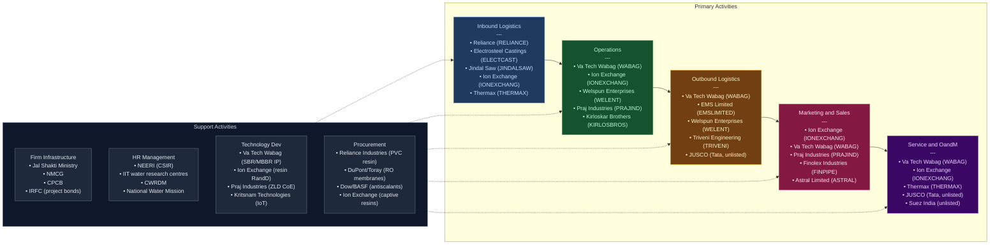

# Water and Related Infrastructure & Ancillary — India Value Chain Analysis

**Date:** June 2026
**Frameworks:** Porter's Value Chain · Porter's Five Forces · Gereffi's GVC · Linkages & Leverage · Blue Ocean (Four Actions)
**Scope:** Water treatment (drinking water + wastewater) · Water supply infrastructure (pipes, pumps, valves) · Irrigation · Desalination · Sewage treatment plants (STPs) · Effluent treatment plants (ETPs) · Water technology / analytics

---

## 0. Segment Definition

### Precise Boundary

This analysis covers the full spectrum of water and related infrastructure in India:

1. **Drinking water treatment and supply** — raw water intake, treatment (coagulation, flocculation, filtration, disinfection), storage, and last-mile distribution through piped networks
2. **Wastewater / sewage treatment** — collection networks (sewer lines), Sewage Treatment Plants (STPs) using technologies such as Sequential Batch Reactors (SBR), Moving Bed Biofilm Reactors (MBBR), Membrane Bioreactor (MBR), and constructed wetlands
3. **Industrial effluent treatment** — Effluent Treatment Plants (ETPs), Zero Liquid Discharge (ZLD) systems, Common Effluent Treatment Plants (CETPs) for industrial clusters
4. **Desalination** — Reverse Osmosis (RO) and Multi-Stage Flash (MSF) for seawater and brackish water; primarily coastal and water-stressed geographies
5. **Water supply infrastructure** — PVC/HDPE/DI pipes, water pumps, valves, flow meters, storage tanks, water towers
6. **Irrigation infrastructure** — micro-irrigation (drip + sprinkler), canal-lining, lift irrigation, water-efficient systems for agriculture
7. **Water technology and analytics** — IoT-enabled smart meters, SCADA/telemetry, Non-Revenue Water (NRW) reduction, water quality monitoring, digital twin of water networks

### Core Product/Service Flow

```mermaid
flowchart LR
    A["🌊 Raw Water Source\nrivers / groundwater / sea"] --> B["🔬 Intake and Pre-Treatment\nscreening / settling"] --> C["🏭 Treatment Plant\nchemical / biological / membrane"] --> D["🚰 Storage and Pumping\nreservoirs / pump stations"] --> E["🔩 Distribution Network\npipes / valves / meters"] --> F["👤 End User\nmunicipal / industry / agriculture"] --> G["🏗️ Wastewater Collection\nsewers / drains"] --> H["⚗️ STP / ETP / ZLD Plant\nbiological / chemical treatment"] --> I["♻️ Treated Effluent\ndisposal / reuse / irrigation"]
    style A fill:#1e293b,stroke:#64748b,color:#e2e8f0
    style B fill:#1e3a5f,stroke:#3b82f6,color:#bfdbfe
    style C fill:#14532d,stroke:#22c55e,color:#bbf7d0
    style D fill:#713f12,stroke:#f59e0b,color:#fef3c7
    style E fill:#831843,stroke:#ec4899,color:#fce7f3
    style F fill:#3b0764,stroke:#a855f7,color:#e9d5ff
    style G fill:#1e3a5f,stroke:#3b82f6,color:#bfdbfe
    style H fill:#14532d,stroke:#22c55e,color:#bbf7d0
    style I fill:#713f12,stroke:#f59e0b,color:#fef3c7
```

### End Customer and What They Value Most

| Customer Segment | Primary Value Driver |
|---|---|
| Urban Local Bodies (ULBs) / municipal corporations | Lowest lifecycle cost, reliable uptime, regulatory compliance |
| State water utilities (e.g., TWAD, BWSSB, DJB) | Turnkey EPC execution, O&M capability, financial structuring |
| Industries (pharma, textiles, steel, food) | ZLD compliance, CPCB discharge norm adherence, water reuse ratio |
| Farmers / irrigation departments | Cost per unit water delivered, ease of operation, subsidy compatibility |
| Real estate / SEZ developers | Packaged STP units, fast installation, regulatory clearance support |

### India's Global Position

**Challenger / Emerging** — India is a fast-growing market (one of the world's largest by project pipeline) and is developing genuine technology capability (Va Tech Wabag, Ion Exchange), but is largely a **technology importer** for high-end membranes, sensors, and proprietary processes. India is moving up from pure EPC execution toward technology licensing and O&M. In desalination and smart water analytics, India remains a **follower**; in large-scale turnkey EPC and frugal-engineering solutions, it is a **challenger** globally.

---

## 1. Value Chain Map — Primary Activities

### Activity 1: Inbound Logistics

**What it involves:**
Procurement and receipt of raw materials and components that go into constructing and operating water infrastructure: steel and ductile iron (for pipes, tanks, structures), PVC/HDPE polymer resin (for pipes and fittings), chemicals (alum, ferric chloride, chlorine, polyelectrolytes, ion exchange resins), membranes (RO, UF, MBR), pumps, blowers, electrical panels, SCADA hardware, and civil construction materials (cement, reinforcement steel, aggregates).

**Key cost drivers:**
- Polymer (PVC/HDPE) resin costs — highly volatile, linked to crude oil and domestic PVC production (Reliance Industries is the dominant domestic supplier)
- Chemical costs for treatment (alum, chlorine) — largely commodity, but quality-critical
- RO membranes — 80%+ imported from USA/China (DuPont Water Solutions, Toray, Hydranautics); high foreign exchange exposure
- Steel and ductile iron pipes — domestic supply largely adequate (Electrosteel Castings, Jindal Saw)
- Blowers, aerators, and diffusers for biological treatment — partially imported

**Differentiation drivers:**
- Localisation of membrane manufacturing (currently minimal in India)
- Assured chemical supply chains and in-house chemical manufacturing (Ion Exchange has this moat)
- Integrated procurement for large EPC players creates scale advantage

**Indian players active here:**
- **Reliance Industries (NSE: RELIANCE)** — dominant domestic PVC resin supplier; effectively sets floor cost for PVC pipe manufacturers
- **Electrosteel Castings (NSE: ELECTCAST)** — ductile iron (DI) pipes for water mains
- **Jindal Saw (NSE: JINDALSAW)** — DI pipes, large-diameter LSAW pipes for water transmission
- **Ion Exchange India (NSE: IONEXCHANG)** — manufactures ion exchange resins and chemicals domestically; captive supply advantage
- **Thermax (NSE: THERMAX)** — manufactures some in-house equipment (boilers, heat exchangers, some water treatment kit)
- Importers of RO membranes: multiple trading houses; no major domestic membrane manufacturer of scale

---

### Activity 2: Operations

**What it involves:**
This is the heart of the value chain — designing, engineering, constructing, commissioning, and operating water and wastewater infrastructure. It breaks into three sub-types:

**A. EPC / Turnkey Project Execution** (Construction phase)
Design, civil works, mechanical and electrical installation, commissioning of WTPs, STPs, ETPs, ZLD plants, desalination plants, and water supply schemes. This is where most listed Indian companies earn the bulk of their revenue.

**B. Equipment Manufacturing** (Capital goods sub-segment)
Manufacturing of pumps, valves, pipes, water meters, packaged STP units, chemical dosing systems, and specialty membranes. This is a separate, higher-margin, capital-intensive sub-segment.

**C. O&M / Operations Management** (Post-construction, recurring)
Long-term operation and maintenance contracts (typically 5–15 years) for treated water quality, uptime SLAs, chemical management, and sludge disposal. Increasingly bundled with EPC under DBOOT / HAM structures.

**Key cost drivers for EPC:**
- Civil works (50–60% of project cost) — highly labour-intensive; local sub-contracting risk
- Equipment procurement (20–30%) — international sourcing for high-end kit
- Working capital cycle — government project delays, retention money, mobilisation advance recovery
- Engineering/design capability — proprietary process licences vs. sub-licences from global technology firms

**Differentiation drivers:**
- Proprietary process technology (WABAG owns several patented processes; Ion Exchange has MBR expertise)
- Track record of large-scale (>100 MLD) plant execution — essential for municipal bids
- Qualified EPC contractor status under Jal Shakti Ministry / NMCG empanelment
- Integrated O&M capability enabling lifecycle contracts

**Indian companies active here:**

*EPC / Integrated treatment:*
- **Va Tech Wabag (NSE: WABAG)** — India's premier water and wastewater EPC + technology company; FY26 revenue ~₹3,944 Cr; order book ₹17,235 Cr
- **Ion Exchange India (NSE: IONEXCHANG)** — water treatment EPC + chemicals + consumer products; FY25 revenue ₹2,591 Cr
- **Thermax (NSE: THERMAX)** — water and environment division within a ₹10,389 Cr (FY25) industrial conglomerate
- **Praj Industries (NSE: PRAJIND)** — ZLD, industrial wastewater and bioethanol; strong in zero liquid discharge; FY25 revenue ₹3,228 Cr
- **EMS Limited (NSE: EMSLIMITED)** — specialist municipal STP/WTP EPC; FY25 revenue ~₹955 Cr; order book ~₹2,388 Cr
- **Triveni Engineering & Industries (NSE: TRIVENI)** — large STP EPC (Namami Gange, Yamuna AP); water and wastewater division within ₹5,747 Cr (FY25) company
- **Welspun Enterprises (NSE: WELENT)** — HAM/EPC water infra; FY25 revenue ₹3,584 Cr; water segment ~64% of order book ₹13,665 Cr
- **NCC Limited (NSE: NCC)** — diversified infrastructure; water segment growing under JJM
- **L&T (NSE: LT)** — water and effluent treatment division; massive scale but water is a small % of overall ₹2.4 lakh Cr revenue
- **Tata Projects** (unlisted, subsidiary of Tata Sons) — large-scale water and sanitation EPC

*Equipment manufacturing (pumps):*
- **Kirloskar Brothers (NSE: KIRLOSBROS)** — India's largest pump manufacturer for water/irrigation; FY25 revenue ₹4,492 Cr
- **KSB Limited (NSE: KSB)** — pumps and valves for water, power, and industry; FY25 revenue ₹2,696 Cr
- **Grundfos India** (unlisted, Danish MNC subsidiary) — energy-efficient pumps for water utilities

*Equipment manufacturing (pipes):*
- **Finolex Industries (NSE: FINPIPE)** — India's largest PVC pipe maker; FY25 revenue ₹4,142 Cr (65% agri irrigation)
- **Prince Pipes & Fittings (NSE: PRINCEPIPE)** — PVC/CPVC/HDPE pipes; FY26 Q4 revenue ₹850 Cr quarterly run rate
- **Astral Limited (NSE: ASTRAL)** — pipes and adhesives; strong plumbing and water supply segment
- **Jain Irrigation Systems (NSE: JISLJALEQS)** — world's second-largest micro-irrigation company; TTM revenue ~₹6,379 Cr
- **Electrosteel Castings (NSE: ELECTCAST)** — ductile iron pipes for water mains and sewerage
- **Jindal Saw (NSE: JINDALSAW)** — LSAW, SAW, and DI pipes; large diameter transmission mains

*Equipment manufacturing (valves, meters):*
- **Indian Hume Pipe Company (NSE: INDHUMPIP)** — hume pipes, pressure pipes; water networks
- L&T Valves (unlisted division of L&T)

---

### Activity 3: Outbound Logistics

**What it involves:**
Delivery of completed water infrastructure to the client — typically phased commissioning of plants, pipelines, and networks; handing over of as-built documentation; commencement of O&M; and ensuring reliable treated water output meets specified quality standards (BIS IS:10500 for drinking water; CPCB discharge norms for effluents).

**Key cost drivers:**
- Last-mile pipe-laying and civil works in congested urban areas (road restoration, traffic management)
- Commissioning and testing of multiple interconnected systems
- Logistics for heavy equipment (pumps, blowers, tanks) to remote sites (tribal areas, hills)
- Defect liability period management (typically 1–2 years post-commissioning)

**Differentiation drivers:**
- Speed of commissioning (critical for government timelines under JJM/AMRUT 2.0)
- Quality of O&M transition — companies that stay on post-construction (DBOOT model) earn annuity income and retain IP
- Geographic reach — companies with strong regional subcontractor networks (especially for rural JJM work) execute faster

**Indian players active here:**
- All major EPC players manage their own outbound logistics and commissioning (WABAG, EMS, Welspun, Triveni)
- **JUSCO (Jamshedpur Utilities & Services Company)** (unlisted, Tata subsidiary) — exemplar O&M operator managing 24x7 water supply in Jamshedpur; a benchmark for urban water utility management

---

### Activity 4: Marketing & Sales

**What it involves:**
Water infrastructure is almost entirely a **B2G (Business to Government)** industry for the municipal segment. Sales involves:
- Pre-bid relationship management with state governments, ULBs, state water boards
- Bid engineering — technical and commercial structuring of tender responses
- DPR (Detailed Project Report) preparation — often companies invest in unpaid pre-work to shape tenders
- For industrial clients (ETPs, ZLD): solutions selling to plant heads, procurement, and environment officers; CPCB/state pollution board compliance is the trigger
- For consumer water purifiers: consumer brand marketing (Ion Exchange's ZeroB brand, A O Smith, Eureka Forbes)

**Key cost drivers:**
- Bid preparation and tendering costs (significant for large EPC)
- Relationship management and business development (BD) costs
- Agents and channel partners for industrial and semi-urban water purifier segment

**Differentiation drivers:**
- Technology credibility — proprietary processes, references from marquee projects (e.g., WABAG's Chennai desalination plant, Namami Gange STPs)
- Financial strength — ability to provide bank guarantees, performance bonds; balance sheet quality matters for government clients
- Political/geographic relationships — state-specific presence

**Indian players active here:**
- **Ion Exchange (NSE: IONEXCHANG)** — strong in both institutional B2G sales and consumer ZeroB brand; integrated BD team
- **Va Tech Wabag (NSE: WABAG)** — international BD offices; strong in Middle East, Africa, Southeast Asia for export orders
- **Praj Industries (NSE: PRAJIND)** — technology-led sales model; ZLD brand well-regarded with industrial clients
- **Finolex Industries, Astral, Prince Pipes** — trade channel and distribution-driven for pipes; ~50,000+ dealer/retailer networks for agriculture and plumbing

---

### Activity 5: Service (O&M and Aftersales)

**What it involves:**
Post-construction operation and maintenance of water and wastewater infrastructure. This is the **fastest-growing and most strategically valuable** part of the chain because:
- O&M revenues are recurring (annuity-like), high-margin, and create switching costs
- Government is increasingly mandating O&M periods of 10–15 years in project contracts (DBOOT model)
- Poorly maintained infrastructure is a massive policy problem — ~40% of India's STP capacity is non-functional due to poor O&M

**Key cost drivers:**
- Skilled manpower for plant operations (chemical engineers, electricians)
- Chemicals and consumables (flocculants, disinfectants, membrane replacement)
- Energy costs (water treatment is extremely energy-intensive — pumping accounts for 60–70% of operating cost)
- Remote monitoring technology (SCADA, sensors) to reduce headcount per plant

**Differentiation drivers:**
- Energy efficiency of treatment processes (WABAG's energy-neutral STP concept)
- Digital monitoring (SCADA + IoT) to reduce O&M costs
- Track record of performance guarantee SLAs

**Indian players active here:**
- **Va Tech Wabag (NSE: WABAG)** — growing O&M book; ~30% of order book from O&M; O&M margins significantly higher than EPC margins
- **Ion Exchange (NSE: IONEXCHANG)** — strong O&M services for industrial clients; also consumer product maintenance
- **JUSCO** (unlisted, Tata) — gold standard for municipal O&M
- **Suez India / Veolia India** (unlisted, global MNC subsidiaries) — niche premium O&M for industrial clients; limited municipal presence
- **Thermax (NSE: THERMAX)** — AMC (Annual Maintenance Contracts) for its industrial water treatment installations

---

## 2. Value Chain Map — Support Activities

### Support Activity 1: Firm Infrastructure (Finance, Legal, Planning, Regulatory)

**Role in this industry:**
Water infrastructure is highly capital-intensive and government-dependent, making firm infrastructure (financial strength, governance, regulatory compliance capability) a decisive competitive factor.

- **Project finance and balance sheet strength:** Large EPC players must provide bid bonds, performance guarantees, and advance bank guarantees on contracts worth ₹100–5,000 Cr. Net cash / low-debt balance sheets are a genuine competitive moat (WABAG is net cash positive with ₹100 Cr debt on a ₹3,944 Cr revenue base)
- **HAM/Annuity financing:** Under HAM (Hybrid Annuity Model) — used by Welspun, NCC, and others — the company funds 40% of project cost upfront and recovers via annuity; this requires strong credit lines and robust financial planning
- **Regulatory compliance:** CPCB effluent norms (updated 2024–25 with stricter nitrogen and phosphorus limits), state PCB (Pollution Control Board) requirements, BIS standards for drinking water quality, Jal Shakti Ministry empanelment norms
- **Working capital management:** Government project delays (GST disputes, LD claims) can severely strain working capital; DSO management is a key risk

**Where Indian firms are strong/weak:**
- WABAG (net cash), Ion Exchange, and Praj are financially clean
- EMS Limited is debt-free with strong cash conversion
- Smaller municipal EPC companies frequently struggle with working capital and debt (historical issue for Jain Irrigation)

**Notable institutions:**
- **Jal Shakti Ministry** — apex body for water policy; administers JJM, NMCG, National Water Mission
- **NMCG (National Mission for Clean Ganga)** — awards Namami Gange STP/riverfront contracts; ₹20,000 Cr+ programme
- **CPCB (Central Pollution Control Board)** — sets effluent discharge standards; drives industrial ETP demand
- **SEBI / NSE / BSE** — listed company governance; many water EPC companies have improved governance post-COVID to access capital markets

---

### Support Activity 2: Human Resource Management

**Role in this industry:**
Water treatment is a complex, multi-disciplinary field requiring:
- **Process engineers** (chemical, environmental) for plant design and operations
- **Civil engineers** for construction and project management
- **Instrumentation and automation engineers** for SCADA, PLCs
- **Domain specialists** in membrane technology, biological treatment, ZLD
- **Field operations staff** — semi-skilled but critical for O&M

**Where Indian firms are strong:**
- India has a large supply of civil and chemical engineers at globally competitive cost — a structural advantage for EPC execution
- IITs (IIT Kanpur, IIT Bombay, IIT Chennai) produce environmental engineering graduates; IITs have dedicated water research centres
- Companies like WABAG and Ion Exchange have built specialised internal technical academies

**Where Indian firms are weak:**
- Shortage of experienced operators for large (>50 MLD) biological treatment plants
- Limited expertise in advanced membrane processes (MBR, forward osmosis, EDR)
- Brain drain — best water engineers often move to global MNCs (Veolia, Xylem, Jacobs)
- Industrial ETP O&M is frequently run with under-qualified staff, leading to compliance failures

**Notable institutions:**
- **NEERI (National Environmental Engineering Research Institute)** — CSIR laboratory; key research partner for water treatment technologies
- **CWRDM (Centre for Water Resources Development and Management)** — Kerala-based R&D
- **National Water Mission** — human capacity building under JJM field testing kit programme (2.48 crore women trained in water quality testing as of FY26)

---

### Support Activity 3: Technology Development

**Role in this industry:**
Technology development determines margin quality and competitive positioning:
- **Process technology** — proprietary biological treatment processes, energy-neutral STPs, ZLD configurations
- **Digital technology** — IoT sensors, SCADA, AI-based NRW reduction, predictive maintenance
- **Material science** — advanced membrane development, anti-scaling coatings
- **Green water technology** — constructed wetlands, nature-based solutions (NbS), biogas recovery from sludge

**Where Indian firms are strong:**
- **Va Tech Wabag** has proprietary SBR, MBBR, and sludge treatment processes; active in AI-driven water demand forecasting
- **Ion Exchange** has in-house ion exchange resin R&D and MBR process capability
- **Praj Industries** has strong R&D in ZLD and biogas recovery from effluent; Centre of Excellence at Pune
- **CSIR-NEERI** patents on low-cost arsenic and fluoride removal for rural water supply

**Where Indian firms are weak:**
- **RO and NF membranes** — no domestic manufacturer of scale; 100% import dependent
- **Smart metering** — Itron, Kamstrup, Xylem Sensus dominate; Indian smart meter startups exist but fragmented
- **Digital twins of water networks** — global leaders (Xylem Sensus, Bentley Systems) dominate; India is an integrator, not a developer
- Minimal R&D spend as a % of revenue (most listed water companies spend <1% revenue on R&D)

**Notable startups / emerging players in water tech:**
- **Kritsnam Technologies** (Kanpur, unlisted) — IoT-based water flow meters for bulk water measurement; government and industrial clients
- **Sattva Water** (unlisted) — AI-based NRW detection analytics
- **Fluid Analytics** (unlisted) — real-time water quality sensors; early stage
- **JioThings / Reliance** — smart water metering solutions for urban utilities (leveraging IoT infrastructure)

---

### Support Activity 4: Procurement

**Role in this industry:**
Strategic procurement determines both cost competitiveness (for EPC) and service reliability (for O&M):
- Bulk procurement of chemicals (alum, chlorine, polyelectrolytes) — Ion Exchange has captive production
- Electrical and mechanical equipment — global sourcing for high-value items (blowers, membrane modules); domestic for civil and structural
- Subcontractor management — civil works are almost always sub-contracted to regional players; quality and timeline depend on subcontractor ecosystem

**Where Indian firms are strong:**
- Scale players like WABAG and Welspun have preferred vendor relationships and volume discounts
- Ion Exchange's backward integration into resins is a sustainable cost advantage

**Where Indian firms are weak:**
- Near-total import dependence for RO membranes (DuPont/FilmTec, Toray, Hydranautics) creates forex exposure and supply chain vulnerability
- Specialty chemicals for ZLD (scale inhibitors, antiscalants) — largely imported from Dow, BASF, Accepta
- Smart sensors and flow meters — mostly imported; no domestic scale manufacturer

---

## 3. Five Forces Analysis

### Force 1: Threat of New Entrants — MEDIUM-LOW

Entry into the water infrastructure EPC segment requires significant capital (bid bonds, working capital), technical credentials (Jal Shakti Ministry empanelment, track record of completed projects of specified capacity), and execution capability. The government's requirement for completion certificates for plants of similar scale (often >50 MLD for large municipal contracts) creates an effective experience barrier that takes 5–10 years to build. In the equipment manufacturing sub-segment (pipes, pumps), entry barriers are moderate — new PVC pipe capacity has been added by players like Supreme Industries and Ashirvad (Aliaxis) — but brand, quality certification, and dealer network create real switching costs. In water technology (IoT/analytics), the barriers are lower, but customer switching costs are high once a municipality deploys a metering system. Overall, the entry barrier is sufficient to protect established players in EPC and O&M, but less effective in commoditised equipment and piping.

### Force 2: Bargaining Power of Suppliers — MEDIUM

Suppliers of RO membranes (DuPont, Toray, Hydranautics) have **high** bargaining power given India's near-total import dependence. Suppliers of PVC resin (dominated by Reliance Industries) have significant market power given their domestic monopoly-like position in PVC. Suppliers of commodity chemicals (alum, lime) have **low** power. Suppliers of pumps and blowers — Kirloskar Brothers, KSB, Flowserve — have moderate power in premium segments. The most strategic supplier vulnerability is in membranes: a disruption to DuPont or Toray supply chains (tariffs, geopolitics) would significantly impact ZLD/RO-based project costs. Overall supplier power is **medium**, weighted higher due to membrane and resin concentration.

### Force 3: Bargaining Power of Buyers — HIGH

The dominant buyer is the Indian government (municipal corporations, state water utilities, central agencies like NMCG). Government buyers possess enormous bargaining power: they control tender specifications (which can favour incumbents or new entrants), payment timelines (delays of 6–24 months are common), and liquidated damages clauses. Competitive bidding (L1 system — lowest cost wins) is the norm for government contracts, severely compressing margins. Industrial buyers (pharma, textiles) have moderate power; they care more about compliance reliability than cost, giving vendors slightly more pricing latitude. Consumer water purifier buyers have **low** individual power but are highly price-sensitive. On balance, government buyer dominance makes this a **high** buyer power segment — the single most important structural challenge for Indian water companies.

### Force 4: Threat of Substitutes — LOW

Water has no substitute — it is the ultimate necessity. However, substitutes exist at the solution level:
- Natural water sources (rivers, groundwater) substitute for treated water supply — but regulatory enforcement is tightening this
- Decentralised/packaged treatment units substitute for centralised large plants — growing threat for small towns and rural applications
- Constructed wetlands and nature-based solutions are lower-cost alternatives to mechanical STPs for small municipalities
- Rainwater harvesting and water recycling reduce demand for freshwater treatment infrastructure

None of these substitutes eliminates the need for water infrastructure at scale; they shift the technology choice. Overall substitution threat is **low** for the infrastructure segment as a whole, though it fragments the market for smaller-scale applications.

### Force 5: Competitive Rivalry — HIGH

The Indian water infrastructure EPC market is highly competitive. At least 15–20 technically qualified EPC companies compete for large government tenders, with several hundred smaller players for sub-₹50 Cr contracts. The L1 competitive bidding system forces price competition with frequently thin margins (EBITDA margins for EPC-only players are 8–12%, versus 12–15% for technology-led companies and 18–25% for O&M-heavy models). Global MNCs (Veolia, Suez, Xylem) have limited direct EPC participation in India but compete in O&M and technology. Chinese competitors (Beijing Origin Water, Sinohydro) are emerging — they have won some large contracts in South Asia. Differentiation through technology, O&M capability, and international project references is the primary escape route from pure price competition.

### Five Forces Summary Table

| Force | Intensity | Key Driver |
|---|---|---|
| Threat of new entrants | Medium-Low | Experience track record + capital + government empanelment |
| Bargaining power of suppliers | Medium | RO membrane import dependence; PVC resin concentration |
| Bargaining power of buyers | High | L1 government tendering; payment delays; specification control |
| Threat of substitutes | Low | Water has no substitute; decentralised options fragment but don't eliminate |
| Competitive rivalry | High | L1 bidding; 15–20 qualified EPC competitors; Chinese pricing pressure |

### Overall Attractiveness Verdict: **MEDIUM**

The sector benefits from a structural, policy-mandated growth driver (₹67,000 Cr JJM allocation FY26, AMRUT 2.0, Namami Gange) and rising industrial demand (ZLD mandates), but structural attractiveness is constrained by dominant government buyer power and intense price-based rivalry; companies that escape into technology and O&M earn structurally superior returns.

---

## 4. GVC Governance & India's Position

### Lead Firms (Global)

The global water industry is governed by a small number of technology and service conglomerates:

| Company | HQ | Role in Global Chain | India Presence |
|---|---|---|---|
| **Veolia Environnement** | France | World's largest water utility + treatment; O&M, technology | Industrial O&M; limited EPC |
| **SUEZ** (now part Veolia ecosystem) | France | Water treatment technology, digital water | Suez India — industrial ETP, STP technology |
| **Xylem Inc.** | USA | Pumps, analytics, smart metering (post-Evoqua + Sensus) | Xylem India — smart meters, pumps |
| **DuPont Water Solutions** | USA | RO/NF/UF membranes — dominant global supplier | Membrane supply to all Indian EPC players |
| **Toray Industries** | Japan | Membranes, water treatment equipment | Supply through trading houses |
| **Pureflow / Jacobs / Stantec** | USA/Canada | Engineering design and project management | Limited — advisory |
| **Va Tech AG (parent)** | Austria | Technology IP (now largely held by Indian-listed WABAG) | Effectively absorbed into WABAG India |

**Lead Firms (India):**
Va Tech Wabag is India's only globally positioned water technology and EPC company. Ion Exchange is the lead firm in Indian industrial water chemistry. Kirloskar Brothers leads in water pumping systems.

### Governance Type: RELATIONAL / CAPTIVE

The India water GVC exhibits **two distinct governance modes:**

1. **Captive governance** (technology stage): Indian EPC companies are captive buyers of global membrane, sensor, and control technology (DuPont, Xylem, Siemens). They have limited ability to switch suppliers without re-qualifying technologies, giving global tech suppliers significant pricing power. This is a structural vulnerability.

2. **Relational governance** (project execution stage): Large projects involve long-term relational contracts between government clients, lead EPC contractors, and sub-contractors. Repeat relationships, trust, and track record dominate over pure market pricing. This is why incumbent WABAG, Ion Exchange, and Triveni win disproportionate share of large government tenders.

3. **Market governance** (pipes/equipment): The PVC pipe and fitting market is effectively a market-governance structure — commodity competition among Finolex, Astral, Prince Pipes, Supreme Industries — with price as the primary differentiator except at the premium branded end.

### Value Capture Map

| Stage | Who captures margin | Geography | Approximate margin range |
|---|---|---|---|
| Membrane/sensor technology | Global MNCs (DuPont, Xylem, Toray) | USA/Europe/Japan | 25–40% EBITDA |
| Process technology licensing | Global/WABAG (partly India) | India/Austria | 20–35% |
| EPC execution | Indian companies | India | 8–13% EBITDA |
| O&M services | Indian + global MNCs | India | 15–22% EBITDA |
| Pipes and fittings manufacturing | Indian companies (Finolex, Astral, Prince) | India | 12–18% EBITDA |
| Pump manufacturing | Indian companies (KBL, KSB) | India | 12–16% EBITDA |
| Civil construction | Sub-contractors (highly fragmented) | India | 5–9% EBITDA |
| Ion exchange chemicals | Ion Exchange India | India | 14–18% EBITDA |

**Key observation:** The highest-value stages (technology licensing, smart sensor hardware, membranes) are almost entirely foreign-captured. India captures value primarily in mid-chain EPC and manufacturing, with O&M growing but still below its potential.

### India's Current Position and Upgrade Trajectory

**Current position:** India occupies the **EPC execution and basic equipment manufacturing** stages of the global water value chain. It is a net importer of high-value technology inputs (membranes, sensors, process licences).

**Upgrade pathway (Gereffi):**

| Upgrade type | Status | Examples |
|---|---|---|
| **Process upgrading** | Well advanced | Indian EPC companies are highly efficient, low-cost executors; WABAG executes globally competitive projects |
| **Product upgrading** | Partially underway | Ion Exchange's resin manufacturing; Praj's ZLD platform; WABAG's proprietary SBR processes |
| **Functional upgrading** | Early stage | WABAG moving into O&M (higher-function, higher-margin); smart water metering startups entering analytics |
| **Chain upgrading** | Nascent | Very limited — no Indian company yet operates as a global technology licensor at scale in water treatment |

**The most important upgrade opportunity** is for India to move into **membrane manufacturing** and **smart water analytics platforms** — currently 100% foreign-controlled segments that define the margin ceiling of the entire chain.

---

## 5. Key Linkages & Leverage Points

### Critical Linkage 1: EPC Execution ↔ O&M Quality

The quality of plant design and construction directly determines O&M cost and reliability over a 15–25 year asset life. Plants built to lowest-cost specifications (L1 bidding pressure) frequently fail within 3–5 years (evidenced by ~40% non-functional STP capacity in India). The **linkage between EPC quality and O&M performance** is the most destructive broken linkage in the Indian water value chain. The DBOOT (Design-Build-Own-Operate-Transfer) and HAM models are structural fixes — companies that win on DBOOT have incentive to build quality, because they bear O&M risk.

**Lever:** Mandate DBOOT/HAM for all government projects above ₹100 Cr — eliminates the incentive to cut construction quality, integrates the EPC-O&M linkage, and shifts risk to the private sector.

### Critical Linkage 2: Technology Development ↔ Procurement (Membrane Independence)

The inability of Indian firms to manufacture RO/NF/MBR membranes domestically creates a permanent cost and supply chain vulnerability. Every water technology company's operational cost is partially set by DuPont/Toray pricing. If India developed domestic membrane manufacturing capability (even at 50% quality parity initially), it would unlock lower project costs, create an export capability, and reduce forex exposure.

**Lever:** PLI (Production Linked Incentive) scheme for advanced water treatment membranes — currently absent, while PLI exists for solar panels, batteries, and electronics. This is the single most impactful policy intervention not yet taken.

### Critical Linkage 3: Operations ↔ Service (Energy Cost)

Water treatment and distribution accounts for **3–4% of India's total electricity consumption** — a massive operating cost for municipal utilities. The linkage between plant design (operations) and ongoing energy management (service) is poorly optimised. Municipal utilities rarely have energy management capability; they accept whatever energy bill the plant incurs. Companies that can offer **energy-as-a-service or performance contracts** (guarantee energy cost per m³ treated) can monetise this linkage.

**Lever:** Bundled water-energy performance contracts — sell "₹X per KL of treated water" rather than EPC + O&M separately, internalising the energy optimisation incentive.

### Critical Linkage 4: Inbound Logistics (Resin/Chemical Supply) ↔ Industrial ETP Operations

Ion Exchange's ability to manufacture ion exchange resins domestically gives it a linkage advantage: it controls the input cost for its own downstream water treatment solutions. No other Indian water company has replicated this backward integration model across the full treatment chemical suite. The linkage between chemical supply and operational reliability is under-exploited.

**Lever:** M&A or JV between EPC companies and specialty chemical manufacturers (antiscalants, polyelectrolytes) to secure input supply and add a chemical margin layer.

### Critical Linkage 5: Smart Technology (IoT/Analytics) ↔ NRW Reduction

India loses an estimated **30–50% of treated water** through Non-Revenue Water (NRW) — leakage, theft, and accounting losses. The technology to detect and reduce NRW exists (smart flow meters, pressure sensors, AI-based leakage detection). The linkage between technology deployment and water utility savings is powerful but under-monetised because utilities have no incentive to invest if they receive government subsidies regardless of losses.

**Lever:** Performance-based NRW reduction contracts — pay the technology company a share of water savings (volume x marginal cost of water production). This monetises the analytics ↔ operations linkage and creates a viable business model for Indian smart water tech startups.

### Single Highest-Leverage Intervention

**Mandate DBOOT/HAM for all municipal water projects above ₹100 Cr** — This single intervention aligns the currently broken EPC-O&M incentive structure, forces quality construction, creates long-term O&M revenue streams for capable companies, and changes the competitive dynamic from L1 price battles to lifecycle capability assessments. Secondary benefit: it crowds out fly-by-night EPC players, concentrating the market with technically capable, financially strong companies — improving overall sector quality and investor confidence.

---

## 6. Indian Company Landscape

### Listed Companies

| Value chain stage | Company name | Listed? | Exchange & ticker | Business description | Approx. revenue / market cap | Position in chain |
|---|---|---|---|---|---|---|
| **Integrated WTP/STP EPC + Technology** | Va Tech Wabag Ltd | Yes | NSE: WABAG | India's largest water & wastewater EPC + technology company; domestic and international projects | Rev ₹3,944 Cr (FY26); Mkt cap ~₹13,154 Cr | Leader |
| **Integrated WTP/ETP EPC + Chemicals** | Ion Exchange (India) Ltd | Yes | NSE: IONEXCHANG | Water treatment EPC, ion exchange resins, consumer ZeroB purifiers | Rev ₹2,591 Cr (FY25); Mkt cap ~₹5,847 Cr | Leader |
| **Industrial Water / ZLD EPC** | Thermax Ltd | Yes | NSE: THERMAX | Water & environment division within industrial energy conglomerate | Rev ₹10,389 Cr total (FY25); EBITDA ~8.7%; Mkt cap ~₹35,000 Cr | Leader |
| **Industrial ZLD / Wastewater EPC** | Praj Industries Ltd | Yes | NSE: PRAJIND | ZLD systems, industrial effluent treatment, bioethanol; technology-led | Rev ₹3,228 Cr (FY25); Mkt cap ~₹8,500 Cr | Leader |
| **Municipal STP / WTP EPC** | EMS Limited | Yes | NSE: EMSLIMITED | Delhi-based EPC specialist for STPs, WTPs, and sewer networks; govt client | Rev ~₹955 Cr (FY25); Order book ₹2,388 Cr | Challenger |
| **Large STP EPC (Namami Gange)** | Triveni Engineering & Industries | Yes | NSE: TRIVENI | Sugar + water division; large STP turnkey contractor; Yamuna, Ganga projects | Rev ₹5,747 Cr total (FY25); Mkt cap ~₹12,000 Cr | Challenger |
| **Water Infra EPC / HAM** | Welspun Enterprises Ltd | Yes | NSE: WELENT | HAM and EPC water projects (JJM, Dharavi WTP); 64% of OB is water | Rev ₹3,584 Cr (FY25); Mkt cap ~₹7,170 Cr | Challenger |
| **Diversified Infra EPC (water)** | NCC Limited | Yes | NSE: NCC | Water supply and sanitation division beneficiary of JJM; diversified EPC | Rev ~₹17,000 Cr total (FY25); Mkt cap ~₹12,000 Cr | Niche |
| **Mega Infra EPC (water division)** | Larsen & Toubro Ltd | Yes | NSE: LT | Water and effluent treatment EPC division; massive scale and balance sheet | Rev ~₹2,40,000 Cr total; Mkt cap ~₹3,60,000 Cr | Leader (segment) |
| **Pumps (water, irrigation, industry)** | Kirloskar Brothers Ltd | Yes | NSE: KIRLOSBROS | India's largest pump manufacturer; water supply, irrigation, power plant cooling | Rev ₹4,492 Cr (FY25); EBITDA ~14%; Mkt cap ~₹8,000 Cr | Leader |
| **Pumps and Valves** | KSB Limited | Yes | NSE: KSB | German-origin pumps and valves; water, power, chemicals | Rev ₹2,696 Cr (FY25); Mkt cap ~₹6,500 Cr | Challenger |
| **PVC Pipes (irrigation + plumbing)** | Finolex Industries Ltd | Yes | NSE: FINPIPE | India's largest PVC pipe manufacturer; 65% agri irrigation; PVC resin also | Rev ₹4,142 Cr (FY25); EBITDA ~14%; Mkt cap ~₹8,500 Cr | Leader |
| **PVC/HDPE Pipes (plumbing + water)** | Prince Pipes & Fittings Ltd | Yes | NSE: PRINCEPIPE | Integrated pipes; agriculture, plumbing, borewell; targeting 12–15% vol growth | Rev ~₹3,200 Cr (FY26E); Mkt cap ~₹3,500 Cr | Challenger |
| **PVC/CPVC Pipes + Adhesives** | Astral Limited | Yes | NSE: ASTRAL | Premium pipes, adhesives; strong plumbing and water supply brand | Rev ~₹5,500 Cr (FY25E); Mkt cap ~₹35,000 Cr | Challenger |
| **Micro Irrigation (drip/sprinkler)** | Jain Irrigation Systems Ltd | Yes | NSE: JISLJALEQS | World's 2nd largest micro irrigation company; PVC pipes + agri services | TTM Rev ~₹6,379 Cr; EBITDA margin ~10.5% (FY25) | Leader |
| **Ductile Iron Pipes** | Electrosteel Castings Ltd | Yes | NSE: ELECTCAST | DI pipes for water mains, sewerage; key supplier to water utilities | Rev ~₹3,500 Cr (FY25E); Mkt cap ~₹5,000 Cr | Leader |
| **Large-diameter Steel/DI Pipes** | Jindal Saw Ltd | Yes | NSE: JINDALSAW | LSAW, SAW, DI pipes; large water transmission mains | Rev ~₹18,000 Cr total; Mkt cap ~₹12,000 Cr | Challenger |
| **Hume Pipes / Pressure Pipes** | Indian Hume Pipe Company | Yes | NSE: INDHUMPIP | RCC hume pipes; storm water drains, culverts, sewer | Rev ~₹900 Cr (FY25E); Mkt cap ~₹1,200 Cr | Niche |

---

### Unlisted / Private Companies

| Value chain stage | Company name | Listed? | Exchange & ticker | Business description | Approx. revenue / market cap | Position in chain |
|---|---|---|---|---|---|---|
| **Municipal Water O&M** | JUSCO (Jamshedpur Utilities & Services Co.) | No (Tata subsidiary) | — | India's benchmark 24x7 piped water O&M operator; Jamshedpur model | Not publicly disclosed | Leader (niche) |
| **Large-scale Water/Infra EPC** | Tata Projects Ltd | No (Tata Sons subsidiary) | — | Mega water infra EPC projects; also nuclear, metro, data centres | Rev ~₹18,000 Cr (FY25E) | Challenger |
| **Industrial Water O&M / Technology** | Suez India Pvt Ltd | No (Veolia-SUEZ subsidiary) | — | Industrial ETP/STP O&M; technology licensing from global SUEZ | Not publicly disclosed | Niche |
| **Premium Pumps (Energy Efficient)** | Grundfos India Pvt Ltd | No (Danish MNC) | — | Energy-efficient pumps for water utilities, HVAC, industry | Not publicly disclosed | Niche |
| **Smart Water Metering** | Kritsnam Technologies | No (VC-backed startup) | — | IoT-based bulk water flow meters; govt and industrial clients | Early-stage | Emerging |
| **Consumer Water Purifiers** | A O Smith India Pvt Ltd | No (US MNC subsidiary) | — | Premium home water purifiers; growing in urban India | Not publicly disclosed | Niche |
| **Consumer Water Purifiers** | Eureka Forbes Ltd | No (Advent PE-backed) | — | India's largest water purifier brand (Aquaguard); direct sales model | Rev ~₹2,000 Cr (est.) | Leader (consumer) |
| **Desalination EPC** | Megha Engineering & Infrastructures (MEIL) | No (private) | — | Large infra EPC player; growing water + desalination segment | Not publicly disclosed | Emerging |
| **Civil / Water Network Infra** | Vishwa Samudra Engineering | No (private) | — | Specialist water network and sewer EPC for municipal clients | Not publicly disclosed | Niche |
| **Water Treatment Chemicals** | BASF India (chemical division) | Yes (parent listed) | NSE: BASF | Specialty water treatment chemicals — antiscalants, flocculants | Segment revenue not disclosed | Niche |

---

### Notable Companies — Deeper Notes

**Va Tech Wabag (NSE: WABAG)**
- Stage in chain: Integrated technology + EPC + O&M for water and wastewater; primary and service activities
- What makes them interesting: WABAG is India's only globally competitive water technology company, with proprietary processes (patented SBR, MBBR, ZLD configurations) and active projects in 25 countries including India, Saudi Arabia, North Africa, and Southeast Asia. The company is net cash positive at ₹100 Cr debt on a ₹3,944 Cr revenue base — rare in capital-intensive EPC. Its O&M book is growing as a share of total order book (now ~30%), meaningfully improving revenue quality. The ₹17,235 Cr order backlog at 4.4x revenue provides exceptional visibility. New growth vectors include desalination for coastal India and data centre water recycling.
- Key financials: FY26 revenue ₹3,944 Cr (+20% YoY); PAT ₹373 Cr (+27%); EBITDA margin ~13.3%; order book ₹17,235 Cr; market cap ~₹13,154 Cr
- Watch factor: Increasing international order mix (Middle East, Africa) introduces currency and geopolitical risk; execution at scale of 4x revenue coverage book requires tight project management

**Ion Exchange (India) (NSE: IONEXCHANG)**
- Stage in chain: All primary activities — chemicals supply (inbound), EPC (operations), consumer products (marketing), O&M (service)
- What makes them interesting: Ion Exchange is unique in the Indian water sector because of its **vertical integration** — it manufactures ion exchange resins (the raw material) and then uses them in its own water treatment systems and consumer products (ZeroB brand). This gives it a cost moat that pure-play EPC competitors cannot replicate. The three-segment model (Engineering + Chemicals + Consumer) provides a natural hedge: Engineering revenues are lumpy (project-based) but high-value; Chemicals and Consumer are recurring and margin-accretive. The company is a rare combination of industrial B2G and consumer B2C within a single listed entity.
- Key financials: FY25 revenue ₹2,591 Cr (+16% YoY); PAT ₹214 Cr (+5%); market cap ~₹5,847 Cr (as of June 2026)
- Watch factor: Engineering margins are under pressure from L1 competition; the company needs to grow the higher-margin Chemicals and Consumer segments faster

**Kirloskar Brothers (NSE: KIRLOSBROS)**
- Stage in chain: Equipment manufacturing — pumps and fluid management systems; inbound and operations support
- What makes them interesting: Kirloskar Brothers is a 135-year-old institution that is India's largest pump manufacturer. It supplied pumps for the Sardar Sarovar, Indira Gandhi Canal, and numerous water supply schemes. The company has been on a strong recovery — operating margins expanded from 11% (FY23) to 14% (FY25), with PAT nearly doubling. A major beneficiary of JJM and AMRUT 2.0, which mandate pump replacements and new pump stations across thousands of locations. The company also has an international business (South Africa, Middle East) and a premium KSB-grade product range.
- Key financials: FY25 revenue ₹4,492 Cr; PAT ₹419 Cr; EBITDA margin ~14%; market cap ~₹8,000 Cr
- Watch factor: Competition from energy-efficient pump imports (Grundfos, KSB Europe) in premium municipal segment; also monitoring Kirloskar Brothers' ability to transition from project pumps to long-term O&M pump service contracts

**EMS Limited (NSE: EMSLIMITED)**
- Stage in chain: EPC operations — specialist municipal STP, WTP, and sewer network contractor
- What makes them interesting: EMS is a focused, debt-free municipal water EPC company that has built a niche in sewage treatment under NMCG (Namami Gange) and state pollution control programmes. Its order book of ₹2,388 Cr (~2.5x revenues) with a recent ₹782 Cr KMC contract for Kolkata demonstrates growing municipal trust. Being debt-free in a capital-intensive EPC sector is a significant competitive differentiator — it can bid confidently without working capital stress. Profit CAGR of 20.4% over five years reflects disciplined execution.
- Key financials: FY25 revenue ~₹955 Cr; order book ~₹2,388 Cr; CAGR PAT growth 20.4% (5 years); debt-free
- Watch factor: Concentration in municipal government clients creates revenue lumpiness; scalability beyond ₹2,000 Cr revenue requires expanding geography and industrial client base

**Welspun Enterprises (NSE: WELENT)**
- Stage in chain: Water infrastructure EPC and HAM; large-scale water supply and wastewater treatment
- What makes them interesting: Welspun Enterprises has repositioned from a roads-and-infra company to a **water-first infrastructure developer**. Water now represents ~64% of its ₹13,665 Cr order book, anchored by its single-largest-ever order of ₹4,636 Cr from BMC for the Dharavi Wastewater Treatment Facility. The HAM model suits Welspun's balance sheet strength (Welspun Group backing) — it can fund 40% upfront and earn annuity income over 15 years. FY25 EBITDA margin of 20.4% is exceptional for an EPC company, reflecting the annuity income from HAM projects.
- Key financials: FY25 revenue ₹3,584 Cr (+25% YoY); EBITDA ₹730 Cr (20.4% margin); PAT ₹354 Cr; market cap ~₹7,170 Cr; order book ₹13,665–14,800 Cr
- Watch factor: Heavy reliance on Maharashtra (BMC) creates geographic concentration; monitor state government payment discipline for HAM annuity cash flows

**Praj Industries (NSE: PRAJIND)**
- Stage in chain: Industrial ZLD and wastewater EPC + technology; process innovation
- What makes them interesting: Praj is India's only technology company that has credibly combined **industrial wastewater treatment with biogas/bioenergy recovery**. Its Centre of Excellence in Pune develops process technologies for ZLD with >98% water and resource recovery — a technically differentiated position versus pure EPC players. Praj benefits from CPCB's increasingly stringent ZLD mandates (now covering textiles, tanneries, sugar, dairy, pharmaceuticals), which are driving a massive replacement and upgrade cycle in industrial ETPs. The company also has a growing international business and is exploring circular economy water solutions.
- Key financials: FY25 revenue ₹3,228 Cr; diversified across bioethanol, water, and HiPurity; EBITDA margins ~12–14%; market cap ~₹8,500 Cr
- Watch factor: Praj's water segment competes with Thermax and WABAG for large industrial contracts; bioethanol remains the dominant segment, so watch for water segment share growing as ZLD mandates tighten

---

## 7. Strategic Insight

### What the Chain Analysis Reveals (Non-Obvious)

The conventional view of India's water sector is that it is a government-dependent, low-margin EPC commodity business. The value chain analysis reveals a more nuanced reality: **the sector is bifurcating into two structurally different businesses** that happen to share the same customer and the same pipes. The first is the construction-led, L1-bid-driven EPC business — low margin, high capital, government payment risk, little differentiation. The second is an emerging **water-as-a-service (WaaS) model** — technology-led, O&M-backed, recurring revenue, high margin, scalable — represented by WABAG's growing O&M book, Welspun's HAM annuity income, and Ion Exchange's resin + service model. The highest value creation opportunity for Indian water companies in the next decade is not to win more EPC tenders; it is to convert EPC tenders into long-term service relationships.

A second non-obvious insight: **the real competitive threat is not domestic EPC companies but the global membrane and sensor technology stack**. Every Indian water treatment plant is dependent on membranes from DuPont, Toray, or Hydranautics. As ZLD mandates proliferate and desalination scales, India's membrane import bill will grow to billions of dollars annually. The company — or consortium — that first manufactures acceptable-quality RO/NF membranes domestically at scale will not only capture massive domestic value but will have a globally competitive cost structure for export.

### Blue Ocean Opportunity — Four Actions Framework

**Eliminate:**
- Eliminate the lowest-cost-bidder (L1) selection criterion for government projects above ₹100 Cr. Replace with a lifecycle cost evaluation (capital cost + 15-year O&M cost + energy cost) — this eliminates the race to the bottom and the perpetual cycle of under-built, under-maintained infrastructure.

**Reduce:**
- Reduce the complexity and timeline of environmental clearance for STP and WTP projects — currently 18–36 months for large plants; this delays urgently needed infrastructure and inflates costs without improving environmental outcomes.
- Reduce the number of technology vendors per project by allowing companies to deploy proprietary integrated solutions rather than forcing disaggregated procurement.

**Raise:**
- Raise the mandated minimum O&M period from the current 5-year norm to 15 years on all government water projects — this structurally shifts incentives toward quality construction and long-term performance.
- Raise the data transparency requirement for municipal water utilities: mandate public disclosure of NRW rates, treatment plant efficiency, and water quality by ULBs — creating market pull for smart water technology.

**Create:**
- Create a **Water Technology PLI Scheme** for domestic manufacturing of RO/NF membranes, smart flow meters, and water quality sensors — currently absent while PLI exists for 13 other sectors. This is the single biggest uncaptured value creation opportunity in the Indian water chain.
- Create **NRW performance contracts** (pay-per-KL-of-water-saved model) as a new business model for smart water analytics companies — currently no viable commercial structure exists for this market.

### Top 3 Priorities for an Indian Firm Seeking Durable Advantage

1. **Build and protect an O&M book equal to at least 50% of EPC revenue.** The structural shift from lump-sum EPC to DBOOT/HAM contracts means the most durable advantage is a long-term O&M client relationship. Win the EPC contract, then negotiate O&M extensions. WABAG's ~30% O&M share is the direction of travel; companies that reach 50%+ O&M mix will trade at meaningfully higher multiples.

2. **Acquire or develop a proprietary technology position in at least one high-value process.** Whether it is a patented ZLD configuration (like Praj), an integrated resin-to-solution model (like Ion Exchange), or proprietary SBR/MBR processes (like WABAG), technology ownership determines pricing power and international export capability. Companies without proprietary technology will remain dependent on government order flow and trapped in L1 competition.

3. **Invest in digital water analytics and smart O&M capability now, before scale mandates it.** The next Jal Jeevan Mission (JJM 2.0, post-2028) and AMRUT 3.0 will likely mandate NRW reduction targets, smart metering, and remote monitoring — creating a massive demand for integrated digital water management. The companies that build this capability now (SCADA integration, IoT sensor deployment, AI-based leak detection) will be the preferred partners for performance-based government contracts in the 2028–2035 window.

---

*Analysis prepared June 2026. Sources: Va Tech Wabag FY26 Investor Meet; Ion Exchange India FY25 Annual Report; EMS Limited company filings; Welspun Enterprises FY25 Annual Report; Kirloskar Brothers FY25 Results; Praj Industries Q4 FY25 Results; Jal Jeevan Mission PIB data (October 2025); Budget 2025–26 JJM allocation data; AMRUT 2.0 progress reports (MoHUA, August 2025); Mordor Intelligence India Desalination Market Report 2025; India Water Portal Budget analysis; AngelOne water treatment sector report March 2025.*

---

## 8. Value Chain Diagram

### Margin capture by stage

| Stage | Margin Level | Primary Capturer |
|---|---|---|
| Inbound Logistics | Low | Commodity suppliers (steel, chemicals); RO membrane importers earn high margins but are foreign (DuPont, Toray) |
| Operations | Medium (8-13% EBITDA for EPC; 12-18% for equipment OEMs) | Va Tech Wabag, Ion Exchange, Kirloskar Brothers, Finolex |
| Outbound Logistics | Low | EPC contractors manage own commissioning; no standalone high-margin logistics player |
| Marketing and Sales | Low-Medium | Primarily cost centre for B2G EPC; Ion Exchange earns better margins via ZeroB consumer brand |
| Service and OandM | High (15-25% EBITDA) | Va Tech Wabag (O and M book), Ion Exchange (industrial O and M), JUSCO (municipal O and M) |
